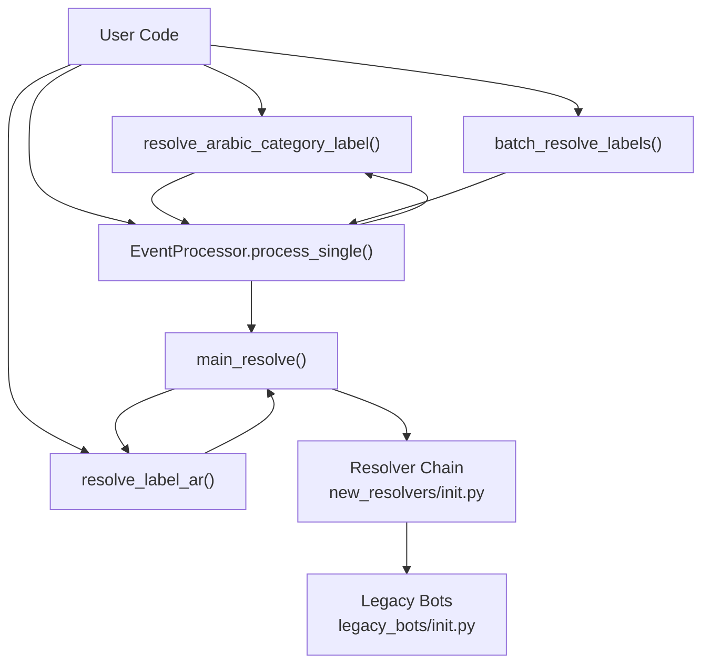
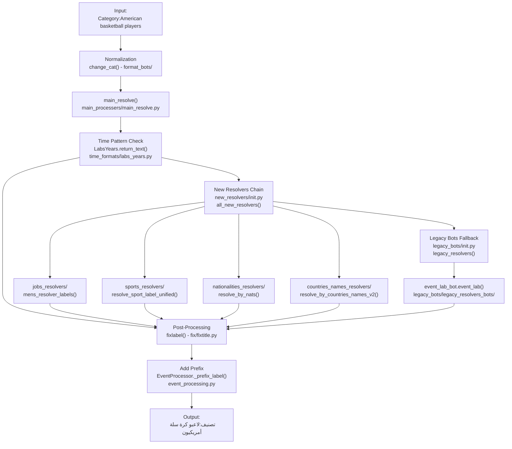

# Getting Started

> **Relevant source files**
> * [.github/copilot-instructions.md](../.github/copilot-instructions.md)
> * [.github/workflows/python-publish.yml](../.github/workflows/python-publish.yml)
> * [ArWikiCats/config.py](../ArWikiCats/config.py)
> * [ArWikiCats/legacy_bots/__init__.py](../ArWikiCats/legacy_bots/__init__.py)
> * [ArWikiCats/legacy_bots/legacy_resolvers_bots/country2_label_bot.py](../ArWikiCats/legacy_bots/legacy_resolvers_bots/country2_label_bot.py)
> * [ArWikiCats/legacy_bots/legacy_resolvers_bots/event_lab_bot.py](../ArWikiCats/legacy_bots/legacy_resolvers_bots/event_lab_bot.py)
> * [ArWikiCats/legacy_bots/legacy_resolvers_bots/with_years_bot.py](../ArWikiCats/legacy_bots/legacy_resolvers_bots/with_years_bot.py)
> * [ArWikiCats/legacy_bots/legacy_resolvers_bots/year_or_typeo.py](../ArWikiCats/legacy_bots/legacy_resolvers_bots/year_or_typeo.py)
> * [ArWikiCats/legacy_bots/legacy_utils/fixing.py](../ArWikiCats/legacy_bots/legacy_utils/fixing.py)
> * [ArWikiCats/legacy_bots/make_bots/check_bot.py](../ArWikiCats/legacy_bots/make_bots/check_bot.py)
> * [ArWikiCats/legacy_bots/make_bots/table1_bot.py](../ArWikiCats/legacy_bots/make_bots/table1_bot.py)
> * [CLAUDE.md](../CLAUDE.md)
> * [README.md](../README.md)
> * [changelog.md](../changelog.md)
> * [examples/run.py](../examples/run.py)
> * [tests_require_fixes/test_papua_new_guinean.py](../tests_require_fixes/test_papua_new_guinean.py)
> * [tests_require_fixes/test_skip_data_all.py](../tests_require_fixes/test_skip_data_all.py)
> * [tests_require_fixes/text_to_fix.py](../tests_require_fixes/text_to_fix.py)

This page provides a quick-start guide for using ArWikiCats to translate English Wikipedia category labels to Arabic. It covers installation, the main public API functions, and common usage patterns with practical examples.

For an architectural overview of how the translation system works internally, see [Architecture](2.Architecture.md). For details on the translation data structure, see [Translation Data](6.Translation-Data.md)

---

## Prerequisites

* **Python 3.10 or higher**
* **Operating System**: Windows, macOS, or Linux

**Sources:** [README.md L1-L7](../README.md#L1-L7), [pyproject.toml](../pyproject.toml)

---

## Installation

### Method 1: Install from PyPI (Recommended)

```
pip install ArWikiCats --pre
```

This installs the latest pre-release version from the Python Package Index.

### Method 2: Install from Source

```
git clone https://github.com/ArWikiCats/ArWikiCats.git
cd ArWikiCats
pip install -r requirements.in
```

Installing from source is useful for development or when you need the absolute latest changes.

**Sources:** [README.md L149-L167](../README.md#L149-L167)

---

## Quick Start: Your First Translation

Before diving into the API details, here's a simple example to get started immediately:

```python
from ArWikiCats import resolve_arabic_category_label

# Translate a single category
result = resolve_arabic_category_label("Category:American basketball players")
print(result)
# Output: تصنيف:لاعبو كرة سلة أمريكيون
```

That's it! The system automatically:

1. Normalizes the input text
2. Identifies the pattern (nationality + sport + job)
3. Applies the appropriate resolver ([ArWikiCats/new_resolvers/sports_resolvers/](../ArWikiCats/new_resolvers/sports_resolvers/) )
4. Formats the Arabic output with proper grammar
5. Adds the `تصنيف:` prefix

**Sources:** [README.md L174-L180](../README.md#L174-L180), [examples/run.py L1-L48](../examples/run.py#L1-L48)

---

## API Functions

ArWikiCats provides four main functions for category translation, each optimized for different use cases:

**API Function Overview:**

| Function | Purpose | Returns | Prefix Added |
| --- | --- | --- | --- |
| `resolve_label_ar()` | Core translation (text only) | `str` | No |
| `resolve_arabic_category_label()` | Full processing | `str` | Yes |
| `batch_resolve_labels()` | Multiple categories | `BatchResult` | Yes |
| `EventProcessor.process_single()` | Detailed metadata | `ProcessingResult` | Configurable |

**API Call Flow:**



All four functions ultimately call `main_resolve()` from [ArWikiCats/main_processers/main_resolve.py](../ArWikiCats/main_processers/main_resolve.py)

 which orchestrates the resolver chain.

**Sources:** [ArWikiCats/__init__.py L1-L50](../ArWikiCats/__init__.py#L1-L50), [ArWikiCats/event_processing.py L1-L100](../ArWikiCats/event_processing.py#L1-L100), [ArWikiCats/main_processers/main_resolve.py L1-L100](../ArWikiCats/main_processers/main_resolve.py#L1-L100)

---

## Basic Usage: Single Category Translation

### Option 1: resolve_label_ar() - Translation Only

Use this when you only need the translated text without the prefix:

```python
from ArWikiCats import resolve_label_ar

# Returns only the translated text
label = resolve_label_ar("American basketball players")
print(label)
# Output: لاعبو كرة سلة أمريكيون

# Strips "Category:" prefix if present
label = resolve_label_ar("Category:2015 in Yemen")
print(label)
# Output: 2015 في اليمن
```

This function calls `main_resolve()` directly from [ArWikiCats/main_processers/main_resolve.py L1-L50](../ArWikiCats/main_processers/main_resolve.py#L1-L50)

 and returns the raw Arabic label.

**Sources:** [README.md L206-L214](../README.md#L206-L214), [ArWikiCats/main_processers/main_resolve.py L1-L50](../ArWikiCats/main_processers/main_resolve.py#L1-L50)

### Option 2: resolve_arabic_category_label() - Complete Label

Use this for the full category label with the Arabic prefix:

```python
from ArWikiCats import resolve_arabic_category_label

# Returns full category with prefix
label = resolve_arabic_category_label("Category:2015 in Yemen")
print(label)
# Output: تصنيف:2015 في اليمن

# Works without the English prefix too
label = resolve_arabic_category_label("Belgian cyclists")
print(label)
# Output: تصنيف:دراجون بلجيكيون
```

This function uses `EventProcessor` from [ArWikiCats/event_processing.py L1-L200](../ArWikiCats/event_processing.py#L1-L200)

 internally and adds the `تصنيف:` prefix via `_prefix_label()`.

**Recommended**: Use this function for bot operations and Wikipedia integration.

**Sources:** [README.md L174-L180](../README.md#L174-L180), [ArWikiCats/event_processing.py L1-L200](../ArWikiCats/event_processing.py#L1-L200)

---

## Batch Processing

### Using batch_resolve_labels()

Process multiple categories efficiently and get detailed statistics:

```python
from ArWikiCats import batch_resolve_labels

categories = [
    "Category:2015 American television",
    "Category:1999 establishments in Europe",
    "Category:Belgian cyclists",
    "Category:American basketball coaches",
]

result = batch_resolve_labels(categories)

# Access results
print(f"Successfully translated: {len(result.labels)}")
print(f"Failed to translate: {len(result.no_labels)}")
print(f"Category patterns found: {result.category_patterns}")

# Iterate through translations
for english, arabic in result.labels.items():
    print(f"{english} → {arabic}")
```

**Output structure:**

```css
BatchResult(
    labels={
        "Category:2015 American television": "تصنيف:التلفزة الأمريكية في 2015",
        "Category:Belgian cyclists": "تصنيف:دراجون بلجيكيون",
        # ...
    },
    no_labels=[
        # Categories that couldn't be translated
    ],
    category_patterns={
        "year": 1,
        "nationality": 2,
        # Pattern counts
    }
)
```

**Sources:** [README.md L184-L204](../README.md#L184-L204), [ArWikiCats/event_processing.py](../ArWikiCats/event_processing.py)

---

## Detailed Processing with EventProcessor

For advanced use cases requiring processing metadata, use the `EventProcessor` class directly:

```python
from ArWikiCats import EventProcessor

processor = EventProcessor()
result = processor.process_single("Category:British footballers")

# Access detailed information
print(f"Original: {result.original}")
print(f"Normalized: {result.normalized}")
print(f"Raw label: {result.raw_label}")
print(f"Final label: {result.final_label}")
print(f"Has label: {result.has_label}")
```

**`ProcessingResult` attributes:**

| Attribute | Type | Description |
| --- | --- | --- |
| `original` | `str` | Original input string |
| `normalized` | `str` | Normalized category text |
| `raw_label` | `str` | Translated text without prefix |
| `final_label` | `str` | Complete Arabic category label |
| `has_label` | `bool` | Whether translation succeeded |

**Sources:** [README.md L216-L229](../README.md#L216-L229), [ArWikiCats/event_processing.py](../ArWikiCats/event_processing.py)

---

## How Translation Works: Complete Data Flow

The following diagram shows the complete pipeline from input to output with actual code references:

**Translation Pipeline with Code Entities:**



**Key Processing Steps:**

1. **Normalization** - `change_cat()` from [ArWikiCats/format_bots/__init__.py](../ArWikiCats/format_bots/__init__.py)  strips prefixes and normalizes spacing
2. **Main Resolution** - `main_resolve()` from [ArWikiCats/main_processers/main_resolve.py L29-L57](../ArWikiCats/main_processers/main_resolve.py#L29-L57)  orchestrates the resolver chain
3. **Time Detection** - `LabsYears.return_text()` from [ArWikiCats/time_formats/labs_years.py](../ArWikiCats/time_formats/labs_years.py)  checks for year patterns first
4. **Specialized Resolvers** - `all_new_resolvers()` from [ArWikiCats/new_resolvers/__init__.py L29-L57](../ArWikiCats/new_resolvers/__init__.py#L29-L57)  tries jobs → sports → nationalities → countries in order
5. **Legacy Fallback** - `legacy_resolvers()` from [ArWikiCats/legacy_bots/__init__.py L66-L97](../ArWikiCats/legacy_bots/__init__.py#L66-L97)  handles remaining patterns
6. **Post-Processing** - `fixlabel()` from [ArWikiCats/fix/fixtitle.py](../ArWikiCats/fix/fixtitle.py)  applies Arabic grammar rules
7. **Prefix Addition** - `EventProcessor._prefix_label()` from [ArWikiCats/event_processing.py](../ArWikiCats/event_processing.py)  adds `تصنيف:`

**Example: "American basketball players"**

* Normalized to `"american basketball players"`
* No time pattern detected
* `all_new_resolvers()` tries resolvers in priority order
* `resolve_sport_label_unified()` matches pattern: `{nationality} {sport} players`
* Lookups: "american" → "أمريكيون", "basketball" → "كرة سلة", "players" → "لاعبو"
* Template applied: `"لاعبو {sport} {nationality}"` → `"لاعبو كرة سلة أمريكيون"`
* `fixlabel()` verifies grammar
* Output: `"تصنيف:لاعبو كرة سلة أمريكيون"`

**Sources:** [ArWikiCats/main_processers/main_resolve.py L1-L100](../ArWikiCats/main_processers/main_resolve.py#L1-L100), [ArWikiCats/new_resolvers/__init__.py L29-L57](../ArWikiCats/new_resolvers/__init__.py#L29-L57), [ArWikiCats/legacy_bots/__init__.py L66-L97](../ArWikiCats/legacy_bots/__init__.py#L66-L97), [ArWikiCats/fix/fixtitle.py](../ArWikiCats/fix/fixtitle.py), [ArWikiCats/event_processing.py L1-L150](../ArWikiCats/event_processing.py#L1-L150)

---

## Running Example Scripts

ArWikiCats includes pre-configured example scripts for testing and demonstration:

```markdown
# Simple demonstration of API functions
python examples/run.py

# Process larger test datasets
python examples/5k.py
```

### Example Script: examples/run.py

This script demonstrates various resolver functions:

```python
from ArWikiCats import resolve_arabic_category_label
from ArWikiCats.new_resolvers.sports_resolvers.raw_sports import resolve_sport_label_unified
from ArWikiCats.new_resolvers.nationalities_resolvers.nationalities_v2 import resolve_by_nats

# Try different resolvers
print(resolve_arabic_category_label("Category:2015 American television"))
print(resolve_sport_label_unified("national football"))
print(resolve_by_nats("American history"))
```

The script enables debug logging with:

```
logging.getLogger("ArWikiCats").setLevel("DEBUG")
```

This shows detailed resolver decisions during processing.

**Sources:** [examples/run.py L1-L48](../examples/run.py#L1-L48)

### Test Datasets

Example datasets are located in `examples/data/`:

| Dataset | Categories | Purpose |
| --- | --- | --- |
| `5k.json` | 5,000+ | Comprehensive test cases across all resolvers |
| `novels.json` | ~50 | Literature and book categories |

These datasets contain English-Arabic category pairs for validation testing.

**Sources:** [examples/run.py L1-L48](../examples/run.py#L1-L48), [examples/5k.py L1-L50](../examples/5k.py#L1-L50), [README.md L233-L239](../README.md#L233-L239)

---

## Configuration

ArWikiCats supports configuration via environment variables. Configuration is loaded by [ArWikiCats/config.py L1-L52](../ArWikiCats/config.py#L1-L52)

 using the `one_req()` helper.

### Available Configuration Options

| Environment Variable | Description | Type | Default |
| --- | --- | --- | --- |
| `SAVE_DATA_PATH` | Directory for saving data files | `str` | `""` (empty) |

### Configuration Access

The configuration is accessible through the `settings` object:

```python
from ArWikiCats.config import settings, app_settings

# Access configuration
save_path = app_settings.save_data_path
print(f"Data will be saved to: {save_path}")
```

### Setting Environment Variables

**Linux/macOS:**

```python
export SAVE_DATA_PATH="/path/to/data"
python your_script.py
```

**Windows (Command Prompt):**

```
set SAVE_DATA_PATH=C:\path\to\data
python your_script.py
```

**Windows (PowerShell):**

```
$env:SAVE_DATA_PATH="C:\path\to\data"
python your_script.py
```

**Python code:**

```python
import os
os.environ['SAVE_DATA_PATH'] = '/path/to/data'

from ArWikiCats import resolve_label_ar
# Now uses the configured path
```

### Configuration Structure

The configuration uses a dataclass-based structure from [ArWikiCats/config.py L19-L46](../ArWikiCats/config.py#L19-L46)

:

```python
@dataclass(frozen=True)
class AppConfig:
    save_data_path: str

@dataclass(frozen=True)
class Config:
    app: AppConfig

settings = Config(
    app=AppConfig(
        save_data_path=os.getenv("SAVE_DATA_PATH", ""),
    ),
)
```

This design ensures type safety and immutability of configuration values.

**Sources:** [ArWikiCats/config.py L1-L52](../ArWikiCats/config.py#L1-L52)

---

## Common Usage Patterns

### Pattern 1: Simple Translation

```python
from ArWikiCats import resolve_label_ar

categories = ["American actors", "French films", "2020 in sports"]
for cat in categories:
    print(f"{cat} → {resolve_label_ar(cat)}")
```

### Pattern 2: Batch with Error Handling

```python
from ArWikiCats import batch_resolve_labels

result = batch_resolve_labels(large_category_list)

# Process successful translations
for en, ar in result.labels.items():
    # Store in database, write to file, etc.
    pass

# Handle failures
if result.no_labels:
    print(f"Failed to translate {len(result.no_labels)} categories:")
    for failed in result.no_labels:
        print(f"  - {failed}")
```

### Pattern 3: Detailed Processing

```python
from ArWikiCats import EventProcessor

processor = EventProcessor()

categories = get_categories_from_wikipedia()
for category in categories:
    result = processor.process_single(category)

    if result.has_label:
        # Translation succeeded
        update_category(result.original, result.final_label)
    else:
        # Log for manual review
        log_untranslated(result.original)
```

**Sources:** [README.md L170-L239](../README.md#L170-L239), [examples/run.py](../examples/run.py), [examples/5k.py](../examples/5k.py)

---

## Next Steps

Now that you understand the basic usage patterns, you can:

* **Explore the architecture**: See [Architecture](2.Architecture.md) to understand how the resolver chain works
* **Learn about translation data**: See [Translation Data](6.Translation-Data.md) for details on the 33,691+ translation entries
* **Understand the resolver chain**: See [Resolver Chain](14.Resolver-System.md) for how patterns are matched
* **Add custom translations**: See [Development Guide](37.Development-Guide.md) for extending the system

For production usage and performance tuning, consult the [Resolver Chain](14.Resolver-System.md) documentation to understand which patterns are prioritized and how to optimize for your specific use cases.

**Sources:** [README.md L27-L28](../README.md#L27-L28), [changelog.md L1-L50](../changelog.md#L1-L50)
