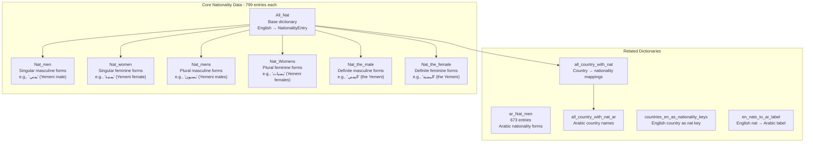
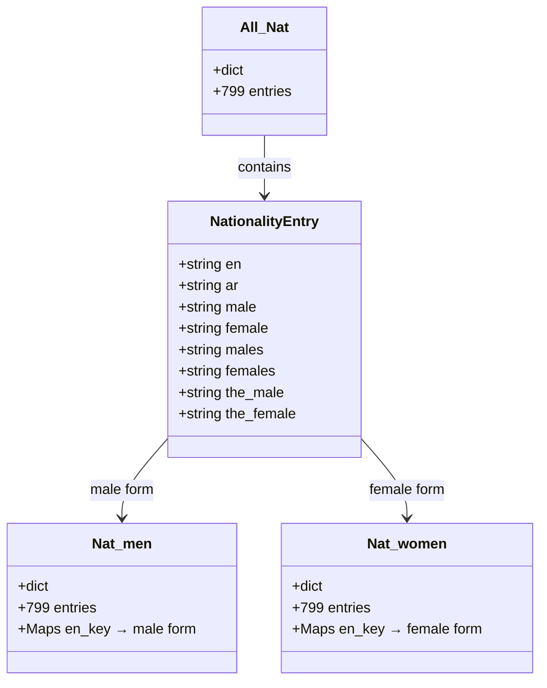
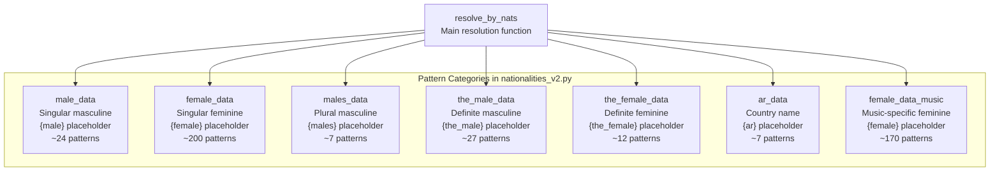
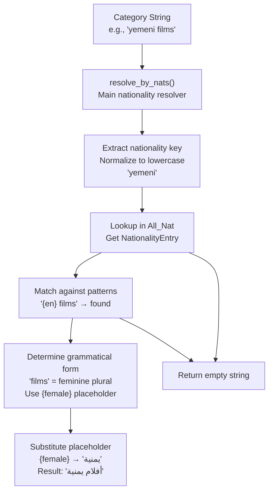

# Nationalities

> **Relevant source files**
> * [ArWikiCats/jsons/keys/COMPANY_TYPE_TRANSLATIONS.json](../ArWikiCats/jsons/keys/COMPANY_TYPE_TRANSLATIONS.json)
> * [ArWikiCats/jsons/sports/Sports_Keys_New.json](../ArWikiCats/jsons/sports/Sports_Keys_New.json)
> * [ArWikiCats/new_resolvers/nationalities_resolvers/nationalities_v2.py](../ArWikiCats/new_resolvers/nationalities_resolvers/nationalities_v2.py)
> * [ArWikiCats/translations/mixed/__init__.py](../ArWikiCats/translations/mixed/__init__.py)
> * [ArWikiCats/translations/nats/Nationality.py](../ArWikiCats/translations/nats/Nationality.py)
> * [ArWikiCats/translations/nats/__init__.py](../ArWikiCats/translations/nats/__init__.py)

This page documents the nationality translation data system, which maintains 799 nationality entries with gender-specific Arabic translations. The nationality data is fundamental to the resolver system as it enables grammatically correct Arabic translation of categories containing nationality identifiers (e.g., "American films" → "أفلام أمريكية"). For information about how nationality data is used in pattern matching, see [5.2 Nationality Resolvers](/ArWikiCats/ArWikiCats/5.2-nationality-resolvers).

## Overview

The nationality system consists of multiple parallel dictionaries that store the same 799 nationalities in different grammatical forms. Each nationality has up to seven forms to support Arabic gender agreement rules: singular masculine, singular feminine, plural masculine, plural feminine, definite masculine, definite feminine, and country name.

**Sources:** [_work_files/data_len.json L33-L42](../_work_files/data_len.json#L33-L42)

 [ArWikiCats/translations/__init__.py L33-L53](../ArWikiCats/translations/__init__.py#L33-L53)

## Nationality Dictionary Organization



**Dictionary Counts from data_len.json:**

| Dictionary | Entries | Purpose |
| --- | --- | --- |
| `All_Nat` | 799 | Master dictionary with NationalityEntry objects |
| `Nat_men` | 799 | Singular masculine forms (e.g., "يمني") |
| `Nat_women` | 799 | Singular feminine forms (e.g., "يمنية") |
| `Nat_mens` | 799 | Plural masculine forms (e.g., "يمنيون") |
| `Nat_Womens` | 799 | Plural feminine forms (e.g., "يمنيات") |
| `Nat_the_male` | 799 | Definite masculine forms (e.g., "اليمني") |
| `Nat_the_female` | 799 | Definite feminine forms (e.g., "اليمنية") |
| `ar_Nat_men` | 673 | Arabic-origin nationality forms |

**Sources:** [_work_files/data_len.json L33-L42](../_work_files/data_len.json#L33-L42)

 [ArWikiCats/translations/__init__.py L33-L53](../ArWikiCats/translations/__init__.py#L33-L53)

## NationalityEntry Class

The `NationalityEntry` class is the core data structure that stores all grammatical forms for a single nationality. Each entry in `All_Nat` is a `NationalityEntry` object containing the English key and all Arabic forms.



**Example NationalityEntry structure:**

| Field | English Key: "yemeni" | English Key: "american" |
| --- | --- | --- |
| `en` | "yemeni" | "american" |
| `ar` | "اليمن" | "الولايات المتحدة" |
| `male` | "يمني" | "أمريكي" |
| `female` | "يمنية" | "أمريكية" |
| `males` | "يمنيون" | "أمريكيون" |
| `females` | "يمنيات" | "أمريكيات" |
| `the_male` | "اليمني" | "الأمريكي" |
| `the_female` | "اليمنية" | "الأمريكية" |

**Sources:** [ArWikiCats/translations/__init__.py L33-L53](../ArWikiCats/translations/__init__.py#L33-L53)

## Grammatical Forms and Gender Agreement

Arabic requires gender and number agreement between adjectives and nouns. The nationality system provides seven grammatical forms to enable correct agreement in all contexts.

### Placeholder Types

The nationality resolvers use placeholder-based pattern matching where placeholders are replaced with the appropriate grammatical form:

| Placeholder | Purpose | Example Pattern | Example Result |
| --- | --- | --- | --- |
| `{en}` | English nationality key | `"{en} films"` | Identifies "american" |
| `{ar}` | Arabic country name | `"{en} grand prix"` → `"جائزة {ar} الكبرى"` | "جائزة فرنسا الكبرى" |
| `{male}` | Singular masculine | `"{en} cuisine"` → `"مطبخ {male}"` | "مطبخ إيطالي" |
| `{female}` | Singular feminine | `"{en} culture"` → `"ثقافة {female}"` | "ثقافة فرنسية" |
| `{males}` | Plural masculine | `"{en} emigrants"` → `"{males} مهاجرون"` | "يمنيون مهاجرون" |
| `{females}` | Plural feminine | `"{en} women singers"` → `"مغنيات {females}"` | "مغنيات يمنيات" |
| `{the_male}` | Definite masculine | `"{en} occupation"` → `"الاحتلال {the_male}"` | "الاحتلال الأمريكي" |
| `{the_female}` | Definite feminine | `"{en} navy"` → `"البحرية {the_female}"` | "البحرية الأمريكية" |

**Sources:** [ArWikiCats/new_resolvers/nationalities_resolvers/nationalities_v2.py L1-L600](../ArWikiCats/new_resolvers/nationalities_resolvers/nationalities_v2.py#L1-L600)

## Pattern Categories

The nationality resolver organizes patterns into categories based on which grammatical form is required. Each category maps English patterns to Arabic templates with appropriate placeholders.

### Pattern Type Distribution



**Sources:** [ArWikiCats/new_resolvers/nationalities_resolvers/nationalities_v2.py L29-L295](../ArWikiCats/new_resolvers/nationalities_resolvers/nationalities_v2.py#L29-L295)

### Category Examples

#### 1. Masculine Forms (male_data)

Used when the noun is masculine singular in Arabic.

```
"{en} cuisine" → "مطبخ {male}"
"italian cuisine" → "مطبخ إيطالي"

"{en} history" → "تاريخ {male}"
"egyptian history" → "تاريخ مصري"

"{en} diaspora" → "شتات {male}"
"palestinian diaspora" → "شتات فلسطيني"
```

**Sources:** [ArWikiCats/new_resolvers/nationalities_resolvers/nationalities_v2.py L98-L124](../ArWikiCats/new_resolvers/nationalities_resolvers/nationalities_v2.py#L98-L124)

#### 2. Feminine Forms (female_data)

Used when the noun is feminine singular in Arabic. This is the largest category with ~200 patterns.

```
"{en} culture" → "ثقافة {female}"
"french culture" → "ثقافة فرنسية"

"{en} companies" → "شركات {female}"
"american companies" → "شركات أمريكية"

"{en} television series" → "مسلسلات تلفزيونية {female}"
"yemeni television series" → "مسلسلات تلفزيونية يمنية"

"{en} music" → "موسيقى {female}"
"american music" → "موسيقى أمريكية"
```

**Sources:** [ArWikiCats/new_resolvers/nationalities_resolvers/nationalities_v2.py L297-L600](../ArWikiCats/new_resolvers/nationalities_resolvers/nationalities_v2.py#L297-L600)

#### 3. Plural Masculine Forms (males_data)

Used for masculine plural professions or groups.

```
"{en} expatriates" → "{males} مغتربون"
"yemeni expatriates" → "يمنيون مغتربون"

"{en} emigrants" → "{males} مهاجرون"
"yemeni emigrants" → "يمنيون مهاجرون"

"{en} singers" → "مغنون {males}"
"yemeni singers" → "مغنون يمنيون"
```

**Sources:** [ArWikiCats/new_resolvers/nationalities_resolvers/nationalities_v2.py L29-L45](../ArWikiCats/new_resolvers/nationalities_resolvers/nationalities_v2.py#L29-L45)

#### 4. Definite Masculine Forms (the_male_data)

Used when the Arabic translation requires the definite article with masculine agreement.

```
"{en} occupation" → "الاحتلال {the_male}"
"american occupation" → "الاحتلال الأمريكي"

"{en} super league" → "دوري السوبر {the_male}"
"saudi super league" → "دوري السوبر السعودي"

"{en} premier league" → "الدوري {the_male} الممتاز"
"egyptian premier league" → "الدوري المصري الممتاز"
```

**Sources:** [ArWikiCats/new_resolvers/nationalities_resolvers/nationalities_v2.py L59-L96](../ArWikiCats/new_resolvers/nationalities_resolvers/nationalities_v2.py#L59-L96)

#### 5. Definite Feminine Forms (the_female_data)

Used when the Arabic translation requires the definite article with feminine agreement.

```
"{en} navy" → "البحرية {the_female}"
"american navy" → "البحرية الأمريكية"

"{en} air force" → "القوات الجوية {the_female}"
"french air force" → "القوات الجوية الفرنسية"
```

**Sources:** [tests/new_resolvers/nationalities_resolvers/nationalities_v2/test_nats_v2.py L429-L450](../tests/new_resolvers/nationalities_resolvers/nationalities_v2/test_nats_v2.py#L429-L450)

#### 6. Country Name Forms (ar_data)

Used when the pattern requires the Arabic country name rather than the adjectival form.

```
"{en} grand prix" → "جائزة {ar} الكبرى"
"french grand prix" → "جائزة فرنسا الكبرى"

"{en} cup" → "كأس {ar}"
"egyptian cup" → "كأس مصر"

"{en} independence" → "استقلال {ar}"
"syrian independence" → "استقلال سوريا"
```

**Sources:** [ArWikiCats/new_resolvers/nationalities_resolvers/nationalities_v2.py L47-L57](../ArWikiCats/new_resolvers/nationalities_resolvers/nationalities_v2.py#L47-L57)

## Usage Flow



**Sources:** [ArWikiCats/new_resolvers/nationalities_resolvers/nationalities_v2.py L1-L600](../ArWikiCats/new_resolvers/nationalities_resolvers/nationalities_v2.py#L1-L600)

## Special Handling

### Non-Nationality Patterns

The resolver handles "non-" prefix patterns for negative nationality expressions:

```
"non-american television series" → "مسلسلات تلفزيونية غير أمريكية"
"non yemeni television series" → "مسلسلات تلفزيونية غير يمنية"
```

The pattern splits on "non-" or "non " and translates to "غير" (meaning "non" in Arabic).

**Sources:** [tests/new_resolvers/nationalities_resolvers/nationalities_v2/test_nats_v2.py L13-L17](../tests/new_resolvers/nationalities_resolvers/nationalities_v2/test_nats_v2.py#L13-L17)

### Music Group Patterns

A dedicated `female_data_music` dictionary contains ~170 patterns specifically for music-related categories, as these require consistent feminine agreement in Arabic:

```
"{en} rock groups" → "فرق روك {female}"
"yemeni rock groups" → "فرق روك يمنية"

"{en} hip hop groups" → "فرق هيب هوب {female}"
"american hip hop groups" → "فرق هيب هوب أمريكية"

"{en} metal musical groups" → "فرق موسيقى ميتال {female}"
"swedish metal musical groups" → "فرق موسيقى ميتال سويدية"
```

**Sources:** [ArWikiCats/new_resolvers/nationalities_resolvers/nationalities_v2.py L126-L295](../ArWikiCats/new_resolvers/nationalities_resolvers/nationalities_v2.py#L126-L295)

 [tests/new_resolvers/nationalities_resolvers/nationalities_v2/test_nats_v2.py L26-L270](../tests/new_resolvers/nationalities_resolvers/nationalities_v2/test_nats_v2.py#L26-L270)

### Compound Patterns

Some patterns combine nationalities with other modifiers like religious identifiers:

```
"jewish {en} surnames" → "ألقاب يهودية {female}"
"jewish french surnames" → "ألقاب يهودية فرنسية"

"{en}-jewish culture" → "ثقافة يهودية {female}"
"american-jewish culture" → "ثقافة يهودية أمريكية"
```

**Sources:** [ArWikiCats/new_resolvers/nationalities_resolvers/nationalities_v2.py L15-L27](../ArWikiCats/new_resolvers/nationalities_resolvers/nationalities_v2.py#L15-L27)

## Related Nationality Dictionaries

Beyond the core 799-entry dictionaries, the system maintains several related mappings:

| Dictionary | Purpose | Example |
| --- | --- | --- |
| `all_country_with_nat` | Maps country names to nationality keys | "France" → {"en": "french"} |
| `all_country_with_nat_ar` | Arabic country names | "France" → {"ar": "فرنسا"} |
| `countries_en_as_nationality_keys` | Country name as nat key | ["france", "germany", ...] |
| `countries_from_nat` | Reverse mapping | "french" → "France" |
| `en_nats_to_ar_label` | Direct English to Arabic | "yemeni" → "يمني" |
| `raw_nats_as_en_key` | Raw nationality forms | Unprocessed nationality data |

**Sources:** [ArWikiCats/translations/__init__.py L33-L53](../ArWikiCats/translations/__init__.py#L33-L53)

## Test Coverage

The nationality system has extensive test coverage validating all grammatical forms and pattern categories:

| Test File | Focus | Test Count |
| --- | --- | --- |
| `test_nats_v2.py` | Core nationality patterns | 600+ test cases |
| `test_nats_v2_jobs.py` | Job-related nationality patterns | 6 test cases |
| `test_nats_v2_extended.py` | Complex compound patterns | 64 test cases |

**Test example:**

```markdown
# Masculine form test
"egyptian descent" → "أصل مصري"

# Feminine form test
"american music" → "موسيقى أمريكية"

# Definite masculine test
"iraqi occupation" → "الاحتلال العراقي"

# Plural masculine test
"yemeni expatriates" → "يمنيون مغتربون"
```

**Sources:** [tests/new_resolvers/nationalities_resolvers/nationalities_v2/test_nats_v2.py L1-L700](../tests/new_resolvers/nationalities_resolvers/nationalities_v2/test_nats_v2.py#L1-L700)

 [tests/new_resolvers/nationalities_resolvers/nationalities_v2/test_nats_v2_jobs.py L1-L51](../tests/new_resolvers/nationalities_resolvers/nationalities_v2/test_nats_v2_jobs.py#L1-L51)

 [tests/new_resolvers/nationalities_resolvers/nationalities_v2/test_nats_v2_extended.py L1-L97](../tests/new_resolvers/nationalities_resolvers/nationalities_v2/test_nats_v2_extended.py#L1-L97)
