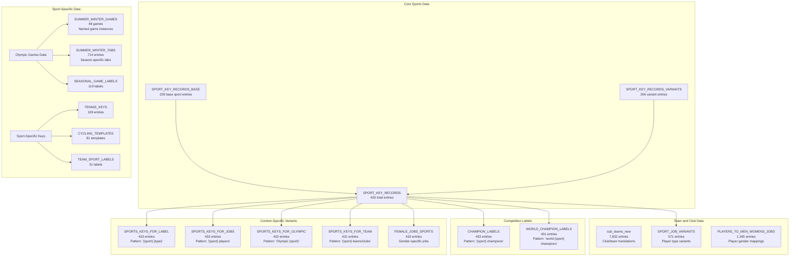
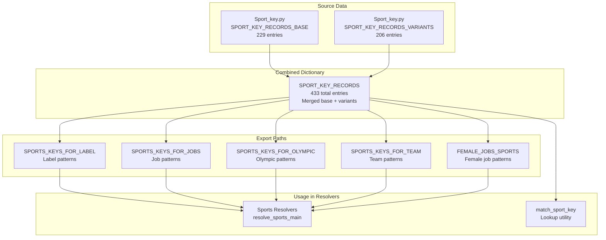
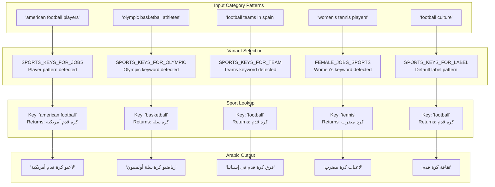
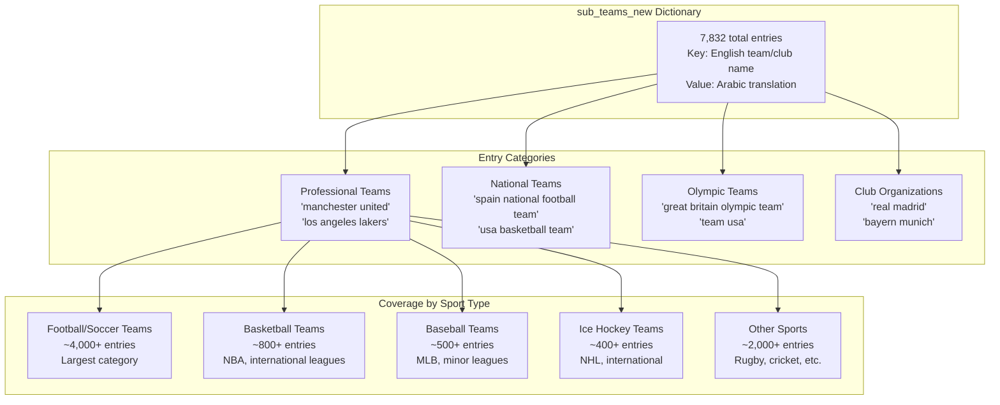
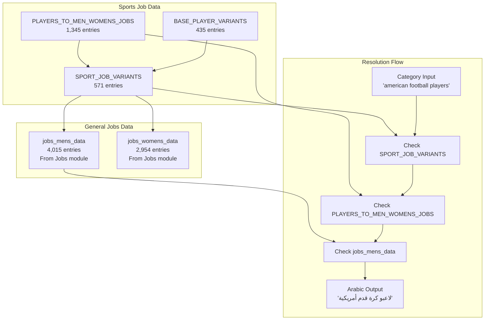
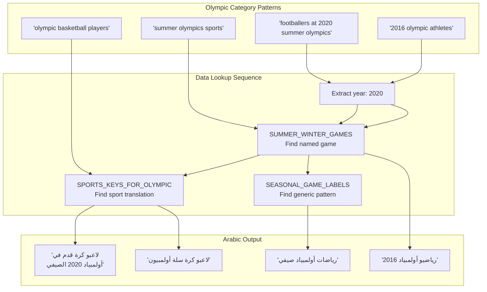
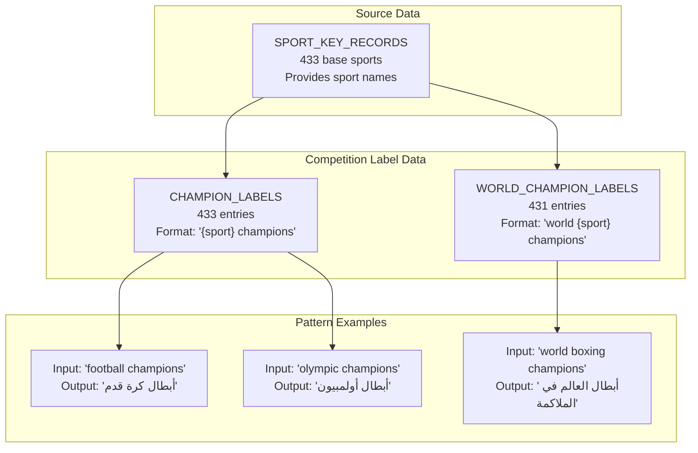
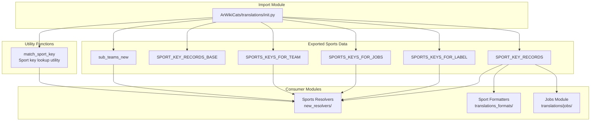

# Sports Data

> **Relevant source files**
> * [ArWikiCats/new_resolvers/__init__.py](../ArWikiCats/new_resolvers/__init__.py)
> * [ArWikiCats/new_resolvers/countries_names_resolvers/__init__.py](../ArWikiCats/new_resolvers/countries_names_resolvers/__init__.py)
> * [ArWikiCats/new_resolvers/countries_names_with_sports/__init__.py](../ArWikiCats/new_resolvers/countries_names_with_sports/__init__.py)
> * [ArWikiCats/new_resolvers/countries_names_with_sports/p17_bot_sport.py](../ArWikiCats/new_resolvers/countries_names_with_sports/p17_bot_sport.py)
> * [ArWikiCats/new_resolvers/countries_names_with_sports/p17_sport_to_move_under.py](../ArWikiCats/new_resolvers/countries_names_with_sports/p17_sport_to_move_under.py)
> * [ArWikiCats/new_resolvers/films_resolvers/__init__.py](../ArWikiCats/new_resolvers/films_resolvers/__init__.py)
> * [ArWikiCats/new_resolvers/films_resolvers/resolve_films_labels.py](../ArWikiCats/new_resolvers/films_resolvers/resolve_films_labels.py)
> * [ArWikiCats/new_resolvers/jobs_resolvers/__init__.py](../ArWikiCats/new_resolvers/jobs_resolvers/__init__.py)
> * [ArWikiCats/new_resolvers/jobs_resolvers/relegin_jobs_new.py](../ArWikiCats/new_resolvers/jobs_resolvers/relegin_jobs_new.py)
> * [ArWikiCats/new_resolvers/nationalities_resolvers/__init__.py](../ArWikiCats/new_resolvers/nationalities_resolvers/__init__.py)
> * [ArWikiCats/new_resolvers/sports_resolvers/__init__.py](../ArWikiCats/new_resolvers/sports_resolvers/__init__.py)
> * [ArWikiCats/new_resolvers/sports_resolvers/countries_names_and_sports.py](../ArWikiCats/new_resolvers/sports_resolvers/countries_names_and_sports.py)
> * [ArWikiCats/new_resolvers/sports_resolvers/nationalities_and_sports.py](../ArWikiCats/new_resolvers/sports_resolvers/nationalities_and_sports.py)
> * [ArWikiCats/new_resolvers/sports_resolvers/pre_defined.py](../ArWikiCats/new_resolvers/sports_resolvers/pre_defined.py)
> * [ArWikiCats/new_resolvers/sports_resolvers/raw_sports.py](../ArWikiCats/new_resolvers/sports_resolvers/raw_sports.py)
> * [ArWikiCats/new_resolvers/sports_resolvers/raw_sports_with_suffixes.py](../ArWikiCats/new_resolvers/sports_resolvers/raw_sports_with_suffixes.py)
> * [ArWikiCats/new_resolvers/sports_resolvers/sport_lab_nat.py](../ArWikiCats/new_resolvers/sports_resolvers/sport_lab_nat.py)
> * [ArWikiCats/new_resolvers/teams_mappings_ends.py](../ArWikiCats/new_resolvers/teams_mappings_ends.py)
> * [ArWikiCats/translations/__init__.py](../ArWikiCats/translations/__init__.py)
> * [ArWikiCats/translations/build_data/__init__.py](../ArWikiCats/translations/build_data/__init__.py)
> * [ArWikiCats/translations/funcs.py](../ArWikiCats/translations/funcs.py)
> * [ArWikiCats/translations/geo/__init__.py](../ArWikiCats/translations/geo/__init__.py)
> * [ArWikiCats/translations/geo/labels_country.py](../ArWikiCats/translations/geo/labels_country.py)
> * [ArWikiCats/translations/jobs/Jobs.py](../ArWikiCats/translations/jobs/Jobs.py)
> * [ArWikiCats/translations/jobs/Jobs2.py](../ArWikiCats/translations/jobs/Jobs2.py)
> * [ArWikiCats/translations/jobs/jobs_data_basic.py](../ArWikiCats/translations/jobs/jobs_data_basic.py)
> * [ArWikiCats/translations/jobs/jobs_players_list.py](../ArWikiCats/translations/jobs/jobs_players_list.py)
> * [ArWikiCats/translations/jobs/jobs_singers.py](../ArWikiCats/translations/jobs/jobs_singers.py)
> * [ArWikiCats/translations/jobs/jobs_womens.py](../ArWikiCats/translations/jobs/jobs_womens.py)
> * [ArWikiCats/translations/mixed/all_keys2.py](../ArWikiCats/translations/mixed/all_keys2.py)
> * [ArWikiCats/translations/mixed/female_keys.py](../ArWikiCats/translations/mixed/female_keys.py)
> * [ArWikiCats/translations/mixed/keys2.py](../ArWikiCats/translations/mixed/keys2.py)
> * [ArWikiCats/translations/others/__init__.py](../ArWikiCats/translations/others/__init__.py)
> * [ArWikiCats/translations/others/tax_table.py](../ArWikiCats/translations/others/tax_table.py)
> * [ArWikiCats/translations/sports/Sport_key.py](../ArWikiCats/translations/sports/Sport_key.py)
> * [ArWikiCats/translations/tv/films_mslslat.py](../ArWikiCats/translations/tv/films_mslslat.py)
> * [_work_files/data_len.json](../_work_files/data_len.json)

## Purpose and Scope

This document describes the sports-related translation data used in ArWikiCats. Sports data enables translation of English Wikipedia categories related to sports, athletes, teams, clubs, competitions, and venues into Arabic. The data structures support gender-specific forms, context-specific variants (jobs, labels, Olympic categories), and team/club translations.

For information about how sports resolvers use this data in the resolution chain, see [Sports Resolvers](19.Sports-Resolvers.md). For job-related sports data (e.g., "footballers", "basketball players"), see [Jobs and Occupations](9.Jobs-and-Occupations.md)

---

## Sports Data Architecture

The sports translation system consists of two main components: **sport type translations** (SPORT_KEY_RECORDS with 433 entries) and **team/club translations** (sub_teams_new with 7,832 entries). The sport type data is further specialized into five context-specific variants to handle different category patterns.

**Sources:** [_work_files/data_len.json L54-L62](../_work_files/data_len.json#L54-L62)

 [_work_files/data_len.json L7](../_work_files/data_len.json#L7-L7)

 [_work_files/data_len.json L76-L80](../_work_files/data_len.json#L76-L80)

 [ArWikiCats/translations/__init__.py L56-L64](../ArWikiCats/translations/__init__.py#L56-L64)

---

## SPORT_KEY_RECORDS Structure

The `SPORT_KEY_RECORDS` dictionary contains 433 sport type entries, each mapping English sport names to Arabic translations with gender-specific forms. This is the foundational data structure for all sport-related translations.

### Data Entry Format

Each sport entry in `SPORT_KEY_RECORDS` typically contains:

| Field | Type | Purpose | Example |
| --- | --- | --- | --- |
| English Key | `str` | Lowercase sport name | `"football"`, `"basketball"` |
| Arabic Label | `str` | Base Arabic translation | `"كرة قدم"`, `"كرة سلة"` |
| Male Form | `str` | Masculine grammatical form | `"كرة قدم"` |
| Female Form | `str` | Feminine grammatical form | `"كرة قدم"` |
| Plural Forms | `str` | Plural variations | `"كرة القدم"` |

### Data Organization

**Sources:** [_work_files/data_len.json L54](../_work_files/data_len.json#L54-L54)

 [_work_files/data_len.json L76](../_work_files/data_len.json#L76-L76)

 [_work_files/data_len.json L80](../_work_files/data_len.json#L80-L80)

 [ArWikiCats/translations/__init__.py L57-L63](../ArWikiCats/translations/__init__.py#L57-L63)

---

## Context-Specific Sport Variants

Sports data is exported in five specialized forms to match different category patterns. Each variant is optimized for specific English Wikipedia category structures.

### Variant Purposes

| Variant Name | Entry Count | Pattern Examples | Arabic Pattern |
| --- | --- | --- | --- |
| `SPORTS_KEYS_FOR_LABEL` | 433 | "American football films""Basketball culture" | `"{sport_ar} {type_ar}"` |
| `SPORTS_KEYS_FOR_JOBS` | 433 | "Football players""Basketball coaches" | `"لاعبو {sport_ar}"` |
| `SPORTS_KEYS_FOR_OLYMPIC` | 432 | "Olympic footballers""Olympic athletes" | `"{sport_ar} أولمبيون"` |
| `SPORTS_KEYS_FOR_TEAM` | 431 | "Football teams""Basketball clubs" | `"فرق {sport_ar}"` |
| `FEMALE_JOBS_SPORTS` | 433 | "Women footballers""Female basketball players" | `"لاعبات {sport_ar}"` |

### Translation Pattern Examples

**Sources:** [_work_files/data_len.json L54-L62](../_work_files/data_len.json#L54-L62)

 [ArWikiCats/translations/__init__.py L57-L63](../ArWikiCats/translations/__init__.py#L57-L63)

---

## Team and Club Data (sub_teams_new)

The `sub_teams_new` dictionary contains 7,832 entries mapping English team and club names to Arabic translations. This is the largest sports-related dataset, covering professional teams, national teams, Olympic teams, and club organizations across all sports.

### Data Structure

### Usage Pattern

The `sub_teams_new` data is primarily used in category patterns like:

* "Players of [team name]" → `"لاعبو [arabic_team_name]"`
* "[team name] seasons" → `"مواسم [arabic_team_name]"`
* "[team name] matches" → `"مباريات [arabic_team_name]"`

**Sources:** [_work_files/data_len.json L7](../_work_files/data_len.json#L7-L7)

 [ArWikiCats/translations/__init__.py L64](../ArWikiCats/translations/__init__.py#L64-L64)

---

## Sport Job Variants

The sports job system includes specialized data structures for translating athlete categories with proper gender agreement and positional specificity.

### SPORT_JOB_VARIANTS Structure

The `SPORT_JOB_VARIANTS` dictionary (571 entries) maps English player type patterns to Arabic equivalents with gender forms.

| Data Structure | Entries | Purpose | Example Mapping |
| --- | --- | --- | --- |
| `SPORT_JOB_VARIANTS` | 571 | Sport-specific job types | `"footballers"` → `{"male": "لاعبو كرة قدم", "female": "لاعبات كرة قدم"}` |
| `PLAYERS_TO_MEN_WOMENS_JOBS` | 1,345 | Player to job mappings | `"football players"` → `"footballers"` |
| `BASE_PLAYER_VARIANTS` | 435 | Base player patterns | Generic player translations |
| `FOOTBALL_KEYS_PLAYERS` | 46 | Football-specific players | Position-specific football roles |

### Integration with Jobs Data

**Sources:** [_work_files/data_len.json L45-L47](../_work_files/data_len.json#L45-L47)

 [_work_files/data_len.json L53](../_work_files/data_len.json#L53-L53)

 [_work_files/data_len.json L24](../_work_files/data_len.json#L24-L24)

 [_work_files/data_len.json L117](../_work_files/data_len.json#L117-L117)

 [ArWikiCats/translations/__init__.py L8](../ArWikiCats/translations/__init__.py#L8-L8)

---

## Olympic and Games Data

The Olympic-related data structures handle temporal and seasonal aspects of Olympic Games categories.

### Data Organization

| Data Structure | Entries | Content Type | Example Usage |
| --- | --- | --- | --- |
| `SUMMER_WINTER_GAMES` | 48 | Named games instances | `"2020 Summer Olympics"` → `"أولمبياد 2020 الصيفي"` |
| `SUMMER_WINTER_TABS` | 714 | Season-specific patterns | `"summer olympics"` → seasonal variants |
| `SEASONAL_GAME_LABELS` | 119 | Game label patterns | Generic seasonal patterns |
| `SPORTS_KEYS_FOR_OLYMPIC` | 432 | Sport + Olympic patterns | `"olympic football"` → `"كرة قدم أولمبية"` |

### Olympic Pattern Resolution

**Sources:** [_work_files/data_len.json L41](../_work_files/data_len.json#L41-L41)

 [_work_files/data_len.json L94](../_work_files/data_len.json#L94-L94)

 [_work_files/data_len.json L114](../_work_files/data_len.json#L114-L114)

 [_work_files/data_len.json L60](../_work_files/data_len.json#L60-L60)

 [ArWikiCats/translations/__init__.py L56](../ArWikiCats/translations/__init__.py#L56-L56)

---

## Sport-Specific Data Structures

Several sports have dedicated data structures for handling specialized vocabulary and patterns.

### Tennis Data (TENNIS_KEYS)

Contains 109 entries for tennis-specific terms including:

* Tournament names (Grand Slams, ATP/WTA events)
* Tennis equipment and facilities
* Tennis-specific player roles and categories

### Cycling Data

| Structure | Entries | Purpose |
| --- | --- | --- |
| `CYCLING_TEMPLATES` | 81 | Cycling category templates |
| `cycling_variants` | 27 | Cycling-related variants |

Covers:

* Cycling race types (road, track, mountain bike)
* Cycling team classifications
* Professional cycling competition formats

### Other Sport-Specific Data

| Structure | Entries | Coverage |
| --- | --- | --- |
| `TEAM_SPORT_LABELS` | 31 | Team sport generic labels |
| `sport_variants` | 35 | General sport variants |
| `BOXING_LABELS` | 42 | Boxing-specific terms |
| `SKATING_LABELS` | 4 | Skating categories |
| `STATIC_PLAYER_LABELS` | 4 | Fixed player labels |

**Sources:** [_work_files/data_len.json L97](../_work_files/data_len.json#L97-L97)

 [_work_files/data_len.json L103](../_work_files/data_len.json#L103-L103)

 [_work_files/data_len.json L130](../_work_files/data_len.json#L130-L130)

 [_work_files/data_len.json L125](../_work_files/data_len.json#L125-L125)

 [_work_files/data_len.json L143](../_work_files/data_len.json#L143-L143)

 [_work_files/data_len.json L118](../_work_files/data_len.json#L118-L118)

 [_work_files/data_len.json L149](../_work_files/data_len.json#L149-L149)

 [_work_files/data_len.json L150](../_work_files/data_len.json#L150-L150)

---

## Champion and Competition Labels

Two specialized dictionaries provide translations for championship and competition-related categories.

### Data Structures

### Usage Context

These dictionaries handle categories like:

* `"[Sport] champions"` → Simple championship categories
* `"World [sport] champions"` → World-level competitions
* `"[Nationality] [sport] champions"` → Country-specific champions
* `"Olympic [sport] champions"` → Olympic medal categories

**Sources:** [_work_files/data_len.json L57](../_work_files/data_len.json#L57-L57)

 [_work_files/data_len.json L62](../_work_files/data_len.json#L62-L62)

---

## Data Access and Utilities

The sports data module provides utility functions for accessing and matching sport keys.

### Key Access Functions

### match_sport_key Function

Located at [ArWikiCats/translations/utils/match_sport_keys.py](../ArWikiCats/translations/utils/match_sport_keys.py)

 this utility provides case-insensitive lookups for sport keys with fallback logic.

**Functionality:**

* Case-insensitive sport name matching
* Handles alternative sport name spellings
* Returns structured sport data with gender forms
* Used by sports resolvers for pattern matching

**Sources:** [ArWikiCats/translations/__init__.py L78](../ArWikiCats/translations/__init__.py#L78-L78)

 [ArWikiCats/translations/__init__.py L57-L64](../ArWikiCats/translations/__init__.py#L57-L64)

---

## Data Maintenance and Tracking

Sports data is tracked in the metadata registry for size monitoring and consistency validation.

### Tracked Metrics in data_len.json

| Metric Name | Value | Description |
| --- | --- | --- |
| `sub_teams_new` | 7,832 | Total team/club entries |
| `SPORT_KEY_RECORDS` | 433 | Core sport type entries |
| `SPORT_KEY_RECORDS_BASE` | 229 | Base sport entries |
| `SPORT_KEY_RECORDS_VARIANTS` | 206 | Variant sport entries |
| `SPORT_JOB_VARIANTS` | 571 | Sport job type variants |
| `PLAYERS_TO_MEN_WOMENS_JOBS` | 1,345 | Player mapping entries |
| `SUMMER_WINTER_TABS` | 714 | Olympic season tabs |
| `SPORTS_KEYS_FOR_LABEL` | 433 | Label variant entries |
| `SPORTS_KEYS_FOR_JOBS` | 433 | Job variant entries |
| `SPORTS_KEYS_FOR_OLYMPIC` | 432 | Olympic variant entries |
| `SPORTS_KEYS_FOR_TEAM` | 431 | Team variant entries |
| `CHAMPION_LABELS` | 433 | Champion pattern entries |
| `WORLD_CHAMPION_LABELS` | 431 | World champion entries |
| `FEMALE_JOBS_SPORTS` | 433 | Female job sport entries |

### Validation

The data_len.json registry enables:

* Size change tracking across updates
* Consistency validation between related datasets
* Regression detection in test suites
* Dataset completeness monitoring

**Sources:** [_work_files/data_len.json L7](../_work_files/data_len.json#L7-L7)

 [_work_files/data_len.json L54-L62](../_work_files/data_len.json#L54-L62)

 [_work_files/data_len.json L76-L80](../_work_files/data_len.json#L76-L80)

 [_work_files/data_len.json L24](../_work_files/data_len.json#L24-L24)

 [_work_files/data_len.json L41](../_work_files/data_len.json#L41-L41)

 [_work_files/data_len.json L45-L47](../_work_files/data_len.json#L45-L47)

---

## Example Category Translations

The following table demonstrates how sports data enables category translation across various patterns:

| English Category | Data Used | Arabic Translation |
| --- | --- | --- |
| `"American football players"` | SPORTS_KEYS_FOR_JOBS | `"لاعبو كرة قدم أمريكية"` |
| `"Olympic basketball athletes"` | SPORTS_KEYS_FOR_OLYMPIC | `"رياضيو كرة سلة أولمبيون"` |
| `"Real Madrid players"` | sub_teams_new | `"لاعبو ريال مدريد"` |
| `"Women's tennis players"` | FEMALE_JOBS_SPORTS | `"لاعبات كرة مضرب"` |
| `"Football teams in Spain"` | SPORTS_KEYS_FOR_TEAM | `"فرق كرة قدم في إسبانيا"` |
| `"World boxing champions"` | WORLD_CHAMPION_LABELS | `"أبطال العالم في الملاكمة"` |
| `"2020 Summer Olympics"` | SUMMER_WINTER_GAMES | `"أولمبياد 2020 الصيفي"` |
| `"Defunct football clubs"` | sub_teams_new + SPORTS_KEYS_FOR_TEAM | `"أندية كرة قدم سابقة"` |

**Sources:** [tests/event_lists/test_defunct.py L12-L65](../tests/event_lists/test_defunct.py#L12-L65)
