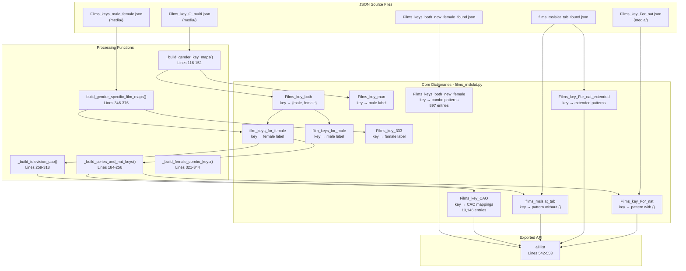
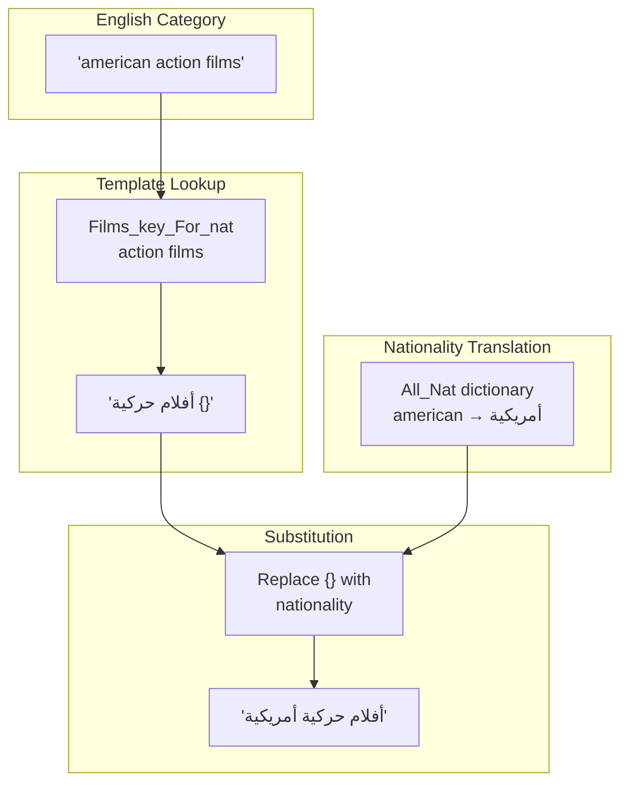
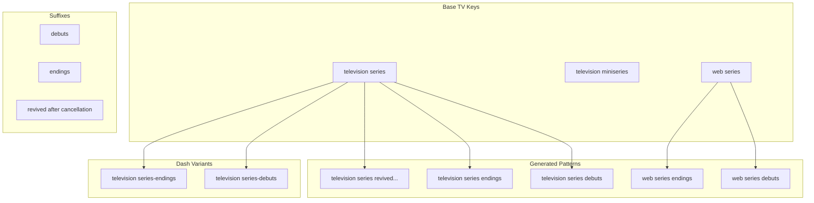
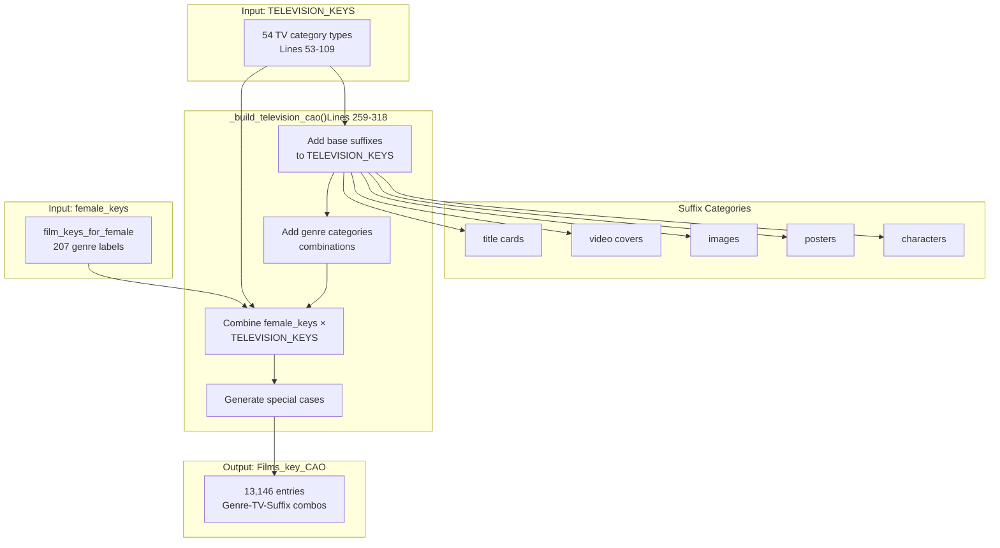
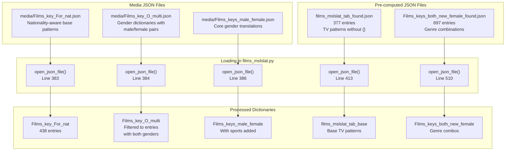

# Films and Television

> **Relevant source files**
> * [ArWikiCats/translations/__init__.py](../ArWikiCats/translations/__init__.py)
> * [ArWikiCats/translations/build_data/__init__.py](../ArWikiCats/translations/build_data/__init__.py)
> * [ArWikiCats/translations/funcs.py](../ArWikiCats/translations/funcs.py)
> * [ArWikiCats/translations/geo/__init__.py](../ArWikiCats/translations/geo/__init__.py)
> * [ArWikiCats/translations/geo/labels_country.py](../ArWikiCats/translations/geo/labels_country.py)
> * [ArWikiCats/translations/jobs/Jobs.py](../ArWikiCats/translations/jobs/Jobs.py)
> * [ArWikiCats/translations/jobs/Jobs2.py](../ArWikiCats/translations/jobs/Jobs2.py)
> * [ArWikiCats/translations/jobs/jobs_data_basic.py](../ArWikiCats/translations/jobs/jobs_data_basic.py)
> * [ArWikiCats/translations/jobs/jobs_players_list.py](../ArWikiCats/translations/jobs/jobs_players_list.py)
> * [ArWikiCats/translations/jobs/jobs_singers.py](../ArWikiCats/translations/jobs/jobs_singers.py)
> * [ArWikiCats/translations/jobs/jobs_womens.py](../ArWikiCats/translations/jobs/jobs_womens.py)
> * [ArWikiCats/translations/mixed/all_keys2.py](../ArWikiCats/translations/mixed/all_keys2.py)
> * [ArWikiCats/translations/mixed/female_keys.py](../ArWikiCats/translations/mixed/female_keys.py)
> * [ArWikiCats/translations/mixed/keys2.py](../ArWikiCats/translations/mixed/keys2.py)
> * [ArWikiCats/translations/others/__init__.py](../ArWikiCats/translations/others/__init__.py)
> * [ArWikiCats/translations/others/tax_table.py](../ArWikiCats/translations/others/tax_table.py)
> * [ArWikiCats/translations/sports/Sport_key.py](../ArWikiCats/translations/sports/Sport_key.py)
> * [ArWikiCats/translations/tv/films_mslslat.py](../ArWikiCats/translations/tv/films_mslslat.py)
> * [_work_files/data_len.json](../_work_files/data_len.json)
> * [examples/data/endings.json](../examples/data/endings.json)
> * [examples/data/novels.json](../examples/data/novels.json)
> * [examples/data/television series.json](../examples/data/television series.json)

This document describes the film and television translation data structures used by ArWikiCats to translate English Wikipedia film and TV categories into Arabic. This includes gender-specific film genre translations, nationality-aware patterns, television series keys, and the CAO (Characters, Albums, Organizations) mapping system.

For information about how these translation datasets are used during category resolution, see [Film and TV Resolvers](20.Film-and-TV-Resolvers.md). For the general data architecture and metadata tracking, see [Data Organization and Metadata](7.Data-Aggregation-Pipeline.md)

## Overview

The film and television translation system maintains 13,146+ translation patterns organized across multiple specialized dictionaries. The primary data module is located at [ArWikiCats/translations/tv/films_mslslat.py L1-L554](../ArWikiCats/translations/tv/films_mslslat.py#L1-L554)

 and exports the following core dictionaries:

| Dictionary Name | Size | Purpose |
| --- | --- | --- |
| `Films_key_CAO` | 13,146 | Characters, Albums, Organizations, and genre-TV combinations |
| `Films_keys_both_new_female` | 897 | Pairwise combinations of female genre labels |
| `Films_key_For_nat` | 438 | Nationality-aware patterns with `{}` placeholder |
| `films_mslslat_tab` | 377 | TV series patterns without nationality placeholder |
| `Films_key_For_nat_extended` | 350 | Extended nationality-aware TV series keys |
| `Films_key_333` | 207 | Female genre labels |
| `film_keys_for_female` | 207 | Female-specific film keys |
| `Films_key_man` | 74 | Male-specific film keys with animated variants |
| `television_keys` | 54 | Base television category keys |

The system handles complex translation requirements including:

* **Gender agreement**: Arabic requires different forms for masculine/feminine (e.g., "أفلام حركة" vs "أفلام حركية")
* **Nationality placeholders**: Templates like "أفلام {} درامية" where `{}` is filled with nationality
* **Temporal patterns**: Debuts ("بدأ عرضها في"), endings ("انتهت في"), revivals
* **Media type variations**: Films, television series, web series, miniseries, etc.

Sources: [ArWikiCats/translations/tv/films_mslslat.py L1-L554](../ArWikiCats/translations/tv/films_mslslat.py#L1-L554), [_work_files/data_len.json L1-L155](../_work_files/data_len.json#L1-L155)

## Data Structure Architecture



**Data Structure Architecture Diagram**: Shows how JSON source files are processed through builder functions to create the final translation dictionaries exported by the films_mslslat module.

Sources: [ArWikiCats/translations/tv/films_mslslat.py L116-L554](../ArWikiCats/translations/tv/films_mslslat.py#L116-L554), [ArWikiCats/translations/tv/films_mslslat.py L383-L535](../ArWikiCats/translations/tv/films_mslslat.py#L383-L535)

## Gender-Specific Translation System

Arabic film categories require gender agreement between genre adjectives and the plural noun "أفلام" (films). The system maintains separate male and female forms for each genre.

### Gender Dictionary Structure

The core gender-aware data structure `Films_key_both` maps English keys to dictionaries containing both gender forms:

```python
# Example structure from Films_key_O_multi.json
{
    "action": {"male": "حركة", "female": "حركية"},
    "drama": {"male": "درامي", "female": "درامية"},
    "comedy": {"male": "كوميدي", "female": "كوميدية"}
}
```

The `_build_gender_key_maps()` function at [ArWikiCats/translations/tv/films_mslslat.py L116-L152](../ArWikiCats/translations/tv/films_mslslat.py#L116-L152)

 processes this structure:

1. **Lowercases keys** for case-insensitive matching
2. **Creates male-only dictionary** `Films_key_man` by extracting male forms
3. **Handles animated variants**: For each genre, generates "animated {genre}" → "{male_label} رسوم متحركة"
4. **Manages animation aliasing**: "animated" and "animation" are treated as synonyms

### Gender-Specific Extraction

Two parallel dictionaries provide quick gender-specific lookups:

| Dictionary | Source | Example |
| --- | --- | --- |
| `film_keys_for_male` | Lines 401-403 | `"action"` → `"حركة"` |
| `film_keys_for_female` | Extracted by `build_gender_specific_film_maps()` | `"action"` → `"حركية"` |
| `Films_key_333` | Extended female labels | Combines multiple sources |

The `_extend_females_labels()` function at [ArWikiCats/translations/tv/films_mslslat.py L154-L182](../ArWikiCats/translations/tv/films_mslslat.py#L154-L182)

 extracts female forms and handles the animation aliasing:

```sql
# If "animated" exists, also create "animation" entry
if "animated" in male_female_copy:
    male_female_copy["animation"] = male_female_copy["animated"]
```

Sources: [ArWikiCats/translations/tv/films_mslslat.py L116-L182](../ArWikiCats/translations/tv/films_mslslat.py#L116-L182), [ArWikiCats/translations/tv/films_mslslat.py L346-L408](../ArWikiCats/translations/tv/films_mslslat.py#L346-L408)

## Nationality-Aware Pattern System

Categories like "American action films" require nationality insertion. The system uses the `{}` placeholder to mark where nationality should be inserted during resolution.

### Placeholder Template Structure



**Nationality Placeholder Substitution Flow**: Demonstrates how the `{}` placeholder in `Films_key_For_nat` templates is replaced with translated nationality during category resolution.

### Key Pattern Categories

The `Films_key_For_nat` dictionary contains three main pattern types:

1. **Basic Film/TV Patterns** (Lines 454-475):

```json
{
    "drama films": "أفلام درامية {}",
    "action films": "أفلام حركة {}",
    "television series": "مسلسلات تلفزيونية {}",
    "web series": "مسلسلات ويب {}"
}
```

1. **Debuts and Endings Patterns** (Lines 477-503):

```json
{
    "television series debuts": "مسلسلات تلفزيونية {} بدأ عرضها في",
    "television series endings": "مسلسلات تلفزيونية {} انتهت في",
    "web series debuts": "مسلسلات ويب {} بدأ عرضها في"
}
```

1. **Extended Patterns** from `Films_key_For_nat_extended` (Line 418): * Generated by appending `" {}"` to all `films_mslslat_tab` entries * Contains 350 additional patterns

### Remakes Pattern

Special pattern for film remakes at [ArWikiCats/translations/tv/films_mslslat.py L201](../ArWikiCats/translations/tv/films_mslslat.py#L201)

:

```
_key_for_nat["remakes of {} films"] = f"أفلام {NAT_PLACEHOLDER} معاد إنتاجها"
```

Sources: [ArWikiCats/translations/tv/films_mslslat.py L18-L32](../ArWikiCats/translations/tv/films_mslslat.py#L18-L32), [ArWikiCats/translations/tv/films_mslslat.py L184-L256](../ArWikiCats/translations/tv/films_mslslat.py#L184-L256), [ArWikiCats/translations/tv/films_mslslat.py L454-L503](../ArWikiCats/translations/tv/films_mslslat.py#L454-L503)

## Debuts and Endings Patterns

Television and web series categories often include temporal indicators for when series began or ended. The system handles multiple variants of these patterns.

### Base Temporal Keys

The `SERIES_DEBUTS_ENDINGS` constant at [ArWikiCats/translations/tv/films_mslslat.py L24-L32](../ArWikiCats/translations/tv/films_mslslat.py#L24-L32)

 defines fixed templates:

| English Pattern | Arabic Template |
| --- | --- |
| `television series debuts` | `مسلسلات تلفزيونية {} بدأ عرضها في` |
| `television series endings` | `مسلسلات تلفزيونية {} انتهت في` |
| `web series debuts` | `مسلسلات ويب {} بدأ عرضها في` |
| `web series endings` | `مسلسلات ويب {} انتهت في` |
| `television series-debuts` | `مسلسلات تلفزيونية {} بدأ عرضها في` (with dash) |
| `television series-endings` | `مسلسلات تلفزيونية {} انتهت في` (with dash) |

### Supported Media Types

The `DEBUTS_ENDINGS_KEYS` list at [ArWikiCats/translations/tv/films_mslslat.py L21](../ArWikiCats/translations/tv/films_mslslat.py#L21)

 defines which media types support debuts/endings variants:

* `television series`
* `television miniseries`
* `television films`

### Pattern Generation Logic

The `_build_series_and_nat_keys()` function generates debut/ending patterns for all combinations:



**Temporal Pattern Generation**: Shows how base TV keys are combined with temporal suffixes to create debuts/endings patterns.

At [ArWikiCats/translations/tv/films_mslslat.py L209-L223](../ArWikiCats/translations/tv/films_mslslat.py#L209-L223)

 the system generates:

1. **Standard patterns** with space separator
2. **Dashed patterns** for specific keys in `DEBUTS_ENDINGS_KEYS`
3. **Revival patterns** for cancelled series

Additional manual patterns are added at [ArWikiCats/translations/tv/films_mslslat.py L422-L448](../ArWikiCats/translations/tv/films_mslslat.py#L422-L448)

 for specific cases like:

* `"superhero television series"`
* `"supernatural television series"`
* `"animated television series debuts"`

Sources: [ArWikiCats/translations/tv/films_mslslat.py L21-L32](../ArWikiCats/translations/tv/films_mslslat.py#L21-L32), [ArWikiCats/translations/tv/films_mslslat.py L184-L256](../ArWikiCats/translations/tv/films_mslslat.py#L184-L256), [ArWikiCats/translations/tv/films_mslslat.py L422-L448](../ArWikiCats/translations/tv/films_mslslat.py#L422-L448)

## Television and Series Keys

The system maintains comprehensive mappings for television-related categories beyond films.

### Base Television Keys

The `TELEVISION_BASE_KEYS` dictionary at [ArWikiCats/translations/tv/films_mslslat.py L35-L50](../ArWikiCats/translations/tv/films_mslslat.py#L35-L50)

 provides core TV translations:

```json
{
    "video games": "ألعاب فيديو",
    "soap opera": "مسلسلات طويلة",
    "television characters": "شخصيات تلفزيونية",
    "television programs": "برامج تلفزيونية",
    "web series": "مسلسلات ويب",
    "television series": "مسلسلات تلفزيونية",
    "film series": "سلاسل أفلام",
    "television episodes": "حلقات تلفزيونية",
    "television films": "أفلام تلفزيونية",
    "miniseries": "مسلسلات قصيرة",
    "television miniseries": "مسلسلات قصيرة تلفزيونية"
}
```

### Extended Television Keys

The `TELEVISION_KEYS` dictionary at [ArWikiCats/translations/tv/films_mslslat.py L53-L109](../ArWikiCats/translations/tv/films_mslslat.py#L53-L109)

 extends this with 54 additional categories including:

| Category Type | Examples |
| --- | --- |
| Media types | comics, manga, webcomics, graphic novels |
| Organizations | clubs, teams, governing bodies, non-profit organizations |
| Content types | soundtracks, albums, magazines, logos |
| Program types | television commercials, television news, television schedules |
| Other | competitions, championships, equipment, terminology |

### Series Pattern Generation

The system generates multiple pattern variants for each television key:

1. **Base patterns** at [ArWikiCats/translations/tv/films_mslslat.py L204-L206](../ArWikiCats/translations/tv/films_mslslat.py#L204-L206) : * With nationality placeholder: `"{tt_lab} {NAT_PLACEHOLDER}"` * Without placeholder: `"{tt_lab}"`
2. **Temporal variants** at [ArWikiCats/translations/tv/films_mslslat.py L209-L216](../ArWikiCats/translations/tv/films_mslslat.py#L209-L216) : * Debuts: `"{tt_lab} {NAT_PLACEHOLDER} بدأ عرضها في"` * Endings: `"{tt_lab} {NAT_PLACEHOLDER} انتهت في"` * Revived: `"{tt_lab} {NAT_PLACEHOLDER} أعيدت بعد إلغائها"`
3. **Genre combinations** at [ArWikiCats/translations/tv/films_mslslat.py L226-L255](../ArWikiCats/translations/tv/films_mslslat.py#L226-L255) : * Combines each female film key with each TV key * Example: "action television series" → "مسلسلات تلفزيونية حركية {}"

Sources: [ArWikiCats/translations/tv/films_mslslat.py L35-L109](../ArWikiCats/translations/tv/films_mslslat.py#L35-L109), [ArWikiCats/translations/tv/films_mslslat.py L184-L256](../ArWikiCats/translations/tv/films_mslslat.py#L184-L256)

## CAO System (Characters, Albums, Organizations)

The `Films_key_CAO` dictionary is the largest translation dataset with 13,146 entries, covering media-related categories beyond basic film genres. "CAO" refers to the primary category types: Characters, Albums, and Organizations.

### CAO Structure and Generation



**CAO Generation Process**: Shows how the 13,146 CAO entries are generated by combining genre labels, TV keys, and category suffixes.

### Base Category Suffixes

At [ArWikiCats/translations/tv/films_mslslat.py L272-L282](../ArWikiCats/translations/tv/films_mslslat.py#L272-L282)

 the system adds common suffixes to all TV keys:

| English Suffix | Arabic Translation |
| --- | --- |
| `characters` | `شخصيات` (characters) |
| `title cards` | `بطاقات عنوان` (title cards) |
| `video covers` | `أغلفة فيديو` (video covers) |
| `posters` | `ملصقات` (posters) |
| `images` | `صور` (images) |

Example: `"television series characters"` → `"شخصيات مسلسلات تلفزيونية"`

### Genre-Based Categories

The `genre_categories` list at [ArWikiCats/translations/tv/films_mslslat.py L285-L302](../ArWikiCats/translations/tv/films_mslslat.py#L285-L302)

 defines 16 special category types:

* Media types: `anime and manga`, `soundtracks`, `films`, `novellas`, `novels`
* Album types: `compilation albums`, `folk albums`, `classical albums`, `comedy albums`, `mixtape albums`
* TV types: `television series`, `television episodes`, `television programs`
* Other: `terminology`, `groups`

### Genre × TV Combinations

The most significant contribution to CAO size comes from the nested loop at [ArWikiCats/translations/tv/films_mslslat.py L304-L316](../ArWikiCats/translations/tv/films_mslslat.py#L304-L316)

:

```css
for ke, ke_lab in female_keys.items():  # 207 genres
    for fao, base_label in TELEVISION_KEYS.items():  # 54 TV keys
        count += 1
        films_key_cao[f"{ke} {fao}"] = f"{base_label} {ke_lab}"
```

This generates **207 × 54 = 11,178 entries** (tracked as `ss_Films_key_CAO` in data_len.json)

Examples:

* `"action video games"` → `"ألعاب فيديو حركية"`
* `"comedy television series"` → `"مسلسلات تلفزيونية كوميدية"`
* `"horror comics"` → `"قصص مصورة رعب"`

### Special CAO Patterns

At [ArWikiCats/translations/tv/films_mslslat.py L305-L311](../ArWikiCats/translations/tv/films_mslslat.py#L305-L311)

 special cases are generated:

```
films_key_cao[f"children's {ke}"] = f"أطفال {ke_lab}"
films_key_cao[f"{ke} film remakes"] = f"أفلام {ke_lab} معاد إنتاجها"
```

Examples:

* `"children's action"` → `"أطفال حركية"`
* `"horror film remakes"` → `"أفلام رعب معاد إنتاجها"`

Sources: [ArWikiCats/translations/tv/films_mslslat.py L259-L318](../ArWikiCats/translations/tv/films_mslslat.py#L259-L318), [ArWikiCats/translations/tv/films_mslslat.py L506](../ArWikiCats/translations/tv/films_mslslat.py#L506), [_work_files/data_len.json L4-L5](../_work_files/data_len.json#L4-L5)

## Female Genre Combinations

The `Films_keys_both_new_female` dictionary contains 897 entries representing all pairwise combinations of female genre labels.

### Combination Generation Logic

The original generation function `_build_female_combo_keys()` at [ArWikiCats/translations/tv/films_mslslat.py L321-L344](../ArWikiCats/translations/tv/films_mslslat.py#L321-L344)

 (now replaced by JSON loading) creates combinations:

```
for en, tab in filmskeys_male_female.items():
    tab_female = tab.get("female", "").strip()
    for en2, tab2_female in base_female.items():
        if en == en2:
            continue
        new_key = f"{en} {en2}".lower()
        result[new_key] = f"{tab_female} {tab2_female}"
```

### Combination Examples

| English Category | Arabic Translation | Structure |
| --- | --- | --- |
| `action comedy` | `حركية كوميدية` | action_female + comedy_female |
| `horror drama` | `رعب درامية` | horror_female + drama_female |
| `romantic comedy` | `رومانسية كوميدية` | romantic_female + comedy_female |
| `science fiction adventure` | `خيال علمي مغامرات` | sci-fi_female + adventure_female |

### Data Source

The current implementation at [ArWikiCats/translations/tv/films_mslslat.py L510](../ArWikiCats/translations/tv/films_mslslat.py#L510)

 loads pre-computed combinations from JSON:

```
Films_keys_both_new_female = open_json_file("Films_keys_both_new_female_found.json")
```

This contains 897 entries as tracked in [_work_files/data_len.json L30](../_work_files/data_len.json#L30)

Sources: [ArWikiCats/translations/tv/films_mslslat.py L321-L344](../ArWikiCats/translations/tv/films_mslslat.py#L321-L344), [ArWikiCats/translations/tv/films_mslslat.py L510](../ArWikiCats/translations/tv/films_mslslat.py#L510), [_work_files/data_len.json L30](../_work_files/data_len.json#L30)

## Data Organization and JSON Sources

The film and television translation data is built from multiple JSON source files located in the repository.

### JSON Source Files



**JSON Source Files and Loading**: Maps the JSON files to their loading points and resulting dictionaries in the films_mslslat module.

### JSON File Details

| File Path | Lines | Content | Size |
| --- | --- | --- | --- |
| `media/Films_key_For_nat.json` | 383 | Base nationality patterns | 438 entries |
| `media/Films_key_O_multi.json` | 384 | Gender dictionaries | Filtered to valid pairs |
| `media/Films_keys_male_female.json` | 386 | Core genre translations | Extended with sports |
| `films_mslslat_tab_found.json` | 413 | Pre-computed TV patterns | 377 entries |
| `Films_keys_both_new_female_found.json` | 510 | Pre-computed combinations | 897 entries |

### Data Filtering and Enhancement

At [ArWikiCats/translations/tv/films_mslslat.py L387](../ArWikiCats/translations/tv/films_mslslat.py#L387)

 the system adds sports translations:

```
Films_keys_male_female["sports"] = {"male": "رياضي", "female": "رياضية"}
```

At [ArWikiCats/translations/tv/films_mslslat.py L391-L393](../ArWikiCats/translations/tv/films_mslslat.py#L391-L393)

 filtering ensures only complete gender pairs:

```yaml
Films_key_O_multi = {
    x: v for x, v in _Films_key_O_multi.items()
    if v.get("male", "").strip() and v.get("female", "").strip()
}
```

### Extended Pattern Generation

At [ArWikiCats/translations/tv/films_mslslat.py L418](../ArWikiCats/translations/tv/films_mslslat.py#L418)

 the system generates extended nationality patterns:

```
Films_key_For_nat_extended = {x: f"{v} {{}}" for x, v in films_mslslat_tab_base.items()}
```

This creates 350 entries by appending the `{}` nationality placeholder to all base TV patterns.

### Manual Pattern Additions

Additional patterns are manually added at multiple points:

1. **Drama variants** at [ArWikiCats/translations/tv/films_mslslat.py L454-L474](../ArWikiCats/translations/tv/films_mslslat.py#L454-L474) : 13 drama subcategories
2. **Series temporal patterns** at [ArWikiCats/translations/tv/films_mslslat.py L477-L503](../ArWikiCats/translations/tv/films_mslslat.py#L477-L503) : 22 debuts/endings patterns
3. **Superhero patterns** at [ArWikiCats/translations/tv/films_mslslat.py L422-L448](../ArWikiCats/translations/tv/films_mslslat.py#L422-L448) : Special superhero/supernatural categories

### Data Length Tracking

At [ArWikiCats/translations/tv/films_mslslat.py L517-L535](../ArWikiCats/translations/tv/films_mslslat.py#L517-L535)

 all dictionaries are tracked via `len_print.data_len()`:

```css
len_print.data_len(
    "films_mslslat.py",
    {
        "Films_key_For_nat": Films_key_For_nat,
        "films_mslslat_tab": films_mslslat_tab,
        "Films_key_CAO": Films_key_CAO,
        # ... etc
    },
)
```

This populates entries in [_work_files/data_len.json L4-L143](../_work_files/data_len.json#L4-L143)

Sources: [ArWikiCats/translations/tv/films_mslslat.py L383-L535](../ArWikiCats/translations/tv/films_mslslat.py#L383-L535), [_work_files/data_len.json L4-L12](../_work_files/data_len.json#L4-L12)

## Module Exports

The films_mslslat module exports 12 public dictionaries via its `__all__` list at [ArWikiCats/translations/tv/films_mslslat.py L542-L553](../ArWikiCats/translations/tv/films_mslslat.py#L542-L553)

:

```
__all__ = [
    "television_keys",
    "films_mslslat_tab",
    "film_keys_for_female",
    "film_keys_for_male",
    "Films_key_333",
    "Films_key_CAO",
    "Films_key_For_nat",
    "Films_key_man",
    "Films_keys_both_new_female",
    "film_key_women_2",
]
```

These are imported by the main translations module at [ArWikiCats/translations/__init__.py L65-L75](../ArWikiCats/translations/__init__.py#L65-L75)

 and re-exported at [ArWikiCats/translations/__init__.py L135-L143](../ArWikiCats/translations/__init__.py#L135-L143)

### Import Usage

The exported dictionaries are used by:

* **Film/TV resolvers**: See [Film and TV Resolvers](20.Film-and-TV-Resolvers.md) for resolution logic
* **Format system**: Gender-specific formatters use these dictionaries
* **Test suites**: Validation tests reference these datasets

Sources: [ArWikiCats/translations/tv/films_mslslat.py L542-L553](../ArWikiCats/translations/tv/films_mslslat.py#L542-L553), [ArWikiCats/translations/__init__.py L65-L75](../ArWikiCats/translations/__init__.py#L65-L75), [ArWikiCats/translations/__init__.py L135-L143](../ArWikiCats/translations/__init__.py#L135-L143)
