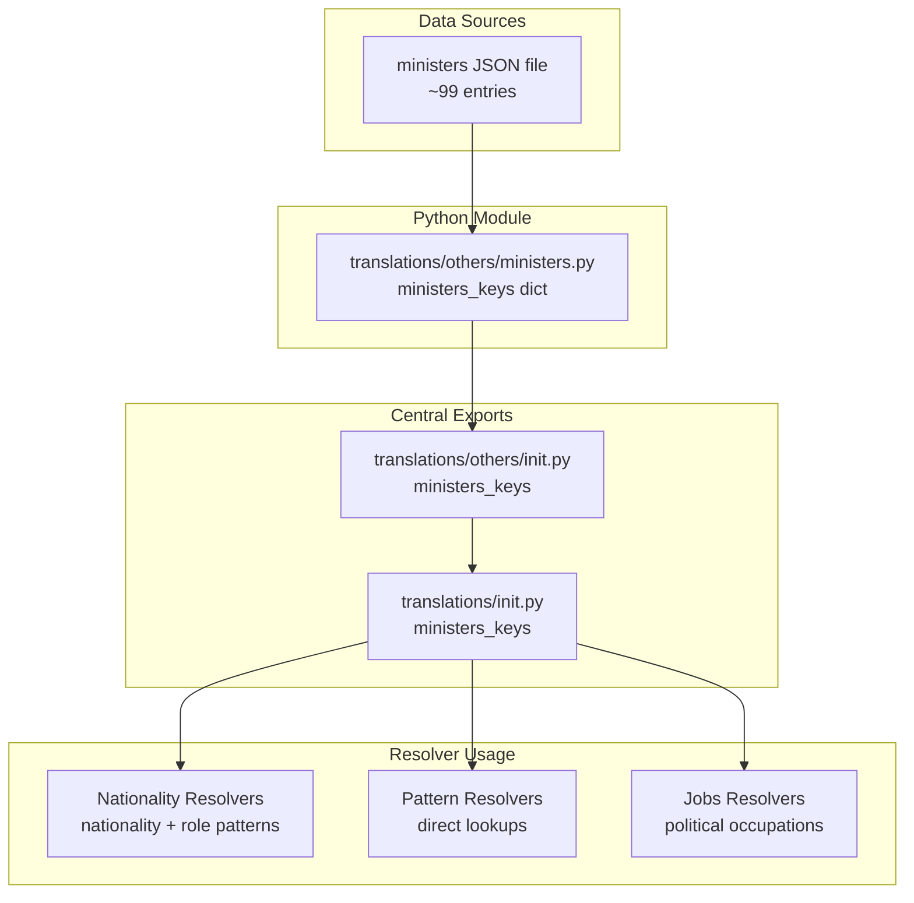
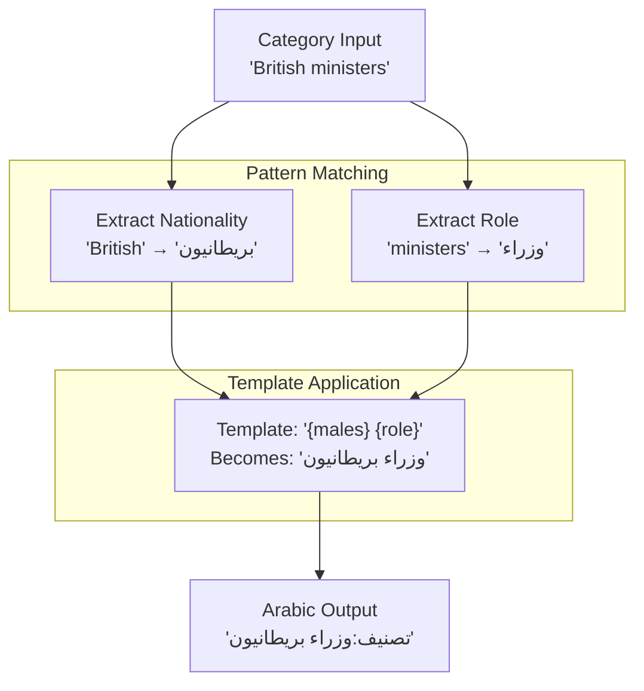
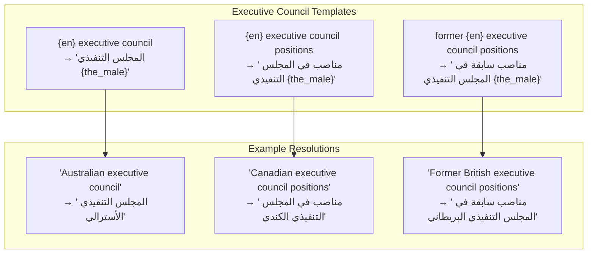
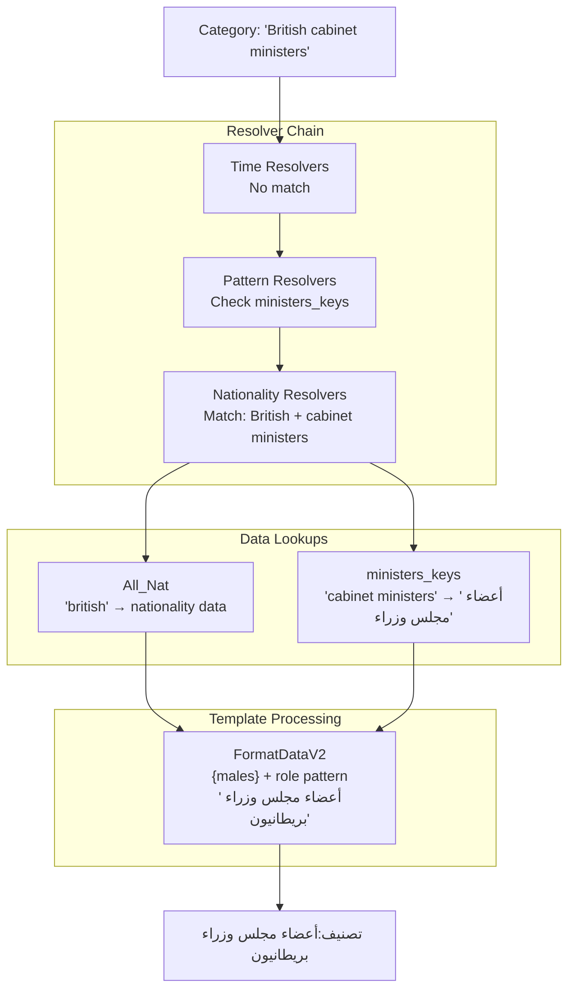
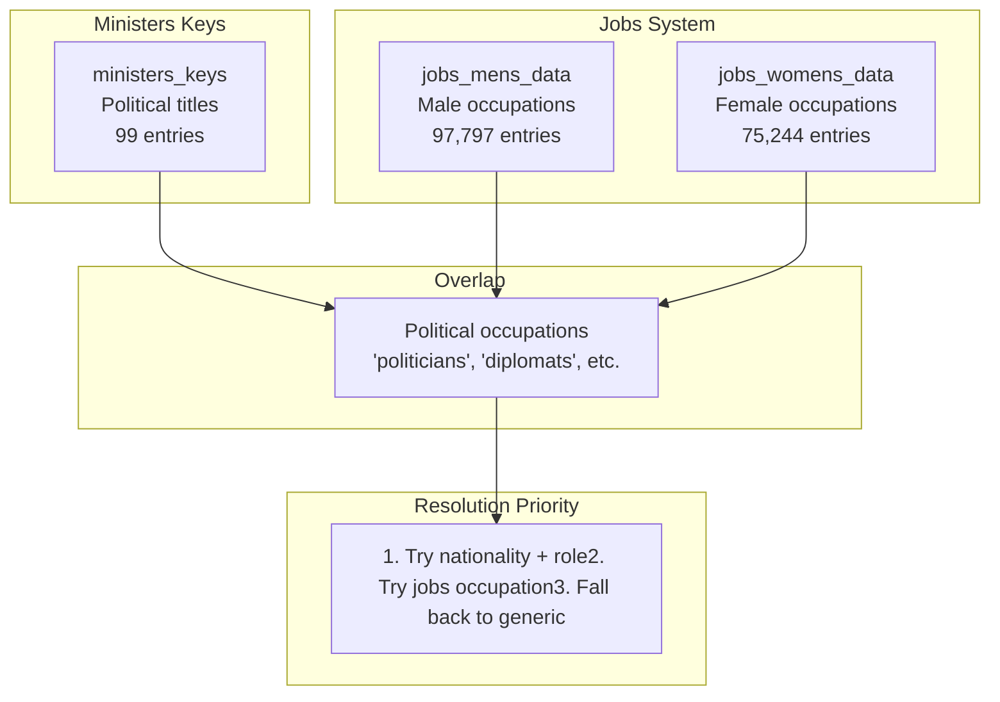

# Ministers and Political Roles

> **Relevant source files**
> * [ArWikiCats/jsons/sports/Sports_Keys_New.json](../ArWikiCats/jsons/sports/Sports_Keys_New.json)
> * [ArWikiCats/new_resolvers/nationalities_resolvers/nationalities_v2.py](../ArWikiCats/new_resolvers/nationalities_resolvers/nationalities_v2.py)
> * [ArWikiCats/translations/__init__.py](../ArWikiCats/translations/__init__.py)
> * [ArWikiCats/translations/build_data/__init__.py](../ArWikiCats/translations/build_data/__init__.py)
> * [ArWikiCats/translations/funcs.py](../ArWikiCats/translations/funcs.py)
> * [ArWikiCats/translations/geo/__init__.py](../ArWikiCats/translations/geo/__init__.py)
> * [ArWikiCats/translations/geo/labels_country.py](../ArWikiCats/translations/geo/labels_country.py)
> * [ArWikiCats/translations/jobs/Jobs.py](../ArWikiCats/translations/jobs/Jobs.py)
> * [ArWikiCats/translations/jobs/Jobs2.py](../ArWikiCats/translations/jobs/Jobs2.py)
> * [ArWikiCats/translations/jobs/jobs_data_basic.py](../ArWikiCats/translations/jobs/jobs_data_basic.py)
> * [ArWikiCats/translations/jobs/jobs_players_list.py](../ArWikiCats/translations/jobs/jobs_players_list.py)
> * [ArWikiCats/translations/jobs/jobs_singers.py](../ArWikiCats/translations/jobs/jobs_singers.py)
> * [ArWikiCats/translations/jobs/jobs_womens.py](../ArWikiCats/translations/jobs/jobs_womens.py)
> * [ArWikiCats/translations/mixed/all_keys2.py](../ArWikiCats/translations/mixed/all_keys2.py)
> * [ArWikiCats/translations/mixed/female_keys.py](../ArWikiCats/translations/mixed/female_keys.py)
> * [ArWikiCats/translations/mixed/keys2.py](../ArWikiCats/translations/mixed/keys2.py)
> * [ArWikiCats/translations/others/__init__.py](../ArWikiCats/translations/others/__init__.py)
> * [ArWikiCats/translations/others/tax_table.py](../ArWikiCats/translations/others/tax_table.py)
> * [ArWikiCats/translations/sports/Sport_key.py](../ArWikiCats/translations/sports/Sport_key.py)
> * [ArWikiCats/translations/tv/films_mslslat.py](../ArWikiCats/translations/tv/films_mslslat.py)
> * [_work_files/data_len.json](../_work_files/data_len.json)

This page documents the minister and secretary translation mappings used for translating political role categories from English to Arabic. The `ministers_keys` dictionary provides 99 specialized translations for government positions, cabinet roles, and political titles.

For broader political party translations, see the `PARTIES` dictionary in the mixed keys system. For nationality-based political patterns (e.g., "British ministers"), see [Nationality Resolvers](16.Nationality-Resolvers.md)

## Purpose and Scope

The ministers and political roles system handles translation of:

* **Cabinet positions**: ministers, secretaries, cabinet members
* **Government roles**: treasurers, superintendents, executive council positions
* **Legislative positions**: speakers, party chairs
* **Judicial positions**: chief justices, attorneys general

The system provides both standalone translations (e.g., "ministers" → "وزراء") and pattern-based translations that combine with nationalities (e.g., "British ministers" → "وزراء بريطانيون")

Sources: [ArWikiCats/translations/others/__init__.py L8](../ArWikiCats/translations/others/__init__.py#L8-L8)

 [ArWikiCats/translations/__init__.py L67-L68](../ArWikiCats/translations/__init__.py#L67-L68)

 [_work_files/data_len.json L88](../_work_files/data_len.json#L88-L88)

## Data Architecture



**Diagram 1: Ministers Data Flow**

The `ministers_keys` dictionary is loaded from a JSON file and exposed through the translations package hierarchy. It's then consumed by multiple resolver types for different translation scenarios.

Sources: [ArWikiCats/translations/__init__.py L1-L152](../ArWikiCats/translations/__init__.py#L1-L152)

 [ArWikiCats/translations/others/__init__.py L1-L20](../ArWikiCats/translations/others/__init__.py#L1-L20)

## Minister and Secretary Mappings

The core data structure is a dictionary mapping English political titles to their Arabic translations:

```css
ministers_keys = {
    "ministers": "وزراء",
    "cabinet ministers": "وزراء",
    "secretaries": "وزراء",
    "cabinet secretaries": "أعضاء مجلس وزراء",
    "secretaries of state": "وزراء خارجية",
    "state treasurers": "أمناء خزينة ولاية",
    "treasurers": "أمناء خزينة",
    # ... ~99 total entries
}
```

### Common Political Role Patterns

| English Pattern | Arabic Translation | Category Example |
| --- | --- | --- |
| `ministers` | وزراء | Category:British ministers |
| `cabinet secretaries` | أعضاء مجلس وزراء | Category:State cabinet secretaries |
| `secretaries of state` | وزراء خارجية | Category:American secretaries of state |
| `treasurers` | أمناء خزينة | Category:State treasurers |
| `superintendents of public instruction` | مدراء تعليم عام | Category:State superintendents |
| `chief justices` | رؤساء قضاء | Category:Chief justices |
| `party chairs` | رؤساء أحزاب | Category:Party chairs |

Sources: [ArWikiCats/translations/mixed/all_keys2.py L393-L515](../ArWikiCats/translations/mixed/all_keys2.py#L393-L515)

 [_work_files/data_len.json L88](../_work_files/data_len.json#L88-L88)

## Integration with Nationality Patterns

The ministers system integrates with nationality resolvers to handle combined patterns like "British ministers" or "French cabinet members":



**Diagram 2: Nationality + Minister Pattern Resolution**

When a category contains both a nationality and a political role, the system:

1. Extracts the nationality using `All_Nat` lookups
2. Extracts the political role using `ministers_keys` or related dictionaries
3. Combines them using nationality-aware templates from FormatDataV2

Sources: [ArWikiCats/new_resolvers/nationalities_resolvers/nationalities_v2.py L1-L700](../ArWikiCats/new_resolvers/nationalities_resolvers/nationalities_v2.py#L1-L700)

## Executive Council and Government Positions

Special patterns exist for executive council positions, which use nationality-specific templates with the definite article:



**Diagram 3: Executive Council Pattern System**

These patterns use `{the_male}` placeholder which resolves to the nationality's definite masculine form (e.g., "الأسترالي" for Australian, "الكندي" for Canadian)

Sources: [ArWikiCats/new_resolvers/nationalities_resolvers/nationalities_v2.py L69-L73](../ArWikiCats/new_resolvers/nationalities_resolvers/nationalities_v2.py#L69-L73)

## Related Political Categories

The ministers system works alongside other political category mappings:

### Legislative and Judicial Roles

From `keys_of_without_in` dictionary:

| English Term | Arabic Translation | Usage Context |
| --- | --- | --- |
| `chief justices` | رؤساء قضاء | Judicial system heads |
| `speakers` | رؤساء | Legislative speakers |
| `party chairs` | رؤساء أحزاب | Political party leadership |
| `lieutenant governors` | نواب حكام | Deputy governors |
| `vice presidents` | نواب رؤساء | Vice presidential roles |
| `appellate courts` | محاكم استئناف ولايات | State court systems |

Sources: [ArWikiCats/translations/mixed/all_keys2.py L367-L550](../ArWikiCats/translations/mixed/all_keys2.py#L367-L550)

### Political Party System

The `PARTIES` dictionary in `keys2.py` provides 76 entries for specific political parties and generic party types:

```css
PARTIES = {
    "republican party (united states)": "الحزب الجمهوري (الولايات المتحدة)",
    "democratic party": "الحزب الديمقراطي",
    "labour party": "حزب العمال",
    "conservative party": "حزب المحافظين",
    # ... 76 total entries
}
```

This includes:

* **Specific parties**: Named political parties from various countries
* **Party patterns**: "anti-islam political parties", "far-right political parties"
* **Youth wings**: "youth wings of political parties"
* **Historical parties**: "defunct political parties", "banned political parties"

Sources: [ArWikiCats/translations/mixed/keys2.py L52-L129](../ArWikiCats/translations/mixed/keys2.py#L52-L129)

## State-Level Positions

Special handling exists for U.S. state-level positions:

| English Pattern | Arabic Translation | Notes |
| --- | --- | --- |
| `state cabinet secretaries` | أعضاء مجلس وزراء | State cabinet members |
| `state treasurers` | أمناء خزينة ولاية | State financial officers |
| `state appellate courts` | محاكم استئناف ولايات | State court systems |
| `state superior courts` | محاكم عليا | State high courts |
| `superintendents of public instruction` | مدراء تعليم عام | Education commissioners |

These patterns allow categories like "California state treasurers" to be properly translated with both state name and role.

Sources: [ArWikiCats/translations/mixed/all_keys2.py L513-L524](../ArWikiCats/translations/mixed/all_keys2.py#L513-L524)

## Usage in Resolution Pipeline



**Diagram 4: Ministers in Resolution Pipeline**

The ministers_keys dictionary is accessed at multiple points:

1. **Pattern Resolvers** check for direct matches on political role terms
2. **Nationality Resolvers** use it to identify the role portion of nationality+role patterns
3. **Jobs Resolvers** may use it for occupation-based categories

Sources: [ArWikiCats/translations/__init__.py L1-L152](../ArWikiCats/translations/__init__.py#L1-L152)

 [ArWikiCats/new_resolvers/nationalities_resolvers/nationalities_v2.py L1-L700](../ArWikiCats/new_resolvers/nationalities_resolvers/nationalities_v2.py#L1-L700)

## Integration with Jobs System

Political roles overlap with the jobs system, particularly for occupation-based categories:



**Diagram 5: Ministers and Jobs System Integration**

Political roles can be resolved through multiple paths:

* **Specific political pattern**: "British ministers" uses nationality + ministers_keys
* **General occupation**: "politicians" uses jobs_mens_data/jobs_womens_data
* **Combined pattern**: "French political leaders" combines nationality with political occupation

Sources: [ArWikiCats/translations/jobs/Jobs.py L1-L211](../ArWikiCats/translations/jobs/Jobs.py#L1-L211)

 [ArWikiCats/new_resolvers/nationalities_resolvers/nationalities_v2.py L36-L53](../ArWikiCats/new_resolvers/nationalities_resolvers/nationalities_v2.py#L36-L53)

## Government Positions by Category

### Cabinet and Ministerial Roles

* `ministers` → "وزراء"
* `cabinet ministers` → "وزراء"
* `cabinet secretaries` → "أعضاء مجلس وزراء"
* `cabinet` → "مجلس وزراء"

### Foreign Affairs

* `secretaries of state` → "وزراء خارجية"
* `secretaries-of state` → "وزراء خارجية"

### Financial Positions

* `treasurers` → "أمناء خزينة"
* `state treasurers` → "أمناء خزينة ولاية"

### Educational Administration

* `superintendents of public instruction` → "مدراء تعليم عام"

### Judicial Positions

* `chief justices` → "رؤساء قضاء"

### Legislative Leadership

* `speakers` → "رؤساء"
* `party chairs` → "رؤساء أحزاب"

Sources: [ArWikiCats/translations/mixed/all_keys2.py L367-L550](../ArWikiCats/translations/mixed/all_keys2.py#L367-L550)

 [_work_files/data_len.json L88](../_work_files/data_len.json#L88-L88)

## Example Translations

| Input Category | Resolution Path | Arabic Output |
| --- | --- | --- |
| British ministers | Nationality + ministers_keys | تصنيف:وزراء بريطانيون |
| State cabinet secretaries | State pattern + ministers_keys | تصنيف:أعضاء مجلس وزراء ولاية |
| French secretaries of state | Nationality + ministers_keys | تصنيف:وزراء خارجية فرنسيون |
| Australian executive council | Nationality + executive pattern | تصنيف:المجلس التنفيذي الأسترالي |
| Political parties | Direct PARTIES lookup | تصنيف:أحزاب سياسية |
| Republican Party (United States) | Specific PARTIES entry | تصنيف:الحزب الجمهوري (الولايات المتحدة) |

Sources: [ArWikiCats/new_resolvers/nationalities_resolvers/nationalities_v2.py L69-L106](../ArWikiCats/new_resolvers/nationalities_resolvers/nationalities_v2.py#L69-L106)

 [ArWikiCats/translations/mixed/keys2.py L52-L129](../ArWikiCats/translations/mixed/keys2.py#L52-L129)
