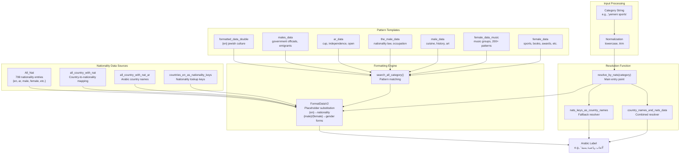
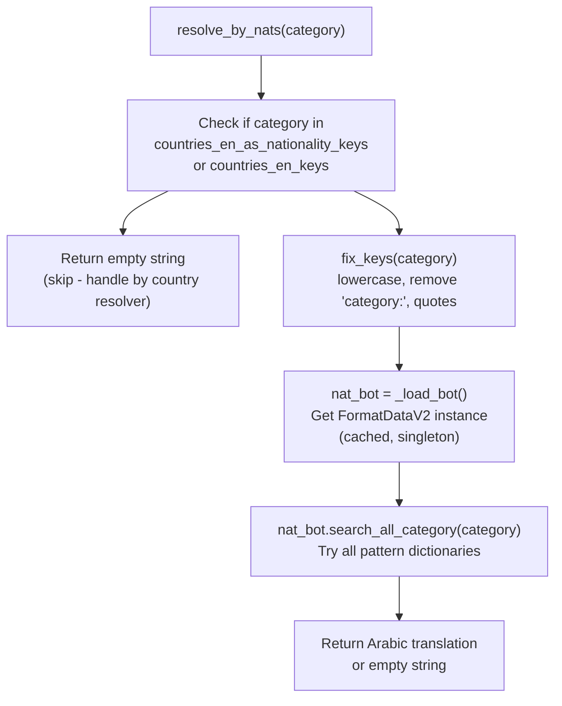
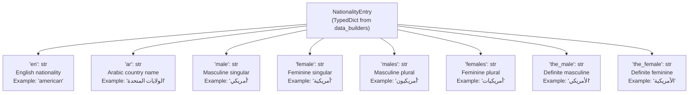
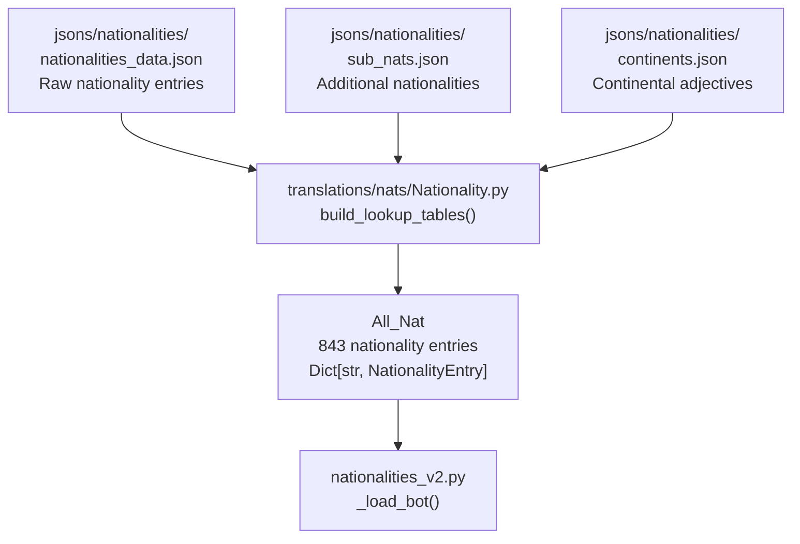
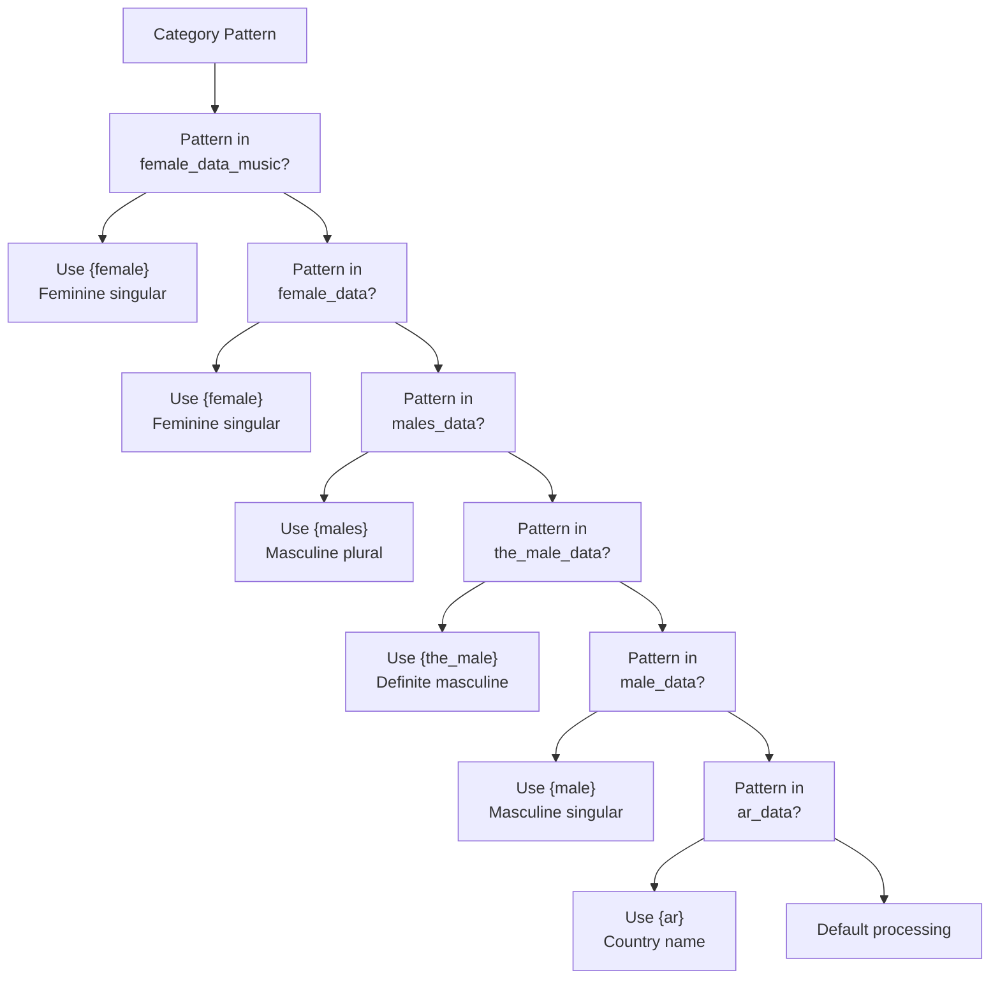
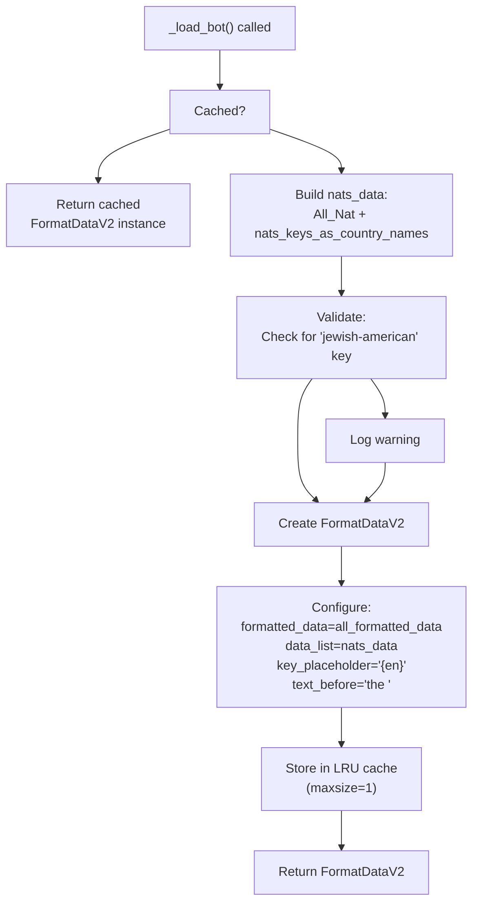
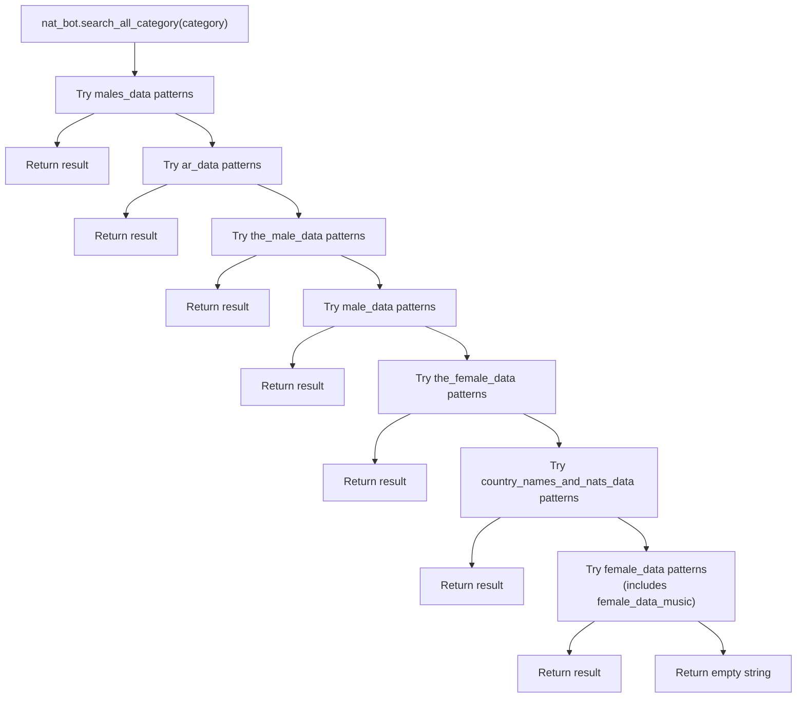

# Nationality Resolvers

> **Relevant source files**
> * [ArWikiCats/jsons/keys/COMPANY_TYPE_TRANSLATIONS.json](../ArWikiCats/jsons/keys/COMPANY_TYPE_TRANSLATIONS.json)
> * [ArWikiCats/jsons/sports/Sports_Keys_New.json](../ArWikiCats/jsons/sports/Sports_Keys_New.json)
> * [ArWikiCats/new_resolvers/nationalities_resolvers/nationalities_v2.py](../ArWikiCats/new_resolvers/nationalities_resolvers/nationalities_v2.py)
> * [ArWikiCats/translations/mixed/__init__.py](../ArWikiCats/translations/mixed/__init__.py)
> * [ArWikiCats/translations/nats/Nationality.py](../ArWikiCats/translations/nats/Nationality.py)
> * [ArWikiCats/translations/nats/__init__.py](../ArWikiCats/translations/nats/__init__.py)

Nationality Resolvers translate English Wikipedia category labels containing nationality adjectives (e.g., "American", "Yemeni", "British") into grammatically correct Arabic, accounting for gender agreement, number forms, and proper word order. This resolver is the **second highest priority** in the resolution chain (after Year Pattern Resolvers) with an importance score of 129.38.

For resolving country names (as opposed to nationality adjectives), see [Country Name Resolvers](17.Country-Name-Resolvers.md). For job-specific nationality patterns (e.g., "American footballers"), see [Job Resolvers](18.Job-Resolvers.md).

---

## Overview

The Nationality Resolver system handles categories where a nationality adjective modifies a noun (e.g., "Yemeni sports", "American films", "British universities"). Arabic translation requires:

1. **Gender agreement**: Adjectives must match noun gender (masculine/feminine)
2. **Number agreement**: Singular vs. plural forms differ
3. **Word order**: Arabic typically places adjectives after nouns
4. **Article forms**: Some patterns require definite articles (ال)

The system maintains **799 nationality entries** covering countries, regions, ethnic groups, and religious identities (e.g., "Jewish", "Christian", "Kurdish").

**Sources:**

* [ArWikiCats/new_resolvers/nationalities_resolvers/nationalities_v2.py L1-L800](../ArWikiCats/new_resolvers/nationalities_resolvers/nationalities_v2.py#L1-L800)
* [README.md L93-L98](../README.md#L93-L98)

---

## System Architecture



**Sources:**

* [ArWikiCats/new_resolvers/nationalities_resolvers/nationalities_v2.py L1-L15](../ArWikiCats/new_resolvers/nationalities_resolvers/nationalities_v2.py#L1-L15)
* [ArWikiCats/new_resolvers/nationalities_resolvers/__init__.py](../ArWikiCats/new_resolvers/nationalities_resolvers/__init__.py)

---

## Main Function: resolve_by_nats

The `resolve_by_nats()` function is the primary entry point for nationality-based category resolution.

### Function Signature

```python
@functools.lru_cache(maxsize=10000)
def resolve_by_nats(category: str) -> str:
```

The function includes:

* **LRU cache**: Caches up to 10,000 category translations
* **Skip logic**: Avoids processing categories that should be handled by country resolvers
* **Normalization**: Applies `fix_keys()` to standardize input
* **FormatDataV2 delegation**: Uses `_load_bot()` to get configured formatter

### Resolution Flow



### Key Implementation Details

1. **Country key filtering** (lines 703-705): Categories matching country names like "ireland" or "georgia (country)" are skipped to prevent conflicts with country resolvers
2. **Normalization** (line 706): Input is cleaned via `fix_keys()`
3. **Bot loading** (line 707): `_load_bot()` returns a cached `FormatDataV2` instance configured with all nationality data and patterns
4. **Pattern search** (line 708): `search_all_category()` iterates through all pattern dictionaries in order

**Sources:**

* [ArWikiCats/new_resolvers/nationalities_resolvers/nationalities_v2.py L690-L710](../ArWikiCats/new_resolvers/nationalities_resolvers/nationalities_v2.py#L690-L710)
* [ArWikiCats/new_resolvers/nationalities_resolvers/nationalities_v2.py L672-L687](../ArWikiCats/new_resolvers/nationalities_resolvers/nationalities_v2.py#L672-L687)  (fix_keys)
* [ArWikiCats/new_resolvers/nationalities_resolvers/nationalities_v2.py L647-L669](../ArWikiCats/new_resolvers/nationalities_resolvers/nationalities_v2.py#L647-L669)  (_load_bot)

---

## Pattern Template Dictionaries

The nationality resolver uses **seven specialized pattern dictionaries**, each handling different linguistic structures:

### 1. formatted_data_double: Jewish/Ethnic Dual Patterns

Handles compound patterns with both nationality and religious/ethnic identifiers. **Note**: This dictionary is defined but currently commented out in `all_formatted_data` (line 643).

| Pattern Template | Arabic Translation | Example Match |
| --- | --- | --- |
| `{en} jewish surnames` | `ألقاب يهودية {female}` | "American jewish surnames" |
| `{en} jewish culture` | `ثقافة يهودية {female}` | "Polish jewish culture" |
| `{en} jewish diaspora` | `شتات يهودي {male}` | "Russian jewish diaspora" |
| `{en}-jewish descent` | `أصل يهودي {male}` | "German-jewish descent" |

**Sources:** [ArWikiCats/new_resolvers/nationalities_resolvers/nationalities_v2.py L22-L34](../ArWikiCats/new_resolvers/nationalities_resolvers/nationalities_v2.py#L22-L34)

### 2. males_data: Masculine Plural Patterns

Handles patterns requiring masculine plural nationality forms:

| Pattern Template | Arabic Translation | Example |
| --- | --- | --- |
| `{en} expatriates` | `{males} مغتربون` | "Yemeni expatriates" → "يمنيون مغتربون" |
| `{en} emigrants` | `{males} مهاجرون` | "Syrian emigrants" → "سوريون مهاجرون" |
| `{en} singers` | `مغنون {males}` | "Egyptian singers" → "مغنون مصريون" |
| `{en} government officials` | `مسؤولون حكوميون {males}` | "Saudi government officials" |
| `anti-{en} sentiment` | `مشاعر معادية لل{males}` | "anti-American sentiment" |

**Sources:** [ArWikiCats/new_resolvers/nationalities_resolvers/nationalities_v2.py L36-L54](../ArWikiCats/new_resolvers/nationalities_resolvers/nationalities_v2.py#L36-L54)

### 3. ar_data: Arabic Country Name Patterns

Uses the full Arabic country name (not nationality adjective):

| Pattern Template | Arabic Translation | Example |
| --- | --- | --- |
| `{en} cup` | `كأس {ar}` | "Yemeni cup" → "كأس اليمن" |
| `{en} independence` | `استقلال {ar}` | "Syrian independence" → "استقلال سوريا" |
| `{en} open` | `بطولة {ar} المفتوحة` | "Australian open" → "بطولة أستراليا المفتوحة" |
| `{en} national university` | `جامعة {ar} الوطنية` | "American national university" |
| `{en} grand prix` | `جائزة {ar} الكبرى` | "Bahraini grand prix" |

**Sources:** [ArWikiCats/new_resolvers/nationalities_resolvers/nationalities_v2.py L56-L67](../ArWikiCats/new_resolvers/nationalities_resolvers/nationalities_v2.py#L56-L67)

### 4. the_male_data: Definite Article Patterns

Uses nationality with definite article (ال) for institutional/legal contexts:

| Pattern Template | Arabic Translation | Example |
| --- | --- | --- |
| `{en} nationality law` | `قانون الجنسية {the_male}` | "American nationality law" → "قانون الجنسية الأمريكي" |
| `{en} occupation` | `الاحتلال {the_male}` | "British occupation" → "الاحتلال البريطاني" |
| `{en} premier league` | `الدوري {the_male} الممتاز` | "English premier league" |
| `{en} super cup` | `كأس السوبر {the_male}` | "Spanish super cup" |
| `{en} census` | `التعداد {the_male}` | "American census" |

**Sources:** [ArWikiCats/new_resolvers/nationalities_resolvers/nationalities_v2.py L69-L106](../ArWikiCats/new_resolvers/nationalities_resolvers/nationalities_v2.py#L69-L106)

### 5. male_data: Masculine Singular Patterns

General masculine patterns for abstract concepts:

| Pattern Template | Arabic Translation | Common Categories |
| --- | --- | --- |
| `{en} cuisine` | `مطبخ {male}` | "Italian cuisine", "Japanese cuisine" |
| `{en} history` | `تاريخ {male}` | "French history", "Roman history" |
| `{en} art` | `فن {male}` | "Byzantine art", "Islamic art" |
| `{en} law` | `قانون {male}` | "German law", "Swiss law" |
| `{en} literature` | `أدب {male}` | "English literature" |

**Sources:** [ArWikiCats/new_resolvers/nationalities_resolvers/nationalities_v2.py L108-L134](../ArWikiCats/new_resolvers/nationalities_resolvers/nationalities_v2.py#L108-L134)

### 6. female_data_music: Musical Group Patterns

Extensive collection of **200+ music genre patterns**, all using feminine nationality forms:

| Pattern Template | Arabic Translation | Genre Coverage |
| --- | --- | --- |
| `{en} rock groups` | `فرق روك {female}` | rock, indie rock, punk rock, etc. |
| `{en} metal musical groups` | `فرق موسيقى ميتال {female}` | death metal, black metal, etc. |
| `{en} hip hop groups` | `فرق هيب هوب {female}` | hip hop, rap, etc. |
| `{en} classical music groups` | `فرق موسيقى كلاسيكية {female}` | classical, baroque, opera |
| `{en} electronic music groups` | `فرق موسيقى إلكترونية {female}` | electronic, techno, house |

**Complete list includes:** alternative metal, ambient, avant-garde metal, baroque, big beat, black metal, bluegrass, blues, blues rock, britpop, cantopop, celtic, children's, christian punk, contemporary folk, country, dance, death metal, disco, doom metal, electronic, emo, eurodisco, europop, experimental, flamenco, folk, funk, fusion, gangsta rap, glam metal, gospel, gothic, grindcore, grunge, hard rock, hardcore punk, heavy metal, hip hop, horrorcore, house, indie folk, indie pop, indie rock, industrial, klezmer, latin, mandopop, mariachi, minimal, new wave, noise, nu metal, opera, political, polka, pop, pop punk, post-grunge, post-punk, power metal, progressive metal, punk, qawwali, R&B, rap, rapcore, reggae, reggaeton, rhythm and blues, rock, romani, ska, soul, southern hip hop, swing, symphonic metal, synth-pop, technical death metal, techno, teen pop, tejano, thrash metal, trance, traditional, west coast hip hop, world music.

**Sources:** [ArWikiCats/new_resolvers/nationalities_resolvers/nationalities_v2.py L136-L305](../ArWikiCats/new_resolvers/nationalities_resolvers/nationalities_v2.py#L136-L305)

### 7. female_data: Feminine General Patterns

Broad collection of feminine patterns for media, organizations, infrastructure, and more:

| Pattern Category | Example Patterns | Count |
| --- | --- | --- |
| Media | `{en} films`, `{en} television series`, `{en} documentaries` | 20+ |
| Literature | `{en} books`, `{en} novels`, `{en} poems`, `{en} manuscripts` | 15+ |
| Organizations | `{en} companies`, `{en} organizations`, `{en} political parties` | 30+ |
| Infrastructure | `{en} buildings`, `{en} roads`, `{en} railways`, `{en} airports` | 40+ |
| Geography | `{en} islands`, `{en} mountains`, `{en} lakes`, `{en} forests` | 25+ |
| Events | `{en} elections`, `{en} festivals`, `{en} competitions`, `{en} wars` | 20+ |
| Culture | `{en} culture`, `{en} architecture`, `{en} music`, `{en} awards` | 30+ |

**Total patterns in female_data:** Approximately 300+ distinct templates.

**Includes special "burial sites" sub-patterns** (lines 571-581): Dynasty and royal family burial categories.

**Sources:**

* [ArWikiCats/new_resolvers/nationalities_resolvers/nationalities_v2.py L307-L567](../ArWikiCats/new_resolvers/nationalities_resolvers/nationalities_v2.py#L307-L567)  (main patterns)
* [ArWikiCats/new_resolvers/nationalities_resolvers/nationalities_v2.py L571-L581](../ArWikiCats/new_resolvers/nationalities_resolvers/nationalities_v2.py#L571-L581)  (burial sites)

---

## Nationality Data Sources

The resolver accesses four primary data structures from the translations module via imports at lines 9-13.

### NationalityEntry Structure



### Data Sources and Imports

The nationality resolver imports from `ArWikiCats.translations`:

```python
from ...translations import (
    All_Nat,                              # Dict[str, NationalityEntry] - 843 entries
    all_country_with_nat,                 # Country→Nationality mapping
    countries_en_as_nationality_keys,     # List of 78 special keys
)
```

### Data Flow from Source Files



### Key Data Structures

| Name | Type | Count | Purpose |
| --- | --- | --- | --- |
| `All_Nat` | `Dict[str, NationalityEntry]` | 843 | Primary nationality lookup |
| `all_country_with_nat` | `Dict[str, NationalityEntry]` | 336 | Country names → nationalities |
| `countries_en_as_nationality_keys` | `List[str]` | 78 | Special cases (e.g., "ireland") |

**Sources:**

* [ArWikiCats/new_resolvers/nationalities_resolvers/nationalities_v2.py L9-L13](../ArWikiCats/new_resolvers/nationalities_resolvers/nationalities_v2.py#L9-L13)  (imports)
* [ArWikiCats/translations/nats/Nationality.py L165-L214](../ArWikiCats/translations/nats/Nationality.py#L165-L214)  (data structure exports)
* [ArWikiCats/translations/nats/Nationality.py L48-L78](../ArWikiCats/translations/nats/Nationality.py#L48-L78)  (countries_en_as_nationality_keys list)

---

## Gender-Aware Translation System

Arabic requires strict gender agreement between nouns and adjectives. The nationality resolver implements this through placeholder substitution:

### Placeholder System

| Placeholder | Meaning | Example Value | Usage Context |
| --- | --- | --- | --- |
| `{en}` | English nationality | "american", "yemeni" | Pattern matching |
| `{ar}` | Arabic country name | "الولايات المتحدة", "اليمن" | Official names, tournaments |
| `{male}` | Masculine singular | "أمريكي", "يمني" | Abstract concepts, history |
| `{female}` | Feminine singular | "أمريكية", "يمنية" | Most nouns (films, books, etc.) |
| `{males}` | Masculine plural | "أمريكيون", "يمنيون" | People, occupations |
| `{females}` | Feminine plural | "أمريكيات", "يمنيات" | Groups of women |
| `{the_male}` | Definite masculine | "الأمريكي", "اليمني" | Laws, institutions |
| `{the_female}` | Definite feminine | "الأمريكية", "اليمنية" | Definite contexts |

### Gender Assignment Logic



**Sources:**

* [ArWikiCats/new_resolvers/nationalities_resolvers/nationalities_v2.py L15-L800](../ArWikiCats/new_resolvers/nationalities_resolvers/nationalities_v2.py#L15-L800)
* [ArWikiCats/translations_formats/DataModel/model_data_v2.py](../ArWikiCats/translations_formats/DataModel/model_data_v2.py)  (FormatDataV2)

---

## Integration with FormatDataV2

The nationality resolver uses `FormatDataV2` for all pattern matching and substitution via the `_load_bot()` function.

### _load_bot() Function

```python
@functools.lru_cache(maxsize=1)
def _load_bot() -> FormatDataV2:
```

This cached function (lines 647-669) creates and configures the `FormatDataV2` instance:

1. **Builds nationality data** (line 657): Combines `All_Nat` with `nats_keys_as_country_names`
2. **Validates data** (lines 660-662): Logs warning if "jewish-american" key is missing
3. **Returns configured bot** (lines 664-669): Creates `FormatDataV2` with: * `formatted_data=all_formatted_data` (combined pattern dictionaries) * `data_list=nats_data` (merged nationality entries) * `key_placeholder="{en}"` (matches English nationality) * `text_before="the "` (handles "the " prefix in categories)

### Configuration Flow



### Pattern Dictionary Aggregation

The `all_formatted_data` dictionary (lines 636-644) combines all seven pattern dictionaries:

```markdown
all_formatted_data = (
    males_data
    | ar_data
    | the_male_data
    | male_data
    | the_female_data
    | country_names_and_nats_data
    | female_data  # Note: formatted_data_double commented out
)
```

**Order matters**: Dictionary merge operator `|` means later dictionaries override earlier ones if keys conflict.

**Sources:**

* [ArWikiCats/new_resolvers/nationalities_resolvers/nationalities_v2.py L647-L669](../ArWikiCats/new_resolvers/nationalities_resolvers/nationalities_v2.py#L647-L669)  (_load_bot)
* [ArWikiCats/new_resolvers/nationalities_resolvers/nationalities_v2.py L636-L644](../ArWikiCats/new_resolvers/nationalities_resolvers/nationalities_v2.py#L636-L644)  (all_formatted_data)
* [ArWikiCats/translations_formats/DataModel/model_data_v2.py L1-L50](../ArWikiCats/translations_formats/DataModel/model_data_v2.py#L1-L50)  (FormatDataV2 class)

---

## Pattern Matching Process

### Resolution Algorithm

The nationality resolver uses `FormatDataV2.search_all_category()` which iterates through `all_formatted_data` in dictionary merge order:



### Dictionary Merge Order

The `all_formatted_data` dictionary (lines 636-644) merges in this order:

1. `males_data` (lines 36-54)
2. `ar_data` (lines 56-67)
3. `the_male_data` (lines 69-106)
4. `male_data` (lines 108-134)
5. `the_female_data` (lines 583-634)
6. `country_names_and_nats_data` (imported at line 16)
7. `female_data` (lines 307-567, includes `female_data_music` at line 569)

**Note**: Later dictionaries override earlier ones for duplicate keys due to Python's `|` merge operator.

### Case-Insensitive and Normalization

1. **Input normalization** (lines 672-687): `fix_keys()` converts to lowercase, removes "category:" prefix, strips quotes
2. **Pattern matching**: `FormatDataV2` performs case-insensitive regex matching internally

**Sources:**

* [ArWikiCats/new_resolvers/nationalities_resolvers/nationalities_v2.py L636-L644](../ArWikiCats/new_resolvers/nationalities_resolvers/nationalities_v2.py#L636-L644)  (all_formatted_data)
* [ArWikiCats/new_resolvers/nationalities_resolvers/nationalities_v2.py L672-L687](../ArWikiCats/new_resolvers/nationalities_resolvers/nationalities_v2.py#L672-L687)  (fix_keys)
* [ArWikiCats/translations_formats/DataModel/model_data_v2.py L1-L50](../ArWikiCats/translations_formats/DataModel/model_data_v2.py#L1-L50)  (FormatDataV2.search_all_category)

---

## Example Resolutions

### Example 1: Music Groups (Feminine)

```yaml
Input:   "yemeni rock groups"
Match:   female_data_music["{en} rock groups"] = "فرق روك {female}"
Lookup:  All_Nat["yemeni"]["female"] = "يمنية"
Result:  "فرق روك يمنية"
```

### Example 2: Government Officials (Masculine Plural)

```yaml
Input:   "saudi government officials"
Match:   males_data["{en} government officials"] = "مسؤولون حكوميون {males}"
Lookup:  All_Nat["saudi"]["males"] = "سعوديون"
Result:  "مسؤولون حكوميون سعوديون"
```

### Example 3: Independence (Arabic Country Name)

```yaml
Input:   "syrian independence"
Match:   ar_data["{en} independence"] = "استقلال {ar}"
Lookup:  All_Nat["syrian"]["ar"] = "سوريا"
Result:  "استقلال سوريا"
```

### Example 4: Nationality Law (Definite Masculine)

```yaml
Input:   "american nationality law"
Match:   the_male_data["{en} nationality law"] = "قانون الجنسية {the_male}"
Lookup:  All_Nat["american"]["the_male"] = "الأمريكي"
Result:  "قانون الجنسية الأمريكي"
```

### Example 5: Cuisine (Masculine Singular)

```yaml
Input:   "italian cuisine"
Match:   male_data["{en} cuisine"] = "مطبخ {male}"
Lookup:  All_Nat["italian"]["male"] = "إيطالي"
Result:  "مطبخ إيطالي"
```

**Sources:**

* [tests/new_resolvers/nationalities_resolvers/nationalities_v2/test_nats_v2.py L12-L800](../tests/new_resolvers/nationalities_resolvers/nationalities_v2/test_nats_v2.py#L12-L800)

---

## Special Cases

### Non-Nationality Patterns

The resolver handles "non-" prefix patterns (categories about things that are NOT from a specific nationality):

```yaml
Input:   "non-american television series"
Match:   Pattern with "non-" prefix
Result:  "مسلسلات تلفزيونية غير أمريكية"
```

**Sources:** [tests/new_resolvers/nationalities_resolvers/nationalities_v2/test_nats_v2.py L14-L17](../tests/new_resolvers/nationalities_resolvers/nationalities_v2/test_nats_v2.py#L14-L17)

### Compound Nationality-Based Patterns

For complex patterns like "Non-American television series based on American television series":

```yaml
Input:   "Non-American television series based on American television series"
Process: Multiple nationality extractions and substitutions
Result:  "مسلسلات تلفزيونية غير أمريكية مبنية على مسلسلات تلفزيونية أمريكية"
```

**Sources:** [tests/new_resolvers/nationalities_resolvers/nationalities_v2/test_nats_v2_extended.py L12-L64](../tests/new_resolvers/nationalities_resolvers/nationalities_v2/test_nats_v2_extended.py#L12-L64)

### Religious/Ethnic Identifiers

Religious and ethnic groups are treated as nationalities:

| English | Type | Arabic Forms |
| --- | --- | --- |
| Jewish | Religious | يهودي (male), يهودية (female), يهود (males) |
| Christian | Religious | مسيحي (male), مسيحية (female), مسيحيون (males) |
| Kurdish | Ethnic | كردي (male), كردية (female), أكراد (males) |
| Arab | Ethnic | عربي (male), عربية (female), عرب (males) |
| Palestinian | Nationality/Ethnic | فلسطيني (male), فلسطينية (female), فلسطينيون (males) |

**Sources:**

* [tests/new_resolvers/nationalities_resolvers/nationalities_v2/test_nats_v2.py L149-L337](../tests/new_resolvers/nationalities_resolvers/nationalities_v2/test_nats_v2.py#L149-L337)
* [ArWikiCats/new_resolvers/nationalities_resolvers/nationalities_v2.py L15-L27](../ArWikiCats/new_resolvers/nationalities_resolvers/nationalities_v2.py#L15-L27)

---

## Integration Points

### Fallback Resolvers

When primary nationality patterns fail, the resolver chains to:

1. **nats_keys_as_country_names**: Attempts to resolve using country name patterns
2. **country_names_and_nats_data**: Combined nationality and country data resolver

**Sources:**

* [ArWikiCats/new_resolvers/nationalities_resolvers/nationalities_v2.py L10-L11](../ArWikiCats/new_resolvers/nationalities_resolvers/nationalities_v2.py#L10-L11)
* [ArWikiCats/new_resolvers/nats_as_country_names.py](../ArWikiCats/new_resolvers/nats_as_country_names.py)  (referenced)

### Resolver Chain Position

In the main resolution pipeline, nationality resolvers are invoked **second** (after year patterns):

```
Year Patterns → **Nationality Patterns** → Country Names → Jobs → Sports → Films → Ministers
```

**Priority justification:** Nationality patterns are unambiguous once detected (no ambiguity about whether "American" is a nationality), and they're extremely common in Wikipedia categories.

**Sources:**

* High-level architecture diagrams provided
* [ArWikiCats/main_processers/main_resolve.py](../ArWikiCats/main_processers/main_resolve.py)  (referenced)

---

## Test Coverage

The nationality resolver has extensive test coverage with **800+ test cases**:

### Test Organization

| Test File | Focus Area | Case Count |
| --- | --- | --- |
| `test_nats_v2.py` | Core nationality patterns, music groups, media | 600+ |
| `test_nats_v2_jobs.py` | Job-related nationality patterns | 20+ |
| `test_nats_v2_extended.py` | Complex compound patterns | 64+ |

### Test Data Structure

Tests use parametrized pytest format:

```python
test_data_males = {
    "yemeni government officials": "مسؤولون حكوميون يمنيون",
    "saudi non profit publishers": "ناشرون غير ربحيون سعوديون",
}

@pytest.mark.parametrize("category, expected", test_data_males.items())
@pytest.mark.fast
def test_resolve_males(category: str, expected: str) -> None:
    label = resolve_by_nats(category)
    assert label == expected
```

### Test Markers

* `@pytest.mark.fast`: Quick unit tests (most nationality tests)
* `@pytest.mark.slow`: Integration tests with full resolver
* `@pytest.mark.dump`: Comprehensive validation tests

**Sources:**

* [tests/new_resolvers/nationalities_resolvers/nationalities_v2/test_nats_v2.py L1-L800](../tests/new_resolvers/nationalities_resolvers/nationalities_v2/test_nats_v2.py#L1-L800)
* [tests/new_resolvers/nationalities_resolvers/nationalities_v2/test_nats_v2_jobs.py L1-L51](../tests/new_resolvers/nationalities_resolvers/nationalities_v2/test_nats_v2_jobs.py#L1-L51)
* [tests/new_resolvers/nationalities_resolvers/nationalities_v2/test_nats_v2_extended.py L1-L97](../tests/new_resolvers/nationalities_resolvers/nationalities_v2/test_nats_v2_extended.py#L1-L97)

---

## Performance Characteristics

### Caching Strategy

Two levels of caching optimize performance:

1. **Bot instance caching** (line 647): `@functools.lru_cache(maxsize=1)` on `_load_bot()` * Creates singleton `FormatDataV2` instance * Loads all nationality data and patterns once per process
2. **Result caching** (line 690): `@functools.lru_cache(maxsize=10000)` on `resolve_by_nats()` * Caches up to 10,000 category translations * Prevents redundant pattern matching for repeated categories

### Pattern Statistics

| Category | Count | Lines |
| --- | --- | --- |
| Nationality entries in `All_Nat` | 843 | [Nationality.py L165-L236](../Nationality.py#L165-L236) |
| Patterns in `males_data` | 8 | [nationalities_v2.py L36-L54](../nationalities_v2.py#L36-L54) |
| Patterns in `ar_data` | 11 | [nationalities_v2.py L56-L67](../nationalities_v2.py#L56-L67) |
| Patterns in `the_male_data` | 37 | [nationalities_v2.py L69-L106](../nationalities_v2.py#L69-L106) |
| Patterns in `male_data` | 26 | [nationalities_v2.py L108-L134](../nationalities_v2.py#L108-L134) |
| Patterns in `female_data_music` | 200+ | [nationalities_v2.py L136-L305](../nationalities_v2.py#L136-L305) |
| Patterns in `female_data` | 300+ | [nationalities_v2.py L307-L567](../nationalities_v2.py#L307-L567) |
| Patterns in `the_female_data` | 51 | [nationalities_v2.py L583-L634](../nationalities_v2.py#L583-L634) |

**Total**: ~650 pattern templates

### Complexity Analysis

* **Cache hit**: O(1) — Direct lookup in LRU cache
* **Cache miss, best case**: O(1) — Match in first dictionary (`males_data`)
* **Cache miss, worst case**: O(n) where n ≈ 650 — Iterate all patterns
* **Average case**: O(50-100) — Most categories match within first 100 patterns

**Sources:**

* [ArWikiCats/new_resolvers/nationalities_resolvers/nationalities_v2.py L647](../ArWikiCats/new_resolvers/nationalities_resolvers/nationalities_v2.py#L647-L647)  (_load_bot cache)
* [ArWikiCats/new_resolvers/nationalities_resolvers/nationalities_v2.py L690](../ArWikiCats/new_resolvers/nationalities_resolvers/nationalities_v2.py#L690-L690)  (resolve_by_nats cache)
* [ArWikiCats/translations/nats/Nationality.py L197-L214](../ArWikiCats/translations/nats/Nationality.py#L197-L214)  (len_result statistics)

---

## Data Maintenance

### Adding New Nationalities

To add a new nationality:

1. Add entry to `All_Nat` dictionary in `ArWikiCats/translations/nats/Nationality.py`
2. Include all forms: `en`, `ar`, `male`, `female`, `males`, `females`, `the_male`, `the_female`
3. Add to `all_country_with_nat` mapping if it's a country
4. Run tests to validate

### Adding New Patterns

To add a new pattern template:

1. Identify appropriate dictionary (`male_data`, `female_data`, etc.) based on gender
2. Add pattern with appropriate placeholder (`{en}`, `{male}`, `{female}`)
3. Add test cases to corresponding test file
4. Verify pattern doesn't conflict with existing patterns

**Sources:**

* [ArWikiCats/translations/nats/](../ArWikiCats/translations/nats/)  (data files)
* Development guidelines in README

---

## Common Issues and Solutions

### Issue: Incorrect Gender Assignment

**Problem:** Category uses wrong gender form (e.g., masculine instead of feminine)

**Solution:** Move pattern to correct dictionary:

* Use `female_data` for most nouns (films, books, organizations)
* Use `male_data` for abstract concepts (history, art, law)
* Use `males_data` for people/occupations (plural masculine)

### Issue: Pattern Not Matching

**Problem:** Expected pattern doesn't resolve

**Diagnosis steps:**

1. Check if nationality exists in `All_Nat` (799 entries)
2. Verify pattern template exists in one of the seven dictionaries
3. Ensure case-insensitive matching is working
4. Check for typos in pattern template

### Issue: Conflicts with Other Resolvers

**Problem:** Category matches wrong resolver before reaching nationality resolver

**Solution:** Nationality resolver has priority #2 in chain (after years). If a category should be handled by nationality resolver but isn't, check if year pattern or preprocessing is interfering.

**Sources:**

* Common issues derived from changelog analysis
* [changelog.md L1-L850](../changelog.md#L1-L850)  (bug fixes and improvements)

---

## Future Enhancements

Based on changelog analysis, potential improvements include:

1. **Regional nationality variants**: Support for "Northern Irish", "Catalan", etc. (partially implemented)
2. **Historical nationalities**: Better support for "Ottoman", "Byzantine", "Roman", etc.
3. **Continental adjectives**: "African", "Asian", "European" patterns
4. **Compound nationalities**: "Anglo-American", "Austro-Hungarian"
5. **Performance optimization**: Merge some pattern dictionaries to reduce lookup iterations

**Sources:**

* [changelog.md L54-L64](../changelog.md#L54-L64)  (recent additions)
* [changelog.md L232-L241](../changelog.md#L232-L241)  (nationality data updates)
