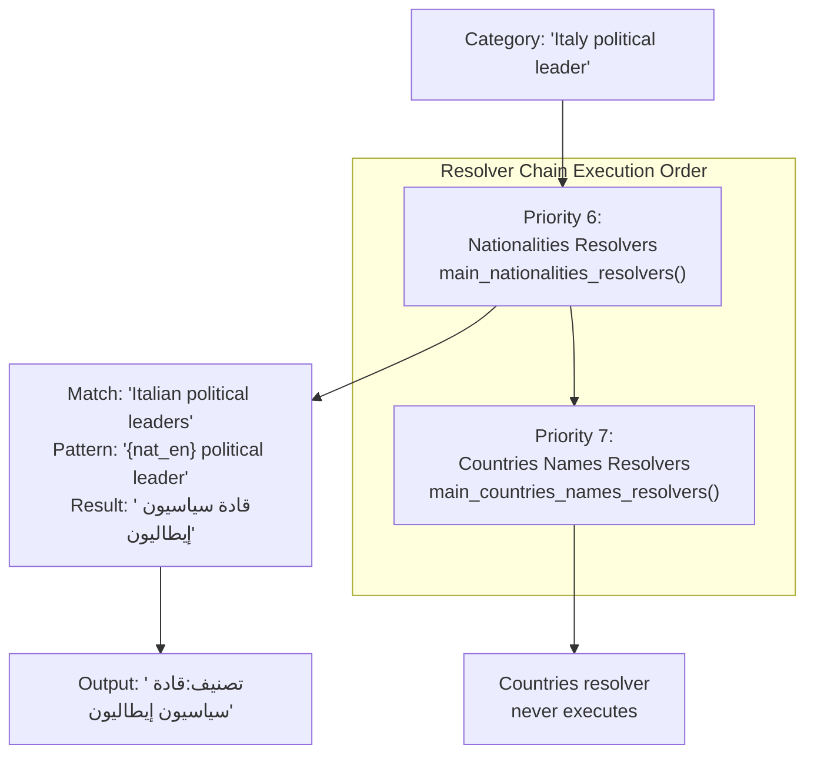
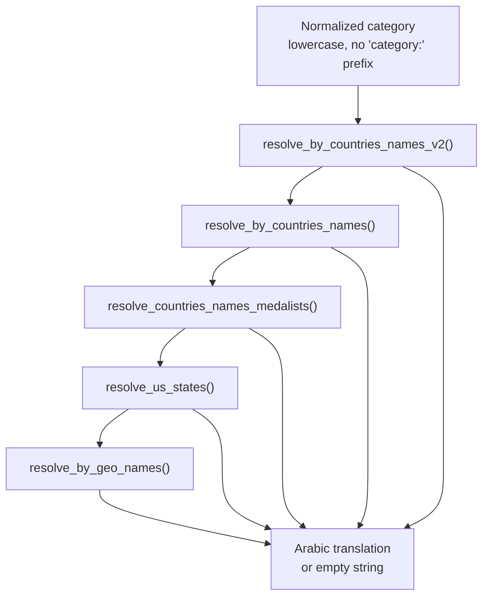
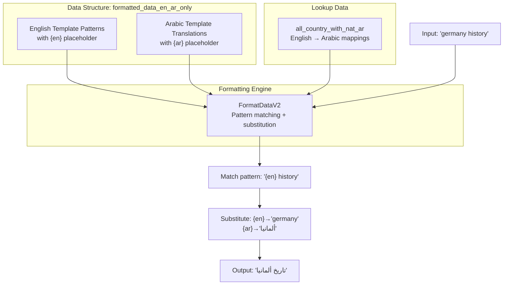
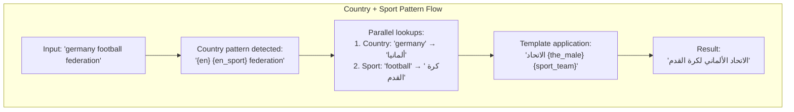
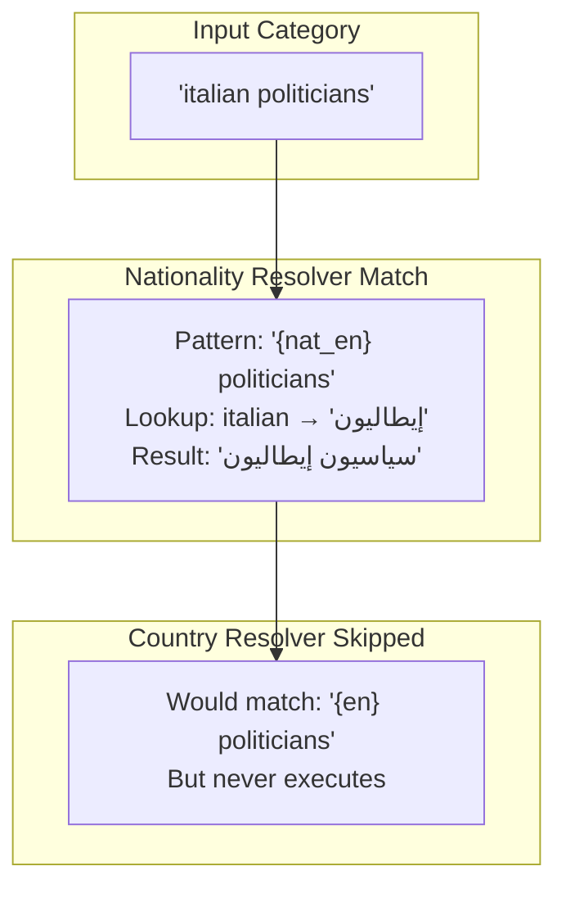
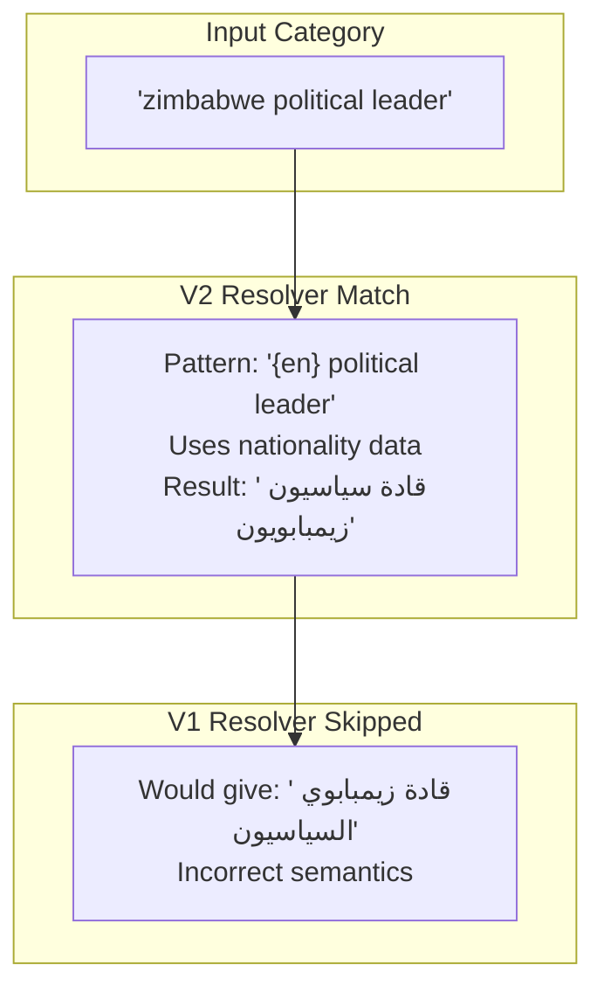
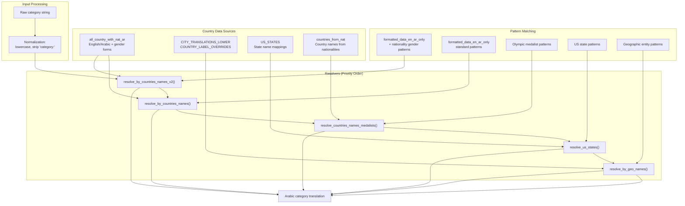

# Country Name Resolvers

> **Relevant source files**
> * [ArWikiCats/new_resolvers/__init__.py](../ArWikiCats/new_resolvers/__init__.py)
> * [ArWikiCats/new_resolvers/countries_names_resolvers/__init__.py](../ArWikiCats/new_resolvers/countries_names_resolvers/__init__.py)
> * [ArWikiCats/new_resolvers/countries_names_resolvers/countries_names_data.py](../ArWikiCats/new_resolvers/countries_names_resolvers/countries_names_data.py)
> * [ArWikiCats/new_resolvers/countries_names_with_sports/__init__.py](../ArWikiCats/new_resolvers/countries_names_with_sports/__init__.py)
> * [ArWikiCats/new_resolvers/countries_names_with_sports/p17_bot_sport.py](../ArWikiCats/new_resolvers/countries_names_with_sports/p17_bot_sport.py)
> * [ArWikiCats/new_resolvers/countries_names_with_sports/p17_sport_to_move_under.py](../ArWikiCats/new_resolvers/countries_names_with_sports/p17_sport_to_move_under.py)
> * [ArWikiCats/new_resolvers/films_resolvers/__init__.py](../ArWikiCats/new_resolvers/films_resolvers/__init__.py)
> * [ArWikiCats/new_resolvers/films_resolvers/resolve_films_labels.py](../ArWikiCats/new_resolvers/films_resolvers/resolve_films_labels.py)
> * [ArWikiCats/new_resolvers/jobs_resolvers/__init__.py](../ArWikiCats/new_resolvers/jobs_resolvers/__init__.py)
> * [ArWikiCats/new_resolvers/jobs_resolvers/relegin_jobs_new.py](../ArWikiCats/new_resolvers/jobs_resolvers/relegin_jobs_new.py)
> * [ArWikiCats/new_resolvers/nationalities_resolvers/__init__.py](../ArWikiCats/new_resolvers/nationalities_resolvers/__init__.py)
> * [ArWikiCats/new_resolvers/sports_resolvers/__init__.py](../ArWikiCats/new_resolvers/sports_resolvers/__init__.py)
> * [ArWikiCats/new_resolvers/sports_resolvers/countries_names_and_sports.py](../ArWikiCats/new_resolvers/sports_resolvers/countries_names_and_sports.py)
> * [ArWikiCats/new_resolvers/sports_resolvers/nationalities_and_sports.py](../ArWikiCats/new_resolvers/sports_resolvers/nationalities_and_sports.py)
> * [ArWikiCats/new_resolvers/sports_resolvers/pre_defined.py](../ArWikiCats/new_resolvers/sports_resolvers/pre_defined.py)
> * [ArWikiCats/new_resolvers/sports_resolvers/raw_sports.py](../ArWikiCats/new_resolvers/sports_resolvers/raw_sports.py)
> * [ArWikiCats/new_resolvers/sports_resolvers/raw_sports_with_suffixes.py](../ArWikiCats/new_resolvers/sports_resolvers/raw_sports_with_suffixes.py)
> * [ArWikiCats/new_resolvers/sports_resolvers/sport_lab_nat.py](../ArWikiCats/new_resolvers/sports_resolvers/sport_lab_nat.py)
> * [ArWikiCats/new_resolvers/teams_mappings_ends.py](../ArWikiCats/new_resolvers/teams_mappings_ends.py)

## Purpose and Scope

The Country Name Resolvers translate Wikipedia categories containing country names from English to Arabic. This resolver handles geographic and political entities such as country-specific history, government structures, military units, geographic features, and sports teams.

**Critical ordering requirement**: Country resolvers must execute **after** Nationality resolvers in the resolver chain to prevent semantic conflicts. For details on nationality-based categories, see [Nationality Resolvers](16.Nationality-Resolvers.md). For country+sport combinations, see [Sports Resolvers](19.Sports-Resolvers.md)

**Sources**: [ArWikiCats/new_resolvers/countries_names_resolvers/__init__.py L1-L59](../ArWikiCats/new_resolvers/countries_names_resolvers/__init__.py#L1-L59)

 [ArWikiCats/new_resolvers/__init__.py L64-L72](../ArWikiCats/new_resolvers/__init__.py#L64-L72)

## Resolver Chain Priority and Conflict Prevention

### Why Ordering Matters

The resolver chain priority places Nationalities (priority 6) before Countries (priority 7) to prevent misclassification of nationality adjectives as country names. Without this ordering, categories describing people by nationality would incorrectly resolve as categories about the country itself.

**Conflict Example**:

```yaml
Input: "Italy political leader"

❌ Wrong (if Countries resolver runs first):
   "قادة إيطاليا السياسيون" (political leaders of Italy)

✓ Correct (with Nationalities resolver first):
   "قادة سياسيون إيطاليون" (Italian political leaders)
```



**Sources**: [ArWikiCats/new_resolvers/__init__.py L64-L72](../ArWikiCats/new_resolvers/__init__.py#L64-L72)

 [ArWikiCats/new_resolvers/countries_names_resolvers/__init__.py L38-L50](../ArWikiCats/new_resolvers/countries_names_resolvers/__init__.py#L38-L50)

## Main Orchestration Function

The `main_countries_names_resolvers()` function orchestrates five specialized sub-resolvers in priority order:



### Internal Resolver Priority

Even within country resolvers, order matters. `resolve_by_countries_names_v2()` must execute before `resolve_by_countries_names()` to avoid misresolving patterns like "Zimbabwe political leader".

| Priority | Function | Purpose |
| --- | --- | --- |
| 1 | `resolve_by_countries_names_v2()` | Nationality-inflected patterns (prevents "Zimbabwe political leader" errors) |
| 2 | `resolve_by_countries_names()` | Standard country name patterns |
| 3 | `resolve_countries_names_medalists()` | Olympic medalists by country |
| 4 | `resolve_us_states()` | US state-specific categories |
| 5 | `resolve_by_geo_names()` | Geographic entity names |

**Sources**: [ArWikiCats/new_resolvers/countries_names_resolvers/__init__.py L20-L54](../ArWikiCats/new_resolvers/countries_names_resolvers/__init__.py#L20-L54)

## Country Name Data Patterns

### Pattern Structure

The `formatted_data_en_ar_only` dictionary contains 300+ translation patterns using placeholder substitution:

```yaml
Pattern: "{en} history" → "تاريخ {ar}"
Example: "Germany history" → "تاريخ ألمانيا"

Pattern: "government of {en}" → "حكومة {ar}"
Example: "government of France" → "حكومة فرنسا"
```



**Sources**: [ArWikiCats/new_resolvers/countries_names_resolvers/countries_names_data.py L21-L500](../ArWikiCats/new_resolvers/countries_names_resolvers/countries_names_data.py#L21-L500)

### Major Pattern Categories

The data mappings cover these category types:

| Category Type | Pattern Examples | Count |
| --- | --- | --- |
| Historical | `history of {en}`, `ancient history of {en}`, `military history of {en}` | ~20 |
| Governmental | `government of {en}`, `ministries of {en}`, `secretaries of {en}` | ~15 |
| Geographic | `mountains of {en}`, `rivers of {en}`, `cities of {en}` | ~80 |
| Military | `military of {en}`, `battles of {en}`, `naval units of {en}` | ~25 |
| Diplomatic | `ambassadors of {en}`, `foreign relations of {en}` | ~10 |
| Political Leaders | `presidents of {en}`, `prime ministers of {en}`, `heads of state of {en}` | ~20 |
| Sports Teams | `{en} national team`, `{en} olympics squad` | ~15 |
| Russian Extensions | `federal subjects of {en}`, `shipyards of {en}` (from `from_russia_data`) | ~150 |

**Sources**: [ArWikiCats/new_resolvers/countries_names_resolvers/countries_names_data.py L12-L507](../ArWikiCats/new_resolvers/countries_names_resolvers/countries_names_data.py#L12-L507)

### Example Patterns

```css
# Historical patterns
"history of {en}": "تاريخ {ar}"
"military history of {en}": "تاريخ {ar} العسكري"
"contemporary history of {en}": "تاريخ {ar} المعاصر"

# Governmental patterns
"government of {en}": "حكومة {ar}"
"parliament of {en}": "برلمان {ar}"
"cabinet of {en}": "مجلس وزراء {ar}"

# Geographic patterns
"mountains of {en}": "جبال {ar}"
"rivers of {en}": "أنهار {ar}"
"islands of {en}": "جزر {ar}"

# Sports patterns
"{en} national team": "منتخبات {ar} الوطنية"
"{en} olympics squad": "تشكيلات {ar} في الألعاب الأولمبية"
```

**Sources**: [ArWikiCats/new_resolvers/countries_names_resolvers/countries_names_data.py L46-L119](../ArWikiCats/new_resolvers/countries_names_resolvers/countries_names_data.py#L46-L119)

## Sub-Resolver Implementations

### countries_names_v2 Resolver

The V2 resolver handles nationality-inflected patterns that require gender-specific translations. This resolver must run first to prevent misclassification.

**Key characteristics**:

* Uses `FormatDataV2` for dictionary-based value lookup
* Accesses nationality data with gender forms (`male`, `female`, `the_male`, `the_female`)
* Pattern: `"{en} political leader"` → `"قادة سياسيون {males}"`

**Example**:

```yaml
Input: "zimbabwe political leader"
Lookup: all_country_with_nat_ar["zimbabwe"]
  → {ar: "زيمبابوي", males: "زيمبابويون", ...}
Pattern: "{en} political leader" → "قادة سياسيون {males}"
Result: "قادة سياسيون زيمبابويون"
```

**Sources**: [ArWikiCats/new_resolvers/countries_names_resolvers/countries_names_v2.py](../ArWikiCats/new_resolvers/countries_names_resolvers/countries_names_v2.py)

### countries_names Resolver

The standard resolver handles patterns where the country name appears in Arabic without gender inflection.

**Key characteristics**:

* Uses simple string substitution `{en}` → `{ar}`
* Handles most geographic and governmental categories
* Pattern: `"history of {en}"` → `"تاريخ {ar}"`

**Sources**: [ArWikiCats/new_resolvers/countries_names_resolvers/countries_names.py](../ArWikiCats/new_resolvers/countries_names_resolvers/countries_names.py)

### medalists_resolvers

Handles Olympic medalist categories by country and sport:

```css
# Pattern examples
"olympic gold medalists for {en}": "فائزون بميداليات ذهبية أولمبية من {ar}"
"olympic silver medalists for {en} in {en_sport}":
  "فائزون بميداليات فضية أولمبية من {ar} في {sport_label}"
```

**Sources**: [ArWikiCats/new_resolvers/countries_names_resolvers/medalists_resolvers.py](../ArWikiCats/new_resolvers/countries_names_resolvers/medalists_resolvers.py)

### us_states Resolver

Specialized resolver for US state-specific categories:

```css
# Pattern examples
"{state} politicians": "سياسيون من {ar_state}"
"{state} musicians": "موسيقيون من {ar_state}"
"governor of {state}": "حاكم {ar_state}"
```

**Data source**: `US_STATES` dictionary mapping English state names to Arabic translations.

**Sources**: [ArWikiCats/new_resolvers/countries_names_resolvers/us_states.py](../ArWikiCats/new_resolvers/countries_names_resolvers/us_states.py)

### geo_names_formats Resolver

Handles geographic entity names using specialized geographic data:

**Data sources**:

* `CITY_TRANSLATIONS_LOWER`: City name mappings
* `COUNTRY_LABEL_OVERRIDES`: Special-case country name translations
* Geographic hierarchies (regions, counties, etc.)

**Sources**: [ArWikiCats/new_resolvers/countries_names_resolvers/geo_names_formats.py](../ArWikiCats/new_resolvers/countries_names_resolvers/geo_names_formats.py)

## Integration with Sports Resolvers

Country name resolvers integrate with sports patterns for categories combining geographic and athletic elements:



### Country+Sport Pattern Examples

These patterns appear in both country and sports resolver modules:

```css
# From sports_resolvers/countries_names_and_sports.py
"{en} {en_sport} federation": "الاتحاد {the_male} {sport_team}"
"{en} national {en_sport} team": "منتخب {ar} {sport_team}"
"{en} {en_sport} league": "دوري {ar} {sport_team}"

# Country placeholder: {en} → {ar}, {the_male}
# Sport placeholder: {en_sport} → {sport_team}, {sport_label}
```

**Resolution priority**:

1. Sports resolvers (priority 5) attempt match first
2. Country resolvers (priority 7) handle pure country patterns
3. Country+Sport resolver (priority 10) handles fallback cases

**Sources**: [ArWikiCats/new_resolvers/sports_resolvers/countries_names_and_sports.py L22-L141](../ArWikiCats/new_resolvers/sports_resolvers/countries_names_and_sports.py#L22-L141)

 [ArWikiCats/new_resolvers/countries_names_with_sports/__init__.py L1-L37](../ArWikiCats/new_resolvers/countries_names_with_sports/__init__.py#L1-L37)

## Conflict Resolution Examples

### Example 1: Nationality vs Country Disambiguation



### Example 2: Internal Country Resolver Ordering



**Sources**: [ArWikiCats/new_resolvers/countries_names_resolvers/__init__.py L38-L50](../ArWikiCats/new_resolvers/countries_names_resolvers/__init__.py#L38-L50)

## Data Flow Architecture



**Sources**: [ArWikiCats/new_resolvers/countries_names_resolvers/__init__.py L1-L59](../ArWikiCats/new_resolvers/countries_names_resolvers/__init__.py#L1-L59)

 [ArWikiCats/new_resolvers/countries_names_resolvers/countries_names_data.py L1-L508](../ArWikiCats/new_resolvers/countries_names_resolvers/countries_names_data.py#L1-L508)

## Key Implementation Details

### Caching Strategy

All resolver functions use `@functools.lru_cache(maxsize=10000)` for performance:

```python
@functools.lru_cache(maxsize=10000)
def main_countries_names_resolvers(normalized_category: str) -> str:
    # Resolver logic
```

**Sources**: [ArWikiCats/new_resolvers/countries_names_resolvers/__init__.py L21-L22](../ArWikiCats/new_resolvers/countries_names_resolvers/__init__.py#L21-L22)

### Normalization Process

Input categories undergo consistent normalization:

1. `.strip()` - Remove leading/trailing whitespace
2. `.lower()` - Convert to lowercase
3. `.replace("category:", "")` - Remove category prefix

```
normalized_category = normalized_category.strip().lower().replace("category:", "")
```

**Sources**: [ArWikiCats/new_resolvers/countries_names_resolvers/__init__.py L34](../ArWikiCats/new_resolvers/countries_names_resolvers/__init__.py#L34)

### Return Value Behavior

All sub-resolvers follow the same contract:

* Return non-empty string on successful match
* Return empty string `""` if no pattern matches
* First non-empty result short-circuits the chain

**Sources**: [ArWikiCats/new_resolvers/countries_names_resolvers/__init__.py L38-L50](../ArWikiCats/new_resolvers/countries_names_resolvers/__init__.py#L38-L50)
