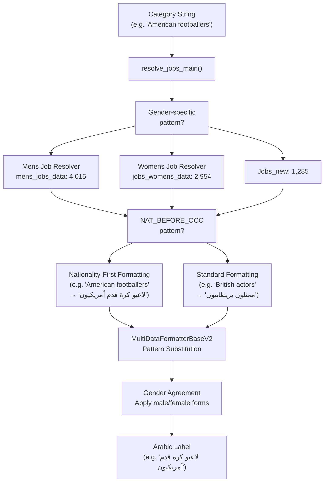
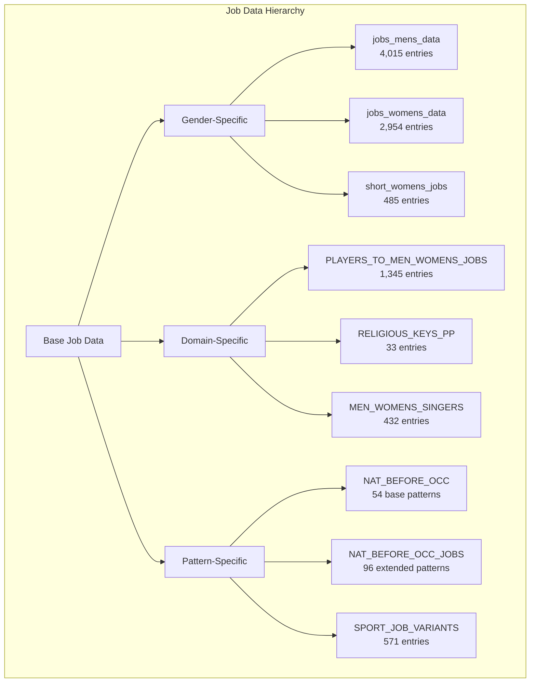
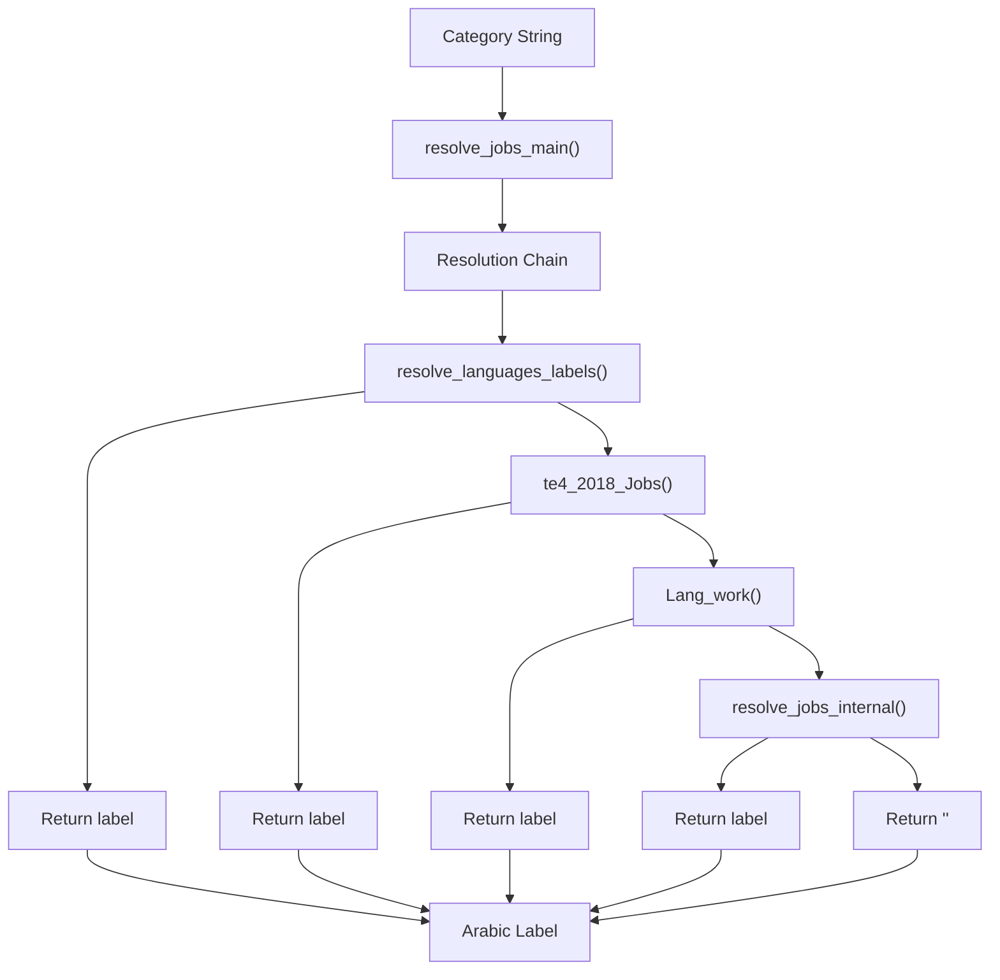
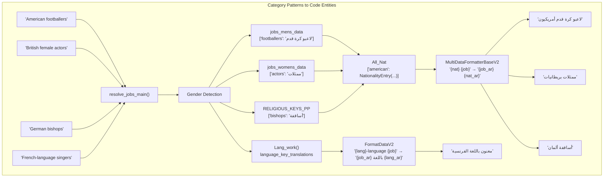
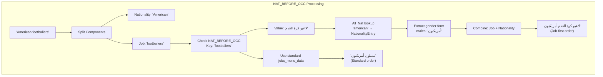
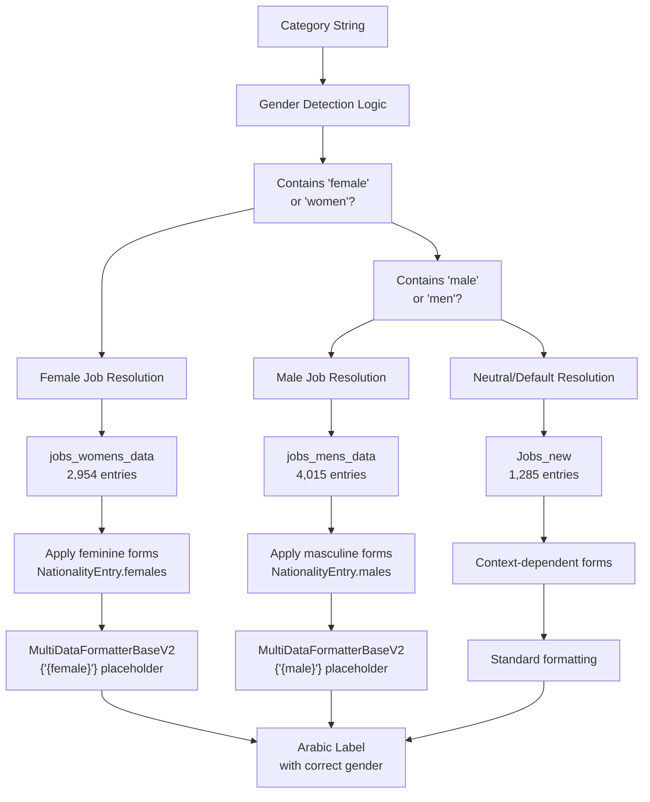
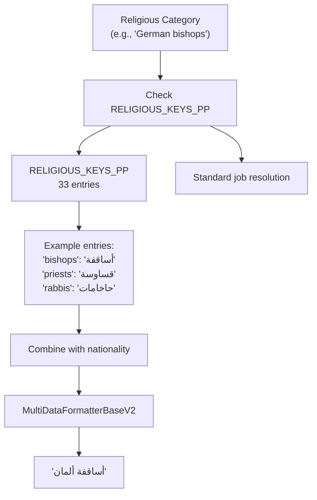
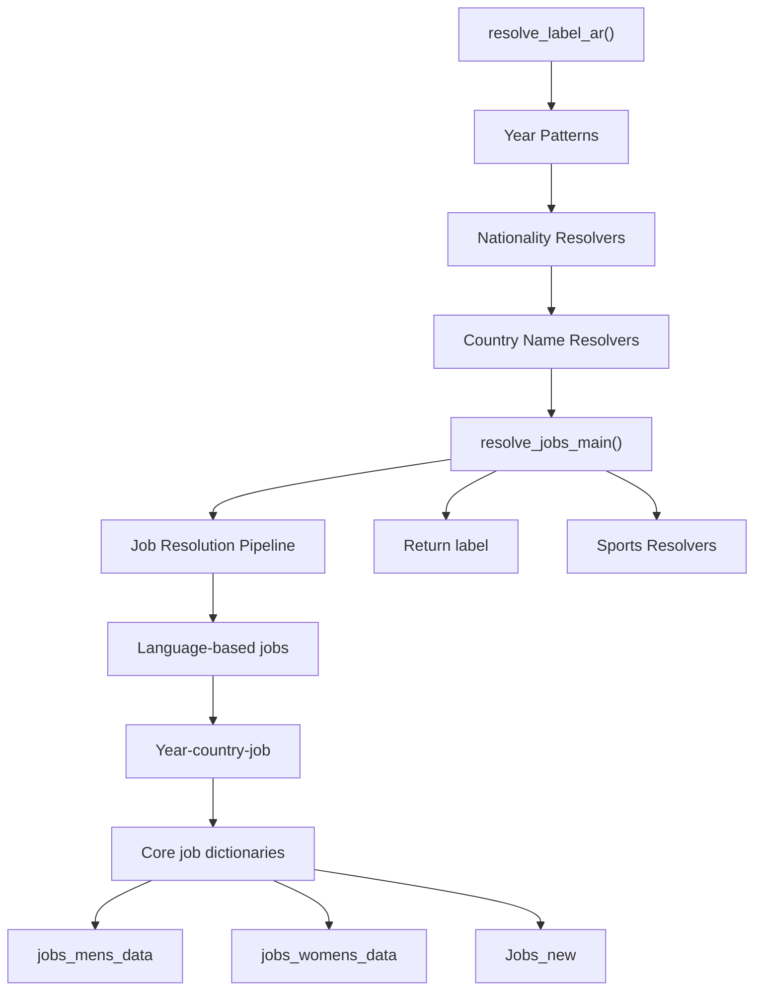
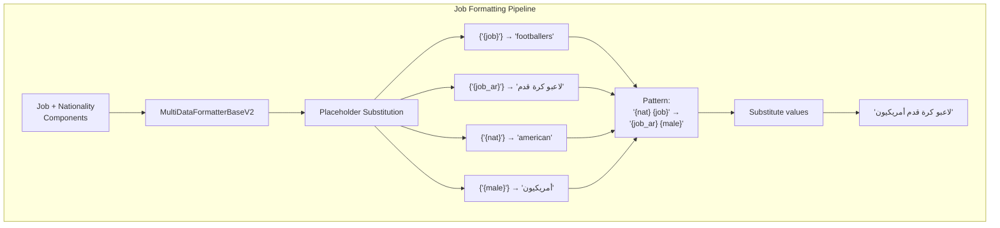

# Job Resolvers

> **Relevant source files**
> * [ArWikiCats/jsons/jobs/activists_keys.json](https://github.com/ArWikiCats/ArWikiCats/blob/4095f04e/ArWikiCats/jsons/jobs/activists_keys.json)
> * [ArWikiCats/new/handle_suffixes.py](https://github.com/ArWikiCats/ArWikiCats/blob/4095f04e/ArWikiCats/new/handle_suffixes.py)
> * [ArWikiCats/new_resolvers/jobs_resolvers/mens.py](https://github.com/ArWikiCats/ArWikiCats/blob/4095f04e/ArWikiCats/new_resolvers/jobs_resolvers/mens.py)
> * [ArWikiCats/new_resolvers/jobs_resolvers/utils.py](https://github.com/ArWikiCats/ArWikiCats/blob/4095f04e/ArWikiCats/new_resolvers/jobs_resolvers/utils.py)
> * [ArWikiCats/new_resolvers/jobs_resolvers/womens.py](https://github.com/ArWikiCats/ArWikiCats/blob/4095f04e/ArWikiCats/new_resolvers/jobs_resolvers/womens.py)
> * [ArWikiCats/new_resolvers/nationalities_resolvers/ministers_resolver.py](https://github.com/ArWikiCats/ArWikiCats/blob/4095f04e/ArWikiCats/new_resolvers/nationalities_resolvers/ministers_resolver.py)
> * [ArWikiCats/translations/__init__.py](https://github.com/ArWikiCats/ArWikiCats/blob/4095f04e/ArWikiCats/translations/__init__.py)
> * [ArWikiCats/translations/build_data/__init__.py](https://github.com/ArWikiCats/ArWikiCats/blob/4095f04e/ArWikiCats/translations/build_data/__init__.py)
> * [ArWikiCats/translations/funcs.py](https://github.com/ArWikiCats/ArWikiCats/blob/4095f04e/ArWikiCats/translations/funcs.py)
> * [ArWikiCats/translations/geo/__init__.py](https://github.com/ArWikiCats/ArWikiCats/blob/4095f04e/ArWikiCats/translations/geo/__init__.py)
> * [ArWikiCats/translations/geo/labels_country.py](https://github.com/ArWikiCats/ArWikiCats/blob/4095f04e/ArWikiCats/translations/geo/labels_country.py)
> * [ArWikiCats/translations/jobs/Jobs.py](https://github.com/ArWikiCats/ArWikiCats/blob/4095f04e/ArWikiCats/translations/jobs/Jobs.py)
> * [ArWikiCats/translations/jobs/Jobs2.py](https://github.com/ArWikiCats/ArWikiCats/blob/4095f04e/ArWikiCats/translations/jobs/Jobs2.py)
> * [ArWikiCats/translations/jobs/jobs_data_basic.py](https://github.com/ArWikiCats/ArWikiCats/blob/4095f04e/ArWikiCats/translations/jobs/jobs_data_basic.py)
> * [ArWikiCats/translations/jobs/jobs_players_list.py](https://github.com/ArWikiCats/ArWikiCats/blob/4095f04e/ArWikiCats/translations/jobs/jobs_players_list.py)
> * [ArWikiCats/translations/jobs/jobs_singers.py](https://github.com/ArWikiCats/ArWikiCats/blob/4095f04e/ArWikiCats/translations/jobs/jobs_singers.py)
> * [ArWikiCats/translations/jobs/jobs_womens.py](https://github.com/ArWikiCats/ArWikiCats/blob/4095f04e/ArWikiCats/translations/jobs/jobs_womens.py)
> * [ArWikiCats/translations/mixed/all_keys2.py](https://github.com/ArWikiCats/ArWikiCats/blob/4095f04e/ArWikiCats/translations/mixed/all_keys2.py)
> * [ArWikiCats/translations/mixed/female_keys.py](https://github.com/ArWikiCats/ArWikiCats/blob/4095f04e/ArWikiCats/translations/mixed/female_keys.py)
> * [ArWikiCats/translations/mixed/keys2.py](https://github.com/ArWikiCats/ArWikiCats/blob/4095f04e/ArWikiCats/translations/mixed/keys2.py)
> * [ArWikiCats/translations/others/__init__.py](https://github.com/ArWikiCats/ArWikiCats/blob/4095f04e/ArWikiCats/translations/others/__init__.py)
> * [ArWikiCats/translations/others/tax_table.py](https://github.com/ArWikiCats/ArWikiCats/blob/4095f04e/ArWikiCats/translations/others/tax_table.py)
> * [ArWikiCats/translations/sports/Sport_key.py](https://github.com/ArWikiCats/ArWikiCats/blob/4095f04e/ArWikiCats/translations/sports/Sport_key.py)
> * [ArWikiCats/translations/tv/films_mslslat.py](https://github.com/ArWikiCats/ArWikiCats/blob/4095f04e/ArWikiCats/translations/tv/films_mslslat.py)
> * [_work_files/data_len.json](https://github.com/ArWikiCats/ArWikiCats/blob/4095f04e/_work_files/data_len.json)

## Purpose and Scope

This page documents the job resolution subsystem within the ArWikiCats resolver chain. Job resolvers translate English Wikipedia categories containing occupation names into grammatically correct Arabic equivalents, handling gender agreement, nationality-occupation ordering, and specialized domains like sports jobs, religious occupations, and professional roles.

For nationality-based category resolution without job components, see [Nationality Resolvers](16.Nationality-Resolvers.md). For sports-specific categories that don't involve occupations, see [Sports Resolvers](19.Sports-Resolvers.md). For the overall resolver chain orchestration, see [Resolver Chain](/ArWikiCats/ArWikiCats/5-resolver-system).

---

## Job Resolution Architecture

The job resolution system operates as the fourth priority resolver in the main resolution chain (R4 in the overall architecture). It attempts to match categories after year patterns, nationalities, and country names have been tried.

### Job Resolver Execution Flow



**Sources:** ArWikiCats/new_resolvers/jobs_resolvers/**init**.py, ArWikiCats/translations/jobs/Jobs.py, ArWikiCats/translations/jobs/jobs_data_basic.py

---

## Job Data Organization

Job translation data is organized into multiple dictionaries based on gender specificity and domain specialization. The system maintains separate datasets for men's and women's occupations to ensure proper Arabic gender agreement.

### Primary Job Dictionaries

| Dictionary Name | Size | Purpose | File Location |
| --- | --- | --- | --- |
| `jobs_mens_data` | 4,015 | Men's occupations with masculine Arabic forms | ArWikiCats/jsons/jobs/ |
| `jobs_womens_data` | 2,954 | Women's occupations with feminine Arabic forms | ArWikiCats/jsons/jobs/ |
| `Jobs_new` | 1,285 | Gender-neutral occupations | ArWikiCats/jsons/jobs/ |
| `NAT_BEFORE_OCC` | 54 | Jobs requiring nationality-first ordering | ArWikiCats/jsons/jobs/ |
| `NAT_BEFORE_OCC_JOBS` | 96 | Extended nationality-first patterns | ArWikiCats/jsons/jobs/jobs_data_basic.py |
| `RELIGIOUS_KEYS_PP` | 33 | Religious occupation translations | ArWikiCats/jsons/jobs/jobs_data_basic.py |

### Specialized Job Datasets



**Sources:** ArWikiCats/translations/**init**.py, _work_files/data_len.json, ArWikiCats/translations/jobs/Jobs.py, ArWikiCats/translations/jobs/jobs_data_basic.py, ArWikiCats/translations/jobs/jobs_players_list.py

---

## Core Job Resolver Functions

### resolve_jobs_main

The `resolve_jobs_main` function serves as the primary entry point for job category resolution. It orchestrates the resolution pipeline by attempting multiple resolver strategies in sequence.



### Resolution Priority Levels

The job resolver attempts multiple resolution strategies in this priority order:

1. **Language-based labels** (`resolve_languages_labels`): Handles categories like "French-language singers" or "German-language activists"
2. **Year-country-job patterns** (`te4_2018_Jobs`): Resolves categories with temporal and geographic components like "2018 British footballers"
3. **Language work patterns** (`Lang_work`): Alternative language-based job resolution
4. **Core job resolution** (`resolve_jobs_internal`): Primary job dictionary lookup using gender-specific data

**Sources:** ArWikiCats/new_resolvers/jobs_resolvers/**init**.py, ArWikiCats/make_bots/countries_names_with_sports/t4_2018_jobs.py

---

## Job Resolution with Code Mapping

This diagram maps natural language category patterns to the specific resolver functions and data dictionaries used in the codebase.



**Sources:** ArWikiCats/new_resolvers/jobs_resolvers/**init**.py, ArWikiCats/translations/jobs/Jobs.py, ArWikiCats/translations/nats/Nationality.py, ArWikiCats/translations_formats/DataModel/model_data_v2.py

---

## NAT_BEFORE_OCC Pattern Handling

The `NAT_BEFORE_OCC` (Nationality Before Occupation) pattern system handles English categories where the nationality precedes the occupation, requiring special word order transformation in Arabic. For certain occupations, Arabic grammar prefers the occupation before the nationality, opposite to the English order.

### NAT_BEFORE_OCC Data Structure

```python
# Example entries from NAT_BEFORE_OCC
{
    "footballers": "لاعبو كرة القدم",
    "basketball players": "لاعبو كرة السلة", 
    "baseball players": "لاعبو كرة القاعدة",
    "rugby players": "لاعبو الرجبي",
    "cricketers": "لاعبو الكريكيت"
}
```

### Pattern Transformation Logic



### NAT_BEFORE_OCC vs Standard Job Resolution

| Pattern Type | English Example | Arabic Output | Word Order |
| --- | --- | --- | --- |
| NAT_BEFORE_OCC | American footballers | لاعبو كرة القدم أمريكيون | Job → Nationality |
| NAT_BEFORE_OCC | German basketball players | لاعبو كرة السلة ألمان | Job → Nationality |
| Standard | British actors | ممثلون بريطانيون | Job → Nationality |
| Standard | French writers | كتاب فرنسيون | Job → Nationality |

**Note:** Both patterns result in Job→Nationality order in Arabic, but `NAT_BEFORE_OCC` entries use expanded job phrases (e.g., "لاعبو كرة القدم" instead of just "لاعبو").

**Sources:** ArWikiCats/translations/jobs/jobs_data_basic.py:7-54, ArWikiCats/new_resolvers/jobs_resolvers/mens.py, ArWikiCats/translations/nats/Nationality.py

---

## Gender-Specific Job Resolution

The job resolver implements comprehensive gender-aware translation to ensure proper Arabic gender agreement. The system maintains separate dictionaries and applies gender-specific transformations.

### Gender Detection and Routing



### Gender-Specific Dictionary Structure

```python
# Example from jobs_mens_data
jobs_mens_data = {
    "footballers": "لاعبو كرة قدم",
    "actors": "ممثلون",
    "writers": "كتاب",
    "politicians": "سياسيون"
}

# Example from jobs_womens_data
jobs_womens_data = {
    "footballers": "لاعبات كرة قدم",
    "actors": "ممثلات",
    "writers": "كاتبات",
    "politicians": "سياسيات"
}

# Example from short_womens_jobs (485 entries)
# Used for gender transformation: male form → female form
short_womens_jobs = {
    "لاعبو": "لاعبات",
    "ممثلون": "ممثلات",
    "كتاب": "كاتبات"
}
```

### Gender Agreement with Nationalities

When combining jobs with nationalities, the system uses `NationalityEntry` gender forms:

| Category | Job Dictionary | Nationality Form | Result |
| --- | --- | --- | --- |
| American footballers (male) | jobs_mens_data | NationalityEntry.males | لاعبو كرة قدم أمريكيون |
| American footballers (female) | jobs_womens_data | NationalityEntry.females | لاعبات كرة قدم أمريكيات |
| British actors (male) | jobs_mens_data | NationalityEntry.males | ممثلون بريطانيون |
| British actors (female) | jobs_womens_data | NationalityEntry.females | ممثلات بريطانيات |

**Sources:** ArWikiCats/translations/jobs/Jobs.py, ArWikiCats/translations/jobs/jobs_womens.py:9-485, ArWikiCats/new_resolvers/jobs_resolvers/mens.py, ArWikiCats/new_resolvers/jobs_resolvers/womens.py, ArWikiCats/translations/nats/Nationality.py

---

## Religious and Specialty Job Resolution

The job resolver includes specialized handling for religious occupations and other domain-specific jobs that require different translation patterns.

### Religious Jobs Processing



### Religious Keys Structure

The `RELIGIOUS_KEYS_PP` dictionary contains 33 religious occupation translations:

```css
RELIGIOUS_KEYS_PP = {
    "bishops": "أساقفة",
    "priests": "قساوسة", 
    "rabbis": "حاخامات",
    "imams": "أئمة",
    "monks": "رهبان",
    "nuns": "راهبات",
    # ... 27 more entries
}
```

### Specialty Job Categories

| Specialty Domain | Dictionary | Size | Example Keys |
| --- | --- | --- | --- |
| Sports Jobs | PLAYERS_TO_MEN_WOMENS_JOBS | 1,345 | "football players", "basketball players" |
| Sport Variants | SPORT_JOB_VARIANTS | 571 | "footballers", "cricketers" |
| Singers | MEN_WOMENS_SINGERS | 432 | "singers", "vocalists" |
| Religious | RELIGIOUS_KEYS_PP | 33 | "bishops", "priests", "rabbis" |

**Sources:** ArWikiCats/translations/jobs/jobs_data_basic.py:124-172, ArWikiCats/translations/jobs/jobs_players_list.py, ArWikiCats/new_resolvers/jobs_resolvers/**init**.py

---

## Job Resolver Integration Points

### Integration with Main Resolution Chain

The job resolver integrates into the main resolution chain through `resolve_label_ar()` in the following sequence:



### Data Flow Through Formatters



**Sources:** ArWikiCats/main_processers/main_resolve.py, ArWikiCats/new_resolvers/reslove_all.py, ArWikiCats/translations_formats/DataModel/model_data_v2.py

---

## Job Resolution Examples

### Example Resolution Paths

| English Category | Resolution Path | Dictionary Used | Arabic Output |
| --- | --- | --- | --- |
| American footballers | NAT_BEFORE_OCC → jobs_mens_data | NAT_BEFORE_OCC, All_Nat | لاعبو كرة القدم أمريكيون |
| British female actors | Gender detection → jobs_womens_data | jobs_womens_data, All_Nat | ممثلات بريطانيات |
| German bishops | RELIGIOUS_KEYS_PP | RELIGIOUS_KEYS_PP, All_Nat | أساقفة ألمان |
| French-language singers | Lang_work | language_key_translations | مغنون باللغة الفرنسية |
| 2018 Brazilian footballers | te4_2018_Jobs | NAT_BEFORE_OCC, YEAR_DATA | لاعبو كرة القدم برازيليون في 2018 |

### Complex Job Category Handling

For categories with multiple components (nationality + job + time/location), the job resolver coordinates with other resolvers:

1. **Time component** extracted by year resolvers
2. **Nationality component** matched against `All_Nat` (799 entries)
3. **Job component** looked up in appropriate gender-specific dictionary
4. **Pattern formatter** combines components in correct Arabic word order
5. **Gender agreement** applied to all adjective forms

**Sources:** ArWikiCats/new_resolvers/jobs_resolvers/**init**.py, ArWikiCats/make_bots/countries_names_with_sports/t4_2018_jobs.py, changelog.md:156-188

---

## Performance and Caching

The job resolver implements caching strategies to optimize repeated lookups:

### Caching Mechanisms

| Function | Caching Method | Purpose |
| --- | --- | --- |
| `resolve_jobs_main` | `functools.lru_cache` | Cache final resolution results |
| `load_jobs_data` | Module-level singleton | Load dictionaries once at startup |
| Formatter instances | Result memoization | Cache pattern matching results |

### Memory Footprint

Job-related data occupies approximately:

* `jobs_mens_data`: ~4,015 entries
* `jobs_womens_data`: ~2,954 entries
* `Jobs_new`: ~1,285 entries
* Supporting data (NAT_BEFORE_OCC, RELIGIOUS_KEYS_PP, etc.): ~700 entries
* **Total**: ~8,900 job translation entries loaded into memory

**Sources:** changelog.md:42, ArWikiCats/translations/jobs/, ArWikiCats/config.py