# Architecture

> **Relevant source files**
> * [.github/copilot-instructions.md](../.github/copilot-instructions.md)
> * [.github/workflows/python-publish.yml](../.github/workflows/python-publish.yml)
> * [ArWikiCats/config.py](../ArWikiCats/config.py)
> * [ArWikiCats/jsons/population/pop_All_2018.json](../ArWikiCats/jsons/population/pop_All_2018.json)
> * [ArWikiCats/main_processers/main_resolve.py](../ArWikiCats/main_processers/main_resolve.py)
> * [CLAUDE.md](../CLAUDE.md)
> * [README.md](../README.md)
> * [changelog.md](../changelog.md)
> * [tests_require_fixes/test_papua_new_guinean.py](../tests_require_fixes/test_papua_new_guinean.py)
> * [tests_require_fixes/test_skip_data_all.py](../tests_require_fixes/test_skip_data_all.py)
> * [tests_require_fixes/text_to_fix.py](../tests_require_fixes/text_to_fix.py)

This page describes the overall system architecture of ArWikiCats. The system translates English Wikipedia category labels to Arabic through a five-layer architecture: a public API layer, a main resolution engine, a prioritized resolver chain, a template formatting engine, and a translation data layer.

For detailed information about specific subsystems, see the child pages: page 3.1 (Resolution Pipeline), page 3.2 (Data Architecture), and page 3.3 (Resolver Chain Priority System).

## System Architecture Overview

ArWikiCats implements a five-layer architecture that processes category labels through specialized resolvers and formatting engines:

**Diagram: Complete System Architecture**

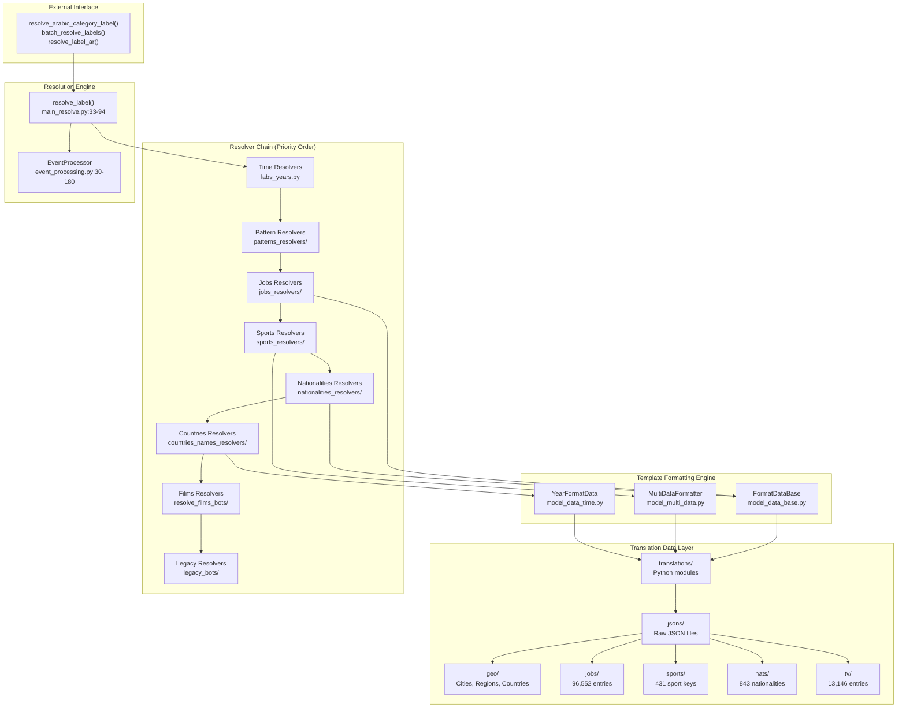

**Sources:** [ArWikiCats/main_processers/main_resolve.py L1-L106](../ArWikiCats/main_processers/main_resolve.py#L1-L106)

 [ArWikiCats/__init__.py L1-L42](../ArWikiCats/__init__.py#L1-L42)

 [ArWikiCats/event_processing.py L1-L180](../ArWikiCats/event_processing.py#L1-L180)

 [ArWikiCats/new_resolvers/__init__.py L1-L57](../ArWikiCats/new_resolvers/__init__.py#L1-L57)

## Layer 1: External Interface (Public API)

The public API provides entry points for category translation. All functions are exported from `ArWikiCats/__init__.py`.

**Diagram: Public API Functions**

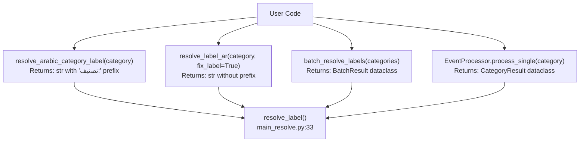

| Function | Location | Purpose | Return Type |
| --- | --- | --- | --- |
| `resolve_label_ar()` | `main_resolve.py:96-99` | Translate single category without prefix | `str` |
| `resolve_arabic_category_label()` | `__init__.py:19-24` | Translate with "تصنيف:" prefix | `str` |
| `batch_resolve_labels()` | `__init__.py:27-32` | Process multiple categories | `BatchResult` |
| `EventProcessor.process_single()` | `event_processing.py:67-111` | Detailed processing with metadata | `CategoryResult` |

**Sources:** [ArWikiCats/__init__.py L1-L42](../ArWikiCats/__init__.py#L1-L42)

 [ArWikiCats/main_processers/main_resolve.py L96-L99](../ArWikiCats/main_processers/main_resolve.py#L96-L99)

 [ArWikiCats/event_processing.py L67-L111](../ArWikiCats/event_processing.py#L67-L111)

## Layer 2: Resolution Engine

The resolution engine coordinates category processing through `resolve_label()` in `main_resolve.py`. This function implements the waterfall resolver pattern with early exit on first match.

**Diagram: Resolution Engine Flow**

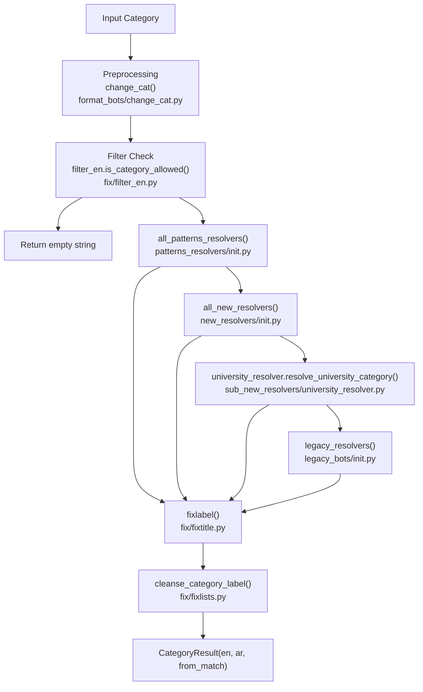

The `resolve_label()` function is cached with `@functools.lru_cache(maxsize=50000)` for performance. Each category is processed once and cached for subsequent requests.

**Sources:** [ArWikiCats/main_processers/main_resolve.py L33-L94](../ArWikiCats/main_processers/main_resolve.py#L33-L94)

 [ArWikiCats/format_bots/change_cat.py L1-L25](../ArWikiCats/format_bots/change_cat.py#L1-L25)

 [ArWikiCats/fix/filter_en.py L1-L50](../ArWikiCats/fix/filter_en.py#L1-L50)

 [ArWikiCats/fix/fixtitle.py L1-L150](../ArWikiCats/fix/fixtitle.py#L1-L150)

## Layer 3: Resolver Chain (Priority Order)

The resolver chain processes categories through specialized resolvers in priority order. This ordering prevents conflicts where multiple resolvers could match the same pattern.

**Diagram: Resolver Chain Priority**

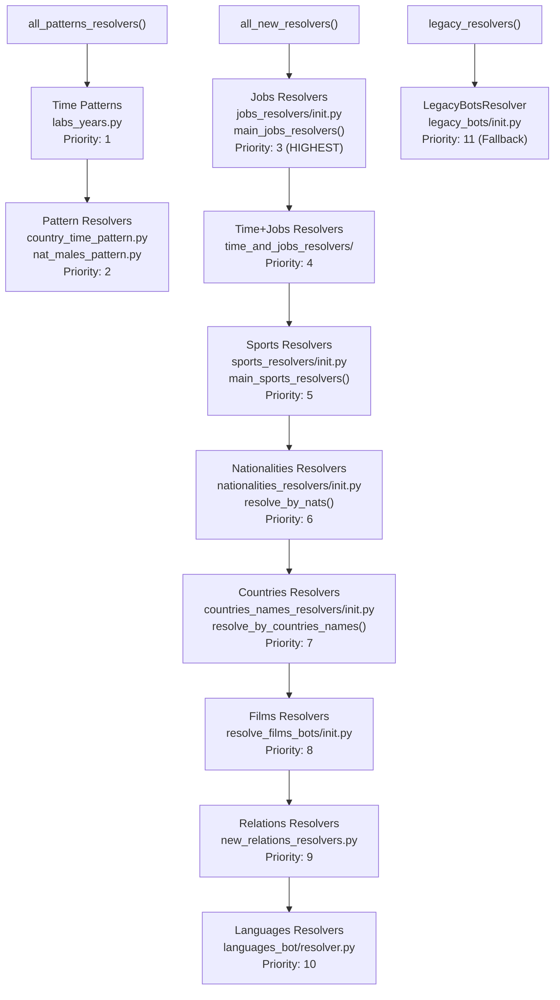

The priority ordering is critical to prevent mismatches. For example:

* **Jobs before Sports**: "football manager" could match sports ("football") or jobs ("manager"). Jobs wins to correctly identify it as a management position.
* **Nationalities before Countries**: "Italy political leader" should resolve as nationality-based ("قادة سياسيون إيطاليون") not country-based ("قادة إيطاليا السياسيون").

**Sources:** [ArWikiCats/new_resolvers/__init__.py L1-L57](../ArWikiCats/new_resolvers/__init__.py#L1-L57)

 [ArWikiCats/patterns_resolvers/__init__.py L1-L30](../ArWikiCats/patterns_resolvers/__init__.py#L1-L30)

 [ArWikiCats/legacy_bots/__init__.py L29-L57](../ArWikiCats/legacy_bots/__init__.py#L29-L57)

## Layer 4: Template Formatting Engine

The template formatting engine implements pattern matching and placeholder replacement using a class hierarchy rooted in `FormatDataBase`.

**Diagram: Template Formatting Class Hierarchy**

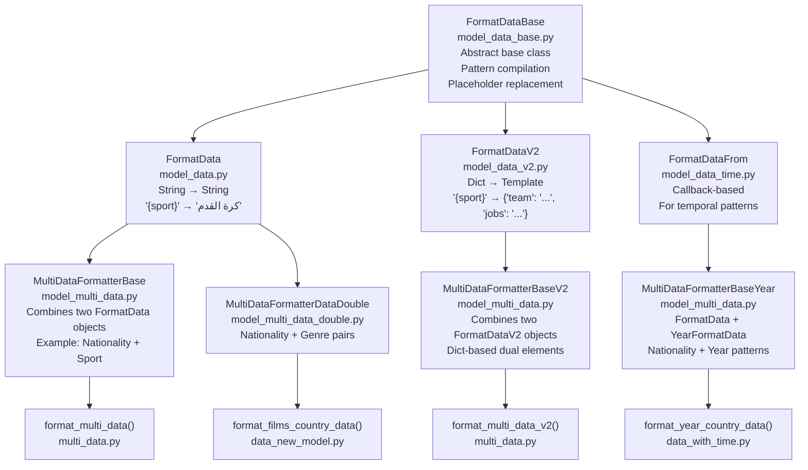

Each formatter provides:

* Pattern compilation: Regex patterns with case-insensitive matching
* Placeholder substitution: `{sport}` → `{sport_ar}` with Arabic translations
* Result caching: `@lru_cache` on search methods
* Label reordering: Ensures grammatically correct Arabic

**Example Flow:**

```yaml
Input: "british football players"
1. Match pattern: "{nat} {sport} players"
2. Extract: nat="british", sport="football"
3. Lookup: nat_ar="بريطانيون", sport_ar="كرة القدم"
4. Template: "لاعبو {sport} {nat}"
5. Output: "لاعبو كرة القدم بريطانيون"
```

**Sources:** [ArWikiCats/translations_formats/DataModel/model_data_base.py L1-L150](../ArWikiCats/translations_formats/DataModel/model_data_base.py#L1-L150)

 [ArWikiCats/translations_formats/DataModel/model_multi_data.py L1-L400](../ArWikiCats/translations_formats/DataModel/model_multi_data.py#L1-L400)

 [ArWikiCats/translations_formats/multi_data.py L1-L100](../ArWikiCats/translations_formats/multi_data.py#L1-L100)

## Layer 5: Translation Data Layer

The translation data layer provides domain-specific translation mappings. Raw JSON files are processed by Python aggregator modules that build lookup tables.

**Diagram: Translation Data Aggregation**

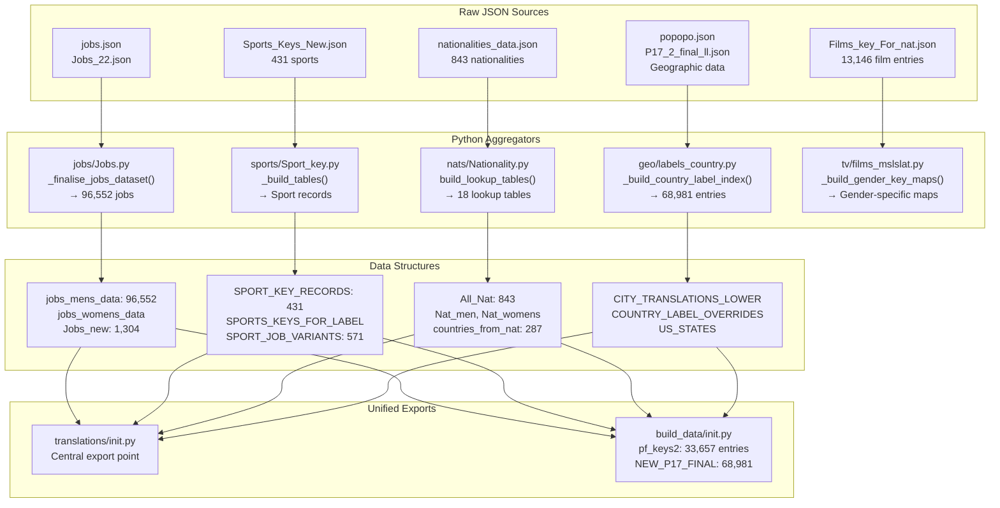

| Domain | Raw JSON Location | Python Module | Exported Data Structures | Size |
| --- | --- | --- | --- | --- |
| Jobs | `jsons/jobs/` | `translations/jobs/Jobs.py` | `jobs_mens_data`, `jobs_womens_data` | 96,552 + ~40,000 |
| Sports | `jsons/sports/` | `translations/sports/Sport_key.py` | `SPORT_KEY_RECORDS`, `SPORT_JOB_VARIANTS` | 431 + 571 |
| Nationalities | `jsons/nationalities/` | `translations/nats/Nationality.py` | `All_Nat`, 18 lookup tables | 843 entries |
| Geography | `jsons/geography/` | `translations/geo/labels_country.py` | `NEW_P17_FINAL`, `CITY_TRANSLATIONS` | 68,981 + 10,526 |
| Films/TV | `jsons/media/` | `translations/tv/films_mslslat.py` | `Films_key_For_nat`, gender-specific maps | 13,146 |
| Politics | `jsons/keys/` | `translations/politics/ministers_keys.py` | `ministers_keys` | ~94 |

The system maintains two export layers:

1. **Direct exports** via `translations/__init__.py` for immediate use by resolvers
2. **Aggregated exports** via `build_data/__init__.py` for combined datasets (e.g., `pf_keys2` with 33,657 entries)

**Sources:** [ArWikiCats/translations/__init__.py L1-L50](../ArWikiCats/translations/__init__.py#L1-L50)

 [ArWikiCats/translations/jobs/Jobs.py L1-L200](../ArWikiCats/translations/jobs/Jobs.py#L1-L200)

 [ArWikiCats/translations/sports/Sport_key.py L1-L150](../ArWikiCats/translations/sports/Sport_key.py#L1-L150)

 [ArWikiCats/translations/nats/Nationality.py L1-L300](../ArWikiCats/translations/nats/Nationality.py#L1-L300)

## Core Design Patterns

### Waterfall Resolver Pattern with Early Exit

The resolution engine implements a waterfall pattern where resolvers are tried in sequence until one succeeds:

```markdown
# From main_resolve.py:72-82
category_lab = all_patterns_resolvers(changed_cat)
from_match = bool(category_lab)

if not category_lab:
    category_lab = (
        ""
        or all_new_resolvers(changed_cat)
        or university_resolver.resolve_university_category(changed_cat)
        or legacy_resolvers(changed_cat)
        or ""
    )
```

This pattern ensures:

1. Unambiguous patterns resolve first (years, decades, centuries)
2. High-frequency patterns prioritized (jobs before sports)
3. Expensive lookups deferred (legacy resolvers last)
4. Deterministic resolution order prevents conflicts

**Sources:** [ArWikiCats/main_processers/main_resolve.py L72-L82](../ArWikiCats/main_processers/main_resolve.py#L72-L82)

### Caching Strategy

The system implements multi-level caching to optimize performance:

| Cache Level | Implementation | Location | Benefit |
| --- | --- | --- | --- |
| Function-level | `@functools.lru_cache(maxsize=50000)` | `main_resolve.py:32` | 50,000 category results cached |
| Resolver-level | `@functools.lru_cache(maxsize=None)` | Individual resolvers | Unlimited resolver-specific cache |
| Pattern-level | Compiled regex cache | `FormatDataBase` classes | Regex compilation avoided |
| Data-level | Module-level dictionaries | `translations/` modules | Instant lookup vs. file I/O |

**Example:**

```python
# From main_resolve.py:32-33
@functools.lru_cache(maxsize=50000)
def resolve_label(category: str, fix_label: bool = True) -> CategoryResult:
```

First call processes through entire resolver chain (~10-50ms). Subsequent calls retrieve from cache (<1ms).

**Sources:** [ArWikiCats/main_processers/main_resolve.py L32-L33](../ArWikiCats/main_processers/main_resolve.py#L32-L33)

 [changelog.md L277](../changelog.md#L277-L277)

### Domain-Driven Data Organization

Translation data is organized by semantic domain rather than technical structure:

```markdown
translations/
├── jobs/                   # Occupations and professions
│   ├── Jobs.py            # jobs_mens_data, jobs_womens_data
│   ├── activists_jobs.py  # Activism-specific roles
│   └── religious_jobs.py  # Religious positions
├── sports/                 # Sports and teams
│   ├── Sport_key.py       # SPORT_KEY_RECORDS
│   └── sub_teams.py       # Team-specific mappings
├── nats/                   # Nationalities
│   └── Nationality.py     # All_Nat, 18 lookup tables
├── geo/                    # Geographic entities
│   ├── labels_country.py  # Country names
│   └── labels_city.py     # City names
└── tv/                     # Films and television
    └── films_mslslat.py   # Genre and nationality patterns
```

Each domain maintains:

* Python dictionaries for frequently-accessed data (loaded at import time)
* JSON files for large datasets in `jsons/` directory
* Aggregator functions that process raw JSON into structured lookups

**Sources:** [ArWikiCats/translations/__init__.py L1-L50](../ArWikiCats/translations/__init__.py#L1-L50)

 [README.md L90-L113](../README.md#L90-L113)

## Component Interaction Example

The following sequence diagram shows how a category flows through the system:

**Diagram: Resolution Sequence for "2010 British football players"**

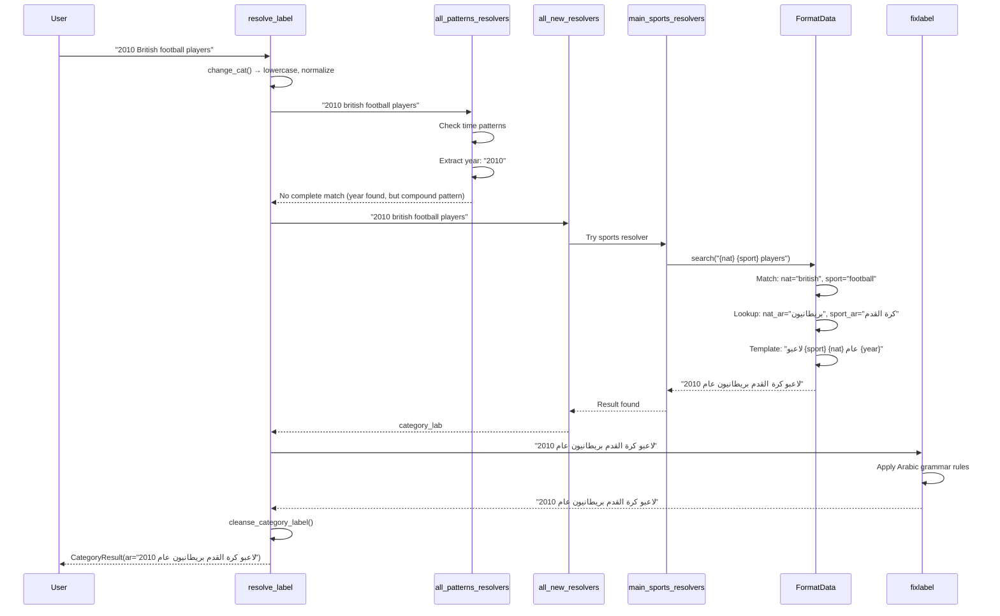

**Sources:** [ArWikiCats/main_processers/main_resolve.py L33-L94](../ArWikiCats/main_processers/main_resolve.py#L33-L94)

 [ArWikiCats/new_resolvers/__init__.py L1-L57](../ArWikiCats/new_resolvers/__init__.py#L1-L57)

 [ArWikiCats/translations_formats/DataModel/model_data_base.py L1-L150](../ArWikiCats/translations_formats/DataModel/model_data_base.py#L1-L150)

## Data Flow Pipeline

The translation pipeline processes categories through six stages:

**Diagram: Complete Data Flow Pipeline**

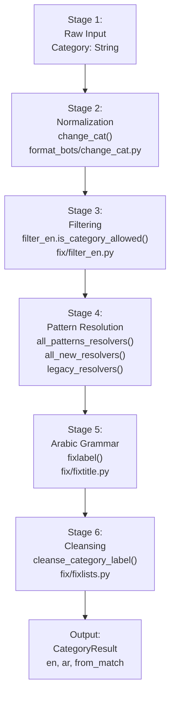

### Stage 1: Raw Input

Input categories may include:

* Wikipedia category syntax: "Category:British footballers"
* Plain text: "British footballers"
* With year prefixes: "2010 British footballers"
* Complex patterns: "21st-century British football managers"

### Stage 2: Normalization

The `change_cat()` function in [ArWikiCats/format_bots/change_cat.py L1-L25](../ArWikiCats/format_bots/change_cat.py#L1-L25)

 applies:

* Lowercase conversion
* Underscore to space: "British_footballers" → "british footballers"
* "Category:" prefix removal
* Whitespace normalization
* Key mappings: "labor" → "labour", "womens" → "female"

### Stage 3: Filtering

The `filter_en.is_category_allowed()` function in [ArWikiCats/fix/filter_en.py L1-L50](../ArWikiCats/fix/filter_en.py#L1-L50)

 rejects categories containing blocked terms or patterns. Filtered categories return an empty Arabic label.

### Stage 4: Pattern Resolution

This stage attempts resolvers in priority order:

1. `all_patterns_resolvers()` - Time patterns and complex patterns
2. `all_new_resolvers()` - Domain-specific resolvers (jobs, sports, nats, countries, films)
3. `university_resolver.resolve_university_category()` - University-specific patterns
4. `legacy_resolvers()` - Legacy bot fallback

Each resolver returns on first match (early exit pattern).

### Stage 5: Arabic Grammar

The `fixlabel()` function in [ArWikiCats/fix/fixtitle.py L1-L150](../ArWikiCats/fix/fixtitle.py#L1-L150)

 applies:

* Article agreement: Proper handling of "ال" prefix
* Preposition insertion: Add "في" or "من" based on English separators
* Duplicate removal: Prevent "في في" patterns
* Gender-specific adjustments
* Final formatting cleanup

### Stage 6: Cleansing

The `cleanse_category_label()` function in [ArWikiCats/fix/fixlists.py L1-L100](../ArWikiCats/fix/fixlists.py#L1-L100)

 performs final cleanup:

* Remove trailing colons
* Normalize whitespace
* Remove empty translations
* Ensure consistent output format

**Sources:** [ArWikiCats/main_processers/main_resolve.py L33-L94](../ArWikiCats/main_processers/main_resolve.py#L33-L94)

 [ArWikiCats/format_bots/change_cat.py L1-L25](../ArWikiCats/format_bots/change_cat.py#L1-L25)

 [ArWikiCats/fix/filter_en.py L1-L50](../ArWikiCats/fix/filter_en.py#L1-L50)

 [ArWikiCats/fix/fixtitle.py L1-L150](../ArWikiCats/fix/fixtitle.py#L1-L150)

 [ArWikiCats/fix/fixlists.py L1-L100](../ArWikiCats/fix/fixlists.py#L1-L100)

## Module Organization

The codebase exhibits a **modular architecture** with clear separation of concerns:

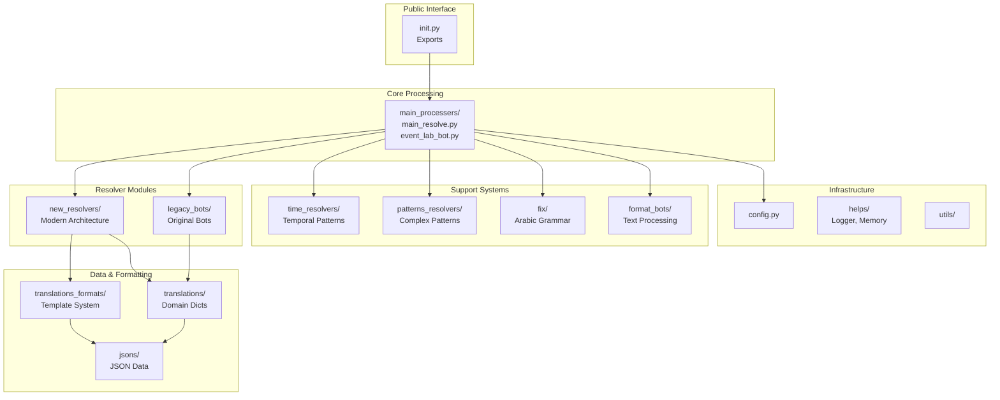

**Sources:** [README.md L349-L445](../README.md#L349-L445)

### Directory Structure and Responsibilities

| Directory | Responsibility | Key Files | Lines of Code Est. |
| --- | --- | --- | --- |
| `main_processers/` | Orchestration and main entry point | `main_resolve.py`, `event_lab_bot.py` | ~700 |
| `new_resolvers/` | Modern resolver implementations | `reslove_all.py`, domain-specific modules | ~3,000 |
| `legacy_bots/` | Original bot implementations | `ma_bots/`, `make_bots/` | ~5,000 |
| `translations/` | Translation data (Python dicts) | `geo/`, `jobs/`, `nats/`, `sports/`, `tv/` | ~2,000 |
| `translations_formats/` | Template formatting framework | `DataModel/`, `multi_data.py` | ~1,500 |
| `time_resolvers/` | Temporal pattern handling | `labs_years.py`, `time_to_arabic.py` | ~800 |
| `patterns_resolvers/` | Complex pattern matchers | `country_time_pattern.py`, `nat_men_pattern.py` | ~600 |
| `fix/` | Arabic text corrections | `fixtitle.py`, `fixlists.py` | ~400 |
| `jsons/` | JSON data files | 8 domain subdirectories | N/A (data) |
| `helps/` | Infrastructure utilities | `log.py`, `memory.py` | ~300 |

**Sources:** [README.md L349-L445](../README.md#L349-L445)

 [changelog.md L1-L750](../changelog.md#L1-L750)

## Architectural Evolution: Legacy vs. Modern Resolvers

The codebase contains two resolver architectures that coexist:

**Legacy Architecture** (`legacy_bots/`):

* Located in [ArWikiCats/legacy_bots/](../ArWikiCats/legacy_bots/)
* Organized around bot scripts with mixed concerns
* Direct dictionary lookups without abstraction
* Monolithic functions handling multiple patterns
* Called as last fallback via `legacy_resolvers()` function
* Recently refactored from `RESOLVER_PIPELINE` list to `LegacyBotsResolver` class

**Modern Architecture** (`new_resolvers/`):

* Located in [ArWikiCats/new_resolvers/](../ArWikiCats/new_resolvers/)
* Domain-specific modules (jobs, sports, nationalities, countries, films)
* Template-based formatting via `FormatData` classes
* Composition over inheritance
* Clear separation: resolver logic, data access, formatting
* Called via `all_new_resolvers()` function with priority ordering

**Diagram: Dual Architecture**

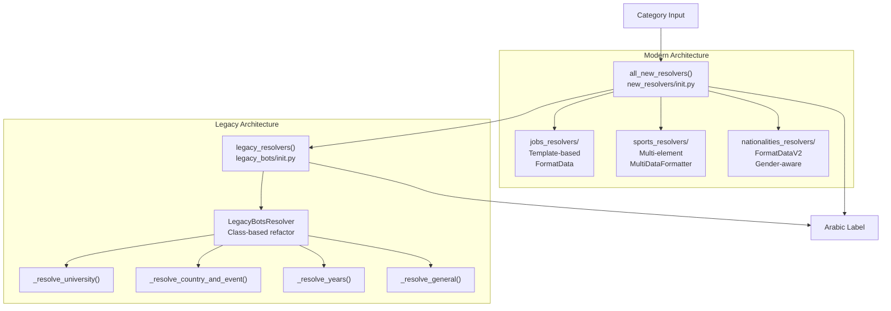

The legacy architecture was recently refactored (changelog.md:170-200) from a list-based `RESOLVER_PIPELINE` to a class-based `LegacyBotsResolver` for better maintainability, but both architectures remain active to preserve existing translation coverage.

**Sources:** [ArWikiCats/new_resolvers/__init__.py L1-L57](../ArWikiCats/new_resolvers/__init__.py#L1-L57)

 [ArWikiCats/legacy_bots/__init__.py L1-L200](../ArWikiCats/legacy_bots/__init__.py#L1-L200)

 [changelog.md L170-L200](../changelog.md#L170-L200)

## Configuration System

The configuration system uses frozen dataclasses that read from environment variables and command-line arguments.

**Diagram: Configuration Architecture**

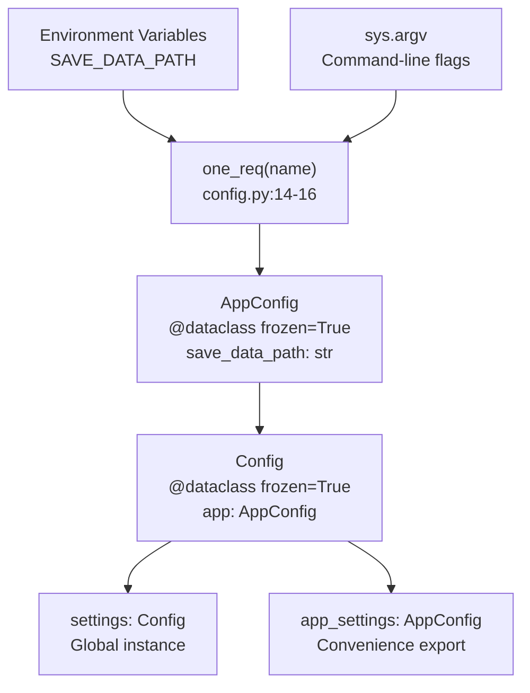

**Configuration Options:**

| Setting | Type | Default | Source | Purpose |
| --- | --- | --- | --- | --- |
| `SAVE_DATA_PATH` | str | `""` | Environment variable | Path to save temporary data files |

**Usage:**

```python
from ArWikiCats.config import app_settings

# Access configuration
if app_settings.save_data_path:
    save_to_path(app_settings.save_data_path)
```

The configuration is immutable (`frozen=True`) to prevent accidental modification during runtime.

**Sources:** [ArWikiCats/config.py L1-L52](../ArWikiCats/config.py#L1-L52)

## Performance Characteristics

### Caching Strategy

The system achieves sub-second processing through multi-level caching:

```python
# From main_resolve.py:32-33
@functools.lru_cache(maxsize=50000)
def resolve_label(category: str, fix_label: bool = True) -> CategoryResult:
    """Cached for entire program lifetime."""
```

**Performance Metrics:**

* First call: 10-50ms (full resolver chain)
* Cached call: <1ms (dictionary lookup)
* Batch processing: 5,000 categories in ~5-10 seconds with warm cache

The 50,000 entry cache limit accommodates large-scale batch processing workflows.

### Memory Footprint

Memory consumption was optimized from 2GB to <100MB through:

* Module-level data loading (load once at import time)
* Lazy JSON loading for large datasets
* Bounded LRU caches (`maxsize=50000` on main resolver)
* Frozen dataclasses instead of mutable dictionaries

**Sources:** [ArWikiCats/main_processers/main_resolve.py L32-L33](../ArWikiCats/main_processers/main_resolve.py#L32-L33)

 [README.md L499-L502](../README.md#L499-L502)

## Architectural Trade-offs

### Resolver Chain Depth vs. Accuracy

The system prioritizes **accuracy over speed** by attempting up to 7 different resolvers before falling back to general translation. This ensures high-quality results but increases latency for rare patterns.

**Mitigation:** Aggressive caching means expensive resolution happens only once per unique category.

### Python Dicts vs. Database

Translation data lives in **Python dictionaries and JSON files** rather than a database. This choice provides:

**Advantages:**

* Zero database setup/dependencies
* Instant module-level loading
* Version control friendly (git diff works)
* Fast in-memory lookups

**Disadvantages:**

* Higher memory baseline (~100MB)
* No ACID guarantees for data updates
* Manual metadata tracking via `data_len.json`

**Sources:** [README.md L407-L441](../README.md#L407-L441)

### Legacy Bot Preservation

The decision to keep `legacy_bots/` while building `new_resolvers/` creates **technical debt** but ensures:

* No regression in coverage for existing categories
* Gradual migration path
* Continued functionality during refactoring

**Sources:** [changelog.md L273-L289](../changelog.md#L273-L289)

 [changelog.md L505-L514](../changelog.md#L505-L514)

---

This architecture enables ArWikiCats to process over **28,500 test cases** covering diverse category types while maintaining extensibility for new translation domains. The three-tier design, waterfall resolver pattern, and aggressive caching combine to deliver both accuracy and performance for Wikipedia category translation workflows.
