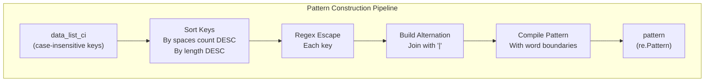
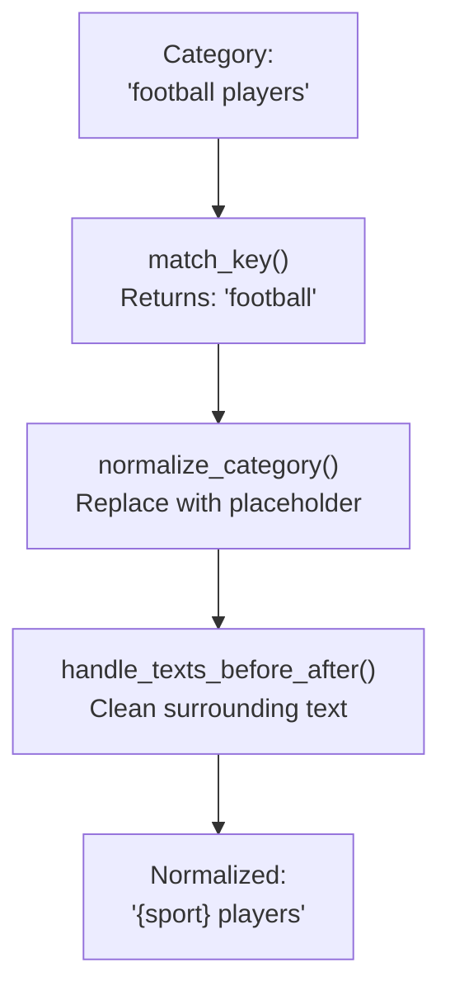
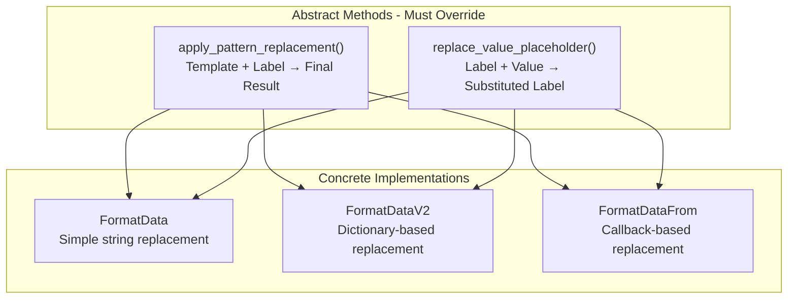
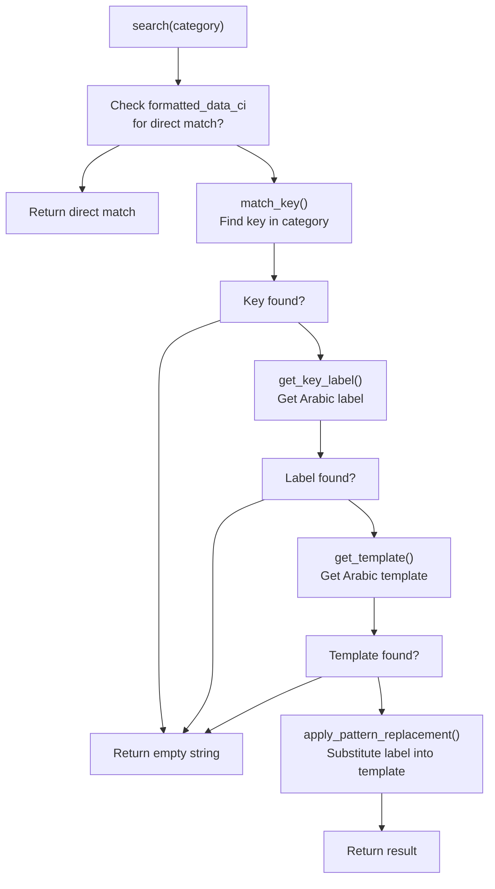
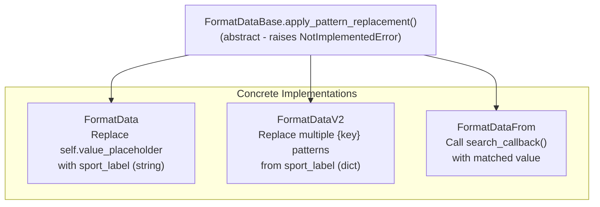
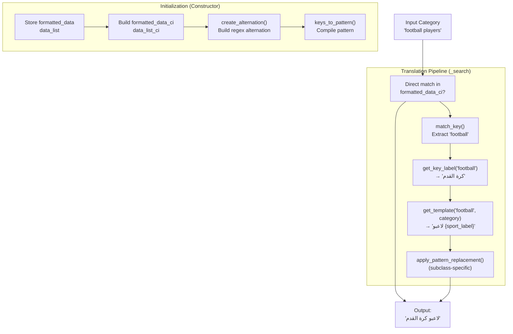
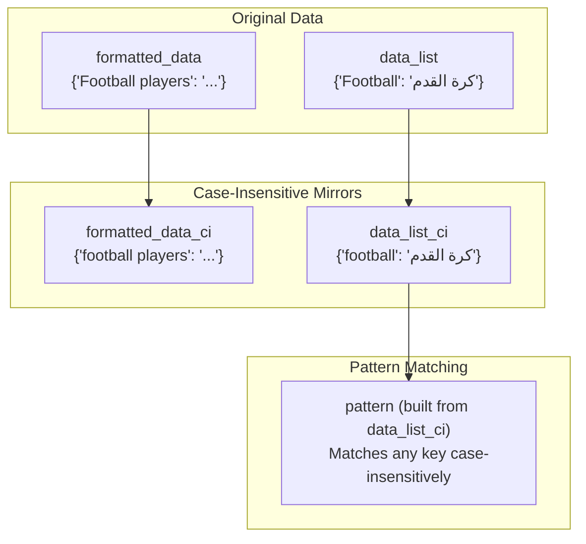
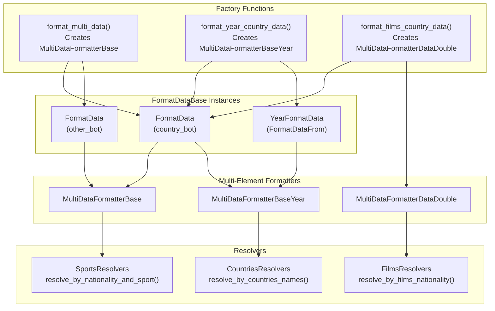

# FormatDataBase Architecture

> **Relevant source files**
> * [ArWikiCats/translations_formats/DataModel/__init__.py](https://github.com/ArWikiCats/ArWikiCats/blob/4095f04e/ArWikiCats/translations_formats/DataModel/__init__.py)
> * [ArWikiCats/translations_formats/DataModel/model_data.py](https://github.com/ArWikiCats/ArWikiCats/blob/4095f04e/ArWikiCats/translations_formats/DataModel/model_data.py)
> * [ArWikiCats/translations_formats/DataModel/model_data_base.py](https://github.com/ArWikiCats/ArWikiCats/blob/4095f04e/ArWikiCats/translations_formats/DataModel/model_data_base.py)
> * [ArWikiCats/translations_formats/DataModel/model_data_time.py](https://github.com/ArWikiCats/ArWikiCats/blob/4095f04e/ArWikiCats/translations_formats/DataModel/model_data_time.py)
> * [ArWikiCats/translations_formats/DataModel/model_data_v2.py](https://github.com/ArWikiCats/ArWikiCats/blob/4095f04e/ArWikiCats/translations_formats/DataModel/model_data_v2.py)
> * [ArWikiCats/translations_formats/DataModelDouble/model_multi_data_double.py](https://github.com/ArWikiCats/ArWikiCats/blob/4095f04e/ArWikiCats/translations_formats/DataModelDouble/model_multi_data_double.py)
> * [ArWikiCats/translations_formats/__init__.py](https://github.com/ArWikiCats/ArWikiCats/blob/4095f04e/ArWikiCats/translations_formats/__init__.py)
> * [ArWikiCats/translations_formats/data_new_model.py](https://github.com/ArWikiCats/ArWikiCats/blob/4095f04e/ArWikiCats/translations_formats/data_new_model.py)
> * [ArWikiCats/translations_formats/data_with_time.py](https://github.com/ArWikiCats/ArWikiCats/blob/4095f04e/ArWikiCats/translations_formats/data_with_time.py)
> * [ArWikiCats/translations_formats/multi_data.py](https://github.com/ArWikiCats/ArWikiCats/blob/4095f04e/ArWikiCats/translations_formats/multi_data.py)

## Purpose and Scope

This document describes the `FormatDataBase` class, which serves as the abstract foundation for all single-element category translation formatters in the ArWikiCats system. It defines the core operations, data structures, and contract that all formatter implementations must follow.

For information about concrete single-element formatter implementations (FormatData, FormatDataV2, FormatDataFrom), see [Single-Element Formatters](/ArWikiCats/ArWikiCats/6.2-single-element-formatters). For multi-element formatters that combine multiple FormatDataBase instances, see [Multi-Element Formatters](/ArWikiCats/ArWikiCats/6.3-multi-element-formatters). For details on placeholder syntax and template patterns, see [Template and Placeholder System](26.Template-and-Placeholder-System.md).

**Sources:** [ArWikiCats/translations_formats/DataModel/model_data_base.py L1-L410](https://github.com/ArWikiCats/ArWikiCats/blob/4095f04e/ArWikiCats/translations_formats/DataModel/model_data_base.py#L1-L410)

---

## Class Overview

`FormatDataBase` is an abstract base class located at [ArWikiCats/translations_formats/DataModel/model_data_base.py L38-L410](https://github.com/ArWikiCats/ArWikiCats/blob/4095f04e/ArWikiCats/translations_formats/DataModel/model_data_base.py#L38-L410)

 that provides the foundation for template-driven category translation. It encapsulates pattern matching, key normalization, template lookup, and placeholder replacement logic used across all formatter implementations.

### Key Attributes

| Attribute | Type | Purpose |
| --- | --- | --- |
| `formatted_data` | `Dict[str, str]` | Template patterns mapping English patterns to Arabic templates |
| `formatted_data_ci` | `Dict[str, str]` | Case-insensitive version of `formatted_data` |
| `data_list` | `Dict[str, Any]` | Key-to-Arabic-label mappings for replacements |
| `data_list_ci` | `Dict[str, Any]` | Case-insensitive version of `data_list` |
| `key_placeholder` | `str` | Placeholder string for the key in patterns (e.g., `"{sport}"`) |
| `text_before` | `str` | Optional text that appears before the key |
| `text_after` | `str` | Optional text that appears after the key |
| `regex_filter` | `str` | Regex pattern for word boundary detection (default: `r"\w"`) |
| `alternation` | `str` | Regex alternation string built from `data_list` keys |
| `pattern` | `re.Pattern` | Compiled regex pattern for key matching |

**Sources:** [ArWikiCats/translations_formats/DataModel/model_data_base.py L46-L56](https://github.com/ArWikiCats/ArWikiCats/blob/4095f04e/ArWikiCats/translations_formats/DataModel/model_data_base.py#L46-L56)

 [ArWikiCats/translations_formats/DataModel/model_data_base.py L75-L100](https://github.com/ArWikiCats/ArWikiCats/blob/4095f04e/ArWikiCats/translations_formats/DataModel/model_data_base.py#L75-L100)

---

## Core Responsibilities

### Pattern Building and Matching

FormatDataBase builds regex patterns from the `data_list` keys to match dynamic elements in category strings. The pattern construction prioritizes longer keys to avoid incorrect partial matches.



**Pattern Construction Example:**

Given `data_list = {"black": "أسود", "black-and-white": "أبيض وأسود"}`, the system sorts keys by space count and length to ensure "black-and-white" matches before "black", preventing incorrect partial matches.

**Sources:** [ArWikiCats/translations_formats/DataModel/model_data_base.py L106-L133](https://github.com/ArWikiCats/ArWikiCats/blob/4095f04e/ArWikiCats/translations_formats/DataModel/model_data_base.py#L106-L133)

### Normalization

FormatDataBase provides multi-stage normalization to convert category strings into template keys:

1. **Key Matching**: Extract the matching key from the category [ArWikiCats/translations_formats/DataModel/model_data_base.py L135-L156](https://github.com/ArWikiCats/ArWikiCats/blob/4095f04e/ArWikiCats/translations_formats/DataModel/model_data_base.py#L135-L156)
2. **Placeholder Substitution**: Replace the matched key with `key_placeholder` [ArWikiCats/translations_formats/DataModel/model_data_base.py L193-L216](https://github.com/ArWikiCats/ArWikiCats/blob/4095f04e/ArWikiCats/translations_formats/DataModel/model_data_base.py#L193-L216)
3. **Text Before/After Handling**: Remove configured surrounding text [ArWikiCats/translations_formats/DataModel/model_data_base.py L158-L191](https://github.com/ArWikiCats/ArWikiCats/blob/4095f04e/ArWikiCats/translations_formats/DataModel/model_data_base.py#L158-L191)



**Sources:** [ArWikiCats/translations_formats/DataModel/model_data_base.py L135-L234](https://github.com/ArWikiCats/ArWikiCats/blob/4095f04e/ArWikiCats/translations_formats/DataModel/model_data_base.py#L135-L234)

### Template Lookup

Once a category is normalized, FormatDataBase looks up the appropriate Arabic template using case-insensitive dictionary access:

| Method | Purpose | Returns |
| --- | --- | --- |
| `get_template(sport_key, category)` | Normalizes category and looks up template | Arabic template string |
| `get_template_ar(template_key)` | Direct template lookup by normalized key | Arabic template string |
| `get_key_label(sport_key)` | Gets Arabic label for a matched key | Arabic label (str or dict) |

**Sources:** [ArWikiCats/translations_formats/DataModel/model_data_base.py L236-L262](https://github.com/ArWikiCats/ArWikiCats/blob/4095f04e/ArWikiCats/translations_formats/DataModel/model_data_base.py#L236-L262)

### Placeholder Replacement Contract

FormatDataBase defines an abstract contract that subclasses must implement for placeholder replacement:



**Sources:** [ArWikiCats/translations_formats/DataModel/model_data_base.py L295-L313](https://github.com/ArWikiCats/ArWikiCats/blob/4095f04e/ArWikiCats/translations_formats/DataModel/model_data_base.py#L295-L313)

---

## Key Methods

### Search Pipeline

The primary translation method `search()` orchestrates the complete resolution pipeline:



**Sources:** [ArWikiCats/translations_formats/DataModel/model_data_base.py L264-L293](https://github.com/ArWikiCats/ArWikiCats/blob/4095f04e/ArWikiCats/translations_formats/DataModel/model_data_base.py#L264-L293)

 [ArWikiCats/translations_formats/DataModel/model_data_base.py L315-L337](https://github.com/ArWikiCats/ArWikiCats/blob/4095f04e/ArWikiCats/translations_formats/DataModel/model_data_base.py#L315-L337)

### Helper Methods

FormatDataBase provides additional utility methods:

| Method | Purpose | Usage |
| --- | --- | --- |
| `create_label(category)` | Alias for `search()` | [ArWikiCats/translations_formats/DataModel/model_data_base.py L327-L337](https://github.com/ArWikiCats/ArWikiCats/blob/4095f04e/ArWikiCats/translations_formats/DataModel/model_data_base.py#L327-L337) |
| `search_all(category, add_arabic_category_prefix)` | Search with optional "تصنيف:" prefix | [ArWikiCats/translations_formats/DataModel/model_data_base.py L354-L369](https://github.com/ArWikiCats/ArWikiCats/blob/4095f04e/ArWikiCats/translations_formats/DataModel/model_data_base.py#L354-L369) |
| `search_all_category(category)` | Full pipeline with normalization and validation | [ArWikiCats/translations_formats/DataModel/model_data_base.py L389-L409](https://github.com/ArWikiCats/ArWikiCats/blob/4095f04e/ArWikiCats/translations_formats/DataModel/model_data_base.py#L389-L409) |
| `prepend_arabic_category_prefix(category, result)` | Add "تصنيف:" when appropriate | [ArWikiCats/translations_formats/DataModel/model_data_base.py L339-L352](https://github.com/ArWikiCats/ArWikiCats/blob/4095f04e/ArWikiCats/translations_formats/DataModel/model_data_base.py#L339-L352) |
| `check_placeholders(category, result)` | Validate no unprocessed placeholders remain | [ArWikiCats/translations_formats/DataModel/model_data_base.py L371-L387](https://github.com/ArWikiCats/ArWikiCats/blob/4095f04e/ArWikiCats/translations_formats/DataModel/model_data_base.py#L371-L387) |

**Sources:** [ArWikiCats/translations_formats/DataModel/model_data_base.py L327-L409](https://github.com/ArWikiCats/ArWikiCats/blob/4095f04e/ArWikiCats/translations_formats/DataModel/model_data_base.py#L327-L409)

---

## Subclass Contract

Subclasses of FormatDataBase must implement two abstract methods to complete the translation pipeline:

### Required Implementations

#### 1. apply_pattern_replacement()

**Signature:** `apply_pattern_replacement(template_label: str, sport_label: Any) -> str`

**Purpose:** Replace the value placeholder in a template with the provided label. This method is called after the template is selected and must perform the actual substitution.

**Implementations:**



#### 2. replace_value_placeholder()

**Signature:** `replace_value_placeholder(label: str, value: Any) -> str`

**Purpose:** Replace placeholders in a label string with provided values. This method is used by multi-element formatters to build complex translations.

**Sources:** [ArWikiCats/translations_formats/DataModel/model_data_base.py L295-L313](https://github.com/ArWikiCats/ArWikiCats/blob/4095f04e/ArWikiCats/translations_formats/DataModel/model_data_base.py#L295-L313)

 [ArWikiCats/translations_formats/DataModel/model_data.py L100-L116](https://github.com/ArWikiCats/ArWikiCats/blob/4095f04e/ArWikiCats/translations_formats/DataModel/model_data.py#L100-L116)

 [ArWikiCats/translations_formats/DataModel/model_data_v2.py L81-L121](https://github.com/ArWikiCats/ArWikiCats/blob/4095f04e/ArWikiCats/translations_formats/DataModel/model_data_v2.py#L81-L121)

---

## Data Flow Through FormatDataBase

The following diagram shows how data flows through a FormatDataBase instance during translation:



**Sources:** [ArWikiCats/translations_formats/DataModel/model_data_base.py L75-L100](https://github.com/ArWikiCats/ArWikiCats/blob/4095f04e/ArWikiCats/translations_formats/DataModel/model_data_base.py#L75-L100)

 [ArWikiCats/translations_formats/DataModel/model_data_base.py L264-L293](https://github.com/ArWikiCats/ArWikiCats/blob/4095f04e/ArWikiCats/translations_formats/DataModel/model_data_base.py#L264-L293)

---

## Case-Insensitive Matching Strategy

FormatDataBase implements case-insensitive matching by maintaining parallel dictionaries with lowercased keys:



All lookups use the `_ci` versions to ensure case-insensitive matching while preserving the original data for other purposes.

**Sources:** [ArWikiCats/translations_formats/DataModel/model_data_base.py L92-L94](https://github.com/ArWikiCats/ArWikiCats/blob/4095f04e/ArWikiCats/translations_formats/DataModel/model_data_base.py#L92-L94)

---

## Integration with Resolver System

FormatDataBase instances are typically created by factory functions and used within resolver classes:



**Sources:** [ArWikiCats/translations_formats/multi_data.py L96-L197](https://github.com/ArWikiCats/ArWikiCats/blob/4095f04e/ArWikiCats/translations_formats/multi_data.py#L96-L197)

 [ArWikiCats/translations_formats/data_with_time.py L109-L172](https://github.com/ArWikiCats/ArWikiCats/blob/4095f04e/ArWikiCats/translations_formats/data_with_time.py#L109-L172)

 [ArWikiCats/translations_formats/data_new_model.py L30-L105](https://github.com/ArWikiCats/ArWikiCats/blob/4095f04e/ArWikiCats/translations_formats/data_new_model.py#L30-L105)

---

## Pattern Priority Handling

FormatDataBase uses a sophisticated key sorting algorithm to prevent incorrect partial matches:

**Algorithm:** [ArWikiCats/translations_formats/DataModel/model_data_base.py L115-L117](https://github.com/ArWikiCats/ArWikiCats/blob/4095f04e/ArWikiCats/translations_formats/DataModel/model_data_base.py#L115-L117)

```
keys_sorted = sorted(self.data_list_ci.keys(), key=lambda k: (-k.count(" "), -len(k)))
```

This ensures:

1. Keys with more spaces (more words) are tried first
2. Among keys with the same number of spaces, longer keys are tried first

**Example:**

| Original Order | Sorted Order | Rationale |
| --- | --- | --- |
| "black" | "black-and-white" | Prevents "black" matching in "black-and-white films" |
| "black-and-white" | "black" | Longer, more specific key takes precedence |
| "american football" | "american football" | Multi-word key tried before single-word keys |
| "football" | "football" | Single-word keys come last |

**Sources:** [ArWikiCats/translations_formats/DataModel/model_data_base.py L106-L133](https://github.com/ArWikiCats/ArWikiCats/blob/4095f04e/ArWikiCats/translations_formats/DataModel/model_data_base.py#L106-L133)

---

## Error Handling and Validation

FormatDataBase includes validation to ensure translation quality:

### Placeholder Validation

The `check_placeholders()` method validates that no unprocessed placeholders remain in the final result:

[ArWikiCats/translations_formats/DataModel/model_data_base.py L371-L387](https://github.com/ArWikiCats/ArWikiCats/blob/4095f04e/ArWikiCats/translations_formats/DataModel/model_data_base.py#L371-L387)

```
if "{" in result:
    logger.warning(f">>> Found unprocessed placeholders in {category=}: {result=}")
    return ""
```

This prevents returning partially-translated categories that would appear broken in the output.

### Empty Result Handling

The search pipeline returns empty strings (`""`) rather than `None` when:

* No matching key is found [ArWikiCats/translations_formats/DataModel/model_data_base.py L275](https://github.com/ArWikiCats/ArWikiCats/blob/4095f04e/ArWikiCats/translations_formats/DataModel/model_data_base.py#L275-L275)
* No label exists for the matched key [ArWikiCats/translations_formats/DataModel/model_data_base.py L280](https://github.com/ArWikiCats/ArWikiCats/blob/4095f04e/ArWikiCats/translations_formats/DataModel/model_data_base.py#L280-L280)
* No template matches the normalized category [ArWikiCats/translations_formats/DataModel/model_data_base.py L285](https://github.com/ArWikiCats/ArWikiCats/blob/4095f04e/ArWikiCats/translations_formats/DataModel/model_data_base.py#L285-L285)

This allows callers to use simple truthiness checks: `if result: ...`

**Sources:** [ArWikiCats/translations_formats/DataModel/model_data_base.py L264-L293](https://github.com/ArWikiCats/ArWikiCats/blob/4095f04e/ArWikiCats/translations_formats/DataModel/model_data_base.py#L264-L293)

 [ArWikiCats/translations_formats/DataModel/model_data_base.py L371-L409](https://github.com/ArWikiCats/ArWikiCats/blob/4095f04e/ArWikiCats/translations_formats/DataModel/model_data_base.py#L371-L409)

---

## Performance Considerations

FormatDataBase implements several performance optimizations:

### Pre-computed Data Structures

| Structure | Purpose | Computed When |
| --- | --- | --- |
| `formatted_data_ci` | Case-insensitive template lookup | Constructor [ArWikiCats/translations_formats/DataModel/model_data_base.py L93](https://github.com/ArWikiCats/ArWikiCats/blob/4095f04e/ArWikiCats/translations_formats/DataModel/model_data_base.py#L93-L93) |
| `data_list_ci` | Case-insensitive key lookup | Constructor [ArWikiCats/translations_formats/DataModel/model_data_base.py L94](https://github.com/ArWikiCats/ArWikiCats/blob/4095f04e/ArWikiCats/translations_formats/DataModel/model_data_base.py#L94-L94) |
| `alternation` | Regex alternation string | Constructor or first use [ArWikiCats/translations_formats/DataModel/model_data_base.py L106-L117](https://github.com/ArWikiCats/ArWikiCats/blob/4095f04e/ArWikiCats/translations_formats/DataModel/model_data_base.py#L106-L117) |
| `pattern` | Compiled regex pattern | Constructor or first use [ArWikiCats/translations_formats/DataModel/model_data_base.py L119-L133](https://github.com/ArWikiCats/ArWikiCats/blob/4095f04e/ArWikiCats/translations_formats/DataModel/model_data_base.py#L119-L133) |

### Direct Lookup Optimization

The `_search()` method first checks for a direct match in `formatted_data_ci` before running the full pattern matching pipeline:

[ArWikiCats/translations_formats/DataModel/model_data_base.py L269-L270](https://github.com/ArWikiCats/ArWikiCats/blob/4095f04e/ArWikiCats/translations_formats/DataModel/model_data_base.py#L269-L270)

```
if self.formatted_data_ci.get(category):
    return self.formatted_data_ci[category]
```

This provides O(1) lookup for common exact matches before resorting to regex matching.

### Large Dataset Handling

The system logs when creating patterns from large datasets (>1000 keys):

[ArWikiCats/translations_formats/DataModel/model_data_base.py L111-L112](https://github.com/ArWikiCats/ArWikiCats/blob/4095f04e/ArWikiCats/translations_formats/DataModel/model_data_base.py#L111-L112)

```
if len(self.data_list_ci) > 1000:
    logger.debug(f">keys_to_pattern(): len(new_pattern keys) = {len(self.data_list_ci):,}")
```

This helps identify performance hotspots during initialization.

**Sources:** [ArWikiCats/translations_formats/DataModel/model_data_base.py L75-L133](https://github.com/ArWikiCats/ArWikiCats/blob/4095f04e/ArWikiCats/translations_formats/DataModel/model_data_base.py#L75-L133)

 [ArWikiCats/translations_formats/DataModel/model_data_base.py L264-L293](https://github.com/ArWikiCats/ArWikiCats/blob/4095f04e/ArWikiCats/translations_formats/DataModel/model_data_base.py#L264-L293)

---

## Concrete Implementations

FormatDataBase is extended by three main subclasses:

| Class | File | Purpose |
| --- | --- | --- |
| `FormatData` | [ArWikiCats/translations_formats/DataModel/model_data.py L37-L132](https://github.com/ArWikiCats/ArWikiCats/blob/4095f04e/ArWikiCats/translations_formats/DataModel/model_data.py#L37-L132) | Simple string-to-string placeholder replacement |
| `FormatDataV2` | [ArWikiCats/translations_formats/DataModel/model_data_v2.py L32-L121](https://github.com/ArWikiCats/ArWikiCats/blob/4095f04e/ArWikiCats/translations_formats/DataModel/model_data_v2.py#L32-L121) | Dictionary-based multi-placeholder replacement |
| `FormatDataFrom` | [ArWikiCats/translations_formats/DataModel/model_data_form.py](https://github.com/ArWikiCats/ArWikiCats/blob/4095f04e/ArWikiCats/translations_formats/DataModel/model_data_form.py) | Callback-based formatting (used by `YearFormatData`) |

For detailed information about these implementations, see [Single-Element Formatters](/ArWikiCats/ArWikiCats/6.2-single-element-formatters).

**Sources:** [ArWikiCats/translations_formats/DataModel/__init__.py L1-L21](https://github.com/ArWikiCats/ArWikiCats/blob/4095f04e/ArWikiCats/translations_formats/DataModel/__init__.py#L1-L21)