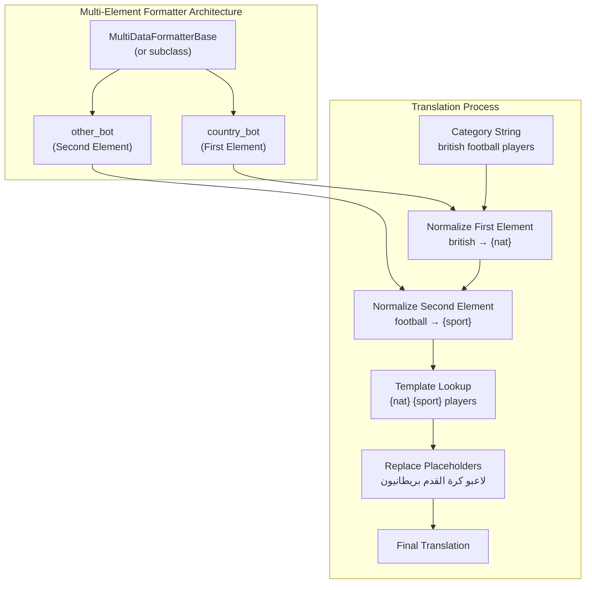
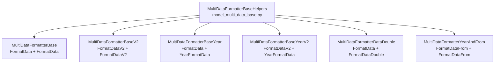
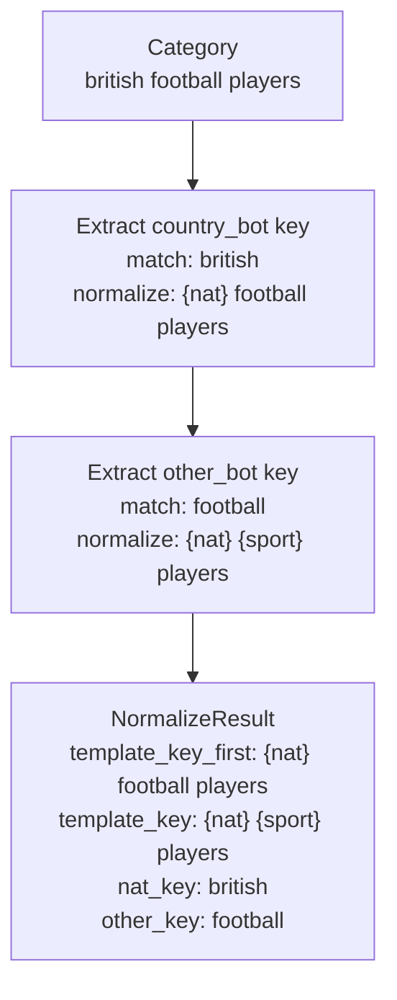
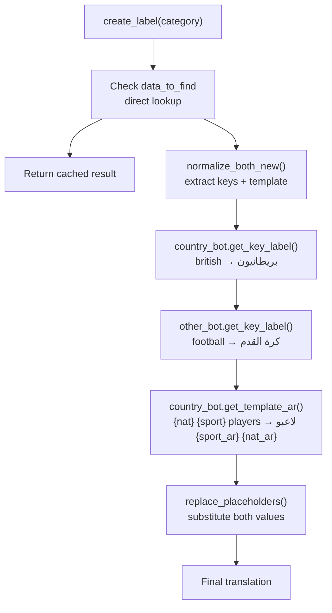
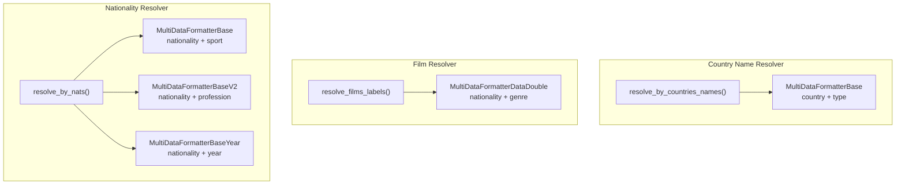

# Multi-Element Formatters

> **Relevant source files**
> * [ArWikiCats/new_resolvers/__init__.py](https://github.com/ArWikiCats/ArWikiCats/blob/4095f04e/ArWikiCats/new_resolvers/__init__.py)
> * [ArWikiCats/new_resolvers/countries_names_resolvers/__init__.py](https://github.com/ArWikiCats/ArWikiCats/blob/4095f04e/ArWikiCats/new_resolvers/countries_names_resolvers/__init__.py)
> * [ArWikiCats/new_resolvers/countries_names_with_sports/__init__.py](https://github.com/ArWikiCats/ArWikiCats/blob/4095f04e/ArWikiCats/new_resolvers/countries_names_with_sports/__init__.py)
> * [ArWikiCats/new_resolvers/countries_names_with_sports/p17_bot_sport.py](https://github.com/ArWikiCats/ArWikiCats/blob/4095f04e/ArWikiCats/new_resolvers/countries_names_with_sports/p17_bot_sport.py)
> * [ArWikiCats/new_resolvers/countries_names_with_sports/p17_sport_to_move_under.py](https://github.com/ArWikiCats/ArWikiCats/blob/4095f04e/ArWikiCats/new_resolvers/countries_names_with_sports/p17_sport_to_move_under.py)
> * [ArWikiCats/new_resolvers/films_resolvers/__init__.py](https://github.com/ArWikiCats/ArWikiCats/blob/4095f04e/ArWikiCats/new_resolvers/films_resolvers/__init__.py)
> * [ArWikiCats/new_resolvers/films_resolvers/resolve_films_labels.py](https://github.com/ArWikiCats/ArWikiCats/blob/4095f04e/ArWikiCats/new_resolvers/films_resolvers/resolve_films_labels.py)
> * [ArWikiCats/new_resolvers/jobs_resolvers/__init__.py](https://github.com/ArWikiCats/ArWikiCats/blob/4095f04e/ArWikiCats/new_resolvers/jobs_resolvers/__init__.py)
> * [ArWikiCats/new_resolvers/jobs_resolvers/relegin_jobs_new.py](https://github.com/ArWikiCats/ArWikiCats/blob/4095f04e/ArWikiCats/new_resolvers/jobs_resolvers/relegin_jobs_new.py)
> * [ArWikiCats/new_resolvers/nationalities_resolvers/__init__.py](https://github.com/ArWikiCats/ArWikiCats/blob/4095f04e/ArWikiCats/new_resolvers/nationalities_resolvers/__init__.py)
> * [ArWikiCats/new_resolvers/sports_resolvers/__init__.py](https://github.com/ArWikiCats/ArWikiCats/blob/4095f04e/ArWikiCats/new_resolvers/sports_resolvers/__init__.py)
> * [ArWikiCats/new_resolvers/sports_resolvers/countries_names_and_sports.py](https://github.com/ArWikiCats/ArWikiCats/blob/4095f04e/ArWikiCats/new_resolvers/sports_resolvers/countries_names_and_sports.py)
> * [ArWikiCats/new_resolvers/sports_resolvers/nationalities_and_sports.py](https://github.com/ArWikiCats/ArWikiCats/blob/4095f04e/ArWikiCats/new_resolvers/sports_resolvers/nationalities_and_sports.py)
> * [ArWikiCats/new_resolvers/sports_resolvers/pre_defined.py](https://github.com/ArWikiCats/ArWikiCats/blob/4095f04e/ArWikiCats/new_resolvers/sports_resolvers/pre_defined.py)
> * [ArWikiCats/new_resolvers/sports_resolvers/raw_sports.py](https://github.com/ArWikiCats/ArWikiCats/blob/4095f04e/ArWikiCats/new_resolvers/sports_resolvers/raw_sports.py)
> * [ArWikiCats/new_resolvers/sports_resolvers/raw_sports_with_suffixes.py](https://github.com/ArWikiCats/ArWikiCats/blob/4095f04e/ArWikiCats/new_resolvers/sports_resolvers/raw_sports_with_suffixes.py)
> * [ArWikiCats/new_resolvers/sports_resolvers/sport_lab_nat.py](https://github.com/ArWikiCats/ArWikiCats/blob/4095f04e/ArWikiCats/new_resolvers/sports_resolvers/sport_lab_nat.py)
> * [ArWikiCats/new_resolvers/teams_mappings_ends.py](https://github.com/ArWikiCats/ArWikiCats/blob/4095f04e/ArWikiCats/new_resolvers/teams_mappings_ends.py)
> * [ArWikiCats/translations_formats/DataModel/__init__.py](https://github.com/ArWikiCats/ArWikiCats/blob/4095f04e/ArWikiCats/translations_formats/DataModel/__init__.py)
> * [ArWikiCats/translations_formats/DataModel/model_data.py](https://github.com/ArWikiCats/ArWikiCats/blob/4095f04e/ArWikiCats/translations_formats/DataModel/model_data.py)
> * [ArWikiCats/translations_formats/DataModel/model_data_base.py](https://github.com/ArWikiCats/ArWikiCats/blob/4095f04e/ArWikiCats/translations_formats/DataModel/model_data_base.py)
> * [ArWikiCats/translations_formats/DataModel/model_data_time.py](https://github.com/ArWikiCats/ArWikiCats/blob/4095f04e/ArWikiCats/translations_formats/DataModel/model_data_time.py)
> * [ArWikiCats/translations_formats/DataModel/model_data_v2.py](https://github.com/ArWikiCats/ArWikiCats/blob/4095f04e/ArWikiCats/translations_formats/DataModel/model_data_v2.py)
> * [ArWikiCats/translations_formats/DataModelDouble/model_multi_data_double.py](https://github.com/ArWikiCats/ArWikiCats/blob/4095f04e/ArWikiCats/translations_formats/DataModelDouble/model_multi_data_double.py)
> * [ArWikiCats/translations_formats/__init__.py](https://github.com/ArWikiCats/ArWikiCats/blob/4095f04e/ArWikiCats/translations_formats/__init__.py)
> * [ArWikiCats/translations_formats/data_new_model.py](https://github.com/ArWikiCats/ArWikiCats/blob/4095f04e/ArWikiCats/translations_formats/data_new_model.py)
> * [ArWikiCats/translations_formats/data_with_time.py](https://github.com/ArWikiCats/ArWikiCats/blob/4095f04e/ArWikiCats/translations_formats/data_with_time.py)
> * [ArWikiCats/translations_formats/multi_data.py](https://github.com/ArWikiCats/ArWikiCats/blob/4095f04e/ArWikiCats/translations_formats/multi_data.py)

## Purpose and Scope

Multi-Element Formatters handle category translations that contain **two dynamic elements**. For example, "British football players" requires translating both the nationality ("British" → "بريطانيون") and the sport ("football" → "كرة القدم"), then combining them according to Arabic grammar rules.

This page documents the classes that orchestrate two single-element formatters (see [Single-Element Formatters](/ArWikiCats/ArWikiCats/6.2-single-element-formatters)) to handle these complex translations. For information about the base formatting infrastructure, see [Format Data Models](/ArWikiCats/ArWikiCats/6.1-formatdatabase-architecture). For placeholder syntax and substitution logic, see [Template and Placeholder System](26.Template-and-Placeholder-System.md).

**Sources:** [ArWikiCats/translations_formats/__init__.py L1-L48](https://github.com/ArWikiCats/ArWikiCats/blob/4095f04e/ArWikiCats/translations_formats/__init__.py#L1-L48)

 [ArWikiCats/translations_formats/DataModel/model_multi_data.py L1-L24](https://github.com/ArWikiCats/ArWikiCats/blob/4095f04e/ArWikiCats/translations_formats/DataModel/model_multi_data.py#L1-L24)

## Architecture Overview

Multi-element formatters follow a **composition pattern** where two single-element formatter instances work together:



The `country_bot` handles the first dynamic element (typically nationality, country, or temporal patterns), while the `other_bot` handles the second element (typically sport, profession, or genre). The multi-element formatter coordinates their normalization and template lookup operations.

**Sources:** [ArWikiCats/translations_formats/DataModel/model_multi_data.py L34-L105](https://github.com/ArWikiCats/ArWikiCats/blob/4095f04e/ArWikiCats/translations_formats/DataModel/model_multi_data.py#L34-L105)

 [ArWikiCats/translations_formats/DataModel/model_multi_data_base.py L70-L103](https://github.com/ArWikiCats/ArWikiCats/blob/4095f04e/ArWikiCats/translations_formats/DataModel/model_multi_data_base.py#L70-L103)

## Core Classes

### Class Hierarchy



**Sources:** [ArWikiCats/translations_formats/DataModel/model_multi_data.py L1-L144](https://github.com/ArWikiCats/ArWikiCats/blob/4095f04e/ArWikiCats/translations_formats/DataModel/model_multi_data.py#L1-L144)

 [ArWikiCats/translations_formats/DataModel/__init__.py L1-L26](https://github.com/ArWikiCats/ArWikiCats/blob/4095f04e/ArWikiCats/translations_formats/DataModel/__init__.py#L1-L26)

### MultiDataFormatterBase

Combines two `FormatData` instances for dual-element translations with simple string placeholders.

| Attribute | Type | Purpose |
| --- | --- | --- |
| `country_bot` | FormatData | Formatter for first element (nationality/country) |
| `other_bot` | FormatData | Formatter for second element (sport/profession) |
| `search_first_part` | bool | If True, search using only first part after normalization |
| `data_to_find` | Dict[str, str] \| None | Optional direct lookup dictionary |

**Key Methods:**

* `normalize_both_new(category)` → `NormalizeResult` - Normalizes both elements and returns structured result
* `create_label(category)` → `str` - End-to-end translation
* `search(category)` → `str` - Alias for `create_label`

**Example Usage:**

```css
# From format_multi_data factory
bot = format_multi_data(
    formatted_data={"{nat} {sport} players": "لاعبو {sport_ar} {nat_ar}"},
    data_list={"british": "بريطانيون"},
    data_list2={"football": "كرة القدم"},
    key_placeholder="{nat}",
    value_placeholder="{nat_ar}",
    key2_placeholder="{sport}",
    value2_placeholder="{sport_ar}",
)
bot.search("british football players")  # 'لاعبو كرة القدم بريطانيون'
```

**Sources:** [ArWikiCats/translations_formats/DataModel/model_multi_data.py L34-L70](https://github.com/ArWikiCats/ArWikiCats/blob/4095f04e/ArWikiCats/translations_formats/DataModel/model_multi_data.py#L34-L70)

 [ArWikiCats/translations_formats/multi_data.py L95-L193](https://github.com/ArWikiCats/ArWikiCats/blob/4095f04e/ArWikiCats/translations_formats/multi_data.py#L95-L193)

### MultiDataFormatterBaseV2

Combines two `FormatDataV2` instances, supporting **dictionary values** in data_list for complex placeholder replacements. This allows a single key to map to multiple placeholders.

| Attribute | Type | Purpose |
| --- | --- | --- |
| `country_bot` | FormatDataV2 | Formatter with dictionary value support |
| `other_bot` | FormatDataV2 | Formatter with dictionary value support |
| `search_first_part` | bool | If True, search using only first part |
| `data_to_find` | Dict[str, str] \| None | Optional direct lookup |

**Dictionary Value Example:**

```python
# data_list can have dictionary values with multiple placeholders
data_list = {
    "yemen": {"demonym": "يمنيون", "country_ar": "اليمن"},
    "egypt": {"demonym": "مصريون", "country_ar": "مصر"},
}
# Template can use multiple placeholders from same key
formatted_data = {"{country} {sport} players": "{demonym} لاعبو {sport_ar}"}
```

**Sources:** [ArWikiCats/translations_formats/DataModel/model_data_v2.py L127-L161](https://github.com/ArWikiCats/ArWikiCats/blob/4095f04e/ArWikiCats/translations_formats/DataModel/model_data_v2.py#L127-L161)

 [ArWikiCats/translations_formats/multi_data.py L195-L277](https://github.com/ArWikiCats/ArWikiCats/blob/4095f04e/ArWikiCats/translations_formats/multi_data.py#L195-L277)

### MultiDataFormatterBaseYear

Combines `FormatData` with `YearFormatData` to handle **temporal patterns** (years, decades, centuries) combined with other elements.

| Attribute | Type | Purpose |
| --- | --- | --- |
| `country_bot` | FormatData | Handles nationality/country element |
| `other_bot` | YearFormatData | Handles year/decade/century patterns |
| `search_first_part` | bool | If True, search using only first part |
| `data_to_find` | Dict[str, str] \| None | Optional direct lookup |

**Example Usage:**

```css
bot = format_year_country_data(
    formatted_data={"{year1} {country1} writers": "{country1} كتاب في {year1}"},
    data_list={"british": "بريطانية"},
    key_placeholder="{country1}",
    value_placeholder="{country1}",
)
bot.search("14th-century british writers")  # 'بريطانية كتاب في القرن 14'
```

**Sources:** [ArWikiCats/translations_formats/DataModel/model_multi_data.py L71-L105](https://github.com/ArWikiCats/ArWikiCats/blob/4095f04e/ArWikiCats/translations_formats/DataModel/model_multi_data.py#L71-L105)

 [ArWikiCats/translations_formats/data_with_time.py L107-L171](https://github.com/ArWikiCats/ArWikiCats/blob/4095f04e/ArWikiCats/translations_formats/data_with_time.py#L107-L171)

### MultiDataFormatterBaseYearV2

Combines `FormatDataV2` with `YearFormatData`, adding dictionary value support to year-based translations. The `other_key_first` parameter controls processing order.

| Attribute | Type | Purpose |
| --- | --- | --- |
| `country_bot` | FormatDataV2 | Handles nationality with dict support |
| `other_bot` | YearFormatData | Handles temporal patterns |
| `search_first_part` | bool | If True, search using only first part |
| `data_to_find` | Dict[str, str] \| None | Optional direct lookup |
| `other_key_first` | bool | If True, process year before nationality |

**Processing Order:** When `other_key_first=True`, the year element is normalized first, then the nationality element. This affects which placeholder appears in intermediate normalization steps.

**Sources:** [ArWikiCats/translations_formats/DataModel/model_multi_data.py L107-L144](https://github.com/ArWikiCats/ArWikiCats/blob/4095f04e/ArWikiCats/translations_formats/DataModel/model_multi_data.py#L107-L144)

 [ArWikiCats/translations_formats/data_with_time.py L43-L105](https://github.com/ArWikiCats/ArWikiCats/blob/4095f04e/ArWikiCats/translations_formats/data_with_time.py#L43-L105)

### MultiDataFormatterDataDouble

Combines `FormatData` with `FormatDataDouble` for **double-key pattern matching**. Designed for film categories where the genre can consist of two adjacent keys (e.g., "action drama films").

| Attribute | Type | Purpose |
| --- | --- | --- |
| `country_bot` | FormatData | Handles nationality element |
| `other_bot` | FormatDataDouble | Handles double-key genre matching |
| `data_to_find` | Dict[str, str] \| None | Optional direct lookup |

**Example Usage:**

```css
bot = format_films_country_data(
    formatted_data={"{nat_en} {film_key} films": "أفلام {film_ar} {nat_ar}"},
    data_list={"british": "بريطانية"},
    data_list2={"action": "أكشن", "drama": "دراما"},
)
bot.search("british action drama films")  # 'أفلام أكشن دراما بريطانية'
```

**Sources:** [ArWikiCats/translations_formats/DataModelDouble/model_multi_data_double.py L1-L100](https://github.com/ArWikiCats/ArWikiCats/blob/4095f04e/ArWikiCats/translations_formats/DataModelDouble/model_multi_data_double.py#L1-L100)

 (referenced), [ArWikiCats/translations_formats/data_new_model.py L30-L102](https://github.com/ArWikiCats/ArWikiCats/blob/4095f04e/ArWikiCats/translations_formats/data_new_model.py#L30-L102)

### MultiDataFormatterYearAndFrom

Combines year-based patterns with "from" relation patterns (e.g., "writers from Yemen"). Uses two `FormatDataFrom` instances with custom callbacks.

| Attribute | Type | Purpose |
| --- | --- | --- |
| `country_bot` | FormatDataFrom | Handles "from" relation with callback |
| `other_bot` | FormatDataFrom | Handles year patterns with callback |
| `search_first_part` | bool | If True, search using only first part |
| `data_to_find` | Dict[str, str] \| None | Optional direct lookup |
| `other_key_first` | bool | If True, process year before relation |

**Callback-Based:** Both bots use custom `search_callback` and `match_key_callback` functions for dynamic behavior.

**Sources:** [ArWikiCats/translations_formats/DataModel/model_multi_data_year_from.py L164-L203](https://github.com/ArWikiCats/ArWikiCats/blob/4095f04e/ArWikiCats/translations_formats/DataModel/model_multi_data_year_from.py#L164-L203)

## The Normalization Process

### normalize_both_new() Method

The core normalization method extracts both dynamic elements and returns a structured result:



**NormalizeResult Structure:**

| Field | Type | Description |
| --- | --- | --- |
| `template_key_first` | str | Template after first element replacement |
| `category` | str | Original normalized category |
| `template_key` | str | Final template with both elements replaced |
| `nat_key` | str | Extracted first element key (nationality/country) |
| `other_key` | str | Extracted second element key (sport/profession) |

**Implementation:** [ArWikiCats/translations_formats/DataModel/model_multi_data_base.py L135-L158](https://github.com/ArWikiCats/ArWikiCats/blob/4095f04e/ArWikiCats/translations_formats/DataModel/model_multi_data_base.py#L135-L158)

**Processing Order:**

By default, `country_bot` is processed first:

```
nat_key, template_key_first = country_bot.normalize_category_with_key(category)
other_key, template_key = other_bot.normalize_category_with_key(template_key_first)
```

When `other_key_first=True`, the order is reversed:

```
other_key, template_key_first = other_bot.normalize_category_with_key(category)
nat_key, template_key = country_bot.normalize_category_with_key(template_key_first)
```

**Sources:** [ArWikiCats/translations_formats/DataModel/model_multi_data_base.py L135-L173](https://github.com/ArWikiCats/ArWikiCats/blob/4095f04e/ArWikiCats/translations_formats/DataModel/model_multi_data_base.py#L135-L173)

### create_label() Method

The end-to-end translation method:



**Key Steps:**

1. **Direct Lookup:** Check if category exists in `data_to_find` cache
2. **Normalization:** Call `normalize_both_new()` to extract keys and template
3. **Key Translation:** Get Arabic labels for both extracted keys
4. **Template Lookup:** Find Arabic template using normalized template key
5. **Placeholder Replacement:** Substitute both placeholders with Arabic labels

**Implementation:** [ArWikiCats/translations_formats/DataModel/model_multi_data_base.py L184-L237](https://github.com/ArWikiCats/ArWikiCats/blob/4095f04e/ArWikiCats/translations_formats/DataModel/model_multi_data_base.py#L184-L237)

**Sources:** [ArWikiCats/translations_formats/DataModel/model_multi_data_base.py L184-L237](https://github.com/ArWikiCats/ArWikiCats/blob/4095f04e/ArWikiCats/translations_formats/DataModel/model_multi_data_base.py#L184-L237)

## Factory Functions

Factory functions create configured multi-element formatters from parameters, simplifying instantiation.

### format_multi_data()

Creates `MultiDataFormatterBase` (FormatData + FormatData).

**Signature:**

```python
def format_multi_data(
    formatted_data: Dict[str, str],
    data_list: Dict[str, str],
    key_placeholder: str = "natar",
    value_placeholder: str = "natar",
    data_list2: Dict[str, str] = {},
    key2_placeholder: str = "xoxo",
    value2_placeholder: str = "xoxo",
    text_after: str = "",
    text_before: str = "",
    use_other_formatted_data: bool = False,
    search_first_part: bool = False,
    data_to_find: Dict[str, str] | None = None,
    regex_filter: str | None = None,
) -> MultiDataFormatterBase
```

**Parameters:**

| Parameter | Purpose |
| --- | --- |
| `formatted_data` | Template patterns with both placeholders |
| `data_list` | First element translations (nationality/country) |
| `data_list2` | Second element translations (sport/profession) |
| `key_placeholder` | Placeholder for first element key (default: "natar") |
| `value_placeholder` | Placeholder for first element value (default: "natar") |
| `key2_placeholder` | Placeholder for second element key (default: "xoxo") |
| `value2_placeholder` | Placeholder for second element value (default: "xoxo") |
| `use_other_formatted_data` | If True, extract single-element templates for `other_bot` |
| `regex_filter` | Custom word boundary pattern |

**Auto-Extraction:** When `use_other_formatted_data=True`, the function calls `get_other_data()` to filter templates containing only `key2_placeholder`, creating a separate formatter for single-element translations.

**Sources:** [ArWikiCats/translations_formats/multi_data.py L95-L193](https://github.com/ArWikiCats/ArWikiCats/blob/4095f04e/ArWikiCats/translations_formats/multi_data.py#L95-L193)

### format_multi_data_v2()

Creates `MultiDataFormatterBaseV2` (FormatDataV2 + FormatDataV2) with dictionary value support.

**Signature:**

```python
def format_multi_data_v2(
    formatted_data: Dict[str, str],
    data_list: Dict[str, str],
    key_placeholder: str,
    data_list2: Dict[str, str] = {},
    key2_placeholder: str = "xoxo",
    text_after: str = "",
    text_before: str = "",
    use_other_formatted_data: bool = False,
    search_first_part: bool = False,
    data_to_find: Dict[str, str] | None = None,
    regex_filter: str | None = None,
) -> MultiDataFormatterBaseV2
```

**Key Difference:** Supports dictionary values in `data_list` and `data_list2`:

```
data_list = {"yemen": {"demonym": "يمنيون", "country_ar": "اليمن"}}
```

**Sources:** [ArWikiCats/translations_formats/multi_data.py L195-L277](https://github.com/ArWikiCats/ArWikiCats/blob/4095f04e/ArWikiCats/translations_formats/multi_data.py#L195-L277)

### format_year_country_data()

Creates `MultiDataFormatterBaseYear` (FormatData + YearFormatData).

**Signature:**

```python
def format_year_country_data(
    formatted_data: Dict[str, str],
    data_list: Dict[str, str],
    key_placeholder: str = "{country1}",
    value_placeholder: str = "{country1}",
    key2_placeholder: str = "{year1}",
    value2_placeholder: str = "{year1}",
    text_after: str = "",
    text_before: str = "",
    data_to_find: Dict[str, str] | None = None,
) -> MultiDataFormatterBaseYear
```

**Purpose:** Handles categories with temporal patterns (years, decades, centuries) and country/nationality elements.

**Sources:** [ArWikiCats/translations_formats/data_with_time.py L107-L171](https://github.com/ArWikiCats/ArWikiCats/blob/4095f04e/ArWikiCats/translations_formats/data_with_time.py#L107-L171)

### format_year_country_data_v2()

Creates `MultiDataFormatterBaseYearV2` (FormatDataV2 + YearFormatData) with dictionary value support.

**Signature:**

```python
def format_year_country_data_v2(
    formatted_data: Dict[str, str],
    data_list: Dict[str, str],
    key_placeholder: str = "{country1}",
    text_after: str = "",
    text_before: str = "",
    key2_placeholder: str = "{year1}",
    value2_placeholder: str = "{year1}",
    data_to_find: Dict[str, str] | None = None,
) -> MultiDataFormatterBaseYearV2
```

**Sources:** [ArWikiCats/translations_formats/data_with_time.py L43-L105](https://github.com/ArWikiCats/ArWikiCats/blob/4095f04e/ArWikiCats/translations_formats/data_with_time.py#L43-L105)

### format_films_country_data()

Creates `MultiDataFormatterDataDouble` (FormatData + FormatDataDouble) for film categories.

**Signature:**

```python
def format_films_country_data(
    formatted_data: Dict[str, str],
    data_list: Dict[str, str],
    key_placeholder: str = "{nat_en}",
    value_placeholder: str = "{nat_ar}",
    data_list2: Dict[str, str] = {},
    other_formatted_data: Dict[str, str] = {},
    key2_placeholder: str = "{film_key}",
    value2_placeholder: str = "{film_ar}",
    text_after: str = "",
    text_before: str = "",
    data_to_find: Dict[str, str] | None = None,
) -> MultiDataFormatterDataDouble
```

**Purpose:** Specialized for film categories where genre can be two adjacent keys (e.g., "action drama").

**Sources:** [ArWikiCats/translations_formats/data_new_model.py L30-L102](https://github.com/ArWikiCats/ArWikiCats/blob/4095f04e/ArWikiCats/translations_formats/data_new_model.py#L30-L102)

## Usage Examples

### Example 1: Nationality + Sport

**Pattern:** "British football players" → "لاعبو كرة القدم بريطانيون"

```javascript
from ArWikiCats.translations_formats import format_multi_data

formatted_data = {
    "{nat} {sport} players": "لاعبو {sport_ar} {nat_ar}",
    "{nat} {sport} coaches": "مدربو {sport_ar} {nat_ar}",
    "{nat} {sport} championships": "بطولات {sport_ar} {nat_ar}",
}

data_list = {
    "british": "بريطانيون",
    "american": "أمريكيون",
    "yemeni": "يمنيون",
}

data_list2 = {
    "football": "كرة القدم",
    "basketball": "كرة السلة",
    "volleyball": "كرة الطائرة",
}

bot = format_multi_data(
    formatted_data=formatted_data,
    data_list=data_list,
    data_list2=data_list2,
    key_placeholder="{nat}",
    value_placeholder="{nat_ar}",
    key2_placeholder="{sport}",
    value2_placeholder="{sport_ar}",
)

# Translations
bot.search("british football players")      # 'لاعبو كرة القدم بريطانيون'
bot.search("american basketball coaches")   # 'مدربو كرة السلة أمريكيون'
bot.search("yemeni volleyball championships")  # 'بطولات كرة الطائرة يمنيون'
```

**Sources:** [ArWikiCats/translations_formats/multi_data.py L95-L155](https://github.com/ArWikiCats/ArWikiCats/blob/4095f04e/ArWikiCats/translations_formats/multi_data.py#L95-L155)

 [tests/event_lists/test_2.py L7-L288](https://github.com/ArWikiCats/ArWikiCats/blob/4095f04e/tests/event_lists/test_2.py#L7-L288)

### Example 2: Year + Country

**Pattern:** "14th-century British writers" → "كتاب بريطانيون في القرن 14"

```javascript
from ArWikiCats.translations_formats import format_year_country_data

formatted_data = {
    "{year1} {country1} writers": "{country1} كتاب في {year1}",
    "{year1} {country1} events": "{country1} أحداث في {year1}",
}

data_list = {
    "british": "بريطانيون",
    "american": "أمريكيون",
}

bot = format_year_country_data(
    formatted_data=formatted_data,
    data_list=data_list,
    key_placeholder="{country1}",
    value_placeholder="{country1}",
)

# Translations
bot.search("14th-century british writers")  # 'بريطانيون كتاب في القرن 14'
bot.search("1990s american events")         # 'أمريكيون أحداث في عقد 1990'
```

**Sources:** [ArWikiCats/translations_formats/data_with_time.py L107-L171](https://github.com/ArWikiCats/ArWikiCats/blob/4095f04e/ArWikiCats/translations_formats/data_with_time.py#L107-L171)

### Example 3: Dictionary Values (V2)

**Pattern:** Using multiple placeholders from same key

```javascript
from ArWikiCats.translations_formats import format_multi_data_v2

formatted_data = {
    "{country} {sport} players": "{demonym} لاعبو {sport_ar}",
}

# Dictionary values with multiple placeholders
data_list = {
    "yemen": {"demonym": "يمنيون", "country_ar": "اليمن"},
    "egypt": {"demonym": "مصريون", "country_ar": "مصر"},
}

data_list2 = {
    "football": {"sport_ar": "كرة القدم"},
}

bot = format_multi_data_v2(
    formatted_data=formatted_data,
    data_list=data_list,
    key_placeholder="{country}",
    data_list2=data_list2,
    key2_placeholder="{sport}",
)

# Translation uses {demonym} from data_list
bot.search("yemen football players")  # 'يمنيون لاعبو كرة القدم'
```

**Sources:** [ArWikiCats/translations_formats/multi_data.py L195-L246](https://github.com/ArWikiCats/ArWikiCats/blob/4095f04e/ArWikiCats/translations_formats/multi_data.py#L195-L246)

 [ArWikiCats/translations_formats/DataModel/model_data_v2.py L35-L104](https://github.com/ArWikiCats/ArWikiCats/blob/4095f04e/ArWikiCats/translations_formats/DataModel/model_data_v2.py#L35-L104)

### Example 4: Film Categories with Double Keys

**Pattern:** "British action drama films" → "أفلام أكشن دراما بريطانية"

```javascript
from ArWikiCats.translations_formats import format_films_country_data

formatted_data = {
    "{nat_en} {film_key} films": "أفلام {film_ar} {nat_ar}",
}

data_list = {
    "british": "بريطانية",
    "american": "أمريكية",
}

data_list2 = {
    "action": "أكشن",
    "drama": "دراما",
    "comedy": "كوميدي",
}

bot = format_films_country_data(
    formatted_data=formatted_data,
    data_list=data_list,
    data_list2=data_list2,
)

# Handles adjacent genre keys
bot.search("british action drama films")  # 'أفلام أكشن دراما بريطانية'
bot.search("american comedy films")       # 'أفلام كوميدي أمريكية'
```

**Sources:** [ArWikiCats/translations_formats/data_new_model.py L30-L102](https://github.com/ArWikiCats/ArWikiCats/blob/4095f04e/ArWikiCats/translations_formats/data_new_model.py#L30-L102)

## Integration with Resolvers

Multi-element formatters are used extensively in the resolver chain (see [Resolver Chain](/ArWikiCats/ArWikiCats/5-resolver-system)):



**Nationality Resolver Example:**

The `resolve_by_nats()` function uses multiple multi-element formatters:

```markdown
# From nationalities_v2.py
all_formatted_data = MultiDataFormatterBaseV2(
    country_bot=FormatDataV2(
        formatted_data=formatted_data,
        data_list=All_Nat,  # 799 nationality variants
        key_placeholder="{en}",
    ),
    other_bot=FormatDataV2(
        formatted_data=other_formatted_data,
        data_list=data_list2,
        key_placeholder=key2_placeholder,
    ),
)
```

This handles patterns like:

* "yemeni music groups" → "فرق موسيقى يمنية"
* "yemeni rock musical groups" → "فرق موسيقى روك يمنية"
* "yemeni alternative rock groups" → "فرق روك بديل يمنية"

**Sources:** [ArWikiCats/new_resolvers/nationalities_resolvers/nationalities_v2.py L1-L700](https://github.com/ArWikiCats/ArWikiCats/blob/4095f04e/ArWikiCats/new_resolvers/nationalities_resolvers/nationalities_v2.py#L1-L700)

 [tests/new_resolvers/nationalities_resolvers/nationalities_v2/test_nats_v2.py L1-L51](https://github.com/ArWikiCats/ArWikiCats/blob/4095f04e/tests/new_resolvers/nationalities_resolvers/nationalities_v2/test_nats_v2.py#L1-L51)

## Implementation Details

### MultiDataFormatterBaseHelpers Class

The base class providing shared functionality:

**Key Methods:**

| Method | Return Type | Purpose |
| --- | --- | --- |
| `normalize_nat_label(category)` | str | Normalize first element (nationality/country) |
| `normalize_other_label(category)` | str | Normalize second element (sport/profession) |
| `normalize_both_new(category)` | NormalizeResult | Extract both keys and template |
| `normalize_both(category)` | str | Legacy method, returns template string only |
| `create_label(category)` | str | End-to-end translation |
| `search(category)` | str | Alias for `create_label` |
| `search_all(category)` | str | Try `create_label`, fallback to individual bots |
| `search_all_category(category)` | str | Handle "تصنيف:" prefix |

**Caching:** The `create_label()` method uses `@functools.lru_cache(maxsize=1000)` for performance optimization.

**Sources:** [ArWikiCats/translations_formats/DataModel/model_multi_data_base.py L70-L303](https://github.com/ArWikiCats/ArWikiCats/blob/4095f04e/ArWikiCats/translations_formats/DataModel/model_multi_data_base.py#L70-L303)

### The get_other_data() Helper

Extracts templates containing only the second placeholder for `other_bot`:

```python
def get_other_data(
    formatted_data: dict[str, str],
    key_placeholder: str,
    value_placeholder: str,
    key2_placeholder: str,
    value2_placeholder: str,
) -> dict:
    """Extract templates that contain only the second placeholder."""
    return {
        x: v
        for x, v in formatted_data.items()
        if key2_placeholder in x 
        and key_placeholder not in x 
        and value2_placeholder in v 
        and value_placeholder not in v
    }
```

**Purpose:** Allows the `other_bot` to handle single-element patterns when the first element is absent (e.g., "{sport} coaches" without nationality).

**Sources:** [ArWikiCats/translations_formats/multi_data.py L48-L93](https://github.com/ArWikiCats/ArWikiCats/blob/4095f04e/ArWikiCats/translations_formats/multi_data.py#L48-L93)

### Error Handling

Multi-element formatters handle missing elements gracefully:

1. **No first element found:** Returns empty string
2. **No second element found:** Returns empty string
3. **No template match:** Returns empty string
4. **Placeholder remains after substitution:** Caught by `check_placeholders()` method

The `search_all()` method provides fallback behavior:

```python
def search_all(self, category: str) -> str:
    result = self.create_label(category)
    if result:
        return result
    
    # Fallback: try individual bots
    result = self.country_bot.search(category)
    if result:
        return result
    
    result = self.other_bot.search_all(category)
    return result
```

**Sources:** [ArWikiCats/translations_formats/DataModel/model_multi_data_base.py L239-L256](https://github.com/ArWikiCats/ArWikiCats/blob/4095f04e/ArWikiCats/translations_formats/DataModel/model_multi_data_base.py#L239-L256)

## Testing

Multi-element formatters are extensively tested with thousands of test cases:

### Test Data Organization

| Test File | Cases | Purpose |
| --- | --- | --- |
| `test_nats_v2.py` | 800+ | Nationality + various types |
| `test_nats_v2_jobs.py` | 50+ | Nationality + professions |
| `test_nats_v2_extended.py` | 60+ | Complex "based on" patterns |
| `test_2.py` | 600+ | Yemeni nationality patterns |

**Example Test Case:**

```python
test_data_males = {
    "yemeni non profit publishers": "ناشرون غير ربحيون يمنيون",
    "yemeni government officials": "مسؤولون حكوميون يمنيون",
    "saudi non profit publishers": "ناشرون غير ربحيون سعوديون",
}

@pytest.mark.parametrize("category, expected", test_data_males.items())
def test_resolve_males(category: str, expected: str) -> None:
    label = resolve_by_nats(category)
    assert label == expected
```

**Complex Pattern Testing:**

```
all_test_data_integrated = {
    "Non-American television series based on American television series": 
        "مسلسلات تلفزيونية غير أمريكية مبنية على مسلسلات تلفزيونية أمريكية",
    "American television series based on non-American television series": 
        "مسلسلات تلفزيونية أمريكية مبنية على مسلسلات تلفزيونية غير أمريكية",
}
```

These test cases involve **nested multi-element formatters** where both "American" and "non-American" are handled within the same category string.

**Sources:** [tests/new_resolvers/nationalities_resolvers/nationalities_v2/test_nats_v2.py L12-L51](https://github.com/ArWikiCats/ArWikiCats/blob/4095f04e/tests/new_resolvers/nationalities_resolvers/nationalities_v2/test_nats_v2.py#L12-L51)

 [tests/new_resolvers/nationalities_resolvers/nationalities_v2/test_nats_v2_jobs.py L12-L51](https://github.com/ArWikiCats/ArWikiCats/blob/4095f04e/tests/new_resolvers/nationalities_resolvers/nationalities_v2/test_nats_v2_jobs.py#L12-L51)

 [tests/new_resolvers/nationalities_resolvers/nationalities_v2/test_nats_v2_extended.py L11-L97](https://github.com/ArWikiCats/ArWikiCats/blob/4095f04e/tests/new_resolvers/nationalities_resolvers/nationalities_v2/test_nats_v2_extended.py#L11-L97)

 [tests/event_lists/test_2.py L7-L601](https://github.com/ArWikiCats/ArWikiCats/blob/4095f04e/tests/event_lists/test_2.py#L7-L601)