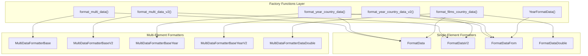
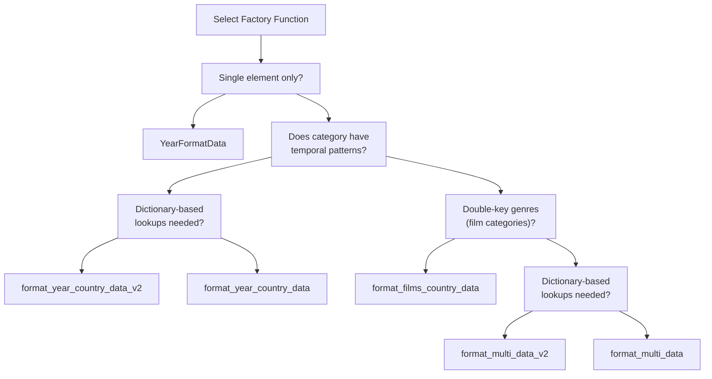

# Factory Functions and Usage

> **Relevant source files**
> * [ArWikiCats/translations_formats/DataModel/__init__.py](../ArWikiCats/translations_formats/DataModel/__init__.py)
> * [ArWikiCats/translations_formats/DataModel/model_data.py](../ArWikiCats/translations_formats/DataModel/model_data.py)
> * [ArWikiCats/translations_formats/DataModel/model_data_base.py](../ArWikiCats/translations_formats/DataModel/model_data_base.py)
> * [ArWikiCats/translations_formats/DataModel/model_data_time.py](../ArWikiCats/translations_formats/DataModel/model_data_time.py)
> * [ArWikiCats/translations_formats/DataModel/model_data_v2.py](../ArWikiCats/translations_formats/DataModel/model_data_v2.py)
> * [ArWikiCats/translations_formats/DataModelDouble/model_multi_data_double.py](../ArWikiCats/translations_formats/DataModelDouble/model_multi_data_double.py)
> * [ArWikiCats/translations_formats/__init__.py](../ArWikiCats/translations_formats/__init__.py)
> * [ArWikiCats/translations_formats/data_new_model.py](../ArWikiCats/translations_formats/data_new_model.py)
> * [ArWikiCats/translations_formats/data_with_time.py](../ArWikiCats/translations_formats/data_with_time.py)
> * [ArWikiCats/translations_formats/multi_data.py](../ArWikiCats/translations_formats/multi_data.py)

## Purpose and Scope

This page documents the factory functions that provide the high-level API for creating formatter instances in the ArWikiCats translation system. Factory functions hide the complexity of instantiating and configuring formatter classes, providing a simplified interface for creating dual-element and temporal pattern formatters.

For information about the underlying formatter class architecture, see [FormatDataBase Architecture](23.FormatDataBase-Architecture.md). For details on the individual formatter classes themselves, see [Single-Element Formatters](24.Single-Element-Formatters.md) and [Multi-Element Formatters](25.Multi-Element-Formatters.md). For template and placeholder syntax, see [Template and Placeholder System](26.Template-and-Placeholder-System.md)

**Sources:** [ArWikiCats/translations_formats/__init__.py L27-L47](../ArWikiCats/translations_formats/__init__.py#L27-L47)

 [ArWikiCats/translations_formats/multi_data.py L1-L37](../ArWikiCats/translations_formats/multi_data.py#L1-L37)

## Factory Function Overview

The system provides six primary factory functions for creating formatters:

| Factory Function | Returns | Use Case |
| --- | --- | --- |
| `format_multi_data` | `MultiDataFormatterBase` | Dual-element categories with string-based lookups (e.g., nationality + sport) |
| `format_multi_data_v2` | `MultiDataFormatterBaseV2` | Dual-element categories with dictionary-based lookups for complex placeholders |
| `format_year_country_data` | `MultiDataFormatterBaseYear` | Temporal + nationality/country patterns with string lookups |
| `format_year_country_data_v2` | `MultiDataFormatterBaseYearV2` | Temporal + nationality/country patterns with dictionary lookups |
| `format_films_country_data` | `MultiDataFormatterDataDouble` | Film categories with nationality + double-key genres (e.g., "action drama") |
| `YearFormatData` | `FormatDataFrom` | Pure temporal pattern handling (years, decades, centuries) |

**Sources:** [ArWikiCats/translations_formats/__init__.py L27-L33](../ArWikiCats/translations_formats/__init__.py#L27-L33)

 [ArWikiCats/translations_formats/multi_data.py L96-L283](../ArWikiCats/translations_formats/multi_data.py#L96-L283)

 [ArWikiCats/translations_formats/data_with_time.py L45-L172](../ArWikiCats/translations_formats/data_with_time.py#L45-L172)

 [ArWikiCats/translations_formats/data_new_model.py L30-L105](../ArWikiCats/translations_formats/data_new_model.py#L30-L105)

## Common Parameters

All factory functions share a common set of parameters for configuring formatters:

| Parameter | Type | Purpose | Default |
| --- | --- | --- | --- |
| `formatted_data` | `Dict[str, str]` | Template patterns mapping English patterns to Arabic templates with placeholders | Required |
| `data_list` | `Dict[str, Union[str, Dict]]` | First element's key-to-label mappings (nationality, country, etc.) | Required |
| `key_placeholder` | `str` | Placeholder for first element key in templates | Varies by function |
| `value_placeholder` | `str` | Placeholder for first element value in templates | Varies by function |
| `data_list2` | `Dict[str, Union[str, Dict]]` | Second element's key-to-label mappings (sport, year, genre, etc.) | `None` |
| `key2_placeholder` | `str` | Placeholder for second element key in templates | `"xoxo"` or `"{year1}"` |
| `value2_placeholder` | `str` | Placeholder for second element value in templates | `"xoxo"` or `"{year1}"` |
| `text_after` | `str` | Optional text that must follow the first element key | `""` |
| `text_before` | `str` | Optional text that must precede the first element key | `""` |
| `data_to_find` | `Dict[str, str]` | Optional direct lookup dictionary bypassing pattern matching | `None` |
| `regex_filter` | `str` | Custom regex pattern for word boundary detection | `None` or `r"\w"` |

**V2 vs Standard Functions:** Functions ending in `_v2` use `FormatDataV2` which expects `data_list` values to be dictionaries with multiple placeholder keys, while standard functions use `FormatData` which expects simple string values.

**Sources:** [ArWikiCats/translations_formats/multi_data.py L96-L111](../ArWikiCats/translations_formats/multi_data.py#L96-L111)

 [ArWikiCats/translations_formats/data_with_time.py L109-L119](../ArWikiCats/translations_formats/data_with_time.py#L109-L119)

 [ArWikiCats/translations_formats/DataModel/model_data_base.py L75-L83](../ArWikiCats/translations_formats/DataModel/model_data_base.py#L75-L83)

## Factory Function Instantiation Flow



**Key Insight:** All factory functions follow the same pattern: they instantiate one or two single-element formatters and wrap them in a multi-element formatter that orchestrates their interaction. The `YearFormatData` function is unique in that it directly returns a single-element formatter.

**Sources:** [ArWikiCats/translations_formats/multi_data.py L162-L197](../ArWikiCats/translations_formats/multi_data.py#L162-L197)

 [ArWikiCats/translations_formats/data_with_time.py L154-L172](../ArWikiCats/translations_formats/data_with_time.py#L154-L172)

 [ArWikiCats/translations_formats/data_new_model.py L85-L105](../ArWikiCats/translations_formats/data_new_model.py#L85-L105)

## format_multi_data

Creates a `MultiDataFormatterBase` for translating categories with two dynamic elements using string-based lookups.

### Signature

```python
def format_multi_data(
    formatted_data: Dict[str, str],
    data_list: Dict[str, str],
    key_placeholder: str = "natar",
    value_placeholder: str = "natar",
    data_list2: Dict[str, str] = None,
    key2_placeholder: str = "xoxo",
    value2_placeholder: str = "xoxo",
    text_after: str = "",
    text_before: str = "",
    other_formatted_data: Dict[str, str] = None,
    use_other_formatted_data: bool = False,
    search_first_part: bool = False,
    data_to_find: Dict[str, str] | None = None,
    regex_filter: str | None = None,
) -> MultiDataFormatterBase
```

### Internal Components

The function creates two `FormatData` instances:

1. **country_bot** (`FormatData`): Handles the first dynamic element (typically nationality/country) * Uses `formatted_data`, `data_list`, `key_placeholder`, `value_placeholder` * Created at [ArWikiCats/translations_formats/multi_data.py L162-L170](../ArWikiCats/translations_formats/multi_data.py#L162-L170)
2. **other_bot** (`FormatData`): Handles the second dynamic element (typically sport/profession) * Uses `_other_formatted_data` (filtered or provided), `data_list2`, `key2_placeholder`, `value2_placeholder` * Created at [ArWikiCats/translations_formats/multi_data.py L184-L190](../ArWikiCats/translations_formats/multi_data.py#L184-L190)

### Usage Example

```python
from ArWikiCats.translations_formats import format_multi_data

formatted_data = {
    "{nat} {sport} players": "لاعبو {sport_ar} {nat_ar}",
    "{nat} {sport} coaches": "مدربو {sport_ar} {nat_ar}",
}

data_list = {
    "british": "بريطانيون",
    "american": "أمريكيون",
}

data_list2 = {
    "football": "كرة القدم",
    "basketball": "كرة السلة",
}

bot = format_multi_data(
    formatted_data=formatted_data,
    data_list=data_list,
    data_list2=data_list2,
    key_placeholder="{nat}",
    value_placeholder="{nat_ar}",
    key2_placeholder="{sport}",
    value2_placeholder="{sport_ar}",
)

result = bot.search("british football players")
# Returns: "لاعبو كرة القدم بريطانيون"
```

### use_other_formatted_data Parameter

When `use_other_formatted_data=True`, the function automatically filters `formatted_data` to extract templates containing only the second placeholder. This is useful when some categories only have the second element without the first:

```css
formatted_data = {
    "{nat} {sport} players": "لاعبو {sport_ar} {nat_ar}",
    "{sport} coaches": "مدربو {sport_ar}",  # Only sport, no nationality
}

bot = format_multi_data(
    formatted_data=formatted_data,
    data_list=data_list,
    data_list2=data_list2,
    key_placeholder="{nat}",
    value_placeholder="{nat_ar}",
    key2_placeholder="{sport}",
    value2_placeholder="{sport_ar}",
    use_other_formatted_data=True,  # Enables filtering
)

# Now the bot can handle both:
bot.search("british football players")  # Uses both formatters
bot.search("football coaches")          # Uses only other_bot
```

**Sources:** [ArWikiCats/translations_formats/multi_data.py L96-L197](../ArWikiCats/translations_formats/multi_data.py#L96-L197)

## format_multi_data_v2

Creates a `MultiDataFormatterBaseV2` for translating categories with two dynamic elements using dictionary-based lookups. This variant supports `data_list` values that are dictionaries containing multiple placeholders.

### Signature

```python
def format_multi_data_v2(
    formatted_data: Dict[str, str],
    data_list: Dict[str, str],
    key_placeholder: str,
    data_list2: Dict[str, str] = None,
    key2_placeholder: str = "xoxo",
    text_after: str = "",
    text_before: str = "",
    use_other_formatted_data: bool = False,
    search_first_part: bool = False,
    data_to_find: Dict[str, str] | None = None,
    regex_filter: str | None = None,
) -> MultiDataFormatterBaseV2
```

### Dictionary-Based Data Lists

Unlike `format_multi_data`, this function uses `FormatDataV2` which expects dictionary values:

```python
from ArWikiCats.translations_formats import format_multi_data_v2

formatted_data = {
    "{country} {sport} players": "{demonym} لاعبو {sport_ar}",
}

# data_list values are dictionaries with multiple placeholders
data_list = {
    "yemen": {
        "demonym": "يمنيون",
        "country_ar": "اليمن",
    },
    "egypt": {
        "demonym": "مصريون",
        "country_ar": "مصر",
    },
}

data_list2 = {
    "football": {"sport_ar": "كرة القدم"},
    "basketball": {"sport_ar": "كرة السلة"},
}

bot = format_multi_data_v2(
    formatted_data=formatted_data,
    data_list=data_list,
    key_placeholder="{country}",
    data_list2=data_list2,
    key2_placeholder="{sport}",
)

result = bot.search("yemen football players")
# Returns: "يمنيون لاعبو كرة القدم"
```

### Internal Components

Creates two `FormatDataV2` instances at [ArWikiCats/translations_formats/multi_data.py L254-L276](../ArWikiCats/translations_formats/multi_data.py#L254-L276)

:

1. **country_bot** (`FormatDataV2`): Handles first element with dictionary-based placeholder replacement
2. **other_bot** (`FormatDataV2`): Handles second element with dictionary-based placeholder replacement

**Sources:** [ArWikiCats/translations_formats/multi_data.py L200-L283](../ArWikiCats/translations_formats/multi_data.py#L200-L283)

## format_year_country_data

Creates a `MultiDataFormatterBaseYear` for translating categories combining temporal patterns (years, decades, centuries) with nationality or country elements.

### Signature

```python
def format_year_country_data(
    formatted_data: Dict[str, str],
    data_list: Dict[str, str],
    key_placeholder: str = "{country1}",
    value_placeholder: str = "{country1}",
    key2_placeholder: str = "{year1}",
    value2_placeholder: str = "{year1}",
    text_after: str = "",
    text_before: str = "",
    data_to_find: Dict[str, str] | None = None,
) -> MultiDataFormatterBaseYear
```

### Temporal Pattern Handling

This function creates a `YearFormatData` instance (which returns `FormatDataFrom`) for handling temporal patterns. The year formatter automatically converts English time expressions to Arabic:

* `"14th-century"` → `"القرن 14"`
* `"1990s"` → `"عقد 1990"`
* `"2010"` → `"2010"`

### Usage Example

```python
from ArWikiCats.translations_formats import format_year_country_data

formatted_data = {
    "{year1} {country1} events": "{country1} أحداث في {year1}",
    "{year1} {country1} writers": "كتاب {country1} في {year1}",
}

data_list = {
    "british": "بريطانية",
    "american": "أمريكية",
}

bot = format_year_country_data(
    formatted_data=formatted_data,
    data_list=data_list,
)

result = bot.search("14th-century british events")
# Returns: "بريطانية أحداث في القرن 14"

result = bot.search("1990s american writers")
# Returns: "كتاب أمريكية في عقد 1990"
```

### Internal Components

Created at [ArWikiCats/translations_formats/data_with_time.py L154-L172](../ArWikiCats/translations_formats/data_with_time.py#L154-L172)

:

1. **country_bot** (`FormatData`): Handles nationality/country element with string lookups
2. **other_bot** (`FormatDataFrom` via `YearFormatData`): Handles temporal pattern conversion

**Sources:** [ArWikiCats/translations_formats/data_with_time.py L109-L172](../ArWikiCats/translations_formats/data_with_time.py#L109-L172)

## format_year_country_data_v2

Creates a `MultiDataFormatterBaseYearV2` combining temporal patterns with dictionary-based nationality/country lookups.

### Signature

```python
def format_year_country_data_v2(
    formatted_data: Dict[str, str],
    data_list: Dict[str, str],
    key_placeholder: str = "{country1}",
    text_after: str = "",
    text_before: str = "",
    key2_placeholder: str = "{year1}",
    value2_placeholder: str = "{year1}",
    data_to_find: Dict[str, str] | None = None,
) -> MultiDataFormatterBaseYearV2
```

### Dictionary-Based Country Data

Similar to `format_multi_data_v2`, this function uses `FormatDataV2` for the country element:

```python
from ArWikiCats.translations_formats import format_year_country_data_v2

formatted_data = {
    "{year1} {country1} writers": "{demonym} كتاب في {year1}",
}

data_list = {
    "yemen": {
        "demonym": "يمنيون",
        "country_ar": "اليمن",
    },
}

bot = format_year_country_data_v2(
    formatted_data=formatted_data,
    data_list=data_list,
)

result = bot.search("14th-century yemen writers")
# Returns: "يمنيون كتاب في القرن 14"
```

### Internal Components

Created at [ArWikiCats/translations_formats/data_with_time.py L89-L106](../ArWikiCats/translations_formats/data_with_time.py#L89-L106)

:

1. **country_bot** (`FormatDataV2`): Dictionary-based lookups for nationality/country
2. **other_bot** (`FormatDataFrom` via `YearFormatData`): Temporal pattern conversion

**Sources:** [ArWikiCats/translations_formats/data_with_time.py L45-L106](../ArWikiCats/translations_formats/data_with_time.py#L45-L106)

## format_films_country_data

Creates a `MultiDataFormatterDataDouble` for translating film categories containing nationality and genre elements where genres can consist of two adjacent keys (e.g., "action drama")

### Signature

```python
def format_films_country_data(
    formatted_data: Dict[str, str],
    data_list: Dict[str, str],
    key_placeholder: str = "{nat_en}",
    value_placeholder: str = "{nat_ar}",
    data_list2: Dict[str, str] = None,
    other_formatted_data: Dict[str, str] = None,
    key2_placeholder: str = "{film_key}",
    value2_placeholder: str = "{film_ar}",
    text_after: str = "",
    text_before: str = "",
    data_to_find: Dict[str, str] | None = None,
) -> MultiDataFormatterDataDouble
```

### Double-Key Genre Matching

The second formatter uses `FormatDataDouble` which can match two adjacent genre keys:

```python
from ArWikiCats.translations_formats import format_films_country_data

formatted_data = {
    "{nat_en} {film_key} films": "أفلام {film_ar} {nat_ar}",
}

data_list = {
    "british": "بريطانية",
    "american": "أمريكية",
}

data_list2 = {
    "action": "أكشن",
    "drama": "دراما",
    "comedy": "كوميدي",
}

bot = format_films_country_data(
    formatted_data=formatted_data,
    data_list=data_list,
    data_list2=data_list2,
)

# Single genre key
result = bot.search("british action films")
# Returns: "أفلام أكشن بريطانية"

# Double genre keys (action + drama)
result = bot.search("british action drama films")
# Returns: "أفلام أكشن دراما بريطانية"
```

### Internal Components

Created at [ArWikiCats/translations_formats/data_new_model.py L85-L105](../ArWikiCats/translations_formats/data_new_model.py#L85-L105)

:

1. **country_bot** (`FormatData`): Handles nationality element
2. **other_bot** (`FormatDataDouble`): Handles genre element with double-key matching support

**Sources:** [ArWikiCats/translations_formats/data_new_model.py L30-L105](../ArWikiCats/translations_formats/data_new_model.py#L30-L105)

## YearFormatData

Factory function that creates a `FormatDataFrom` instance configured for temporal pattern matching and conversion. Unlike other factory functions, this directly returns a single-element formatter rather than a multi-element wrapper.

### Signature

```python
def YearFormatData(
    key_placeholder: str,
    value_placeholder: str,
) -> FormatDataFrom
```

### Temporal Pattern Conversion

The returned `FormatDataFrom` instance uses three callback functions for temporal handling:

1. **match_key_callback** (`match_time_en_first`): Extracts temporal patterns from category strings
2. **fixing_callback** (`standardize_time_phrases`): Normalizes time expressions
3. **search_callback** (`convert_time_to_arabic`): Converts English temporal patterns to Arabic

### Usage Example

```python
from ArWikiCats.translations_formats import YearFormatData

year_bot = YearFormatData(
    key_placeholder="{year1}",
    value_placeholder="{year1}",
)

# Extract temporal pattern
key = year_bot.match_key("14th-century british writers from Yemen")
# Returns: "14th-century"

# Convert to Arabic
result = year_bot.search("14th-century")
# Returns: "القرن 14"

result = year_bot.search("1990s")
# Returns: "عقد 1990"
```

### Callback Configuration

The function configures the `FormatDataFrom` instance at [ArWikiCats/translations_formats/DataModel/model_data_time.py L59-L66](../ArWikiCats/translations_formats/DataModel/model_data_time.py#L59-L66)

:

```
return FormatDataFrom(
    formatted_data={},
    key_placeholder=key_placeholder,
    value_placeholder=value_placeholder,
    search_callback=convert_time_to_arabic,
    match_key_callback=match_time_en_first,
    fixing_callback=standardize_time_phrases,
)
```

**Sources:** [ArWikiCats/translations_formats/DataModel/model_data_time.py L34-L66](../ArWikiCats/translations_formats/DataModel/model_data_time.py#L34-L66)

## Helper Functions

### get_other_data

Filters `formatted_data` to extract templates containing only the second placeholder (key2/value2) but not the first placeholder (key/value). Used internally by factory functions when `use_other_formatted_data=True`.

### Signature

```python
def get_other_data(
    formatted_data: dict[str, str],
    key_placeholder: str,
    value_placeholder: str,
    key2_placeholder: str,
    value2_placeholder: str,
) -> dict
```

### Usage Example

```python
from ArWikiCats.translations_formats.multi_data import get_other_data

formatted_data = {
    "{nat} {sport} players": "لاعبو {sport_ar} {nat_ar}",  # Has both placeholders
    "{nat} {sport} coaches": "مدربو {sport_ar} {nat_ar}",  # Has both placeholders
    "{sport} teams": "فرق {sport_ar}",                     # Only sport placeholder
    "{sport} competitions": "منافسات {sport_ar}",         # Only sport placeholder
}

other_data = get_other_data(
    formatted_data=formatted_data,
    key_placeholder="{nat}",
    value_placeholder="{nat_ar}",
    key2_placeholder="{sport}",
    value2_placeholder="{sport_ar}",
)

# Returns:
# {
#     "{sport} teams": "فرق {sport_ar}",
#     "{sport} competitions": "منافسات {sport_ar}",
# }
```

The filtering logic at [ArWikiCats/translations_formats/multi_data.py L86-L92](../ArWikiCats/translations_formats/multi_data.py#L86-L92)

 checks:

* Template key must contain `key2_placeholder` but not `key_placeholder`
* Template value must contain `value2_placeholder` but not `value_placeholder`

**Sources:** [ArWikiCats/translations_formats/multi_data.py L51-L93](../ArWikiCats/translations_formats/multi_data.py#L51-L93)

## Factory Function Selection Guide



### Decision Criteria

| Scenario | Factory Function | Reason |
| --- | --- | --- |
| Category has year/decade/century patterns with nationality | `format_year_country_data` or `format_year_country_data_v2` | Temporal pattern handling via `YearFormatData` |
| Category has film genres that can be two adjacent keys | `format_films_country_data` | `FormatDataDouble` for double-key matching |
| Category has two elements with simple string lookups | `format_multi_data` | Standard dual-element translation |
| Category has two elements with multiple placeholders per key | `format_multi_data_v2` | Dictionary-based lookup with `FormatDataV2` |
| Category has only temporal patterns, no other elements | `YearFormatData` | Direct single-element formatter |

### Real-World Usage Examples

From the codebase, factory functions are used extensively in resolver implementations:

**Sports Resolver** uses `format_multi_data`:

```markdown
# Nationality + Sport combinations
bot = format_multi_data(
    formatted_data=formatted_data,
    data_list=All_Nat,
    data_list2=SPORT_KEY_RECORDS,
    key_placeholder="{nat_en}",
    value_placeholder="{nat_ar}",
    key2_placeholder="{sport}",
    value2_placeholder="{sport_ar}",
)
```

**Country Resolver** uses `format_year_country_data_v2`:

```markdown
# Year + Country with dictionary-based country data
bot = format_year_country_data_v2(
    formatted_data=formatted_data,
    data_list=pf_keys2,  # Dictionary with multiple placeholders
    key_placeholder="{from_country}",
)
```

**Film Resolver** uses `format_films_country_data`:

```markdown
# Nationality + Genre (double-key support for "action drama")
bot = format_films_country_data(
    formatted_data=formatted_data,
    data_list=Nat_womens,
    data_list2=Films_key_For_nat,
    key_placeholder="{nat_en}",
    value_placeholder="{nat_ar}",
)
```

**Sources:** [ArWikiCats/translations_formats/multi_data.py L1-L290](../ArWikiCats/translations_formats/multi_data.py#L1-L290)

 [ArWikiCats/translations_formats/data_with_time.py L1-L179](../ArWikiCats/translations_formats/data_with_time.py#L1-L179)

 [ArWikiCats/translations_formats/data_new_model.py L1-L111](../ArWikiCats/translations_formats/data_new_model.py#L1-L111)

## Parameter Configuration Patterns

### Default Placeholder Constants

The factory modules define default placeholder values at [ArWikiCats/translations_formats/multi_data.py L47-L48](../ArWikiCats/translations_formats/multi_data.py#L47-L48)

 and [ArWikiCats/translations_formats/data_with_time.py L41-L42](../ArWikiCats/translations_formats/data_with_time.py#L41-L42)

:

```markdown
# multi_data.py
YEAR_PARAM = "xoxo"
COUNTRY_PARAM = "natar"

# data_with_time.py
YEAR_PARAM = "{year1}"
COUNTRY_PARAM = "{country1}"
```

These defaults are used when parameters are not explicitly provided:

```markdown
# Using defaults
bot = format_multi_data(
    formatted_data=formatted_data,
    data_list=data_list,
    data_list2=data_list2,
    # key_placeholder defaults to "natar"
    # value_placeholder defaults to "natar"
    # key2_placeholder defaults to "xoxo"
    # value2_placeholder defaults to "xoxo"
)

# Explicit placeholders (recommended for clarity)
bot = format_multi_data(
    formatted_data=formatted_data,
    data_list=data_list,
    data_list2=data_list2,
    key_placeholder="{nat}",
    value_placeholder="{nat_ar}",
    key2_placeholder="{sport}",
    value2_placeholder="{sport_ar}",
)
```

### text_before and text_after

These parameters handle cases where the key is preceded or followed by common words:

```css
formatted_data = {
    "the {nat} actors": "ممثلون {nat_ar}",
    "{nat} people writers": "كتاب {nat_ar}",
}

bot = format_multi_data(
    formatted_data=formatted_data,
    data_list=data_list,
    data_list2=data_list2,
    key_placeholder="{nat}",
    value_placeholder="{nat_ar}",
    text_before="the ",  # Removes "the " before placeholder during normalization
    text_after=" people",  # Removes " people" after placeholder during normalization
)
```

The normalization process at [ArWikiCats/translations_formats/DataModel/model_data_base.py L158-L191](../ArWikiCats/translations_formats/DataModel/model_data_base.py#L158-L191)

 removes these surrounding texts when they appear adjacent to the matched key.

**Sources:** [ArWikiCats/translations_formats/multi_data.py L47-L48](../ArWikiCats/translations_formats/multi_data.py#L47-L48)

 [ArWikiCats/translations_formats/data_with_time.py L41-L42](../ArWikiCats/translations_formats/data_with_time.py#L41-L42)

 [ArWikiCats/translations_formats/DataModel/model_data_base.py L158-L191](../ArWikiCats/translations_formats/DataModel/model_data_base.py#L158-L191)
