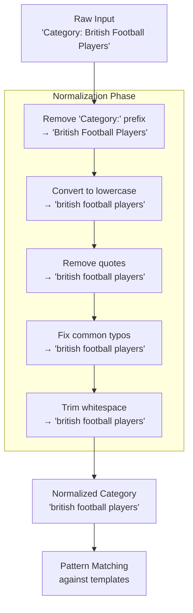
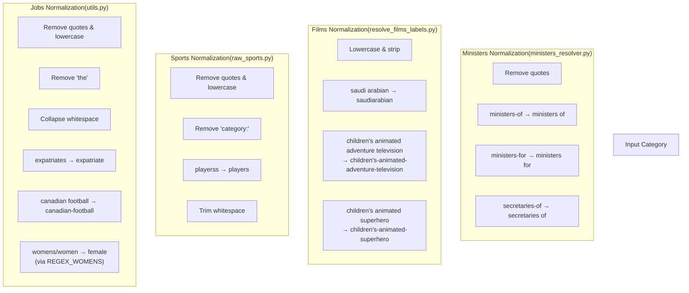
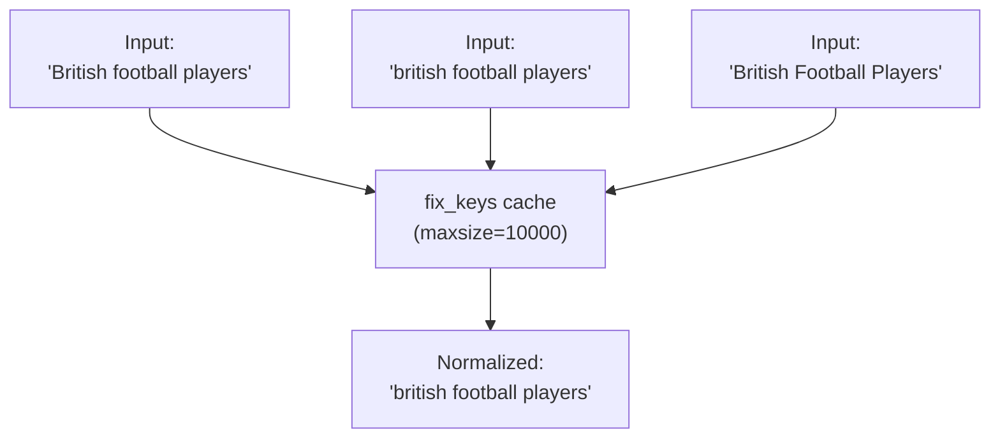

# Category Normalization

> **Relevant source files**
> * [ArWikiCats/jsons/jobs/activists_keys.json](../ArWikiCats/jsons/jobs/activists_keys.json)
> * [ArWikiCats/new/handle_suffixes.py](../ArWikiCats/new/handle_suffixes.py)
> * [ArWikiCats/new_resolvers/__init__.py](../ArWikiCats/new_resolvers/__init__.py)
> * [ArWikiCats/new_resolvers/countries_names_resolvers/__init__.py](../ArWikiCats/new_resolvers/countries_names_resolvers/__init__.py)
> * [ArWikiCats/new_resolvers/countries_names_with_sports/__init__.py](../ArWikiCats/new_resolvers/countries_names_with_sports/__init__.py)
> * [ArWikiCats/new_resolvers/countries_names_with_sports/p17_bot_sport.py](../ArWikiCats/new_resolvers/countries_names_with_sports/p17_bot_sport.py)
> * [ArWikiCats/new_resolvers/countries_names_with_sports/p17_sport_to_move_under.py](../ArWikiCats/new_resolvers/countries_names_with_sports/p17_sport_to_move_under.py)
> * [ArWikiCats/new_resolvers/films_resolvers/__init__.py](../ArWikiCats/new_resolvers/films_resolvers/__init__.py)
> * [ArWikiCats/new_resolvers/films_resolvers/resolve_films_labels.py](../ArWikiCats/new_resolvers/films_resolvers/resolve_films_labels.py)
> * [ArWikiCats/new_resolvers/jobs_resolvers/__init__.py](../ArWikiCats/new_resolvers/jobs_resolvers/__init__.py)
> * [ArWikiCats/new_resolvers/jobs_resolvers/mens.py](../ArWikiCats/new_resolvers/jobs_resolvers/mens.py)
> * [ArWikiCats/new_resolvers/jobs_resolvers/relegin_jobs_new.py](../ArWikiCats/new_resolvers/jobs_resolvers/relegin_jobs_new.py)
> * [ArWikiCats/new_resolvers/jobs_resolvers/utils.py](../ArWikiCats/new_resolvers/jobs_resolvers/utils.py)
> * [ArWikiCats/new_resolvers/jobs_resolvers/womens.py](../ArWikiCats/new_resolvers/jobs_resolvers/womens.py)
> * [ArWikiCats/new_resolvers/nationalities_resolvers/__init__.py](../ArWikiCats/new_resolvers/nationalities_resolvers/__init__.py)
> * [ArWikiCats/new_resolvers/nationalities_resolvers/ministers_resolver.py](../ArWikiCats/new_resolvers/nationalities_resolvers/ministers_resolver.py)
> * [ArWikiCats/new_resolvers/sports_resolvers/__init__.py](../ArWikiCats/new_resolvers/sports_resolvers/__init__.py)
> * [ArWikiCats/new_resolvers/sports_resolvers/countries_names_and_sports.py](../ArWikiCats/new_resolvers/sports_resolvers/countries_names_and_sports.py)
> * [ArWikiCats/new_resolvers/sports_resolvers/nationalities_and_sports.py](../ArWikiCats/new_resolvers/sports_resolvers/nationalities_and_sports.py)
> * [ArWikiCats/new_resolvers/sports_resolvers/pre_defined.py](../ArWikiCats/new_resolvers/sports_resolvers/pre_defined.py)
> * [ArWikiCats/new_resolvers/sports_resolvers/raw_sports.py](../ArWikiCats/new_resolvers/sports_resolvers/raw_sports.py)
> * [ArWikiCats/new_resolvers/sports_resolvers/raw_sports_with_suffixes.py](../ArWikiCats/new_resolvers/sports_resolvers/raw_sports_with_suffixes.py)
> * [ArWikiCats/new_resolvers/sports_resolvers/sport_lab_nat.py](../ArWikiCats/new_resolvers/sports_resolvers/sport_lab_nat.py)
> * [ArWikiCats/new_resolvers/teams_mappings_ends.py](../ArWikiCats/new_resolvers/teams_mappings_ends.py)

## Purpose and Scope

Category normalization is the process of standardizing input category strings into a consistent format before they are matched against translation patterns. This preprocessing step is critical for ensuring that variations in capitalization, punctuation, spacing, and common typos do not prevent successful category resolution.

For information about the complete resolution pipeline that uses these normalization functions, see [Resolution Pipeline](3.Resolution-Pipeline.md). For details on how normalized categories are matched using templates, see [Template and Placeholder System](26.Template-and-Placeholder-System.md).

**Sources:** [ArWikiCats/new_resolvers/jobs_resolvers/utils.py L10-L26](../ArWikiCats/new_resolvers/jobs_resolvers/utils.py#L10-L26)

 [ArWikiCats/new_resolvers/sports_resolvers/raw_sports.py L366-L378](../ArWikiCats/new_resolvers/sports_resolvers/raw_sports.py#L366-L378)

## Normalization in the Resolution Pipeline

Normalization occurs immediately after a category string enters a resolver but before any pattern matching begins. Each resolver module typically invokes its own `fix_keys` function (or `normalize_text` function) to prepare the input.



**Sources:** [ArWikiCats/new_resolvers/jobs_resolvers/mens.py L327-L336](../ArWikiCats/new_resolvers/jobs_resolvers/mens.py#L327-L336)

 [ArWikiCats/new_resolvers/sports_resolvers/raw_sports.py L381-L421](../ArWikiCats/new_resolvers/sports_resolvers/raw_sports.py#L381-L421)

## Core Normalization Functions

The codebase contains multiple `fix_keys` and `normalize_text` functions, each tailored to the specific needs of different resolver domains. While they share common operations, each variant includes domain-specific adjustments.

### Normalization Function Locations

| Function | Location | Primary Domain | Key Specializations |
| --- | --- | --- | --- |
| `fix_keys` | `jobs_resolvers/utils.py` | Jobs (mens/womens) | Gender term conversion, expatriate normalization |
| `fix_keys` | `sports_resolvers/raw_sports.py` | Sports | Typo correction (playerss), quote removal |
| `fix_keys` | `sports_resolvers/raw_sports_with_suffixes.py` | Sports with suffixes | Minimal normalization |
| `fix_keys` | `films_resolvers/resolve_films_labels.py` | Films/TV | Country name fixes, children's content patterns |
| `fix_keys` | `jobs_resolvers/relegin_jobs_new.py` | Religious jobs | Gender and expatriate normalization |
| `fix_keys` | `ministers_resolver.py` | Political roles | Hyphenated term normalization |
| `normalize_text` | `new/handle_suffixes.py` | Suffix handling | Removal of "the" and "category:" |

**Sources:** [ArWikiCats/new_resolvers/jobs_resolvers/utils.py L10-L26](../ArWikiCats/new_resolvers/jobs_resolvers/utils.py#L10-L26)

 [ArWikiCats/new_resolvers/sports_resolvers/raw_sports.py L366-L378](../ArWikiCats/new_resolvers/sports_resolvers/raw_sports.py#L366-L378)

 [ArWikiCats/new_resolvers/films_resolvers/resolve_films_labels.py L263-L287](../ArWikiCats/new_resolvers/films_resolvers/resolve_films_labels.py#L263-L287)

 [ArWikiCats/new_resolvers/jobs_resolvers/relegin_jobs_new.py L168-L192](../ArWikiCats/new_resolvers/jobs_resolvers/relegin_jobs_new.py#L168-L192)

 [ArWikiCats/new_resolvers/ministers_resolver.py L128-L132](../ArWikiCats/new_resolvers/ministers_resolver.py#L128-L132)

 [ArWikiCats/new/handle_suffixes.py L20-L34](../ArWikiCats/new/handle_suffixes.py#L20-L34)

## Common Normalization Operations

All normalization functions perform a core set of transformations to ensure consistent matching:

### 1. Case Normalization

All category strings are converted to lowercase to enable case-insensitive matching.

```markdown
# All fix_keys implementations include:
category = category.lower()
```

### 2. Prefix Removal

The `"category:"` prefix is stripped from input strings, as Wikipedia categories often include this namespace qualifier.

```
category = category.lower().replace("category:", "")
```

### 3. Quote Removal

Single quotes (apostrophes) are removed to handle possessive forms and contractions uniformly.

```markdown
category = category.replace("'", "")
# "women's" → "womens"
# "men's" → "mens"
```

### 4. Whitespace Normalization

Leading and trailing whitespace is removed. Some implementations also collapse multiple spaces to single spaces.

```markdown
category = category.strip()

# In jobs/utils.py:
category = re.sub(r"\s+", " ", category)  # Multiple spaces → single space
```

### 5. Common Word Removal

The word "the" is frequently removed, as it appears in many category names but doesn't contribute to matching.

```markdown
# Using regex in jobs/utils.py:
REGEX_THE = re.compile(r"\b(the)\b", re.I)
category = REGEX_THE.sub("", category)

# Using string replacement in handle_suffixes.py:
text = text.replace(" the ", " ")
text = text.removeprefix("the ")
```

**Sources:** [ArWikiCats/new_resolvers/jobs_resolvers/utils.py L10-L26](../ArWikiCats/new_resolvers/jobs_resolvers/utils.py#L10-L26)

 [ArWikiCats/new/handle_suffixes.py L20-L34](../ArWikiCats/new/handle_suffixes.py#L20-L34)

## Domain-Specific Normalization

Different resolver domains apply specialized normalization rules based on their category patterns.



### Jobs Resolver Normalization

The jobs resolver normalization handles gender-specific terminology and expatriate variations:

**Key transformations:**

* `"womens"` or `"women"` → `"female"` (using `REGEX_WOMENS`)
* `"expatriates"` → `"expatriate"`
* `"canadian football"` → `"canadian-football"`

**Implementation:** [ArWikiCats/new_resolvers/jobs_resolvers/utils.py L10-L26](../ArWikiCats/new_resolvers/jobs_resolvers/utils.py#L10-L26)

```python
REGEX_WOMENS = re.compile(r"\b(womens|women)\b", re.I)
REGEX_THE = re.compile(r"\b(the)\b", re.I)

def fix_keys(category: str) -> str:
    original_category = category
    category = category.replace("'", "").lower()
    category = REGEX_THE.sub("", category)
    category = re.sub(r"\s+", " ", category)

    replacements = {
        "expatriates": "expatriate",
        "canadian football": "canadian-football",
    }

    for old, new in replacements.items():
        category = category.replace(old, new)

    category = REGEX_WOMENS.sub("female", category)
    return category.strip()
```

**Used by:**

* [ArWikiCats/new_resolvers/jobs_resolvers/mens.py L330](../ArWikiCats/new_resolvers/jobs_resolvers/mens.py#L330-L330)
* [ArWikiCats/new_resolvers/jobs_resolvers/womens.py L283-L305](../ArWikiCats/new_resolvers/jobs_resolvers/womens.py#L283-L305)

### Sports Resolver Normalization

The sports resolver focuses on typo correction and basic cleanup:

**Key transformations:**

* `"playerss"` → `"players"` (common typo)
* `"australian rules"` → `"australian-rules"` (in caller code)
* Removes `"category:"` prefix

**Implementation:** [ArWikiCats/new_resolvers/sports_resolvers/raw_sports.py L366-L378](../ArWikiCats/new_resolvers/sports_resolvers/raw_sports.py#L366-L378)

```python
@functools.lru_cache(maxsize=10000)
def fix_keys(category: str) -> str:
    """
    Normalize a raw category string by removing quotes and prefixes,
    fixing common typos, and trimming whitespace.
    """
    category = category.replace("'", "").lower().replace("category:", "")
    category = category.replace("playerss", "players")
    return category.strip()
```

**Used by:**

* [ArWikiCats/new_resolvers/sports_resolvers/raw_sports.py L402](../ArWikiCats/new_resolvers/sports_resolvers/raw_sports.py#L402-L402)
* [ArWikiCats/new_resolvers/sports_resolvers/nationalities_and_sports.py L341](../ArWikiCats/new_resolvers/sports_resolvers/nationalities_and_sports.py#L341-L341)
* [ArWikiCats/new_resolvers/sports_resolvers/countries_names_and_sports.py L186](../ArWikiCats/new_resolvers/sports_resolvers/countries_names_and_sports.py#L186-L186)

### Films/TV Resolver Normalization

Films normalization handles country name variations and hyphenates multi-word modifiers:

**Key transformations:**

* `"saudi arabian"` → `"saudiarabian"` (country name normalization)
* `"children's animated adventure television"` → `"children's-animated-adventure-television"`
* `"children's animated superhero"` → `"children's-animated-superhero"`

**Implementation:** [ArWikiCats/new_resolvers/films_resolvers/resolve_films_labels.py L263-L287](../ArWikiCats/new_resolvers/films_resolvers/resolve_films_labels.py#L263-L287)

```python
def fix_keys(category: str) -> str:
    fixes = {
        "saudi arabian": "saudiarabian",
        "children's animated adventure television": "children's-animated-adventure-television",
        "children's animated superhero": "children's-animated-superhero",
    }
    category = category.lower().strip()

    for old, new in fixes.items():
        category = category.replace(old, new)

    return category
```

**Used by:** [ArWikiCats/new_resolvers/films_resolvers/resolve_films_labels.py L301](../ArWikiCats/new_resolvers/films_resolvers/resolve_films_labels.py#L301-L301)

### Ministers/Political Roles Normalization

Ministers normalization handles hyphenated terms in political categories:

**Key transformations:**

* `"ministers-of"` → `"ministers of"`
* `"ministers-for"` → `"ministers for"`
* `"secretaries-of"` → `"secretaries of"`

**Implementation:** [ArWikiCats/new_resolvers/ministers_resolver.py L128-L132](../ArWikiCats/new_resolvers/ministers_resolver.py#L128-L132)

```python
def fix_keys(text: str) -> str:
    text = text.replace("'", "")
    text = text.replace("ministers-of", "ministers of").replace("ministers-for", "ministers for")
    text = text.replace("secretaries-of", "secretaries of")
    return text
```

**Used by:** [ArWikiCats/new_resolvers/nationalities_resolvers/ministers_resolver.py L138](../ArWikiCats/new_resolvers/nationalities_resolvers/ministers_resolver.py#L138-L138)

**Sources:** [ArWikiCats/new_resolvers/jobs_resolvers/utils.py L1-L109](../ArWikiCats/new_resolvers/jobs_resolvers/utils.py#L1-L109)

 [ArWikiCats/new_resolvers/sports_resolvers/raw_sports.py L366-L378](../ArWikiCats/new_resolvers/sports_resolvers/raw_sports.py#L366-L378)

 [ArWikiCats/new_resolvers/films_resolvers/resolve_films_labels.py L263-L287](../ArWikiCats/new_resolvers/films_resolvers/resolve_films_labels.py#L263-L287)

 [ArWikiCats/new_resolvers/ministers_resolver.py L128-L132](../ArWikiCats/new_resolvers/ministers_resolver.py#L128-L132)

## Normalization and Caching

Normalization functions are frequently decorated with `@functools.lru_cache` to avoid redundant processing of the same input strings. This is particularly important because:

1. **Multiple resolvers may process the same category** as it flows through the resolver chain
2. **Test suites process thousands of categories** where duplicates are common
3. **Normalization happens before cache lookups** in resolver functions

### Caching Strategy



**Example from sports resolver:**

```python
@functools.lru_cache(maxsize=10000)
def fix_keys(category: str) -> str:
    category = category.replace("'", "").lower().replace("category:", "")
    category = category.replace("playerss", "players")
    return category.strip()
```

**Cache sizes:**

* `fix_keys` functions: typically `maxsize=10000`
* Resolver functions that use `fix_keys`: typically `maxsize=10000` or `maxsize=50000`

**Sources:** [ArWikiCats/new_resolvers/sports_resolvers/raw_sports.py L366-L378](../ArWikiCats/new_resolvers/sports_resolvers/raw_sports.py#L366-L378)

 [ArWikiCats/new_resolvers/jobs_resolvers/mens.py L327-L336](../ArWikiCats/new_resolvers/jobs_resolvers/mens.py#L327-L336)

## Normalization Inconsistencies and Variations

While all normalization functions share common goals, their implementations vary slightly across the codebase. Understanding these differences is important for troubleshooting resolution issues.

### Comparison of fix_keys Implementations

| Operation | jobs/utils.py | sports/raw_sports.py | films/resolve_films_labels.py | ministers_resolver.py |
| --- | --- | --- | --- | --- |
| Remove quotes | ✓ | ✓ | ✗ | ✓ |
| Lowercase | ✓ | ✓ | ✓ | ✗ |
| Remove "category:" | ✗ | ✓ | ✗ | ✗ |
| Remove "the" | ✓ (regex) | ✗ | ✗ | ✗ |
| Collapse whitespace | ✓ (regex) | ✗ | ✗ | ✗ |
| Strip whitespace | ✓ | ✓ | ✓ | ✗ |
| Gender normalization | ✓ (womens→female) | ✗ | ✗ | ✗ |
| Typo fixes | ✗ | ✓ (playerss) | ✗ | ✗ |
| Domain-specific | expatriates, canadian football | australian-rules (caller) | saudi arabian, children's patterns | ministers/secretaries hyphen fixes |

### Why Variations Exist

1. **Historical development**: Different resolvers were developed at different times by different contributors
2. **Domain-specific needs**: Each category domain has unique normalization requirements
3. **Performance trade-offs**: Some normalizations (like regex operations) are more expensive
4. **Compatibility**: Changing normalization can break existing translation patterns

### Impact on Resolution

These variations mean that:

* A category normalized by one resolver may not match patterns designed for another
* Order matters in the resolver chain (see [Resolver Chain Priority System](5.Resolver-Chain-Priority-System.md))
* Testing must account for domain-specific normalization rules

**Example of domain-specific impact:**

```yaml
Input: "Category: Women's Football Players"

Jobs resolver:
  fix_keys → "female football players"
  (womens → female conversion applied)

Sports resolver:
  fix_keys → "womens football players"
  (no gender normalization)

Result: Different normalized forms may match different patterns
```

**Sources:** [ArWikiCats/new_resolvers/jobs_resolvers/utils.py L10-L26](../ArWikiCats/new_resolvers/jobs_resolvers/utils.py#L10-L26)

 [ArWikiCats/new_resolvers/sports_resolvers/raw_sports.py L366-L378](../ArWikiCats/new_resolvers/sports_resolvers/raw_sports.py#L366-L378)

 [ArWikiCats/new_resolvers/films_resolvers/resolve_films_labels.py L263-L287](../ArWikiCats/new_resolvers/films_resolvers/resolve_films_labels.py#L263-L287)

 [ArWikiCats/new_resolvers/ministers_resolver.py L128-L132](../ArWikiCats/new_resolvers/ministers_resolver.py#L128-L132)

## Suffix Handling Normalization

The suffix handling system ([ArWikiCats/new/handle_suffixes.py](../ArWikiCats/new/handle_suffixes.py)

) includes its own `normalize_text` function used specifically for suffix-based resolution:

```python
def normalize_text(text: str) -> str:
    """Normalize category text by removing namespace and common words."""
    text = text.lower().replace("category:", "")
    text = text.replace(" the ", " ")
    text = text.removeprefix("the ")
    return text.strip()
```

This function is called by:

* `resolve_suffix_with_mapping_genders` [ArWikiCats/new/handle_suffixes.py L59-L105](../ArWikiCats/new/handle_suffixes.py#L59-L105)
* `resolve_sport_category_suffix_with_mapping` [ArWikiCats/new/handle_suffixes.py L108-L136](../ArWikiCats/new/handle_suffixes.py#L108-L136)

These suffix resolution functions are used extensively in sports resolvers to handle categories like:

* `"british football players"` → suffix: `"players"`, base: `"british football"`
* `"american basketball coaches"` → suffix: `"coaches"`, base: `"american basketball"`

**Sources:** [ArWikiCats/new/handle_suffixes.py L20-L34](../ArWikiCats/new/handle_suffixes.py#L20-L34)

 [ArWikiCats/new/handle_suffixes.py L59-L105](../ArWikiCats/new/handle_suffixes.py#L59-L105)

 [ArWikiCats/new/handle_suffixes.py L108-L136](../ArWikiCats/new/handle_suffixes.py#L108-L136)

## Best Practices for Normalization

When working with or extending the normalization system:

### 1. Use Existing Functions

Import and use the appropriate `fix_keys` function for your resolver domain rather than creating new ones:

```javascript
# For jobs resolvers
from .utils import fix_keys

# For religious jobs
from .relegin_jobs_new import fix_keys
```

### 2. Cache Normalization Results

Always decorate normalization functions with LRU cache:

```python
@functools.lru_cache(maxsize=10000)
def fix_keys(category: str) -> str:
    # normalization logic
    return normalized_category
```

### 3. Document Domain-Specific Rules

If adding new normalization rules, document why they're needed:

```python
replacements = {
    "expatriates": "expatriate",  # Normalize plural form
    "canadian football": "canadian-football",  # Distinguish from generic football
}
```

### 4. Test Normalization Thoroughly

Ensure normalization doesn't break existing patterns:

```markdown
# Test that normalization preserves essential distinctions
assert fix_keys("women's football") != fix_keys("men's football")
```

**Sources:** [ArWikiCats/new_resolvers/jobs_resolvers/utils.py L1-L109](../ArWikiCats/new_resolvers/jobs_resolvers/utils.py#L1-L109)

 [ArWikiCats/new_resolvers/jobs_resolvers/mens.py L327-L336](../ArWikiCats/new_resolvers/jobs_resolvers/mens.py#L327-L336)
