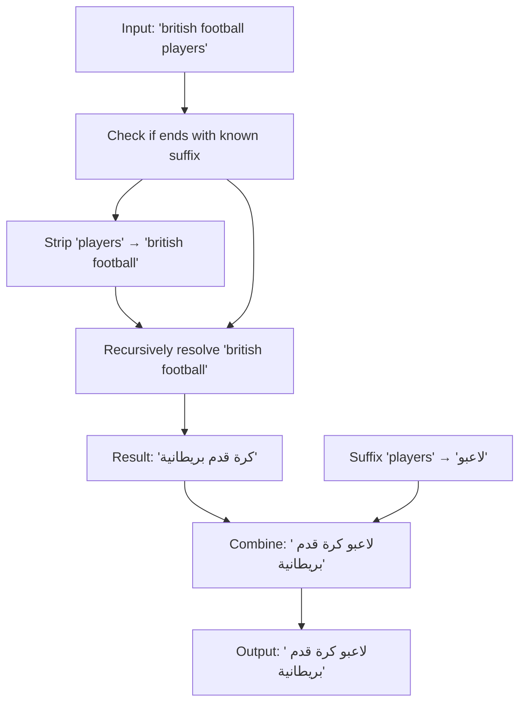
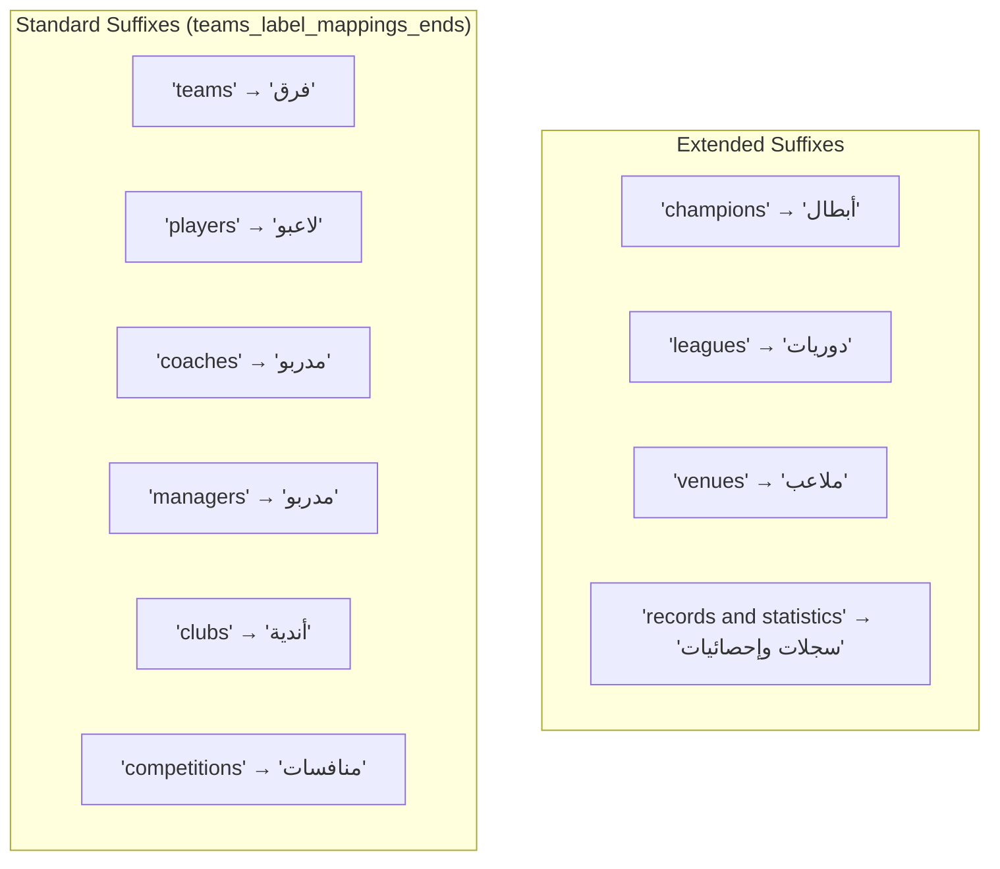
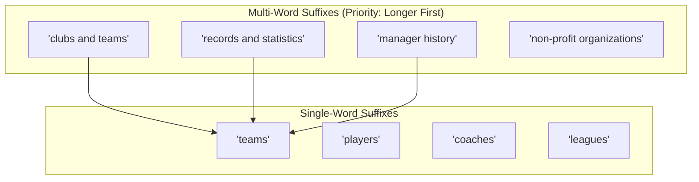
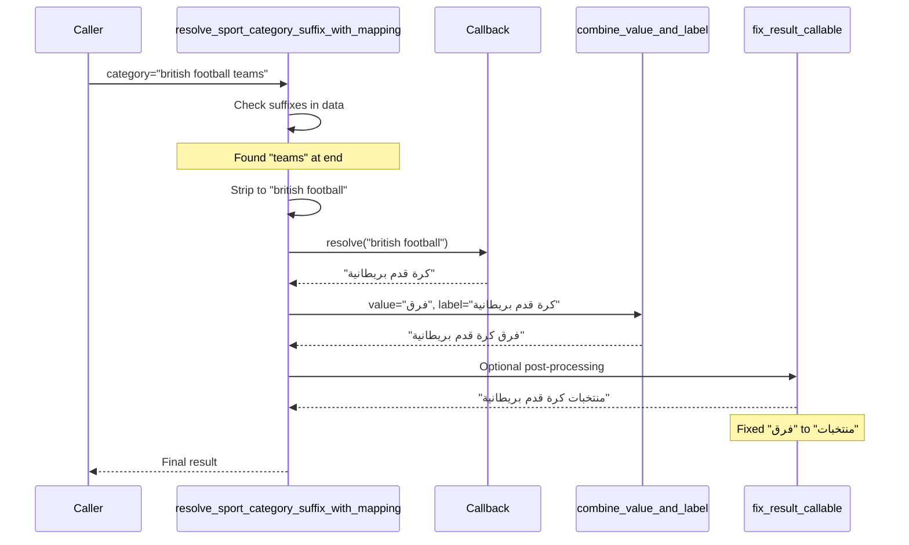
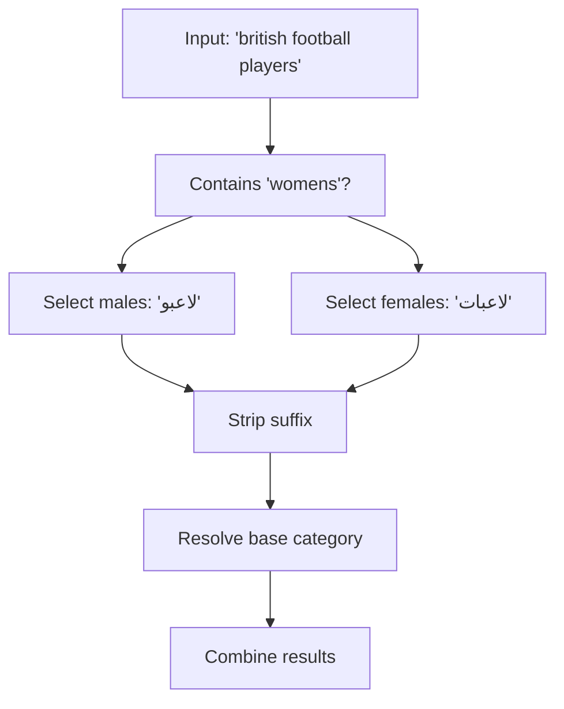
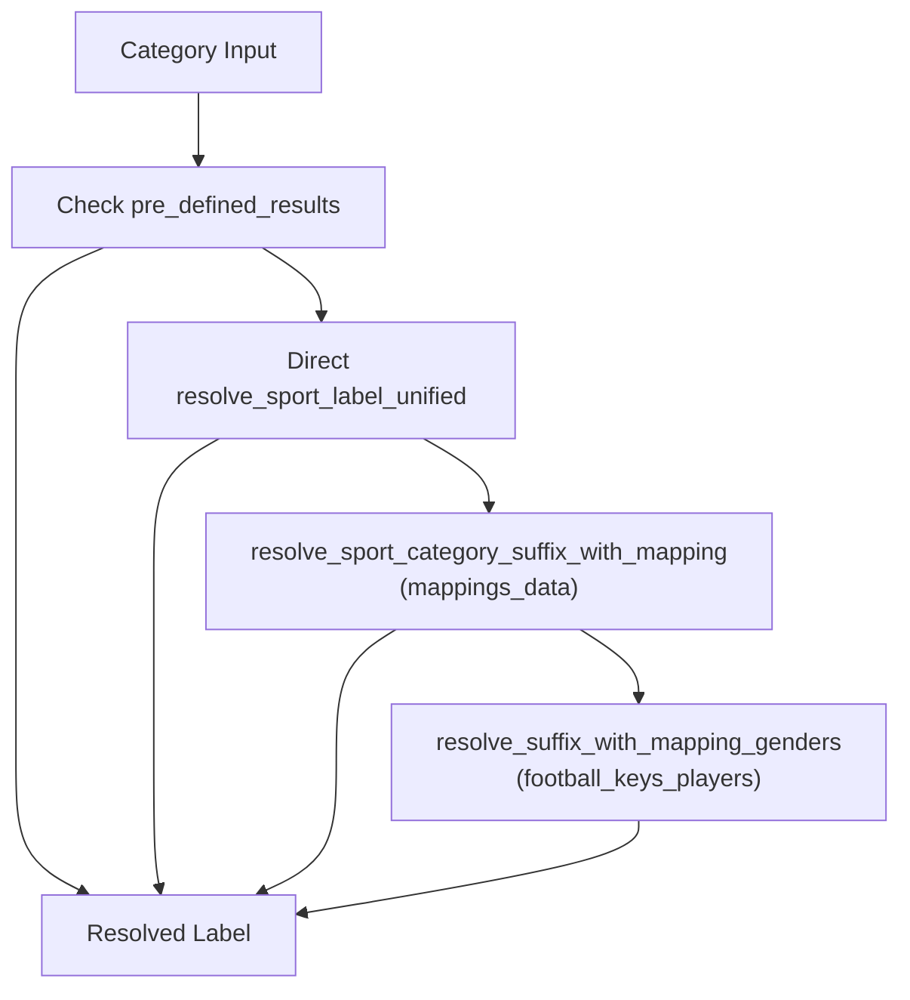
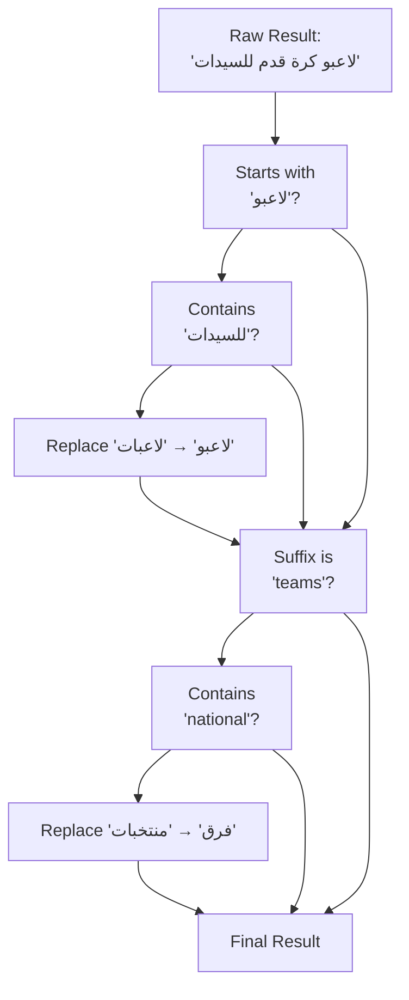
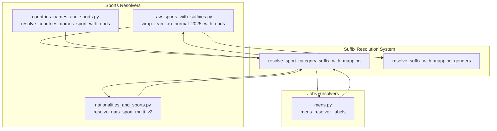

# Suffix Resolution System

> **Relevant source files**
> * [ArWikiCats/jsons/jobs/activists_keys.json](../ArWikiCats/jsons/jobs/activists_keys.json)
> * [ArWikiCats/new/handle_suffixes.py](../ArWikiCats/new/handle_suffixes.py)
> * [ArWikiCats/new_resolvers/__init__.py](../ArWikiCats/new_resolvers/__init__.py)
> * [ArWikiCats/new_resolvers/countries_names_resolvers/__init__.py](../ArWikiCats/new_resolvers/countries_names_resolvers/__init__.py)
> * [ArWikiCats/new_resolvers/countries_names_with_sports/__init__.py](../ArWikiCats/new_resolvers/countries_names_with_sports/__init__.py)
> * [ArWikiCats/new_resolvers/countries_names_with_sports/p17_bot_sport.py](../ArWikiCats/new_resolvers/countries_names_with_sports/p17_bot_sport.py)
> * [ArWikiCats/new_resolvers/countries_names_with_sports/p17_sport_to_move_under.py](../ArWikiCats/new_resolvers/countries_names_with_sports/p17_sport_to_move_under.py)
> * [ArWikiCats/new_resolvers/films_resolvers/__init__.py](../ArWikiCats/new_resolvers/films_resolvers/__init__.py)
> * [ArWikiCats/new_resolvers/films_resolvers/resolve_films_labels.py](../ArWikiCats/new_resolvers/films_resolvers/resolve_films_labels.py)
> * [ArWikiCats/new_resolvers/jobs_resolvers/__init__.py](../ArWikiCats/new_resolvers/jobs_resolvers/__init__.py)
> * [ArWikiCats/new_resolvers/jobs_resolvers/mens.py](../ArWikiCats/new_resolvers/jobs_resolvers/mens.py)
> * [ArWikiCats/new_resolvers/jobs_resolvers/relegin_jobs_new.py](../ArWikiCats/new_resolvers/jobs_resolvers/relegin_jobs_new.py)
> * [ArWikiCats/new_resolvers/jobs_resolvers/utils.py](../ArWikiCats/new_resolvers/jobs_resolvers/utils.py)
> * [ArWikiCats/new_resolvers/jobs_resolvers/womens.py](../ArWikiCats/new_resolvers/jobs_resolvers/womens.py)
> * [ArWikiCats/new_resolvers/nationalities_resolvers/__init__.py](../ArWikiCats/new_resolvers/nationalities_resolvers/__init__.py)
> * [ArWikiCats/new_resolvers/nationalities_resolvers/ministers_resolver.py](../ArWikiCats/new_resolvers/nationalities_resolvers/ministers_resolver.py)
> * [ArWikiCats/new_resolvers/sports_resolvers/__init__.py](../ArWikiCats/new_resolvers/sports_resolvers/__init__.py)
> * [ArWikiCats/new_resolvers/sports_resolvers/countries_names_and_sports.py](../ArWikiCats/new_resolvers/sports_resolvers/countries_names_and_sports.py)
> * [ArWikiCats/new_resolvers/sports_resolvers/nationalities_and_sports.py](../ArWikiCats/new_resolvers/sports_resolvers/nationalities_and_sports.py)
> * [ArWikiCats/new_resolvers/sports_resolvers/pre_defined.py](../ArWikiCats/new_resolvers/sports_resolvers/pre_defined.py)
> * [ArWikiCats/new_resolvers/sports_resolvers/raw_sports.py](../ArWikiCats/new_resolvers/sports_resolvers/raw_sports.py)
> * [ArWikiCats/new_resolvers/sports_resolvers/raw_sports_with_suffixes.py](../ArWikiCats/new_resolvers/sports_resolvers/raw_sports_with_suffixes.py)
> * [ArWikiCats/new_resolvers/sports_resolvers/sport_lab_nat.py](../ArWikiCats/new_resolvers/sports_resolvers/sport_lab_nat.py)
> * [ArWikiCats/new_resolvers/teams_mappings_ends.py](../ArWikiCats/new_resolvers/teams_mappings_ends.py)

## Purpose and Scope

The Suffix Resolution System is a recursive pattern-matching mechanism that resolves English Wikipedia category names ending with common suffixes (such as "players", "teams", "coaches", "managers") into Arabic. The system strips the suffix, recursively resolves the base category, and combines the results with the translated suffix.

This system is distinct from the main resolver chain (see [Resolver System](14.Resolver-System.md)) and the template formatting engine (see [Formatting System](22.Formatting-System.md)). It operates as a **helper mechanism** within individual resolvers to handle compositional category structures.

## Core Mechanism

The suffix resolution system follows a decomposition-and-recombination pattern:



**Sources:** [ArWikiCats/new/handle_suffixes.py L108-L136](../ArWikiCats/new/handle_suffixes.py#L108-L136)

## Implementation Functions

### Primary Functions

The system provides two main resolution functions in [ArWikiCats/new/handle_suffixes.py](../ArWikiCats/new/handle_suffixes.py)

:

| Function | Purpose | Gender Handling |
| --- | --- | --- |
| `resolve_sport_category_suffix_with_mapping` | Resolves categories with sport-related suffixes | No |
| `resolve_suffix_with_mapping_genders` | Resolves categories with gendered suffixes | Yes - checks for "womens" |

Both functions share the same signature pattern:

```python
def resolve_sport_category_suffix_with_mapping(
    category: str,              # Input category
    data: dict[str, str],       # Suffix mappings
    callback: callable,         # Resolver for base category
    fix_result_callable: callable = None,  # Post-processing
    format_key: str = ""        # Formatting control
) -> str
```

**Sources:** [ArWikiCats/new/handle_suffixes.py L108-L136](../ArWikiCats/new/handle_suffixes.py#L108-L136), [ArWikiCats/new/handle_suffixes.py L59-L106](../ArWikiCats/new/handle_suffixes.py#L59-L106)

### Helper Functions

| Function | Purpose | Location |
| --- | --- | --- |
| `normalize_text` | Removes "category:" prefix and "the" | [ArWikiCats/new/handle_suffixes.py L20-L34](../ArWikiCats/new/handle_suffixes.py#L20-L34) |
| `combine_value_and_label` | Combines suffix and base translations | [ArWikiCats/new/handle_suffixes.py L37-L57](../ArWikiCats/new/handle_suffixes.py#L37-L57) |

## Suffix Mappings

### Standard Sport Suffixes

The most commonly used suffix mappings are defined in `teams_label_mappings_ends`:



**Sources:** [ArWikiCats/new_resolvers/teams_mappings_ends.py L1-L51](../ArWikiCats/new_resolvers/teams_mappings_ends.py#L1-L51)

### Gendered Player Position Suffixes

Football-specific position suffixes with gender variants are defined in `FOOTBALL_KEYS_PLAYERS`:

| Suffix | Male Form | Female Form |
| --- | --- | --- |
| "players" | "لاعبو" | "لاعبات" |
| "goalkeepers" | "حراس مرمى" | "حارسات مرمى" |
| "defenders" | "مدافعو" | "مدافعات" |
| "midfielders" | "لاعبو وسط" | "لاعبات وسط" |
| "forwards" | "مهاجمو" | "مهاجمات" |

**Sources:** [ArWikiCats/new_resolvers/sports_resolvers/raw_sports_with_suffixes.py L57-L98](../ArWikiCats/new_resolvers/sports_resolvers/raw_sports_with_suffixes.py#L57-L98)

### Sport Context Suffixes

Extended suffix mappings in `mappings_data` (sorted by phrase length):



The mappings are sorted by word count and length to ensure longest-match-first behavior.

**Sources:** [ArWikiCats/new_resolvers/sports_resolvers/raw_sports_with_suffixes.py L16-L55](../ArWikiCats/new_resolvers/sports_resolvers/raw_sports_with_suffixes.py#L16-L55), [ArWikiCats/new_resolvers/sports_resolvers/raw_sports_with_suffixes.py L100-L105](../ArWikiCats/new_resolvers/sports_resolvers/raw_sports_with_suffixes.py#L100-L105)

## Resolution Flow

### Non-Gendered Suffix Resolution



**Sources:** [ArWikiCats/new/handle_suffixes.py L108-L136](../ArWikiCats/new/handle_suffixes.py#L108-L136)

### Gendered Suffix Resolution

The gendered variant checks for "womens" in the category string:



**Sources:** [ArWikiCats/new/handle_suffixes.py L59-L106](../ArWikiCats/new/handle_suffixes.py#L59-L106)

## Usage Patterns

### In Sports Resolvers

#### Raw Sports with Suffixes

The `wrap_team_xo_normal_2025_with_ends` function applies three-stage suffix resolution:



**Sources:** [ArWikiCats/new_resolvers/sports_resolvers/raw_sports_with_suffixes.py L134-L158](../ArWikiCats/new_resolvers/sports_resolvers/raw_sports_with_suffixes.py#L134-L158)

#### Nationalities and Sports

The `resolve_nats_sport_multi_v2` function uses suffix resolution with sport team mappings:

```
result = resolve_sport_category_suffix_with_mapping(
    category=category,
    data=teams_label_mappings_ends,
    callback=_resolve_nats_sport_multi_v2,
    fix_result_callable=fix_result_callable,
)
```

**Sources:** [ArWikiCats/new_resolvers/sports_resolvers/nationalities_and_sports.py L358-L373](../ArWikiCats/new_resolvers/sports_resolvers/nationalities_and_sports.py#L358-L373)

#### Countries and Sports

Similar pattern in country-sport resolution:

```
result = resolve_sport_category_suffix_with_mapping(
    category=category,
    data=teams_label_mappings_ends,
    callback=resolve_countries_names_sport,
    fix_result_callable=fix_result_callable,
)
```

**Sources:** [ArWikiCats/new_resolvers/sports_resolvers/countries_names_and_sports.py L209-L221](../ArWikiCats/new_resolvers/sports_resolvers/countries_names_and_sports.py#L209-L221)

### In Jobs Resolvers

The mens resolver uses suffix resolution for religious jobs:

```
result = _mens_resolver_labels(category) or resolve_sport_category_suffix_with_mapping(
    category=category,
    data=label_mappings_ends,
    callback=_mens_resolver_labels,
    format_key="{}",
)
```

The `label_mappings_ends` mapping contains religious descriptor suffixes sorted by complexity:

**Sources:** [ArWikiCats/new_resolvers/jobs_resolvers/mens.py L339-L365](../ArWikiCats/new_resolvers/jobs_resolvers/mens.py#L339-L365)

## Format Key System

The `format_key` parameter controls how the suffix translation and base translation are combined:

| Format Key | Behavior | Example |
| --- | --- | --- |
| `""` (empty) | Simple concatenation: `"{value} {label}"` | `"فرق كرة قدم"` |
| `"{}"` | Format substitution: `value.format(label)` | Used with `"{} مغتربون"` |
| `"ar"` | Named format: `value.format_map({"ar": label})` | Placeholder replacement |

**Sources:** [ArWikiCats/new/handle_suffixes.py L37-L57](../ArWikiCats/new/handle_suffixes.py#L37-L57)

## Post-Processing Fixes

The `fix_result_callable` allows context-aware corrections:



Common fixes:

* **Gender agreement**: If result starts with "لاعبو" and contains "للسيدات", change to "لاعبات"
* **National team correction**: If suffix is "teams" and category contains "national", change "فرق" to "منتخبات"

**Sources:** [ArWikiCats/new_resolvers/sports_resolvers/raw_sports_with_suffixes.py L115-L123](../ArWikiCats/new_resolvers/sports_resolvers/raw_sports_with_suffixes.py#L115-L123), [ArWikiCats/new_resolvers/sports_resolvers/nationalities_and_sports.py L348-L356](../ArWikiCats/new_resolvers/sports_resolvers/nationalities_and_sports.py#L348-L356)

## Recursive Resolution Examples

### Example 1: Sports Teams

```yaml
Input: "american basketball teams"
│
├─ Check suffix: Found "teams" → Arabic: "فرق"
│
├─ Strip suffix: "american basketball"
│
├─ Recursive resolve via callback
│  └─ Result: "كرة سلة أمريكية"
│
└─ Combine: "فرق كرة سلة أمريكية"
```

### Example 2: Gendered Players

```sql
Input: "british womens football players"
│
├─ Check suffix: Found "players"
│
├─ Check gender: Contains "womens" → Select "لاعبات"
│
├─ Strip suffix: "british womens football"
│
├─ Recursive resolve
│  └─ Result: "كرة قدم للسيدات بريطانية"
│
├─ Combine: "لاعبات كرة قدم للسيدات بريطانية"
│
└─ Post-process: Gender agreement verified ✓
```

### Example 3: Religious Jobs

```yaml
Input: "buddhist monks"
│
├─ Check suffix: Found "monks" → Arabic: "رهبان {}"
│
├─ Strip suffix: "buddhist"
│
├─ Recursive resolve
│  └─ Result: "بوذيون"
│
└─ Combine with format_key="{}": "رهبان بوذيون"
```

**Sources:** [ArWikiCats/new_resolvers/sports_resolvers/raw_sports_with_suffixes.py L134-L158](../ArWikiCats/new_resolvers/sports_resolvers/raw_sports_with_suffixes.py#L134-L158), [ArWikiCats/new/handle_suffixes.py L59-L106](../ArWikiCats/new/handle_suffixes.py#L59-L106)

## Integration Points

### Resolver Usage Map



**Sources:** [ArWikiCats/new_resolvers/sports_resolvers/raw_sports_with_suffixes.py L134-L158](../ArWikiCats/new_resolvers/sports_resolvers/raw_sports_with_suffixes.py#L134-L158), [ArWikiCats/new_resolvers/sports_resolvers/nationalities_and_sports.py L358-L373](../ArWikiCats/new_resolvers/sports_resolvers/nationalities_and_sports.py#L358-L373), [ArWikiCats/new_resolvers/sports_resolvers/countries_names_and_sports.py L209-L221](../ArWikiCats/new_resolvers/sports_resolvers/countries_names_and_sports.py#L209-L221), [ArWikiCats/new_resolvers/jobs_resolvers/mens.py L358-L365](../ArWikiCats/new_resolvers/jobs_resolvers/mens.py#L358-L365)

## Sorting Strategy

Suffix mappings are sorted by complexity to ensure longest-match-first:

```
mappings_data = dict(
    sorted(
        mappings_data.items(),
        key=lambda k: (-k[0].count(" "), -len(k[0])),
    )
)
```

This ensures:

1. Multi-word suffixes are checked before single words
2. Longer phrases match before shorter ones
3. "records and statistics" matches before "statistics"
4. "clubs and teams" matches before "teams"

**Sources:** [ArWikiCats/new_resolvers/sports_resolvers/raw_sports_with_suffixes.py L100-L105](../ArWikiCats/new_resolvers/sports_resolvers/raw_sports_with_suffixes.py#L100-L105), [ArWikiCats/new_resolvers/teams_mappings_ends.py L45-L50](../ArWikiCats/new_resolvers/teams_mappings_ends.py#L45-L50)
