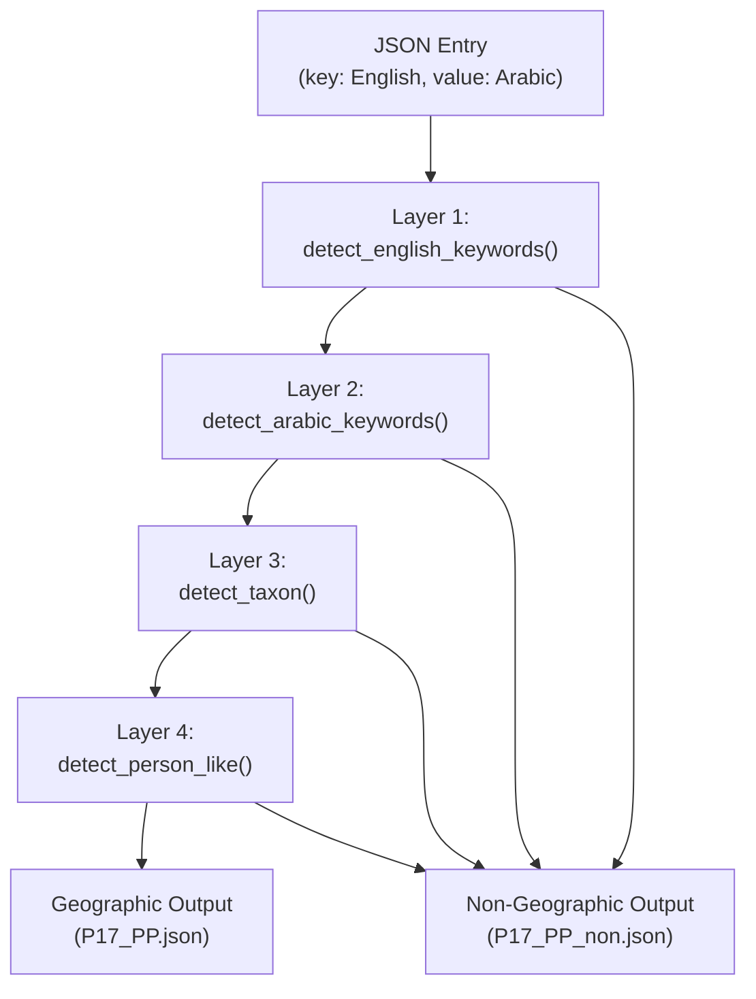
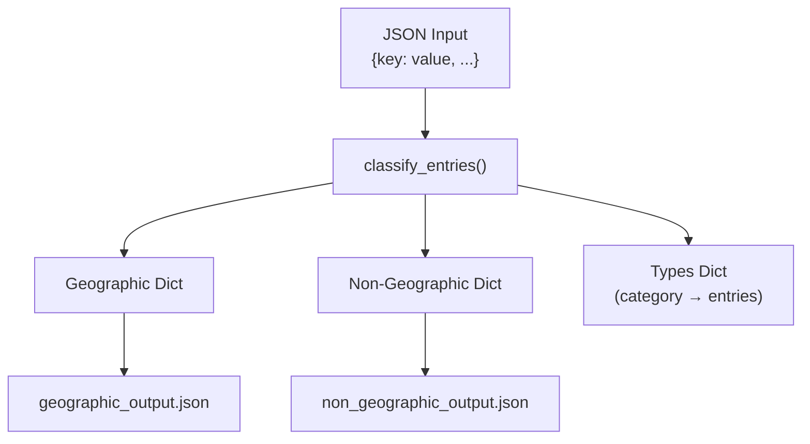

# Helper Scripts

> **Relevant source files**
> * [help_scripts/split_non_geography.py](../help_scripts/split_non_geography.py)

## Purpose and Scope

This page documents utility scripts in the ArWikiCats system that support data processing, classification, and preparation. These scripts are primarily used during the data aggregation phase to clean, categorize, and prepare translation data before it is used by the resolver system.

The main helper script documented here is `split_non_geography.py`, which classifies translation entries into geographic and non-geographic categories to ensure clean geographic data feeds into the resolution pipeline.

For information about how translation data is organized, see [Data Architecture](4.Data-Architecture.md). For the data aggregation pipeline, see [Data Aggregation Pipeline](7.Data-Aggregation-Pipeline.md)

---

## Overview

Helper scripts in the ArWikiCats system serve the following purposes:

| Script | Location | Purpose | Input | Output |
| --- | --- | --- | --- | --- |
| `split_non_geography.py` | [help_scripts/](../help_scripts/) | Classify geographic vs non-geographic labels | JSON translation files | Geographic + Non-geographic JSON files |

These scripts are typically run manually during data preparation and are not part of the automated translation pipeline. They ensure high data quality by removing non-geographic entries from geographic translation datasets.

**Sources:** [help_scripts/split_non_geography.py L1-L424](../help_scripts/split_non_geography.py#L1-L424)

---

## split_non_geography.py

### Purpose

The `split_non_geography.py` script is a unified classifier that separates geographic labels (cities, regions, countries) from non-geographic labels (organizations, buildings, people, sports teams, etc.). This ensures that geographic resolvers only work with actual place names, preventing misclassification errors.

The script implements a multi-layer rule-based classification system that combines:

* Rich keyword taxonomy (education, medical, business, sports, etc.)
* Arabic/English pattern detection
* Biological taxon detection
* Person and role detection

**Sources:** [help_scripts/split_non_geography.py L1-L13](../help_scripts/split_non_geography.py#L1-L13)

### Architecture

The classifier uses a four-layer detection pipeline that processes each label entry sequentially until a classification is made:



**Classification Logic Flow**

The `classify_entries()` function at [help_scripts/split_non_geography.py L343-L376](../help_scripts/split_non_geography.py#L343-L376)

 implements the decision tree. Each layer applies increasingly specific detection rules, with early exit on first match to optimize performance.

**Sources:** [help_scripts/split_non_geography.py L343-L376](../help_scripts/split_non_geography.py#L343-L376)

 [help_scripts/split_non_geography.py L280-L336](../help_scripts/split_non_geography.py#L280-L336)

### Keyword Categories

The script maintains a comprehensive taxonomy of non-geographic keywords organized by domain. The `NON_GEO_KEYWORDS_EN` dictionary at [help_scripts/split_non_geography.py L33-L231](../help_scripts/split_non_geography.py#L33-L231)

 defines 15 major categories:

| Category | Example Keywords | Count | Purpose |
| --- | --- | --- | --- |
| `education` | university, college, school, academy, institute | 7 | Educational institutions |
| `medical` | hospital, clinic, medical center | 3 | Healthcare facilities |
| `business` | company, corporation, ltd, bank, airlines, hotel | 10 | Commercial entities |
| `Infrastructure` | bridge, tunnel, airport, station, highway, park | 18 | Physical infrastructure |
| `religious_cultural_buildings` | church, cathedral, mosque, temple, synagogue | 7 | Religious structures |
| `organizations` | association, organisation, foundation, agency | 9 | Non-profit and governmental organizations |
| `military` | army, navy, air force, battalion, regiment | 6 | Military units and forces |
| `Tv` | film, tv series, television, channel, episode | 8 | Television and film media |
| `culture_media` | museum, library, gallery, novel, book, album | 22 | Cultural and media entities |
| `sports` | club, team, fc, league, tournament, stadium | 14 | Sports organizations and venues |
| `politics_law` | government, ministry, court, election, parliament | 18 | Political and legal entities |
| `media_technology` | software, protocol, video game, algorithm | 7 | Technology and computing |
| `biology_scientific` | virus, bacteria, species, genus, mammal, bird | 13 | Biological and scientific taxonomy |
| `roles_people` | king, queen, president, minister, artist, actor | 29 | Person roles and titles |
| `mythology_religion` | mythology, goddess, god, religion, sect | 7 | Religious and mythological concepts |

**Special Handling**

The `CHECK_AR_ALSO` dictionary at [help_scripts/split_non_geography.py L28-L31](../help_scripts/split_non_geography.py#L28-L31)

 defines keywords that require Arabic validation:

```
CHECK_AR_ALSO = {
    "park": "بارك",
    "bridge": "بريدج",
}
```

When these keywords match, the classifier checks if the Arabic value also contains the Arabic keyword. If not, the entry is treated as non-geographic (e.g., "Central Park" vs "Park Street").

**Sources:** [help_scripts/split_non_geography.py L28-L231](../help_scripts/split_non_geography.py#L28-L231)

### Detection Methods

The classifier implements four specialized detection functions, each targeting a specific type of non-geographic content:

#### detect_english_keywords()

Located at [help_scripts/split_non_geography.py L281-L306](../help_scripts/split_non_geography.py#L281-L306)

 this function performs regex-based keyword matching with word boundary detection.

**Algorithm:**

1. Convert label and value to lowercase
2. For each keyword category in `NON_GEO_KEYWORDS_EN`
3. Build regex pattern: `(?<!\w){keyword}(?!\w)` to match whole words
4. Check both English label and Arabic value
5. If keyword in `CHECK_AR_ALSO`, verify Arabic translation is not present
6. Return `(True, category_name)` on first match

**Example Matches:**

* "Harvard University" → `(True, "education")`
* "Manchester United F.C." → `(True, "sports")`
* "Golden Gate Bridge" → `(True, "Infrastructure")`

#### detect_arabic_keywords()

Located at [help_scripts/split_non_geography.py L309-L314](../help_scripts/split_non_geography.py#L309-L314)

 this function checks for Arabic keywords in the translated value.

**Keywords Checked:** 12 common Arabic non-geographic terms from `NON_GEO_KEYWORDS_AR` at [help_scripts/split_non_geography.py L237-L252](../help_scripts/split_non_geography.py#L237-L252)

:

* جامعة (university), كلية (college), معهد (institute)
* نادي (club), شركة (company), مستشفى (hospital)
* متحف (museum), جمعية (association), فندق (hotel)
* ملعب (stadium), جسر (bridge), قناة (canal)
* محطة (station), مطار (airport)

#### detect_taxon()

Located at [help_scripts/split_non_geography.py L317-L320](../help_scripts/split_non_geography.py#L317-L320)

 this function identifies biological taxonomy names using scientific suffixes.

**Biological Suffixes** from [help_scripts/split_non_geography.py L258-L273](../help_scripts/split_non_geography.py#L258-L273)

:

* Family level: `-aceae`, `-idae`
* Order level: `-ales`, `-formes`
* Class level: `-phyceae`, `-mycetes`
* Phylum level: `-phyta`, `-mycota`
* Other: `-ineae`, `-inae`, `-oidea`, `-morpha`, `-cetes`, `-phycidae`

**Example Matches:**

* "Rosaceae" → True (plant family)
* "Felidae" → True (cat family)
* "Passeriformes" → True (bird order)

#### detect_person_like()

Located at [help_scripts/split_non_geography.py L323-L335](../help_scripts/split_non_geography.py#L323-L335)

 this function identifies entries referring to people or roles.

**Detection Heuristic:** Regex search for royal, political, or honorific titles:

* Royal: king, queen, prince
* Political: president, chancellor, minister
* Honorific: lord, sir

**Pattern:** `(?<!\w){role}(?!\w)` with word boundaries

**Example Matches:**

* "King of France" → True
* "President of the United States" → True
* "Sir Isaac Newton" → True

**Sources:** [help_scripts/split_non_geography.py L281-L335](../help_scripts/split_non_geography.py#L281-L335)

 [help_scripts/split_non_geography.py L237-L273](../help_scripts/split_non_geography.py#L237-L273)

### Classification Process

The `classify_entries()` function at [help_scripts/split_non_geography.py L343-L376](../help_scripts/split_non_geography.py#L343-L376)

 processes all entries in a JSON file:



**Processing Logic:**

1. Initialize empty dictionaries: `geo`, `non_geo`, `typies`
2. For each `(key, value)` pair in input: * Apply Layer 1: `detect_english_keywords(key, value)` * If match: add to `non_geo` and `typies[category_name]` * Apply Layer 2: `detect_arabic_keywords(value)` * If match: add to `non_geo` and `typies["arabic"]` * Apply Layer 3: `detect_taxon(key)` * If match: add to `non_geo` and `typies["taxons"]` * Apply Layer 4: `detect_person_like(key)` * If match: add to `non_geo` and `typies["persons"]` * Default: add to `geo` (geographic)
3. Sort `typies` by count (descending)
4. Print detection statistics
5. Return `(geo, typies)`

**Statistics Output:**

The function prints detection counts for each category:

```
- Detected
    | education: 145
    | sports: 892
    | Infrastructure: 234
    | taxons: 67
    | persons: 423
    ...
```

**Sources:** [help_scripts/split_non_geography.py L343-L376](../help_scripts/split_non_geography.py#L343-L376)

### File Processing

The `filter_file()` function at [help_scripts/split_non_geography.py L379-L392](../help_scripts/split_non_geography.py#L379-L392)

 handles file I/O and output generation:

**Function Signature:**

```python
def filter_file(input_path: Path, geo_out: Path, non_geo_out: Path) -> str
```

**Process:**

1. Load JSON from `input_path` with UTF-8 encoding
2. Call `classify_entries(data)` to split entries
3. Count statistics: `total`, `geographic`, `non-geographic`
4. Write outputs if non-geographic entries exist: * `geo_out`: Geographic entries (sorted by key) * `non_geo_out`: Non-geographic entries (sorted by key)
5. Return statistics string

**Output Format:**
Both output files use JSON with UTF-8 encoding, `ensure_ascii=False`, 4-space indentation, and sorted keys for consistent diffs.

**Sources:** [help_scripts/split_non_geography.py L379-L392](../help_scripts/split_non_geography.py#L379-L392)

### Main Execution

The `main()` function at [help_scripts/split_non_geography.py L395-L420](../help_scripts/split_non_geography.py#L395-L420)

 orchestrates the classification process:

**Target Files:**

The script is configured to process files from the `jsons_dir` directory at [help_scripts/split_non_geography.py L21-L22](../help_scripts/split_non_geography.py#L21-L22)

:

```
base_dir = Path(__file__).parent.parent
jsons_dir = base_dir / "ArWikiCats" / "translations" / "jsons"
```

**Default Processing:**
Currently configured to process: [help_scripts/split_non_geography.py L401-L403](../help_scripts/split_non_geography.py#L401-L403)

* `jsons_dir / "geography/P17_PP.json"`

**Output Structure:**

* Creates `geography_new/` directory parallel to `geography/`
* Outputs: * `geography_new/P17_PP.json` - Geographic entries only * `geography_new/P17_PP_non.json` - Non-geographic entries

**Commented Examples:**

The script includes commented-out examples for processing other files: [help_scripts/split_non_geography.py L397-L400](../help_scripts/split_non_geography.py#L397-L400)

* `P17_2_final_ll.json`
* `cities/cities_full.json`
* `cities/yy2.json`
* `geography/popopo.json`

**Statistics Summary:**

After processing all files, the script prints a summary:

```python
P17_PP.json => Total: 68,981 | Geographic: 65,234 | Non-Geographic: 3,747
Processing complete.
```

**Sources:** [help_scripts/split_non_geography.py L395-L424](../help_scripts/split_non_geography.py#L395-L424)

 [help_scripts/split_non_geography.py L21-L22](../help_scripts/split_non_geography.py#L21-L22)

---

## Usage Examples

### Command Line Execution

Run the script directly from the `help_scripts/` directory:

```
python help_scripts/split_non_geography.py
```

The script automatically processes configured files and prints progress:

```python
Processing file: /path/to/ArWikiCats/translations/jsons/geography/P17_PP.json
 - Detected
    | education: 234
    | sports: 1,892
    | Infrastructure: 456
    | business: 123
    | culture_media: 678
    | roles_people: 892
    | taxons: 89
    | arabic: 145
P17_PP.json => Total: 68,981 | Geographic: 65,234 | Non-Geographic: 3,747
Processing complete.
```

### Classification Examples

**Example 1: Sports Club**

Input entry:

```json
{
    "Manchester United F.C.": "نادي مانشستر يونايتد لكرة القدم"
}
```

Classification:

* Layer 1 detects "F.C." (sports keyword)
* Classified as non-geographic, category: `sports`
* Output to `P17_PP_non.json`

**Example 2: University**

Input entry:

```json
{
    "Harvard University": "جامعة هارفارد"
}
```

Classification:

* Layer 1 detects "University" (education keyword)
* Layer 2 confirms Arabic "جامعة" is present
* Classified as non-geographic, category: `education`
* Output to `P17_PP_non.json`

**Example 3: Biological Family**

Input entry:

```json
{
    "Felidae": "سنوريات"
}
```

Classification:

* Layer 1 and 2 find no matches
* Layer 3 detects "-idae" suffix (taxon)
* Classified as non-geographic, category: `taxons`
* Output to `P17_PP_non.json`

**Example 4: Geographic Location**

Input entry:

```json
{
    "Paris": "باريس"
}
```

Classification:

* No matches in any layer
* Classified as geographic
* Output to `P17_PP.json`

**Example 5: Bridge (Special Handling)**

Input entry:

```json
{
    "Brooklyn Bridge": "جسر بروكلين"
}
```

Classification:

* Layer 1 detects "bridge" keyword
* Checks `CHECK_AR_ALSO` for Arabic "بريدج"
* Arabic value contains "جسر" (not "بريدج")
* Classified as non-geographic, category: `Infrastructure`
* Output to `P17_PP_non.json`

**Sources:** [help_scripts/split_non_geography.py L281-L335](../help_scripts/split_non_geography.py#L281-L335)

 [help_scripts/split_non_geography.py L343-L376](../help_scripts/split_non_geography.py#L343-L376)

---

## Configuration and Customization

### Adding New Keyword Categories

To add a new non-geographic category, update `NON_GEO_KEYWORDS_EN` at [help_scripts/split_non_geography.py L33-L231](../help_scripts/split_non_geography.py#L33-L231)

:

```css
NON_GEO_KEYWORDS_EN = {
    # Existing categories...
    "new_category": ["keyword1", "keyword2", "keyword3"],
}
```

### Adding Arabic Keywords

Update `NON_GEO_KEYWORDS_AR` at [help_scripts/split_non_geography.py L237-L252](../help_scripts/split_non_geography.py#L237-L252)

 to add Arabic-specific detection:

```markdown
NON_GEO_KEYWORDS_AR = [
    # Existing keywords...
    "new_arabic_keyword",
]
```

### Adding Special Handling

For keywords that require Arabic confirmation (like "bridge"/"بريدج"), update `CHECK_AR_ALSO` at [help_scripts/split_non_geography.py L28-L31](../help_scripts/split_non_geography.py#L28-L31)

:

```
CHECK_AR_ALSO = {
    "park": "بارك",
    "bridge": "بريدج",
    "new_keyword": "arabic_equivalent",
}
```

### Processing Additional Files

Modify the `files` list in `main()` at [help_scripts/split_non_geography.py L396-L403](../help_scripts/split_non_geography.py#L396-L403)

:

```markdown
files = [
    jsons_dir / "geography/P17_PP.json",
    jsons_dir / "cities/cities_full.json",  # Uncomment or add new paths
]
```

**Sources:** [help_scripts/split_non_geography.py L28-L231](../help_scripts/split_non_geography.py#L28-L231)

 [help_scripts/split_non_geography.py L237-L252](../help_scripts/split_non_geography.py#L237-L252)

 [help_scripts/split_non_geography.py L396-L403](../help_scripts/split_non_geography.py#L396-L403)

---

## Performance and Statistics

### Computational Complexity

The classifier operates with the following complexity:

| Operation | Complexity | Notes |
| --- | --- | --- |
| Keyword matching | O(k × m) | k = keywords, m = avg keyword length |
| Regex compilation | O(1) | Patterns compiled at runtime |
| Dictionary insertion | O(1) | Amortized |
| Overall per entry | O(k × m) | Linear in keyword count |
| Total processing | O(n × k × m) | n = total entries |

For typical datasets:

* n = 68,981 entries (P17_PP.json)
* k ≈ 150 total keywords across all categories
* m ≈ 10 characters per keyword
* Processing time: ~30-60 seconds on modern hardware

### Memory Usage

The script maintains three in-memory dictionaries:

| Dictionary | Purpose | Typical Size |
| --- | --- | --- |
| `geo` | Geographic entries | ~65,000 entries × 100 bytes ≈ 6.5 MB |
| `non_geo` | Non-geographic entries | ~3,700 entries × 100 bytes ≈ 370 KB |
| `typies` | Category breakdown | ~15 categories × 200 entries ≈ 50 KB |

**Total Memory:** ~7 MB for typical processing

### Processing Statistics

Typical output for P17_PP.json:

```yaml
Total: 68,981 | Geographic: 65,234 (94.6%) | Non-Geographic: 3,747 (5.4%)

Category Breakdown:
    | sports: 892 (1.3%)
    | education: 234 (0.3%)
    | roles_people: 892 (1.3%)
    | Infrastructure: 456 (0.7%)
    | culture_media: 678 (1.0%)
    | business: 123 (0.2%)
    | taxons: 89 (0.1%)
    | arabic: 145 (0.2%)
    | others: 238 (0.3%)
```

**Sources:** [help_scripts/split_non_geography.py L343-L376](../help_scripts/split_non_geography.py#L343-L376)

 [help_scripts/split_non_geography.py L392](../help_scripts/split_non_geography.py#L392-L392)

---

## Quality Assurance

### Detection Accuracy

The multi-layer classification system achieves high accuracy through:

1. **Keyword Coverage:** 150+ English keywords across 15 categories
2. **Arabic Validation:** 12 Arabic keywords for cross-language verification
3. **Scientific Taxonomy:** 13 biological suffix patterns
4. **Role Detection:** 8 person/title patterns

### False Positive Prevention

The system prevents false positives through:

1. **Word Boundary Matching:** Regex pattern `(?<!\w){keyword}(?!\w)` prevents substring matches * "Manchester" does not match "man" keyword * "Parking" does not match "park" keyword
2. **Arabic Cross-Validation:** `CHECK_AR_ALSO` mechanism * "Central Park" with "حديقة" (park/garden) → Geographic * "Technology Park" with "بارك" (transliterated) → Non-geographic
3. **Context-Aware Detection:** Person roles require specific title words * "Kingston" does not match despite containing "king" * "King Edward VII" correctly matches

### Manual Review

After classification, output files should be spot-checked:

1. Review `P17_PP_non.json` for incorrectly classified geographic locations
2. Review `P17_PP.json` for missed non-geographic entries
3. Add missed keywords to appropriate category lists
4. Re-run classification with updated keywords

**Sources:** [help_scripts/split_non_geography.py L281-L335](../help_scripts/split_non_geography.py#L281-L335)

 [help_scripts/split_non_geography.py L28-L31](../help_scripts/split_non_geography.py#L28-L31)

---

## Integration with Data Pipeline

### Upstream: JSON Data Sources

The script processes raw JSON files from the data aggregation pipeline:

**Primary Sources:**

* [ArWikiCats/translations/jsons/geography/P17_PP.json](../ArWikiCats/translations/jsons/geography/P17_PP.json)  - Country and region data
* [ArWikiCats/translations/jsons/geography/P17_2_final_ll.json](../ArWikiCats/translations/jsons/geography/P17_2_final_ll.json)  - Extended geographic data
* [ArWikiCats/translations/jsons/geography/popopo.json](../ArWikiCats/translations/jsons/geography/popopo.json)  - Additional place names
* [ArWikiCats/translations/jsons/cities/](../ArWikiCats/translations/jsons/cities/)  - City-specific translations

For more on data sources, see [Data Architecture](4.Data-Architecture.md) and [Geographic Data](8.Geographic-Data.md)

### Downstream: Geographic Resolvers

Cleaned geographic data feeds into the resolver system:

**Resolver Dependencies:**

* [Country Name Resolvers](17.Country-Name-Resolvers.md) - Uses cleaned P17_PP.json for country translations
* [Geographic Data](8.Geographic-Data.md) - Builds `COUNTRY_LABEL_OVERRIDES` and city indexes

The classification ensures that resolvers only process true geographic locations, preventing misclassification errors like:

* ❌ "Manchester United" resolving as "Manchester" city
* ❌ "Harvard University" resolving as "Harvard" location
* ❌ "Golden Gate Bridge" resolving as "Golden Gate" location

### Parallel: Other Helper Scripts

The script is part of a broader data preparation toolkit:

* Complementary to data builders in [ArWikiCats/translations/](../ArWikiCats/translations/)  modules
* Used before data aggregation (see [Data Aggregation Pipeline](7.Data-Aggregation-Pipeline.md))
* Supports data quality validation

**Sources:** [help_scripts/split_non_geography.py L21-L22](../help_scripts/split_non_geography.py#L21-L22)

 [help_scripts/split_non_geography.py L396-L403](../help_scripts/split_non_geography.py#L396-L403)

---

## Summary

The Arabic grammar correction system ensures grammatically correct category labels through three coordinated functions:

1. **`separator_lists_fixing()`** - Adds location/time preposition "في"
2. **`add_in_tab()`** - Adds origin preposition "من" and handles complex cases
3. **`fixlabel()`** - Performs final normalization and duplicate removal

The system is thoroughly tested with 500+ test cases and handles edge cases including duplicate prevention, exception categories, and spacing normalization. It operates as the final processing stage in the translation pipeline with O(1) time complexity and minimal memory overhead.
