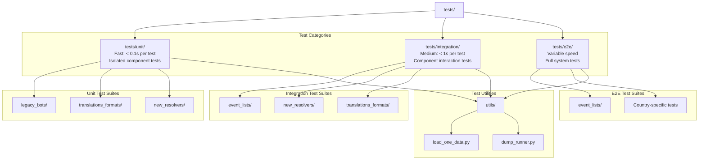
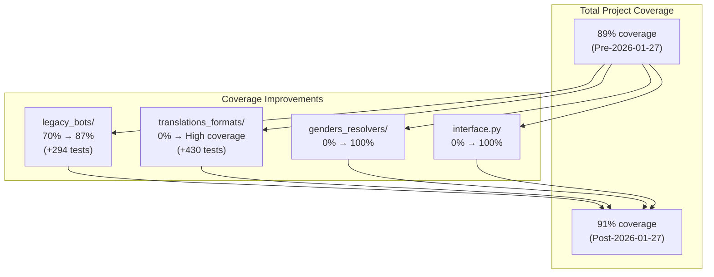
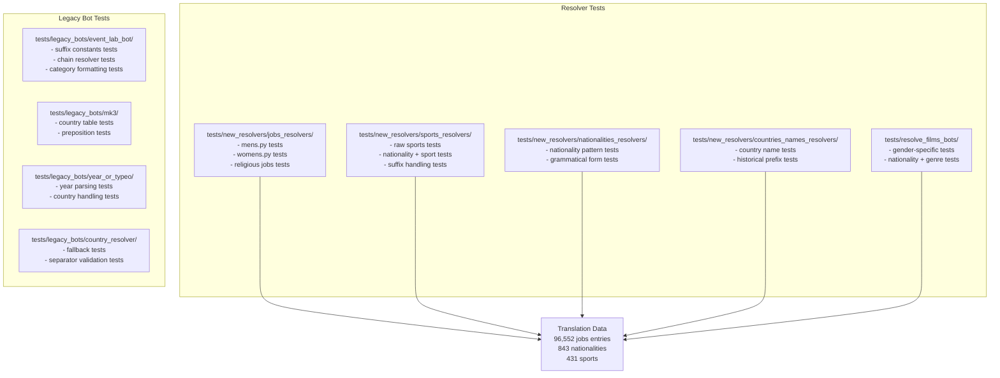
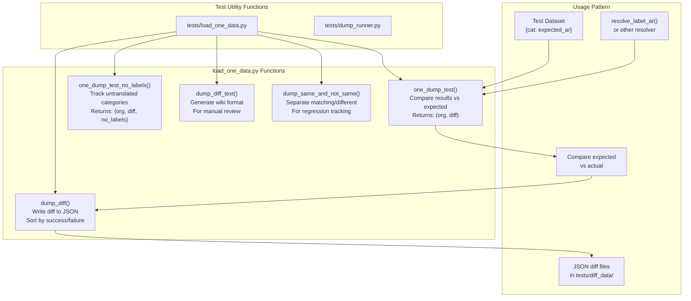
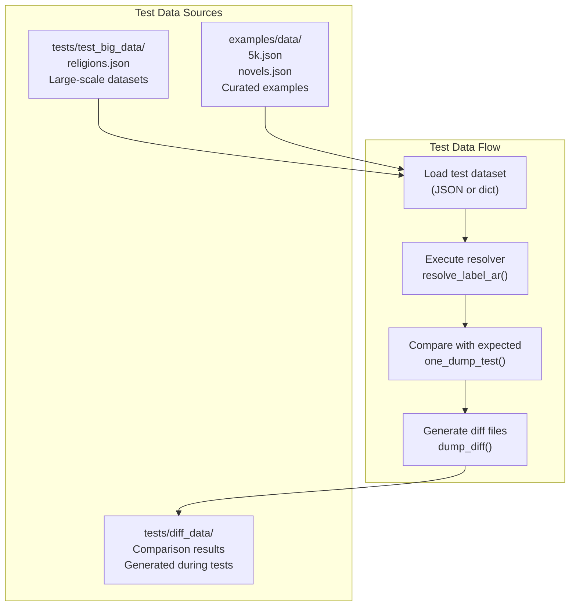
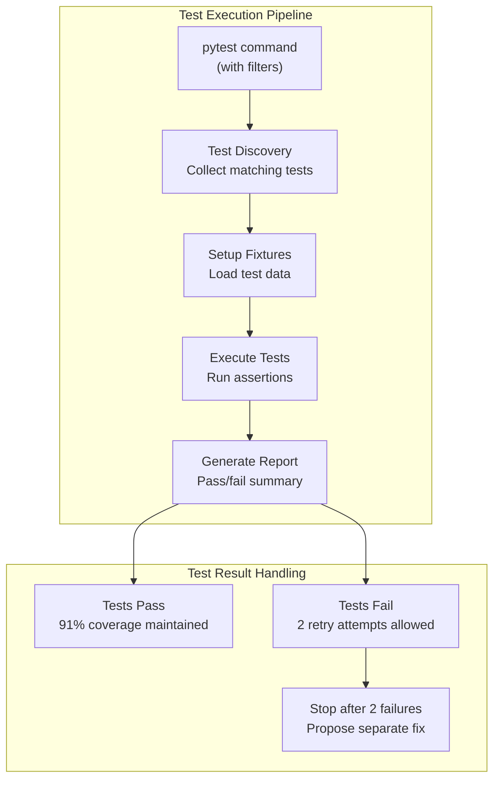

# Testing and Validation

> **Relevant source files**
> * [.github/copilot-instructions.md](https://github.com/ArWikiCats/ArWikiCats/blob/4095f04e/.github/copilot-instructions.md)
> * [.github/workflows/python-publish.yml](https://github.com/ArWikiCats/ArWikiCats/blob/4095f04e/.github/workflows/python-publish.yml)
> * [ArWikiCats/config.py](https://github.com/ArWikiCats/ArWikiCats/blob/4095f04e/ArWikiCats/config.py)
> * [ArWikiCats/jsons/geography/P17_PP.json](https://github.com/ArWikiCats/ArWikiCats/blob/4095f04e/ArWikiCats/jsons/geography/P17_PP.json)
> * [ArWikiCats/jsons/geography/popopo.json](https://github.com/ArWikiCats/ArWikiCats/blob/4095f04e/ArWikiCats/jsons/geography/popopo.json)
> * [ArWikiCats/jsons/people/peoples.json](https://github.com/ArWikiCats/ArWikiCats/blob/4095f04e/ArWikiCats/jsons/people/peoples.json)
> * [CLAUDE.md](https://github.com/ArWikiCats/ArWikiCats/blob/4095f04e/CLAUDE.md)
> * [README.md](https://github.com/ArWikiCats/ArWikiCats/blob/4095f04e/README.md)
> * [changelog.md](https://github.com/ArWikiCats/ArWikiCats/blob/4095f04e/changelog.md)
> * [tests/load_one_data.py](https://github.com/ArWikiCats/ArWikiCats/blob/4095f04e/tests/load_one_data.py)
> * [tests_require_fixes/test_papua_new_guinean.py](https://github.com/ArWikiCats/ArWikiCats/blob/4095f04e/tests_require_fixes/test_papua_new_guinean.py)
> * [tests_require_fixes/test_skip_data_all.py](https://github.com/ArWikiCats/ArWikiCats/blob/4095f04e/tests_require_fixes/test_skip_data_all.py)
> * [tests_require_fixes/text_to_fix.py](https://github.com/ArWikiCats/ArWikiCats/blob/4095f04e/tests_require_fixes/text_to_fix.py)

## Purpose and Scope

This page documents the testing and validation system for ArWikiCats, which includes 28,500+ automated tests achieving 91% code coverage. The testing infrastructure validates translation accuracy, resolver logic, pattern matching, and system integration across the entire codebase.

For information about the resolver system being tested, see [Resolver System](14.Resolver-System.md). For details on the translation data being validated, see [Translation Data](6.Translation-Data.md).

---

## Test Organization Structure

The ArWikiCats test suite uses a three-tier organization based on test speed and scope. This structure allows developers to run fast unit tests during development while maintaining comprehensive integration and end-to-end testing for validation.



**Sources:** [README.md L425-L468](https://github.com/ArWikiCats/ArWikiCats/blob/4095f04e/README.md#L425-L468)

 [CLAUDE.md L16-L48](https://github.com/ArWikiCats/ArWikiCats/blob/4095f04e/CLAUDE.md#L16-L48)

 [changelog.md L110-L127](https://github.com/ArWikiCats/ArWikiCats/blob/4095f04e/changelog.md#L110-L127)

---

## Test Categories

### Unit Tests

Unit tests focus on isolated function and class behavior, executing in under 0.1 seconds per test. These tests validate individual components without external dependencies.

| Characteristic | Details |
| --- | --- |
| **Location** | `tests/unit/` |
| **Marker** | `@pytest.mark.unit` |
| **Speed** | < 0.1s per test |
| **Isolation** | High - no external dependencies |
| **Coverage Focus** | Individual functions, classes, methods |
| **Run Command** | `pytest tests/unit/` or `pytest -m unit` |

**Key unit test modules:**

* `tests/unit/legacy_bots/` - Tests for legacy resolver pipeline
* `tests/unit/translations_formats/` - Tests for formatting engine
* `tests/unit/new_resolvers/` - Tests for specialized resolvers

**Sources:** [CLAUDE.md L19-L24](https://github.com/ArWikiCats/ArWikiCats/blob/4095f04e/CLAUDE.md#L19-L24)

 [README.md L446-L452](https://github.com/ArWikiCats/ArWikiCats/blob/4095f04e/README.md#L446-L452)

 [changelog.md L1-L79](https://github.com/ArWikiCats/ArWikiCats/blob/4095f04e/changelog.md#L1-L79)

### Integration Tests

Integration tests validate component interactions and data flow, executing in under 1 second per test. These tests ensure resolvers work correctly with translation data and formatters.

| Characteristic | Details |
| --- | --- |
| **Location** | `tests/integration/` |
| **Marker** | `@pytest.mark.integration` |
| **Speed** | < 1s per test |
| **Isolation** | Medium - tests component interactions |
| **Coverage Focus** | Data flow, resolver chains, formatting |
| **Run Command** | `pytest tests/integration/` or `pytest -m integration` |

**Key integration test modules:**

* `tests/integration/event_lists/` - Country-specific category sets
* `tests/integration/new_resolvers/` - Resolver chain interactions
* `tests/integration/translations_formats/` - Format data integration

**Sources:** [CLAUDE.md L19-L24](https://github.com/ArWikiCats/ArWikiCats/blob/4095f04e/CLAUDE.md#L19-L24)

 [README.md L454-L460](https://github.com/ArWikiCats/ArWikiCats/blob/4095f04e/README.md#L454-L460)

 [changelog.md L80-L109](https://github.com/ArWikiCats/ArWikiCats/blob/4095f04e/changelog.md#L80-L109)

### End-to-End Tests

End-to-end tests validate complete translation workflows from input to final output. These tests may execute slowly but provide comprehensive system validation.

| Characteristic | Details |
| --- | --- |
| **Location** | `tests/e2e/` |
| **Marker** | `--rune2e` flag |
| **Speed** | Variable - may be slow |
| **Isolation** | Low - full system integration |
| **Coverage Focus** | Complete workflows, real-world scenarios |
| **Run Command** | `pytest tests/e2e/` or `pytest --rune2e` |

**Key end-to-end test modules:**

* `tests/e2e/event_lists/` - Complete country category translations
* Country-specific validation suites (Papua New Guinea, Russia, South Africa, etc.)

**Sources:** [CLAUDE.md L19-L24](https://github.com/ArWikiCats/ArWikiCats/blob/4095f04e/CLAUDE.md#L19-L24)

 [README.md L462-L468](https://github.com/ArWikiCats/ArWikiCats/blob/4095f04e/README.md#L462-L468)

 [changelog.md L110-L127](https://github.com/ArWikiCats/ArWikiCats/blob/4095f04e/changelog.md#L110-L127)

---

## Coverage Metrics and Evolution

The ArWikiCats test suite has achieved 91% overall code coverage through systematic testing expansion. Recent efforts have focused on previously untested modules.



**Module-specific coverage achievements:**

| Module | Before | After | Tests Added |
| --- | --- | --- | --- |
| `event_lab_bot.py` | 34% | 84% | Comprehensive |
| `mk3.py` | 19% | 83% | Comprehensive |
| `year_or_typeo.py` | 16% | 66% | Comprehensive |
| `country_resolver.py` | 71% | 92% | Comprehensive |
| `common_resolver_chain.py` | 65% | 93% | Comprehensive |
| `interface.py` | 0% | 100% | Complete |
| `joint_class.py` | 70% | 100% | Complete |
| `check_bot.py` | 65% | 100% | Complete |
| `genders_resolvers/` | 0% | 100% | 88 tests |
| `relegin_jobs_nats_jobs.py` | 0% | 100% | Complete |

**Sources:** [changelog.md L1-L79](https://github.com/ArWikiCats/ArWikiCats/blob/4095f04e/changelog.md#L1-L79)

 [changelog.md L80-L109](https://github.com/ArWikiCats/ArWikiCats/blob/4095f04e/changelog.md#L80-L109)

 [README.md L6](https://github.com/ArWikiCats/ArWikiCats/blob/4095f04e/README.md#L6-L6)

---

## Domain-Specific Test Suites

### Resolver Test Suites

Each resolver type has dedicated test suites validating pattern matching, data lookup, and translation accuracy.



**Sources:** [changelog.md L1-L79](https://github.com/ArWikiCats/ArWikiCats/blob/4095f04e/changelog.md#L1-L79)

 [README.md L470-L482](https://github.com/ArWikiCats/ArWikiCats/blob/4095f04e/README.md#L470-L482)

### Format Engine Test Suites

The formatting engine has comprehensive unit and integration tests validating template matching and placeholder replacement.

**Unit tests (`tests/unit/translations_formats/`):**

* `test_data_with_time.py` - Tests for `format_year_country_data` and `format_year_country_data_v2`
* `test_data_new_model.py` - Tests for `format_films_country_data`
* `test_time_patterns_formats.py` - Tests for `LabsYearsFormat` and `MatchTimes` classes
* `test_model_multi_data_base.py` - Tests for `NormalizeResult` and `MultiDataFormatterBaseHelpers`
* `test_model_multi_data.py` - Tests for all `MultiDataFormatter` variants
* `test_model_data_form.py` - Tests for `FormatDataFrom`

**Integration tests (`tests/integration/translations_formats/`):**

* `test_model_data_inte.py` - Integration tests for `FormatData`
* `test_model_data_time_inte.py` - Integration tests for `YearFormatData`
* `test_model_data_v2_inte.py` - Integration tests for `FormatDataV2`
* `test_model_multi_data_double_inte.py` - Integration tests for `MultiDataFormatterDataDouble`

**Sources:** [changelog.md L80-L109](https://github.com/ArWikiCats/ArWikiCats/blob/4095f04e/changelog.md#L80-L109)

### Event Lists Test Suites

Event lists are country-specific test suites that validate complete category translation for specific countries.

| Test Suite | Categories Tested | Focus Area |
| --- | --- | --- |
| `test_south_african.py` | South African categories | National Assembly translations |
| `test_papua_new_guinean.py` | Papua New Guinea categories | Sports, cricket, nationality patterns |
| `test_russian.py` | Russian categories | Geographic, historical entities |

**Example from South African tests:**

```css
# Expected translations after improvements
{
    "Women members of the National Assembly of South Africa": 
        "عضوات الجمعية الوطنية الجنوب الإفريقية",
    "Speakers of the National Assembly of South Africa": 
        "رؤساء الجمعية الوطنية الجنوب الإفريقية",
    "Members of the National Assembly of South Africa": 
        "أعضاء الجمعية الوطنية الجنوب الإفريقية"
}
```

**Sources:** [changelog.md L154-L169](https://github.com/ArWikiCats/ArWikiCats/blob/4095f04e/changelog.md#L154-L169)

 [tests_require_fixes/test_papua_new_guinean.py L1-L241](https://github.com/ArWikiCats/ArWikiCats/blob/4095f04e/tests_require_fixes/test_papua_new_guinean.py#L1-L241)

---

## Test Utilities and Helpers

### Core Test Utilities

The test suite includes specialized utilities for comparing expected vs. actual translations and generating diff reports.



**Sources:** [tests/load_one_data.py L1-L119](https://github.com/ArWikiCats/ArWikiCats/blob/4095f04e/tests/load_one_data.py#L1-L119)

### Test Utility Functions

#### one_dump_test(dataset, callback, do_strip=False)

Compares resolver output against expected translations for a dataset.

**Parameters:**

* `dataset`: Dictionary mapping English categories to expected Arabic translations
* `callback`: Translation function (e.g., `resolve_label_ar`)
* `do_strip`: Whether to strip whitespace before comparison

**Returns:**

* `org`: Dictionary of categories where actual ≠ expected (original expected values)
* `diff`: Dictionary of categories where actual ≠ expected (actual results)

**Source:** [tests/load_one_data.py L63-L79](https://github.com/ArWikiCats/ArWikiCats/blob/4095f04e/tests/load_one_data.py#L63-L79)

#### one_dump_test_no_labels(dataset, callback, do_strip=False)

Extended version that tracks categories with no translation found.

**Returns:**

* `org`: Dictionary of mismatches (original expected)
* `diff`: Dictionary of mismatches (actual results)
* `no_labels`: List of categories with no translation

**Source:** [tests/load_one_data.py L82-L100](https://github.com/ArWikiCats/ArWikiCats/blob/4095f04e/tests/load_one_data.py#L82-L100)

#### dump_diff(data, file_name, _sort=True)

Writes diff data to JSON file in `tests/diff_data/`.

**Sorting behavior:**

* Successful translations (non-empty) appear first
* Failed translations (empty) appear last

**Source:** [tests/load_one_data.py L19-L29](https://github.com/ArWikiCats/ArWikiCats/blob/4095f04e/tests/load_one_data.py#L19-L29)

#### dump_diff_text(expected, diff_result, file_name)

Generates wiki-formatted text for manual review and copy-paste to Wikipedia.

**Output format:**

```css
# {{وب:طنت/سطر|original|new|سبب النقل=تصحيح ArWikiCats}}
```

**Source:** [tests/load_one_data.py L32-L60](https://github.com/ArWikiCats/ArWikiCats/blob/4095f04e/tests/load_one_data.py#L32-L60)

#### dump_same_and_not_same(data, diff_result, name, just_dump=False)

Separates matching and non-matching translations for regression tracking.

**Outputs:**

* `{name}_same.json` - Categories with matching translations
* `{name}_not_same.json` - Categories with different translations

**Source:** [tests/load_one_data.py L103-L118](https://github.com/ArWikiCats/ArWikiCats/blob/4095f04e/tests/load_one_data.py#L103-L118)

---

## Example Datasets and Test Data

### Built-in Example Datasets

The `examples/data/` directory contains curated datasets for testing and demonstration.

| Dataset | Size | Purpose |
| --- | --- | --- |
| `5k.json` | ~5,000 categories | Performance testing |
| `novels.json` | Novel-related categories | Literary categories |
| `television series` | TV-related categories | Media categories |

**Usage example:**

```javascript
# examples/5k.py demonstrates batch processing
from ArWikiCats import batch_resolve_labels

categories = load_from_json("examples/data/5k.json")
result = batch_resolve_labels(categories)
print(f"Translated: {len(result.labels)} categories")
```

**Sources:** [changelog.md L319](https://github.com/ArWikiCats/ArWikiCats/blob/4095f04e/changelog.md#L319-L319)

 [README.md L232-L237](https://github.com/ArWikiCats/ArWikiCats/blob/4095f04e/README.md#L232-L237)

### Test Data Organization



**Sources:** [tests/load_one_data.py L1-L119](https://github.com/ArWikiCats/ArWikiCats/blob/4095f04e/tests/load_one_data.py#L1-L119)

---

## Running Tests

### Basic Test Execution

```markdown
# Run all tests
pytest

# Run all tests with verbose output
pytest -v

# Run with short traceback for readability
pytest -v --tb=short
```

**Sources:** [README.md L436-L440](https://github.com/ArWikiCats/ArWikiCats/blob/4095f04e/README.md#L436-L440)

 [CLAUDE.md L26-L48](https://github.com/ArWikiCats/ArWikiCats/blob/4095f04e/CLAUDE.md#L26-L48)

### Category-Based Execution

```markdown
# Run only unit tests
pytest tests/unit/
pytest -m unit

# Run only integration tests
pytest tests/integration/
pytest -m integration

# Run only end-to-end tests
pytest tests/e2e/
pytest --rune2e
```

**Sources:** [README.md L446-L468](https://github.com/ArWikiCats/ArWikiCats/blob/4095f04e/README.md#L446-L468)

 [CLAUDE.md L30-L37](https://github.com/ArWikiCats/ArWikiCats/blob/4095f04e/CLAUDE.md#L30-L37)

### Targeted Test Execution

```markdown
# Run tests matching a keyword
pytest -k "jobs"
pytest -k "sports"

# Run tests in a specific directory
pytest tests/legacy_bots/
pytest tests/new_resolvers/jobs_resolvers/

# Run slow tests only
pytest -m slow
```

**Sources:** [README.md L483-L488](https://github.com/ArWikiCats/ArWikiCats/blob/4095f04e/README.md#L483-L488)

 [CLAUDE.md L39-L44](https://github.com/ArWikiCats/ArWikiCats/blob/4095f04e/CLAUDE.md#L39-L44)

### Test Execution Flow



**Sources:** [.github/copilot-instructions.md L10-L21](https://github.com/ArWikiCats/ArWikiCats/blob/4095f04e/.github/copilot-instructions.md#L10-L21)

 [CLAUDE.md L176-L182](https://github.com/ArWikiCats/ArWikiCats/blob/4095f04e/CLAUDE.md#L176-L182)

---

## Writing New Tests

### Test Organization Guidelines

When adding new tests, follow the three-tier organization:

1. **Unit tests** (`tests/unit/`) - Test individual functions/classes * Fast execution (< 0.1s) * No external dependencies * Mock translation data if needed
2. **Integration tests** (`tests/integration/`) - Test component interactions * Medium speed (< 1s) * Use real translation data * Test resolver chains
3. **E2E tests** (`tests/e2e/`) - Test complete workflows * Variable speed * Full system integration * Real-world category sets

**Sources:** [CLAUDE.md L19-L24](https://github.com/ArWikiCats/ArWikiCats/blob/4095f04e/CLAUDE.md#L19-L24)

 [README.md L442-L468](https://github.com/ArWikiCats/ArWikiCats/blob/4095f04e/README.md#L442-L468)

### Test Data Pattern

```javascript
import pytest
from ArWikiCats import resolve_label_ar

# Unit test example
@pytest.mark.unit
def test_specific_function():
    result = some_function("input")
    assert result == "expected_output"

# Integration test example with parametrize
@pytest.mark.integration
@pytest.mark.parametrize("input_cat,expected", [
    ("British footballers", "لاعبو كرة قدم بريطانيون"),
    ("American basketball players", "لاعبو كرة سلة أمريكيون"),
])
def test_nationality_sport_pattern(input_cat, expected):
    result = resolve_label_ar(input_cat)
    assert result == expected
```

### Using Test Utilities

```javascript
from tests.load_one_data import one_dump_test, dump_diff

def test_batch_categories():
    dataset = {
        "British footballers": "لاعبو كرة قدم بريطانيون",
        "French painters": "رسامون فرنسيون",
        # ... more test cases
    }
    
    # Compare actual vs expected
    org, diff = one_dump_test(dataset, resolve_label_ar)
    
    # Optional: dump differences for review
    if diff:
        dump_diff(diff, "test_batch_results")
    
    # Assert no differences
    assert len(diff) == 0, f"Found {len(diff)} mismatches"
```

**Sources:** [tests/load_one_data.py L63-L79](https://github.com/ArWikiCats/ArWikiCats/blob/4095f04e/tests/load_one_data.py#L63-L79)

---

## Test Coverage Validation

### Coverage Report Generation

```markdown
# Run tests with coverage report
pytest --cov=ArWikiCats --cov-report=html

# View coverage report
open htmlcov/index.html
```

### Critical Coverage Areas

The following modules require high coverage due to their critical role:

| Module | Required Coverage | Current Coverage |
| --- | --- | --- |
| `main_processers/main_resolve.py` | > 90% | High |
| `new_resolvers/__init__.py` | > 90% | High |
| `legacy_bots/common_resolver_chain.py` | > 90% | 93% |
| `translations_formats/DataModel/` | > 85% | High |
| `event_processing.py` | > 90% | High |

**Sources:** [changelog.md L66-L77](https://github.com/ArWikiCats/ArWikiCats/blob/4095f04e/changelog.md#L66-L77)

 [README.md L6](https://github.com/ArWikiCats/ArWikiCats/blob/4095f04e/README.md#L6-L6)

---

## Test Performance Metrics

### Execution Speed

| Test Category | Count | Average Speed | Total Time |
| --- | --- | --- | --- |
| Unit | ~15,000+ | < 0.1s | ~3-5 seconds |
| Integration | ~10,000+ | < 1s | ~10-15 seconds |
| E2E | ~3,500+ | Variable | ~5-10 seconds |
| **Total** | **28,500+** | - | **~23 seconds** |

**Sources:** [README.md L501](https://github.com/ArWikiCats/ArWikiCats/blob/4095f04e/README.md#L501-L501)

 [CLAUDE.md L222](https://github.com/ArWikiCats/ArWikiCats/blob/4095f04e/CLAUDE.md#L222-L222)

### Performance Optimization

Tests are optimized through:

* `@lru_cache` decorators on data loading functions
* Lazy loading of translation dictionaries
* Pytest fixtures for shared test data
* Parallel test execution support (when available)

**Sources:** [changelog.md L286-L288](https://github.com/ArWikiCats/ArWikiCats/blob/4095f04e/changelog.md#L286-L288)

 [README.md L496-L509](https://github.com/ArWikiCats/ArWikiCats/blob/4095f04e/README.md#L496-L509)

---

## Continuous Integration

### Test Execution in CI

While CI configuration is not visible in the provided files, the test suite is designed for automated execution:

```markdown
# Full test suite (as run in CI)
pytest

# Fast feedback loop (unit tests only)
pytest -m unit

# Comprehensive validation (all categories)
pytest --rune2e
```

### Quality Gates

The project enforces quality through:

* Minimum 91% code coverage
* All tests must pass before merge
* No regressions in translation accuracy
* New features require corresponding tests

**Sources:** [.github/copilot-instructions.md L10-L21](https://github.com/ArWikiCats/ArWikiCats/blob/4095f04e/.github/copilot-instructions.md#L10-L21)

 [changelog.md L77](https://github.com/ArWikiCats/ArWikiCats/blob/4095f04e/changelog.md#L77-L77)

---

## Common Testing Patterns

### Pattern 1: Parametrized Translation Tests

```python
@pytest.mark.parametrize("english,arabic", [
    ("2015 in Yemen", "2015 في اليمن"),
    ("British footballers", "لاعبو كرة قدم بريطانيون"),
    ("American basketball coaches", "مدربو كرة سلة أمريكيون"),
])
def test_translations(english, arabic):
    result = resolve_label_ar(english)
    assert result == arabic
```

### Pattern 2: No-Label Detection Tests

```python
def test_categories_without_translations():
    categories = ["Very Obscure Category", "Another Untranslatable"]
    org, diff, no_labels = one_dump_test_no_labels(
        {cat: "" for cat in categories},
        resolve_label_ar
    )
    # Verify these return empty (expected for new/rare categories)
    assert len(no_labels) > 0
```

### Pattern 3: Regression Prevention Tests

```python
def test_south_african_national_assembly():
    """Regression test for corrected translations."""
    test_cases = {
        "Women members of the National Assembly of South Africa": 
            "عضوات الجمعية الوطنية الجنوب الإفريقية",
        "Speakers of the National Assembly of South Africa": 
            "رؤساء الجمعية الوطنية الجنوب الإفريقية",
    }
    org, diff = one_dump_test(test_cases, resolve_arabic_category_label)
    assert len(diff) == 0  # No regressions
```

**Sources:** [changelog.md L154-L169](https://github.com/ArWikiCats/ArWikiCats/blob/4095f04e/changelog.md#L154-L169)

 [tests/load_one_data.py L82-L100](https://github.com/ArWikiCats/ArWikiCats/blob/4095f04e/tests/load_one_data.py#L82-L100)