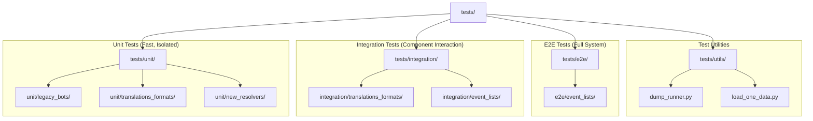
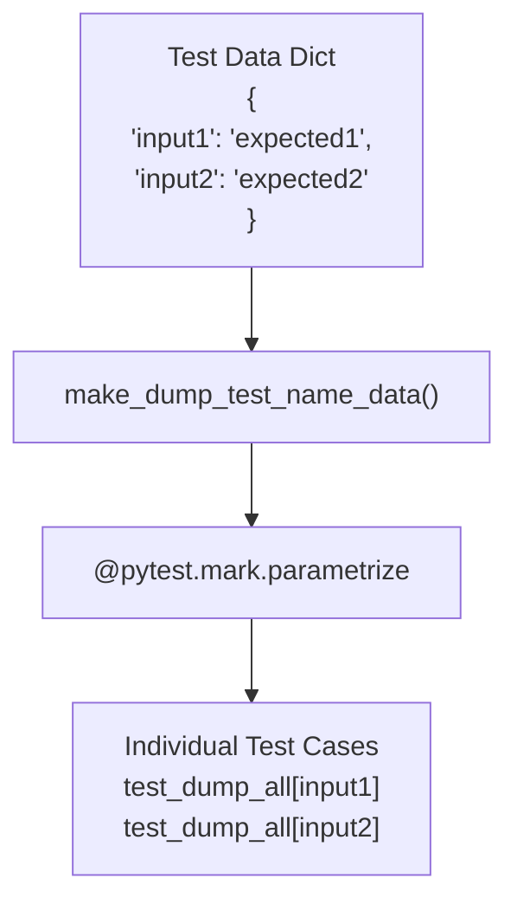
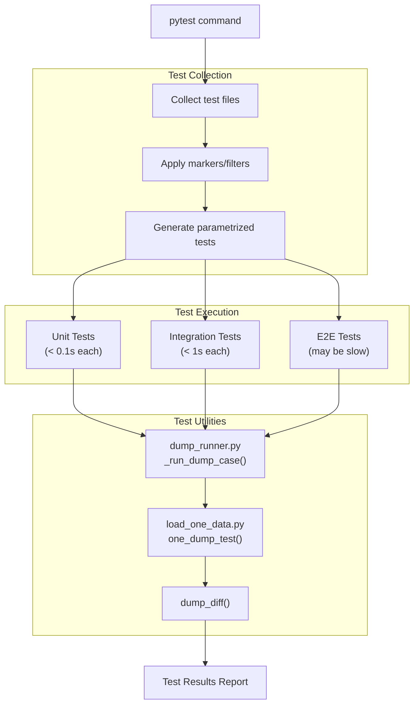
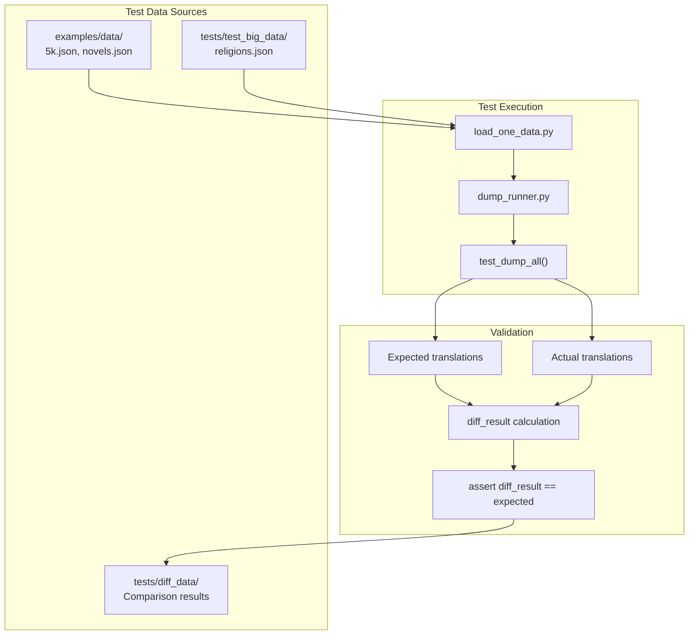

# Test Organization

> **Relevant source files**
> * [.github/copilot-instructions.md](https://github.com/ArWikiCats/ArWikiCats/blob/4095f04e/.github/copilot-instructions.md)
> * [.github/workflows/python-publish.yml](https://github.com/ArWikiCats/ArWikiCats/blob/4095f04e/.github/workflows/python-publish.yml)
> * [ArWikiCats/config.py](https://github.com/ArWikiCats/ArWikiCats/blob/4095f04e/ArWikiCats/config.py)
> * [CLAUDE.md](https://github.com/ArWikiCats/ArWikiCats/blob/4095f04e/CLAUDE.md)
> * [README.md](https://github.com/ArWikiCats/ArWikiCats/blob/4095f04e/README.md)
> * [changelog.md](https://github.com/ArWikiCats/ArWikiCats/blob/4095f04e/changelog.md)
> * [tests/utils/dump_runner.py](https://github.com/ArWikiCats/ArWikiCats/blob/4095f04e/tests/utils/dump_runner.py)
> * [tests_require_fixes/test_papua_new_guinean.py](https://github.com/ArWikiCats/ArWikiCats/blob/4095f04e/tests_require_fixes/test_papua_new_guinean.py)
> * [tests_require_fixes/test_skip_data_all.py](https://github.com/ArWikiCats/ArWikiCats/blob/4095f04e/tests_require_fixes/test_skip_data_all.py)
> * [tests_require_fixes/text_to_fix.py](https://github.com/ArWikiCats/ArWikiCats/blob/4095f04e/tests_require_fixes/text_to_fix.py)

This page explains the three-tier test structure (unit, integration, and E2E) used in the ArWikiCats codebase and how pytest markers are used to organize and run the 28,500+ test suite efficiently. For information about specific domain test suites (resolvers, legacy bots, etc.), see [Domain-Specific Test Suites](/ArWikiCats/ArWikiCats/8.2-domain-specific-test-suites). For test utilities and helper functions, see [Test Utilities](/ArWikiCats/ArWikiCats/8.3-test-utilities).

---

## Test Categories

ArWikiCats organizes its test suite into three distinct categories based on test speed, scope, and isolation level. This structure enables developers to run fast feedback loops during development while maintaining comprehensive system validation.

### Unit Tests (tests/unit/)

Unit tests validate individual functions and classes in isolation. These tests execute in less than 0.1 seconds per test and do not depend on external systems or complex object graphs.

**Characteristics:**

* **Speed**: < 0.1s per test
* **Scope**: Single function or class method
* **Dependencies**: Minimal, often use mocks/stubs
* **Marker**: `@pytest.mark.unit`

**Example test files:**

* Unit tests for legacy_bots: [changelog.md L1-L79](https://github.com/ArWikiCats/ArWikiCats/blob/4095f04e/changelog.md#L1-L79)
* Unit tests for translations_formats: [changelog.md L80-L109](https://github.com/ArWikiCats/ArWikiCats/blob/4095f04e/changelog.md#L80-L109)
* Unit tests for genders_resolvers: [changelog.md L55-L60](https://github.com/ArWikiCats/ArWikiCats/blob/4095f04e/changelog.md#L55-L60)

### Integration Tests (tests/integration/)

Integration tests validate interactions between multiple components. These tests execute in less than 1 second per test and verify that components work correctly when combined.

**Characteristics:**

* **Speed**: < 1s per test
* **Scope**: Multiple components interacting
* **Dependencies**: Real component instances (not mocked)
* **Marker**: `@pytest.mark.integration`

**Example test files:**

* Integration tests for DataModel: [changelog.md L99-L106](https://github.com/ArWikiCats/ArWikiCats/blob/4095f04e/changelog.md#L99-L106)
* Integration tests for DataModelDouble: [changelog.md L105-L106](https://github.com/ArWikiCats/ArWikiCats/blob/4095f04e/changelog.md#L105-L106)

### End-to-End Tests (tests/e2e/)

End-to-end tests validate complete workflows from input to output. These tests may be slower as they exercise the entire translation pipeline.

**Characteristics:**

* **Speed**: May be slow (> 1s per test)
* **Scope**: Complete system workflows
* **Dependencies**: Full system stack
* **Flag**: `--rune2e` (custom pytest flag)

Sources: [README.md L442-L468](https://github.com/ArWikiCats/ArWikiCats/blob/4095f04e/README.md#L442-L468)

 [CLAUDE.md L17-L24](https://github.com/ArWikiCats/ArWikiCats/blob/4095f04e/CLAUDE.md#L17-L24)

 [changelog.md L110-L127](https://github.com/ArWikiCats/ArWikiCats/blob/4095f04e/changelog.md#L110-L127)

---

## Test Directory Structure



Sources: [README.md L425-L429](https://github.com/ArWikiCats/ArWikiCats/blob/4095f04e/README.md#L425-L429)

 [CLAUDE.md L216-L220](https://github.com/ArWikiCats/ArWikiCats/blob/4095f04e/CLAUDE.md#L216-L220)

---

## Pytest Markers

The test suite uses pytest markers to categorize and filter tests. Markers allow selective test execution based on test characteristics.

| Marker | Purpose | Usage |
| --- | --- | --- |
| `@pytest.mark.unit` | Fast, isolated unit tests | `pytest -m unit` |
| `@pytest.mark.integration` | Component interaction tests | `pytest -m integration` |
| `@pytest.mark.dump` | Data comparison/diff tests | `pytest -m dump` |
| `@pytest.mark.fast` | Explicitly fast tests | `pytest -m fast` |
| `@pytest.mark.slow` | Explicitly slow tests | `pytest -m slow` |

### Custom Pytest Flag

The `--rune2e` flag is a custom pytest option used to run end-to-end tests:

```
pytest --rune2e
```

Sources: [README.md L444-L468](https://github.com/ArWikiCats/ArWikiCats/blob/4095f04e/README.md#L444-L468)

 [CLAUDE.md L26-L47](https://github.com/ArWikiCats/ArWikiCats/blob/4095f04e/CLAUDE.md#L26-L47)

 [.github/copilot-instructions.md L71-L74](https://github.com/ArWikiCats/ArWikiCats/blob/4095f04e/.github/copilot-instructions.md#L71-L74)

---

## Running Tests

### By Directory

Run all tests in a specific category by targeting the directory:

```markdown
# Run only unit tests
pytest tests/unit/

# Run only integration tests
pytest tests/integration/

# Run only E2E tests
pytest tests/e2e/
```

### By Marker

Run tests by marker regardless of directory location:

```markdown
# Run all unit tests (wherever they are marked)
pytest -m unit

# Run all integration tests
pytest -m integration

# Run all slow tests
pytest -m slow

# Run E2E tests using custom flag
pytest --rune2e
```

### By Domain

Run tests for a specific domain or component:

```markdown
# Run tests for jobs resolvers
pytest -k "jobs"

# Run tests for languages
pytest tests/test_languages/

# Run tests for legacy bots
pytest tests/unit/legacy_bots/
```

### All Tests

Run the entire test suite:

```
pytest
```

The full test suite executes in approximately 23 seconds and includes over 28,500 tests.

Sources: [README.md L434-L495](https://github.com/ArWikiCats/ArWikiCats/blob/4095f04e/README.md#L434-L495)

 [CLAUDE.md L26-L48](https://github.com/ArWikiCats/ArWikiCats/blob/4095f04e/CLAUDE.md#L26-L48)

---

## Test Utilities

### dump_runner.py

The `dump_runner.py` module provides shared test logic for data comparison tests. It standardizes the pattern of comparing expected vs. actual translation outputs across thousands of categories.

**Key Functions:**

| Function | Purpose |
| --- | --- |
| `_run_dump_case()` | Core test logic for comparing data with expected results |
| `make_dump_test_name_data()` | Create parametrized pytest test from data dict and callback |
| `make_dump_test_name_data_callback()` | Create parametrized test with per-test callbacks |

**Type Definitions:**

* `ToTest = Iterable[tuple[str, dict[str, str]]]` - Test name and data pairs
* `ToTestCallback = Iterable[tuple[str, dict[str, str], callable]]` - Test name, data, and callback tuples

**Usage Pattern:**

```javascript
from utils.dump_runner import make_dump_test_name_data

test_data = {
    "British footballers": "لاعبو كرة قدم بريطانيون",
    "American actors": "ممثلون أمريكيون"
}

to_test = [("test_jobs", test_data)]

test_dump_all = make_dump_test_name_data(
    to_test, 
    resolve_label_ar, 
    run_same=False
)
```

This pattern is used extensively in test files to validate translation accuracy across large datasets.

Sources: [tests/utils/dump_runner.py L1-L55](https://github.com/ArWikiCats/ArWikiCats/blob/4095f04e/tests/utils/dump_runner.py#L1-L55)

 [tests_require_fixes/test_skip_data_all.py L1-L9](https://github.com/ArWikiCats/ArWikiCats/blob/4095f04e/tests_require_fixes/test_skip_data_all.py#L1-L9)

 [tests_require_fixes/test_papua_new_guinean.py L1-L4](https://github.com/ArWikiCats/ArWikiCats/blob/4095f04e/tests_require_fixes/test_papua_new_guinean.py#L1-L4)

### Parametrized Test Generation

The `dump_runner` utilities enable parametrized test generation, which creates individual test cases from data dictionaries:



Each key-value pair in the test data dictionary becomes a separate pytest test case, allowing granular failure reporting and parallel execution.

Sources: [tests/utils/dump_runner.py L31-L54](https://github.com/ArWikiCats/ArWikiCats/blob/4095f04e/tests/utils/dump_runner.py#L31-L54)

---

## Test Execution Flow



Sources: [tests/utils/dump_runner.py L12-L28](https://github.com/ArWikiCats/ArWikiCats/blob/4095f04e/tests/utils/dump_runner.py#L12-L28)

---

## Coverage Tracking

The test suite maintains high code coverage across the codebase. Recent improvements have increased coverage from 89% to 91%.

### Recent Coverage Improvements

| Module | Before | After | Tests Added |
| --- | --- | --- | --- |
| `event_lab_bot.py` | 34% | 84% | 12+ test cases |
| `mk3.py` | 19% | 83% | 5+ test cases |
| `year_or_typeo.py` | 16% | 66% | 6+ test cases |
| `country_resolver.py` | 71% | 92% | 5+ test cases |
| `common_resolver_chain.py` | 65% | 93% | 3+ test cases |
| `interface.py` | 0% | 100% | Protocol tests |
| `joint_class.py` | 70% | 100% | Prefix/regex tests |
| `check_bot.py` | 65% | 100% | 3+ test cases |
| `genders_resolvers/` | 0% | 100% | 88 tests |
| `relegin_jobs_nats_jobs.py` | 0% | 100% | 2+ test cases |

**Total Coverage**: 91% (up from 89%)

**Total Tests Added**: 294 new tests in recent iterations

Sources: [changelog.md L1-L79](https://github.com/ArWikiCats/ArWikiCats/blob/4095f04e/changelog.md#L1-L79)

---

## Test Organization Principles

### 1. Speed-Based Categorization

Tests are organized by execution speed to enable fast feedback loops:

* **Fast tests** (`< 0.1s`) in `tests/unit/` for rapid development
* **Medium tests** (`< 1s`) in `tests/integration/` for component validation
* **Slow tests** (`> 1s`) in `tests/e2e/` for comprehensive validation

### 2. Isolation Level

Tests are organized by their dependency complexity:

* **Unit tests**: Zero external dependencies, mock everything
* **Integration tests**: Real component instances, minimal external dependencies
* **E2E tests**: Full system stack, all real components

### 3. Domain Alignment

Tests are co-located with the domains they validate:

```markdown
tests/unit/legacy_bots/         # Tests for legacy_bots module
tests/unit/translations_formats/ # Tests for translations_formats module
tests/unit/new_resolvers/       # Tests for new_resolvers module
```

This organization makes it easy to find and maintain tests alongside their corresponding production code.

Sources: [README.md L442-L495](https://github.com/ArWikiCats/ArWikiCats/blob/4095f04e/README.md#L442-L495)

 [CLAUDE.md L17-L24](https://github.com/ArWikiCats/ArWikiCats/blob/4095f04e/CLAUDE.md#L17-L24)

 [changelog.md L110-L127](https://github.com/ArWikiCats/ArWikiCats/blob/4095f04e/changelog.md#L110-L127)

---

## Configuration

Test configuration is managed through `pyproject.toml` (not shown in provided files but implied by project structure) and pytest command-line options. Key configuration aspects:

### Test Discovery

Pytest automatically discovers test files matching patterns:

* `test_*.py` files
* `*_test.py` files
* Test functions starting with `test_`

### Marker Registration

Custom markers like `@pytest.mark.dump` must be registered in pytest configuration to avoid warnings. The codebase uses several custom markers for test categorization.

### Custom Options

The `--rune2e` flag is a custom pytest option that enables E2E test execution, allowing selective runs of expensive system tests.

Sources: [README.md L434-L468](https://github.com/ArWikiCats/ArWikiCats/blob/4095f04e/README.md#L434-L468)

 [CLAUDE.md L26-L48](https://github.com/ArWikiCats/ArWikiCats/blob/4095f04e/CLAUDE.md#L26-L48)

---

## Test Data Organization



Test data is organized separately from test logic to enable:

* **Reusability**: Same test data used across multiple test files
* **Maintainability**: Easy to update expected translations without changing test code
* **Scale**: Thousands of test cases from compact data files

Sources: [tests/utils/dump_runner.py L1-L55](https://github.com/ArWikiCats/ArWikiCats/blob/4095f04e/tests/utils/dump_runner.py#L1-L55)

 [tests_require_fixes/test_skip_data_all.py L10-L382](https://github.com/ArWikiCats/ArWikiCats/blob/4095f04e/tests_require_fixes/test_skip_data_all.py#L10-L382)

 [tests_require_fixes/test_papua_new_guinean.py L6-L403](https://github.com/ArWikiCats/ArWikiCats/blob/4095f04e/tests_require_fixes/test_papua_new_guinean.py#L6-L403)

---

## Best Practices

### Writing New Tests

1. **Choose the right category**: * Unit test if validating a single function * Integration test if validating component interaction * E2E test if validating full system behavior
2. **Add appropriate markers**: ```python @pytest.mark.unit def test_normalize_category():     ... @pytest.mark.integration def test_resolver_chain():     ... ```
3. **Use test utilities**: * Use `dump_runner` for translation comparison tests * Follow parametrized test patterns for bulk validation
4. **Co-locate tests**: * Place unit tests in `tests/unit/` mirroring the production code structure * Place integration tests in `tests/integration/` by domain

### Running Tests During Development

1. **Fast feedback loop**: `pytest tests/unit/ -v`
2. **Pre-commit validation**: `pytest -m "unit or integration"`
3. **Full validation**: `pytest`
4. **Slow/E2E only**: `pytest --rune2e` or `pytest -m slow`

Sources: [README.md L434-L495](https://github.com/ArWikiCats/ArWikiCats/blob/4095f04e/README.md#L434-L495)

 [.github/copilot-instructions.md L9-L22](https://github.com/ArWikiCats/ArWikiCats/blob/4095f04e/.github/copilot-instructions.md#L9-L22)