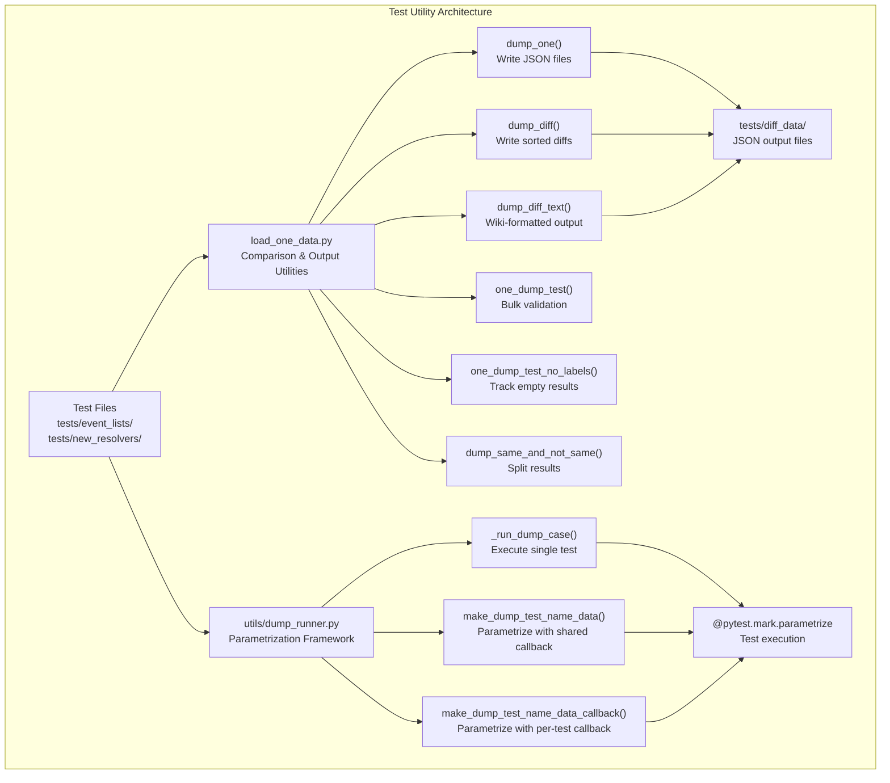
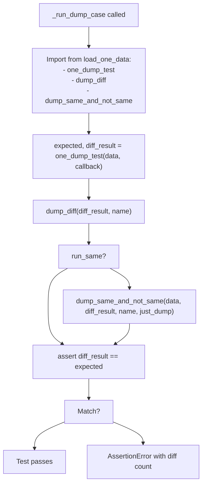

# Test Utilities

> **Relevant source files**
> * [ArWikiCats/jsons/geography/P17_PP.json](https://github.com/ArWikiCats/ArWikiCats/blob/4095f04e/ArWikiCats/jsons/geography/P17_PP.json)
> * [ArWikiCats/jsons/geography/popopo.json](https://github.com/ArWikiCats/ArWikiCats/blob/4095f04e/ArWikiCats/jsons/geography/popopo.json)
> * [ArWikiCats/jsons/people/peoples.json](https://github.com/ArWikiCats/ArWikiCats/blob/4095f04e/ArWikiCats/jsons/people/peoples.json)
> * [tests/load_one_data.py](https://github.com/ArWikiCats/ArWikiCats/blob/4095f04e/tests/load_one_data.py)
> * [tests/utils/dump_runner.py](https://github.com/ArWikiCats/ArWikiCats/blob/4095f04e/tests/utils/dump_runner.py)

## Purpose and Scope

This page documents the test utility functions and helper modules that power the ArWikiCats test suite. It focuses on the core testing infrastructure provided by `tests/load_one_data.py` and `tests/utils/dump_runner.py`, which enable bulk validation, regression detection, and comparison reporting across thousands of category translation test cases. For test organization patterns, see page 8.1. For domain-specific test suites, see page 8.2.

---

## Core Utility Modules

The test infrastructure consists of two primary utility modules that provide complementary functionality:



**Sources:** [tests/load_one_data.py L1-L119](https://github.com/ArWikiCats/ArWikiCats/blob/4095f04e/tests/load_one_data.py#L1-L119)

 [tests/utils/dump_runner.py L1-L55](https://github.com/ArWikiCats/ArWikiCats/blob/4095f04e/tests/utils/dump_runner.py#L1-L55)

---

## load_one_data Module

The `load_one_data.py` module provides the core comparison and output utilities used throughout the test suite. Located at `tests/load_one_data.py`, it is imported by test files as:

```javascript
from load_one_data import dump_diff, one_dump_test, dump_diff_text
```

**Sources:** [tests/load_one_data.py L1-L119](https://github.com/ArWikiCats/ArWikiCats/blob/4095f04e/tests/load_one_data.py#L1-L119)

---

### dump_one Function

Writes a dictionary to a JSON file in the `tests/diff_data/` directory.

**Function Signature:**

```python
def dump_one(data: dict, file_name: str) -> None
```

**Parameters:**

* `data`: Dictionary containing test results or comparison data
* `file_name`: Output filename (without `.json` extension)

**Behavior:**

* Creates `tests/diff_data/` directory if it doesn't exist
* Writes JSON with UTF-8 encoding, 4-space indentation, and non-ASCII characters preserved
* Handles exceptions gracefully with error messages

**Usage:**

```css
result_data = {"Category:yemeni sports": "تصنيف:ألعاب رياضية يمنية"}
dump_one(result_data, "nationality_results")
# Creates: tests/diff_data/nationality_results.json
```

**Sources:** [tests/load_one_data.py L7-L16](https://github.com/ArWikiCats/ArWikiCats/blob/4095f04e/tests/load_one_data.py#L7-L16)

---

### dump_diff Function

Writes a sorted dictionary to JSON, separating non-empty values from empty values.

**Function Signature:**

```python
def dump_diff(data: dict, file_name: str, _sort: bool = True) -> None
```

**Parameters:**

* `data`: Dictionary with test differences (key: category, value: translation or empty string)
* `file_name`: Output filename (without `.json` extension)
* `_sort`: If `True`, sorts non-empty values first, then empty values

**Sorting Behavior:**
When `_sort=True`, the output dictionary is reorganized:

1. All entries with truthy values appear first
2. All entries with falsy values (empty strings, `None`) appear last

This ordering makes it easier to review successful translations separately from failures.

**Usage:**

```css
diff_results = {
    "Category:yemeni sports": "تصنيف:ألعاب رياضية يمنية",
    "Category:unknown category": "",
    "Category:american films": "تصنيف:أفلام أمريكية"
}
dump_diff(diff_results, "test_diff")
# Output will have non-empty translations first, then empty strings
```

**Sources:** [tests/load_one_data.py L19-L29](https://github.com/ArWikiCats/ArWikiCats/blob/4095f04e/tests/load_one_data.py#L19-L29)

---

### dump_diff_text Function

Generates wiki-formatted move templates for categories that need renaming, used for bulk category renames on Arabic Wikipedia.

**Function Signature:**

```python
def dump_diff_text(expected: dict, diff_result: dict, file_name: str) -> None
```

**Parameters:**

* `expected`: Dictionary of original category names (keys) to expected Arabic translations (values)
* `diff_result`: Dictionary of category names to actual translation results
* `file_name`: Output filename (without `_wiki.json` suffix)

**Output Format:**
Creates text file with wiki template syntax for category moves:

```css
# {{وب:طنت/سطر|old_name|new_name|سبب النقل=تصحيح ArWikiCats}}
```

**Filtering Logic:**
Only includes entries where:

1. Expected value is truthy (non-empty)
2. Diff result exists and is truthy
3. Both expected and actual differ (indicating a change)

**Usage:**

```css
expected = {"old cat name": "تصنيف:الاسم القديم"}
actual = {"old cat name": "تصنيف:الاسم الجديد"}
dump_diff_text(expected, actual, "category_moves")
# Creates: tests/diff_data/category_moves_wiki.json
```

**Sources:** [tests/load_one_data.py L32-L60](https://github.com/ArWikiCats/ArWikiCats/blob/4095f04e/tests/load_one_data.py#L32-L60)

---

### one_dump_test Function

Performs bulk validation by running a resolver callback against an entire dataset, comparing actual results to expected values.

**Function Signature:**

```python
def one_dump_test(dataset: dict, callback: Callable[[str], str], do_strip=False) -> tuple[dict, dict]
```

**Parameters:**

* `dataset`: Dictionary mapping English categories to expected Arabic translations
* `callback`: Translation function (e.g., `resolve_arabic_category_label`)
* `do_strip`: If `True`, strips whitespace from both results and expected values before comparison

**Returns:**

* `org`: Dictionary of categories with mismatched results (key: category, value: expected)
* `diff`: Dictionary of categories with mismatched results (key: category, value: actual)

**Workflow:**

1. Prints dataset size and callback name
2. Iterates over all test cases in `dataset`
3. Calls `callback(category)` for each category
4. Optionally strips whitespace if `do_strip=True`
5. Compares actual result to expected value
6. Collects mismatches in `org` and `diff` dictionaries

**Usage:**

```css
test_data = {
    "yemeni sports": "ألعاب رياضية يمنية",
    "american films": "أفلام أمريكية"
}

org, diff = one_dump_test(test_data, resolve_arabic_category_label)
# org contains expected values for failures
# diff contains actual values for failures

assert len(diff) == 0, f"Found {len(diff)} mismatches"
```

**Sources:** [tests/load_one_data.py L63-L79](https://github.com/ArWikiCats/ArWikiCats/blob/4095f04e/tests/load_one_data.py#L63-L79)

---

### one_dump_test_no_labels Function

Extended version of `one_dump_test` that also tracks categories with no translation result (empty strings).

**Function Signature:**

```python
def one_dump_test_no_labels(dataset: dict, callback: Callable[[str], str], do_strip=False) -> tuple[dict, dict, list]
```

**Returns:**

* `org`: Dictionary of mismatched expected values
* `diff`: Dictionary of mismatched actual values
* `no_labels`: List of category names that returned empty results

**Additional Tracking:**
Unlike `one_dump_test`, this function separates three types of failures:

1. Mismatched translations (different non-empty result)
2. Empty results (no translation found)
3. Both categories tracked separately for analysis

**Usage:**

```python
test_data = {
    "yemeni sports": "ألعاب رياضية يمنية",
    "unknown category": "some expected value"
}

org, diff, no_labels = one_dump_test_no_labels(test_data, resolve_arabic_category_label)

print(f"Mismatches: {len(diff)}")
print(f"No translations: {len(no_labels)}")
# Useful for identifying resolver gaps vs. incorrect translations
```

**Sources:** [tests/load_one_data.py L82-L100](https://github.com/ArWikiCats/ArWikiCats/blob/4095f04e/tests/load_one_data.py#L82-L100)

---

### dump_same_and_not_same Function

Splits test results into two files: categories that match expectations and categories that don't.

**Function Signature:**

```python
def dump_same_and_not_same(data: dict, diff_result: dict, name: str, just_dump: bool = False) -> None
```

**Parameters:**

* `data`: Original test dataset (expected values)
* `diff_result`: Dictionary of categories with differences (from `one_dump_test`)
* `name`: Base filename for output files
* `just_dump`: If `True`, always dumps both files even if all match or all differ

**Output Files:**

* `{name}_same.json`: Categories where actual matched expected (not in `diff_result`)
* `{name}_not_same.json`: Categories where actual differed from expected (in `diff_result`)

**Conditional Output:**
Files are only created if:

* There's a mix of matching and non-matching results, OR
* `just_dump=True`

**Usage:**

```css
test_data = {"cat1": "val1", "cat2": "val2", "cat3": "val3"}
org, diff = one_dump_test(test_data, resolver)

dump_same_and_not_same(test_data, diff, "nationality_test")
# Creates:
# - tests/diff_data/nationality_test_same.json (matching results)
# - tests/diff_data/nationality_test_not_same.json (differences)
```

**Sources:** [tests/load_one_data.py L103-L118](https://github.com/ArWikiCats/ArWikiCats/blob/4095f04e/tests/load_one_data.py#L103-L118)

---

## dump_runner Module

The `dump_runner.py` module provides pytest parametrization framework utilities for creating data-driven tests. Located at `tests/utils/dump_runner.py`, it simplifies the creation of bulk validation tests.

**Sources:** [tests/utils/dump_runner.py L1-L55](https://github.com/ArWikiCats/ArWikiCats/blob/4095f04e/tests/utils/dump_runner.py#L1-L55)

---

### Type Definitions

The module defines type aliases for test data structures:

```
ToTest = Iterable[tuple[str, dict[str, str]]]
ToTestCallback = Iterable[tuple[str, dict[str, str], callable]]
```

* `ToTest`: Collection of `(test_name, test_data_dict)` tuples
* `ToTestCallback`: Collection of `(test_name, test_data_dict, callback_function)` tuples

**Sources:** [tests/utils/dump_runner.py L8-L9](https://github.com/ArWikiCats/ArWikiCats/blob/4095f04e/tests/utils/dump_runner.py#L8-L9)

---

### _run_dump_case Function

Internal function that executes a single dump test case, combining validation with optional diff output.

**Function Signature:**

```python
def _run_dump_case(name: str, data: dict[str, str], callback: callable, 
                   run_same=False, just_dump=False) -> None
```

**Parameters:**

* `name`: Test case identifier (used for output filenames)
* `data`: Test dataset mapping English categories to expected Arabic translations
* `callback`: Resolver function to test
* `run_same`: If `True`, calls `dump_same_and_not_same` to split results
* `just_dump`: Passed to `dump_same_and_not_same` for unconditional output

**Workflow:**



**Assertion Logic:**
The function asserts that `diff_result == expected`, which will only be true if both dictionaries are empty (no differences found). If there are differences, the assertion fails with a message showing the count.

**Sources:** [tests/utils/dump_runner.py L12-L28](https://github.com/ArWikiCats/ArWikiCats/blob/4095f04e/tests/utils/dump_runner.py#L12-L28)

---

### make_dump_test_name_data Function

Factory function that creates a pytest parametrized test using a shared callback for all test cases.

**Function Signature:**

```python
def make_dump_test_name_data(to_test: ToTest, callback, run_same=False, just_dump=False)
```

**Parameters:**

* `to_test`: Iterable of `(name, data)` tuples for parametrization
* `callback`: Shared resolver function for all test cases
* `run_same`, `just_dump`: Passed to `_run_dump_case`

**Returns:**
Pytest test function decorated with `@pytest.mark.parametrize` and `@pytest.mark.dump`

**Usage Pattern:**

```
test_cases = [
    ("nationality_male", test_data_males),
    ("nationality_female", test_data_females),
    ("nationality_ar", test_data_ar)
]

test_dump_all = make_dump_test_name_data(
    test_cases, 
    resolve_arabic_category_label,
    run_same=True
)
```

This creates a test function that runs 3 parametrized test cases, all using `resolve_arabic_category_label` as the callback.

**Sources:** [tests/utils/dump_runner.py L31-L41](https://github.com/ArWikiCats/ArWikiCats/blob/4095f04e/tests/utils/dump_runner.py#L31-L41)

---

### make_dump_test_name_data_callback Function

Factory function that creates a pytest parametrized test with per-case callbacks, allowing different resolvers for different test datasets.

**Function Signature:**

```python
def make_dump_test_name_data_callback(to_test: ToTestCallback, run_same=False, just_dump=False)
```

**Parameters:**

* `to_test`: Iterable of `(name, data, callback)` tuples
* `run_same`, `just_dump`: Passed to `_run_dump_case`

**Returns:**
Pytest test function with three-parameter parametrization: `name`, `data`, `callback`

**Usage Pattern:**

```
test_cases = [
    ("nationality", nationality_data, resolve_by_nats),
    ("sports", sports_data, resolve_by_sports),
    ("jobs", jobs_data, resolve_by_jobs)
]

test_dump_all = make_dump_test_name_data_callback(test_cases, run_same=True)
```

This creates a test function that runs 3 parametrized test cases, each with its own specialized resolver.

**Sources:** [tests/utils/dump_runner.py L44-L54](https://github.com/ArWikiCats/ArWikiCats/blob/4095f04e/tests/utils/dump_runner.py#L44-L54)

---

## Diff Data Output System

Test utilities write their output to the `tests/diff_data/` directory, which is created automatically if it doesn't exist.

**Directory Structure:**

```markdown
tests/
├── diff_data/              # Auto-generated output directory
│   ├── test_name.json      # Sorted diff results
│   ├── test_name_same.json # Matching results
│   ├── test_name_not_same.json # Non-matching results
│   ├── test_name_wiki.json # Wiki-formatted move templates
│   └── ...
├── load_one_data.py
└── utils/
    └── dump_runner.py
```

**File Formats:**

| File Type | Format | Created By | Purpose |
| --- | --- | --- | --- |
| `{name}.json` | Standard JSON | `dump_diff()` | Sorted differences (non-empty first) |
| `{name}_same.json` | Standard JSON | `dump_same_and_not_same()` | Categories matching expected |
| `{name}_not_same.json` | Standard JSON | `dump_same_and_not_same()` | Categories with differences |
| `{name}_wiki.json` | Text file | `dump_diff_text()` | Wiki move templates |

**JSON Output Example:**

```json
{
    "Category:yemeni sports": "تصنيف:ألعاب رياضية يمنية",
    "Category:american films": "تصنيف:أفلام أمريكية",
    "Category:unknown": ""
}
```

**Wiki Template Output Example:**

```css
# {{وب:طنت/سطر|Category:old name|Category:new name|سبب النقل=تصحيح ArWikiCats}}
# {{وب:طنت/سطر|Category:another old|Category:another new|سبب النقل=تصحيح ArWikiCats}}
```

**Sources:** [tests/load_one_data.py L8-L9](https://github.com/ArWikiCats/ArWikiCats/blob/4095f04e/tests/load_one_data.py#L8-L9)

 [tests/load_one_data.py L50-L51](https://github.com/ArWikiCats/ArWikiCats/blob/4095f04e/tests/load_one_data.py#L50-L51)

---

## Integration with Pytest

The dump utilities integrate with pytest through parametrization and markers, enabling scalable test execution.

**Common Integration Patterns:**

```mermaid
flowchart TD

P3_CASES["Test Cases with Callbacks<br>[(name1, data1, cb1), (name2, data2, cb2)]"]
P3_FACTORY["test_dump_all = make_dump_test_name_data_callback(<br>    test_cases)"]
P3_PARAM["@pytest.mark.parametrize('name', 'data', 'callback')"]
P3_RUN["pytest test_file.py"]
P2_CASES["Test Cases List<br>[(name1, data1), (name2, data2)]"]
P2_FACTORY["test_dump_all = make_dump_test_name_data(<br>    test_cases,<br>    callback,<br>    run_same=True)"]
P2_PARAM["@pytest.mark.parametrize('name', 'data')<br>@pytest.mark.dump"]
P2_RUN["pytest -m dump"]
P1_DATA["Test Data Dictionary"]
P1_TEST["def test_nationality():<br>    org, diff = one_dump_test(data, callback)<br>    assert len(diff) == 0"]
P1_RUN["pytest test_file.py"]

subgraph subGraph2 ["Pattern 3: Multi-Callback"]
    P3_CASES
    P3_FACTORY
    P3_PARAM
    P3_RUN
    P3_CASES --> P3_FACTORY
    P3_FACTORY --> P3_PARAM
    P3_PARAM --> P3_RUN
end

subgraph subGraph1 ["Pattern 2: Factory Function"]
    P2_CASES
    P2_FACTORY
    P2_PARAM
    P2_RUN
    P2_CASES --> P2_FACTORY
    P2_FACTORY --> P2_PARAM
    P2_PARAM --> P2_RUN
end

subgraph subGraph0 ["Pattern 1: Direct Usage"]
    P1_DATA
    P1_TEST
    P1_RUN
    P1_DATA --> P1_TEST
    P1_TEST --> P1_RUN
end
```



**Pattern 1: Direct one_dump_test Usage**

```javascript
from load_one_data import one_dump_test
from ArWikiCats import resolve_arabic_category_label

test_data = {
    "yemeni sports": "ألعاب رياضية يمنية",
    "american films": "أفلام أمريكية"
}

def test_nationality_translations():
    org, diff = one_dump_test(test_data, resolve_arabic_category_label)
    assert len(diff) == 0, f"Found {len(diff)} translation errors"
```

**Pattern 2: Using make_dump_test_name_data**

```javascript
from tests.utils.dump_runner import make_dump_test_name_data
from ArWikiCats import resolve_arabic_category_label

test_cases = [
    ("males", test_data_males),
    ("females", test_data_females)
]

test_dump_all = make_dump_test_name_data(
    test_cases,
    resolve_arabic_category_label,
    run_same=True
)
# Creates parametrized test with 2 test cases
# Outputs to diff_data/males.json, diff_data/females.json
```

**Pattern 3: Using make_dump_test_name_data_callback**

```javascript
from tests.utils.dump_runner import make_dump_test_name_data_callback

test_cases = [
    ("nationality", nat_data, resolve_by_nats),
    ("sports", sports_data, resolve_by_sports),
    ("jobs", jobs_data, resolve_by_jobs)
]

test_dump_all = make_dump_test_name_data_callback(test_cases)
# Each test case uses its specialized resolver
```

**Sources:** [tests/utils/dump_runner.py L31-L54](https://github.com/ArWikiCats/ArWikiCats/blob/4095f04e/tests/utils/dump_runner.py#L31-L54)

 [tests/load_one_data.py L63-L79](https://github.com/ArWikiCats/ArWikiCats/blob/4095f04e/tests/load_one_data.py#L63-L79)

---

## Test Markers

The test suite uses pytest markers for selective test execution, particularly with the `@pytest.mark.dump` marker applied by factory functions.

| Marker | Applied By | Purpose |
| --- | --- | --- |
| `@pytest.mark.dump` | `make_dump_test_name_data()`, `make_dump_test_name_data_callback()` | Marks bulk validation tests for selective execution |
| `@pytest.mark.parametrize` | Factory functions | Enables data-driven testing with multiple test cases |

**Execution Commands:**

```markdown
# Run all dump tests
pytest -m dump

# Run specific test file
pytest tests/event_lists/test_2.py

# Run dump tests in specific directory
pytest tests/new_resolvers/ -m dump
```

**Sources:** [tests/utils/dump_runner.py L37-L50](https://github.com/ArWikiCats/ArWikiCats/blob/4095f04e/tests/utils/dump_runner.py#L37-L50)

---

## Usage Patterns and Examples

### Pattern 1: Basic Bulk Validation

Simple validation of a dataset against a resolver:

```javascript
from load_one_data import one_dump_test, dump_diff
from ArWikiCats import resolve_arabic_category_label

test_data = {
    "yemeni sports": "ألعاب رياضية يمنية",
    "american films": "أفلام أمريكية",
    "french novels": "روايات فرنسية"
}

def test_translations():
    org, diff = one_dump_test(test_data, resolve_arabic_category_label)
    
    # Save differences for review
    if diff:
        dump_diff(diff, "translation_failures")
    
    # Assert no failures
    assert len(diff) == 0, f"Found {len(diff)} translation errors"
```

**Sources:** [tests/load_one_data.py L63-L79](https://github.com/ArWikiCats/ArWikiCats/blob/4095f04e/tests/load_one_data.py#L63-L79)

---

### Pattern 2: Tracking Empty Results

Identify categories that return no translation:

```javascript
from load_one_data import one_dump_test_no_labels, dump_diff

test_data = {
    "yemeni sports": "ألعاب رياضية يمنية",
    "unknown category": "expected value",
    "american films": "أفلام أمريكية"
}

def test_with_empty_tracking():
    org, diff, no_labels = one_dump_test_no_labels(
        test_data, 
        resolve_arabic_category_label
    )
    
    # Save categories with no translation
    if no_labels:
        dump_diff({cat: "" for cat in no_labels}, "no_translations")
    
    print(f"Incorrect translations: {len(diff)}")
    print(f"No translations found: {len(no_labels)}")
```

**Sources:** [tests/load_one_data.py L82-L100](https://github.com/ArWikiCats/ArWikiCats/blob/4095f04e/tests/load_one_data.py#L82-L100)

---

### Pattern 3: Parametrized Dump Tests

Create parametrized tests for multiple datasets:

```javascript
from tests.utils.dump_runner import make_dump_test_name_data
from ArWikiCats import resolve_arabic_category_label

test_data_males = {"yemeni singers": "مغنون يمنيون"}
test_data_females = {"yemeni music": "موسيقى يمنية"}
test_data_ar = {"yemeni cup": "كأس اليمن"}

to_test = [
    ("males", test_data_males),
    ("females", test_data_females),
    ("ar_direct", test_data_ar)
]

# Creates parametrized test function
test_dump_all = make_dump_test_name_data(
    to_test,
    resolve_arabic_category_label,
    run_same=True  # Also output matching/non-matching splits
)
```

**Execution:**

```markdown
pytest test_file.py -m dump
# Runs 3 test cases, outputs:
# - diff_data/males.json, males_same.json, males_not_same.json
# - diff_data/females.json, females_same.json, females_not_same.json
# - diff_data/ar_direct.json, ar_direct_same.json, ar_direct_not_same.json
```

**Sources:** [tests/utils/dump_runner.py L31-L41](https://github.com/ArWikiCats/ArWikiCats/blob/4095f04e/tests/utils/dump_runner.py#L31-L41)

---

### Pattern 4: Multi-Resolver Testing

Test different resolvers on different datasets:

```javascript
from tests.utils.dump_runner import make_dump_test_name_data_callback
from ArWikiCats.resolvers import resolve_by_nats, resolve_by_sports, resolve_by_jobs

to_test = [
    ("nationality", nationality_test_data, resolve_by_nats),
    ("sports", sports_test_data, resolve_by_sports),
    ("jobs", jobs_test_data, resolve_by_jobs)
]

test_dump_all = make_dump_test_name_data_callback(to_test)
```

**Sources:** [tests/utils/dump_runner.py L44-L54](https://github.com/ArWikiCats/ArWikiCats/blob/4095f04e/tests/utils/dump_runner.py#L44-L54)

---

### Pattern 5: Wiki Template Generation

Generate bulk category move templates for Arabic Wikipedia:

```javascript
from load_one_data import one_dump_test, dump_diff_text

# Test data with old category names
test_data = {
    "old category name 1": "تصنيف:الاسم القديم 1",
    "old category name 2": "تصنيف:الاسم القديم 2"
}

# Run test to get new translations
org, diff = one_dump_test(test_data, resolve_arabic_category_label)

# Generate wiki move templates for changed categories
if diff:
    dump_diff_text(org, diff, "category_moves")
    # Creates: diff_data/category_moves_wiki.json
    # Content: {{وب:طنت/سطر|old|new|سبب النقل=تصحيح ArWikiCats}}
```

**Sources:** [tests/load_one_data.py L32-L60](https://github.com/ArWikiCats/ArWikiCats/blob/4095f04e/tests/load_one_data.py#L32-L60)

---

## Best Practices

### Writing Parametrized Tests

1. **Organize test data by logical category** (nationality, time, jobs, etc.)
2. **Use descriptive dictionary keys** that match input patterns exactly
3. **Group similar patterns together** for easier maintenance
4. **Mark expensive tests appropriately** (`@pytest.mark.slow` or `@pytest.mark.dump`)
5. **Use `data_skip` dictionaries** for known failures instead of commenting out tests

### Using Test Markers

1. **Default to `@pytest.mark.fast`** for new unit tests
2. **Use `@pytest.mark.slow`** for tests with 100+ parametrized cases
3. **Reserve `@pytest.mark.dump`** for full dataset validation
4. **Document `@pytest.mark.skip2`** with issue tracking comments
5. **Run fast tests frequently during development**

### Regression Detection

1. **Run `dump_diff` before committing resolver changes**
2. **Review all "Changed" results manually** for correctness
3. **Update baselines only when improvements are intentional**
4. **Commit baseline updates with the code changes** that caused them
5. **Document regression fixes in commit messages**

**Sources:** Testing best practices from system overview, test file patterns.