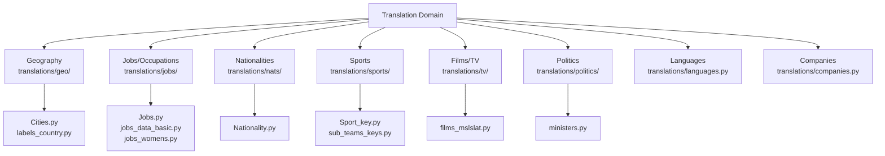
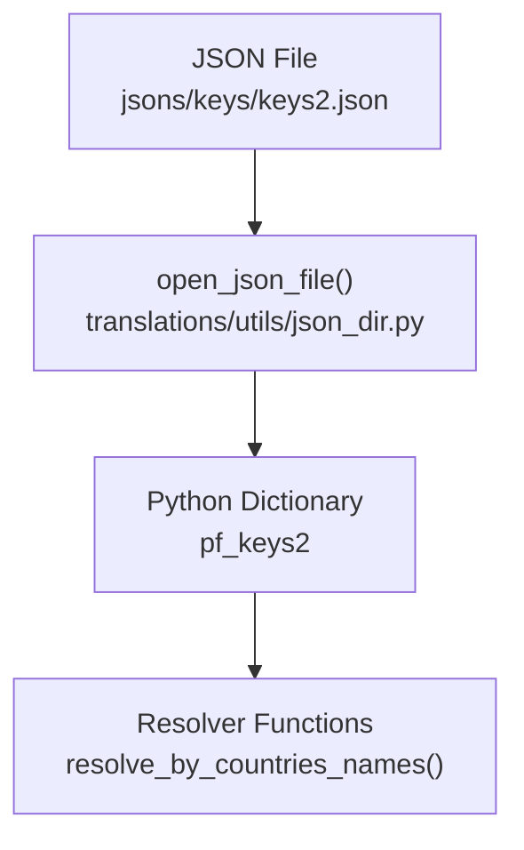
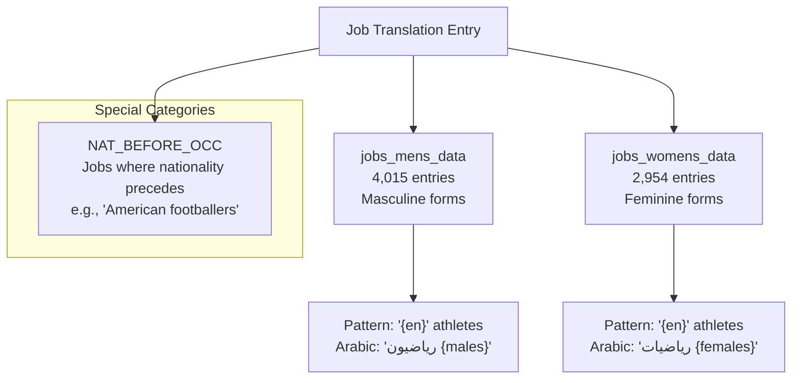
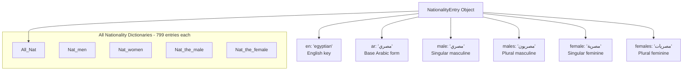
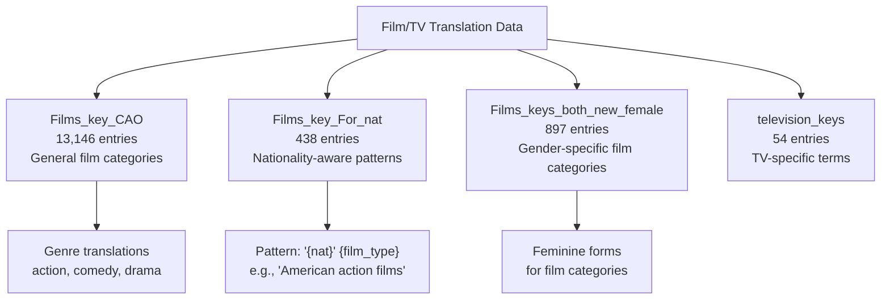
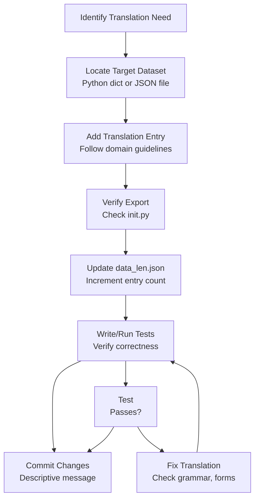

# Adding Translation Data

> **Relevant source files**
> * [ArWikiCats/jsons/keys/COMPANY_TYPE_TRANSLATIONS.json](../ArWikiCats/jsons/keys/COMPANY_TYPE_TRANSLATIONS.json)
> * [ArWikiCats/translations/__init__.py](../ArWikiCats/translations/__init__.py)
> * [ArWikiCats/translations/build_data/__init__.py](../ArWikiCats/translations/build_data/__init__.py)
> * [ArWikiCats/translations/funcs.py](../ArWikiCats/translations/funcs.py)
> * [ArWikiCats/translations/geo/__init__.py](../ArWikiCats/translations/geo/__init__.py)
> * [ArWikiCats/translations/geo/labels_country.py](../ArWikiCats/translations/geo/labels_country.py)
> * [ArWikiCats/translations/jobs/Jobs.py](../ArWikiCats/translations/jobs/Jobs.py)
> * [ArWikiCats/translations/jobs/Jobs2.py](../ArWikiCats/translations/jobs/Jobs2.py)
> * [ArWikiCats/translations/jobs/jobs_data_basic.py](../ArWikiCats/translations/jobs/jobs_data_basic.py)
> * [ArWikiCats/translations/jobs/jobs_players_list.py](../ArWikiCats/translations/jobs/jobs_players_list.py)
> * [ArWikiCats/translations/jobs/jobs_singers.py](../ArWikiCats/translations/jobs/jobs_singers.py)
> * [ArWikiCats/translations/jobs/jobs_womens.py](../ArWikiCats/translations/jobs/jobs_womens.py)
> * [ArWikiCats/translations/mixed/__init__.py](../ArWikiCats/translations/mixed/__init__.py)
> * [ArWikiCats/translations/mixed/all_keys2.py](../ArWikiCats/translations/mixed/all_keys2.py)
> * [ArWikiCats/translations/mixed/female_keys.py](../ArWikiCats/translations/mixed/female_keys.py)
> * [ArWikiCats/translations/mixed/keys2.py](../ArWikiCats/translations/mixed/keys2.py)
> * [ArWikiCats/translations/nats/Nationality.py](../ArWikiCats/translations/nats/Nationality.py)
> * [ArWikiCats/translations/nats/__init__.py](../ArWikiCats/translations/nats/__init__.py)
> * [ArWikiCats/translations/others/__init__.py](../ArWikiCats/translations/others/__init__.py)
> * [ArWikiCats/translations/others/tax_table.py](../ArWikiCats/translations/others/tax_table.py)
> * [ArWikiCats/translations/sports/Sport_key.py](../ArWikiCats/translations/sports/Sport_key.py)
> * [ArWikiCats/translations/tv/films_mslslat.py](../ArWikiCats/translations/tv/films_mslslat.py)
> * [_work_files/data_len.json](../_work_files/data_len.json)

## Purpose and Scope

This document explains how to add new translation entries to the ArWikiCats translation datasets, update the metadata registry, and maintain data consistency across the system. This covers the practical steps for extending existing translation dictionaries and JSON files.

For information about creating entirely new resolvers that use this data, see [Creating New Resolvers](39.Creating-New-Resolvers.md). For an overview of the translation data architecture, see [Data Architecture](4.Data-Architecture.md).

---

## Translation Data Organization

The ArWikiCats system maintains translation data in two primary formats: **Python dictionaries** and **JSON files**. The choice of format depends on the dataset's complexity and usage patterns.

### Data Storage Formats

```mermaid
flowchart TD

PYDICT["Python Module Files<br>.py files in translations/"]
NATS["translations/nats/Nationality.py<br>All_Nat: 799 entries<br>NationalityEntry objects"]
JOBS["translations/jobs/Jobs.py<br>jobs_mens_data: 4,015<br>jobs_womens_data: 2,954"]
SPORTS["translations/sports/Sport_key.py<br>SPORT_KEY_RECORDS: 433"]
FILMS["translations/tv/films_mslslat.py<br>Films_key_CAO: 13,146"]
MINISTERS["translations/politics/ministers.py<br>ministers_keys: 99"]
JSONFILES["JSON Files in jsons/"]
KEYS2["jsons/keys/keys2.json<br>pf_keys2: 33,691 entries"]
COUNTRIES["jsons/geography/P17_2_final_ll_new.json<br>NEW_P17_FINAL: 24,479"]
REGIONS["jsons/geography/regions.json<br>US_COUNTY_TRANSLATIONS: 2,998"]
CITIES["jsons/cities/yy2_new.json<br>CITY_TRANSLATIONS_LOWER: 10,526"]
META["_work_files/data_len.json<br>Tracks all dataset sizes"]

PYDICT --> META
JSONFILES --> META

subgraph subGraph2 ["Metadata Registry"]
    META
end

subgraph subGraph1 ["JSON File Datasets"]
    JSONFILES
    KEYS2
    COUNTRIES
    REGIONS
    CITIES
    JSONFILES --> KEYS2
    JSONFILES --> COUNTRIES
    JSONFILES --> REGIONS
    JSONFILES --> CITIES
end

subgraph subGraph0 ["Python Dictionary Datasets"]
    PYDICT
    NATS
    JOBS
    SPORTS
    FILMS
    MINISTERS
    PYDICT --> NATS
    PYDICT --> JOBS
    PYDICT --> SPORTS
    PYDICT --> FILMS
    PYDICT --> MINISTERS
end
```



**Sources:** [_work_files/data_len.json L1-L155](../_work_files/data_len.json#L1-L155)

 [ArWikiCats/translations/__init__.py L1-L157](../ArWikiCats/translations/__init__.py#L1-L157)

### The data_len.json Metadata Registry

The [_work_files/data_len.json L1-L155](../_work_files/data_len.json#L1-L155)

 file serves as the **central metadata registry** tracking the size of all translation datasets. Each entry maps a dataset identifier to its entry count:

| Dataset Identifier | Entry Count | Description |
| --- | --- | --- |
| `pf_keys2` | 33,691 | General translation keys |
| `NEW_P17_FINAL` | 24,479 | Country name translations |
| `Films_key_CAO` | 13,146 | Film/TV genre keys |
| `CITY_TRANSLATIONS_LOWER` | 10,526 | City name translations |
| `sub_teams_new` | 7,832 | Sports team translations |
| `jobs_mens_data` | 4,015 | Men's occupation translations |
| `jobs_womens_data` | 2,954 | Women's occupation translations |
| `All_Nat` | 799 | Nationality variants |
| `SPORT_KEY_RECORDS` | 433 | Sport type translations |
| `ministers_keys` | 99 | Political ministry translations |

This registry must be updated whenever translation entries are added or removed.

**Sources:** [_work_files/data_len.json L1-L155](../_work_files/data_len.json#L1-L155)

---

## Adding Entries to Python Dictionary Datasets

Python dictionary datasets are defined directly in `.py` files within the `ArWikiCats/translations/` directory hierarchy. These are typically used for structured data that benefits from type annotations or custom data classes.

### Step 1: Locate the Target Dataset

Identify the appropriate Python module based on the domain:



**Sources:** [ArWikiCats/translations/__init__.py L3-L76](../ArWikiCats/translations/__init__.py#L3-L76)

### Step 2: Add Dictionary Entry

For simple key-value dictionaries, add entries directly:

**Example: Adding a job translation**

```css
# In translations/jobs/Jobs.py
jobs_mens_data = {
    # Existing entries...
    "software engineers": "مهندسو برمجيات",
    # Add new entry:
    "data scientists": "علماء بيانات",
}
```

**Example: Adding a nationality entry**

```css
# In translations/nats/Nationality.py
All_Nat = {
    # Existing entries...
    "egyptian": NationalityEntry(
        en="egyptian",
        ar="مصري",
        male="مصري",
        males="مصريون",
        female="مصرية",
        females="مصريات",
    ),
    # Add new entry:
    "moroccan": NationalityEntry(
        en="moroccan",
        ar="مغربي",
        male="مغربي",
        males="مغاربة",
        female="مغربية",
        females="مغربيات",
    ),
}
```

### Step 3: Verify Export in init.py

Ensure the dataset is exported from [ArWikiCats/translations/__init__.py L80-L156](../ArWikiCats/translations/__init__.py#L80-L156)

:

```javascript
from .jobs.Jobs import jobs_mens_data, jobs_womens_data

__all__ = [
    # ...
    "jobs_mens_data",
    # ...
]
```

**Sources:** [ArWikiCats/translations/__init__.py L1-L157](../ArWikiCats/translations/__init__.py#L1-L157)

### Step 4: Update data_len.json

Increment the count in [_work_files/data_len.json L1-L155](../_work_files/data_len.json#L1-L155)

:

```python
{
    "jobs_mens_data": "4,016",  // Incremented from 4,015
    // ... other entries
}
```

Note the comma-formatted string representation (e.g., `"4,016"` not `4016`).

**Sources:** [_work_files/data_len.json L1-L155](../_work_files/data_len.json#L1-L155)

---

## Adding Entries to JSON File Datasets

JSON file datasets are stored in the `jsons/` directory and loaded via the `open_json_file` utility. These are preferred for very large datasets or data shared with external tools.

### JSON Dataset Loading Flow



**Sources:** [ArWikiCats/translations/__init__.py L77](../ArWikiCats/translations/__init__.py#L77-L77)

### Step 1: Identify the JSON File

Common JSON files and their purposes:

| File Path | Variable Name | Purpose |
| --- | --- | --- |
| `jsons/keys/keys2.json` | `pf_keys2` | General translation mappings |
| `jsons/geography/P17_2_final_ll_new.json` | `NEW_P17_FINAL` | Country names and variants |
| `jsons/geography/regions.json` | `US_COUNTY_TRANSLATIONS`, etc. | Regional subdivisions |
| `jsons/cities/yy2_new.json` | `CITY_TRANSLATIONS_LOWER` | City name translations |

### Step 2: Edit the JSON File

JSON files typically follow this structure:

```json
{
    "english_term": "arabic_translation",
    "another_term": "another_translation"
}
```

Add new entries following the existing pattern. Ensure proper JSON syntax (commas, quotes).

### Step 3: Update data_len.json

Update the corresponding entry count in [_work_files/data_len.json L1-L155](../_work_files/data_len.json#L1-L155)

:

```python
{
    "pf_keys2": "33,692",  // Incremented from 33,691
    // ... other entries
}
```

**Sources:** [_work_files/data_len.json L1-L155](../_work_files/data_len.json#L1-L155)

---

## Domain-Specific Guidelines

Each translation domain has specific requirements for data structure and grammatical correctness.

### Geographic Data

Geographic data includes cities, countries, and regional subdivisions.

**Country Data Structure:**

* Must provide both English and Arabic labels
* Should include common variants (e.g., "USA", "United States", "US")
* Gender forms for adjectival use

**City Data Considerations:**

* Stored in lowercase for case-insensitive matching
* Must account for transliteration variations
* Population data may be included for disambiguation

**Regional Subdivisions:**

* US counties: 2,998 entries
* Indian regions: 1,424 entries
* Administrative divisions vary by country

**Sources:** [_work_files/data_len.json L6-L23](../_work_files/data_len.json#L6-L23)

 [ArWikiCats/translations/__init__.py L4-L5](../ArWikiCats/translations/__init__.py#L4-L5)

### Jobs and Occupations

Job translations require **gender-specific variants** for Arabic grammatical agreement.



**Key Requirements:**

1. **Separate dictionaries** for masculine and feminine forms
2. Plural forms must be grammatically correct
3. Some jobs require **nationality-first** patterns (stored in `NAT_BEFORE_OCC`)

**Example Entry:**

```css
jobs_mens_data = {
    "footballers": "لاعبو كرة قدم",  # Masculine plural
}

jobs_womens_data = {
    "footballers": "لاعبات كرة قدم",  # Feminine plural
}
```

**Sources:** [_work_files/data_len.json L10-L15](../_work_files/data_len.json#L10-L15)

 [ArWikiCats/translations/__init__.py L6-L9](../ArWikiCats/translations/__init__.py#L6-L9)

### Nationalities

Nationality data is the most complex, requiring **six grammatical forms** per entry:



**Required Fields:**

* `en`: English nationality key (lowercase)
* `ar`: Base Arabic translation
* `male`: Singular masculine form
* `males`: Plural masculine form
* `female`: Singular feminine form
* `females`: Plural feminine form

**All nationality dictionaries contain 799 entries** and must be kept synchronized.

**Sources:** [_work_files/data_len.json L33-L42](../_work_files/data_len.json#L33-L42)

 [ArWikiCats/translations/__init__.py L33-L53](../ArWikiCats/translations/__init__.py#L33-L53)

### Sports Data

Sports translations include sport types, teams, and competition formats.

**Dataset Structure:**

| Dataset | Entries | Purpose |
| --- | --- | --- |
| `SPORT_KEY_RECORDS` | 433 | Base sport type translations |
| `sub_teams_new` | 7,832 | Sports team names and clubs |
| `SPORT_JOB_VARIANTS` | 571 | Sport-specific job titles (players, coaches) |

**Context-Specific Variants:**

* Olympic context: `SPORTS_KEYS_FOR_OLYMPIC` (432 entries)
* Team context: `SPORTS_KEYS_FOR_TEAM` (431 entries)
* Jobs context: `SPORTS_KEYS_FOR_JOBS` (433 entries)

Each sport may have different translations depending on whether it's used in "Olympic athletes", "football teams", or "basketball players" contexts.

**Sources:** [_work_files/data_len.json L7-L62](../_work_files/data_len.json#L7-L62)

 [ArWikiCats/translations/__init__.py L8-L64](../ArWikiCats/translations/__init__.py#L8-L64)

### Films and Television

Film/TV data is one of the largest domains with **13,146 entries** in `Films_key_CAO`.

**Dataset Categories:**



**Adding Film Translations:**

1. Determine if translation needs nationality awareness
2. Provide both masculine and feminine forms if applicable
3. Consider temporal patterns (decades, years)

**Sources:** [_work_files/data_len.json L4-L52](../_work_files/data_len.json#L4-L52)

 [ArWikiCats/translations/__init__.py L65-L75](../ArWikiCats/translations/__init__.py#L65-L75)

### Politics and Ministers

Political data includes ministry titles and political entities.

**Ministers Data Structure:**
The `ministers_keys` dictionary (99 entries) contains ministry translations with **article agreement variations**:

```css
ministers_keys = {
    "foreign affairs": {
        "no_al": "شؤون خارجية",    # Without article
        "with_al": "الشؤون الخارجية",  # With article
    },
    # Combined ministries:
    "defense and veterans affairs": {
        "no_al": "دفاع وشؤون المحاربين القدماء",
        "with_al": "الدفاع وشؤون المحاربين القدماء",
    },
}
```

**Key Considerations:**

* Provide both `no_al` and `with_al` forms
* Combined ministries use coordination (و)
* Match capitalization patterns from English Wikipedia

**Sources:** [_work_files/data_len.json L99](../_work_files/data_len.json#L99-L99)

 [ArWikiCats/translations/__init__.py L55](../ArWikiCats/translations/__init__.py#L55-L55)

### Languages

Language translations include language names and language-specific topic patterns.

**Language Data Types:**

| Dataset | Entries | Purpose |
| --- | --- | --- |
| `language_key_translations` | 597 | Language name translations |
| `PRIMARY_LANGUAGE_TRANSLATIONS` | 180 | Primary language names |
| `COMPLEX_LANGUAGE_TRANSLATIONS` | 15 | Complex language constructs |
| `LANGUAGE_TOPIC_FORMATS` | 78 | Language topic patterns |

**Sources:** [_work_files/data_len.json L44-L138](../_work_files/data_len.json#L44-L138)

 [ArWikiCats/translations/__init__.py L10-L15](../ArWikiCats/translations/__init__.py#L10-L15)

---

## Testing New Translation Data

After adding translation entries, verify correctness through testing.

### Writing Test Cases

Create test cases in the appropriate test file:

```javascript
# In tests/test_<domain>.py
import pytest
from ArWikiCats import resolve_label_ar

test_data = {
    "moroccan athletes": "تصنيف:رياضيون مغاربة",
    "data scientists": "تصنيف:علماء بيانات",
}

@pytest.mark.parametrize("category, expected", test_data.items())
def test_new_translations(category: str, expected: str) -> None:
    label = resolve_label_ar(category)
    assert label == expected
```

### Test Markers

Use pytest markers to categorize tests:

* `@pytest.mark.fast`: Quick unit tests
* `@pytest.mark.slow`: Comprehensive integration tests
* `@pytest.mark.skip2`: Known issues or incomplete features

**Sources:** [tests/event_lists/test_defunct.py L69-L73](../tests/event_lists/test_defunct.py#L69-L73)

### Validation Checklist

1. **Grammatical correctness**: Verify Arabic gender agreement, plurals, and articles
2. **Case insensitivity**: Ensure lowercase keys for geographic data
3. **Completeness**: Check all required forms (masculine/feminine, singular/plural)
4. **data_len.json update**: Confirm entry count is incremented
5. **No duplicates**: Ensure key uniqueness within datasets
6. **Export verification**: Check `__all__` exports in module `__init__.py`

---

## Data Consistency Requirements

### Cross-Dataset Synchronization

Some datasets must maintain synchronization:

**Nationality Datasets (must all have 799 entries):**

* `All_Nat`
* `Nat_men` / `Nat_mens`
* `Nat_women` / `Nat_Womens`
* `Nat_the_male` / `Nat_the_female`
* `ar_Nat_men`

**Job Datasets (gender pairs):**

* `jobs_mens_data` (4,015) paired with `jobs_womens_data` (2,954)
* Not all jobs have both forms, but additions should consider both

**Sports Context Variants:**

* `SPORTS_KEYS_FOR_JOBS` (433)
* `SPORTS_KEYS_FOR_LABEL` (433)
* `SPORTS_KEYS_FOR_TEAM` (431)
* `SPORTS_KEYS_FOR_OLYMPIC` (432)

**Sources:** [_work_files/data_len.json L10-L60](../_work_files/data_len.json#L10-L60)

### Naming Conventions

**Dictionary Keys:**

* Use lowercase for geographic entities: `"paris"` not `"Paris"`
* Preserve capitalization for proper nouns in other contexts
* Normalize spacing: `"new york"` not `"new  york"`

**Arabic Values:**

* Remove unnecessary articles (ال) unless required by grammar
* Use standard Arabic orthography
* Maintain consistency with existing entries

### Version Control Best Practices

When committing translation data changes:

1. **Separate commits** for data additions vs. code changes
2. **Descriptive commit messages**: Include entry count change ``` Add 15 new city translations to CITY_TRANSLATIONS_LOWER - Updated data_len.json: 10,526 -> 10,541 - Added cities: Cairo, Riyadh, Dubai, ... ```
3. **Review data_len.json diff** to verify correct count updates
4. **Test before committing**: Run domain-specific test suites

---

## Summary Workflow



**Sources:** [_work_files/data_len.json L1-L155](../_work_files/data_len.json#L1-L155)

 [ArWikiCats/translations/__init__.py L1-L157](../ArWikiCats/translations/__init__.py#L1-L157)

 [tests/event_lists/test_defunct.py L1-L74](../tests/event_lists/test_defunct.py#L1-L74)
