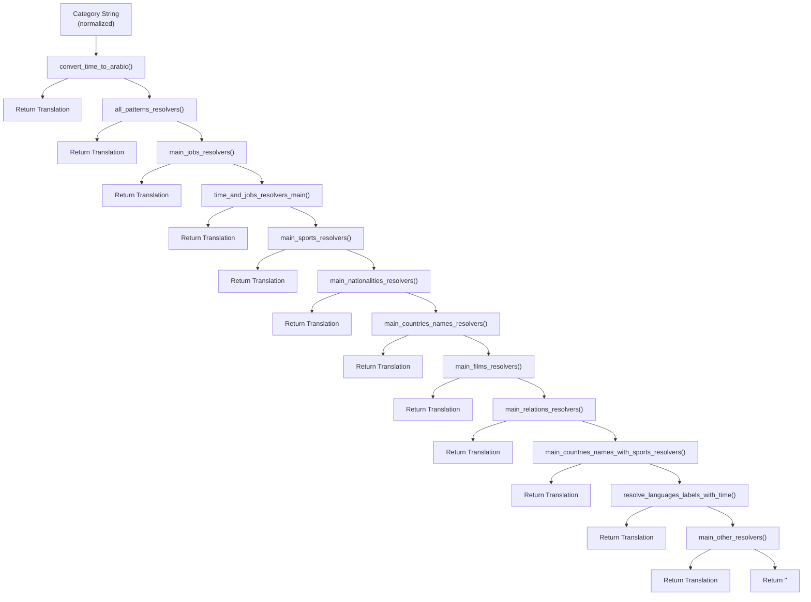
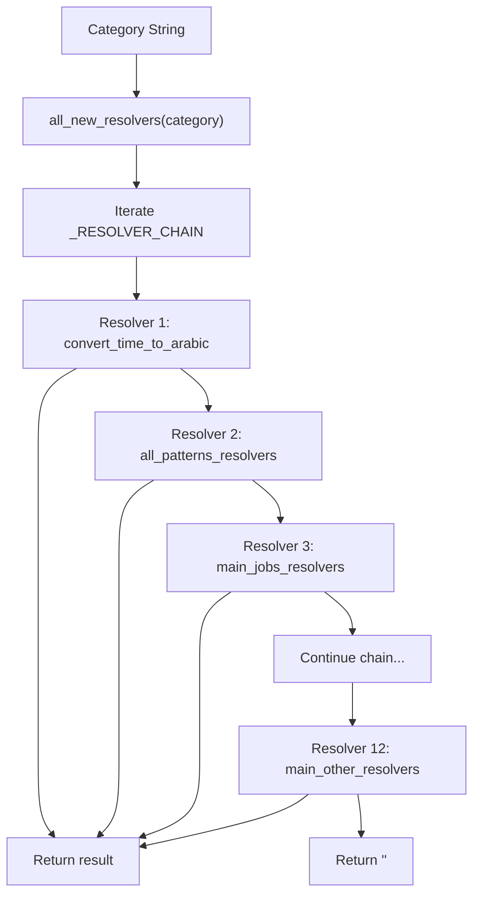
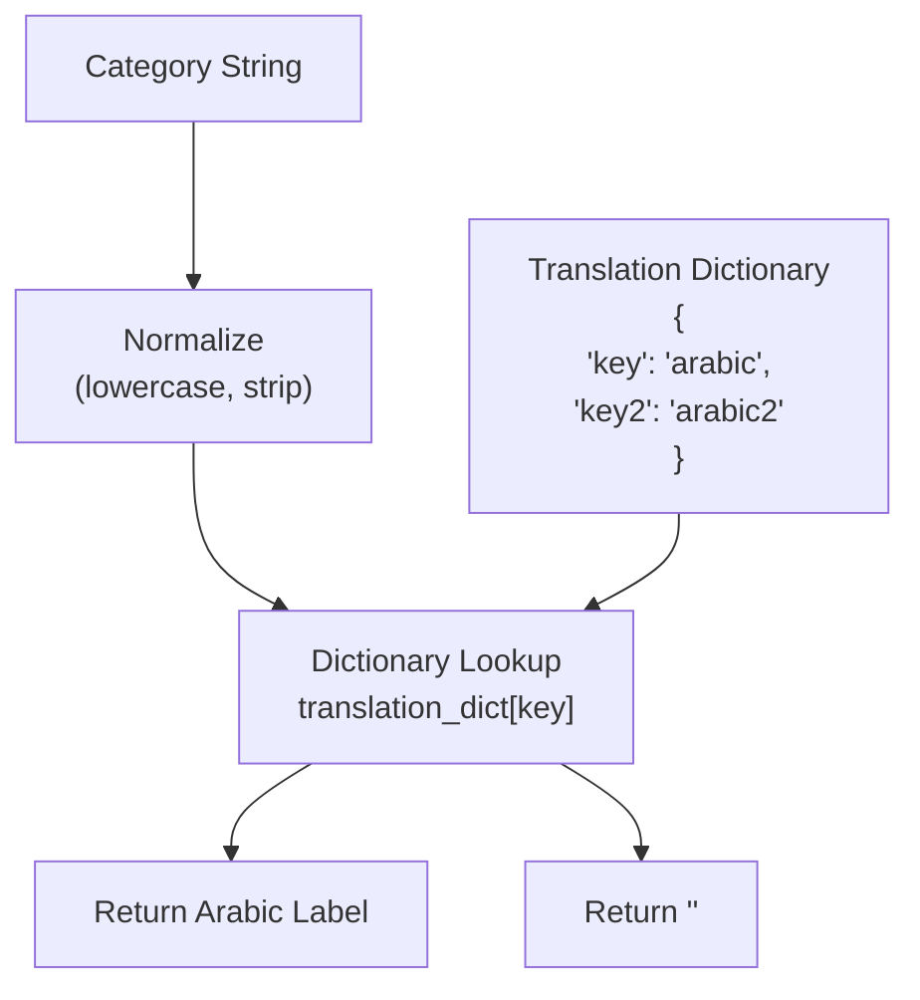
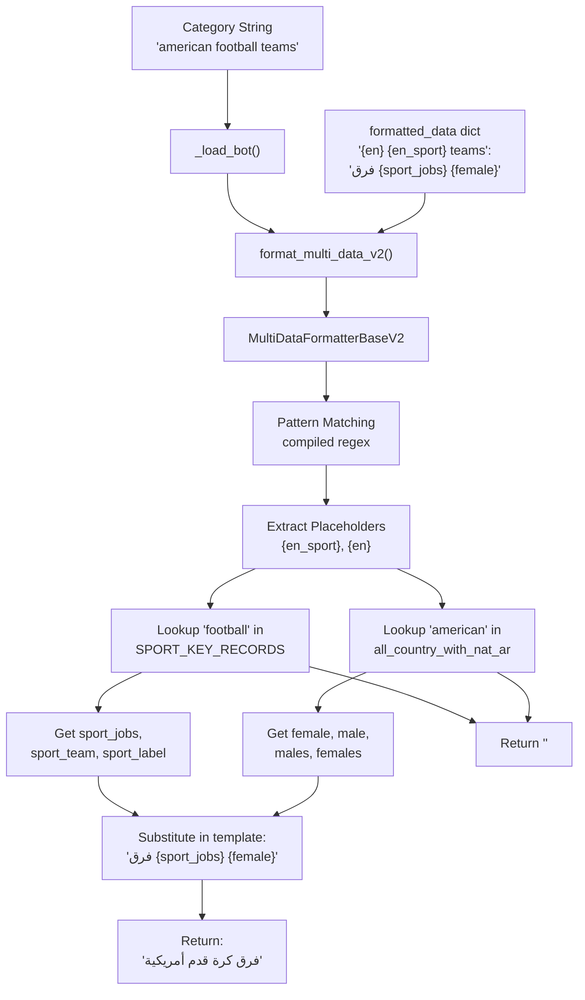
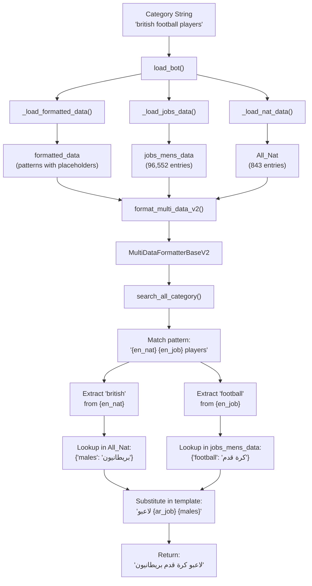
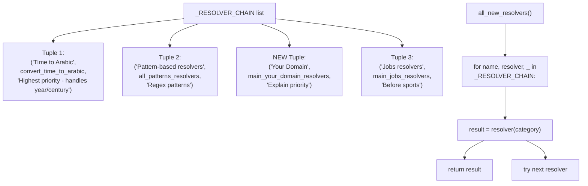
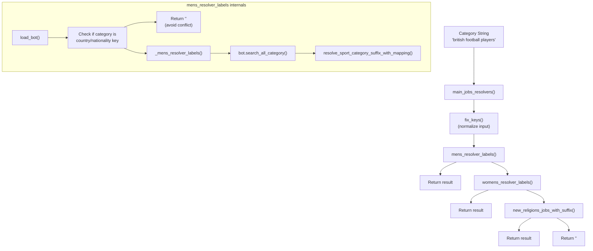

# Creating New Resolvers

> **Relevant source files**
> * [ArWikiCats/jsons/jobs/activists_keys.json](../ArWikiCats/jsons/jobs/activists_keys.json)
> * [ArWikiCats/new/handle_suffixes.py](../ArWikiCats/new/handle_suffixes.py)
> * [ArWikiCats/new_resolvers/__init__.py](../ArWikiCats/new_resolvers/__init__.py)
> * [ArWikiCats/new_resolvers/countries_names_resolvers/__init__.py](../ArWikiCats/new_resolvers/countries_names_resolvers/__init__.py)
> * [ArWikiCats/new_resolvers/countries_names_with_sports/__init__.py](../ArWikiCats/new_resolvers/countries_names_with_sports/__init__.py)
> * [ArWikiCats/new_resolvers/countries_names_with_sports/p17_bot_sport.py](../ArWikiCats/new_resolvers/countries_names_with_sports/p17_bot_sport.py)
> * [ArWikiCats/new_resolvers/countries_names_with_sports/p17_sport_to_move_under.py](../ArWikiCats/new_resolvers/countries_names_with_sports/p17_sport_to_move_under.py)
> * [ArWikiCats/new_resolvers/films_resolvers/__init__.py](../ArWikiCats/new_resolvers/films_resolvers/__init__.py)
> * [ArWikiCats/new_resolvers/films_resolvers/resolve_films_labels.py](../ArWikiCats/new_resolvers/films_resolvers/resolve_films_labels.py)
> * [ArWikiCats/new_resolvers/jobs_resolvers/__init__.py](../ArWikiCats/new_resolvers/jobs_resolvers/__init__.py)
> * [ArWikiCats/new_resolvers/jobs_resolvers/mens.py](../ArWikiCats/new_resolvers/jobs_resolvers/mens.py)
> * [ArWikiCats/new_resolvers/jobs_resolvers/relegin_jobs_new.py](../ArWikiCats/new_resolvers/jobs_resolvers/relegin_jobs_new.py)
> * [ArWikiCats/new_resolvers/jobs_resolvers/utils.py](../ArWikiCats/new_resolvers/jobs_resolvers/utils.py)
> * [ArWikiCats/new_resolvers/jobs_resolvers/womens.py](../ArWikiCats/new_resolvers/jobs_resolvers/womens.py)
> * [ArWikiCats/new_resolvers/nationalities_resolvers/__init__.py](../ArWikiCats/new_resolvers/nationalities_resolvers/__init__.py)
> * [ArWikiCats/new_resolvers/nationalities_resolvers/ministers_resolver.py](../ArWikiCats/new_resolvers/nationalities_resolvers/ministers_resolver.py)
> * [ArWikiCats/new_resolvers/sports_resolvers/__init__.py](../ArWikiCats/new_resolvers/sports_resolvers/__init__.py)
> * [ArWikiCats/new_resolvers/sports_resolvers/countries_names_and_sports.py](../ArWikiCats/new_resolvers/sports_resolvers/countries_names_and_sports.py)
> * [ArWikiCats/new_resolvers/sports_resolvers/nationalities_and_sports.py](../ArWikiCats/new_resolvers/sports_resolvers/nationalities_and_sports.py)
> * [ArWikiCats/new_resolvers/sports_resolvers/pre_defined.py](../ArWikiCats/new_resolvers/sports_resolvers/pre_defined.py)
> * [ArWikiCats/new_resolvers/sports_resolvers/raw_sports.py](../ArWikiCats/new_resolvers/sports_resolvers/raw_sports.py)
> * [ArWikiCats/new_resolvers/sports_resolvers/raw_sports_with_suffixes.py](../ArWikiCats/new_resolvers/sports_resolvers/raw_sports_with_suffixes.py)
> * [ArWikiCats/new_resolvers/sports_resolvers/sport_lab_nat.py](../ArWikiCats/new_resolvers/sports_resolvers/sport_lab_nat.py)
> * [ArWikiCats/new_resolvers/teams_mappings_ends.py](../ArWikiCats/new_resolvers/teams_mappings_ends.py)

This page explains how to implement new resolver modules for ArWikiCats, integrate them into the resolution pipeline, and test them. For information about the overall resolution pipeline and how existing resolvers work, see [Resolution Pipeline](3.Resolution-Pipeline.md). For details about specific resolver implementations, see sections [15](15.Time-Pattern-Resolvers.md) through [21](21.Legacy-Resolvers.md)

---

## Purpose and Scope

A **resolver** is a specialized function or module that attempts to translate a specific category pattern from English to Arabic. Each resolver targets a particular domain (jobs, sports, languages, etc.) or pattern type (temporal, geographic, etc.). This document covers:

* Resolver architecture and registration
* Implementation patterns for different resolver types
* Integration into the waterfall resolver chain
* Testing and validation strategies

---

## Resolver Architecture

### The Resolver Chain

The ArWikiCats system implements a **waterfall resolver pattern** defined in `_RESOLVER_CHAIN` where resolvers are tried sequentially until one returns a non-empty result.



**Complete Resolver Chain from _RESOLVER_CHAIN**

The chain is defined with explicit priority notes explaining why certain resolvers must come before others. For example, Jobs resolvers must precede Sports resolvers to avoid misresolving job titles like "football manager" as sports categories.

Sources: [ArWikiCats/new_resolvers/__init__.py L37-L98](../ArWikiCats/new_resolvers/__init__.py#L37-L98)

---

### Resolution Entry Points

The system's main resolver entry point is the `all_new_resolvers()` function:



**all_new_resolvers Function Flow**

The function iterates through `_RESOLVER_CHAIN` tuples containing `(name, resolver, priority_notes)` and returns the first non-empty result.

| Function | Location | Purpose |
| --- | --- | --- |
| `all_new_resolvers()` | [ArWikiCats/new_resolvers/__init__.py L101-L125](../ArWikiCats/new_resolvers/__init__.py#L101-L125) | Main entry point, iterates through resolver chain |
| `convert_time_to_arabic()` | [ArWikiCats/time_formats/](../ArWikiCats/time_formats/) | First resolver: handles temporal patterns |
| `main_jobs_resolvers()` | [ArWikiCats/new_resolvers/jobs_resolvers/__init__.py L15-L38](../ArWikiCats/new_resolvers/jobs_resolvers/__init__.py#L15-L38) | Third resolver: job titles and occupations |
| `main_sports_resolvers()` | [ArWikiCats/new_resolvers/sports_resolvers/__init__.py L21-L47](../ArWikiCats/new_resolvers/sports_resolvers/__init__.py#L21-L47) | Fifth resolver: sports categories |
| `main_nationalities_resolvers()` | [ArWikiCats/new_resolvers/nationalities_resolvers/__init__.py L19-L43](../ArWikiCats/new_resolvers/nationalities_resolvers/__init__.py#L19-L43) | Sixth resolver: nationality-based categories |

Sources: [ArWikiCats/new_resolvers/__init__.py L37-L125](../ArWikiCats/new_resolvers/__init__.py#L37-L125)

---

## Resolver Implementation Patterns

### Pattern 1: Simple Dictionary-Based Resolver

The simplest resolver performs direct dictionary lookups.



**Simple Dictionary Resolver Flow**

**Example Structure:**

```python
# In ArWikiCats/new_resolvers/your_resolver/__init__.py

from functools import lru_cache
from ArWikiCats.helps import logger

# Translation data
TRANSLATION_DICT = {
    "english_key": "arabic_translation",
    "another_key": "another_translation",
}

@lru_cache(maxsize=10000)
def resolve_your_domain(category: str) -> str:
    """
    Resolve categories for your domain.

    Args:
        category: Normalized category string (lowercase)

    Returns:
        Arabic translation or empty string
    """
    category = category.lower().strip()

    result = TRANSLATION_DICT.get(category, "")

    if result:
        logger.info(f"resolve_your_domain matched: {category} -> {result}")

    return result
```

Sources: [ArWikiCats/new_resolvers/resolve_languages/test_langs_w.py L1-L220](../ArWikiCats/new_resolvers/resolve_languages/test_langs_w.py#L1-L220)

 [changelog.md L1-L50](../changelog.md#L1-L50)

---

### Pattern 2: FormatDataV2-Based Resolver

More complex resolvers use the `FormatDataV2` framework for pattern matching with placeholders. This is the standard approach for sports and nationality resolvers.



**FormatDataV2 Resolver with Multi-Data Pattern**

**Key Components in Real Implementation:**

| Component | Purpose | Example from Code |
| --- | --- | --- |
| `formatted_data` | Pattern templates | `{"{en} {en_sport} teams": "فرق {sport_jobs} {female}"}` |
| `data_list` | First data source (countries/nats) | `all_country_with_nat_ar` (from translations) |
| `data_list2` | Second data source (sports/jobs) | `SPORT_KEY_RECORDS` (431 sports) |
| `key_placeholder` | English placeholder 1 | `"{en}"` |
| `key2_placeholder` | English placeholder 2 | `"{en_sport}"` |

**Real Implementation from Sports Resolver:**

The actual implementation pattern from [ArWikiCats/new_resolvers/sports_resolvers/raw_sports.py L306-L353](../ArWikiCats/new_resolvers/sports_resolvers/raw_sports.py#L306-L353)

:

1. Define `UNIFIED_FORMATTED_DATA` with pattern templates
2. Build unified sport keys from `SPORT_KEY_RECORDS`
3. Create `FormatDataV2` instance with `_load_unified_bot()`
4. Use `bot.search(category)` to resolve

Sources: [ArWikiCats/new_resolvers/sports_resolvers/raw_sports.py L306-L422](../ArWikiCats/new_resolvers/sports_resolvers/raw_sports.py#L306-L422)

---

### Pattern 3: Multi-Data Formatter with Jobs and Nationalities

The most sophisticated pattern combines nationalities with jobs/occupations. This is the core pattern used by the jobs resolver.



**Multi-Data Formatter for Jobs + Nationalities**

**Real Implementation from Mens Jobs Resolver:**

The actual implementation from [ArWikiCats/new_resolvers/jobs_resolvers/mens.py L302-L324](../ArWikiCats/new_resolvers/jobs_resolvers/mens.py#L302-L324)

:

```python
@functools.lru_cache(maxsize=1)
def load_bot() -> MultiDataFormatterBaseV2:
    jobs_data_enhanced = _load_jobs_data()
    formatted_data = _load_formatted_data()
    nats_data = _load_nat_data()

    return format_multi_data_v2(
        formatted_data=formatted_data,
        data_list=nats_data,
        key_placeholder="{en_nat}",
        data_list2=jobs_data_enhanced,
        key2_placeholder="{en_job}",
        text_after=" people",
        text_before="the ",
        use_other_formatted_data=True,
        search_first_part=True,
    )
```

**Key Data Structures:**

| Data Source | Size | Format | Example |
| --- | --- | --- | --- |
| `jobs_mens_data` | 96,552 entries | `{en: ar}` | `{"football players": "لاعبو كرة قدم"}` |
| `All_Nat` | 843 entries | `{en: {males, females, ...}}` | `{"british": {"males": "بريطانيون"}}` |
| `formatted_data` | ~200 patterns | Template strings | `{"{en_nat} {en_job}": "{ar_job} {males}"}` |

Sources: [ArWikiCats/new_resolvers/jobs_resolvers/mens.py L302-L366](../ArWikiCats/new_resolvers/jobs_resolvers/mens.py#L302-L366)

---

## Integrating Into the Resolver Chain

### Step 1: Create Resolver Module

Place your resolver in the appropriate location following the existing structure:

```python
ArWikiCats/new_resolvers/
├── __init__.py              # Main resolver chain with _RESOLVER_CHAIN
├── your_domain_resolver/    # Your new resolver module
│   ├── __init__.py          # Main resolver function (e.g., main_your_domain_resolvers)
│   ├── sub_resolver_1.py   # Specific resolver logic
│   └── data.py              # Translation data (optional)
```

**Module Structure Following Sports Resolver Pattern:**

```python
# ArWikiCats/new_resolvers/your_domain_resolver/__init__.py

"""
Your Domain Resolver Package

Resolves categories related to your specific domain.
"""

import functools
import logging

from . import sub_resolver_1, sub_resolver_2

logger = logging.getLogger(__name__)

@functools.lru_cache(maxsize=10000)
def main_your_domain_resolvers(normalized_category: str) -> str:
    """
    Resolve a normalized category string into your domain label.

    Parameters:
        normalized_category: Category text (normalized to lowercase)

    Returns:
        str: Resolved label, or empty string if no resolver matches.
    """
    normalized_category = normalized_category.strip().lower().replace("category:", "")

    logger.debug(f"<<green>> {normalized_category=}")

    resolved_label = (
        sub_resolver_1.resolve_pattern_1(normalized_category)
        or sub_resolver_2.resolve_pattern_2(normalized_category)
        or ""
    )

    logger.info(f"<<yellow>> end {normalized_category=}, {resolved_label=}")
    return resolved_label

__all__ = [
    "main_your_domain_resolvers",
]
```

This follows the pattern from [ArWikiCats/new_resolvers/sports_resolvers/__init__.py L21-L52](../ArWikiCats/new_resolvers/sports_resolvers/__init__.py#L21-L52)

 and [ArWikiCats/new_resolvers/jobs_resolvers/__init__.py L15-L43](../ArWikiCats/new_resolvers/jobs_resolvers/__init__.py#L15-L43)

Sources: [ArWikiCats/new_resolvers/sports_resolvers/__init__.py L1-L52](../ArWikiCats/new_resolvers/sports_resolvers/__init__.py#L1-L52)

 [ArWikiCats/new_resolvers/jobs_resolvers/__init__.py L1-L43](../ArWikiCats/new_resolvers/jobs_resolvers/__init__.py#L1-L43)

 [ArWikiCats/new_resolvers/nationalities_resolvers/__init__.py L1-L48](../ArWikiCats/new_resolvers/nationalities_resolvers/__init__.py#L1-L48)

---

### Step 2: Register in _RESOLVER_CHAIN

Add your resolver to the `_RESOLVER_CHAIN` list in `ArWikiCats/new_resolvers/__init__.py`:



**Registering in _RESOLVER_CHAIN**

**Example Registration:**

```python
# In ArWikiCats/new_resolvers/__init__.py

from .jobs_resolvers import main_jobs_resolvers
from .your_domain_resolver import main_your_domain_resolvers  # NEW IMPORT
from .sports_resolvers import main_sports_resolvers
# ... other imports

# Define resolver chain in priority order
_RESOLVER_CHAIN: list[tuple[str, ResolverFn, str]] = [
    (
        "Time to Arabic",
        convert_time_to_arabic,
        "Highest priority - handles year/century/millennium patterns",
    ),
    (
        "Pattern-based resolvers",
        all_patterns_resolvers,
        "Regex patterns for complex category structures",
    ),
    (
        "Jobs resolvers",
        main_jobs_resolvers,
        "Must be before sports to avoid mis-resolving job titles as sports",
    ),
    # NEW RESOLVER REGISTRATION:
    (
        "Your Domain resolvers",
        main_your_domain_resolvers,
        "Explain why this position in chain (e.g., after jobs but before sports)",
    ),
    (
        "Sports resolvers",
        main_sports_resolvers,
        "Sports-specific category patterns",
    ),
    # ... rest of chain
]
```

**Critical Priority Considerations:**

The resolver chain order is critical and documented in the priority notes. Key rules from [ArWikiCats/new_resolvers/__init__.py L36-L98](../ArWikiCats/new_resolvers/__init__.py#L36-L98)

:

| Rule | Reason | Example Conflict |
| --- | --- | --- |
| Jobs before Sports | Job titles overlap with sports | "football manager" could be sport or job |
| Nationalities before Countries | Avoid misinterpreting adjectives | "Italy political leader" needs nationality resolver |
| Time resolvers first | Most specific patterns | Year patterns should not fall through to other resolvers |

Sources: [ArWikiCats/new_resolvers/__init__.py L30-L125](../ArWikiCats/new_resolvers/__init__.py#L30-L125)

---

### Step 3: Export via Package init.py (Optional)

The main entry point `all_new_resolvers()` is already exported. Individual resolvers typically don't need public exports unless they're used outside the resolver chain:

```python
# In ArWikiCats/new_resolvers/__init__.py

from .your_domain_resolver import main_your_domain_resolvers

# all_new_resolvers is already the public API
# Individual resolvers only exported if needed externally

__all__ = [
    "all_new_resolvers",  # Main public function
]
```

The actual `__init__.py` only exports `all_new_resolvers` as the public interface. Sub-resolvers are called internally through the chain.

Sources: [ArWikiCats/new_resolvers/__init__.py L1-L125](../ArWikiCats/new_resolvers/__init__.py#L1-L125)

---

## Testing Your Resolver

### Test File Structure

Create tests in `tests/new_resolvers/your_domain/`:

```markdown
tests/
├── new_resolvers/
│   ├── your_domain/
│   │   ├── __init__.py
│   │   ├── test_basic.py         # Basic functionality tests
│   │   ├── test_patterns.py      # Pattern matching tests
│   │   └── test_integration.py   # Integration tests
```

---

### Test Pattern 1: Parametrized Data-Driven Tests

```python
# tests/new_resolvers/your_domain/test_basic.py

import pytest
from ArWikiCats.new_resolvers.your_domain_resolver import resolve_your_domain

# Test data: input -> expected output
TEST_CASES = {
    "software creators": "منشئو برمجيات",
    "video game developers": "مطورو ألعاب فيديو",
    "unknown category": "",  # Should return empty for no match
}

@pytest.mark.parametrize(
    "category, expected",
    TEST_CASES.items(),
    ids=TEST_CASES.keys()
)
def test_resolve_your_domain(category: str, expected: str) -> None:
    """Test basic resolver functionality."""
    result = resolve_your_domain(category)
    assert result == expected, (
        f"Resolver mismatch for '{category}'\n"
        f"Expected: {expected}\n"
        f"Got:      {result}"
    )
```

---

### Test Pattern 2: Format Pattern Coverage

```python
# tests/new_resolvers/your_domain/test_patterns.py

import pytest
from ArWikiCats.new_resolvers.your_domain_resolver import (
    resolve_your_domain,
    FORMATTED_PATTERNS,
    ENTITY_TRANSLATIONS
)

@pytest.mark.parametrize(
    "pattern, template",
    FORMATTED_PATTERNS.items()
)
def test_pattern_coverage(pattern: str, template: str) -> None:
    """Test that all defined patterns can be resolved."""
    # Get a sample entity key
    sample_entity = list(ENTITY_TRANSLATIONS.keys())[0]

    # Build test category from pattern
    test_category = pattern.replace("{entity}", sample_entity)

    result = resolve_your_domain(test_category)

    assert result != "", f"Pattern '{pattern}' should resolve for '{test_category}'"
    assert isinstance(result, str)
```

---

### Test Pattern 3: Integration Tests

```python
# tests/new_resolvers/your_domain/test_integration.py

import pytest
from ArWikiCats import resolve_label_ar

@pytest.mark.integration
def test_resolver_in_full_pipeline() -> None:
    """Test that resolver works in the complete resolution pipeline."""
    # Test category that should be handled by your resolver
    category = "Software creators"

    result = resolve_label_ar(category)

    assert result != ""
    assert "منشئو" in result

@pytest.mark.integration
def test_resolver_priority() -> None:
    """Test that resolver doesn't interfere with other resolvers."""
    # Category that should NOT be handled by your resolver
    category = "American football players"

    result = resolve_label_ar(category)

    # Should still be resolved by jobs resolver
    assert result != ""
    assert "لاعبو" in result
```

Sources: [tests/new_resolvers/resolve_languages/test_langs_slow.py L1-L85](../tests/new_resolvers/resolve_languages/test_langs_slow.py#L1-L85)

 [tests/new_resolvers/resolve_languages/test_langs_w.py L1-L220](../tests/new_resolvers/resolve_languages/test_langs_w.py#L1-L220)

---

### Running Tests

```markdown
# Run all tests for your resolver
pytest tests/new_resolvers/your_domain/

# Run with coverage
pytest tests/new_resolvers/your_domain/ --cov=ArWikiCats.new_resolvers.your_domain_resolver

# Run only fast tests
pytest tests/new_resolvers/your_domain/ -m "not slow"

# Run specific test file
pytest tests/new_resolvers/your_domain/test_basic.py -v
```

Sources: [README.md L449-L482](../README.md#L449-L482)

---

## Best Practices

### Caching and Performance

Always use `functools.lru_cache` for resolver functions:

```python
from functools import lru_cache

@lru_cache(maxsize=10000)
def resolve_your_domain(category: str) -> str:
    # Resolution logic
    pass
```

**Why caching matters:**

* Categories are often processed multiple times in batches
* Dictionary lookups and regex matching have computational cost
* The cache size of 10000 is sufficient for most use cases

Sources: [changelog.md L39-L43](../changelog.md#L39-L43)

---

### Logging

Use structured logging for debugging and monitoring:

```python
from ArWikiCats.helps import logger

def resolve_your_domain(category: str) -> str:
    # Debug: trace resolver entry
    logger.debug(f"resolve_your_domain called with: {category}")

    result = perform_resolution(category)

    # Info: log successful matches
    if result:
        logger.info(f"resolve_your_domain matched: {category} -> {result}")

    return result
```

**Logging Levels:**

* `logger.debug()`: Verbose tracing, disabled by default
* `logger.info()`: Successful resolutions
* `logger.info_if_or_debug()`: Conditional logging based on result

Sources: [changelog.md L37](../changelog.md#L37)

 [ArWikiCats/translations_formats/formats_logger.py L1-L10](../ArWikiCats/translations_formats/formats_logger.py#L1-L10)

---

### Input Normalization

Always normalize input before processing:

```python
def resolve_your_domain(category: str) -> str:
    # Normalize input
    category = category.lower().strip()
    category = category.replace("_", " ")

    # Remove unnecessary whitespace
    category = " ".join(category.split())

    # Your resolution logic
    result = TRANSLATION_DICT.get(category, "")

    return result
```

Sources: [ArWikiCats/main_processers/event_lab_bot.py L342-L348](../ArWikiCats/main_processers/event_lab_bot.py#L342-L348)

---

### Configuration Support

Support configuration flags when appropriate:

```python
from ArWikiCats.config import app_settings

def resolve_your_domain(category: str) -> str:
    # Check configuration
    if app_settings.some_flag:
        # Use alternative resolution logic
        pass

    # Normal resolution
    return result
```

**Available Configuration:**

| Setting | Environment Variable | Purpose |
| --- | --- | --- |
| `app_settings.start_tgc_resolver_first` | `TGC_RESOLVER_FIRST` | Enable general resolver first |
| `app_settings.find_stubs` | `-STUBS` | Look for stub categories |
| `app_settings.makeerr` | `MAKEERR` | Enable error tracking mode |

Sources: [ArWikiCats/config.py L1-L58](../ArWikiCats/config.py#L1-L58)

 [README.md L243-L266](../README.md#L243-L266)

---

### Data Organization

Organize translation data appropriately:

**Option 1: Inline Data (Small Datasets)**

```css
# In your_resolver/__init__.py
TRANSLATION_DICT = {
    "key1": "value1",
    # ... up to ~100 entries
}
```

**Option 2: Separate Data Module (Medium Datasets)**

```python
# In your_resolver/data.py
TRANSLATION_DICT = {
    # ... hundreds of entries
}

# In your_resolver/__init__.py
from .data import TRANSLATION_DICT
```

**Option 3: JSON Files (Large Datasets)**

```python
# ArWikiCats/jsons/your_domain/translations.json
# In your_resolver/__init__.py
import json
from pathlib import Path

def load_translations():
    path = Path(__file__).parent.parent / "jsons" / "your_domain" / "translations.json"
    with open(path, encoding="utf-8") as f:
        return json.load(f)

TRANSLATION_DICT = load_translations()
```

Sources: [README.md L273-L290](../README.md#L273-L290)

---

## Complete Example: Jobs Resolver Implementation

Here's how the jobs resolver is actually implemented, showing the complete pattern:



**Jobs Resolver Chain Architecture**

**Key Implementation Details from Actual Code:**

1. **Main Entry Point** at [ArWikiCats/new_resolvers/jobs_resolvers/__init__.py L15-L38](../ArWikiCats/new_resolvers/jobs_resolvers/__init__.py#L15-L38) : * Tries mens resolver first * Falls back to womens resolver * Finally tries religious jobs resolver
2. **Mens Resolver** at [ArWikiCats/new_resolvers/jobs_resolvers/mens.py L327-L366](../ArWikiCats/new_resolvers/jobs_resolvers/mens.py#L327-L366) : * Uses `MultiDataFormatterBaseV2` with: * `jobs_mens_data` (96,552 entries) * `All_Nat` nationality data * Handles suffix patterns via `resolve_sport_category_suffix_with_mapping()` * Explicitly skips categories that are country/nationality names
3. **Formatted Data Patterns** from [ArWikiCats/new_resolvers/jobs_resolvers/mens.py L114-L254](../ArWikiCats/new_resolvers/jobs_resolvers/mens.py#L114-L254) : * Base patterns: `{en_nat}`, `{en_job}` * Combined patterns: `{en_nat} {en_job}`, `{en_nat} expatriate {en_job}` * Gender-specific keys generated via `nat_and_gender_keys()`
4. **Conflict Prevention**: * Check `countries_en_as_nationality_keys` before resolving * Jobs resolver comes BEFORE sports in chain to avoid "football manager" misclassification

Sources: [ArWikiCats/new_resolvers/jobs_resolvers/__init__.py L1-L43](../ArWikiCats/new_resolvers/jobs_resolvers/__init__.py#L1-L43)

 [ArWikiCats/new_resolvers/jobs_resolvers/mens.py L302-L375](../ArWikiCats/new_resolvers/jobs_resolvers/mens.py#L302-L375)

---

## Checklist for New Resolvers

Before submitting your resolver, verify these requirements based on actual codebase patterns:

### Code Structure

* **Main entry function** named `main_*_resolvers(normalized_category)` following pattern from [ArWikiCats/new_resolvers/jobs_resolvers/__init__.py L15](../ArWikiCats/new_resolvers/jobs_resolvers/__init__.py#L15)
* **Caching** with `@functools.lru_cache(maxsize=10000)` on all resolver functions
* **Sub-resolvers** in separate files within your resolver package
* **Helper functions** for data loading use `@functools.lru_cache(maxsize=1)`

### Input/Output Handling

* **Input normalization** via `.strip().lower().replace("category:", "")`
* **Empty string return** for no match (never return `None`)
* **fix_keys()** function for domain-specific normalization (apostrophes, plurals, etc.)

### Logging

* **Entry logging** with `logger.debug(f"<<green>> {normalized_category=}")`
* **Exit logging** with `logger.info(f"<<yellow>> end {normalized_category=}, {resolved_label=}")`
* **Sub-resolver logs** for debugging pattern matching

### Integration

* **Added to _RESOLVER_CHAIN** in [ArWikiCats/new_resolvers/__init__.py](../ArWikiCats/new_resolvers/__init__.py)
* **Priority note** explaining why this position in chain
* **Import statement** at top of `__init__.py`

### Testing

* **Test directory** created at `tests/new_resolvers/your_domain/`
* **Parametrized tests** for pattern coverage
* **Integration test** verifies resolver in full pipeline via `all_new_resolvers()`
* **Edge cases** tested (empty strings, unknown patterns, overlapping patterns)

### Data Organization

* **Translation data** loaded via cached `_load_*_data()` functions
* **Large datasets** (>1000 entries) in separate files or JSON
* **Formatted patterns** dict with template strings and placeholders
* **Helper dicts** exported via `__all__` if used by other resolvers

### Conflict Prevention

* **Documented conflicts** with other resolvers in priority note
* **Explicit checks** for categories that should skip this resolver (like jobs checking for country names)
* **Pattern specificity** considered to avoid false matches

---

## Common Pitfalls

| Issue | Problem | Solution |
| --- | --- | --- |
| **Missing Cache** | Resolver performance degrades with large batches | Add `@lru_cache(maxsize=10000)` |
| **No Normalization** | Case-sensitive matching fails | Always `.lower().strip()` input |
| **Wrong Chain Position** | Resolver conflicts with others | Consider pattern specificity when ordering |
| **Empty Return Handling** | Resolver breaks chain by returning `None` | Always return `""` for no match |
| **Missing Tests** | Bugs introduced during refactoring | Write parametrized tests for all patterns |
| **Hardcoded Values** | Data scattered across files | Centralize in translation dictionaries |

Sources: [changelog.md L1-L50](../changelog.md#L1-L50)

---

Sources: [ArWikiCats/main_processers/main_resolve.py L1-L156](../ArWikiCats/main_processers/main_resolve.py#L1-L156)

 [ArWikiCats/main_processers/event_lab_bot.py L1-L382](../ArWikiCats/main_processers/event_lab_bot.py#L1-L382)

 [README.md L269-L344](../README.md#L269-L344)

 [tests/new_resolvers/resolve_languages/test_langs_slow.py L1-L85](../tests/new_resolvers/resolve_languages/test_langs_slow.py#L1-L85)

 [tests/new_resolvers/resolve_languages/test_langs_w.py L1-L220](../tests/new_resolvers/resolve_languages/test_langs_w.py#L1-L220)

 [ArWikiCats/config.py L1-L58](../ArWikiCats/config.py#L1-L58)

 [ArWikiCats/translations_formats/formats_logger.py L1-L10](../ArWikiCats/translations_formats/formats_logger.py#L1-L10)

 [changelog.md L1-L600](../changelog.md#L1-L600)
