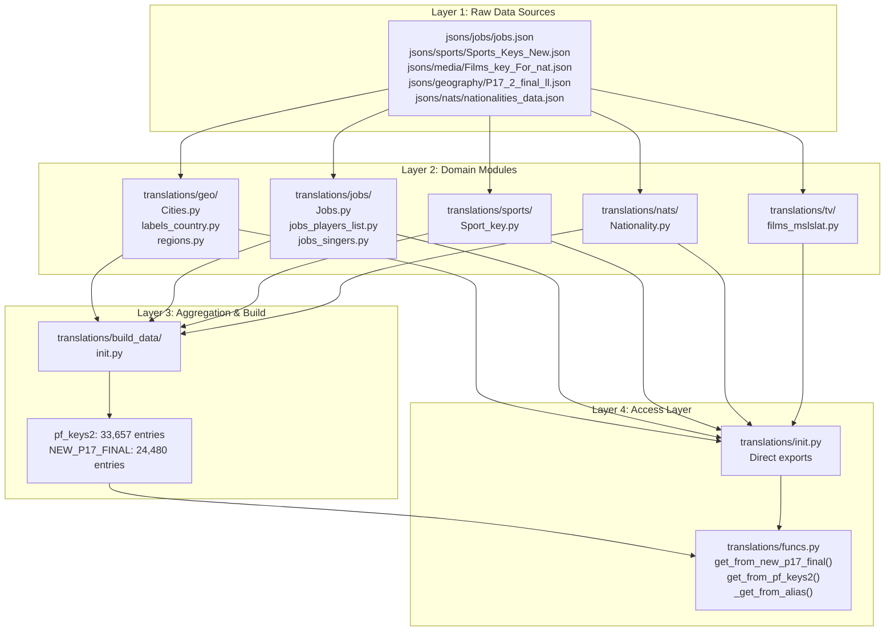
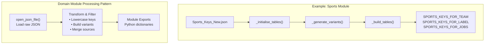
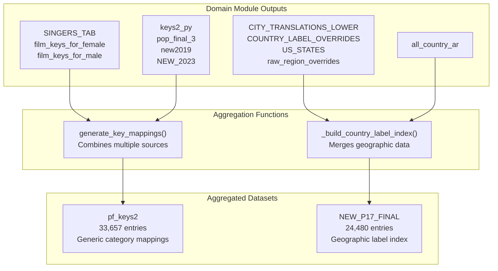
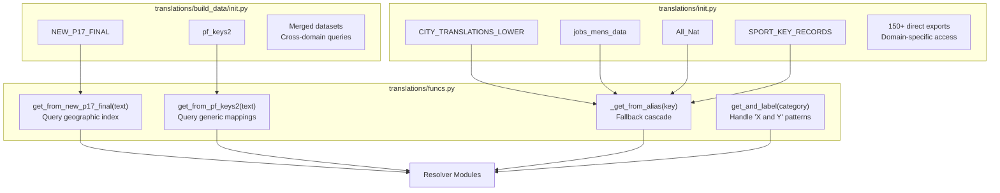
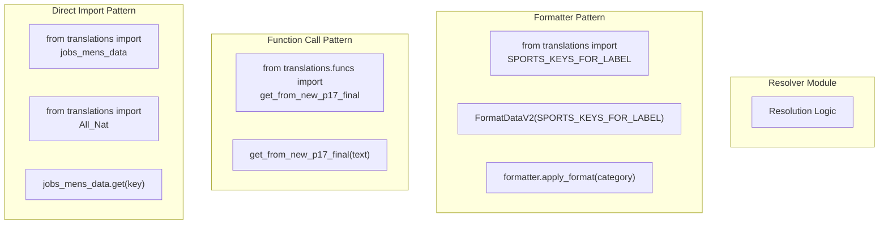
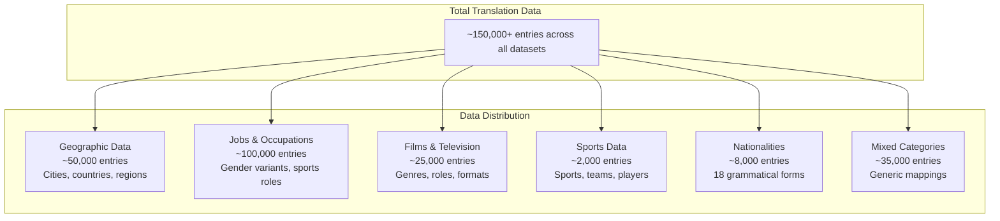

# Data Architecture

> **Relevant source files**
> * [ArWikiCats/jsons/population/pop_All_2018.json](https://github.com/ArWikiCats/ArWikiCats/blob/4095f04e/ArWikiCats/jsons/population/pop_All_2018.json)
> * [ArWikiCats/main_processers/main_resolve.py](https://github.com/ArWikiCats/ArWikiCats/blob/4095f04e/ArWikiCats/main_processers/main_resolve.py)
> * [ArWikiCats/translations/__init__.py](https://github.com/ArWikiCats/ArWikiCats/blob/4095f04e/ArWikiCats/translations/__init__.py)
> * [ArWikiCats/translations/build_data/__init__.py](https://github.com/ArWikiCats/ArWikiCats/blob/4095f04e/ArWikiCats/translations/build_data/__init__.py)
> * [ArWikiCats/translations/funcs.py](https://github.com/ArWikiCats/ArWikiCats/blob/4095f04e/ArWikiCats/translations/funcs.py)
> * [ArWikiCats/translations/geo/__init__.py](https://github.com/ArWikiCats/ArWikiCats/blob/4095f04e/ArWikiCats/translations/geo/__init__.py)
> * [ArWikiCats/translations/geo/labels_country.py](https://github.com/ArWikiCats/ArWikiCats/blob/4095f04e/ArWikiCats/translations/geo/labels_country.py)
> * [ArWikiCats/translations/jobs/Jobs.py](https://github.com/ArWikiCats/ArWikiCats/blob/4095f04e/ArWikiCats/translations/jobs/Jobs.py)
> * [ArWikiCats/translations/jobs/Jobs2.py](https://github.com/ArWikiCats/ArWikiCats/blob/4095f04e/ArWikiCats/translations/jobs/Jobs2.py)
> * [ArWikiCats/translations/jobs/jobs_data_basic.py](https://github.com/ArWikiCats/ArWikiCats/blob/4095f04e/ArWikiCats/translations/jobs/jobs_data_basic.py)
> * [ArWikiCats/translations/jobs/jobs_players_list.py](https://github.com/ArWikiCats/ArWikiCats/blob/4095f04e/ArWikiCats/translations/jobs/jobs_players_list.py)
> * [ArWikiCats/translations/jobs/jobs_singers.py](https://github.com/ArWikiCats/ArWikiCats/blob/4095f04e/ArWikiCats/translations/jobs/jobs_singers.py)
> * [ArWikiCats/translations/jobs/jobs_womens.py](https://github.com/ArWikiCats/ArWikiCats/blob/4095f04e/ArWikiCats/translations/jobs/jobs_womens.py)
> * [ArWikiCats/translations/mixed/all_keys2.py](https://github.com/ArWikiCats/ArWikiCats/blob/4095f04e/ArWikiCats/translations/mixed/all_keys2.py)
> * [ArWikiCats/translations/mixed/female_keys.py](https://github.com/ArWikiCats/ArWikiCats/blob/4095f04e/ArWikiCats/translations/mixed/female_keys.py)
> * [ArWikiCats/translations/mixed/keys2.py](https://github.com/ArWikiCats/ArWikiCats/blob/4095f04e/ArWikiCats/translations/mixed/keys2.py)
> * [ArWikiCats/translations/others/__init__.py](https://github.com/ArWikiCats/ArWikiCats/blob/4095f04e/ArWikiCats/translations/others/__init__.py)
> * [ArWikiCats/translations/others/tax_table.py](https://github.com/ArWikiCats/ArWikiCats/blob/4095f04e/ArWikiCats/translations/others/tax_table.py)
> * [ArWikiCats/translations/sports/Sport_key.py](https://github.com/ArWikiCats/ArWikiCats/blob/4095f04e/ArWikiCats/translations/sports/Sport_key.py)
> * [ArWikiCats/translations/tv/films_mslslat.py](https://github.com/ArWikiCats/ArWikiCats/blob/4095f04e/ArWikiCats/translations/tv/films_mslslat.py)
> * [_work_files/data_len.json](https://github.com/ArWikiCats/ArWikiCats/blob/4095f04e/_work_files/data_len.json)

## Purpose and Scope

This page documents the architectural organization of translation data within ArWikiCats, explaining how raw JSON sources are processed, aggregated, and made accessible to the resolution system. The focus is on structural organization and access patterns rather than the detailed content of specific datasets.

For information about the aggregation pipeline that builds these structures, see [Data Aggregation Pipeline](7.Data-Aggregation-Pipeline.md). For details about specific data domains (geography, jobs, sports, etc.), see sections [4.2](/ArWikiCats/ArWikiCats/4.2-geographic-data) through [4.7](/ArWikiCats/ArWikiCats/4.7-ministers-and-political-roles).

## Layered Data Architecture

The ArWikiCats data architecture consists of four distinct layers that transform raw JSON mappings into structured, queryable translation data:



**Sources:** [ArWikiCats/translations/__init__.py L1-L152](https://github.com/ArWikiCats/ArWikiCats/blob/4095f04e/ArWikiCats/translations/__init__.py#L1-L152)

 [ArWikiCats/translations/build_data/__init__.py L1-L83](https://github.com/ArWikiCats/ArWikiCats/blob/4095f04e/ArWikiCats/translations/build_data/__init__.py#L1-L83)

 [ArWikiCats/translations/funcs.py L1-L159](https://github.com/ArWikiCats/ArWikiCats/blob/4095f04e/ArWikiCats/translations/funcs.py#L1-L159)

### Layer 1: Raw Data Sources

JSON files stored in the `jsons/` directory contain the raw translation mappings. These files are organized by domain:

| Directory | Purpose | Example Files |
| --- | --- | --- |
| `jsons/jobs/` | Occupation translations | `jobs.json`, `Jobs_22.json` |
| `jsons/sports/` | Sports terminology | `Sports_Keys_New.json` |
| `jsons/media/` | Films and TV categories | `Films_key_For_nat.json`, `Films_keys_male_female.json` |
| `jsons/geography/` | Geographic labels | `P17_2_final_ll.json`, `popopo.json` |
| `jsons/cities/` | City name translations | `yy2.json` |
| `jsons/nats/` | Nationality data | `nationalities_data.json` |
| `jsons/population/` | Generic category keys | `pop_All_2018.json` |

**Sources:** [ArWikiCats/translations/tv/films_mslslat.py L118-L121](https://github.com/ArWikiCats/ArWikiCats/blob/4095f04e/ArWikiCats/translations/tv/films_mslslat.py#L118-L121)

 [ArWikiCats/translations/sports/Sport_key.py L34](https://github.com/ArWikiCats/ArWikiCats/blob/4095f04e/ArWikiCats/translations/sports/Sport_key.py#L34-L34)

 [ArWikiCats/translations/geo/labels_country.py L230-L232](https://github.com/ArWikiCats/ArWikiCats/blob/4095f04e/ArWikiCats/translations/geo/labels_country.py#L230-L232)

### Layer 2: Domain-Specific Modules

Domain modules in `translations/{domain}/` load raw JSON and perform transformations:



**Key domain modules:**

* **`translations/geo/`**: Geographic data processing * [Cities.py L1-L50](https://github.com/ArWikiCats/ArWikiCats/blob/4095f04e/Cities.py#L1-L50)  - City name translations (`CITY_TRANSLATIONS_LOWER`: 10,526 entries) * [labels_country.py L1-L275](https://github.com/ArWikiCats/ArWikiCats/blob/4095f04e/labels_country.py#L1-L275)  - Country labels and overrides (`COUNTRY_LABEL_OVERRIDES`: 1,459 entries) * [regions.py](https://github.com/ArWikiCats/ArWikiCats/blob/4095f04e/regions.py)  - Regional translations (`MAIN_REGION_TRANSLATIONS`: 820 entries)
* **`translations/jobs/`**: Occupation data processing * [Jobs.py L1-L211](https://github.com/ArWikiCats/ArWikiCats/blob/4095f04e/Jobs.py#L1-L211)  - Main jobs dataset builder (`jobs_mens_data`: 4,012 entries, `jobs_womens_data`: 2,954 entries) * [jobs_players_list.py L1-L263](https://github.com/ArWikiCats/ArWikiCats/blob/4095f04e/jobs_players_list.py#L1-L263)  - Sports-related jobs (`PLAYERS_TO_MEN_WOMENS_JOBS`: 1,342 entries) * [jobs_singers.py L1-L148](https://github.com/ArWikiCats/ArWikiCats/blob/4095f04e/jobs_singers.py#L1-L148)  - Music and entertainment jobs
* **`translations/sports/`**: Sports terminology * [Sport_key.py L1-L73](https://github.com/ArWikiCats/ArWikiCats/blob/4095f04e/Sport_key.py#L1-L73)  - Sports key records (`SPORT_KEY_RECORDS`: 431 entries)
* **`translations/nats/`**: Nationality data * [Nationality.py](https://github.com/ArWikiCats/ArWikiCats/blob/4095f04e/Nationality.py)  - Nationality lookup tables (`All_Nat`: 400 entries with 18 grammatical variants)
* **`translations/tv/`**: Film and television * [films_mslslat.py L1-L271](https://github.com/ArWikiCats/ArWikiCats/blob/4095f04e/films_mslslat.py#L1-L271)  - Film/TV translations (`Films_key_For_nat`: 13,146 entries)

**Sources:** [ArWikiCats/translations/__init__.py L9-L86](https://github.com/ArWikiCats/ArWikiCats/blob/4095f04e/ArWikiCats/translations/__init__.py#L9-L86)

 [_work_files/data_len.json L1-L135](https://github.com/ArWikiCats/ArWikiCats/blob/4095f04e/_work_files/data_len.json#L1-L135)

### Layer 3: Aggregation and Build

The `translations/build_data/` module aggregates domain-specific data into comprehensive lookup structures:



**Primary aggregated datasets:**

| Dataset | Size | Purpose | Built By |
| --- | --- | --- | --- |
| `pf_keys2` | 33,657 entries | Consolidated generic category mappings | [generate_key_mappings L643-L714](https://github.com/ArWikiCats/ArWikiCats/blob/4095f04e/generate_key_mappings()#L643-L714) |
| `NEW_P17_FINAL` | 24,480 entries | Comprehensive geographic label index | [_build_country_label_index()](https://github.com/ArWikiCats/ArWikiCats/blob/4095f04e/_build_country_label_index()) |

The `generate_key_mappings()` function merges:

* `keys2_py` (1,217 entries) - Core mappings
* `pop_final_3` (1,308 entries) - Population-derived keys
* `SINGERS_TAB` (288 entries) - Music categories
* `film_keys_for_female` (207 entries) - Female film roles
* `ALBUMS_TYPE` (13 entries) - Album types
* Tennis, language, and other specialized mappings

**Sources:** [ArWikiCats/translations/build_data/__init__.py L42-L69](https://github.com/ArWikiCats/ArWikiCats/blob/4095f04e/ArWikiCats/translations/build_data/__init__.py#L42-L69)

 [ArWikiCats/translations/mixed/all_keys2.py L643-L714](https://github.com/ArWikiCats/ArWikiCats/blob/4095f04e/ArWikiCats/translations/mixed/all_keys2.py#L643-L714)

### Layer 4: Access Layer

The access layer provides two mechanisms for retrieving translation data:

**Dual Export Architecture:**



**Access function patterns:**

1. **`get_from_new_p17_final(text)`** - Primary geographic/entity lookup * Searches `ALIASES_CHAIN` dictionaries first * Falls back to `pf_keys2` and `NEW_P17_FINAL` * Returns Arabic label or empty string [ArWikiCats/translations/funcs.py L37-L56](https://github.com/ArWikiCats/ArWikiCats/blob/4095f04e/ArWikiCats/translations/funcs.py#L37-L56)
2. **`get_from_pf_keys2(text)`** - Generic category lookup * Direct dictionary access to `pf_keys2` [ArWikiCats/translations/funcs.py L101-L113](https://github.com/ArWikiCats/ArWikiCats/blob/4095f04e/ArWikiCats/translations/funcs.py#L101-L113)
3. **`_get_from_alias(key)`** - Fallback cascade with LRU cache (10,000 entries) * Searches multiple sources in order: `pf_keys2`, `Jobs_new`, `jobs_mens_data`, `films_mslslat_tab`, `Clubs_key_2`, `pop_final_5` * Falls back to `get_from_new_p17_final()` and `SPORTS_KEYS_FOR_LABEL` [ArWikiCats/translations/funcs.py L116-L150](https://github.com/ArWikiCats/ArWikiCats/blob/4095f04e/ArWikiCats/translations/funcs.py#L116-L150)
4. **`get_and_label(category)`** - Pattern-based resolution for "X and Y" categories * Uses regex `r"^(.*?) and (.*)$"` to split * Resolves each part independently * Combines with Arabic conjunction "و" [ArWikiCats/translations/funcs.py L59-L98](https://github.com/ArWikiCats/ArWikiCats/blob/4095f04e/ArWikiCats/translations/funcs.py#L59-L98)

**Sources:** [ArWikiCats/translations/funcs.py L1-L159](https://github.com/ArWikiCats/ArWikiCats/blob/4095f04e/ArWikiCats/translations/funcs.py#L1-L159)

 [ArWikiCats/translations/__init__.py L1-L152](https://github.com/ArWikiCats/ArWikiCats/blob/4095f04e/ArWikiCats/translations/__init__.py#L1-L152)

 [ArWikiCats/translations/build_data/__init__.py L1-L83](https://github.com/ArWikiCats/ArWikiCats/blob/4095f04e/ArWikiCats/translations/build_data/__init__.py#L1-L83)

## Data Access Patterns in Resolution

Resolvers access translation data through multiple patterns depending on their requirements:



**Pattern 1: Direct Dictionary Access**

Used when resolvers need raw access to specific datasets:

```javascript
from ArWikiCats.translations import jobs_mens_data, All_Nat

# Direct lookup
arabic_label = jobs_mens_data.get("engineers")
nationality_data = All_Nat.get("british")
```

Example: Jobs resolver directly imports `jobs_mens_data` and `jobs_womens_data` for gender-specific job lookups.

**Pattern 2: Function-Based Access**

Used for complex lookups with fallback logic:

```javascript
from ArWikiCats.translations.funcs import get_from_new_p17_final

# Geographic/entity lookup with cascading fallback
label = get_from_new_p17_final("paris")  # Returns "باريس"
```

Example: Country and nationality resolvers use `get_from_new_p17_final()` for geographic entity resolution.

**Pattern 3: Formatter Integration**

Used when resolvers need template-based pattern matching:

```javascript
from ArWikiCats.translations import SPORTS_KEYS_FOR_LABEL
from ArWikiCats.new_resolvers.format_opts import FormatDataV2

# Create formatter with sports data
formatter = FormatDataV2(SPORTS_KEYS_FOR_LABEL, template="{sport} players")

# Apply to category
result = formatter.apply_format("football players")  # Uses football→كرة القدم
```

Example: Sports resolvers create `FormatDataV2` instances with `SPORTS_KEYS_FOR_LABEL` data.

**Sources:** [ArWikiCats/main_processers/main_resolve.py L1-L106](https://github.com/ArWikiCats/ArWikiCats/blob/4095f04e/ArWikiCats/main_processers/main_resolve.py#L1-L106)

 [ArWikiCats/translations/funcs.py L116-L150](https://github.com/ArWikiCats/ArWikiCats/blob/4095f04e/ArWikiCats/translations/funcs.py#L116-L150)

## Data Statistics and Composition

### Major Dataset Sizes

The following table shows the scale of key translation datasets:

| Dataset | Entries | Type | Source Module |
| --- | --- | --- | --- |
| `pf_keys2` | 33,657 | Generic mappings | `build_data` |
| `NEW_P17_FINAL` | 24,480 | Geographic labels | `build_data` |
| `Films_key_CAO` | 13,146 | Film/TV categories | `tv` |
| `films_key_cao2` | 11,178 | Film variations | `tv` |
| `CITY_TRANSLATIONS_LOWER` | 10,526 | City names | `geo` |
| `New_female_keys` | 4,682 | Female-specific | `mixed` |
| `CITY_LABEL_PATCHES` | 4,160 | City overrides | `geo` |
| `jobs_mens_data` | 4,012 | Male occupations | `jobs` |
| `mens_jobs_data` | 3,878 | Male job variants | `jobs` |
| `pop_final6` | 3,184 | Population keys | `mixed` |
| `People_key` | 3,117 | People categories | `mixed` |
| `US_COUNTY_TRANSLATIONS` | 2,998 | US counties | `geo` |
| `jobs_womens_data` | 2,954 | Female occupations | `jobs` |

**Sources:** [_work_files/data_len.json L1-L135](https://github.com/ArWikiCats/ArWikiCats/blob/4095f04e/_work_files/data_len.json#L1-L135)

### Data Distribution by Domain



### Data Composition: pf_keys2 Build

The `pf_keys2` dataset (33,657 entries) is assembled from multiple sources through `generate_key_mappings()`:

| Source | Approx. Entries | Contribution |
| --- | --- | --- |
| `keys2_py` | 1,217 | Core category keys |
| `pop_final_3` | 1,308 | Population-based |
| `SINGERS_TAB` | 288 | Music categories |
| `film_keys_for_female` | 207 | Female film roles |
| `ALBUMS_TYPE` | 13 | Album types |
| `film_keys_for_male` | 38 | Male film roles |
| `TENNIS_KEYS` | 76 | Tennis terms |
| `pop_final6` | 3,184 | Additional population |
| `MEDIA_CATEGORY_TRANSLATIONS` | ~500 | Media terms |
| `language_key_translations` | 597 | Language categories |
| `new2019` | 1,632 | 2019 additions |
| `NEW_2023` | 757 | 2023 additions |
| Generated entries | ~24,000+ | Built from base mappings |

The majority of entries are generated programmatically through helper functions like `build_pf_keys2()`, which combines base labels with modifiers (directions, regions, book types, etc.).

**Sources:** [ArWikiCats/translations/mixed/all_keys2.py L643-L714](https://github.com/ArWikiCats/ArWikiCats/blob/4095f04e/ArWikiCats/translations/mixed/all_keys2.py#L643-L714)

 [ArWikiCats/translations/build_data/__init__.py L42-L56](https://github.com/ArWikiCats/ArWikiCats/blob/4095f04e/ArWikiCats/translations/build_data/__init__.py#L42-L56)

## Specialized Data Structures

### Gendered Job Mappings

Job data uses a specialized structure for gender-specific translations:

```
// Type definition for reference
type GenderedLabel = {
  males: string;
  females: string;
}

type GenderedLabelMap = {
  [jobKey: string]: GenderedLabel;
}
```

Example data structure:

```json
{
  "engineers": {
    "males": "مهندسون",
    "females": "مهندسات"
  },
  "teachers": {
    "males": "معلمون",
    "females": "معلمات"
  }
}
```

This structure is used throughout the jobs domain:

* `jobs_mens_data` - Flattened to male forms only
* `jobs_womens_data` - Flattened to female forms only
* `MEN_WOMENS_JOBS_2`, `PLAYERS_TO_MEN_WOMENS_JOBS` - Full gendered structures

**Sources:** [ArWikiCats/translations/jobs/Jobs.py L181-L183](https://github.com/ArWikiCats/ArWikiCats/blob/4095f04e/ArWikiCats/translations/jobs/Jobs.py#L181-L183)

 [ArWikiCats/translations/data_builders/jobs_defs.py](https://github.com/ArWikiCats/ArWikiCats/blob/4095f04e/ArWikiCats/translations/data_builders/jobs_defs.py)

### Sport Key Records

Sports data uses `SportKeyRecord` with multiple translation variants:

```
// Type definition for reference
type SportKeyRecord = {
  team: string;      // "فريق كرة القدم"
  label: string;     // "كرة القدم"
  jobs: string;      // "كرة قدم" (for job combinations)
  // Additional metadata
}
```

Built by `_build_tables()` which generates three separate dictionaries:

* `SPORTS_KEYS_FOR_TEAM` - Team name patterns
* `SPORTS_KEYS_FOR_LABEL` - General sport labels
* `SPORTS_KEYS_FOR_JOBS` - Job combination forms (e.g., "football players" → "لاعبو كرة قدم")

**Sources:** [ArWikiCats/translations/sports/Sport_key.py L42-L50](https://github.com/ArWikiCats/ArWikiCats/blob/4095f04e/ArWikiCats/translations/sports/Sport_key.py#L42-L50)

 [ArWikiCats/translations/data_builders/build_sport_keys.py](https://github.com/ArWikiCats/ArWikiCats/blob/4095f04e/ArWikiCats/translations/data_builders/build_sport_keys.py)

### Nationality Lookup Tables

Nationality data provides 18 different grammatical forms per nationality:

```css
# Example structure for "British"
All_Nat["british"] = {
  "en": "British",
  "ar": "بريطاني",
  # Forms: definite/indefinite × singular/plural × male/female
  "male_singular": "بريطاني",
  "female_singular": "بريطانية",
  "male_plural": "بريطانيون",
  "female_plural": "بريطانيات",
  # ... 14 more forms
}
```

Exported as separate dictionaries for each form:

* `All_Nat` - Complete entries with all forms
* `Nat_men`, `Nat_mens` - Male forms
* `Nat_women`, `Nat_Womens` - Female forms
* `Nat_the_male`, `Nat_the_female` - Definite forms
* `ar_Nat_men` - Arabic-keyed male forms

**Sources:** [ArWikiCats/translations/nats/Nationality.py](https://github.com/ArWikiCats/ArWikiCats/blob/4095f04e/ArWikiCats/translations/nats/Nationality.py)

 [ArWikiCats/translations/__init__.py L42-L61](https://github.com/ArWikiCats/ArWikiCats/blob/4095f04e/ArWikiCats/translations/__init__.py#L42-L61)

## Data Caching and Performance

### LRU Caching Strategy

Translation access functions use `functools.lru_cache` for performance optimization:

| Function | Cache Size | Purpose |
| --- | --- | --- |
| `_get_from_alias()` | 10,000 | Alias resolution cascade |
| `get_and_label()` | 10,000 | "X and Y" pattern resolution |

The main resolution function uses a much larger cache:

* `resolve_label()` - 50,000 entries (caches complete resolution results)

**Sources:** [ArWikiCats/translations/funcs.py L59-L98](https://github.com/ArWikiCats/ArWikiCats/blob/4095f04e/ArWikiCats/translations/funcs.py#L59-L98)

 [ArWikiCats/translations/funcs.py L116-L150](https://github.com/ArWikiCats/ArWikiCats/blob/4095f04e/ArWikiCats/translations/funcs.py#L116-L150)

 [ArWikiCats/main_processers/main_resolve.py L32](https://github.com/ArWikiCats/ArWikiCats/blob/4095f04e/ArWikiCats/main_processers/main_resolve.py#L32-L32)

### Access Pattern Optimization

The `_get_from_alias()` function implements a prioritized fallback cascade to minimize lookup time:

1. Check `pf_keys2` (largest generic dataset) - O(1)
2. Check `Jobs_new` (job-specific) - O(1)
3. Check `jobs_mens_data` - O(1)
4. Check `films_mslslat_tab` - O(1)
5. Check `Clubs_key_2` - O(1)
6. Check `pop_final_5` - O(1)
7. Fall back to `get_from_new_p17_final()` (geographic index)
8. Final check in `SPORTS_KEYS_FOR_LABEL`

This cascade ensures the most commonly accessed datasets are checked first, with specialized lookups deferred until necessary.

**Sources:** [ArWikiCats/translations/funcs.py L116-L150](https://github.com/ArWikiCats/ArWikiCats/blob/4095f04e/ArWikiCats/translations/funcs.py#L116-L150)