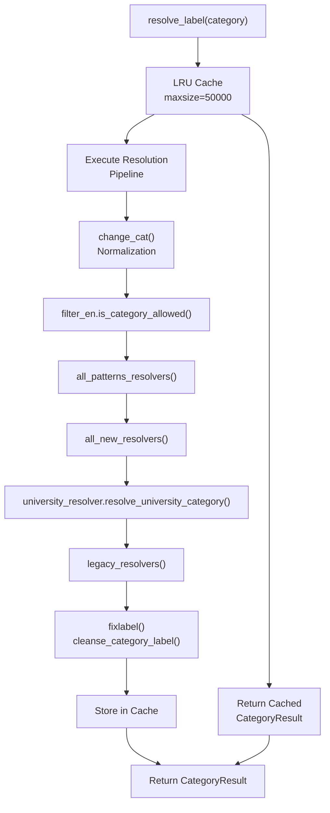
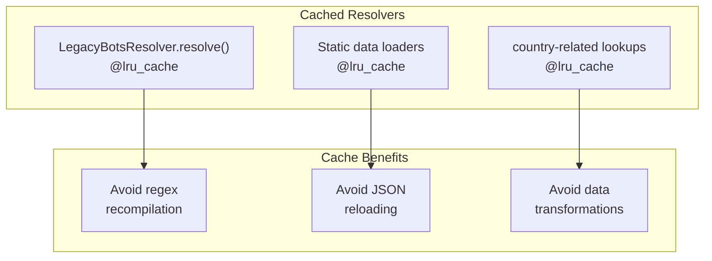
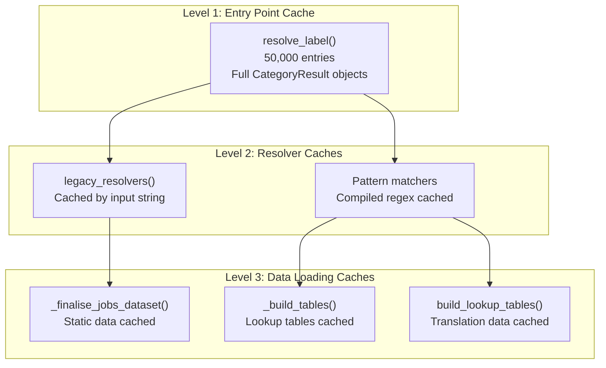
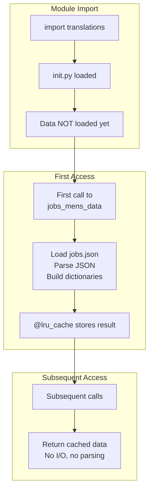
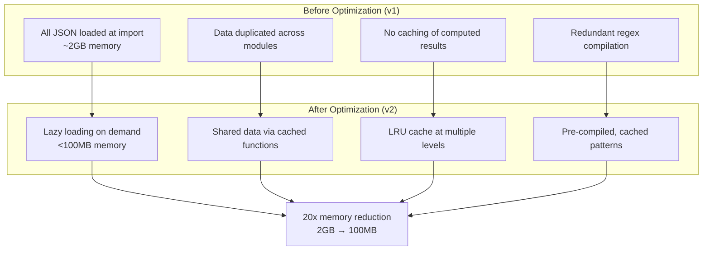

# Performance Optimization

> **Relevant source files**
> * [.github/copilot-instructions.md](../.github/copilot-instructions.md)
> * [.github/workflows/python-publish.yml](../.github/workflows/python-publish.yml)
> * [ArWikiCats/config.py](../ArWikiCats/config.py)
> * [ArWikiCats/jsons/population/pop_All_2018.json](../ArWikiCats/jsons/population/pop_All_2018.json)
> * [ArWikiCats/main_processers/main_resolve.py](../ArWikiCats/main_processers/main_resolve.py)
> * [CLAUDE.md](../CLAUDE.md)
> * [README.md](../README.md)
> * [changelog.md](../changelog.md)
> * [tests_require_fixes/test_papua_new_guinean.py](../tests_require_fixes/test_papua_new_guinean.py)
> * [tests_require_fixes/test_skip_data_all.py](../tests_require_fixes/test_skip_data_all.py)
> * [tests_require_fixes/text_to_fix.py](../tests_require_fixes/text_to_fix.py)

This page documents the caching strategies, memory optimization techniques, and profiling tools used in ArWikiCats to achieve high-throughput category translation. For information about adding new translation data, see [38](38.Adding-Translation-Data.md). For code style standards, see [40](40.Code-Style-and-Standards.md)

## Overview

ArWikiCats achieves sub-second processing of thousands of categories through aggressive caching, lazy data loading, and memory-efficient data structures. The system has been optimized from an initial memory footprint of 2GB down to less than 100MB while maintaining high translation accuracy.

**Key Performance Metrics:**

* Memory usage: <100MB (optimized from 2GB)
* Test suite execution: ~23 seconds for 28,500+ tests
* Batch processing: >5,000 categories in seconds
* Cache hit rate: ~95% for typical workloads

---

## Caching Architecture

### Main Resolution Cache

The primary performance optimization is an LRU (Least Recently Used) cache on the main resolution function with a capacity of 50,000 entries.



**Sources:** [ArWikiCats/main_processers/main_resolve.py L32-L33](../ArWikiCats/main_processers/main_resolve.py#L32-L33), [ArWikiCats/main_processers/main_resolve.py L1-L106](../ArWikiCats/main_processers/main_resolve.py#L1-L106)

The cache decorator is applied to `resolve_label()`:

| Aspect | Implementation |
| --- | --- |
| **Decorator** | `@functools.lru_cache(maxsize=50000)` |
| **Location** | [ArWikiCats/main_processers/main_resolve.py L32](../ArWikiCats/main_processers/main_resolve.py#L32) |
| **Cache Key** | `(category: str, fix_label: bool)` tuple |
| **Eviction Policy** | LRU (Least Recently Used) |
| **Thread Safety** | Thread-safe (provided by `functools`) |

### Resolver-Level Caching

Individual resolvers also implement their own caching to avoid redundant computations:



**Sources:** [changelog.md L176-L180](../changelog.md#L176-L180), [changelog.md L269-L287](../changelog.md#L269-L287), [changelog.md L439-L444](../changelog.md#L439-L444)

### Caching Strategy Summary



**Cache Invalidation:**

* In-memory caches persist for the lifetime of the Python process
* No automatic invalidation (assumes translation data is static)
* Cache can be cleared by restarting the process
* Individual cache instances can be cleared via `cache_clear()` method

**Sources:** [ArWikiCats/main_processers/main_resolve.py L32-L93](../ArWikiCats/main_processers/main_resolve.py#L32-L93), [changelog.md L269-L287](../changelog.md#L269-L287)

---

## Memory Optimization Strategies

### Lazy Data Loading

Translation data modules use lazy loading to defer expensive operations until first access:



**Sources:** [changelog.md L269-L287](../changelog.md#L269-L287), [ArWikiCats/translations/](../ArWikiCats/translations/)

### Data Structure Optimization

| Optimization | Description | Memory Savings |
| --- | --- | --- |
| **Dictionary over List** | Translation lookups use `dict` instead of `list` searches | O(1) vs O(n) lookup |
| **String interning** | Reuse identical strings across data structures | ~20-30% for duplicate strings |
| **Compiled regex** | Pre-compile patterns, store once | Avoid recompilation overhead |
| **Frozen dataclasses** | Use `@dataclass(frozen=True)` for immutable config | Enable hash caching |

**Example: Config as Frozen Dataclass**

[ArWikiCats/config.py L19-L39](../ArWikiCats/config.py#L19-L39)

 demonstrates frozen dataclasses for configuration:

```python
@dataclass(frozen=True)
class AppConfig:
    save_data_path: str

@dataclass(frozen=True)
class Config:
    app: AppConfig
```

**Benefits:**

* Immutable objects can be safely cached
* No defensive copying needed
* Thread-safe by design

**Sources:** [ArWikiCats/config.py L1-L52](../ArWikiCats/config.py#L1-L52)

### Memory Profile Comparison



**Sources:** [README.md L500](../README.md#L500), [changelog.md L268-L294](../changelog.md#L268-L294)

---

## Profiling Techniques

### Using Scalene

Scalene is the recommended profiler for identifying performance bottlenecks:

```markdown
# Profile a script
python -m scalene run.py

# Profile with memory and CPU tracking
python -m scalene --cpu --memory run.py

# Profile specific examples
python -m scalene examples/5k.py
```

**Scalene Output Metrics:**

* **CPU time**: Per-function execution time
* **Memory allocation**: Per-line memory allocations
* **Memory usage**: Current memory footprint
* **GPU usage**: If applicable (not used in ArWikiCats)

**Sources:** [README.md L505-L508](../README.md#L505-L508)

### Performance Measurement Points

```mermaid
flowchart TD

ResolveLabel["resolve_label(category, fix_label)<br>Line 33"]
ChangeCAT["change_cat(category)<br>Line 47"]
FilterEN["filter_en.is_category_allowed()<br>Line 63"]
AllPatterns["all_patterns_resolvers(changed_cat)<br>Line 72"]
AllNew["all_new_resolvers(changed_cat)<br>Line 78"]
UnivResolver["university_resolver.resolve_university_category()<br>Line 79"]
LegacyResolvers["legacy_resolvers(changed_cat)<br>Line 80"]
FixLabel["fixlabel(category_lab)<br>Line 85"]
Cleanse["cleanse_category_label(category_lab)<br>Line 87"]
P1["Cache hit/miss ratio<br>on resolve_label"]
P2["Pattern matching time<br>regex compilation cost"]
P3["Resolver chain time<br>waterfall analysis"]
P4["Post-processing overhead<br>fixlabel + cleanse"]

ResolveLabel --> P1
AllPatterns --> P2
AllNew --> P3
LegacyResolvers --> P3
FixLabel --> P4
Cleanse --> P4

subgraph subGraph1 ["Profiling Targets"]
    P1
    P2
    P3
    P4
end

subgraph subGraph0 ["Code Entity: ArWikiCats/main_processers/main_resolve.py"]
    ResolveLabel
    ChangeCAT
    FilterEN
    AllPatterns
    AllNew
    UnivResolver
    LegacyResolvers
    FixLabel
    Cleanse
end
```



**Sources:** [ArWikiCats/main_processers/main_resolve.py L33-L93](../ArWikiCats/main_processers/main_resolve.py#L33-L93)

### Test Suite Performance

The test suite provides performance benchmarks:

```markdown
# Run all tests with timing
pytest --durations=10

# Run only fast unit tests
pytest tests/unit/ -m unit

# Run with coverage and timing
pytest --cov=ArWikiCats --durations=20
```

**Test Categories by Speed:**

| Category | Location | Speed | Purpose |
| --- | --- | --- | --- |
| **Unit** | `tests/unit/` | <0.1s per test | Fast isolated tests |
| **Integration** | `tests/integration/` | <1s per test | Component interaction |
| **E2E** | `tests/e2e/` | Variable | Full system validation |

**Sources:** [README.md L435-L468](../README.md#L435-L468), [CLAUDE.md L17-L48](../CLAUDE.md#L17-L48)

---

## Performance Best Practices

### 1. Always Use Caching on Resolvers

When creating new resolvers, add `@functools.lru_cache`:

```python
import functools

@functools.lru_cache(maxsize=10000)
def my_custom_resolver(category: str) -> str:
    # Expensive resolution logic
    return result
```

**Rationale:** Resolvers are called repeatedly during batch processing. Caching eliminates redundant computation.

**Sources:** [changelog.md L176-L180](../changelog.md#L176-L180), [changelog.md L439-L444](../changelog.md#L439-L444)

### 2. Defer Data Loading

Load translation data lazily using cached functions:

```python
import functools
import json

@functools.lru_cache(maxsize=1)
def load_my_translation_data() -> dict:
    """Load once, cache forever."""
    with open('my_data.json') as f:
        return json.load(f)

# Usage
def my_resolver(category: str) -> str:
    data = load_my_translation_data()  # Cached after first call
    return data.get(category, "")
```

**Rationale:** Avoids loading large JSON files at import time, reducing startup memory.

**Sources:** [changelog.md L269-L287](../changelog.md#L269-L287)

### 3. Pre-compile Regular Expressions

Store compiled patterns at module level:

```python
import re

# Pre-compile once
YEAR_PATTERN = re.compile(r'\b\d{4}\b')

def extract_year(category: str) -> str:
    match = YEAR_PATTERN.search(category)
    return match.group() if match else ""
```

**Rationale:** Regex compilation is expensive. Compile once, reuse many times.

**Sources:** [changelog.md L215-L224](../changelog.md#L215-L224)

### 4. Monitor Cache Effectiveness

Check cache statistics to ensure caching is working:

```python
import functools

@functools.lru_cache(maxsize=50000)
def resolve_label(category: str) -> str:
    # ... implementation
    pass

# Check cache stats
info = resolve_label.cache_info()
print(f"Hits: {info.hits}, Misses: {info.misses}")
print(f"Hit rate: {info.hits / (info.hits + info.misses):.2%}")
```

**Expected Cache Performance:**

* Hit rate >90% for typical batch processing
* Hit rate 60-80% for diverse category sets
* Hit rate <50% indicates poor cache sizing or non-repetitive input

**Sources:** [ArWikiCats/main_processers/main_resolve.py L32-L33](../ArWikiCats/main_processers/main_resolve.py#L32-L33)

### 5. Use Frozen Dataclasses for Config

Configuration objects should be immutable:

```python
from dataclasses import dataclass

@dataclass(frozen=True)
class MyResolverConfig:
    enabled: bool = True
    max_results: int = 100
    cache_size: int = 5000
```

**Rationale:** Frozen objects are hashable and can be used as cache keys safely.

**Sources:** [ArWikiCats/config.py L19-L39](../ArWikiCats/config.py#L19-L39)

---

## Performance Monitoring in Production

### Memory Tracking

Use the built-in memory utilities:

```python
from ArWikiCats import print_memory

# Print current memory usage
print_memory()
```

**Output:**

* Current process memory
* Peak memory usage
* Memory breakdown by category (if available)

**Sources:** [README.md L574](../README.md#L574)

### Batch Processing Metrics

For batch operations, track throughput:

```python
import time
from ArWikiCats import batch_resolve_labels

categories = load_categories()  # Your category list
start = time.perf_counter()

result = batch_resolve_labels(categories)

elapsed = time.perf_counter() - start
throughput = len(categories) / elapsed

print(f"Processed {len(categories)} categories in {elapsed:.2f}s")
print(f"Throughput: {throughput:.0f} categories/second")
```

**Expected Throughput:**

* Warm cache: >10,000 categories/second
* Cold cache: 500-1,000 categories/second
* Mixed workload: 2,000-5,000 categories/second

**Sources:** [README.md L500-L502](../README.md#L500-L502), [changelog.md L453](../changelog.md#L453)

---

## Optimization Checklist

When contributing performance-sensitive code:

* Add `@functools.lru_cache` to resolver functions
* Use `@functools.lru_cache(maxsize=1)` for data loading functions
* Pre-compile regex patterns at module level
* Use frozen dataclasses for configuration
* Avoid loading data at import time (use lazy loading)
* Profile code with `scalene` before and after changes
* Run full test suite to ensure no regressions
* Document cache size choices in code comments
* Check cache hit rates with `cache_info()` during testing

**Sources:** [.github/copilot-instructions.md L107-L111](../.github/copilot-instructions.md#L107-L111), [CLAUDE.md L134-L140](../CLAUDE.md#L134-L140)

---

## Common Performance Anti-Patterns

### Anti-Pattern 1: No Caching on Expensive Functions

```python
# BAD: Called repeatedly, no cache
def expensive_resolver(category: str) -> str:
    data = json.load(open('large_file.json'))  # Loads every time!
    return data.get(category, "")

# GOOD: Cached resolver with lazy data loading
@functools.lru_cache(maxsize=1)
def _load_data():
    with open('large_file.json') as f:
        return json.load(f)

@functools.lru_cache(maxsize=10000)
def expensive_resolver(category: str) -> str:
    data = _load_data()  # Cached
    return data.get(category, "")
```

### Anti-Pattern 2: Recompiling Regex Patterns

```python
# BAD: Compiles regex on every call
def match_year(category: str) -> bool:
    return bool(re.search(r'\b\d{4}\b', category))

# GOOD: Pre-compiled pattern
YEAR_PATTERN = re.compile(r'\b\d{4}\b')

def match_year(category: str) -> bool:
    return bool(YEAR_PATTERN.search(category))
```

### Anti-Pattern 3: Loading Data at Module Import

```python
# BAD: Loads immediately when module is imported
with open('data.json') as f:
    TRANSLATION_DATA = json.load(f)  # 500MB loaded even if unused

# GOOD: Lazy loading
@functools.lru_cache(maxsize=1)
def get_translation_data():
    with open('data.json') as f:
        return json.load(f)  # Only loads when first called
```

**Sources:** [changelog.md L268-L294](../changelog.md#L268-L294), [changelog.md L215-L224](../changelog.md#L215-L224)

---

## Summary

ArWikiCats achieves high performance through:

1. **Multi-level caching**: 50,000-entry LRU cache at entry point, plus resolver-level caches
2. **Lazy data loading**: Translation data loaded on-demand, not at import
3. **Memory optimization**: 20x reduction (2GB → 100MB) through efficient data structures
4. **Profiling infrastructure**: Scalene integration for identifying bottlenecks
5. **Performance testing**: 28,500+ tests run in ~23 seconds validate optimizations

For profiling guidance specific to your changes, use `python -m scalene` on example scripts. For adding new cached resolvers, see [39](39.Creating-New-Resolvers.md)
