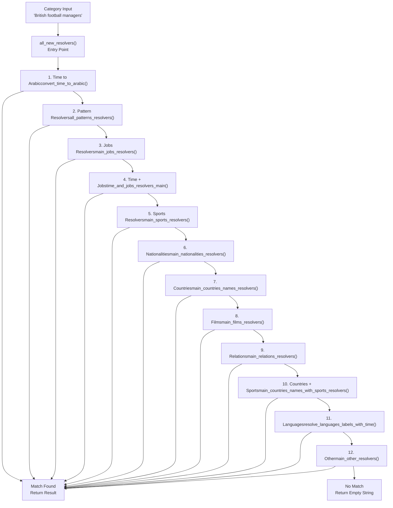
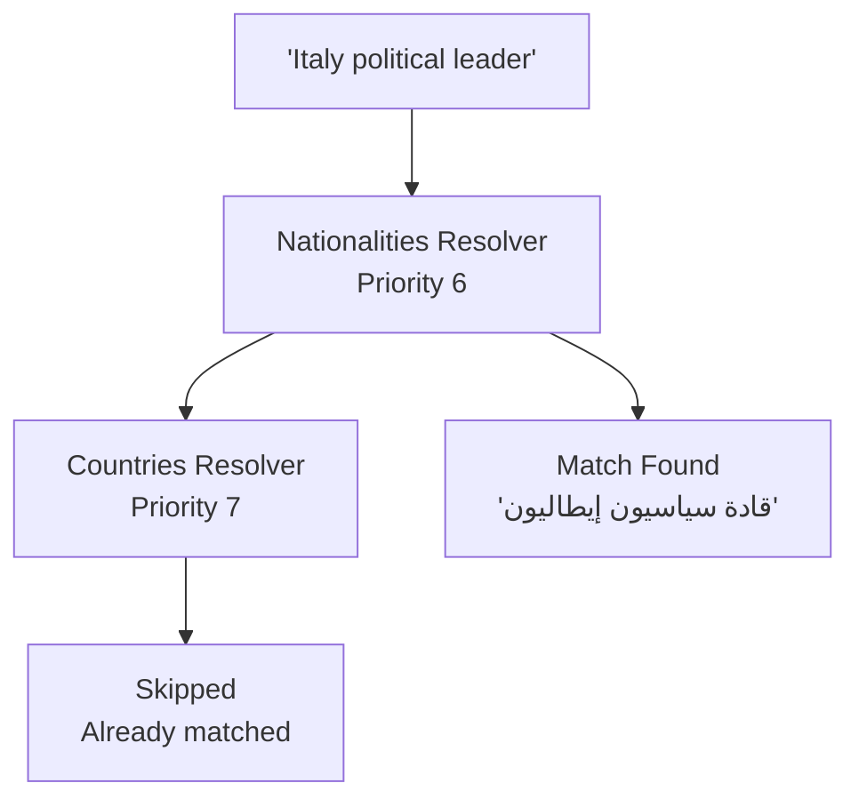
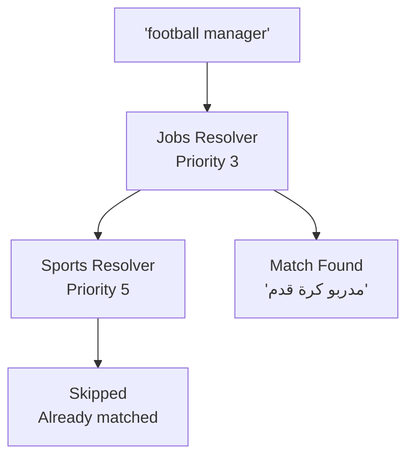
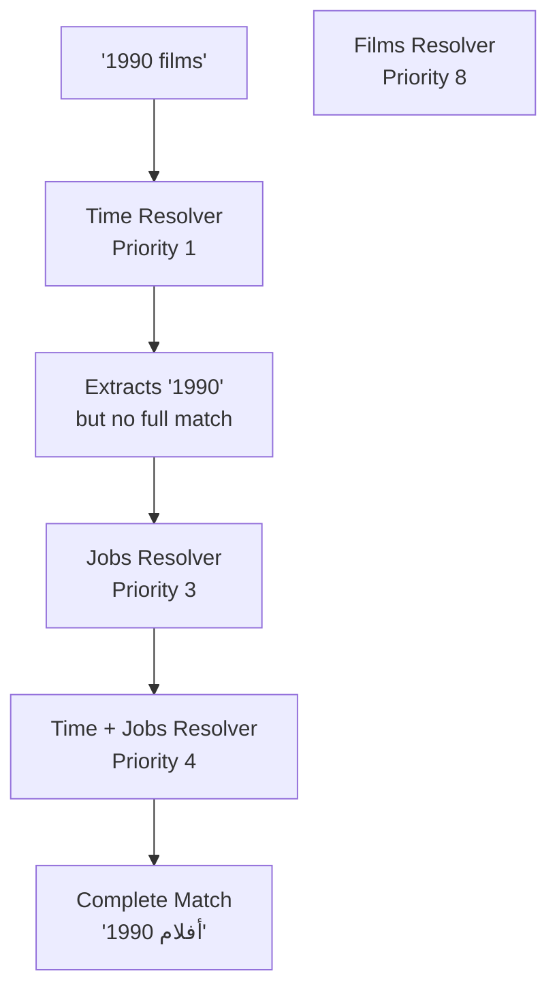
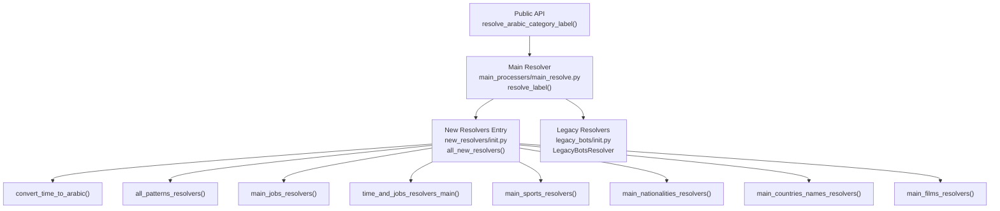

# Resolver Chain Priority System

> **Relevant source files**
> * [.github/copilot-instructions.md](../.github/copilot-instructions.md)
> * [.github/workflows/python-publish.yml](../.github/workflows/python-publish.yml)
> * [ArWikiCats/config.py](../ArWikiCats/config.py)
> * [ArWikiCats/new_resolvers/__init__.py](../ArWikiCats/new_resolvers/__init__.py)
> * [ArWikiCats/new_resolvers/countries_names_resolvers/__init__.py](../ArWikiCats/new_resolvers/countries_names_resolvers/__init__.py)
> * [ArWikiCats/new_resolvers/countries_names_with_sports/__init__.py](../ArWikiCats/new_resolvers/countries_names_with_sports/__init__.py)
> * [ArWikiCats/new_resolvers/countries_names_with_sports/p17_bot_sport.py](../ArWikiCats/new_resolvers/countries_names_with_sports/p17_bot_sport.py)
> * [ArWikiCats/new_resolvers/countries_names_with_sports/p17_sport_to_move_under.py](../ArWikiCats/new_resolvers/countries_names_with_sports/p17_sport_to_move_under.py)
> * [ArWikiCats/new_resolvers/films_resolvers/__init__.py](../ArWikiCats/new_resolvers/films_resolvers/__init__.py)
> * [ArWikiCats/new_resolvers/films_resolvers/resolve_films_labels.py](../ArWikiCats/new_resolvers/films_resolvers/resolve_films_labels.py)
> * [ArWikiCats/new_resolvers/jobs_resolvers/__init__.py](../ArWikiCats/new_resolvers/jobs_resolvers/__init__.py)
> * [ArWikiCats/new_resolvers/jobs_resolvers/relegin_jobs_new.py](../ArWikiCats/new_resolvers/jobs_resolvers/relegin_jobs_new.py)
> * [ArWikiCats/new_resolvers/nationalities_resolvers/__init__.py](../ArWikiCats/new_resolvers/nationalities_resolvers/__init__.py)
> * [ArWikiCats/new_resolvers/sports_resolvers/__init__.py](../ArWikiCats/new_resolvers/sports_resolvers/__init__.py)
> * [ArWikiCats/new_resolvers/sports_resolvers/countries_names_and_sports.py](../ArWikiCats/new_resolvers/sports_resolvers/countries_names_and_sports.py)
> * [ArWikiCats/new_resolvers/sports_resolvers/nationalities_and_sports.py](../ArWikiCats/new_resolvers/sports_resolvers/nationalities_and_sports.py)
> * [ArWikiCats/new_resolvers/sports_resolvers/pre_defined.py](../ArWikiCats/new_resolvers/sports_resolvers/pre_defined.py)
> * [ArWikiCats/new_resolvers/sports_resolvers/raw_sports.py](../ArWikiCats/new_resolvers/sports_resolvers/raw_sports.py)
> * [ArWikiCats/new_resolvers/sports_resolvers/raw_sports_with_suffixes.py](../ArWikiCats/new_resolvers/sports_resolvers/raw_sports_with_suffixes.py)
> * [ArWikiCats/new_resolvers/sports_resolvers/sport_lab_nat.py](../ArWikiCats/new_resolvers/sports_resolvers/sport_lab_nat.py)
> * [ArWikiCats/new_resolvers/teams_mappings_ends.py](../ArWikiCats/new_resolvers/teams_mappings_ends.py)
> * [CLAUDE.md](../CLAUDE.md)
> * [README.md](../README.md)
> * [changelog.md](../changelog.md)
> * [tests_require_fixes/test_papua_new_guinean.py](../tests_require_fixes/test_papua_new_guinean.py)
> * [tests_require_fixes/test_skip_data_all.py](../tests_require_fixes/test_skip_data_all.py)
> * [tests_require_fixes/text_to_fix.py](../tests_require_fixes/text_to_fix.py)

## Purpose and Scope

This document explains the resolver chain priority system used in ArWikiCats to translate English Wikipedia category names to Arabic. The system processes categories through a sequence of specialized resolvers in a carefully ordered priority chain, where the ordering is critical for correctness and conflict prevention.

For information about individual resolver implementations, see:

* Jobs resolvers: [5.4](18.Job-Resolvers.md)
* Sports resolvers: [5.5](19.Sports-Resolvers.md)
* Nationality resolvers: [5.2](16.Nationality-Resolvers.md)
* Country resolvers: [5.3](17.Country-Name-Resolvers.md)

For the overall resolution pipeline architecture, see [3.1](3.Resolution-Pipeline.md).

---

## Why Resolver Priority Matters

The resolver chain uses a **first-match-wins** strategy where each resolver attempts to translate a category in sequence until one returns a non-empty result. The order of resolvers is critical because:

1. **Linguistic Ambiguity**: Category terms can have multiple interpretations (e.g., "Italy political leader" could be nationality-based or country-based)
2. **Overlapping Domains**: Job titles often overlap with sports terms (e.g., "football manager" could be a sports management role or a job title about football)
3. **Semantic Conflicts**: Nationality adjectives can be misinterpreted as country names (e.g., "Italian" as nationality vs. "Italy" as country)

Incorrect ordering leads to semantically incorrect translations that fundamentally change a category's meaning.

**Sources:**

* [ArWikiCats/new_resolvers/__init__.py L36-L98](../ArWikiCats/new_resolvers/__init__.py#L36-L98)
* [changelog.md L428-L448](../changelog.md#L428-L448)

---

## The Resolver Chain

The resolver chain is defined in `_RESOLVER_CHAIN` as a list of tuples containing resolver name, function, and priority notes. The complete chain with rationale:

| Priority | Resolver Name | Function | Rationale |
| --- | --- | --- | --- |
| 1 | Time to Arabic | `convert_time_to_arabic` | Highest priority - handles year/century/millennium patterns that must be resolved first |
| 2 | Pattern-based resolvers | `all_patterns_resolvers` | Regex patterns for complex category structures |
| 3 | Jobs resolvers | `main_jobs_resolvers` | **Must be before sports** to avoid mis-resolving job titles as sports |
| 4 | Time + Jobs resolvers | `time_and_jobs_resolvers_main` | Combined time period and job titles |
| 5 | Sports resolvers | `main_sports_resolvers` | Sports-specific category patterns |
| 6 | Nationalities resolvers | `main_nationalities_resolvers` | **Must be before countries** to avoid conflicts (e.g., 'Italy political leader') |
| 7 | Countries names resolvers | `main_countries_names_resolvers` | Country name patterns |
| 8 | Films resolvers | `main_films_resolvers` | Film and television categories |
| 9 | Relations resolvers | `main_relations_resolvers` | Complex relational categories (e.g., dual nationalities) |
| 10 | Countries with sports | `main_countries_names_with_sports_resolvers` | Combined country and sport patterns |
| 11 | Languages resolvers | `resolve_languages_labels_with_time` | Language-related categories with time periods |
| 12 | Other resolvers | `main_other_resolvers` | Catch-all for remaining patterns |

**Sources:**

* [ArWikiCats/new_resolvers/__init__.py L37-L98](../ArWikiCats/new_resolvers/__init__.py#L37-L98)

---

## Resolution Flow Architecture

### Category Processing Flow



**Sources:**

* [ArWikiCats/new_resolvers/__init__.py L101-L124](../ArWikiCats/new_resolvers/__init__.py#L101-L124)

---

## Conflict Prevention Examples

### Example 1: Nationality vs. Country Conflict

**Problem:** "Italy political leader" could be interpreted as:

* ❌ Country-based: "قادة إيطاليا السياسيون" (political leaders of Italy - wrong)
* ✓ Nationality-based: "قادة سياسيون إيطاليون" (Italian political leaders - correct)

**Solution:** Nationalities resolver (Priority 6) runs before Countries resolver (Priority 7)



**Sources:**

* [ArWikiCats/new_resolvers/__init__.py L64-L67](../ArWikiCats/new_resolvers/__init__.py#L64-L67)
* [ArWikiCats/new_resolvers/countries_names_resolvers/__init__.py L38-L43](../ArWikiCats/new_resolvers/countries_names_resolvers/__init__.py#L38-L43)

### Example 2: Job Title vs. Sports Term Conflict

**Problem:** "football manager" could be interpreted as:

* ❌ Sports-based: "مديرو كرة القدم" (football directors - wrong)
* ✓ Job-based: "مدربو كرة قدم" (football coaches/managers - correct)

**Solution:** Jobs resolver (Priority 3) runs before Sports resolver (Priority 5)



**Sources:**

* [ArWikiCats/new_resolvers/__init__.py L49-L52](../ArWikiCats/new_resolvers/__init__.py#L49-L52)
* [changelog.md L428-L432](../changelog.md#L428-L432)

### Example 3: Temporal + Occupational Categories

**Problem:** "1990 films" could be incorrectly split if handled by separate resolvers

**Solution:** Time+Jobs resolver (Priority 4) handles compound temporal+occupational categories as a unit



**Sources:**

* [ArWikiCats/new_resolvers/__init__.py L54-L57](../ArWikiCats/new_resolvers/__init__.py#L54-L57)

---

## Conflict Prevention Matrix

The following table shows which resolver pairs require specific ordering to prevent conflicts:

| Higher Priority | Lower Priority | Conflict Example | Consequence of Wrong Order |
| --- | --- | --- | --- |
| Jobs | Sports | "football manager" | Would match as sports management instead of job title |
| Nationalities | Countries | "Italy political leader" | Would match as country-based instead of nationality adjective |
| Time + Jobs | Jobs alone | "1990 films" | Would split temporal and occupational components incorrectly |
| Pattern-based | Domain-specific | Complex regex patterns | Domain-specific resolvers would miss compound patterns |

**Sources:**

* [ArWikiCats/new_resolvers/__init__.py L49-L67](../ArWikiCats/new_resolvers/__init__.py#L49-L67)
* [changelog.md L428-L448](../changelog.md#L428-L448)

---

## Implementation Details

### The Resolver Loop

The `all_new_resolvers()` function implements the priority chain using a simple loop:

```javascript
for name, resolver, _ in _RESOLVER_CHAIN:
    result = resolver(category)
    if result:
        logger.info(f"<<purple>> : {category} => {result} via {name}")
        return result
```

Key characteristics:

* **Cached**: Function decorated with `@functools.lru_cache(maxsize=50000)` for performance
* **Short-circuit evaluation**: Returns immediately on first non-empty result
* **Debug logging**: Records which resolver matched for troubleshooting

**Sources:**

* [ArWikiCats/new_resolvers/__init__.py L101-L124](../ArWikiCats/new_resolvers/__init__.py#L101-L124)

### Type Definitions

```yaml
# Type alias for resolver functions
ResolverFn = Callable[[str], str]

# Resolver chain structure
_RESOLVER_CHAIN: list[tuple[str, ResolverFn, str]]
```

Each resolver must:

* Accept a single `str` parameter (normalized category)
* Return a `str` (Arabic translation or empty string)
* Be cacheable (deterministic, no side effects)

**Sources:**

* [ArWikiCats/new_resolvers/__init__.py L32-L98](../ArWikiCats/new_resolvers/__init__.py#L32-L98)

---

## Resolver Chain Invocation

### Call Graph



**Sources:**

* [ArWikiCats/new_resolvers/__init__.py L1-L125](../ArWikiCats/new_resolvers/__init__.py#L1-L125)
* [ArWikiCats/__init__.py](../ArWikiCats/__init__.py)

---

## Adding New Resolvers to the Chain

### Guidelines for Placement

When adding a new resolver to the chain, consider:

1. **Domain Overlap**: Does your resolver's domain overlap with existing resolvers? * If YES: Place it to avoid conflicts (see conflict matrix above) * If NO: Place it near other catch-all resolvers
2. **Specificity**: More specific patterns should come before more general ones * Example: "Time + Jobs" before "Jobs alone"
3. **Linguistic Priority**: Adjectival forms before nominal forms * Example: Nationalities (adjectives) before Countries (nouns)

### Steps to Add a Resolver

1. **Implement the resolver function** in appropriate subdirectory: ``` ArWikiCats/new_resolvers/your_domain/ ```
2. **Add to the resolver chain** in [ArWikiCats/new_resolvers/__init__.py](../ArWikiCats/new_resolvers/__init__.py) : ```yaml _RESOLVER_CHAIN: list[tuple[str, ResolverFn, str]] = [     # ... existing resolvers ...     (         "Your Resolver Name",         your_resolver_function,         "Explanation of why it's placed here",     ),     # ... remaining resolvers ... ] ```
3. **Test for conflicts** with existing resolvers: * Run full test suite: `pytest` * Add specific conflict tests if overlap exists
4. **Document the priority decision** in the rationale field

**Sources:**

* [ArWikiCats/new_resolvers/__init__.py L36-L98](../ArWikiCats/new_resolvers/__init__.py#L36-L98)
* [CLAUDE.md L142-L150](../CLAUDE.md#L142-L150)

---

## Performance Considerations

### Caching Strategy

Each component in the resolver chain implements caching at multiple levels:

| Level | Cache Location | Max Size | Purpose |
| --- | --- | --- | --- |
| Main entry | `all_new_resolvers()` | 50,000 | Cache final results across entire chain |
| Individual resolvers | Each `main_*_resolvers()` | 10,000 | Cache domain-specific matches |
| Formatters | `FormatDataV2.search()` | varies | Cache pattern matching |
| Data loaders | `_load_bot()` functions | 1 (singleton) | Cache compiled patterns and data structures |

All caches use `@functools.lru_cache` for automatic eviction.

**Sources:**

* [ArWikiCats/new_resolvers/__init__.py L101](../ArWikiCats/new_resolvers/__init__.py#L101-L101)
* [ArWikiCats/new_resolvers/jobs_resolvers/__init__.py L15](../ArWikiCats/new_resolvers/jobs_resolvers/__init__.py#L15-L15)
* [ArWikiCats/new_resolvers/sports_resolvers/__init__.py L21](../ArWikiCats/new_resolvers/sports_resolvers/__init__.py#L21-L21)

### Optimization for Early Exit

The chain is ordered to place most common patterns earlier:

* Time patterns (years, decades) are extremely common → Priority 1
* Jobs are more common than films → Priority 3 vs Priority 8
* This minimizes the average number of resolver calls per category

**Sources:**

* [ArWikiCats/new_resolvers/__init__.py L36-L98](../ArWikiCats/new_resolvers/__init__.py#L36-L98)

---

## Testing the Resolver Chain

### Resolver-Specific Test Organization

Tests are organized by resolver type:

```
tests/
├── unit/
│   ├── new_resolvers/
│   │   ├── test_jobs_resolvers.py
│   │   ├── test_sports_resolvers.py
│   │   ├── test_nationalities_resolvers.py
│   │   └── ...
├── integration/
│   └── test_resolver_chain.py
```

### Conflict Testing

Add tests that verify conflict resolution:

```python
def test_nationality_before_country_conflict():
    # Should match nationality resolver, not country resolver
    assert resolve_label_ar("Italy political leader") == "قادة سياسيون إيطاليون"

def test_jobs_before_sports_conflict():
    # Should match jobs resolver, not sports resolver
    assert resolve_label_ar("football manager") == "مدربو كرة قدم"
```

**Sources:**

* [tests/](../tests/)
* [CLAUDE.md L16-L48](../CLAUDE.md#L16-L48)

---

## Debugging Resolver Chain Issues

### Logging

The resolver chain logs which resolver matched:

```javascript
<<purple>> : british footballers => لاعبو كرة قدم بريطانيون via Sports resolvers
```

Enable debug logging to trace the resolution process:

```javascript
import logging
logging.getLogger('ArWikiCats.new_resolvers').setLevel(logging.DEBUG)
```

### Common Issues

| Issue | Symptom | Solution |
| --- | --- | --- |
| Wrong resolver matches first | Incorrect translation | Check resolver priority ordering |
| No resolver matches | Empty result | Add pattern to appropriate resolver or legacy fallback |
| Multiple resolvers could match | Ambiguous result | Add conflict test and adjust ordering |

**Sources:**

* [ArWikiCats/new_resolvers/__init__.py L115-L121](../ArWikiCats/new_resolvers/__init__.py#L115-L121)
