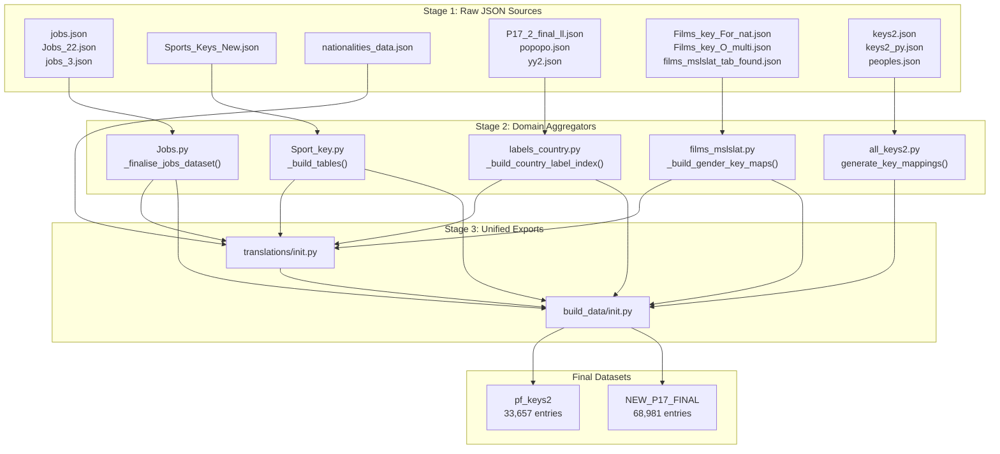
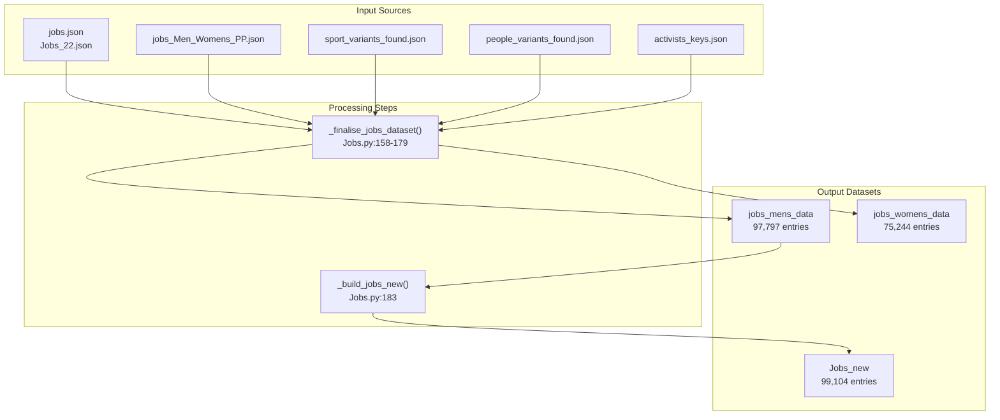
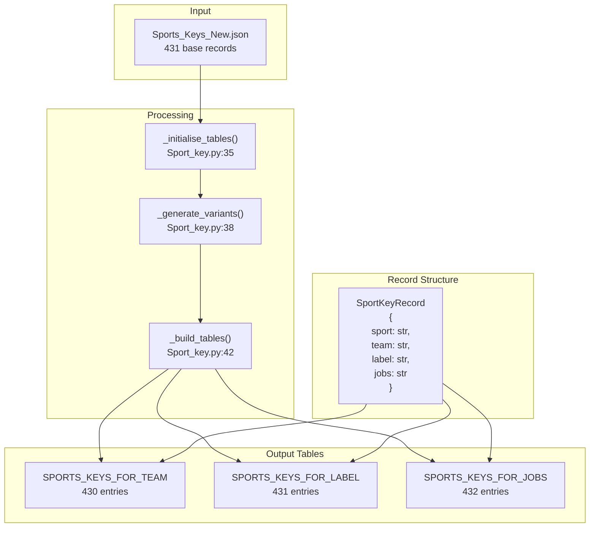
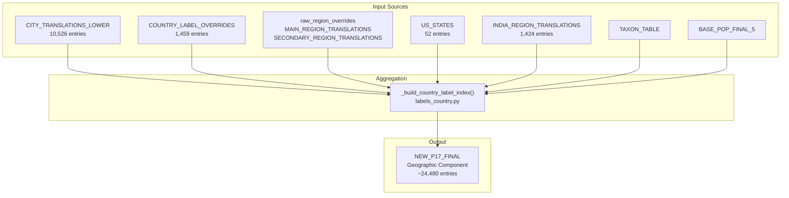
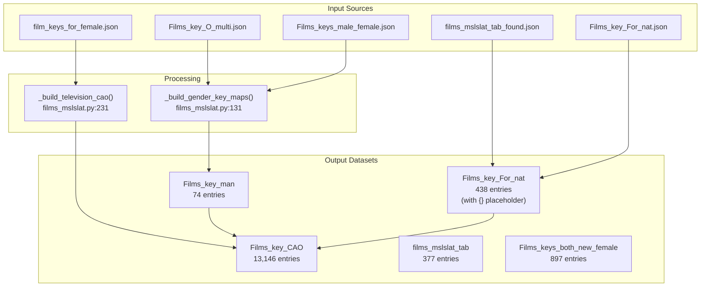
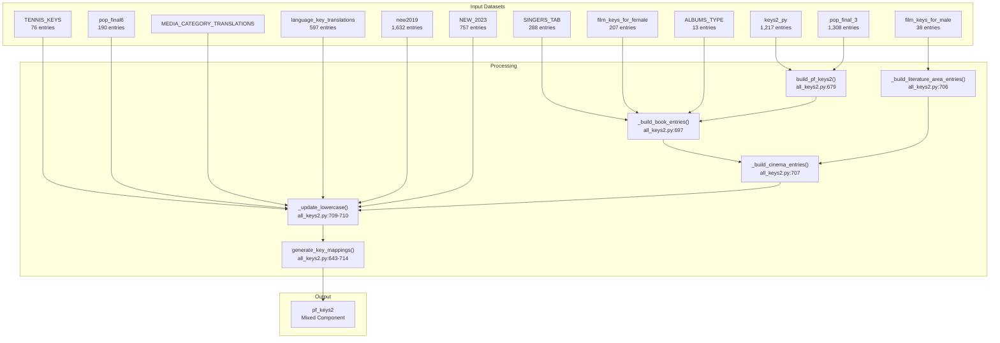
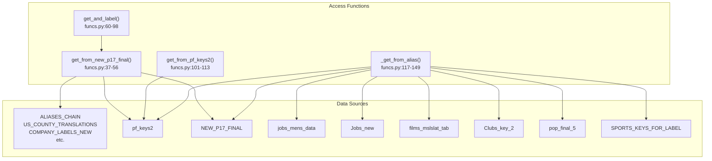

# Data Aggregation Pipeline

> **Relevant source files**
> * [ArWikiCats/translations/__init__.py](../ArWikiCats/translations/__init__.py)
> * [ArWikiCats/translations/build_data/__init__.py](../ArWikiCats/translations/build_data/__init__.py)
> * [ArWikiCats/translations/funcs.py](../ArWikiCats/translations/funcs.py)
> * [ArWikiCats/translations/geo/__init__.py](../ArWikiCats/translations/geo/__init__.py)
> * [ArWikiCats/translations/geo/labels_country.py](../ArWikiCats/translations/geo/labels_country.py)
> * [ArWikiCats/translations/jobs/Jobs.py](../ArWikiCats/translations/jobs/Jobs.py)
> * [ArWikiCats/translations/jobs/Jobs2.py](../ArWikiCats/translations/jobs/Jobs2.py)
> * [ArWikiCats/translations/jobs/jobs_data_basic.py](../ArWikiCats/translations/jobs/jobs_data_basic.py)
> * [ArWikiCats/translations/jobs/jobs_players_list.py](../ArWikiCats/translations/jobs/jobs_players_list.py)
> * [ArWikiCats/translations/jobs/jobs_singers.py](../ArWikiCats/translations/jobs/jobs_singers.py)
> * [ArWikiCats/translations/jobs/jobs_womens.py](../ArWikiCats/translations/jobs/jobs_womens.py)
> * [ArWikiCats/translations/mixed/all_keys2.py](../ArWikiCats/translations/mixed/all_keys2.py)
> * [ArWikiCats/translations/mixed/female_keys.py](../ArWikiCats/translations/mixed/female_keys.py)
> * [ArWikiCats/translations/mixed/keys2.py](../ArWikiCats/translations/mixed/keys2.py)
> * [ArWikiCats/translations/others/__init__.py](../ArWikiCats/translations/others/__init__.py)
> * [ArWikiCats/translations/others/tax_table.py](../ArWikiCats/translations/others/tax_table.py)
> * [ArWikiCats/translations/sports/Sport_key.py](../ArWikiCats/translations/sports/Sport_key.py)
> * [ArWikiCats/translations/tv/films_mslslat.py](../ArWikiCats/translations/tv/films_mslslat.py)
> * [_work_files/data_len.json](../_work_files/data_len.json)

## Purpose and Scope

The Data Aggregation Pipeline is responsible for transforming raw JSON translation data from multiple domains into comprehensive, deduplicated lookup tables that power the resolver system. This page documents how translation data flows from source files through domain-specific aggregators to produce the final consolidated datasets `pf_keys2` (33,657 entries) and `NEW_P17_FINAL` (68,981 entries).

For information about how these datasets are used in category resolution, see [Resolution Pipeline](3.Resolution-Pipeline.md). For details on individual translation data domains, see the respective pages: [Geographic Data](8.Geographic-Data.md), [Jobs and Occupations](9.Jobs-and-Occupations.md), [Nationalities](10.Nationalities.md), [Sports Data](11.Sports-Data.md), [Films and Television](12.Films-and-Television.md).

## Pipeline Architecture Overview

The aggregation pipeline follows a three-stage architecture: raw JSON ingestion, domain-specific processing, and unified export.



**Sources:**

* [ArWikiCats/translations/build_data/__init__.py L1-L83](../ArWikiCats/translations/build_data/__init__.py#L1-L83)
* [ArWikiCats/translations/__init__.py L1-L152](../ArWikiCats/translations/__init__.py#L1-L152)
* High-level architecture diagram (Diagram 3)

## Raw JSON Sources

The pipeline ingests translation data from JSON files organized by domain. These files are loaded using `open_json_file()` from the utilities module.

| Domain | Source Files | Key Count | Purpose |
| --- | --- | --- | --- |
| Jobs | `jobs.json`, `Jobs_22.json`, `jobs_3.json` | ~96,552 | Occupation titles with gender variants |
| Sports | `Sports_Keys_New.json` | 431 | Sport names with team/label/job contexts |
| Geography | `P17_2_final_ll.json`, `popopo.json`, `yy2.json` | ~68,981 | Countries, cities, regions |
| Films/TV | `Films_key_For_nat.json`, `films_mslslat_tab_found.json` | ~13,146 | Film genres and TV categories |
| Nationalities | `nationalities_data.json` | 843 | Nationality forms (male, female, plural) |
| Mixed | `keys2.json`, `keys2_py.json`, `peoples.json` | ~3,100 | Generic categories, political parties |

**Sources:**

* [_work_files/data_len.json L1-L135](../_work_files/data_len.json#L1-L135)
* [ArWikiCats/translations/utils.py](../ArWikiCats/translations/utils.py)  (referenced for `open_json_file`)

## Jobs Data Aggregator

The jobs aggregator is the most complex, combining multiple sources and generating variants across gender, sports, and religious contexts.



The aggregation process in `_finalise_jobs_dataset()` merges:

1. **Base jobs data** from `jobs_Men_Womens_PP.json`
2. **Sport variants** (4,107 entries) - combinations like "football coaches", "basketball players"
3. **People variants** (2,096 entries) - combinations with roles like "writers", "journalists"
4. **Gendered job mappings** from `MEN_WOMENS_JOBS_2`, `NAT_BEFORE_OCC`
5. **Religious variants** - combinations like "christian missionaries", "muslim scholars"
6. **Company founder roles** - e.g., "technology company founders"
7. **Disability labels** - e.g., "deaf athletes", "blind musicians"

The final dataset structure uses `GenderedLabelMap` types:

```json
{
    "football players": {
        "males": "لاعبو كرة قدم",
        "females": "لاعبات كرة قدم"
    }
}
```

**Sources:**

* [ArWikiCats/translations/jobs/Jobs.py L1-L211](../ArWikiCats/translations/jobs/Jobs.py#L1-L211)
* [ArWikiCats/translations/jobs/jobs_data_basic.py L1-L189](../ArWikiCats/translations/jobs/jobs_data_basic.py#L1-L189)
* [ArWikiCats/translations/jobs/jobs_players_list.py L1-L263](../ArWikiCats/translations/jobs/jobs_players_list.py#L1-L263)
* [ArWikiCats/translations/jobs/jobs_singers.py L1-L148](../ArWikiCats/translations/jobs/jobs_singers.py#L1-L148)

## Sports Data Aggregator

The sports aggregator creates lookup tables for different contexts: team names, labels, and job-related forms.



The `SportKeyRecord` structure contains four translation variants:

| Field | Usage | Example |
| --- | --- | --- |
| `sport` | Base sport name | "football" |
| `team` | Team context | "كرة قدم" (for "football teams") |
| `label` | Label context | "كرة القدم" (for "football players") |
| `jobs` | Job context | "كرة القدم" (for "football coaches") |

The aggregator also applies aliases to normalize input:

```css
ALIASES = {
    "kick boxing": "kickboxing",
    "sport climbing": "climbing",
    "motorsports": "motorsport",
    # ...
}
```

**Sources:**

* [ArWikiCats/translations/sports/Sport_key.py L1-L73](../ArWikiCats/translations/sports/Sport_key.py#L1-L73)
* [ArWikiCats/translations/data_builders/build_sport_keys.py](../ArWikiCats/translations/data_builders/build_sport_keys.py)  (referenced)

## Geographic Data Aggregator

The geographic aggregator builds the largest single dataset, combining city, country, and region translations.



The aggregation follows this priority order:

1. **City translations** (lowercase normalized) - e.g., "new york" → "نيويورك"
2. **Country administrative labels** - e.g., "england" → "إنجلترا"
3. **US States** - e.g., "california" → "كاليفورنيا"
4. **Country label overrides** - handles special cases
5. **Region translations** - hierarchical regions like "main", "secondary", "india"
6. **Taxonomic data** - biological classifications with "of" suffix handling
7. **Population-derived labels** - supplementary geographic terms

The function signature shows the comprehensive merging:

```python
def _build_country_label_index(
    city_translations,
    all_country_ar,
    us_states,
    country_label_overrides,
    country_admin_labels,
    main_region_translations,
    raw_region_overrides,
    secondary_region_translations,
    india_region_translations,
    taxon_table,
    base_pop_final_5
) -> dict[str, str]
```

**Sources:**

* [ArWikiCats/translations/geo/labels_country.py L1-L275](../ArWikiCats/translations/geo/labels_country.py#L1-L275)
* [ArWikiCats/translations/geo/__init__.py L1-L35](../ArWikiCats/translations/geo/__init__.py#L1-L35)
* [ArWikiCats/translations/build_data/__init__.py L57-L69](../ArWikiCats/translations/build_data/__init__.py#L57-L69)

## Films and Television Aggregator

The films aggregator handles gender-specific translations and nationality placeholder patterns.



The aggregator creates several specialized outputs:

1. **`Films_key_CAO`** - Comprehensive film/TV categories without nationality placeholders
2. **`Films_key_For_nat`** - Templates with `{}` placeholder for nationality insertion, e.g.: ``` "action films": "أفلام حركة {}" "television series debuts": "مسلسلات تلفزيونية {} بدأ عرضها في" ```
3. **`films_mslslat_tab`** - Series-specific patterns (debuts, endings)
4. **Gender-specific mappings** - Male/female actor categories

**Sources:**

* [ArWikiCats/translations/tv/films_mslslat.py L1-L271](../ArWikiCats/translations/tv/films_mslslat.py#L1-L271)
* [ArWikiCats/translations/data_builders/build_films_mslslat.py](../ArWikiCats/translations/data_builders/build_films_mslslat.py)  (referenced)

## Mixed Categories Aggregator

The mixed categories aggregator combines generic translation data from multiple domains into a unified mapping.



The `generate_key_mappings()` function merges data in this order:

1. **Base mappings** from `build_pf_keys2()` - ART_MOVEMENTS, BASE_LABELS, DIRECTIONS, etc.
2. **Book entries** - combinations of singers, film keys, albums with book categories
3. **Literature entries** - film keys combined with literature areas
4. **Cinema entries** - standard cinema/TV categories
5. **Lowercase updates** with `skip_existing=True` - tennis, pop6, media categories
6. **Lowercase updates** with `skip_existing=False` - language, people, new additions
7. **"the" prefix handling** - generates variants without "the"

**Sources:**

* [ArWikiCats/translations/mixed/all_keys2.py L1-L739](../ArWikiCats/translations/mixed/all_keys2.py#L1-L739)
* [ArWikiCats/translations/mixed/keys2.py L1-L215](../ArWikiCats/translations/mixed/keys2.py#L1-L215)
* [ArWikiCats/translations/data_builders/build_all_keys2.py](../ArWikiCats/translations/data_builders/build_all_keys2.py)  (referenced)

## Unified Export Layers

The pipeline exposes data through two export layers with distinct purposes:

### Direct Exports (translations/__init__.py)

The direct export layer provides immediate access to domain-specific datasets:

```python
# Geography exports
from .geo import (
    CITY_TRANSLATIONS_LOWER,      # 10,526 entries
    COUNTRY_LABEL_OVERRIDES,       # 1,459 entries
    US_STATES,
    raw_region_overrides,
)

# Jobs exports
from .jobs import (
    jobs_mens_data,                # 97,797 entries
    jobs_womens_data,              # 75,244 entries
    Jobs_new,                      # 99,104 entries
    PLAYERS_TO_MEN_WOMENS_JOBS,    # 1,345 entries
    SPORT_JOB_VARIANTS,            # 571 entries
)

# Sports exports
from .sports import (
    SPORT_KEY_RECORDS,             # 431 entries
    SPORTS_KEYS_FOR_TEAM,          # 430 entries
    SPORTS_KEYS_FOR_LABEL,         # 431 entries
    SPORTS_KEYS_FOR_JOBS,          # 432 entries
)

# Nationalities exports
from .nats import (
    All_Nat,                       # 843 entries
    Nat_men, Nat_mens,
    Nat_women, Nat_Womens,
    countries_from_nat,            # 287 entries
)

# Films/TV exports
from .tv import (
    Films_key_CAO,                 # 13,146 entries
    Films_key_For_nat,             # 438 entries
    films_mslslat_tab,             # 377 entries
)
```

**Sources:**

* [ArWikiCats/translations/__init__.py L1-L152](../ArWikiCats/translations/__init__.py#L1-L152)

### Aggregated Exports (build_data/__init__.py)

The aggregated export layer produces comprehensive merged datasets:

```markdown
# Consolidated mixed categories
pf_keys2 = generate_key_mappings(
    keys2_py,                      # Base mappings
    pop_final_3,                   # Population data
    SINGERS_TAB,                   # Singer categories
    film_keys_for_female,          # Female film keys
    ALBUMS_TYPE,                   # Album types
    film_keys_for_male,            # Male film keys
    TENNIS_KEYS,                   # Tennis terms
    pop_final6,                    # Extended population
    MEDIA_CATEGORY_TRANSLATIONS,   # Media categories
    language_key_translations,     # Language terms
    new2019,                       # 2019 additions
    NEW_2023,                      # 2023 additions
)
# Result: 33,657 entries

# Comprehensive geographic index
NEW_P17_FINAL = _build_country_label_index(
    CITY_TRANSLATIONS_LOWER,       # Cities
    all_country_ar,                # Countries
    US_STATES,                     # US states
    COUNTRY_LABEL_OVERRIDES,       # Special cases
    COUNTRY_ADMIN_LABELS,          # Administrative regions
    MAIN_REGION_TRANSLATIONS,      # Primary regions
    raw_region_overrides,          # Region overrides
    SECONDARY_REGION_TRANSLATIONS, # Secondary regions
    INDIA_REGION_TRANSLATIONS,     # India-specific
    TAXON_TABLE,                   # Taxonomic data
    BASE_POP_FINAL_5,              # Population supplements
)
# Result: 68,981 entries
```

**Sources:**

* [ArWikiCats/translations/build_data/__init__.py L1-L83](../ArWikiCats/translations/build_data/__init__.py#L1-L83)

## Final Dataset Structure

The pipeline produces two primary comprehensive datasets:

### pf_keys2 (33,657 entries)

A flat dictionary mapping English keys to Arabic labels for generic categories:

```css
{
    "football": "كرة القدم",
    "novels": "روايات",
    "political parties": "أحزاب سياسية",
    "births": "مواليد",
    "earthquakes": "زلازل",
    # ... 33,652 more entries
}
```

**Composition:**

* Art movements, base labels, directions, regions
* School labels, weapon classifications, book categories
* Towns/communities, literature areas, cinema categories
* Sports keys, media translations, language translations
* Political parties, medical keys, 2019/2023 additions

### NEW_P17_FINAL (68,981 entries)

A comprehensive geographic and taxonomic index:

```css
{
    "london": "لندن",
    "california": "كاليفورنيا",
    "england": "إنجلترا",
    "mammals": "ثدييات",
    "fossil mammals": "ثدييات أحفورية",
    # ... 68,976 more entries
}
```

**Composition:**

* 10,526 city translations (lowercase)
* 24,480 country/region labels
* 52 US states
* 1,424 India regions
* Taxonomic classifications with variants
* Population-derived geographic terms

**Sources:**

* [ArWikiCats/translations/build_data/__init__.py L42-L69](../ArWikiCats/translations/build_data/__init__.py#L42-L69)
* [_work_files/data_len.json L1-L10](../_work_files/data_len.json#L1-L10)

## Data Access Functions

The aggregated data is accessed through helper functions in the `funcs` module:



### Function Behaviors

| Function | Purpose | Fallback Chain |
| --- | --- | --- |
| `get_from_new_p17_final()` | Primary lookup for any term | ALIASES_CHAIN → pf_keys2 → NEW_P17_FINAL |
| `get_from_pf_keys2()` | Direct mixed categories lookup | pf_keys2 only |
| `_get_from_alias()` | Multi-source lookup with caching (LRU 10,000) | pf_keys2 → Jobs_new → jobs_mens_data → films_mslslat_tab → Clubs_key_2 → pop_final_5 → NEW_P17_FINAL → SPORTS_KEYS_FOR_LABEL |
| `get_and_label()` | Handle "X and Y" patterns | Splits on "and", calls get_from_new_p17_final() for each part |

The `ALIASES_CHAIN` provides fast lookups for specialized domains:

```css
ALIASES_CHAIN = {
    "US_COUNTY_TRANSLATIONS": {...},  # 2,998 entries
    "COMPANY_LABELS_NEW": {...},
    "TURKEY_LABELS": {...},
    "JAPAN_LABELS": {...},
    "CITY_LABEL_PATCHES": {...},      # 4,160 entries
}
```

**Sources:**

* [ArWikiCats/translations/funcs.py L1-L159](../ArWikiCats/translations/funcs.py#L1-L159)
* [ArWikiCats/translations/geo/labels_country.py L251-L257](../ArWikiCats/translations/geo/labels_country.py#L251-L257)
