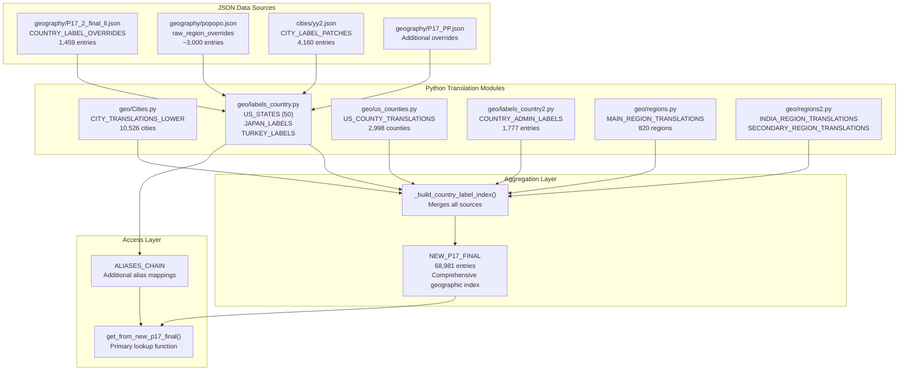
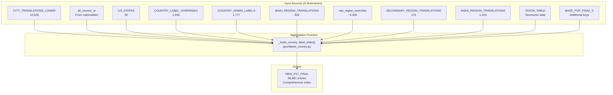
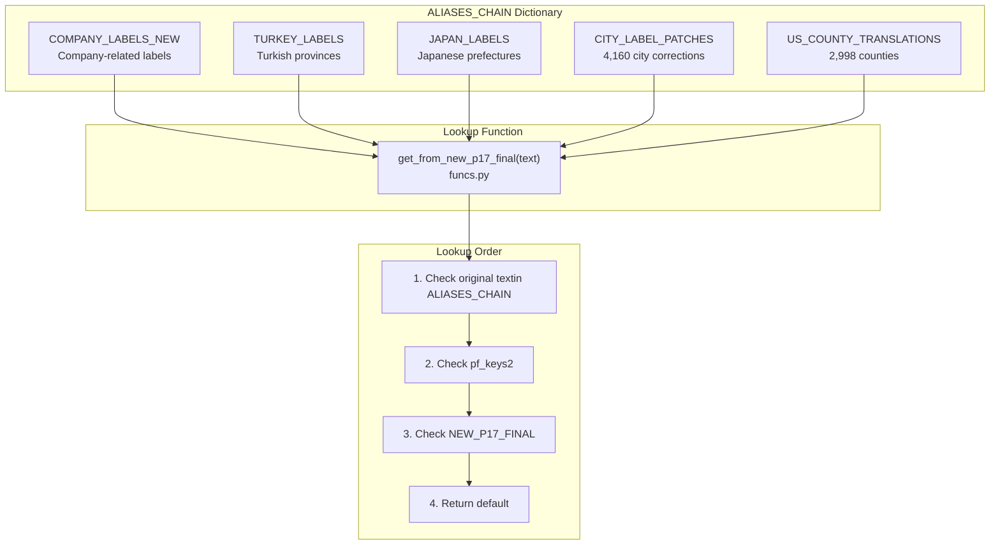

# Geographic Data

> **Relevant source files**
> * [ArWikiCats/jsons/geography/P17_PP.json](https://github.com/ArWikiCats/ArWikiCats/blob/4095f04e/ArWikiCats/jsons/geography/P17_PP.json)
> * [ArWikiCats/jsons/geography/popopo.json](https://github.com/ArWikiCats/ArWikiCats/blob/4095f04e/ArWikiCats/jsons/geography/popopo.json)
> * [ArWikiCats/jsons/people/peoples.json](https://github.com/ArWikiCats/ArWikiCats/blob/4095f04e/ArWikiCats/jsons/people/peoples.json)
> * [ArWikiCats/translations/__init__.py](https://github.com/ArWikiCats/ArWikiCats/blob/4095f04e/ArWikiCats/translations/__init__.py)
> * [ArWikiCats/translations/build_data/__init__.py](https://github.com/ArWikiCats/ArWikiCats/blob/4095f04e/ArWikiCats/translations/build_data/__init__.py)
> * [ArWikiCats/translations/funcs.py](https://github.com/ArWikiCats/ArWikiCats/blob/4095f04e/ArWikiCats/translations/funcs.py)
> * [ArWikiCats/translations/geo/__init__.py](https://github.com/ArWikiCats/ArWikiCats/blob/4095f04e/ArWikiCats/translations/geo/__init__.py)
> * [ArWikiCats/translations/geo/labels_country.py](https://github.com/ArWikiCats/ArWikiCats/blob/4095f04e/ArWikiCats/translations/geo/labels_country.py)
> * [ArWikiCats/translations/jobs/Jobs.py](https://github.com/ArWikiCats/ArWikiCats/blob/4095f04e/ArWikiCats/translations/jobs/Jobs.py)
> * [ArWikiCats/translations/jobs/Jobs2.py](https://github.com/ArWikiCats/ArWikiCats/blob/4095f04e/ArWikiCats/translations/jobs/Jobs2.py)
> * [ArWikiCats/translations/jobs/jobs_data_basic.py](https://github.com/ArWikiCats/ArWikiCats/blob/4095f04e/ArWikiCats/translations/jobs/jobs_data_basic.py)
> * [ArWikiCats/translations/jobs/jobs_players_list.py](https://github.com/ArWikiCats/ArWikiCats/blob/4095f04e/ArWikiCats/translations/jobs/jobs_players_list.py)
> * [ArWikiCats/translations/jobs/jobs_singers.py](https://github.com/ArWikiCats/ArWikiCats/blob/4095f04e/ArWikiCats/translations/jobs/jobs_singers.py)
> * [ArWikiCats/translations/jobs/jobs_womens.py](https://github.com/ArWikiCats/ArWikiCats/blob/4095f04e/ArWikiCats/translations/jobs/jobs_womens.py)
> * [ArWikiCats/translations/mixed/all_keys2.py](https://github.com/ArWikiCats/ArWikiCats/blob/4095f04e/ArWikiCats/translations/mixed/all_keys2.py)
> * [ArWikiCats/translations/mixed/female_keys.py](https://github.com/ArWikiCats/ArWikiCats/blob/4095f04e/ArWikiCats/translations/mixed/female_keys.py)
> * [ArWikiCats/translations/mixed/keys2.py](https://github.com/ArWikiCats/ArWikiCats/blob/4095f04e/ArWikiCats/translations/mixed/keys2.py)
> * [ArWikiCats/translations/others/__init__.py](https://github.com/ArWikiCats/ArWikiCats/blob/4095f04e/ArWikiCats/translations/others/__init__.py)
> * [ArWikiCats/translations/others/tax_table.py](https://github.com/ArWikiCats/ArWikiCats/blob/4095f04e/ArWikiCats/translations/others/tax_table.py)
> * [ArWikiCats/translations/sports/Sport_key.py](https://github.com/ArWikiCats/ArWikiCats/blob/4095f04e/ArWikiCats/translations/sports/Sport_key.py)
> * [ArWikiCats/translations/tv/films_mslslat.py](https://github.com/ArWikiCats/ArWikiCats/blob/4095f04e/ArWikiCats/translations/tv/films_mslslat.py)
> * [_work_files/data_len.json](https://github.com/ArWikiCats/ArWikiCats/blob/4095f04e/_work_files/data_len.json)
> * [tests/load_one_data.py](https://github.com/ArWikiCats/ArWikiCats/blob/4095f04e/tests/load_one_data.py)

This page documents the geographic translation data system used for resolving city, region, country, and county names from English to Arabic. It covers the structure of translation tables, data sources, aggregation process, and how resolvers access this data.

For nationality-based category resolution, see [Nationalities](10.Nationalities.md). For country-based resolvers, see [Country Name Resolvers](17.Country-Name-Resolvers.md).

---

## Overview

The geographic data system provides Arabic translations for thousands of place names across multiple geographic scopes:

| Geographic Scope | Primary Data Structure | Entry Count | Module |
| --- | --- | --- | --- |
| Cities | `CITY_TRANSLATIONS_LOWER` | 10,526 | `geo/Cities.py` |
| US States | `US_STATES` | 50 | `geo/labels_country.py` |
| US Counties | `US_COUNTY_TRANSLATIONS` | 2,998 | `geo/us_counties.py` |
| Countries | `COUNTRY_LABEL_OVERRIDES` | 1,459 | JSON: `geography/P17_2_final_ll.json` |
| Regions/Provinces | `raw_region_overrides` | ~3,000 | JSON: `geography/popopo.json` |
| Administrative Labels | `COUNTRY_ADMIN_LABELS` | 1,777 | `geo/labels_country2.py` |
| Main Regions | `MAIN_REGION_TRANSLATIONS` | 820 | `geo/regions.py` |
| India Regions | `INDIA_REGION_TRANSLATIONS` | 1,424 | `geo/regions2.py` |
| Aggregated Index | `NEW_P17_FINAL` | 68,981 | `build_data/__init__.py` |

All geographic tables use **lowercase English keys** mapping to **Arabic labels**. The system aggregates these into `NEW_P17_FINAL`, which serves as the primary lookup index for geographic name resolution.

**Sources:** [ArWikiCats/translations/geo/__init__.py L1-L35](https://github.com/ArWikiCats/ArWikiCats/blob/4095f04e/ArWikiCats/translations/geo/__init__.py#L1-L35)

 [_work_files/data_len.json L1-L135](https://github.com/ArWikiCats/ArWikiCats/blob/4095f04e/_work_files/data_len.json#L1-L135)

---

## Geographic Data Architecture



The architecture follows a three-layer model: (1) JSON sources provide raw translation data, (2) Python modules load and structure this data into typed dictionaries, (3) the aggregation layer merges all sources into a single comprehensive index accessible through `get_from_new_p17_final()`.

**Sources:** [ArWikiCats/translations/geo/labels_country.py L1-L275](https://github.com/ArWikiCats/ArWikiCats/blob/4095f04e/ArWikiCats/translations/geo/labels_country.py#L1-L275)

 [ArWikiCats/translations/build_data/__init__.py L57-L69](https://github.com/ArWikiCats/ArWikiCats/blob/4095f04e/ArWikiCats/translations/build_data/__init__.py#L57-L69)

 [ArWikiCats/translations/funcs.py L37-L56](https://github.com/ArWikiCats/ArWikiCats/blob/4095f04e/ArWikiCats/translations/funcs.py#L37-L56)

---

## City Translations

Cities are stored in `CITY_TRANSLATIONS_LOWER` with 10,526 entries. The dictionary maps lowercase English city names to their Arabic equivalents.

**Module:** `ArWikiCats/translations/geo/Cities.py`

**Structure:**

```css
CITY_TRANSLATIONS_LOWER: Dict[str, str] = {
    "new york": "نيويورك",
    "london": "لندن",
    "paris": "باريس",
    # ... 10,526 total entries
}
```

**Patches:** The system also includes `CITY_LABEL_PATCHES` (4,160 entries) loaded from `cities/yy2.json`, which provides corrections or additions to the main city translation table. These patches are integrated during the aggregation process.

**Sources:** [ArWikiCats/translations/geo/labels_country.py L230](https://github.com/ArWikiCats/ArWikiCats/blob/4095f04e/ArWikiCats/translations/geo/labels_country.py#L230-L230)

 [_work_files/data_len.json L6-L8](https://github.com/ArWikiCats/ArWikiCats/blob/4095f04e/_work_files/data_len.json#L6-L8)

---

## US States and State-Level Translations

### US States

The `US_STATES` dictionary contains all 50 US states plus special cases like "Washington, D.C." and disambiguated state names:

```css
US_STATES = {
    "georgia (u.s. state)": "ولاية جورجيا",
    "new york (state)": "ولاية نيويورك",
    "washington (state)": "ولاية واشنطن",
    "washington": "واشنطن",
    "washington, d.c.": "واشنطن العاصمة",
    "georgia": "جورجيا",
    "new york": "نيويورك",
    "alabama": "ألاباما",
    # ... all 50 states
}
```

The dictionary handles disambiguation by including both the parenthetical form `"georgia (u.s. state)"` and the plain form `"georgia"`.

**Sources:** [ArWikiCats/translations/geo/labels_country.py L13-L68](https://github.com/ArWikiCats/ArWikiCats/blob/4095f04e/ArWikiCats/translations/geo/labels_country.py#L13-L68)

### US Counties

The `US_COUNTY_TRANSLATIONS` dictionary provides translations for 2,998 US counties, loaded from `us_counties.py`. This enables resolution of categories like "People from Alameda County, California" → "أعلام من مقاطعة ألاميدا، كاليفورنيا".

**Example entries:**

```css
US_COUNTY_TRANSLATIONS = {
    "alameda county": "مقاطعة ألاميدا",
    "los angeles county": "مقاطعة لوس أنجليس",
    "cook county": "مقاطعة كوك",
    # ... 2,998 total counties
}
```

**Sources:** [ArWikiCats/translations/geo/us_counties.py](https://github.com/ArWikiCats/ArWikiCats/blob/4095f04e/ArWikiCats/translations/geo/us_counties.py)

 [_work_files/data_len.json L13](https://github.com/ArWikiCats/ArWikiCats/blob/4095f04e/_work_files/data_len.json#L13-L13)

---

## Country and Regional Labels

### Country Label Overrides

`COUNTRY_LABEL_OVERRIDES` contains 1,459 entries loaded from `geography/P17_2_final_ll.json`. This provides the primary mapping for country names and major political entities.

**Examples:**

```css
COUNTRY_LABEL_OVERRIDES = {
    "united states": "الولايات المتحدة",
    "united kingdom": "المملكة المتحدة",
    "soviet union": "الاتحاد السوفيتي",
    "roman empire": "الإمبراطورية الرومانية",
    # ... 1,459 total entries
}
```

**Sources:** [ArWikiCats/translations/geo/labels_country.py L231](https://github.com/ArWikiCats/ArWikiCats/blob/4095f04e/ArWikiCats/translations/geo/labels_country.py#L231-L231)

 [_work_files/data_len.json L19](https://github.com/ArWikiCats/ArWikiCats/blob/4095f04e/_work_files/data_len.json#L19-L19)

### Regional Overrides

`raw_region_overrides` is loaded from `geography/popopo.json` and contains approximately 3,000 entries covering historical regions, provinces, administrative divisions, and geographic entities.

**Sample content from popopo.json:**

```json
{
    "'asir region": "منطقة عسير",
    "abbasid caliphate": "الدولة العباسية",
    "aceh sultanate": "سلطنة آتشيه",
    "adamawa state": "ولاية آدماوة",
    "aleppo governorate": "محافظة حلب"
}
```

This file includes historical empires, sultanates, governorates, states, and other administrative divisions from around the world.

**Sources:** [ArWikiCats/translations/geo/labels_country.py L232](https://github.com/ArWikiCats/ArWikiCats/blob/4095f04e/ArWikiCats/translations/geo/labels_country.py#L232-L232)

 [ArWikiCats/jsons/geography/popopo.json L1-L100](https://github.com/ArWikiCats/ArWikiCats/blob/4095f04e/ArWikiCats/jsons/geography/popopo.json#L1-L100)

### Administrative Labels

`COUNTRY_ADMIN_LABELS` (1,777 entries) provides translations for administrative divisions and their variants across different countries.

**Sources:** [ArWikiCats/translations/geo/labels_country2.py](https://github.com/ArWikiCats/ArWikiCats/blob/4095f04e/ArWikiCats/translations/geo/labels_country2.py)

 [_work_files/data_len.json L17](https://github.com/ArWikiCats/ArWikiCats/blob/4095f04e/_work_files/data_len.json#L17-L17)

---

## Specialized Regional Labels

### Japan Regional Labels

The system includes comprehensive Japanese prefecture and region translations built through `_make_japan_labels()`:

**Base labels:**

```css
JAPAN_REGIONAL_LABELS = {
    "saitama": "سايتاما",
    "tohoku": "توهوكو",
    "kyushu": "كيوشو",
    "kantō": "كانتو",
    "hokkaido": "هوكايدو",
    # ... 47 prefectures + regions
}
```

**Generated labels:** The `_make_japan_labels()` function creates additional entries for:

* Prefecture suffixes: `"saitama prefecture"` → `"محافظة سايتاما"`
* Regional groupings: `"kantō region"` → `"منطقة كانتو"`

**Sources:** [ArWikiCats/translations/geo/labels_country.py L70-L127](https://github.com/ArWikiCats/ArWikiCats/blob/4095f04e/ArWikiCats/translations/geo/labels_country.py#L70-L127)

 [ArWikiCats/translations/geo/labels_country.py L226](https://github.com/ArWikiCats/ArWikiCats/blob/4095f04e/ArWikiCats/translations/geo/labels_country.py#L226-L226)

### Turkey Province Labels

Turkish provinces are similarly structured with automatic suffix generation:

**Base labels:**

```css
TURKEY_PROVINCE_LABELS = {
    "adana": "أضنة",
    "ankara": "أنقرة",
    "istanbul": "إسطنبول",
    "izmir": "إزمير",
    # ... 81 provinces
}
```

**Generated labels:** The `_make_turkey_labels()` function creates:

* Province suffixes: `"ankara province"` → `"محافظة أنقرة"`
* Alternative forms

**Sources:** [ArWikiCats/translations/geo/labels_country.py L128-L211](https://github.com/ArWikiCats/ArWikiCats/blob/4095f04e/ArWikiCats/translations/geo/labels_country.py#L128-L211)

 [ArWikiCats/translations/geo/labels_country.py L227](https://github.com/ArWikiCats/ArWikiCats/blob/4095f04e/ArWikiCats/translations/geo/labels_country.py#L227-L227)

### India Regional Translations

`INDIA_REGION_TRANSLATIONS` (1,424 entries) provides comprehensive coverage of Indian states, union territories, and regions. This is loaded in `geo/regions2.py`.

**Sources:** [ArWikiCats/translations/geo/regions2.py](https://github.com/ArWikiCats/ArWikiCats/blob/4095f04e/ArWikiCats/translations/geo/regions2.py)

 [_work_files/data_len.json L20](https://github.com/ArWikiCats/ArWikiCats/blob/4095f04e/_work_files/data_len.json#L20-L20)

### Main and Secondary Regions

* **`MAIN_REGION_TRANSLATIONS`** (820 entries): Major geographic regions, provinces, and territories from `geo/regions.py`
* **`SECONDARY_REGION_TRANSLATIONS`** (176 entries): Additional regional labels from `geo/regions2.py`

**Sources:** [ArWikiCats/translations/geo/regions.py](https://github.com/ArWikiCats/ArWikiCats/blob/4095f04e/ArWikiCats/translations/geo/regions.py)

 [ArWikiCats/translations/geo/regions2.py](https://github.com/ArWikiCats/ArWikiCats/blob/4095f04e/ArWikiCats/translations/geo/regions2.py)

 [_work_files/data_len.json L27-L78](https://github.com/ArWikiCats/ArWikiCats/blob/4095f04e/_work_files/data_len.json#L27-L78)

---

## Data Aggregation Process



The `_build_country_label_index()` function merges all geographic data sources into `NEW_P17_FINAL`. The function is defined in `geo/labels_country.py` and called during module initialization in `build_data/__init__.py`.

**Invocation:**

```markdown
NEW_P17_FINAL = _build_country_label_index(
    CITY_TRANSLATIONS_LOWER,
    all_country_ar,           # From nationalities module
    US_STATES,
    COUNTRY_LABEL_OVERRIDES,
    COUNTRY_ADMIN_LABELS,
    MAIN_REGION_TRANSLATIONS,
    raw_region_overrides,
    SECONDARY_REGION_TRANSLATIONS,
    INDIA_REGION_TRANSLATIONS,
    TAXON_TABLE,              # From taxonomy module
    BASE_POP_FINAL_5,         # From mixed keys
)
```

The aggregation process:

1. Starts with an empty dictionary
2. Iteratively updates with each source, later sources overriding earlier ones
3. All keys are normalized to lowercase
4. Returns a unified index with 68,981 total entries

**Sources:** [ArWikiCats/translations/build_data/__init__.py L57-L69](https://github.com/ArWikiCats/ArWikiCats/blob/4095f04e/ArWikiCats/translations/build_data/__init__.py#L57-L69)

 [ArWikiCats/translations/geo/labels_country.py L235-L249](https://github.com/ArWikiCats/ArWikiCats/blob/4095f04e/ArWikiCats/translations/geo/labels_country.py#L235-L249)

---

## ALIASES_CHAIN System

`ALIASES_CHAIN` provides an additional layer of geographic lookups that are checked before `NEW_P17_FINAL`. This allows for specialized handling of certain geographic categories.



**Structure:**

```
ALIASES_CHAIN = {
    "COMPANY_LABELS_NEW": COMPANY_LABELS_NEW,
    "TURKEY_LABELS": TURKEY_LABELS,
    "JAPAN_LABELS": JAPAN_LABELS,
    "CITY_LABEL_PATCHES": CITY_LABEL_PATCHES,
}
```

The chain is extended at runtime with `US_COUNTY_TRANSLATIONS`:

```sql
ALIASES_CHAIN.update({
    "US_COUNTY_TRANSLATIONS": US_COUNTY_TRANSLATIONS,
})
```

**Sources:** [ArWikiCats/translations/geo/labels_country.py L251-L256](https://github.com/ArWikiCats/ArWikiCats/blob/4095f04e/ArWikiCats/translations/geo/labels_country.py#L251-L256)

 [ArWikiCats/translations/funcs.py L27-L31](https://github.com/ArWikiCats/ArWikiCats/blob/4095f04e/ArWikiCats/translations/funcs.py#L27-L31)

 [ArWikiCats/translations/funcs.py L49-L52](https://github.com/ArWikiCats/ArWikiCats/blob/4095f04e/ArWikiCats/translations/funcs.py#L49-L52)

---

## Access Patterns and Lookup Function

### Primary Lookup: get_from_new_p17_final()

The `get_from_new_p17_final()` function provides the standard interface for geographic name resolution:

```python
def get_from_new_p17_final(text: str, default: str | None = "") -> str:
    """
    Resolve the Arabic label for a given term using the aggregated label index.
    
    Returns:
        str: The Arabic label for text if found, otherwise default.
    """
    lower_text = text.lower()
    
    # Check ALIASES_CHAIN first
    for mapping in ALIASES_CHAIN.values():
        if result := mapping.get(text):
            return result
    
    # Check pf_keys2 and NEW_P17_FINAL
    result = get_from_pf_keys2(lower_text) or NEW_P17_FINAL.get(lower_text)
    
    return result or default
```

**Lookup priority:**

1. Check original text in `ALIASES_CHAIN` mappings (exact case)
2. Check lowercase text in `pf_keys2` (general keys)
3. Check lowercase text in `NEW_P17_FINAL` (geographic index)
4. Return default value (empty string by default)

**Sources:** [ArWikiCats/translations/funcs.py L37-L56](https://github.com/ArWikiCats/ArWikiCats/blob/4095f04e/ArWikiCats/translations/funcs.py#L37-L56)

### Usage in Resolvers

Geographic data is primarily accessed through country and nationality resolvers:

**Example from country resolver:**

```markdown
# Resolver checks if category contains a country name
country_label = get_from_new_p17_final(country_name.lower())
if country_label:
    # Use country_label in template formatting
    return format_template(category, country_label)
```

The geographic data integrates with the broader resolver chain at priority levels 6-7, after nationality resolvers but before films and other resolvers.

**Sources:** [ArWikiCats/translations/funcs.py L37-L56](https://github.com/ArWikiCats/ArWikiCats/blob/4095f04e/ArWikiCats/translations/funcs.py#L37-L56)

---

## Data Statistics Summary

| Component | Entry Count | Load Source | Export Module |
| --- | --- | --- | --- |
| Cities | 10,526 | `Cities.py` | `geo/__init__.py` |
| City Patches | 4,160 | `cities/yy2.json` | `labels_country.py` |
| US States | 50 | `labels_country.py` | `geo/__init__.py` |
| US Counties | 2,998 | `us_counties.py` | `geo/__init__.py` |
| Country Labels | 1,459 | `geography/P17_2_final_ll.json` | `labels_country.py` |
| Region Overrides | ~3,000 | `geography/popopo.json` | `labels_country.py` |
| Admin Labels | 1,777 | `labels_country2.py` | `geo/__init__.py` |
| Main Regions | 820 | `regions.py` | `geo/__init__.py` |
| India Regions | 1,424 | `regions2.py` | `geo/__init__.py` |
| Secondary Regions | 176 | `regions2.py` | `geo/__init__.py` |
| Japan Labels | ~100 | Generated in `labels_country.py` | via `ALIASES_CHAIN` |
| Turkey Labels | ~160 | Generated in `labels_country.py` | via `ALIASES_CHAIN` |
| **Aggregated Total** | **68,981** | `NEW_P17_FINAL` | `build_data/__init__.py` |

All counts are approximate based on module documentation and `data_len.json`.

**Sources:** [_work_files/data_len.json L1-L135](https://github.com/ArWikiCats/ArWikiCats/blob/4095f04e/_work_files/data_len.json#L1-L135)

 [ArWikiCats/translations/geo/labels_country.py L267-L274](https://github.com/ArWikiCats/ArWikiCats/blob/4095f04e/ArWikiCats/translations/geo/labels_country.py#L267-L274)

 [ArWikiCats/translations/build_data/__init__.py L71-L77](https://github.com/ArWikiCats/ArWikiCats/blob/4095f04e/ArWikiCats/translations/build_data/__init__.py#L71-L77)