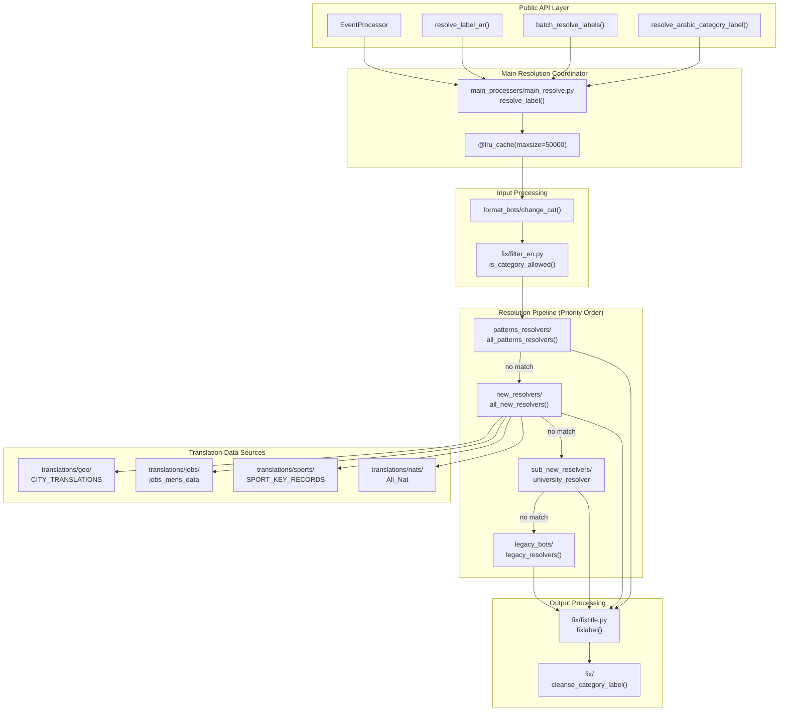
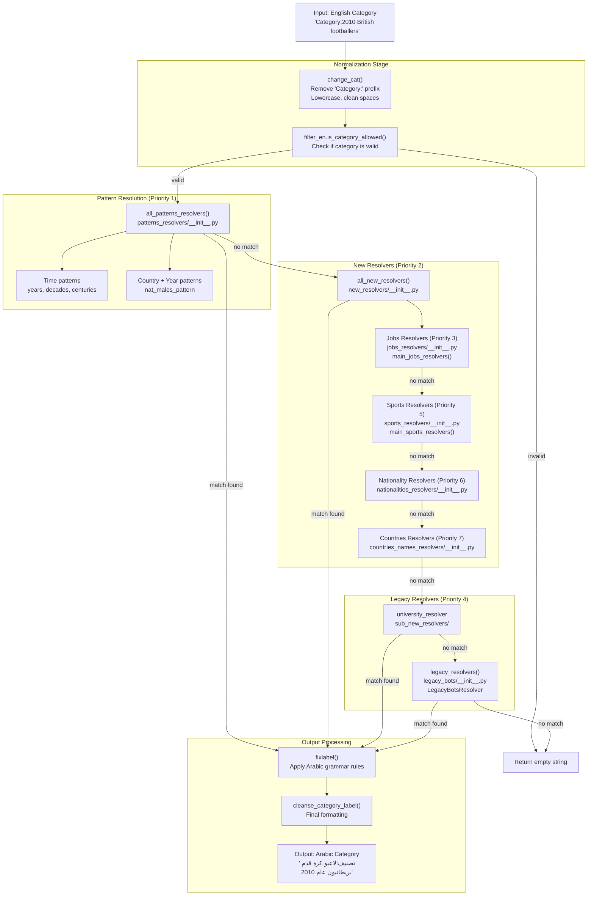
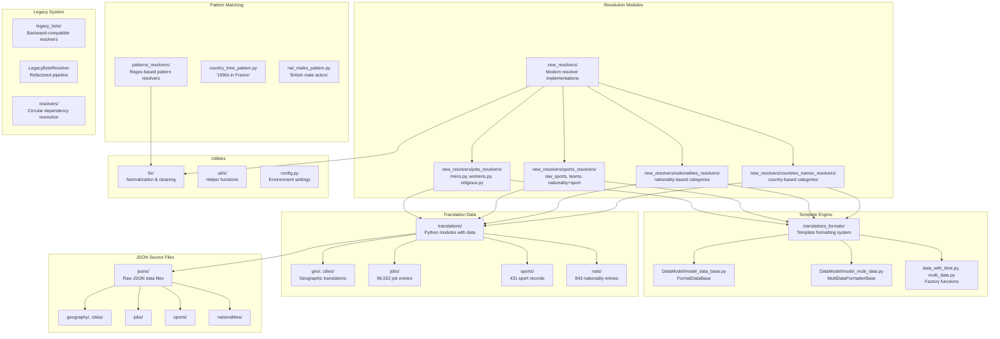
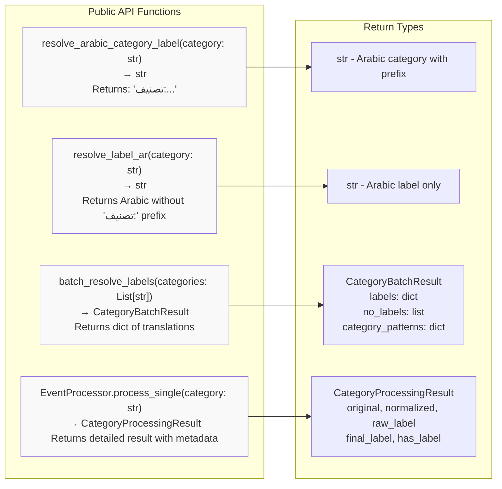
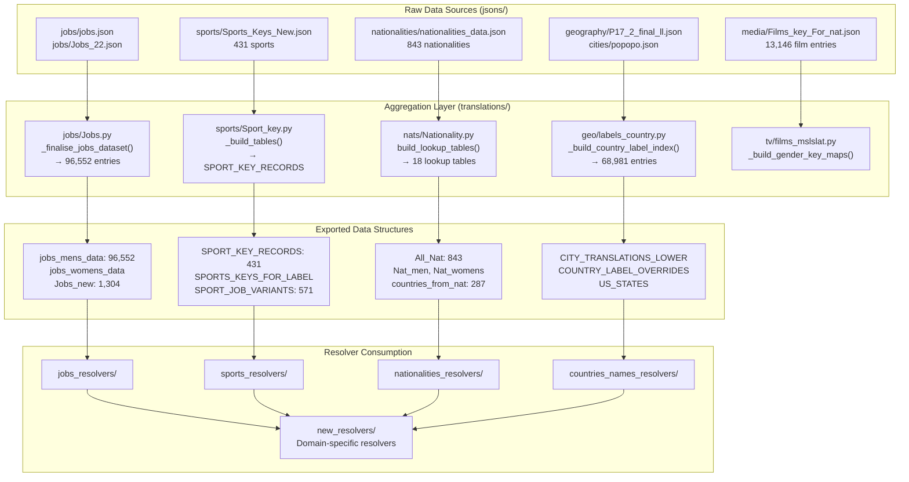

<summary>Relevant source files</summary>

The following files were used as context for generating this wiki page:

- [.github/copilot-instructions.md](.github/copilot-instructions.md)
- [.github/workflows/python-publish.yml](.github/workflows/python-publish.yml)
- [ArWikiCats/config.py](../ArWikiCats/config.py)
- [ArWikiCats/jsons/population/pop_All_2018.json](../ArWikiCats/jsons/population/pop_All_2018.json)
- [ArWikiCats/main_processers/main_resolve.py](../ArWikiCats/main_processers/main_resolve.py)
- [CLAUDE.md](CLAUDE.md)
- [README.md](README.md)
- [changelog.md](changelog.md)
- [tests_require_fixes/test_papua_new_guinean.py](tests_require_fixes/test_papua_new_guinean.py)
- [tests_require_fixes/test_skip_data_all.py](tests_require_fixes/test_skip_data_all.py)
- [tests_require_fixes/text_to_fix.py](tests_require_fixes/text_to_fix.py)

</details>


## Purpose and Scope

ArWikiCats is a Python library that automatically translates English Wikipedia category names into standardized Arabic equivalents. The system processes category labels through a multi-stage resolution pipeline, leveraging extensive translation dictionaries covering temporal patterns, geographic entities, occupations, sports, nationalities, and media-related terms.

This page provides a high-level understanding of the system's architecture, capabilities, and core components. For detailed information about specific subsystems:
- Installation and basic usage: see [Getting Started](1.Getting-Started.md)
- Detailed architecture: see [Architecture](2.Architecture.md)
- Translation data organization: see [Translation Data](6.Translation-Data.md)
- Resolver implementations: see [Resolver System](14.Resolver-System.md)
- Template formatting engine: see [Formatting System](22.Formatting-System.md)

**Sources:** [README.md:1-560](), [CLAUDE.md:1-227](), [.github/copilot-instructions.md:1-121]()

---

## System Capabilities

The ArWikiCats translation engine maintains comprehensive translation datasets across multiple domains:

| Domain | Dataset Size | Key Examples |
|--------|-------------|--------------|
| **Jobs and Occupations** | 96,552 male entries, extensive female mappings | footballers, painters, scientists, religious occupations |
| **Sports** | 431 sport key records, 571 job variants | football, basketball, teams, players, competitions |
| **Nationalities** | 843 entries, 18 lookup tables | British, American, Egyptian (male/female/plural/definite forms) |
| **Geographic Data** | 68,981 entries | cities, regions, countries, counties, US states |
| **Films and Television** | 13,146 entries | film genres, TV series, directors, actors |
| **Test Coverage** | 28,500+ tests | unit, integration, end-to-end tests achieving 91% coverage |

The system handles complex multi-element categories such as:
- Temporal + Nationality + Occupation: "2010 British football players"
- Country + Year + Event: "1990s establishments in France"
- Nationality + Sport + Team: "Argentine football club managers"

**Sources:** [README.md:42-113](), [changelog.md:1-80]()

---

## High-Level Architecture

The system follows a layered architecture with specialized resolver chains that process categories in priority order:



**Architecture Overview**

The system is organized into five primary layers:

1. **Public API Layer** - User-facing functions in [ArWikiCats/__init__.py]() that provide simple interfaces for single-category and batch translation
2. **Main Resolution Coordinator** - [main_processers/main_resolve.py:33-93]() orchestrates the resolution pipeline with LRU caching
3. **Input Processing** - Normalizes categories and filters invalid inputs before resolution
4. **Resolution Pipeline** - Prioritized chain of specialized resolvers that attempt pattern matching
5. **Output Processing** - Applies Arabic formatting rules and cleansing to finalized labels

**Sources:** [ArWikiCats/main_processers/main_resolve.py:1-106](), [CLAUDE.md:69-103]()

---

## Resolution Pipeline Flow

The category resolution process follows a strict priority order to prevent conflicts and ensure accurate translations:



**Resolution Priority Rationale**

The resolver ordering is critical to prevent conflicts:
1. **Pattern resolvers first** - Fast regex-based matching for common patterns (years, time + country)
2. **Jobs before Sports** - "football manager" must resolve as a job, not a sports category
3. **Nationalities before Countries** - "Italy political leader" uses nationality form, not country name
4. **Sports after Jobs** - Prevents job titles from being misclassified as sports terms
5. **Legacy resolvers last** - Backward compatibility for patterns not yet migrated

The system uses `@functools.lru_cache(maxsize=50000)` on the main resolver to cache results and achieve high throughput.

**Sources:** [ArWikiCats/main_processers/main_resolve.py:32-94](), [CLAUDE.md:79-92]()

---

## Core Components and File Organization

The codebase is organized into specialized modules, each handling a specific aspect of translation:



**Module Responsibilities**

| Module Path | Responsibility | Key Files |
|------------|----------------|-----------|
| `main_processers/` | Orchestrates resolution pipeline | `main_resolve.py` |
| `new_resolvers/` | Modern domain-specific resolvers | `jobs_resolvers/`, `sports_resolvers/`, `nationalities_resolvers/` |
| `patterns_resolvers/` | Regex-based pattern matching | `country_time_pattern.py`, `nat_males_pattern.py` |
| `translations_formats/` | Template formatting engine | `DataModel/`, factory functions |
| `translations/` | Translation data as Python modules | `geo/`, `jobs/`, `sports/`, `nats/`, `tv/` |
| `jsons/` | Raw JSON translation data | `geography/`, `jobs/`, `sports/`, `nationalities/` |
| `legacy_bots/` | Backward-compatible resolvers | `LegacyBotsResolver`, `resolvers/` |
| `fix/` | Text normalization and cleaning | `fixtitle.py`, `fixlists.py` |

**Sources:** [README.md:333-430](), [CLAUDE.md:199-220]()

---

## Public API

The system exposes four main entry points for category translation:



**Usage Examples**

```python
from ArWikiCats import (
    resolve_arabic_category_label,
    resolve_label_ar,
    batch_resolve_labels,
    EventProcessor
)

# Single category with prefix
label = resolve_arabic_category_label("Category:2015 British footballers")
# Returns: "تصنيف:لاعبو كرة قدم بريطانيون عام 2015"

# Single category without prefix
label = resolve_label_ar("British footballers")
# Returns: "لاعبو كرة قدم بريطانيون"

# Batch processing
categories = [
    "Category:American basketball players",
    "Category:1990s establishments in France"
]
result = batch_resolve_labels(categories)
# result.labels: dict of successful translations
# result.no_labels: list of categories without translations

# Detailed processing with metadata
processor = EventProcessor()
result = processor.process_single("Category:British footballers")
# result.original: "Category:British footballers"
# result.normalized: "british footballers"
# result.final_label: "تصنيف:لاعبو كرة قدم بريطانيون"
# result.has_label: True
```

All public API functions are exported from [ArWikiCats/__init__.py:1-40]() and documented in the package's top-level module.

**Sources:** [README.md:170-230](), [ArWikiCats/main_processers/main_resolve.py:33-100]()

---

## Translation Data Architecture

Translation data flows from raw JSON files through Python aggregator modules into specialized resolver implementations:



**Data Processing Pipeline**

The translation data undergoes three stages of transformation:

1. **Raw JSON Storage** - Source data files in `jsons/` directory maintain original mappings
2. **Python Aggregation** - Modules in `translations/` process, merge, and transform raw data
3. **Exported Structures** - Final data structures (dicts, sets, lookup tables) used by resolvers

Key aggregation operations include:
- **Jobs**: Combines multiple JSON sources, handles gender variants, generates 96,552 male job entries
- **Sports**: Builds sport key records, job variants, team-related mappings from 431 base sports
- **Nationalities**: Creates 18 specialized lookup tables for different grammatical forms (male, female, plural, definite)
- **Geography**: Indexes 68,981 entries with city translations, country overrides, US state mappings

**Sources:** [README.md:89-113](), [changelog.md:247-294]()

---

## Performance Characteristics

The system is optimized for high-throughput batch processing with the following characteristics:

| Metric | Value | Implementation |
|--------|-------|----------------|
| **Memory Usage** | <100 MB | Optimized from 2GB in legacy system |
| **Cache Size** | 50,000 entries | `@functools.lru_cache` on `resolve_label()` |
| **Test Suite Speed** | ~23 seconds | 28,500+ tests with pytest |
| **Batch Throughput** | >5,000 categories/second | Demonstrated in `examples/5k.py` |
| **Test Coverage** | 91% | Recent improvements to legacy_bots and translations_formats |

**Caching Strategy**

The system employs multiple levels of caching:

```python
# Main resolution function with LRU cache
@functools.lru_cache(maxsize=50000)
def resolve_label(category: str, fix_label: bool = True) -> CategoryResult:
    # ... resolution logic
```

Additional caching is applied to:
- Static data loading functions in resolver modules
- Pattern compilation in `patterns_resolvers/`
- Lookup table generation in `translations/` modules

**Optimization Techniques**

1. **Early filtering** - Invalid categories rejected before entering resolver chain
2. **Priority ordering** - Most common patterns checked first
3. **Lazy loading** - Translation data loaded on-demand in some modules
4. **Pre-compiled regexes** - Pattern matchers compiled at module load time

**Sources:** [README.md:498-508](), [ArWikiCats/main_processers/main_resolve.py:32](), [changelog.md:269-293]()

---

## System Design Principles

ArWikiCats follows several key design principles that inform its architecture:

**1. Resolver Chain Priority Pattern**

Resolvers are ordered to prevent semantic conflicts. For example, "football manager" must be resolved by the jobs resolver (as an occupation) before the sports resolver can interpret it as a sports management role. The priority order is explicitly documented in [new_resolvers/__init__.py:29-57]().

**2. Template-Based Formatting**

The `FormatDataBase` class and its variants provide a template engine for pattern matching and placeholder replacement. This allows resolvers to define translation patterns like `"{nat} {sport} players"` → `"لاعبو {sport} {nat}"` with automatic substitution of Arabic equivalents.

**3. Separation of Data and Logic**

Translation data resides in `jsons/` and `translations/` directories, completely separate from resolver logic. This allows non-developers to contribute translations without modifying code.

**4. Backward Compatibility**

The `legacy_bots/` module maintains compatibility with pre-existing translation patterns through the `LegacyBotsResolver` class, which was refactored from a list-based pipeline while preserving 100% of original behavior.

**5. Comprehensive Testing**

With 28,500+ tests organized into unit, integration, and end-to-end categories, the system achieves 91% code coverage and validates translation accuracy across thousands of real-world categories.

**Sources:** [changelog.md:170-200](), [CLAUDE.md:139-143](), [README.md:434-508]()18:T439c,# Getting Started

