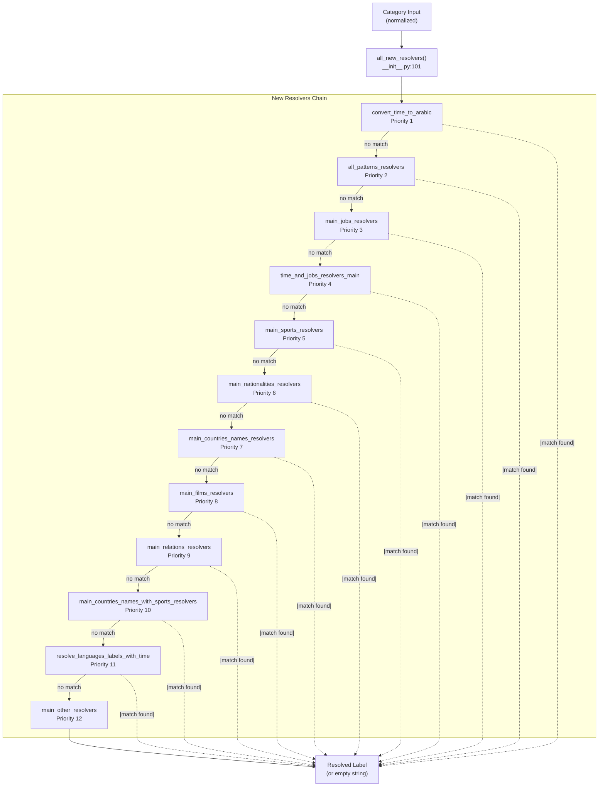
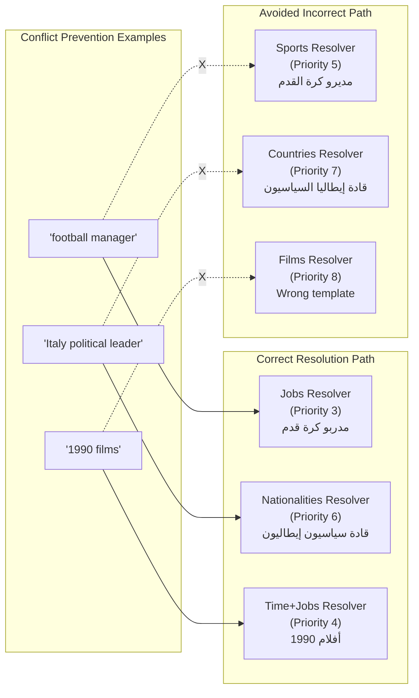
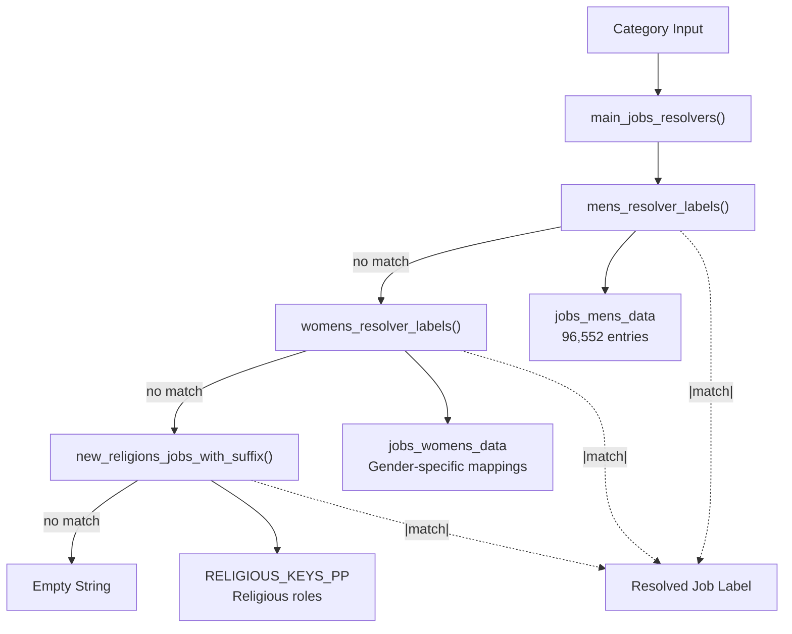
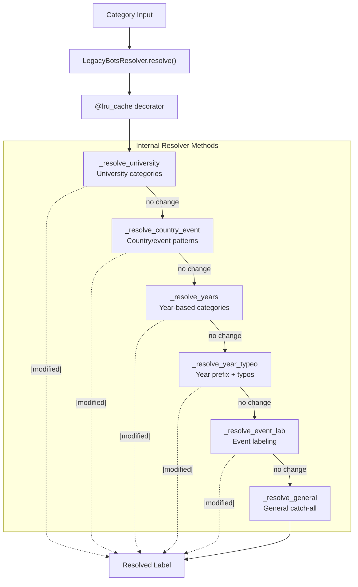
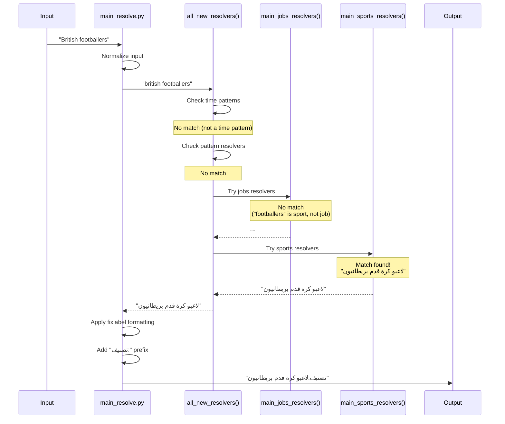

<details>
<summary>Relevant source files</summary>

The following files were used as context for generating this wiki page:

- [.github/copilot-instructions.md](.github/copilot-instructions.md)
- [.github/workflows/python-publish.yml](.github/workflows/python-publish.yml)
- [ArWikiCats/config.py](../ArWikiCats/config.py)
- [ArWikiCats/new_resolvers/__init__.py](../ArWikiCats/new_resolvers/__init__.py)
- [ArWikiCats/new_resolvers/countries_names_resolvers/__init__.py](../ArWikiCats/new_resolvers/countries_names_resolvers/__init__.py)
- [ArWikiCats/new_resolvers/countries_names_with_sports/__init__.py](../ArWikiCats/new_resolvers/countries_names_with_sports/__init__.py)
- [ArWikiCats/new_resolvers/countries_names_with_sports/p17_bot_sport.py](../ArWikiCats/new_resolvers/countries_names_with_sports/p17_bot_sport.py)
- [ArWikiCats/new_resolvers/countries_names_with_sports/p17_sport_to_move_under.py](../ArWikiCats/new_resolvers/countries_names_with_sports/p17_sport_to_move_under.py)
- [ArWikiCats/new_resolvers/films_resolvers/__init__.py](../ArWikiCats/new_resolvers/films_resolvers/__init__.py)
- [ArWikiCats/new_resolvers/films_resolvers/resolve_films_labels.py](../ArWikiCats/new_resolvers/films_resolvers/resolve_films_labels.py)
- [ArWikiCats/new_resolvers/jobs_resolvers/__init__.py](../ArWikiCats/new_resolvers/jobs_resolvers/__init__.py)
- [ArWikiCats/new_resolvers/jobs_resolvers/relegin_jobs_new.py](../ArWikiCats/new_resolvers/jobs_resolvers/relegin_jobs_new.py)
- [ArWikiCats/new_resolvers/nationalities_resolvers/__init__.py](../ArWikiCats/new_resolvers/nationalities_resolvers/__init__.py)
- [ArWikiCats/new_resolvers/sports_resolvers/__init__.py](../ArWikiCats/new_resolvers/sports_resolvers/__init__.py)
- [ArWikiCats/new_resolvers/sports_resolvers/countries_names_and_sports.py](../ArWikiCats/new_resolvers/sports_resolvers/countries_names_and_sports.py)
- [ArWikiCats/new_resolvers/sports_resolvers/nationalities_and_sports.py](../ArWikiCats/new_resolvers/sports_resolvers/nationalities_and_sports.py)
- [ArWikiCats/new_resolvers/sports_resolvers/pre_defined.py](../ArWikiCats/new_resolvers/sports_resolvers/pre_defined.py)
- [ArWikiCats/new_resolvers/sports_resolvers/raw_sports.py](../ArWikiCats/new_resolvers/sports_resolvers/raw_sports.py)
- [ArWikiCats/new_resolvers/sports_resolvers/raw_sports_with_suffixes.py](../ArWikiCats/new_resolvers/sports_resolvers/raw_sports_with_suffixes.py)
- [ArWikiCats/new_resolvers/sports_resolvers/sport_lab_nat.py](../ArWikiCats/new_resolvers/sports_resolvers/sport_lab_nat.py)
- [ArWikiCats/new_resolvers/teams_mappings_ends.py](../ArWikiCats/new_resolvers/teams_mappings_ends.py)
- [CLAUDE.md](CLAUDE.md)
- [README.md](README.md)
- [changelog.md](changelog.md)
- [tests_require_fixes/test_papua_new_guinean.py](tests_require_fixes/test_papua_new_guinean.py)
- [tests_require_fixes/test_skip_data_all.py](tests_require_fixes/test_skip_data_all.py)
- [tests_require_fixes/text_to_fix.py](tests_require_fixes/text_to_fix.py)

</details>


The Resolver System is the core orchestration layer that coordinates multiple specialized resolvers to translate English Wikipedia category names into their Arabic equivalents. This page documents the resolver chain architecture, priority ordering, individual resolver types, and the legacy resolver system.

For information about the data used by resolvers, see [Translation Data](6.Translation-Data.md). For information about the template formatting system used by resolvers, see [Formatting System](22.Formatting-System.md). For information about the complete translation pipeline including normalization and post-processing, see [Resolution Pipeline](3.Resolution-Pipeline.md)

---

## Architecture Overview

The resolver system is organized as a priority-based chain where each resolver attempts to match and translate a category. The first resolver to return a non-empty result wins. This design prevents conflicts and ensures predictable, deterministic translations.

**Main Entry Point**: `all_new_resolvers()` in [ArWikiCats/new_resolvers/__init__.py L101-L124](../ArWikiCats/new_resolvers/__init__.py#L101-L124)



**Sources**: [ArWikiCats/new_resolvers/__init__.py L1-L125](../ArWikiCats/new_resolvers/__init__.py#L1-L125)

---

## Resolver Chain Definition

The resolver chain is defined in `_RESOLVER_CHAIN` as a list of tuples containing the resolver name, function reference, and priority notes. Each resolver is tried in order until one returns a non-empty string.

| Priority | Resolver Function | Purpose | Module |
|----------|------------------|---------|---------|
| 1 | `convert_time_to_arabic` | Year, decade, century, millennium patterns | `time_formats` |
| 2 | `all_patterns_resolvers` | Complex regex-based patterns | `patterns_resolvers` |
| 3 | `main_jobs_resolvers` | Job titles and occupations | `jobs_resolvers` |
| 4 | `time_and_jobs_resolvers_main` | Combined temporal + occupation | `time_and_jobs_resolvers` |
| 5 | `main_sports_resolvers` | Sports, teams, athletes | `sports_resolvers` |
| 6 | `main_nationalities_resolvers` | Nationality-based categories | `nationalities_resolvers` |
| 7 | `main_countries_names_resolvers` | Country name patterns | `countries_names_resolvers` |
| 8 | `main_films_resolvers` | Film and television categories | `films_resolvers` |
| 9 | `main_relations_resolvers` | Complex relational patterns | `relations_resolver` |
| 10 | `main_countries_names_with_sports_resolvers` | Country + sport combinations | `countries_names_with_sports` |
| 11 | `resolve_languages_labels_with_time` | Language + time patterns | `languages_resolves` |
| 12 | `main_other_resolvers` | Catch-all for remaining patterns | `sub_new_resolvers` |

**Sources**: [ArWikiCats/new_resolvers/__init__.py L37-L98](../ArWikiCats/new_resolvers/__init__.py#L37-L98)

---

## Priority and Conflict Prevention

The order of resolvers is critical for correctness. Certain resolvers must precede others to prevent semantic mis-translations:

### Critical Ordering Rules

1. **Jobs before Sports** (Priority 3 before 5)
   - Prevents "football manager" from being interpreted as a sports category instead of a job title
   - Example conflict: "football manager" could map to sports management OR job title

2. **Nationalities before Countries** (Priority 6 before 7)
   - Prevents "Italy political leader" from being mis-resolved
   - Correct: "قادة سياسيون إيطاليون" (Italian political leaders)
   - Incorrect: "قادة إيطاليا السياسيون" (Italy's political leaders)

3. **Time + Jobs before standalone resolvers** (Priority 4 before others)
   - Ensures compound temporal+occupational categories are handled correctly
   - Example: "1990 films" should use combined resolver, not just time or films alone



**Sources**: [ArWikiCats/new_resolvers/__init__.py L37-L98](../ArWikiCats/new_resolvers/__init__.py#L37-L98), [README.md L114-L128](../README.md#L114-L128)

---

## Jobs Resolvers

The jobs resolver system handles occupation and profession categories with separate pipelines for male, female, and religious occupations.

**Entry Point**: `main_jobs_resolvers()` in [ArWikiCats/new_resolvers/jobs_resolvers/__init__.py L15-L38](../ArWikiCats/new_resolvers/jobs_resolvers/__init__.py#L15-L38)

### Components

1. **Mens Resolver** (`mens.mens_resolver_labels`)
   - Uses 96,552 male job entries from `jobs_mens_data`
   - Handles male-specific grammatical forms
   - Source: [ArWikiCats/new_resolvers/jobs_resolvers/mens.py](../ArWikiCats/new_resolvers/jobs_resolvers/mens.py)

2. **Womens Resolver** (`womens.womens_resolver_labels`)
   - Uses female job mappings from `jobs_womens_data`
   - Handles feminine plural and grammatical agreement
   - Source: [ArWikiCats/new_resolvers/jobs_resolvers/womens.py](../ArWikiCats/new_resolvers/jobs_resolvers/womens.py)

3. **Religious Jobs Resolver** (`relegin_jobs_new.new_religions_jobs_with_suffix`)
   - Handles religious occupations with nationality combinations
   - Uses `RELIGIOUS_KEYS_PP` data with male/female forms
   - Supports patterns like "{nationality} {religious_role} {job}"
   - Source: [ArWikiCats/new_resolvers/jobs_resolvers/relegin_jobs_new.py L1-L180](../ArWikiCats/new_resolvers/jobs_resolvers/relegin_jobs_new.py#L1-L180)

### Resolution Flow



**Sources**: [ArWikiCats/new_resolvers/jobs_resolvers/__init__.py L1-L44](../ArWikiCats/new_resolvers/jobs_resolvers/__init__.py#L1-L44), [ArWikiCats/new_resolvers/jobs_resolvers/relegin_jobs_new.py L1-L180](../ArWikiCats/new_resolvers/jobs_resolvers/relegin_jobs_new.py#L1-L180)

---

## Sports Resolvers

The sports resolver system handles sports-related categories including teams, athletes, competitions, and venues. It uses a layered approach with multiple specialized sub-resolvers.

**Entry Point**: `main_sports_resolvers()` in [ArWikiCats/new_resolvers/sports_resolvers/__init__.py L21-L47](../ArWikiCats/new_resolvers/sports_resolvers/__init__.py#L21-L47)

### Sub-Resolver Layers

The sports resolver attempts matches in the following order:

1. **Countries + Sports** (`resolve_countries_names_sport_with_ends`)
   - Patterns like "{country} {sport} league"
   - Combines country names with sport types
   - Source: [ArWikiCats/new_resolvers/sports_resolvers/countries_names_and_sports.py L1-L227](../ArWikiCats/new_resolvers/sports_resolvers/countries_names_and_sports.py#L1-L227)

2. **Nationalities + Sports** (`resolve_nats_sport_multi_v2`)
   - Patterns like "{nationality} {sport} players"
   - Uses `FormatDataV2` with `SPORT_KEY_RECORDS`
   - Source: [ArWikiCats/new_resolvers/sports_resolvers/nationalities_and_sports.py L1-L379](../ArWikiCats/new_resolvers/sports_resolvers/nationalities_and_sports.py#L1-L379)

3. **Jobs + Sports** (`jobs_in_multi_sports`)
   - Sports occupations like coaches, managers, referees
   - Source: [ArWikiCats/new_resolvers/sports_resolvers/jobs_multi_sports_reslover.py](../ArWikiCats/new_resolvers/sports_resolvers/jobs_multi_sports_reslover.py)

4. **Sport Labels + Nationalities** (`sport_lab_nat_load_new`)
   - Complex patterns with national teams and leagues
   - Source: [ArWikiCats/new_resolvers/sports_resolvers/sport_lab_nat.py L1-L442](../ArWikiCats/new_resolvers/sports_resolvers/sport_lab_nat.py#L1-L442)

5. **Raw Sports with Suffixes** (`wrap_team_xo_normal_2025_with_ends`)
   - Handles suffixes like "teams", "players", "championships"
   - Uses `resolve_sport_category_suffix_with_mapping`
   - Source: [ArWikiCats/new_resolvers/sports_resolvers/raw_sports_with_suffixes.py L1-L163](../ArWikiCats/new_resolvers/sports_resolvers/raw_sports_with_suffixes.py#L1-L163)

6. **Raw Sports** (`resolve_sport_label_unified`)
   - Base sport label resolution
   - Uses unified `UNIFIED_FORMATTED_DATA` with 300+ patterns
   - Source: [ArWikiCats/new_resolvers/sports_resolvers/raw_sports.py L1-L427](../ArWikiCats/new_resolvers/sports_resolvers/raw_sports.py#L1-L427)

### Unified Sports Data Structure

The sports resolvers use `SPORT_KEY_RECORDS` which provides multiple translations for each sport:

- `sport_jobs`: For occupation patterns (e.g., "كرة القدم" for football jobs)
- `sport_team`: For team/competition patterns (e.g., "لكرة القدم" for football teams)
- `sport_label`: For general sport labels
- `sport_olympic`: For Olympic-specific patterns

**Sources**: [ArWikiCats/new_resolvers/sports_resolvers/__init__.py L1-L53](../ArWikiCats/new_resolvers/sports_resolvers/__init__.py#L1-L53), [ArWikiCats/new_resolvers/sports_resolvers/raw_sports.py L1-L427](../ArWikiCats/new_resolvers/sports_resolvers/raw_sports.py#L1-L427)

---

## Nationalities Resolvers

The nationalities resolver system handles categories based on nationality with support for different grammatical forms and time periods.

**Entry Point**: `main_nationalities_resolvers()` in [ArWikiCats/new_resolvers/nationalities_resolvers/__init__.py L19-L43](../ArWikiCats/new_resolvers/nationalities_resolvers/__init__.py#L19-L43)

### Components

1. **Nationalities V2** (`resolve_by_nats`)
   - Uses `FormatDataV2` with comprehensive nationality data
   - Supports 18 lookup tables for different grammatical forms
   - Handles patterns like "{nationality} {occupation}"
   - Source: [ArWikiCats/new_resolvers/nationalities_resolvers/nationalities_v2.py](../ArWikiCats/new_resolvers/nationalities_resolvers/nationalities_v2.py)

2. **Nationalities + Time** (`resolve_nats_time_v2`)
   - Combines nationality with temporal patterns
   - Patterns like "{year} {nationality} {category}"
   - Source: [ArWikiCats/new_resolvers/nationalities_resolvers/nationalities_time_v2.py](../ArWikiCats/new_resolvers/nationalities_resolvers/nationalities_time_v2.py)

3. **Ministers Resolver** (`resolve_secretaries_labels`)
   - Specialized for political roles and ministerial positions
   - Uses nationality + political title combinations
   - Source: [ArWikiCats/new_resolvers/nationalities_resolvers/ministers_resolver.py](../ArWikiCats/new_resolvers/nationalities_resolvers/ministers_resolver.py)

### Nationality Data Structure

The resolver uses `all_country_with_nat_ar` which provides:
- `ar`: Arabic country name
- `en`: English nationality adjective
- `males`: Male plural form
- `females`: Female plural form
- `the_male`: Definite male form
- `the_female`: Definite female form

**Sources**: [ArWikiCats/new_resolvers/nationalities_resolvers/__init__.py L1-L49](../ArWikiCats/new_resolvers/nationalities_resolvers/__init__.py#L1-L49)

---

## Countries Names Resolvers

The countries names resolver system handles geographic entity names including countries, US states, and general geographic patterns.

**Entry Point**: `main_countries_names_resolvers()` in [ArWikiCats/new_resolvers/countries_names_resolvers/__init__.py L21-L54](../ArWikiCats/new_resolvers/countries_names_resolvers/__init__.py#L21-L54)

### Resolution Order

The order is critical to prevent conflicts:

1. **Countries Names V2** (`resolve_by_countries_names_v2`)
   - **Must come before** `resolve_by_countries_names`
   - Prevents mis-resolving patterns like "Zimbabwe political leader"
   - Uses nationality-aware patterns
   - Source: [ArWikiCats/new_resolvers/countries_names_resolvers/countries_names_v2.py](../ArWikiCats/new_resolvers/countries_names_resolvers/countries_names_v2.py)

2. **Countries Names** (`resolve_by_countries_names`)
   - Standard country name resolution
   - Uses `NEW_P17_FINAL` with 68,981 entries
   - Source: [ArWikiCats/new_resolvers/countries_names_resolvers/countries_names.py](../ArWikiCats/new_resolvers/countries_names_resolvers/countries_names.py)

3. **Medalists Resolver** (`resolve_countries_names_medalists`)
   - Olympic medalists by country
   - Patterns like "{country} Olympic gold medalists"
   - Source: [ArWikiCats/new_resolvers/countries_names_resolvers/medalists_resolvers.py](../ArWikiCats/new_resolvers/countries_names_resolvers/medalists_resolvers.py)

4. **US States** (`resolve_us_states`)
   - US state-specific categories
   - Uses `US_STATES` mapping data
   - Source: [ArWikiCats/new_resolvers/countries_names_resolvers/us_states.py](../ArWikiCats/new_resolvers/countries_names_resolvers/us_states.py)

5. **Geographic Names Formats** (`resolve_by_geo_names`)
   - General geographic entity patterns
   - Source: [ArWikiCats/new_resolvers/countries_names_resolvers/geo_names_formats.py](../ArWikiCats/new_resolvers/countries_names_resolvers/geo_names_formats.py)

**Sources**: [ArWikiCats/new_resolvers/countries_names_resolvers/__init__.py L1-L59](../ArWikiCats/new_resolvers/countries_names_resolvers/__init__.py#L1-L59), [README.md L34-L48](../README.md#L34-L48)

---

## Films and Television Resolvers

The films resolver system handles movie and television categories with support for genres, nationalities, and time periods.

**Entry Point**: `main_films_resolvers()` in [ArWikiCats/new_resolvers/films_resolvers/__init__.py L37-L65](../ArWikiCats/new_resolvers/films_resolvers/__init__.py#L37-L65)

### Components

1. **Legacy Label Check** (`legacy_label_check`)
   - Handles simple numeric categories and "people"
   - Fast-path for known simple patterns
   - Source: [ArWikiCats/new_resolvers/films_resolvers/__init__.py L18-L34](../ArWikiCats/new_resolvers/films_resolvers/__init__.py#L18-L34)

2. **Films + Time** (`get_films_key_tyty_new_and_time`)
   - Combines film genres with temporal patterns
   - Patterns like "{year} {nationality} {genre} films"
   - Source: [ArWikiCats/new_resolvers/films_resolvers/resolve_films_labels_and_time.py](../ArWikiCats/new_resolvers/films_resolvers/resolve_films_labels_and_time.py)

3. **Television Keys** (Direct lookup in `TELEVISION_KEYS`)
   - Static television category mappings
   - 13,146 entries for TV-related categories

4. **Films CAO** (Direct lookup in `Films_key_CAO`)
   - Pre-computed film category mappings

5. **Films Labels** (`get_films_key_tyty_new`)
   - Main film category resolver
   - Uses `MultiDataFormatterDataDouble` for dual-element patterns
   - Supports nationality + genre combinations
   - Source: [ArWikiCats/new_resolvers/films_resolvers/resolve_films_labels.py L1-L327](../ArWikiCats/new_resolvers/films_resolvers/resolve_films_labels.py#L1-L327)

### Film Data Structure

Uses `film_keys_for_female` with gender-specific film genre labels and `Nat_women` for nationality combinations. The resolver applies special handling for categories that should have label order adjusted (stored in `put_label_last` set)

**Sources**: [ArWikiCats/new_resolvers/films_resolvers/__init__.py L1-L73](../ArWikiCats/new_resolvers/films_resolvers/__init__.py#L1-L73), [ArWikiCats/new_resolvers/films_resolvers/resolve_films_labels.py L1-L327](../ArWikiCats/new_resolvers/films_resolvers/resolve_films_labels.py#L1-L327)

---

## Countries + Sports Resolvers

This specialized resolver handles the combination of country names with sports, primarily for international competitions and national teams.

**Entry Point**: `main_countries_names_with_sports_resolvers()` in [ArWikiCats/new_resolvers/countries_names_with_sports/__init__.py L12-L36](../ArWikiCats/new_resolvers/countries_names_with_sports/__init__.py#L12-L36)

### Sub-Resolvers

1. **Sport Under Labels** (`resolve_sport_under_labels`)
   - Patterns with age groups: "under-13", "under-21", etc.
   - Example: "Lithuania men's under-21 international footballers"
   - Source: [ArWikiCats/new_resolvers/countries_names_with_sports/p17_sport_to_move_under.py L1-L248](../ArWikiCats/new_resolvers/countries_names_with_sports/p17_sport_to_move_under.py#L1-L248)

2. **P17 with Sport** (`get_p17_with_sport_new`)
   - Standard country + sport combinations
   - Patterns like "{country} international {sport} players"
   - Uses `SPORT_FORMATS_ENAR_P17_TEAM` formatted data
   - Source: [ArWikiCats/new_resolvers/countries_names_with_sports/p17_bot_sport.py L1-L139](../ArWikiCats/new_resolvers/countries_names_with_sports/p17_bot_sport.py#L1-L139)

**Sources**: [ArWikiCats/new_resolvers/countries_names_with_sports/__init__.py L1-L37](../ArWikiCats/new_resolvers/countries_names_with_sports/__init__.py#L1-L37), [ArWikiCats/new_resolvers/countries_names_with_sports/p17_bot_sport.py L1-L139](../ArWikiCats/new_resolvers/countries_names_with_sports/p17_bot_sport.py#L1-L139)

---

## Legacy Resolver System

The legacy resolver system handles patterns that were implemented before the new modular resolver architecture. It has been refactored into a class-based implementation while maintaining backward compatibility.

**Entry Point**: `legacy_resolvers()` function in [legacy_bots/__init__.py](../legacy_bots/__init__.py) which delegates to `LegacyBotsResolver.resolve()`

### LegacyBotsResolver Class

Refactored from the original `RESOLVER_PIPELINE` list into a structured class with internal resolver methods:



### Shared Utility Methods

The class provides common utilities to reduce code duplication:

- `_normalize_input()`: Common input normalization
- `_has_blocked_prepositions()`: Shared preposition filtering logic

### Resolution Order

1. **University categories** (highest priority)
2. **Country and event-based patterns**
3. **Year-based categories**
4. **Year prefix patterns and typo handling**
5. **General event labeling**
6. **General category translation** (lowest priority, catch-all)

**Sources**: [changelog.md L170-L200](../changelog.md#L170-L200), [changelog.md L202-L245](../changelog.md#L202-L245)

---

## Caching Strategy

All resolver functions use `@functools.lru_cache` decorator for performance optimization. The caching parameters vary by resolver type:

| Resolver Function | Cache Size | Rationale |
|------------------|------------|-----------|
| `all_new_resolvers` | 50,000 | Main entry point, largest cache |
| Individual resolvers | 10,000 | Standard size for specialized resolvers |
| Data loading functions | 1 | Static data, loaded once |
| Helper functions | 10,000 | Frequently called utilities |

### Cache Behavior

- **Cache Key**: The normalized category string (lowercase, no "category:" prefix)
- **Cache Miss**: Function executes and result is cached
- **Cache Hit**: Previously computed result is returned immediately
- **Memory Trade-off**: Caches consume memory but dramatically improve performance for repeated translations

The largest cache (`all_new_resolvers` with 50,000 entries) was chosen based on profiling production workloads processing thousands of categories in batch mode.

**Sources**: [ArWikiCats/new_resolvers/__init__.py L101](../ArWikiCats/new_resolvers/__init__.py L101), [README.md L45-L46](../README.md#L45-L46)

---

## Resolution Flow Example

The complete resolution flow for a typical category:



**Sources**: [ArWikiCats/new_resolvers/__init__.py L101-L124](../ArWikiCats/new_resolvers/__init__.py#L101-L124), [ArWikiCats/main_processers/main_resolve.py](../ArWikiCats/main_processers/main_resolve.py)

---

## Adding New Resolvers

To add a new resolver to the system:

### 1. Create Resolver Module

Create your resolver in the appropriate package under `ArWikiCats/new_resolvers/`:

```python
# ArWikiCats/new_resolvers/your_domain_resolvers/__init__.py

import functools
import logging

logger = logging.getLogger(__name__)

@functools.lru_cache(maxsize=10000)
def main_your_domain_resolvers(normalized_category: str) -> str:
    """
    Resolve your domain categories.

    Parameters:
        normalized_category (str): Normalized category string.

    Returns:
        str: Resolved label or empty string.
    """
    # Your resolution logic here
    return ""
```

### 2. Register in Resolver Chain

Add your resolver to `_RESOLVER_CHAIN` in [ArWikiCats/new_resolvers/__init__.py](../ArWikiCats/new_resolvers/__init__.py):

```python
_RESOLVER_CHAIN: list[tuple[str, ResolverFn, str]] = [
    # ... existing resolvers ...
    (
        "Your Domain resolvers",
        main_your_domain_resolvers,
        "Description and priority rationale",
    ),
    # ... remaining resolvers ...
]
```

### 3. Position in Chain

Choose the position carefully based on:
- **Specificity**: More specific resolvers should come before general ones
- **Conflict avoidance**: Ensure your resolver doesn't conflict with existing ones
- **Performance**: Frequently matched patterns should come earlier

### 4. Add Tests

Create comprehensive tests in `tests/new_resolvers/`:

```python
# tests/unit/new_resolvers/test_your_domain.py

import pytest
from ArWikiCats.new_resolvers.your_domain_resolvers import main_your_domain_resolvers

@pytest.mark.unit
def test_basic_resolution():
    assert main_your_domain_resolvers("test category") == "expected result"
```

**Sources**: [ArWikiCats/new_resolvers/__init__.py L37-L98](../ArWikiCats/new_resolvers/__init__.py#L37-L98), [CLAUDE.md L144-L151](../CLAUDE.md#L144-L151)

