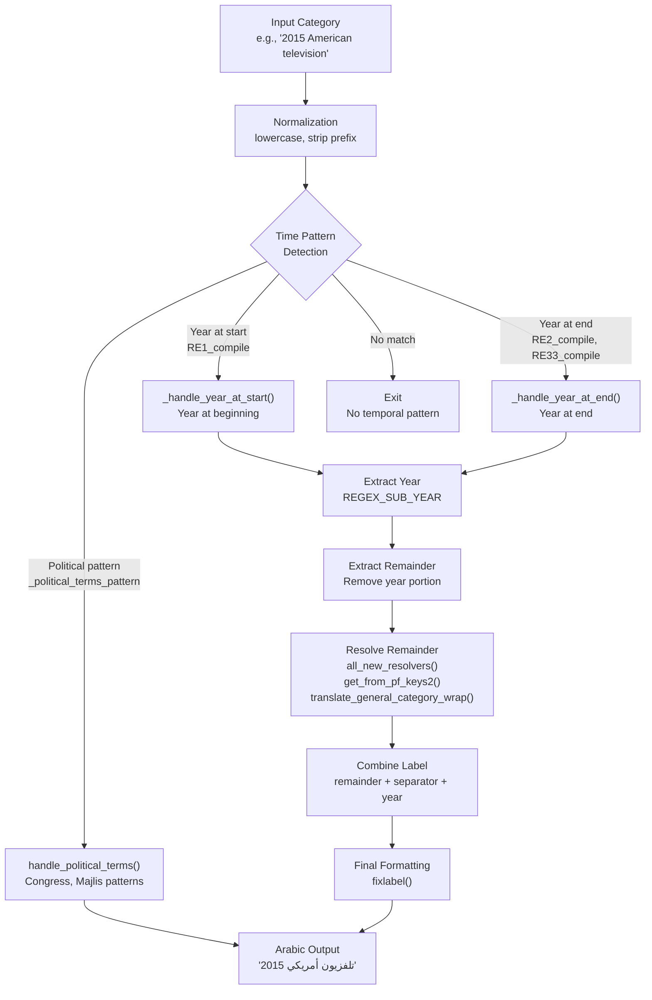
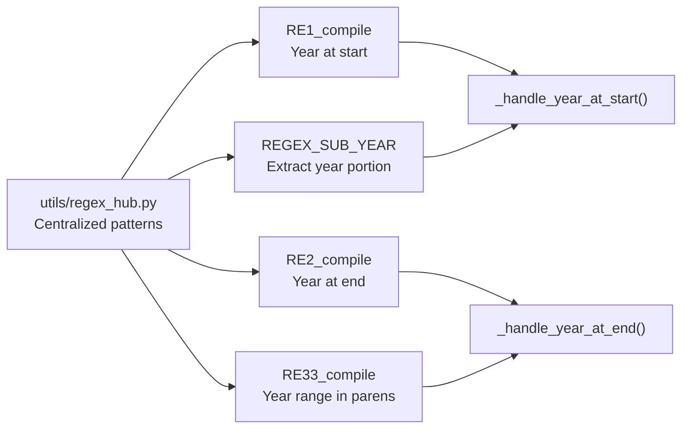
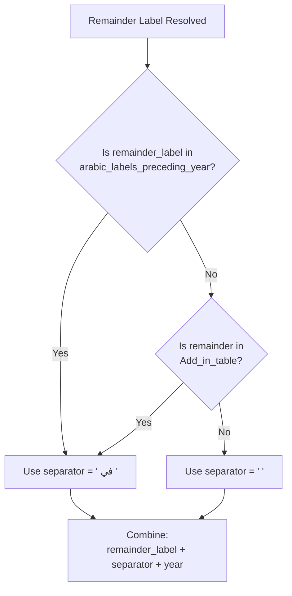
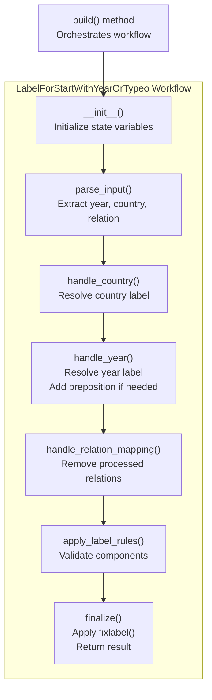
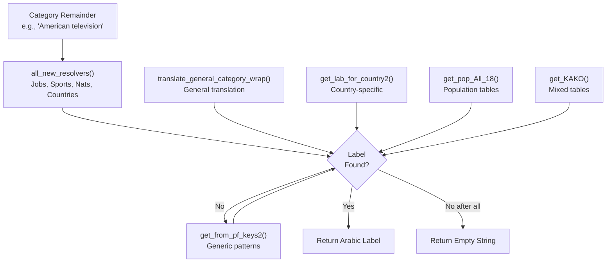
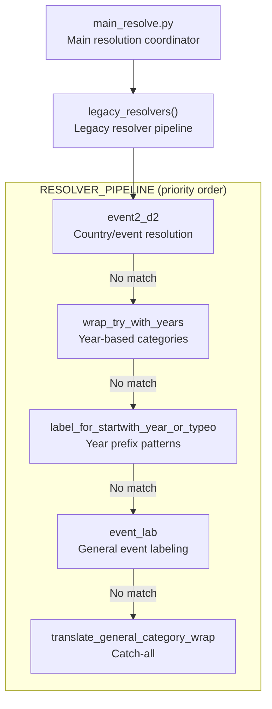
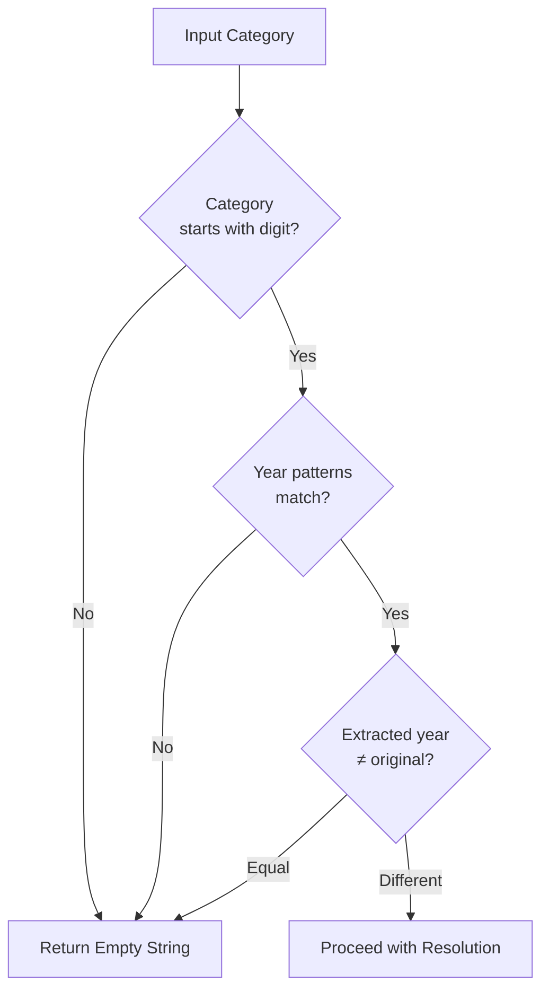

<details>
<summary>Relevant source files</summary>

The following files were used as context for generating this wiki page:

- [.github/copilot-instructions.md](.github/copilot-instructions.md)
- [.github/workflows/python-publish.yml](.github/workflows/python-publish.yml)
- [ArWikiCats/config.py](../ArWikiCats/config.py)
- [ArWikiCats/legacy_bots/__init__.py](../ArWikiCats/legacy_bots/__init__.py)
- [ArWikiCats/legacy_bots/legacy_resolvers_bots/country2_label_bot.py](../ArWikiCats/legacy_bots/legacy_resolvers_bots/country2_label_bot.py)
- [ArWikiCats/legacy_bots/legacy_resolvers_bots/event_lab_bot.py](../ArWikiCats/legacy_bots/legacy_resolvers_bots/event_lab_bot.py)
- [ArWikiCats/legacy_bots/legacy_resolvers_bots/with_years_bot.py](../ArWikiCats/legacy_bots/legacy_resolvers_bots/with_years_bot.py)
- [ArWikiCats/legacy_bots/legacy_resolvers_bots/year_or_typeo.py](../ArWikiCats/legacy_bots/legacy_resolvers_bots/year_or_typeo.py)
- [ArWikiCats/legacy_bots/legacy_utils/fixing.py](../ArWikiCats/legacy_bots/legacy_utils/fixing.py)
- [ArWikiCats/legacy_bots/make_bots/check_bot.py](../ArWikiCats/legacy_bots/make_bots/check_bot.py)
- [ArWikiCats/legacy_bots/make_bots/table1_bot.py](../ArWikiCats/legacy_bots/make_bots/table1_bot.py)
- [CLAUDE.md](CLAUDE.md)
- [README.md](README.md)
- [changelog.md](changelog.md)
- [examples/run.py](examples/run.py)
- [tests_require_fixes/test_papua_new_guinean.py](tests_require_fixes/test_papua_new_guinean.py)
- [tests_require_fixes/test_skip_data_all.py](tests_require_fixes/test_skip_data_all.py)
- [tests_require_fixes/text_to_fix.py](tests_require_fixes/text_to_fix.py)

</details>


## Purpose and Scope

Time Pattern Resolvers are specialized components in the ArWikiCats system that detect and translate temporal patterns in English Wikipedia category names into properly formatted Arabic equivalents. These resolvers handle years (e.g., "1990", "2015"), decades (e.g., "1550s", "1990s"), centuries (e.g., "20th century"), millennia, and BC dates, along with their associated category content.

For information about pattern-based resolvers for non-temporal patterns, see [Pattern-Based Resolvers](#5.0). For information about how time patterns combine with job categories, see [Time + Jobs Resolvers](#5.4)

**Sources:** [README.md L72-L86](../README.md#L72-L86), [ArWikiCats/legacy_bots/legacy_resolvers_bots/with_years_bot.py L1-L286](../ArWikiCats/legacy_bots/legacy_resolvers_bots/with_years_bot.py#L1-L286), [ArWikiCats/legacy_bots/legacy_resolvers_bots/year_or_typeo.py L1-L314](../ArWikiCats/legacy_bots/legacy_resolvers_bots/year_or_typeo.py#L1-L314)

---

## Resolution Priority

Time Pattern Resolvers have **highest priority** in the main resolver chain, positioned before all other specialized resolvers. This ensures that temporal information is correctly extracted and formatted before attempting nationality, job, or sports resolution.

**Resolver Chain Position:**
```
1. Time Resolvers ← HIGHEST PRIORITY
2. Pattern Resolvers
3. Jobs Resolvers
4. Sports Resolvers
5. Nationalities Resolvers
6. Countries Resolvers
...
```

**Sources:** [ArWikiCats/legacy_bots/__init__.py L43-L72](../ArWikiCats/legacy_bots/__init__.py#L43-L72), [CLAUDE.md L79-L92](../CLAUDE.md#L79-L92)

---

## Architecture Overview

### High-Level Data Flow



**Sources:** [ArWikiCats/legacy_bots/legacy_resolvers_bots/with_years_bot.py L103-L258](../ArWikiCats/legacy_bots/legacy_resolvers_bots/with_years_bot.py#L103-L258), [ArWikiCats/legacy_bots/legacy_resolvers_bots/year_or_typeo.py L39-L314](../ArWikiCats/legacy_bots/legacy_resolvers_bots/year_or_typeo.py#L39-L314)

---

## Main Resolver Functions

### Year Pattern Resolution

The system provides two main entry points for year-based resolution:

| Function | Purpose | Location |
|----------|---------|----------|
| `Try_With_Years()` | Primary year pattern handler; detects year position and constructs Arabic label | [with_years_bot.py L220-L258](../with_years_bot.py#L220-L258) |
| `label_for_startwith_year_or_typeo()` | Handles categories starting with years; includes country/relation resolution | [year_or_typeo.py L302-L313](../year_or_typeo.py#L302-L313) |
| `wrap_try_with_years()` | Wrapper that pre-filters and normalizes before calling `Try_With_Years()` | [with_years_bot.py L261-L285](../with_years_bot.py#L261-L285) |

**Sources:** [ArWikiCats/legacy_bots/legacy_resolvers_bots/with_years_bot.py L220-L285](../ArWikiCats/legacy_bots/legacy_resolvers_bots/with_years_bot.py#L220-L285), [ArWikiCats/legacy_bots/legacy_resolvers_bots/year_or_typeo.py L302-L313](../ArWikiCats/legacy_bots/legacy_resolvers_bots/year_or_typeo.py#L302-L313)

---

## Regex Patterns for Year Detection

### Pattern Compilation

Time pattern resolvers use pre-compiled regex patterns from the central regex hub:



**Pattern Types:**

| Pattern | Purpose | Example Match |
|---------|---------|---------------|
| `RE1_compile` | Matches year at beginning | "1990 United States Congress" |
| `RE2_compile` | Matches year at end | "American Soccer League 1933–83" |
| `RE33_compile` | Matches year range in parentheses | "League (1933–83)" |
| `REGEX_SUB_YEAR` | Extracts the year substring | Extracts "1990" from input |

**Sources:** [ArWikiCats/legacy_bots/utils/regex_hub.py L1-L30](../ArWikiCats/legacy_bots/utils/regex_hub.py#L1-L30), [ArWikiCats/legacy_bots/legacy_resolvers_bots/with_years_bot.py L25-L28](../ArWikiCats/legacy_bots/legacy_resolvers_bots/with_years_bot.py#L25-L28)

---

## Year Position Handlers

### Year at Start: `_handle_year_at_start()`

When a category begins with a year (e.g., "1990 United States Congress"), this function:

1. Extracts the year using `REGEX_SUB_YEAR.sub(r"\g<1>", category_text)`
2. Extracts the remainder by removing the year: `remainder = category_text[len(year):].strip().lower()`
3. Resolves the remainder through the resolver chain
4. Determines the appropriate separator (" " or " في ")
5. Constructs the label: `remainder_label + separator + year`

**Separator Selection Logic:**



**Special Cases:**

The `arabic_labels_preceding_year` list defines labels that require " في " before the year:
- "كتاب بأسماء مستعارة" (Writers with pseudonyms)
- "بطولات اتحاد رجبي للمنتخبات الوطنية" (Rugby union tournaments for national teams)

**Sources:** [ArWikiCats/legacy_bots/legacy_resolvers_bots/with_years_bot.py L103-L161](../ArWikiCats/legacy_bots/legacy_resolvers_bots/with_years_bot.py#L103-L161), [ArWikiCats/legacy_bots/legacy_resolvers_bots/with_years_bot.py L30-L35](../ArWikiCats/legacy_bots/legacy_resolvers_bots/with_years_bot.py#L30-L35)

---

### Year at End: `_handle_year_at_end()`

When a category ends with a year or year range (e.g., "American Soccer League (1933–83)"), this function:

1. Extracts the year using `compiled_year_pattern.sub(r"\g<1>", category_text.strip())`
2. Refines extraction if a range pattern is detected using `compiled_range_pattern`
3. Removes the year portion to get the remainder: `remainder = category_text[:-len(year_at_end_label)]`
4. Resolves the remainder through the resolver chain
5. Constructs the label: `remainder_label + " " + formatted_year_label`

**Special Handling:**
- Converts "–present" to "–الآن" (–now)
- Validates that extraction is successful (year ≠ original category)

**Sources:** [ArWikiCats/legacy_bots/legacy_resolvers_bots/with_years_bot.py L164-L216](../ArWikiCats/legacy_bots/legacy_resolvers_bots/with_years_bot.py#L164-L216)

---

## Political Terms Handler

### `handle_political_terms()`

Specialized handler for political body categories with ordinal numbers (e.g., "115th United States Congress"):

**Pattern Matching:**

```python
pattern_str = r"^(\d+)(th|nd|st|rd) ({'|'.join(known_bodies.keys())})$"
_political_terms_pattern = re.compile(pattern_str, re.IGNORECASE)
```

**Known Bodies:**

| English Pattern | Arabic Label |
|----------------|--------------|
| "iranian majlis" | "المجلس الإيراني" |
| "united states congress" | "الكونغرس الأمريكي" |

**Label Construction:**

1. Extract ordinal number (e.g., "115")
2. Match body key (e.g., "united states congress")
3. Convert ordinal to Arabic word using `change_numb_to_word` dictionary
4. Combine: `body_label + " " + ordinal_label`
5. Example: "الكونغرس الأمريكي الـ115"

**Sources:** [ArWikiCats/legacy_bots/legacy_resolvers_bots/with_years_bot.py L38-L100](../ArWikiCats/legacy_bots/legacy_resolvers_bots/with_years_bot.py#L38-L100)

---

## Complex Year+Country Resolver

### `LabelForStartWithYearOrTypeo` Class

For categories that combine years with countries and other elements (e.g., "1990 establishments in Yemen"), the system uses a stateful class-based resolver:



**State Variables:**

| Variable | Purpose |
|----------|---------|
| `year_at_first` | Extracted year from category |
| `country` / `country_lower` | Country name in original and lowercase |
| `in_str` | Separator/preposition ("in", "at", etc.) |
| `cat_test` | Remaining category text after extraction |
| `year_labe` | Converted Arabic year label |
| `arlabel` | Accumulated Arabic label |
| `add_in` / `add_in_done` | Flags for preposition insertion |

**Sources:** [ArWikiCats/legacy_bots/legacy_resolvers_bots/year_or_typeo.py L39-L292](../ArWikiCats/legacy_bots/legacy_resolvers_bots/year_or_typeo.py#L39-L292)

---

## Remainder Resolution Chain

When a year is extracted, the remainder of the category must be resolved to Arabic. The system uses a prioritized resolver chain:



**Chain Priority (from `_handle_year_at_start()`):**

1. `all_new_resolvers(remainder)` - Specialized resolvers for jobs, sports, nationalities
2. `get_from_pf_keys2(remainder)` - Generic pattern matching
3. `translate_general_category_wrap(remainder)` - General translation fallback
4. `get_lab_for_country2(remainder)` - Country label resolution
5. `get_pop_All_18(remainder)` - Population-based resolution
6. `get_KAKO(remainder)` - Mixed table lookup

**Sources:** [ArWikiCats/legacy_bots/legacy_resolvers_bots/with_years_bot.py L128-L143](../ArWikiCats/legacy_bots/legacy_resolvers_bots/with_years_bot.py#L128-L143), [ArWikiCats/legacy_bots/legacy_resolvers_bots/year_or_typeo.py L103-L109](../ArWikiCats/legacy_bots/legacy_resolvers_bots/year_or_typeo.py#L103-L109)

---

## Integration with Main Resolution Pipeline

### Legacy Resolver Integration

Time pattern resolvers are integrated into the legacy resolver pipeline at multiple priority levels:



**Invocation Points:**

1. **Direct invocation** via `wrap_try_with_years()` in `RESOLVER_PIPELINE`
2. **Nested invocation** via `label_for_startwith_year_or_typeo()` in `RESOLVER_PIPELINE`
3. **Indirect invocation** when `event_label_work()` calls `with_years_bot.wrap_try_with_years()`

**Sources:** [ArWikiCats/legacy_bots/__init__.py L66-L72](../ArWikiCats/legacy_bots/__init__.py#L66-L72), [ArWikiCats/legacy_bots/legacy_resolvers_bots/event_lab_bot.py L99-L108](../ArWikiCats/legacy_bots/legacy_resolvers_bots/event_lab_bot.py#L99-L108)

---

## Preposition Handling

### Arabic Preposition Injection

Time pattern resolvers must determine when to insert Arabic prepositions (" في ", " من ", etc.) based on context:

**Preposition Rules:**

| Condition | Preposition | Position | Example |
|-----------|-------------|----------|---------|
| `in_str.strip() == "in"` | " في " | After year | "أفلام 1990 في مصر" |
| `in_str.strip() == "at"` | " في " | After year | "أحداث 1990 في القاهرة" |
| `in_str.strip() == "from"` | " من " | Before country | "مهاجرون من اليمن" |
| Remainder in `Add_in_table` | " في " | After year | Category-specific |

**Preposition Insertion Logic (from `handle_year()`):**

```python
if (self.in_str.strip() in ("in", "at")) and not self.suf.strip():
    logger.info(f"Add في to arlabel:in, at: {self.arlabel}")
    self.arlabel += " في "
    self.cat_test = self.replace_cat_test(self.cat_test, self.in_str)
    self.add_in = False
    self.add_in_done = True
```

**Sources:** [ArWikiCats/legacy_bots/legacy_resolvers_bots/year_or_typeo.py L119-L144](../ArWikiCats/legacy_bots/legacy_resolvers_bots/year_or_typeo.py#L119-L144), [ArWikiCats/legacy_bots/legacy_resolvers_bots/with_years_bot.py L148-L156](../ArWikiCats/legacy_bots/legacy_resolvers_bots/with_years_bot.py#L148-L156)

---

## Translation Data Integration

### `WORD_AFTER_YEARS` Dictionary

The system maintains a specialized dictionary for common terms that follow years:

```python
from ...translations import WORD_AFTER_YEARS

# Example lookup:
if remainder in WORD_AFTER_YEARS:
    remainder_label = WORD_AFTER_YEARS[remainder]
```

This dictionary provides direct mappings for common year-suffixed patterns without requiring full resolver chain traversal.

**Sources:** [ArWikiCats/legacy_bots/legacy_resolvers_bots/with_years_bot.py L19-L20](../ArWikiCats/legacy_bots/legacy_resolvers_bots/with_years_bot.py#L19-L20), [ArWikiCats/legacy_bots/legacy_resolvers_bots/with_years_bot.py L130-L131](../ArWikiCats/legacy_bots/legacy_resolvers_bots/with_years_bot.py#L130-L131)

---

## Blocked Prepositions Filter

### Input Filtering

The `wrap_try_with_years()` function filters out categories containing certain English prepositions to prevent incorrect year-based resolution:

**Blocked Prepositions:**

```python
blocked = ("in", "of", "from", "by", "at")
if any(f" {word} " in cat3.lower() for word in blocked):
    return ""
```

**Rationale:**

Categories like "British footballers in France" should be handled by country+sport resolvers, not year resolvers. The presence of these prepositions indicates a more complex pattern that requires specialized handling.

**Sources:** [ArWikiCats/legacy_bots/legacy_resolvers_bots/with_years_bot.py L276-L279](../ArWikiCats/legacy_bots/legacy_resolvers_bots/with_years_bot.py#L276-L279)

---

## Caching Strategy

### LRU Cache Implementation

Time pattern resolvers use `functools.lru_cache` for performance optimization:

| Function | Cache Size | Purpose |
|----------|-----------|---------|
| `Try_With_Years()` | 10,000 | Cache year pattern resolutions |
| `event_label_work()` | 10,000 | Cache event label lookups |

**Cache Benefits:**

1. **Performance:** Repeated category translations avoid regex matching and resolver chain traversal
2. **Memory:** LRU eviction prevents unbounded memory growth
3. **Consistency:** Same input always produces same output

**Sources:** [ArWikiCats/legacy_bots/legacy_resolvers_bots/with_years_bot.py:219](../ArWikiCats/legacy_bots/legacy_resolvers_bots/with_years_bot.py:219), [ArWikiCats/legacy_bots/legacy_resolvers_bots/event_lab_bot.py:82](../ArWikiCats/legacy_bots/legacy_resolvers_bots/event_lab_bot.py:82)

---

## Error Handling and Validation

### Category Text Validation

The system performs multiple validation checks before attempting resolution:



**Validation Points:**

1. **Digit check:** `if re.sub(r"^\d", "", cat3) != cat3`
2. **Year extraction:** Verify `year != category_text`
3. **Remainder resolution:** Verify `remainder_label != ""`
4. **Pattern match:** Verify at least one regex matches

**Sources:** [ArWikiCats/legacy_bots/legacy_resolvers_bots/with_years_bot.py L238-L254](../ArWikiCats/legacy_bots/legacy_resolvers_bots/with_years_bot.py#L238-L254), [ArWikiCats/legacy_bots/legacy_resolvers_bots/year_or_typeo.py L170-L216](../ArWikiCats/legacy_bots/legacy_resolvers_bots/year_or_typeo.py#L170-L216)

---

## Example Translations

### Year Pattern Examples

| Input Category | Extracted Year | Remainder | Arabic Output |
|----------------|----------------|-----------|---------------|
| "2015 American television" | "2015" | "American television" | "تلفزيون أمريكي 2015" |
| "1990 establishments in Yemen" | "1990" | "establishments in Yemen" | "تأسيسات 1990 في اليمن" |
| "American Soccer League (1933–83)" | "1933–83" | "American Soccer League" | "دوري كرة القدم الأمريكي 1933–83" |
| "115th United States Congress" | "115" | N/A (political term) | "الكونغرس الأمريكي الـ115" |

### Decade and Century Examples

These are handled by the broader time conversion system (see `time_to_arabic.py`):

| Input Pattern | Output Pattern |
|---------------|----------------|
| "1550s establishments" | "تأسيسات عقد 1550" |
| "20th century" | "القرن 20" |
| "10BC battles" | "معارك 10 ق م" |

**Sources:** [README.md L82-L86](../README.md#L82-L86), [examples/run.py L42-L44](../examples/run.py#L42-L44)

---

## Component Summary

### Key Files and Functions

| File | Key Functions | Purpose |
|------|---------------|---------|
| `with_years_bot.py` | `Try_With_Years()`<br/>`wrap_try_with_years()`<br/>`_handle_year_at_start()`<br/>`_handle_year_at_end()`<br/>`handle_political_terms()` | Primary year pattern detection and resolution |
| `year_or_typeo.py` | `label_for_startwith_year_or_typeo()`<br/>`LabelForStartWithYearOrTypeo.build()` | Complex year+country+relation resolution |
| `regex_hub.py` | `RE1_compile`<br/>`RE2_compile`<br/>`RE33_compile`<br/>`REGEX_SUB_YEAR` | Pre-compiled year detection patterns |
| `event_lab_bot.py` | `event_label_work()` | Integrates year resolution into event labeling |

**Sources:** [ArWikiCats/legacy_bots/legacy_resolvers_bots/with_years_bot.py L1-L286](../ArWikiCats/legacy_bots/legacy_resolvers_bots/with_years_bot.py#L1-L286), [ArWikiCats/legacy_bots/legacy_resolvers_bots/year_or_typeo.py L1-L314](../ArWikiCats/legacy_bots/legacy_resolvers_bots/year_or_typeo.py#L1-L314), [ArWikiCats/legacy_bots/utils/regex_hub.py](../ArWikiCats/legacy_bots/utils/regex_hub.py), [ArWikiCats/legacy_bots/legacy_resolvers_bots/event_lab_bot.py L82-L108](../ArWikiCats/legacy_bots/legacy_resolvers_bots/event_lab_bot.py#L82-L108)27:T8194,# Nationality Resolvers

