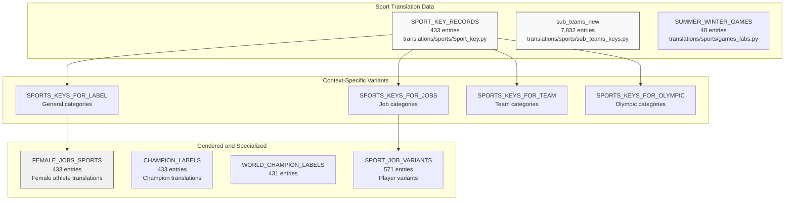
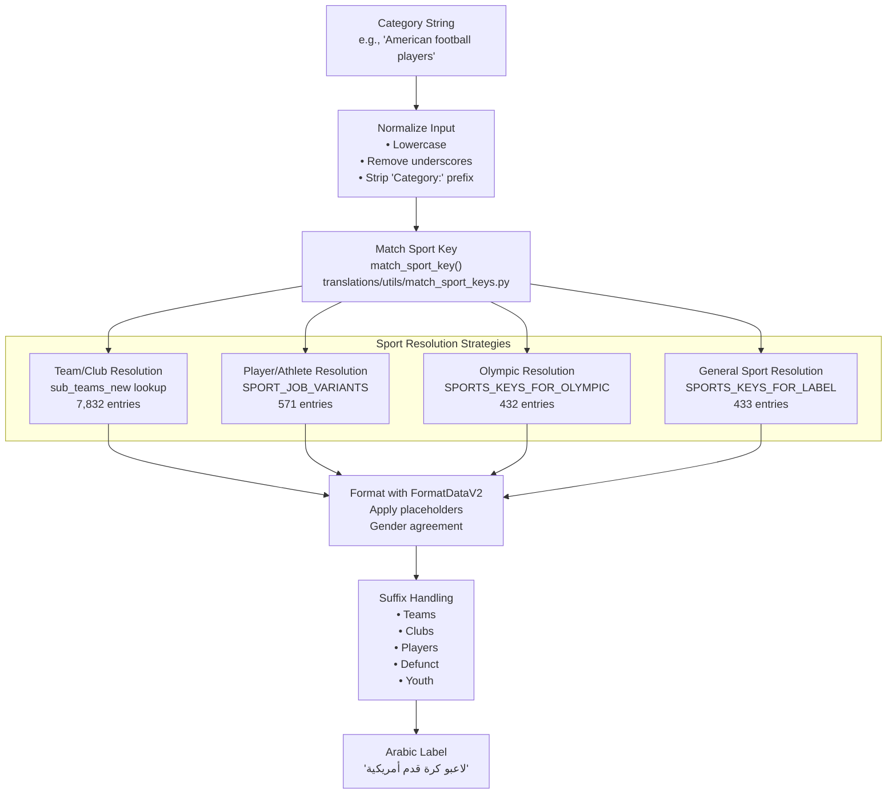
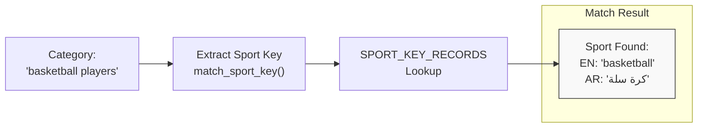
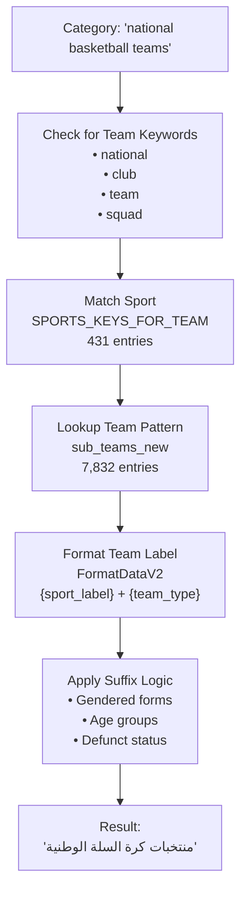
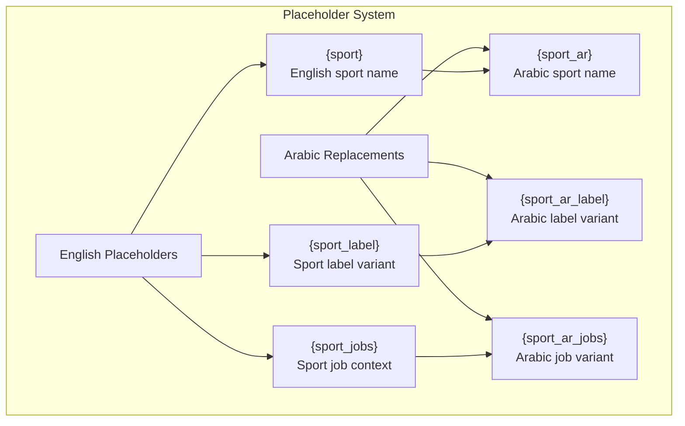
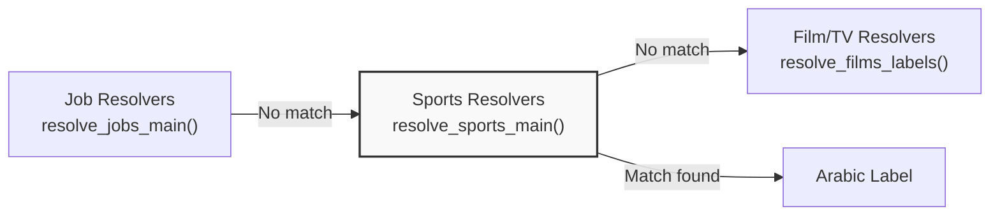

<details>
<summary>Relevant source files</summary>

The following files were used as context for generating this wiki page:

- [ArWikiCats/jsons/sports/Sports_Keys_New.json](../ArWikiCats/jsons/sports/Sports_Keys_New.json)
- [ArWikiCats/new_resolvers/__init__.py](../ArWikiCats/new_resolvers/__init__.py)
- [ArWikiCats/new_resolvers/countries_names_resolvers/__init__.py](../ArWikiCats/new_resolvers/countries_names_resolvers/__init__.py)
- [ArWikiCats/new_resolvers/countries_names_with_sports/__init__.py](../ArWikiCats/new_resolvers/countries_names_with_sports/__init__.py)
- [ArWikiCats/new_resolvers/countries_names_with_sports/p17_bot_sport.py](../ArWikiCats/new_resolvers/countries_names_with_sports/p17_bot_sport.py)
- [ArWikiCats/new_resolvers/countries_names_with_sports/p17_sport_to_move_under.py](../ArWikiCats/new_resolvers/countries_names_with_sports/p17_sport_to_move_under.py)
- [ArWikiCats/new_resolvers/films_resolvers/__init__.py](../ArWikiCats/new_resolvers/films_resolvers/__init__.py)
- [ArWikiCats/new_resolvers/films_resolvers/resolve_films_labels.py](../ArWikiCats/new_resolvers/films_resolvers/resolve_films_labels.py)
- [ArWikiCats/new_resolvers/jobs_resolvers/__init__.py](../ArWikiCats/new_resolvers/jobs_resolvers/__init__.py)
- [ArWikiCats/new_resolvers/jobs_resolvers/relegin_jobs_new.py](../ArWikiCats/new_resolvers/jobs_resolvers/relegin_jobs_new.py)
- [ArWikiCats/new_resolvers/nationalities_resolvers/__init__.py](../ArWikiCats/new_resolvers/nationalities_resolvers/__init__.py)
- [ArWikiCats/new_resolvers/nationalities_resolvers/nationalities_v2.py](../ArWikiCats/new_resolvers/nationalities_resolvers/nationalities_v2.py)
- [ArWikiCats/new_resolvers/sports_resolvers/__init__.py](../ArWikiCats/new_resolvers/sports_resolvers/__init__.py)
- [ArWikiCats/new_resolvers/sports_resolvers/countries_names_and_sports.py](../ArWikiCats/new_resolvers/sports_resolvers/countries_names_and_sports.py)
- [ArWikiCats/new_resolvers/sports_resolvers/nationalities_and_sports.py](../ArWikiCats/new_resolvers/sports_resolvers/nationalities_and_sports.py)
- [ArWikiCats/new_resolvers/sports_resolvers/pre_defined.py](../ArWikiCats/new_resolvers/sports_resolvers/pre_defined.py)
- [ArWikiCats/new_resolvers/sports_resolvers/raw_sports.py](../ArWikiCats/new_resolvers/sports_resolvers/raw_sports.py)
- [ArWikiCats/new_resolvers/sports_resolvers/raw_sports_with_suffixes.py](../ArWikiCats/new_resolvers/sports_resolvers/raw_sports_with_suffixes.py)
- [ArWikiCats/new_resolvers/sports_resolvers/sport_lab_nat.py](../ArWikiCats/new_resolvers/sports_resolvers/sport_lab_nat.py)
- [ArWikiCats/new_resolvers/teams_mappings_ends.py](../ArWikiCats/new_resolvers/teams_mappings_ends.py)

</details>


This page documents the sports resolution system within the resolver chain, responsible for translating English Wikipedia categories related to sports, teams, clubs, athletes, and competitions into Arabic. For information about resolving job categories related to sports (e.g., "footballers", "basketball coaches"), see [Job Resolvers](18.Job-Resolvers.md). For nationality-based patterns like "American athletes", see [Nationality Resolvers](16.Nationality-Resolvers.md)

## Overview

The sports resolvers handle categories that reference:
- Sport names (e.g., "football", "basketball", "tennis")
- Teams and clubs (e.g., "national teams", "football clubs")
- Athletes and players (e.g., "Olympic athletes", "champions")
- Competitions and venues (e.g., "World Cup", "Olympic Games")
- Sport-specific contexts (e.g., "defunct", "youth", "women's")

The system manages 433 core sport translations (`SPORT_KEY_RECORDS`) and 7,832 team/club translations (`sub_teams_new`), representing one of the largest specialized translation domains in the codebase.

**Sources:** [_work_files/data_len.json L54-L62](../_work_files/data_len.json#L54-L62), [ArWikiCats/translations/__init__.py L56-L64](../ArWikiCats/translations/__init__.py#L56-L64)

## Data Architecture

### Sport Translation Datasets

The sports domain maintains multiple specialized translation dictionaries, each serving a different resolution context:

| Dataset | Size | Purpose |
|---------|------|---------|
| `SPORT_KEY_RECORDS` | 433 | Base sport name translations (English → Arabic) |
| `SPORT_KEY_RECORDS_BASE` | 229 | Core sport name variants without suffixes |
| `sub_teams_new` | 7,832 | Team and club name translations |
| `SPORTS_KEYS_FOR_LABEL` | 433 | Sport labels for general categories |
| `SPORTS_KEYS_FOR_JOBS` | 433 | Sport labels for job-related categories |
| `SPORTS_KEYS_FOR_TEAM` | 431 | Sport labels for team categories |
| `SPORTS_KEYS_FOR_OLYMPIC` | 432 | Sport labels for Olympic categories |
| `SPORT_JOB_VARIANTS` | 571 | Sport-specific job variants (players, coaches) |
| `CHAMPION_LABELS` | 433 | Champion category translations |
| `WORLD_CHAMPION_LABELS` | 431 | World champion translations |
| `FEMALE_JOBS_SPORTS` | 433 | Female-specific sports job translations |
| `SUMMER_WINTER_GAMES` | 48 | Olympic Games year mappings |

**Sources:** [_work_files/data_len.json L54-L117](../_work_files/data_len.json#L54-L117), [ArWikiCats/translations/__init__.py L56-L64](../ArWikiCats/translations/__init__.py#L56-L64)

### Sport Data Structure



**Sources:** [ArWikiCats/translations/__init__.py L56-L78](../ArWikiCats/translations/__init__.py#L56-L78), [_work_files/data_len.json L54-L90](../_work_files/data_len.json#L54-L90)

## Resolution Process

### Main Resolution Function

The sports resolver is invoked as part of the resolver chain through `resolve_sports_main()`, which attempts to match sports-related categories using multiple strategies:



**Sources:** [ArWikiCats/translations/utils/match_sport_keys.py](), [ArWikiCats/translations/__init__.py L77-L78](../ArWikiCats/translations/__init__.py#L77-L78)

### Sport Key Matching

The `match_sport_key()` function performs fuzzy matching to identify sport names within category strings. This function:

1. Normalizes the input category text
2. Searches for sport keywords in `SPORT_KEY_RECORDS`
3. Returns the matched sport key and its Arabic translation
4. Handles multi-word sport names (e.g., "american football", "ice hockey")



**Sources:** [ArWikiCats/translations/utils/match_sport_keys.py](), [changelog.md:205]()

## Context-Specific Resolution

### Team and Club Categories

Team and club categories use the `sub_teams_new` dataset (7,832 entries), which includes:

- National teams (e.g., "France national football team" → "منتخب فرنسا لكرة القدم")
- Club teams (e.g., "FC Barcelona" → "نادي برشلونة")
- League teams (e.g., "Premier League clubs" → "أندية الدوري الإنجليزي الممتاز")
- Defunct teams (e.g., "defunct football clubs" → "أندية كرة قدم سابقة")

The resolution process for teams:



**Sources:** [_work_files/data_len.json:7](), [changelog.md L205-L207](../changelog.md#L205-L207), [tests/event_lists/test_defunct.py L12-L65](../tests/event_lists/test_defunct.py#L12-L65)

### Olympic and International Competitions

Olympic categories use specialized resolvers that handle:

- Olympic Games by year (using `SUMMER_WINTER_GAMES`)
- Olympic sports (using `SPORTS_KEYS_FOR_OLYMPIC`)
- Medalists and champions (using `CHAMPION_LABELS`)

Example patterns:
- "Olympic athletes" → "رياضيون أولمبيون"
- "2020 Summer Olympics" → "الألعاب الأولمبية الصيفية 2020"
- "Olympic medalists in swimming" → "حاصلون على ميداليات أولمبية في السباحة"

**Sources:** [_work_files/data_len.json L60-L62](../_work_files/data_len.json#L60-L62), [_work_files/data_len.json L113-L114](../_work_files/data_len.json#L113-L114)

### Gender-Specific Sports Categories

The sports resolver handles gendered forms through multiple mechanisms:

1. **Female-specific job translations** (`FEMALE_JOBS_SPORTS`, 433 entries)
2. **Gendered suffix patterns** (e.g., "women's", "female", "ladies'")
3. **Arabic gender agreement** (masculine plural, feminine plural)

| English Pattern | Arabic Translation | Dataset |
|----------------|-------------------|---------|
| "female athletes" | "رياضيات" | `FEMALE_JOBS_SPORTS` |
| "women's basketball" | "كرة سلة نسائية" | `SPORTS_KEYS_FOR_LABEL` |
| "footballers" (male) | "لاعبو كرة قدم" | `SPORT_JOB_VARIANTS` |
| "footballers" (female context) | "لاعبات كرة قدم" | `FEMALE_JOBS_SPORTS` |

**Sources:** [_work_files/data_len.json:58](), [changelog.md L239-L241](../changelog.md#L239-L241), [tests/event_lists/test_defunct.py L62-L65](../tests/event_lists/test_defunct.py#L62-L65)

### Age-Group and Youth Sports

Youth and age-group sports categories are handled through suffix detection:

- "youth" → "شباب"
- "under-21" → "تحت 21"
- "junior" → "ناشئون"
- "amateur" → "هواة"

**Sources:** [changelog.md L263-L271](../changelog.md#L263-L271), [changelog.md L290-L303](../changelog.md#L290-L303)

### Defunct and Historical Sports

Defunct sports categories (from test data) use the "defunct" → "سابقة" pattern:

Examples from test suite:
- "defunct football clubs" → "أندية كرة قدم سابقة"
- "defunct national sports teams" → "فرق رياضية وطنية سابقة"
- "defunct basketball venues" → "ملاعب كرة سلة سابقة"

**Sources:** [tests/event_lists/test_defunct.py L12-L65](../tests/event_lists/test_defunct.py#L12-L65)

## Formatting Integration

### FormatDataV2 Usage

The sports resolver uses `FormatDataV2` for template-based translation with placeholder substitution. This allows complex patterns like:

```
Pattern: "{nat} {sport} players"
Template: "لاعبو {sport_ar} {nat_ar}"
```

The formatting system handles:
- **Sport placeholders**: `{sport}`, `{sport_ar}`, `{sport_label}`, `{sport_jobs}`
- **Context placeholders**: `{team_type}`, `{competition}`, `{venue_type}`
- **Gender placeholders**: `{male}`, `{female}`, `{males}`, `{females}`

**Sources:** [changelog.md:205](), [ArWikiCats/translations_formats/]()

### Sport Placeholder Types



**Sources:** [changelog.md:205]()

## Resolver Chain Integration

Within the overall resolver chain, sports resolvers are invoked after job resolvers and before film/TV resolvers:



This ordering ensures that job-related sports categories (e.g., "basketball coaches") are resolved by the job resolver, while pure sports categories (e.g., "basketball competitions") are handled by the sports resolver.

**Sources:** High-level architecture diagrams (Diagram 1, Diagram 3)

## Resolution Examples

### Example Resolution Paths

| Input Category | Matched Dataset | Resolution Path | Arabic Output |
|---------------|----------------|-----------------|---------------|
| "Olympic athletes" | `SPORTS_KEYS_FOR_OLYMPIC` | match_sport_key("athletes") → FormatDataV2 | "رياضيون أولمبيون" |
| "national basketball teams" | `sub_teams_new` + `SPORTS_KEYS_FOR_TEAM` | match_sport_key("basketball") → team pattern | "منتخبات كرة السلة الوطنية" |
| "defunct football clubs" | `SPORT_KEY_RECORDS` | match_sport_key("football") → suffix("defunct") | "أندية كرة قدم سابقة" |
| "women's basketball" | `SPORTS_KEYS_FOR_LABEL` | match_sport_key("basketball") → gender("women's") | "كرة سلة نسائية" |

**Sources:** [tests/event_lists/test_defunct.py L12-L65](../tests/event_lists/test_defunct.py#L12-L65)

## Performance Characteristics

The sports resolver benefits from:

1. **Caching**: Function results are cached using `functools.lru_cache` (introduced in PR #313)
2. **Optimized lookups**: Case-insensitive dictionary lookups for sport keys
3. **Early exit**: Returns immediately upon first match
4. **Pre-compiled patterns**: Regex patterns compiled at module load time

**Sources:** [changelog.md L23-L49](../changelog.md#L23-L49)

## Data Updates and Maintenance

Recent updates to the sports resolver (from changelog):

- **PR #276** (2025-12-27): Refactored sports team logic to use `{sport_jobs}` placeholders and `FormatDataV2`
- **PR #275** (2025-12-27): Introduced sports category resolution capability
- **PR #272** (2025-12-26): Added Olympic, wheelchair, clubs & teams translations
- **PR #263** (2025-12-23): Enhanced suffix-based resolution for teams/leagues
- **PR #262** (2025-12-23): Replaced legacy hard-coded resolution with data-driven pipeline
- **PR #260** (2025-12-23): Expanded team, youth, amateur and women's variants

The sports data is tracked in `data_len.json` for size monitoring and regression detection.

**Sources:** [changelog.md L205-L303](../changelog.md#L205-L303), [_work_files/data_len.json L54-L90](../_work_files/data_len.json#L54-L90)2b:T59c4,# Film and TV Resolvers

