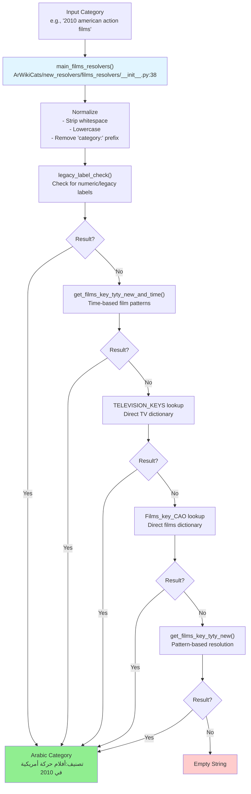
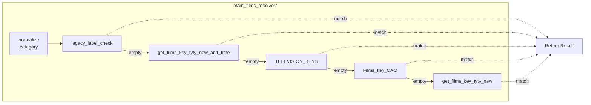
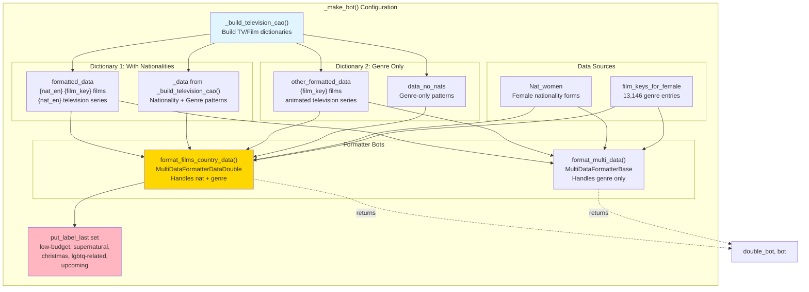
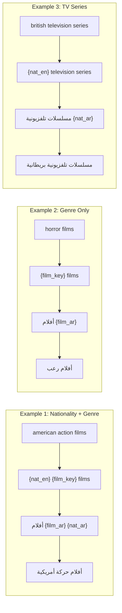
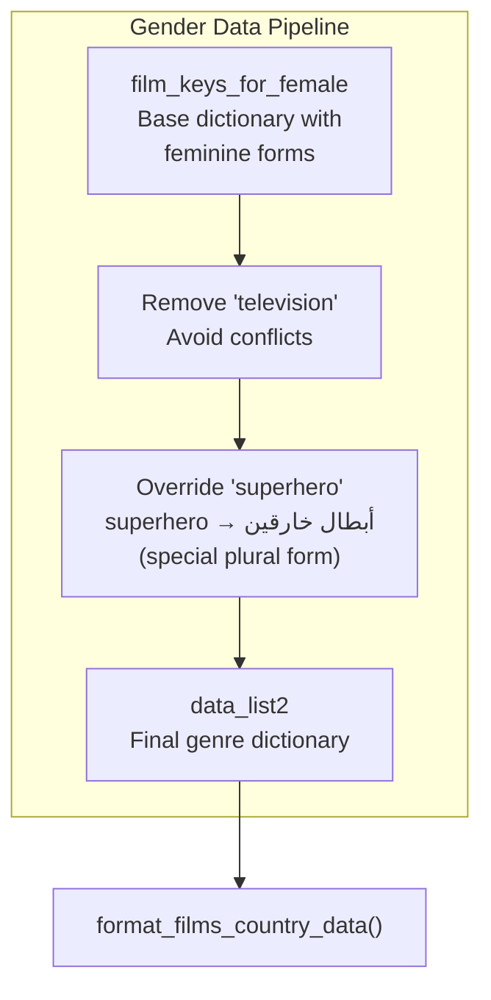
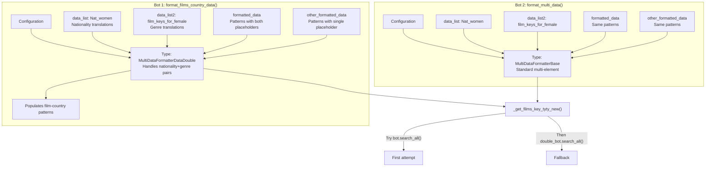
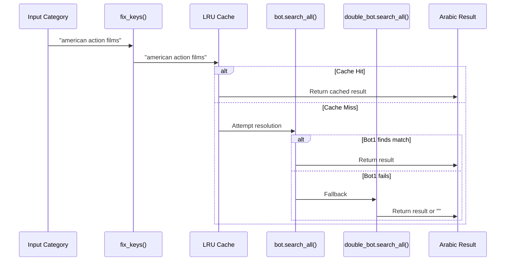
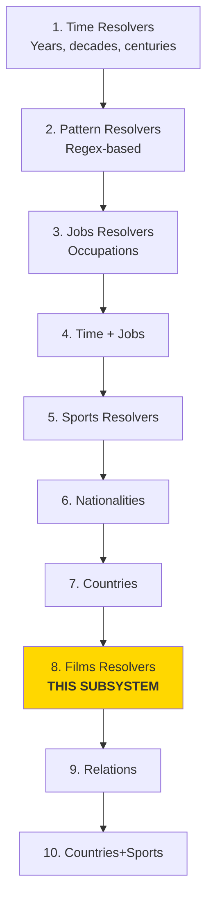

<details>
<summary>Relevant source files</summary>

The following files were used as context for generating this wiki page:

- [ArWikiCats/new_resolvers/__init__.py](../ArWikiCats/new_resolvers/__init__.py)
- [ArWikiCats/new_resolvers/countries_names_resolvers/__init__.py](../ArWikiCats/new_resolvers/countries_names_resolvers/__init__.py)
- [ArWikiCats/new_resolvers/countries_names_with_sports/__init__.py](../ArWikiCats/new_resolvers/countries_names_with_sports/__init__.py)
- [ArWikiCats/new_resolvers/countries_names_with_sports/p17_bot_sport.py](../ArWikiCats/new_resolvers/countries_names_with_sports/p17_bot_sport.py)
- [ArWikiCats/new_resolvers/countries_names_with_sports/p17_sport_to_move_under.py](../ArWikiCats/new_resolvers/countries_names_with_sports/p17_sport_to_move_under.py)
- [ArWikiCats/new_resolvers/films_resolvers/__init__.py](../ArWikiCats/new_resolvers/films_resolvers/__init__.py)
- [ArWikiCats/new_resolvers/films_resolvers/resolve_films_labels.py](../ArWikiCats/new_resolvers/films_resolvers/resolve_films_labels.py)
- [ArWikiCats/new_resolvers/jobs_resolvers/__init__.py](../ArWikiCats/new_resolvers/jobs_resolvers/__init__.py)
- [ArWikiCats/new_resolvers/jobs_resolvers/relegin_jobs_new.py](../ArWikiCats/new_resolvers/jobs_resolvers/relegin_jobs_new.py)
- [ArWikiCats/new_resolvers/nationalities_resolvers/__init__.py](../ArWikiCats/new_resolvers/nationalities_resolvers/__init__.py)
- [ArWikiCats/new_resolvers/sports_resolvers/__init__.py](../ArWikiCats/new_resolvers/sports_resolvers/__init__.py)
- [ArWikiCats/new_resolvers/sports_resolvers/countries_names_and_sports.py](../ArWikiCats/new_resolvers/sports_resolvers/countries_names_and_sports.py)
- [ArWikiCats/new_resolvers/sports_resolvers/nationalities_and_sports.py](../ArWikiCats/new_resolvers/sports_resolvers/nationalities_and_sports.py)
- [ArWikiCats/new_resolvers/sports_resolvers/pre_defined.py](../ArWikiCats/new_resolvers/sports_resolvers/pre_defined.py)
- [ArWikiCats/new_resolvers/sports_resolvers/raw_sports.py](../ArWikiCats/new_resolvers/sports_resolvers/raw_sports.py)
- [ArWikiCats/new_resolvers/sports_resolvers/raw_sports_with_suffixes.py](../ArWikiCats/new_resolvers/sports_resolvers/raw_sports_with_suffixes.py)
- [ArWikiCats/new_resolvers/sports_resolvers/sport_lab_nat.py](../ArWikiCats/new_resolvers/sports_resolvers/sport_lab_nat.py)
- [ArWikiCats/new_resolvers/teams_mappings_ends.py](../ArWikiCats/new_resolvers/teams_mappings_ends.py)
- [examples/data/endings.json](examples/data/endings.json)
- [examples/data/novels.json](examples/data/novels.json)
- [examples/data/television series.json](examples/data/television series.json)

</details>


## Purpose and Scope

The Film and TV Resolvers subsystem translates English Wikipedia categories for films, television series, and related media into Arabic. This resolver handles categories combining nationality, genre, time periods, and media types (e.g., "2010 American action films" → "أفلام حركة أمريكية في 2010"). The system manages 13,146 film/TV entries with gender-specific handling and nationality placeholder patterns.

For job-related resolvers (including sports-related jobs), see [Job Resolvers](18.Job-Resolvers.md). For nationality-based categories without media types, see [Nationality Resolvers](16.Nationality-Resolvers.md). For time pattern resolution, see [Time Pattern Resolvers](15.Time-Pattern-Resolvers.md).

## Resolution Architecture

The film and TV resolver system operates as part of the main resolver chain with priority 7 (after jobs, sports, nationalities, and countries but before relations and languages). The system uses a multi-stage resolution process combining direct lookups, time-based patterns, and template-based formatters.

### Resolver Flow Diagram



**Sources:** [ArWikiCats/new_resolvers/films_resolvers/__init__.py:37-66]()

## Main Entry Point

The `main_films_resolvers()` function serves as the orchestrator for all film and television category resolution. It implements a waterfall pattern where each resolver is tried in sequence until one returns a non-empty result.



The function performs these operations:
1. **Normalization**: Strips whitespace, converts to lowercase, removes "category:" prefix
2. **Legacy check**: Returns numeric categories as-is, maps "people" to "أشخاص"
3. **Time-based**: Handles year/decade + film/TV combinations
4. **Direct lookups**: Queries pre-compiled dictionaries for exact matches
5. **Pattern matching**: Uses template-based formatters for complex patterns

**Sources:** [ArWikiCats/new_resolvers/films_resolvers/__init__.py:18-66]()

## Legacy Label Checker

The `legacy_label_check()` function handles two special cases that don't require full template processing:

| Input Pattern | Output | Description |
|---------------|--------|-------------|
| `^\d+$` | Same number | Numeric categories (e.g., "2010") |
| `people` | `أشخاص` | Generic people category |

This early check avoids unnecessary processing for categories that are already in their final form or need simple direct translation.

**Sources:** [ArWikiCats/new_resolvers/films_resolvers/__init__.py:18-34]()

## Template System Architecture

The core of the film resolver system is a sophisticated template engine that combines nationality data with film/TV genre keys to generate Arabic translations. The system uses dual-bot architecture with separate handling for nationality+genre patterns versus genre-only patterns.

### Bot Configuration Diagram



**Sources:** [ArWikiCats/new_resolvers/films_resolvers/resolve_films_labels.py:154-260]()

## Television CAO Dictionary Builder

The `_build_television_cao()` function constructs two complementary translation dictionaries for television and film categories. "CAO" likely stands for "Characters And Others" based on the pattern types it handles.

### Pattern Categories

The builder creates patterns for:

1. **Base suffixes**: characters, title cards, video covers, posters, images
2. **Genre categories**: 27 media types including:
   - Television: series, episodes, programs, shows, miniseries
   - Film: films, film characters, film series
   - Other: novels, novellas, comics, video games, web series

3. **Compound patterns**: Genre + suffix combinations (e.g., "television series characters")

### Dictionary Structure

| Dictionary | Purpose | Example Pattern | Example Output |
|------------|---------|-----------------|----------------|
| `data` | With nationality placeholder | `{nat_en} {film_key} films` | `أفلام {film_ar} {nat_ar}` |
| `data_no_nats` | Without nationality | `{film_key} films` | `أفلام {film_ar}` |

The function generates 100+ pattern combinations by cross-multiplying:
- 5 base suffixes × 27 genre categories = 135 compound patterns
- Plus standalone genre patterns
- Plus nationality-genre combinations

**Sources:** [ArWikiCats/new_resolvers/films_resolvers/resolve_films_labels.py:27-151]()

## Placeholder System

The film resolver uses a multi-placeholder template system that allows flexible composition of nationality, genre, and descriptor elements.

### Placeholder Types

| Placeholder | Purpose | Example Input | Example Value |
|-------------|---------|---------------|---------------|
| `{nat_en}` | English nationality | "american" | Looked up in Nat_women |
| `{nat_ar}` | Arabic nationality | Result | "أمريكية" |
| `{film_key}` | English genre key | "action" | Looked up in film_keys_for_female |
| `{film_ar}` | Arabic genre value | Result | "حركة" |

### Template Examples



**Sources:** [ArWikiCats/new_resolvers/films_resolvers/resolve_films_labels.py:171-260]()

## Gender-Specific Handling

The film resolver system includes sophisticated gender handling for film genres, as Arabic translation requires grammatically gendered forms. This is implemented through `film_keys_for_female`, which provides feminine forms for genre descriptors.

### Gender Data Structure

The system uses feminine forms by default from `film_keys_for_female`, then selectively overrides specific entries:



### Special Genre Handling

| Genre Key | Arabic Value | Notes |
|-----------|--------------|-------|
| action | حركة | Feminine form for "films" (أفلام) |
| drama | درامية | Feminine adjective |
| horror | رعب | Masculine noun (no gender change) |
| superhero | أبطال خارقين | Plural form (overridden) |
| upcoming | قادمة | Feminine participle |

### Label Positioning

The `put_label_last` set controls word order for specific genres where the Arabic translation should appear after the main noun rather than before:

```python
put_label_last = {
    "low-budget",
    "supernatural",
    "christmas",
    "lgbtq-related",
    "upcoming",
}
```

This affects patterns like:
- "upcoming films" → "أفلام قادمة" (not "قادمة أفلام")
- "low-budget films" → "أفلام قليلة التكلفة" (not "قليلة التكلفة أفلام")

**Sources:** [ArWikiCats/new_resolvers/films_resolvers/resolve_films_labels.py:208-247]()

## Key Normalization

The `fix_keys()` function applies specific text replacements to handle multi-word terms that need to be treated as single units during pattern matching.

### Normalization Rules

| Original | Normalized | Reason |
|----------|------------|--------|
| `saudi arabian` | `saudiarabian` | Prevent word boundary issues |
| `children's animated adventure television` | `children's-animated-adventure-television` | Treat as single compound key |
| `children's animated superhero` | `children's-animated-superhero` | Treat as single compound key |

The function also applies standard normalization (lowercase, strip whitespace) before these specific fixes.

**Sources:** [ArWikiCats/new_resolvers/films_resolvers/resolve_films_labels.py:263-287]()

## Formatter Bot Architecture

The system creates two separate formatter instances to handle different complexity levels:

### Dual-Bot Structure



The dual-bot architecture provides:
1. **Primary bot**: Standard multi-element formatter for most patterns
2. **Fallback bot**: Enhanced double formatter with film-country pattern population for complex cases

**Sources:** [ArWikiCats/new_resolvers/films_resolvers/resolve_films_labels.py:234-260](), [ArWikiCats/new_resolvers/films_resolvers/resolve_films_labels.py:290-307]()

## Resolution Entry Point

The `_get_films_key_tyty_new()` function implements the actual resolution logic using the configured bots.

### Resolution Process



The function:
1. Normalizes input with `fix_keys()`
2. Checks 10,000-entry LRU cache
3. Tries standard bot first
4. Falls back to double bot for complex patterns
5. Returns empty string if both fail

**Sources:** [ArWikiCats/new_resolvers/films_resolvers/resolve_films_labels.py:290-307]()

## Example Translations

### Television Series Examples

From the test data, the resolver handles complex television category patterns:

| English Category | Arabic Translation |
|------------------|-------------------|
| 2010 Swedish television series | مسلسلات تلفزيونية سويدية في 2010 |
| British police procedural television series | مسلسلات تلفزيونية إجراءات الشرطة بريطانية |
| American animated television series about children | مسلسلات تلفزيونية رسوم متحركة أمريكية عن أطفال |
| 2010 Japanese television series debuts | مسلسلات تلفزيونية يابانية بدأ عرضها في 2010 |
| Nigerian television series title cards | بطاقات عنوان مسلسلات تلفزيونية نيجيرية |

**Sources:** [examples/data/television series.json:1-56]()

### Endings Pattern Examples

The resolver also handles "endings" patterns for television series:

| English Category | Arabic Translation |
|------------------|-------------------|
| 2010 Brazilian television series endings | مسلسلات تلفزيونية برازيلية انتهت في 2010 |
| 2010s Indonesian television series endings | مسلسلات تلفزيونية إندونيسية انتهت في عقد 2010 |
| 21st-century Chilean television series endings | مسلسلات تلفزيونية تشيلية انتهت في القرن 21 |

**Sources:** [examples/data/endings.json:1-32]()

## Integration with Resolver Chain

The film resolver integrates into the main resolver chain at priority level 7, positioned after more specific resolvers to avoid conflicts:

### Resolver Priority Context



This positioning ensures:
- Job titles are resolved first (e.g., "film director" goes to jobs, not films)
- Nationality patterns are resolved first (e.g., "American people" goes to nationalities)
- Film/TV categories get processed after more specific patterns have been tried
- The system serves as a catch-all for media-related categories

**Sources:** [ArWikiCats/new_resolvers/__init__.py:37-98]()

## Data Sources

The film resolver depends on several translation data sources:

| Data Source | Type | Purpose | Size |
|-------------|------|---------|------|
| `Nat_women` | dict | Female nationality forms | ~843 entries |
| `film_keys_for_female` | dict | Female genre descriptors | 13,146 entries |
| `TELEVISION_KEYS` | dict | Direct TV lookups | Unknown |
| `Films_key_CAO` | dict | Direct film lookups | Unknown |

These are imported from the `translations` module and represent pre-compiled lookup tables built from the JSON data sources in the `jsons/media/` directory.

**Sources:** [ArWikiCats/new_resolvers/films_resolvers/resolve_films_labels.py:14-22]()

## Caching Strategy

The film resolver implements aggressive caching at multiple levels:

| Cache Location | Size | Purpose |
|----------------|------|---------|
| `main_films_resolvers()` | 10,000 entries | Top-level category caching |
| `_get_films_key_tyty_new()` | 10,000 entries | Pattern resolution caching |
| `get_films_key_tyty_new()` | 10,000 entries | Public API caching |
| `_make_bot()` | 1 entry (singleton) | Bot instance caching |
| `_build_television_cao()` | Implicit | Dictionary construction caching |
| `fix_keys()` | Implicit | Normalization caching |

All caches use `functools.lru_cache` for automatic LRU eviction when capacity is reached. The singleton bot cache ensures the expensive formatter construction happens only once per process.

**Sources:** [ArWikiCats/new_resolvers/films_resolvers/__init__.py:37](), [ArWikiCats/new_resolvers/films_resolvers/resolve_films_labels.py:154](), [ArWikiCats/new_resolvers/films_resolvers/resolve_films_labels.py:290](), [ArWikiCats/new_resolvers/films_resolvers/resolve_films_labels.py:310]()2c:Ta192,# Legacy Resolvers

