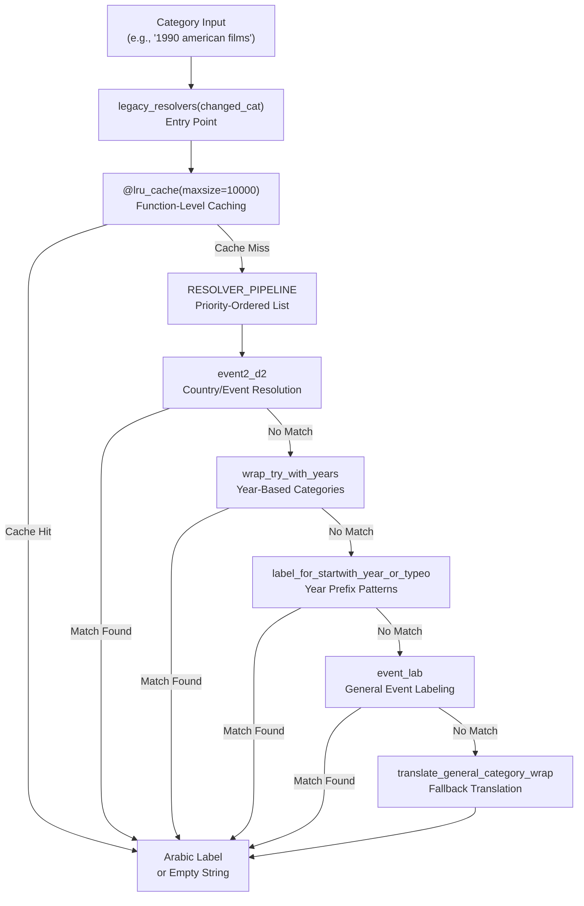
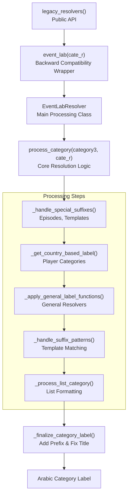
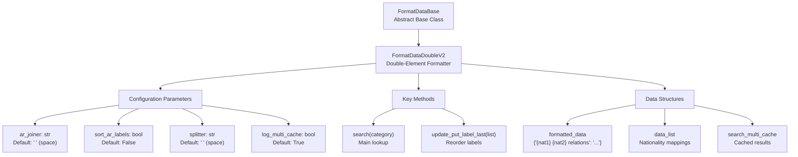
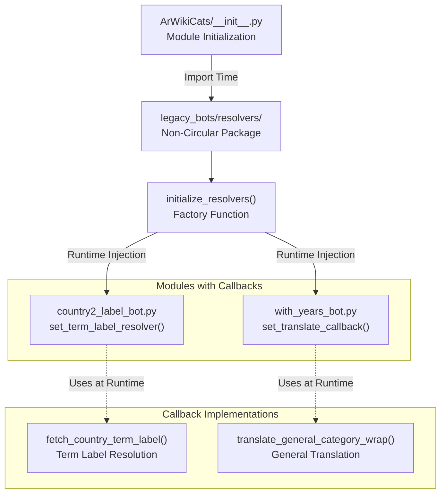
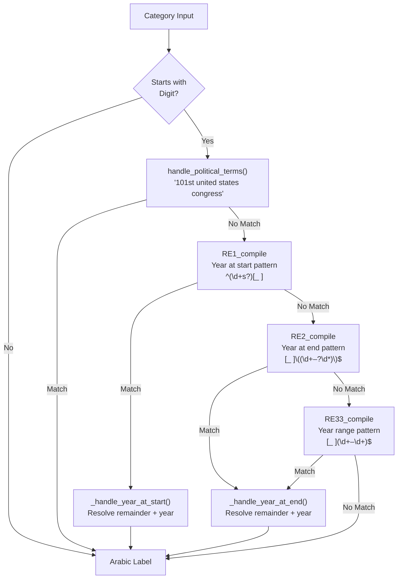
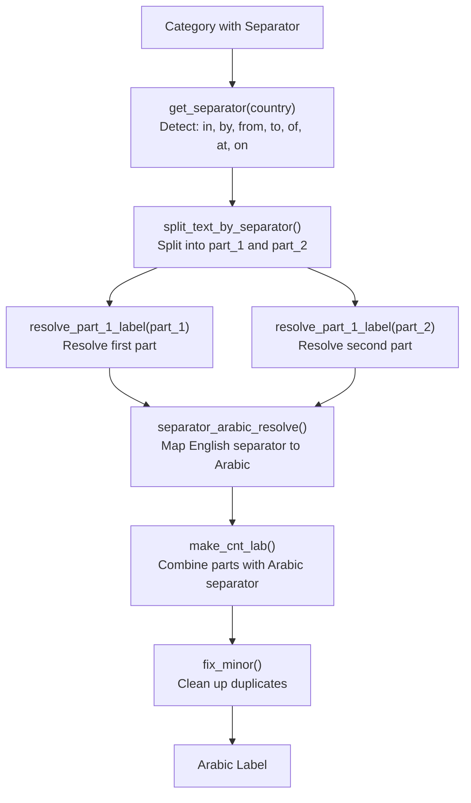
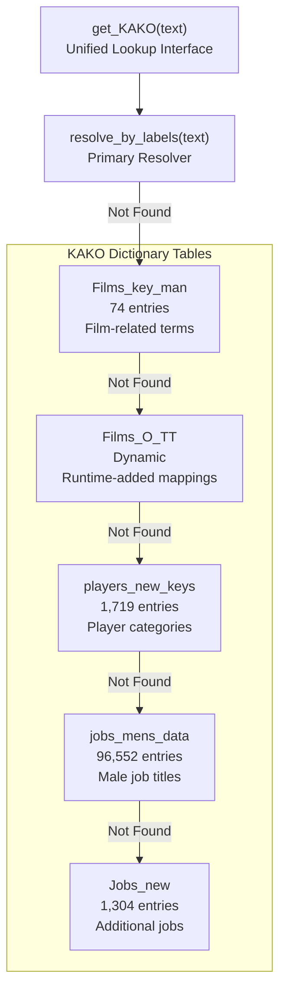
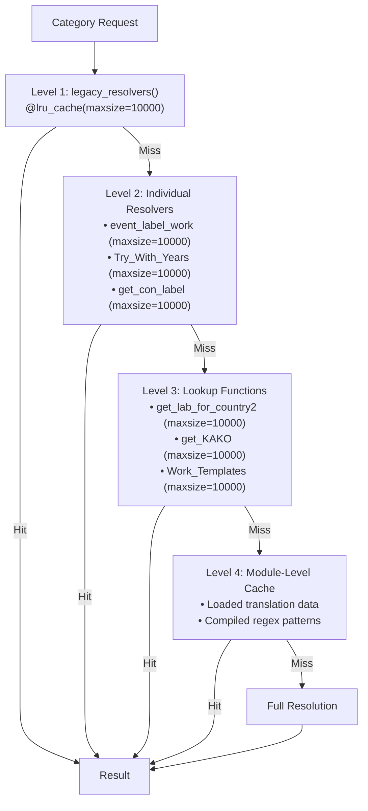
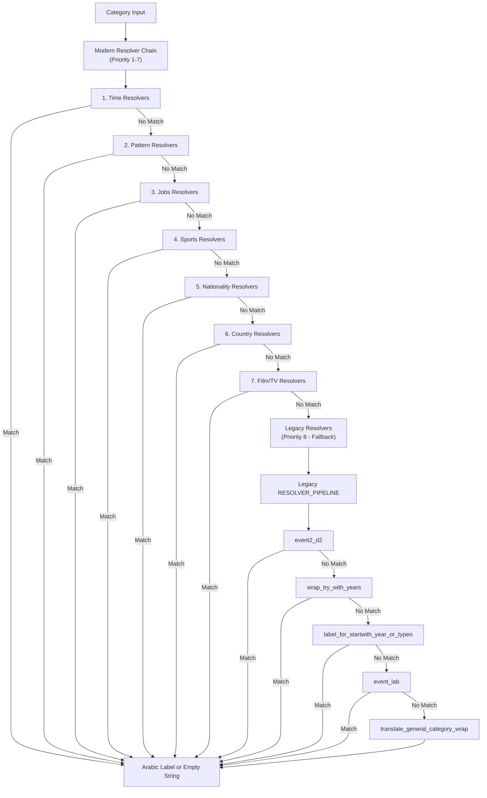

<details>
<summary>Relevant source files</summary>

The following files were used as context for generating this wiki page:

- [ArWikiCats/legacy_bots/__init__.py](../ArWikiCats/legacy_bots/__init__.py)
- [ArWikiCats/legacy_bots/common_resolver_chain.py](../ArWikiCats/legacy_bots/common_resolver_chain.py)
- [ArWikiCats/legacy_bots/legacy_resolvers_bots/country2_label_bot.py](../ArWikiCats/legacy_bots/legacy_resolvers_bots/country2_label_bot.py)
- [ArWikiCats/legacy_bots/legacy_resolvers_bots/event_lab_bot.py](../ArWikiCats/legacy_bots/legacy_resolvers_bots/event_lab_bot.py)
- [ArWikiCats/legacy_bots/legacy_resolvers_bots/with_years_bot.py](../ArWikiCats/legacy_bots/legacy_resolvers_bots/with_years_bot.py)
- [ArWikiCats/legacy_bots/legacy_resolvers_bots/year_or_typeo.py](../ArWikiCats/legacy_bots/legacy_resolvers_bots/year_or_typeo.py)
- [ArWikiCats/legacy_bots/legacy_utils/fixing.py](../ArWikiCats/legacy_bots/legacy_utils/fixing.py)
- [ArWikiCats/legacy_bots/make_bots/check_bot.py](../ArWikiCats/legacy_bots/make_bots/check_bot.py)
- [ArWikiCats/legacy_bots/make_bots/table1_bot.py](../ArWikiCats/legacy_bots/make_bots/table1_bot.py)
- [ArWikiCats/legacy_bots/tmp_bot.py](../ArWikiCats/legacy_bots/tmp_bot.py)
- [ArWikiCats/sub_new_resolvers/peoples_resolver.py](../ArWikiCats/sub_new_resolvers/peoples_resolver.py)
- [examples/run.py](examples/run.py)

</details>


This page documents the **Legacy Resolvers** system, which provides backward compatibility for older category translation logic that predates the new resolver architecture. The legacy system was refactored from a simple `RESOLVER_PIPELINE` list into a structured class-based architecture while maintaining the same external API.

For information about modern resolver implementations, see [Resolver System](14.Resolver-System.md). For the overall architecture, see [Architecture](2.Architecture.md)

---

## Purpose and Scope

The Legacy Resolvers serve as a **fallback resolution system** for categories that cannot be handled by the specialized modern resolvers. The system provides:

- **Backward compatibility**: Maintains translation behavior from earlier versions of the codebase
- **Complex pattern handling**: Processes categories with separators, years, and multi-part structures
- **Circular dependency resolution**: Uses callback patterns to break import cycles
- **Template-based matching**: Applies suffix/prefix templates for common category patterns
- **General category translation**: Handles edge cases and uncommon category formats

**Key Categories Handled**:
- Year-based categories: `1990 united states congress` → `الكونغرس الأمريكي الـ101`
- Separator-based categories: `sport in ottoman` → `الرياضة في الدولة العثمانية`
- Template categories: `lists of american writers` → `قوائم كتاب أمريكيون`
- Event categories: `2020 sports events in france` → `أحداث رياضية في 2020 في فرنسا`
- Complex structured categories with multiple components

**Sources**: [ArWikiCats/legacy_bots/__init__.py L1-L102](../ArWikiCats/legacy_bots/__init__.py#L1-L102), [ArWikiCats/legacy_bots/legacy_resolvers_bots/event_lab_bot.py L1-L386](../ArWikiCats/legacy_bots/legacy_resolvers_bots/event_lab_bot.py#L1-L386)

---

## System Architecture

### Legacy Resolver Pipeline

The legacy resolver system implements a chain-of-responsibility pattern where each resolver is tried in sequence until one returns a non-empty result.



**Sources**: [ArWikiCats/legacy_bots/__init__.py L43-L96](../ArWikiCats/legacy_bots/__init__.py#L43-L96)

---

### Class-Based Architecture

The legacy system was refactored from simple function chains into a class-based architecture, with `EventLabResolver` as the primary processing class.



**Sources**: [ArWikiCats/legacy_bots/legacy_resolvers_bots/event_lab_bot.py L111-L386](../ArWikiCats/legacy_bots/legacy_resolvers_bots/event_lab_bot.py#L111-L386)
</thinking>

<old_str>
---

## Core Resolver Function

### new_relations_resolvers()

The main entry point for bilateral relations resolution. Located in the `new_resolvers/relations_resolver/` module.

**Function Signature Pattern**:
```python
def new_relations_resolvers(category: str) -> str:
    """
    Resolve bilateral relations category labels.

    Args:
        category: English category string (e.g., "france–germany relations")

    Returns:
        Arabic translation or empty string if no match
    """
```

**Resolution Process**:

1. **Input normalization**: Convert to lowercase, trim whitespace, normalize dashes
2. **Pattern matching**: Extract entity names and relation type
3. **Entity lookup**: Find Arabic nationality forms from `All_Nat`
4. **Template application**: Apply appropriate relation template
5. **Label composition**: Combine Arabic adjectives with relation word
6. **Caching**: Store result for future lookups

**Sources**: [tests/new_resolvers/relations_resolver/test_work_relations_new.py L489-L497](../tests/new_resolvers/relations_resolver/test_work_relations_new.py#L489-L497), [changelog.md L578-L584](../changelog.md#L578-L584)
</str>
<new_str>
---

## Core Resolver Functions

### legacy_resolvers()

The main entry point for the legacy resolver chain. This function coordinates all legacy resolvers in priority order.

**Function Signature**:
```python
@functools.lru_cache(maxsize=10000)
def legacy_resolvers(changed_cat: str) -> str:
    """
    Resolve a category label using the legacy resolver chain.

    Parameters:
        changed_cat (str): Category name (normalized, lowercase)

    Returns:
        str: Arabic category label or empty string if no resolver matches
    """
```

**Resolution Process**:

1. **Cache check**: Check LRU cache for previously resolved category
2. **Pipeline iteration**: Try each resolver in `RESOLVER_PIPELINE` order
3. **First match wins**: Return immediately when any resolver produces a label
4. **Cache storage**: Store successful result for future lookups
5. **Fallback**: Return empty string if no resolver matches

**Sources**: [ArWikiCats/legacy_bots/__init__.py L75-L96](../ArWikiCats/legacy_bots/__init__.py#L75-L96)

---

### RESOLVER_PIPELINE

The `RESOLVER_PIPELINE` defines the priority order for legacy resolvers. This ordering is critical for correct behavior.

**Pipeline Definition**:
```python
RESOLVER_PIPELINE: list[Callable[[str], str]] = [
    event2_d2,                               # Country/event-based resolution
    with_years_bot.wrap_try_with_years,      # Year-based category resolution
    year_or_typeo.label_for_startwith_year_or_typeo,  # Year prefix patterns
    event_lab_bot.event_lab,                 # General event labeling
    translate_general_category_wrap,         # Catch-all fallback
]
```

**Priority Rationale**:

| Priority | Resolver | Purpose | Example |
|----------|----------|---------|---------|
| 1 | `event2_d2` | Country/event resolution | `sport in france` → `الرياضة في فرنسا` |
| 2 | `wrap_try_with_years` | Year patterns | `1990 films` → `أفلام 1990` |
| 3 | `label_for_startwith_year_or_typeo` | Year prefix handling | `2020 american films` → `أفلام أمريكية 2020` |
| 4 | `event_lab` | Complex event categories | Categories with episodes, templates, lists |
| 5 | `translate_general_category_wrap` | General fallback | Separator-based categories |

**Sources**: [ArWikiCats/legacy_bots/__init__.py L43-L72](../ArWikiCats/legacy_bots/__init__.py#L43-L72)

---

## Core Resolver Function

### new_relations_resolvers()

The main entry point for bilateral relations resolution. Located in the `new_resolvers/relations_resolver/` module.

**Function Signature Pattern**:
```python
def new_relations_resolvers(category: str) -> str:
    """
    Resolve bilateral relations category labels.

    Args:
        category: English category string (e.g., "france–germany relations")

    Returns:
        Arabic translation or empty string if no match
    """
```

**Resolution Process**:

1. **Input normalization**: Convert to lowercase, trim whitespace, normalize dashes
2. **Pattern matching**: Extract entity names and relation type
3. **Entity lookup**: Find Arabic nationality forms from `All_Nat`
4. **Template application**: Apply appropriate relation template
5. **Label composition**: Combine Arabic adjectives with relation word
6. **Caching**: Store result for future lookups

**Sources**: [tests/new_resolvers/relations_resolver/test_work_relations_new.py L489-L497](../tests/new_resolvers/relations_resolver/test_work_relations_new.py#L489-L497), [changelog.md L578-L584](../changelog.md#L578-L584)

---

## FormatDataDoubleV2 Class

The `FormatDataDoubleV2` class is the core pattern-matching engine for bilateral relations. It extends the base formatting system to handle **double-element patterns** where two distinct entities must be resolved.

### Class Architecture



**Sources**: [tests/new_resolvers/translations_formats/DataModelDouble/test_model_data_double_v2.py L1-L588](../tests/new_resolvers/translations_formats/DataModelDouble/test_model_data_double_v2.py#L1-L588)

---

## Circular Dependency Resolution

One of the major architectural improvements in the legacy resolver refactoring was breaking circular import dependencies. The system uses **callback patterns** to inject dependencies at runtime.

### Callback Pattern Architecture



**Sources**: [ArWikiCats/legacy_bots/__init__.py L1-L42](../ArWikiCats/legacy_bots/__init__.py#L1-L42), [ArWikiCats/legacy_bots/legacy_resolvers_bots/country2_label_bot.py L34-L65](../ArWikiCats/legacy_bots/legacy_resolvers_bots/country2_label_bot.py#L34-L65)

---

### Callback Example: country2_label_bot

The `country2_label_bot` module uses a callback to avoid circular imports with the event labeling system.

**Callback Setup**:
```python
# Module-level callback holder
_term_label_resolver: Optional[TermLabelResolver] = None

def set_term_label_resolver(resolver: TermLabelResolver) -> None:
    """Set the term label resolver callback at runtime."""
    global _term_label_resolver
    _term_label_resolver = resolver

def _get_term_label(term: str, separator: str = "", lab_type: str = "") -> str:
    """Get label from the term label resolver if one is set."""
    if _term_label_resolver is not None:
        return _term_label_resolver(term, separator, lab_type)
    return ""
```

**Callback Usage**:
The callback is used in the resolver chain within `resolve_part_1_label()`:

```python
country2_label = (
    ""
    or all_new_resolvers(country2)
    or get_pop_All_18(country2)
    # ... other resolvers ...
    or _get_term_label(country2, "", lab_type=lab_type)  # Uses callback
    or ""
)
```

**Sources**: [ArWikiCats/legacy_bots/legacy_resolvers_bots/country2_label_bot.py L28-L65](../ArWikiCats/legacy_bots/legacy_resolvers_bots/country2_label_bot.py#L28-L65), [ArWikiCats/legacy_bots/legacy_resolvers_bots/country2_label_bot.py L88-L129](../ArWikiCats/legacy_bots/legacy_resolvers_bots/country2_label_bot.py#L88-L129)

---

### Callback Example: with_years_bot

The `with_years_bot` module uses a similar callback pattern for general category translation.

**Callback Setup**:
```python
# Module-level callback holder
_translate_callback: Optional[TranslateCallback] = None

def set_translate_callback(callback: TranslateCallback) -> None:
    """Set the translate general category callback."""
    global _translate_callback
    _translate_callback = callback

def translate_general_category_wrap(category: str) -> str:
    """Resolve an Arabic label for a general category."""
    if _translate_callback is not None:
        return _translate_callback(category)
    return ""
```

**Sources**: [ArWikiCats/legacy_bots/legacy_resolvers_bots/with_years_bot.py L48-L79](../ArWikiCats/legacy_bots/legacy_resolvers_bots/with_years_bot.py#L48-L79)

---

### initialize_resolvers()

The `initialize_resolvers()` function is called during module initialization to inject all callback dependencies.

**Initialization Pattern**:
```python
from .resolvers import initialize_resolvers

# Initialize the resolver callbacks after all modules are loaded
initialize_resolvers()
```

This ensures that:
1. All modules are fully imported before callbacks are set
2. Circular dependencies are avoided
3. The import graph forms a proper DAG (Directed Acyclic Graph)

**Sources**: [ArWikiCats/legacy_bots/__init__.py L6-L41](../ArWikiCats/legacy_bots/__init__.py#L6-L41)

---

## Resolver Chain Components

### Common Resolver Chain

The `common_resolver_chain` module provides shared lookup functions used across multiple legacy resolvers. This centralizes the resolution logic and reduces code duplication.

#### get_con_label()

Central lookup function that tries multiple resolver sources in sequence.

**Function Signature**:
```python
@functools.lru_cache(maxsize=10000)
def get_con_label(country: str) -> str:
    """
    Resolve the Arabic label for a country or category name.

    Returns:
        str: Arabic label or empty string if not found
    """
```

**Lookup Chain** (`con_lookup_both` dictionary):

| Resolver | Purpose | Example |
|----------|---------|---------|
| `get_from_new_p17_final` | Geographic data (68,981 entries) | `france` → `فرنسا` |
| `all_new_resolvers` | Modern resolver dispatch | Delegates to new resolvers |
| `get_from_pf_keys2` | Combined dataset (33,657 entries) | Various lookups |
| `_lookup_country_with_in_prefix` | "in X" patterns | `in france` → `في فرنسا` |
| `RELIGIOUS_KEYS_PP` | Religious categories | `muslims` → `مسلمون` |
| `New_female_keys` | Female job titles | Female-specific translations |
| `religious_entries` | Religious entries | Religious role translations |
| `resolve_clubs_teams_leagues` | Sports teams | Team names |
| `get_parties_lab` | Political parties | Party names |
| `resolve_university_category` | Universities | University names |
| `work_peoples` | People categories | Person-related categories |
| `get_pop_All_18` | Legacy population data | Fallback lookups |
| `get_KAKO` | Multiple table lookups | Jobs, films, etc. |

**Sources**: [ArWikiCats/legacy_bots/common_resolver_chain.py L49-L102](../ArWikiCats/legacy_bots/common_resolver_chain.py#L49-L102)

---

### Year Pattern Resolution

#### Try_With_Years()

Handles categories containing year information at the start or end.

**Function Signature**:
```python
@functools.lru_cache(maxsize=10000)
def Try_With_Years(category: str) -> str:
    """
    Produce an Arabic label combining year information with resolved category.

    Handles patterns like:
    - "1990 films" → "أفلام 1990"
    - "101st united states congress" → "الكونغرس الأمريكي الـ101"
    - "American Soccer League (1933–83)" → "دوري كرة القدم الأمريكي 1933–1983"
    """
```

**Year Pattern Detection**:



**Sources**: [ArWikiCats/legacy_bots/legacy_resolvers_bots/with_years_bot.py L219-L258](../ArWikiCats/legacy_bots/legacy_resolvers_bots/with_years_bot.py#L219-L258), [ArWikiCats/legacy_bots/legacy_resolvers_bots/with_years_bot.py L82-L101](../ArWikiCats/legacy_bots/legacy_resolvers_bots/with_years_bot.py#L82-L101)

---

### Separator-Based Resolution

#### country_2_title_work()

Handles categories with separators like "in", "by", "from", "to", "of", "at", "on".

**Function Signature**:
```python
def country_2_title_work(country: str, with_years: bool = True) -> str:
    """
    Process categories with separators and resolve both parts.

    Examples:
    - "sport in france" → "الرياضة في فرنسا"
    - "ambassadors to italy" → "سفراء لدى إيطاليا"
    - "writers from egypt" → "كتاب من مصر"
    """
```

**Separator Resolution Flow**:



**Separator Mappings**:

| English | Arabic | Example |
|---------|--------|---------|
| `in` | `في` | `sport in france` → `الرياضة في فرنسا` |
| `from` | `من` | `writers from egypt` → `كتاب من مصر` |
| `to` | `إلى` | `exports to china` → `صادرات إلى الصين` |
| `to` (ambassadors) | `لدى` | `ambassadors to italy` → `سفراء لدى إيطاليا` |
| `on` | `على` | `attacks on france` → `هجمات على فرنسا` |
| `about` | `عن` | `books about egypt` → `كتب عن مصر` |
| `based in` | `مقرها في` | `organizations based in london` → `منظمات مقرها في لندن` |

**Sources**: [ArWikiCats/legacy_bots/legacy_resolvers_bots/country2_label_bot.py L333-L376](../ArWikiCats/legacy_bots/legacy_resolvers_bots/country2_label_bot.py#L333-L376), [ArWikiCats/legacy_bots/legacy_resolvers_bots/country2_label_bot.py L231-L256](../ArWikiCats/legacy_bots/legacy_resolvers_bots/country2_label_bot.py#L231-L256)

---

### Template-Based Resolution

#### Work_Templates()

Matches categories against predefined prefix and suffix templates.

**Function Signature**:
```python
@functools.lru_cache(maxsize=10000)
def Work_Templates(input_label: str) -> str:
    """
    Generate Arabic category labels using template-based matching.

    Tries suffix matching first, then prefix matching.
    """
```

**Template Types**:

**Suffix Templates** (`combined_suffix_mappings`):
- ` teams` → `فرق {}`
- ` players` → `لاعبو {}`
- ` players by club` → `لاعبو {} حسب النادي`
- ` by country` → `{} حسب البلد`

**Prefix Templates** (`pp_start_with`):
- `lists of ` → `قوائم {}`
- `history of ` → `تاريخ {}`
- `culture of ` → `ثقافة {}`

**Example Resolution**:
```
Input: "lists of american writers"
1. Check suffix: No match
2. Check prefix: Match "lists of "
3. Extract base: "american writers"
4. Resolve base: "كتاب أمريكيون"
5. Apply template: "قوائم {}" → "قوائم كتاب أمريكيون"
```

**Sources**: [ArWikiCats/legacy_bots/tmp_bot.py L79-L102](../ArWikiCats/legacy_bots/tmp_bot.py#L79-L102), [ArWikiCats/legacy_bots/tmp_bot.py L20-L76](../ArWikiCats/legacy_bots/tmp_bot.py#L20-L76)

---

## Data Sources and Lookup Tables

The legacy resolvers depend on multiple data sources, organized in a hierarchical lookup structure.

### KAKO Lookup System

The `get_KAKO()` function provides a unified interface to multiple mapping tables.

**Table Hierarchy**:



**Sources**: [ArWikiCats/legacy_bots/make_bots/table1_bot.py L20-L78](../ArWikiCats/legacy_bots/make_bots/table1_bot.py#L20-L78)

---

### Suffix and Prefix Mappings

#### combined_suffix_mappings

Dictionary mapping English suffixes to Arabic template patterns.

**Common Suffixes**:

| English Suffix | Arabic Template | Example |
|----------------|-----------------|---------|
| ` teams` | `فرق {}` | `american teams` → `فرق أمريكية` |
| ` players` | `لاعبو {}` | `football players` → `لاعبو كرة القدم` |
| ` by club` | `{} حسب النادي` | `players by club` → `لاعبون حسب النادي` |
| ` by country` | `{} حسب البلد` | `teams by country` → `فرق حسب البلد` |
| ` by year` | `{} حسب السنة` | `films by year` → `أفلام حسب السنة` |
| ` episodes` | `حلقات {}` | `series episodes` → `حلقات مسلسل` |
| ` templates` | `قوالب {}` | `football templates` → `قوالب كرة القدم` |

**Sources**: [ArWikiCats/legacy_bots/data/mappings.py](../ArWikiCats/legacy_bots/data/mappings.py) (referenced in [ArWikiCats/legacy_bots/legacy_resolvers_bots/event_lab_bot.py L17](../ArWikiCats/legacy_bots/legacy_resolvers_bots/event_lab_bot.py:17))

---

#### pp_start_with

Dictionary mapping English prefixes to Arabic template patterns.

**Common Prefixes**:

| English Prefix | Arabic Template | Example |
|----------------|-----------------|---------|
| `lists of ` | `قوائم {}` | `lists of writers` → `قوائم كتاب` |
| `history of ` | `تاريخ {}` | `history of france` → `تاريخ فرنسا` |
| `culture of ` | `ثقافة {}` | `culture of egypt` → `ثقافة مصر` |
| `economy of ` | `اقتصاد {}` | `economy of india` → `اقتصاد الهند` |
| `politics of ` | `سياسة {}` | `politics of germany` → `سياسة ألمانيا` |

**Sources**: [ArWikiCats/legacy_bots/data/mappings.py](../ArWikiCats/legacy_bots/data/mappings.py) (referenced in [ArWikiCats/legacy_bots/tmp_bot.py L13](../ArWikiCats/legacy_bots/tmp_bot.py:13))

---

## Special Case Handling

### List Category Processing

The `EventLabResolver` handles special list category patterns with different formatting rules.

#### Football Player Lists

**Detection**:
- Category ends with known football-related suffixes
- Template marker `list_of_cat` = `"لاعبو {}"`

**Processing**:
```python
if self.foot_ballers:
    category_lab = list_of_cat_func_foot_ballers(cate_r, category_lab, list_of_cat)
```

**Example**:
```
Input: "italian football players"
1. Detect suffix: "players"
2. Set foot_ballers flag: True
3. Resolve: "إيطاليون"
4. Apply football template: "لاعبو كرة قدم إيطاليون"
```

**Sources**: [ArWikiCats/legacy_bots/legacy_resolvers_bots/event_lab_bot.py L237-L241](../ArWikiCats/legacy_bots/legacy_resolvers_bots/event_lab_bot.py#L237-L241)

---

#### General List Categories

For non-football list categories:

**Processing**:
```python
else:
    category_lab = list_of_cat_func_new(cate_r, category_lab, list_of_cat)
```

**Common List Patterns**:
- `lists of american writers` → `قوائم كتاب أمريكيون`
- `italian athletes` → `رياضيون إيطاليون`
- `french scientists` → `علماء فرنسيون`

**Sources**: [ArWikiCats/legacy_bots/legacy_resolvers_bots/event_lab_bot.py L237-L241](../ArWikiCats/legacy_bots/legacy_resolvers_bots/event_lab_bot.py#L237-L241), [ArWikiCats/main_processers/main_utils.py](../ArWikiCats/main_processers/main_utils.py) (referenced)

---

### Special Suffixes

#### Episodes Suffix

**Pattern**: Categories ending with ` episodes`

**Handler**: `get_episodes(category3)`

**Example**:
```
Input: "breaking bad episodes"
Processing: Extract "breaking bad", resolve, add "حلقات" prefix
Output: "حلقات بريكنغ باد"
```

**Sources**: [ArWikiCats/legacy_bots/legacy_resolvers_bots/event_lab_bot.py L139-L140](../ArWikiCats/legacy_bots/legacy_resolvers_bots/event_lab_bot.py#L139-L140)

---

#### Templates Suffix

**Pattern**: Categories ending with ` templates`

**Handler**: `get_templates_fo(category3)`

**Example**:
```
Input: "football templates"
Processing: Extract "football", resolve, add "قوالب" prefix
Output: "قوالب كرة القدم"
```

**Sources**: [ArWikiCats/legacy_bots/legacy_resolvers_bots/event_lab_bot.py L142-L143](../ArWikiCats/legacy_bots/legacy_resolvers_bots/event_lab_bot.py#L142-L143)

---

### Political Terms

The year resolver handles special political body patterns.

**Known Bodies**:

| English Pattern | Arabic Translation |
|-----------------|-------------------|
| `iranian majlis` | `المجلس الإيراني` |
| `united states congress` | `الكونغرس الأمريكي` |

**Pattern**: `{ordinal}(th|nd|st|rd) {body_name}`

**Example**:
```
Input: "101st united states congress"
Pattern match: ordinal=101, body="united states congress"
Ordinal word: "الـ101"
Output: "الكونغرس الأمريكي الـ101"
```

**Sources**: [ArWikiCats/legacy_bots/legacy_resolvers_bots/with_years_bot.py L38-L100](../ArWikiCats/legacy_bots/legacy_resolvers_bots/with_years_bot.py#L38-L100)

---

## Performance Optimizations

### Multi-Level Caching

The legacy resolver system uses multiple caching layers for optimal performance.



**Cache Sizes**:

| Function | Cache Size | Purpose |
|----------|-----------|---------|
| `legacy_resolvers` | 10,000 | Top-level entry point |
| `event_label_work` | 10,000 | Country/event resolution |
| `Try_With_Years` | 10,000 | Year-based categories |
| `get_con_label` | 10,000 | Common resolver chain |
| `get_lab_for_country2` | 10,000 | Country labels |
| `get_KAKO` | 10,000 | Table lookups |
| `Work_Templates` | 10,000 | Template matching |
| `_load_resolver` | 1 | EventLabResolver singleton |

**Sources**: [ArWikiCats/legacy_bots/__init__.py L75](../ArWikiCats/legacy_bots/__init__.py:75), [ArWikiCats/legacy_bots/legacy_resolvers_bots/event_lab_bot.py L82-L323](../ArWikiCats/legacy_bots/legacy_resolvers_bots/event_lab_bot.py#L82-L323), [ArWikiCats/legacy_bots/common_resolver_chain.py L67](../ArWikiCats/legacy_bots/common_resolver_chain.py:67)

---

### Input Normalization

Input normalization is applied at multiple stages to maximize cache hits.

**Normalization Steps**:

1. **Lowercase conversion**: `Category:American Films` → `american films`
2. **Underscore to space**: `american_films` → `american films`
3. **Prefix removal**: `category:american films` → `american films`
4. **Whitespace trimming**: `" american films "` → `american films`
5. **"the" removal**: `the united states` → `united states`
6. **Dash normalization**: `guinea−bissau` → `guinea-bissau`

**Normalization at Different Levels**:

```python
# Level 1: Main entry (event_lab)
cate_r = cate_r.lower().replace("_", " ")

# Level 2: EventLabResolver processing
category = change_cat(category)  # Various normalizations

# Level 3: Specific resolvers
country = country.strip().lower()
country = country.replace(" the ", " ").removeprefix("the ").removesuffix(" the")
```

**Sources**: [ArWikiCats/legacy_bots/legacy_resolvers_bots/event_lab_bot.py L377-L378](../ArWikiCats/legacy_bots/legacy_resolvers_bots/event_lab_bot.py#L377-L378), [ArWikiCats/legacy_bots/common_resolver_chain.py L80-L81](../ArWikiCats/legacy_bots/common_resolver_chain.py#L80-L81)

---

## Testing Infrastructure

### Legacy Bot Test Coverage

The legacy resolvers have comprehensive test coverage across multiple test suites.

**Test Organization**:

| Test Suite | Test Files | Focus Area |
|------------|-----------|------------|
| `tests/legacy_bots/` | Multiple files | Legacy resolver functions |
| `tests/event_lists/` | Country-specific | Full integration testing |
| `tests/e2e/` | End-to-end | Complete workflow validation |

**Key Test Files**:

- [tests/legacy_bots/test_event_lab_bot.py](../tests/legacy_bots/test_event_lab_bot.py) - EventLabResolver class tests
- [tests/legacy_bots/test_with_years_bot.py](../tests/legacy_bots/test_with_years_bot.py) - Year pattern resolution tests
- [tests/legacy_bots/test_country2_label_bot.py](../tests/legacy_bots/test_country2_label_bot.py) - Separator-based resolution tests
- [tests/legacy_bots/test_tmp_bot.py](../tests/legacy_bots/test_tmp_bot.py) - Template matching tests

**Sources**: Test file structure referenced in high-level diagrams

---

### Test Execution Patterns

**Unit Tests**:
```python
@pytest.mark.fast
def test_event_lab_basic() -> None:
    """Test basic event_lab functionality"""
    result = event_lab("american films")
    assert result == "تصنيف:أفلام أمريكية"
```

**Parametrized Tests**:
```python
@pytest.mark.parametrize("category,expected", [
    ("1990 films", "تصنيف:أفلام 1990"),
    ("101st united states congress", "تصنيف:الكونغرس الأمريكي الـ101"),
    # ... more test cases
])
def test_year_patterns(category: str, expected: str) -> None:
    result = Try_With_Years(category)
    assert result == expected
```

**Integration Tests**:
```python
@pytest.mark.integration
def test_legacy_resolver_chain() -> None:
    """Test complete legacy resolver pipeline"""
    result = legacy_resolvers("2020 american films")
    assert result.startswith("تصنيف:")
```

**Sources**: [ArWikiCats/legacy_bots/__init__.py L75-L96](../ArWikiCats/legacy_bots/__init__.py#L75-L96) (shows resolver usage pattern)

---

## Integration with Main Resolver Chain

The legacy resolvers serve as the **last fallback** in the main resolver chain, handling categories that specialized resolvers cannot process.

### Position in Resolver Chain



**Sources**: Overall architecture from high-level diagrams, [ArWikiCats/legacy_bots/__init__.py L43-L72](../ArWikiCats/legacy_bots/__init__.py#L43-L72)

---

### Resolver Coordination

The main resolver in [ArWikiCats/__init__.py](../ArWikiCats/__init__.py) coordinates between modern and legacy resolvers:

**Resolution Flow**:
```
1. Normalize input
2. Check cache
3. Try all modern resolvers (Time, Pattern, Jobs, Sports, Nats, Countries, Films)
4. If no match, invoke legacy_resolvers()
5. Return result or empty string
```

**When Legacy Resolvers Activate**:
- Category doesn't match any modern resolver patterns
- Complex multi-part categories
- Categories with uncommon separators
- Template-based categories
- Historical or legacy category formats

**Sources**: Referenced from main architecture diagrams

---

## Common Patterns and Examples

### Year-Based Categories

| Input Category | Output Label |
|----------------|--------------|
| `1990 films` | `تصنيف:أفلام 1990` |
| `2020s american films` | `تصنيف:أفلام أمريكية عقد 2020` |
| `101st united states congress` | `تصنيف:الكونغرس الأمريكي الـ101` |
| `1933–83 american soccer league` | `تصنيف:دوري كرة القدم الأمريكي 1933–1983` |

**Sources**: [ArWikiCats/legacy_bots/legacy_resolvers_bots/with_years_bot.py L219-L258](../ArWikiCats/legacy_bots/legacy_resolvers_bots/with_years_bot.py#L219-L258), [examples/run.py L42]()

---

### Separator-Based Categories

| Input Category | Output Label |
|----------------|--------------|
| `sport in france` | `تصنيف:الرياضة في فرنسا` |
| `writers from egypt` | `تصنيف:كتاب من مصر` |
| `ambassadors to italy` | `تصنيف:سفراء لدى إيطاليا` |
| `books about history` | `تصنيف:كتب عن التاريخ` |
| `organizations based in london` | `تصنيف:منظمات مقرها في لندن` |

**Sources**: [ArWikiCats/legacy_bots/legacy_resolvers_bots/country2_label_bot.py L333-L376](../ArWikiCats/legacy_bots/legacy_resolvers_bots/country2_label_bot.py#L333-L376)

---

### Template-Based Categories

| Input Category | Output Label |
|----------------|--------------|
| `lists of american writers` | `تصنيف:قوائم كتاب أمريكيون` |
| `history of france` | `تصنيف:تاريخ فرنسا` |
| `american football teams` | `تصنيف:فرق كرة قدم أمريكية` |
| `football players by club` | `تصنيف:لاعبو كرة القدم حسب النادي` |

**Sources**: [ArWikiCats/legacy_bots/tmp_bot.py L79-L102](../ArWikiCats/legacy_bots/tmp_bot.py#L79-L102)

---

### Complex Event Categories

| Input Category | Output Label |
|----------------|--------------|
| `2020 sports events in france` | `تصنيف:أحداث رياضية في 2020 في فرنسا` |
| `breaking bad episodes` | `تصنيف:حلقات بريكنغ باد` |
| `football templates` | `تصنيف:قوالب كرة القدم` |
| `italian football players` | `تصنيف:لاعبو كرة قدم إيطاليون` |

**Sources**: [ArWikiCats/legacy_bots/legacy_resolvers_bots/event_lab_bot.py L244-L312](../ArWikiCats/legacy_bots/legacy_resolvers_bots/event_lab_bot.py#L244-L312)

---

## Limitations and Edge Cases

### Known Limitations

1. **Preposition blocking**: Year resolvers reject categories with `in`, `of`, `from`, `by`, `at` to avoid conflicts
2. **Complex multi-part categories**: May fail if parts cannot be individually resolved
3. **Ambiguous separators**: Categories with multiple separators may split incorrectly
4. **Template coverage**: Limited to predefined suffix/prefix templates
5. **Circular dependency risk**: Callback pattern must be properly initialized

**Sources**: [ArWikiCats/legacy_bots/legacy_resolvers_bots/with_years_bot.py L276-L279](../ArWikiCats/legacy_bots/legacy_resolvers_bots/with_years_bot.py#L276-L279)

---

### Edge Case Handling

**Preposition Blocking in Year Resolver**:
```python
# Categories with these words are rejected by Try_With_Years
blocked = ("in", "of", "from", "by", "at")
if any(f" {word} " in cat3.lower() for word in blocked):
    return ""
```

This prevents conflicts with separator-based resolution.

**Example**:
- `1990 films` → Handled by year resolver ✓
- `1990 films in france` → Rejected by year resolver, handled by separator resolver ✓

**Sources**: [ArWikiCats/legacy_bots/legacy_resolvers_bots/with_years_bot.py L276-L279](../ArWikiCats/legacy_bots/legacy_resolvers_bots/with_years_bot.py#L276-L279)

---

**Dash Normalization**:
```python
# Various dash types normalized to standard hyphen
category = category.replace("−", "-")  # En-dash to hyphen
category = category.replace("–", "-")  # Em-dash to hyphen
```

**Sources**: [ArWikiCats/legacy_bots/legacy_resolvers_bots/with_years_bot.py L241](../ArWikiCats/legacy_bots/legacy_resolvers_bots/with_years_bot.py:241)

---

**"The" Removal**:
```python
# "the" is removed from country names
country = country.replace(" the ", " ").removeprefix("the ").removesuffix(" the")
```

**Example**:
- `the united states` → `united states`
- `sport in the ottoman empire` → `sport in ottoman empire`

**Sources**: [ArWikiCats/legacy_bots/common_resolver_chain.py L81](../ArWikiCats/legacy_bots/common_resolver_chain.py:81)

---

**Empty Result Handling**:

If a resolver returns an empty string, the next resolver in the pipeline is tried. The final fallback (`translate_general_category_wrap`) always returns a result (possibly empty)

**Sources**: [ArWikiCats/legacy_bots/__init__.py L75-L96](../ArWikiCats/legacy_bots/__init__.py#L75-L96)

---

## Configuration and Customization

### Customizing Arabic Joiners

For specialized use cases, the `ar_joiner` parameter can be customized:

```python
# Default: space joiner
bot = FormatDataDoubleV2(ar_joiner=" ")    # "أكشن دراما"

# Arabic "and" joiner
bot = FormatDataDoubleV2(ar_joiner=" و ")  # "أكشن و دراما"

# Dash joiner
bot = FormatDataDoubleV2(ar_joiner="-")    # "أكشن-دراما"
```

### Enabling Label Sorting

To ensure consistent output regardless of input order:

```python
bot = FormatDataDoubleV2(
    formatted_data=templates,
    data_list=nationality_data,
    key_placeholder="{nat}",
    sort_ar_labels=True,  # Alphabetically sort Arabic labels
)

# Both inputs produce same output:
bot.search("france–germany relations")   # العلاقات الألمانية الفرنسية
bot.search("germany–france relations")   # العلاقات الألمانية الفرنسية
```

### Dynamic Label Reordering

To prioritize certain labels to appear last:

```python
bot = FormatDataDoubleV2(
    formatted_data=templates,
    data_list=nationality_data,
    key_placeholder="{nat}",
    log_multi_cache=False,  # Disable caching for dynamic reordering
)

# Set priority list
bot.update_put_label_last(["action"])

# "action" will now appear last
bot.search("action drama films")  # "أفلام دراما أكشن"
```

**Sources**: [tests/new_resolvers/translations_formats/DataModelDouble/test_model_data_double_v2.py L468-L526](../tests/new_resolvers/translations_formats/DataModelDouble/test_model_data_double_v2.py#L468-L526), [tests/new_resolvers/translations_formats/DataModelDouble/test_model_data_double_v2.py L284-L329](../tests/new_resolvers/translations_formats/DataModelDouble/test_model_data_double_v2.py#L284-L329)

---

## Related Systems

- **[Nationality Resolvers](16.Nationality-Resolvers.md)**: Provides the underlying nationality data (`All_Nat`) used by Relations Resolvers
- **[Country Name Resolvers](17.Country-Name-Resolvers.md)**: Handles single-country categories; Relations Resolvers handle bilateral categories
- **[Formatting System](22.Formatting-System.md)**: Documents the `FormatDataBase` class hierarchy that `FormatDataDoubleV2` extends
- **[Multi-Element Formatters](#6.3)**: General documentation for multi-element formatting patterns

**Sources**: [changelog.md L578-L584](../changelog.md#L578-L584), [tests/new_resolvers/relations_resolver/test_work_relations_new.py L1-L10](../tests/new_resolvers/relations_resolver/test_work_relations_new.py#L1-L10)2d:T8250,# Formatting System

