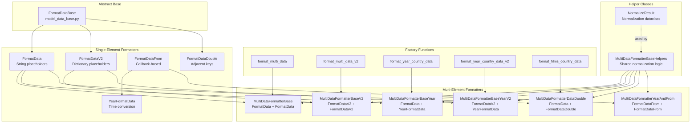
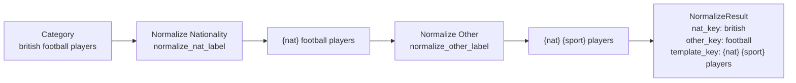
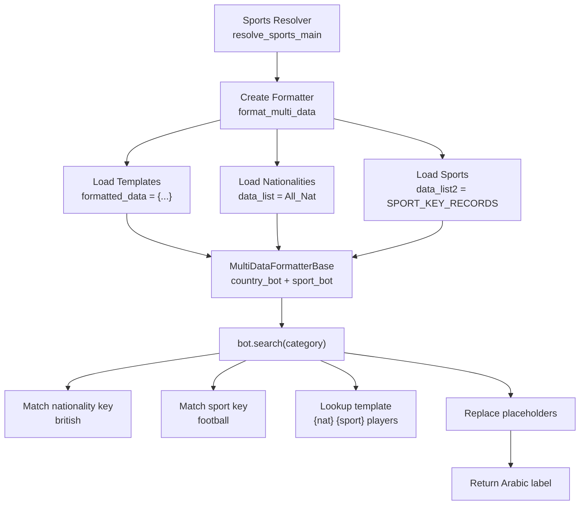

<details>
<summary>Relevant source files</summary>

The following files were used as context for generating this wiki page:

- [ArWikiCats/translations_formats/DataModel/__init__.py](../ArWikiCats/translations_formats/DataModel/__init__.py)
- [ArWikiCats/translations_formats/DataModel/model_data.py](../ArWikiCats/translations_formats/DataModel/model_data.py)
- [ArWikiCats/translations_formats/DataModel/model_data_base.py](../ArWikiCats/translations_formats/DataModel/model_data_base.py)
- [ArWikiCats/translations_formats/DataModel/model_data_time.py](../ArWikiCats/translations_formats/DataModel/model_data_time.py)
- [ArWikiCats/translations_formats/DataModel/model_data_v2.py](../ArWikiCats/translations_formats/DataModel/model_data_v2.py)
- [ArWikiCats/translations_formats/DataModelDouble/model_multi_data_double.py](../ArWikiCats/translations_formats/DataModelDouble/model_multi_data_double.py)
- [ArWikiCats/translations_formats/__init__.py](../ArWikiCats/translations_formats/__init__.py)
- [ArWikiCats/translations_formats/data_new_model.py](../ArWikiCats/translations_formats/data_new_model.py)
- [ArWikiCats/translations_formats/data_with_time.py](../ArWikiCats/translations_formats/data_with_time.py)
- [ArWikiCats/translations_formats/multi_data.py](../ArWikiCats/translations_formats/multi_data.py)

</details>


The Formatting System is a template-based translation framework that converts English Wikipedia category patterns to Arabic using placeholder substitution. It provides a compositional architecture where formatters can be combined to handle categories with multiple dynamic elements (e.g., nationality + sport + year)

For information about how formatters are used within resolvers, see [Resolver Chain](#5). For details on translation data organization, see [Translation Data](6.Translation-Data.md)

---

## Overview

The formatting system operates on a **template-driven pattern matching** model. Each formatter maintains:
- `formatted_data`: Template patterns mapping English structures to Arabic structures
- `data_list`: Key-to-value mappings for dynamic elements
- `key_placeholder` and `value_placeholder`: Tokens for substitution

**Example transformation:**
```
Input: "british football players"
Pattern: "{nat} {sport} players" → "لاعبو {sport_ar} {nat_ar}"
Keys: nat="british" → "بريطانيون", sport="football" → "كرة القدم"
Output: "لاعبو كرة القدم بريطانيون"
```

The system supports three complexity levels:
1. **Single-element** formatters for one dynamic component
2. **Multi-element** formatters that compose two single-element formatters
3. **Factory functions** that construct configured formatter instances

Sources: [ArWikiCats/translations_formats/__init__.py L1-L48](../ArWikiCats/translations_formats/__init__.py#L1-L48), [ArWikiCats/translations_formats/DataModel/model_data_base.py L1-L29](../ArWikiCats/translations_formats/DataModel/model_data_base.py#L1-L29)

---

## Architecture Overview



Sources: [ArWikiCats/translations_formats/DataModel/__init__.py L1-L26](../ArWikiCats/translations_formats/DataModel/__init__.py#L1-L26), [ArWikiCats/translations_formats/__init__.py L12-L25](../ArWikiCats/translations_formats/__init__.py#L12-L25)

---

## Core Concepts

### Template Patterns

Templates define the structural mapping between English and Arabic patterns. The English side contains placeholders that match against category strings; the Arabic side contains placeholders that get replaced with translated values.

**Example templates:**
```python
formatted_data = {
    "{sport} players": "لاعبو {sport_label}",
    "{nat} {sport} players": "لاعبو {sport_ar} {nat_ar}",
    "{year1} {nat} films": "أفلام {nat_ar} {year1}",
}
```

Sources: [ArWikiCats/translations_formats/DataModel/model_data_base.py L47](../ArWikiCats/translations_formats/DataModel/model_data_base.py L47)

### Placeholders

Placeholders are tokens in templates that get replaced during translation. The system distinguishes between:

| Placeholder Type | Purpose | Example Keys | Example Values |
|-----------------|---------|--------------|----------------|
| **Key placeholders** | Match against input | `{sport}`, `{nat}`, `{year1}` | Used in pattern matching |
| **Value placeholders** | Substituted in output | `{sport_ar}`, `{nat_ar}`, `{demonym}` | Replaced with Arabic text |

Gender-specific placeholders enable grammatical agreement:
- `{male}`, `{female}` for singular forms
- `{males}`, `{females}` for plural forms

Sources: [ArWikiCats/translations_formats/DataModel/model_data_base.py L52-L54](../ArWikiCats/translations_formats/DataModel/model_data_base.py#L52-L54), [ArWikiCats/translations_formats/DataModel/model_data_v2.py L42-L47](../ArWikiCats/translations_formats/DataModel/model_data_v2.py#L42-L47)

### Pattern Matching Process

```mermaid
graph LR
    INPUT["Category String<br/>british football players"] --> NORMALIZE["Normalize<br/>Remove extra spaces"]
    NORMALIZE --> MATCH_KEY["Match Key<br/>Regex search:<br/>(?<!\w)football(?!\w)"]
    MATCH_KEY --> REPLACE["Replace with Placeholder<br/>british {sport} players"]
    REPLACE --> LOOKUP_TEMPLATE["Lookup Template<br/>{nat} {sport} players"]
    LOOKUP_TEMPLATE --> GET_VALUES["Get Arabic Values<br/>football → كرة القدم<br/>british → بريطانيون"]
    GET_VALUES --> SUBSTITUTE["Substitute Placeholders<br/>لاعبو {sport_ar} {nat_ar}"]
    SUBSTITUTE --> OUTPUT["Final Label<br/>لاعبو كرة القدم بريطانيون"]
```



The pattern matching uses case-insensitive regex with word boundaries. Keys are sorted by length and space count to prevent incorrect matches (e.g., "black-and-white" should match before "black")

Sources: [ArWikiCats/translations_formats/DataModel/model_data_base.py L106-L131](../ArWikiCats/translations_formats/DataModel/model_data_base.py#L106-L131), [ArWikiCats/translations_formats/DataModel/model_data_base.py L242-L271](../ArWikiCats/translations_formats/DataModel/model_data_base.py#L242-L271)

---

## FormatDataBase Abstract Class

`FormatDataBase` provides the foundation for all single-element formatters. It implements core functionality shared across formatter types.

**Key attributes:**
- `formatted_data`: Template dictionary (English → Arabic patterns)
- `formatted_data_ci`: Case-insensitive version for lookups
- `data_list`: Key mappings (e.g., `{"football": "كرة القدم"}`)
- `data_list_ci`: Case-insensitive version
- `key_placeholder`: Token to replace in English patterns
- `alternation`: Regex alternation string built from keys
- `pattern`: Compiled regex pattern for matching

**Key methods:**
- `match_key(category)`: Extract the matching key from category string
- `normalize_category(category, key)`: Replace key with placeholder
- `get_template(key, category)`: Retrieve Arabic template
- `get_key_label(key)`: Get Arabic label for a key
- `search(category)`: End-to-end translation (cached)

**Regex pattern construction:**

The `keys_to_pattern()` method builds a regex from data_list keys:
```python
# Keys sorted by length (longest first) to prevent partial matches
alternation = "|".join(sorted(keys, key=lambda k: (-k.count(" "), -len(k))))
pattern = rf"(?<!{regex_filter})({alternation})(?!{regex_filter})"
# Example: r"(?<!\w)(black-and-white|football|black)(?!\w)"
```

Subclasses must implement:
- `apply_pattern_replacement(template, label)`: Replace placeholders in template
- `replace_value_placeholder(label, value)`: Replace value placeholder

Sources: [ArWikiCats/translations_formats/DataModel/model_data_base.py L38-L316](../ArWikiCats/translations_formats/DataModel/model_data_base.py#L38-L316)

---

## Single-Element Formatters

### FormatData: Simple String Replacement

`FormatData` handles categories with one dynamic element using string-to-string placeholder replacement.

**Constructor parameters:**
- `formatted_data`: Templates with patterns like `"{sport} players"`
- `data_list`: Simple string mappings like `{"football": "كرة القدم"}`
- `key_placeholder`: Placeholder in English patterns (e.g., `"{sport}"`)
- `value_placeholder`: Placeholder in Arabic templates (e.g., `"{sport_label}"`)

**Example usage:**
```python
formatted_data = {"{sport} players": "لاعبو {sport_label}"}
data_list = {"football": "كرة القدم", "basketball": "كرة السلة"}

bot = FormatData(formatted_data, data_list,
                 key_placeholder="{sport}",
                 value_placeholder="{sport_label}")

result = bot.search("football players")
# Output: "لاعبو كرة القدم"
```

**Implementation:** The `apply_pattern_replacement()` method performs simple string replacement:
```python
final_label = template_label.replace(self.value_placeholder, sport_label)
```

Sources: [ArWikiCats/translations_formats/DataModel/model_data.py L35-L102](../ArWikiCats/translations_formats/DataModel/model_data.py#L35-L102)

### FormatDataV2: Dictionary-Based Replacement

`FormatDataV2` extends `FormatData` to support dictionary values in `data_list`, enabling multiple placeholder replacements per key.

**Data structure:**
```python
data_list = {
    "yemen": {
        "demonym": "يمنيون",
        "country_ar": "اليمن",
        "demonym_female": "يمنيات"
    }
}

formatted_data = {
    "{country} writers": "{demonym} كتاب",
    "{country} people from {city}": "أشخاص من {city_ar} {demonym}"
}
```

**Placeholder replacement:** The `apply_pattern_replacement()` method iterates through dictionary entries:
```python
for key, val in sport_label.items():
    if isinstance(val, str) and val:
        final_label = final_label.replace(f"{{{key}}}", val)
```

This enables **grammatically correct** translations by providing gender-specific forms, definite/indefinite articles, and contextual variations.

Sources: [ArWikiCats/translations_formats/DataModel/model_data_v2.py L35-L125](../ArWikiCats/translations_formats/DataModel/model_data_v2.py#L35-L125)

### FormatDataFrom: Callback-Based Formatting

`FormatDataFrom` uses callback functions for dynamic key matching and label generation. This is particularly useful for temporal patterns where conversion logic is required.

**Constructor parameters:**
- `search_callback`: Function to translate a key to Arabic (e.g., `convert_time_to_arabic`)
- `match_key_callback`: Function to extract a key from category (e.g., `match_time_en_first`)
- `fixing_callback`: Optional post-processing function

**Example: Year formatting**
```python
bot = FormatDataFrom(
    formatted_data={},
    key_placeholder="{year1}",
    value_placeholder="{year1}",
    search_callback=convert_time_to_arabic,  # "14th-century" → "القرن 14"
    match_key_callback=match_time_en_first,  # Extract year pattern
    fixing_callback=fixing  # Arabic text cleanup
)
```

The `YearFormatData()` factory function creates a pre-configured `FormatDataFrom` instance for time patterns.

Sources: [ArWikiCats/translations_formats/DataModel/model_multi_data_year_from.py L46-L162](../ArWikiCats/translations_formats/DataModel/model_multi_data_year_from.py#L46-L162), [ArWikiCats/translations_formats/DataModel/model_data_time.py L121-L154](../ArWikiCats/translations_formats/DataModel/model_data_time.py#L121-L154)

### FormatDataDouble: Adjacent Key Matching

`FormatDataDouble` (in DataModelDouble module, not shown in provided files but referenced in imports) handles patterns where two adjacent keys form a compound element, such as "action drama films" where both "action" and "drama" are genre keys.

This formatter attempts to match two consecutive keys and combines them in the output.

Sources: [ArWikiCats/translations_formats/__init__.py L65-L69](../ArWikiCats/translations_formats/__init__.py#L65-L69), [ArWikiCats/translations_formats/data_new_model.py L90-L95](../ArWikiCats/translations_formats/data_new_model.py#L90-L95)

---

## Multi-Element Formatters

Multi-element formatters orchestrate two single-element formatters to handle categories with two dynamic components. They follow a common pattern:
1. Normalize category by replacing first element with placeholder (`country_bot`)
2. Normalize result by replacing second element with placeholder (`other_bot`)
3. Look up template using normalized key
4. Replace placeholders with Arabic labels

### MultiDataFormatterBaseHelpers

This base class provides shared logic for all multi-element formatters. It is inherited by concrete formatter classes.

**Key methods:**

| Method | Purpose |
|--------|---------|
| `normalize_nat_label(category)` | Replace first element (e.g., nationality) with placeholder |
| `normalize_other_label(category)` | Replace second element (e.g., sport) with placeholder |
| `normalize_both_new(category)` | Normalize both elements, return `NormalizeResult` |
| `create_label(category)` | Full end-to-end translation (cached) |
| `search_all(category)` | Try full translation, then fallback to individual formatters |

**NormalizeResult dataclass:**
```python
@dataclass
class NormalizeResult:
    template_key_first: str   # After first normalization
    category: str             # Original category
    template_key: str         # After both normalizations
    nat_key: str             # Extracted first element
    other_key: str           # Extracted second element
```

**Normalization flow:**


Sources: [ArWikiCats/translations_formats/DataModel/model_multi_data_base.py L70-L264](../ArWikiCats/translations_formats/DataModel/model_multi_data_base.py#L70-L264)

### MultiDataFormatterBase

Combines two `FormatData` instances for dual-element translations with simple string placeholders.

**Constructor:**
```python
MultiDataFormatterBase(
    country_bot: FormatData,       # First element formatter
    other_bot: FormatData,         # Second element formatter
    search_first_part: bool,       # If True, stop after first normalization
    data_to_find: Dict | None      # Optional direct lookup
)
```

**Usage example:**
```python
# Create nationality formatter
country_bot = FormatData(
    formatted_data={"{nat} {sport} players": "لاعبو {sport_ar} {nat_ar}"},
    data_list={"british": "بريطانيون"},
    key_placeholder="{nat}",
    value_placeholder="{nat_ar}"
)

# Create sport formatter
sport_bot = FormatData(
    formatted_data={},  # Used only for normalization
    data_list={"football": "كرة القدم"},
    key_placeholder="{sport}",
    value_placeholder="{sport_ar}"
)

# Combine them
bot = MultiDataFormatterBase(country_bot, sport_bot)
result = bot.search("british football players")
# Output: "لاعبو كرة القدم بريطانيون"
```

Sources: [ArWikiCats/translations_formats/DataModel/model_multi_data.py L34-L70](../ArWikiCats/translations_formats/DataModel/model_multi_data.py#L34-L70)

### MultiDataFormatterBaseV2

Similar to `MultiDataFormatterBase` but uses two `FormatDataV2` instances, enabling dictionary-based placeholder replacements for both elements.

**When to use:** Categories requiring gender agreement, definite articles, or contextual variations in both elements.

Sources: [ArWikiCats/translations_formats/DataModel/model_data_v2.py L127-L161](../ArWikiCats/translations_formats/DataModel/model_data_v2.py#L127-L161)

### MultiDataFormatterBaseYear

Combines `FormatData` (for nationality/country) with `YearFormatData` (for temporal patterns) to handle categories like "14th-century British writers".

**Constructor:**
```python
MultiDataFormatterBaseYear(
    country_bot: FormatData,        # Nationality formatter
    other_bot: YearFormatData,      # Year formatter
    search_first_part: bool,
    data_to_find: Dict | None
)
```

**Processing order:**
1. Extract nationality key ("british") and normalize to `{nat}`
2. Extract year pattern ("14th-century") and normalize to `{year1}`
3. Look up template: `"{year1} {nat} writers"` → `"{nat_ar} كتاب في {year1}"`
4. Replace `{nat_ar}` with "بريطانيون" and `{year1}` with "القرن 14"

Sources: [ArWikiCats/translations_formats/DataModel/model_multi_data.py L71-L105](../ArWikiCats/translations_formats/DataModel/model_multi_data.py#L71-L105)

### MultiDataFormatterBaseYearV2

Combines `FormatDataV2` with `YearFormatData`. The `other_key_first` parameter controls processing order—if `True`, the year is extracted before the nationality.

**Use case:** Categories where the year pattern appears before the nationality (e.g., "14th-century yemeni writers")

Sources: [ArWikiCats/translations_formats/DataModel/model_multi_data.py L107-L144](../ArWikiCats/translations_formats/DataModel/model_multi_data.py#L107-L144)

### MultiDataFormatterDataDouble

Combines `FormatData` (for nationality) with `FormatDataDouble` (for compound film genres) to handle categories like "british action drama films" where "action drama" is treated as a single compound key.

Sources: [ArWikiCats/translations_formats/data_new_model.py L30-L102](../ArWikiCats/translations_formats/data_new_model.py#L30-L102)

### MultiDataFormatterYearAndFrom

Combines two `FormatDataFrom` instances for handling year-based categories with "from" relation patterns (e.g., "14th-century writers from Yemen"). Integrates with `category_relation_mapping` to resolve prepositions.

**Constructor:**
```python
MultiDataFormatterYearAndFrom(
    country_bot: FormatDataFrom,    # "from" relation handler
    year_bot: FormatDataFrom,       # Year pattern handler
    search_first_part: bool,
    data_to_find: Dict | None,
    other_key_first: bool           # Process year before country
)
```

Sources: [ArWikiCats/translations_formats/DataModel/model_multi_data_year_from.py L164-L207](../ArWikiCats/translations_formats/DataModel/model_multi_data_year_from.py#L164-L207)

---

## Factory Functions

Factory functions provide a convenient interface for creating configured formatter instances without manually instantiating the component formatters.

### format_multi_data

Creates a `MultiDataFormatterBase` for dual-element translations with string placeholders.

**Signature:**
```python
def format_multi_data(
    formatted_data: Dict[str, str],        # Templates
    data_list: Dict[str, str],             # First element mappings
    key_placeholder: str = "natar",        # First element key
    value_placeholder: str = "natar",      # First element value
    data_list2: Dict[str, str] = {},       # Second element mappings
    key2_placeholder: str = "xoxo",        # Second element key
    value2_placeholder: str = "xoxo",      # Second element value
    text_after: str = "",                  # Optional text after key
    text_before: str = "",                 # Optional text before key
    other_formatted_data: Dict[str, str] = {},  # Templates for other_bot
    use_other_formatted_data: bool = False,     # Auto-extract other templates
    search_first_part: bool = False,
    data_to_find: Dict[str, str] | None = None,
    regex_filter: str | None = None
) -> MultiDataFormatterBase
```

**Internal construction:**
1. Creates `country_bot = FormatData(formatted_data, data_list, ...)`
2. Optionally extracts `other_formatted_data` using `get_other_data()`
3. Creates `other_bot = FormatData(other_formatted_data, data_list2, ...)`
4. Returns `MultiDataFormatterBase(country_bot, other_bot, ...)`

**Usage example:**
```python
from ArWikiCats.translations_formats import format_multi_data

formatted_data = {"{nat} {sport} players": "لاعبو {sport_ar} {nat_ar}"}
data_list = {"british": "بريطانيون"}
data_list2 = {"football": "كرة القدم"}

bot = format_multi_data(
    formatted_data=formatted_data,
    data_list=data_list,
    data_list2=data_list2,
    key_placeholder="{nat}",
    value_placeholder="{nat_ar}",
    key2_placeholder="{sport}",
    value2_placeholder="{sport_ar}"
)

result = bot.search("british football players")
```

Sources: [ArWikiCats/translations_formats/multi_data.py L95-L193](../ArWikiCats/translations_formats/multi_data.py#L95-L193)

### format_multi_data_v2

Creates a `MultiDataFormatterBaseV2` for dual-element translations with dictionary-based placeholders.

**Key difference from `format_multi_data`:** Uses `FormatDataV2` instead of `FormatData`, enabling dictionary values in both `data_list` and `data_list2`.

**Example with dictionary values:**
```python
formatted_data = {"{country} {sport} players": "{demonym} لاعبو {sport_ar}"}
data_list = {"yemen": {"demonym": "يمنيون", "country_ar": "اليمن"}}
data_list2 = {"football": {"sport_ar": "كرة القدم"}}

bot = format_multi_data_v2(
    formatted_data=formatted_data,
    data_list=data_list,
    key_placeholder="{country}",
    data_list2=data_list2,
    key2_placeholder="{sport}"
)
```

Sources: [ArWikiCats/translations_formats/multi_data.py L195-L277](../ArWikiCats/translations_formats/multi_data.py#L195-L277)

### format_year_country_data

Creates a `MultiDataFormatterBaseYear` combining nationality and year formatters.

**Signature:**
```python
def format_year_country_data(
    formatted_data: Dict[str, str],
    data_list: Dict[str, str],              # Nationality mappings
    key_placeholder: str = "{country1}",
    value_placeholder: str = "{country1}",
    key2_placeholder: str = "{year1}",      # Year key
    value2_placeholder: str = "{year1}",    # Year value
    text_after: str = "",
    text_before: str = "",
    data_to_find: Dict[str, str] | None = None
) -> MultiDataFormatterBaseYear
```

**Internal construction:**
1. Creates `country_bot = FormatData(...)`
2. Creates `other_bot = YearFormatData(key2_placeholder, value2_placeholder)`
3. Returns `MultiDataFormatterBaseYear(country_bot, other_bot, ...)`

Sources: [ArWikiCats/translations_formats/data_with_time.py L107-L171](../ArWikiCats/translations_formats/data_with_time.py#L107-L171)

### format_year_country_data_v2

Similar to `format_year_country_data` but uses `FormatDataV2` for the nationality formatter, enabling dictionary-based replacements.

Sources: [ArWikiCats/translations_formats/data_with_time.py L43-L105](../ArWikiCats/translations_formats/data_with_time.py#L43-L105)

### format_films_country_data

Creates a `MultiDataFormatterDataDouble` for film categories with nationality and compound genre elements.

**Signature:**
```python
def format_films_country_data(
    formatted_data: Dict[str, str],
    data_list: Dict[str, str],              # Nationality mappings
    key_placeholder: str = "{nat_en}",
    value_placeholder: str = "{nat_ar}",
    data_list2: Dict[str, str] = {},        # Genre mappings
    other_formatted_data: Dict[str, str] = {},
    key2_placeholder: str = "{film_key}",
    value2_placeholder: str = "{film_ar}",
    text_after: str = "",
    text_before: str = "",
    data_to_find: Dict[str, str] | None = None
) -> MultiDataFormatterDataDouble
```

**Use case:** Categories like "british action drama films" where "action drama" is a compound genre key.

Sources: [ArWikiCats/translations_formats/data_new_model.py L30-L102](../ArWikiCats/translations_formats/data_new_model.py#L30-L102)

---

## Integration with Resolvers

Formatters are instantiated within resolver modules and used to translate categories. Each resolver typically creates one or more formatters with domain-specific templates and data.

### Example: Sports Resolver Integration



**Code location:** Resolvers typically construct formatters at module level or within resolver functions. For example, nationality resolvers use formatters defined in [ArWikiCats/new_resolvers/nationalities_resolvers/](../ArWikiCats/new_resolvers/nationalities_resolvers/) and sports resolvers in [ArWikiCats/new_resolvers/sports_resolvers/](../ArWikiCats/new_resolvers/sports_resolvers/)

Sources: Based on architectural patterns shown in [README.md L266-L344](../README.md#L266-L344) and resolver structure from diagrams

### Caching

Formatters use `functools.lru_cache` on the `search()` method to cache translation results. This significantly improves performance when the same category pattern is translated multiple times.

**Caching locations:**
- `FormatDataBase.search()` at [ArWikiCats/translations_formats/DataModel/model_data_base.py L281-L295](../ArWikiCats/translations_formats/DataModel/model_data_base.py#L281-L295)
- `MultiDataFormatterBaseHelpers.create_label()` at [ArWikiCats/translations_formats/DataModel/model_multi_data_base.py L184](../ArWikiCats/translations_formats/DataModel/model_multi_data_base.py L184)

Sources: [ArWikiCats/translations_formats/DataModel/model_data_base.py L281-L295](../ArWikiCats/translations_formats/DataModel/model_data_base.py#L281-L295), [ArWikiCats/translations_formats/DataModel/model_multi_data_base.py L184-L227](../ArWikiCats/translations_formats/DataModel/model_multi_data_base.py#L184-L227)

---

## Placeholder System Details

### Placeholder Types and Examples

| Placeholder Category | Placeholder | Value Type | Example |
|---------------------|-------------|------------|---------|
| English Keys | `{en}`, `{nat_en}`, `{sport}`, `{country1}` | String | Key for pattern matching |
| Arabic Translations | `{ar}`, `{nat_ar}`, `{sport_ar}`, `{film_ar}` | String | Replacement value |
| Gender Forms (Singular) | `{male}`, `{female}` | String | "يمني" / "يمنية" |
| Gender Forms (Plural) | `{males}`, `{females}` | String | "يمنيون" / "يمنيات" |
| Time Placeholders | `{year1}`, `{decade}`, `{century}` | String | "القرن 14" |
| Country Attributes | `{demonym}`, `{country_ar}` | String (from dict) | "يمنيون" / "اليمن" |

### Template Pattern Examples

**Simple sport pattern:**
```python
{"{sport} players": "لاعبو {sport_label}"}
# Input: "football players"
# Output: "لاعبو كرة القدم"
```

**Nationality + sport pattern:**
```python
{"{nat_en} {sport} players": "لاعبو {sport_ar} {nat_ar}"}
# Input: "british football players"
# Output: "لاعبو كرة القدم بريطانيون"
```

**Year + nationality pattern:**
```python
{"{year1} {nat_en} films": "أفلام {nat_ar} {year1}"}
# Input: "1990s american films"
# Output: "أفلام أمريكية عقد 1990"
```

**Dictionary-based pattern with multiple placeholders:**
```python
{"{country} {sport} players": "{demonym} لاعبو {sport_ar}"}
# data_list = {"yemen": {"demonym": "يمنيون"}}
# Input: "yemen football players"
# Output: "يمنيون لاعبو كرة القدم"
```

Sources: Based on examples from architecture diagram and [ArWikiCats/translations_formats/DataModel/model_data.py L103-L152](../ArWikiCats/translations_formats/DataModel/model_data.py#L103-L152)

---

## Advanced Features

### Text Before/After Handling

The `text_before` and `text_after` parameters enable handling of fixed text around dynamic elements. For example:

```python
# Handle "the" prefix
bot = FormatData(
    formatted_data={"{nat_en} actors": "ممثلون {nat_ar}"},
    data_list={"british": "بريطانيون"},
    key_placeholder="{nat_en}",
    value_placeholder="{nat_ar}",
    text_before="the "  # Will remove "the " before nationality
)

# Input: "the british actors"
# Normalized to: "{nat_en} actors"
# Output: "ممثلون بريطانيون"
```

**Implementation:** The `handle_texts_before_after()` method in `FormatDataBase` removes the specified text during normalization.

Sources: [ArWikiCats/translations_formats/DataModel/model_data_base.py L151-L177](../ArWikiCats/translations_formats/DataModel/model_data_base.py#L151-L177)

### Case-Insensitive Matching

All formatters maintain case-insensitive versions of their data structures:
- `formatted_data_ci`: Lowercase keys for template lookup
- `data_list_ci`: Lowercase keys for value lookup

This enables matching "British", "british", and "BRITISH" to the same entry.

Sources: [ArWikiCats/translations_formats/DataModel/model_data_base.py L93-L94](../ArWikiCats/translations_formats/DataModel/model_data_base.py#L93-L94)

### Regex Filter Customization

The `regex_filter` parameter controls word boundary detection in pattern matching. The default `r"\w"` ensures that patterns only match at word boundaries.

**Example:** With `regex_filter=r"\w"`, the pattern for "football" will match "football" but not "footballers" or "nonfootball".

Sources: [ArWikiCats/translations_formats/DataModel/model_data_base.py L89](../ArWikiCats/translations_formats/DataModel/model_data_base.py L89), [ArWikiCats/translations_formats/DataModel/model_data_base.py L129](../ArWikiCats/translations_formats/DataModel/model_data_base.py L129)

### Search Order Control

Multi-element formatters support `search_first_part` to control whether to return results after the first normalization:

```python
bot = MultiDataFormatterBase(
    country_bot,
    sport_bot,
    search_first_part=True  # Return after country_bot normalization
)
```

This is useful when the first element alone can provide a valid translation.

The `other_key_first` parameter controls normalization order in year-based formatters:

```python
bot = MultiDataFormatterBaseYearV2(
    country_bot,
    year_bot,
    other_key_first=True  # Process year before nationality
)
```

Sources: [ArWikiCats/translations_formats/DataModel/model_multi_data_base.py L192-L211](../ArWikiCats/translations_formats/DataModel/model_multi_data_base.py#L192-L211)

### Direct Lookup Optimization

The `data_to_find` parameter provides a direct lookup dictionary that bypasses the full pattern-matching process:

```python
bot = MultiDataFormatterBase(
    country_bot,
    sport_bot,
    data_to_find={
        "olympic athletes": "رياضيون أولمبيون",
        "world cup": "كأس العالم"
    }
)

# Bypasses pattern matching for these exact matches
result = bot.search("olympic athletes")  # Direct lookup
```

Sources: [ArWikiCats/translations_formats/DataModel/model_multi_data_base.py L192-L194](../ArWikiCats/translations_formats/DataModel/model_multi_data_base.py#L192-L194)

---

## Usage Patterns

### Basic Single-Element Translation

```python
from ArWikiCats.translations_formats import FormatData

# Define templates and data
formatted_data = {"{sport} coaches": "مدربو {sport_ar}"}
data_list = {"football": "كرة القدم"}

# Create formatter
bot = FormatData(
    formatted_data=formatted_data,
    data_list=data_list,
    key_placeholder="{sport}",
    value_placeholder="{sport_ar}"
)

# Translate
result = bot.search("football coaches")
print(result)  # "مدربو كرة القدم"
```

### Dual-Element Translation with Factory

```python
from ArWikiCats.translations_formats import format_multi_data

formatted_data = {"{nat} {sport} teams": "منتخبات {sport_ar} {nat_ar}"}
data_list = {"yemeni": "يمنية"}
data_list2 = {"football": "كرة القدم"}

bot = format_multi_data(
    formatted_data=formatted_data,
    data_list=data_list,
    data_list2=data_list2,
    key_placeholder="{nat}",
    value_placeholder="{nat_ar}",
    key2_placeholder="{sport}",
    value2_placeholder="{sport_ar}"
)

result = bot.search("yemeni football teams")
print(result)  # "منتخبات كرة القدم يمنية"
```

### Year-Based Translation

```python
from ArWikiCats.translations_formats import format_year_country_data

formatted_data = {"{year1} {country1} events": "أحداث {country1} في {year1}"}
data_list = {"british": "بريطانية"}

bot = format_year_country_data(
    formatted_data=formatted_data,
    data_list=data_list
)

result = bot.search("1990s british events")
print(result)  # "أحداث بريطانية في عقد 1990"
```

### Dictionary-Based Translation

```python
from ArWikiCats.translations_formats import FormatDataV2

formatted_data = {"{country} writers": "{demonym} كتاب"}
data_list = {
    "yemen": {"demonym": "يمنيون", "country_ar": "اليمن"},
    "egypt": {"demonym": "مصريون", "country_ar": "مصر"}
}

bot = FormatDataV2(
    formatted_data=formatted_data,
    data_list=data_list,
    key_placeholder="{country}"
)

result = bot.search("yemen writers")
print(result)  # "يمنيون كتاب"
```

Sources: Examples based on documentation in [ArWikiCats/translations_formats/DataModel/model_data.py L103-L152](../ArWikiCats/translations_formats/DataModel/model_data.py#L103-L152) and [ArWikiCats/translations_formats/multi_data.py L20-L34](../ArWikiCats/translations_formats/multi_data.py#L20-L34)

---

## Exports and Public API

The formatting system exports the following classes and functions through [ArWikiCats/translations_formats/__init__.py](../ArWikiCats/translations_formats/__init__.py):

**Classes:**
- `FormatData`
- `FormatDataV2`
- `FormatDataDouble`
- `FormatDataDoubleV2`
- `FormatDataFrom`
- `YearFormatData`
- `MultiDataFormatterBase`
- `MultiDataFormatterBaseV2`
- `MultiDataFormatterBaseYear`
- `MultiDataFormatterBaseYearV2`
- `MultiDataFormatterDataDouble`
- `MultiDataFormatterYearAndFrom`
- `MultiDataFormatterYearAndFrom2`
- `NormalizeResult`

**Factory Functions:**
- `format_multi_data`
- `format_multi_data_v2`
- `format_year_country_data`
- `format_year_country_data_v2`
- `format_films_country_data`

These can be imported directly:
```python
from ArWikiCats.translations_formats import (
    FormatData,
    format_multi_data,
    YearFormatData,
    # ... etc
)
```

Sources: [ArWikiCats/translations_formats/__init__.py L1-L93](../ArWikiCats/translations_formats/__init__.py#L1-L93)2e:T4c82,# FormatDataBase Architecture

