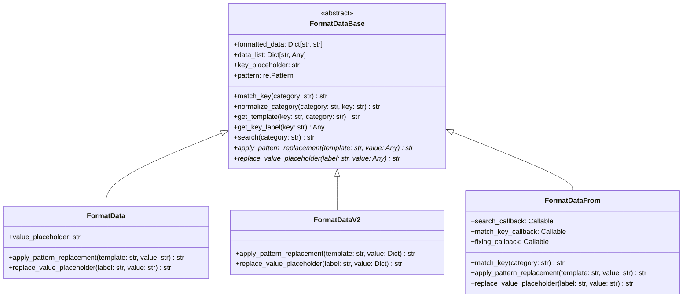
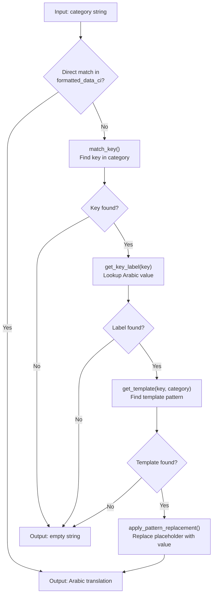
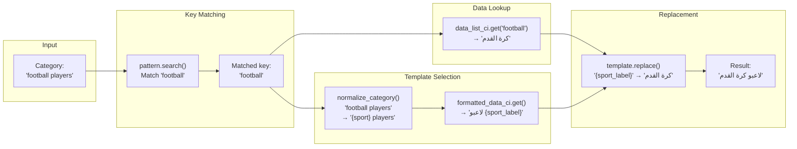
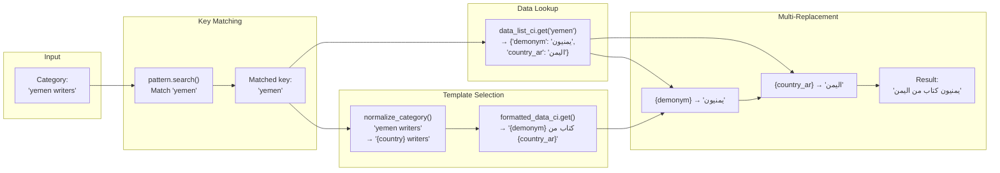
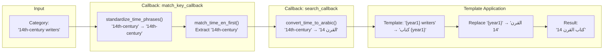
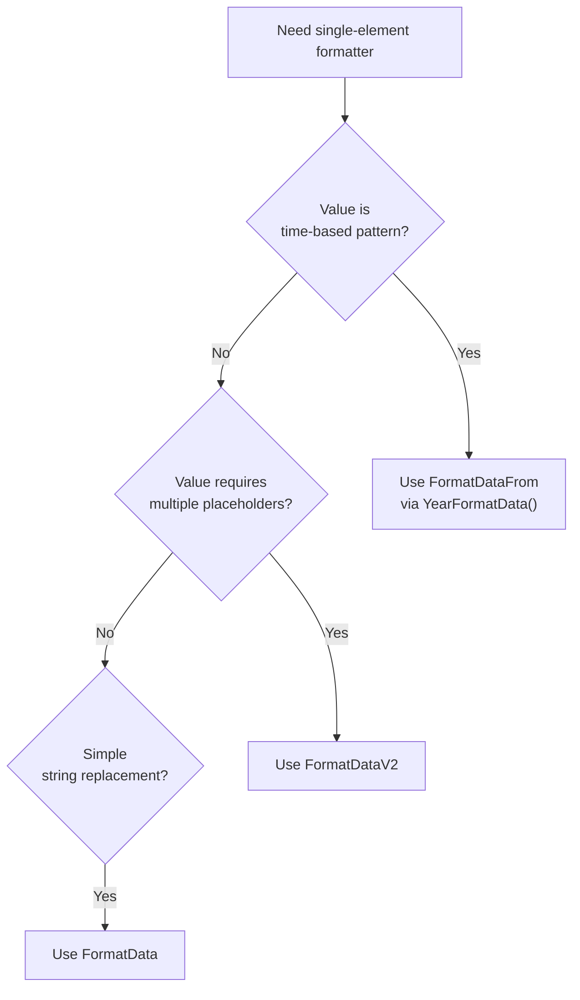
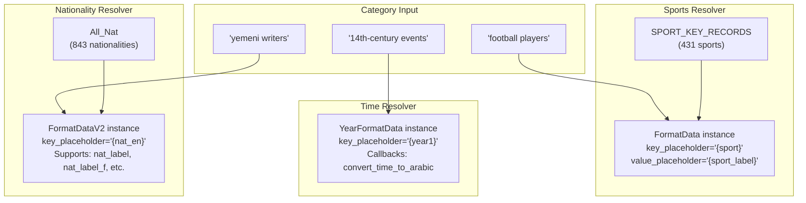

<details>
<summary>Relevant source files</summary>

The following files were used as context for generating this wiki page:

- [ArWikiCats/translations_formats/DataModel/__init__.py](../ArWikiCats/translations_formats/DataModel/__init__.py)
- [ArWikiCats/translations_formats/DataModel/model_data.py](../ArWikiCats/translations_formats/DataModel/model_data.py)
- [ArWikiCats/translations_formats/DataModel/model_data_base.py](../ArWikiCats/translations_formats/DataModel/model_data_base.py)
- [ArWikiCats/translations_formats/DataModel/model_data_time.py](../ArWikiCats/translations_formats/DataModel/model_data_time.py)
- [ArWikiCats/translations_formats/DataModel/model_data_v2.py](../ArWikiCats/translations_formats/DataModel/model_data_v2.py)
- [ArWikiCats/translations_formats/DataModelDouble/model_multi_data_double.py](../ArWikiCats/translations_formats/DataModelDouble/model_multi_data_double.py)
- [ArWikiCats/translations_formats/__init__.py](../ArWikiCats/translations_formats/__init__.py)
- [ArWikiCats/translations_formats/data_new_model.py](../ArWikiCats/translations_formats/data_new_model.py)
- [ArWikiCats/translations_formats/data_with_time.py](../ArWikiCats/translations_formats/data_with_time.py)
- [ArWikiCats/translations_formats/multi_data.py](../ArWikiCats/translations_formats/multi_data.py)

</details>


Single-element formatters are classes that handle category translations containing one dynamic element to be replaced. They match a single key in the input category (e.g., "football", "yemen", "14th-century") and use template patterns to produce Arabic output. Single-element formatters form the building blocks for more complex multi-element formatters (see [Multi-Element Formatters](#6.3))

This page covers the three concrete implementations of single-element formatters: `FormatData`, `FormatDataV2`, and `FormatDataFrom`. For information about the abstract base class they inherit from, see [FormatDataBase Architecture](23.FormatDataBase-Architecture.md). For information about factory functions that create these formatters, see [Factory Functions and Usage](27.Factory-Functions-and-Usage.md)

## Architecture Overview

All single-element formatters inherit from `FormatDataBase` and implement two abstract methods: `apply_pattern_replacement` and `replace_value_placeholder`. The inheritance hierarchy defines a common interface for pattern matching and template application while allowing each subclass to handle value replacement differently.



**Sources:** [ArWikiCats/translations_formats/DataModel/model_data_base.py L38-L74](../ArWikiCats/translations_formats/DataModel/model_data_base.py#L38-L74), [ArWikiCats/translations_formats/DataModel/model_data.py L37-L64](../ArWikiCats/translations_formats/DataModel/model_data.py#L37-L64), [ArWikiCats/translations_formats/DataModel/model_data_v2.py L32-L57](../ArWikiCats/translations_formats/DataModel/model_data_v2.py#L32-L57)

### Common Resolution Flow

All single-element formatters follow the same resolution pipeline defined in `FormatDataBase._search`:



**Sources:** [ArWikiCats/translations_formats/DataModel/model_data_base.py L264-L293](../ArWikiCats/translations_formats/DataModel/model_data_base.py#L264-L293)

## FormatData: Simple String Replacement

`FormatData` is the primary single-element formatter for categories where the data value is a simple string. It replaces a single placeholder in the template with the corresponding Arabic label.

### Data Structure

| Component | Type | Example |
|-----------|------|---------|
| `formatted_data` | `Dict[str, str]` | `{"{sport} players": "لاعبو {sport_label}"}` |
| `data_list` | `Dict[str, str]` | `{"football": "كرة القدم"}` |
| `key_placeholder` | `str` | `"{sport}"` |
| `value_placeholder` | `str` | `"{sport_label}"` |

### Translation Process



**Sources:** [ArWikiCats/translations_formats/DataModel/model_data.py L37-L132](../ArWikiCats/translations_formats/DataModel/model_data.py#L37-L132)

### Code Example

The following demonstrates `FormatData` usage from the actual implementation:

```python
# From ArWikiCats/translations_formats/DataModel/model_data.py:134-184
formatted_data = {
    "{sport} players": "لاعبو {sport_label}",
    "{sport} coaches": "مدربو {sport_label}",
    "{sport} managers": "مدربو {sport_label}",
}

data_list = {
    "american football": "كرة قدم أمريكية",
    "canadian football": "كرة قدم كندية",
}

bot = FormatData(
    formatted_data=formatted_data,
    data_list=data_list,
    key_placeholder="{sport}",
    value_placeholder="{sport_label}"
)

result = bot.search("american football players")
# result == "لاعبو كرة قدم أمريكية"
```

### Implementation Details

The `apply_pattern_replacement` method performs simple string replacement:

```python
# From ArWikiCats/translations_formats/DataModel/model_data.py:100-116
def apply_pattern_replacement(self, template_label: str, sport_label: str) -> str:
    final_label = template_label.replace(self.value_placeholder, sport_label)

    if self.value_placeholder not in final_label:
        return final_label.strip()

    return ""
```

**Sources:** [ArWikiCats/translations_formats/DataModel/model_data.py L66-L132](../ArWikiCats/translations_formats/DataModel/model_data.py#L66-L132)

## FormatDataV2: Dictionary-Based Replacement

`FormatDataV2` extends the base formatter to support dictionary values in `data_list`, enabling multiple placeholder replacements from a single key. This is used when a single entity (e.g., a country) requires different forms in the output template (e.g., demonym vs. country name)

### Data Structure

| Component | Type | Example |
|-----------|------|---------|
| `formatted_data` | `Dict[str, str]` | `{"{country} writers": "{demonym} كتاب من {country_ar}"}` |
| `data_list` | `Dict[str, Union[str, Dict]]` | `{"yemen": {"demonym": "يمنيون", "country_ar": "اليمن"}}` |
| `key_placeholder` | `str` | `"{country}"` |

Note that `FormatDataV2` does **not** have a `value_placeholder` parameter because the dictionary keys serve as the placeholder names.

### Translation Process with Multiple Placeholders



**Sources:** [ArWikiCats/translations_formats/DataModel/model_data_v2.py L32-L122](../ArWikiCats/translations_formats/DataModel/model_data_v2.py#L32-L122)

### Implementation Details

The `apply_pattern_replacement` method iterates over dictionary entries:

```python
# From ArWikiCats/translations_formats/DataModel/model_data_v2.py:81-100
def apply_pattern_replacement(self, template_label: str, sport_label: Union[str, Dict[str, str]]) -> str:
    if not isinstance(sport_label, dict):
        return template_label

    final_label = template_label

    if isinstance(sport_label, dict):
        for key, val in sport_label.items():
            if isinstance(val, str) and val:
                final_label = final_label.replace(f"{{{key}}}", val)

    return final_label.strip()
```

### Use Case: Nationality Resolution

`FormatDataV2` is heavily used in nationality resolution where each nationality provides multiple grammatical forms:

```python
# Real-world example from nationality resolver
data_list = {
    "yemeni": {
        "nat_label": "يمنيون",      # plural masculine
        "nat_label_f": "يمنيات",    # plural feminine
        "nat_label_g": "يمنية",     # singular feminine
    }
}

formatted_data = {
    "{nat_en} men": "{nat_label}",
    "{nat_en} women": "{nat_label_f}",
    "{nat_en} actresses": "ممثلات {nat_label_f}",
}
```

**Sources:** [ArWikiCats/translations_formats/DataModel/model_data_v2.py L59-L122](../ArWikiCats/translations_formats/DataModel/model_data_v2.py#L59-L122)

## FormatDataFrom: Callback-Based Replacement

`FormatDataFrom` is a specialized formatter that uses callback functions instead of static data dictionaries. It is primarily used for temporal pattern resolution where the key extraction and value generation require custom logic.

### Data Structure

| Component | Type | Purpose |
|-----------|------|---------|
| `search_callback` | `Callable` | Convert matched key to Arabic (e.g., "14th-century" → "القرن 14") |
| `match_key_callback` | `Callable` | Extract temporal key from category |
| `fixing_callback` | `Callable` | Normalize temporal expressions before matching |

### YearFormatData Factory

The primary use of `FormatDataFrom` is through the `YearFormatData` factory function:

```python
# From ArWikiCats/translations_formats/DataModel/model_data_time.py:34-66
def YearFormatData(
    key_placeholder: str,
    value_placeholder: str,
) -> FormatDataFrom:
    return FormatDataFrom(
        formatted_data={},
        key_placeholder=key_placeholder,
        value_placeholder=value_placeholder,
        search_callback=convert_time_to_arabic,
        match_key_callback=match_time_en_first,
        fixing_callback=standardize_time_phrases,
    )
```

**Sources:** [ArWikiCats/translations_formats/DataModel/model_data_time.py L1-L67](../ArWikiCats/translations_formats/DataModel/model_data_time.py#L1-L67)

### Temporal Pattern Translation



### Supported Temporal Patterns

The callback functions in `FormatDataFrom` handle multiple temporal patterns:

| English Pattern | Matched Key | Arabic Output |
|----------------|-------------|---------------|
| `"1990s"` | `"1990s"` | `"عقد 1990"` |
| `"14th-century"` | `"14th-century"` | `"القرن 14"` |
| `"2010"` | `"2010"` | `"2010"` |
| `"1990–1999"` | `"1990–1999"` | `"1990–1999"` |

**Sources:** [ArWikiCats/translations_formats/DataModel/model_data_time.py L1-L67](../ArWikiCats/translations_formats/DataModel/model_data_time.py#L1-L67)

## Comparison and Usage Guidance

### Selection Matrix



### Implementation Comparison

| Feature | FormatData | FormatDataV2 | FormatDataFrom |
|---------|-----------|--------------|----------------|
| **Value Type** | `str` | `str \| Dict[str, str]` | Generated by callback |
| **Placeholder Count** | 1 | Multiple | 1 |
| **Data Source** | Static dictionary | Static dictionary | Callback function |
| **Primary Use Case** | Sports, simple jobs | Nationalities, countries | Years, decades, centuries |
| **Example Template** | `"{sport} players"` | `"{country} {demonym} writers"` | `"{year1} events"` |
| **File Path** | [model_data.py](../model_data.py) | [model_data_v2.py](../model_data_v2.py) | [model_data_form.py](../model_data_form.py) (via [model_data_time.py](../model_data_time.py)) |

**Sources:** [ArWikiCats/translations_formats/DataModel/model_data.py L37-L132](../ArWikiCats/translations_formats/DataModel/model_data.py#L37-L132), [ArWikiCats/translations_formats/DataModel/model_data_v2.py L32-L122](../ArWikiCats/translations_formats/DataModel/model_data_v2.py#L32-L122), [ArWikiCats/translations_formats/DataModel/model_data_time.py L34-L66](../ArWikiCats/translations_formats/DataModel/model_data_time.py#L34-L66)

### Code Entity Mapping

The following table maps natural language concepts to concrete code entities:

| Concept | Class | Factory Function | Module |
|---------|-------|------------------|--------|
| Simple formatter | `FormatData` | N/A (direct instantiation) | `model_data.py` |
| Dictionary formatter | `FormatDataV2` | N/A (direct instantiation) | `model_data_v2.py` |
| Year formatter | `FormatDataFrom` | `YearFormatData()` | `model_data_time.py` |
| Dual-element formatter | `MultiDataFormatterBase` | `format_multi_data()` | `multi_data.py` |
| Dual-element dict formatter | `MultiDataFormatterBaseV2` | `format_multi_data_v2()` | `multi_data.py` |
| Year+country formatter | `MultiDataFormatterBaseYear` | `format_year_country_data()` | `data_with_time.py` |
| Film formatter | `MultiDataFormatterDataDouble` | `format_films_country_data()` | `data_new_model.py` |

**Sources:** [ArWikiCats/translations_formats/__init__.py L1-L97](../ArWikiCats/translations_formats/__init__.py#L1-L97), [ArWikiCats/translations_formats/multi_data.py L1-L290](../ArWikiCats/translations_formats/multi_data.py#L1-L290), [ArWikiCats/translations_formats/data_with_time.py L1-L179](../ArWikiCats/translations_formats/data_with_time.py#L1-L179), [ArWikiCats/translations_formats/data_new_model.py L1-L111](../ArWikiCats/translations_formats/data_new_model.py#L1-L111)

## Integration with Resolver Chain

Single-element formatters are used throughout the resolver chain (see [Resolver System](14.Resolver-System.md)). Each resolver typically instantiates one or more formatters:



**Sources:** [ArWikiCats/translations_formats/DataModel/model_data.py L1-L184](../ArWikiCats/translations_formats/DataModel/model_data.py#L1-L184), [ArWikiCats/translations_formats/DataModel/model_data_v2.py L1-L122](../ArWikiCats/translations_formats/DataModel/model_data_v2.py#L1-L122), [ArWikiCats/translations_formats/DataModel/model_data_time.py L1-L67](../ArWikiCats/translations_formats/DataModel/model_data_time.py#L1-L67)30:T7d2e,# Multi-Element Formatters

