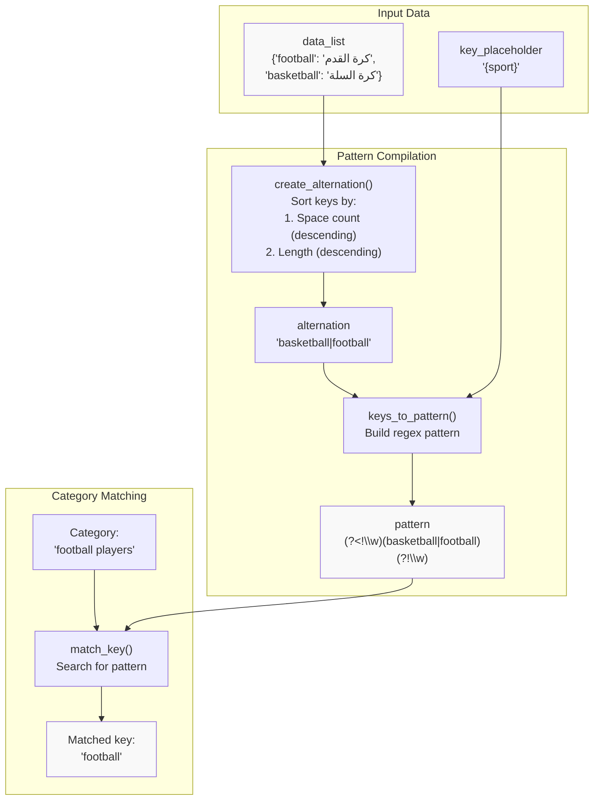
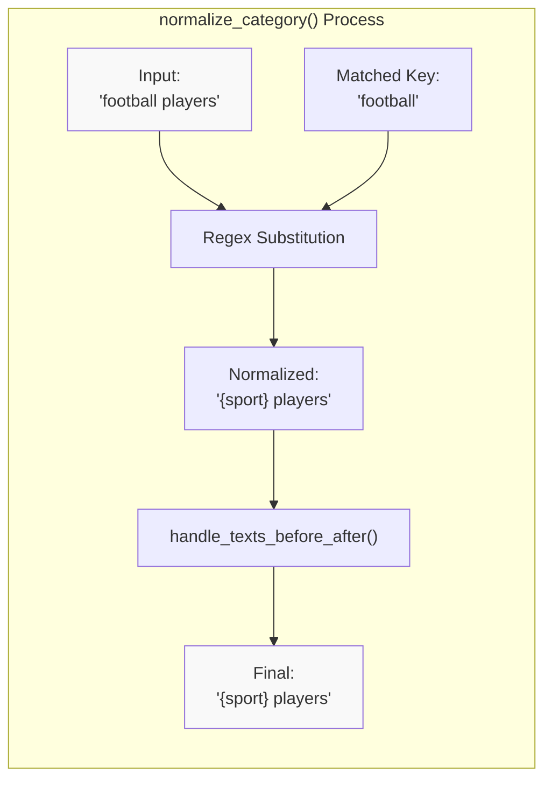
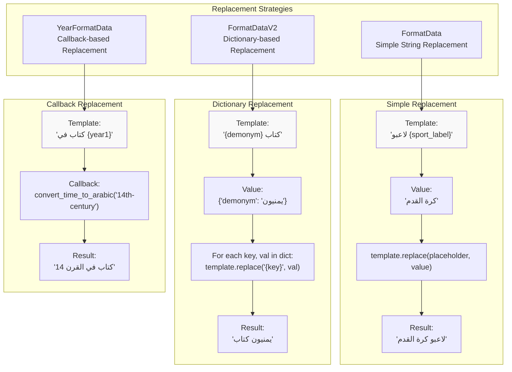
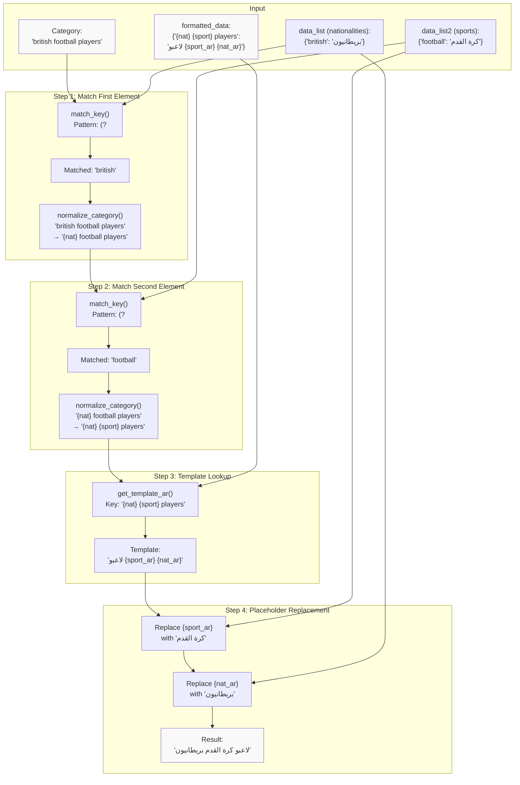

<details>
<summary>Relevant source files</summary>

The following files were used as context for generating this wiki page:

- [ArWikiCats/translations_formats/DataModel/__init__.py](../ArWikiCats/translations_formats/DataModel/__init__.py)
- [ArWikiCats/translations_formats/DataModel/model_data.py](../ArWikiCats/translations_formats/DataModel/model_data.py)
- [ArWikiCats/translations_formats/DataModel/model_data_base.py](../ArWikiCats/translations_formats/DataModel/model_data_base.py)
- [ArWikiCats/translations_formats/DataModel/model_data_time.py](../ArWikiCats/translations_formats/DataModel/model_data_time.py)
- [ArWikiCats/translations_formats/DataModel/model_data_v2.py](../ArWikiCats/translations_formats/DataModel/model_data_v2.py)
- [ArWikiCats/translations_formats/DataModelDouble/model_multi_data_double.py](../ArWikiCats/translations_formats/DataModelDouble/model_multi_data_double.py)
- [ArWikiCats/translations_formats/__init__.py](../ArWikiCats/translations_formats/__init__.py)
- [ArWikiCats/translations_formats/data_new_model.py](../ArWikiCats/translations_formats/data_new_model.py)
- [ArWikiCats/translations_formats/data_with_time.py](../ArWikiCats/translations_formats/data_with_time.py)
- [ArWikiCats/translations_formats/multi_data.py](../ArWikiCats/translations_formats/multi_data.py)

</details>


This page documents the placeholder syntax, pattern compilation mechanisms, and replacement strategies used throughout the ArWikiCats formatting system. For information about the base formatter classes, see [FormatDataBase Architecture](23.FormatDataBase-Architecture.md). For usage examples with factory functions, see [Factory Functions and Usage](27.Factory-Functions-and-Usage.md)

The template and placeholder system is the core mechanism that enables pattern-based translation. It defines how English category patterns are matched and how Arabic translations are generated through systematic placeholder replacement.

## Placeholder Syntax Overview

The system uses curly-brace delimited placeholders in both template keys and template values. These placeholders serve two distinct purposes: pattern matching (in keys) and value substitution (in values)

### Placeholder Categories

The system employs several categories of placeholders:

| Category | Example Placeholders | Purpose | Usage Context |
|----------|---------------------|---------|---------------|
| Element placeholders | `{sport}`, `{nat}`, `{country}` | Match keys in English patterns | Template keys |
| Value placeholders | `{sport_label}`, `{nat_ar}`, `{demonym}` | Mark substitution points | Template values |
| Temporal placeholders | `{year1}`, `{year2}` | Match year/decade/century patterns | Time-based templates |
| Genre placeholders | `{film_key}`, `{film_ar}` | Match film/TV genres | Film category templates |
| Default placeholders | `xoxo`, `natar` | Generic pattern matching | Internal processing |

**Sources:** [ArWikiCats/translations_formats/DataModel/model_data_base.py L75-L96](../ArWikiCats/translations_formats/DataModel/model_data_base.py#L75-L96), [ArWikiCats/translations_formats/multi_data.py L47-L48](../ArWikiCats/translations_formats/multi_data.py#L47-L48)

### Template Structure

Templates consist of two parts:

```
{key_pattern} → {value_pattern}

Example:
"{sport} players" → "لاعبو {sport_label}"
```

The key pattern contains element placeholders that match English category components. The value pattern contains value placeholders that are replaced with Arabic translations.

**Sources:** [ArWikiCats/translations_formats/DataModel/model_data.py L14-L26](../ArWikiCats/translations_formats/DataModel/model_data.py#L14-L26)

## Pattern Compilation Process

The pattern compilation process transforms data dictionaries into compiled regular expressions for efficient matching.



**Diagram: Pattern Compilation Flow from Data to Regex**

**Sources:** [ArWikiCats/translations_formats/DataModel/model_data_base.py L106-L133](../ArWikiCats/translations_formats/DataModel/model_data_base.py#L106-L133)

### Key Sorting Strategy

The `create_alternation()` method sorts keys using a specific strategy to prevent matching errors:

```python
keys_sorted = sorted(self.data_list_ci.keys(), key=lambda k: (-k.count(" "), -len(k)))
```

This ensures that "black-and-white" is matched before "black", preventing incorrect partial matches.

**Sources:** [ArWikiCats/translations_formats/DataModel/model_data_base.py:115]()

### Regex Pattern Construction

The `keys_to_pattern()` method constructs a word-boundary-aware regex pattern:

```
Pattern format: (?<!{regex_filter})({alternation})(?!{regex_filter})

Default regex_filter: \w
Default pattern: (?<!\w)(basketball|football)(?!\w)
```

The negative lookbehind `(?<!...)` and negative lookahead `(?!...)` ensure that keys are matched as complete tokens, not as substrings.

**Sources:** [ArWikiCats/translations_formats/DataModel/model_data_base.py L119-L133](../ArWikiCats/translations_formats/DataModel/model_data_base.py#L119-L133)

## Placeholder Normalization

Before template lookup, categories are normalized by replacing matched keys with their placeholders.



**Diagram: Category Normalization Process**

The normalization process uses regex substitution to replace the first occurrence of the matched key:

```python
normalized = re.sub(
    rf"(?<!{self.regex_filter}){re.escape(sport_key)}(?!{self.regex_filter})",
    f"{self.key_placeholder}",
    f" {normalized_category.strip()} ",
    flags=re.IGNORECASE,
    count=1,
)
```

**Sources:** [ArWikiCats/translations_formats/DataModel/model_data_base.py L193-L216](../ArWikiCats/translations_formats/DataModel/model_data_base.py#L193-L216)

### Text Before/After Handling

The `handle_texts_before_after()` method removes configured prefix/suffix text surrounding placeholders:

```python
if self.text_before:
    if f"{self.text_before}{self.key_placeholder}" in normalized:
        normalized = normalized.replace(f"{self.text_before}{self.key_placeholder}", self.key_placeholder)

if self.text_after:
    if f"{self.key_placeholder}{self.text_after}" in normalized:
        normalized = normalized.replace(f"{self.key_placeholder}{self.text_after}", self.key_placeholder)
```

This handles cases where the nationality data includes "the " prefix (e.g., "the British actors" → "{nat_en} actors")

**Sources:** [ArWikiCats/translations_formats/DataModel/model_data_base.py L158-L191](../ArWikiCats/translations_formats/DataModel/model_data_base.py#L158-L191)

## Replacement Strategies

The system implements three distinct replacement strategies depending on the formatter type.



**Diagram: Three Replacement Strategy Implementations**

**Sources:** [ArWikiCats/translations_formats/DataModel/model_data.py L100-L116](../ArWikiCats/translations_formats/DataModel/model_data.py#L100-L116), [ArWikiCats/translations_formats/DataModel/model_data_v2.py L81-L121](../ArWikiCats/translations_formats/DataModel/model_data_v2.py#L81-L121)

### FormatData: Simple String Replacement

The `FormatData` class implements the simplest replacement strategy:

```python
def apply_pattern_replacement(self, template_label: str, sport_label: str) -> str:
    final_label = template_label.replace(self.value_placeholder, sport_label)

    if self.value_placeholder not in final_label:
        return final_label.strip()

    return ""
```

This replaces all occurrences of `value_placeholder` with the Arabic label string.

**Sources:** [ArWikiCats/translations_formats/DataModel/model_data.py L100-L116](../ArWikiCats/translations_formats/DataModel/model_data.py#L100-L116)

### FormatDataV2: Dictionary-based Replacement

The `FormatDataV2` class supports dictionary values with multiple placeholders:

```python
def apply_pattern_replacement(self, template_label: str, sport_label: Union[str, Dict[str, str]]) -> str:
    if not isinstance(sport_label, dict):
        return template_label

    final_label = template_label

    if isinstance(sport_label, dict):
        for key, val in sport_label.items():
            if isinstance(val, str) and val:
                final_label = final_label.replace(f"{{{key}}}", val)

    return final_label.strip()
```

Each key-value pair in the dictionary replaces a corresponding placeholder in the template.

Example:
```python
data_list = {"yemen": {"demonym": "يمنيون", "country_ar": "اليمن"}}
template = "{demonym} كتاب من {country_ar}"
# Result: "يمنيون كتاب من اليمن"
```

**Sources:** [ArWikiCats/translations_formats/DataModel/model_data_v2.py L81-L100](../ArWikiCats/translations_formats/DataModel/model_data_v2.py#L81-L100)

### FormatDataFrom: Callback-based Replacement

The `FormatDataFrom` class (used by `YearFormatData`) uses callback functions for dynamic replacement:

```python
# YearFormatData creates a FormatDataFrom with callbacks
return FormatDataFrom(
    formatted_data={},
    key_placeholder=key_placeholder,
    value_placeholder=value_placeholder,
    search_callback=convert_time_to_arabic,
    match_key_callback=match_time_en_first,
    fixing_callback=standardize_time_phrases,
)
```

The callbacks handle temporal pattern conversion (e.g., "14th-century" → "القرن 14")

**Sources:** [ArWikiCats/translations_formats/DataModel/model_data_time.py L34-L66](../ArWikiCats/translations_formats/DataModel/model_data_time.py#L34-L66)

## Placeholder Naming Conventions

The codebase follows specific naming conventions for placeholders to maintain consistency across different formatter types.

### Naming Patterns

| Pattern Type | Key Placeholder | Value Placeholder | Example |
|--------------|-----------------|-------------------|---------|
| Sports | `{sport}` | `{sport_label}`, `{sport_ar}` | Football → كرة القدم |
| Nationalities | `{nat}`, `{nat_en}` | `{nat_ar}`, `{demonym}` | British → بريطانيون |
| Countries | `{country}`, `{country1}` | `{country_ar}`, `{demonym}` | Yemen → اليمن |
| Years | `{year1}`, `{year2}` | `{year1}`, `{year2}` | 14th-century → القرن 14 |
| Films | `{film_key}` | `{film_ar}` | Action → أكشن |

**Sources:** [ArWikiCats/translations_formats/multi_data.py L47-L48](../ArWikiCats/translations_formats/multi_data.py#L47-L48), [ArWikiCats/translations_formats/data_with_time.py L41-L42](../ArWikiCats/translations_formats/data_with_time.py#L41-L42)

### Default Placeholders

Two special default placeholders are used internally:

```python
YEAR_PARAM = "xoxo"
COUNTRY_PARAM = "natar"
```

These serve as fallback values when placeholders are not explicitly specified. The choice of unusual strings ("xoxo", "natar") minimizes the risk of collision with actual category text.

**Sources:** [ArWikiCats/translations_formats/multi_data.py L47-L48](../ArWikiCats/translations_formats/multi_data.py#L47-L48)

## Complete Translation Flow

The following diagram shows how placeholders flow through the entire translation process:



**Diagram: Complete Placeholder Flow for Dual-Element Translation**

**Sources:** [ArWikiCats/translations_formats/multi_data.py L96-L197](../ArWikiCats/translations_formats/multi_data.py#L96-L197)

## Placeholder Validation

The system includes validation to ensure all placeholders are properly replaced before returning results.

```python
def check_placeholders(self, category: str, result: str) -> str:
    if "{" in result:
        logger.warning(f">>> Found unprocessed placeholders in {category=}: {result=}")
        return ""
    return result
```

Any result containing a literal `{` character indicates an unprocessed placeholder, which triggers a warning and returns an empty string to prevent invalid translations.

**Sources:** [ArWikiCats/translations_formats/DataModel/model_data_base.py L371-L387](../ArWikiCats/translations_formats/DataModel/model_data_base.py#L371-L387)

## Edge Cases and Special Handling

### Case Sensitivity

All placeholder matching is case-insensitive:

```python
self.formatted_data_ci: Dict[str, str] = {k.lower(): v for k, v in formatted_data.items()}
self.data_list_ci: Dict[str, Any] = {k.lower(): v for k, v in data_list.items()}
```

This allows "British", "british", and "BRITISH" to match the same template.

**Sources:** [ArWikiCats/translations_formats/DataModel/model_data_base.py L93-L94](../ArWikiCats/translations_formats/DataModel/model_data_base.py#L93-L94)

### Multi-word Keys

Multi-word keys like "black-and-white" are prioritized over single-word keys through the sorting strategy:

```python
keys_sorted = sorted(self.data_list_ci.keys(), key=lambda k: (-k.count(" "), -len(k)))
```

This prevents "black" from matching when "black-and-white" is the intended key.

**Sources:** [ArWikiCats/translations_formats/DataModel/model_data_base.py:115]()

### Arabic Category Prefix

The system handles the "category:" prefix specially:

```python
def prepend_arabic_category_prefix(self, category, result) -> str:
    if result and category.lower().startswith("category:") and not result.startswith("تصنيف:"):
        result = "تصنيف:" + result
    return result
```

When the English input starts with "category:", the Arabic output is prefixed with "تصنيف:" unless it already has that prefix.

**Sources:** [ArWikiCats/translations_formats/DataModel/model_data_base.py L339-L352](../ArWikiCats/translations_formats/DataModel/model_data_base.py#L339-L352)

## Code Entity Reference

### Key Classes and Methods

| Class | Method | Purpose | Location |
|-------|--------|---------|----------|
| `FormatDataBase` | `create_alternation()` | Build regex alternation from keys | [model_data_base.py L106-L117](../model_data_base.py#L106-L117) |
| `FormatDataBase` | `keys_to_pattern()` | Compile regex pattern | [model_data_base.py L119-L133](../model_data_base.py#L119-L133) |
| `FormatDataBase` | `match_key()` | Find matching key in category | [model_data_base.py L135-L156](../model_data_base.py#L135-L156) |
| `FormatDataBase` | `normalize_category()` | Replace key with placeholder | [model_data_base.py L193-L216](../model_data_base.py#L193-L216) |
| `FormatDataBase` | `check_placeholders()` | Validate final result | [model_data_base.py L371-L387](../model_data_base.py#L371-L387) |
| `FormatData` | `apply_pattern_replacement()` | Simple string replacement | [model_data.py L100-L116](../model_data.py#L100-L116) |
| `FormatDataV2` | `apply_pattern_replacement()` | Dictionary-based replacement | [model_data_v2.py L81-L100](../model_data_v2.py#L81-L100) |
| `YearFormatData` | Factory function | Create temporal formatter | [model_data_time.py L34-L66](../model_data_time.py#L34-L66) |

**Sources:** Multiple files as referenced in the table.32:T650d,# Factory Functions and Usage

