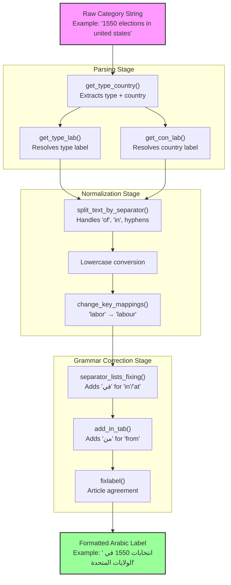
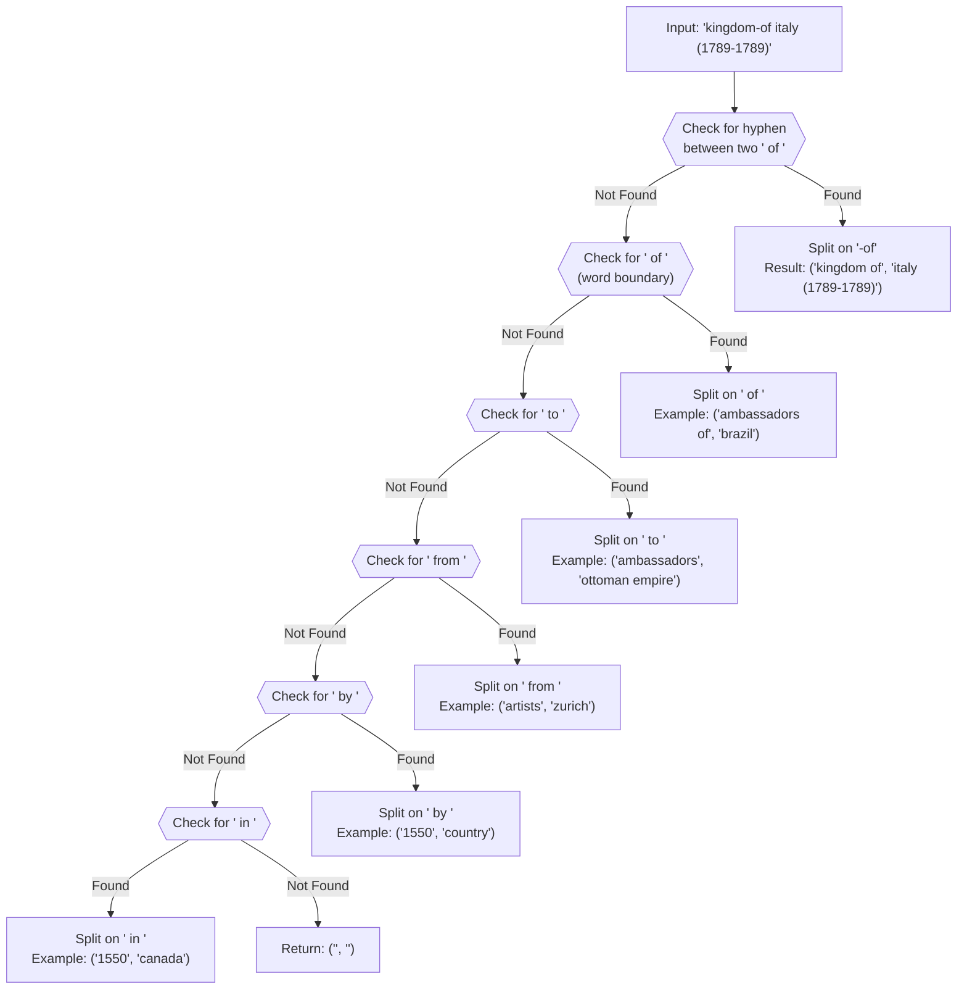
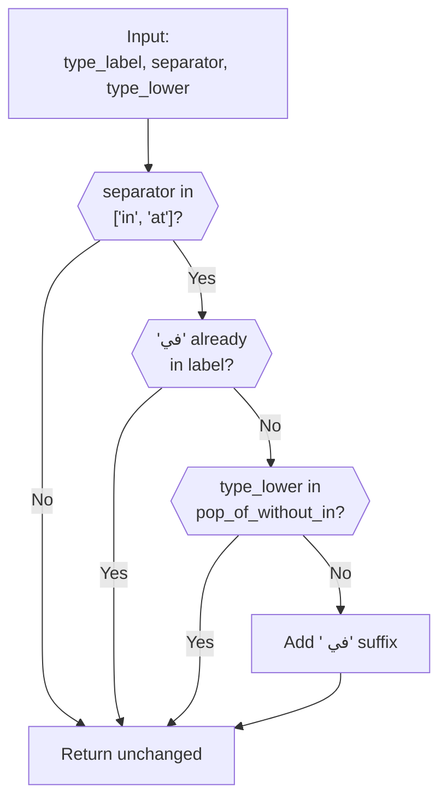
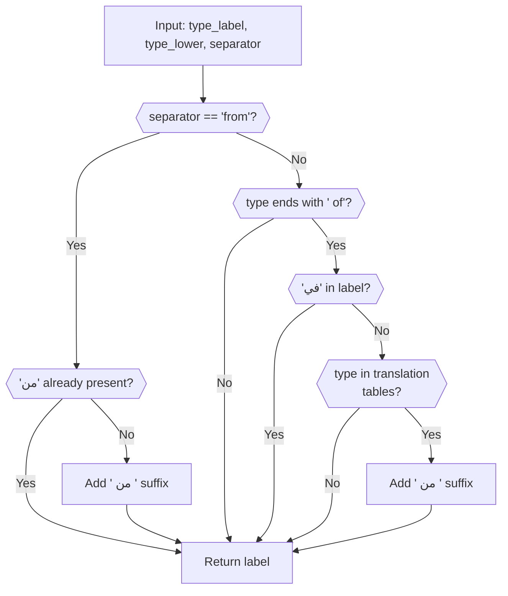
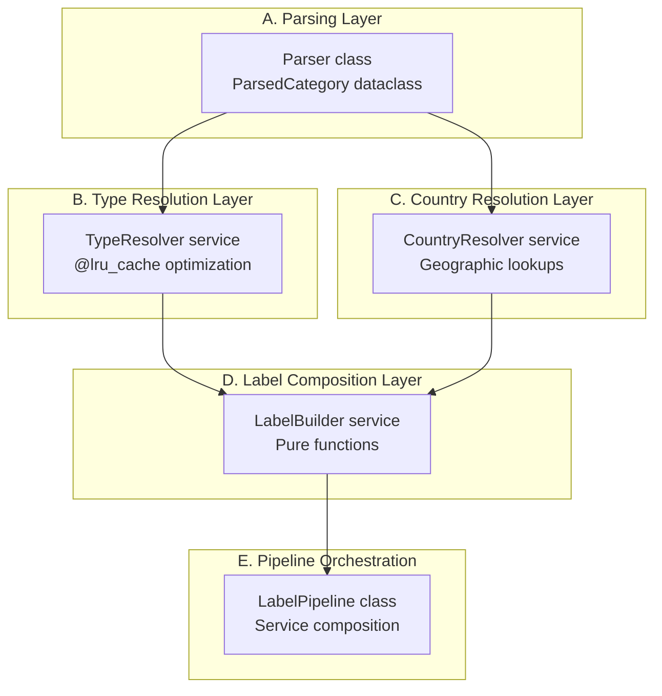

<details>
<summary>Relevant source files</summary>

The following files were used as context for generating this wiki page:

- [.github/copilot-instructions.md](.github/copilot-instructions.md)
- [.github/workflows/python-publish.yml](.github/workflows/python-publish.yml)
- [ArWikiCats/config.py](../ArWikiCats/config.py)
- [CLAUDE.md](CLAUDE.md)
- [README.md](README.md)
- [changelog.md](changelog.md)
- [help_scripts/split_non_geography.py](help_scripts/split_non_geography.py)
- [tests_require_fixes/test_papua_new_guinean.py](tests_require_fixes/test_papua_new_guinean.py)
- [tests_require_fixes/test_skip_data_all.py](tests_require_fixes/test_skip_data_all.py)
- [tests_require_fixes/text_to_fix.py](tests_require_fixes/text_to_fix.py)

</details>


## Purpose and Scope

Processing components handle category string manipulation: parsing raw English category labels into structured components, normalizing text, splitting by separators, and applying Arabic grammatical corrections. These operations occur before translation resolution and after initial pattern matching.

For information about the overall resolution pipeline and how processing components fit into the translation flow, see [Resolution Pipeline](#3.1). For details on template-based translation and placeholder substitution, see [Formatting System](#6).

---

## Overview

The processing layer performs three critical functions:

1. **Parsing**: Extracting category type, country/entity, and separator from raw strings
2. **Normalization**: Text splitting, hyphen handling, and lowercasing for consistent lookups
3. **Grammar Correction**: Adding Arabic prepositions (في, من, حسب) based on English separator patterns



**Sources**: [tests/ma_bots2/ar_lab/test_ar_lab_big_data.py:1-483](), [tests/ma_bots2/ar_lab/test_bot_type_lab.py:1-223](), [tasks/ar_lab_task.md:1-154]()

---

## Text Parsing and Component Extraction

### get_type_country Function

The `get_type_country` function splits a category string into two components based on the separator position. It returns a tuple of `(type, country)`.

**Example Behavior**:

| Input Category | Separator | Type Output | Country Output |
|---|---|---|---|
| `"ambassadors of brazil"` | `" of "` | `"ambassadors of"` | `"brazil"` |
| `"1550 in canada"` | `" in "` | `"1550 in"` | `"canada"` |
| `"films about automobiles"` | `" about "` | `"films"` | `"automobiles"` |

**Sources**: [tests/ma_bots2/ar_lab/test_bot_type_country.py:1-19]()

### get_type_lab Function

Resolves the English category type into an Arabic label. This function handles:

- Geographic entities: `"arizona territory"` → `"إقليم أريزونا"`
- Sports contexts: `"basketball playerss in lebanon"` → `"لاعبو كرة سلة في لبنان"`
- Temporal patterns: `"railway stations in south korea"` → `"محطات السكك الحديدية في كوريا الجنوبية"`
- Special cases: `"former buildings and structures"` → `"مبان ومنشآت سابقة"`

The function applies pattern matching against translation tables and handles grammatical variations (gender, plurality).

**Sources**: [tests/ma_bots2/ar_lab/test_bot_type_lab.py:9-223]()

### get_con_lab Function

Resolves the country/entity portion into Arabic, with support for:

- Standard countries: `"united states"` → `"الولايات المتحدة"`
- Historical entities: `"world-war-ii"` → `"الحرب العالمية الثانية"`
- Temporal references: `"1420"` → `"1420"`, `"20th century"` → `"القرن 20"`
- Special contexts: `"american civil war"` → `"الحرب الأهلية الأمريكية"`

The function parameter `start_get_country2` enables recursive lookup for complex geographic patterns.

**Sources**: [tests/ma_bots2/ar_lab/test_bot_con_lab.py:1-218]()

---

## Text Splitting and Normalization

### split_text_by_separator Function

This function implements **recursive separator detection** with priority ordering. It handles compound categories containing multiple separators.



### Separator Priority

The function checks separators in strict order:

1. **Hyphenated "of"** (`-of`): `"kingdom-of italy"` → `("kingdom of", "italy")`
2. **" of "**: `"ambassadors of fiji"` → `("ambassadors of", "fiji")`
3. **" to "**: `"ambassadors to south sudan"` → `("ambassadors", "south sudan")`
4. **" from "**: `"artists from novi sad"` → `("artists", "novi sad")`
5. **" by "**: `"1550 by country"` → `("1550", "by country")`
6. **" in "**: `"1550 in canada"` → `("1550", "canada")`

### Hyphen Handling

The function converts hyphenated "of" patterns to standard space-separated form:

- `"ministers-of foreign affairs"` → `("ministers of", "foreign affairs")`
- `"republic-of ireland"` → `("republic of", "ireland")`
- `"federated states-of micronesia"` → `("federated states of", "micronesia")`

This normalization ensures consistent lookup in translation dictionaries.

**Test Examples**:

```python
# From test_split_text_extended.py
assert split_text_by_separator("kingdom-of italy (1789–1789)") == ("kingdom of", "italy (1789–1789)")
assert split_text_by_separator("ambassadors of afghanistan") == ("ambassadors of", "afghanistan")
assert split_text_by_separator("tourism in republic-of ireland") == ("tourism in republic of", "ireland")
```

**Sources**: [tests/ma_bots2/country2_bots/test_split_text_extended.py:1-407]()

---

## Arabic Grammar Corrections

### separator_lists_fixing Function

Adds the Arabic preposition **"في"** (meaning "in") when the English category uses `"in"` or `"at"` separators. This function ensures grammatically correct Arabic output.

**Logic Flow**:



**Examples**:

| Input Label | Separator | Output Label |
|---|---|---|
| `"منشآت عسكرية"` | `"in"` | `"منشآت عسكرية في"` |
| `"رياضة"` | `"at"` | `"رياضة في"` |
| `"منشآت عسكرية في"` | `"in"` | `"منشآت عسكرية في"` (unchanged) |

The function skips adding "في" for:
- Labels already containing "في"
- Types in the `pop_of_without_in` exception list
- Non-listed separators (`"from"`, `"by"`, `"of"`)

**Sources**: [tests/ma_bots2/ar_lab/test_separator_fixing.py:21-74]()

### add_in_tab Function

Adds the Arabic preposition **"من"** (meaning "from") based on two conditions:

1. **Direct "from" separator**: When `separator_stripped == "from"`
2. **"of" suffix pattern**: When type ends with `" of"` and appears in translation tables

**Decision Tree**:



**Examples**:

| Input Label | Type | Separator | Output Label |
|---|---|---|---|
| `"رياضيون"` | `"athletes"` | `"from"` | `"رياضيون من "` |
| `"رياضيون من"` | `"athletes"` | `"from"` | `"رياضيون من"` (unchanged) |
| `"لاعبو كرة قدم"` | `"footballers of"` | `"in"` | `"لاعبو كرة قدم من "` (if in tables) |

The function checks `get_pop_All_18` and `check_key_new_players` to determine if a type with `" of"` suffix qualifies for "من" addition.

**Sources**: [tests/ma_bots2/ar_lab/test_separator_fixing.py:76-164](), [tests/ma_bots2/ar_lab/test_separator_fixing_integration.py:61-101]()

### fixlabel Function

Applies final Arabic grammar corrections including:

- **Article agreement**: Ensuring definite articles match noun gender/number
- **Preposition consistency**: Verifying correct use of في/من/حسب
- **Word order adjustments**: Placing adjectives and modifiers correctly

This function is called after all translation and composition steps are complete.

**Sources**: Based on references in high-level diagrams and test patterns

---

## Integration with Resolution Pipeline

The processing components integrate with the resolver chain at multiple stages:

```mermaid
graph LR
    subgraph "Pre-Resolution Processing"
        Parse["parse category<br/>get_type_country()"]
        Normalize["normalize text<br/>split_text_by_separator()"]
    end

    subgraph "Resolution Chain"
        R1["Year Resolvers"]
        R2["Nationality Resolvers"]
        R3["Country Resolvers"]
        R7["...other resolvers"]
    end

    subgraph "Post-Resolution Processing"
        SepFix["separator_lists_fixing()"]
        AddTab["add_in_tab()"]
        Fix["fixlabel()"]
    end

    Parse --> Normalize
    Normalize --> R1
    R1 --> R2
    R2 --> R3
    R3 --> R7
    R7 --> SepFix
    SepFix --> AddTab
    AddTab --> Fix

    Fix --> Output["Final Arabic Label"]
```



**Processing Sequence**:

1. **Parse**: Extract type and country using `get_type_country`
2. **Normalize**: Split and lowercase for dictionary lookups
3. **Resolve**: Pass through resolver chain (see [Resolver Chain](#5))
4. **Correct Grammar**: Apply `separator_lists_fixing` and `add_in_tab`
5. **Final Formatting**: Run `fixlabel` for Arabic-specific corrections

**Sources**: [tests/ma_bots2/ar_lab/test_ar_lab_big_data.py:1-483](), [tests/ma_bots2/ar_lab/test_separator_fixing_integration.py:104-137]()

---

## LabelPipeline Refactoring Plan

The ar_lab module is undergoing architectural refactoring to improve maintainability and testability. The planned structure transitions from a monolithic procedural design to a domain-driven service architecture.

### Current Architecture Issues

- **Tight coupling**: Functions directly import and call each other
- **Large file size**: Single file contains parsing, resolution, and formatting logic
- **Circular dependencies**: Makes testing and mocking difficult
- **Low modularity**: Hard to extend with new resolvers

### Target Architecture

The refactoring plan defines four primary domains:



**Refactoring Phases**:

1. **Phase 1**: Extract functions into domain modules without logic changes
2. **Phase 2**: Implement `Parser` class with `ParsedCategory` dataclass output
3. **Phase 3**: Create `TypeResolver` service with caching
4. **Phase 4**: Create `CountryResolver` service with caching
5. **Phase 5**: Centralize composition logic in `LabelBuilder`
6. **Phase 6**: Assemble `LabelPipeline` orchestrator
7. **Phase 7**: Remove duplicate code and add documentation

**Benefits**:

- **Testability**: Each service can be mocked independently
- **Caching**: `@lru_cache` can optimize hot paths
- **Extensibility**: New resolvers plug into pipeline without modifying existing code
- **Maintainability**: Clear domain boundaries reduce cognitive load

**Sources**: [tasks/ar_lab_task.md:1-154]()

---

## Code Entity Reference

### Core Functions

| Function | Module | Purpose |
|---|---|---|
| `find_ar_label` | `ArWikiCats.legacy_bots.ma_bots2.ar_lab_bot` | Main entry point for label generation |
| `get_type_country` | `ArWikiCats.legacy_bots.ma_bots2.lab` | Splits category into type and country |
| `get_type_lab` | `ArWikiCats.legacy_bots.ma_bots2.lab` | Resolves type to Arabic label |
| `get_con_lab` | `ArWikiCats.legacy_bots.ma_bots2.lab` | Resolves country to Arabic label |
| `split_text_by_separator` | `ArWikiCats.legacy_bots.ma_bots2.country2_label_bot` | Recursive separator splitting |
| `separator_lists_fixing` | `ArWikiCats.legacy_bots.ma_bots2.ar_lab_bot` | Adds "في" preposition |
| `add_in_tab` | `ArWikiCats.legacy_bots.ma_bots2.ar_lab_bot` | Adds "من" preposition |
| `fixlabel` | Referenced in imports | Final Arabic grammar corrections |
| `country_2_title_work` | `ArWikiCats.legacy_bots.ma_bots2.country2_label_bot` | Country-specific processing |

### Test Coverage

| Test File | Functions Tested | Test Count |
|---|---|---|
| `test_ar_lab_big_data.py` | `find_ar_label` | 483 test cases |
| `test_country2_label_bot.py` | `country_2_title_work` | 244 test cases |
| `test_split_text_extended.py` | `split_text_by_separator` | 407 test cases |
| `test_bot_type_lab.py` | `get_type_lab` | 223 test cases |
| `test_bot_con_lab.py` | `get_con_lab` | 218 test cases |
| `test_separator_fixing.py` | `separator_lists_fixing`, `add_in_tab` | 164 test cases |

**Sources**: All test files in [tests/ma_bots2/]() directory structure

---

## Common Processing Patterns

### Pattern 1: Simple Geographic Category

**Input**: `"1550 in canada"`

**Processing Steps**:
1. `get_type_country("1550 in canada", " in ")` → `("1550 in", "canada")`
2. `get_type_lab("1550 in")` → `"1550"`
3. `get_con_lab("canada")` → `"كندا"`
4. `separator_lists_fixing("1550", "in", ...)` → `"1550 في"`
5. Compose: `"1550 في كندا"` → `"كندا في 1550"` (reordering applied)

**Output**: `"كندا في 1550"`

### Pattern 2: People From Location

**Input**: `"artists from zurich"`

**Processing Steps**:
1. `split_text_by_separator("artists from zurich")` → `("artists", "zurich")`
2. `get_type_lab("artists")` → `"فنانون"`
3. `get_con_lab("zurich")` → `"زيورخ"`
4. `add_in_tab("فنانون", "artists", "from")` → `"فنانون من "`
5. Compose: `"فنانون من زيورخ"`

**Output**: `"فنانون من زيورخ"`

### Pattern 3: Complex Hyphenated Entity

**Input**: `"kingdom-of italy (1789–1789)"`

**Processing Steps**:
1. `split_text_by_separator(...)` detects hyphenated "of"
2. Converts to: `("kingdom of", "italy (1789–1789)")`
3. `get_type_lab("kingdom of")` → `"مملكة"`
4. `get_con_lab("italy (1789–1789)")` → `"إيطاليا (1789–1789)"`
5. Compose with appropriate preposition

**Output**: `"مملكة إيطاليا (1789–1789)"`

**Sources**: [tests/ma_bots2/ar_lab/test_ar_lab_big_data.py:10-19](), [tests/ma_bots2/country2_bots/test_split_text_extended.py:11-17]()34:T4e27,# Category Normalization

