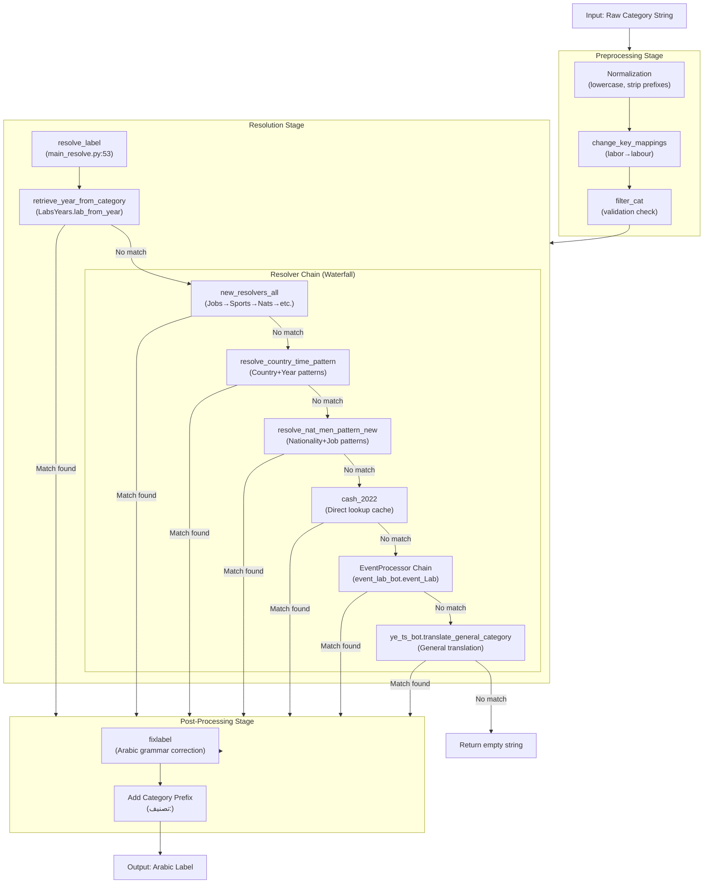
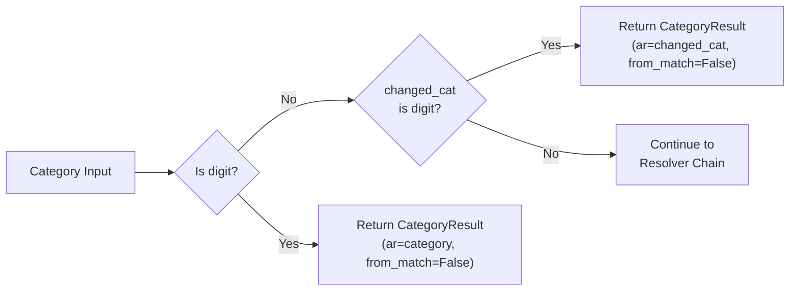
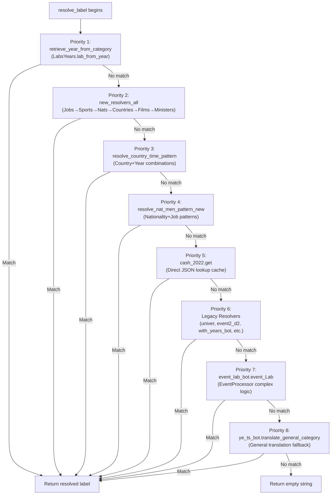
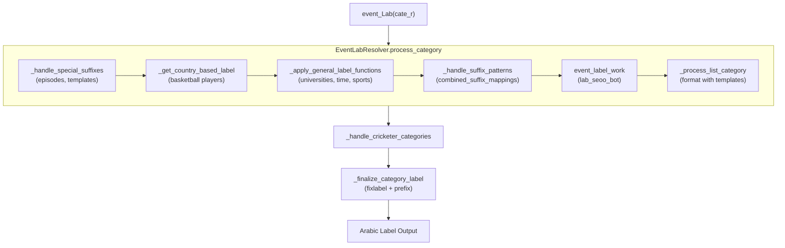
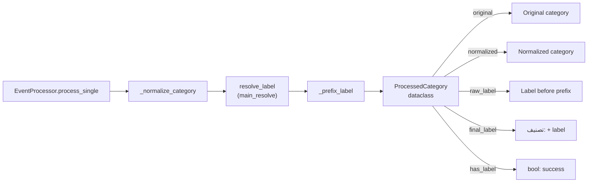

<details>
<summary>Relevant source files</summary>

The following files were used as context for generating this wiki page:

- [.github/copilot-instructions.md](.github/copilot-instructions.md)
- [.github/workflows/python-publish.yml](.github/workflows/python-publish.yml)
- [ArWikiCats/config.py](../ArWikiCats/config.py)
- [ArWikiCats/jsons/population/pop_All_2018.json](../ArWikiCats/jsons/population/pop_All_2018.json)
- [ArWikiCats/main_processers/main_resolve.py](../ArWikiCats/main_processers/main_resolve.py)
- [CLAUDE.md](CLAUDE.md)
- [README.md](README.md)
- [changelog.md](changelog.md)
- [tests_require_fixes/test_papua_new_guinean.py](tests_require_fixes/test_papua_new_guinean.py)
- [tests_require_fixes/test_skip_data_all.py](tests_require_fixes/test_skip_data_all.py)
- [tests_require_fixes/text_to_fix.py](tests_require_fixes/text_to_fix.py)

</details>


The resolution pipeline is the core translation engine that converts English Wikipedia category strings into Arabic equivalents. This page documents the multi-stage processing flow, from input normalization through the waterfall resolver chain to final output formatting.

For information about specific resolver implementations (Year Pattern, Nationality, Country Name, etc.), see the Resolver Chain pages [5.1](#5.1)-[5.7](#5.7). For details about the formatting system that resolvers use, see [6](#6). For category parsing internals, see [3.3](#3.3)

## Overview

The resolution pipeline implements a **waterfall pattern with early exit optimization**. Each category passes through preprocessing, attempts resolution via specialized resolvers in priority order, and undergoes post-processing to produce grammatically correct Arabic labels.

**Resolution Pipeline Flow**



**Sources:** [ArWikiCats/main_processers/main_resolve.py L1-L156](../ArWikiCats/main_processers/main_resolve.py#L1-L156), High-level diagrams (Diagram 3)

## Main Entry Point: resolve_label_ar

The `resolve_label_ar` function in [ArWikiCats/main_processers/main_resolve.py L146-L149](../ArWikiCats/main_processers/main_resolve.py#L146-L149) is the primary public API for the resolution pipeline. It wraps the internal `resolve_label` function and returns only the Arabic label string.

```python
def resolve_label_ar(category: str, fix_label: bool = True) -> str:
    """Resolve the Arabic label for a given category."""
    result = resolve_label(category, fix_label=fix_label)
    return result.ar
```

The internal `resolve_label` function [ArWikiCats/main_processers/main_resolve.py L53-L143](../ArWikiCats/main_processers/main_resolve.py#L53-L143) returns a `CategoryResult` dataclass containing:

| Field | Type | Description |
|-------|------|-------------|
| `en` | `str` | Original English category |
| `ar` | `str` | Resolved Arabic label |
| `from_match` | `str` | Source of match (year pattern or resolver ID) |

**Caching:** The `resolve_label` function uses `@functools.lru_cache(maxsize=None)` [ArWikiCats/main_processers/main_resolve.py:52](../ArWikiCats/main_processers/main_resolve.py:52) for unlimited caching, providing significant performance improvements for repeated lookups.

**Sources:** [ArWikiCats/main_processers/main_resolve.py L28-L149](../ArWikiCats/main_processers/main_resolve.py#L28-L149)

## Preprocessing Stage

Before entering the resolver chain, category strings undergo normalization and validation.

### change_key_mappings

The `change_cat` function [ArWikiCats/format_bots/__init__.py](../ArWikiCats/format_bots/__init__.py) (imported in [ArWikiCats/main_processers/main_resolve.py:21](../ArWikiCats/main_processers/main_resolve.py:21)) applies key mappings to standardize English terminology:

- `labor` → `labour`
- `war of` → `war-of`
- Apostrophe removal
- Whitespace normalization

This ensures consistent input patterns for downstream resolvers.

### filter_cat Validation

The `filter_en.filter_cat` function [ArWikiCats/main_processers/main_resolve.py:71](../ArWikiCats/main_processers/main_resolve.py:71) performs category validation to determine if a category should be processed. Categories failing validation skip most of the resolver chain.

**Early Exit Conditions:**



**Sources:** [ArWikiCats/main_processers/main_resolve.py L55-L71](../ArWikiCats/main_processers/main_resolve.py#L55-L71), [ArWikiCats/format_bots/__init__.py](../ArWikiCats/format_bots/__init__.py)

## Resolver Chain (Waterfall Pattern)

The resolver chain in [ArWikiCats/main_processers/main_resolve.py L75-L126](../ArWikiCats/main_processers/main_resolve.py#L75-L126) attempts resolution using specialized resolvers in priority order. Each resolver returns an empty string on failure, allowing the next resolver to attempt matching.

**Resolver Priority Order:**



**Sources:** [ArWikiCats/main_processers/main_resolve.py L75-L126](../ArWikiCats/main_processers/main_resolve.py#L75-L126)

### Priority 1: Year Pattern Resolution

**Function:** `retrieve_year_from_category` [ArWikiCats/main_processers/main_resolve.py L42-L49](../ArWikiCats/main_processers/main_resolve.py#L42-L49)

This resolver uses the `LabsYears` class to detect temporal patterns (decades, centuries, years, BC dates). Year patterns have top priority because they are unambiguous and frequently occur in categories.

**Implementation:**
- Uses `build_labs_years_object()` [ArWikiCats/main_processers/main_resolve.py L37-L39](../ArWikiCats/main_processers/main_resolve.py#L37-L39) with LRU caching (maxsize=1)
- Calls `labs_years_bot.lab_from_year(category)` which returns `(cat_year, from_year)`
- If `from_year` is truthy, resolution succeeds immediately

**Sources:** [ArWikiCats/main_processers/main_resolve.py L37-L49](../ArWikiCats/main_processers/main_resolve.py#L37-L49), [ArWikiCats/time_resolvers/labs_years.py](../ArWikiCats/time_resolvers/labs_years.py)

### Priority 2: new_resolvers_all

**Function:** `new_resolvers_all(changed_cat)` [ArWikiCats/main_processers/main_resolve.py:84](../ArWikiCats/main_processers/main_resolve.py:84)

This is the main modular resolver that chains together specialized resolvers in the `new_resolvers/` directory. See [5](#5) for detailed documentation of each resolver.

**Internal Chain:**
1. Job resolvers (`resolve_jobs_main`)
2. Sports resolvers (`resolve_sports_main`)
3. Nationality resolvers (`resolve_by_nats`)
4. Country name resolvers (`resolve_by_countries_names`)
5. Film/TV resolvers (`resolve_nationalities_main`)
6. Relations resolvers (`new_relations_resolvers`)
7. Language resolvers (`resolve_languages_labels`)

**Sources:** [ArWikiCats/main_processers/main_resolve.py:84](../ArWikiCats/main_processers/main_resolve.py:84), [ArWikiCats/new_resolvers/reslove_all.py L1-L50](../ArWikiCats/new_resolvers/reslove_all.py#L1-L50)

### Priority 3-8: Additional Resolvers

The remaining priorities handle specialized patterns and fallback cases:

| Priority | Function | Purpose |
|----------|----------|---------|
| 3 | `resolve_country_time_pattern` | Country+Year combinations (e.g., "2000s in France") |
| 4 | `resolve_nat_men_pattern_new` | Nationality+Job patterns with gender handling |
| 5 | `cash_2022.get` | Direct lookup in cached JSON data |
| 6 | Legacy resolvers | Universities, events, year prefixes |
| 7 | `event_lab_bot.event_Lab` | Complex EventProcessor logic |
| 8 | `ye_ts_bot.translate_general_category` | General translation as final fallback |

**Sources:** [ArWikiCats/main_processers/main_resolve.py L91-L126](../ArWikiCats/main_processers/main_resolve.py#L91-L126)

## Post-Processing Stage

After a resolver produces a match, the label undergoes grammatical correction and formatting.

### fixlabel Function

The `fixlabel` function [ArWikiCats/fix/fixtitle.py](../ArWikiCats/fix/fixtitle.py) (called at [ArWikiCats/main_processers/main_resolve.py:128](../ArWikiCats/main_processers/main_resolve.py:128)) performs:

- Arabic article agreement (definite/indefinite forms)
- Preposition insertion based on English separators ("of" → "من", "in" → "في")
- Duplicate preposition removal
- Gender agreement corrections
- Diacritical mark normalization

### Category Prefix Addition

The resolved label is prefixed with `"تصنيف:"` by the EventProcessor's `_prefix_label` method [ArWikiCats/main_processers/event_lab_bot.py:301](../ArWikiCats/main_processers/event_lab_bot.py:301). The main resolver optionally applies this through `_finalize_category_label` [ArWikiCats/main_processers/event_lab_bot.py L287-L303](../ArWikiCats/main_processers/event_lab_bot.py#L287-L303)

**Note:** The `resolve_label_ar` function returns labels **without** the prefix, while `resolve_arabic_category_label` (in the EventProcessor) includes it.

**Sources:** [ArWikiCats/main_processers/main_resolve.py:128](../ArWikiCats/main_processers/main_resolve.py:128), [ArWikiCats/main_processers/event_lab_bot.py L287-L303](../ArWikiCats/main_processers/event_lab_bot.py#L287-L303), [ArWikiCats/fix/fixtitle.py](../ArWikiCats/fix/fixtitle.py)

## EventProcessor and event_Lab

The `EventLabResolver` class [ArWikiCats/main_processers/event_lab_bot.py L61-L279](../ArWikiCats/main_processers/event_lab_bot.py#L61-L279) provides a complex, multi-stage processing pipeline used as a fallback resolver.

**EventLabResolver Architecture:**



**Key Methods:**

| Method | Purpose |
|--------|---------|
| `_handle_special_suffixes` | Detects " episodes" and " templates" endings |
| `_get_country_based_label` | Handles patterns like "ethiopian basketball players" |
| `_apply_general_label_functions` | Tries universities, time, sports, general translation |
| `_handle_suffix_patterns` | Matches against `combined_suffix_mappings` |
| `_process_list_category` | Applies template formatting with placeholders |

**Sources:** [ArWikiCats/main_processers/event_lab_bot.py L61-L382](../ArWikiCats/main_processers/event_lab_bot.py#L61-L382)

### wrap_lab_for_country2

The `wrap_lab_for_country2` function [ArWikiCats/main_processers/event_lab_bot.py L32-L58](../ArWikiCats/main_processers/event_lab_bot.py#L32-L58) is a utility resolver that chains together multiple specialized resolvers for country-based lookups:

```python
resolved_label = (
    new_resolvers_all(country2)
    or get_from_pf_keys2(country2)
    or get_pop_All_18(country2)
    or te_films(country2)
    or sport_lab_suffixes.get_teams_new(country2)
    or parties_bot.get_parties_lab(country2)
    or team_work.Get_team_work_Club(country2)
    or univer.te_universities(country2)
    or work_peoples(country2)
    or get_KAKO(country2)
    or convert_time_to_arabic(country2)
    or ""
)
```

This function demonstrates the chaining pattern used throughout the codebase, attempting multiple specialized lookups until one succeeds.

**Sources:** [ArWikiCats/main_processers/event_lab_bot.py L32-L58](../ArWikiCats/main_processers/event_lab_bot.py#L32-L58)

## Caching and Performance Optimization

The resolution pipeline employs multiple caching strategies:

### Function-Level Caching

| Function | Cache Type | Maxsize | Location |
|----------|------------|---------|----------|
| `resolve_label` | `@lru_cache` | None (unlimited) | [main_resolve.py:52]() |
| `build_labs_years_object` | `@lru_cache` | 1 | [main_resolve.py:37]() |
| `wrap_lab_for_country2` | `@lru_cache` | 10000 | [event_lab_bot.py:32]() |

### Data Structure Caching

The `cash_2022` cache [ArWikiCats/main_processers/main_resolve.py L104-L106](../ArWikiCats/main_processers/main_resolve.py#L104-L106) provides direct dictionary lookups for frequently accessed categories. This cache is populated from JSON files and accessed via `cash_2022.get(category_lower, "")`.

### Early Exit Optimization

The waterfall pattern ensures minimal computational cost:
- Average case: 2-3 resolver attempts
- Best case: 1 resolver attempt (year patterns)
- Worst case: 8 resolver attempts before returning empty string

**Performance Characteristics:**
- First call: Full resolver chain execution
- Subsequent calls: O(1) dictionary lookup from LRU cache
- Memory usage: Grows with unique category count, bounded by `maxsize`

**Sources:** [ArWikiCats/main_processers/main_resolve.py L37-L52](../ArWikiCats/main_processers/main_resolve.py#L37-L52), [ArWikiCats/main_processers/event_lab_bot.py:32](../ArWikiCats/main_processers/event_lab_bot.py:32), [ArWikiCats/legacy_bots/matables_bots/bot.py](../ArWikiCats/legacy_bots/matables_bots/bot.py)

## Configuration and Control Flow

The resolution pipeline behavior can be modified via configuration settings in [ArWikiCats/config.py](../ArWikiCats/config.py):

| Setting | Variable | Effect |
|---------|----------|--------|
| `TGC_RESOLVER_FIRST` | `app_settings.start_tgc_resolver_first` | Enables early general translation attempt |
| `-STUBS` | `app_settings.find_stubs` | Includes stub categories in detection |
| `MAKEERR` | `app_settings.makeerr` | Enables error tracking mode |
| `NOPRINT` | `print_settings.noprint` | Disables logging output |

The `start_tgc_resolver_first` setting [ArWikiCats/main_processers/main_resolve.py:108](../ArWikiCats/main_processers/main_resolve.py:108) demonstrates conditional resolver ordering:

```python
if not category_lab and app_settings.start_tgc_resolver_first:
    category_lab = start_ylab  # General translation attempted earlier
```

**Sources:** [ArWikiCats/config.py L1-L58](../ArWikiCats/config.py#L1-L58), [ArWikiCats/main_processers/main_resolve.py L108-L109](../ArWikiCats/main_processers/main_resolve.py#L108-L109)

## Integration with EventProcessor

The public API [ArWikiCats/event_processing.py](../ArWikiCats/event_processing.py) wraps the resolution pipeline with additional functionality:

**EventProcessor Data Flow:**



The EventProcessor extends the base resolution pipeline with:
- Batch processing capabilities (`batch_resolve_labels`)
- Detailed result metadata (normalized form, raw label, final label)
- Pattern categorization (year-based, nationality-based, etc.)
- Statistics collection (success count, failure count)

**Sources:** [ArWikiCats/event_processing.py](../ArWikiCats/event_processing.py), [README.md L217-L229](../README.md#L217-L229)

## Error Handling and Fallbacks

The resolution pipeline is designed to never throw exceptions during normal operation. Instead, it returns empty strings for unresolved categories.

**Fallback Chain:**
1. Specialized resolvers attempt pattern matching
2. Direct cache lookups attempt exact matches
3. General translation attempts fuzzy matching
4. Empty string returned if all fail

Categories returning empty strings are collected in the `no_labels` list when using `batch_resolve_labels`, allowing post-processing review.

**Sources:** [ArWikiCats/main_processers/main_resolve.py L53-L143](../ArWikiCats/main_processers/main_resolve.py#L53-L143), [ArWikiCats/event_processing.py](../ArWikiCats/event_processing.py)1b:T5385,# Data Architecture

