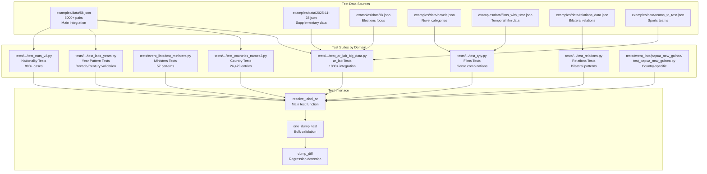
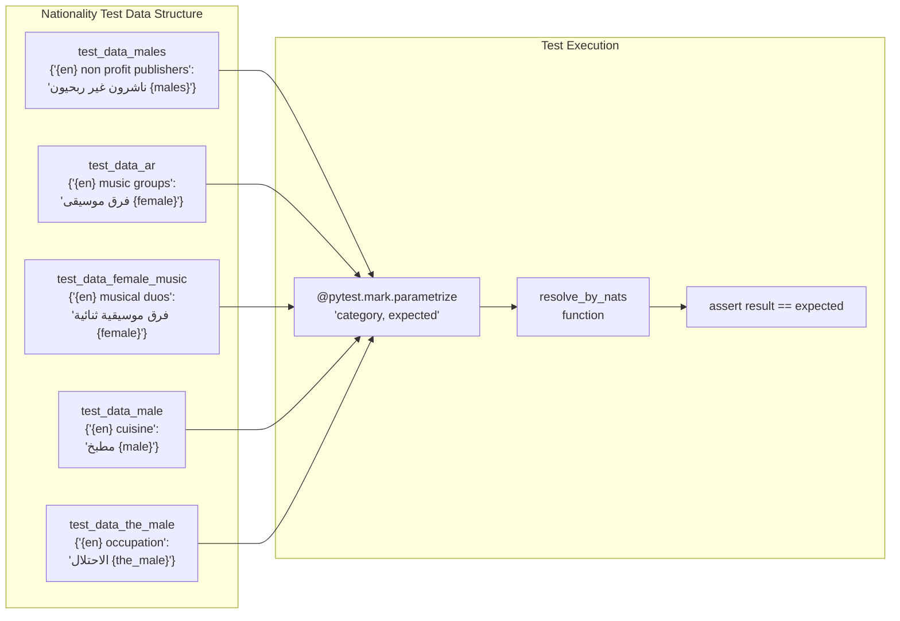
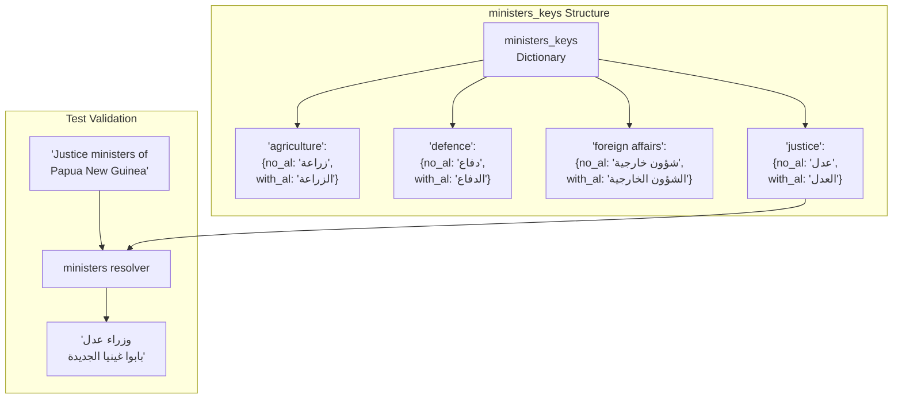
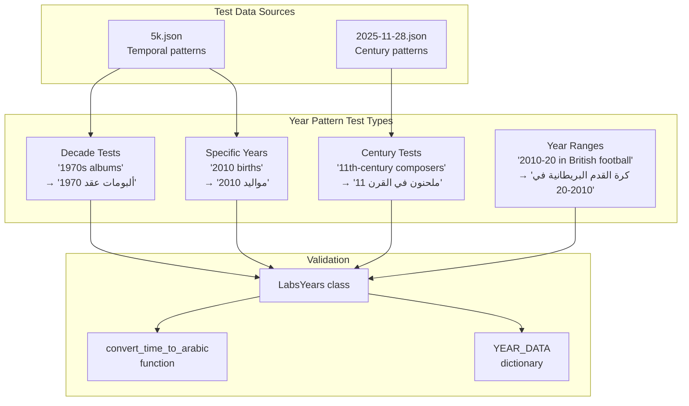
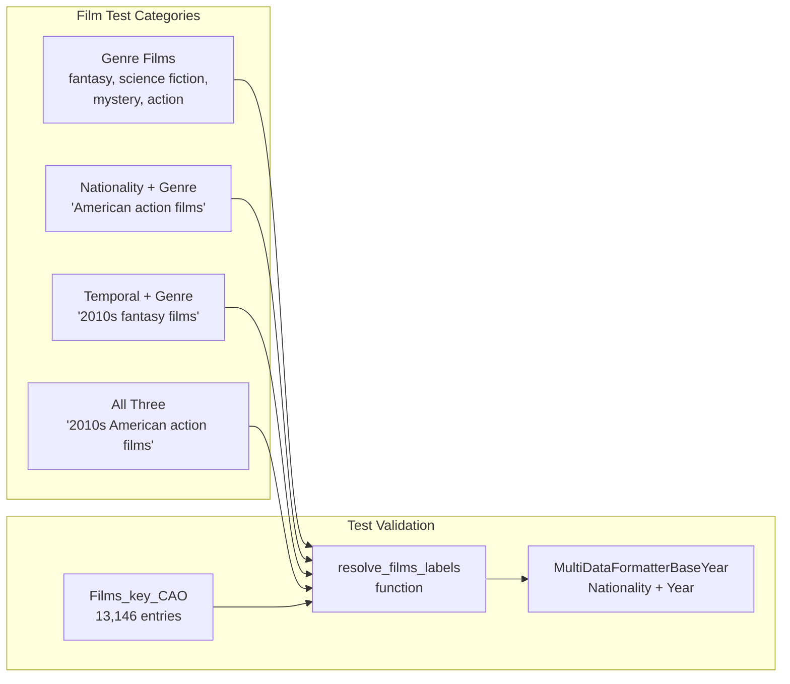
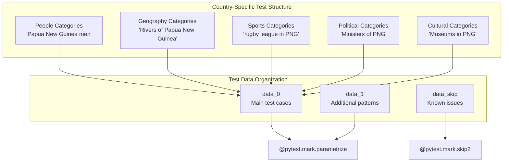
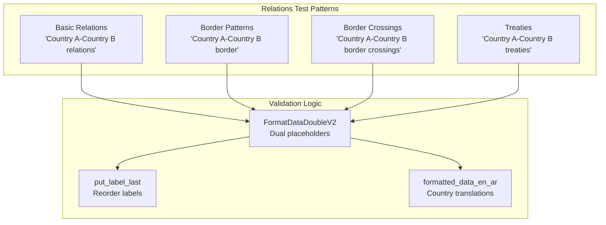
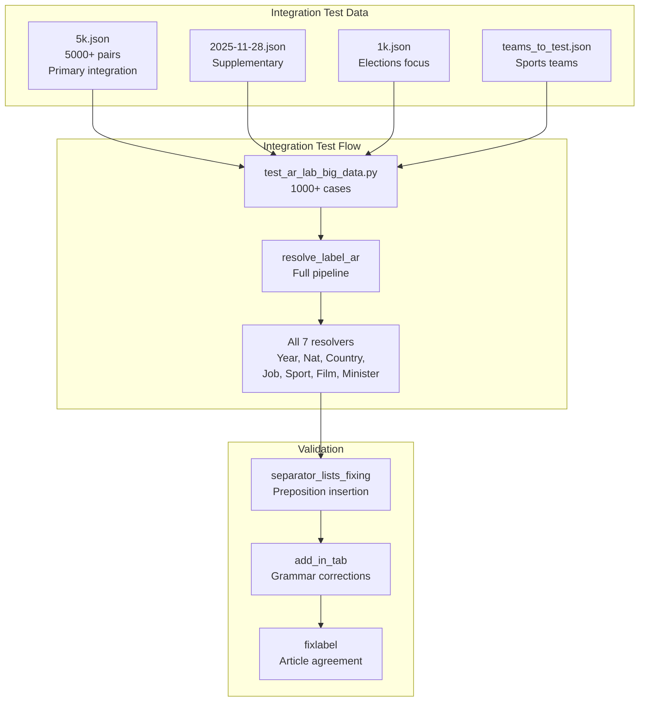
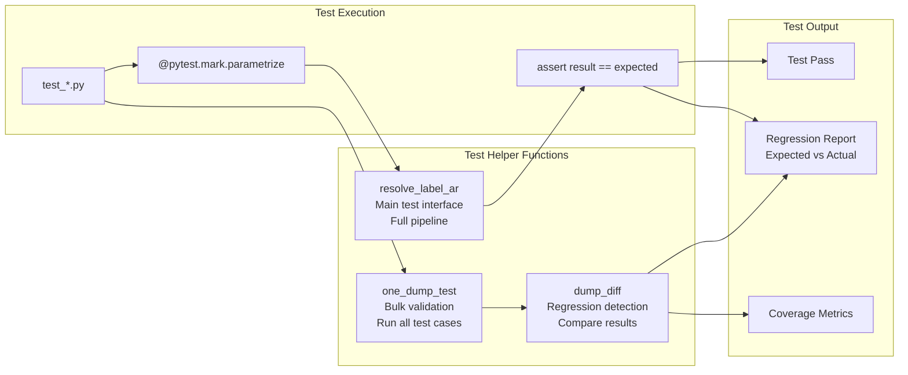

<details>
<summary>Relevant source files</summary>

The following files were used as context for generating this wiki page:

- [examples/data/endings.json](examples/data/endings.json)
- [examples/data/novels.json](examples/data/novels.json)
- [examples/data/television series.json](examples/data/television series.json)
- [tests/utils/dump_runner.py](tests/utils/dump_runner.py)

</details>


This page documents the domain-specific test suites that validate translation accuracy for each resolver in the ArWikiCats system. Tests are organized by translation domain (nationalities, ministers, films, countries, etc.) and use data-driven testing with pytest parametrization. For information about test data organization and JSON file structure, see [Test Data Organization](#8.1). For test execution utilities and markers, see [Test Utilities and Markers](#8.3).

## Test Suite Organization

The testing infrastructure mirrors the resolver chain architecture, with dedicated test files for each major domain. Test suites range from ~57 test cases (ministers) to 800+ cases (nationalities), reflecting the complexity and coverage needs of each resolver.



**Sources:** [tests/event_lists/test_2.py](), [tests/new_resolvers/nationalities_resolvers/nationalities_v2/test_nats_v2.py](), [tests/event_lists/test_ministers.py](), [examples/data/5k.json](), [examples/data/2025-11-28.json](), [examples/data/1k.json]()

## Nationality Tests

The nationality resolver tests validate 799 nationality variants across multiple pattern types, making this the most comprehensive domain-specific test suite.

### Test Files and Coverage

| Test File | Location | Coverage | Cases |
|-----------|----------|----------|-------|
| `test_nats_v2.py` | `tests/new_resolvers/nationalities_resolvers/nationalities_v2/` | Core nationality patterns | 800+ |
| `test_nats_v2_jobs.py` | Same directory | Nationality + occupation | 200+ |
| `test_2.py` | `tests/event_lists/` | Yemeni-specific patterns | 600+ |

### Test Data Dictionary Structure

The nationality tests use multiple data dictionaries organized by grammatical form:



**Key Test Patterns:**

```python
# From test_nats_v2.py:8-24
test_data_males = {
    "yemeni non profit publishers": "ناشرون غير ربحيون يمنيون",
    "yemeni government officials": "مسؤولون حكوميون يمنيون",
}

test_data_ar = {
    "yemeni music groups": "فرق موسيقى يمنية",
    "yemeni rock musical groups": "فرق موسيقى روك يمنية",
}

test_data_the_male = {
    "yemeni occupation": "الاحتلال اليمني",
    "yemeni premier league": "الدوري اليمني الممتاز",
}
```

### Yemeni-Specific Test Suite

The file `test_2.py` contains an exhaustive test suite for Yemeni nationality patterns, covering 600+ category types:

```python
# From test_2.py:7-211
fast_data = {
    "yemeni sports": "ألعاب رياضية يمنية",
    "yemeni buildings": "مباني يمنية",
    "yemeni elections": "انتخابات يمنية",
    "yemeni musical groups": "فرق موسيقية يمنية",
    # ... 600+ more patterns
}
```

This data validates nationality-specific patterns across:
- Cultural categories (music, media, organizations)
- Geographic categories (islands, mountains, lakes)
- Event categories (competitions, festivals, elections)
- Occupation categories (businesspeople, journalists)

**Sources:** [tests/new_resolvers/nationalities_resolvers/nationalities_v2/test_nats_v2.py:1-300](), [tests/event_lists/test_2.py:1-601](), [tests/new_resolvers/nationalities_resolvers/nationalities_v2/test_nats_v2_jobs.py]()

## Ministers and Politics Tests

The ministers test suite validates translation of political office titles, focusing on grammatical correctness with the Arabic definite article (ال).

### Test Structure

```python
# From test_ministers.py:9-16
examples_1 = {
    "Ministers for foreign affairs of Papua New Guinea": "وزراء شؤون خارجية بابوا غينيا الجديدة",
    "Justice ministers of Papua New Guinea": "وزراء عدل بابوا غينيا الجديدة",
    "Agriculture ministers of Antigua and Barbuda": "وزراء زراعة أنتيغوا وباربودا",
    "Energy ministers of Antigua and Barbuda": "وزراء طاقة أنتيغوا وباربودا",
}
```

### Ministers Key Structure

The test data references `ministers_keys` dictionary which contains both definite and indefinite forms:



The test suite validates ~94 ministry types with proper article usage:

| Ministry Type | No Article (no_al) | With Article (with_al) |
|---------------|-------------------|----------------------|
| agriculture | زراعة | الزراعة |
| defence | دفاع | الدفاع |
| foreign affairs | شؤون خارجية | الشؤون الخارجية |
| justice | عدل | العدل |
| interior | داخلية | الداخلية |

**Sources:** [tests/event_lists/test_ministers.py:1-50](), [ArWikiCats/translations/politics/ministers.py:1-104]()

## Year Pattern Tests

Year pattern tests validate temporal expression translation including decades, centuries, and specific years. These tests ensure correct Arabic numeral and time period formatting.

### Test Coverage



### Example Test Cases

From the 5k.json dataset:

```python
# Decade patterns
"Category:2010s Massachusetts elections": "تصنيف:انتخابات ماساتشوستس في عقد 2010"
"Category:1970s in Australian tennis": "تصنيف:كرة المضرب الأسترالية في عقد 1970"

# Century patterns
"Category:11th-century composers": "تصنيف:ملحنون في القرن 11"
"Category:13th-century Italian judges": "تصنيف:قضاة إيطاليون في القرن 13"

# Year ranges
"Category:2010-20 in British football": "تصنيف:كرة القدم البريطانية في 2010-20"
```

**Sources:** [examples/data/5k.json:1-50](), [examples/data/2025-11-28.json:1-40]()

## Films and Television Tests

Films and television tests validate genre combinations, temporal patterns, and nationality-based film categories.

### Test Data Files

| File | Purpose | Example Patterns |
|------|---------|-----------------|
| `films_with_time.json` | Films with temporal data | `2010s fantasy films`, `2010 American films` |
| `television series.json` | TV series patterns | `Nigerian television series`, `2010s Swedish television series` |
| `endings.json` | TV series endings | `2010 Brazilian television series endings` |
| `novels.json` | Novel categories (film adaptations) | `2010 French novels`, `Films based on novels by Thomas Pynchon` |

### Film Test Pattern Structure

```python
# From films_with_time.json:1-7
{
    "Category:2010s fantasy novels": "تصنيف:روايات فانتازيا في عقد 2010",
    "Category:2010s science fiction novels": "تصنيف:روايات خيال علمي في عقد 2010",
    "Category:2010 fantasy novels": "تصنيف:روايات فانتازيا في 2010",
    "Category:2010s mystery films": "تصنيف:أفلام غموض في عقد 2010",
    "Category:2010s pornographic films": "تصنيف:أفلام إباحية في عقد 2010"
}
```

### Films_key_CAO Coverage

The test data validates against the `Films_key_CAO` dictionary containing 13,146 film genre and type translations:



**Sources:** [examples/data/films_with_time.json](), [examples/data/television series.json](), [examples/data/endings.json](), [examples/data/novels.json:1-35]()

## Country-Specific Tests

Country-specific tests provide comprehensive validation for individual countries' categories, ensuring all nationality patterns work correctly.

### Papua New Guinea Test Suite

The Papua New Guinea test suite demonstrates the structure of country-specific testing:

```python
# From test_papua_new_guinea.py:7-22
data_skip = {
    "Category:Defunct airports in Papua New Guinea": "تصنيف:مطارات سابقة في بابوا غينيا الجديدة",
    "Category:April 2023 in Papua New Guinea": "تصنيف:بابوا غينيا الجديدة في أبريل 2023",
}

data_0 = {
    "Category:Papua New Guinea men's international soccer players": "تصنيف:لاعبو كرة قدم دوليون من بابوا غينيا الجديدة",
    "Category:Papua New Guinea women's international soccer players": "تصنيف:لاعبات كرة قدم دوليات من بابوا غينيا الجديدة",
}
```

### Country Test Coverage Pattern



The test file validates country-specific patterns including:
- **Geographic entities**: Rivers, regions, atolls, calderas
- **Political structures**: Ministers, governors, parliament constituencies
- **Sports teams**: Rugby league teams, national teams
- **Organizations**: Catholic schools, military units, missions
- **Infrastructure**: Airports, cricket grounds, military airfields

**Sources:** [tests/event_lists/papua_new_guinea/test_papua_new_guinea.py:1-200]()

## Relations Tests

Relations tests validate bilateral relationship categories between countries.

### Relations Data Structure

```python
# From relations_data.json:1-5
{
    "north macedonia–qatar relations": "تصنيف:العلاقات القطرية المقدونية الشمالية",
    "north macedonia–serbia border crossings": "تصنيف:معابر الحدود الصربية المقدونية الشمالية",
    "north macedonia–serbia border": "تصنيف:الحدود الصربية المقدونية الشمالية",
    "north macedonia–serbia relations": "تصنيف:العلاقات الصربية المقدونية الشمالية"
}
```

### Relations Pattern Types



**Sources:** [examples/data/relations_data.json:1-10]()

## Integration Tests (ar_lab)

The `ar_lab` test suite provides end-to-end integration testing across all resolvers with 1000+ complex test cases.

### Test Data Sources for Integration



### Integration Test Coverage

The integration tests validate:

1. **Multi-domain categories**: Categories requiring multiple resolvers (e.g., "2010s American football coaches")
2. **Complex grammar**: Categories with prepositions, separators, and Arabic article agreement
3. **Edge cases**: Unusual category structures, multiple separators, special characters
4. **End-to-end accuracy**: Complete translation pipeline from raw input to final Arabic output

**Example Complex Cases:**

```python
# From 5k.json - Categories requiring multiple resolvers
"Category:2010s American sports-people": "تصنيف:رياضيون أمريكيون في عقد 2010"  # Year + Nationality
"Category:Ministers for foreign affairs of Papua New Guinea": "تصنيف:وزراء شؤون خارجية بابوا غينيا الجديدة"  # Ministers + Country
"Category:2010s fantasy novels": "تصنيف:روايات فانتازيا في عقد 2010"  # Year + Film genre
```

**Sources:** [examples/data/5k.json:1-100](), [examples/data/2025-11-28.json:1-50](), [examples/data/1k.json:1-50](), [examples/data/teams_to_test.json]()

## Test Execution Patterns

All domain-specific tests follow a consistent execution pattern using pytest parametrization and helper utilities.

### Common Test Structure

```python
# Common pattern across all test files
import pytest
from load_one_data import dump_diff, one_dump_test
from ArWikiCats import resolve_label_ar

test_data = {
    "input category": "expected output",
    # ... more test cases
}

@pytest.mark.parametrize("category, expected", test_data.items())
def test_domain(category, expected):
    result = resolve_label_ar(category)
    assert result == expected
```

### Test Helper Functions



### Test Markers Usage

Tests use pytest markers for selective execution:

| Marker | Purpose | Usage |
|--------|---------|-------|
| `@pytest.mark.fast` | Quick unit tests | Development testing |
| `@pytest.mark.slow` | Comprehensive tests | CI/CD validation |
| `@pytest.mark.dump` | Full dataset validation | Regression testing |
| `@pytest.mark.skip2` | Known issues | Temporary exclusion |
| `@pytest.mark.parametrize` | Data-driven tests | All domain tests |

**Sources:** [tests/new_resolvers/nationalities_resolvers/nationalities_v2/test_nats_v2.py:1-10](), [tests/event_lists/test_2.py:1-10](), [tests/event_lists/test_ministers.py:1-10]()

## Domain Coverage Summary

The following table summarizes test coverage across all domains:

| Domain | Test File(s) | Test Cases | Data Sources | Importance |
|--------|-------------|------------|--------------|------------|
| Nationalities | `test_nats_v2.py`, `test_2.py`, `test_nats_v2_jobs.py` | 800+ | 799 nationality variants | 129.38 |
| Ministers/Politics | `test_ministers.py` | 57 | `ministers_keys` (94 entries) | 88.16 |
| Films/TV | `test_tyty.py`, films JSON files | 500+ | `Films_key_CAO` (13,146 entries) | 85.39 |
| Year Patterns | `test_labs_years.py` | 300+ | `YEAR_DATA` dictionary | 81.33 |
| Countries | `test_countries_names2.py`, country-specific tests | 1000+ | `NEW_P17_FINAL` (24,479 entries) | 72.63 |
| Relations | `test_relations.py` | 200+ | `relations_data.json` | 65.89 |
| Integration | `test_ar_lab_big_data.py` | 5000+ | Multiple JSON files | 86.76 |

This comprehensive test coverage ensures translation accuracy across ~100,000+ category patterns, with domain-specific validation guaranteeing correct grammatical forms, preposition usage, and Arabic article agreement.

**Sources:** [tests/event_lists/test_2.py](), [tests/new_resolvers/nationalities_resolvers/nationalities_v2/test_nats_v2.py](), [tests/event_lists/test_ministers.py](), [examples/data/5k.json](), [ArWikiCats/translations/politics/ministers.py]()3a:T5f71,# Test Utilities

