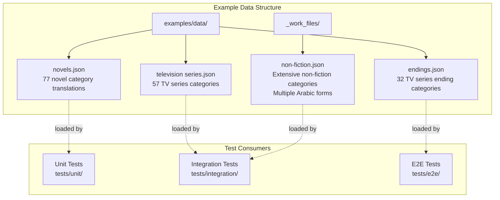
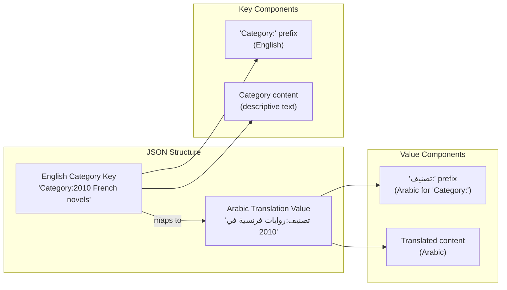
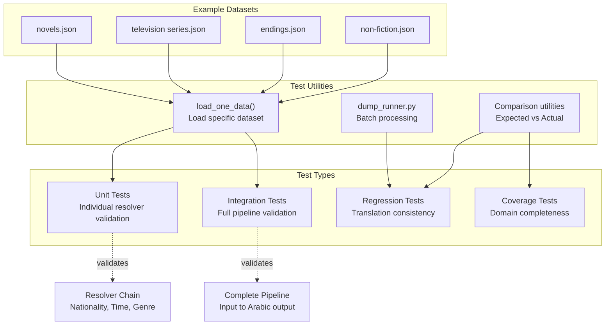
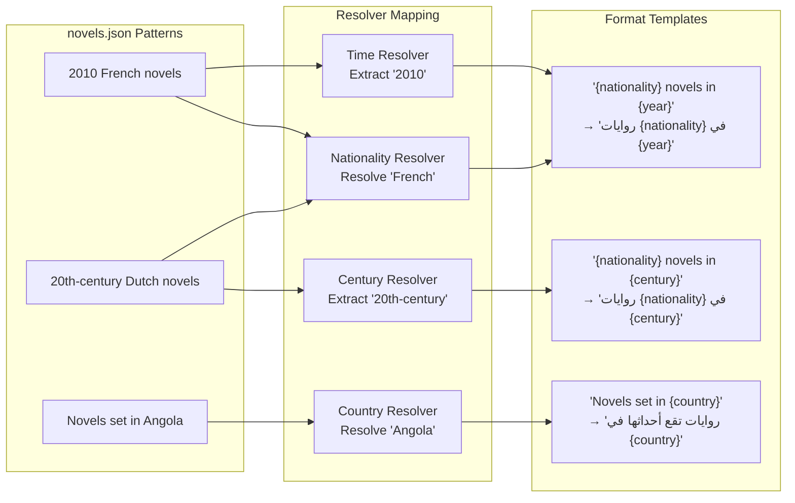

<details>
<summary>Relevant source files</summary>

The following files were used as context for generating this wiki page:

- [_work_files/non-fiction.json](_work_files/non-fiction.json)
- [examples/data/endings.json](examples/data/endings.json)
- [examples/data/novels.json](examples/data/novels.json)
- [examples/data/television series.json](examples/data/television series.json)

</details>


## Purpose and Scope

This page documents the example category datasets used throughout the ArWikiCats testing system. These datasets provide curated sets of English Wikipedia categories with their expected Arabic translations, serving as test fixtures, validation data, and documentation examples. The datasets cover various domains including literature, television, sports, and geography.

For information about how these datasets are used in the test system, see [Test Utilities](35.Test-Utilities.md). For the overall testing architecture, see [Testing and Validation](32.Testing-and-Validation.md)

## Dataset Organization

The example datasets are organized in a hierarchical file structure that separates domain-specific category collections:



**Sources:** [examples/data/novels.json](), [examples/data/endings.json](), [examples/data/television series.json](), [_work_files/non-fiction.json]()

## Dataset Categories

### Novel Categories Dataset

The novels dataset provides comprehensive coverage of novel-related categories including temporal patterns, nationality combinations, and genre classifications.

**File Location:** [examples/data/novels.json]()

**Coverage Areas:**
- Year + nationality patterns (e.g., "2010 French novels")
- Decade + nationality patterns (e.g., "2010s Norwegian novels")
- Century + nationality patterns (e.g., "20th-century Dutch novels")
- Genre + nationality combinations (e.g., "British psychological novels")
- Setting-based categories (e.g., "Novels set in Angola")
- Categorization patterns (e.g., "Novels by country and decade")

**Sample Entries:**

| English Category | Arabic Translation | Pattern Type |
|-----------------|-------------------|--------------|
| `Category:2010 French novels` | `تصنيف:روايات فرنسية في 2010` | Year + Nationality |
| `Category:2010s novels` | `تصنيف:روايات عقد 2010` | Decade only |
| `Category:British psychological novels` | `تصنيف:روايات نفسية بريطانية` | Nationality + Genre |
| `Category:Novels set in Angola` | `تصنيف:روايات تقع أحداثها في أنغولا` | Setting-based |

**Sources:** [examples/data/novels.json L1-L77](../examples/data/novels.json#L1-L77)

### Television Series Categories Dataset

This dataset focuses on television series categories, covering production countries, genres, temporal periods, and format variations.

**File Location:** [examples/data/television series.json]()

**Coverage Areas:**
- Series debuts by year and country (e.g., "2010 Japanese television series debuts")
- Series by decade and nationality (e.g., "2010s Swedish television series")
- Genre classifications (e.g., "Taiwanese comedy television series")
- Language-based categories (e.g., "Arabic-language television series")
- Subject matter categories (e.g., "American television series about children")

**Sample Entries:**

| English Category | Arabic Translation | Pattern Type |
|-----------------|-------------------|--------------|
| `Category:2010 Japanese television series debuts` | `تصنيف:مسلسلات تلفزيونية يابانية بدأ عرضها في 2010` | Year + Country + Debut |
| `Category:2010s Swedish television series` | `تصنيف:مسلسلات تلفزيونية سويدية في عقد 2010` | Decade + Country |
| `Category:Arabic-language television series` | `تصنيف:مسلسلات تلفزيونية باللغة العربية` | Language-based |

**Sources:** [examples/data/television series.json L1-L57](../examples/data/television series.json#L1-L57)

### TV Series Endings Dataset

A specialized dataset for television series ending categories, demonstrating year-specific and decade-based ending patterns.

**File Location:** [examples/data/endings.json]()

**Coverage Areas:**
- Year-specific endings (e.g., "2010 British television series endings")
- Decade-based endings (e.g., "2010s Finnish television series endings")
- Century-based endings (e.g., "21st-century Indonesian television series endings")
- Organizational categories (e.g., "Indonesian television series endings by year")

**Sample Entries:**

| English Category | Arabic Translation |
|-----------------|-------------------|
| `Category:2010 British television series endings` | `تصنيف:مسلسلات تلفزيونية بريطانية انتهت في 2010` |
| `Category:2010s Indonesian television series endings` | `تصنيف:مسلسلات تلفزيونية إندونيسية انتهت في عقد 2010` |
| `Category:Indonesian television series endings by decade` | `تصنيف:مسلسلات تلفزيونية إندونيسية حسب عقد انتهاء العرض` |

**Sources:** [examples/data/endings.json L1-L32](../examples/data/endings.json#L1-L32)

### Non-Fiction Dataset

The most extensive example dataset, containing non-fiction categories with multiple Arabic translation forms organized by semantic groupings.

**File Location:** [_work_files/non-fiction.json]()

**Structure:** Unlike other datasets, this file uses a hierarchical structure with Arabic root words as top-level keys:

```json
{
    "غير روائي": {
        "Category:Non-fiction": "تصنيف:غير روائي",
        "Category:Non-fiction literature": "تصنيف:أدب غير روائي",
        ...
    },
    "غير روائيين": {
        "Category:20th-century non-fiction writers": "تصنيف:كتاب غير روائيين في القرن 20",
        "Category:American non-fiction writers": "تصنيف:كتاب غير روائيين أمريكيون",
        ...
    },
    "خيالي": {
        "Category:1643 non-fiction books": "تصنيف:كتب غير خيالية 1643",
        ...
    }
}
```

**Coverage Areas:**
- General non-fiction categories (under "غير روائي")
- Non-fiction writers by nationality and century (under "غير روائيين")
- Non-fiction books by year (under "خيالي")
- Gender-specific writer categories
- Environmental and crime non-fiction subcategories

**Sources:** [_work_files/non-fiction.json L1-L488](../_work_files/non-fiction.json#L1-L488)

## Dataset Structure and Format

All example datasets follow a consistent JSON structure mapping English categories to their Arabic translations:



**Standard Format:**
- **Keys:** Full English category names with `Category:` prefix
- **Values:** Full Arabic translations with `تصنيف:` prefix
- **Encoding:** UTF-8 JSON format
- **Special Cases:** Non-fiction dataset uses nested structure with Arabic root forms as grouping keys

**Sources:** [examples/data/novels.json](), [examples/data/television series.json](), [_work_files/non-fiction.json]()

## Dataset Statistics

| Dataset | File Path | Entry Count | Domain Coverage | Unique Patterns |
|---------|-----------|-------------|-----------------|-----------------|
| Novels | `examples/data/novels.json` | 77 | Novel categories with year/decade/century + nationality | ~15 nationalities |
| Television Series | `examples/data/television series.json` | 57 | TV series debuts, genres, organizational categories | ~20 countries |
| TV Endings | `examples/data/endings.json` | 32 | Television series ending categories | Year/decade/century patterns |
| Non-Fiction | `_work_files/non-fiction.json` | 486+ | Writers, books, literature across centuries and nationalities | 3 Arabic root forms |

## Dataset Usage Patterns

These datasets serve multiple purposes in the testing and validation workflow:



**Common Usage Patterns:**

1. **Validation Testing:** Categories from these datasets are passed through resolvers to verify expected translations match actual output
2. **Regression Detection:** Datasets serve as frozen snapshots to detect unintended translation changes
3. **Coverage Analysis:** Datasets help identify gaps in resolver coverage by domain
4. **Documentation Examples:** Datasets provide real-world examples for documentation and API examples
5. **Performance Benchmarking:** Large datasets (especially non-fiction) used for performance testing

**Sources:** [examples/data/novels.json](), [examples/data/television series.json](), [examples/data/endings.json](), [_work_files/non-fiction.json]()

## Domain-Specific Patterns

Each dataset demonstrates specific resolver and formatting patterns:

| Dataset | Primary Resolvers Tested | Formatting Patterns |
|---------|-------------------------|---------------------|
| Novels | Nationality, Time (year/decade/century), Genre | `MultiDataFormatterBase`, `YearFormatData` |
| Television Series | Nationality, Time, Media type | `MultiDataFormatterBaseYear`, debut/ending patterns |
| TV Endings | Time patterns, Nationality | Specialized ending suffix handling |
| Non-Fiction | Nationality, Time, Gender, Job categories | Complex hierarchical nationality forms |

**Example Pattern Mapping:**



**Sources:** [examples/data/novels.json](), [examples/data/television series.json]()

## Adding New Example Datasets

To add a new example dataset:

1. **Create JSON file** in `examples/data/` directory with descriptive name
2. **Follow standard format:** English category keys with `Category:` prefix mapping to Arabic translations with `تصنيف:` prefix
3. **Group related categories:** Keep thematically related categories in the same file
4. **Document coverage:** Add comments or companion documentation describing the domain coverage
5. **Update test references:** Modify test utilities to load and validate the new dataset

**File Naming Conventions:**
- Use lowercase with spaces for readability: `television series.json`
- Use descriptive domain names: `novels.json`, `endings.json`
- Place work-in-progress datasets in `_work_files/` directory

**Sources:** [examples/data/novels.json](), [examples/data/endings.json](), [examples/data/television series.json]()3c:T8297,# Development Guide

