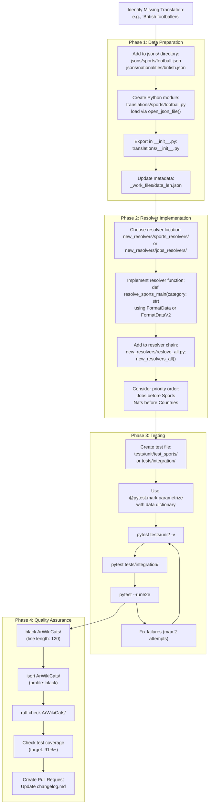
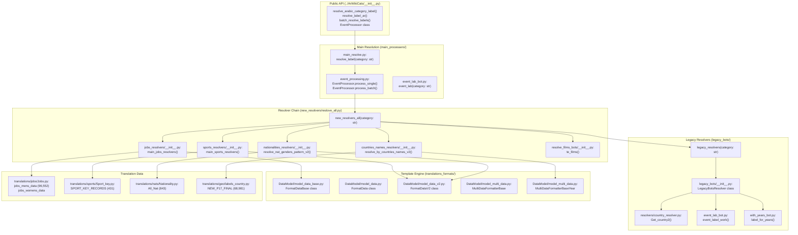
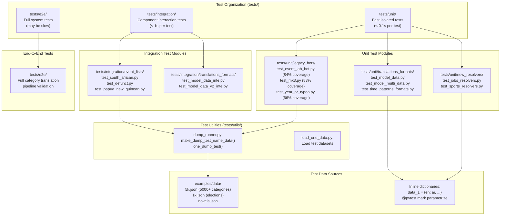

<details>
<summary>Relevant source files</summary>

The following files were used as context for generating this wiki page:

- [.github/copilot-instructions.md](.github/copilot-instructions.md)
- [.github/workflows/python-publish.yml](.github/workflows/python-publish.yml)
- [.gitignore](.gitignore)
- [ArWikiCats/config.py](../ArWikiCats/config.py)
- [CLAUDE.md](CLAUDE.md)
- [README.md](README.md)
- [changelog.md](changelog.md)
- [tests_require_fixes/test_papua_new_guinean.py](tests_require_fixes/test_papua_new_guinean.py)
- [tests_require_fixes/test_skip_data_all.py](tests_require_fixes/test_skip_data_all.py)
- [tests_require_fixes/text_to_fix.py](tests_require_fixes/text_to_fix.py)

</details>


## Purpose and Scope

This guide provides practical guidelines for developers who want to contribute to the ArWikiCats codebase. It covers the development workflow, code organization principles, and common patterns used throughout the system. This page serves as an entry point for developers; for specific implementation tasks, see the sub-pages:

- For adding new translation entries and maintaining data consistency, see [Adding Translation Data](38.Adding-Translation-Data.md)
- For implementing new category resolvers and integrating them into the resolver chain, see [Creating New Resolvers](39.Creating-New-Resolvers.md)
- For using helper scripts and utilities, see [Utilities and Scripts](#9.3)

For general usage and API documentation, see [Getting Started](1.Getting-Started.md). For understanding the overall system architecture, see [Architecture](2.Architecture.md)

---

## Development Workflow Overview

The typical development workflow in ArWikiCats follows a three-phase cycle: data preparation, resolver implementation, and validation.

### Development Workflow Diagram



**Sources:** [changelog.md L1-L80](../changelog.md#L1-L80), [README.md L449-L514](../README.md#L449-L514), [ArWikiCats/new_resolvers/reslove_all.py](), [tests/]()

---

## Code Organization Principles

The codebase follows a modular, domain-driven architecture with clear separation between data, logic, and formatting layers.

### Code Entity Architecture

This diagram maps system components to actual code entities (functions, classes, modules):



**Key Architectural Patterns:**

1. **Chain of Responsibility**: `new_resolvers_all()` tries resolvers in priority order until match found [new_resolvers/reslove_all.py]()
2. **Template Method**: `FormatDataBase` defines abstract interface, subclasses implement search logic [translations_formats/DataModel/model_data_base.py]()
3. **Factory Pattern**: `format_multi_data()`, `format_year_country_data()` create configured formatter instances [translations_formats/multi_data.py]()
4. **Singleton Cache**: `@lru_cache(maxsize=1)` on data loading functions ensures single load [translations/jobs/Jobs.py]()
5. **Strategy Pattern**: Different resolver strategies (jobs, sports, nationalities) implement common resolver interface

**Sources:** [ArWikiCats/__init__.py](), [ArWikiCats/main_processers/main_resolve.py](), [ArWikiCats/new_resolvers/reslove_all.py](), [ArWikiCats/legacy_bots/__init__.py](), [ArWikiCats/translations_formats/DataModel/]()

---

## Configuration and Environment

The system uses configuration flags to control behavior during development and testing.

### Configuration System

| Configuration Flag | Purpose | Default | Implementation |
|-------------------|---------|---------|----------------|
| `SAVE_DATA_PATH` | Set data output path | `""` | [ArWikiCats/config.py L27-L43](../ArWikiCats/config.py#L27-L43) |

The configuration is defined using dataclasses:

```python
# From ArWikiCats/config.py
@dataclass(frozen=True)
class AppConfig:
    save_data_path: str

settings = Config(
    app=AppConfig(
        save_data_path=os.getenv("SAVE_DATA_PATH", ""),
    ),
)
```

**Usage Example:**

```bash
# Set data path for batch processing
SAVE_DATA_PATH=/tmp/translations python examples/5k.py

# Access in code
from ArWikiCats.config import app_settings
output_path = app_settings.save_data_path
```

The system also uses command-line arguments for runtime behavior control via [ArWikiCats/config.py L11-L16](../ArWikiCats/config.py#L11-L16):

```python
def one_req(name: str) -> bool:
    """Check if the given flag is active via env or command line."""
    return os.getenv(name.upper(), "false").lower() in ("1", "true", "yes") or name.lower() in argv_lower
```

**Sources:** [ArWikiCats/config.py L1-L52](../ArWikiCats/config.py#L1-L52)

---

## Testing Requirements

All code contributions must include corresponding tests. The testing infrastructure is organized by domain and uses pytest parametrization for data-driven tests.

### Testing Architecture and Code Mapping



**Test Execution Commands:**

| Command | Target | Coverage |
|---------|--------|----------|
| `pytest tests/unit/` | All unit tests | Core functions and classes |
| `pytest tests/integration/` | Integration tests | Component interactions |
| `pytest tests/e2e/` or `pytest --rune2e` | End-to-end tests | Full pipeline |
| `pytest -m unit` | Unit test marker | Fast tests only |
| `pytest -m integration` | Integration marker | Medium-speed tests |
| `pytest -k "jobs"` | Keyword filter | All tests with "jobs" in name |

**Sources:** [tests/unit/](), [tests/integration/](), [tests/e2e/](), [tests/utils/dump_runner.py](), [changelog.md L1-L110](../changelog.md#L1-L110), [README.md L442-L469](../README.md#L442-L469)

### Test Writing Patterns

**Pattern 1: Parametrized Tests with Dictionary**

[tests/event_lists/test_defunct.py L1-L74](../tests/event_lists/test_defunct.py#L1-L74) demonstrates the standard pattern:

```python
data0_no_label = {
    "defunct american football venues": "ملاعب كرة قدم أمريكية سابقة",
    "defunct amusement parks": "متنزهات ملاهي سابقة",
    # ... more cases
}

@pytest.mark.parametrize("category, expected", data0_no_label.items(), ids=data0_no_label.keys())
@pytest.mark.skip2
def test_2_skip2_2(category: str, expected: str) -> None:
    label = resolve_label_ar(category)
    assert label == expected
```

**Pattern 2: Using Test Markers**

Tests should be marked with appropriate markers for selective execution:

- `@pytest.mark.fast`: Quick unit tests (< 1 second)
- `@pytest.mark.slow`: Comprehensive integration tests
- `@pytest.mark.dump`: Full dataset validation tests
- `@pytest.mark.skip2`: Known issues or temporarily disabled tests

**Pattern 3: Running Tests**

```bash
# Run all tests
pytest

# Run fast tests only
pytest -m fast

# Run specific domain tests
pytest tests/test_jobs/

# Run with keyword filter
pytest -k "nationality"

# Run with verbose output
pytest -v
```

**Sources:** [tests/event_lists/test_defunct.py L1-L74](../tests/event_lists/test_defunct.py#L1-L74), [README.md L449-L483](../README.md#L449-L483), [changelog.md L205-L220](../changelog.md#L205-L220)

---

## Code Quality Standards

All contributions must meet the following quality standards before being merged.

### Linting and Formatting

The project uses three tools to enforce code quality:

| Tool | Purpose | Configuration |
|------|---------|---------------|
| **Black** | Code formatting | Line length: 120 characters |
| **isort** | Import sorting | Profile: black |
| **Ruff** | Fast Python linting | Default configuration |

**Running Linters:**

```bash
# Format code with Black
black ArWikiCats/

# Sort imports with isort
isort ArWikiCats/

# Check for issues with Ruff
ruff check ArWikiCats/
```

### Logging Standards

Use f-strings for logging with proper logger instances:

```python
from ArWikiCats.helps.log import LoggerWrap

logger = LoggerWrap(__name__)

# Correct usage
logger.debug(f"Resolving category: {category}, found: {result}")
logger.info(f"Processed {count} categories in {elapsed:.2f}s")

# Avoid string concatenation
# Bad: logger.debug("Resolving: " + category)
```

### Documentation Standards

1. **Module Docstrings**: Every module should have a docstring explaining its purpose
2. **Function Docstrings**: Public functions should document parameters and return values
3. **Inline Comments**: Use comments to explain complex logic, not obvious code
4. **Type Hints**: Add type hints to function signatures where practical

### File Encoding

All files containing Arabic text must use UTF-8 encoding. Ensure your editor is configured correctly:

```python
# -*- coding: utf-8 -*-
```

**Sources:** [README.md L499-L514](../README.md#L499-L514), [changelog.md L42-L47](../changelog.md#L42-L47)

---

## Common Development Patterns

The codebase uses several recurring patterns that developers should follow when contributing.

### Pattern 1: Using LRU Cache for Data Loading

All data-loading functions use `@lru_cache(maxsize=1)` to ensure single load per process. This pattern is critical for performance.

**Implementation Example from [ArWikiCats/translations/jobs/Jobs.py]():**

```python
from functools import lru_cache
from ArWikiCats.jsons.open_json import open_json_file

@lru_cache(maxsize=1)
def _finalise_jobs_dataset() -> dict:
    """Load and merge job translation data from multiple sources.

    Returns:
        dict: Merged job translations (96,552 entries)
    """
    # Load from JSON files
    jobs_data = open_json_file("jsons/jobs/jobs.json")
    jobs_22 = open_json_file("jsons/jobs/Jobs_22.json")
    # ... merge logic
    return merged_data

# Public accessor
def get_jobs_data() -> dict:
    """Get cached jobs dataset."""
    return _finalise_jobs_dataset()
```

**When to Use This Pattern:**

- Loading translation dictionaries from JSON files
- Building lookup tables from multiple data sources
- Any function that returns static, immutable data

**Performance Impact:**

Without caching, loading 96,552 job entries on every call would cause severe performance degradation. With `@lru_cache(maxsize=1)`, the data is loaded once and reused across all 28,500+ test cases.

**Sources:** [ArWikiCats/translations/jobs/Jobs.py](), [changelog.md L268-L294](../changelog.md#L268-L294)

### Pattern 2: Resolver Chain Integration and Priority Order

Resolvers must be added in the correct priority order to prevent conflicts. The order is documented in [ArWikiCats/new_resolvers/__init__.py]()

**Critical Priority Rules:**

1. **Jobs before Sports**: Job titles like "football manager" must be resolved as jobs, not sports management roles
2. **Nationalities before Countries**: "Italy political leader" should resolve with nationality patterns, not country-year patterns
3. **Time patterns first**: Year/decade/century extraction must happen before other resolvers

**Implementation in [ArWikiCats/new_resolvers/__init__.py]():**

```python
def new_resolvers_all(category: str) -> str:
    """Resolve category through specialized resolvers.

    Priority order (must be maintained):
    1. Jobs (highest - prevents conflicts)
    2. Sports
    3. Nationalities (before countries)
    4. Countries
    5. Films
    6. Other specialized resolvers
    """
    category_lab = (
        main_jobs_resolvers(category) or              # Line 29
        main_sports_resolvers(category) or            # Line 30
        resolve_nat_genders_pattern_v2(category) or   # Line 31
        resolve_by_countries_names_v2(category) or    # Line 32
        te_films(category) or                         # Line 33
        # ... additional resolvers
        ""
    )
    return category_lab
```

**Adding a New Resolver:**

1. Create resolver function in appropriate domain directory (e.g., `new_resolvers/languages_resolvers/`)
2. Import in `new_resolvers/__init__.py`
3. Add to chain in correct priority position
4. Document why the position was chosen (conflict prevention)

**Example Conflict Scenario:**

```python
# Bad order (causes mis-resolution):
resolve_sports_main("football manager") or  # Returns "مدير كرة قدم" (sports manager)
resolve_jobs_main("football manager")       # Never reached!

# Correct order:
resolve_jobs_main("football manager") or    # Returns "مدرب كرة قدم" (job title)
resolve_sports_main("football manager")     # Fallback
```

**Sources:** [ArWikiCats/new_resolvers/__init__.py](), [ArWikiCats/new_resolvers/reslove_all.py](), [changelog.md L170-L200](../changelog.md#L170-L200)

### Pattern 3: FormatData Template Engine Usage

The `FormatData` family of classes provides template-based translation with placeholder substitution. Choose the appropriate class based on pattern complexity.

**Class Selection Guide:**

| Class | Use Case | Example Pattern |
|-------|----------|----------------|
| `FormatData` | Single placeholder, simple string data | `"{sport} players" → "لاعبو {sport_ar}"` |
| `FormatDataV2` | Single placeholder, dictionary data with sub-keys | Nationality + multiple grammatical forms |
| `FormatDataFrom` | Single placeholder with callback function | Time-based transformations |
| `MultiDataFormatterBase` | Two placeholders (nationality + sport) | `"{nat} {sport} players"` |
| `MultiDataFormatterBaseYear` | Two placeholders (year + country) | `"2010 {country} births"` |
| `MultiDataFormatterYearAndFrom` | Year + relation word | `"events from 1990"` |

**Implementation Example 1: Simple FormatData**

From [ArWikiCats/new_resolvers/sports_resolvers/]():

```python
from ArWikiCats.translations_formats import FormatData
from ArWikiCats.translations.sports import SPORT_JOBS_DATA

formatter = FormatData(
    formatted_data={
        "{sport} players": "لاعبو {sport_ar}",
        "{sport} teams": "فرق {sport_ar}",
        "{sport} coaches": "مدربو {sport_ar}",
    },
    data_list=SPORT_JOBS_DATA,  # {"football": "كرة القدم", ...}
    key_placeholder="{sport}",
    value_placeholder="{sport_ar}",
)

result = formatter.search("football players")
# Returns: "لاعبو كرة القدم"
```

**Implementation Example 2: FormatDataV2 with Dictionary Data**

From [ArWikiCats/new_resolvers/nationalities_resolvers/]():

```python
from ArWikiCats.translations_formats import FormatDataV2
from ArWikiCats.translations.nats import All_Nat

formatter = FormatDataV2(
    formatted_data={
        "{nat} writers": "{nat_m_plural} كتاب",      # Masculine plural
        "{nat} female writers": "{nat_f_plural} كاتبات",  # Feminine plural
    },
    data_list=All_Nat,  # {"british": {"m_plural": "بريطانيون", "f_plural": "بريطانيات", ...}}
    key_placeholder="{nat}",
    value_placeholder_map={
        "{nat_m_plural}": "m_plural",
        "{nat_f_plural}": "f_plural",
    },
)

result = formatter.search("british writers")
# Returns: "بريطانيون كتاب"
```

**Implementation Example 3: MultiDataFormatterBase for Dual Patterns**

Created via factory function [ArWikiCats/translations_formats/multi_data.py]():

```python
from ArWikiCats.translations_formats import format_multi_data
from ArWikiCats.translations.nats import All_Nat
from ArWikiCats.translations.sports import SPORT_JOBS_DATA

formatter = format_multi_data(
    formatted_data={
        "{nat} {sport} players": "لاعبو {sport_ar} {nat_ar}",
        "{nat} {sport} coaches": "مدربو {sport_ar} {nat_ar}",
    },
    data_list=All_Nat,              # First placeholder
    data_list2=SPORT_JOBS_DATA,     # Second placeholder
    key_placeholder="{nat}",
    value_placeholder="{nat_ar}",
)

result = formatter.search("british football players")
# Returns: "لاعبو كرة القدم بريطانيون"
```

**Key Methods:**

- `formatter.search(category: str) -> str`: Main search method
- `formatter.search_all_category(category: str) -> str`: Alternative search with different matching logic
- `formatter.load_v2(category: str) -> str`: Load and search in one call

**Sources:** [ArWikiCats/translations_formats/DataModel/model_data_base.py](), [ArWikiCats/translations_formats/DataModel/model_data.py](), [ArWikiCats/translations_formats/DataModel/model_data_v2.py](), [ArWikiCats/translations_formats/multi_data.py]()

### Pattern 4: Metadata Updates

When adding new translation data, always update [_work_files/data_len.json L1-L155](../_work_files/data_len.json#L1-L155). This file tracks dataset sizes and is used for validation:

```json
{
    "pf_keys2": "33,691",
    "NEW_P17_FINAL": "24,479",
    "your_new_data": "1,234"
}
```

The counts should be comma-formatted strings representing the number of entries in each dataset.

### Pattern 5: Gender-Aware Translation with Normalization

Arabic requires gender agreement. The system handles gender-specific translations through separate datasets and gender normalization.

**Data Structure in [ArWikiCats/translations/jobs/Jobs.py]():**

```python
@lru_cache(maxsize=1)
def _finalise_jobs_dataset() -> dict:
    """Men's jobs dataset - 96,552 entries."""
    return {
        "writers": "كتاب",
        "singers": "مغنون",
        "painters": "رسامون",
        # ... 96,549 more entries
    }

@lru_cache(maxsize=1)
def _finalise_jobs_womens_data() -> dict:
    """Women's jobs dataset with feminine forms."""
    return {
        "writers": "كاتبات",
        "singers": "مغنيات",
        "painters": "رسامات",
        # ... entries
    }
```

**Gender Detection and Normalization in [ArWikiCats/new_resolvers/genders_resolvers/utils.py]():**

```python
def fix_keys(category: str) -> str:
    """Normalize gender-specific category terms.

    Transformations:
    - "women" → "female"
    - "womens" → "female"
    - "men" → "male"
    - "mens" → "male"
    """
    category = category.replace("women", "female")
    category = category.replace("womens", "female")
    category = category.replace("mens", "male")
    return category
```

**Gender-Specific Resolver Implementation:**

From [ArWikiCats/new_resolvers/jobs_resolvers/mens.py]():

```python
def resolve_mens_jobs(category: str) -> str:
    """Resolve male-specific job categories."""
    # Detect gender markers
    if "male" in category or "mens" in category:
        # Use masculine job data
        return search_in_mens_data(category)
    return ""

def resolve_womens_jobs(category: str) -> str:
    """Resolve female-specific job categories."""
    if "female" in category or "women" in category:
        # Use feminine job data
        return search_in_womens_data(category)
    return ""
```

**Usage Example:**

```python
# These are automatically routed to correct gender dataset:
resolve_label_ar("American male writers")      # → "كتاب أمريكيون"
resolve_label_ar("American female writers")    # → "كاتبات أمريكيات"
resolve_label_ar("British women painters")     # → "رسامات بريطانيات"
```

**Adding New Gender-Aware Translations:**

1. Add masculine form to `jobs_mens_data` dictionary
2. Add feminine form to `jobs_womens_data` dictionary
3. Ensure both dictionaries have matching keys
4. Test with both "male" and "female" category variants

**Sources:** [ArWikiCats/translations/jobs/Jobs.py](), [ArWikiCats/new_resolvers/genders_resolvers/utils.py](), [ArWikiCats/new_resolvers/jobs_resolvers/mens.py](), [changelog.md L402-L432](../changelog.md#L402-L432)

---

## Development Environment Setup

### Recommended IDE Configuration

For optimal development experience, configure your editor with:

1. **Python Language Server**: Enable IntelliSense/autocomplete
2. **UTF-8 Encoding**: Default for all files
3. **Line Length**: 120 characters for Black compatibility
4. **Tab Settings**: 4 spaces (no tabs)
5. **Pytest Integration**: For running tests from IDE

### Virtual Environment Setup

```bash
# Clone repository
git clone https://github.com/MrIbrahem/ArWikiCats.git
cd ArWikiCats

# Create virtual environment
python -m venv venv
source venv/bin/activate  # On Windows: venv\Scripts\activate

# Install dependencies
pip install -r requirements.in

# Install development tools
pip install black isort ruff pytest
```

### Pre-commit Checklist

Before submitting a pull request:

- [ ] All tests pass: `pytest`
- [ ] Code is formatted: `black ArWikiCats/`
- [ ] Imports are sorted: `isort ArWikiCats/`
- [ ] No linting errors: `ruff check ArWikiCats/`
- [ ] New tests added for new functionality
- [ ] `data_len.json` updated if translation data changed
- [ ] Documentation updated if API changed

**Sources:** [README.md L499-L514](../README.md#L499-L514), [changelog.md L1-L50](../changelog.md#L1-L50)

---

## Common Tasks Reference

### Quick Reference Table

| Task | Primary File(s) | See Also |
|------|----------------|----------|
| Add new translation entries | `translations/[domain]/` | [Adding Translation Data](38.Adding-Translation-Data.md) |
| Create new resolver | `new_resolvers/[domain]_resolvers/` | [Creating New Resolvers](39.Creating-New-Resolvers.md) |
| Add test cases | `tests/test_[domain]/` | [Testing Requirements](#8) |
| Update metadata tracking | `_work_files/data_len.json` | [Adding Translation Data](38.Adding-Translation-Data.md) |
| Configure behavior | `ArWikiCats/config.py` | [Configuration and Environment](#) |
| Add helper utilities | `ArWikiCats/utils/` | [Utilities and Scripts](#9.3) |
| Debug resolver chain | `main_processers/main_resolve.py` | [Resolution Pipeline](3.Resolution-Pipeline.md) |
| Format translation patterns | `translations_formats/` | [Formatting System](22.Formatting-System.md) |

---

## Complete Development Example: Adding "Classical Composers" Support

This example demonstrates the full lifecycle of adding a new category type, based on actual implementation from [changelog.md L321-L331](../changelog.md#L321-L331)

### Step-by-Step Implementation

```mermaid
graph TB
    IDENTIFY["Real Example: Add support for<br/>'Classical composers' categories"]

    subgraph Step1["Step 1: Data Preparation"]
        JSON["Add to jsons/jobs/jobs_3.json:<br/>{<br/>  'classical composers': 'ملحنون كلاسيكيون',<br/>  'romantic composers': 'ملحنون رومانسيون'<br/>}"]
        LOAD["Loaded by translations/jobs/Jobs.py:<br/>@lru_cache(maxsize=1)<br/>def _finalise_jobs_dataset():<br/>    jobs_3 = open_json_file('jsons/jobs/jobs_3.json')"]
        EXPORT["Exported in translations/__init__.py:<br/>from .jobs.Jobs import jobs_mens_data"]
        META["Update _work_files/data_len.json:<br/>jobs_mens_data: 96,552 → 96,554"]
    end

    subgraph Step2["Step 2: Resolver Integration"]
        RESOLVER["Already handled by existing resolver:<br/>new_resolvers/jobs_resolvers/__init__.py:<br/>main_jobs_resolvers(category)"]
        FORMAT["Uses FormatData in mens.py:<br/>formatter = FormatData(<br/>    formatted_data={'{job}': '{job_ar}'},<br/>    data_list=jobs_mens_data<br/>)"]
        CHAIN["Already in resolver chain:<br/>new_resolvers_all(category):<br/>    main_jobs_resolvers(category) or ..."]
    end

    subgraph Step3["Step 3: Testing"]
        TEST_FILE["Create tests/unit/test_jobs/test_composers.py"]
        TEST_DATA["test_data = {<br/>    'British classical composers': 'ملحنون كلاسيكيون بريطانيون',<br/>    'German romantic composers': 'ملحنون رومانسيون ألمان'<br/>}"]
        PARAM["@pytest.mark.parametrize('category, expected', test_data.items())<br/>def test_composers(category, expected):<br/>    assert resolve_label_ar(category) == expected"]
        RUN["pytest tests/unit/test_jobs/test_composers.py -v"]
    end

    subgraph Step4["Step 4: Validation & PR"]
        UNIT["pytest tests/unit/ → PASS"]
        INTEGRATION["pytest tests/integration/ → PASS"]
        LINT["black ArWikiCats/ → Reformatted 1 file<br/>isort ArWikiCats/ → Skipped 0 files<br/>ruff check ArWikiCats/ → All checks passed"]
        CHANGELOG["Update changelog.md:<br/>[#301] - 2026-01-04<br/>* Added comprehensive support for<br/>  classical composers categories"]
        PR["Create PR with changes:<br/>- jsons/jobs/jobs_3.json<br/>- _work_files/data_len.json<br/>- tests/unit/test_jobs/test_composers.py<br/>- changelog.md"]
    end

    IDENTIFY --> JSON
    JSON --> LOAD
    LOAD --> EXPORT
    EXPORT --> META
    META --> RESOLVER

    RESOLVER --> FORMAT
    FORMAT --> CHAIN
    CHAIN --> TEST_FILE

    TEST_FILE --> TEST_DATA
    TEST_DATA --> PARAM
    PARAM --> RUN
    RUN --> UNIT

    UNIT --> INTEGRATION
    INTEGRATION --> LINT
    LINT --> CHANGELOG
    CHANGELOG --> PR
```



### Actual Code Changes

**File 1: `jsons/jobs/jobs_3.json`**
```json
{
  "classical composers": "ملحنون كلاسيكيون",
  "romantic composers": "ملحنون رومانسيون",
  "baroque composers": "ملحنون عصر الباروك"
}
```

**File 2: `tests/unit/test_jobs/test_composers.py`**
```python
import pytest
from ArWikiCats import resolve_label_ar

test_data = {
    "British classical composers": "ملحنون كلاسيكيون بريطانيون",
    "German romantic composers": "ملحنون رومانسيون ألمان",
    "French baroque composers": "ملحنون عصر الباروك فرنسيون",
}

@pytest.mark.parametrize("category, expected", test_data.items(), ids=test_data.keys())
@pytest.mark.unit
def test_composer_categories(category: str, expected: str) -> None:
    """Test classical composer category translations."""
    result = resolve_label_ar(category)
    assert result == expected, f"Expected '{expected}', got '{result}'"
```

**File 3: `_work_files/data_len.json`**
```json
{
  "jobs_mens_data": "96,555"
}
```

**File 4: `changelog.md`** (add new entry at top)
```markdown
## [Add comprehensive support for classical composers] - 2026-01-04

### Added
* Classical, romantic, and baroque composer translations in jobs data
* Test coverage for composer categories with nationality combinations

### Changed
* jobs_mens_data: 96,552 → 96,555 entries
```

### Verification Steps

```bash
# 1. Run new tests
pytest tests/unit/test_jobs/test_composers.py -v
# Output: 3 passed in 0.05s

# 2. Run full test suite
pytest
# Output: 28,503 passed in 23s

# 3. Format and lint
black ArWikiCats/ tests/
isort ArWikiCats/ tests/
ruff check ArWikiCats/

# 4. Manual verification
python -c "from ArWikiCats import resolve_label_ar; print(resolve_label_ar('British classical composers'))"
# Output: ملحنون كلاسيكيون بريطانيون
```

**Sources:** [changelog.md L321-L331](../changelog.md#L321-L331), [ArWikiCats/translations/jobs/Jobs.py](), [ArWikiCats/new_resolvers/jobs_resolvers/](), [tests/unit/]()

---

## Next Steps

For detailed implementation guidance:

- **Adding translation data and maintaining consistency**: See [Adding Translation Data](38.Adding-Translation-Data.md)
- **Implementing new category resolvers**: See [Creating New Resolvers](39.Creating-New-Resolvers.md)
- **Using helper scripts and utilities**: See [Utilities and Scripts](#9.3)

For understanding the broader system context:

- **System architecture and data flows**: See [Architecture](2.Architecture.md)
- **Resolver chain details**: See [Resolver Chain](#5)
- **Formatting system details**: See [Formatting System](22.Formatting-System.md)
- **Testing infrastructure**: See [Testing and Validation](32.Testing-and-Validation.md)3d:T5062,# Adding Translation Data

