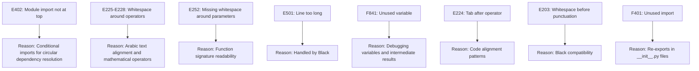
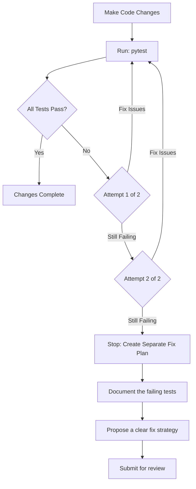
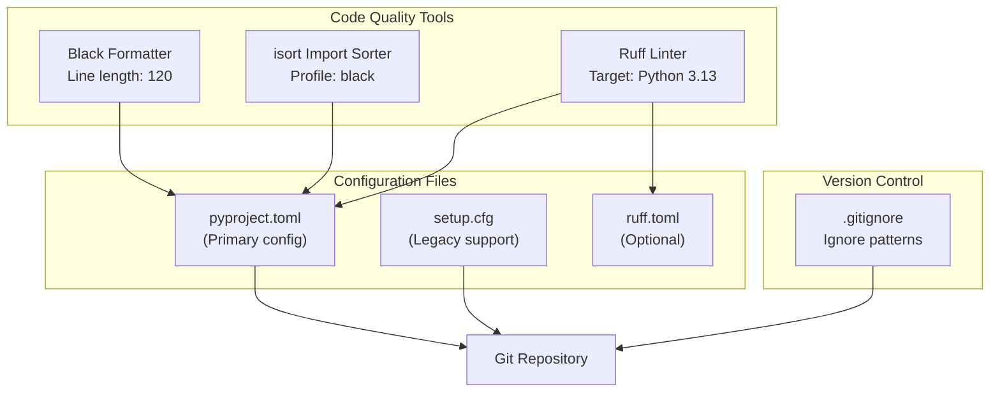
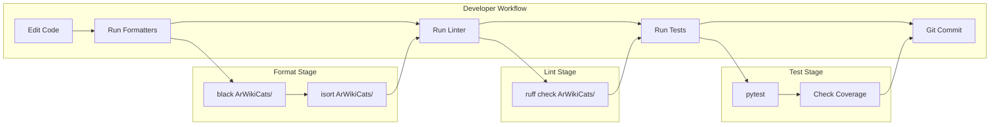
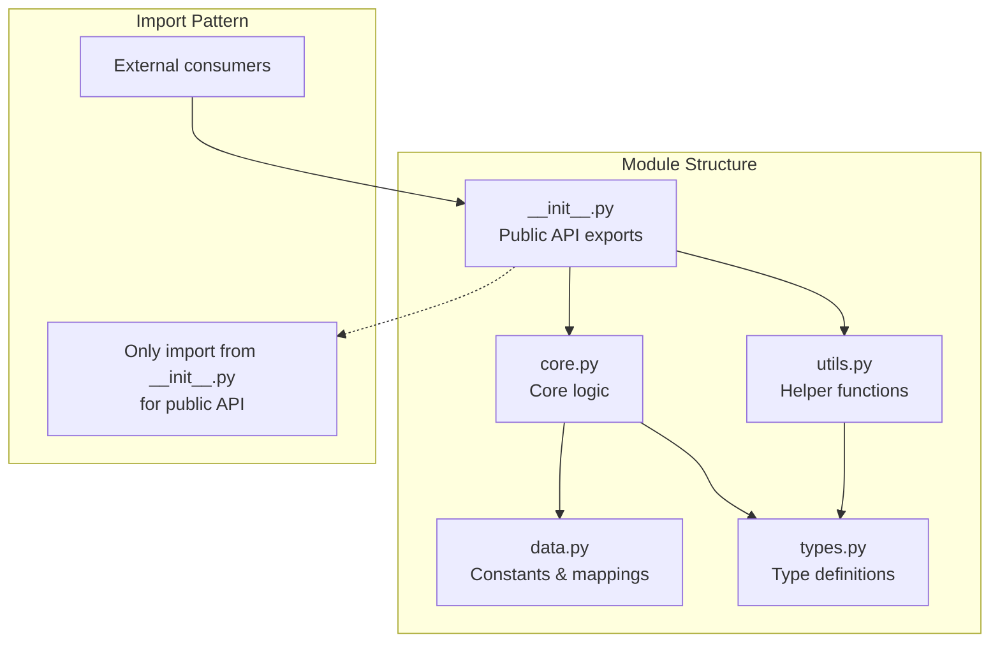

<details>
<summary>Relevant source files</summary>

The following files were used as context for generating this wiki page:

- [.github/copilot-instructions.md](.github/copilot-instructions.md)
- [.github/workflows/python-publish.yml](.github/workflows/python-publish.yml)
- [.gitignore](.gitignore)
- [ArWikiCats/config.py](../ArWikiCats/config.py)
- [CLAUDE.md](CLAUDE.md)
- [README.md](README.md)
- [changelog.md](changelog.md)
- [tests_require_fixes/test_papua_new_guinean.py](tests_require_fixes/test_papua_new_guinean.py)
- [tests_require_fixes/test_skip_data_all.py](tests_require_fixes/test_skip_data_all.py)
- [tests_require_fixes/text_to_fix.py](tests_require_fixes/text_to_fix.py)

</details>


This page documents the code formatting, linting standards, and development practices enforced in the ArWikiCats codebase. These standards ensure consistency, maintainability, and code quality across all contributions.

For information about adding new features to the system, see [Development Guide](37.Development-Guide.md). For testing guidelines, see [Testing and Validation](32.Testing-and-Validation.md)

---

## Python Version Requirements

**Runtime Requirement**: Python 3.10 or higher
**Linting Target**: Python 3.13 (for future compatibility checking)

The project uses Python 3.10+ features and syntax. The linting tools target Python 3.13 to ensure forward compatibility and catch potential issues early.

**Sources**: [README.md L4](../README.md#L4), [CLAUDE.md L11](../CLAUDE.md#L11), [.github/copilot-instructions.md L28-L29](../.github/copilot-instructions.md#L28-L29)

---

## Code Formatting Standards

ArWikiCats enforces strict code formatting using Black and isort. All code must pass formatting checks before being merged.

### Black Configuration

**Black** is the primary code formatter with the following configuration:

| Setting | Value |
|---------|-------|
| Line Length | 120 characters |
| Target Version | Python 3.10+ |
| String Normalization | Enabled |
| Magic Comma | Enabled |

**Running Black**:
```bash
black ArWikiCats/
```

The 120-character line length provides a good balance between readability and horizontal space utilization for complex translation logic.

**Sources**: [README.md L523](../README.md#L523), [CLAUDE.md L53](../CLAUDE.md#L53), [.github/copilot-instructions.md L27-L30](../.github/copilot-instructions.md#L27-L30)

### isort Configuration

**isort** organizes import statements with Black-compatible formatting:

| Setting | Value |
|---------|-------|
| Profile | black |
| Line Length | 120 characters |
| Multi-line Mode | Parentheses (3) |
| Force Single Line | False |
| Known First Party | ArWikiCats |

**Running isort**:
```bash
isort ArWikiCats/
```

**Import Organization Structure**:
```python
# Standard library imports
import os
import sys
from dataclasses import dataclass
from functools import lru_cache

# Third-party imports
import pytest
from typing import Dict, List

# Local application imports
from ArWikiCats.translations import jobs_mens_data
from ArWikiCats.fix import fixlabel
```

**Sources**: [README.md L524](../README.md#L524), [CLAUDE.md L55-L56](../CLAUDE.md#L55-L56), [.github/copilot-instructions.md L32-L36](../.github/copilot-instructions.md#L32-L36)

---

## Linting with Ruff

**Ruff** is used for fast Python linting with the following configuration:

| Setting | Value |
|---------|-------|
| Line Length | 120 characters |
| Target Version | Python 3.13 |
| Select Rules | Default + additional |
| Ignored Rules | E402, E225, E226, E227, E228, E252, E501, F841, E224, E203, F401 |

**Running Ruff**:
```bash
ruff check ArWikiCats/
```

### Ignored Rules Rationale



**Sources**: [.github/copilot-instructions.md L38-L42](../.github/copilot-instructions.md#L38-L42), [CLAUDE.md L59](../CLAUDE.md#L59)

---

## Development Practices

### Logging Conventions

**Mandatory**: Use f-strings for all logging statements.

**Correct Pattern**:
```python
from ArWikiCats.helps.log import getLogger

logger = getLogger(__name__)

def resolve_category(category: str, data: dict) -> str:
    logger.debug(f"Resolving category={category} with data_keys={len(data)}")
    logger.info(f"Resolution complete: input={category} output={result}")
    return result
```

**Incorrect Pattern** (Do Not Use):
```python
# ❌ Wrong: Old-style string formatting
logger.debug("Resolving category=%s with data_keys=%s", category, len(data))
```

**Rationale**: F-strings provide better readability, performance, and type safety. They are evaluated lazily when logging is disabled, improving performance.

**Sources**: [.github/copilot-instructions.md L44-L50](../.github/copilot-instructions.md#L44-L50), [CLAUDE.md L173-L175](../CLAUDE.md#L173-L175)

### Testing Protocol

After making any code changes, follow this protocol:



**Test Execution Commands**:
```bash
# Run all tests
pytest

# Run specific test categories
pytest tests/unit/              # Fast unit tests
pytest tests/integration/       # Integration tests
pytest tests/e2e/ --rune2e      # End-to-end tests

# Run with specific markers
pytest -m unit                  # Unit tests only
pytest -m integration           # Integration tests only
pytest -m slow                  # Slow tests only
```

**Coverage Target**: Maintain >90% code coverage. Current coverage: 91%

**Sources**: [.github/copilot-instructions.md L10-L22](../.github/copilot-instructions.md#L10-L22), [CLAUDE.md L177-L181](../CLAUDE.md#L177-L181), [README.md L439-L494](../README.md#L439-L494)

### Arabic Text Handling

Special considerations for working with Arabic text:

| Requirement | Implementation |
|-------------|----------------|
| **Encoding** | All files must use UTF-8 encoding |
| **Directionality** | Preserve RTL (right-to-left) text directionality |
| **String Literals** | Use raw strings or escape sequences for Arabic text |
| **Testing** | Include Arabic text in test assertions |
| **Display** | Terminal output must support Arabic characters |

**Example Pattern**:
```python
# Correct: Explicit UTF-8 handling
def format_category(english: str, arabic: str) -> str:
    """Format category with Arabic translation.

    Args:
        english: English category name
        arabic: Arabic translation (UTF-8)

    Returns:
        Formatted category with تصنيف: prefix
    """
    return f"تصنيف:{arabic}"
```

**Sources**: [.github/copilot-instructions.md L98-L104](../.github/copilot-instructions.md#L98-L104), [CLAUDE.md L183-L187](../CLAUDE.md#L183-L187), [README.md L518](../README.md#L518)

### Documentation Standards

All public functions, classes, and modules must include docstrings:

**Module-Level Docstring**:
```python
"""
Configuration module for the ArWikiCats project.
This module handles environment variables and command-line arguments to configure
the application's behavior, including printing and application-specific settings.
"""
```

**Function Docstring**:
```python
def resolve_arabic_category_label(category: str) -> str:
    """Translate an English Wikipedia category to Arabic with تصنيف: prefix.

    Args:
        category: English category name (e.g., "Category:2015 in Yemen")

    Returns:
        Arabic category with prefix (e.g., "تصنيف:2015 في اليمن")
        Empty string if no translation found

    Example:
        >>> resolve_arabic_category_label("Category:British footballers")
        'تصنيف:لاعبو كرة قدم بريطانيون'
    """
```

**Sources**: [ArWikiCats/config.py L1-L6](../ArWikiCats/config.py#L1-L6), [ArWikiCats/config.py L19-L25](../ArWikiCats/config.py#L19-L25)

---

## Configuration Files

### Tool Configuration Overview



### .gitignore Configuration

The project ignores the following artifacts:

| Pattern | Purpose |
|---------|---------|
| `*.pyc`, `*.pyc*` | Python bytecode files |
| `*.tmp.py` | Temporary Python files |
| `/.vscode` | VSCode settings |
| `*.txt` | Log and output files |
| `/.codex`, `/.claude` | AI assistant caches |
| `*.old`, `*_backup`, `*.backup` | Backup files |
| `**/old/**` | Archived code |
| `.coverage` | Coverage report data |
| `*.svg` | Generated diagrams |
| `*.prof`, `profile.html`, `profile.json` | Profiling outputs |

**Sources**: [.gitignore L1-L31](../.gitignore#L1-L31)

---

## Code Quality Workflow

### Pre-Commit Workflow



### Automated Quality Checks

**Complete Check Sequence**:
```bash
# Step 1: Format code
black ArWikiCats/
isort ArWikiCats/

# Step 2: Lint code
ruff check ArWikiCats/

# Step 3: Run tests
pytest

# Step 4: Check coverage (optional)
pytest --cov=ArWikiCats --cov-report=term-missing
```

**Single-Line Quality Check**:
```bash
black ArWikiCats/ && isort ArWikiCats/ && ruff check ArWikiCats/ && pytest
```

**Sources**: [README.md L520-L526](../README.md#L520-L526), [CLAUDE.md L51-L60](../CLAUDE.md#L51-L60)

---

## Common Patterns and Conventions

### Caching Pattern

Use `@functools.lru_cache` for performance-critical functions:

```python
from functools import lru_cache

@lru_cache(maxsize=50000)
def resolve_label(category: str) -> str:
    """Resolve category label with LRU caching.

    Cache size: 50,000 entries for high-volume processing.
    """
    # Resolution logic
    return result
```

**Cache Sizes in Codebase**:
- Main resolver: 50,000 entries
- Sub-resolvers: 10,000-20,000 entries typically
- Data loaders: 1,000-5,000 entries

**Sources**: Based on architecture diagrams and performance section in README.md

### Module Organization Pattern



**Example from codebase**: [ArWikiCats/legacy_bots/](../ArWikiCats/legacy_bots/)
- `__init__.py` - Main entry point with `LegacyBotsResolver` class
- `data/mappings.py` - Centralized data dictionaries
- `utils/regex_hub.py` - Pre-compiled regex patterns
- `core/base_resolver.py` - Shared resolver functions

**Sources**: Based on changelog.md refactoring entries from 2026-01-21

### Resolver Function Pattern

All resolvers follow this consistent signature:

```python
def resolve_category_pattern(category: str) -> str:
    """Resolve a specific category pattern.

    Args:
        category: Normalized category string (lowercase, no prefix)

    Returns:
        Arabic translation without تصنيف: prefix
        Empty string if pattern doesn't match

    Notes:
        - Function is cached with @lru_cache
        - Assumes input is already normalized
        - Returns raw translation (prefix added by EventProcessor)
    """
    # Pattern matching logic
    if not matches_pattern(category):
        return ""

    # Translation logic
    return translate(category)
```

**Sources**: Based on resolver architecture in high-level diagrams

### Error Handling Pattern

```python
def resolve_with_fallback(category: str) -> str:
    """Resolve category with fallback chain.

    Returns empty string instead of raising exceptions.
    Logs warnings for unexpected conditions.
    """
    try:
        result = primary_resolver(category)
        if result:
            return result
    except KeyError as e:
        logger.warning(f"Missing key in resolver: {e}")
    except Exception as e:
        logger.error(f"Unexpected error in resolver: {e}")

    # Try fallback resolvers
    return fallback_resolver(category) or ""
```

**Rationale**: The system prefers returning empty strings over exceptions, allowing the resolver chain to continue trying other resolvers. Exceptions are logged but don't halt processing.

---

## Anti-Patterns to Avoid

### ❌ Avoid: Direct Data Mutation

```python
# Wrong: Mutating shared data structures
TRANSLATION_DICT["new_key"] = "new_value"

# Correct: Create new dictionaries
custom_translations = TRANSLATION_DICT.copy()
custom_translations["new_key"] = "new_value"
```

### ❌ Avoid: Circular Imports

```python
# Wrong: Circular dependency
# file_a.py
from file_b import function_b

# file_b.py
from file_a import function_a
```

**Solution**: Use callback injection pattern as implemented in `legacy_bots/resolvers/factory.py`:
```python
# Interface definition
def set_fallback_resolver(callback):
    """Inject fallback resolver to break circular dependency."""
    global _fallback_resolver
    _fallback_resolver = callback
```

**Sources**: [changelog.md L128-L152](../changelog.md#L128-L152)

### ❌ Avoid: Non-Cached Expensive Operations

```python
# Wrong: Loading data on every call
def resolve(category: str) -> str:
    data = json.load(open("data.json"))  # Expensive!
    return lookup(category, data)

# Correct: Cache data at module level
_DATA = json.load(open("data.json"))

@lru_cache(maxsize=10000)
def resolve(category: str) -> str:
    return lookup(category, _DATA)
```

---

## Contributor Checklist

Before submitting code changes:

- [ ] Code formatted with Black (line length 120)
- [ ] Imports sorted with isort (black profile)
- [ ] All Ruff checks pass
- [ ] All existing tests pass (`pytest`)
- [ ] New tests added for new functionality
- [ ] Docstrings added for public functions/classes
- [ ] Arabic text uses UTF-8 encoding
- [ ] Logging uses f-strings
- [ ] No circular imports introduced
- [ ] Expensive operations are cached
- [ ] Changes documented in changelog.md

**Sources**: [README.md L513-L519](../README.md#L513-L519), [.github/copilot-instructions.md L114-L121](../.github/copilot-instructions.md#L114-L121)

---

## Performance Considerations

### Profiling Tools

```bash
# Memory profiling with Scalene
python -m scalene run.py

# Time profiling with cProfile
python -m cProfile -o profile.prof run.py

# View profile results
python -m pstats profile.prof
```

**Target Metrics**:
- Memory usage: <100MB (optimized from 2GB)
- Test suite: ~23 seconds
- Batch processing: >5,000 categories in seconds

**Sources**: [README.md L500-L508](../README.md#L500-L508), [CLAUDE.md L224-L226](../CLAUDE.md#L224-L226)

### Memory Optimization Guidelines

1. **Use generators** for large data processing
2. **Cache immutable data** at module level
3. **Avoid string concatenation in loops** (use join or f-strings)
4. **Clear large temporary structures** after use
5. **Use `__slots__` for dataclasses** when appropriate

**Sources**: Based on performance optimization context from README and architecture diagrams

