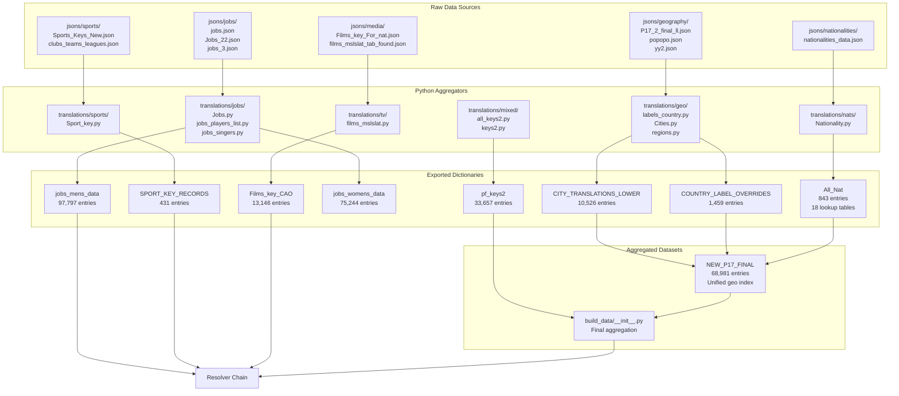
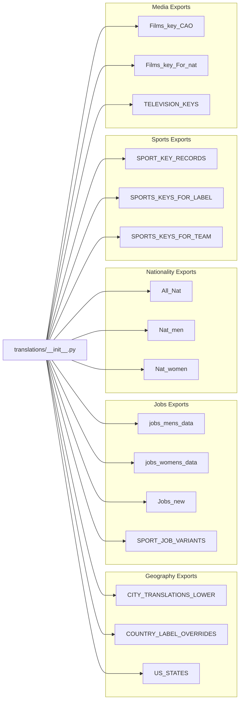
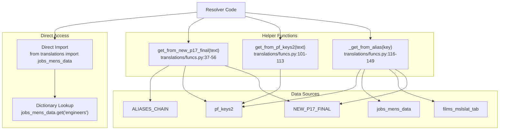

<details>
<summary>Relevant source files</summary>

The following files were used as context for generating this wiki page:

- [ArWikiCats/translations/__init__.py](../ArWikiCats/translations/__init__.py)
- [ArWikiCats/translations/build_data/__init__.py](../ArWikiCats/translations/build_data/__init__.py)
- [ArWikiCats/translations/funcs.py](../ArWikiCats/translations/funcs.py)
- [ArWikiCats/translations/geo/__init__.py](../ArWikiCats/translations/geo/__init__.py)
- [ArWikiCats/translations/geo/labels_country.py](../ArWikiCats/translations/geo/labels_country.py)
- [ArWikiCats/translations/jobs/Jobs.py](../ArWikiCats/translations/jobs/Jobs.py)
- [ArWikiCats/translations/jobs/Jobs2.py](../ArWikiCats/translations/jobs/Jobs2.py)
- [ArWikiCats/translations/jobs/jobs_data_basic.py](../ArWikiCats/translations/jobs/jobs_data_basic.py)
- [ArWikiCats/translations/jobs/jobs_players_list.py](../ArWikiCats/translations/jobs/jobs_players_list.py)
- [ArWikiCats/translations/jobs/jobs_singers.py](../ArWikiCats/translations/jobs/jobs_singers.py)
- [ArWikiCats/translations/jobs/jobs_womens.py](../ArWikiCats/translations/jobs/jobs_womens.py)
- [ArWikiCats/translations/mixed/all_keys2.py](../ArWikiCats/translations/mixed/all_keys2.py)
- [ArWikiCats/translations/mixed/female_keys.py](../ArWikiCats/translations/mixed/female_keys.py)
- [ArWikiCats/translations/mixed/keys2.py](../ArWikiCats/translations/mixed/keys2.py)
- [ArWikiCats/translations/others/__init__.py](../ArWikiCats/translations/others/__init__.py)
- [ArWikiCats/translations/others/tax_table.py](../ArWikiCats/translations/others/tax_table.py)
- [ArWikiCats/translations/sports/Sport_key.py](../ArWikiCats/translations/sports/Sport_key.py)
- [ArWikiCats/translations/tv/films_mslslat.py](../ArWikiCats/translations/tv/films_mslslat.py)
- [_work_files/data_len.json](_work_files/data_len.json)

</details>


## Purpose and Scope

The Translation Data layer provides the foundational English-to-Arabic mapping tables used throughout the ArWikiCats system. This page documents the organization, structure, and scale of these translation resources across all supported domains.

For information about how this data is processed and aggregated, see [Data Aggregation Pipeline](#4.1). For details about specific resolvers that consume this data, see [Resolver System](#5).

## Overview

The translation data consists of structured dictionaries mapping English Wikipedia category terms to their Arabic equivalents. The system manages approximately **250,000+ translation entries** across multiple domains, organized into domain-specific modules under [ArWikiCats/translations/]().

The data originates from raw JSON files in [jsons/](), which are processed by Python aggregator modules into typed dictionaries exported via [ArWikiCats/translations/__init__.py:1-152]().

## Data Architecture



**Sources:** [ArWikiCats/translations/__init__.py:1-152](), [ArWikiCats/translations/build_data/__init__.py:1-83](), [_work_files/data_len.json:1-135]()

## Data Organization by Domain

The translation data is partitioned into seven major domains, each with specialized structure and processing requirements:

| Domain | Primary Modules | Key Datasets | Scale |
|--------|----------------|--------------|-------|
| **Geography** | `translations/geo/` | `CITY_TRANSLATIONS_LOWER`, `COUNTRY_LABEL_OVERRIDES`, `US_STATES` | 10,526 cities, 1,459 countries |
| **Jobs** | `translations/jobs/` | `jobs_mens_data`, `jobs_womens_data`, `Jobs_new` | 97,797 male jobs, 75,244 female jobs |
| **Nationalities** | `translations/nats/` | `All_Nat`, `Nat_men`, `Nat_women` | 843 nationalities, 18 forms |
| **Sports** | `translations/sports/` | `SPORT_KEY_RECORDS`, `SPORTS_KEYS_FOR_LABEL` | 431 sports |
| **Films/TV** | `translations/tv/` | `Films_key_CAO`, `Films_key_For_nat` | 13,146 film entries |
| **Ministers** | `translations/others/` | `ministers_keys` | 99 political roles |
| **Mixed** | `translations/mixed/` | `pf_keys2`, `keys_of_without_in` | 33,657 generic keys |

**Sources:** [ArWikiCats/translations/__init__.py:9-85](), [_work_files/data_len.json:1-135]()

## Export Structure

Translation data is exported through two layers:

### Direct Exports (`translations/__init__.py`)

Domain-specific dictionaries exported directly from their aggregator modules for immediate use by resolvers:



**Sources:** [ArWikiCats/translations/__init__.py:87-151]()

### Aggregated Exports (`build_data/__init__.py`)

Comprehensive merged datasets combining multiple sources:

```python
# build_data/__init__.py exports two unified indexes:

pf_keys2 = generate_key_mappings(...)  # 33,657 entries
# Merges: keys2_py, pop_final_3, film keys, language keys, etc.

NEW_P17_FINAL = _build_country_label_index(...)  # 68,981 entries
# Merges: cities, countries, regions, states, taxonomies
```

**Sources:** [ArWikiCats/translations/build_data/__init__.py:42-69]()

## Data Access Patterns

The system provides multiple access methods for translation lookups:



**Sources:** [ArWikiCats/translations/funcs.py:1-159]()

## Data Types and Structures

### Simple Mappings

Basic string-to-string dictionaries for straightforward translations:

```python
# Example from COUNTRY_LABEL_OVERRIDES
{
    "united states": "الولايات المتحدة",
    "united kingdom": "المملكة المتحدة"
}
```

### Gendered Mappings

Job and role translations with masculine and feminine forms:

```python
# Example from jobs_mens_data and jobs_womens_data
{
    "engineers": {
        "males": "مهندسون",
        "females": "مهندسات"
    }
}
```

### Template Mappings

Patterns with placeholders for dynamic substitution:

```python
# Example from Films_key_For_nat
{
    "drama films": "أفلام درامية {}",  # {} = nationality placeholder
    "action films": "أفلام حركة {}"
}
```

### Multi-attribute Records

Complex structures with multiple translation contexts:

```python
# Example from SPORT_KEY_RECORDS (Sport_key.py)
{
    "football": {
        "label": "كرة القدم",      # General label
        "team": "كرة قدم",         # For teams
        "jobs": "كرة قدم"          # For jobs/occupations
    }
}
```

**Sources:** [ArWikiCats/translations/sports/Sport_key.py:1-73](), [ArWikiCats/translations/jobs/Jobs.py:1-211](), [ArWikiCats/translations/tv/films_mslslat.py:118-143]()

## Scale and Performance

The translation data layer manages significant volumes requiring optimization:

| Dataset | Entries | Memory | Load Time |
|---------|---------|--------|-----------|
| `jobs_mens_data` | 97,797 | 3.7 MiB | Module import |
| `jobs_womens_data` | 75,244 | 1.8 MiB | Module import |
| `NEW_P17_FINAL` | 68,981 | N/A | Built at import |
| `pf_keys2` | 33,657 | N/A | Built at import |
| `Films_key_CAO` | 13,146 | N/A | Module import |
| `CITY_TRANSLATIONS_LOWER` | 10,526 | N/A | Module import |
| **Total Managed** | ~250,000+ | ~6 MiB | <1s |

All translation data is loaded at module import time and cached in memory for fast lookups. The resolver chain benefits from Python's built-in dictionary hash table performance (O(1) average case).

**Sources:** [ArWikiCats/translations/jobs/Jobs.py:185-194](), [_work_files/data_len.json:1-135]()

## Data Validation

Each aggregator module uses `len_print.data_len()` to validate dataset sizes during development:

```python
# Example from Jobs.py
len_print.data_len(
    "jobs.py",
    {
        "jobs_mens_data": jobs_mens_data,      # Validates entry count
        "jobs_womens_data": jobs_womens_data,
        "Jobs_new": Jobs_new,
    },
)
```

This validation runs during module initialization and helps detect unexpected changes in dataset sizes when JSON sources are updated.

**Sources:** [ArWikiCats/translations/jobs/Jobs.py:196-204](), [ArWikiCats/translations/helps/len_print.py]()

## Related Pages

- For detailed aggregation pipelines, see [Data Aggregation Pipeline](#4.1)
- For geographic data specifics, see [Geographic Data](#4.2)
- For jobs data structures, see [Jobs and Occupations](#4.3)
- For nationality handling, see [Nationalities](#4.4)
- For sports translations, see [Sports Data](#4.5)
- For media categories, see [Films and Television](#4.6)
- For how resolvers consume this data, see [Resolver System](#5)1e:T58f0,# Data Aggregation Pipeline

