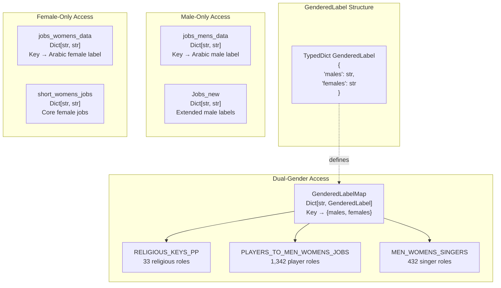
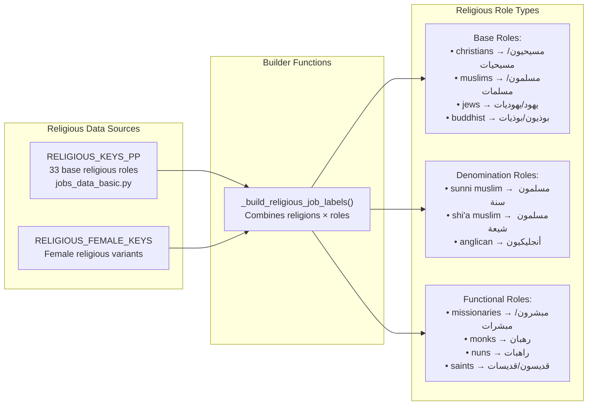
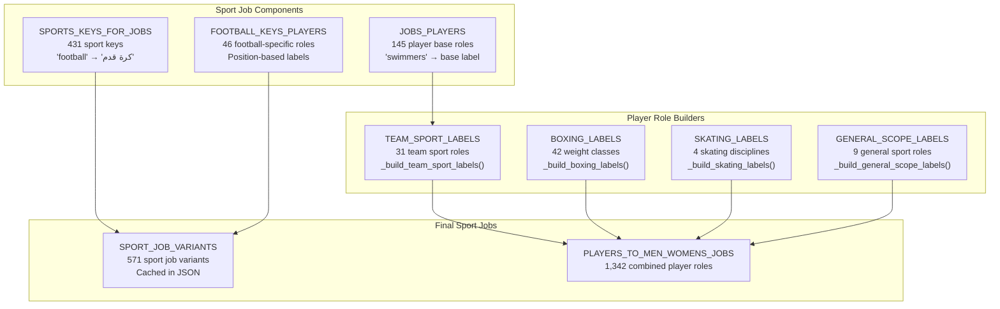
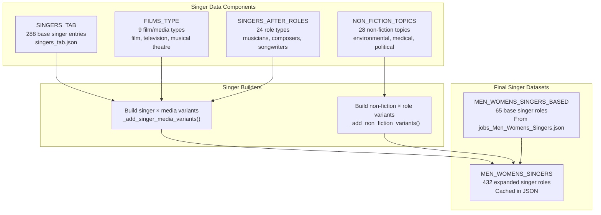
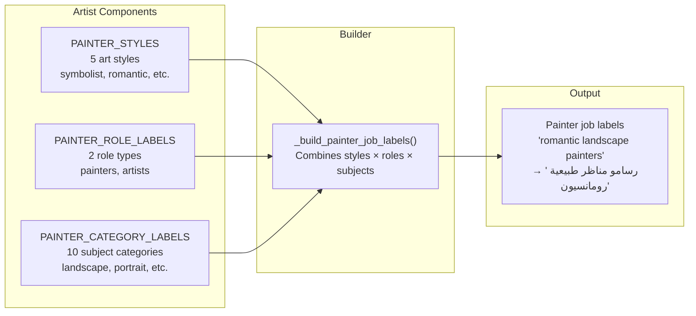
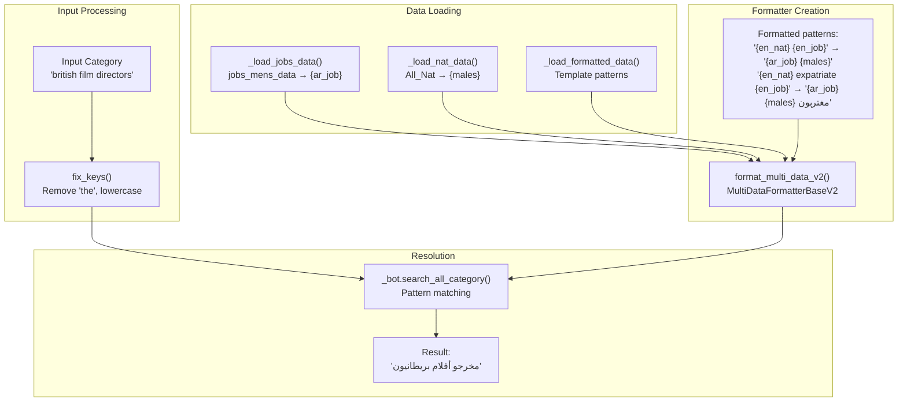
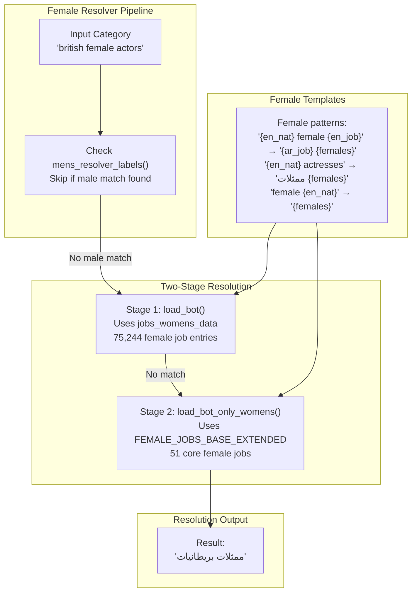
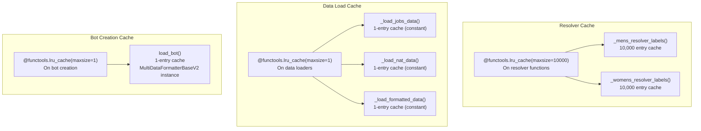

<details>
<summary>Relevant source files</summary>

The following files were used as context for generating this wiki page:

- [ArWikiCats/jsons/jobs/activists_keys.json](../ArWikiCats/jsons/jobs/activists_keys.json)
- [ArWikiCats/new/handle_suffixes.py](../ArWikiCats/new/handle_suffixes.py)
- [ArWikiCats/new_resolvers/jobs_resolvers/mens.py](../ArWikiCats/new_resolvers/jobs_resolvers/mens.py)
- [ArWikiCats/new_resolvers/jobs_resolvers/utils.py](../ArWikiCats/new_resolvers/jobs_resolvers/utils.py)
- [ArWikiCats/new_resolvers/jobs_resolvers/womens.py](../ArWikiCats/new_resolvers/jobs_resolvers/womens.py)
- [ArWikiCats/new_resolvers/nationalities_resolvers/ministers_resolver.py](../ArWikiCats/new_resolvers/nationalities_resolvers/ministers_resolver.py)
- [ArWikiCats/translations/__init__.py](../ArWikiCats/translations/__init__.py)
- [ArWikiCats/translations/build_data/__init__.py](../ArWikiCats/translations/build_data/__init__.py)
- [ArWikiCats/translations/funcs.py](../ArWikiCats/translations/funcs.py)
- [ArWikiCats/translations/geo/__init__.py](../ArWikiCats/translations/geo/__init__.py)
- [ArWikiCats/translations/geo/labels_country.py](../ArWikiCats/translations/geo/labels_country.py)
- [ArWikiCats/translations/jobs/Jobs.py](../ArWikiCats/translations/jobs/Jobs.py)
- [ArWikiCats/translations/jobs/Jobs2.py](../ArWikiCats/translations/jobs/Jobs2.py)
- [ArWikiCats/translations/jobs/jobs_data_basic.py](../ArWikiCats/translations/jobs/jobs_data_basic.py)
- [ArWikiCats/translations/jobs/jobs_players_list.py](../ArWikiCats/translations/jobs/jobs_players_list.py)
- [ArWikiCats/translations/jobs/jobs_singers.py](../ArWikiCats/translations/jobs/jobs_singers.py)
- [ArWikiCats/translations/jobs/jobs_womens.py](../ArWikiCats/translations/jobs/jobs_womens.py)
- [ArWikiCats/translations/mixed/all_keys2.py](../ArWikiCats/translations/mixed/all_keys2.py)
- [ArWikiCats/translations/mixed/female_keys.py](../ArWikiCats/translations/mixed/female_keys.py)
- [ArWikiCats/translations/mixed/keys2.py](../ArWikiCats/translations/mixed/keys2.py)
- [ArWikiCats/translations/others/__init__.py](../ArWikiCats/translations/others/__init__.py)
- [ArWikiCats/translations/others/tax_table.py](../ArWikiCats/translations/others/tax_table.py)
- [ArWikiCats/translations/sports/Sport_key.py](../ArWikiCats/translations/sports/Sport_key.py)
- [ArWikiCats/translations/tv/films_mslslat.py](../ArWikiCats/translations/tv/films_mslslat.py)
- [_work_files/data_len.json](_work_files/data_len.json)

</details>


This page documents the jobs and occupations translation system, which provides comprehensive English-to-Arabic mappings for occupational categories with gender-aware handling. The system maintains 97,797 male job entries and 75,244 female job entries, supporting the translation of Wikipedia categories like "British film directors" to "مخرجو أفلام بريطانيون".

For resolver implementation details using these datasets, see [Job Resolvers](18.Job-Resolvers.md). For nationality handling in job categories, see [Nationality Resolvers](16.Nationality-Resolvers.md).

## Overview

The jobs system aggregates occupational translations from multiple JSON sources and builds gendered Arabic labels. It handles special cases including religious occupations, sports-related roles, artistic professions, and scientific disciplines with distinct masculine and feminine forms.

```mermaid
graph TB
    subgraph "Raw Job Sources"
        jobs_json["jobs.json<br/>Primary jobs data"]
        Jobs_22["Jobs_22.json<br/>jobs_primary"]
        jobs_3["jobs_3.json<br/>jobs_additional"]
        jobs_pp["jobs_Men_Womens_PP.json<br/>Gendered job pairs"]
        activists["activists_keys.json"]
    end

    subgraph "Specialized Job Data"
        Religious["RELIGIOUS_KEYS_PP<br/>33 religious roles"]
        Sports["SPORT_JOB_VARIANTS<br/>571 sport variants"]
        Singers["MEN_WOMENS_SINGERS<br/>432 singer roles"]
        Players["PLAYERS_TO_MEN_WOMENS_JOBS<br/>1,342 player roles"]
    end

    subgraph "Data Builders"
        BuildJobs["_finalise_jobs_dataset()<br/>ArWikiCats/translations/data_builders/build_jobs.py"]
        BuildWomens["jobs_womens.py<br/>short_womens_jobs"]
        BuildJobsNew["_build_jobs_new()<br/>Combines womens + Nat_mens"]
    end

    subgraph "Final Datasets"
        jobs_mens_data["jobs_mens_data<br/>97,797 entries<br/>3.7 MiB"]
        jobs_womens_data["jobs_womens_data<br/>75,244 entries<br/>1.8 MiB"]
        Jobs_new["Jobs_new<br/>99,104 entries<br/>Additional womens variants"]
    end

    jobs_json --> BuildJobs
    Jobs_22 --> BuildJobs
    jobs_3 --> BuildJobs
    jobs_pp --> BuildJobs
    activists --> BuildJobs
    Religious --> BuildJobs
    Sports --> BuildJobs
    Singers --> BuildJobs
    Players --> BuildJobs

    BuildJobs --> jobs_mens_data
    BuildJobs --> jobs_womens_data

    BuildWomens --> BuildJobsNew
    BuildJobsNew --> Jobs_new

    style jobs_mens_data fill:#90ee90
    style jobs_womens_data fill:#90ee90
    style Jobs_new fill:#90ee90
```



**Sources:** [ArWikiCats/translations/jobs/Jobs.py:1-211](), [_work_files/data_len.json:9-14]()

## Data Aggregation Architecture

The jobs system follows a multi-stage aggregation pipeline that merges domain-specific job datasets with gender-aware transformations.

### Aggregation Pipeline

```mermaid
flowchart TB
    subgraph "Stage 1: Load Base Data"
        LoadPrimary["Load jobs_primary<br/>Jobs_22.json"]
        LoadAdditional["Load jobs_additional<br/>jobs_3.json"]
        LoadPP["Load jobs_pp<br/>jobs_Men_Womens_PP.json"]
    end

    subgraph "Stage 2: Generate Variants"
        SportVariants["sport_variants<br/>35 entries<br/>From SPORT_JOB_VARIANTS"]
        PeopleVariants["people_variants<br/>94 entries<br/>From JOBS_PEOPLE_ROLES"]
    end

    subgraph "Stage 3: Merge Specialized Data"
        MergeReligious["Merge RELIGIOUS_KEYS_PP<br/>33 religious roles"]
        MergeSingers["Merge MEN_WOMENS_SINGERS<br/>432 singer entries"]
        MergePlayers["Merge PLAYERS_TO_MEN_WOMENS_JOBS<br/>1,342 player entries"]
        MergeSports["Merge SPORT_JOB_VARIANTS<br/>571 sport job variants"]
    end

    subgraph "Stage 4: Apply Transformations"
        AddExecutive["Add EXECUTIVE_DOMAINS<br/>7 executive types"]
        AddDisability["Add DISABILITY_LABELS<br/>3 disability types"]
        AddCompanies["Add companies_to_jobs<br/>28 company founder roles"]
        AddActivists["Add activists<br/>Activism roles"]
    end

    subgraph "Stage 5: Final Assembly"
        Finalise["_finalise_jobs_dataset()<br/>Combines all sources"]
        SplitGender["Split into males/females<br/>_DATASET.males_jobs<br/>_DATASET.females_jobs"]
    end

    LoadPrimary --> Finalise
    LoadAdditional --> Finalise
    LoadPP --> Finalise
    SportVariants --> Finalise
    PeopleVariants --> Finalise
    MergeReligious --> Finalise
    MergeSingers --> Finalise
    MergePlayers --> Finalise
    MergeSports --> Finalise
    AddExecutive --> Finalise
    AddDisability --> Finalise
    AddCompanies --> Finalise
    AddActivists --> Finalise

    Finalise --> SplitGender
```



**Sources:** [ArWikiCats/translations/jobs/Jobs.py:150-183](), [ArWikiCats/translations/data_builders/build_jobs.py]()

### Key Aggregation Function

The `_finalise_jobs_dataset()` function performs the core aggregation:

```python
# From ArWikiCats/translations/data_builders/build_jobs.py
_DATASET = _finalise_jobs_dataset(
    jobs_pp,                        # Base gendered jobs
    sport_variants,                 # Sport-specific variants
    people_variants,                # People role variants
    MEN_WOMENS_JOBS_2,             # Additional gendered jobs
    NAT_BEFORE_OCC,                # Nationality-before-occupation patterns
    MEN_WOMENS_SINGERS_BASED,      # Singer base roles
    MEN_WOMENS_SINGERS,            # Singer variants
    PLAYERS_TO_MEN_WOMENS_JOBS,    # Player roles
    SPORT_JOB_VARIANTS,            # Sport job variants
    RELIGIOUS_FEMALE_KEYS,         # Female religious roles
    BASE_CYCLING_EVENTS,           # Cycling event roles
    JOBS_2,                        # Additional jobs set 2
    JOBS_3333,                     # Additional jobs set 3333
    RELIGIOUS_KEYS_PP,             # Religious keys
    FOOTBALL_KEYS_PLAYERS,         # Football player roles
    EXECUTIVE_DOMAINS,             # Executive domains
    DISABILITY_LABELS,             # Disability labels
    JOBS_2020_BASE,                # 2020 job additions
    companies_to_jobs,             # Company founder roles
    activists,                     # Activist roles
)
```

**Sources:** [ArWikiCats/translations/jobs/Jobs.py:158-179]()

## Gender-Specific Data Structures

The jobs system maintains separate male and female datasets with specialized handling for grammatical gender agreement in Arabic.

### Male Jobs Dataset

| Dataset | Size | Example Entry | Usage |
|---------|------|---------------|-------|
| `jobs_mens_data` | 97,797 entries | `"zoologists": "علماء حيوانات"` | Primary male job lookup |
| `Jobs_new` | 99,104 entries | Includes nationality variants | Extended male jobs with nationality combinations |

### Female Jobs Dataset

| Dataset | Size | Example Entry | Usage |
|---------|------|---------------|-------|
| `jobs_womens_data` | 75,244 entries | `"actresses": "ممثلات"` | Primary female job lookup |
| `short_womens_jobs` | 484 entries | `"nuns": "راهبات"` | Core female-specific jobs |
| `FEMALE_JOBS_BASE_EXTENDED` | 51 entries | Religious + base female jobs | Extended female roles |

**Gender-Specific Data Structure:**



**Sources:** [ArWikiCats/translations/jobs/Jobs.py:181-183](), [ArWikiCats/translations/data_builders/jobs_defs.py](), [_work_files/data_len.json:9-15]()

## Job Categories

### Religious Occupations

Religious jobs require special handling due to their intersection with nationality and gender. The system maintains 33 base religious role types.



**Example religious job combinations:**

| English Key | Male Arabic | Female Arabic |
|-------------|-------------|---------------|
| `"christian missionaries"` | `"مبشرون مسيحيون"` | `"مبشرات مسيحيات"` |
| `"buddhist monks"` | `"رهبان بوذيون"` | `"راهبات بوذيات"` |
| `"muslim saints"` | `"قديسون مسلمون"` | `"قديسات مسلمات"` |

**Sources:** [ArWikiCats/translations/jobs/jobs_data_basic.py:20-54](), [ArWikiCats/translations/jobs/jobs_data_basic.py:83-98]()

### Sports-Related Jobs

The sports job system provides 571 sport job variants, integrating with the sports keys to create player, coach, and manager translations.



**Sport job variant examples:**

| Variant Type | Example | Male Label | Female Label |
|--------------|---------|------------|--------------|
| Team sport player | `"basketball players"` | `"لاعبو كرة السلة"` | `"لاعبات كرة السلة"` |
| Boxing weight class | `"heavyweight boxers"` | `"ملاكمو وزن ثقيل"` | (not defined) |
| Sport manager | `"football managers"` | `"مدربو كرة قدم"` | `"مدربات كرة قدم"` |
| Olympic scope | `"olympic athletes"` | `"رياضيون أولمبيون"` | `"رياضيات أولمبيات"` |

**Sources:** [ArWikiCats/translations/jobs/jobs_players_list.py:1-263](), [_work_files/data_len.json:32-46]()

### Singer and Music Roles

Singer jobs combine musical professions with media types (film, television, radio, etc.) to create 432 distinct role mappings.



**Singer role examples:**

| Category | Male Form | Female Form |
|----------|-----------|-------------|
| `"film musicians"` | `"موسيقيو أفلام"` | `"موسيقيات أفلام"` |
| `"television singers"` | `"مغنو تلفزيون"` | `"مغنيات تلفزيون"` |
| `"record producers"` | `"منتجو تسجيلات"` | `"منتجات تسجيلات"` |
| `"singer-songwriters"` | `"مغنون وكتاب أغاني"` | `"مغنيات وكاتبات أغاني"` |

**Sources:** [ArWikiCats/translations/jobs/jobs_singers.py:1-148](), [_work_files/data_len.json:41-42,63-64]()

### Scientific Disciplines

The jobs system includes 193 scientific discipline translations organized by field.

**Scientific discipline categories:**

| Field | Example Disciplines | Arabic Pattern |
|-------|-------------------|----------------|
| Life Sciences | `"biologists"`, `"zoologists"`, `"botanists"` | `"علماء {discipline}"` |
| Medical Sciences | `"epidemiologists"`, `"immunologists"`, `"virologists"` | `"علماء {discipline}"` |
| Physical Sciences | `"physicists"`, `"chemists"`, `"astronomers"` | `"فيزيائيون"`, `"كيميائيون"` |
| Earth Sciences | `"geologists"`, `"oceanographers"`, `"seismologists"` | `"علماء {discipline}"` |

**Sources:** [ArWikiCats/translations/jobs/Jobs2.py:21-88]()

### Painter and Artist Roles

Artist jobs combine art styles with role types to generate comprehensive painter labels.



**Sources:** [ArWikiCats/translations/jobs/jobs_data_basic.py:102-126]()

## Company Founder Roles

The system includes 28 company founder role mappings organized by industry.

**Example company founder roles:**

| English Key | Male Label | Female Label |
|-------------|------------|--------------|
| `"technology company founders"` | `"مؤسسو شركات تقانة"` | `"مؤسسات شركات تقانة"` |
| `"media company founders"` | `"مؤسسو شركات إعلامية"` | `"مؤسسات شركات إعلامية"` |
| `"pharmaceutical company founders"` | `"مؤسسو شركات أدوية"` | `"مؤسسات شركات أدوية"` |

**Sources:** [ArWikiCats/translations/jobs/Jobs.py:32-67](), [_work_files/data_len.json:114]()

## Integration with Resolvers

Jobs data integrates with nationality and country resolvers to create complex category translations combining location and occupation.

### Male Job Resolver Integration



**Male resolver formatted patterns (226 templates):**

| Pattern Template | Arabic Output | Example |
|-----------------|---------------|---------|
| `"{en_nat} {en_job}"` | `"{ar_job} {males}"` | `"british actors"` → `"ممثلون بريطانيون"` |
| `"{en_nat} expatriate {en_job}"` | `"{ar_job} {males} مغتربون"` | `"turkish expatriate footballers"` → `"لاعبو كرة قدم أتراك مغتربون"` |
| `"{en_nat} emigrants {en_job}"` | `"{ar_job} {males} مهاجرون"` | `"italian emigrants writers"` → `"كتاب إيطاليون مهاجرون"` |
| `"male {en_nat}"` | `"{males} ذكور"` | `"male american"` → `"أمريكيون ذكور"` |

**Sources:** [ArWikiCats/new_resolvers/jobs_resolvers/mens.py:114-254](), [ArWikiCats/new_resolvers/jobs_resolvers/mens.py:303-325]()

### Female Job Resolver Integration



**Female resolver formatted patterns:**

| Pattern Template | Arabic Output | Example |
|-----------------|---------------|---------|
| `"{en_nat} female {en_job}"` | `"{ar_job} {females}"` | `"german female scientists"` → `"عالمات ألمانيات"` |
| `"{en_nat} actresses"` | `"ممثلات {females}"` | `"french actresses"` → `"ممثلات فرنسيات"` |
| `"female {en_nat} people"` | `"{females}"` | `"female british people"` → `"بريطانيات"` |
| `"female expatriate {en_job}"` | `"{ar_job} مغتربات"` | `"female expatriate nurses"` → `"ممرضات مغتربات"` |

**Sources:** [ArWikiCats/new_resolvers/jobs_resolvers/womens.py:91-186](), [ArWikiCats/new_resolvers/jobs_resolvers/womens.py:230-278]()

### Nationality-Before-Occupation Pattern

Certain job categories require nationality to precede occupation in Arabic for proper grammatical structure. The system maintains 17 base patterns in `NAT_BEFORE_OCC_BASE`.

**NAT_BEFORE_OCC pattern list:**

```python
NAT_BEFORE_OCC_BASE = [
    "murdered abroad",
    "contemporary",
    "tour de france stage winners",
    "deafblind",
    "deaf",
    "blind",
    "jews",
    "women's rights activists",
    "female rights activists",
    "human rights activists",
    "imprisoned",
    "imprisoned abroad",
    "conservationists",
    "expatriate",
    "defectors",
    "scholars of islam",
    "scholars-of-islam",
    "amputees",
    "expatriates",
    "executed abroad",
    "emigrants",
]
```

**Extended with religious keys (total 54 patterns):**
- All entries from `RELIGIOUS_KEYS_PP` are added to create the full `NAT_BEFORE_OCC` list
- This ensures patterns like `"british muslims"` → `"بريطانيون مسلمون"` (nationality first)

**Sources:** [ArWikiCats/translations/jobs/jobs_data_basic.py:56-82](), [_work_files/data_len.json:99]()

## Key Utilities

### Job Key Normalization

The `fix_keys()` function standardizes input categories before resolution:

**Normalization operations:**
1. Remove apostrophes: `"women's"` → `"womens"`
2. Convert to lowercase
3. Remove "the" prefix
4. Replace multi-space with single space
5. Map `"womens"` / `"women"` → `"female"`
6. Map `"expatriates"` → `"expatriate"`
7. Map `"canadian football"` → `"canadian-football"`

**Sources:** [ArWikiCats/new_resolvers/jobs_resolvers/utils.py:10-26]()

### Gender Key Filtering

The `is_false_key()` function prevents incorrect job classification:

**Filtering logic:**
- Skip keys containing `"mens"` or `"men's"` with Arabic label containing `"رجالية"` (men's sports equipment)
- Skip keys in `genders_keys` (status descriptors like `"executed"`, `"murdered abroad"`)
- Skip keys in `RELIGIOUS_KEYS_PP` (handled separately)
- Skip keys containing `"expatriate"` or `"immigrants"` without job context

**Sources:** [ArWikiCats/new_resolvers/jobs_resolvers/mens.py:89-111](), [ArWikiCats/new_resolvers/jobs_resolvers/womens.py:68-87]()

## Data Export Points

Jobs data exports through multiple layers for different use cases:

### Direct Exports

| Export | Source | Purpose |
|--------|--------|---------|
| `jobs_mens_data` | [ArWikiCats/translations/jobs/Jobs.py:181]() | Primary male job resolver lookup |
| `jobs_womens_data` | [ArWikiCats/translations/jobs/Jobs.py:182]() | Primary female job resolver lookup |
| `Jobs_new` | [ArWikiCats/translations/jobs/Jobs.py:183]() | Extended jobs with nationality variants |
| `RELIGIOUS_KEYS_PP` | [ArWikiCats/translations/jobs/jobs_data_basic.py:20]() | Religious role patterns |
| `SPORT_JOB_VARIANTS` | [ArWikiCats/translations/jobs/jobs_players_list.py:202]() | Sport-specific job variants |
| `short_womens_jobs` | [ArWikiCats/translations/jobs/jobs_womens.py:75]() | Core female-specific jobs |

### Aggregate Exports

Via [ArWikiCats/translations/__init__.py:15-26]():

```python
from .jobs import (
    FEMALE_JOBS_BASE_EXTENDED,
    NAT_BEFORE_OCC,
    NAT_BEFORE_OCC_BASE,
    PLAYERS_TO_MEN_WOMENS_JOBS,
    RELIGIOUS_KEYS_PP,
    SPORT_JOB_VARIANTS,
    Jobs_new,
    jobs_mens_data,
    jobs_womens_data,
    short_womens_jobs,
)
```

**Sources:** [ArWikiCats/translations/__init__.py:15-26](), [ArWikiCats/translations/jobs/Jobs.py:206-210]()

## Performance Characteristics

The jobs system uses extensive caching to optimize lookup performance:

### Caching Strategy



**Cache sizes:**
- Resolver functions: 10,000 entries each (mens, womens)
- Data loaders: 1 entry (singleton pattern)
- Bot instances: 1 entry (singleton pattern)

**Memory footprint:**
- `jobs_mens_data`: 3.7 MiB (97,797 entries)
- `jobs_womens_data`: 1.8 MiB (75,244 entries)
- Total jobs memory: ~5.5 MiB

**Sources:** [ArWikiCats/new_resolvers/jobs_resolvers/mens.py:114,257,276,302,327](), [ArWikiCats/new_resolvers/jobs_resolvers/womens.py:90,203,229,254,280,291,302](), [_work_files/data_len.json:9-14]()21:T4082,# Nationalities

