<details>
<summary>Relevant source files</summary>

The following files were used as context for generating this wiki page:

- [.github/copilot-instructions.md](.github/copilot-instructions.md)
- [.github/workflows/python-publish.yml](.github/workflows/python-publish.yml)
- [ArWikiCats/config.py](../ArWikiCats/config.py)
- [ArWikiCats/jsons/population/pop_All_2018.json](../ArWikiCats/jsons/population/pop_All_2018.json)
- [ArWikiCats/main_processers/main_resolve.py](../ArWikiCats/main_processers/main_resolve.py)
- [CLAUDE.md](CLAUDE.md)
- [README.md](README.md)
- [changelog.md](changelog.md)
- [tests_require_fixes/test_papua_new_guinean.py](tests_require_fixes/test_papua_new_guinean.py)
- [tests_require_fixes/test_skip_data_all.py](tests_require_fixes/test_skip_data_all.py)
- [tests_require_fixes/text_to_fix.py](tests_require_fixes/text_to_fix.py)

</details>


## Purpose and Scope

ArWikiCats is a Python library that automatically translates English Wikipedia category names into standardized Arabic equivalents. The system processes category labels through a multi-stage resolution pipeline, leveraging extensive translation dictionaries covering temporal patterns, geographic entities, occupations, sports, nationalities, and media-related terms.

This page provides a high-level understanding of the system's architecture, capabilities, and core components. For detailed information about specific subsystems:
- Installation and basic usage: see [Getting Started](#2)
- Detailed architecture: see [Architecture](#3)
- Translation data organization: see [Translation Data](#4)
- Resolver implementations: see [Resolver System](#5)
- Template formatting engine: see [Formatting System](#6)

**Sources:** [README.md:1-560](), [CLAUDE.md:1-227](), [.github/copilot-instructions.md:1-121]()

---

## System Capabilities

The ArWikiCats translation engine maintains comprehensive translation datasets across multiple domains:

| Domain | Dataset Size | Key Examples |
|--------|-------------|--------------|
| **Jobs and Occupations** | 96,552 male entries, extensive female mappings | footballers, painters, scientists, religious occupations |
| **Sports** | 431 sport key records, 571 job variants | football, basketball, teams, players, competitions |
| **Nationalities** | 843 entries, 18 lookup tables | British, American, Egyptian (male/female/plural/definite forms) |
| **Geographic Data** | 68,981 entries | cities, regions, countries, counties, US states |
| **Films and Television** | 13,146 entries | film genres, TV series, directors, actors |
| **Test Coverage** | 28,500+ tests | unit, integration, end-to-end tests achieving 91% coverage |

The system handles complex multi-element categories such as:
- Temporal + Nationality + Occupation: "2010 British football players"
- Country + Year + Event: "1990s establishments in France"
- Nationality + Sport + Team: "Argentine football club managers"

**Sources:** [README.md:42-113](), [changelog.md:1-80]()

---

## High-Level Architecture

The system follows a layered architecture with specialized resolver chains that process categories in priority order:

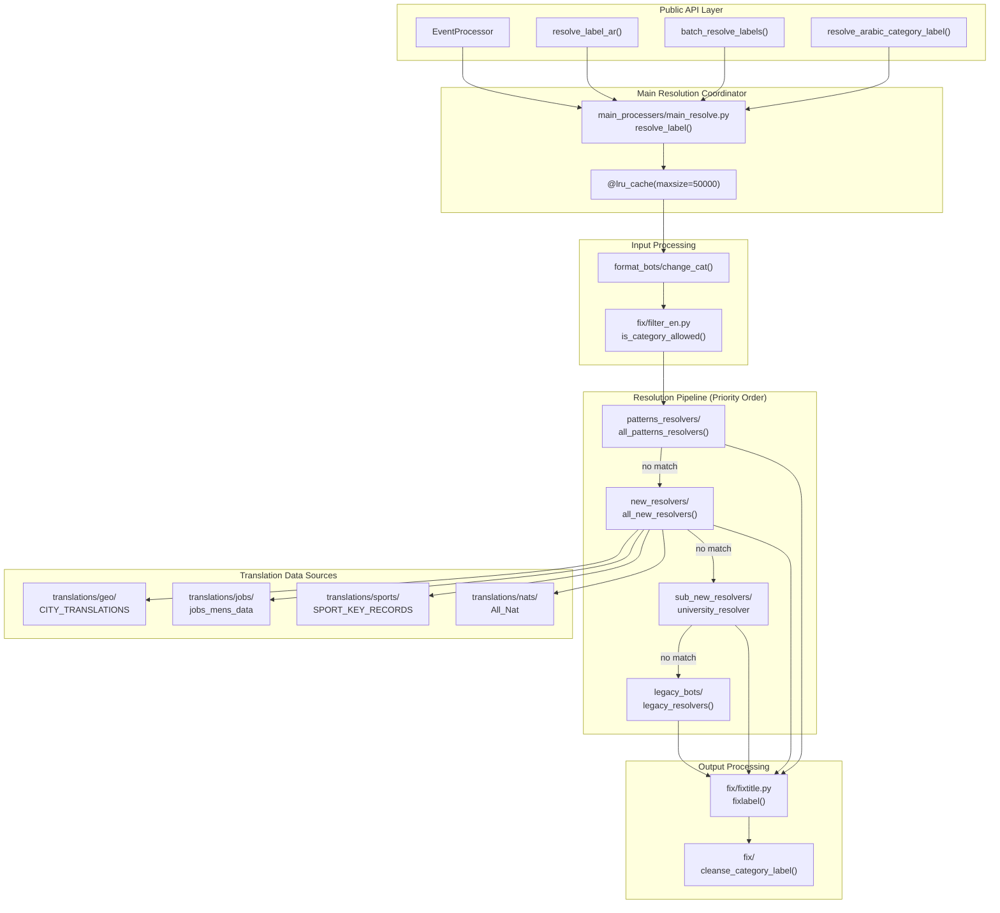
```mermaid
graph TB
    subgraph "Public API Layer"
        API1["resolve_arabic_category_label()"]
        API2["batch_resolve_labels()"]
        API3["resolve_label_ar()"]
        API4["EventProcessor"]
    end

    subgraph "Main Resolution Coordinator"
        MainResolve["main_processers/main_resolve.py<br/>resolve_label()"]
        Cache["@lru_cache(maxsize=50000)"]
    end

    subgraph "Input Processing"
        ChangeCAT["format_bots/change_cat()"]
        FilterEN["fix/filter_en.py<br/>is_category_allowed()"]
    end

    subgraph "Resolution Pipeline (Priority Order)"
        PatternResolvers["patterns_resolvers/<br/>all_patterns_resolvers()"]
        NewResolvers["new_resolvers/<br/>all_new_resolvers()"]
        UnivResolver["sub_new_resolvers/<br/>university_resolver"]
        LegacyResolver["legacy_bots/<br/>legacy_resolvers()"]
    end

    subgraph "Output Processing"
        FixLabel["fix/fixtitle.py<br/>fixlabel()"]
        Cleanse["fix/<br/>cleanse_category_label()"]
    end

    subgraph "Translation Data Sources"
        TranslationsGeo["translations/geo/<br/>CITY_TRANSLATIONS"]
        TranslationsJobs["translations/jobs/<br/>jobs_mens_data"]
        TranslationsSports["translations/sports/<br/>SPORT_KEY_RECORDS"]
        TranslationsNats["translations/nats/<br/>All_Nat"]
    end

    API1 --> MainResolve
    API2 --> MainResolve
    API3 --> MainResolve
    API4 --> MainResolve

    MainResolve --> Cache
    Cache --> ChangeCAT
    ChangeCAT --> FilterEN

    FilterEN --> PatternResolvers
    PatternResolvers -->|"no match"| NewResolvers
    NewResolvers -->|"no match"| UnivResolver
    UnivResolver -->|"no match"| LegacyResolver

    PatternResolvers --> FixLabel
    NewResolvers --> FixLabel
    UnivResolver --> FixLabel
    LegacyResolver --> FixLabel

    FixLabel --> Cleanse

    NewResolvers --> TranslationsGeo
    NewResolvers --> TranslationsJobs
    NewResolvers --> TranslationsSports
    NewResolvers --> TranslationsNats
```

**Architecture Overview**

The system is organized into five primary layers:

1. **Public API Layer** - User-facing functions in [ArWikiCats/\_\_init\_\_.py]() that provide simple interfaces for single-category and batch translation
2. **Main Resolution Coordinator** - [main_processers/main_resolve.py:33-93]() orchestrates the resolution pipeline with LRU caching
3. **Input Processing** - Normalizes categories and filters invalid inputs before resolution
4. **Resolution Pipeline** - Prioritized chain of specialized resolvers that attempt pattern matching
5. **Output Processing** - Applies Arabic formatting rules and cleansing to finalized labels

**Sources:** [ArWikiCats/main_processers/main_resolve.py:1-106](), [CLAUDE.md:69-103]()

---

## Resolution Pipeline Flow

The category resolution process follows a strict priority order to prevent conflicts and ensure accurate translations:

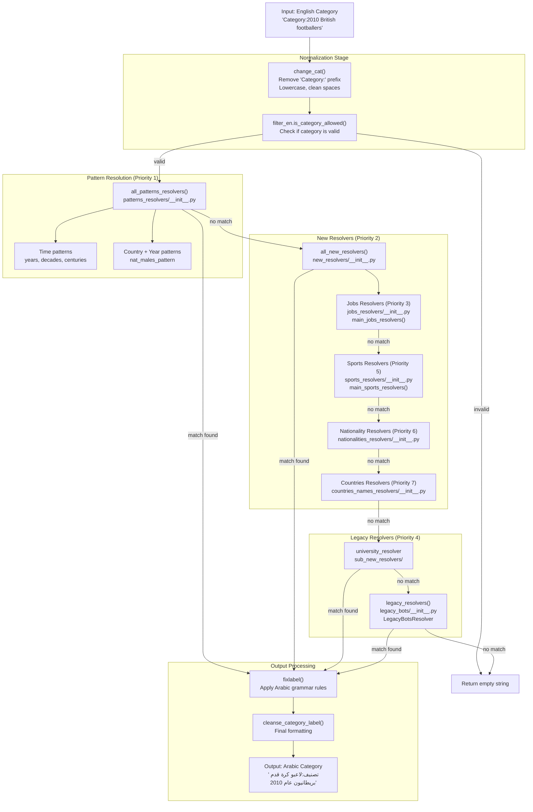
```mermaid
flowchart TD
    Input["Input: English Category<br/>'Category:2010 British footballers'"]

    subgraph Normalization["Normalization Stage"]
        ChangeCat["change_cat()<br/>Remove 'Category:' prefix<br/>Lowercase, clean spaces"]
        Filter["filter_en.is_category_allowed()<br/>Check if category is valid"]
    end

    subgraph PatternStage["Pattern Resolution (Priority 1)"]
        AllPatterns["all_patterns_resolvers()<br/>patterns_resolvers/__init__.py"]
        TimePatterns["Time patterns<br/>years, decades, centuries"]
        CountryTime["Country + Year patterns<br/>nat_males_pattern"]
    end

    subgraph NewStage["New Resolvers (Priority 2)"]
        AllNew["all_new_resolvers()<br/>new_resolvers/__init__.py"]
        Jobs["Jobs Resolvers (Priority 3)<br/>jobs_resolvers/__init__.py<br/>main_jobs_resolvers()"]
        Sports["Sports Resolvers (Priority 5)<br/>sports_resolvers/__init__.py<br/>main_sports_resolvers()"]
        Nats["Nationality Resolvers (Priority 6)<br/>nationalities_resolvers/__init__.py"]
        Countries["Countries Resolvers (Priority 7)<br/>countries_names_resolvers/__init__.py"]
    end

    subgraph LegacyStage["Legacy Resolvers (Priority 4)"]
        Univ["university_resolver<br/>sub_new_resolvers/"]
        Legacy["legacy_resolvers()<br/>legacy_bots/__init__.py<br/>LegacyBotsResolver"]
    end

    subgraph OutputStage["Output Processing"]
        Fix["fixlabel()<br/>Apply Arabic grammar rules"]
        Clean["cleanse_category_label()<br/>Final formatting"]
        Result["Output: Arabic Category<br/>'تصنيف:لاعبو كرة قدم بريطانيون عام 2010'"]
    end

    Input --> ChangeCat
    ChangeCat --> Filter
    Filter -->|"valid"| AllPatterns
    Filter -->|"invalid"| Empty["Return empty string"]

    AllPatterns --> TimePatterns
    AllPatterns --> CountryTime

    AllPatterns -->|"no match"| AllNew
    AllNew --> Jobs
    Jobs -->|"no match"| Sports
    Sports -->|"no match"| Nats
    Nats -->|"no match"| Countries

    Countries -->|"no match"| Univ
    Univ -->|"no match"| Legacy

    AllPatterns -->|"match found"| Fix
    AllNew -->|"match found"| Fix
    Univ -->|"match found"| Fix
    Legacy -->|"match found"| Fix
    Legacy -->|"no match"| Empty

    Fix --> Clean
    Clean --> Result
```

**Resolution Priority Rationale**

The resolver ordering is critical to prevent conflicts:
1. **Pattern resolvers first** - Fast regex-based matching for common patterns (years, time + country)
2. **Jobs before Sports** - "football manager" must resolve as a job, not a sports category
3. **Nationalities before Countries** - "Italy political leader" uses nationality form, not country name
4. **Sports after Jobs** - Prevents job titles from being misclassified as sports terms
5. **Legacy resolvers last** - Backward compatibility for patterns not yet migrated

The system uses `@functools.lru_cache(maxsize=50000)` on the main resolver to cache results and achieve high throughput.

**Sources:** [ArWikiCats/main_processers/main_resolve.py:32-94](), [CLAUDE.md:79-92]()

---

## Core Components and File Organization

The codebase is organized into specialized modules, each handling a specific aspect of translation:

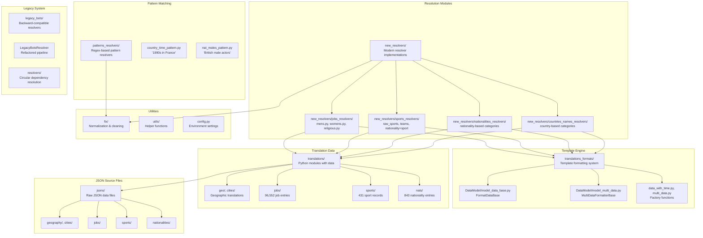
```mermaid
graph TB
    subgraph "Resolution Modules"
        NewResolvers["new_resolvers/<br/>Modern resolver implementations"]
        JobsResolvers["new_resolvers/jobs_resolvers/<br/>mens.py, womens.py, religious.py"]
        SportsResolvers["new_resolvers/sports_resolvers/<br/>raw_sports, teams, nationality+sport"]
        NatsResolvers["new_resolvers/nationalities_resolvers/<br/>nationality-based categories"]
        CountriesResolvers["new_resolvers/countries_names_resolvers/<br/>country-based categories"]
    end

    subgraph "Pattern Matching"
        Patterns["patterns_resolvers/<br/>Regex-based pattern resolvers"]
        CountryTime["country_time_pattern.py<br/>'1990s in France'"]
        NatMales["nat_males_pattern.py<br/>'British male actors'"]
    end

    subgraph "Template Engine"
        Formats["translations_formats/<br/>Template formatting system"]
        FormatBase["DataModel/model_data_base.py<br/>FormatDataBase"]
        MultiFormatter["DataModel/model_multi_data.py<br/>MultiDataFormatterBase"]
        Factories["data_with_time.py, multi_data.py<br/>Factory functions"]
    end

    subgraph "Translation Data"
        TransData["translations/<br/>Python modules with data"]
        GeoData["geo/, cities/<br/>Geographic translations"]
        JobsData["jobs/<br/>96,552 job entries"]
        SportsData["sports/<br/>431 sport records"]
        NatsData["nats/<br/>843 nationality entries"]
    end

    subgraph "JSON Source Files"
        JSONs["jsons/<br/>Raw JSON data files"]
        JSONGeo["geography/, cities/"]
        JSONJobs["jobs/"]
        JSONSports["sports/"]
        JSONNats["nationalities/"]
    end

    subgraph "Legacy System"
        Legacy["legacy_bots/<br/>Backward-compatible resolvers"]
        LegacyResolver["LegacyBotsResolver<br/>Refactored pipeline"]
        CircularDep["resolvers/<br/>Circular dependency resolution"]
    end

    subgraph "Utilities"
        Fix["fix/<br/>Normalization & cleaning"]
        Utils["utils/<br/>Helper functions"]
        Config["config.py<br/>Environment settings"]
    end

    NewResolvers --> JobsResolvers
    NewResolvers --> SportsResolvers
    NewResolvers --> NatsResolvers
    NewResolvers --> CountriesResolvers

    JobsResolvers --> Formats
    SportsResolvers --> Formats
    NatsResolvers --> Formats
    CountriesResolvers --> Formats

    Formats --> FormatBase
    Formats --> MultiFormatter
    Formats --> Factories

    JobsResolvers --> TransData
    SportsResolvers --> TransData
    NatsResolvers --> TransData
    CountriesResolvers --> TransData

    TransData --> GeoData
    TransData --> JobsData
    TransData --> SportsData
    TransData --> NatsData

    TransData --> JSONs
    JSONs --> JSONGeo
    JSONs --> JSONJobs
    JSONs --> JSONSports
    JSONs --> JSONNats

    NewResolvers --> Fix
    Patterns --> Fix
```

**Module Responsibilities**

| Module Path | Responsibility | Key Files |
|------------|----------------|-----------|
| `main_processers/` | Orchestrates resolution pipeline | `main_resolve.py` |
| `new_resolvers/` | Modern domain-specific resolvers | `jobs_resolvers/`, `sports_resolvers/`, `nationalities_resolvers/` |
| `patterns_resolvers/` | Regex-based pattern matching | `country_time_pattern.py`, `nat_males_pattern.py` |
| `translations_formats/` | Template formatting engine | `DataModel/`, factory functions |
| `translations/` | Translation data as Python modules | `geo/`, `jobs/`, `sports/`, `nats/`, `tv/` |
| `jsons/` | Raw JSON translation data | `geography/`, `jobs/`, `sports/`, `nationalities/` |
| `legacy_bots/` | Backward-compatible resolvers | `LegacyBotsResolver`, `resolvers/` |
| `fix/` | Text normalization and cleaning | `fixtitle.py`, `fixlists.py` |

**Sources:** [README.md:333-430](), [CLAUDE.md:199-220]()

---

## Public API

The system exposes four main entry points for category translation:

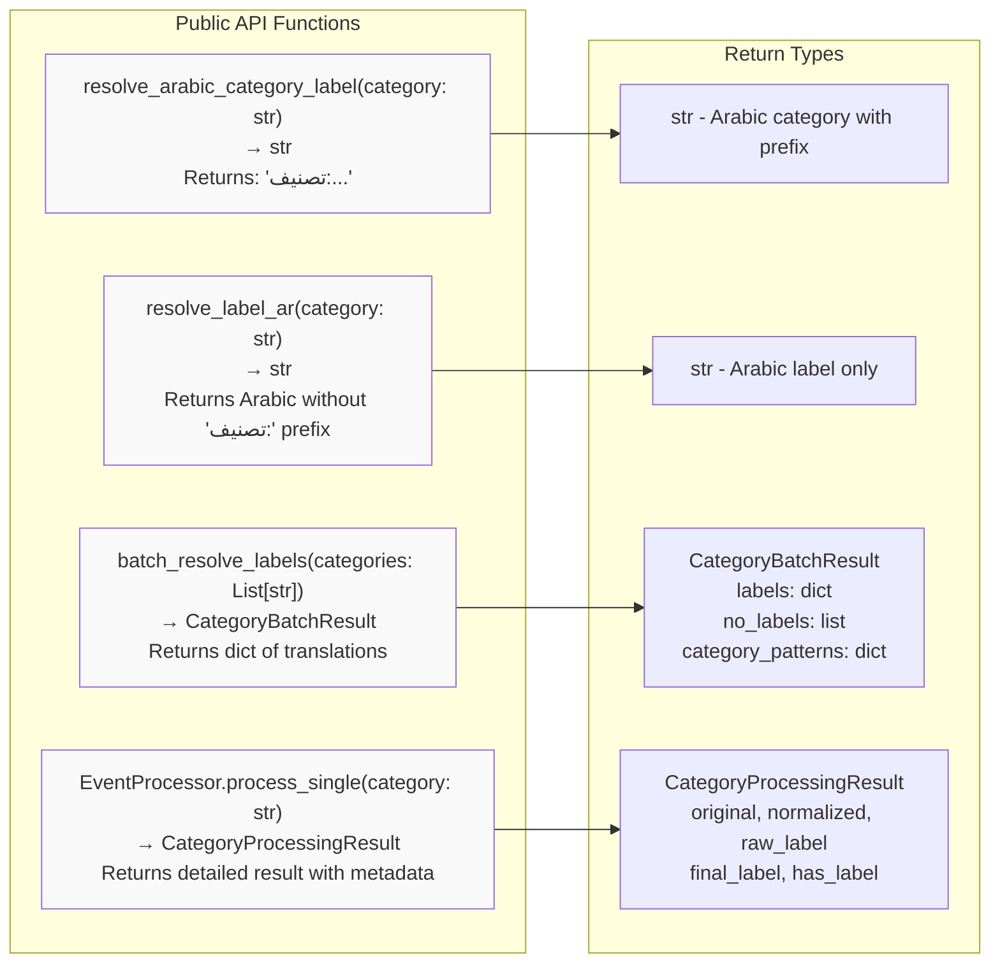
```mermaid
graph LR
    subgraph "Public API Functions"
        API1["resolve_arabic_category_label(category: str)<br/>→ str<br/>Returns: 'تصنيف:...'"]
        API2["resolve_label_ar(category: str)<br/>→ str<br/>Returns Arabic without 'تصنيف:' prefix"]
        API3["batch_resolve_labels(categories: List[str])<br/>→ CategoryBatchResult<br/>Returns dict of translations"]
        API4["EventProcessor.process_single(category: str)<br/>→ CategoryProcessingResult<br/>Returns detailed result with metadata"]
    end

    subgraph "Return Types"
        Result1["str - Arabic category with prefix"]
        Result2["str - Arabic label only"]
        Result3["CategoryBatchResult<br/>labels: dict<br/>no_labels: list<br/>category_patterns: dict"]
        Result4["CategoryProcessingResult<br/>original, normalized, raw_label<br/>final_label, has_label"]
    end

    API1 --> Result1
    API2 --> Result2
    API3 --> Result3
    API4 --> Result4

    style API1 fill:#f9f9f9
    style API2 fill:#f9f9f9
    style API3 fill:#f9f9f9
    style API4 fill:#f9f9f9
```

**Usage Examples**

```python
from ArWikiCats import (
    resolve_arabic_category_label,
    resolve_label_ar,
    batch_resolve_labels,
    EventProcessor
)

# Single category with prefix
label = resolve_arabic_category_label("Category:2015 British footballers")
# Returns: "تصنيف:لاعبو كرة قدم بريطانيون عام 2015"

# Single category without prefix
label = resolve_label_ar("British footballers")
# Returns: "لاعبو كرة قدم بريطانيون"

# Batch processing
categories = [
    "Category:American basketball players",
    "Category:1990s establishments in France"
]
result = batch_resolve_labels(categories)
# result.labels: dict of successful translations
# result.no_labels: list of categories without translations

# Detailed processing with metadata
processor = EventProcessor()
result = processor.process_single("Category:British footballers")
# result.original: "Category:British footballers"
# result.normalized: "british footballers"
# result.final_label: "تصنيف:لاعبو كرة قدم بريطانيون"
# result.has_label: True
```

All public API functions are exported from [ArWikiCats/\_\_init\_\_.py:1-40]() and documented in the package's top-level module.

**Sources:** [README.md:170-230](), [ArWikiCats/main_processers/main_resolve.py:33-100]()

---

## Translation Data Architecture

Translation data flows from raw JSON files through Python aggregator modules into specialized resolver implementations:

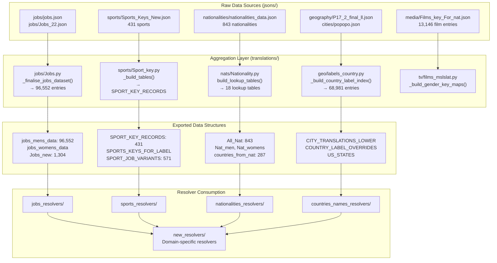
```mermaid
graph TB
    subgraph "Raw Data Sources (jsons/)"
        JSON1["jobs/jobs.json<br/>jobs/Jobs_22.json"]
        JSON2["sports/Sports_Keys_New.json<br/>431 sports"]
        JSON3["nationalities/nationalities_data.json<br/>843 nationalities"]
        JSON4["geography/P17_2_final_ll.json<br/>cities/popopo.json"]
        JSON5["media/Films_key_For_nat.json<br/>13,146 film entries"]
    end

    subgraph "Aggregation Layer (translations/)"
        Agg1["jobs/Jobs.py<br/>_finalise_jobs_dataset()<br/>→ 96,552 entries"]
        Agg2["sports/Sport_key.py<br/>_build_tables()<br/>→ SPORT_KEY_RECORDS"]
        Agg3["nats/Nationality.py<br/>build_lookup_tables()<br/>→ 18 lookup tables"]
        Agg4["geo/labels_country.py<br/>_build_country_label_index()<br/>→ 68,981 entries"]
        Agg5["tv/films_mslslat.py<br/>_build_gender_key_maps()"]
    end

    subgraph "Exported Data Structures"
        Export1["jobs_mens_data: 96,552<br/>jobs_womens_data<br/>Jobs_new: 1,304"]
        Export2["SPORT_KEY_RECORDS: 431<br/>SPORTS_KEYS_FOR_LABEL<br/>SPORT_JOB_VARIANTS: 571"]
        Export3["All_Nat: 843<br/>Nat_men, Nat_womens<br/>countries_from_nat: 287"]
        Export4["CITY_TRANSLATIONS_LOWER<br/>COUNTRY_LABEL_OVERRIDES<br/>US_STATES"]
    end

    subgraph "Resolver Consumption"
        Resolvers["new_resolvers/<br/>Domain-specific resolvers"]
        JobsRes["jobs_resolvers/"]
        SportsRes["sports_resolvers/"]
        NatsRes["nationalities_resolvers/"]
        CountriesRes["countries_names_resolvers/"]
    end

    JSON1 --> Agg1
    JSON2 --> Agg2
    JSON3 --> Agg3
    JSON4 --> Agg4
    JSON5 --> Agg5

    Agg1 --> Export1
    Agg2 --> Export2
    Agg3 --> Export3
    Agg4 --> Export4

    Export1 --> JobsRes
    Export2 --> SportsRes
    Export3 --> NatsRes
    Export4 --> CountriesRes

    JobsRes --> Resolvers
    SportsRes --> Resolvers
    NatsRes --> Resolvers
    CountriesRes --> Resolvers
```

**Data Processing Pipeline**

The translation data undergoes three stages of transformation:

1. **Raw JSON Storage** - Source data files in `jsons/` directory maintain original mappings
2. **Python Aggregation** - Modules in `translations/` process, merge, and transform raw data
3. **Exported Structures** - Final data structures (dicts, sets, lookup tables) used by resolvers

Key aggregation operations include:
- **Jobs**: Combines multiple JSON sources, handles gender variants, generates 96,552 male job entries
- **Sports**: Builds sport key records, job variants, team-related mappings from 431 base sports
- **Nationalities**: Creates 18 specialized lookup tables for different grammatical forms (male, female, plural, definite)
- **Geography**: Indexes 68,981 entries with city translations, country overrides, US state mappings

**Sources:** [README.md:89-113](), [changelog.md:247-294]()

---

## Performance Characteristics

The system is optimized for high-throughput batch processing with the following characteristics:

| Metric | Value | Implementation |
|--------|-------|----------------|
| **Memory Usage** | <100 MB | Optimized from 2GB in legacy system |
| **Cache Size** | 50,000 entries | `@functools.lru_cache` on `resolve_label()` |
| **Test Suite Speed** | ~23 seconds | 28,500+ tests with pytest |
| **Batch Throughput** | >5,000 categories/second | Demonstrated in `examples/5k.py` |
| **Test Coverage** | 91% | Recent improvements to legacy_bots and translations_formats |

**Caching Strategy**

The system employs multiple levels of caching:

```python
# Main resolution function with LRU cache
@functools.lru_cache(maxsize=50000)
def resolve_label(category: str, fix_label: bool = True) -> CategoryResult:
    # ... resolution logic
```

Additional caching is applied to:
- Static data loading functions in resolver modules
- Pattern compilation in `patterns_resolvers/`
- Lookup table generation in `translations/` modules

**Optimization Techniques**

1. **Early filtering** - Invalid categories rejected before entering resolver chain
2. **Priority ordering** - Most common patterns checked first
3. **Lazy loading** - Translation data loaded on-demand in some modules
4. **Pre-compiled regexes** - Pattern matchers compiled at module load time

**Sources:** [README.md:498-508](), [ArWikiCats/main_processers/main_resolve.py:32](), [changelog.md:269-293]()

---

## System Design Principles

ArWikiCats follows several key design principles that inform its architecture:

**1. Resolver Chain Priority Pattern**

Resolvers are ordered to prevent semantic conflicts. For example, "football manager" must be resolved by the jobs resolver (as an occupation) before the sports resolver can interpret it as a sports management role. The priority order is explicitly documented in [new_resolvers/\_\_init\_\_.py:29-57]().

**2. Template-Based Formatting**

The `FormatDataBase` class and its variants provide a template engine for pattern matching and placeholder replacement. This allows resolvers to define translation patterns like `"{nat} {sport} players"` → `"لاعبو {sport} {nat}"` with automatic substitution of Arabic equivalents.

**3. Separation of Data and Logic**

Translation data resides in `jsons/` and `translations/` directories, completely separate from resolver logic. This allows non-developers to contribute translations without modifying code.

**4. Backward Compatibility**

The `legacy_bots/` module maintains compatibility with pre-existing translation patterns through the `LegacyBotsResolver` class, which was refactored from a list-based pipeline while preserving 100% of original behavior.

**5. Comprehensive Testing**

With 28,500+ tests organized into unit, integration, and end-to-end categories, the system achieves 91% code coverage and validates translation accuracy across thousands of real-world categories.

**Sources:** [changelog.md:170-200](), [CLAUDE.md:139-143](), [README.md:434-508]()18:T439c,# Getting Started

<details>
<summary>Relevant source files</summary>

The following files were used as context for generating this wiki page:

- [.github/copilot-instructions.md](.github/copilot-instructions.md)
- [.github/workflows/python-publish.yml](.github/workflows/python-publish.yml)
- [ArWikiCats/config.py](../ArWikiCats/config.py)
- [ArWikiCats/legacy_bots/__init__.py](../ArWikiCats/legacy_bots/__init__.py)
- [ArWikiCats/legacy_bots/legacy_resolvers_bots/country2_label_bot.py](../ArWikiCats/legacy_bots/legacy_resolvers_bots/country2_label_bot.py)
- [ArWikiCats/legacy_bots/legacy_resolvers_bots/event_lab_bot.py](../ArWikiCats/legacy_bots/legacy_resolvers_bots/event_lab_bot.py)
- [ArWikiCats/legacy_bots/legacy_resolvers_bots/with_years_bot.py](../ArWikiCats/legacy_bots/legacy_resolvers_bots/with_years_bot.py)
- [ArWikiCats/legacy_bots/legacy_resolvers_bots/year_or_typeo.py](../ArWikiCats/legacy_bots/legacy_resolvers_bots/year_or_typeo.py)
- [ArWikiCats/legacy_bots/legacy_utils/fixing.py](../ArWikiCats/legacy_bots/legacy_utils/fixing.py)
- [ArWikiCats/legacy_bots/make_bots/check_bot.py](../ArWikiCats/legacy_bots/make_bots/check_bot.py)
- [ArWikiCats/legacy_bots/make_bots/table1_bot.py](../ArWikiCats/legacy_bots/make_bots/table1_bot.py)
- [CLAUDE.md](CLAUDE.md)
- [README.md](README.md)
- [changelog.md](changelog.md)
- [examples/run.py](examples/run.py)
- [tests_require_fixes/test_papua_new_guinean.py](tests_require_fixes/test_papua_new_guinean.py)
- [tests_require_fixes/test_skip_data_all.py](tests_require_fixes/test_skip_data_all.py)
- [tests_require_fixes/text_to_fix.py](tests_require_fixes/text_to_fix.py)

</details>


This page provides a quick-start guide for using ArWikiCats to translate English Wikipedia category labels to Arabic. It covers installation, the main public API functions, and common usage patterns with practical examples.

For an architectural overview of how the translation system works internally, see [Architecture](#3). For details on the translation data structure, see [Translation Data](#4).

---

## Prerequisites

- **Python 3.10 or higher**
- **Operating System**: Windows, macOS, or Linux

**Sources:** [README.md:1-7](), [pyproject.toml]()

---

## Installation

### Method 1: Install from PyPI (Recommended)

```bash
pip install ArWikiCats --pre
```

This installs the latest pre-release version from the Python Package Index.

### Method 2: Install from Source

```bash
git clone https://github.com/ArWikiCats/ArWikiCats.git
cd ArWikiCats
pip install -r requirements.in
```

Installing from source is useful for development or when you need the absolute latest changes.

**Sources:** [README.md:149-167]()

---

## Quick Start: Your First Translation

Before diving into the API details, here's a simple example to get started immediately:

```python
from ArWikiCats import resolve_arabic_category_label

# Translate a single category
result = resolve_arabic_category_label("Category:American basketball players")
print(result)
# Output: تصنيف:لاعبو كرة سلة أمريكيون
```

That's it! The system automatically:
1. Normalizes the input text
2. Identifies the pattern (nationality + sport + job)
3. Applies the appropriate resolver ([ArWikiCats/new_resolvers/sports_resolvers/]())
4. Formats the Arabic output with proper grammar
5. Adds the `تصنيف:` prefix

**Sources:** [README.md:174-180](), [examples/run.py:1-48]()

---

## API Functions

ArWikiCats provides four main functions for category translation, each optimized for different use cases:

**API Function Overview:**

| Function | Purpose | Returns | Prefix Added |
|----------|---------|---------|--------------|
| `resolve_label_ar()` | Core translation (text only) | `str` | No |
| `resolve_arabic_category_label()` | Full processing | `str` | Yes |
| `batch_resolve_labels()` | Multiple categories | `BatchResult` | Yes |
| `EventProcessor.process_single()` | Detailed metadata | `ProcessingResult` | Configurable |

**API Call Flow:**

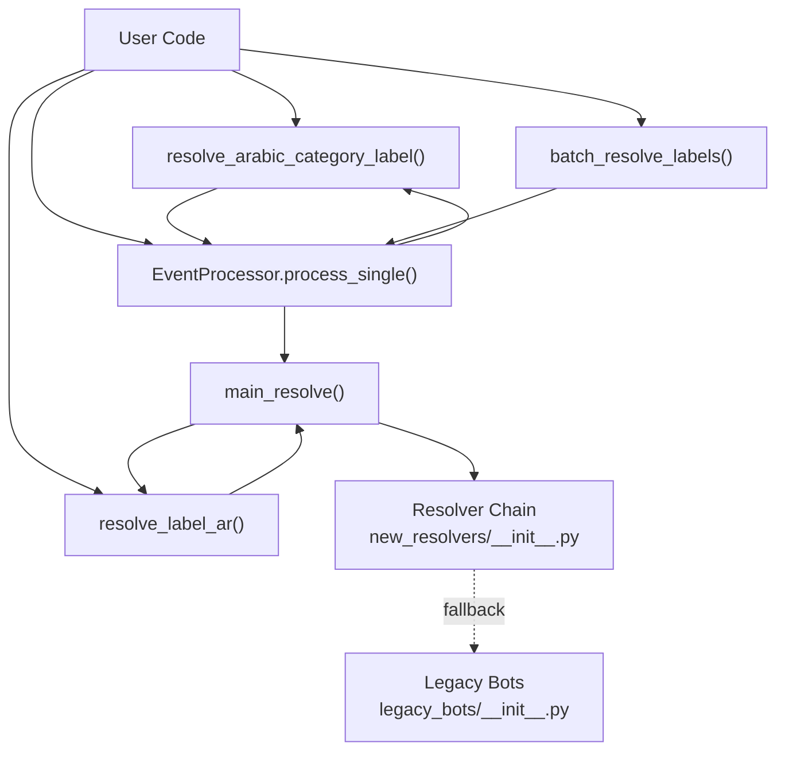
```mermaid
graph TB
    User["User Code"]

    RACL["resolve_arabic_category_label()"]
    RLA["resolve_label_ar()"]
    BRL["batch_resolve_labels()"]
    EP["EventProcessor.process_single()"]

    MR["main_resolve()"]
    RC["Resolver Chain<br/>new_resolvers/__init__.py"]
    LB["Legacy Bots<br/>legacy_bots/__init__.py"]

    User --> RACL
    User --> RLA
    User --> BRL
    User --> EP

    RACL --> EP
    RLA --> MR
    BRL --> EP

    EP --> MR
    MR --> RC
    RC -.fallback.-> LB

    MR --> RLA
    EP --> RACL
```

All four functions ultimately call `main_resolve()` from [ArWikiCats/main_processers/main_resolve.py](), which orchestrates the resolver chain.

**Sources:** [ArWikiCats/__init__.py:1-50](), [ArWikiCats/event_processing.py:1-100](), [ArWikiCats/main_processers/main_resolve.py:1-100]()

---

## Basic Usage: Single Category Translation

### Option 1: `resolve_label_ar()` - Translation Only

Use this when you only need the translated text without the prefix:

```python
from ArWikiCats import resolve_label_ar

# Returns only the translated text
label = resolve_label_ar("American basketball players")
print(label)
# Output: لاعبو كرة سلة أمريكيون

# Strips "Category:" prefix if present
label = resolve_label_ar("Category:2015 in Yemen")
print(label)
# Output: 2015 في اليمن
```

This function calls `main_resolve()` directly from [ArWikiCats/main_processers/main_resolve.py:1-50]() and returns the raw Arabic label.

**Sources:** [README.md:206-214](), [ArWikiCats/main_processers/main_resolve.py:1-50]()

### Option 2: `resolve_arabic_category_label()` - Complete Label

Use this for the full category label with the Arabic prefix:

```python
from ArWikiCats import resolve_arabic_category_label

# Returns full category with prefix
label = resolve_arabic_category_label("Category:2015 in Yemen")
print(label)
# Output: تصنيف:2015 في اليمن

# Works without the English prefix too
label = resolve_arabic_category_label("Belgian cyclists")
print(label)
# Output: تصنيف:دراجون بلجيكيون
```

This function uses `EventProcessor` from [ArWikiCats/event_processing.py:1-200]() internally and adds the `تصنيف:` prefix via `_prefix_label()`.

**Recommended**: Use this function for bot operations and Wikipedia integration.

**Sources:** [README.md:174-180](), [ArWikiCats/event_processing.py:1-200]()

---

## Batch Processing

### Using `batch_resolve_labels()`

Process multiple categories efficiently and get detailed statistics:

```python
from ArWikiCats import batch_resolve_labels

categories = [
    "Category:2015 American television",
    "Category:1999 establishments in Europe",
    "Category:Belgian cyclists",
    "Category:American basketball coaches",
]

result = batch_resolve_labels(categories)

# Access results
print(f"Successfully translated: {len(result.labels)}")
print(f"Failed to translate: {len(result.no_labels)}")
print(f"Category patterns found: {result.category_patterns}")

# Iterate through translations
for english, arabic in result.labels.items():
    print(f"{english} → {arabic}")
```

**Output structure:**

```python
BatchResult(
    labels={
        "Category:2015 American television": "تصنيف:التلفزة الأمريكية في 2015",
        "Category:Belgian cyclists": "تصنيف:دراجون بلجيكيون",
        # ...
    },
    no_labels=[
        # Categories that couldn't be translated
    ],
    category_patterns={
        "year": 1,
        "nationality": 2,
        # Pattern counts
    }
)
```

**Sources:** [README.md:184-204](), [ArWikiCats/event_processing.py]()

---

## Detailed Processing with `EventProcessor`

For advanced use cases requiring processing metadata, use the `EventProcessor` class directly:

```python
from ArWikiCats import EventProcessor

processor = EventProcessor()
result = processor.process_single("Category:British footballers")

# Access detailed information
print(f"Original: {result.original}")
print(f"Normalized: {result.normalized}")
print(f"Raw label: {result.raw_label}")
print(f"Final label: {result.final_label}")
print(f"Has label: {result.has_label}")
```

**`ProcessingResult` attributes:**

| Attribute | Type | Description |
|-----------|------|-------------|
| `original` | `str` | Original input string |
| `normalized` | `str` | Normalized category text |
| `raw_label` | `str` | Translated text without prefix |
| `final_label` | `str` | Complete Arabic category label |
| `has_label` | `bool` | Whether translation succeeded |

**Sources:** [README.md:216-229](), [ArWikiCats/event_processing.py]()

---

## How Translation Works: Complete Data Flow

The following diagram shows the complete pipeline from input to output with actual code references:

**Translation Pipeline with Code Entities:**

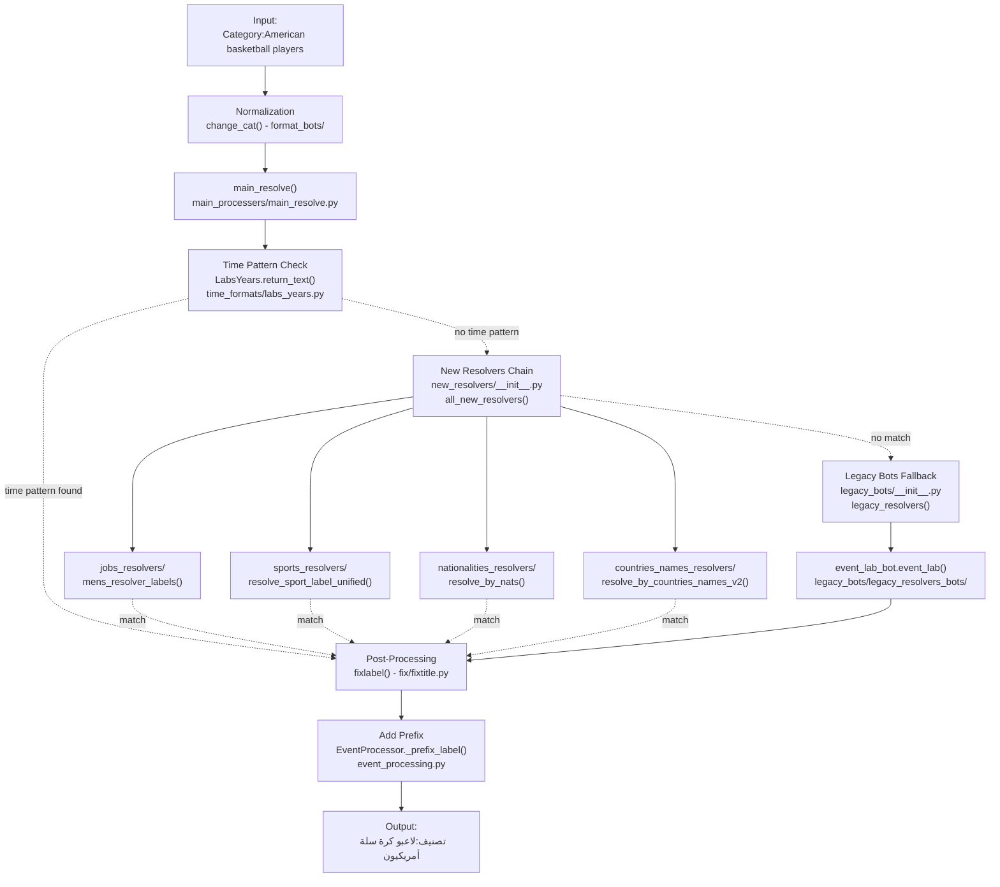
```mermaid
graph TB
    Input["Input:<br/>Category:American basketball players"]

    Norm["Normalization<br/>change_cat() - format_bots/"]

    MainResolve["main_resolve()<br/>main_processers/main_resolve.py"]

    TimeCheck["Time Pattern Check<br/>LabsYears.return_text()<br/>time_formats/labs_years.py"]

    NewResolvers["New Resolvers Chain<br/>new_resolvers/__init__.py<br/>all_new_resolvers()"]

    JobsRes["jobs_resolvers/<br/>mens_resolver_labels()"]
    SportsRes["sports_resolvers/<br/>resolve_sport_label_unified()"]
    NatsRes["nationalities_resolvers/<br/>resolve_by_nats()"]
    CountriesRes["countries_names_resolvers/<br/>resolve_by_countries_names_v2()"]

    LegacyFallback["Legacy Bots Fallback<br/>legacy_bots/__init__.py<br/>legacy_resolvers()"]

    EventLab["event_lab_bot.event_lab()<br/>legacy_bots/legacy_resolvers_bots/"]

    PostProcess["Post-Processing<br/>fixlabel() - fix/fixtitle.py"]

    AddPrefix["Add Prefix<br/>EventProcessor._prefix_label()<br/>event_processing.py"]

    Output["Output:<br/>تصنيف:لاعبو كرة سلة أمريكيون"]

    Input --> Norm
    Norm --> MainResolve
    MainResolve --> TimeCheck
    TimeCheck -.time pattern found.-> PostProcess
    TimeCheck -.no time pattern.-> NewResolvers

    NewResolvers --> JobsRes
    NewResolvers --> SportsRes
    NewResolvers --> NatsRes
    NewResolvers --> CountriesRes

    JobsRes -.match.-> PostProcess
    SportsRes -.match.-> PostProcess
    NatsRes -.match.-> PostProcess
    CountriesRes -.match.-> PostProcess

    NewResolvers -.no match.-> LegacyFallback
    LegacyFallback --> EventLab
    EventLab --> PostProcess

    PostProcess --> AddPrefix
    AddPrefix --> Output
```

**Key Processing Steps:**

1. **Normalization** - `change_cat()` from [ArWikiCats/format_bots/__init__.py]() strips prefixes and normalizes spacing
2. **Main Resolution** - `main_resolve()` from [ArWikiCats/main_processers/main_resolve.py:29-57]() orchestrates the resolver chain
3. **Time Detection** - `LabsYears.return_text()` from [ArWikiCats/time_formats/labs_years.py]() checks for year patterns first
4. **Specialized Resolvers** - `all_new_resolvers()` from [ArWikiCats/new_resolvers/__init__.py:29-57]() tries jobs → sports → nationalities → countries in order
5. **Legacy Fallback** - `legacy_resolvers()` from [ArWikiCats/legacy_bots/__init__.py:66-97]() handles remaining patterns
6. **Post-Processing** - `fixlabel()` from [ArWikiCats/fix/fixtitle.py]() applies Arabic grammar rules
7. **Prefix Addition** - `EventProcessor._prefix_label()` from [ArWikiCats/event_processing.py]() adds `تصنيف:`

**Example: "American basketball players"**
- Normalized to `"american basketball players"`
- No time pattern detected
- `all_new_resolvers()` tries resolvers in priority order
- `resolve_sport_label_unified()` matches pattern: `{nationality} {sport} players`
- Lookups: "american" → "أمريكيون", "basketball" → "كرة سلة", "players" → "لاعبو"
- Template applied: `"لاعبو {sport} {nationality}"` → `"لاعبو كرة سلة أمريكيون"`
- `fixlabel()` verifies grammar
- Output: `"تصنيف:لاعبو كرة سلة أمريكيون"`

**Sources:** [ArWikiCats/main_processers/main_resolve.py:1-100](), [ArWikiCats/new_resolvers/__init__.py:29-57](), [ArWikiCats/legacy_bots/__init__.py:66-97](), [ArWikiCats/fix/fixtitle.py](), [ArWikiCats/event_processing.py:1-150]()

---

## Running Example Scripts

ArWikiCats includes pre-configured example scripts for testing and demonstration:

```bash
# Simple demonstration of API functions
python examples/run.py

# Process larger test datasets
python examples/5k.py
```

### Example Script: `examples/run.py`

This script demonstrates various resolver functions:

```python
from ArWikiCats import resolve_arabic_category_label
from ArWikiCats.new_resolvers.sports_resolvers.raw_sports import resolve_sport_label_unified
from ArWikiCats.new_resolvers.nationalities_resolvers.nationalities_v2 import resolve_by_nats

# Try different resolvers
print(resolve_arabic_category_label("Category:2015 American television"))
print(resolve_sport_label_unified("national football"))
print(resolve_by_nats("American history"))
```

The script enables debug logging with:
```python
logging.getLogger("ArWikiCats").setLevel("DEBUG")
```

This shows detailed resolver decisions during processing.

**Sources:** [examples/run.py:1-48]()

### Test Datasets

Example datasets are located in `examples/data/`:

| Dataset | Categories | Purpose |
|---------|------------|---------|
| `5k.json` | 5,000+ | Comprehensive test cases across all resolvers |
| `novels.json` | ~50 | Literature and book categories |

These datasets contain English-Arabic category pairs for validation testing.

**Sources:** [examples/run.py:1-48](), [examples/5k.py:1-50](), [README.md:233-239]()

---

## Configuration

ArWikiCats supports configuration via environment variables. Configuration is loaded by [ArWikiCats/config.py:1-52]() using the `one_req()` helper.

### Available Configuration Options

| Environment Variable | Description | Type | Default |
|---------------------|-------------|------|---------|
| `SAVE_DATA_PATH` | Directory for saving data files | `str` | `""` (empty) |

### Configuration Access

The configuration is accessible through the `settings` object:

```python
from ArWikiCats.config import settings, app_settings

# Access configuration
save_path = app_settings.save_data_path
print(f"Data will be saved to: {save_path}")
```

### Setting Environment Variables

**Linux/macOS:**
```bash
export SAVE_DATA_PATH="/path/to/data"
python your_script.py
```

**Windows (Command Prompt):**
```cmd
set SAVE_DATA_PATH=C:\path\to\data
python your_script.py
```

**Windows (PowerShell):**
```powershell
$env:SAVE_DATA_PATH="C:\path\to\data"
python your_script.py
```

**Python code:**
```python
import os
os.environ['SAVE_DATA_PATH'] = '/path/to/data'

from ArWikiCats import resolve_label_ar
# Now uses the configured path
```

### Configuration Structure

The configuration uses a dataclass-based structure from [ArWikiCats/config.py:19-46]():

```python
@dataclass(frozen=True)
class AppConfig:
    save_data_path: str

@dataclass(frozen=True)
class Config:
    app: AppConfig

settings = Config(
    app=AppConfig(
        save_data_path=os.getenv("SAVE_DATA_PATH", ""),
    ),
)
```

This design ensures type safety and immutability of configuration values.

**Sources:** [ArWikiCats/config.py:1-52]()

---

## Common Usage Patterns

### Pattern 1: Simple Translation

```python
from ArWikiCats import resolve_label_ar

categories = ["American actors", "French films", "2020 in sports"]
for cat in categories:
    print(f"{cat} → {resolve_label_ar(cat)}")
```

### Pattern 2: Batch with Error Handling

```python
from ArWikiCats import batch_resolve_labels

result = batch_resolve_labels(large_category_list)

# Process successful translations
for en, ar in result.labels.items():
    # Store in database, write to file, etc.
    pass

# Handle failures
if result.no_labels:
    print(f"Failed to translate {len(result.no_labels)} categories:")
    for failed in result.no_labels:
        print(f"  - {failed}")
```

### Pattern 3: Detailed Processing

```python
from ArWikiCats import EventProcessor

processor = EventProcessor()

categories = get_categories_from_wikipedia()
for category in categories:
    result = processor.process_single(category)

    if result.has_label:
        # Translation succeeded
        update_category(result.original, result.final_label)
    else:
        # Log for manual review
        log_untranslated(result.original)
```

**Sources:** [README.md:170-239](), [examples/run.py](), [examples/5k.py]()

---

## Next Steps

Now that you understand the basic usage patterns, you can:

- **Explore the architecture**: See [Architecture](#3) to understand how the resolver chain works
- **Learn about translation data**: See [Translation Data](#4) for details on the 33,691+ translation entries
- **Understand the resolver chain**: See [Resolver Chain](#5) for how patterns are matched
- **Add custom translations**: See [Development Guide](#9) for extending the system

For production usage and performance tuning, consult the [Resolver Chain](#5) documentation to understand which patterns are prioritized and how to optimize for your specific use cases.

**Sources:** [README.md:27-28](), [changelog.md:1-50]()19:T7acd,# Architecture

<details>
<summary>Relevant source files</summary>

The following files were used as context for generating this wiki page:

- [.github/copilot-instructions.md](.github/copilot-instructions.md)
- [.github/workflows/python-publish.yml](.github/workflows/python-publish.yml)
- [ArWikiCats/config.py](../ArWikiCats/config.py)
- [ArWikiCats/jsons/population/pop_All_2018.json](../ArWikiCats/jsons/population/pop_All_2018.json)
- [ArWikiCats/main_processers/main_resolve.py](../ArWikiCats/main_processers/main_resolve.py)
- [CLAUDE.md](CLAUDE.md)
- [README.md](README.md)
- [changelog.md](changelog.md)
- [tests_require_fixes/test_papua_new_guinean.py](tests_require_fixes/test_papua_new_guinean.py)
- [tests_require_fixes/test_skip_data_all.py](tests_require_fixes/test_skip_data_all.py)
- [tests_require_fixes/text_to_fix.py](tests_require_fixes/text_to_fix.py)

</details>


This page describes the overall system architecture of ArWikiCats. The system translates English Wikipedia category labels to Arabic through a five-layer architecture: a public API layer, a main resolution engine, a prioritized resolver chain, a template formatting engine, and a translation data layer.

For detailed information about specific subsystems, see the child pages: page 3.1 (Resolution Pipeline), page 3.2 (Data Architecture), and page 3.3 (Resolver Chain Priority System).

## System Architecture Overview

ArWikiCats implements a five-layer architecture that processes category labels through specialized resolvers and formatting engines:

**Diagram: Complete System Architecture**

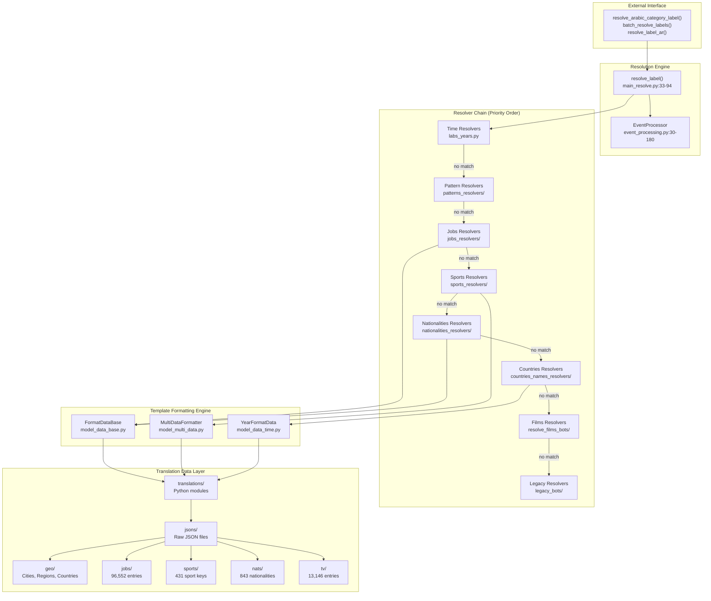
```mermaid
graph TB
    subgraph API["External Interface"]
        PublicAPI["resolve_arabic_category_label()<br/>batch_resolve_labels()<br/>resolve_label_ar()"]
    end

    subgraph Engine["Resolution Engine"]
        MainResolver["resolve_label()<br/>main_resolve.py:33-94"]
        EventProcessor["EventProcessor<br/>event_processing.py:30-180"]
    end

    subgraph Chain["Resolver Chain (Priority Order)"]
        Time["Time Resolvers<br/>labs_years.py"]
        Pattern["Pattern Resolvers<br/>patterns_resolvers/"]
        Jobs["Jobs Resolvers<br/>jobs_resolvers/"]
        Sports["Sports Resolvers<br/>sports_resolvers/"]
        Nats["Nationalities Resolvers<br/>nationalities_resolvers/"]
        Countries["Countries Resolvers<br/>countries_names_resolvers/"]
        Films["Films Resolvers<br/>resolve_films_bots/"]
        Legacy["Legacy Resolvers<br/>legacy_bots/"]
    end

    subgraph Formatting["Template Formatting Engine"]
        FormatBase["FormatDataBase<br/>model_data_base.py"]
        Multi["MultiDataFormatter<br/>model_multi_data.py"]
        Year["YearFormatData<br/>model_data_time.py"]
    end

    subgraph Data["Translation Data Layer"]
        Translations["translations/<br/>Python modules"]
        JSONData["jsons/<br/>Raw JSON files"]

        Geo["geo/<br/>Cities, Regions, Countries"]
        JobsData["jobs/<br/>96,552 entries"]
        SportsData["sports/<br/>431 sport keys"]
        NatsData["nats/<br/>843 nationalities"]
        FilmsData["tv/<br/>13,146 entries"]
    end

    PublicAPI --> MainResolver
    MainResolver --> EventProcessor
    MainResolver --> Time
    Time -->|no match| Pattern
    Pattern -->|no match| Jobs
    Jobs -->|no match| Sports
    Sports -->|no match| Nats
    Nats -->|no match| Countries
    Countries -->|no match| Films
    Films -->|no match| Legacy

    Jobs --> FormatBase
    Sports --> Multi
    Nats --> FormatBase
    Countries --> Year

    FormatBase --> Translations
    Multi --> Translations
    Year --> Translations

    Translations --> JSONData
    JSONData --> Geo
    JSONData --> JobsData
    JSONData --> SportsData
    JSONData --> NatsData
    JSONData --> FilmsData
```

**Sources:** [ArWikiCats/main_processers/main_resolve.py:1-106](), [ArWikiCats/__init__.py:1-42](), [ArWikiCats/event_processing.py:1-180](), [ArWikiCats/new_resolvers/__init__.py:1-57]()

## Layer 1: External Interface (Public API)

The public API provides entry points for category translation. All functions are exported from `ArWikiCats/__init__.py`.

**Diagram: Public API Functions**

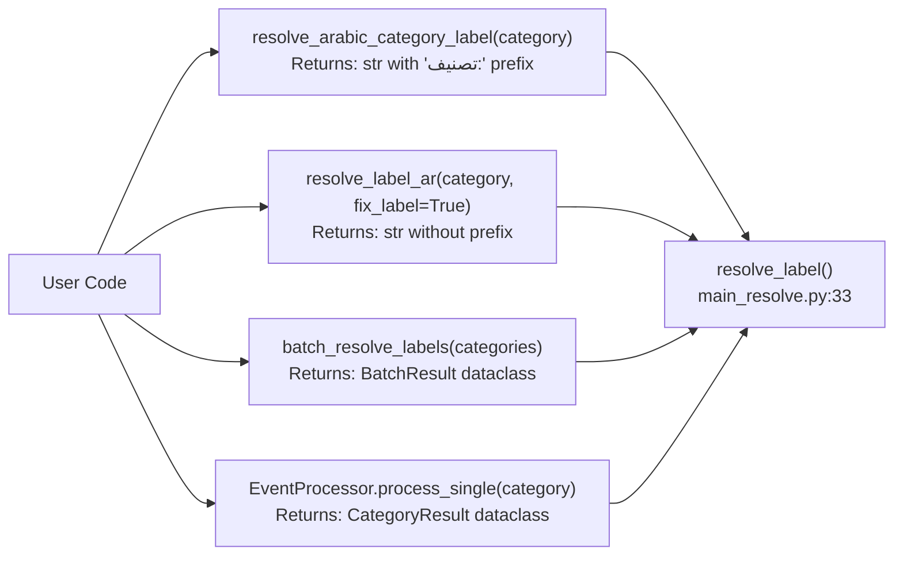
```mermaid
graph LR
    User["User Code"] --> API1["resolve_arabic_category_label(category)<br/>Returns: str with 'تصنيف:' prefix"]
    User --> API2["resolve_label_ar(category, fix_label=True)<br/>Returns: str without prefix"]
    User --> API3["batch_resolve_labels(categories)<br/>Returns: BatchResult dataclass"]
    User --> API4["EventProcessor.process_single(category)<br/>Returns: CategoryResult dataclass"]

    API1 --> Core["resolve_label()<br/>main_resolve.py:33"]
    API2 --> Core
    API3 --> Core
    API4 --> Core
```

| Function | Location | Purpose | Return Type |
|----------|----------|---------|-------------|
| `resolve_label_ar()` | `main_resolve.py:96-99` | Translate single category without prefix | `str` |
| `resolve_arabic_category_label()` | `__init__.py:19-24` | Translate with "تصنيف:" prefix | `str` |
| `batch_resolve_labels()` | `__init__.py:27-32` | Process multiple categories | `BatchResult` |
| `EventProcessor.process_single()` | `event_processing.py:67-111` | Detailed processing with metadata | `CategoryResult` |

**Sources:** [ArWikiCats/__init__.py:1-42](), [ArWikiCats/main_processers/main_resolve.py:96-99](), [ArWikiCats/event_processing.py:67-111]()

## Layer 2: Resolution Engine

The resolution engine coordinates category processing through `resolve_label()` in `main_resolve.py`. This function implements the waterfall resolver pattern with early exit on first match.

**Diagram: Resolution Engine Flow**

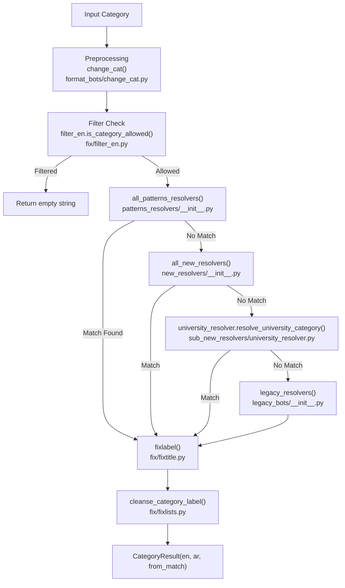
```mermaid
graph TB
    Input["Input Category"] --> Preprocess["Preprocessing<br/>change_cat()<br/>format_bots/change_cat.py"]
    Preprocess --> Filter["Filter Check<br/>filter_en.is_category_allowed()<br/>fix/filter_en.py"]
    Filter -->|"Filtered"| Empty["Return empty string"]
    Filter -->|"Allowed"| Patterns["all_patterns_resolvers()<br/>patterns_resolvers/__init__.py"]

    Patterns -->|"Match Found"| FixLabel["fixlabel()<br/>fix/fixtitle.py"]
    Patterns -->|"No Match"| NewResolvers["all_new_resolvers()<br/>new_resolvers/__init__.py"]

    NewResolvers -->|"Match"| FixLabel
    NewResolvers -->|"No Match"| University["university_resolver.resolve_university_category()<br/>sub_new_resolvers/university_resolver.py"]

    University -->|"Match"| FixLabel
    University -->|"No Match"| LegacyResolvers["legacy_resolvers()<br/>legacy_bots/__init__.py"]

    LegacyResolvers --> FixLabel
    FixLabel --> Cleanse["cleanse_category_label()<br/>fix/fixlists.py"]
    Cleanse --> Result["CategoryResult(en, ar, from_match)"]
```

The `resolve_label()` function is cached with `@functools.lru_cache(maxsize=50000)` for performance. Each category is processed once and cached for subsequent requests.

**Sources:** [ArWikiCats/main_processers/main_resolve.py:33-94](), [ArWikiCats/format_bots/change_cat.py:1-25](), [ArWikiCats/fix/filter_en.py:1-50](), [ArWikiCats/fix/fixtitle.py:1-150]()

## Layer 3: Resolver Chain (Priority Order)

The resolver chain processes categories through specialized resolvers in priority order. This ordering prevents conflicts where multiple resolvers could match the same pattern.

**Diagram: Resolver Chain Priority**

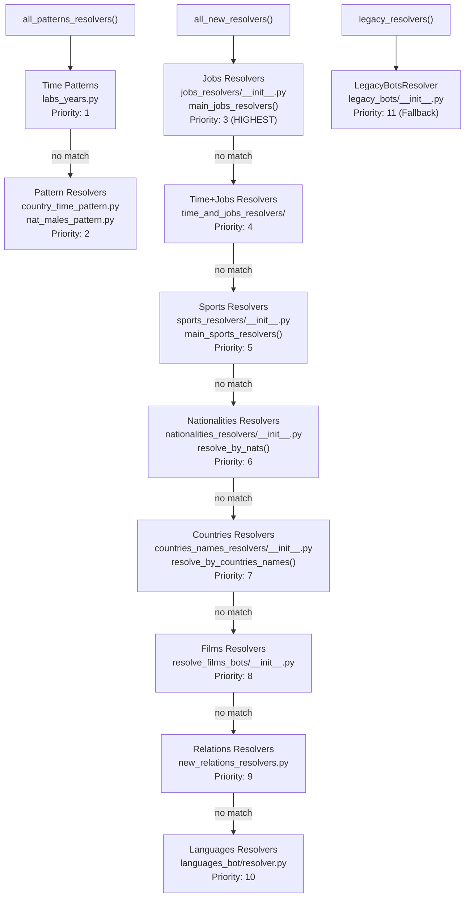
```mermaid
graph TB
    Start["all_patterns_resolvers()"] --> P1["Time Patterns<br/>labs_years.py<br/>Priority: 1"]
    P1 -->|"no match"| P2["Pattern Resolvers<br/>country_time_pattern.py<br/>nat_males_pattern.py<br/>Priority: 2"]

    Start2["all_new_resolvers()"] --> N1["Jobs Resolvers<br/>jobs_resolvers/__init__.py<br/>main_jobs_resolvers()<br/>Priority: 3 (HIGHEST)"]
    N1 -->|"no match"| N2["Time+Jobs Resolvers<br/>time_and_jobs_resolvers/<br/>Priority: 4"]
    N2 -->|"no match"| N3["Sports Resolvers<br/>sports_resolvers/__init__.py<br/>main_sports_resolvers()<br/>Priority: 5"]
    N3 -->|"no match"| N4["Nationalities Resolvers<br/>nationalities_resolvers/__init__.py<br/>resolve_by_nats()<br/>Priority: 6"]
    N4 -->|"no match"| N5["Countries Resolvers<br/>countries_names_resolvers/__init__.py<br/>resolve_by_countries_names()<br/>Priority: 7"]
    N5 -->|"no match"| N6["Films Resolvers<br/>resolve_films_bots/__init__.py<br/>Priority: 8"]
    N6 -->|"no match"| N7["Relations Resolvers<br/>new_relations_resolvers.py<br/>Priority: 9"]
    N7 -->|"no match"| N8["Languages Resolvers<br/>languages_bot/resolver.py<br/>Priority: 10"]

    Start3["legacy_resolvers()"] --> L1["LegacyBotsResolver<br/>legacy_bots/__init__.py<br/>Priority: 11 (Fallback)"]
```

The priority ordering is critical to prevent mismatches. For example:

- **Jobs before Sports**: "football manager" could match sports ("football") or jobs ("manager"). Jobs wins to correctly identify it as a management position.
- **Nationalities before Countries**: "Italy political leader" should resolve as nationality-based ("قادة سياسيون إيطاليون") not country-based ("قادة إيطاليا السياسيون").

**Sources:** [ArWikiCats/new_resolvers/__init__.py:1-57](), [ArWikiCats/patterns_resolvers/__init__.py:1-30](), [ArWikiCats/legacy_bots/__init__.py:29-57]()

## Layer 4: Template Formatting Engine

The template formatting engine implements pattern matching and placeholder replacement using a class hierarchy rooted in `FormatDataBase`.

**Diagram: Template Formatting Class Hierarchy**

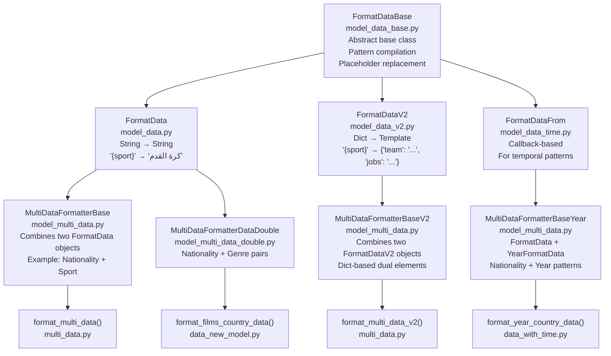
```mermaid
graph TB
    Base["FormatDataBase<br/>model_data_base.py<br/>Abstract base class<br/>Pattern compilation<br/>Placeholder replacement"]

    Base --> Single1["FormatData<br/>model_data.py<br/>String → String<br/>'{sport}' → 'كرة القدم'"]
    Base --> Single2["FormatDataV2<br/>model_data_v2.py<br/>Dict → Template<br/>'{sport}' → {'team': '...', 'jobs': '...'}"]
    Base --> Single3["FormatDataFrom<br/>model_data_time.py<br/>Callback-based<br/>For temporal patterns"]

    Single1 --> Multi1["MultiDataFormatterBase<br/>model_multi_data.py<br/>Combines two FormatData objects<br/>Example: Nationality + Sport"]
    Single2 --> Multi2["MultiDataFormatterBaseV2<br/>model_multi_data.py<br/>Combines two FormatDataV2 objects<br/>Dict-based dual elements"]
    Single3 --> Multi3["MultiDataFormatterBaseYear<br/>model_multi_data.py<br/>FormatData + YearFormatData<br/>Nationality + Year patterns"]
    Single1 --> Multi4["MultiDataFormatterDataDouble<br/>model_multi_data_double.py<br/>Nationality + Genre pairs"]

    Multi1 --> Factory1["format_multi_data()<br/>multi_data.py"]
    Multi2 --> Factory2["format_multi_data_v2()<br/>multi_data.py"]
    Multi3 --> Factory3["format_year_country_data()<br/>data_with_time.py"]
    Multi4 --> Factory4["format_films_country_data()<br/>data_new_model.py"]
```

Each formatter provides:
- Pattern compilation: Regex patterns with case-insensitive matching
- Placeholder substitution: `{sport}` → `{sport_ar}` with Arabic translations
- Result caching: `@lru_cache` on search methods
- Label reordering: Ensures grammatically correct Arabic

**Example Flow:**
```
Input: "british football players"
1. Match pattern: "{nat} {sport} players"
2. Extract: nat="british", sport="football"
3. Lookup: nat_ar="بريطانيون", sport_ar="كرة القدم"
4. Template: "لاعبو {sport} {nat}"
5. Output: "لاعبو كرة القدم بريطانيون"
```

**Sources:** [ArWikiCats/translations_formats/DataModel/model_data_base.py:1-150](), [ArWikiCats/translations_formats/DataModel/model_multi_data.py:1-400](), [ArWikiCats/translations_formats/multi_data.py:1-100]()

## Layer 5: Translation Data Layer

The translation data layer provides domain-specific translation mappings. Raw JSON files are processed by Python aggregator modules that build lookup tables.

**Diagram: Translation Data Aggregation**

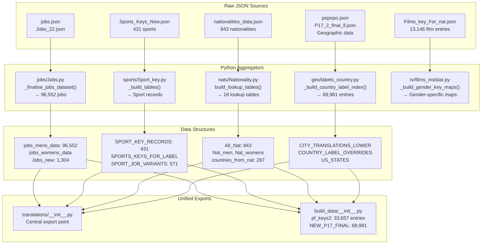
```mermaid
graph TB
    subgraph Raw["Raw JSON Sources"]
        J1["jobs.json<br/>Jobs_22.json"]
        J2["Sports_Keys_New.json<br/>431 sports"]
        J3["nationalities_data.json<br/>843 nationalities"]
        J4["popopo.json<br/>P17_2_final_ll.json<br/>Geographic data"]
        J5["Films_key_For_nat.json<br/>13,146 film entries"]
    end

    subgraph Aggregators["Python Aggregators"]
        A1["jobs/Jobs.py<br/>_finalise_jobs_dataset()<br/>→ 96,552 jobs"]
        A2["sports/Sport_key.py<br/>_build_tables()<br/>→ Sport records"]
        A3["nats/Nationality.py<br/>build_lookup_tables()<br/>→ 18 lookup tables"]
        A4["geo/labels_country.py<br/>_build_country_label_index()<br/>→ 68,981 entries"]
        A5["tv/films_mslslat.py<br/>_build_gender_key_maps()<br/>→ Gender-specific maps"]
    end

    subgraph Exports["Unified Exports"]
        E1["translations/__init__.py<br/>Central export point"]
        E2["build_data/__init__.py<br/>pf_keys2: 33,657 entries<br/>NEW_P17_FINAL: 68,981"]
    end

    subgraph Structures["Data Structures"]
        S1["jobs_mens_data: 96,552<br/>jobs_womens_data<br/>Jobs_new: 1,304"]
        S2["SPORT_KEY_RECORDS: 431<br/>SPORTS_KEYS_FOR_LABEL<br/>SPORT_JOB_VARIANTS: 571"]
        S3["All_Nat: 843<br/>Nat_men, Nat_womens<br/>countries_from_nat: 287"]
        S4["CITY_TRANSLATIONS_LOWER<br/>COUNTRY_LABEL_OVERRIDES<br/>US_STATES"]
    end

    J1 --> A1
    J2 --> A2
    J3 --> A3
    J4 --> A4
    J5 --> A5

    A1 --> S1
    A2 --> S2
    A3 --> S3
    A4 --> S4

    S1 --> E1
    S2 --> E1
    S3 --> E1
    S4 --> E1

    S1 --> E2
    S2 --> E2
    S3 --> E2
    S4 --> E2
```

| Domain | Raw JSON Location | Python Module | Exported Data Structures | Size |
|--------|-------------------|---------------|-------------------------|------|
| Jobs | `jsons/jobs/` | `translations/jobs/Jobs.py` | `jobs_mens_data`, `jobs_womens_data` | 96,552 + ~40,000 |
| Sports | `jsons/sports/` | `translations/sports/Sport_key.py` | `SPORT_KEY_RECORDS`, `SPORT_JOB_VARIANTS` | 431 + 571 |
| Nationalities | `jsons/nationalities/` | `translations/nats/Nationality.py` | `All_Nat`, 18 lookup tables | 843 entries |
| Geography | `jsons/geography/` | `translations/geo/labels_country.py` | `NEW_P17_FINAL`, `CITY_TRANSLATIONS` | 68,981 + 10,526 |
| Films/TV | `jsons/media/` | `translations/tv/films_mslslat.py` | `Films_key_For_nat`, gender-specific maps | 13,146 |
| Politics | `jsons/keys/` | `translations/politics/ministers_keys.py` | `ministers_keys` | ~94 |

The system maintains two export layers:
1. **Direct exports** via `translations/__init__.py` for immediate use by resolvers
2. **Aggregated exports** via `build_data/__init__.py` for combined datasets (e.g., `pf_keys2` with 33,657 entries)

**Sources:** [ArWikiCats/translations/__init__.py:1-50](), [ArWikiCats/translations/jobs/Jobs.py:1-200](), [ArWikiCats/translations/sports/Sport_key.py:1-150](), [ArWikiCats/translations/nats/Nationality.py:1-300]()

## Core Design Patterns

### Waterfall Resolver Pattern with Early Exit

The resolution engine implements a waterfall pattern where resolvers are tried in sequence until one succeeds:

```python
# From main_resolve.py:72-82
category_lab = all_patterns_resolvers(changed_cat)
from_match = bool(category_lab)

if not category_lab:
    category_lab = (
        ""
        or all_new_resolvers(changed_cat)
        or university_resolver.resolve_university_category(changed_cat)
        or legacy_resolvers(changed_cat)
        or ""
    )
```

This pattern ensures:
1. Unambiguous patterns resolve first (years, decades, centuries)
2. High-frequency patterns prioritized (jobs before sports)
3. Expensive lookups deferred (legacy resolvers last)
4. Deterministic resolution order prevents conflicts

**Sources:** [ArWikiCats/main_processers/main_resolve.py:72-82]()

### Caching Strategy

The system implements multi-level caching to optimize performance:

| Cache Level | Implementation | Location | Benefit |
|-------------|----------------|----------|---------|
| Function-level | `@functools.lru_cache(maxsize=50000)` | `main_resolve.py:32` | 50,000 category results cached |
| Resolver-level | `@functools.lru_cache(maxsize=None)` | Individual resolvers | Unlimited resolver-specific cache |
| Pattern-level | Compiled regex cache | `FormatDataBase` classes | Regex compilation avoided |
| Data-level | Module-level dictionaries | `translations/` modules | Instant lookup vs. file I/O |

**Example:**
```python
# From main_resolve.py:32-33
@functools.lru_cache(maxsize=50000)
def resolve_label(category: str, fix_label: bool = True) -> CategoryResult:
```

First call processes through entire resolver chain (~10-50ms). Subsequent calls retrieve from cache (<1ms).

**Sources:** [ArWikiCats/main_processers/main_resolve.py:32-33](), [changelog.md:277]()

### Domain-Driven Data Organization

Translation data is organized by semantic domain rather than technical structure:

```
translations/
├── jobs/                   # Occupations and professions
│   ├── Jobs.py            # jobs_mens_data, jobs_womens_data
│   ├── activists_jobs.py  # Activism-specific roles
│   └── religious_jobs.py  # Religious positions
├── sports/                 # Sports and teams
│   ├── Sport_key.py       # SPORT_KEY_RECORDS
│   └── sub_teams.py       # Team-specific mappings
├── nats/                   # Nationalities
│   └── Nationality.py     # All_Nat, 18 lookup tables
├── geo/                    # Geographic entities
│   ├── labels_country.py  # Country names
│   └── labels_city.py     # City names
└── tv/                     # Films and television
    └── films_mslslat.py   # Genre and nationality patterns
```

Each domain maintains:
- Python dictionaries for frequently-accessed data (loaded at import time)
- JSON files for large datasets in `jsons/` directory
- Aggregator functions that process raw JSON into structured lookups

**Sources:** [ArWikiCats/translations/__init__.py:1-50](), [README.md:90-113]()


## Component Interaction Example

The following sequence diagram shows how a category flows through the system:

**Diagram: Resolution Sequence for "2010 British football players"**

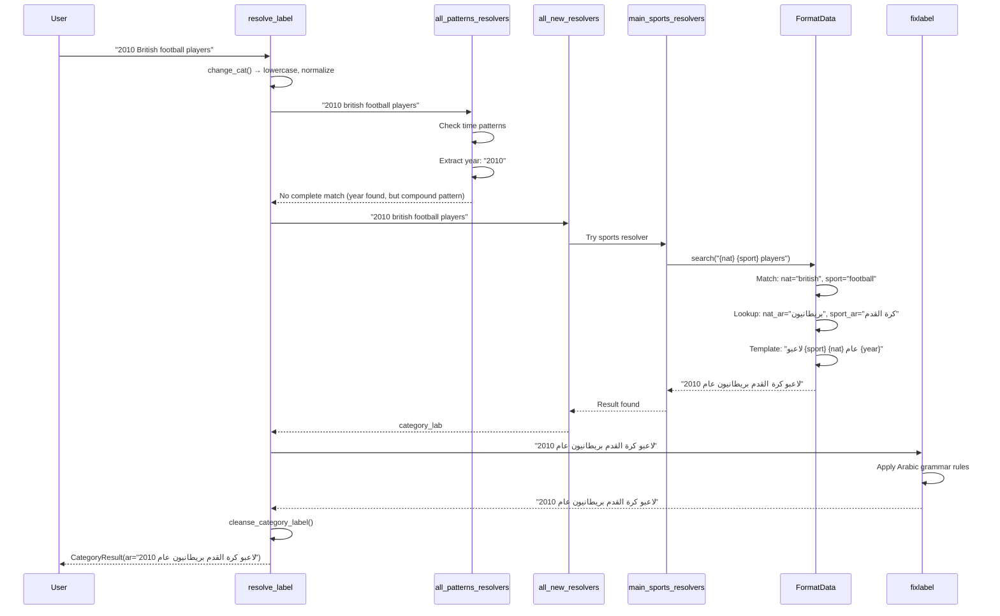
```mermaid
sequenceDiagram
    participant User
    participant resolve_label
    participant all_patterns_resolvers
    participant all_new_resolvers
    participant main_sports_resolvers
    participant FormatData
    participant fixlabel

    User->>resolve_label: "2010 British football players"
    resolve_label->>resolve_label: change_cat() → lowercase, normalize
    resolve_label->>all_patterns_resolvers: "2010 british football players"
    all_patterns_resolvers->>all_patterns_resolvers: Check time patterns
    all_patterns_resolvers->>all_patterns_resolvers: Extract year: "2010"
    all_patterns_resolvers-->>resolve_label: No complete match (year found, but compound pattern)

    resolve_label->>all_new_resolvers: "2010 british football players"
    all_new_resolvers->>main_sports_resolvers: Try sports resolver
    main_sports_resolvers->>FormatData: search("{nat} {sport} players")
    FormatData->>FormatData: Match: nat="british", sport="football"
    FormatData->>FormatData: Lookup: nat_ar="بريطانيون", sport_ar="كرة القدم"
    FormatData->>FormatData: Template: "لاعبو {sport} {nat} عام {year}"
    FormatData-->>main_sports_resolvers: "لاعبو كرة القدم بريطانيون عام 2010"
    main_sports_resolvers-->>all_new_resolvers: Result found
    all_new_resolvers-->>resolve_label: category_lab

    resolve_label->>fixlabel: "لاعبو كرة القدم بريطانيون عام 2010"
    fixlabel->>fixlabel: Apply Arabic grammar rules
    fixlabel-->>resolve_label: "لاعبو كرة القدم بريطانيون عام 2010"

    resolve_label->>resolve_label: cleanse_category_label()
    resolve_label-->>User: CategoryResult(ar="لاعبو كرة القدم بريطانيون عام 2010")
```

**Sources:** [ArWikiCats/main_processers/main_resolve.py:33-94](), [ArWikiCats/new_resolvers/__init__.py:1-57](), [ArWikiCats/translations_formats/DataModel/model_data_base.py:1-150]()

## Data Flow Pipeline

The translation pipeline processes categories through six stages:

**Diagram: Complete Data Flow Pipeline**

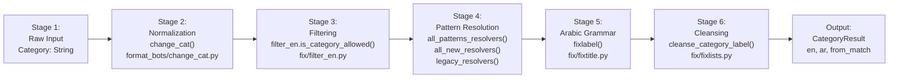
```mermaid
graph LR
    S1["Stage 1:<br/>Raw Input<br/>Category: String"] --> S2["Stage 2:<br/>Normalization<br/>change_cat()<br/>format_bots/change_cat.py"]
    S2 --> S3["Stage 3:<br/>Filtering<br/>filter_en.is_category_allowed()<br/>fix/filter_en.py"]
    S3 --> S4["Stage 4:<br/>Pattern Resolution<br/>all_patterns_resolvers()<br/>all_new_resolvers()<br/>legacy_resolvers()"]
    S4 --> S5["Stage 5:<br/>Arabic Grammar<br/>fixlabel()<br/>fix/fixtitle.py"]
    S5 --> S6["Stage 6:<br/>Cleansing<br/>cleanse_category_label()<br/>fix/fixlists.py"]
    S6 --> Output["Output:<br/>CategoryResult<br/>en, ar, from_match"]
```

### Stage 1: Raw Input

Input categories may include:
- Wikipedia category syntax: "Category:British footballers"
- Plain text: "British footballers"
- With year prefixes: "2010 British footballers"
- Complex patterns: "21st-century British football managers"

### Stage 2: Normalization

The `change_cat()` function in [ArWikiCats/format_bots/change_cat.py:1-25]() applies:
- Lowercase conversion
- Underscore to space: "British_footballers" → "british footballers"
- "Category:" prefix removal
- Whitespace normalization
- Key mappings: "labor" → "labour", "womens" → "female"

### Stage 3: Filtering

The `filter_en.is_category_allowed()` function in [ArWikiCats/fix/filter_en.py:1-50]() rejects categories containing blocked terms or patterns. Filtered categories return an empty Arabic label.

### Stage 4: Pattern Resolution

This stage attempts resolvers in priority order:
1. `all_patterns_resolvers()` - Time patterns and complex patterns
2. `all_new_resolvers()` - Domain-specific resolvers (jobs, sports, nats, countries, films)
3. `university_resolver.resolve_university_category()` - University-specific patterns
4. `legacy_resolvers()` - Legacy bot fallback

Each resolver returns on first match (early exit pattern).

### Stage 5: Arabic Grammar

The `fixlabel()` function in [ArWikiCats/fix/fixtitle.py:1-150]() applies:
- Article agreement: Proper handling of "ال" prefix
- Preposition insertion: Add "في" or "من" based on English separators
- Duplicate removal: Prevent "في في" patterns
- Gender-specific adjustments
- Final formatting cleanup

### Stage 6: Cleansing

The `cleanse_category_label()` function in [ArWikiCats/fix/fixlists.py:1-100]() performs final cleanup:
- Remove trailing colons
- Normalize whitespace
- Remove empty translations
- Ensure consistent output format

**Sources:** [ArWikiCats/main_processers/main_resolve.py:33-94](), [ArWikiCats/format_bots/change_cat.py:1-25](), [ArWikiCats/fix/filter_en.py:1-50](), [ArWikiCats/fix/fixtitle.py:1-150](), [ArWikiCats/fix/fixlists.py:1-100]()

## Module Organization

The codebase exhibits a **modular architecture** with clear separation of concerns:

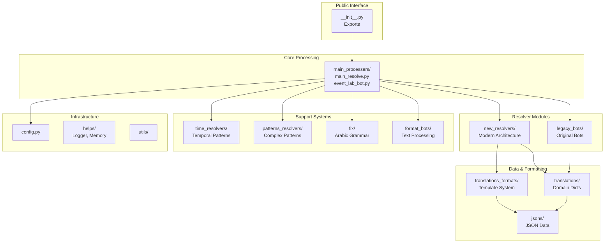
```mermaid
graph TB
    subgraph "Public Interface"
        INIT["__init__.py<br/>Exports"]
    end

    subgraph "Core Processing"
        MAIN["main_processers/<br/>main_resolve.py<br/>event_lab_bot.py"]
    end

    subgraph "Resolver Modules"
        NEW["new_resolvers/<br/>Modern Architecture"]
        LEGACY["legacy_bots/<br/>Original Bots"]
    end

    subgraph "Support Systems"
        TIME["time_resolvers/<br/>Temporal Patterns"]
        PATTERNS["patterns_resolvers/<br/>Complex Patterns"]
        FIX["fix/<br/>Arabic Grammar"]
        FORMAT_BOTS["format_bots/<br/>Text Processing"]
    end

    subgraph "Data & Formatting"
        TRANS["translations/<br/>Domain Dicts"]
        FORMATS["translations_formats/<br/>Template System"]
        JSONS["jsons/<br/>JSON Data"]
    end

    subgraph "Infrastructure"
        CONFIG["config.py"]
        HELPS["helps/<br/>Logger, Memory"]
        UTILS["utils/"]
    end

    INIT --> MAIN
    MAIN --> NEW
    MAIN --> LEGACY
    MAIN --> TIME
    MAIN --> PATTERNS
    MAIN --> FIX

    NEW --> TRANS
    NEW --> FORMATS
    LEGACY --> TRANS

    FORMATS --> JSONS
    TRANS --> JSONS

    MAIN --> CONFIG
    MAIN --> FORMAT_BOTS
```

**Sources:** [README.md:349-445]()

### Directory Structure and Responsibilities

| Directory | Responsibility | Key Files | Lines of Code Est. |
|-----------|----------------|-----------|-------------------|
| `main_processers/` | Orchestration and main entry point | `main_resolve.py`, `event_lab_bot.py` | ~700 |
| `new_resolvers/` | Modern resolver implementations | `reslove_all.py`, domain-specific modules | ~3,000 |
| `legacy_bots/` | Original bot implementations | `ma_bots/`, `make_bots/` | ~5,000 |
| `translations/` | Translation data (Python dicts) | `geo/`, `jobs/`, `nats/`, `sports/`, `tv/` | ~2,000 |
| `translations_formats/` | Template formatting framework | `DataModel/`, `multi_data.py` | ~1,500 |
| `time_resolvers/` | Temporal pattern handling | `labs_years.py`, `time_to_arabic.py` | ~800 |
| `patterns_resolvers/` | Complex pattern matchers | `country_time_pattern.py`, `nat_men_pattern.py` | ~600 |
| `fix/` | Arabic text corrections | `fixtitle.py`, `fixlists.py` | ~400 |
| `jsons/` | JSON data files | 8 domain subdirectories | N/A (data) |
| `helps/` | Infrastructure utilities | `log.py`, `memory.py` | ~300 |

**Sources:** [README.md:349-445](), [changelog.md:1-750]()

## Architectural Evolution: Legacy vs. Modern Resolvers

The codebase contains two resolver architectures that coexist:

**Legacy Architecture** (`legacy_bots/`):
- Located in [ArWikiCats/legacy_bots/]()
- Organized around bot scripts with mixed concerns
- Direct dictionary lookups without abstraction
- Monolithic functions handling multiple patterns
- Called as last fallback via `legacy_resolvers()` function
- Recently refactored from `RESOLVER_PIPELINE` list to `LegacyBotsResolver` class

**Modern Architecture** (`new_resolvers/`):
- Located in [ArWikiCats/new_resolvers/]()
- Domain-specific modules (jobs, sports, nationalities, countries, films)
- Template-based formatting via `FormatData` classes
- Composition over inheritance
- Clear separation: resolver logic, data access, formatting
- Called via `all_new_resolvers()` function with priority ordering

**Diagram: Dual Architecture**

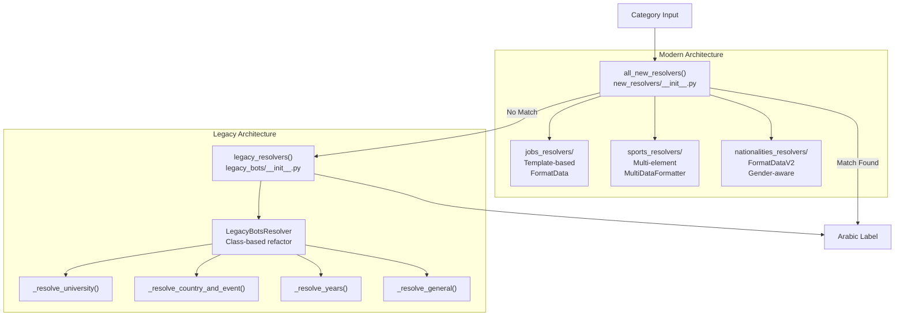
```mermaid
graph TB
    Input["Category Input"] --> Modern["all_new_resolvers()<br/>new_resolvers/__init__.py"]
    Modern -->|"Match Found"| Output["Arabic Label"]
    Modern -->|"No Match"| Legacy["legacy_resolvers()<br/>legacy_bots/__init__.py"]
    Legacy --> Output

    subgraph ModernArch["Modern Architecture"]
        Modern --> Jobs["jobs_resolvers/<br/>Template-based<br/>FormatData"]
        Modern --> Sports["sports_resolvers/<br/>Multi-element<br/>MultiDataFormatter"]
        Modern --> Nats["nationalities_resolvers/<br/>FormatDataV2<br/>Gender-aware"]
    end

    subgraph LegacyArch["Legacy Architecture"]
        Legacy --> LegacyBots["LegacyBotsResolver<br/>Class-based refactor"]
        LegacyBots --> Univ["_resolve_university()"]
        LegacyBots --> Country["_resolve_country_and_event()"]
        LegacyBots --> Years["_resolve_years()"]
        LegacyBots --> General["_resolve_general()"]
    end
```

The legacy architecture was recently refactored (changelog.md:170-200) from a list-based `RESOLVER_PIPELINE` to a class-based `LegacyBotsResolver` for better maintainability, but both architectures remain active to preserve existing translation coverage.

**Sources:** [ArWikiCats/new_resolvers/__init__.py:1-57](), [ArWikiCats/legacy_bots/__init__.py:1-200](), [changelog.md:170-200]()

## Configuration System

The configuration system uses frozen dataclasses that read from environment variables and command-line arguments.

**Diagram: Configuration Architecture**

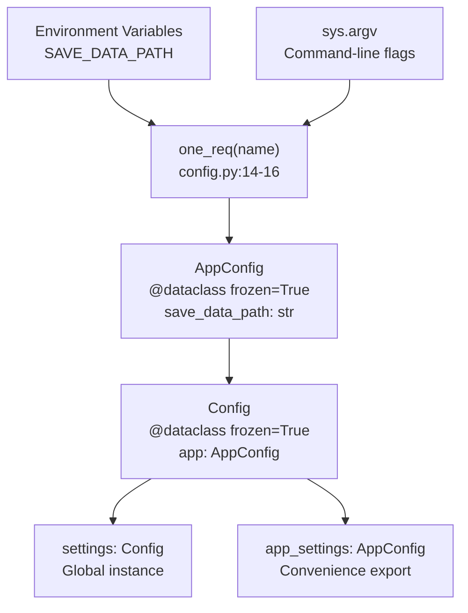
```mermaid
graph TB
    Env["Environment Variables<br/>SAVE_DATA_PATH"]
    Args["sys.argv<br/>Command-line flags"]

    Env --> OneReq["one_req(name)<br/>config.py:14-16"]
    Args --> OneReq

    OneReq --> AppConfig["AppConfig<br/>@dataclass frozen=True<br/>save_data_path: str"]

    AppConfig --> Config["Config<br/>@dataclass frozen=True<br/>app: AppConfig"]

    Config --> Settings["settings: Config<br/>Global instance"]
    Config --> AppSettings["app_settings: AppConfig<br/>Convenience export"]
```

**Configuration Options:**

| Setting | Type | Default | Source | Purpose |
|---------|------|---------|--------|---------|
| `SAVE_DATA_PATH` | str | `""` | Environment variable | Path to save temporary data files |

**Usage:**

```python
from ArWikiCats.config import app_settings

# Access configuration
if app_settings.save_data_path:
    save_to_path(app_settings.save_data_path)
```

The configuration is immutable (`frozen=True`) to prevent accidental modification during runtime.

**Sources:** [ArWikiCats/config.py:1-52]()

## Performance Characteristics

### Caching Strategy

The system achieves sub-second processing through multi-level caching:

```python
# From main_resolve.py:32-33
@functools.lru_cache(maxsize=50000)
def resolve_label(category: str, fix_label: bool = True) -> CategoryResult:
    """Cached for entire program lifetime."""
```

**Performance Metrics:**
- First call: 10-50ms (full resolver chain)
- Cached call: <1ms (dictionary lookup)
- Batch processing: 5,000 categories in ~5-10 seconds with warm cache

The 50,000 entry cache limit accommodates large-scale batch processing workflows.

### Memory Footprint

Memory consumption was optimized from 2GB to <100MB through:
- Module-level data loading (load once at import time)
- Lazy JSON loading for large datasets
- Bounded LRU caches (`maxsize=50000` on main resolver)
- Frozen dataclasses instead of mutable dictionaries

**Sources:** [ArWikiCats/main_processers/main_resolve.py:32-33](), [README.md:499-502]()

## Architectural Trade-offs

### Resolver Chain Depth vs. Accuracy

The system prioritizes **accuracy over speed** by attempting up to 7 different resolvers before falling back to general translation. This ensures high-quality results but increases latency for rare patterns.

**Mitigation:** Aggressive caching means expensive resolution happens only once per unique category.

### Python Dicts vs. Database

Translation data lives in **Python dictionaries and JSON files** rather than a database. This choice provides:

**Advantages:**
- Zero database setup/dependencies
- Instant module-level loading
- Version control friendly (git diff works)
- Fast in-memory lookups

**Disadvantages:**
- Higher memory baseline (~100MB)
- No ACID guarantees for data updates
- Manual metadata tracking via `data_len.json`

**Sources:** [README.md:407-441]()

### Legacy Bot Preservation

The decision to keep `legacy_bots/` while building `new_resolvers/` creates **technical debt** but ensures:
- No regression in coverage for existing categories
- Gradual migration path
- Continued functionality during refactoring

**Sources:** [changelog.md:273-289](), [changelog.md:505-514]()

---

This architecture enables ArWikiCats to process over **28,500 test cases** covering diverse category types while maintaining extensibility for new translation domains. The three-tier design, waterfall resolver pattern, and aggressive caching combine to deliver both accuracy and performance for Wikipedia category translation workflows.1a:T4610,# Resolution Pipeline

<details>
<summary>Relevant source files</summary>

The following files were used as context for generating this wiki page:

- [.github/copilot-instructions.md](.github/copilot-instructions.md)
- [.github/workflows/python-publish.yml](.github/workflows/python-publish.yml)
- [ArWikiCats/config.py](../ArWikiCats/config.py)
- [ArWikiCats/jsons/population/pop_All_2018.json](../ArWikiCats/jsons/population/pop_All_2018.json)
- [ArWikiCats/main_processers/main_resolve.py](../ArWikiCats/main_processers/main_resolve.py)
- [CLAUDE.md](CLAUDE.md)
- [README.md](README.md)
- [changelog.md](changelog.md)
- [tests_require_fixes/test_papua_new_guinean.py](tests_require_fixes/test_papua_new_guinean.py)
- [tests_require_fixes/test_skip_data_all.py](tests_require_fixes/test_skip_data_all.py)
- [tests_require_fixes/text_to_fix.py](tests_require_fixes/text_to_fix.py)

</details>


The resolution pipeline is the core translation engine that converts English Wikipedia category strings into Arabic equivalents. This page documents the multi-stage processing flow, from input normalization through the waterfall resolver chain to final output formatting.

For information about specific resolver implementations (Year Pattern, Nationality, Country Name, etc.), see the Resolver Chain pages [5.1](#5.1)-[5.7](#5.7). For details about the formatting system that resolvers use, see [6](#6). For category parsing internals, see [3.3](#3.3).

## Overview

The resolution pipeline implements a **waterfall pattern with early exit optimization**. Each category passes through preprocessing, attempts resolution via specialized resolvers in priority order, and undergoes post-processing to produce grammatically correct Arabic labels.

**Resolution Pipeline Flow**

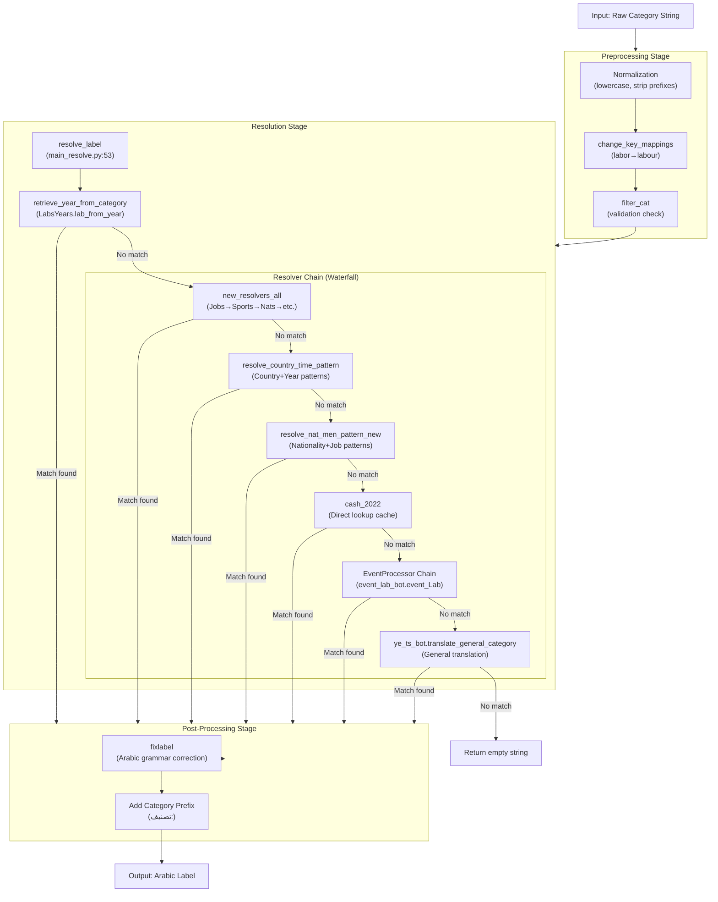
```mermaid
graph TB
    INPUT["Input: Raw Category String"]

    subgraph PREPROCESS["Preprocessing Stage"]
        NORM["Normalization<br/>(lowercase, strip prefixes)"]
        KEYMAP["change_key_mappings<br/>(labor→labour)"]
        FILTER["filter_cat<br/>(validation check)"]
    end

    subgraph RESOLVE["Resolution Stage"]
        MAIN["resolve_label<br/>(main_resolve.py:53)"]
        YEAR["retrieve_year_from_category<br/>(LabsYears.lab_from_year)"]

        subgraph CHAIN["Resolver Chain (Waterfall)"]
            R1["new_resolvers_all<br/>(Jobs→Sports→Nats→etc.)"]
            R2["resolve_country_time_pattern<br/>(Country+Year patterns)"]
            R3["resolve_nat_men_pattern_new<br/>(Nationality+Job patterns)"]
            R4["cash_2022<br/>(Direct lookup cache)"]
            R5["EventProcessor Chain<br/>(event_lab_bot.event_Lab)"]
            R6["ye_ts_bot.translate_general_category<br/>(General translation)"]
        end
    end

    subgraph POSTPROCESS["Post-Processing Stage"]
        FIX["fixlabel<br/>(Arabic grammar correction)"]
        PREFIX["Add Category Prefix<br/>(تصنيف:)"]
    end

    OUTPUT["Output: Arabic Label"]

    INPUT --> PREPROCESS
    NORM --> KEYMAP
    KEYMAP --> FILTER

    FILTER --> RESOLVE
    MAIN --> YEAR
    YEAR -->|"No match"| R1
    R1 -->|"No match"| R2
    R2 -->|"No match"| R3
    R3 -->|"No match"| R4
    R4 -->|"No match"| R5
    R5 -->|"No match"| R6
    R6 -->|"No match"| EMPTY["Return empty string"]

    YEAR -->|"Match found"| POSTPROCESS
    R1 -->|"Match found"| POSTPROCESS
    R2 -->|"Match found"| POSTPROCESS
    R3 -->|"Match found"| POSTPROCESS
    R4 -->|"Match found"| POSTPROCESS
    R5 -->|"Match found"| POSTPROCESS
    R6 -->|"Match found"| POSTPROCESS

    POSTPROCESS --> FIX
    FIX --> PREFIX
    PREFIX --> OUTPUT
```

**Sources:** [ArWikiCats/main_processers/main_resolve.py:1-156](), High-level diagrams (Diagram 3)

## Main Entry Point: resolve_label_ar

The `resolve_label_ar` function in [ArWikiCats/main_processers/main_resolve.py:146-149]() is the primary public API for the resolution pipeline. It wraps the internal `resolve_label` function and returns only the Arabic label string.

```python
def resolve_label_ar(category: str, fix_label: bool = True) -> str:
    """Resolve the Arabic label for a given category."""
    result = resolve_label(category, fix_label=fix_label)
    return result.ar
```

The internal `resolve_label` function [ArWikiCats/main_processers/main_resolve.py:53-143]() returns a `CategoryResult` dataclass containing:

| Field | Type | Description |
|-------|------|-------------|
| `en` | `str` | Original English category |
| `ar` | `str` | Resolved Arabic label |
| `from_match` | `str` | Source of match (year pattern or resolver ID) |

**Caching:** The `resolve_label` function uses `@functools.lru_cache(maxsize=None)` [ArWikiCats/main_processers/main_resolve.py:52]() for unlimited caching, providing significant performance improvements for repeated lookups.

**Sources:** [ArWikiCats/main_processers/main_resolve.py:28-149]()

## Preprocessing Stage

Before entering the resolver chain, category strings undergo normalization and validation.

### change_key_mappings

The `change_cat` function [ArWikiCats/format_bots/__init__.py]() (imported in [ArWikiCats/main_processers/main_resolve.py:21]()) applies key mappings to standardize English terminology:

- `labor` → `labour`
- `war of` → `war-of`
- Apostrophe removal
- Whitespace normalization

This ensures consistent input patterns for downstream resolvers.

### filter_cat Validation

The `filter_en.filter_cat` function [ArWikiCats/main_processers/main_resolve.py:71]() performs category validation to determine if a category should be processed. Categories failing validation skip most of the resolver chain.

**Early Exit Conditions:**

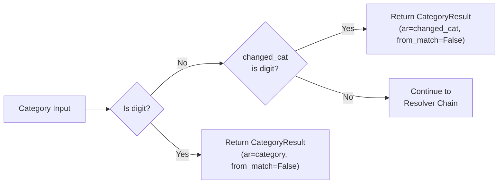
```mermaid
graph LR
    INPUT["Category Input"]
    CHECK1{"Is digit?"}
    CHECK2{"changed_cat<br/>is digit?"}
    PROCESS["Continue to<br/>Resolver Chain"]
    RETURN1["Return CategoryResult<br/>(ar=category, from_match=False)"]
    RETURN2["Return CategoryResult<br/>(ar=changed_cat, from_match=False)"]

    INPUT --> CHECK1
    CHECK1 -->|"Yes"| RETURN1
    CHECK1 -->|"No"| CHECK2
    CHECK2 -->|"Yes"| RETURN2
    CHECK2 -->|"No"| PROCESS
```

**Sources:** [ArWikiCats/main_processers/main_resolve.py:55-71](), [ArWikiCats/format_bots/__init__.py]()

## Resolver Chain (Waterfall Pattern)

The resolver chain in [ArWikiCats/main_processers/main_resolve.py:75-126]() attempts resolution using specialized resolvers in priority order. Each resolver returns an empty string on failure, allowing the next resolver to attempt matching.

**Resolver Priority Order:**

```mermaid
graph TB
    START["resolve_label begins"]

    STEP1["Priority 1:<br/>retrieve_year_from_category<br/>(LabsYears.lab_from_year)"]
    STEP2["Priority 2:<br/>new_resolvers_all<br/>(Jobs→Sports→Nats→Countries→Films→Ministers)"]
    STEP3["Priority 3:<br/>resolve_country_time_pattern<br/>(Country+Year combinations)"]
    STEP4["Priority 4:<br/>resolve_nat_men_pattern_new<br/>(Nationality+Job patterns)"]
    STEP5["Priority 5:<br/>cash_2022.get<br/>(Direct JSON lookup cache)"]
    STEP6["Priority 6:<br/>Legacy Resolvers<br/>(univer, event2_d2, with_years_bot, etc.)"]
    STEP7["Priority 7:<br/>event_lab_bot.event_Lab<br/>(EventProcessor complex logic)"]
    STEP8["Priority 8:<br/>ye_ts_bot.translate_general_category<br/>(General translation fallback)"]

    SUCCESS["Return resolved label"]
    FAIL["Return empty string"]

    START --> STEP1
    STEP1 -->|"Match"| SUCCESS
    STEP1 -->|"No match"| STEP2
    STEP2 -->|"Match"| SUCCESS
    STEP2 -->|"No match"| STEP3
    STEP3 -->|"Match"| SUCCESS
    STEP3 -->|"No match"| STEP4
    STEP4 -->|"Match"| SUCCESS
    STEP4 -->|"No match"| STEP5
    STEP5 -->|"Match"| SUCCESS
    STEP5 -->|"No match"| STEP6
    STEP6 -->|"Match"| SUCCESS
    STEP6 -->|"No match"| STEP7
    STEP7 -->|"Match"| SUCCESS
    STEP7 -->|"No match"| STEP8
    STEP8 -->|"Match"| SUCCESS
    STEP8 -->|"No match"| FAIL
```

**Sources:** [ArWikiCats/main_processers/main_resolve.py:75-126]()

### Priority 1: Year Pattern Resolution

**Function:** `retrieve_year_from_category` [ArWikiCats/main_processers/main_resolve.py:42-49]()

This resolver uses the `LabsYears` class to detect temporal patterns (decades, centuries, years, BC dates). Year patterns have top priority because they are unambiguous and frequently occur in categories.

**Implementation:**
- Uses `build_labs_years_object()` [ArWikiCats/main_processers/main_resolve.py:37-39]() with LRU caching (maxsize=1)
- Calls `labs_years_bot.lab_from_year(category)` which returns `(cat_year, from_year)`
- If `from_year` is truthy, resolution succeeds immediately

**Sources:** [ArWikiCats/main_processers/main_resolve.py:37-49](), [ArWikiCats/time_resolvers/labs_years.py]()

### Priority 2: new_resolvers_all

**Function:** `new_resolvers_all(changed_cat)` [ArWikiCats/main_processers/main_resolve.py:84]()

This is the main modular resolver that chains together specialized resolvers in the `new_resolvers/` directory. See [5](#5) for detailed documentation of each resolver.

**Internal Chain:**
1. Job resolvers (`resolve_jobs_main`)
2. Sports resolvers (`resolve_sports_main`)
3. Nationality resolvers (`resolve_by_nats`)
4. Country name resolvers (`resolve_by_countries_names`)
5. Film/TV resolvers (`resolve_nationalities_main`)
6. Relations resolvers (`new_relations_resolvers`)
7. Language resolvers (`resolve_languages_labels`)

**Sources:** [ArWikiCats/main_processers/main_resolve.py:84](), [ArWikiCats/new_resolvers/reslove_all.py:1-50]()

### Priority 3-8: Additional Resolvers

The remaining priorities handle specialized patterns and fallback cases:

| Priority | Function | Purpose |
|----------|----------|---------|
| 3 | `resolve_country_time_pattern` | Country+Year combinations (e.g., "2000s in France") |
| 4 | `resolve_nat_men_pattern_new` | Nationality+Job patterns with gender handling |
| 5 | `cash_2022.get` | Direct lookup in cached JSON data |
| 6 | Legacy resolvers | Universities, events, year prefixes |
| 7 | `event_lab_bot.event_Lab` | Complex EventProcessor logic |
| 8 | `ye_ts_bot.translate_general_category` | General translation as final fallback |

**Sources:** [ArWikiCats/main_processers/main_resolve.py:91-126]()

## Post-Processing Stage

After a resolver produces a match, the label undergoes grammatical correction and formatting.

### fixlabel Function

The `fixlabel` function [ArWikiCats/fix/fixtitle.py]() (called at [ArWikiCats/main_processers/main_resolve.py:128]()) performs:

- Arabic article agreement (definite/indefinite forms)
- Preposition insertion based on English separators ("of" → "من", "in" → "في")
- Duplicate preposition removal
- Gender agreement corrections
- Diacritical mark normalization

### Category Prefix Addition

The resolved label is prefixed with `"تصنيف:"` by the EventProcessor's `_prefix_label` method [ArWikiCats/main_processers/event_lab_bot.py:301](). The main resolver optionally applies this through `_finalize_category_label` [ArWikiCats/main_processers/event_lab_bot.py:287-303]().

**Note:** The `resolve_label_ar` function returns labels **without** the prefix, while `resolve_arabic_category_label` (in the EventProcessor) includes it.

**Sources:** [ArWikiCats/main_processers/main_resolve.py:128](), [ArWikiCats/main_processers/event_lab_bot.py:287-303](), [ArWikiCats/fix/fixtitle.py]()

## EventProcessor and event_Lab

The `EventLabResolver` class [ArWikiCats/main_processers/event_lab_bot.py:61-279]() provides a complex, multi-stage processing pipeline used as a fallback resolver.

**EventLabResolver Architecture:**

```mermaid
graph TB
    INPUT["event_Lab(cate_r)"]

    subgraph PROCESSOR["EventLabResolver.process_category"]
        SUFFIX["_handle_special_suffixes<br/>(episodes, templates)"]
        COUNTRY["_get_country_based_label<br/>(basketball players)"]
        GENERAL["_apply_general_label_functions<br/>(universities, time, sports)"]
        PATTERNS["_handle_suffix_patterns<br/>(combined_suffix_mappings)"]
        EVENT["event_label_work<br/>(lab_seoo_bot)"]
        LIST["_process_list_category<br/>(format with templates)"]
    end

    CRICKET["_handle_cricketer_categories"]
    FINALIZE["_finalize_category_label<br/>(fixlabel + prefix)"]
    OUTPUT["Arabic Label Output"]

    INPUT --> PROCESSOR

    SUFFIX --> COUNTRY
    COUNTRY --> GENERAL
    GENERAL --> PATTERNS
    PATTERNS --> EVENT
    EVENT --> LIST

    PROCESSOR --> CRICKET
    CRICKET --> FINALIZE
    FINALIZE --> OUTPUT
```

**Key Methods:**

| Method | Purpose |
|--------|---------|
| `_handle_special_suffixes` | Detects " episodes" and " templates" endings |
| `_get_country_based_label` | Handles patterns like "ethiopian basketball players" |
| `_apply_general_label_functions` | Tries universities, time, sports, general translation |
| `_handle_suffix_patterns` | Matches against `combined_suffix_mappings` |
| `_process_list_category` | Applies template formatting with placeholders |

**Sources:** [ArWikiCats/main_processers/event_lab_bot.py:61-382]()

### wrap_lab_for_country2

The `wrap_lab_for_country2` function [ArWikiCats/main_processers/event_lab_bot.py:32-58]() is a utility resolver that chains together multiple specialized resolvers for country-based lookups:

```python
resolved_label = (
    new_resolvers_all(country2)
    or get_from_pf_keys2(country2)
    or get_pop_All_18(country2)
    or te_films(country2)
    or sport_lab_suffixes.get_teams_new(country2)
    or parties_bot.get_parties_lab(country2)
    or team_work.Get_team_work_Club(country2)
    or univer.te_universities(country2)
    or work_peoples(country2)
    or get_KAKO(country2)
    or convert_time_to_arabic(country2)
    or ""
)
```

This function demonstrates the chaining pattern used throughout the codebase, attempting multiple specialized lookups until one succeeds.

**Sources:** [ArWikiCats/main_processers/event_lab_bot.py:32-58]()

## Caching and Performance Optimization

The resolution pipeline employs multiple caching strategies:

### Function-Level Caching

| Function | Cache Type | Maxsize | Location |
|----------|------------|---------|----------|
| `resolve_label` | `@lru_cache` | None (unlimited) | [main_resolve.py:52]() |
| `build_labs_years_object` | `@lru_cache` | 1 | [main_resolve.py:37]() |
| `wrap_lab_for_country2` | `@lru_cache` | 10000 | [event_lab_bot.py:32]() |

### Data Structure Caching

The `cash_2022` cache [ArWikiCats/main_processers/main_resolve.py:104-106]() provides direct dictionary lookups for frequently accessed categories. This cache is populated from JSON files and accessed via `cash_2022.get(category_lower, "")`.

### Early Exit Optimization

The waterfall pattern ensures minimal computational cost:
- Average case: 2-3 resolver attempts
- Best case: 1 resolver attempt (year patterns)
- Worst case: 8 resolver attempts before returning empty string

**Performance Characteristics:**
- First call: Full resolver chain execution
- Subsequent calls: O(1) dictionary lookup from LRU cache
- Memory usage: Grows with unique category count, bounded by `maxsize`

**Sources:** [ArWikiCats/main_processers/main_resolve.py:37-52](), [ArWikiCats/main_processers/event_lab_bot.py:32](), [ArWikiCats/legacy_bots/matables_bots/bot.py]()

## Configuration and Control Flow

The resolution pipeline behavior can be modified via configuration settings in [ArWikiCats/config.py]():

| Setting | Variable | Effect |
|---------|----------|--------|
| `TGC_RESOLVER_FIRST` | `app_settings.start_tgc_resolver_first` | Enables early general translation attempt |
| `-STUBS` | `app_settings.find_stubs` | Includes stub categories in detection |
| `MAKEERR` | `app_settings.makeerr` | Enables error tracking mode |
| `NOPRINT` | `print_settings.noprint` | Disables logging output |

The `start_tgc_resolver_first` setting [ArWikiCats/main_processers/main_resolve.py:108]() demonstrates conditional resolver ordering:

```python
if not category_lab and app_settings.start_tgc_resolver_first:
    category_lab = start_ylab  # General translation attempted earlier
```

**Sources:** [ArWikiCats/config.py:1-58](), [ArWikiCats/main_processers/main_resolve.py:108-109]()

## Integration with EventProcessor

The public API [ArWikiCats/event_processing.py]() wraps the resolution pipeline with additional functionality:

**EventProcessor Data Flow:**

```mermaid
graph LR
    API["EventProcessor.process_single"]
    NORM["_normalize_category"]
    RESOLVE["resolve_label<br/>(main_resolve)"]
    PREFIX["_prefix_label"]
    RESULT["ProcessedCategory<br/>dataclass"]

    API --> NORM
    NORM --> RESOLVE
    RESOLVE --> PREFIX
    PREFIX --> RESULT

    RESULT -->|"original"| O["Original category"]
    RESULT -->|"normalized"| N["Normalized category"]
    RESULT -->|"raw_label"| R["Label before prefix"]
    RESULT -->|"final_label"| F["تصنيف: + label"]
    RESULT -->|"has_label"| H["bool: success"]
```

The EventProcessor extends the base resolution pipeline with:
- Batch processing capabilities (`batch_resolve_labels`)
- Detailed result metadata (normalized form, raw label, final label)
- Pattern categorization (year-based, nationality-based, etc.)
- Statistics collection (success count, failure count)

**Sources:** [ArWikiCats/event_processing.py](), [README.md:217-229]()

## Error Handling and Fallbacks

The resolution pipeline is designed to never throw exceptions during normal operation. Instead, it returns empty strings for unresolved categories.

**Fallback Chain:**
1. Specialized resolvers attempt pattern matching
2. Direct cache lookups attempt exact matches
3. General translation attempts fuzzy matching
4. Empty string returned if all fail

Categories returning empty strings are collected in the `no_labels` list when using `batch_resolve_labels`, allowing post-processing review.

**Sources:** [ArWikiCats/main_processers/main_resolve.py:53-143](), [ArWikiCats/event_processing.py]()1b:T5385,# Data Architecture

<details>
<summary>Relevant source files</summary>

The following files were used as context for generating this wiki page:

- [ArWikiCats/jsons/population/pop_All_2018.json](../ArWikiCats/jsons/population/pop_All_2018.json)
- [ArWikiCats/main_processers/main_resolve.py](../ArWikiCats/main_processers/main_resolve.py)
- [ArWikiCats/translations/__init__.py](../ArWikiCats/translations/__init__.py)
- [ArWikiCats/translations/build_data/__init__.py](../ArWikiCats/translations/build_data/__init__.py)
- [ArWikiCats/translations/funcs.py](../ArWikiCats/translations/funcs.py)
- [ArWikiCats/translations/geo/__init__.py](../ArWikiCats/translations/geo/__init__.py)
- [ArWikiCats/translations/geo/labels_country.py](../ArWikiCats/translations/geo/labels_country.py)
- [ArWikiCats/translations/jobs/Jobs.py](../ArWikiCats/translations/jobs/Jobs.py)
- [ArWikiCats/translations/jobs/Jobs2.py](../ArWikiCats/translations/jobs/Jobs2.py)
- [ArWikiCats/translations/jobs/jobs_data_basic.py](../ArWikiCats/translations/jobs/jobs_data_basic.py)
- [ArWikiCats/translations/jobs/jobs_players_list.py](../ArWikiCats/translations/jobs/jobs_players_list.py)
- [ArWikiCats/translations/jobs/jobs_singers.py](../ArWikiCats/translations/jobs/jobs_singers.py)
- [ArWikiCats/translations/jobs/jobs_womens.py](../ArWikiCats/translations/jobs/jobs_womens.py)
- [ArWikiCats/translations/mixed/all_keys2.py](../ArWikiCats/translations/mixed/all_keys2.py)
- [ArWikiCats/translations/mixed/female_keys.py](../ArWikiCats/translations/mixed/female_keys.py)
- [ArWikiCats/translations/mixed/keys2.py](../ArWikiCats/translations/mixed/keys2.py)
- [ArWikiCats/translations/others/__init__.py](../ArWikiCats/translations/others/__init__.py)
- [ArWikiCats/translations/others/tax_table.py](../ArWikiCats/translations/others/tax_table.py)
- [ArWikiCats/translations/sports/Sport_key.py](../ArWikiCats/translations/sports/Sport_key.py)
- [ArWikiCats/translations/tv/films_mslslat.py](../ArWikiCats/translations/tv/films_mslslat.py)
- [_work_files/data_len.json](_work_files/data_len.json)

</details>


## Purpose and Scope

This page documents the architectural organization of translation data within ArWikiCats, explaining how raw JSON sources are processed, aggregated, and made accessible to the resolution system. The focus is on structural organization and access patterns rather than the detailed content of specific datasets.

For information about the aggregation pipeline that builds these structures, see [Data Aggregation Pipeline](#4.1). For details about specific data domains (geography, jobs, sports, etc.), see sections [4.2](#4.2) through [4.7](#4.7).

## Layered Data Architecture

The ArWikiCats data architecture consists of four distinct layers that transform raw JSON mappings into structured, queryable translation data:

```mermaid
graph TB
    subgraph Layer1["Layer 1: Raw Data Sources"]
        JSON1["jsons/jobs/jobs.json<br/>jsons/sports/Sports_Keys_New.json<br/>jsons/media/Films_key_For_nat.json<br/>jsons/geography/P17_2_final_ll.json<br/>jsons/nats/nationalities_data.json"]
    end

    subgraph Layer2["Layer 2: Domain Modules"]
        GeoMod["translations/geo/<br/>Cities.py<br/>labels_country.py<br/>regions.py"]
        JobsMod["translations/jobs/<br/>Jobs.py<br/>jobs_players_list.py<br/>jobs_singers.py"]
        SportsMod["translations/sports/<br/>Sport_key.py"]
        NatsMod["translations/nats/<br/>Nationality.py"]
        TVMod["translations/tv/<br/>films_mslslat.py"]
    end

    subgraph Layer3["Layer 3: Aggregation & Build"]
        BuildData["translations/build_data/<br/>__init__.py"]
        BuildDataOutputs["pf_keys2: 33,657 entries<br/>NEW_P17_FINAL: 24,480 entries"]
    end

    subgraph Layer4["Layer 4: Access Layer"]
        TransInit["translations/__init__.py<br/>Direct exports"]
        Funcs["translations/funcs.py<br/>get_from_new_p17_final()<br/>get_from_pf_keys2()<br/>_get_from_alias()"]
    end

    JSON1 --> GeoMod
    JSON1 --> JobsMod
    JSON1 --> SportsMod
    JSON1 --> NatsMod
    JSON1 --> TVMod

    GeoMod --> TransInit
    JobsMod --> TransInit
    SportsMod --> TransInit
    NatsMod --> TransInit
    TVMod --> TransInit

    GeoMod --> BuildData
    JobsMod --> BuildData
    SportsMod --> BuildData
    NatsMod --> BuildData

    BuildData --> BuildDataOutputs
    BuildDataOutputs --> Funcs
    TransInit --> Funcs

    style Layer1 fill:#f9f9f9
    style Layer2 fill:#f0f0f0
    style Layer3 fill:#e8e8e8
    style Layer4 fill:#e0e0e0
```

**Sources:** [ArWikiCats/translations/__init__.py:1-152](), [ArWikiCats/translations/build_data/__init__.py:1-83](), [ArWikiCats/translations/funcs.py:1-159]()

### Layer 1: Raw Data Sources

JSON files stored in the `jsons/` directory contain the raw translation mappings. These files are organized by domain:

| Directory | Purpose | Example Files |
|-----------|---------|---------------|
| `jsons/jobs/` | Occupation translations | `jobs.json`, `Jobs_22.json` |
| `jsons/sports/` | Sports terminology | `Sports_Keys_New.json` |
| `jsons/media/` | Films and TV categories | `Films_key_For_nat.json`, `Films_keys_male_female.json` |
| `jsons/geography/` | Geographic labels | `P17_2_final_ll.json`, `popopo.json` |
| `jsons/cities/` | City name translations | `yy2.json` |
| `jsons/nats/` | Nationality data | `nationalities_data.json` |
| `jsons/population/` | Generic category keys | `pop_All_2018.json` |

**Sources:** [ArWikiCats/translations/tv/films_mslslat.py:118-121](), [ArWikiCats/translations/sports/Sport_key.py:34](), [ArWikiCats/translations/geo/labels_country.py:230-232]()

### Layer 2: Domain-Specific Modules

Domain modules in `translations/{domain}/` load raw JSON and perform transformations:

```mermaid
graph LR
    subgraph DomainProcessing["Domain Module Processing Pattern"]
        LoadJSON["open_json_file()<br/>Load raw JSON"]
        Transform["Transform & Filter<br/>• Lowercase keys<br/>• Build variants<br/>• Merge sources"]
        Export["Module Exports<br/>Python dictionaries"]
    end

    LoadJSON --> Transform
    Transform --> Export

    subgraph Examples["Example: Sports Module"]
        SportsJSON["Sports_Keys_New.json"]
        InitTables["_initialise_tables()"]
        GenVariants["_generate_variants()"]
        BuildTables["_build_tables()"]
        SportsExports["SPORTS_KEYS_FOR_TEAM<br/>SPORTS_KEYS_FOR_LABEL<br/>SPORTS_KEYS_FOR_JOBS"]
    end

    SportsJSON --> InitTables
    InitTables --> GenVariants
    GenVariants --> BuildTables
    BuildTables --> SportsExports
```

**Key domain modules:**

- **`translations/geo/`**: Geographic data processing
  - [Cities.py:1-50]() - City name translations (`CITY_TRANSLATIONS_LOWER`: 10,526 entries)
  - [labels_country.py:1-275]() - Country labels and overrides (`COUNTRY_LABEL_OVERRIDES`: 1,459 entries)
  - [regions.py]() - Regional translations (`MAIN_REGION_TRANSLATIONS`: 820 entries)

- **`translations/jobs/`**: Occupation data processing
  - [Jobs.py:1-211]() - Main jobs dataset builder (`jobs_mens_data`: 4,012 entries, `jobs_womens_data`: 2,954 entries)
  - [jobs_players_list.py:1-263]() - Sports-related jobs (`PLAYERS_TO_MEN_WOMENS_JOBS`: 1,342 entries)
  - [jobs_singers.py:1-148]() - Music and entertainment jobs

- **`translations/sports/`**: Sports terminology
  - [Sport_key.py:1-73]() - Sports key records (`SPORT_KEY_RECORDS`: 431 entries)

- **`translations/nats/`**: Nationality data
  - [Nationality.py]() - Nationality lookup tables (`All_Nat`: 400 entries with 18 grammatical variants)

- **`translations/tv/`**: Film and television
  - [films_mslslat.py:1-271]() - Film/TV translations (`Films_key_For_nat`: 13,146 entries)

**Sources:** [ArWikiCats/translations/__init__.py:9-86](), [_work_files/data_len.json:1-135]()

### Layer 3: Aggregation and Build

The `translations/build_data/` module aggregates domain-specific data into comprehensive lookup structures:

```mermaid
graph TB
    subgraph Inputs["Domain Module Outputs"]
        GeoData["CITY_TRANSLATIONS_LOWER<br/>COUNTRY_LABEL_OVERRIDES<br/>US_STATES<br/>raw_region_overrides"]
        JobsData["SINGERS_TAB<br/>film_keys_for_female<br/>film_keys_for_male"]
        NatsData["all_country_ar"]
        MixedData["keys2_py<br/>pop_final_3<br/>new2019<br/>NEW_2023"]
    end

    subgraph BuildFuncs["Aggregation Functions"]
        GenKeys["generate_key_mappings()<br/>Combines multiple sources"]
        BuildIndex["_build_country_label_index()<br/>Merges geographic data"]
    end

    subgraph Outputs["Aggregated Datasets"]
        PfKeys["pf_keys2<br/>33,657 entries<br/>Generic category mappings"]
        P17Final["NEW_P17_FINAL<br/>24,480 entries<br/>Geographic label index"]
    end

    GeoData --> BuildIndex
    JobsData --> GenKeys
    NatsData --> BuildIndex
    MixedData --> GenKeys

    GenKeys --> PfKeys
    BuildIndex --> P17Final
```

**Primary aggregated datasets:**

| Dataset | Size | Purpose | Built By |
|---------|------|---------|----------|
| `pf_keys2` | 33,657 entries | Consolidated generic category mappings | [generate_key_mappings():643-714]() |
| `NEW_P17_FINAL` | 24,480 entries | Comprehensive geographic label index | [_build_country_label_index()]() |

The `generate_key_mappings()` function merges:
- `keys2_py` (1,217 entries) - Core mappings
- `pop_final_3` (1,308 entries) - Population-derived keys
- `SINGERS_TAB` (288 entries) - Music categories
- `film_keys_for_female` (207 entries) - Female film roles
- `ALBUMS_TYPE` (13 entries) - Album types
- Tennis, language, and other specialized mappings

**Sources:** [ArWikiCats/translations/build_data/__init__.py:42-69](), [ArWikiCats/translations/mixed/all_keys2.py:643-714]()

### Layer 4: Access Layer

The access layer provides two mechanisms for retrieving translation data:

**Dual Export Architecture:**

```mermaid
graph TB
    subgraph DirectExports["translations/__init__.py"]
        Direct1["CITY_TRANSLATIONS_LOWER"]
        Direct2["jobs_mens_data"]
        Direct3["All_Nat"]
        Direct4["SPORT_KEY_RECORDS"]
        DirectNote["150+ direct exports<br/>Domain-specific access"]
    end

    subgraph AggregateExports["translations/build_data/__init__.py"]
        Agg1["pf_keys2"]
        Agg2["NEW_P17_FINAL"]
        AggNote["Merged datasets<br/>Cross-domain queries"]
    end

    subgraph AccessFunctions["translations/funcs.py"]
        Func1["get_from_new_p17_final(text)<br/>Query geographic index"]
        Func2["get_from_pf_keys2(text)<br/>Query generic mappings"]
        Func3["_get_from_alias(key)<br/>Fallback cascade"]
        Func4["get_and_label(category)<br/>Handle 'X and Y' patterns"]
    end

    Direct1 --> Func3
    Direct2 --> Func3
    Direct3 --> Func3
    Direct4 --> Func3

    Agg1 --> Func2
    Agg2 --> Func1

    Func1 --> Resolvers["Resolver Modules"]
    Func2 --> Resolvers
    Func3 --> Resolvers
    Func4 --> Resolvers
```

**Access function patterns:**

1. **`get_from_new_p17_final(text)`** - Primary geographic/entity lookup
   - Searches `ALIASES_CHAIN` dictionaries first
   - Falls back to `pf_keys2` and `NEW_P17_FINAL`
   - Returns Arabic label or empty string

   [ArWikiCats/translations/funcs.py:37-56]()

2. **`get_from_pf_keys2(text)`** - Generic category lookup
   - Direct dictionary access to `pf_keys2`

   [ArWikiCats/translations/funcs.py:101-113]()

3. **`_get_from_alias(key)`** - Fallback cascade with LRU cache (10,000 entries)
   - Searches multiple sources in order: `pf_keys2`, `Jobs_new`, `jobs_mens_data`, `films_mslslat_tab`, `Clubs_key_2`, `pop_final_5`
   - Falls back to `get_from_new_p17_final()` and `SPORTS_KEYS_FOR_LABEL`

   [ArWikiCats/translations/funcs.py:116-150]()

4. **`get_and_label(category)`** - Pattern-based resolution for "X and Y" categories
   - Uses regex `r"^(.*?) and (.*)$"` to split
   - Resolves each part independently
   - Combines with Arabic conjunction "و"

   [ArWikiCats/translations/funcs.py:59-98]()

**Sources:** [ArWikiCats/translations/funcs.py:1-159](), [ArWikiCats/translations/__init__.py:1-152](), [ArWikiCats/translations/build_data/__init__.py:1-83]()

## Data Access Patterns in Resolution

Resolvers access translation data through multiple patterns depending on their requirements:

```mermaid
graph LR
    subgraph Resolver["Resolver Module"]
        ResolverLogic["Resolution Logic"]
    end

    subgraph DirectImport["Direct Import Pattern"]
        Import1["from translations import<br/>jobs_mens_data"]
        Import2["from translations import<br/>All_Nat"]
        DirectAccess["jobs_mens_data.get(key)"]
    end

    subgraph FunctionCall["Function Call Pattern"]
        FuncImport["from translations.funcs import<br/>get_from_new_p17_final"]
        FuncCall["get_from_new_p17_final(text)"]
    end

    subgraph FormatterPattern["Formatter Pattern"]
        FormatterImport["from translations import<br/>SPORTS_KEYS_FOR_LABEL"]
        FormatterCreate["FormatDataV2(SPORTS_KEYS_FOR_LABEL)"]
        FormatterApply["formatter.apply_format(category)"]
    end

    ResolverLogic --> DirectImport
    ResolverLogic --> FunctionCall
    ResolverLogic --> FormatterPattern
```

**Pattern 1: Direct Dictionary Access**

Used when resolvers need raw access to specific datasets:

```python
from ArWikiCats.translations import jobs_mens_data, All_Nat

# Direct lookup
arabic_label = jobs_mens_data.get("engineers")
nationality_data = All_Nat.get("british")
```

Example: Jobs resolver directly imports `jobs_mens_data` and `jobs_womens_data` for gender-specific job lookups.

**Pattern 2: Function-Based Access**

Used for complex lookups with fallback logic:

```python
from ArWikiCats.translations.funcs import get_from_new_p17_final

# Geographic/entity lookup with cascading fallback
label = get_from_new_p17_final("paris")  # Returns "باريس"
```

Example: Country and nationality resolvers use `get_from_new_p17_final()` for geographic entity resolution.

**Pattern 3: Formatter Integration**

Used when resolvers need template-based pattern matching:

```python
from ArWikiCats.translations import SPORTS_KEYS_FOR_LABEL
from ArWikiCats.new_resolvers.format_opts import FormatDataV2

# Create formatter with sports data
formatter = FormatDataV2(SPORTS_KEYS_FOR_LABEL, template="{sport} players")

# Apply to category
result = formatter.apply_format("football players")  # Uses football→كرة القدم
```

Example: Sports resolvers create `FormatDataV2` instances with `SPORTS_KEYS_FOR_LABEL` data.

**Sources:** [ArWikiCats/main_processers/main_resolve.py:1-106](), [ArWikiCats/translations/funcs.py:116-150]()

## Data Statistics and Composition

### Major Dataset Sizes

The following table shows the scale of key translation datasets:

| Dataset | Entries | Type | Source Module |
|---------|---------|------|---------------|
| `pf_keys2` | 33,657 | Generic mappings | `build_data` |
| `NEW_P17_FINAL` | 24,480 | Geographic labels | `build_data` |
| `Films_key_CAO` | 13,146 | Film/TV categories | `tv` |
| `films_key_cao2` | 11,178 | Film variations | `tv` |
| `CITY_TRANSLATIONS_LOWER` | 10,526 | City names | `geo` |
| `New_female_keys` | 4,682 | Female-specific | `mixed` |
| `CITY_LABEL_PATCHES` | 4,160 | City overrides | `geo` |
| `jobs_mens_data` | 4,012 | Male occupations | `jobs` |
| `mens_jobs_data` | 3,878 | Male job variants | `jobs` |
| `pop_final6` | 3,184 | Population keys | `mixed` |
| `People_key` | 3,117 | People categories | `mixed` |
| `US_COUNTY_TRANSLATIONS` | 2,998 | US counties | `geo` |
| `jobs_womens_data` | 2,954 | Female occupations | `jobs` |

**Sources:** [_work_files/data_len.json:1-135]()

### Data Distribution by Domain

```mermaid
graph TD
    subgraph TotalData["Total Translation Data"]
        Total["~150,000+ entries across all datasets"]
    end

    subgraph Domains["Data Distribution"]
        Geo["Geographic Data<br/>~50,000 entries<br/>Cities, countries, regions"]
        Jobs["Jobs & Occupations<br/>~100,000 entries<br/>Gender variants, sports roles"]
        Media["Films & Television<br/>~25,000 entries<br/>Genres, roles, formats"]
        Sports["Sports Data<br/>~2,000 entries<br/>Sports, teams, players"]
        Nats["Nationalities<br/>~8,000 entries<br/>18 grammatical forms"]
        Mixed["Mixed Categories<br/>~35,000 entries<br/>Generic mappings"]
    end

    Total --> Geo
    Total --> Jobs
    Total --> Media
    Total --> Sports
    Total --> Nats
    Total --> Mixed
```

### Data Composition: pf_keys2 Build

The `pf_keys2` dataset (33,657 entries) is assembled from multiple sources through `generate_key_mappings()`:

| Source | Approx. Entries | Contribution |
|--------|----------------|--------------|
| `keys2_py` | 1,217 | Core category keys |
| `pop_final_3` | 1,308 | Population-based |
| `SINGERS_TAB` | 288 | Music categories |
| `film_keys_for_female` | 207 | Female film roles |
| `ALBUMS_TYPE` | 13 | Album types |
| `film_keys_for_male` | 38 | Male film roles |
| `TENNIS_KEYS` | 76 | Tennis terms |
| `pop_final6` | 3,184 | Additional population |
| `MEDIA_CATEGORY_TRANSLATIONS` | ~500 | Media terms |
| `language_key_translations` | 597 | Language categories |
| `new2019` | 1,632 | 2019 additions |
| `NEW_2023` | 757 | 2023 additions |
| Generated entries | ~24,000+ | Built from base mappings |

The majority of entries are generated programmatically through helper functions like `build_pf_keys2()`, which combines base labels with modifiers (directions, regions, book types, etc.).

**Sources:** [ArWikiCats/translations/mixed/all_keys2.py:643-714](), [ArWikiCats/translations/build_data/__init__.py:42-56]()

## Specialized Data Structures

### Gendered Job Mappings

Job data uses a specialized structure for gender-specific translations:

```typescript
// Type definition for reference
type GenderedLabel = {
  males: string;
  females: string;
}

type GenderedLabelMap = {
  [jobKey: string]: GenderedLabel;
}
```

Example data structure:
```python
{
  "engineers": {
    "males": "مهندسون",
    "females": "مهندسات"
  },
  "teachers": {
    "males": "معلمون",
    "females": "معلمات"
  }
}
```

This structure is used throughout the jobs domain:
- `jobs_mens_data` - Flattened to male forms only
- `jobs_womens_data` - Flattened to female forms only
- `MEN_WOMENS_JOBS_2`, `PLAYERS_TO_MEN_WOMENS_JOBS` - Full gendered structures

**Sources:** [ArWikiCats/translations/jobs/Jobs.py:181-183](), [ArWikiCats/translations/data_builders/jobs_defs.py]()

### Sport Key Records

Sports data uses `SportKeyRecord` with multiple translation variants:

```typescript
// Type definition for reference
type SportKeyRecord = {
  team: string;      // "فريق كرة القدم"
  label: string;     // "كرة القدم"
  jobs: string;      // "كرة قدم" (for job combinations)
  // Additional metadata
}
```

Built by `_build_tables()` which generates three separate dictionaries:
- `SPORTS_KEYS_FOR_TEAM` - Team name patterns
- `SPORTS_KEYS_FOR_LABEL` - General sport labels
- `SPORTS_KEYS_FOR_JOBS` - Job combination forms (e.g., "football players" → "لاعبو كرة قدم")

**Sources:** [ArWikiCats/translations/sports/Sport_key.py:42-50](), [ArWikiCats/translations/data_builders/build_sport_keys.py]()

### Nationality Lookup Tables

Nationality data provides 18 different grammatical forms per nationality:

```python
# Example structure for "British"
All_Nat["british"] = {
  "en": "British",
  "ar": "بريطاني",
  # Forms: definite/indefinite × singular/plural × male/female
  "male_singular": "بريطاني",
  "female_singular": "بريطانية",
  "male_plural": "بريطانيون",
  "female_plural": "بريطانيات",
  # ... 14 more forms
}
```

Exported as separate dictionaries for each form:
- `All_Nat` - Complete entries with all forms
- `Nat_men`, `Nat_mens` - Male forms
- `Nat_women`, `Nat_Womens` - Female forms
- `Nat_the_male`, `Nat_the_female` - Definite forms
- `ar_Nat_men` - Arabic-keyed male forms

**Sources:** [ArWikiCats/translations/nats/Nationality.py](), [ArWikiCats/translations/__init__.py:42-61]()

## Data Caching and Performance

### LRU Caching Strategy

Translation access functions use `functools.lru_cache` for performance optimization:

| Function | Cache Size | Purpose |
|----------|------------|---------|
| `_get_from_alias()` | 10,000 | Alias resolution cascade |
| `get_and_label()` | 10,000 | "X and Y" pattern resolution |

The main resolution function uses a much larger cache:
- `resolve_label()` - 50,000 entries (caches complete resolution results)

**Sources:** [ArWikiCats/translations/funcs.py:59-98](), [ArWikiCats/translations/funcs.py:116-150](), [ArWikiCats/main_processers/main_resolve.py:32]()

### Access Pattern Optimization

The `_get_from_alias()` function implements a prioritized fallback cascade to minimize lookup time:

1. Check `pf_keys2` (largest generic dataset) - O(1)
2. Check `Jobs_new` (job-specific) - O(1)
3. Check `jobs_mens_data` - O(1)
4. Check `films_mslslat_tab` - O(1)
5. Check `Clubs_key_2` - O(1)
6. Check `pop_final_5` - O(1)
7. Fall back to `get_from_new_p17_final()` (geographic index)
8. Final check in `SPORTS_KEYS_FOR_LABEL`

This cascade ensures the most commonly accessed datasets are checked first, with specialized lookups deferred until necessary.

**Sources:** [ArWikiCats/translations/funcs.py:116-150]()1c:T493c,# Resolver Chain Priority System

<details>
<summary>Relevant source files</summary>

The following files were used as context for generating this wiki page:

- [.github/copilot-instructions.md](.github/copilot-instructions.md)
- [.github/workflows/python-publish.yml](.github/workflows/python-publish.yml)
- [ArWikiCats/config.py](../ArWikiCats/config.py)
- [ArWikiCats/new_resolvers/__init__.py](../ArWikiCats/new_resolvers/__init__.py)
- [ArWikiCats/new_resolvers/countries_names_resolvers/__init__.py](../ArWikiCats/new_resolvers/countries_names_resolvers/__init__.py)
- [ArWikiCats/new_resolvers/countries_names_with_sports/__init__.py](../ArWikiCats/new_resolvers/countries_names_with_sports/__init__.py)
- [ArWikiCats/new_resolvers/countries_names_with_sports/p17_bot_sport.py](../ArWikiCats/new_resolvers/countries_names_with_sports/p17_bot_sport.py)
- [ArWikiCats/new_resolvers/countries_names_with_sports/p17_sport_to_move_under.py](../ArWikiCats/new_resolvers/countries_names_with_sports/p17_sport_to_move_under.py)
- [ArWikiCats/new_resolvers/films_resolvers/__init__.py](../ArWikiCats/new_resolvers/films_resolvers/__init__.py)
- [ArWikiCats/new_resolvers/films_resolvers/resolve_films_labels.py](../ArWikiCats/new_resolvers/films_resolvers/resolve_films_labels.py)
- [ArWikiCats/new_resolvers/jobs_resolvers/__init__.py](../ArWikiCats/new_resolvers/jobs_resolvers/__init__.py)
- [ArWikiCats/new_resolvers/jobs_resolvers/relegin_jobs_new.py](../ArWikiCats/new_resolvers/jobs_resolvers/relegin_jobs_new.py)
- [ArWikiCats/new_resolvers/nationalities_resolvers/__init__.py](../ArWikiCats/new_resolvers/nationalities_resolvers/__init__.py)
- [ArWikiCats/new_resolvers/sports_resolvers/__init__.py](../ArWikiCats/new_resolvers/sports_resolvers/__init__.py)
- [ArWikiCats/new_resolvers/sports_resolvers/countries_names_and_sports.py](../ArWikiCats/new_resolvers/sports_resolvers/countries_names_and_sports.py)
- [ArWikiCats/new_resolvers/sports_resolvers/nationalities_and_sports.py](../ArWikiCats/new_resolvers/sports_resolvers/nationalities_and_sports.py)
- [ArWikiCats/new_resolvers/sports_resolvers/pre_defined.py](../ArWikiCats/new_resolvers/sports_resolvers/pre_defined.py)
- [ArWikiCats/new_resolvers/sports_resolvers/raw_sports.py](../ArWikiCats/new_resolvers/sports_resolvers/raw_sports.py)
- [ArWikiCats/new_resolvers/sports_resolvers/raw_sports_with_suffixes.py](../ArWikiCats/new_resolvers/sports_resolvers/raw_sports_with_suffixes.py)
- [ArWikiCats/new_resolvers/sports_resolvers/sport_lab_nat.py](../ArWikiCats/new_resolvers/sports_resolvers/sport_lab_nat.py)
- [ArWikiCats/new_resolvers/teams_mappings_ends.py](../ArWikiCats/new_resolvers/teams_mappings_ends.py)
- [CLAUDE.md](CLAUDE.md)
- [README.md](README.md)
- [changelog.md](changelog.md)
- [tests_require_fixes/test_papua_new_guinean.py](tests_require_fixes/test_papua_new_guinean.py)
- [tests_require_fixes/test_skip_data_all.py](tests_require_fixes/test_skip_data_all.py)
- [tests_require_fixes/text_to_fix.py](tests_require_fixes/text_to_fix.py)

</details>


## Purpose and Scope

This document explains the resolver chain priority system used in ArWikiCats to translate English Wikipedia category names to Arabic. The system processes categories through a sequence of specialized resolvers in a carefully ordered priority chain, where the ordering is critical for correctness and conflict prevention.

For information about individual resolver implementations, see:
- Jobs resolvers: [5.4](#5.4)
- Sports resolvers: [5.5](#5.5)
- Nationality resolvers: [5.2](#5.2)
- Country resolvers: [5.3](#5.3)

For the overall resolution pipeline architecture, see [3.1](#3.1).

---

## Why Resolver Priority Matters

The resolver chain uses a **first-match-wins** strategy where each resolver attempts to translate a category in sequence until one returns a non-empty result. The order of resolvers is critical because:

1. **Linguistic Ambiguity**: Category terms can have multiple interpretations (e.g., "Italy political leader" could be nationality-based or country-based)
2. **Overlapping Domains**: Job titles often overlap with sports terms (e.g., "football manager" could be a sports management role or a job title about football)
3. **Semantic Conflicts**: Nationality adjectives can be misinterpreted as country names (e.g., "Italian" as nationality vs. "Italy" as country)

Incorrect ordering leads to semantically incorrect translations that fundamentally change a category's meaning.

**Sources:**
- [ArWikiCats/new_resolvers/__init__.py:36-98]()
- [changelog.md:428-448]()

---

## The Resolver Chain

The resolver chain is defined in `_RESOLVER_CHAIN` as a list of tuples containing resolver name, function, and priority notes. The complete chain with rationale:

| Priority | Resolver Name | Function | Rationale |
|----------|---------------|----------|-----------|
| 1 | Time to Arabic | `convert_time_to_arabic` | Highest priority - handles year/century/millennium patterns that must be resolved first |
| 2 | Pattern-based resolvers | `all_patterns_resolvers` | Regex patterns for complex category structures |
| 3 | Jobs resolvers | `main_jobs_resolvers` | **Must be before sports** to avoid mis-resolving job titles as sports |
| 4 | Time + Jobs resolvers | `time_and_jobs_resolvers_main` | Combined time period and job titles |
| 5 | Sports resolvers | `main_sports_resolvers` | Sports-specific category patterns |
| 6 | Nationalities resolvers | `main_nationalities_resolvers` | **Must be before countries** to avoid conflicts (e.g., 'Italy political leader') |
| 7 | Countries names resolvers | `main_countries_names_resolvers` | Country name patterns |
| 8 | Films resolvers | `main_films_resolvers` | Film and television categories |
| 9 | Relations resolvers | `main_relations_resolvers` | Complex relational categories (e.g., dual nationalities) |
| 10 | Countries with sports | `main_countries_names_with_sports_resolvers` | Combined country and sport patterns |
| 11 | Languages resolvers | `resolve_languages_labels_with_time` | Language-related categories with time periods |
| 12 | Other resolvers | `main_other_resolvers` | Catch-all for remaining patterns |

**Sources:**
- [ArWikiCats/new_resolvers/__init__.py:37-98]()

---

## Resolution Flow Architecture

### Category Processing Flow

```mermaid
flowchart TD
    Input["Category Input<br/>'British football managers'"]
    Entry["all_new_resolvers()<br/>Entry Point"]

    Time["1. Time to Arabic<br/>convert_time_to_arabic()"]
    Pattern["2. Pattern Resolvers<br/>all_patterns_resolvers()"]
    Jobs["3. Jobs Resolvers<br/>main_jobs_resolvers()"]
    TimeJobs["4. Time + Jobs<br/>time_and_jobs_resolvers_main()"]
    Sports["5. Sports Resolvers<br/>main_sports_resolvers()"]
    Nats["6. Nationalities<br/>main_nationalities_resolvers()"]
    Countries["7. Countries<br/>main_countries_names_resolvers()"]
    Films["8. Films<br/>main_films_resolvers()"]
    Relations["9. Relations<br/>main_relations_resolvers()"]
    CountriesSports["10. Countries + Sports<br/>main_countries_names_with_sports_resolvers()"]
    Languages["11. Languages<br/>resolve_languages_labels_with_time()"]
    Other["12. Other<br/>main_other_resolvers()"]

    NoMatch["No Match<br/>Return Empty String"]
    Match["Match Found<br/>Return Result"]

    Input --> Entry
    Entry --> Time
    Time -->|"result?"| Match
    Time -->|"empty"| Pattern
    Pattern -->|"result?"| Match
    Pattern -->|"empty"| Jobs
    Jobs -->|"result?"| Match
    Jobs -->|"empty"| TimeJobs
    TimeJobs -->|"result?"| Match
    TimeJobs -->|"empty"| Sports
    Sports -->|"result?"| Match
    Sports -->|"empty"| Nats
    Nats -->|"result?"| Match
    Nats -->|"empty"| Countries
    Countries -->|"result?"| Match
    Countries -->|"empty"| Films
    Films -->|"result?"| Match
    Films -->|"empty"| Relations
    Relations -->|"result?"| Match
    Relations -->|"empty"| CountriesSports
    CountriesSports -->|"result?"| Match
    CountriesSports -->|"empty"| Languages
    Languages -->|"result?"| Match
    Languages -->|"empty"| Other
    Other -->|"result?"| Match
    Other -->|"empty"| NoMatch

    style Entry fill:#ffd700
    style Match fill:#90ee90
    style NoMatch fill:#ffcccc
```

**Sources:**
- [ArWikiCats/new_resolvers/__init__.py:101-124]()

---

## Conflict Prevention Examples

### Example 1: Nationality vs. Country Conflict

**Problem:** "Italy political leader" could be interpreted as:
- ❌ Country-based: "قادة إيطاليا السياسيون" (political leaders of Italy - wrong)
- ✓ Nationality-based: "قادة سياسيون إيطاليون" (Italian political leaders - correct)

**Solution:** Nationalities resolver (Priority 6) runs before Countries resolver (Priority 7)

```mermaid
flowchart LR
    Input["'Italy political leader'"]

    Nats["Nationalities Resolver<br/>Priority 6"]
    Countries["Countries Resolver<br/>Priority 7"]

    NatsMatch["Match Found<br/>'قادة سياسيون إيطاليون'"]
    CountriesSkipped["Skipped<br/>Already matched"]

    Input --> Nats
    Nats -->|"Matches 'Italian'<br/>nationality pattern"| NatsMatch
    Nats -.->|"Would try if no match"| Countries
    Countries -.-> CountriesSkipped

    style NatsMatch fill:#90ee90
    style CountriesSkipped fill:#cccccc
```

**Sources:**
- [ArWikiCats/new_resolvers/__init__.py:64-67]()
- [ArWikiCats/new_resolvers/countries_names_resolvers/__init__.py:38-43]()

### Example 2: Job Title vs. Sports Term Conflict

**Problem:** "football manager" could be interpreted as:
- ❌ Sports-based: "مديرو كرة القدم" (football directors - wrong)
- ✓ Job-based: "مدربو كرة قدم" (football coaches/managers - correct)

**Solution:** Jobs resolver (Priority 3) runs before Sports resolver (Priority 5)

```mermaid
flowchart LR
    Input["'football manager'"]

    Jobs["Jobs Resolver<br/>Priority 3"]
    Sports["Sports Resolver<br/>Priority 5"]

    JobsMatch["Match Found<br/>'مدربو كرة قدم'"]
    SportsSkipped["Skipped<br/>Already matched"]

    Input --> Jobs
    Jobs -->|"Matches job title<br/>'manager' pattern"| JobsMatch
    Jobs -.->|"Would try if no match"| Sports
    Sports -.-> SportsSkipped

    style JobsMatch fill:#90ee90
    style SportsSkipped fill:#cccccc
```

**Sources:**
- [ArWikiCats/new_resolvers/__init__.py:49-52]()
- [changelog.md:428-432]()

### Example 3: Temporal + Occupational Categories

**Problem:** "1990 films" could be incorrectly split if handled by separate resolvers

**Solution:** Time+Jobs resolver (Priority 4) handles compound temporal+occupational categories as a unit

```mermaid
flowchart LR
    Input["'1990 films'"]

    Time["Time Resolver<br/>Priority 1"]
    Jobs["Jobs Resolver<br/>Priority 3"]
    TimeJobs["Time + Jobs Resolver<br/>Priority 4"]
    Films["Films Resolver<br/>Priority 8"]

    TimePartial["Extracts '1990'<br/>but no full match"]
    TimeJobsMatch["Complete Match<br/>'أفلام 1990'"]

    Input --> Time
    Time -->|"No complete match"| TimePartial
    TimePartial --> Jobs
    Jobs -->|"No match for full category"| TimeJobs
    TimeJobs -->|"Matches complete pattern"| TimeJobsMatch

    style TimeJobsMatch fill:#90ee90
    style TimePartial fill:#ffffcc
```

**Sources:**
- [ArWikiCats/new_resolvers/__init__.py:54-57]()

---

## Conflict Prevention Matrix

The following table shows which resolver pairs require specific ordering to prevent conflicts:

| Higher Priority | Lower Priority | Conflict Example | Consequence of Wrong Order |
|----------------|----------------|------------------|---------------------------|
| Jobs | Sports | "football manager" | Would match as sports management instead of job title |
| Nationalities | Countries | "Italy political leader" | Would match as country-based instead of nationality adjective |
| Time + Jobs | Jobs alone | "1990 films" | Would split temporal and occupational components incorrectly |
| Pattern-based | Domain-specific | Complex regex patterns | Domain-specific resolvers would miss compound patterns |

**Sources:**
- [ArWikiCats/new_resolvers/__init__.py:49-67]()
- [changelog.md:428-448]()

---

## Implementation Details

### The Resolver Loop

The `all_new_resolvers()` function implements the priority chain using a simple loop:

```python
for name, resolver, _ in _RESOLVER_CHAIN:
    result = resolver(category)
    if result:
        logger.info(f"<<purple>> : {category} => {result} via {name}")
        return result
```

Key characteristics:
- **Cached**: Function decorated with `@functools.lru_cache(maxsize=50000)` for performance
- **Short-circuit evaluation**: Returns immediately on first non-empty result
- **Debug logging**: Records which resolver matched for troubleshooting

**Sources:**
- [ArWikiCats/new_resolvers/__init__.py:101-124]()

### Type Definitions

```python
# Type alias for resolver functions
ResolverFn = Callable[[str], str]

# Resolver chain structure
_RESOLVER_CHAIN: list[tuple[str, ResolverFn, str]]
```

Each resolver must:
- Accept a single `str` parameter (normalized category)
- Return a `str` (Arabic translation or empty string)
- Be cacheable (deterministic, no side effects)

**Sources:**
- [ArWikiCats/new_resolvers/__init__.py:32-98]()

---

## Resolver Chain Invocation

### Call Graph

```mermaid
flowchart TB
    API["Public API<br/>resolve_arabic_category_label()"]
    Main["Main Resolver<br/>main_processers/main_resolve.py<br/>resolve_label()"]
    AllNew["New Resolvers Entry<br/>new_resolvers/__init__.py<br/>all_new_resolvers()"]

    Time["convert_time_to_arabic()"]
    Pattern["all_patterns_resolvers()"]
    Jobs["main_jobs_resolvers()"]
    TimeJobs["time_and_jobs_resolvers_main()"]
    Sports["main_sports_resolvers()"]
    Nats["main_nationalities_resolvers()"]
    Countries["main_countries_names_resolvers()"]
    Films["main_films_resolvers()"]

    Legacy["Legacy Resolvers<br/>legacy_bots/__init__.py<br/>LegacyBotsResolver"]

    API --> Main
    Main -->|"Try new resolvers first"| AllNew
    AllNew --> Time
    AllNew --> Pattern
    AllNew --> Jobs
    AllNew --> TimeJobs
    AllNew --> Sports
    AllNew --> Nats
    AllNew --> Countries
    AllNew --> Films
    Main -->|"Fallback if no match"| Legacy

    style API fill:#90ee90
    style AllNew fill:#ffd700
    style Main fill:#87ceeb
```

**Sources:**
- [ArWikiCats/new_resolvers/__init__.py:1-125]()
- [ArWikiCats/__init__.py]()

---

## Adding New Resolvers to the Chain

### Guidelines for Placement

When adding a new resolver to the chain, consider:

1. **Domain Overlap**: Does your resolver's domain overlap with existing resolvers?
   - If YES: Place it to avoid conflicts (see conflict matrix above)
   - If NO: Place it near other catch-all resolvers

2. **Specificity**: More specific patterns should come before more general ones
   - Example: "Time + Jobs" before "Jobs alone"

3. **Linguistic Priority**: Adjectival forms before nominal forms
   - Example: Nationalities (adjectives) before Countries (nouns)

### Steps to Add a Resolver

1. **Implement the resolver function** in appropriate subdirectory:
   ```
   ArWikiCats/new_resolvers/your_domain/
   ```

2. **Add to the resolver chain** in [ArWikiCats/new_resolvers/__init__.py]():
   ```python
   _RESOLVER_CHAIN: list[tuple[str, ResolverFn, str]] = [
       # ... existing resolvers ...
       (
           "Your Resolver Name",
           your_resolver_function,
           "Explanation of why it's placed here",
       ),
       # ... remaining resolvers ...
   ]
   ```

3. **Test for conflicts** with existing resolvers:
   - Run full test suite: `pytest`
   - Add specific conflict tests if overlap exists

4. **Document the priority decision** in the rationale field

**Sources:**
- [ArWikiCats/new_resolvers/__init__.py:36-98]()
- [CLAUDE.md:142-150]()

---

## Performance Considerations

### Caching Strategy

Each component in the resolver chain implements caching at multiple levels:

| Level | Cache Location | Max Size | Purpose |
|-------|---------------|----------|---------|
| Main entry | `all_new_resolvers()` | 50,000 | Cache final results across entire chain |
| Individual resolvers | Each `main_*_resolvers()` | 10,000 | Cache domain-specific matches |
| Formatters | `FormatDataV2.search()` | varies | Cache pattern matching |
| Data loaders | `_load_bot()` functions | 1 (singleton) | Cache compiled patterns and data structures |

All caches use `@functools.lru_cache` for automatic eviction.

**Sources:**
- [ArWikiCats/new_resolvers/__init__.py:101]()
- [ArWikiCats/new_resolvers/jobs_resolvers/__init__.py:15]()
- [ArWikiCats/new_resolvers/sports_resolvers/__init__.py:21]()

### Optimization for Early Exit

The chain is ordered to place most common patterns earlier:
- Time patterns (years, decades) are extremely common → Priority 1
- Jobs are more common than films → Priority 3 vs Priority 8
- This minimizes the average number of resolver calls per category

**Sources:**
- [ArWikiCats/new_resolvers/__init__.py:36-98]()

---

## Testing the Resolver Chain

### Resolver-Specific Test Organization

Tests are organized by resolver type:

```
tests/
├── unit/
│   ├── new_resolvers/
│   │   ├── test_jobs_resolvers.py
│   │   ├── test_sports_resolvers.py
│   │   ├── test_nationalities_resolvers.py
│   │   └── ...
├── integration/
│   └── test_resolver_chain.py
```

### Conflict Testing

Add tests that verify conflict resolution:

```python
def test_nationality_before_country_conflict():
    # Should match nationality resolver, not country resolver
    assert resolve_label_ar("Italy political leader") == "قادة سياسيون إيطاليون"

def test_jobs_before_sports_conflict():
    # Should match jobs resolver, not sports resolver
    assert resolve_label_ar("football manager") == "مدربو كرة قدم"
```

**Sources:**
- [tests/]()
- [CLAUDE.md:16-48]()

---

## Debugging Resolver Chain Issues

### Logging

The resolver chain logs which resolver matched:

```
<<purple>> : british footballers => لاعبو كرة قدم بريطانيون via Sports resolvers
```

Enable debug logging to trace the resolution process:

```python
import logging
logging.getLogger('ArWikiCats.new_resolvers').setLevel(logging.DEBUG)
```

### Common Issues

| Issue | Symptom | Solution |
|-------|---------|----------|
| Wrong resolver matches first | Incorrect translation | Check resolver priority ordering |
| No resolver matches | Empty result | Add pattern to appropriate resolver or legacy fallback |
| Multiple resolvers could match | Ambiguous result | Add conflict test and adjust ordering |

**Sources:**
- [ArWikiCats/new_resolvers/__init__.py:115-121]()1d:T31e3,# Translation Data

<details>
<summary>Relevant source files</summary>

The following files were used as context for generating this wiki page:

- [ArWikiCats/translations/__init__.py](../ArWikiCats/translations/__init__.py)
- [ArWikiCats/translations/build_data/__init__.py](../ArWikiCats/translations/build_data/__init__.py)
- [ArWikiCats/translations/funcs.py](../ArWikiCats/translations/funcs.py)
- [ArWikiCats/translations/geo/__init__.py](../ArWikiCats/translations/geo/__init__.py)
- [ArWikiCats/translations/geo/labels_country.py](../ArWikiCats/translations/geo/labels_country.py)
- [ArWikiCats/translations/jobs/Jobs.py](../ArWikiCats/translations/jobs/Jobs.py)
- [ArWikiCats/translations/jobs/Jobs2.py](../ArWikiCats/translations/jobs/Jobs2.py)
- [ArWikiCats/translations/jobs/jobs_data_basic.py](../ArWikiCats/translations/jobs/jobs_data_basic.py)
- [ArWikiCats/translations/jobs/jobs_players_list.py](../ArWikiCats/translations/jobs/jobs_players_list.py)
- [ArWikiCats/translations/jobs/jobs_singers.py](../ArWikiCats/translations/jobs/jobs_singers.py)
- [ArWikiCats/translations/jobs/jobs_womens.py](../ArWikiCats/translations/jobs/jobs_womens.py)
- [ArWikiCats/translations/mixed/all_keys2.py](../ArWikiCats/translations/mixed/all_keys2.py)
- [ArWikiCats/translations/mixed/female_keys.py](../ArWikiCats/translations/mixed/female_keys.py)
- [ArWikiCats/translations/mixed/keys2.py](../ArWikiCats/translations/mixed/keys2.py)
- [ArWikiCats/translations/others/__init__.py](../ArWikiCats/translations/others/__init__.py)
- [ArWikiCats/translations/others/tax_table.py](../ArWikiCats/translations/others/tax_table.py)
- [ArWikiCats/translations/sports/Sport_key.py](../ArWikiCats/translations/sports/Sport_key.py)
- [ArWikiCats/translations/tv/films_mslslat.py](../ArWikiCats/translations/tv/films_mslslat.py)
- [_work_files/data_len.json](_work_files/data_len.json)

</details>


## Purpose and Scope

The Translation Data layer provides the foundational English-to-Arabic mapping tables used throughout the ArWikiCats system. This page documents the organization, structure, and scale of these translation resources across all supported domains.

For information about how this data is processed and aggregated, see [Data Aggregation Pipeline](#4.1). For details about specific resolvers that consume this data, see [Resolver System](#5).

## Overview

The translation data consists of structured dictionaries mapping English Wikipedia category terms to their Arabic equivalents. The system manages approximately **250,000+ translation entries** across multiple domains, organized into domain-specific modules under [ArWikiCats/translations/]().

The data originates from raw JSON files in [jsons/](), which are processed by Python aggregator modules into typed dictionaries exported via [ArWikiCats/translations/__init__.py:1-152]().

## Data Architecture

```mermaid
graph TB
    subgraph "Raw Data Sources"
        JSON_GEO["jsons/geography/<br/>P17_2_final_ll.json<br/>popopo.json<br/>yy2.json"]
        JSON_JOBS["jsons/jobs/<br/>jobs.json<br/>Jobs_22.json<br/>jobs_3.json"]
        JSON_SPORTS["jsons/sports/<br/>Sports_Keys_New.json<br/>clubs_teams_leagues.json"]
        JSON_NATS["jsons/nationalities/<br/>nationalities_data.json"]
        JSON_MEDIA["jsons/media/<br/>Films_key_For_nat.json<br/>films_mslslat_tab_found.json"]
    end

    subgraph "Python Aggregators"
        GEO_PY["translations/geo/<br/>labels_country.py<br/>Cities.py<br/>regions.py"]
        JOBS_PY["translations/jobs/<br/>Jobs.py<br/>jobs_players_list.py<br/>jobs_singers.py"]
        SPORTS_PY["translations/sports/<br/>Sport_key.py"]
        NATS_PY["translations/nats/<br/>Nationality.py"]
        MEDIA_PY["translations/tv/<br/>films_mslslat.py"]
        MIXED_PY["translations/mixed/<br/>all_keys2.py<br/>keys2.py"]
    end

    subgraph "Exported Dictionaries"
        CITY["CITY_TRANSLATIONS_LOWER<br/>10,526 entries"]
        COUNTRY["COUNTRY_LABEL_OVERRIDES<br/>1,459 entries"]
        JOBS_M["jobs_mens_data<br/>97,797 entries"]
        JOBS_W["jobs_womens_data<br/>75,244 entries"]
        NATS["All_Nat<br/>843 entries<br/>18 lookup tables"]
        SPORT_KEYS["SPORT_KEY_RECORDS<br/>431 entries"]
        FILMS["Films_key_CAO<br/>13,146 entries"]
        PF_KEYS["pf_keys2<br/>33,657 entries"]
    end

    subgraph "Aggregated Datasets"
        NEW_P17["NEW_P17_FINAL<br/>68,981 entries<br/>Unified geo index"]
        BUILD_DATA["build_data/__init__.py<br/>Final aggregation"]
    end

    JSON_GEO --> GEO_PY
    JSON_JOBS --> JOBS_PY
    JSON_SPORTS --> SPORTS_PY
    JSON_NATS --> NATS_PY
    JSON_MEDIA --> MEDIA_PY

    GEO_PY --> CITY
    GEO_PY --> COUNTRY
    JOBS_PY --> JOBS_M
    JOBS_PY --> JOBS_W
    SPORTS_PY --> SPORT_KEYS
    NATS_PY --> NATS
    MEDIA_PY --> FILMS
    MIXED_PY --> PF_KEYS

    CITY --> NEW_P17
    COUNTRY --> NEW_P17
    NATS --> NEW_P17
    PF_KEYS --> BUILD_DATA
    NEW_P17 --> BUILD_DATA

    JOBS_M --> RESOLVERS["Resolver Chain"]
    SPORT_KEYS --> RESOLVERS
    FILMS --> RESOLVERS
    BUILD_DATA --> RESOLVERS
```

**Sources:** [ArWikiCats/translations/__init__.py:1-152](), [ArWikiCats/translations/build_data/__init__.py:1-83](), [_work_files/data_len.json:1-135]()

## Data Organization by Domain

The translation data is partitioned into seven major domains, each with specialized structure and processing requirements:

| Domain | Primary Modules | Key Datasets | Scale |
|--------|----------------|--------------|-------|
| **Geography** | `translations/geo/` | `CITY_TRANSLATIONS_LOWER`, `COUNTRY_LABEL_OVERRIDES`, `US_STATES` | 10,526 cities, 1,459 countries |
| **Jobs** | `translations/jobs/` | `jobs_mens_data`, `jobs_womens_data`, `Jobs_new` | 97,797 male jobs, 75,244 female jobs |
| **Nationalities** | `translations/nats/` | `All_Nat`, `Nat_men`, `Nat_women` | 843 nationalities, 18 forms |
| **Sports** | `translations/sports/` | `SPORT_KEY_RECORDS`, `SPORTS_KEYS_FOR_LABEL` | 431 sports |
| **Films/TV** | `translations/tv/` | `Films_key_CAO`, `Films_key_For_nat` | 13,146 film entries |
| **Ministers** | `translations/others/` | `ministers_keys` | 99 political roles |
| **Mixed** | `translations/mixed/` | `pf_keys2`, `keys_of_without_in` | 33,657 generic keys |

**Sources:** [ArWikiCats/translations/__init__.py:9-85](), [_work_files/data_len.json:1-135]()

## Export Structure

Translation data is exported through two layers:

### Direct Exports (`translations/__init__.py`)

Domain-specific dictionaries exported directly from their aggregator modules for immediate use by resolvers:

```mermaid
graph LR
    INIT["translations/__init__.py"]

    subgraph "Geography Exports"
        CITY_T["CITY_TRANSLATIONS_LOWER"]
        COUNTRY_O["COUNTRY_LABEL_OVERRIDES"]
        US_S["US_STATES"]
    end

    subgraph "Jobs Exports"
        JOBS_M["jobs_mens_data"]
        JOBS_W["jobs_womens_data"]
        JOBS_N["Jobs_new"]
        SPORT_JOB["SPORT_JOB_VARIANTS"]
    end

    subgraph "Nationality Exports"
        ALL_NAT["All_Nat"]
        NAT_MEN["Nat_men"]
        NAT_WOMEN["Nat_women"]
    end

    subgraph "Sports Exports"
        SPORT_REC["SPORT_KEY_RECORDS"]
        SPORT_LAB["SPORTS_KEYS_FOR_LABEL"]
        SPORT_TEAM["SPORTS_KEYS_FOR_TEAM"]
    end

    subgraph "Media Exports"
        FILMS_CAO["Films_key_CAO"]
        FILMS_NAT["Films_key_For_nat"]
        TV_KEYS["TELEVISION_KEYS"]
    end

    INIT --> CITY_T
    INIT --> COUNTRY_O
    INIT --> US_S
    INIT --> JOBS_M
    INIT --> JOBS_W
    INIT --> JOBS_N
    INIT --> SPORT_JOB
    INIT --> ALL_NAT
    INIT --> NAT_MEN
    INIT --> NAT_WOMEN
    INIT --> SPORT_REC
    INIT --> SPORT_LAB
    INIT --> SPORT_TEAM
    INIT --> FILMS_CAO
    INIT --> FILMS_NAT
    INIT --> TV_KEYS
```

**Sources:** [ArWikiCats/translations/__init__.py:87-151]()

### Aggregated Exports (`build_data/__init__.py`)

Comprehensive merged datasets combining multiple sources:

```python
# build_data/__init__.py exports two unified indexes:

pf_keys2 = generate_key_mappings(...)  # 33,657 entries
# Merges: keys2_py, pop_final_3, film keys, language keys, etc.

NEW_P17_FINAL = _build_country_label_index(...)  # 68,981 entries
# Merges: cities, countries, regions, states, taxonomies
```

**Sources:** [ArWikiCats/translations/build_data/__init__.py:42-69]()

## Data Access Patterns

The system provides multiple access methods for translation lookups:

```mermaid
graph TB
    CLIENT["Resolver Code"]

    subgraph "Direct Access"
        DIRECT_IMPORT["Direct Import<br/>from translations import jobs_mens_data"]
        DICT_LOOKUP["Dictionary Lookup<br/>jobs_mens_data.get('engineers')"]
    end

    subgraph "Helper Functions"
        GET_P17["get_from_new_p17_final(text)<br/>translations/funcs.py:37-56"]
        GET_PF["get_from_pf_keys2(text)<br/>translations/funcs.py:101-113"]
        GET_ALIAS["_get_from_alias(key)<br/>translations/funcs.py:116-149"]
    end

    subgraph "Data Sources"
        PF_KEYS["pf_keys2"]
        NEW_P17["NEW_P17_FINAL"]
        JOBS["jobs_mens_data"]
        FILMS["films_mslslat_tab"]
        ALIASES["ALIASES_CHAIN"]
    end

    CLIENT --> DIRECT_IMPORT
    CLIENT --> GET_P17
    CLIENT --> GET_PF
    CLIENT --> GET_ALIAS

    DIRECT_IMPORT --> DICT_LOOKUP

    GET_P17 --> ALIASES
    GET_P17 --> PF_KEYS
    GET_P17 --> NEW_P17

    GET_PF --> PF_KEYS

    GET_ALIAS --> PF_KEYS
    GET_ALIAS --> JOBS
    GET_ALIAS --> FILMS
    GET_ALIAS --> NEW_P17
```

**Sources:** [ArWikiCats/translations/funcs.py:1-159]()

## Data Types and Structures

### Simple Mappings

Basic string-to-string dictionaries for straightforward translations:

```python
# Example from COUNTRY_LABEL_OVERRIDES
{
    "united states": "الولايات المتحدة",
    "united kingdom": "المملكة المتحدة"
}
```

### Gendered Mappings

Job and role translations with masculine and feminine forms:

```python
# Example from jobs_mens_data and jobs_womens_data
{
    "engineers": {
        "males": "مهندسون",
        "females": "مهندسات"
    }
}
```

### Template Mappings

Patterns with placeholders for dynamic substitution:

```python
# Example from Films_key_For_nat
{
    "drama films": "أفلام درامية {}",  # {} = nationality placeholder
    "action films": "أفلام حركة {}"
}
```

### Multi-attribute Records

Complex structures with multiple translation contexts:

```python
# Example from SPORT_KEY_RECORDS (Sport_key.py)
{
    "football": {
        "label": "كرة القدم",      # General label
        "team": "كرة قدم",         # For teams
        "jobs": "كرة قدم"          # For jobs/occupations
    }
}
```

**Sources:** [ArWikiCats/translations/sports/Sport_key.py:1-73](), [ArWikiCats/translations/jobs/Jobs.py:1-211](), [ArWikiCats/translations/tv/films_mslslat.py:118-143]()

## Scale and Performance

The translation data layer manages significant volumes requiring optimization:

| Dataset | Entries | Memory | Load Time |
|---------|---------|--------|-----------|
| `jobs_mens_data` | 97,797 | 3.7 MiB | Module import |
| `jobs_womens_data` | 75,244 | 1.8 MiB | Module import |
| `NEW_P17_FINAL` | 68,981 | N/A | Built at import |
| `pf_keys2` | 33,657 | N/A | Built at import |
| `Films_key_CAO` | 13,146 | N/A | Module import |
| `CITY_TRANSLATIONS_LOWER` | 10,526 | N/A | Module import |
| **Total Managed** | ~250,000+ | ~6 MiB | <1s |

All translation data is loaded at module import time and cached in memory for fast lookups. The resolver chain benefits from Python's built-in dictionary hash table performance (O(1) average case).

**Sources:** [ArWikiCats/translations/jobs/Jobs.py:185-194](), [_work_files/data_len.json:1-135]()

## Data Validation

Each aggregator module uses `len_print.data_len()` to validate dataset sizes during development:

```python
# Example from Jobs.py
len_print.data_len(
    "jobs.py",
    {
        "jobs_mens_data": jobs_mens_data,      # Validates entry count
        "jobs_womens_data": jobs_womens_data,
        "Jobs_new": Jobs_new,
    },
)
```

This validation runs during module initialization and helps detect unexpected changes in dataset sizes when JSON sources are updated.

**Sources:** [ArWikiCats/translations/jobs/Jobs.py:196-204](), [ArWikiCats/translations/helps/len_print.py]()

## Related Pages

- For detailed aggregation pipelines, see [Data Aggregation Pipeline](#4.1)
- For geographic data specifics, see [Geographic Data](#4.2)
- For jobs data structures, see [Jobs and Occupations](#4.3)
- For nationality handling, see [Nationalities](#4.4)
- For sports translations, see [Sports Data](#4.5)
- For media categories, see [Films and Television](#4.6)
- For how resolvers consume this data, see [Resolver System](#5)1e:T58f0,# Data Aggregation Pipeline

<details>
<summary>Relevant source files</summary>

The following files were used as context for generating this wiki page:

- [ArWikiCats/translations/__init__.py](../ArWikiCats/translations/__init__.py)
- [ArWikiCats/translations/build_data/__init__.py](../ArWikiCats/translations/build_data/__init__.py)
- [ArWikiCats/translations/funcs.py](../ArWikiCats/translations/funcs.py)
- [ArWikiCats/translations/geo/__init__.py](../ArWikiCats/translations/geo/__init__.py)
- [ArWikiCats/translations/geo/labels_country.py](../ArWikiCats/translations/geo/labels_country.py)
- [ArWikiCats/translations/jobs/Jobs.py](../ArWikiCats/translations/jobs/Jobs.py)
- [ArWikiCats/translations/jobs/Jobs2.py](../ArWikiCats/translations/jobs/Jobs2.py)
- [ArWikiCats/translations/jobs/jobs_data_basic.py](../ArWikiCats/translations/jobs/jobs_data_basic.py)
- [ArWikiCats/translations/jobs/jobs_players_list.py](../ArWikiCats/translations/jobs/jobs_players_list.py)
- [ArWikiCats/translations/jobs/jobs_singers.py](../ArWikiCats/translations/jobs/jobs_singers.py)
- [ArWikiCats/translations/jobs/jobs_womens.py](../ArWikiCats/translations/jobs/jobs_womens.py)
- [ArWikiCats/translations/mixed/all_keys2.py](../ArWikiCats/translations/mixed/all_keys2.py)
- [ArWikiCats/translations/mixed/female_keys.py](../ArWikiCats/translations/mixed/female_keys.py)
- [ArWikiCats/translations/mixed/keys2.py](../ArWikiCats/translations/mixed/keys2.py)
- [ArWikiCats/translations/others/__init__.py](../ArWikiCats/translations/others/__init__.py)
- [ArWikiCats/translations/others/tax_table.py](../ArWikiCats/translations/others/tax_table.py)
- [ArWikiCats/translations/sports/Sport_key.py](../ArWikiCats/translations/sports/Sport_key.py)
- [ArWikiCats/translations/tv/films_mslslat.py](../ArWikiCats/translations/tv/films_mslslat.py)
- [_work_files/data_len.json](_work_files/data_len.json)

</details>


## Purpose and Scope

The Data Aggregation Pipeline is responsible for transforming raw JSON translation data from multiple domains into comprehensive, deduplicated lookup tables that power the resolver system. This page documents how translation data flows from source files through domain-specific aggregators to produce the final consolidated datasets `pf_keys2` (33,657 entries) and `NEW_P17_FINAL` (68,981 entries).

For information about how these datasets are used in category resolution, see [Resolution Pipeline](#3.1). For details on individual translation data domains, see the respective pages: [Geographic Data](#4.2), [Jobs and Occupations](#4.3), [Nationalities](#4.4), [Sports Data](#4.5), [Films and Television](#4.6).

## Pipeline Architecture Overview

The aggregation pipeline follows a three-stage architecture: raw JSON ingestion, domain-specific processing, and unified export.

```mermaid
graph TB
    subgraph "Stage 1: Raw JSON Sources"
        JSON1["jobs.json<br/>Jobs_22.json<br/>jobs_3.json"]
        JSON2["Sports_Keys_New.json"]
        JSON3["nationalities_data.json"]
        JSON4["P17_2_final_ll.json<br/>popopo.json<br/>yy2.json"]
        JSON5["Films_key_For_nat.json<br/>Films_key_O_multi.json<br/>films_mslslat_tab_found.json"]
        JSON6["keys2.json<br/>keys2_py.json<br/>peoples.json"]
    end

    subgraph "Stage 2: Domain Aggregators"
        JobsAgg["Jobs.py<br/>_finalise_jobs_dataset()"]
        SportsAgg["Sport_key.py<br/>_build_tables()"]
        GeoAgg["labels_country.py<br/>_build_country_label_index()"]
        FilmsAgg["films_mslslat.py<br/>_build_gender_key_maps()"]
        MixedAgg["all_keys2.py<br/>generate_key_mappings()"]
    end

    subgraph "Stage 3: Unified Exports"
        BuildData["build_data/__init__.py"]
        TranslationsInit["translations/__init__.py"]
    end

    subgraph "Final Datasets"
        PFKeys2["pf_keys2<br/>33,657 entries"]
        NewP17["NEW_P17_FINAL<br/>68,981 entries"]
    end

    JSON1 --> JobsAgg
    JSON2 --> SportsAgg
    JSON4 --> GeoAgg
    JSON5 --> FilmsAgg
    JSON6 --> MixedAgg
    JSON3 --> TranslationsInit

    JobsAgg --> TranslationsInit
    SportsAgg --> TranslationsInit
    GeoAgg --> TranslationsInit
    FilmsAgg --> TranslationsInit

    TranslationsInit --> BuildData
    JobsAgg --> BuildData
    SportsAgg --> BuildData
    GeoAgg --> BuildData
    FilmsAgg --> BuildData
    MixedAgg --> BuildData

    BuildData --> PFKeys2
    BuildData --> NewP17
```

**Sources:**
- [ArWikiCats/translations/build_data/__init__.py:1-83]()
- [ArWikiCats/translations/__init__.py:1-152]()
- High-level architecture diagram (Diagram 3)

## Raw JSON Sources

The pipeline ingests translation data from JSON files organized by domain. These files are loaded using `open_json_file()` from the utilities module.

| Domain | Source Files | Key Count | Purpose |
|--------|-------------|-----------|---------|
| Jobs | `jobs.json`, `Jobs_22.json`, `jobs_3.json` | ~96,552 | Occupation titles with gender variants |
| Sports | `Sports_Keys_New.json` | 431 | Sport names with team/label/job contexts |
| Geography | `P17_2_final_ll.json`, `popopo.json`, `yy2.json` | ~68,981 | Countries, cities, regions |
| Films/TV | `Films_key_For_nat.json`, `films_mslslat_tab_found.json` | ~13,146 | Film genres and TV categories |
| Nationalities | `nationalities_data.json` | 843 | Nationality forms (male, female, plural) |
| Mixed | `keys2.json`, `keys2_py.json`, `peoples.json` | ~3,100 | Generic categories, political parties |

**Sources:**
- [_work_files/data_len.json:1-135]()
- [ArWikiCats/translations/utils.py]() (referenced for `open_json_file`)

## Jobs Data Aggregator

The jobs aggregator is the most complex, combining multiple sources and generating variants across gender, sports, and religious contexts.

```mermaid
graph LR
    subgraph "Input Sources"
        JobsJSON["jobs.json<br/>Jobs_22.json"]
        JobsPP["jobs_Men_Womens_PP.json"]
        SportVar["sport_variants_found.json"]
        PeopleVar["people_variants_found.json"]
        Activists["activists_keys.json"]
    end

    subgraph "Processing Steps"
        Finalise["_finalise_jobs_dataset()<br/>Jobs.py:158-179"]
        BuildNew["_build_jobs_new()<br/>Jobs.py:183"]
    end

    subgraph "Output Datasets"
        MensData["jobs_mens_data<br/>97,797 entries"]
        WomensData["jobs_womens_data<br/>75,244 entries"]
        JobsNew["Jobs_new<br/>99,104 entries"]
    end

    JobsJSON --> Finalise
    JobsPP --> Finalise
    SportVar --> Finalise
    PeopleVar --> Finalise
    Activists --> Finalise

    Finalise --> MensData
    Finalise --> WomensData
    MensData --> BuildNew
    BuildNew --> JobsNew
```

The aggregation process in `_finalise_jobs_dataset()` merges:

1. **Base jobs data** from `jobs_Men_Womens_PP.json`
2. **Sport variants** (4,107 entries) - combinations like "football coaches", "basketball players"
3. **People variants** (2,096 entries) - combinations with roles like "writers", "journalists"
4. **Gendered job mappings** from `MEN_WOMENS_JOBS_2`, `NAT_BEFORE_OCC`
5. **Religious variants** - combinations like "christian missionaries", "muslim scholars"
6. **Company founder roles** - e.g., "technology company founders"
7. **Disability labels** - e.g., "deaf athletes", "blind musicians"

The final dataset structure uses `GenderedLabelMap` types:

```python
{
    "football players": {
        "males": "لاعبو كرة قدم",
        "females": "لاعبات كرة قدم"
    }
}
```

**Sources:**
- [ArWikiCats/translations/jobs/Jobs.py:1-211]()
- [ArWikiCats/translations/jobs/jobs_data_basic.py:1-189]()
- [ArWikiCats/translations/jobs/jobs_players_list.py:1-263]()
- [ArWikiCats/translations/jobs/jobs_singers.py:1-148]()

## Sports Data Aggregator

The sports aggregator creates lookup tables for different contexts: team names, labels, and job-related forms.

```mermaid
graph TB
    subgraph "Input"
        SportsJSON["Sports_Keys_New.json<br/>431 base records"]
    end

    subgraph "Processing"
        Init["_initialise_tables()<br/>Sport_key.py:35"]
        GenVar["_generate_variants()<br/>Sport_key.py:38"]
        BuildTables["_build_tables()<br/>Sport_key.py:42"]
    end

    subgraph "Output Tables"
        Team["SPORTS_KEYS_FOR_TEAM<br/>430 entries"]
        Label["SPORTS_KEYS_FOR_LABEL<br/>431 entries"]
        Jobs["SPORTS_KEYS_FOR_JOBS<br/>432 entries"]
    end

    subgraph "Record Structure"
        Record["SportKeyRecord<br/>{<br/>  sport: str,<br/>  team: str,<br/>  label: str,<br/>  jobs: str<br/>}"]
    end

    SportsJSON --> Init
    Init --> GenVar
    GenVar --> BuildTables
    BuildTables --> Team
    BuildTables --> Label
    BuildTables --> Jobs

    Record -.defines.-> Team
    Record -.defines.-> Label
    Record -.defines.-> Jobs
```

The `SportKeyRecord` structure contains four translation variants:

| Field | Usage | Example |
|-------|-------|---------|
| `sport` | Base sport name | "football" |
| `team` | Team context | "كرة قدم" (for "football teams") |
| `label` | Label context | "كرة القدم" (for "football players") |
| `jobs` | Job context | "كرة القدم" (for "football coaches") |

The aggregator also applies aliases to normalize input:

```python
ALIASES = {
    "kick boxing": "kickboxing",
    "sport climbing": "climbing",
    "motorsports": "motorsport",
    # ...
}
```

**Sources:**
- [ArWikiCats/translations/sports/Sport_key.py:1-73]()
- [ArWikiCats/translations/data_builders/build_sport_keys.py]() (referenced)

## Geographic Data Aggregator

The geographic aggregator builds the largest single dataset, combining city, country, and region translations.

```mermaid
graph TB
    subgraph "Input Sources"
        Cities["CITY_TRANSLATIONS_LOWER<br/>10,526 entries"]
        Countries["COUNTRY_LABEL_OVERRIDES<br/>1,459 entries"]
        Regions["raw_region_overrides<br/>MAIN_REGION_TRANSLATIONS<br/>SECONDARY_REGION_TRANSLATIONS"]
        USStates["US_STATES<br/>52 entries"]
        India["INDIA_REGION_TRANSLATIONS<br/>1,424 entries"]
        Taxon["TAXON_TABLE"]
        PopFinal["BASE_POP_FINAL_5"]
    end

    subgraph "Aggregation"
        Builder["_build_country_label_index()<br/>labels_country.py"]
    end

    subgraph "Output"
        NewP17Part["NEW_P17_FINAL<br/>Geographic Component<br/>~24,480 entries"]
    end

    Cities --> Builder
    Countries --> Builder
    Regions --> Builder
    USStates --> Builder
    India --> Builder
    Taxon --> Builder
    PopFinal --> Builder

    Builder --> NewP17Part
```

The aggregation follows this priority order:

1. **City translations** (lowercase normalized) - e.g., "new york" → "نيويورك"
2. **Country administrative labels** - e.g., "england" → "إنجلترا"
3. **US States** - e.g., "california" → "كاليفورنيا"
4. **Country label overrides** - handles special cases
5. **Region translations** - hierarchical regions like "main", "secondary", "india"
6. **Taxonomic data** - biological classifications with "of" suffix handling
7. **Population-derived labels** - supplementary geographic terms

The function signature shows the comprehensive merging:

```python
def _build_country_label_index(
    city_translations,
    all_country_ar,
    us_states,
    country_label_overrides,
    country_admin_labels,
    main_region_translations,
    raw_region_overrides,
    secondary_region_translations,
    india_region_translations,
    taxon_table,
    base_pop_final_5
) -> dict[str, str]
```

**Sources:**
- [ArWikiCats/translations/geo/labels_country.py:1-275]()
- [ArWikiCats/translations/geo/__init__.py:1-35]()
- [ArWikiCats/translations/build_data/__init__.py:57-69]()

## Films and Television Aggregator

The films aggregator handles gender-specific translations and nationality placeholder patterns.

```mermaid
graph TB
    subgraph "Input Sources"
        FilmsNat["Films_key_For_nat.json"]
        FilmsMulti["Films_key_O_multi.json"]
        FilmsFemale["film_keys_for_female.json"]
        FilmsBase["films_mslslat_tab_found.json"]
        MaleFemale["Films_keys_male_female.json"]
    end

    subgraph "Processing"
        BuildGender["_build_gender_key_maps()<br/>films_mslslat.py:131"]
        BuildTVCAO["_build_television_cao()<br/>films_mslslat.py:231"]
    end

    subgraph "Output Datasets"
        FilmsKeyCAO["Films_key_CAO<br/>13,146 entries"]
        FilmsForNat["Films_key_For_nat<br/>438 entries<br/>(with {} placeholder)"]
        FilmsTab["films_mslslat_tab<br/>377 entries"]
        FilmsMan["Films_key_man<br/>74 entries"]
        FilmsBothFemale["Films_keys_both_new_female<br/>897 entries"]
    end

    FilmsMulti --> BuildGender
    MaleFemale --> BuildGender
    FilmsFemale --> BuildTVCAO
    FilmsBase --> FilmsForNat

    BuildGender --> FilmsMan
    BuildTVCAO --> FilmsKeyCAO
    FilmsNat --> FilmsForNat

    FilmsMan --> FilmsKeyCAO
    FilmsForNat -.extends.-> FilmsKeyCAO
```

The aggregator creates several specialized outputs:

1. **`Films_key_CAO`** - Comprehensive film/TV categories without nationality placeholders
2. **`Films_key_For_nat`** - Templates with `{}` placeholder for nationality insertion, e.g.:
   ```python
   "action films": "أفلام حركة {}"
   "television series debuts": "مسلسلات تلفزيونية {} بدأ عرضها في"
   ```
3. **`films_mslslat_tab`** - Series-specific patterns (debuts, endings)
4. **Gender-specific mappings** - Male/female actor categories

**Sources:**
- [ArWikiCats/translations/tv/films_mslslat.py:1-271]()
- [ArWikiCats/translations/data_builders/build_films_mslslat.py]() (referenced)

## Mixed Categories Aggregator

The mixed categories aggregator combines generic translation data from multiple domains into a unified mapping.

```mermaid
graph TB
    subgraph "Input Datasets"
        Keys2["keys2_py<br/>1,217 entries"]
        Pop3["pop_final_3<br/>1,308 entries"]
        Singers["SINGERS_TAB<br/>288 entries"]
        FilmFemale["film_keys_for_female<br/>207 entries"]
        Albums["ALBUMS_TYPE<br/>13 entries"]
        FilmMale["film_keys_for_male<br/>38 entries"]
        Tennis["TENNIS_KEYS<br/>76 entries"]
        Pop6["pop_final6<br/>190 entries"]
        Media["MEDIA_CATEGORY_TRANSLATIONS"]
        Language["language_key_translations<br/>597 entries"]
        New2019["new2019<br/>1,632 entries"]
        New2023["NEW_2023<br/>757 entries"]
    end

    subgraph "Processing"
        GenMap["generate_key_mappings()<br/>all_keys2.py:643-714"]
        BuildPF["build_pf_keys2()<br/>all_keys2.py:679"]
        BuildBook["_build_book_entries()<br/>all_keys2.py:697"]
        BuildLit["_build_literature_area_entries()<br/>all_keys2.py:706"]
        BuildCinema["_build_cinema_entries()<br/>all_keys2.py:707"]
        UpdateLower["_update_lowercase()<br/>all_keys2.py:709-710"]
    end

    subgraph "Output"
        PFKeys2Partial["pf_keys2<br/>Mixed Component"]
    end

    Keys2 --> BuildPF
    Pop3 --> BuildPF
    BuildPF --> BuildBook

    Singers --> BuildBook
    FilmFemale --> BuildBook
    Albums --> BuildBook

    FilmMale --> BuildLit

    BuildBook --> BuildCinema
    BuildLit --> BuildCinema
    BuildCinema --> UpdateLower

    Tennis --> UpdateLower
    Pop6 --> UpdateLower
    Media --> UpdateLower
    Language --> UpdateLower
    New2019 --> UpdateLower
    New2023 --> UpdateLower

    UpdateLower --> GenMap
    GenMap --> PFKeys2Partial
```

The `generate_key_mappings()` function merges data in this order:

1. **Base mappings** from `build_pf_keys2()` - ART_MOVEMENTS, BASE_LABELS, DIRECTIONS, etc.
2. **Book entries** - combinations of singers, film keys, albums with book categories
3. **Literature entries** - film keys combined with literature areas
4. **Cinema entries** - standard cinema/TV categories
5. **Lowercase updates** with `skip_existing=True` - tennis, pop6, media categories
6. **Lowercase updates** with `skip_existing=False` - language, people, new additions
7. **"the" prefix handling** - generates variants without "the"

**Sources:**
- [ArWikiCats/translations/mixed/all_keys2.py:1-739]()
- [ArWikiCats/translations/mixed/keys2.py:1-215]()
- [ArWikiCats/translations/data_builders/build_all_keys2.py]() (referenced)

## Unified Export Layers

The pipeline exposes data through two export layers with distinct purposes:

### Direct Exports (`translations/__init__.py`)

The direct export layer provides immediate access to domain-specific datasets:

```python
# Geography exports
from .geo import (
    CITY_TRANSLATIONS_LOWER,      # 10,526 entries
    COUNTRY_LABEL_OVERRIDES,       # 1,459 entries
    US_STATES,
    raw_region_overrides,
)

# Jobs exports
from .jobs import (
    jobs_mens_data,                # 97,797 entries
    jobs_womens_data,              # 75,244 entries
    Jobs_new,                      # 99,104 entries
    PLAYERS_TO_MEN_WOMENS_JOBS,    # 1,345 entries
    SPORT_JOB_VARIANTS,            # 571 entries
)

# Sports exports
from .sports import (
    SPORT_KEY_RECORDS,             # 431 entries
    SPORTS_KEYS_FOR_TEAM,          # 430 entries
    SPORTS_KEYS_FOR_LABEL,         # 431 entries
    SPORTS_KEYS_FOR_JOBS,          # 432 entries
)

# Nationalities exports
from .nats import (
    All_Nat,                       # 843 entries
    Nat_men, Nat_mens,
    Nat_women, Nat_Womens,
    countries_from_nat,            # 287 entries
)

# Films/TV exports
from .tv import (
    Films_key_CAO,                 # 13,146 entries
    Films_key_For_nat,             # 438 entries
    films_mslslat_tab,             # 377 entries
)
```

**Sources:**
- [ArWikiCats/translations/__init__.py:1-152]()

### Aggregated Exports (`build_data/__init__.py`)

The aggregated export layer produces comprehensive merged datasets:

```python
# Consolidated mixed categories
pf_keys2 = generate_key_mappings(
    keys2_py,                      # Base mappings
    pop_final_3,                   # Population data
    SINGERS_TAB,                   # Singer categories
    film_keys_for_female,          # Female film keys
    ALBUMS_TYPE,                   # Album types
    film_keys_for_male,            # Male film keys
    TENNIS_KEYS,                   # Tennis terms
    pop_final6,                    # Extended population
    MEDIA_CATEGORY_TRANSLATIONS,   # Media categories
    language_key_translations,     # Language terms
    new2019,                       # 2019 additions
    NEW_2023,                      # 2023 additions
)
# Result: 33,657 entries

# Comprehensive geographic index
NEW_P17_FINAL = _build_country_label_index(
    CITY_TRANSLATIONS_LOWER,       # Cities
    all_country_ar,                # Countries
    US_STATES,                     # US states
    COUNTRY_LABEL_OVERRIDES,       # Special cases
    COUNTRY_ADMIN_LABELS,          # Administrative regions
    MAIN_REGION_TRANSLATIONS,      # Primary regions
    raw_region_overrides,          # Region overrides
    SECONDARY_REGION_TRANSLATIONS, # Secondary regions
    INDIA_REGION_TRANSLATIONS,     # India-specific
    TAXON_TABLE,                   # Taxonomic data
    BASE_POP_FINAL_5,              # Population supplements
)
# Result: 68,981 entries
```

**Sources:**
- [ArWikiCats/translations/build_data/__init__.py:1-83]()

## Final Dataset Structure

The pipeline produces two primary comprehensive datasets:

### `pf_keys2` (33,657 entries)

A flat dictionary mapping English keys to Arabic labels for generic categories:

```python
{
    "football": "كرة القدم",
    "novels": "روايات",
    "political parties": "أحزاب سياسية",
    "births": "مواليد",
    "earthquakes": "زلازل",
    # ... 33,652 more entries
}
```

**Composition:**
- Art movements, base labels, directions, regions
- School labels, weapon classifications, book categories
- Towns/communities, literature areas, cinema categories
- Sports keys, media translations, language translations
- Political parties, medical keys, 2019/2023 additions

### `NEW_P17_FINAL` (68,981 entries)

A comprehensive geographic and taxonomic index:

```python
{
    "london": "لندن",
    "california": "كاليفورنيا",
    "england": "إنجلترا",
    "mammals": "ثدييات",
    "fossil mammals": "ثدييات أحفورية",
    # ... 68,976 more entries
}
```

**Composition:**
- 10,526 city translations (lowercase)
- 24,480 country/region labels
- 52 US states
- 1,424 India regions
- Taxonomic classifications with variants
- Population-derived geographic terms

**Sources:**
- [ArWikiCats/translations/build_data/__init__.py:42-69]()
- [_work_files/data_len.json:1-10]()

## Data Access Functions

The aggregated data is accessed through helper functions in the `funcs` module:

```mermaid
graph LR
    subgraph "Access Functions"
        GetP17["get_from_new_p17_final()<br/>funcs.py:37-56"]
        GetPF["get_from_pf_keys2()<br/>funcs.py:101-113"]
        GetAlias["_get_from_alias()<br/>funcs.py:117-149"]
        GetAnd["get_and_label()<br/>funcs.py:60-98"]
    end

    subgraph "Data Sources"
        ALIASES_CHAIN["ALIASES_CHAIN<br/>US_COUNTY_TRANSLATIONS<br/>COMPANY_LABELS_NEW<br/>etc."]
        PFKeys["pf_keys2"]
        NewP17["NEW_P17_FINAL"]
        JobsMens["jobs_mens_data"]
        JobsNew["Jobs_new"]
        FilmsTab["films_mslslat_tab"]
        ClubsKey["Clubs_key_2"]
        PopFinal["pop_final_5"]
        SportsLabel["SPORTS_KEYS_FOR_LABEL"]
    end

    GetP17 --> ALIASES_CHAIN
    GetP17 --> PFKeys
    GetP17 --> NewP17

    GetPF --> PFKeys

    GetAlias --> PFKeys
    GetAlias --> JobsNew
    GetAlias --> JobsMens
    GetAlias --> FilmsTab
    GetAlias --> ClubsKey
    GetAlias --> PopFinal
    GetAlias --> NewP17
    GetAlias --> SportsLabel

    GetAnd --> GetP17
```

### Function Behaviors

| Function | Purpose | Fallback Chain |
|----------|---------|----------------|
| `get_from_new_p17_final()` | Primary lookup for any term | ALIASES_CHAIN → pf_keys2 → NEW_P17_FINAL |
| `get_from_pf_keys2()` | Direct mixed categories lookup | pf_keys2 only |
| `_get_from_alias()` | Multi-source lookup with caching (LRU 10,000) | pf_keys2 → Jobs_new → jobs_mens_data → films_mslslat_tab → Clubs_key_2 → pop_final_5 → NEW_P17_FINAL → SPORTS_KEYS_FOR_LABEL |
| `get_and_label()` | Handle "X and Y" patterns | Splits on "and", calls get_from_new_p17_final() for each part |

The `ALIASES_CHAIN` provides fast lookups for specialized domains:

```python
ALIASES_CHAIN = {
    "US_COUNTY_TRANSLATIONS": {...},  # 2,998 entries
    "COMPANY_LABELS_NEW": {...},
    "TURKEY_LABELS": {...},
    "JAPAN_LABELS": {...},
    "CITY_LABEL_PATCHES": {...},      # 4,160 entries
}
```

**Sources:**
- [ArWikiCats/translations/funcs.py:1-159]()
- [ArWikiCats/translations/geo/labels_country.py:251-257]()1f:T487a,# Geographic Data

<details>
<summary>Relevant source files</summary>

The following files were used as context for generating this wiki page:

- [ArWikiCats/jsons/geography/P17_PP.json](../ArWikiCats/jsons/geography/P17_PP.json)
- [ArWikiCats/jsons/geography/popopo.json](../ArWikiCats/jsons/geography/popopo.json)
- [ArWikiCats/jsons/people/peoples.json](../ArWikiCats/jsons/people/peoples.json)
- [ArWikiCats/translations/__init__.py](../ArWikiCats/translations/__init__.py)
- [ArWikiCats/translations/build_data/__init__.py](../ArWikiCats/translations/build_data/__init__.py)
- [ArWikiCats/translations/funcs.py](../ArWikiCats/translations/funcs.py)
- [ArWikiCats/translations/geo/__init__.py](../ArWikiCats/translations/geo/__init__.py)
- [ArWikiCats/translations/geo/labels_country.py](../ArWikiCats/translations/geo/labels_country.py)
- [ArWikiCats/translations/jobs/Jobs.py](../ArWikiCats/translations/jobs/Jobs.py)
- [ArWikiCats/translations/jobs/Jobs2.py](../ArWikiCats/translations/jobs/Jobs2.py)
- [ArWikiCats/translations/jobs/jobs_data_basic.py](../ArWikiCats/translations/jobs/jobs_data_basic.py)
- [ArWikiCats/translations/jobs/jobs_players_list.py](../ArWikiCats/translations/jobs/jobs_players_list.py)
- [ArWikiCats/translations/jobs/jobs_singers.py](../ArWikiCats/translations/jobs/jobs_singers.py)
- [ArWikiCats/translations/jobs/jobs_womens.py](../ArWikiCats/translations/jobs/jobs_womens.py)
- [ArWikiCats/translations/mixed/all_keys2.py](../ArWikiCats/translations/mixed/all_keys2.py)
- [ArWikiCats/translations/mixed/female_keys.py](../ArWikiCats/translations/mixed/female_keys.py)
- [ArWikiCats/translations/mixed/keys2.py](../ArWikiCats/translations/mixed/keys2.py)
- [ArWikiCats/translations/others/__init__.py](../ArWikiCats/translations/others/__init__.py)
- [ArWikiCats/translations/others/tax_table.py](../ArWikiCats/translations/others/tax_table.py)
- [ArWikiCats/translations/sports/Sport_key.py](../ArWikiCats/translations/sports/Sport_key.py)
- [ArWikiCats/translations/tv/films_mslslat.py](../ArWikiCats/translations/tv/films_mslslat.py)
- [_work_files/data_len.json](_work_files/data_len.json)
- [tests/load_one_data.py](tests/load_one_data.py)

</details>


This page documents the geographic translation data system used for resolving city, region, country, and county names from English to Arabic. It covers the structure of translation tables, data sources, aggregation process, and how resolvers access this data.

For nationality-based category resolution, see [Nationalities](#4.4). For country-based resolvers, see [Country Name Resolvers](#5.3).

---

## Overview

The geographic data system provides Arabic translations for thousands of place names across multiple geographic scopes:

| Geographic Scope | Primary Data Structure | Entry Count | Module |
|-----------------|------------------------|-------------|---------|
| Cities | `CITY_TRANSLATIONS_LOWER` | 10,526 | `geo/Cities.py` |
| US States | `US_STATES` | 50 | `geo/labels_country.py` |
| US Counties | `US_COUNTY_TRANSLATIONS` | 2,998 | `geo/us_counties.py` |
| Countries | `COUNTRY_LABEL_OVERRIDES` | 1,459 | JSON: `geography/P17_2_final_ll.json` |
| Regions/Provinces | `raw_region_overrides` | ~3,000 | JSON: `geography/popopo.json` |
| Administrative Labels | `COUNTRY_ADMIN_LABELS` | 1,777 | `geo/labels_country2.py` |
| Main Regions | `MAIN_REGION_TRANSLATIONS` | 820 | `geo/regions.py` |
| India Regions | `INDIA_REGION_TRANSLATIONS` | 1,424 | `geo/regions2.py` |
| Aggregated Index | `NEW_P17_FINAL` | 68,981 | `build_data/__init__.py` |

All geographic tables use **lowercase English keys** mapping to **Arabic labels**. The system aggregates these into `NEW_P17_FINAL`, which serves as the primary lookup index for geographic name resolution.

**Sources:** [ArWikiCats/translations/geo/__init__.py:1-35](), [_work_files/data_len.json:1-135]()

---

## Geographic Data Architecture

```mermaid
graph TB
    subgraph "JSON Data Sources"
        J1["geography/P17_2_final_ll.json<br/>COUNTRY_LABEL_OVERRIDES<br/>1,459 entries"]
        J2["geography/popopo.json<br/>raw_region_overrides<br/>~3,000 entries"]
        J3["cities/yy2.json<br/>CITY_LABEL_PATCHES<br/>4,160 entries"]
        J4["geography/P17_PP.json<br/>Additional overrides"]
    end

    subgraph "Python Translation Modules"
        P1["geo/Cities.py<br/>CITY_TRANSLATIONS_LOWER<br/>10,526 cities"]
        P2["geo/labels_country.py<br/>US_STATES (50)<br/>JAPAN_LABELS<br/>TURKEY_LABELS"]
        P3["geo/us_counties.py<br/>US_COUNTY_TRANSLATIONS<br/>2,998 counties"]
        P4["geo/labels_country2.py<br/>COUNTRY_ADMIN_LABELS<br/>1,777 entries"]
        P5["geo/regions.py<br/>MAIN_REGION_TRANSLATIONS<br/>820 regions"]
        P6["geo/regions2.py<br/>INDIA_REGION_TRANSLATIONS<br/>SECONDARY_REGION_TRANSLATIONS"]
    end

    subgraph "Aggregation Layer"
        AGG["_build_country_label_index()<br/>Merges all sources"]
        INDEX["NEW_P17_FINAL<br/>68,981 entries<br/>Comprehensive geographic index"]
    end

    subgraph "Access Layer"
        ACC1["get_from_new_p17_final()<br/>Primary lookup function"]
        ACC2["ALIASES_CHAIN<br/>Additional alias mappings"]
    end

    J1 --> P2
    J2 --> P2
    J3 --> P2
    J4 --> P2

    P1 --> AGG
    P2 --> AGG
    P3 --> AGG
    P4 --> AGG
    P5 --> AGG
    P6 --> AGG

    AGG --> INDEX
    INDEX --> ACC1
    P2 --> ACC2
    ACC2 --> ACC1
```

The architecture follows a three-layer model: (1) JSON sources provide raw translation data, (2) Python modules load and structure this data into typed dictionaries, (3) the aggregation layer merges all sources into a single comprehensive index accessible through `get_from_new_p17_final()`.

**Sources:** [ArWikiCats/translations/geo/labels_country.py:1-275](), [ArWikiCats/translations/build_data/__init__.py:57-69](), [ArWikiCats/translations/funcs.py:37-56]()

---

## City Translations

Cities are stored in `CITY_TRANSLATIONS_LOWER` with 10,526 entries. The dictionary maps lowercase English city names to their Arabic equivalents.

**Module:** `ArWikiCats/translations/geo/Cities.py`

**Structure:**
```python
CITY_TRANSLATIONS_LOWER: Dict[str, str] = {
    "new york": "نيويورك",
    "london": "لندن",
    "paris": "باريس",
    # ... 10,526 total entries
}
```

**Patches:** The system also includes `CITY_LABEL_PATCHES` (4,160 entries) loaded from `cities/yy2.json`, which provides corrections or additions to the main city translation table. These patches are integrated during the aggregation process.

**Sources:** [ArWikiCats/translations/geo/labels_country.py:230](), [_work_files/data_len.json:6-8]()

---

## US States and State-Level Translations

### US States

The `US_STATES` dictionary contains all 50 US states plus special cases like "Washington, D.C." and disambiguated state names:

```python
US_STATES = {
    "georgia (u.s. state)": "ولاية جورجيا",
    "new york (state)": "ولاية نيويورك",
    "washington (state)": "ولاية واشنطن",
    "washington": "واشنطن",
    "washington, d.c.": "واشنطن العاصمة",
    "georgia": "جورجيا",
    "new york": "نيويورك",
    "alabama": "ألاباما",
    # ... all 50 states
}
```

The dictionary handles disambiguation by including both the parenthetical form `"georgia (u.s. state)"` and the plain form `"georgia"`.

**Sources:** [ArWikiCats/translations/geo/labels_country.py:13-68]()

### US Counties

The `US_COUNTY_TRANSLATIONS` dictionary provides translations for 2,998 US counties, loaded from `us_counties.py`. This enables resolution of categories like "People from Alameda County, California" → "أعلام من مقاطعة ألاميدا، كاليفورنيا".

**Example entries:**
```python
US_COUNTY_TRANSLATIONS = {
    "alameda county": "مقاطعة ألاميدا",
    "los angeles county": "مقاطعة لوس أنجليس",
    "cook county": "مقاطعة كوك",
    # ... 2,998 total counties
}
```

**Sources:** [ArWikiCats/translations/geo/us_counties.py](), [_work_files/data_len.json:13]()

---

## Country and Regional Labels

### Country Label Overrides

`COUNTRY_LABEL_OVERRIDES` contains 1,459 entries loaded from `geography/P17_2_final_ll.json`. This provides the primary mapping for country names and major political entities.

**Examples:**
```python
COUNTRY_LABEL_OVERRIDES = {
    "united states": "الولايات المتحدة",
    "united kingdom": "المملكة المتحدة",
    "soviet union": "الاتحاد السوفيتي",
    "roman empire": "الإمبراطورية الرومانية",
    # ... 1,459 total entries
}
```

**Sources:** [ArWikiCats/translations/geo/labels_country.py:231](), [_work_files/data_len.json:19]()

### Regional Overrides

`raw_region_overrides` is loaded from `geography/popopo.json` and contains approximately 3,000 entries covering historical regions, provinces, administrative divisions, and geographic entities.

**Sample content from popopo.json:**
```json
{
    "'asir region": "منطقة عسير",
    "abbasid caliphate": "الدولة العباسية",
    "aceh sultanate": "سلطنة آتشيه",
    "adamawa state": "ولاية آدماوة",
    "aleppo governorate": "محافظة حلب"
}
```

This file includes historical empires, sultanates, governorates, states, and other administrative divisions from around the world.

**Sources:** [ArWikiCats/translations/geo/labels_country.py:232](), [ArWikiCats/jsons/geography/popopo.json:1-100]()

### Administrative Labels

`COUNTRY_ADMIN_LABELS` (1,777 entries) provides translations for administrative divisions and their variants across different countries.

**Sources:** [ArWikiCats/translations/geo/labels_country2.py](), [_work_files/data_len.json:17]()

---

## Specialized Regional Labels

### Japan Regional Labels

The system includes comprehensive Japanese prefecture and region translations built through `_make_japan_labels()`:

**Base labels:**
```python
JAPAN_REGIONAL_LABELS = {
    "saitama": "سايتاما",
    "tohoku": "توهوكو",
    "kyushu": "كيوشو",
    "kantō": "كانتو",
    "hokkaido": "هوكايدو",
    # ... 47 prefectures + regions
}
```

**Generated labels:** The `_make_japan_labels()` function creates additional entries for:
- Prefecture suffixes: `"saitama prefecture"` → `"محافظة سايتاما"`
- Regional groupings: `"kantō region"` → `"منطقة كانتو"`

**Sources:** [ArWikiCats/translations/geo/labels_country.py:70-127](), [ArWikiCats/translations/geo/labels_country.py:226]()

### Turkey Province Labels

Turkish provinces are similarly structured with automatic suffix generation:

**Base labels:**
```python
TURKEY_PROVINCE_LABELS = {
    "adana": "أضنة",
    "ankara": "أنقرة",
    "istanbul": "إسطنبول",
    "izmir": "إزمير",
    # ... 81 provinces
}
```

**Generated labels:** The `_make_turkey_labels()` function creates:
- Province suffixes: `"ankara province"` → `"محافظة أنقرة"`
- Alternative forms

**Sources:** [ArWikiCats/translations/geo/labels_country.py:128-211](), [ArWikiCats/translations/geo/labels_country.py:227]()

### India Regional Translations

`INDIA_REGION_TRANSLATIONS` (1,424 entries) provides comprehensive coverage of Indian states, union territories, and regions. This is loaded in `geo/regions2.py`.

**Sources:** [ArWikiCats/translations/geo/regions2.py](), [_work_files/data_len.json:20]()

### Main and Secondary Regions

- **`MAIN_REGION_TRANSLATIONS`** (820 entries): Major geographic regions, provinces, and territories from `geo/regions.py`
- **`SECONDARY_REGION_TRANSLATIONS`** (176 entries): Additional regional labels from `geo/regions2.py`

**Sources:** [ArWikiCats/translations/geo/regions.py](), [ArWikiCats/translations/geo/regions2.py](), [_work_files/data_len.json:27,78]()

---

## Data Aggregation Process

```mermaid
graph LR
    subgraph "Input Sources (9 dictionaries)"
        IN1["CITY_TRANSLATIONS_LOWER<br/>10,526"]
        IN2["all_country_ar<br/>From nationalities"]
        IN3["US_STATES<br/>50"]
        IN4["COUNTRY_LABEL_OVERRIDES<br/>1,459"]
        IN5["COUNTRY_ADMIN_LABELS<br/>1,777"]
        IN6["MAIN_REGION_TRANSLATIONS<br/>820"]
        IN7["raw_region_overrides<br/>~3,000"]
        IN8["SECONDARY_REGION_TRANSLATIONS<br/>176"]
        IN9["INDIA_REGION_TRANSLATIONS<br/>1,424"]
        IN10["TAXON_TABLE<br/>Taxonomic data"]
        IN11["BASE_POP_FINAL_5<br/>Additional keys"]
    end

    subgraph "Aggregation Function"
        AGG["_build_country_label_index()<br/>geo/labels_country.py"]
    end

    subgraph "Output"
        OUT["NEW_P17_FINAL<br/>68,981 entries<br/>Comprehensive index"]
    end

    IN1 --> AGG
    IN2 --> AGG
    IN3 --> AGG
    IN4 --> AGG
    IN5 --> AGG
    IN6 --> AGG
    IN7 --> AGG
    IN8 --> AGG
    IN9 --> AGG
    IN10 --> AGG
    IN11 --> AGG

    AGG --> OUT
```

The `_build_country_label_index()` function merges all geographic data sources into `NEW_P17_FINAL`. The function is defined in `geo/labels_country.py` and called during module initialization in `build_data/__init__.py`.

**Invocation:**
```python
NEW_P17_FINAL = _build_country_label_index(
    CITY_TRANSLATIONS_LOWER,
    all_country_ar,           # From nationalities module
    US_STATES,
    COUNTRY_LABEL_OVERRIDES,
    COUNTRY_ADMIN_LABELS,
    MAIN_REGION_TRANSLATIONS,
    raw_region_overrides,
    SECONDARY_REGION_TRANSLATIONS,
    INDIA_REGION_TRANSLATIONS,
    TAXON_TABLE,              # From taxonomy module
    BASE_POP_FINAL_5,         # From mixed keys
)
```

The aggregation process:
1. Starts with an empty dictionary
2. Iteratively updates with each source, later sources overriding earlier ones
3. All keys are normalized to lowercase
4. Returns a unified index with 68,981 total entries

**Sources:** [ArWikiCats/translations/build_data/__init__.py:57-69](), [ArWikiCats/translations/geo/labels_country.py:235-249]()

---

## ALIASES_CHAIN System

`ALIASES_CHAIN` provides an additional layer of geographic lookups that are checked before `NEW_P17_FINAL`. This allows for specialized handling of certain geographic categories.

```mermaid
graph TD
    subgraph "ALIASES_CHAIN Dictionary"
        AC1["COMPANY_LABELS_NEW<br/>Company-related labels"]
        AC2["TURKEY_LABELS<br/>Turkish provinces"]
        AC3["JAPAN_LABELS<br/>Japanese prefectures"]
        AC4["CITY_LABEL_PATCHES<br/>4,160 city corrections"]
        AC5["US_COUNTY_TRANSLATIONS<br/>2,998 counties"]
    end

    subgraph "Lookup Function"
        LOOKUP["get_from_new_p17_final(text)<br/>funcs.py"]
    end

    subgraph "Lookup Order"
        STEP1["1. Check original text<br/>in ALIASES_CHAIN"]
        STEP2["2. Check pf_keys2"]
        STEP3["3. Check NEW_P17_FINAL"]
        STEP4["4. Return default"]
    end

    AC1 --> LOOKUP
    AC2 --> LOOKUP
    AC3 --> LOOKUP
    AC4 --> LOOKUP
    AC5 --> LOOKUP

    LOOKUP --> STEP1
    STEP1 -->|"not found"| STEP2
    STEP2 -->|"not found"| STEP3
    STEP3 -->|"not found"| STEP4
```

**Structure:**
```python
ALIASES_CHAIN = {
    "COMPANY_LABELS_NEW": COMPANY_LABELS_NEW,
    "TURKEY_LABELS": TURKEY_LABELS,
    "JAPAN_LABELS": JAPAN_LABELS,
    "CITY_LABEL_PATCHES": CITY_LABEL_PATCHES,
}
```

The chain is extended at runtime with `US_COUNTY_TRANSLATIONS`:
```python
ALIASES_CHAIN.update({
    "US_COUNTY_TRANSLATIONS": US_COUNTY_TRANSLATIONS,
})
```

**Sources:** [ArWikiCats/translations/geo/labels_country.py:251-256](), [ArWikiCats/translations/funcs.py:27-31](), [ArWikiCats/translations/funcs.py:49-52]()

---

## Access Patterns and Lookup Function

### Primary Lookup: get_from_new_p17_final()

The `get_from_new_p17_final()` function provides the standard interface for geographic name resolution:

```python
def get_from_new_p17_final(text: str, default: str | None = "") -> str:
    """
    Resolve the Arabic label for a given term using the aggregated label index.

    Returns:
        str: The Arabic label for text if found, otherwise default.
    """
    lower_text = text.lower()

    # Check ALIASES_CHAIN first
    for mapping in ALIASES_CHAIN.values():
        if result := mapping.get(text):
            return result

    # Check pf_keys2 and NEW_P17_FINAL
    result = get_from_pf_keys2(lower_text) or NEW_P17_FINAL.get(lower_text)

    return result or default
```

**Lookup priority:**
1. Check original text in `ALIASES_CHAIN` mappings (exact case)
2. Check lowercase text in `pf_keys2` (general keys)
3. Check lowercase text in `NEW_P17_FINAL` (geographic index)
4. Return default value (empty string by default)

**Sources:** [ArWikiCats/translations/funcs.py:37-56]()

### Usage in Resolvers

Geographic data is primarily accessed through country and nationality resolvers:

**Example from country resolver:**
```python
# Resolver checks if category contains a country name
country_label = get_from_new_p17_final(country_name.lower())
if country_label:
    # Use country_label in template formatting
    return format_template(category, country_label)
```

The geographic data integrates with the broader resolver chain at priority levels 6-7, after nationality resolvers but before films and other resolvers.

**Sources:** [ArWikiCats/translations/funcs.py:37-56]()

---

## Data Statistics Summary

| Component | Entry Count | Load Source | Export Module |
|-----------|-------------|-------------|---------------|
| Cities | 10,526 | `Cities.py` | `geo/__init__.py` |
| City Patches | 4,160 | `cities/yy2.json` | `labels_country.py` |
| US States | 50 | `labels_country.py` | `geo/__init__.py` |
| US Counties | 2,998 | `us_counties.py` | `geo/__init__.py` |
| Country Labels | 1,459 | `geography/P17_2_final_ll.json` | `labels_country.py` |
| Region Overrides | ~3,000 | `geography/popopo.json` | `labels_country.py` |
| Admin Labels | 1,777 | `labels_country2.py` | `geo/__init__.py` |
| Main Regions | 820 | `regions.py` | `geo/__init__.py` |
| India Regions | 1,424 | `regions2.py` | `geo/__init__.py` |
| Secondary Regions | 176 | `regions2.py` | `geo/__init__.py` |
| Japan Labels | ~100 | Generated in `labels_country.py` | via `ALIASES_CHAIN` |
| Turkey Labels | ~160 | Generated in `labels_country.py` | via `ALIASES_CHAIN` |
| **Aggregated Total** | **68,981** | `NEW_P17_FINAL` | `build_data/__init__.py` |

All counts are approximate based on module documentation and `data_len.json`.

**Sources:** [_work_files/data_len.json:1-135](), [ArWikiCats/translations/geo/labels_country.py:267-274](), [ArWikiCats/translations/build_data/__init__.py:71-77]()20:T7084,# Jobs and Occupations

<details>
<summary>Relevant source files</summary>

The following files were used as context for generating this wiki page:

- [ArWikiCats/jsons/jobs/activists_keys.json](../ArWikiCats/jsons/jobs/activists_keys.json)
- [ArWikiCats/new/handle_suffixes.py](../ArWikiCats/new/handle_suffixes.py)
- [ArWikiCats/new_resolvers/jobs_resolvers/mens.py](../ArWikiCats/new_resolvers/jobs_resolvers/mens.py)
- [ArWikiCats/new_resolvers/jobs_resolvers/utils.py](../ArWikiCats/new_resolvers/jobs_resolvers/utils.py)
- [ArWikiCats/new_resolvers/jobs_resolvers/womens.py](../ArWikiCats/new_resolvers/jobs_resolvers/womens.py)
- [ArWikiCats/new_resolvers/nationalities_resolvers/ministers_resolver.py](../ArWikiCats/new_resolvers/nationalities_resolvers/ministers_resolver.py)
- [ArWikiCats/translations/__init__.py](../ArWikiCats/translations/__init__.py)
- [ArWikiCats/translations/build_data/__init__.py](../ArWikiCats/translations/build_data/__init__.py)
- [ArWikiCats/translations/funcs.py](../ArWikiCats/translations/funcs.py)
- [ArWikiCats/translations/geo/__init__.py](../ArWikiCats/translations/geo/__init__.py)
- [ArWikiCats/translations/geo/labels_country.py](../ArWikiCats/translations/geo/labels_country.py)
- [ArWikiCats/translations/jobs/Jobs.py](../ArWikiCats/translations/jobs/Jobs.py)
- [ArWikiCats/translations/jobs/Jobs2.py](../ArWikiCats/translations/jobs/Jobs2.py)
- [ArWikiCats/translations/jobs/jobs_data_basic.py](../ArWikiCats/translations/jobs/jobs_data_basic.py)
- [ArWikiCats/translations/jobs/jobs_players_list.py](../ArWikiCats/translations/jobs/jobs_players_list.py)
- [ArWikiCats/translations/jobs/jobs_singers.py](../ArWikiCats/translations/jobs/jobs_singers.py)
- [ArWikiCats/translations/jobs/jobs_womens.py](../ArWikiCats/translations/jobs/jobs_womens.py)
- [ArWikiCats/translations/mixed/all_keys2.py](../ArWikiCats/translations/mixed/all_keys2.py)
- [ArWikiCats/translations/mixed/female_keys.py](../ArWikiCats/translations/mixed/female_keys.py)
- [ArWikiCats/translations/mixed/keys2.py](../ArWikiCats/translations/mixed/keys2.py)
- [ArWikiCats/translations/others/__init__.py](../ArWikiCats/translations/others/__init__.py)
- [ArWikiCats/translations/others/tax_table.py](../ArWikiCats/translations/others/tax_table.py)
- [ArWikiCats/translations/sports/Sport_key.py](../ArWikiCats/translations/sports/Sport_key.py)
- [ArWikiCats/translations/tv/films_mslslat.py](../ArWikiCats/translations/tv/films_mslslat.py)
- [_work_files/data_len.json](_work_files/data_len.json)

</details>


This page documents the jobs and occupations translation system, which provides comprehensive English-to-Arabic mappings for occupational categories with gender-aware handling. The system maintains 97,797 male job entries and 75,244 female job entries, supporting the translation of Wikipedia categories like "British film directors" to "مخرجو أفلام بريطانيون".

For resolver implementation details using these datasets, see [Job Resolvers](#5.4). For nationality handling in job categories, see [Nationality Resolvers](#5.2).

## Overview

The jobs system aggregates occupational translations from multiple JSON sources and builds gendered Arabic labels. It handles special cases including religious occupations, sports-related roles, artistic professions, and scientific disciplines with distinct masculine and feminine forms.

```mermaid
graph TB
    subgraph "Raw Job Sources"
        jobs_json["jobs.json<br/>Primary jobs data"]
        Jobs_22["Jobs_22.json<br/>jobs_primary"]
        jobs_3["jobs_3.json<br/>jobs_additional"]
        jobs_pp["jobs_Men_Womens_PP.json<br/>Gendered job pairs"]
        activists["activists_keys.json"]
    end

    subgraph "Specialized Job Data"
        Religious["RELIGIOUS_KEYS_PP<br/>33 religious roles"]
        Sports["SPORT_JOB_VARIANTS<br/>571 sport variants"]
        Singers["MEN_WOMENS_SINGERS<br/>432 singer roles"]
        Players["PLAYERS_TO_MEN_WOMENS_JOBS<br/>1,342 player roles"]
    end

    subgraph "Data Builders"
        BuildJobs["_finalise_jobs_dataset()<br/>ArWikiCats/translations/data_builders/build_jobs.py"]
        BuildWomens["jobs_womens.py<br/>short_womens_jobs"]
        BuildJobsNew["_build_jobs_new()<br/>Combines womens + Nat_mens"]
    end

    subgraph "Final Datasets"
        jobs_mens_data["jobs_mens_data<br/>97,797 entries<br/>3.7 MiB"]
        jobs_womens_data["jobs_womens_data<br/>75,244 entries<br/>1.8 MiB"]
        Jobs_new["Jobs_new<br/>99,104 entries<br/>Additional womens variants"]
    end

    jobs_json --> BuildJobs
    Jobs_22 --> BuildJobs
    jobs_3 --> BuildJobs
    jobs_pp --> BuildJobs
    activists --> BuildJobs
    Religious --> BuildJobs
    Sports --> BuildJobs
    Singers --> BuildJobs
    Players --> BuildJobs

    BuildJobs --> jobs_mens_data
    BuildJobs --> jobs_womens_data

    BuildWomens --> BuildJobsNew
    BuildJobsNew --> Jobs_new

    style jobs_mens_data fill:#90ee90
    style jobs_womens_data fill:#90ee90
    style Jobs_new fill:#90ee90
```

**Sources:** [ArWikiCats/translations/jobs/Jobs.py:1-211](), [_work_files/data_len.json:9-14]()

## Data Aggregation Architecture

The jobs system follows a multi-stage aggregation pipeline that merges domain-specific job datasets with gender-aware transformations.

### Aggregation Pipeline

```mermaid
flowchart TB
    subgraph "Stage 1: Load Base Data"
        LoadPrimary["Load jobs_primary<br/>Jobs_22.json"]
        LoadAdditional["Load jobs_additional<br/>jobs_3.json"]
        LoadPP["Load jobs_pp<br/>jobs_Men_Womens_PP.json"]
    end

    subgraph "Stage 2: Generate Variants"
        SportVariants["sport_variants<br/>35 entries<br/>From SPORT_JOB_VARIANTS"]
        PeopleVariants["people_variants<br/>94 entries<br/>From JOBS_PEOPLE_ROLES"]
    end

    subgraph "Stage 3: Merge Specialized Data"
        MergeReligious["Merge RELIGIOUS_KEYS_PP<br/>33 religious roles"]
        MergeSingers["Merge MEN_WOMENS_SINGERS<br/>432 singer entries"]
        MergePlayers["Merge PLAYERS_TO_MEN_WOMENS_JOBS<br/>1,342 player entries"]
        MergeSports["Merge SPORT_JOB_VARIANTS<br/>571 sport job variants"]
    end

    subgraph "Stage 4: Apply Transformations"
        AddExecutive["Add EXECUTIVE_DOMAINS<br/>7 executive types"]
        AddDisability["Add DISABILITY_LABELS<br/>3 disability types"]
        AddCompanies["Add companies_to_jobs<br/>28 company founder roles"]
        AddActivists["Add activists<br/>Activism roles"]
    end

    subgraph "Stage 5: Final Assembly"
        Finalise["_finalise_jobs_dataset()<br/>Combines all sources"]
        SplitGender["Split into males/females<br/>_DATASET.males_jobs<br/>_DATASET.females_jobs"]
    end

    LoadPrimary --> Finalise
    LoadAdditional --> Finalise
    LoadPP --> Finalise
    SportVariants --> Finalise
    PeopleVariants --> Finalise
    MergeReligious --> Finalise
    MergeSingers --> Finalise
    MergePlayers --> Finalise
    MergeSports --> Finalise
    AddExecutive --> Finalise
    AddDisability --> Finalise
    AddCompanies --> Finalise
    AddActivists --> Finalise

    Finalise --> SplitGender
```

**Sources:** [ArWikiCats/translations/jobs/Jobs.py:150-183](), [ArWikiCats/translations/data_builders/build_jobs.py]()

### Key Aggregation Function

The `_finalise_jobs_dataset()` function performs the core aggregation:

```python
# From ArWikiCats/translations/data_builders/build_jobs.py
_DATASET = _finalise_jobs_dataset(
    jobs_pp,                        # Base gendered jobs
    sport_variants,                 # Sport-specific variants
    people_variants,                # People role variants
    MEN_WOMENS_JOBS_2,             # Additional gendered jobs
    NAT_BEFORE_OCC,                # Nationality-before-occupation patterns
    MEN_WOMENS_SINGERS_BASED,      # Singer base roles
    MEN_WOMENS_SINGERS,            # Singer variants
    PLAYERS_TO_MEN_WOMENS_JOBS,    # Player roles
    SPORT_JOB_VARIANTS,            # Sport job variants
    RELIGIOUS_FEMALE_KEYS,         # Female religious roles
    BASE_CYCLING_EVENTS,           # Cycling event roles
    JOBS_2,                        # Additional jobs set 2
    JOBS_3333,                     # Additional jobs set 3333
    RELIGIOUS_KEYS_PP,             # Religious keys
    FOOTBALL_KEYS_PLAYERS,         # Football player roles
    EXECUTIVE_DOMAINS,             # Executive domains
    DISABILITY_LABELS,             # Disability labels
    JOBS_2020_BASE,                # 2020 job additions
    companies_to_jobs,             # Company founder roles
    activists,                     # Activist roles
)
```

**Sources:** [ArWikiCats/translations/jobs/Jobs.py:158-179]()

## Gender-Specific Data Structures

The jobs system maintains separate male and female datasets with specialized handling for grammatical gender agreement in Arabic.

### Male Jobs Dataset

| Dataset | Size | Example Entry | Usage |
|---------|------|---------------|-------|
| `jobs_mens_data` | 97,797 entries | `"zoologists": "علماء حيوانات"` | Primary male job lookup |
| `Jobs_new` | 99,104 entries | Includes nationality variants | Extended male jobs with nationality combinations |

### Female Jobs Dataset

| Dataset | Size | Example Entry | Usage |
|---------|------|---------------|-------|
| `jobs_womens_data` | 75,244 entries | `"actresses": "ممثلات"` | Primary female job lookup |
| `short_womens_jobs` | 484 entries | `"nuns": "راهبات"` | Core female-specific jobs |
| `FEMALE_JOBS_BASE_EXTENDED` | 51 entries | Religious + base female jobs | Extended female roles |

**Gender-Specific Data Structure:**

```mermaid
graph TB
    subgraph "GenderedLabel Structure"
        TypeDef["TypedDict GenderedLabel<br/>{<br/>'males': str,<br/>'females': str<br/>}"]
    end

    subgraph "Male-Only Access"
        jobs_mens_data["jobs_mens_data<br/>Dict[str, str]<br/>Key → Arabic male label"]
        Jobs_new["Jobs_new<br/>Dict[str, str]<br/>Extended male labels"]
    end

    subgraph "Female-Only Access"
        jobs_womens_data["jobs_womens_data<br/>Dict[str, str]<br/>Key → Arabic female label"]
        short_womens["short_womens_jobs<br/>Dict[str, str]<br/>Core female jobs"]
    end

    subgraph "Dual-Gender Access"
        GenderedLabelMap["GenderedLabelMap<br/>Dict[str, GenderedLabel]<br/>Key → {males, females}"]

        RELIGIOUS_KEYS_PP["RELIGIOUS_KEYS_PP<br/>33 religious roles"]
        PLAYERS_TO_MEN_WOMENS["PLAYERS_TO_MEN_WOMENS_JOBS<br/>1,342 player roles"]
        MEN_WOMENS_SINGERS["MEN_WOMENS_SINGERS<br/>432 singer roles"]
    end

    TypeDef -.defines.-> GenderedLabelMap
    GenderedLabelMap --> RELIGIOUS_KEYS_PP
    GenderedLabelMap --> PLAYERS_TO_MEN_WOMENS
    GenderedLabelMap --> MEN_WOMENS_SINGERS
```

**Sources:** [ArWikiCats/translations/jobs/Jobs.py:181-183](), [ArWikiCats/translations/data_builders/jobs_defs.py](), [_work_files/data_len.json:9-15]()

## Job Categories

### Religious Occupations

Religious jobs require special handling due to their intersection with nationality and gender. The system maintains 33 base religious role types.

```mermaid
graph LR
    subgraph "Religious Data Sources"
        RELIGIOUS_KEYS_PP["RELIGIOUS_KEYS_PP<br/>33 base religious roles<br/>jobs_data_basic.py"]
        RELIGIOUS_FEMALE_KEYS["RELIGIOUS_FEMALE_KEYS<br/>Female religious variants"]
    end

    subgraph "Religious Role Types"
        BaseRoles["Base Roles:<br/>• christians → مسيحيون/مسيحيات<br/>• muslims → مسلمون/مسلمات<br/>• jews → يهود/يهوديات<br/>• buddhist → بوذيون/بوذيات"]

        DenomRoles["Denomination Roles:<br/>• sunni muslim → مسلمون سنة<br/>• shi'a muslim → مسلمون شيعة<br/>• anglican → أنجليكيون"]

        FunctionRoles["Functional Roles:<br/>• missionaries → مبشرون/مبشرات<br/>• monks → رهبان<br/>• nuns → راهبات<br/>• saints → قديسون/قديسات"]
    end

    subgraph "Builder Functions"
        BuildReligious["_build_religious_job_labels()<br/>Combines religions × roles"]
    end

    RELIGIOUS_KEYS_PP --> BuildReligious
    RELIGIOUS_FEMALE_KEYS --> BuildReligious
    BuildReligious --> BaseRoles
    BuildReligious --> DenomRoles
    BuildReligious --> FunctionRoles
```

**Example religious job combinations:**

| English Key | Male Arabic | Female Arabic |
|-------------|-------------|---------------|
| `"christian missionaries"` | `"مبشرون مسيحيون"` | `"مبشرات مسيحيات"` |
| `"buddhist monks"` | `"رهبان بوذيون"` | `"راهبات بوذيات"` |
| `"muslim saints"` | `"قديسون مسلمون"` | `"قديسات مسلمات"` |

**Sources:** [ArWikiCats/translations/jobs/jobs_data_basic.py:20-54](), [ArWikiCats/translations/jobs/jobs_data_basic.py:83-98]()

### Sports-Related Jobs

The sports job system provides 571 sport job variants, integrating with the sports keys to create player, coach, and manager translations.

```mermaid
graph TB
    subgraph "Sport Job Components"
        SPORTS_KEYS["SPORTS_KEYS_FOR_JOBS<br/>431 sport keys<br/>'football' → 'كرة قدم'"]

        FOOTBALL_KEYS["FOOTBALL_KEYS_PLAYERS<br/>46 football-specific roles<br/>Position-based labels"]

        JOBS_PLAYERS["JOBS_PLAYERS<br/>145 player base roles<br/>'swimmers' → base label"]
    end

    subgraph "Player Role Builders"
        TeamSports["TEAM_SPORT_LABELS<br/>31 team sport roles<br/>_build_team_sport_labels()"]

        BoxingLabels["BOXING_LABELS<br/>42 weight classes<br/>_build_boxing_labels()"]

        SkatingLabels["SKATING_LABELS<br/>4 skating disciplines<br/>_build_skating_labels()"]

        GeneralScope["GENERAL_SCOPE_LABELS<br/>9 general sport roles<br/>_build_general_scope_labels()"]
    end

    subgraph "Final Sport Jobs"
        SPORT_JOB_VARIANTS["SPORT_JOB_VARIANTS<br/>571 sport job variants<br/>Cached in JSON"]

        PLAYERS_TO_MEN_WOMENS["PLAYERS_TO_MEN_WOMENS_JOBS<br/>1,342 combined player roles"]
    end

    SPORTS_KEYS --> SPORT_JOB_VARIANTS
    FOOTBALL_KEYS --> SPORT_JOB_VARIANTS
    JOBS_PLAYERS --> TeamSports
    TeamSports --> PLAYERS_TO_MEN_WOMENS
    BoxingLabels --> PLAYERS_TO_MEN_WOMENS
    SkatingLabels --> PLAYERS_TO_MEN_WOMENS
    GeneralScope --> PLAYERS_TO_MEN_WOMENS
```

**Sport job variant examples:**

| Variant Type | Example | Male Label | Female Label |
|--------------|---------|------------|--------------|
| Team sport player | `"basketball players"` | `"لاعبو كرة السلة"` | `"لاعبات كرة السلة"` |
| Boxing weight class | `"heavyweight boxers"` | `"ملاكمو وزن ثقيل"` | (not defined) |
| Sport manager | `"football managers"` | `"مدربو كرة قدم"` | `"مدربات كرة قدم"` |
| Olympic scope | `"olympic athletes"` | `"رياضيون أولمبيون"` | `"رياضيات أولمبيات"` |

**Sources:** [ArWikiCats/translations/jobs/jobs_players_list.py:1-263](), [_work_files/data_len.json:32-46]()

### Singer and Music Roles

Singer jobs combine musical professions with media types (film, television, radio, etc.) to create 432 distinct role mappings.

```mermaid
graph TB
    subgraph "Singer Data Components"
        SINGERS_TAB["SINGERS_TAB<br/>288 base singer entries<br/>singers_tab.json"]

        FILMS_TYPE["FILMS_TYPE<br/>9 film/media types<br/>film, television, musical theatre"]

        SINGERS_AFTER_ROLES["SINGERS_AFTER_ROLES<br/>24 role types<br/>musicians, composers, songwriters"]

        NON_FICTION_TOPICS["NON_FICTION_TOPICS<br/>28 non-fiction topics<br/>environmental, medical, political"]
    end

    subgraph "Singer Builders"
        BuildSingerVariants["Build singer × media variants<br/>_add_singer_media_variants()"]

        BuildNonFiction["Build non-fiction × role variants<br/>_add_non_fiction_variants()"]
    end

    subgraph "Final Singer Datasets"
        MEN_WOMENS_SINGERS_BASED["MEN_WOMENS_SINGERS_BASED<br/>65 base singer roles<br/>From jobs_Men_Womens_Singers.json"]

        MEN_WOMENS_SINGERS["MEN_WOMENS_SINGERS<br/>432 expanded singer roles<br/>Cached in JSON"]
    end

    SINGERS_TAB --> BuildSingerVariants
    FILMS_TYPE --> BuildSingerVariants
    SINGERS_AFTER_ROLES --> BuildSingerVariants
    NON_FICTION_TOPICS --> BuildNonFiction

    BuildSingerVariants --> MEN_WOMENS_SINGERS
    BuildNonFiction --> MEN_WOMENS_SINGERS
    MEN_WOMENS_SINGERS_BASED --> MEN_WOMENS_SINGERS
```

**Singer role examples:**

| Category | Male Form | Female Form |
|----------|-----------|-------------|
| `"film musicians"` | `"موسيقيو أفلام"` | `"موسيقيات أفلام"` |
| `"television singers"` | `"مغنو تلفزيون"` | `"مغنيات تلفزيون"` |
| `"record producers"` | `"منتجو تسجيلات"` | `"منتجات تسجيلات"` |
| `"singer-songwriters"` | `"مغنون وكتاب أغاني"` | `"مغنيات وكاتبات أغاني"` |

**Sources:** [ArWikiCats/translations/jobs/jobs_singers.py:1-148](), [_work_files/data_len.json:41-42,63-64]()

### Scientific Disciplines

The jobs system includes 193 scientific discipline translations organized by field.

**Scientific discipline categories:**

| Field | Example Disciplines | Arabic Pattern |
|-------|-------------------|----------------|
| Life Sciences | `"biologists"`, `"zoologists"`, `"botanists"` | `"علماء {discipline}"` |
| Medical Sciences | `"epidemiologists"`, `"immunologists"`, `"virologists"` | `"علماء {discipline}"` |
| Physical Sciences | `"physicists"`, `"chemists"`, `"astronomers"` | `"فيزيائيون"`, `"كيميائيون"` |
| Earth Sciences | `"geologists"`, `"oceanographers"`, `"seismologists"` | `"علماء {discipline}"` |

**Sources:** [ArWikiCats/translations/jobs/Jobs2.py:21-88]()

### Painter and Artist Roles

Artist jobs combine art styles with role types to generate comprehensive painter labels.

```mermaid
graph LR
    subgraph "Artist Components"
        PAINTER_STYLES["PAINTER_STYLES<br/>5 art styles<br/>symbolist, romantic, etc."]
        PAINTER_ROLES["PAINTER_ROLE_LABELS<br/>2 role types<br/>painters, artists"]
        PAINTER_CATEGORIES["PAINTER_CATEGORY_LABELS<br/>10 subject categories<br/>landscape, portrait, etc."]
    end

    subgraph "Builder"
        BuildPainter["_build_painter_job_labels()<br/>Combines styles × roles × subjects"]
    end

    subgraph "Output"
        PainterJobs["Painter job labels<br/>'romantic landscape painters'<br/>→ 'رسامو مناظر طبيعية رومانسيون'"]
    end

    PAINTER_STYLES --> BuildPainter
    PAINTER_ROLES --> BuildPainter
    PAINTER_CATEGORIES --> BuildPainter
    BuildPainter --> PainterJobs
```

**Sources:** [ArWikiCats/translations/jobs/jobs_data_basic.py:102-126]()

## Company Founder Roles

The system includes 28 company founder role mappings organized by industry.

**Example company founder roles:**

| English Key | Male Label | Female Label |
|-------------|------------|--------------|
| `"technology company founders"` | `"مؤسسو شركات تقانة"` | `"مؤسسات شركات تقانة"` |
| `"media company founders"` | `"مؤسسو شركات إعلامية"` | `"مؤسسات شركات إعلامية"` |
| `"pharmaceutical company founders"` | `"مؤسسو شركات أدوية"` | `"مؤسسات شركات أدوية"` |

**Sources:** [ArWikiCats/translations/jobs/Jobs.py:32-67](), [_work_files/data_len.json:114]()

## Integration with Resolvers

Jobs data integrates with nationality and country resolvers to create complex category translations combining location and occupation.

### Male Job Resolver Integration

```mermaid
graph TB
    subgraph "Input Processing"
        InputCategory["Input Category<br/>'british film directors'"]
        NormalizeInput["fix_keys()<br/>Remove 'the', lowercase"]
    end

    subgraph "Data Loading"
        LoadJobs["_load_jobs_data()<br/>jobs_mens_data → {ar_job}"]
        LoadNats["_load_nat_data()<br/>All_Nat → {males}"]
        LoadFormatted["_load_formatted_data()<br/>Template patterns"]
    end

    subgraph "Formatter Creation"
        CreateBot["format_multi_data_v2()<br/>MultiDataFormatterBaseV2"]

        Templates["Formatted patterns:<br/>'{en_nat} {en_job}' → '{ar_job} {males}'<br/>'{en_nat} expatriate {en_job}' → '{ar_job} {males} مغتربون'"]
    end

    subgraph "Resolution"
        SearchCategory["_bot.search_all_category()<br/>Pattern matching"]

        ResolveResult["Result:<br/>'مخرجو أفلام بريطانيون'"]
    end

    InputCategory --> NormalizeInput
    NormalizeInput --> SearchCategory

    LoadJobs --> CreateBot
    LoadNats --> CreateBot
    LoadFormatted --> CreateBot
    Templates --> CreateBot

    CreateBot --> SearchCategory
    SearchCategory --> ResolveResult
```

**Male resolver formatted patterns (226 templates):**

| Pattern Template | Arabic Output | Example |
|-----------------|---------------|---------|
| `"{en_nat} {en_job}"` | `"{ar_job} {males}"` | `"british actors"` → `"ممثلون بريطانيون"` |
| `"{en_nat} expatriate {en_job}"` | `"{ar_job} {males} مغتربون"` | `"turkish expatriate footballers"` → `"لاعبو كرة قدم أتراك مغتربون"` |
| `"{en_nat} emigrants {en_job}"` | `"{ar_job} {males} مهاجرون"` | `"italian emigrants writers"` → `"كتاب إيطاليون مهاجرون"` |
| `"male {en_nat}"` | `"{males} ذكور"` | `"male american"` → `"أمريكيون ذكور"` |

**Sources:** [ArWikiCats/new_resolvers/jobs_resolvers/mens.py:114-254](), [ArWikiCats/new_resolvers/jobs_resolvers/mens.py:303-325]()

### Female Job Resolver Integration

```mermaid
graph TB
    subgraph "Female Resolver Pipeline"
        InputFemale["Input Category<br/>'british female actors'"]
        CheckMale["Check mens_resolver_labels()<br/>Skip if male match found"]
    end

    subgraph "Two-Stage Resolution"
        Stage1["Stage 1: load_bot()<br/>Uses jobs_womens_data<br/>75,244 female job entries"]

        Stage2["Stage 2: load_bot_only_womens()<br/>Uses FEMALE_JOBS_BASE_EXTENDED<br/>51 core female jobs"]
    end

    subgraph "Female Templates"
        FemaleTemplates["Female patterns:<br/>'{en_nat} female {en_job}' → '{ar_job} {females}'<br/>'{en_nat} actresses' → 'ممثلات {females}'<br/>'female {en_nat}' → '{females}'"]
    end

    subgraph "Resolution Output"
        FemaleResult["Result:<br/>'ممثلات بريطانيات'"]
    end

    InputFemale --> CheckMale
    CheckMale -->|No male match| Stage1
    Stage1 -->|No match| Stage2
    FemaleTemplates --> Stage1
    FemaleTemplates --> Stage2
    Stage2 --> FemaleResult
```

**Female resolver formatted patterns:**

| Pattern Template | Arabic Output | Example |
|-----------------|---------------|---------|
| `"{en_nat} female {en_job}"` | `"{ar_job} {females}"` | `"german female scientists"` → `"عالمات ألمانيات"` |
| `"{en_nat} actresses"` | `"ممثلات {females}"` | `"french actresses"` → `"ممثلات فرنسيات"` |
| `"female {en_nat} people"` | `"{females}"` | `"female british people"` → `"بريطانيات"` |
| `"female expatriate {en_job}"` | `"{ar_job} مغتربات"` | `"female expatriate nurses"` → `"ممرضات مغتربات"` |

**Sources:** [ArWikiCats/new_resolvers/jobs_resolvers/womens.py:91-186](), [ArWikiCats/new_resolvers/jobs_resolvers/womens.py:230-278]()

### Nationality-Before-Occupation Pattern

Certain job categories require nationality to precede occupation in Arabic for proper grammatical structure. The system maintains 17 base patterns in `NAT_BEFORE_OCC_BASE`.

**NAT_BEFORE_OCC pattern list:**

```python
NAT_BEFORE_OCC_BASE = [
    "murdered abroad",
    "contemporary",
    "tour de france stage winners",
    "deafblind",
    "deaf",
    "blind",
    "jews",
    "women's rights activists",
    "female rights activists",
    "human rights activists",
    "imprisoned",
    "imprisoned abroad",
    "conservationists",
    "expatriate",
    "defectors",
    "scholars of islam",
    "scholars-of-islam",
    "amputees",
    "expatriates",
    "executed abroad",
    "emigrants",
]
```

**Extended with religious keys (total 54 patterns):**
- All entries from `RELIGIOUS_KEYS_PP` are added to create the full `NAT_BEFORE_OCC` list
- This ensures patterns like `"british muslims"` → `"بريطانيون مسلمون"` (nationality first)

**Sources:** [ArWikiCats/translations/jobs/jobs_data_basic.py:56-82](), [_work_files/data_len.json:99]()

## Key Utilities

### Job Key Normalization

The `fix_keys()` function standardizes input categories before resolution:

**Normalization operations:**
1. Remove apostrophes: `"women's"` → `"womens"`
2. Convert to lowercase
3. Remove "the" prefix
4. Replace multi-space with single space
5. Map `"womens"` / `"women"` → `"female"`
6. Map `"expatriates"` → `"expatriate"`
7. Map `"canadian football"` → `"canadian-football"`

**Sources:** [ArWikiCats/new_resolvers/jobs_resolvers/utils.py:10-26]()

### Gender Key Filtering

The `is_false_key()` function prevents incorrect job classification:

**Filtering logic:**
- Skip keys containing `"mens"` or `"men's"` with Arabic label containing `"رجالية"` (men's sports equipment)
- Skip keys in `genders_keys` (status descriptors like `"executed"`, `"murdered abroad"`)
- Skip keys in `RELIGIOUS_KEYS_PP` (handled separately)
- Skip keys containing `"expatriate"` or `"immigrants"` without job context

**Sources:** [ArWikiCats/new_resolvers/jobs_resolvers/mens.py:89-111](), [ArWikiCats/new_resolvers/jobs_resolvers/womens.py:68-87]()

## Data Export Points

Jobs data exports through multiple layers for different use cases:

### Direct Exports

| Export | Source | Purpose |
|--------|--------|---------|
| `jobs_mens_data` | [ArWikiCats/translations/jobs/Jobs.py:181]() | Primary male job resolver lookup |
| `jobs_womens_data` | [ArWikiCats/translations/jobs/Jobs.py:182]() | Primary female job resolver lookup |
| `Jobs_new` | [ArWikiCats/translations/jobs/Jobs.py:183]() | Extended jobs with nationality variants |
| `RELIGIOUS_KEYS_PP` | [ArWikiCats/translations/jobs/jobs_data_basic.py:20]() | Religious role patterns |
| `SPORT_JOB_VARIANTS` | [ArWikiCats/translations/jobs/jobs_players_list.py:202]() | Sport-specific job variants |
| `short_womens_jobs` | [ArWikiCats/translations/jobs/jobs_womens.py:75]() | Core female-specific jobs |

### Aggregate Exports

Via [ArWikiCats/translations/__init__.py:15-26]():

```python
from .jobs import (
    FEMALE_JOBS_BASE_EXTENDED,
    NAT_BEFORE_OCC,
    NAT_BEFORE_OCC_BASE,
    PLAYERS_TO_MEN_WOMENS_JOBS,
    RELIGIOUS_KEYS_PP,
    SPORT_JOB_VARIANTS,
    Jobs_new,
    jobs_mens_data,
    jobs_womens_data,
    short_womens_jobs,
)
```

**Sources:** [ArWikiCats/translations/__init__.py:15-26](), [ArWikiCats/translations/jobs/Jobs.py:206-210]()

## Performance Characteristics

The jobs system uses extensive caching to optimize lookup performance:

### Caching Strategy

```mermaid
graph TB
    subgraph "Resolver Cache"
        ResolverCache["@functools.lru_cache(maxsize=10000)<br/>On resolver functions"]
        MensCache["_mens_resolver_labels()<br/>10,000 entry cache"]
        WomensCache["_womens_resolver_labels()<br/>10,000 entry cache"]
    end

    subgraph "Data Load Cache"
        DataCache["@functools.lru_cache(maxsize=1)<br/>On data loaders"]
        LoadJobsCache["_load_jobs_data()<br/>1-entry cache (constant)"]
        LoadNatsCache["_load_nat_data()<br/>1-entry cache (constant)"]
        LoadFormattedCache["_load_formatted_data()<br/>1-entry cache (constant)"]
    end

    subgraph "Bot Creation Cache"
        BotCache["@functools.lru_cache(maxsize=1)<br/>On bot creation"]
        LoadBotCache["load_bot()<br/>1-entry cache<br/>MultiDataFormatterBaseV2 instance"]
    end

    ResolverCache --> MensCache
    ResolverCache --> WomensCache
    DataCache --> LoadJobsCache
    DataCache --> LoadNatsCache
    DataCache --> LoadFormattedCache
    BotCache --> LoadBotCache
```

**Cache sizes:**
- Resolver functions: 10,000 entries each (mens, womens)
- Data loaders: 1 entry (singleton pattern)
- Bot instances: 1 entry (singleton pattern)

**Memory footprint:**
- `jobs_mens_data`: 3.7 MiB (97,797 entries)
- `jobs_womens_data`: 1.8 MiB (75,244 entries)
- Total jobs memory: ~5.5 MiB

**Sources:** [ArWikiCats/new_resolvers/jobs_resolvers/mens.py:114,257,276,302,327](), [ArWikiCats/new_resolvers/jobs_resolvers/womens.py:90,203,229,254,280,291,302](), [_work_files/data_len.json:9-14]()21:T4082,# Nationalities

<details>
<summary>Relevant source files</summary>

The following files were used as context for generating this wiki page:

- [ArWikiCats/jsons/keys/COMPANY_TYPE_TRANSLATIONS.json](../ArWikiCats/jsons/keys/COMPANY_TYPE_TRANSLATIONS.json)
- [ArWikiCats/jsons/sports/Sports_Keys_New.json](../ArWikiCats/jsons/sports/Sports_Keys_New.json)
- [ArWikiCats/new_resolvers/nationalities_resolvers/nationalities_v2.py](../ArWikiCats/new_resolvers/nationalities_resolvers/nationalities_v2.py)
- [ArWikiCats/translations/mixed/__init__.py](../ArWikiCats/translations/mixed/__init__.py)
- [ArWikiCats/translations/nats/Nationality.py](../ArWikiCats/translations/nats/Nationality.py)
- [ArWikiCats/translations/nats/__init__.py](../ArWikiCats/translations/nats/__init__.py)

</details>


This page documents the nationality translation data system, which maintains 799 nationality entries with gender-specific Arabic translations. The nationality data is fundamental to the resolver system as it enables grammatically correct Arabic translation of categories containing nationality identifiers (e.g., "American films" → "أفلام أمريكية"). For information about how nationality data is used in pattern matching, see [5.2 Nationality Resolvers](#5.2).

## Overview

The nationality system consists of multiple parallel dictionaries that store the same 799 nationalities in different grammatical forms. Each nationality has up to seven forms to support Arabic gender agreement rules: singular masculine, singular feminine, plural masculine, plural feminine, definite masculine, definite feminine, and country name.

**Sources:** [_work_files/data_len.json:33-42](), [ArWikiCats/translations/__init__.py:33-53]()

## Nationality Dictionary Organization

```mermaid
graph TB
    subgraph "Core Nationality Data - 799 entries each"
        ALL["All_Nat<br/>Base dictionary<br/>English → NationalityEntry"]

        MEN["Nat_men<br/>Singular masculine forms<br/>e.g., 'يمني' (Yemeni male)"]

        WOMEN["Nat_women<br/>Singular feminine forms<br/>e.g., 'يمنية' (Yemeni female)"]

        MENS["Nat_mens<br/>Plural masculine forms<br/>e.g., 'يمنيون' (Yemeni males)"]

        WOMENS["Nat_Womens<br/>Plural feminine forms<br/>e.g., 'يمنيات' (Yemeni females)"]

        THEMALE["Nat_the_male<br/>Definite masculine forms<br/>e.g., 'اليمني' (the Yemeni)"]

        THEFEMALE["Nat_the_female<br/>Definite feminine forms<br/>e.g., 'اليمنية' (the Yemeni)"]
    end

    subgraph "Related Dictionaries"
        ARNAT["ar_Nat_men<br/>673 entries<br/>Arabic nationality forms"]

        COUNTRYNAT["all_country_with_nat<br/>Country → nationality mappings"]

        COUNTRYNATAR["all_country_with_nat_ar<br/>Arabic country names"]

        COUNTRYKEYS["countries_en_as_nationality_keys<br/>English country as nat key"]

        NATTOAR["en_nats_to_ar_label<br/>English nat → Arabic label"]
    end

    ALL --> MEN
    ALL --> WOMEN
    ALL --> MENS
    ALL --> WOMENS
    ALL --> THEMALE
    ALL --> THEFEMALE

    ALL -.derives.-> COUNTRYNAT
    COUNTRYNAT -.derives.-> COUNTRYNATAR

    style ALL fill:#f9f9f9,stroke:#333,stroke-width:3px
    style MEN fill:#e8f4f8,stroke:#333,stroke-width:2px
    style WOMEN fill:#e8f4f8,stroke:#333,stroke-width:2px
    style MENS fill:#e8f4f8,stroke:#333,stroke-width:2px
    style WOMENS fill:#e8f4f8,stroke:#333,stroke-width:2px
```

**Dictionary Counts from data_len.json:**

| Dictionary | Entries | Purpose |
|------------|---------|---------|
| `All_Nat` | 799 | Master dictionary with NationalityEntry objects |
| `Nat_men` | 799 | Singular masculine forms (e.g., "يمني") |
| `Nat_women` | 799 | Singular feminine forms (e.g., "يمنية") |
| `Nat_mens` | 799 | Plural masculine forms (e.g., "يمنيون") |
| `Nat_Womens` | 799 | Plural feminine forms (e.g., "يمنيات") |
| `Nat_the_male` | 799 | Definite masculine forms (e.g., "اليمني") |
| `Nat_the_female` | 799 | Definite feminine forms (e.g., "اليمنية") |
| `ar_Nat_men` | 673 | Arabic-origin nationality forms |

**Sources:** [_work_files/data_len.json:33-42](), [ArWikiCats/translations/__init__.py:33-53]()

## NationalityEntry Class

The `NationalityEntry` class is the core data structure that stores all grammatical forms for a single nationality. Each entry in `All_Nat` is a `NationalityEntry` object containing the English key and all Arabic forms.

```mermaid
classDiagram
    class NationalityEntry {
        +string en
        +string ar
        +string male
        +string female
        +string males
        +string females
        +string the_male
        +string the_female
    }

    class All_Nat {
        +dict~string, NationalityEntry~
        +799 entries
    }

    class Nat_men {
        +dict~string, string~
        +799 entries
        +Maps en_key → male form
    }

    class Nat_women {
        +dict~string, string~
        +799 entries
        +Maps en_key → female form
    }

    All_Nat "1" --> "*" NationalityEntry : contains
    NationalityEntry --> Nat_men : male form
    NationalityEntry --> Nat_women : female form
```

**Example NationalityEntry structure:**

| Field | English Key: "yemeni" | English Key: "american" |
|-------|----------------------|-------------------------|
| `en` | "yemeni" | "american" |
| `ar` | "اليمن" | "الولايات المتحدة" |
| `male` | "يمني" | "أمريكي" |
| `female` | "يمنية" | "أمريكية" |
| `males` | "يمنيون" | "أمريكيون" |
| `females` | "يمنيات" | "أمريكيات" |
| `the_male` | "اليمني" | "الأمريكي" |
| `the_female` | "اليمنية" | "الأمريكية" |

**Sources:** [ArWikiCats/translations/__init__.py:33-53]()

## Grammatical Forms and Gender Agreement

Arabic requires gender and number agreement between adjectives and nouns. The nationality system provides seven grammatical forms to enable correct agreement in all contexts.

### Placeholder Types

The nationality resolvers use placeholder-based pattern matching where placeholders are replaced with the appropriate grammatical form:

| Placeholder | Purpose | Example Pattern | Example Result |
|-------------|---------|-----------------|----------------|
| `{en}` | English nationality key | `"{en} films"` | Identifies "american" |
| `{ar}` | Arabic country name | `"{en} grand prix"` → `"جائزة {ar} الكبرى"` | "جائزة فرنسا الكبرى" |
| `{male}` | Singular masculine | `"{en} cuisine"` → `"مطبخ {male}"` | "مطبخ إيطالي" |
| `{female}` | Singular feminine | `"{en} culture"` → `"ثقافة {female}"` | "ثقافة فرنسية" |
| `{males}` | Plural masculine | `"{en} emigrants"` → `"{males} مهاجرون"` | "يمنيون مهاجرون" |
| `{females}` | Plural feminine | `"{en} women singers"` → `"مغنيات {females}"` | "مغنيات يمنيات" |
| `{the_male}` | Definite masculine | `"{en} occupation"` → `"الاحتلال {the_male}"` | "الاحتلال الأمريكي" |
| `{the_female}` | Definite feminine | `"{en} navy"` → `"البحرية {the_female}"` | "البحرية الأمريكية" |

**Sources:** [ArWikiCats/new_resolvers/nationalities_resolvers/nationalities_v2.py:1-600]()

## Pattern Categories

The nationality resolver organizes patterns into categories based on which grammatical form is required. Each category maps English patterns to Arabic templates with appropriate placeholders.

### Pattern Type Distribution

```mermaid
graph LR
    subgraph "Pattern Categories in nationalities_v2.py"
        MALE["male_data<br/>Singular masculine<br/>{male} placeholder<br/>~24 patterns"]

        FEMALE["female_data<br/>Singular feminine<br/>{female} placeholder<br/>~200 patterns"]

        MALES["males_data<br/>Plural masculine<br/>{males} placeholder<br/>~7 patterns"]

        THEMALE["the_male_data<br/>Definite masculine<br/>{the_male} placeholder<br/>~27 patterns"]

        THEFEMALE["the_female_data<br/>Definite feminine<br/>{the_female} placeholder<br/>~12 patterns"]

        AR["ar_data<br/>Country name<br/>{ar} placeholder<br/>~7 patterns"]

        MUSIC["female_data_music<br/>Music-specific feminine<br/>{female} placeholder<br/>~170 patterns"]
    end

    RESOLVER["resolve_by_nats<br/>Main resolution function"] --> MALE
    RESOLVER --> FEMALE
    RESOLVER --> MALES
    RESOLVER --> THEMALE
    RESOLVER --> THEFEMALE
    RESOLVER --> AR
    RESOLVER --> MUSIC
```

**Sources:** [ArWikiCats/new_resolvers/nationalities_resolvers/nationalities_v2.py:29-295]()

### Category Examples

#### 1. Masculine Forms (`male_data`)

Used when the noun is masculine singular in Arabic.

```
"{en} cuisine" → "مطبخ {male}"
"italian cuisine" → "مطبخ إيطالي"

"{en} history" → "تاريخ {male}"
"egyptian history" → "تاريخ مصري"

"{en} diaspora" → "شتات {male}"
"palestinian diaspora" → "شتات فلسطيني"
```

**Sources:** [ArWikiCats/new_resolvers/nationalities_resolvers/nationalities_v2.py:98-124]()

#### 2. Feminine Forms (`female_data`)

Used when the noun is feminine singular in Arabic. This is the largest category with ~200 patterns.

```
"{en} culture" → "ثقافة {female}"
"french culture" → "ثقافة فرنسية"

"{en} companies" → "شركات {female}"
"american companies" → "شركات أمريكية"

"{en} television series" → "مسلسلات تلفزيونية {female}"
"yemeni television series" → "مسلسلات تلفزيونية يمنية"

"{en} music" → "موسيقى {female}"
"american music" → "موسيقى أمريكية"
```

**Sources:** [ArWikiCats/new_resolvers/nationalities_resolvers/nationalities_v2.py:297-600]()

#### 3. Plural Masculine Forms (`males_data`)

Used for masculine plural professions or groups.

```
"{en} expatriates" → "{males} مغتربون"
"yemeni expatriates" → "يمنيون مغتربون"

"{en} emigrants" → "{males} مهاجرون"
"yemeni emigrants" → "يمنيون مهاجرون"

"{en} singers" → "مغنون {males}"
"yemeni singers" → "مغنون يمنيون"
```

**Sources:** [ArWikiCats/new_resolvers/nationalities_resolvers/nationalities_v2.py:29-45]()

#### 4. Definite Masculine Forms (`the_male_data`)

Used when the Arabic translation requires the definite article with masculine agreement.

```
"{en} occupation" → "الاحتلال {the_male}"
"american occupation" → "الاحتلال الأمريكي"

"{en} super league" → "دوري السوبر {the_male}"
"saudi super league" → "دوري السوبر السعودي"

"{en} premier league" → "الدوري {the_male} الممتاز"
"egyptian premier league" → "الدوري المصري الممتاز"
```

**Sources:** [ArWikiCats/new_resolvers/nationalities_resolvers/nationalities_v2.py:59-96]()

#### 5. Definite Feminine Forms (`the_female_data`)

Used when the Arabic translation requires the definite article with feminine agreement.

```
"{en} navy" → "البحرية {the_female}"
"american navy" → "البحرية الأمريكية"

"{en} air force" → "القوات الجوية {the_female}"
"french air force" → "القوات الجوية الفرنسية"
```

**Sources:** [tests/new_resolvers/nationalities_resolvers/nationalities_v2/test_nats_v2.py:429-450]()

#### 6. Country Name Forms (`ar_data`)

Used when the pattern requires the Arabic country name rather than the adjectival form.

```
"{en} grand prix" → "جائزة {ar} الكبرى"
"french grand prix" → "جائزة فرنسا الكبرى"

"{en} cup" → "كأس {ar}"
"egyptian cup" → "كأس مصر"

"{en} independence" → "استقلال {ar}"
"syrian independence" → "استقلال سوريا"
```

**Sources:** [ArWikiCats/new_resolvers/nationalities_resolvers/nationalities_v2.py:47-57]()

## Usage Flow

```mermaid
flowchart TD
    INPUT["Category String<br/>e.g., 'yemeni films'"]

    RESOLVE["resolve_by_nats()<br/>Main nationality resolver"]

    EXTRACT["Extract nationality key<br/>Normalize to lowercase<br/>'yemeni'"]

    LOOKUP["Lookup in All_Nat<br/>Get NationalityEntry"]

    PATTERN["Match against patterns<br/>'{en} films' → found"]

    DETERMINE["Determine grammatical form<br/>'films' = feminine plural<br/>Use {female} placeholder"]

    SUBSTITUTE["Substitute placeholder<br/>{female} → 'يمنية'<br/>Result: 'أفلام يمنية'"]

    INPUT --> RESOLVE
    RESOLVE --> EXTRACT
    EXTRACT --> LOOKUP
    LOOKUP --> PATTERN
    PATTERN --> DETERMINE
    DETERMINE --> SUBSTITUTE

    LOOKUP -.if not found.-> RETURN["Return empty string"]
    PATTERN -.if no match.-> RETURN
```

**Sources:** [ArWikiCats/new_resolvers/nationalities_resolvers/nationalities_v2.py:1-600]()

## Special Handling

### Non-Nationality Patterns

The resolver handles "non-" prefix patterns for negative nationality expressions:

```
"non-american television series" → "مسلسلات تلفزيونية غير أمريكية"
"non yemeni television series" → "مسلسلات تلفزيونية غير يمنية"
```

The pattern splits on "non-" or "non " and translates to "غير" (meaning "non" in Arabic).

**Sources:** [tests/new_resolvers/nationalities_resolvers/nationalities_v2/test_nats_v2.py:13-17]()

### Music Group Patterns

A dedicated `female_data_music` dictionary contains ~170 patterns specifically for music-related categories, as these require consistent feminine agreement in Arabic:

```
"{en} rock groups" → "فرق روك {female}"
"yemeni rock groups" → "فرق روك يمنية"

"{en} hip hop groups" → "فرق هيب هوب {female}"
"american hip hop groups" → "فرق هيب هوب أمريكية"

"{en} metal musical groups" → "فرق موسيقى ميتال {female}"
"swedish metal musical groups" → "فرق موسيقى ميتال سويدية"
```

**Sources:** [ArWikiCats/new_resolvers/nationalities_resolvers/nationalities_v2.py:126-295](), [tests/new_resolvers/nationalities_resolvers/nationalities_v2/test_nats_v2.py:26-270]()

### Compound Patterns

Some patterns combine nationalities with other modifiers like religious identifiers:

```
"jewish {en} surnames" → "ألقاب يهودية {female}"
"jewish french surnames" → "ألقاب يهودية فرنسية"

"{en}-jewish culture" → "ثقافة يهودية {female}"
"american-jewish culture" → "ثقافة يهودية أمريكية"
```

**Sources:** [ArWikiCats/new_resolvers/nationalities_resolvers/nationalities_v2.py:15-27]()

## Related Nationality Dictionaries

Beyond the core 799-entry dictionaries, the system maintains several related mappings:

| Dictionary | Purpose | Example |
|------------|---------|---------|
| `all_country_with_nat` | Maps country names to nationality keys | "France" → {"en": "french"} |
| `all_country_with_nat_ar` | Arabic country names | "France" → {"ar": "فرنسا"} |
| `countries_en_as_nationality_keys` | Country name as nat key | ["france", "germany", ...] |
| `countries_from_nat` | Reverse mapping | "french" → "France" |
| `en_nats_to_ar_label` | Direct English to Arabic | "yemeni" → "يمني" |
| `raw_nats_as_en_key` | Raw nationality forms | Unprocessed nationality data |

**Sources:** [ArWikiCats/translations/__init__.py:33-53]()

## Test Coverage

The nationality system has extensive test coverage validating all grammatical forms and pattern categories:

| Test File | Focus | Test Count |
|-----------|-------|------------|
| `test_nats_v2.py` | Core nationality patterns | 600+ test cases |
| `test_nats_v2_jobs.py` | Job-related nationality patterns | 6 test cases |
| `test_nats_v2_extended.py` | Complex compound patterns | 64 test cases |

**Test example:**
```python
# Masculine form test
"egyptian descent" → "أصل مصري"

# Feminine form test
"american music" → "موسيقى أمريكية"

# Definite masculine test
"iraqi occupation" → "الاحتلال العراقي"

# Plural masculine test
"yemeni expatriates" → "يمنيون مغتربون"
```

**Sources:** [tests/new_resolvers/nationalities_resolvers/nationalities_v2/test_nats_v2.py:1-700](), [tests/new_resolvers/nationalities_resolvers/nationalities_v2/test_nats_v2_jobs.py:1-51](), [tests/new_resolvers/nationalities_resolvers/nationalities_v2/test_nats_v2_extended.py:1-97]()22:T61c4,# Sports Data

<details>
<summary>Relevant source files</summary>

The following files were used as context for generating this wiki page:

- [ArWikiCats/new_resolvers/__init__.py](../ArWikiCats/new_resolvers/__init__.py)
- [ArWikiCats/new_resolvers/countries_names_resolvers/__init__.py](../ArWikiCats/new_resolvers/countries_names_resolvers/__init__.py)
- [ArWikiCats/new_resolvers/countries_names_with_sports/__init__.py](../ArWikiCats/new_resolvers/countries_names_with_sports/__init__.py)
- [ArWikiCats/new_resolvers/countries_names_with_sports/p17_bot_sport.py](../ArWikiCats/new_resolvers/countries_names_with_sports/p17_bot_sport.py)
- [ArWikiCats/new_resolvers/countries_names_with_sports/p17_sport_to_move_under.py](../ArWikiCats/new_resolvers/countries_names_with_sports/p17_sport_to_move_under.py)
- [ArWikiCats/new_resolvers/films_resolvers/__init__.py](../ArWikiCats/new_resolvers/films_resolvers/__init__.py)
- [ArWikiCats/new_resolvers/films_resolvers/resolve_films_labels.py](../ArWikiCats/new_resolvers/films_resolvers/resolve_films_labels.py)
- [ArWikiCats/new_resolvers/jobs_resolvers/__init__.py](../ArWikiCats/new_resolvers/jobs_resolvers/__init__.py)
- [ArWikiCats/new_resolvers/jobs_resolvers/relegin_jobs_new.py](../ArWikiCats/new_resolvers/jobs_resolvers/relegin_jobs_new.py)
- [ArWikiCats/new_resolvers/nationalities_resolvers/__init__.py](../ArWikiCats/new_resolvers/nationalities_resolvers/__init__.py)
- [ArWikiCats/new_resolvers/sports_resolvers/__init__.py](../ArWikiCats/new_resolvers/sports_resolvers/__init__.py)
- [ArWikiCats/new_resolvers/sports_resolvers/countries_names_and_sports.py](../ArWikiCats/new_resolvers/sports_resolvers/countries_names_and_sports.py)
- [ArWikiCats/new_resolvers/sports_resolvers/nationalities_and_sports.py](../ArWikiCats/new_resolvers/sports_resolvers/nationalities_and_sports.py)
- [ArWikiCats/new_resolvers/sports_resolvers/pre_defined.py](../ArWikiCats/new_resolvers/sports_resolvers/pre_defined.py)
- [ArWikiCats/new_resolvers/sports_resolvers/raw_sports.py](../ArWikiCats/new_resolvers/sports_resolvers/raw_sports.py)
- [ArWikiCats/new_resolvers/sports_resolvers/raw_sports_with_suffixes.py](../ArWikiCats/new_resolvers/sports_resolvers/raw_sports_with_suffixes.py)
- [ArWikiCats/new_resolvers/sports_resolvers/sport_lab_nat.py](../ArWikiCats/new_resolvers/sports_resolvers/sport_lab_nat.py)
- [ArWikiCats/new_resolvers/teams_mappings_ends.py](../ArWikiCats/new_resolvers/teams_mappings_ends.py)
- [ArWikiCats/translations/__init__.py](../ArWikiCats/translations/__init__.py)
- [ArWikiCats/translations/build_data/__init__.py](../ArWikiCats/translations/build_data/__init__.py)
- [ArWikiCats/translations/funcs.py](../ArWikiCats/translations/funcs.py)
- [ArWikiCats/translations/geo/__init__.py](../ArWikiCats/translations/geo/__init__.py)
- [ArWikiCats/translations/geo/labels_country.py](../ArWikiCats/translations/geo/labels_country.py)
- [ArWikiCats/translations/jobs/Jobs.py](../ArWikiCats/translations/jobs/Jobs.py)
- [ArWikiCats/translations/jobs/Jobs2.py](../ArWikiCats/translations/jobs/Jobs2.py)
- [ArWikiCats/translations/jobs/jobs_data_basic.py](../ArWikiCats/translations/jobs/jobs_data_basic.py)
- [ArWikiCats/translations/jobs/jobs_players_list.py](../ArWikiCats/translations/jobs/jobs_players_list.py)
- [ArWikiCats/translations/jobs/jobs_singers.py](../ArWikiCats/translations/jobs/jobs_singers.py)
- [ArWikiCats/translations/jobs/jobs_womens.py](../ArWikiCats/translations/jobs/jobs_womens.py)
- [ArWikiCats/translations/mixed/all_keys2.py](../ArWikiCats/translations/mixed/all_keys2.py)
- [ArWikiCats/translations/mixed/female_keys.py](../ArWikiCats/translations/mixed/female_keys.py)
- [ArWikiCats/translations/mixed/keys2.py](../ArWikiCats/translations/mixed/keys2.py)
- [ArWikiCats/translations/others/__init__.py](../ArWikiCats/translations/others/__init__.py)
- [ArWikiCats/translations/others/tax_table.py](../ArWikiCats/translations/others/tax_table.py)
- [ArWikiCats/translations/sports/Sport_key.py](../ArWikiCats/translations/sports/Sport_key.py)
- [ArWikiCats/translations/tv/films_mslslat.py](../ArWikiCats/translations/tv/films_mslslat.py)
- [_work_files/data_len.json](_work_files/data_len.json)

</details>


## Purpose and Scope

This document describes the sports-related translation data used in ArWikiCats. Sports data enables translation of English Wikipedia categories related to sports, athletes, teams, clubs, competitions, and venues into Arabic. The data structures support gender-specific forms, context-specific variants (jobs, labels, Olympic categories), and team/club translations.

For information about how sports resolvers use this data in the resolution chain, see [Sports Resolvers](#5.5). For job-related sports data (e.g., "footballers", "basketball players"), see [Jobs and Occupations](#4.3).

---

## Sports Data Architecture

The sports translation system consists of two main components: **sport type translations** (SPORT_KEY_RECORDS with 433 entries) and **team/club translations** (sub_teams_new with 7,832 entries). The sport type data is further specialized into five context-specific variants to handle different category patterns.

```mermaid
graph TB
    subgraph "Core Sports Data"
        BASE["SPORT_KEY_RECORDS_BASE<br/>229 base sport entries"]
        VARIANTS["SPORT_KEY_RECORDS_VARIANTS<br/>206 variant entries"]
        BASE --> RECORDS["SPORT_KEY_RECORDS<br/>433 total entries"]
        VARIANTS --> RECORDS
    end

    subgraph "Context-Specific Variants"
        RECORDS --> LABEL["SPORTS_KEYS_FOR_LABEL<br/>433 entries<br/>Pattern: '{sport} {type}'"]
        RECORDS --> JOBS["SPORTS_KEYS_FOR_JOBS<br/>433 entries<br/>Pattern: '{sport} players'"]
        RECORDS --> OLYMPIC["SPORTS_KEYS_FOR_OLYMPIC<br/>432 entries<br/>Pattern: 'Olympic {sport}'"]
        RECORDS --> TEAM["SPORTS_KEYS_FOR_TEAM<br/>431 entries<br/>Pattern: '{sport} teams/clubs'"]
        RECORDS --> FEMALE["FEMALE_JOBS_SPORTS<br/>433 entries<br/>Gender-specific jobs"]
    end

    subgraph "Competition Labels"
        CHAMP["CHAMPION_LABELS<br/>433 entries<br/>Pattern: '{sport} champions'"]
        WORLD["WORLD_CHAMPION_LABELS<br/>431 entries<br/>Pattern: 'world {sport} champions'"]
    end

    subgraph "Team and Club Data"
        TEAMS["sub_teams_new<br/>7,832 entries<br/>Club/team translations"]
        JOBVAR["SPORT_JOB_VARIANTS<br/>571 entries<br/>Player type variants"]
        PLAYERS["PLAYERS_TO_MEN_WOMENS_JOBS<br/>1,345 entries<br/>Player gender mappings"]
    end

    subgraph "Sport-Specific Data"
        OLYMPICS["Olympic Games Data"]
        OLYMPICS --> SUMMER["SUMMER_WINTER_GAMES<br/>48 games<br/>Named game instances"]
        OLYMPICS --> TABS["SUMMER_WINTER_TABS<br/>714 entries<br/>Season-specific tabs"]
        OLYMPICS --> SEASONAL["SEASONAL_GAME_LABELS<br/>119 labels"]

        SPECIAL["Sport-Specific Keys"]
        SPECIAL --> TENNIS["TENNIS_KEYS<br/>109 entries"]
        SPECIAL --> CYCLING["CYCLING_TEMPLATES<br/>81 templates"]
        SPECIAL --> TEAM_SPORT["TEAM_SPORT_LABELS<br/>31 labels"]
    end

    RECORDS -.provides base data.-> CHAMP
    RECORDS -.provides base data.-> WORLD
    RECORDS -.used in.-> JOBVAR
```

**Sources:** [_work_files/data_len.json:54-62](), [_work_files/data_len.json:7](), [_work_files/data_len.json:76-80](), [ArWikiCats/translations/__init__.py:56-64]()

---

## SPORT_KEY_RECORDS Structure

The `SPORT_KEY_RECORDS` dictionary contains 433 sport type entries, each mapping English sport names to Arabic translations with gender-specific forms. This is the foundational data structure for all sport-related translations.

### Data Entry Format

Each sport entry in `SPORT_KEY_RECORDS` typically contains:

| Field | Type | Purpose | Example |
|-------|------|---------|---------|
| English Key | `str` | Lowercase sport name | `"football"`, `"basketball"` |
| Arabic Label | `str` | Base Arabic translation | `"كرة قدم"`, `"كرة سلة"` |
| Male Form | `str` | Masculine grammatical form | `"كرة قدم"` |
| Female Form | `str` | Feminine grammatical form | `"كرة قدم"` |
| Plural Forms | `str` | Plural variations | `"كرة القدم"` |

### Data Organization

```mermaid
graph LR
    subgraph "Source Data"
        BASE_FILE["Sport_key.py<br/>SPORT_KEY_RECORDS_BASE<br/>229 entries"]
        VAR_FILE["Sport_key.py<br/>SPORT_KEY_RECORDS_VARIANTS<br/>206 entries"]
    end

    subgraph "Combined Dictionary"
        COMBINED["SPORT_KEY_RECORDS<br/>433 total entries<br/>Merged base + variants"]
    end

    subgraph "Export Paths"
        EXPORT1["SPORTS_KEYS_FOR_LABEL<br/>Label patterns"]
        EXPORT2["SPORTS_KEYS_FOR_JOBS<br/>Job patterns"]
        EXPORT3["SPORTS_KEYS_FOR_OLYMPIC<br/>Olympic patterns"]
        EXPORT4["SPORTS_KEYS_FOR_TEAM<br/>Team patterns"]
        EXPORT5["FEMALE_JOBS_SPORTS<br/>Female job patterns"]
    end

    BASE_FILE --> COMBINED
    VAR_FILE --> COMBINED

    COMBINED --> EXPORT1
    COMBINED --> EXPORT2
    COMBINED --> EXPORT3
    COMBINED --> EXPORT4
    COMBINED --> EXPORT5

    subgraph "Usage in Resolvers"
        RESOLVER["Sports Resolvers<br/>resolve_sports_main"]
        MATCHER["match_sport_key<br/>Lookup utility"]
    end

    EXPORT1 --> RESOLVER
    EXPORT2 --> RESOLVER
    EXPORT3 --> RESOLVER
    EXPORT4 --> RESOLVER
    EXPORT5 --> RESOLVER

    COMBINED --> MATCHER
```

**Sources:** [_work_files/data_len.json:54](), [_work_files/data_len.json:76](), [_work_files/data_len.json:80](), [ArWikiCats/translations/__init__.py:57-63]()

---

## Context-Specific Sport Variants

Sports data is exported in five specialized forms to match different category patterns. Each variant is optimized for specific English Wikipedia category structures.

### Variant Purposes

| Variant Name | Entry Count | Pattern Examples | Arabic Pattern |
|--------------|-------------|------------------|----------------|
| `SPORTS_KEYS_FOR_LABEL` | 433 | "American football films"<br/>"Basketball culture" | `"{sport_ar} {type_ar}"` |
| `SPORTS_KEYS_FOR_JOBS` | 433 | "Football players"<br/>"Basketball coaches" | `"لاعبو {sport_ar}"` |
| `SPORTS_KEYS_FOR_OLYMPIC` | 432 | "Olympic footballers"<br/>"Olympic athletes" | `"{sport_ar} أولمبيون"` |
| `SPORTS_KEYS_FOR_TEAM` | 431 | "Football teams"<br/>"Basketball clubs" | `"فرق {sport_ar}"` |
| `FEMALE_JOBS_SPORTS` | 433 | "Women footballers"<br/>"Female basketball players" | `"لاعبات {sport_ar}"` |

### Translation Pattern Examples

```mermaid
graph TB
    subgraph "Input Category Patterns"
        IN1["'american football players'"]
        IN2["'olympic basketball athletes'"]
        IN3["'football teams in spain'"]
        IN4["'women's tennis players'"]
        IN5["'football culture'"]
    end

    subgraph "Variant Selection"
        SEL1["SPORTS_KEYS_FOR_JOBS<br/>Player pattern detected"]
        SEL2["SPORTS_KEYS_FOR_OLYMPIC<br/>Olympic keyword detected"]
        SEL3["SPORTS_KEYS_FOR_TEAM<br/>Teams keyword detected"]
        SEL4["FEMALE_JOBS_SPORTS<br/>Women's keyword detected"]
        SEL5["SPORTS_KEYS_FOR_LABEL<br/>Default label pattern"]
    end

    subgraph "Sport Lookup"
        LOOKUP1["Key: 'american football'<br/>Returns: كرة قدم أمريكية"]
        LOOKUP2["Key: 'basketball'<br/>Returns: كرة سلة"]
        LOOKUP3["Key: 'football'<br/>Returns: كرة قدم"]
        LOOKUP4["Key: 'tennis'<br/>Returns: كرة مضرب"]
        LOOKUP5["Key: 'football'<br/>Returns: كرة قدم"]
    end

    subgraph "Arabic Output"
        OUT1["'لاعبو كرة قدم أمريكية'"]
        OUT2["'رياضيو كرة سلة أولمبيون'"]
        OUT3["'فرق كرة قدم في إسبانيا'"]
        OUT4["'لاعبات كرة مضرب'"]
        OUT5["'ثقافة كرة قدم'"]
    end

    IN1 --> SEL1 --> LOOKUP1 --> OUT1
    IN2 --> SEL2 --> LOOKUP2 --> OUT2
    IN3 --> SEL3 --> LOOKUP3 --> OUT3
    IN4 --> SEL4 --> LOOKUP4 --> OUT4
    IN5 --> SEL5 --> LOOKUP5 --> OUT5
```

**Sources:** [_work_files/data_len.json:54-62](), [ArWikiCats/translations/__init__.py:57-63]()

---

## Team and Club Data (sub_teams_new)

The `sub_teams_new` dictionary contains 7,832 entries mapping English team and club names to Arabic translations. This is the largest sports-related dataset, covering professional teams, national teams, Olympic teams, and club organizations across all sports.

### Data Structure

```mermaid
graph TB
    subgraph "sub_teams_new Dictionary"
        STRUCTURE["7,832 total entries<br/>Key: English team/club name<br/>Value: Arabic translation"]
    end

    subgraph "Entry Categories"
        PROF["Professional Teams<br/>'manchester united'<br/>'los angeles lakers'"]
        NAT["National Teams<br/>'spain national football team'<br/>'usa basketball team'"]
        OLYMPIC["Olympic Teams<br/>'great britain olympic team'<br/>'team usa'"]
        CLUB["Club Organizations<br/>'real madrid'<br/>'bayern munich'"]
    end

    subgraph "Coverage by Sport Type"
        FOOTBALL["Football/Soccer Teams<br/>~4,000+ entries<br/>Largest category"]
        BASKETBALL["Basketball Teams<br/>~800+ entries<br/>NBA, international leagues"]
        BASEBALL["Baseball Teams<br/>~500+ entries<br/>MLB, minor leagues"]
        HOCKEY["Ice Hockey Teams<br/>~400+ entries<br/>NHL, international"]
        OTHER["Other Sports<br/>~2,000+ entries<br/>Rugby, cricket, etc."]
    end

    STRUCTURE --> PROF
    STRUCTURE --> NAT
    STRUCTURE --> OLYMPIC
    STRUCTURE --> CLUB

    PROF --> FOOTBALL
    PROF --> BASKETBALL
    PROF --> BASEBALL
    PROF --> HOCKEY
    PROF --> OTHER
```

### Usage Pattern

The `sub_teams_new` data is primarily used in category patterns like:
- "Players of [team name]" → `"لاعبو [arabic_team_name]"`
- "[team name] seasons" → `"مواسم [arabic_team_name]"`
- "[team name] matches" → `"مباريات [arabic_team_name]"`

**Sources:** [_work_files/data_len.json:7](), [ArWikiCats/translations/__init__.py:64]()

---

## Sport Job Variants

The sports job system includes specialized data structures for translating athlete categories with proper gender agreement and positional specificity.

### SPORT_JOB_VARIANTS Structure

The `SPORT_JOB_VARIANTS` dictionary (571 entries) maps English player type patterns to Arabic equivalents with gender forms.

| Data Structure | Entries | Purpose | Example Mapping |
|----------------|---------|---------|-----------------|
| `SPORT_JOB_VARIANTS` | 571 | Sport-specific job types | `"footballers"` → `{"male": "لاعبو كرة قدم", "female": "لاعبات كرة قدم"}` |
| `PLAYERS_TO_MEN_WOMENS_JOBS` | 1,345 | Player to job mappings | `"football players"` → `"footballers"` |
| `BASE_PLAYER_VARIANTS` | 435 | Base player patterns | Generic player translations |
| `FOOTBALL_KEYS_PLAYERS` | 46 | Football-specific players | Position-specific football roles |

### Integration with Jobs Data

```mermaid
graph LR
    subgraph "Sports Job Data"
        SPORTVAR["SPORT_JOB_VARIANTS<br/>571 entries"]
        PLAYERS["PLAYERS_TO_MEN_WOMENS_JOBS<br/>1,345 entries"]
        BASE["BASE_PLAYER_VARIANTS<br/>435 entries"]
    end

    subgraph "General Jobs Data"
        MENS["jobs_mens_data<br/>4,015 entries<br/>From Jobs module"]
        WOMENS["jobs_womens_data<br/>2,954 entries<br/>From Jobs module"]
    end

    subgraph "Resolution Flow"
        INPUT["Category Input<br/>'american football players'"]
        LOOKUP1["Check SPORT_JOB_VARIANTS"]
        LOOKUP2["Check PLAYERS_TO_MEN_WOMENS_JOBS"]
        LOOKUP3["Check jobs_mens_data"]
        OUTPUT["Arabic Output<br/>'لاعبو كرة قدم أمريكية'"]
    end

    SPORTVAR -.supplements.-> MENS
    SPORTVAR -.supplements.-> WOMENS
    PLAYERS -.maps to.-> SPORTVAR
    BASE -.provides base for.-> SPORTVAR

    INPUT --> LOOKUP1
    LOOKUP1 --> LOOKUP2
    LOOKUP2 --> LOOKUP3
    LOOKUP3 --> OUTPUT

    SPORTVAR -.queried by.-> LOOKUP1
    PLAYERS -.queried by.-> LOOKUP2
    MENS -.queried by.-> LOOKUP3
```

**Sources:** [_work_files/data_len.json:45-47](), [_work_files/data_len.json:53](), [_work_files/data_len.json:24](), [_work_files/data_len.json:117](), [ArWikiCats/translations/__init__.py:8]()

---

## Olympic and Games Data

The Olympic-related data structures handle temporal and seasonal aspects of Olympic Games categories.

### Data Organization

| Data Structure | Entries | Content Type | Example Usage |
|----------------|---------|--------------|---------------|
| `SUMMER_WINTER_GAMES` | 48 | Named games instances | `"2020 Summer Olympics"` → `"أولمبياد 2020 الصيفي"` |
| `SUMMER_WINTER_TABS` | 714 | Season-specific patterns | `"summer olympics"` → seasonal variants |
| `SEASONAL_GAME_LABELS` | 119 | Game label patterns | Generic seasonal patterns |
| `SPORTS_KEYS_FOR_OLYMPIC` | 432 | Sport + Olympic patterns | `"olympic football"` → `"كرة قدم أولمبية"` |

### Olympic Pattern Resolution

```mermaid
graph TB
    subgraph "Olympic Category Patterns"
        P1["'footballers at 2020 summer olympics'"]
        P2["'olympic basketball players'"]
        P3["'summer olympics sports'"]
        P4["'2016 olympic athletes'"]
    end

    subgraph "Data Lookup Sequence"
        L1["Extract year: 2020"]
        L2["SUMMER_WINTER_GAMES<br/>Find named game"]
        L3["SPORTS_KEYS_FOR_OLYMPIC<br/>Find sport translation"]
        L4["SEASONAL_GAME_LABELS<br/>Find generic pattern"]
    end

    subgraph "Arabic Output"
        O1["'لاعبو كرة قدم في<br/>أولمبياد 2020 الصيفي'"]
        O2["'لاعبو كرة سلة أولمبيون'"]
        O3["'رياضات أولمبياد صيفي'"]
        O4["'رياضيو أولمبياد 2016'"]
    end

    P1 --> L1 --> L2 --> L3 --> O1
    P2 --> L3 --> O2
    P3 --> L2 --> L4 --> O3
    P4 --> L1 --> L2 --> O4
```

**Sources:** [_work_files/data_len.json:41](), [_work_files/data_len.json:94](), [_work_files/data_len.json:114](), [_work_files/data_len.json:60](), [ArWikiCats/translations/__init__.py:56]()

---

## Sport-Specific Data Structures

Several sports have dedicated data structures for handling specialized vocabulary and patterns.

### Tennis Data (TENNIS_KEYS)

Contains 109 entries for tennis-specific terms including:
- Tournament names (Grand Slams, ATP/WTA events)
- Tennis equipment and facilities
- Tennis-specific player roles and categories

### Cycling Data

| Structure | Entries | Purpose |
|-----------|---------|---------|
| `CYCLING_TEMPLATES` | 81 | Cycling category templates |
| `cycling_variants` | 27 | Cycling-related variants |

Covers:
- Cycling race types (road, track, mountain bike)
- Cycling team classifications
- Professional cycling competition formats

### Other Sport-Specific Data

| Structure | Entries | Coverage |
|-----------|---------|----------|
| `TEAM_SPORT_LABELS` | 31 | Team sport generic labels |
| `sport_variants` | 35 | General sport variants |
| `BOXING_LABELS` | 42 | Boxing-specific terms |
| `SKATING_LABELS` | 4 | Skating categories |
| `STATIC_PLAYER_LABELS` | 4 | Fixed player labels |

**Sources:** [_work_files/data_len.json:97](), [_work_files/data_len.json:103](), [_work_files/data_len.json:130](), [_work_files/data_len.json:125](), [_work_files/data_len.json:143](), [_work_files/data_len.json:118](), [_work_files/data_len.json:149](), [_work_files/data_len.json:150]()

---

## Champion and Competition Labels

Two specialized dictionaries provide translations for championship and competition-related categories.

### Data Structures

```mermaid
graph TB
    subgraph "Competition Label Data"
        CHAMP["CHAMPION_LABELS<br/>433 entries<br/>Format: '{sport} champions'"]
        WORLD["WORLD_CHAMPION_LABELS<br/>431 entries<br/>Format: 'world {sport} champions'"]
    end

    subgraph "Pattern Examples"
        EX1["Input: 'football champions'<br/>Output: 'أبطال كرة قدم'"]
        EX2["Input: 'world boxing champions'<br/>Output: 'أبطال العالم في الملاكمة'"]
        EX3["Input: 'olympic champions'<br/>Output: 'أبطال أولمبيون'"]
    end

    subgraph "Source Data"
        SPORT["SPORT_KEY_RECORDS<br/>433 base sports<br/>Provides sport names"]
    end

    SPORT --> CHAMP
    SPORT --> WORLD

    CHAMP --> EX1
    WORLD --> EX2
    CHAMP --> EX3
```

### Usage Context

These dictionaries handle categories like:
- `"[Sport] champions"` → Simple championship categories
- `"World [sport] champions"` → World-level competitions
- `"[Nationality] [sport] champions"` → Country-specific champions
- `"Olympic [sport] champions"` → Olympic medal categories

**Sources:** [_work_files/data_len.json:57](), [_work_files/data_len.json:62]()

---

## Data Access and Utilities

The sports data module provides utility functions for accessing and matching sport keys.

### Key Access Functions

```mermaid
graph LR
    subgraph "Import Module"
        INIT["ArWikiCats/translations/__init__.py"]
    end

    subgraph "Exported Sports Data"
        RECORDS["SPORT_KEY_RECORDS"]
        BASE["SPORT_KEY_RECORDS_BASE"]
        LABEL["SPORTS_KEYS_FOR_LABEL"]
        JOBS["SPORTS_KEYS_FOR_JOBS"]
        TEAM["SPORTS_KEYS_FOR_TEAM"]
        SUB["sub_teams_new"]
    end

    subgraph "Utility Functions"
        MATCH["match_sport_key<br/>Sport key lookup utility"]
    end

    subgraph "Consumer Modules"
        RESOLVERS["Sports Resolvers<br/>new_resolvers/"]
        FORMATTERS["Sport Formatters<br/>translations_formats/"]
        JOBS_MODULE["Jobs Module<br/>translations/jobs/"]
    end

    INIT --> RECORDS
    INIT --> BASE
    INIT --> LABEL
    INIT --> JOBS
    INIT --> TEAM
    INIT --> SUB
    INIT --> MATCH

    RECORDS --> RESOLVERS
    LABEL --> RESOLVERS
    JOBS --> RESOLVERS
    TEAM --> RESOLVERS
    SUB --> RESOLVERS

    MATCH --> RESOLVERS
    RECORDS --> FORMATTERS
    RECORDS --> JOBS_MODULE
```

### match_sport_key Function

Located at [ArWikiCats/translations/utils/match_sport_keys.py](), this utility provides case-insensitive lookups for sport keys with fallback logic.

**Functionality:**
- Case-insensitive sport name matching
- Handles alternative sport name spellings
- Returns structured sport data with gender forms
- Used by sports resolvers for pattern matching

**Sources:** [ArWikiCats/translations/__init__.py:78](), [ArWikiCats/translations/__init__.py:57-64]()

---

## Data Maintenance and Tracking

Sports data is tracked in the metadata registry for size monitoring and consistency validation.

### Tracked Metrics in data_len.json

| Metric Name | Value | Description |
|-------------|-------|-------------|
| `sub_teams_new` | 7,832 | Total team/club entries |
| `SPORT_KEY_RECORDS` | 433 | Core sport type entries |
| `SPORT_KEY_RECORDS_BASE` | 229 | Base sport entries |
| `SPORT_KEY_RECORDS_VARIANTS` | 206 | Variant sport entries |
| `SPORT_JOB_VARIANTS` | 571 | Sport job type variants |
| `PLAYERS_TO_MEN_WOMENS_JOBS` | 1,345 | Player mapping entries |
| `SUMMER_WINTER_TABS` | 714 | Olympic season tabs |
| `SPORTS_KEYS_FOR_LABEL` | 433 | Label variant entries |
| `SPORTS_KEYS_FOR_JOBS` | 433 | Job variant entries |
| `SPORTS_KEYS_FOR_OLYMPIC` | 432 | Olympic variant entries |
| `SPORTS_KEYS_FOR_TEAM` | 431 | Team variant entries |
| `CHAMPION_LABELS` | 433 | Champion pattern entries |
| `WORLD_CHAMPION_LABELS` | 431 | World champion entries |
| `FEMALE_JOBS_SPORTS` | 433 | Female job sport entries |

### Validation

The data_len.json registry enables:
- Size change tracking across updates
- Consistency validation between related datasets
- Regression detection in test suites
- Dataset completeness monitoring

**Sources:** [_work_files/data_len.json:7](), [_work_files/data_len.json:54-62](), [_work_files/data_len.json:76-80](), [_work_files/data_len.json:24](), [_work_files/data_len.json:41](), [_work_files/data_len.json:45-47]()

---

## Example Category Translations

The following table demonstrates how sports data enables category translation across various patterns:

| English Category | Data Used | Arabic Translation |
|------------------|-----------|-------------------|
| `"American football players"` | SPORTS_KEYS_FOR_JOBS | `"لاعبو كرة قدم أمريكية"` |
| `"Olympic basketball athletes"` | SPORTS_KEYS_FOR_OLYMPIC | `"رياضيو كرة سلة أولمبيون"` |
| `"Real Madrid players"` | sub_teams_new | `"لاعبو ريال مدريد"` |
| `"Women's tennis players"` | FEMALE_JOBS_SPORTS | `"لاعبات كرة مضرب"` |
| `"Football teams in Spain"` | SPORTS_KEYS_FOR_TEAM | `"فرق كرة قدم في إسبانيا"` |
| `"World boxing champions"` | WORLD_CHAMPION_LABELS | `"أبطال العالم في الملاكمة"` |
| `"2020 Summer Olympics"` | SUMMER_WINTER_GAMES | `"أولمبياد 2020 الصيفي"` |
| `"Defunct football clubs"` | sub_teams_new + SPORTS_KEYS_FOR_TEAM | `"أندية كرة قدم سابقة"` |

**Sources:** [tests/event_lists/test_defunct.py:12-65]()23:T67bb,# Films and Television

<details>
<summary>Relevant source files</summary>

The following files were used as context for generating this wiki page:

- [ArWikiCats/translations/__init__.py](../ArWikiCats/translations/__init__.py)
- [ArWikiCats/translations/build_data/__init__.py](../ArWikiCats/translations/build_data/__init__.py)
- [ArWikiCats/translations/funcs.py](../ArWikiCats/translations/funcs.py)
- [ArWikiCats/translations/geo/__init__.py](../ArWikiCats/translations/geo/__init__.py)
- [ArWikiCats/translations/geo/labels_country.py](../ArWikiCats/translations/geo/labels_country.py)
- [ArWikiCats/translations/jobs/Jobs.py](../ArWikiCats/translations/jobs/Jobs.py)
- [ArWikiCats/translations/jobs/Jobs2.py](../ArWikiCats/translations/jobs/Jobs2.py)
- [ArWikiCats/translations/jobs/jobs_data_basic.py](../ArWikiCats/translations/jobs/jobs_data_basic.py)
- [ArWikiCats/translations/jobs/jobs_players_list.py](../ArWikiCats/translations/jobs/jobs_players_list.py)
- [ArWikiCats/translations/jobs/jobs_singers.py](../ArWikiCats/translations/jobs/jobs_singers.py)
- [ArWikiCats/translations/jobs/jobs_womens.py](../ArWikiCats/translations/jobs/jobs_womens.py)
- [ArWikiCats/translations/mixed/all_keys2.py](../ArWikiCats/translations/mixed/all_keys2.py)
- [ArWikiCats/translations/mixed/female_keys.py](../ArWikiCats/translations/mixed/female_keys.py)
- [ArWikiCats/translations/mixed/keys2.py](../ArWikiCats/translations/mixed/keys2.py)
- [ArWikiCats/translations/others/__init__.py](../ArWikiCats/translations/others/__init__.py)
- [ArWikiCats/translations/others/tax_table.py](../ArWikiCats/translations/others/tax_table.py)
- [ArWikiCats/translations/sports/Sport_key.py](../ArWikiCats/translations/sports/Sport_key.py)
- [ArWikiCats/translations/tv/films_mslslat.py](../ArWikiCats/translations/tv/films_mslslat.py)
- [_work_files/data_len.json](_work_files/data_len.json)
- [examples/data/endings.json](examples/data/endings.json)
- [examples/data/novels.json](examples/data/novels.json)
- [examples/data/television series.json](examples/data/television series.json)

</details>


This document describes the film and television translation data structures used by ArWikiCats to translate English Wikipedia film and TV categories into Arabic. This includes gender-specific film genre translations, nationality-aware patterns, television series keys, and the CAO (Characters, Albums, Organizations) mapping system.

For information about how these translation datasets are used during category resolution, see [Film and TV Resolvers](#5.6). For the general data architecture and metadata tracking, see [Data Organization and Metadata](#4.1).

## Overview

The film and television translation system maintains 13,146+ translation patterns organized across multiple specialized dictionaries. The primary data module is located at [ArWikiCats/translations/tv/films_mslslat.py:1-554]() and exports the following core dictionaries:

| Dictionary Name | Size | Purpose |
|----------------|------|---------|
| `Films_key_CAO` | 13,146 | Characters, Albums, Organizations, and genre-TV combinations |
| `Films_keys_both_new_female` | 897 | Pairwise combinations of female genre labels |
| `Films_key_For_nat` | 438 | Nationality-aware patterns with `{}` placeholder |
| `films_mslslat_tab` | 377 | TV series patterns without nationality placeholder |
| `Films_key_For_nat_extended` | 350 | Extended nationality-aware TV series keys |
| `Films_key_333` | 207 | Female genre labels |
| `film_keys_for_female` | 207 | Female-specific film keys |
| `Films_key_man` | 74 | Male-specific film keys with animated variants |
| `television_keys` | 54 | Base television category keys |

The system handles complex translation requirements including:
- **Gender agreement**: Arabic requires different forms for masculine/feminine (e.g., "أفلام حركة" vs "أفلام حركية")
- **Nationality placeholders**: Templates like "أفلام {} درامية" where `{}` is filled with nationality
- **Temporal patterns**: Debuts ("بدأ عرضها في"), endings ("انتهت في"), revivals
- **Media type variations**: Films, television series, web series, miniseries, etc.

Sources: [ArWikiCats/translations/tv/films_mslslat.py:1-554](), [_work_files/data_len.json:1-155]()

## Data Structure Architecture

```mermaid
graph TB
    subgraph "JSON Source Files"
        JSON1["Films_key_For_nat.json<br/>(media/)"]
        JSON2["Films_key_O_multi.json<br/>(media/)"]
        JSON3["Films_keys_male_female.json<br/>(media/)"]
        JSON4["films_mslslat_tab_found.json"]
        JSON5["Films_keys_both_new_female_found.json"]
    end

    subgraph "Processing Functions"
        BUILD1["_build_gender_key_maps()<br/>Lines 116-152"]
        BUILD2["build_gender_specific_film_maps()<br/>Lines 346-376"]
        BUILD3["_build_series_and_nat_keys()<br/>Lines 184-256"]
        BUILD4["_build_television_cao()<br/>Lines 259-318"]
        BUILD5["_build_female_combo_keys()<br/>Lines 321-344"]
    end

    subgraph "Core Dictionaries - films_mslslat.py"
        DICT1["Films_key_both<br/>key → {male, female}"]
        DICT2["Films_key_man<br/>key → male label"]
        DICT3["film_keys_for_female<br/>key → female label"]
        DICT4["film_keys_for_male<br/>key → male label"]
        DICT5["Films_key_333<br/>key → female label"]
        DICT6["Films_key_For_nat<br/>key → pattern with {}"]
        DICT7["Films_key_For_nat_extended<br/>key → extended patterns"]
        DICT8["films_mslslat_tab<br/>key → pattern without {}"]
        DICT9["Films_key_CAO<br/>key → CAO mappings<br/>13,146 entries"]
        DICT10["Films_keys_both_new_female<br/>key → combo patterns<br/>897 entries"]
    end

    JSON1 --> DICT6
    JSON2 --> BUILD1
    JSON3 --> BUILD2
    JSON4 --> DICT7
    JSON4 --> DICT8
    JSON5 --> DICT10

    BUILD1 --> DICT1
    BUILD1 --> DICT2
    BUILD2 --> DICT5
    BUILD2 --> DICT3
    BUILD3 --> DICT6
    BUILD3 --> DICT8
    BUILD4 --> DICT9

    DICT3 --> BUILD3
    DICT3 --> BUILD4
    DICT1 --> DICT4
    DICT1 --> DICT3

    subgraph "Exported API"
        EXPORTS["__all__ list<br/>Lines 542-553"]
    end

    DICT6 --> EXPORTS
    DICT7 --> EXPORTS
    DICT8 --> EXPORTS
    DICT9 --> EXPORTS
    DICT10 --> EXPORTS
```

**Data Structure Architecture Diagram**: Shows how JSON source files are processed through builder functions to create the final translation dictionaries exported by the films_mslslat module.

Sources: [ArWikiCats/translations/tv/films_mslslat.py:116-554](), [ArWikiCats/translations/tv/films_mslslat.py:383-535]()

## Gender-Specific Translation System

Arabic film categories require gender agreement between genre adjectives and the plural noun "أفلام" (films). The system maintains separate male and female forms for each genre.

### Gender Dictionary Structure

The core gender-aware data structure `Films_key_both` maps English keys to dictionaries containing both gender forms:

```python
# Example structure from Films_key_O_multi.json
{
    "action": {"male": "حركة", "female": "حركية"},
    "drama": {"male": "درامي", "female": "درامية"},
    "comedy": {"male": "كوميدي", "female": "كوميدية"}
}
```

The `_build_gender_key_maps()` function at [ArWikiCats/translations/tv/films_mslslat.py:116-152]() processes this structure:

1. **Lowercases keys** for case-insensitive matching
2. **Creates male-only dictionary** `Films_key_man` by extracting male forms
3. **Handles animated variants**: For each genre, generates "animated {genre}" → "{male_label} رسوم متحركة"
4. **Manages animation aliasing**: "animated" and "animation" are treated as synonyms

### Gender-Specific Extraction

Two parallel dictionaries provide quick gender-specific lookups:

| Dictionary | Source | Example |
|-----------|--------|---------|
| `film_keys_for_male` | Lines 401-403 | `"action"` → `"حركة"` |
| `film_keys_for_female` | Extracted by `build_gender_specific_film_maps()` | `"action"` → `"حركية"` |
| `Films_key_333` | Extended female labels | Combines multiple sources |

The `_extend_females_labels()` function at [ArWikiCats/translations/tv/films_mslslat.py:154-182]() extracts female forms and handles the animation aliasing:

```python
# If "animated" exists, also create "animation" entry
if "animated" in male_female_copy:
    male_female_copy["animation"] = male_female_copy["animated"]
```

Sources: [ArWikiCats/translations/tv/films_mslslat.py:116-182](), [ArWikiCats/translations/tv/films_mslslat.py:346-408]()

## Nationality-Aware Pattern System

Categories like "American action films" require nationality insertion. The system uses the `{}` placeholder to mark where nationality should be inserted during resolution.

### Placeholder Template Structure

```mermaid
graph LR
    subgraph "English Category"
        EN["'american action films'"]
    end

    subgraph "Template Lookup"
        LOOKUP1["Films_key_For_nat<br/>action films"]
        TEMPLATE["'أفلام حركية {}'"]
    end

    subgraph "Nationality Translation"
        NAT["All_Nat dictionary<br/>american → أمريكية"]
    end

    subgraph "Substitution"
        SUB["Replace {} with<br/>nationality"]
        RESULT["'أفلام حركية أمريكية'"]
    end

    EN --> LOOKUP1
    LOOKUP1 --> TEMPLATE
    TEMPLATE --> SUB
    NAT --> SUB
    SUB --> RESULT
```

**Nationality Placeholder Substitution Flow**: Demonstrates how the `{}` placeholder in `Films_key_For_nat` templates is replaced with translated nationality during category resolution.

### Key Pattern Categories

The `Films_key_For_nat` dictionary contains three main pattern types:

1. **Basic Film/TV Patterns** (Lines 454-475):
```python
{
    "drama films": "أفلام درامية {}",
    "action films": "أفلام حركة {}",
    "television series": "مسلسلات تلفزيونية {}",
    "web series": "مسلسلات ويب {}"
}
```

2. **Debuts and Endings Patterns** (Lines 477-503):
```python
{
    "television series debuts": "مسلسلات تلفزيونية {} بدأ عرضها في",
    "television series endings": "مسلسلات تلفزيونية {} انتهت في",
    "web series debuts": "مسلسلات ويب {} بدأ عرضها في"
}
```

3. **Extended Patterns** from `Films_key_For_nat_extended` (Line 418):
   - Generated by appending `" {}"` to all `films_mslslat_tab` entries
   - Contains 350 additional patterns

### Remakes Pattern

Special pattern for film remakes at [ArWikiCats/translations/tv/films_mslslat.py:201]():
```python
_key_for_nat["remakes of {} films"] = f"أفلام {NAT_PLACEHOLDER} معاد إنتاجها"
```

Sources: [ArWikiCats/translations/tv/films_mslslat.py:18-32](), [ArWikiCats/translations/tv/films_mslslat.py:184-256](), [ArWikiCats/translations/tv/films_mslslat.py:454-503]()

## Debuts and Endings Patterns

Television and web series categories often include temporal indicators for when series began or ended. The system handles multiple variants of these patterns.

### Base Temporal Keys

The `SERIES_DEBUTS_ENDINGS` constant at [ArWikiCats/translations/tv/films_mslslat.py:24-32]() defines fixed templates:

| English Pattern | Arabic Template |
|----------------|-----------------|
| `television series debuts` | `مسلسلات تلفزيونية {} بدأ عرضها في` |
| `television series endings` | `مسلسلات تلفزيونية {} انتهت في` |
| `web series debuts` | `مسلسلات ويب {} بدأ عرضها في` |
| `web series endings` | `مسلسلات ويب {} انتهت في` |
| `television series-debuts` | `مسلسلات تلفزيونية {} بدأ عرضها في` (with dash) |
| `television series-endings` | `مسلسلات تلفزيونية {} انتهت في` (with dash) |

### Supported Media Types

The `DEBUTS_ENDINGS_KEYS` list at [ArWikiCats/translations/tv/films_mslslat.py:21]() defines which media types support debuts/endings variants:
- `television series`
- `television miniseries`
- `television films`

### Pattern Generation Logic

The `_build_series_and_nat_keys()` function generates debut/ending patterns for all combinations:

```mermaid
graph TB
    subgraph "Base TV Keys"
        TV1["television series"]
        TV2["television miniseries"]
        TV3["web series"]
    end

    subgraph "Suffixes"
        S1["debuts"]
        S2["endings"]
        S3["revived after cancellation"]
    end

    subgraph "Generated Patterns"
        P1["television series debuts"]
        P2["television series endings"]
        P3["television series revived..."]
        P4["web series debuts"]
        P5["web series endings"]
    end

    subgraph "Dash Variants"
        D1["television series-debuts"]
        D2["television series-endings"]
    end

    TV1 --> P1
    TV1 --> P2
    TV1 --> P3
    TV3 --> P4
    TV3 --> P5

    TV1 --> D1
    TV1 --> D2
```

**Temporal Pattern Generation**: Shows how base TV keys are combined with temporal suffixes to create debuts/endings patterns.

At [ArWikiCats/translations/tv/films_mslslat.py:209-223](), the system generates:
1. **Standard patterns** with space separator
2. **Dashed patterns** for specific keys in `DEBUTS_ENDINGS_KEYS`
3. **Revival patterns** for cancelled series

Additional manual patterns are added at [ArWikiCats/translations/tv/films_mslslat.py:422-448]() for specific cases like:
- `"superhero television series"`
- `"supernatural television series"`
- `"animated television series debuts"`

Sources: [ArWikiCats/translations/tv/films_mslslat.py:21-32](), [ArWikiCats/translations/tv/films_mslslat.py:184-256](), [ArWikiCats/translations/tv/films_mslslat.py:422-448]()

## Television and Series Keys

The system maintains comprehensive mappings for television-related categories beyond films.

### Base Television Keys

The `TELEVISION_BASE_KEYS` dictionary at [ArWikiCats/translations/tv/films_mslslat.py:35-50]() provides core TV translations:

```python
{
    "video games": "ألعاب فيديو",
    "soap opera": "مسلسلات طويلة",
    "television characters": "شخصيات تلفزيونية",
    "television programs": "برامج تلفزيونية",
    "web series": "مسلسلات ويب",
    "television series": "مسلسلات تلفزيونية",
    "film series": "سلاسل أفلام",
    "television episodes": "حلقات تلفزيونية",
    "television films": "أفلام تلفزيونية",
    "miniseries": "مسلسلات قصيرة",
    "television miniseries": "مسلسلات قصيرة تلفزيونية"
}
```

### Extended Television Keys

The `TELEVISION_KEYS` dictionary at [ArWikiCats/translations/tv/films_mslslat.py:53-109]() extends this with 54 additional categories including:

| Category Type | Examples |
|--------------|----------|
| Media types | comics, manga, webcomics, graphic novels |
| Organizations | clubs, teams, governing bodies, non-profit organizations |
| Content types | soundtracks, albums, magazines, logos |
| Program types | television commercials, television news, television schedules |
| Other | competitions, championships, equipment, terminology |

### Series Pattern Generation

The system generates multiple pattern variants for each television key:

1. **Base patterns** at [ArWikiCats/translations/tv/films_mslslat.py:204-206]():
   - With nationality placeholder: `"{tt_lab} {NAT_PLACEHOLDER}"`
   - Without placeholder: `"{tt_lab}"`

2. **Temporal variants** at [ArWikiCats/translations/tv/films_mslslat.py:209-216]():
   - Debuts: `"{tt_lab} {NAT_PLACEHOLDER} بدأ عرضها في"`
   - Endings: `"{tt_lab} {NAT_PLACEHOLDER} انتهت في"`
   - Revived: `"{tt_lab} {NAT_PLACEHOLDER} أعيدت بعد إلغائها"`

3. **Genre combinations** at [ArWikiCats/translations/tv/films_mslslat.py:226-255]():
   - Combines each female film key with each TV key
   - Example: "action television series" → "مسلسلات تلفزيونية حركية {}"

Sources: [ArWikiCats/translations/tv/films_mslslat.py:35-109](), [ArWikiCats/translations/tv/films_mslslat.py:184-256]()

## CAO System (Characters, Albums, Organizations)

The `Films_key_CAO` dictionary is the largest translation dataset with 13,146 entries, covering media-related categories beyond basic film genres. "CAO" refers to the primary category types: Characters, Albums, and Organizations.

### CAO Structure and Generation

```mermaid
graph TB
    subgraph "Input: female_keys"
        FK["film_keys_for_female<br/>207 genre labels"]
    end

    subgraph "Input: TELEVISION_KEYS"
        TVK["54 TV category types<br/>Lines 53-109"]
    end

    subgraph "_build_television_cao()<br/>Lines 259-318"
        STEP1["Add base suffixes<br/>to TELEVISION_KEYS"]
        STEP2["Add genre categories<br/>combinations"]
        STEP3["Combine female_keys ×<br/>TELEVISION_KEYS"]
        STEP4["Generate special cases"]
    end

    subgraph "Suffix Categories"
        SUFF1["characters"]
        SUFF2["posters"]
        SUFF3["images"]
        SUFF4["video covers"]
        SUFF5["title cards"]
    end

    subgraph "Output: Films_key_CAO"
        CAO["13,146 entries<br/>Genre-TV-Suffix combos"]
    end

    FK --> STEP3
    TVK --> STEP1
    TVK --> STEP3

    STEP1 --> SUFF1
    STEP1 --> SUFF2
    STEP1 --> SUFF3
    STEP1 --> SUFF4
    STEP1 --> SUFF5

    STEP1 --> STEP2
    STEP2 --> STEP3
    STEP3 --> STEP4
    STEP4 --> CAO
```

**CAO Generation Process**: Shows how the 13,146 CAO entries are generated by combining genre labels, TV keys, and category suffixes.

### Base Category Suffixes

At [ArWikiCats/translations/tv/films_mslslat.py:272-282](), the system adds common suffixes to all TV keys:

| English Suffix | Arabic Translation |
|---------------|-------------------|
| `characters` | `شخصيات` (characters) |
| `title cards` | `بطاقات عنوان` (title cards) |
| `video covers` | `أغلفة فيديو` (video covers) |
| `posters` | `ملصقات` (posters) |
| `images` | `صور` (images) |

Example: `"television series characters"` → `"شخصيات مسلسلات تلفزيونية"`

### Genre-Based Categories

The `genre_categories` list at [ArWikiCats/translations/tv/films_mslslat.py:285-302]() defines 16 special category types:

- Media types: `anime and manga`, `soundtracks`, `films`, `novellas`, `novels`
- Album types: `compilation albums`, `folk albums`, `classical albums`, `comedy albums`, `mixtape albums`
- TV types: `television series`, `television episodes`, `television programs`
- Other: `terminology`, `groups`

### Genre × TV Combinations

The most significant contribution to CAO size comes from the nested loop at [ArWikiCats/translations/tv/films_mslslat.py:304-316]():

```python
for ke, ke_lab in female_keys.items():  # 207 genres
    for fao, base_label in TELEVISION_KEYS.items():  # 54 TV keys
        count += 1
        films_key_cao[f"{ke} {fao}"] = f"{base_label} {ke_lab}"
```

This generates **207 × 54 = 11,178 entries** (tracked as `ss_Films_key_CAO` in data_len.json).

Examples:
- `"action video games"` → `"ألعاب فيديو حركية"`
- `"comedy television series"` → `"مسلسلات تلفزيونية كوميدية"`
- `"horror comics"` → `"قصص مصورة رعب"`

### Special CAO Patterns

At [ArWikiCats/translations/tv/films_mslslat.py:305-311](), special cases are generated:

```python
films_key_cao[f"children's {ke}"] = f"أطفال {ke_lab}"
films_key_cao[f"{ke} film remakes"] = f"أفلام {ke_lab} معاد إنتاجها"
```

Examples:
- `"children's action"` → `"أطفال حركية"`
- `"horror film remakes"` → `"أفلام رعب معاد إنتاجها"`

Sources: [ArWikiCats/translations/tv/films_mslslat.py:259-318](), [ArWikiCats/translations/tv/films_mslslat.py:506](), [_work_files/data_len.json:4-5]()

## Female Genre Combinations

The `Films_keys_both_new_female` dictionary contains 897 entries representing all pairwise combinations of female genre labels.

### Combination Generation Logic

The original generation function `_build_female_combo_keys()` at [ArWikiCats/translations/tv/films_mslslat.py:321-344]() (now replaced by JSON loading) creates combinations:

```python
for en, tab in filmskeys_male_female.items():
    tab_female = tab.get("female", "").strip()
    for en2, tab2_female in base_female.items():
        if en == en2:
            continue
        new_key = f"{en} {en2}".lower()
        result[new_key] = f"{tab_female} {tab2_female}"
```

### Combination Examples

| English Category | Arabic Translation | Structure |
|-----------------|-------------------|-----------|
| `action comedy` | `حركية كوميدية` | action_female + comedy_female |
| `horror drama` | `رعب درامية` | horror_female + drama_female |
| `romantic comedy` | `رومانسية كوميدية` | romantic_female + comedy_female |
| `science fiction adventure` | `خيال علمي مغامرات` | sci-fi_female + adventure_female |

### Data Source

The current implementation at [ArWikiCats/translations/tv/films_mslslat.py:510]() loads pre-computed combinations from JSON:
```python
Films_keys_both_new_female = open_json_file("Films_keys_both_new_female_found.json")
```

This contains 897 entries as tracked in [_work_files/data_len.json:30]().

Sources: [ArWikiCats/translations/tv/films_mslslat.py:321-344](), [ArWikiCats/translations/tv/films_mslslat.py:510](), [_work_files/data_len.json:30]()

## Data Organization and JSON Sources

The film and television translation data is built from multiple JSON source files located in the repository.

### JSON Source Files

```mermaid
graph TB
    subgraph "Media JSON Files"
        J1["media/Films_key_For_nat.json<br/>Nationality-aware base patterns"]
        J2["media/Films_key_O_multi.json<br/>Gender dictionaries with<br/>male/female pairs"]
        J3["media/Films_keys_male_female.json<br/>Core gender translations"]
    end

    subgraph "Pre-computed JSON Files"
        J4["films_mslslat_tab_found.json<br/>377 entries<br/>TV patterns without {}"]
        J5["Films_keys_both_new_female_found.json<br/>897 entries<br/>Genre combinations"]
    end

    subgraph "Loading in films_mslslat.py"
        L1["open_json_file()<br/>Line 383"]
        L2["open_json_file()<br/>Line 384"]
        L3["open_json_file()<br/>Line 386"]
        L4["open_json_file()<br/>Line 413"]
        L5["open_json_file()<br/>Line 510"]
    end

    subgraph "Processed Dictionaries"
        D1["Films_key_For_nat<br/>438 entries"]
        D2["Films_key_O_multi<br/>Filtered to entries<br/>with both genders"]
        D3["Films_keys_male_female<br/>With sports added"]
        D4["films_mslslat_tab_base<br/>Base TV patterns"]
        D5["Films_keys_both_new_female<br/>Genre combos"]
    end

    J1 --> L1
    J2 --> L2
    J3 --> L3
    J4 --> L4
    J5 --> L5

    L1 --> D1
    L2 --> D2
    L3 --> D3
    L4 --> D4
    L5 --> D5
```

**JSON Source Files and Loading**: Maps the JSON files to their loading points and resulting dictionaries in the films_mslslat module.

### JSON File Details

| File Path | Lines | Content | Size |
|-----------|-------|---------|------|
| `media/Films_key_For_nat.json` | 383 | Base nationality patterns | 438 entries |
| `media/Films_key_O_multi.json` | 384 | Gender dictionaries | Filtered to valid pairs |
| `media/Films_keys_male_female.json` | 386 | Core genre translations | Extended with sports |
| `films_mslslat_tab_found.json` | 413 | Pre-computed TV patterns | 377 entries |
| `Films_keys_both_new_female_found.json` | 510 | Pre-computed combinations | 897 entries |

### Data Filtering and Enhancement

At [ArWikiCats/translations/tv/films_mslslat.py:387](), the system adds sports translations:
```python
Films_keys_male_female["sports"] = {"male": "رياضي", "female": "رياضية"}
```

At [ArWikiCats/translations/tv/films_mslslat.py:391-393](), filtering ensures only complete gender pairs:
```python
Films_key_O_multi = {
    x: v for x, v in _Films_key_O_multi.items()
    if v.get("male", "").strip() and v.get("female", "").strip()
}
```

### Extended Pattern Generation

At [ArWikiCats/translations/tv/films_mslslat.py:418](), the system generates extended nationality patterns:
```python
Films_key_For_nat_extended = {x: f"{v} {{}}" for x, v in films_mslslat_tab_base.items()}
```

This creates 350 entries by appending the `{}` nationality placeholder to all base TV patterns.

### Manual Pattern Additions

Additional patterns are manually added at multiple points:

1. **Drama variants** at [ArWikiCats/translations/tv/films_mslslat.py:454-474](): 13 drama subcategories
2. **Series temporal patterns** at [ArWikiCats/translations/tv/films_mslslat.py:477-503](): 22 debuts/endings patterns
3. **Superhero patterns** at [ArWikiCats/translations/tv/films_mslslat.py:422-448](): Special superhero/supernatural categories

### Data Length Tracking

At [ArWikiCats/translations/tv/films_mslslat.py:517-535](), all dictionaries are tracked via `len_print.data_len()`:
```python
len_print.data_len(
    "films_mslslat.py",
    {
        "Films_key_For_nat": Films_key_For_nat,
        "films_mslslat_tab": films_mslslat_tab,
        "Films_key_CAO": Films_key_CAO,
        # ... etc
    },
)
```

This populates entries in [_work_files/data_len.json:4-12,30,52,65-67,78-79,111,121,127,142-143]().

Sources: [ArWikiCats/translations/tv/films_mslslat.py:383-535](), [_work_files/data_len.json:4-12]()

## Module Exports

The films_mslslat module exports 12 public dictionaries via its `__all__` list at [ArWikiCats/translations/tv/films_mslslat.py:542-553]():

```python
__all__ = [
    "television_keys",
    "films_mslslat_tab",
    "film_keys_for_female",
    "film_keys_for_male",
    "Films_key_333",
    "Films_key_CAO",
    "Films_key_For_nat",
    "Films_key_man",
    "Films_keys_both_new_female",
    "film_key_women_2",
]
```

These are imported by the main translations module at [ArWikiCats/translations/__init__.py:65-75]() and re-exported at [ArWikiCats/translations/__init__.py:135-143]().

### Import Usage

The exported dictionaries are used by:
- **Film/TV resolvers**: See [Film and TV Resolvers](#5.6) for resolution logic
- **Format system**: Gender-specific formatters use these dictionaries
- **Test suites**: Validation tests reference these datasets

Sources: [ArWikiCats/translations/tv/films_mslslat.py:542-553](), [ArWikiCats/translations/__init__.py:65-75](), [ArWikiCats/translations/__init__.py:135-143]()24:T3cb4,# Ministers and Political Roles

<details>
<summary>Relevant source files</summary>

The following files were used as context for generating this wiki page:

- [ArWikiCats/jsons/sports/Sports_Keys_New.json](../ArWikiCats/jsons/sports/Sports_Keys_New.json)
- [ArWikiCats/new_resolvers/nationalities_resolvers/nationalities_v2.py](../ArWikiCats/new_resolvers/nationalities_resolvers/nationalities_v2.py)
- [ArWikiCats/translations/__init__.py](../ArWikiCats/translations/__init__.py)
- [ArWikiCats/translations/build_data/__init__.py](../ArWikiCats/translations/build_data/__init__.py)
- [ArWikiCats/translations/funcs.py](../ArWikiCats/translations/funcs.py)
- [ArWikiCats/translations/geo/__init__.py](../ArWikiCats/translations/geo/__init__.py)
- [ArWikiCats/translations/geo/labels_country.py](../ArWikiCats/translations/geo/labels_country.py)
- [ArWikiCats/translations/jobs/Jobs.py](../ArWikiCats/translations/jobs/Jobs.py)
- [ArWikiCats/translations/jobs/Jobs2.py](../ArWikiCats/translations/jobs/Jobs2.py)
- [ArWikiCats/translations/jobs/jobs_data_basic.py](../ArWikiCats/translations/jobs/jobs_data_basic.py)
- [ArWikiCats/translations/jobs/jobs_players_list.py](../ArWikiCats/translations/jobs/jobs_players_list.py)
- [ArWikiCats/translations/jobs/jobs_singers.py](../ArWikiCats/translations/jobs/jobs_singers.py)
- [ArWikiCats/translations/jobs/jobs_womens.py](../ArWikiCats/translations/jobs/jobs_womens.py)
- [ArWikiCats/translations/mixed/all_keys2.py](../ArWikiCats/translations/mixed/all_keys2.py)
- [ArWikiCats/translations/mixed/female_keys.py](../ArWikiCats/translations/mixed/female_keys.py)
- [ArWikiCats/translations/mixed/keys2.py](../ArWikiCats/translations/mixed/keys2.py)
- [ArWikiCats/translations/others/__init__.py](../ArWikiCats/translations/others/__init__.py)
- [ArWikiCats/translations/others/tax_table.py](../ArWikiCats/translations/others/tax_table.py)
- [ArWikiCats/translations/sports/Sport_key.py](../ArWikiCats/translations/sports/Sport_key.py)
- [ArWikiCats/translations/tv/films_mslslat.py](../ArWikiCats/translations/tv/films_mslslat.py)
- [_work_files/data_len.json](_work_files/data_len.json)

</details>


This page documents the minister and secretary translation mappings used for translating political role categories from English to Arabic. The `ministers_keys` dictionary provides 99 specialized translations for government positions, cabinet roles, and political titles.

For broader political party translations, see the `PARTIES` dictionary in the mixed keys system. For nationality-based political patterns (e.g., "British ministers"), see [Nationality Resolvers](#5.2).

## Purpose and Scope

The ministers and political roles system handles translation of:

- **Cabinet positions**: ministers, secretaries, cabinet members
- **Government roles**: treasurers, superintendents, executive council positions
- **Legislative positions**: speakers, party chairs
- **Judicial positions**: chief justices, attorneys general

The system provides both standalone translations (e.g., "ministers" → "وزراء") and pattern-based translations that combine with nationalities (e.g., "British ministers" → "وزراء بريطانيون").

Sources: [ArWikiCats/translations/others/__init__.py:8](), [ArWikiCats/translations/__init__.py:67-68](), [_work_files/data_len.json:88]()

## Data Architecture

```mermaid
graph TB
    subgraph "Data Sources"
        JSON[ministers JSON file<br/>~99 entries]
    end

    subgraph "Python Module"
        Module[translations/others/ministers.py<br/>ministers_keys dict]
    end

    subgraph "Central Exports"
        OthersInit[translations/others/__init__.py<br/>ministers_keys]
        MainInit[translations/__init__.py<br/>ministers_keys]
    end

    subgraph "Resolver Usage"
        NatResolver[Nationality Resolvers<br/>nationality + role patterns]
        PatternResolver[Pattern Resolvers<br/>direct lookups]
        JobsResolver[Jobs Resolvers<br/>political occupations]
    end

    JSON --> Module
    Module --> OthersInit
    OthersInit --> MainInit
    MainInit --> NatResolver
    MainInit --> PatternResolver
    MainInit --> JobsResolver

    style JSON fill:#f9f9f9
    style Module fill:#e1f5ff
    style MainInit fill:#90ee90
```

**Diagram 1: Ministers Data Flow**

The `ministers_keys` dictionary is loaded from a JSON file and exposed through the translations package hierarchy. It's then consumed by multiple resolver types for different translation scenarios.

Sources: [ArWikiCats/translations/__init__.py:1-152](), [ArWikiCats/translations/others/__init__.py:1-20]()

## Minister and Secretary Mappings

The core data structure is a dictionary mapping English political titles to their Arabic translations:

```python
ministers_keys = {
    "ministers": "وزراء",
    "cabinet ministers": "وزراء",
    "secretaries": "وزراء",
    "cabinet secretaries": "أعضاء مجلس وزراء",
    "secretaries of state": "وزراء خارجية",
    "state treasurers": "أمناء خزينة ولاية",
    "treasurers": "أمناء خزينة",
    # ... ~99 total entries
}
```

### Common Political Role Patterns

| English Pattern | Arabic Translation | Category Example |
|----------------|-------------------|------------------|
| `ministers` | وزراء | Category:British ministers |
| `cabinet secretaries` | أعضاء مجلس وزراء | Category:State cabinet secretaries |
| `secretaries of state` | وزراء خارجية | Category:American secretaries of state |
| `treasurers` | أمناء خزينة | Category:State treasurers |
| `superintendents of public instruction` | مدراء تعليم عام | Category:State superintendents |
| `chief justices` | رؤساء قضاء | Category:Chief justices |
| `party chairs` | رؤساء أحزاب | Category:Party chairs |

Sources: [ArWikiCats/translations/mixed/all_keys2.py:393-515](), [_work_files/data_len.json:88]()

## Integration with Nationality Patterns

The ministers system integrates with nationality resolvers to handle combined patterns like "British ministers" or "French cabinet members":

```mermaid
graph LR
    Input["Category Input<br/>'British ministers'"]

    subgraph "Pattern Matching"
        NatParse[Extract Nationality<br/>'British' → 'بريطانيون']
        RoleParse[Extract Role<br/>'ministers' → 'وزراء']
    end

    subgraph "Template Application"
        Template["Template: '{males} {role}'<br/>Becomes: 'وزراء بريطانيون'"]
    end

    Output["Arabic Output<br/>'تصنيف:وزراء بريطانيون'"]

    Input --> NatParse
    Input --> RoleParse
    NatParse --> Template
    RoleParse --> Template
    Template --> Output

    style Input fill:#e1f5ff
    style Output fill:#90ee90
```

**Diagram 2: Nationality + Minister Pattern Resolution**

When a category contains both a nationality and a political role, the system:
1. Extracts the nationality using `All_Nat` lookups
2. Extracts the political role using `ministers_keys` or related dictionaries
3. Combines them using nationality-aware templates from FormatDataV2

Sources: [ArWikiCats/new_resolvers/nationalities_resolvers/nationalities_v2.py:1-700]()

## Executive Council and Government Positions

Special patterns exist for executive council positions, which use nationality-specific templates with the definite article:

```mermaid
graph TB
    subgraph "Executive Council Templates"
        T1["{en} executive council<br/>→ 'المجلس التنفيذي {the_male}'"]
        T2["{en} executive council positions<br/>→ 'مناصب في المجلس التنفيذي {the_male}'"]
        T3["former {en} executive council positions<br/>→ 'مناصب سابقة في المجلس التنفيذي {the_male}'"]
    end

    subgraph "Example Resolutions"
        Ex1["'Australian executive council'<br/>→ 'المجلس التنفيذي الأسترالي'"]
        Ex2["'Canadian executive council positions'<br/>→ 'مناصب في المجلس التنفيذي الكندي'"]
        Ex3["'Former British executive council positions'<br/>→ 'مناصب سابقة في المجلس التنفيذي البريطاني'"]
    end

    T1 --> Ex1
    T2 --> Ex2
    T3 --> Ex3
```

**Diagram 3: Executive Council Pattern System**

These patterns use `{the_male}` placeholder which resolves to the nationality's definite masculine form (e.g., "الأسترالي" for Australian, "الكندي" for Canadian).

Sources: [ArWikiCats/new_resolvers/nationalities_resolvers/nationalities_v2.py:69-73]()

## Related Political Categories

The ministers system works alongside other political category mappings:

### Legislative and Judicial Roles

From `keys_of_without_in` dictionary:

| English Term | Arabic Translation | Usage Context |
|-------------|-------------------|---------------|
| `chief justices` | رؤساء قضاء | Judicial system heads |
| `speakers` | رؤساء | Legislative speakers |
| `party chairs` | رؤساء أحزاب | Political party leadership |
| `lieutenant governors` | نواب حكام | Deputy governors |
| `vice presidents` | نواب رؤساء | Vice presidential roles |
| `appellate courts` | محاكم استئناف ولايات | State court systems |

Sources: [ArWikiCats/translations/mixed/all_keys2.py:367-550]()

### Political Party System

The `PARTIES` dictionary in `keys2.py` provides 76 entries for specific political parties and generic party types:

```python
PARTIES = {
    "republican party (united states)": "الحزب الجمهوري (الولايات المتحدة)",
    "democratic party": "الحزب الديمقراطي",
    "labour party": "حزب العمال",
    "conservative party": "حزب المحافظين",
    # ... 76 total entries
}
```

This includes:
- **Specific parties**: Named political parties from various countries
- **Party patterns**: "anti-islam political parties", "far-right political parties"
- **Youth wings**: "youth wings of political parties"
- **Historical parties**: "defunct political parties", "banned political parties"

Sources: [ArWikiCats/translations/mixed/keys2.py:52-129]()

## State-Level Positions

Special handling exists for U.S. state-level positions:

| English Pattern | Arabic Translation | Notes |
|----------------|-------------------|-------|
| `state cabinet secretaries` | أعضاء مجلس وزراء | State cabinet members |
| `state treasurers` | أمناء خزينة ولاية | State financial officers |
| `state appellate courts` | محاكم استئناف ولايات | State court systems |
| `state superior courts` | محاكم عليا | State high courts |
| `superintendents of public instruction` | مدراء تعليم عام | Education commissioners |

These patterns allow categories like "California state treasurers" to be properly translated with both state name and role.

Sources: [ArWikiCats/translations/mixed/all_keys2.py:513-524]()

## Usage in Resolution Pipeline

```mermaid
graph TB
    Input["Category: 'British cabinet ministers'"]

    subgraph "Resolver Chain"
        TimeR[Time Resolvers<br/>No match]
        PatternR[Pattern Resolvers<br/>Check ministers_keys]
        NatR[Nationality Resolvers<br/>Match: British + cabinet ministers]
    end

    subgraph "Data Lookups"
        AllNat[All_Nat<br/>'british' → nationality data]
        Ministers[ministers_keys<br/>'cabinet ministers' → 'أعضاء مجلس وزراء']
    end

    subgraph "Template Processing"
        Template["FormatDataV2<br/>{males} + role pattern<br/>'أعضاء مجلس وزراء بريطانيون'"]
    end

    Output["تصنيف:أعضاء مجلس وزراء بريطانيون"]

    Input --> TimeR
    TimeR --> PatternR
    PatternR --> NatR
    NatR --> AllNat
    NatR --> Ministers
    AllNat --> Template
    Ministers --> Template
    Template --> Output

    style Input fill:#e1f5ff
    style Output fill:#90ee90
```

**Diagram 4: Ministers in Resolution Pipeline**

The ministers_keys dictionary is accessed at multiple points:
1. **Pattern Resolvers** check for direct matches on political role terms
2. **Nationality Resolvers** use it to identify the role portion of nationality+role patterns
3. **Jobs Resolvers** may use it for occupation-based categories

Sources: [ArWikiCats/translations/__init__.py:1-152](), [ArWikiCats/new_resolvers/nationalities_resolvers/nationalities_v2.py:1-700]()

## Integration with Jobs System

Political roles overlap with the jobs system, particularly for occupation-based categories:

```mermaid
graph LR
    subgraph "Ministers Keys"
        M1["ministers_keys<br/>Political titles<br/>99 entries"]
    end

    subgraph "Jobs System"
        J1["jobs_mens_data<br/>Male occupations<br/>97,797 entries"]
        J2["jobs_womens_data<br/>Female occupations<br/>75,244 entries"]
    end

    subgraph "Overlap"
        O1["Political occupations<br/>'politicians', 'diplomats', etc."]
    end

    M1 --> O1
    J1 --> O1
    J2 --> O1

    subgraph "Resolution Priority"
        P1["1. Try nationality + role<br/>2. Try jobs occupation<br/>3. Fall back to generic"]
    end

    O1 --> P1
```

**Diagram 5: Ministers and Jobs System Integration**

Political roles can be resolved through multiple paths:
- **Specific political pattern**: "British ministers" uses nationality + ministers_keys
- **General occupation**: "politicians" uses jobs_mens_data/jobs_womens_data
- **Combined pattern**: "French political leaders" combines nationality with political occupation

Sources: [ArWikiCats/translations/jobs/Jobs.py:1-211](), [ArWikiCats/new_resolvers/nationalities_resolvers/nationalities_v2.py:36-53]()

## Government Positions by Category

### Cabinet and Ministerial Roles
- `ministers` → "وزراء"
- `cabinet ministers` → "وزراء"
- `cabinet secretaries` → "أعضاء مجلس وزراء"
- `cabinet` → "مجلس وزراء"

### Foreign Affairs
- `secretaries of state` → "وزراء خارجية"
- `secretaries-of state` → "وزراء خارجية"

### Financial Positions
- `treasurers` → "أمناء خزينة"
- `state treasurers` → "أمناء خزينة ولاية"

### Educational Administration
- `superintendents of public instruction` → "مدراء تعليم عام"

### Judicial Positions
- `chief justices` → "رؤساء قضاء"

### Legislative Leadership
- `speakers` → "رؤساء"
- `party chairs` → "رؤساء أحزاب"

Sources: [ArWikiCats/translations/mixed/all_keys2.py:367-550](), [_work_files/data_len.json:88]()

## Example Translations

| Input Category | Resolution Path | Arabic Output |
|---------------|----------------|---------------|
| British ministers | Nationality + ministers_keys | تصنيف:وزراء بريطانيون |
| State cabinet secretaries | State pattern + ministers_keys | تصنيف:أعضاء مجلس وزراء ولاية |
| French secretaries of state | Nationality + ministers_keys | تصنيف:وزراء خارجية فرنسيون |
| Australian executive council | Nationality + executive pattern | تصنيف:المجلس التنفيذي الأسترالي |
| Political parties | Direct PARTIES lookup | تصنيف:أحزاب سياسية |
| Republican Party (United States) | Specific PARTIES entry | تصنيف:الحزب الجمهوري (الولايات المتحدة) |

Sources: [ArWikiCats/new_resolvers/nationalities_resolvers/nationalities_v2.py:69-106](), [ArWikiCats/translations/mixed/keys2.py:52-129]()25:T63dc,# Resolver System

<details>
<summary>Relevant source files</summary>

The following files were used as context for generating this wiki page:

- [.github/copilot-instructions.md](.github/copilot-instructions.md)
- [.github/workflows/python-publish.yml](.github/workflows/python-publish.yml)
- [ArWikiCats/config.py](../ArWikiCats/config.py)
- [ArWikiCats/new_resolvers/__init__.py](../ArWikiCats/new_resolvers/__init__.py)
- [ArWikiCats/new_resolvers/countries_names_resolvers/__init__.py](../ArWikiCats/new_resolvers/countries_names_resolvers/__init__.py)
- [ArWikiCats/new_resolvers/countries_names_with_sports/__init__.py](../ArWikiCats/new_resolvers/countries_names_with_sports/__init__.py)
- [ArWikiCats/new_resolvers/countries_names_with_sports/p17_bot_sport.py](../ArWikiCats/new_resolvers/countries_names_with_sports/p17_bot_sport.py)
- [ArWikiCats/new_resolvers/countries_names_with_sports/p17_sport_to_move_under.py](../ArWikiCats/new_resolvers/countries_names_with_sports/p17_sport_to_move_under.py)
- [ArWikiCats/new_resolvers/films_resolvers/__init__.py](../ArWikiCats/new_resolvers/films_resolvers/__init__.py)
- [ArWikiCats/new_resolvers/films_resolvers/resolve_films_labels.py](../ArWikiCats/new_resolvers/films_resolvers/resolve_films_labels.py)
- [ArWikiCats/new_resolvers/jobs_resolvers/__init__.py](../ArWikiCats/new_resolvers/jobs_resolvers/__init__.py)
- [ArWikiCats/new_resolvers/jobs_resolvers/relegin_jobs_new.py](../ArWikiCats/new_resolvers/jobs_resolvers/relegin_jobs_new.py)
- [ArWikiCats/new_resolvers/nationalities_resolvers/__init__.py](../ArWikiCats/new_resolvers/nationalities_resolvers/__init__.py)
- [ArWikiCats/new_resolvers/sports_resolvers/__init__.py](../ArWikiCats/new_resolvers/sports_resolvers/__init__.py)
- [ArWikiCats/new_resolvers/sports_resolvers/countries_names_and_sports.py](../ArWikiCats/new_resolvers/sports_resolvers/countries_names_and_sports.py)
- [ArWikiCats/new_resolvers/sports_resolvers/nationalities_and_sports.py](../ArWikiCats/new_resolvers/sports_resolvers/nationalities_and_sports.py)
- [ArWikiCats/new_resolvers/sports_resolvers/pre_defined.py](../ArWikiCats/new_resolvers/sports_resolvers/pre_defined.py)
- [ArWikiCats/new_resolvers/sports_resolvers/raw_sports.py](../ArWikiCats/new_resolvers/sports_resolvers/raw_sports.py)
- [ArWikiCats/new_resolvers/sports_resolvers/raw_sports_with_suffixes.py](../ArWikiCats/new_resolvers/sports_resolvers/raw_sports_with_suffixes.py)
- [ArWikiCats/new_resolvers/sports_resolvers/sport_lab_nat.py](../ArWikiCats/new_resolvers/sports_resolvers/sport_lab_nat.py)
- [ArWikiCats/new_resolvers/teams_mappings_ends.py](../ArWikiCats/new_resolvers/teams_mappings_ends.py)
- [CLAUDE.md](CLAUDE.md)
- [README.md](README.md)
- [changelog.md](changelog.md)
- [tests_require_fixes/test_papua_new_guinean.py](tests_require_fixes/test_papua_new_guinean.py)
- [tests_require_fixes/test_skip_data_all.py](tests_require_fixes/test_skip_data_all.py)
- [tests_require_fixes/text_to_fix.py](tests_require_fixes/text_to_fix.py)

</details>


The Resolver System is the core orchestration layer that coordinates multiple specialized resolvers to translate English Wikipedia category names into their Arabic equivalents. This page documents the resolver chain architecture, priority ordering, individual resolver types, and the legacy resolver system.

For information about the data used by resolvers, see [Translation Data](#4). For information about the template formatting system used by resolvers, see [Formatting System](#6). For information about the complete translation pipeline including normalization and post-processing, see [Resolution Pipeline](#3.1).

---

## Architecture Overview

The resolver system is organized as a priority-based chain where each resolver attempts to match and translate a category. The first resolver to return a non-empty result wins. This design prevents conflicts and ensures predictable, deterministic translations.

**Main Entry Point**: `all_new_resolvers()` in [ArWikiCats/new_resolvers/\_\_init\_\_.py:101-124]()

```mermaid
graph TB
    Input["Category Input<br/>(normalized)"]
    Entry["all_new_resolvers()<br/>__init__.py:101"]

    subgraph "New Resolvers Chain"
        R1["convert_time_to_arabic<br/>Priority 1"]
        R2["all_patterns_resolvers<br/>Priority 2"]
        R3["main_jobs_resolvers<br/>Priority 3"]
        R4["time_and_jobs_resolvers_main<br/>Priority 4"]
        R5["main_sports_resolvers<br/>Priority 5"]
        R6["main_nationalities_resolvers<br/>Priority 6"]
        R7["main_countries_names_resolvers<br/>Priority 7"]
        R8["main_films_resolvers<br/>Priority 8"]
        R9["main_relations_resolvers<br/>Priority 9"]
        R10["main_countries_names_with_sports_resolvers<br/>Priority 10"]
        R11["resolve_languages_labels_with_time<br/>Priority 11"]
        R12["main_other_resolvers<br/>Priority 12"]
    end

    Output["Resolved Label<br/>(or empty string)"]

    Input --> Entry
    Entry --> R1
    R1 -->|"no match"| R2
    R2 -->|"no match"| R3
    R3 -->|"no match"| R4
    R4 -->|"no match"| R5
    R5 -->|"no match"| R6
    R6 -->|"no match"| R7
    R7 -->|"no match"| R8
    R8 -->|"no match"| R9
    R9 -->|"no match"| R10
    R10 -->|"no match"| R11
    R11 -->|"no match"| R12
    R12 --> Output

    R1 -."|match found|".-> Output
    R2 -."|match found|".-> Output
    R3 -."|match found|".-> Output
    R4 -."|match found|".-> Output
    R5 -."|match found|".-> Output
    R6 -."|match found|".-> Output
    R7 -."|match found|".-> Output
    R8 -."|match found|".-> Output
    R9 -."|match found|".-> Output
    R10 -."|match found|".-> Output
    R11 -."|match found|".-> Output
```

**Sources**: [ArWikiCats/new_resolvers/\_\_init\_\_.py:1-125]()

---

## Resolver Chain Definition

The resolver chain is defined in `_RESOLVER_CHAIN` as a list of tuples containing the resolver name, function reference, and priority notes. Each resolver is tried in order until one returns a non-empty string.

| Priority | Resolver Function | Purpose | Module |
|----------|------------------|---------|---------|
| 1 | `convert_time_to_arabic` | Year, decade, century, millennium patterns | `time_formats` |
| 2 | `all_patterns_resolvers` | Complex regex-based patterns | `patterns_resolvers` |
| 3 | `main_jobs_resolvers` | Job titles and occupations | `jobs_resolvers` |
| 4 | `time_and_jobs_resolvers_main` | Combined temporal + occupation | `time_and_jobs_resolvers` |
| 5 | `main_sports_resolvers` | Sports, teams, athletes | `sports_resolvers` |
| 6 | `main_nationalities_resolvers` | Nationality-based categories | `nationalities_resolvers` |
| 7 | `main_countries_names_resolvers` | Country name patterns | `countries_names_resolvers` |
| 8 | `main_films_resolvers` | Film and television categories | `films_resolvers` |
| 9 | `main_relations_resolvers` | Complex relational patterns | `relations_resolver` |
| 10 | `main_countries_names_with_sports_resolvers` | Country + sport combinations | `countries_names_with_sports` |
| 11 | `resolve_languages_labels_with_time` | Language + time patterns | `languages_resolves` |
| 12 | `main_other_resolvers` | Catch-all for remaining patterns | `sub_new_resolvers` |

**Sources**: [ArWikiCats/new_resolvers/\_\_init\_\_.py:37-98]()

---

## Priority and Conflict Prevention

The order of resolvers is critical for correctness. Certain resolvers must precede others to prevent semantic mis-translations:

### Critical Ordering Rules

1. **Jobs before Sports** (Priority 3 before 5)
   - Prevents "football manager" from being interpreted as a sports category instead of a job title
   - Example conflict: "football manager" could map to sports management OR job title

2. **Nationalities before Countries** (Priority 6 before 7)
   - Prevents "Italy political leader" from being mis-resolved
   - Correct: "قادة سياسيون إيطاليون" (Italian political leaders)
   - Incorrect: "قادة إيطاليا السياسيون" (Italy's political leaders)

3. **Time + Jobs before standalone resolvers** (Priority 4 before others)
   - Ensures compound temporal+occupational categories are handled correctly
   - Example: "1990 films" should use combined resolver, not just time or films alone

```mermaid
graph LR
    subgraph "Conflict Prevention Examples"
        Ex1["'football manager'"]
        Ex2["'Italy political leader'"]
        Ex3["'1990 films'"]
    end

    subgraph "Correct Resolution Path"
        Ex1 --> J["Jobs Resolver<br/>(Priority 3)<br/>مدربو كرة قدم"]
        Ex2 --> N["Nationalities Resolver<br/>(Priority 6)<br/>قادة سياسيون إيطاليون"]
        Ex3 --> TJ["Time+Jobs Resolver<br/>(Priority 4)<br/>أفلام 1990"]
    end

    subgraph "Avoided Incorrect Path"
        Ex1 -.X.-> S["Sports Resolver<br/>(Priority 5)<br/>مديرو كرة القدم"]
        Ex2 -.X.-> C["Countries Resolver<br/>(Priority 7)<br/>قادة إيطاليا السياسيون"]
        Ex3 -.X.-> F["Films Resolver<br/>(Priority 8)<br/>Wrong template"]
    end
```

**Sources**: [ArWikiCats/new_resolvers/\_\_init\_\_.py:37-98](), [README.md:114-128]()

---

## Jobs Resolvers

The jobs resolver system handles occupation and profession categories with separate pipelines for male, female, and religious occupations.

**Entry Point**: `main_jobs_resolvers()` in [ArWikiCats/new_resolvers/jobs_resolvers/\_\_init\_\_.py:15-38]()

### Components

1. **Mens Resolver** (`mens.mens_resolver_labels`)
   - Uses 96,552 male job entries from `jobs_mens_data`
   - Handles male-specific grammatical forms
   - Source: [ArWikiCats/new_resolvers/jobs_resolvers/mens.py]()

2. **Womens Resolver** (`womens.womens_resolver_labels`)
   - Uses female job mappings from `jobs_womens_data`
   - Handles feminine plural and grammatical agreement
   - Source: [ArWikiCats/new_resolvers/jobs_resolvers/womens.py]()

3. **Religious Jobs Resolver** (`relegin_jobs_new.new_religions_jobs_with_suffix`)
   - Handles religious occupations with nationality combinations
   - Uses `RELIGIOUS_KEYS_PP` data with male/female forms
   - Supports patterns like "{nationality} {religious_role} {job}"
   - Source: [ArWikiCats/new_resolvers/jobs_resolvers/relegin_jobs_new.py:1-180]()

### Resolution Flow

```mermaid
graph TD
    Input["Category Input"]
    Entry["main_jobs_resolvers()"]

    M["mens_resolver_labels()"]
    W["womens_resolver_labels()"]
    R["new_religions_jobs_with_suffix()"]

    MensData["jobs_mens_data<br/>96,552 entries"]
    WomensData["jobs_womens_data<br/>Gender-specific mappings"]
    ReligData["RELIGIOUS_KEYS_PP<br/>Religious roles"]

    Output["Resolved Job Label"]
    Empty["Empty String"]

    Input --> Entry
    Entry --> M
    M -->|"no match"| W
    W -->|"no match"| R
    R -->|"no match"| Empty

    M --> MensData
    W --> WomensData
    R --> ReligData

    M -."|match|".-> Output
    W -."|match|".-> Output
    R -."|match|".-> Output
```

**Sources**: [ArWikiCats/new_resolvers/jobs_resolvers/\_\_init\_\_.py:1-44](), [ArWikiCats/new_resolvers/jobs_resolvers/relegin_jobs_new.py:1-180]()

---

## Sports Resolvers

The sports resolver system handles sports-related categories including teams, athletes, competitions, and venues. It uses a layered approach with multiple specialized sub-resolvers.

**Entry Point**: `main_sports_resolvers()` in [ArWikiCats/new_resolvers/sports_resolvers/\_\_init\_\_.py:21-47]()

### Sub-Resolver Layers

The sports resolver attempts matches in the following order:

1. **Countries + Sports** (`resolve_countries_names_sport_with_ends`)
   - Patterns like "{country} {sport} league"
   - Combines country names with sport types
   - Source: [ArWikiCats/new_resolvers/sports_resolvers/countries_names_and_sports.py:1-227]()

2. **Nationalities + Sports** (`resolve_nats_sport_multi_v2`)
   - Patterns like "{nationality} {sport} players"
   - Uses `FormatDataV2` with `SPORT_KEY_RECORDS`
   - Source: [ArWikiCats/new_resolvers/sports_resolvers/nationalities_and_sports.py:1-379]()

3. **Jobs + Sports** (`jobs_in_multi_sports`)
   - Sports occupations like coaches, managers, referees
   - Source: [ArWikiCats/new_resolvers/sports_resolvers/jobs_multi_sports_reslover.py]()

4. **Sport Labels + Nationalities** (`sport_lab_nat_load_new`)
   - Complex patterns with national teams and leagues
   - Source: [ArWikiCats/new_resolvers/sports_resolvers/sport_lab_nat.py:1-442]()

5. **Raw Sports with Suffixes** (`wrap_team_xo_normal_2025_with_ends`)
   - Handles suffixes like "teams", "players", "championships"
   - Uses `resolve_sport_category_suffix_with_mapping`
   - Source: [ArWikiCats/new_resolvers/sports_resolvers/raw_sports_with_suffixes.py:1-163]()

6. **Raw Sports** (`resolve_sport_label_unified`)
   - Base sport label resolution
   - Uses unified `UNIFIED_FORMATTED_DATA` with 300+ patterns
   - Source: [ArWikiCats/new_resolvers/sports_resolvers/raw_sports.py:1-427]()

### Unified Sports Data Structure

The sports resolvers use `SPORT_KEY_RECORDS` which provides multiple translations for each sport:

- `sport_jobs`: For occupation patterns (e.g., "كرة القدم" for football jobs)
- `sport_team`: For team/competition patterns (e.g., "لكرة القدم" for football teams)
- `sport_label`: For general sport labels
- `sport_olympic`: For Olympic-specific patterns

**Sources**: [ArWikiCats/new_resolvers/sports_resolvers/\_\_init\_\_.py:1-53](), [ArWikiCats/new_resolvers/sports_resolvers/raw_sports.py:1-427]()

---

## Nationalities Resolvers

The nationalities resolver system handles categories based on nationality with support for different grammatical forms and time periods.

**Entry Point**: `main_nationalities_resolvers()` in [ArWikiCats/new_resolvers/nationalities_resolvers/\_\_init\_\_.py:19-43]()

### Components

1. **Nationalities V2** (`resolve_by_nats`)
   - Uses `FormatDataV2` with comprehensive nationality data
   - Supports 18 lookup tables for different grammatical forms
   - Handles patterns like "{nationality} {occupation}"
   - Source: [ArWikiCats/new_resolvers/nationalities_resolvers/nationalities_v2.py]()

2. **Nationalities + Time** (`resolve_nats_time_v2`)
   - Combines nationality with temporal patterns
   - Patterns like "{year} {nationality} {category}"
   - Source: [ArWikiCats/new_resolvers/nationalities_resolvers/nationalities_time_v2.py]()

3. **Ministers Resolver** (`resolve_secretaries_labels`)
   - Specialized for political roles and ministerial positions
   - Uses nationality + political title combinations
   - Source: [ArWikiCats/new_resolvers/nationalities_resolvers/ministers_resolver.py]()

### Nationality Data Structure

The resolver uses `all_country_with_nat_ar` which provides:
- `ar`: Arabic country name
- `en`: English nationality adjective
- `males`: Male plural form
- `females`: Female plural form
- `the_male`: Definite male form
- `the_female`: Definite female form

**Sources**: [ArWikiCats/new_resolvers/nationalities_resolvers/\_\_init\_\_.py:1-49]()

---

## Countries Names Resolvers

The countries names resolver system handles geographic entity names including countries, US states, and general geographic patterns.

**Entry Point**: `main_countries_names_resolvers()` in [ArWikiCats/new_resolvers/countries_names_resolvers/\_\_init\_\_.py:21-54]()

### Resolution Order

The order is critical to prevent conflicts:

1. **Countries Names V2** (`resolve_by_countries_names_v2`)
   - **Must come before** `resolve_by_countries_names`
   - Prevents mis-resolving patterns like "Zimbabwe political leader"
   - Uses nationality-aware patterns
   - Source: [ArWikiCats/new_resolvers/countries_names_resolvers/countries_names_v2.py]()

2. **Countries Names** (`resolve_by_countries_names`)
   - Standard country name resolution
   - Uses `NEW_P17_FINAL` with 68,981 entries
   - Source: [ArWikiCats/new_resolvers/countries_names_resolvers/countries_names.py]()

3. **Medalists Resolver** (`resolve_countries_names_medalists`)
   - Olympic medalists by country
   - Patterns like "{country} Olympic gold medalists"
   - Source: [ArWikiCats/new_resolvers/countries_names_resolvers/medalists_resolvers.py]()

4. **US States** (`resolve_us_states`)
   - US state-specific categories
   - Uses `US_STATES` mapping data
   - Source: [ArWikiCats/new_resolvers/countries_names_resolvers/us_states.py]()

5. **Geographic Names Formats** (`resolve_by_geo_names`)
   - General geographic entity patterns
   - Source: [ArWikiCats/new_resolvers/countries_names_resolvers/geo_names_formats.py]()

**Sources**: [ArWikiCats/new_resolvers/countries_names_resolvers/\_\_init\_\_.py:1-59](), [README.md:34-48]()

---

## Films and Television Resolvers

The films resolver system handles movie and television categories with support for genres, nationalities, and time periods.

**Entry Point**: `main_films_resolvers()` in [ArWikiCats/new_resolvers/films_resolvers/\_\_init\_\_.py:37-65]()

### Components

1. **Legacy Label Check** (`legacy_label_check`)
   - Handles simple numeric categories and "people"
   - Fast-path for known simple patterns
   - Source: [ArWikiCats/new_resolvers/films_resolvers/\_\_init\_\_.py:18-34]()

2. **Films + Time** (`get_films_key_tyty_new_and_time`)
   - Combines film genres with temporal patterns
   - Patterns like "{year} {nationality} {genre} films"
   - Source: [ArWikiCats/new_resolvers/films_resolvers/resolve_films_labels_and_time.py]()

3. **Television Keys** (Direct lookup in `TELEVISION_KEYS`)
   - Static television category mappings
   - 13,146 entries for TV-related categories

4. **Films CAO** (Direct lookup in `Films_key_CAO`)
   - Pre-computed film category mappings

5. **Films Labels** (`get_films_key_tyty_new`)
   - Main film category resolver
   - Uses `MultiDataFormatterDataDouble` for dual-element patterns
   - Supports nationality + genre combinations
   - Source: [ArWikiCats/new_resolvers/films_resolvers/resolve_films_labels.py:1-327]()

### Film Data Structure

Uses `film_keys_for_female` with gender-specific film genre labels and `Nat_women` for nationality combinations. The resolver applies special handling for categories that should have label order adjusted (stored in `put_label_last` set).

**Sources**: [ArWikiCats/new_resolvers/films_resolvers/\_\_init\_\_.py:1-73](), [ArWikiCats/new_resolvers/films_resolvers/resolve_films_labels.py:1-327]()

---

## Countries + Sports Resolvers

This specialized resolver handles the combination of country names with sports, primarily for international competitions and national teams.

**Entry Point**: `main_countries_names_with_sports_resolvers()` in [ArWikiCats/new_resolvers/countries_names_with_sports/\_\_init\_\_.py:12-36]()

### Sub-Resolvers

1. **Sport Under Labels** (`resolve_sport_under_labels`)
   - Patterns with age groups: "under-13", "under-21", etc.
   - Example: "Lithuania men's under-21 international footballers"
   - Source: [ArWikiCats/new_resolvers/countries_names_with_sports/p17_sport_to_move_under.py:1-248]()

2. **P17 with Sport** (`get_p17_with_sport_new`)
   - Standard country + sport combinations
   - Patterns like "{country} international {sport} players"
   - Uses `SPORT_FORMATS_ENAR_P17_TEAM` formatted data
   - Source: [ArWikiCats/new_resolvers/countries_names_with_sports/p17_bot_sport.py:1-139]()

**Sources**: [ArWikiCats/new_resolvers/countries_names_with_sports/\_\_init\_\_.py:1-37](), [ArWikiCats/new_resolvers/countries_names_with_sports/p17_bot_sport.py:1-139]()

---

## Legacy Resolver System

The legacy resolver system handles patterns that were implemented before the new modular resolver architecture. It has been refactored into a class-based implementation while maintaining backward compatibility.

**Entry Point**: `legacy_resolvers()` function in [legacy_bots/\_\_init\_\_.py]() which delegates to `LegacyBotsResolver.resolve()`

### LegacyBotsResolver Class

Refactored from the original `RESOLVER_PIPELINE` list into a structured class with internal resolver methods:

```mermaid
graph TD
    Input["Category Input"]
    Entry["LegacyBotsResolver.resolve()"]

    subgraph "Internal Resolver Methods"
        R1["_resolve_university<br/>University categories"]
        R2["_resolve_country_event<br/>Country/event patterns"]
        R3["_resolve_years<br/>Year-based categories"]
        R4["_resolve_year_typeo<br/>Year prefix + typos"]
        R5["_resolve_event_lab<br/>Event labeling"]
        R6["_resolve_general<br/>General catch-all"]
    end

    Cache["@lru_cache decorator"]
    Output["Resolved Label"]

    Input --> Entry
    Entry --> Cache
    Cache --> R1
    R1 -->|"no change"| R2
    R2 -->|"no change"| R3
    R3 -->|"no change"| R4
    R4 -->|"no change"| R5
    R5 -->|"no change"| R6

    R1 -."|modified|".-> Output
    R2 -."|modified|".-> Output
    R3 -."|modified|".-> Output
    R4 -."|modified|".-> Output
    R5 -."|modified|".-> Output
    R6 --> Output
```

### Shared Utility Methods

The class provides common utilities to reduce code duplication:

- `_normalize_input()`: Common input normalization
- `_has_blocked_prepositions()`: Shared preposition filtering logic

### Resolution Order

1. **University categories** (highest priority)
2. **Country and event-based patterns**
3. **Year-based categories**
4. **Year prefix patterns and typo handling**
5. **General event labeling**
6. **General category translation** (lowest priority, catch-all)

**Sources**: [changelog.md:170-200](), [changelog.md:202-245]()

---

## Caching Strategy

All resolver functions use `@functools.lru_cache` decorator for performance optimization. The caching parameters vary by resolver type:

| Resolver Function | Cache Size | Rationale |
|------------------|------------|-----------|
| `all_new_resolvers` | 50,000 | Main entry point, largest cache |
| Individual resolvers | 10,000 | Standard size for specialized resolvers |
| Data loading functions | 1 | Static data, loaded once |
| Helper functions | 10,000 | Frequently called utilities |

### Cache Behavior

- **Cache Key**: The normalized category string (lowercase, no "category:" prefix)
- **Cache Miss**: Function executes and result is cached
- **Cache Hit**: Previously computed result is returned immediately
- **Memory Trade-off**: Caches consume memory but dramatically improve performance for repeated translations

The largest cache (`all_new_resolvers` with 50,000 entries) was chosen based on profiling production workloads processing thousands of categories in batch mode.

**Sources**: [ArWikiCats/new_resolvers/\_\_init\_\_.py:101](), [README.md:45-46]()

---

## Resolution Flow Example

The complete resolution flow for a typical category:

```mermaid
sequenceDiagram
    participant I as Input
    participant M as main_resolve.py
    participant R as all_new_resolvers()
    participant J as main_jobs_resolvers()
    participant S as main_sports_resolvers()
    participant O as Output

    I->>M: "British footballers"
    M->>M: Normalize input
    M->>R: "british footballers"

    R->>R: Check time patterns
    Note over R: No match (not a time pattern)

    R->>R: Check pattern resolvers
    Note over R: No match

    R->>J: Try jobs resolvers
    Note over J: No match<br/>("footballers" is sport, not job)
    J-->>R: ""

    R->>S: Try sports resolvers
    Note over S: Match found!<br/>"لاعبو كرة قدم بريطانيون"
    S-->>R: "لاعبو كرة قدم بريطانيون"

    R-->>M: "لاعبو كرة قدم بريطانيون"
    M->>M: Apply fixlabel formatting
    M->>M: Add "تصنيف:" prefix
    M->>O: "تصنيف:لاعبو كرة قدم بريطانيون"
```

**Sources**: [ArWikiCats/new_resolvers/\_\_init\_\_.py:101-124](), [ArWikiCats/main_processers/main_resolve.py]()

---

## Adding New Resolvers

To add a new resolver to the system:

### 1. Create Resolver Module

Create your resolver in the appropriate package under `ArWikiCats/new_resolvers/`:

```python
# ArWikiCats/new_resolvers/your_domain_resolvers/__init__.py

import functools
import logging

logger = logging.getLogger(__name__)

@functools.lru_cache(maxsize=10000)
def main_your_domain_resolvers(normalized_category: str) -> str:
    """
    Resolve your domain categories.

    Parameters:
        normalized_category (str): Normalized category string.

    Returns:
        str: Resolved label or empty string.
    """
    # Your resolution logic here
    return ""
```

### 2. Register in Resolver Chain

Add your resolver to `_RESOLVER_CHAIN` in [ArWikiCats/new_resolvers/\_\_init\_\_.py]():

```python
_RESOLVER_CHAIN: list[tuple[str, ResolverFn, str]] = [
    # ... existing resolvers ...
    (
        "Your Domain resolvers",
        main_your_domain_resolvers,
        "Description and priority rationale",
    ),
    # ... remaining resolvers ...
]
```

### 3. Position in Chain

Choose the position carefully based on:
- **Specificity**: More specific resolvers should come before general ones
- **Conflict avoidance**: Ensure your resolver doesn't conflict with existing ones
- **Performance**: Frequently matched patterns should come earlier

### 4. Add Tests

Create comprehensive tests in `tests/new_resolvers/`:

```python
# tests/unit/new_resolvers/test_your_domain.py

import pytest
from ArWikiCats.new_resolvers.your_domain_resolvers import main_your_domain_resolvers

@pytest.mark.unit
def test_basic_resolution():
    assert main_your_domain_resolvers("test category") == "expected result"
```

**Sources**: [ArWikiCats/new_resolvers/\_\_init\_\_.py:37-98](), [CLAUDE.md:144-151]()26:T5238,# Time Pattern Resolvers

<details>
<summary>Relevant source files</summary>

The following files were used as context for generating this wiki page:

- [.github/copilot-instructions.md](.github/copilot-instructions.md)
- [.github/workflows/python-publish.yml](.github/workflows/python-publish.yml)
- [ArWikiCats/config.py](../ArWikiCats/config.py)
- [ArWikiCats/legacy_bots/__init__.py](../ArWikiCats/legacy_bots/__init__.py)
- [ArWikiCats/legacy_bots/legacy_resolvers_bots/country2_label_bot.py](../ArWikiCats/legacy_bots/legacy_resolvers_bots/country2_label_bot.py)
- [ArWikiCats/legacy_bots/legacy_resolvers_bots/event_lab_bot.py](../ArWikiCats/legacy_bots/legacy_resolvers_bots/event_lab_bot.py)
- [ArWikiCats/legacy_bots/legacy_resolvers_bots/with_years_bot.py](../ArWikiCats/legacy_bots/legacy_resolvers_bots/with_years_bot.py)
- [ArWikiCats/legacy_bots/legacy_resolvers_bots/year_or_typeo.py](../ArWikiCats/legacy_bots/legacy_resolvers_bots/year_or_typeo.py)
- [ArWikiCats/legacy_bots/legacy_utils/fixing.py](../ArWikiCats/legacy_bots/legacy_utils/fixing.py)
- [ArWikiCats/legacy_bots/make_bots/check_bot.py](../ArWikiCats/legacy_bots/make_bots/check_bot.py)
- [ArWikiCats/legacy_bots/make_bots/table1_bot.py](../ArWikiCats/legacy_bots/make_bots/table1_bot.py)
- [CLAUDE.md](CLAUDE.md)
- [README.md](README.md)
- [changelog.md](changelog.md)
- [examples/run.py](examples/run.py)
- [tests_require_fixes/test_papua_new_guinean.py](tests_require_fixes/test_papua_new_guinean.py)
- [tests_require_fixes/test_skip_data_all.py](tests_require_fixes/test_skip_data_all.py)
- [tests_require_fixes/text_to_fix.py](tests_require_fixes/text_to_fix.py)

</details>


## Purpose and Scope

Time Pattern Resolvers are specialized components in the ArWikiCats system that detect and translate temporal patterns in English Wikipedia category names into properly formatted Arabic equivalents. These resolvers handle years (e.g., "1990", "2015"), decades (e.g., "1550s", "1990s"), centuries (e.g., "20th century"), millennia, and BC dates, along with their associated category content.

For information about pattern-based resolvers for non-temporal patterns, see [Pattern-Based Resolvers](#5.0). For information about how time patterns combine with job categories, see [Time + Jobs Resolvers](#5.4).

**Sources:** [README.md:72-86](), [ArWikiCats/legacy_bots/legacy_resolvers_bots/with_years_bot.py:1-286](), [ArWikiCats/legacy_bots/legacy_resolvers_bots/year_or_typeo.py:1-314]()

---

## Resolution Priority

Time Pattern Resolvers have **highest priority** in the main resolver chain, positioned before all other specialized resolvers. This ensures that temporal information is correctly extracted and formatted before attempting nationality, job, or sports resolution.

**Resolver Chain Position:**
```
1. Time Resolvers ← HIGHEST PRIORITY
2. Pattern Resolvers
3. Jobs Resolvers
4. Sports Resolvers
5. Nationalities Resolvers
6. Countries Resolvers
...
```

**Sources:** [ArWikiCats/legacy_bots/__init__.py:43-72](), [CLAUDE.md:79-92]()

---

## Architecture Overview

### High-Level Data Flow

```mermaid
flowchart TB
    Input["Input Category<br/>e.g., '2015 American television'"]

    Normalize["Normalization<br/>lowercase, strip prefix"]

    TimeDetect{"Time Pattern<br/>Detection"}

    YearStart["_handle_year_at_start()<br/>Year at beginning"]
    YearEnd["_handle_year_at_end()<br/>Year at end"]
    Political["handle_political_terms()<br/>Congress, Majlis patterns"]
    NoYear["Exit<br/>No temporal pattern"]

    ExtractYear["Extract Year<br/>REGEX_SUB_YEAR"]
    ExtractRemainder["Extract Remainder<br/>Remove year portion"]

    ResolveRemainder["Resolve Remainder<br/>all_new_resolvers()<br/>get_from_pf_keys2()<br/>translate_general_category_wrap()"]

    CombineLabel["Combine Label<br/>remainder + separator + year"]

    FinalFormat["Final Formatting<br/>fixlabel()"]

    Output["Arabic Output<br/>'تلفزيون أمريكي 2015'"]

    Input --> Normalize
    Normalize --> TimeDetect

    TimeDetect -->|"Year at start<br/>RE1_compile"| YearStart
    TimeDetect -->|"Year at end<br/>RE2_compile, RE33_compile"| YearEnd
    TimeDetect -->|"Political pattern<br/>_political_terms_pattern"| Political
    TimeDetect -->|"No match"| NoYear

    YearStart --> ExtractYear
    YearEnd --> ExtractYear

    ExtractYear --> ExtractRemainder
    ExtractRemainder --> ResolveRemainder

    Political --> Output

    ResolveRemainder --> CombineLabel
    CombineLabel --> FinalFormat
    FinalFormat --> Output
```

**Sources:** [ArWikiCats/legacy_bots/legacy_resolvers_bots/with_years_bot.py:103-258](), [ArWikiCats/legacy_bots/legacy_resolvers_bots/year_or_typeo.py:39-314]()

---

## Main Resolver Functions

### Year Pattern Resolution

The system provides two main entry points for year-based resolution:

| Function | Purpose | Location |
|----------|---------|----------|
| `Try_With_Years()` | Primary year pattern handler; detects year position and constructs Arabic label | [with_years_bot.py:220-258]() |
| `label_for_startwith_year_or_typeo()` | Handles categories starting with years; includes country/relation resolution | [year_or_typeo.py:302-313]() |
| `wrap_try_with_years()` | Wrapper that pre-filters and normalizes before calling `Try_With_Years()` | [with_years_bot.py:261-285]() |

**Sources:** [ArWikiCats/legacy_bots/legacy_resolvers_bots/with_years_bot.py:220-285](), [ArWikiCats/legacy_bots/legacy_resolvers_bots/year_or_typeo.py:302-313]()

---

## Regex Patterns for Year Detection

### Pattern Compilation

Time pattern resolvers use pre-compiled regex patterns from the central regex hub:

```mermaid
graph LR
    RegexHub["utils/regex_hub.py<br/>Centralized patterns"]

    RE1["RE1_compile<br/>Year at start"]
    RE2["RE2_compile<br/>Year at end"]
    RE33["RE33_compile<br/>Year range in parens"]
    REGEX_SUB["REGEX_SUB_YEAR<br/>Extract year portion"]

    YearStart["_handle_year_at_start()"]
    YearEnd["_handle_year_at_end()"]

    RegexHub --> RE1
    RegexHub --> RE2
    RegexHub --> RE33
    RegexHub --> REGEX_SUB

    RE1 --> YearStart
    REGEX_SUB --> YearStart

    RE2 --> YearEnd
    RE33 --> YearEnd
```

**Pattern Types:**

| Pattern | Purpose | Example Match |
|---------|---------|---------------|
| `RE1_compile` | Matches year at beginning | "1990 United States Congress" |
| `RE2_compile` | Matches year at end | "American Soccer League 1933–83" |
| `RE33_compile` | Matches year range in parentheses | "League (1933–83)" |
| `REGEX_SUB_YEAR` | Extracts the year substring | Extracts "1990" from input |

**Sources:** [ArWikiCats/legacy_bots/utils/regex_hub.py:1-30](), [ArWikiCats/legacy_bots/legacy_resolvers_bots/with_years_bot.py:25-28]()

---

## Year Position Handlers

### Year at Start: `_handle_year_at_start()`

When a category begins with a year (e.g., "1990 United States Congress"), this function:

1. Extracts the year using `REGEX_SUB_YEAR.sub(r"\g<1>", category_text)`
2. Extracts the remainder by removing the year: `remainder = category_text[len(year):].strip().lower()`
3. Resolves the remainder through the resolver chain
4. Determines the appropriate separator (" " or " في ")
5. Constructs the label: `remainder_label + separator + year`

**Separator Selection Logic:**

```mermaid
flowchart TD
    RemainderLabel["Remainder Label Resolved"]

    CheckPreceding{"Is remainder_label in<br/>arabic_labels_preceding_year?"}
    CheckTable{"Is remainder in<br/>Add_in_table?"}

    UseSpace["Use separator = ' '"]
    UseFi["Use separator = ' في '"]

    CombineLabel["Combine:<br/>remainder_label + separator + year"]

    RemainderLabel --> CheckPreceding
    CheckPreceding -->|Yes| UseFi
    CheckPreceding -->|No| CheckTable
    CheckTable -->|Yes| UseFi
    CheckTable -->|No| UseSpace

    UseFi --> CombineLabel
    UseSpace --> CombineLabel
```

**Special Cases:**

The `arabic_labels_preceding_year` list defines labels that require " في " before the year:
- "كتاب بأسماء مستعارة" (Writers with pseudonyms)
- "بطولات اتحاد رجبي للمنتخبات الوطنية" (Rugby union tournaments for national teams)

**Sources:** [ArWikiCats/legacy_bots/legacy_resolvers_bots/with_years_bot.py:103-161](), [ArWikiCats/legacy_bots/legacy_resolvers_bots/with_years_bot.py:30-35]()

---

### Year at End: `_handle_year_at_end()`

When a category ends with a year or year range (e.g., "American Soccer League (1933–83)"), this function:

1. Extracts the year using `compiled_year_pattern.sub(r"\g<1>", category_text.strip())`
2. Refines extraction if a range pattern is detected using `compiled_range_pattern`
3. Removes the year portion to get the remainder: `remainder = category_text[:-len(year_at_end_label)]`
4. Resolves the remainder through the resolver chain
5. Constructs the label: `remainder_label + " " + formatted_year_label`

**Special Handling:**
- Converts "–present" to "–الآن" (–now)
- Validates that extraction is successful (year ≠ original category)

**Sources:** [ArWikiCats/legacy_bots/legacy_resolvers_bots/with_years_bot.py:164-216]()

---

## Political Terms Handler

### `handle_political_terms()`

Specialized handler for political body categories with ordinal numbers (e.g., "115th United States Congress"):

**Pattern Matching:**

```python
pattern_str = r"^(\d+)(th|nd|st|rd) ({'|'.join(known_bodies.keys())})$"
_political_terms_pattern = re.compile(pattern_str, re.IGNORECASE)
```

**Known Bodies:**

| English Pattern | Arabic Label |
|----------------|--------------|
| "iranian majlis" | "المجلس الإيراني" |
| "united states congress" | "الكونغرس الأمريكي" |

**Label Construction:**

1. Extract ordinal number (e.g., "115")
2. Match body key (e.g., "united states congress")
3. Convert ordinal to Arabic word using `change_numb_to_word` dictionary
4. Combine: `body_label + " " + ordinal_label`
5. Example: "الكونغرس الأمريكي الـ115"

**Sources:** [ArWikiCats/legacy_bots/legacy_resolvers_bots/with_years_bot.py:38-100]()

---

## Complex Year+Country Resolver

### `LabelForStartWithYearOrTypeo` Class

For categories that combine years with countries and other elements (e.g., "1990 establishments in Yemen"), the system uses a stateful class-based resolver:

```mermaid
graph TB
    subgraph "LabelForStartWithYearOrTypeo Workflow"
        Init["__init__()<br/>Initialize state variables"]

        ParseInput["parse_input()<br/>Extract year, country, relation"]

        HandleCountry["handle_country()<br/>Resolve country label"]

        HandleYear["handle_year()<br/>Resolve year label<br/>Add preposition if needed"]

        HandleRelation["handle_relation_mapping()<br/>Remove processed relations"]

        ApplyRules["apply_label_rules()<br/>Validate components"]

        Finalize["finalize()<br/>Apply fixlabel()<br/>Return result"]
    end

    Build["build() method<br/>Orchestrates workflow"]

    Build --> Init
    Init --> ParseInput
    ParseInput --> HandleCountry
    HandleCountry --> HandleYear
    HandleYear --> HandleRelation
    HandleRelation --> ApplyRules
    ApplyRules --> Finalize
```

**State Variables:**

| Variable | Purpose |
|----------|---------|
| `year_at_first` | Extracted year from category |
| `country` / `country_lower` | Country name in original and lowercase |
| `in_str` | Separator/preposition ("in", "at", etc.) |
| `cat_test` | Remaining category text after extraction |
| `year_labe` | Converted Arabic year label |
| `arlabel` | Accumulated Arabic label |
| `add_in` / `add_in_done` | Flags for preposition insertion |

**Sources:** [ArWikiCats/legacy_bots/legacy_resolvers_bots/year_or_typeo.py:39-292]()

---

## Remainder Resolution Chain

When a year is extracted, the remainder of the category must be resolved to Arabic. The system uses a prioritized resolver chain:

```mermaid
flowchart TD
    Remainder["Category Remainder<br/>e.g., 'American television'"]

    R1["all_new_resolvers()<br/>Jobs, Sports, Nats, Countries"]
    R2["get_from_pf_keys2()<br/>Generic patterns"]
    R3["translate_general_category_wrap()<br/>General translation"]
    R4["get_lab_for_country2()<br/>Country-specific"]
    R5["get_pop_All_18()<br/>Population tables"]
    R6["get_KAKO()<br/>Mixed tables"]

    Found{"Label<br/>Found?"}

    Return["Return Arabic Label"]
    Empty["Return Empty String"]

    Remainder --> R1
    R1 --> Found
    Found -->|No| R2
    Found -->|Yes| Return

    R2 --> Found
    R3 --> Found
    R4 --> Found
    R5 --> Found
    R6 --> Found
    Found -->|No after all| Empty
```

**Chain Priority (from `_handle_year_at_start()`):**

1. `all_new_resolvers(remainder)` - Specialized resolvers for jobs, sports, nationalities
2. `get_from_pf_keys2(remainder)` - Generic pattern matching
3. `translate_general_category_wrap(remainder)` - General translation fallback
4. `get_lab_for_country2(remainder)` - Country label resolution
5. `get_pop_All_18(remainder)` - Population-based resolution
6. `get_KAKO(remainder)` - Mixed table lookup

**Sources:** [ArWikiCats/legacy_bots/legacy_resolvers_bots/with_years_bot.py:128-143](), [ArWikiCats/legacy_bots/legacy_resolvers_bots/year_or_typeo.py:103-109]()

---

## Integration with Main Resolution Pipeline

### Legacy Resolver Integration

Time pattern resolvers are integrated into the legacy resolver pipeline at multiple priority levels:

```mermaid
graph TB
    MainResolve["main_resolve.py<br/>Main resolution coordinator"]

    LegacyResolvers["legacy_resolvers()<br/>Legacy resolver pipeline"]

    subgraph "RESOLVER_PIPELINE (priority order)"
        Event2["event2_d2<br/>Country/event resolution"]
        WithYears["wrap_try_with_years<br/>Year-based categories"]
        YearTypeo["label_for_startwith_year_or_typeo<br/>Year prefix patterns"]
        EventLab["event_lab<br/>General event labeling"]
        General["translate_general_category_wrap<br/>Catch-all"]
    end

    MainResolve --> LegacyResolvers

    LegacyResolvers --> Event2
    Event2 -->|"No match"| WithYears
    WithYears -->|"No match"| YearTypeo
    YearTypeo -->|"No match"| EventLab
    EventLab -->|"No match"| General
```

**Invocation Points:**

1. **Direct invocation** via `wrap_try_with_years()` in `RESOLVER_PIPELINE`
2. **Nested invocation** via `label_for_startwith_year_or_typeo()` in `RESOLVER_PIPELINE`
3. **Indirect invocation** when `event_label_work()` calls `with_years_bot.wrap_try_with_years()`

**Sources:** [ArWikiCats/legacy_bots/__init__.py:66-72](), [ArWikiCats/legacy_bots/legacy_resolvers_bots/event_lab_bot.py:99-108]()

---

## Preposition Handling

### Arabic Preposition Injection

Time pattern resolvers must determine when to insert Arabic prepositions (" في ", " من ", etc.) based on context:

**Preposition Rules:**

| Condition | Preposition | Position | Example |
|-----------|-------------|----------|---------|
| `in_str.strip() == "in"` | " في " | After year | "أفلام 1990 في مصر" |
| `in_str.strip() == "at"` | " في " | After year | "أحداث 1990 في القاهرة" |
| `in_str.strip() == "from"` | " من " | Before country | "مهاجرون من اليمن" |
| Remainder in `Add_in_table` | " في " | After year | Category-specific |

**Preposition Insertion Logic (from `handle_year()`):**

```python
if (self.in_str.strip() in ("in", "at")) and not self.suf.strip():
    logger.info(f"Add في to arlabel:in, at: {self.arlabel}")
    self.arlabel += " في "
    self.cat_test = self.replace_cat_test(self.cat_test, self.in_str)
    self.add_in = False
    self.add_in_done = True
```

**Sources:** [ArWikiCats/legacy_bots/legacy_resolvers_bots/year_or_typeo.py:119-144](), [ArWikiCats/legacy_bots/legacy_resolvers_bots/with_years_bot.py:148-156]()

---

## Translation Data Integration

### `WORD_AFTER_YEARS` Dictionary

The system maintains a specialized dictionary for common terms that follow years:

```python
from ...translations import WORD_AFTER_YEARS

# Example lookup:
if remainder in WORD_AFTER_YEARS:
    remainder_label = WORD_AFTER_YEARS[remainder]
```

This dictionary provides direct mappings for common year-suffixed patterns without requiring full resolver chain traversal.

**Sources:** [ArWikiCats/legacy_bots/legacy_resolvers_bots/with_years_bot.py:19-20](), [ArWikiCats/legacy_bots/legacy_resolvers_bots/with_years_bot.py:130-131]()

---

## Blocked Prepositions Filter

### Input Filtering

The `wrap_try_with_years()` function filters out categories containing certain English prepositions to prevent incorrect year-based resolution:

**Blocked Prepositions:**

```python
blocked = ("in", "of", "from", "by", "at")
if any(f" {word} " in cat3.lower() for word in blocked):
    return ""
```

**Rationale:**

Categories like "British footballers in France" should be handled by country+sport resolvers, not year resolvers. The presence of these prepositions indicates a more complex pattern that requires specialized handling.

**Sources:** [ArWikiCats/legacy_bots/legacy_resolvers_bots/with_years_bot.py:276-279]()

---

## Caching Strategy

### LRU Cache Implementation

Time pattern resolvers use `functools.lru_cache` for performance optimization:

| Function | Cache Size | Purpose |
|----------|-----------|---------|
| `Try_With_Years()` | 10,000 | Cache year pattern resolutions |
| `event_label_work()` | 10,000 | Cache event label lookups |

**Cache Benefits:**

1. **Performance:** Repeated category translations avoid regex matching and resolver chain traversal
2. **Memory:** LRU eviction prevents unbounded memory growth
3. **Consistency:** Same input always produces same output

**Sources:** [ArWikiCats/legacy_bots/legacy_resolvers_bots/with_years_bot.py:219](), [ArWikiCats/legacy_bots/legacy_resolvers_bots/event_lab_bot.py:82]()

---

## Error Handling and Validation

### Category Text Validation

The system performs multiple validation checks before attempting resolution:

```mermaid
flowchart TD
    Input["Input Category"]

    CheckDigit{"Category<br/>starts with digit?"}
    CheckYear{"Year patterns<br/>match?"}
    CheckSame{"Extracted year<br/>≠ original?"}

    Proceed["Proceed with Resolution"]
    Skip["Return Empty String"]

    Input --> CheckDigit
    CheckDigit -->|No| Skip
    CheckDigit -->|Yes| CheckYear

    CheckYear -->|No| Skip
    CheckYear -->|Yes| CheckSame

    CheckSame -->|Equal| Skip
    CheckSame -->|Different| Proceed
```

**Validation Points:**

1. **Digit check:** `if re.sub(r"^\d", "", cat3) != cat3`
2. **Year extraction:** Verify `year != category_text`
3. **Remainder resolution:** Verify `remainder_label != ""`
4. **Pattern match:** Verify at least one regex matches

**Sources:** [ArWikiCats/legacy_bots/legacy_resolvers_bots/with_years_bot.py:238-254](), [ArWikiCats/legacy_bots/legacy_resolvers_bots/year_or_typeo.py:170-216]()

---

## Example Translations

### Year Pattern Examples

| Input Category | Extracted Year | Remainder | Arabic Output |
|----------------|----------------|-----------|---------------|
| "2015 American television" | "2015" | "American television" | "تلفزيون أمريكي 2015" |
| "1990 establishments in Yemen" | "1990" | "establishments in Yemen" | "تأسيسات 1990 في اليمن" |
| "American Soccer League (1933–83)" | "1933–83" | "American Soccer League" | "دوري كرة القدم الأمريكي 1933–83" |
| "115th United States Congress" | "115" | N/A (political term) | "الكونغرس الأمريكي الـ115" |

### Decade and Century Examples

These are handled by the broader time conversion system (see `time_to_arabic.py`):

| Input Pattern | Output Pattern |
|---------------|----------------|
| "1550s establishments" | "تأسيسات عقد 1550" |
| "20th century" | "القرن 20" |
| "10BC battles" | "معارك 10 ق م" |

**Sources:** [README.md:82-86](), [examples/run.py:42-44]()

---

## Component Summary

### Key Files and Functions

| File | Key Functions | Purpose |
|------|---------------|---------|
| `with_years_bot.py` | `Try_With_Years()`<br/>`wrap_try_with_years()`<br/>`_handle_year_at_start()`<br/>`_handle_year_at_end()`<br/>`handle_political_terms()` | Primary year pattern detection and resolution |
| `year_or_typeo.py` | `label_for_startwith_year_or_typeo()`<br/>`LabelForStartWithYearOrTypeo.build()` | Complex year+country+relation resolution |
| `regex_hub.py` | `RE1_compile`<br/>`RE2_compile`<br/>`RE33_compile`<br/>`REGEX_SUB_YEAR` | Pre-compiled year detection patterns |
| `event_lab_bot.py` | `event_label_work()` | Integrates year resolution into event labeling |

**Sources:** [ArWikiCats/legacy_bots/legacy_resolvers_bots/with_years_bot.py:1-286](), [ArWikiCats/legacy_bots/legacy_resolvers_bots/year_or_typeo.py:1-314](), [ArWikiCats/legacy_bots/utils/regex_hub.py](), [ArWikiCats/legacy_bots/legacy_resolvers_bots/event_lab_bot.py:82-108]()27:T8194,# Nationality Resolvers

<details>
<summary>Relevant source files</summary>

The following files were used as context for generating this wiki page:

- [ArWikiCats/jsons/keys/COMPANY_TYPE_TRANSLATIONS.json](../ArWikiCats/jsons/keys/COMPANY_TYPE_TRANSLATIONS.json)
- [ArWikiCats/jsons/sports/Sports_Keys_New.json](../ArWikiCats/jsons/sports/Sports_Keys_New.json)
- [ArWikiCats/new_resolvers/nationalities_resolvers/nationalities_v2.py](../ArWikiCats/new_resolvers/nationalities_resolvers/nationalities_v2.py)
- [ArWikiCats/translations/mixed/__init__.py](../ArWikiCats/translations/mixed/__init__.py)
- [ArWikiCats/translations/nats/Nationality.py](../ArWikiCats/translations/nats/Nationality.py)
- [ArWikiCats/translations/nats/__init__.py](../ArWikiCats/translations/nats/__init__.py)

</details>


Nationality Resolvers translate English Wikipedia category labels containing nationality adjectives (e.g., "American", "Yemeni", "British") into grammatically correct Arabic, accounting for gender agreement, number forms, and proper word order. This resolver is the **second highest priority** in the resolution chain (after Year Pattern Resolvers) with an importance score of 129.38.

For resolving country names (as opposed to nationality adjectives), see [Country Name Resolvers](#5.3). For job-specific nationality patterns (e.g., "American footballers"), see [Job Resolvers](#5.4).

---

## Overview

The Nationality Resolver system handles categories where a nationality adjective modifies a noun (e.g., "Yemeni sports", "American films", "British universities"). Arabic translation requires:

1. **Gender agreement**: Adjectives must match noun gender (masculine/feminine)
2. **Number agreement**: Singular vs. plural forms differ
3. **Word order**: Arabic typically places adjectives after nouns
4. **Article forms**: Some patterns require definite articles (ال)

The system maintains **799 nationality entries** covering countries, regions, ethnic groups, and religious identities (e.g., "Jewish", "Christian", "Kurdish").

**Sources:**
- [ArWikiCats/new_resolvers/nationalities_resolvers/nationalities_v2.py:1-800]()
- [README.md:93-98]()

---

## System Architecture

```mermaid
graph TB
    subgraph "Input Processing"
        INPUT["Category String<br/>e.g., 'yemeni sports'"]
        NORM["Normalization<br/>lowercase, trim"]
    end

    subgraph "Nationality Data Sources"
        ALL_NAT["All_Nat<br/>799 nationality entries<br/>{en, ar, male, female, etc.}"]
        COUNTRY_NAT["all_country_with_nat<br/>Country-to-nationality mapping"]
        COUNTRY_NAT_AR["all_country_with_nat_ar<br/>Arabic country names"]
        NAT_KEYS["countries_en_as_nationality_keys<br/>Nationality lookup keys"]
    end

    subgraph "Pattern Templates"
        DOUBLE["formatted_data_double<br/>{en} jewish culture"]
        MALES["males_data<br/>government officials, emigrants"]
        AR_DATA["ar_data<br/>cup, independence, open"]
        THE_MALE["the_male_data<br/>nationality law, occupation"]
        MALE_DATA["male_data<br/>cuisine, history, art"]
        FEMALE_MUSIC["female_data_music<br/>music groups, 200+ patterns"]
        FEMALE["female_data<br/>sports, books, awards, etc."]
    end

    subgraph "Formatting Engine"
        FMT_V2["FormatDataV2<br/>Placeholder substitution<br/>{en}→nationality<br/>{male}/{female}→gender forms"]
        SEARCH["search_all_category()<br/>Pattern matching"]
    end

    subgraph "Resolution Function"
        RESOLVE["resolve_by_nats(category)<br/>Main entry point"]
        COUNTRY_NAMES["nats_keys_as_country_names<br/>Fallback resolver"]
        DATA_FUNC["country_names_and_nats_data<br/>Combined resolver"]
    end

    INPUT --> NORM
    NORM --> RESOLVE

    ALL_NAT --> FMT_V2
    COUNTRY_NAT --> FMT_V2
    COUNTRY_NAT_AR --> FMT_V2
    NAT_KEYS --> FMT_V2

    DOUBLE --> SEARCH
    MALES --> SEARCH
    AR_DATA --> SEARCH
    THE_MALE --> SEARCH
    MALE_DATA --> SEARCH
    FEMALE_MUSIC --> SEARCH
    FEMALE --> SEARCH

    SEARCH --> FMT_V2

    RESOLVE --> FMT_V2
    RESOLVE --> COUNTRY_NAMES
    RESOLVE --> DATA_FUNC

    FMT_V2 --> OUTPUT["Arabic Label<br/>e.g., 'ألعاب رياضية يمنية'"]
    COUNTRY_NAMES --> OUTPUT
    DATA_FUNC --> OUTPUT
```

**Sources:**
- [ArWikiCats/new_resolvers/nationalities_resolvers/nationalities_v2.py:1-15]()
- [ArWikiCats/new_resolvers/nationalities_resolvers/__init__.py]()

---

## Main Function: resolve_by_nats

The `resolve_by_nats()` function is the primary entry point for nationality-based category resolution.

### Function Signature

```python
@functools.lru_cache(maxsize=10000)
def resolve_by_nats(category: str) -> str:
```

The function includes:
- **LRU cache**: Caches up to 10,000 category translations
- **Skip logic**: Avoids processing categories that should be handled by country resolvers
- **Normalization**: Applies `fix_keys()` to standardize input
- **FormatDataV2 delegation**: Uses `_load_bot()` to get configured formatter

### Resolution Flow

```mermaid
graph TB
    START["resolve_by_nats(category)"]

    START --> CHECK["Check if category in<br/>countries_en_as_nationality_keys<br/>or countries_en_keys"]
    CHECK -->|Yes| SKIP["Return empty string<br/>(skip - handle by country resolver)"]
    CHECK -->|No| NORM["fix_keys(category)<br/>lowercase, remove 'category:', quotes"]

    NORM --> LOAD["nat_bot = _load_bot()<br/>Get FormatDataV2 instance<br/>(cached, singleton)"]

    LOAD --> SEARCH["nat_bot.search_all_category(category)<br/>Try all pattern dictionaries"]

    SEARCH --> RESULT["Return Arabic translation<br/>or empty string"]

    style CHECK fill:#f9f9f9
    style LOAD fill:#f9f9f9
    style SEARCH fill:#f9f9f9
```

### Key Implementation Details

1. **Country key filtering** (lines 703-705): Categories matching country names like "ireland" or "georgia (country)" are skipped to prevent conflicts with country resolvers
2. **Normalization** (line 706): Input is cleaned via `fix_keys()`
3. **Bot loading** (line 707): `_load_bot()` returns a cached `FormatDataV2` instance configured with all nationality data and patterns
4. **Pattern search** (line 708): `search_all_category()` iterates through all pattern dictionaries in order

**Sources:**
- [ArWikiCats/new_resolvers/nationalities_resolvers/nationalities_v2.py:690-710]()
- [ArWikiCats/new_resolvers/nationalities_resolvers/nationalities_v2.py:672-687]() (fix_keys)
- [ArWikiCats/new_resolvers/nationalities_resolvers/nationalities_v2.py:647-669]() (_load_bot)

---

## Pattern Template Dictionaries

The nationality resolver uses **seven specialized pattern dictionaries**, each handling different linguistic structures:

### 1. formatted_data_double: Jewish/Ethnic Dual Patterns

Handles compound patterns with both nationality and religious/ethnic identifiers. **Note**: This dictionary is defined but currently commented out in `all_formatted_data` (line 643).

| Pattern Template | Arabic Translation | Example Match |
|-----------------|-------------------|---------------|
| `{en} jewish surnames` | `ألقاب يهودية {female}` | "American jewish surnames" |
| `{en} jewish culture` | `ثقافة يهودية {female}` | "Polish jewish culture" |
| `{en} jewish diaspora` | `شتات يهودي {male}` | "Russian jewish diaspora" |
| `{en}-jewish descent` | `أصل يهودي {male}` | "German-jewish descent" |

**Sources:** [ArWikiCats/new_resolvers/nationalities_resolvers/nationalities_v2.py:22-34]()

### 2. males_data: Masculine Plural Patterns

Handles patterns requiring masculine plural nationality forms:

| Pattern Template | Arabic Translation | Example |
|-----------------|-------------------|---------|
| `{en} expatriates` | `{males} مغتربون` | "Yemeni expatriates" → "يمنيون مغتربون" |
| `{en} emigrants` | `{males} مهاجرون` | "Syrian emigrants" → "سوريون مهاجرون" |
| `{en} singers` | `مغنون {males}` | "Egyptian singers" → "مغنون مصريون" |
| `{en} government officials` | `مسؤولون حكوميون {males}` | "Saudi government officials" |
| `anti-{en} sentiment` | `مشاعر معادية لل{males}` | "anti-American sentiment" |

**Sources:** [ArWikiCats/new_resolvers/nationalities_resolvers/nationalities_v2.py:36-54]()

### 3. ar_data: Arabic Country Name Patterns

Uses the full Arabic country name (not nationality adjective):

| Pattern Template | Arabic Translation | Example |
|-----------------|-------------------|---------|
| `{en} cup` | `كأس {ar}` | "Yemeni cup" → "كأس اليمن" |
| `{en} independence` | `استقلال {ar}` | "Syrian independence" → "استقلال سوريا" |
| `{en} open` | `بطولة {ar} المفتوحة` | "Australian open" → "بطولة أستراليا المفتوحة" |
| `{en} national university` | `جامعة {ar} الوطنية` | "American national university" |
| `{en} grand prix` | `جائزة {ar} الكبرى` | "Bahraini grand prix" |

**Sources:** [ArWikiCats/new_resolvers/nationalities_resolvers/nationalities_v2.py:56-67]()

### 4. the_male_data: Definite Article Patterns

Uses nationality with definite article (ال) for institutional/legal contexts:

| Pattern Template | Arabic Translation | Example |
|-----------------|-------------------|---------|
| `{en} nationality law` | `قانون الجنسية {the_male}` | "American nationality law" → "قانون الجنسية الأمريكي" |
| `{en} occupation` | `الاحتلال {the_male}` | "British occupation" → "الاحتلال البريطاني" |
| `{en} premier league` | `الدوري {the_male} الممتاز` | "English premier league" |
| `{en} super cup` | `كأس السوبر {the_male}` | "Spanish super cup" |
| `{en} census` | `التعداد {the_male}` | "American census" |

**Sources:** [ArWikiCats/new_resolvers/nationalities_resolvers/nationalities_v2.py:69-106]()

### 5. male_data: Masculine Singular Patterns

General masculine patterns for abstract concepts:

| Pattern Template | Arabic Translation | Common Categories |
|-----------------|-------------------|-------------------|
| `{en} cuisine` | `مطبخ {male}` | "Italian cuisine", "Japanese cuisine" |
| `{en} history` | `تاريخ {male}` | "French history", "Roman history" |
| `{en} art` | `فن {male}` | "Byzantine art", "Islamic art" |
| `{en} law` | `قانون {male}` | "German law", "Swiss law" |
| `{en} literature` | `أدب {male}` | "English literature" |

**Sources:** [ArWikiCats/new_resolvers/nationalities_resolvers/nationalities_v2.py:108-134]()

### 6. female_data_music: Musical Group Patterns

Extensive collection of **200+ music genre patterns**, all using feminine nationality forms:

| Pattern Template | Arabic Translation | Genre Coverage |
|-----------------|-------------------|----------------|
| `{en} rock groups` | `فرق روك {female}` | rock, indie rock, punk rock, etc. |
| `{en} metal musical groups` | `فرق موسيقى ميتال {female}` | death metal, black metal, etc. |
| `{en} hip hop groups` | `فرق هيب هوب {female}` | hip hop, rap, etc. |
| `{en} classical music groups` | `فرق موسيقى كلاسيكية {female}` | classical, baroque, opera |
| `{en} electronic music groups` | `فرق موسيقى إلكترونية {female}` | electronic, techno, house |

**Complete list includes:** alternative metal, ambient, avant-garde metal, baroque, big beat, black metal, bluegrass, blues, blues rock, britpop, cantopop, celtic, children's, christian punk, contemporary folk, country, dance, death metal, disco, doom metal, electronic, emo, eurodisco, europop, experimental, flamenco, folk, funk, fusion, gangsta rap, glam metal, gospel, gothic, grindcore, grunge, hard rock, hardcore punk, heavy metal, hip hop, horrorcore, house, indie folk, indie pop, indie rock, industrial, klezmer, latin, mandopop, mariachi, minimal, new wave, noise, nu metal, opera, political, polka, pop, pop punk, post-grunge, post-punk, power metal, progressive metal, punk, qawwali, R&B, rap, rapcore, reggae, reggaeton, rhythm and blues, rock, romani, ska, soul, southern hip hop, swing, symphonic metal, synth-pop, technical death metal, techno, teen pop, tejano, thrash metal, trance, traditional, west coast hip hop, world music.

**Sources:** [ArWikiCats/new_resolvers/nationalities_resolvers/nationalities_v2.py:136-305]()

### 7. female_data: Feminine General Patterns

Broad collection of feminine patterns for media, organizations, infrastructure, and more:

| Pattern Category | Example Patterns | Count |
|-----------------|------------------|-------|
| Media | `{en} films`, `{en} television series`, `{en} documentaries` | 20+ |
| Literature | `{en} books`, `{en} novels`, `{en} poems`, `{en} manuscripts` | 15+ |
| Organizations | `{en} companies`, `{en} organizations`, `{en} political parties` | 30+ |
| Infrastructure | `{en} buildings`, `{en} roads`, `{en} railways`, `{en} airports` | 40+ |
| Geography | `{en} islands`, `{en} mountains`, `{en} lakes`, `{en} forests` | 25+ |
| Events | `{en} elections`, `{en} festivals`, `{en} competitions`, `{en} wars` | 20+ |
| Culture | `{en} culture`, `{en} architecture`, `{en} music`, `{en} awards` | 30+ |

**Total patterns in female_data:** Approximately 300+ distinct templates.

**Includes special "burial sites" sub-patterns** (lines 571-581): Dynasty and royal family burial categories.

**Sources:**
- [ArWikiCats/new_resolvers/nationalities_resolvers/nationalities_v2.py:307-567]() (main patterns)
- [ArWikiCats/new_resolvers/nationalities_resolvers/nationalities_v2.py:571-581]() (burial sites)

---

## Nationality Data Sources

The resolver accesses four primary data structures from the translations module via imports at lines 9-13.

### NationalityEntry Structure

```mermaid
graph TB
    ENTRY["NationalityEntry<br/>(TypedDict from data_builders)"]

    ENTRY --> EN["'en': str<br/>English nationality<br/>Example: 'american'"]
    ENTRY --> AR["'ar': str<br/>Arabic country name<br/>Example: 'الولايات المتحدة'"]
    ENTRY --> MALE["'male': str<br/>Masculine singular<br/>Example: 'أمريكي'"]
    ENTRY --> FEMALE["'female': str<br/>Feminine singular<br/>Example: 'أمريكية'"]
    ENTRY --> MALES["'males': str<br/>Masculine plural<br/>Example: 'أمريكيون'"]
    ENTRY --> FEMALES["'females': str<br/>Feminine plural<br/>Example: 'أمريكيات'"]
    ENTRY --> THE_MALE["'the_male': str<br/>Definite masculine<br/>Example: 'الأمريكي'"]
    ENTRY --> THE_FEMALE["'the_female': str<br/>Definite feminine<br/>Example: 'الأمريكية'"]

    style ENTRY fill:#f9f9f9
```

### Data Sources and Imports

The nationality resolver imports from `ArWikiCats.translations`:

```python
from ...translations import (
    All_Nat,                              # Dict[str, NationalityEntry] - 843 entries
    all_country_with_nat,                 # Country→Nationality mapping
    countries_en_as_nationality_keys,     # List of 78 special keys
)
```

### Data Flow from Source Files

```mermaid
graph LR
    JSON1["jsons/nationalities/<br/>nationalities_data.json<br/>Raw nationality entries"]
    JSON2["jsons/nationalities/<br/>sub_nats.json<br/>Additional nationalities"]
    JSON3["jsons/nationalities/<br/>continents.json<br/>Continental adjectives"]

    BUILD["translations/nats/Nationality.py<br/>build_lookup_tables()"]

    ALL_NAT["All_Nat<br/>843 nationality entries<br/>Dict[str, NationalityEntry]"]

    RESOLVER["nationalities_v2.py<br/>_load_bot()"]

    JSON1 --> BUILD
    JSON2 --> BUILD
    JSON3 --> BUILD

    BUILD --> ALL_NAT
    ALL_NAT --> RESOLVER

    style BUILD fill:#f9f9f9
    style RESOLVER fill:#f9f9f9
```

### Key Data Structures

| Name | Type | Count | Purpose |
|------|------|-------|---------|
| `All_Nat` | `Dict[str, NationalityEntry]` | 843 | Primary nationality lookup |
| `all_country_with_nat` | `Dict[str, NationalityEntry]` | 336 | Country names → nationalities |
| `countries_en_as_nationality_keys` | `List[str]` | 78 | Special cases (e.g., "ireland") |

**Sources:**
- [ArWikiCats/new_resolvers/nationalities_resolvers/nationalities_v2.py:9-13]() (imports)
- [ArWikiCats/translations/nats/Nationality.py:165-214]() (data structure exports)
- [ArWikiCats/translations/nats/Nationality.py:48-78]() (countries_en_as_nationality_keys list)

---

## Gender-Aware Translation System

Arabic requires strict gender agreement between nouns and adjectives. The nationality resolver implements this through placeholder substitution:

### Placeholder System

| Placeholder | Meaning | Example Value | Usage Context |
|------------|---------|---------------|---------------|
| `{en}` | English nationality | "american", "yemeni" | Pattern matching |
| `{ar}` | Arabic country name | "الولايات المتحدة", "اليمن" | Official names, tournaments |
| `{male}` | Masculine singular | "أمريكي", "يمني" | Abstract concepts, history |
| `{female}` | Feminine singular | "أمريكية", "يمنية" | Most nouns (films, books, etc.) |
| `{males}` | Masculine plural | "أمريكيون", "يمنيون" | People, occupations |
| `{females}` | Feminine plural | "أمريكيات", "يمنيات" | Groups of women |
| `{the_male}` | Definite masculine | "الأمريكي", "اليمني" | Laws, institutions |
| `{the_female}` | Definite feminine | "الأمريكية", "اليمنية" | Definite contexts |

### Gender Assignment Logic

```mermaid
graph TD
    START["Category Pattern"]

    START --> Q1{Pattern in<br/>female_data_music?}
    Q1 -->|Yes| FEM_MUSIC["Use {female}<br/>Feminine singular"]

    Q1 -->|No| Q2{Pattern in<br/>female_data?}
    Q2 -->|Yes| FEM_GEN["Use {female}<br/>Feminine singular"]

    Q2 -->|No| Q3{Pattern in<br/>males_data?}
    Q3 -->|Yes| MALES["Use {males}<br/>Masculine plural"]

    Q3 -->|No| Q4{Pattern in<br/>the_male_data?}
    Q4 -->|Yes| THE_MALE["Use {the_male}<br/>Definite masculine"]

    Q4 -->|No| Q5{Pattern in<br/>male_data?}
    Q5 -->|Yes| MALE["Use {male}<br/>Masculine singular"]

    Q5 -->|No| Q6{Pattern in<br/>ar_data?}
    Q6 -->|Yes| AR["Use {ar}<br/>Country name"]

    Q6 -->|No| DEFAULT["Default processing"]
```

**Sources:**
- [ArWikiCats/new_resolvers/nationalities_resolvers/nationalities_v2.py:15-800]()
- [ArWikiCats/translations_formats/DataModel/model_data_v2.py]() (FormatDataV2)

---

## Integration with FormatDataV2

The nationality resolver uses `FormatDataV2` for all pattern matching and substitution via the `_load_bot()` function.

### _load_bot() Function

```python
@functools.lru_cache(maxsize=1)
def _load_bot() -> FormatDataV2:
```

This cached function (lines 647-669) creates and configures the `FormatDataV2` instance:

1. **Builds nationality data** (line 657): Combines `All_Nat` with `nats_keys_as_country_names`
2. **Validates data** (lines 660-662): Logs warning if "jewish-american" key is missing
3. **Returns configured bot** (lines 664-669): Creates `FormatDataV2` with:
   - `formatted_data=all_formatted_data` (combined pattern dictionaries)
   - `data_list=nats_data` (merged nationality entries)
   - `key_placeholder="{en}"` (matches English nationality)
   - `text_before="the "` (handles "the " prefix in categories)

### Configuration Flow

```mermaid
graph TB
    CALL["_load_bot() called"]

    CALL --> CACHE{Cached?}
    CACHE -->|Yes| RETURN_CACHE["Return cached<br/>FormatDataV2 instance"]

    CACHE -->|No| BUILD["Build nats_data:<br/>All_Nat + nats_keys_as_country_names"]

    BUILD --> VALIDATE["Validate:<br/>Check for 'jewish-american' key"]
    VALIDATE -->|Missing| WARN["Log warning"]
    VALIDATE -->|Present| CREATE["Create FormatDataV2"]
    WARN --> CREATE

    CREATE --> CONFIG["Configure:<br/>formatted_data=all_formatted_data<br/>data_list=nats_data<br/>key_placeholder='{en}'<br/>text_before='the '"]

    CONFIG --> CACHE_STORE["Store in LRU cache<br/>(maxsize=1)"]
    CACHE_STORE --> RETURN_NEW["Return FormatDataV2"]

    style BUILD fill:#f9f9f9
    style CONFIG fill:#f9f9f9
```

### Pattern Dictionary Aggregation

The `all_formatted_data` dictionary (lines 636-644) combines all seven pattern dictionaries:

```python
all_formatted_data = (
    males_data
    | ar_data
    | the_male_data
    | male_data
    | the_female_data
    | country_names_and_nats_data
    | female_data  # Note: formatted_data_double commented out
)
```

**Order matters**: Dictionary merge operator `|` means later dictionaries override earlier ones if keys conflict.

**Sources:**
- [ArWikiCats/new_resolvers/nationalities_resolvers/nationalities_v2.py:647-669]() (_load_bot)
- [ArWikiCats/new_resolvers/nationalities_resolvers/nationalities_v2.py:636-644]() (all_formatted_data)
- [ArWikiCats/translations_formats/DataModel/model_data_v2.py:1-50]() (FormatDataV2 class)

---

## Pattern Matching Process

### Resolution Algorithm

The nationality resolver uses `FormatDataV2.search_all_category()` which iterates through `all_formatted_data` in dictionary merge order:

```mermaid
graph TB
    START["nat_bot.search_all_category(category)"]

    START --> D1["Try males_data patterns"]
    D1 -->|Match| R1["Return result"]
    D1 -->|No match| D2["Try ar_data patterns"]

    D2 -->|Match| R2["Return result"]
    D2 -->|No match| D3["Try the_male_data patterns"]

    D3 -->|Match| R3["Return result"]
    D3 -->|No match| D4["Try male_data patterns"]

    D4 -->|Match| R4["Return result"]
    D4 -->|No match| D5["Try the_female_data patterns"]

    D5 -->|Match| R5["Return result"]
    D5 -->|No match| D6["Try country_names_and_nats_data patterns"]

    D6 -->|Match| R6["Return result"]
    D6 -->|No match| D7["Try female_data patterns<br/>(includes female_data_music)"]

    D7 -->|Match| R7["Return result"]
    D7 -->|No match| EMPTY["Return empty string"]

    style D1 fill:#f9f9f9
    style D2 fill:#f9f9f9
    style D3 fill:#f9f9f9
    style D4 fill:#f9f9f9
    style D5 fill:#f9f9f9
    style D6 fill:#f9f9f9
    style D7 fill:#f9f9f9
```

### Dictionary Merge Order

The `all_formatted_data` dictionary (lines 636-644) merges in this order:

1. `males_data` (lines 36-54)
2. `ar_data` (lines 56-67)
3. `the_male_data` (lines 69-106)
4. `male_data` (lines 108-134)
5. `the_female_data` (lines 583-634)
6. `country_names_and_nats_data` (imported at line 16)
7. `female_data` (lines 307-567, includes `female_data_music` at line 569)

**Note**: Later dictionaries override earlier ones for duplicate keys due to Python's `|` merge operator.

### Case-Insensitive and Normalization

1. **Input normalization** (lines 672-687): `fix_keys()` converts to lowercase, removes "category:" prefix, strips quotes
2. **Pattern matching**: `FormatDataV2` performs case-insensitive regex matching internally

**Sources:**
- [ArWikiCats/new_resolvers/nationalities_resolvers/nationalities_v2.py:636-644]() (all_formatted_data)
- [ArWikiCats/new_resolvers/nationalities_resolvers/nationalities_v2.py:672-687]() (fix_keys)
- [ArWikiCats/translations_formats/DataModel/model_data_v2.py:1-50]() (FormatDataV2.search_all_category)

---

## Example Resolutions

### Example 1: Music Groups (Feminine)

```
Input:   "yemeni rock groups"
Match:   female_data_music["{en} rock groups"] = "فرق روك {female}"
Lookup:  All_Nat["yemeni"]["female"] = "يمنية"
Result:  "فرق روك يمنية"
```

### Example 2: Government Officials (Masculine Plural)

```
Input:   "saudi government officials"
Match:   males_data["{en} government officials"] = "مسؤولون حكوميون {males}"
Lookup:  All_Nat["saudi"]["males"] = "سعوديون"
Result:  "مسؤولون حكوميون سعوديون"
```

### Example 3: Independence (Arabic Country Name)

```
Input:   "syrian independence"
Match:   ar_data["{en} independence"] = "استقلال {ar}"
Lookup:  All_Nat["syrian"]["ar"] = "سوريا"
Result:  "استقلال سوريا"
```

### Example 4: Nationality Law (Definite Masculine)

```
Input:   "american nationality law"
Match:   the_male_data["{en} nationality law"] = "قانون الجنسية {the_male}"
Lookup:  All_Nat["american"]["the_male"] = "الأمريكي"
Result:  "قانون الجنسية الأمريكي"
```

### Example 5: Cuisine (Masculine Singular)

```
Input:   "italian cuisine"
Match:   male_data["{en} cuisine"] = "مطبخ {male}"
Lookup:  All_Nat["italian"]["male"] = "إيطالي"
Result:  "مطبخ إيطالي"
```

**Sources:**
- [tests/new_resolvers/nationalities_resolvers/nationalities_v2/test_nats_v2.py:12-800]()

---

## Special Cases

### Non-Nationality Patterns

The resolver handles "non-" prefix patterns (categories about things that are NOT from a specific nationality):

```
Input:   "non-american television series"
Match:   Pattern with "non-" prefix
Result:  "مسلسلات تلفزيونية غير أمريكية"
```

**Sources:** [tests/new_resolvers/nationalities_resolvers/nationalities_v2/test_nats_v2.py:14-17]()

### Compound Nationality-Based Patterns

For complex patterns like "Non-American television series based on American television series":

```
Input:   "Non-American television series based on American television series"
Process: Multiple nationality extractions and substitutions
Result:  "مسلسلات تلفزيونية غير أمريكية مبنية على مسلسلات تلفزيونية أمريكية"
```

**Sources:** [tests/new_resolvers/nationalities_resolvers/nationalities_v2/test_nats_v2_extended.py:12-64]()

### Religious/Ethnic Identifiers

Religious and ethnic groups are treated as nationalities:

| English | Type | Arabic Forms |
|---------|------|--------------|
| Jewish | Religious | يهودي (male), يهودية (female), يهود (males) |
| Christian | Religious | مسيحي (male), مسيحية (female), مسيحيون (males) |
| Kurdish | Ethnic | كردي (male), كردية (female), أكراد (males) |
| Arab | Ethnic | عربي (male), عربية (female), عرب (males) |
| Palestinian | Nationality/Ethnic | فلسطيني (male), فلسطينية (female), فلسطينيون (males) |

**Sources:**
- [tests/new_resolvers/nationalities_resolvers/nationalities_v2/test_nats_v2.py:149-337]()
- [ArWikiCats/new_resolvers/nationalities_resolvers/nationalities_v2.py:15-27]()

---

## Integration Points

### Fallback Resolvers

When primary nationality patterns fail, the resolver chains to:

1. **nats_keys_as_country_names**: Attempts to resolve using country name patterns
2. **country_names_and_nats_data**: Combined nationality and country data resolver

**Sources:**
- [ArWikiCats/new_resolvers/nationalities_resolvers/nationalities_v2.py:10-11]()
- [ArWikiCats/new_resolvers/nats_as_country_names.py]() (referenced)

### Resolver Chain Position

In the main resolution pipeline, nationality resolvers are invoked **second** (after year patterns):

```
Year Patterns → **Nationality Patterns** → Country Names → Jobs → Sports → Films → Ministers
```

**Priority justification:** Nationality patterns are unambiguous once detected (no ambiguity about whether "American" is a nationality), and they're extremely common in Wikipedia categories.

**Sources:**
- High-level architecture diagrams provided
- [ArWikiCats/main_processers/main_resolve.py]() (referenced)

---

## Test Coverage

The nationality resolver has extensive test coverage with **800+ test cases**:

### Test Organization

| Test File | Focus Area | Case Count |
|-----------|-----------|------------|
| `test_nats_v2.py` | Core nationality patterns, music groups, media | 600+ |
| `test_nats_v2_jobs.py` | Job-related nationality patterns | 20+ |
| `test_nats_v2_extended.py` | Complex compound patterns | 64+ |

### Test Data Structure

Tests use parametrized pytest format:

```python
test_data_males = {
    "yemeni government officials": "مسؤولون حكوميون يمنيون",
    "saudi non profit publishers": "ناشرون غير ربحيون سعوديون",
}

@pytest.mark.parametrize("category, expected", test_data_males.items())
@pytest.mark.fast
def test_resolve_males(category: str, expected: str) -> None:
    label = resolve_by_nats(category)
    assert label == expected
```

### Test Markers

- `@pytest.mark.fast`: Quick unit tests (most nationality tests)
- `@pytest.mark.slow`: Integration tests with full resolver
- `@pytest.mark.dump`: Comprehensive validation tests

**Sources:**
- [tests/new_resolvers/nationalities_resolvers/nationalities_v2/test_nats_v2.py:1-800]()
- [tests/new_resolvers/nationalities_resolvers/nationalities_v2/test_nats_v2_jobs.py:1-51]()
- [tests/new_resolvers/nationalities_resolvers/nationalities_v2/test_nats_v2_extended.py:1-97]()

---

## Performance Characteristics

### Caching Strategy

Two levels of caching optimize performance:

1. **Bot instance caching** (line 647): `@functools.lru_cache(maxsize=1)` on `_load_bot()`
   - Creates singleton `FormatDataV2` instance
   - Loads all nationality data and patterns once per process

2. **Result caching** (line 690): `@functools.lru_cache(maxsize=10000)` on `resolve_by_nats()`
   - Caches up to 10,000 category translations
   - Prevents redundant pattern matching for repeated categories

### Pattern Statistics

| Category | Count | Lines |
|----------|-------|-------|
| Nationality entries in `All_Nat` | 843 | [Nationality.py:165-236]() |
| Patterns in `males_data` | 8 | [nationalities_v2.py:36-54]() |
| Patterns in `ar_data` | 11 | [nationalities_v2.py:56-67]() |
| Patterns in `the_male_data` | 37 | [nationalities_v2.py:69-106]() |
| Patterns in `male_data` | 26 | [nationalities_v2.py:108-134]() |
| Patterns in `female_data_music` | 200+ | [nationalities_v2.py:136-305]() |
| Patterns in `female_data` | 300+ | [nationalities_v2.py:307-567]() |
| Patterns in `the_female_data` | 51 | [nationalities_v2.py:583-634]() |

**Total**: ~650 pattern templates

### Complexity Analysis

- **Cache hit**: O(1) — Direct lookup in LRU cache
- **Cache miss, best case**: O(1) — Match in first dictionary (`males_data`)
- **Cache miss, worst case**: O(n) where n ≈ 650 — Iterate all patterns
- **Average case**: O(50-100) — Most categories match within first 100 patterns

**Sources:**
- [ArWikiCats/new_resolvers/nationalities_resolvers/nationalities_v2.py:647]() (_load_bot cache)
- [ArWikiCats/new_resolvers/nationalities_resolvers/nationalities_v2.py:690]() (resolve_by_nats cache)
- [ArWikiCats/translations/nats/Nationality.py:197-214]() (len_result statistics)

---

## Data Maintenance

### Adding New Nationalities

To add a new nationality:

1. Add entry to `All_Nat` dictionary in `ArWikiCats/translations/nats/Nationality.py`
2. Include all forms: `en`, `ar`, `male`, `female`, `males`, `females`, `the_male`, `the_female`
3. Add to `all_country_with_nat` mapping if it's a country
4. Run tests to validate

### Adding New Patterns

To add a new pattern template:

1. Identify appropriate dictionary (`male_data`, `female_data`, etc.) based on gender
2. Add pattern with appropriate placeholder (`{en}`, `{male}`, `{female}`)
3. Add test cases to corresponding test file
4. Verify pattern doesn't conflict with existing patterns

**Sources:**
- [ArWikiCats/translations/nats/]() (data files)
- Development guidelines in README

---

## Common Issues and Solutions

### Issue: Incorrect Gender Assignment

**Problem:** Category uses wrong gender form (e.g., masculine instead of feminine)

**Solution:** Move pattern to correct dictionary:
- Use `female_data` for most nouns (films, books, organizations)
- Use `male_data` for abstract concepts (history, art, law)
- Use `males_data` for people/occupations (plural masculine)

### Issue: Pattern Not Matching

**Problem:** Expected pattern doesn't resolve

**Diagnosis steps:**
1. Check if nationality exists in `All_Nat` (799 entries)
2. Verify pattern template exists in one of the seven dictionaries
3. Ensure case-insensitive matching is working
4. Check for typos in pattern template

### Issue: Conflicts with Other Resolvers

**Problem:** Category matches wrong resolver before reaching nationality resolver

**Solution:** Nationality resolver has priority #2 in chain (after years). If a category should be handled by nationality resolver but isn't, check if year pattern or preprocessing is interfering.

**Sources:**
- Common issues derived from changelog analysis
- [changelog.md:1-850]() (bug fixes and improvements)

---

## Future Enhancements

Based on changelog analysis, potential improvements include:

1. **Regional nationality variants**: Support for "Northern Irish", "Catalan", etc. (partially implemented)
2. **Historical nationalities**: Better support for "Ottoman", "Byzantine", "Roman", etc.
3. **Continental adjectives**: "African", "Asian", "European" patterns
4. **Compound nationalities**: "Anglo-American", "Austro-Hungarian"
5. **Performance optimization**: Merge some pattern dictionaries to reduce lookup iterations

**Sources:**
- [changelog.md:54-64]() (recent additions)
- [changelog.md:232-241]() (nationality data updates)28:T477d,# Country Name Resolvers

<details>
<summary>Relevant source files</summary>

The following files were used as context for generating this wiki page:

- [ArWikiCats/new_resolvers/__init__.py](../ArWikiCats/new_resolvers/__init__.py)
- [ArWikiCats/new_resolvers/countries_names_resolvers/__init__.py](../ArWikiCats/new_resolvers/countries_names_resolvers/__init__.py)
- [ArWikiCats/new_resolvers/countries_names_resolvers/countries_names_data.py](../ArWikiCats/new_resolvers/countries_names_resolvers/countries_names_data.py)
- [ArWikiCats/new_resolvers/countries_names_with_sports/__init__.py](../ArWikiCats/new_resolvers/countries_names_with_sports/__init__.py)
- [ArWikiCats/new_resolvers/countries_names_with_sports/p17_bot_sport.py](../ArWikiCats/new_resolvers/countries_names_with_sports/p17_bot_sport.py)
- [ArWikiCats/new_resolvers/countries_names_with_sports/p17_sport_to_move_under.py](../ArWikiCats/new_resolvers/countries_names_with_sports/p17_sport_to_move_under.py)
- [ArWikiCats/new_resolvers/films_resolvers/__init__.py](../ArWikiCats/new_resolvers/films_resolvers/__init__.py)
- [ArWikiCats/new_resolvers/films_resolvers/resolve_films_labels.py](../ArWikiCats/new_resolvers/films_resolvers/resolve_films_labels.py)
- [ArWikiCats/new_resolvers/jobs_resolvers/__init__.py](../ArWikiCats/new_resolvers/jobs_resolvers/__init__.py)
- [ArWikiCats/new_resolvers/jobs_resolvers/relegin_jobs_new.py](../ArWikiCats/new_resolvers/jobs_resolvers/relegin_jobs_new.py)
- [ArWikiCats/new_resolvers/nationalities_resolvers/__init__.py](../ArWikiCats/new_resolvers/nationalities_resolvers/__init__.py)
- [ArWikiCats/new_resolvers/sports_resolvers/__init__.py](../ArWikiCats/new_resolvers/sports_resolvers/__init__.py)
- [ArWikiCats/new_resolvers/sports_resolvers/countries_names_and_sports.py](../ArWikiCats/new_resolvers/sports_resolvers/countries_names_and_sports.py)
- [ArWikiCats/new_resolvers/sports_resolvers/nationalities_and_sports.py](../ArWikiCats/new_resolvers/sports_resolvers/nationalities_and_sports.py)
- [ArWikiCats/new_resolvers/sports_resolvers/pre_defined.py](../ArWikiCats/new_resolvers/sports_resolvers/pre_defined.py)
- [ArWikiCats/new_resolvers/sports_resolvers/raw_sports.py](../ArWikiCats/new_resolvers/sports_resolvers/raw_sports.py)
- [ArWikiCats/new_resolvers/sports_resolvers/raw_sports_with_suffixes.py](../ArWikiCats/new_resolvers/sports_resolvers/raw_sports_with_suffixes.py)
- [ArWikiCats/new_resolvers/sports_resolvers/sport_lab_nat.py](../ArWikiCats/new_resolvers/sports_resolvers/sport_lab_nat.py)
- [ArWikiCats/new_resolvers/teams_mappings_ends.py](../ArWikiCats/new_resolvers/teams_mappings_ends.py)

</details>


## Purpose and Scope

The Country Name Resolvers translate Wikipedia categories containing country names from English to Arabic. This resolver handles geographic and political entities such as country-specific history, government structures, military units, geographic features, and sports teams.

**Critical ordering requirement**: Country resolvers must execute **after** Nationality resolvers in the resolver chain to prevent semantic conflicts. For details on nationality-based categories, see [Nationality Resolvers](#5.2). For country+sport combinations, see [Sports Resolvers](#5.5).

**Sources**: [ArWikiCats/new_resolvers/countries_names_resolvers/__init__.py:1-59](), [ArWikiCats/new_resolvers/__init__.py:64-72]()

## Resolver Chain Priority and Conflict Prevention

### Why Ordering Matters

The resolver chain priority places Nationalities (priority 6) before Countries (priority 7) to prevent misclassification of nationality adjectives as country names. Without this ordering, categories describing people by nationality would incorrectly resolve as categories about the country itself.

**Conflict Example**:
```
Input: "Italy political leader"

❌ Wrong (if Countries resolver runs first):
   "قادة إيطاليا السياسيون" (political leaders of Italy)

✓ Correct (with Nationalities resolver first):
   "قادة سياسيون إيطاليون" (Italian political leaders)
```

```mermaid
graph TB
    Input["Category: 'Italy political leader'"]

    subgraph "Resolver Chain Execution Order"
        Nats["Priority 6:<br/>Nationalities Resolvers<br/>main_nationalities_resolvers()"]
        Countries["Priority 7:<br/>Countries Names Resolvers<br/>main_countries_names_resolvers()"]
    end

    NatsMatch["Match: 'Italian political leaders'<br/>Pattern: '{nat_en} political leader'<br/>Result: 'قادة سياسيون إيطاليون'"]
    CountriesSkipped["Countries resolver<br/>never executes"]

    Output["Output: 'تصنيف:قادة سياسيون إيطاليون'"]

    Input --> Nats
    Nats -->|Match found| NatsMatch
    NatsMatch --> Output
    Nats -.->|Would execute if no match| Countries
    Countries -.->|Skipped| CountriesSkipped

    style NatsMatch fill:#90ee90
    style CountriesSkipped fill:#ffcccc
```

**Sources**: [ArWikiCats/new_resolvers/__init__.py:64-72](), [ArWikiCats/new_resolvers/countries_names_resolvers/__init__.py:38-50]()

## Main Orchestration Function

The `main_countries_names_resolvers()` function orchestrates five specialized sub-resolvers in priority order:

```mermaid
graph LR
    Input["Normalized category<br/>lowercase, no 'category:' prefix"]

    V2["resolve_by_countries_names_v2()"]
    V1["resolve_by_countries_names()"]
    Medalists["resolve_countries_names_medalists()"]
    States["resolve_us_states()"]
    Geo["resolve_by_geo_names()"]

    Output["Arabic translation<br/>or empty string"]

    Input --> V2
    V2 -->|No match| V1
    V1 -->|No match| Medalists
    Medalists -->|No match| States
    States -->|No match| Geo
    Geo --> Output

    V2 -.->|Match found| Output
    V1 -.->|Match found| Output
    Medalists -.->|Match found| Output
    States -.->|Match found| Output
```

### Internal Resolver Priority

Even within country resolvers, order matters. `resolve_by_countries_names_v2()` must execute before `resolve_by_countries_names()` to avoid misresolving patterns like "Zimbabwe political leader".

| Priority | Function | Purpose |
|----------|----------|---------|
| 1 | `resolve_by_countries_names_v2()` | Nationality-inflected patterns (prevents "Zimbabwe political leader" errors) |
| 2 | `resolve_by_countries_names()` | Standard country name patterns |
| 3 | `resolve_countries_names_medalists()` | Olympic medalists by country |
| 4 | `resolve_us_states()` | US state-specific categories |
| 5 | `resolve_by_geo_names()` | Geographic entity names |

**Sources**: [ArWikiCats/new_resolvers/countries_names_resolvers/__init__.py:20-54]()

## Country Name Data Patterns

### Pattern Structure

The `formatted_data_en_ar_only` dictionary contains 300+ translation patterns using placeholder substitution:

```
Pattern: "{en} history" → "تاريخ {ar}"
Example: "Germany history" → "تاريخ ألمانيا"

Pattern: "government of {en}" → "حكومة {ar}"
Example: "government of France" → "حكومة فرنسا"
```

```mermaid
graph TB
    subgraph "Data Structure: formatted_data_en_ar_only"
        Patterns["English Template Patterns<br/>with {en} placeholder"]
        Arabic["Arabic Template Translations<br/>with {ar} placeholder"]
    end

    subgraph "Lookup Data"
        CountryDict["all_country_with_nat_ar<br/>English → Arabic mappings"]
    end

    subgraph "Formatting Engine"
        Formatter["FormatDataV2<br/>Pattern matching + substitution"]
    end

    Patterns --> Formatter
    Arabic --> Formatter
    CountryDict --> Formatter

    Input["Input: 'germany history'"]
    Match["Match pattern: '{en} history'"]
    Substitute["Substitute: {en}→'germany'<br/>{ar}→'ألمانيا'"]
    Result["Output: 'تاريخ ألمانيا'"]

    Input --> Formatter
    Formatter --> Match
    Match --> Substitute
    Substitute --> Result
```

**Sources**: [ArWikiCats/new_resolvers/countries_names_resolvers/countries_names_data.py:21-500]()

### Major Pattern Categories

The data mappings cover these category types:

| Category Type | Pattern Examples | Count |
|---------------|------------------|-------|
| Historical | `history of {en}`, `ancient history of {en}`, `military history of {en}` | ~20 |
| Governmental | `government of {en}`, `ministries of {en}`, `secretaries of {en}` | ~15 |
| Geographic | `mountains of {en}`, `rivers of {en}`, `cities of {en}` | ~80 |
| Military | `military of {en}`, `battles of {en}`, `naval units of {en}` | ~25 |
| Diplomatic | `ambassadors of {en}`, `foreign relations of {en}` | ~10 |
| Political Leaders | `presidents of {en}`, `prime ministers of {en}`, `heads of state of {en}` | ~20 |
| Sports Teams | `{en} national team`, `{en} olympics squad` | ~15 |
| Russian Extensions | `federal subjects of {en}`, `shipyards of {en}` (from `from_russia_data`) | ~150 |

**Sources**: [ArWikiCats/new_resolvers/countries_names_resolvers/countries_names_data.py:12-507]()

### Example Patterns

```python
# Historical patterns
"history of {en}": "تاريخ {ar}"
"military history of {en}": "تاريخ {ar} العسكري"
"contemporary history of {en}": "تاريخ {ar} المعاصر"

# Governmental patterns
"government of {en}": "حكومة {ar}"
"parliament of {en}": "برلمان {ar}"
"cabinet of {en}": "مجلس وزراء {ar}"

# Geographic patterns
"mountains of {en}": "جبال {ar}"
"rivers of {en}": "أنهار {ar}"
"islands of {en}": "جزر {ar}"

# Sports patterns
"{en} national team": "منتخبات {ar} الوطنية"
"{en} olympics squad": "تشكيلات {ar} في الألعاب الأولمبية"
```

**Sources**: [ArWikiCats/new_resolvers/countries_names_resolvers/countries_names_data.py:46-119]()

## Sub-Resolver Implementations

### countries_names_v2 Resolver

The V2 resolver handles nationality-inflected patterns that require gender-specific translations. This resolver must run first to prevent misclassification.

**Key characteristics**:
- Uses `FormatDataV2` for dictionary-based value lookup
- Accesses nationality data with gender forms (`male`, `female`, `the_male`, `the_female`)
- Pattern: `"{en} political leader"` → `"قادة سياسيون {males}"`

**Example**:
```
Input: "zimbabwe political leader"
Lookup: all_country_with_nat_ar["zimbabwe"]
  → {ar: "زيمبابوي", males: "زيمبابويون", ...}
Pattern: "{en} political leader" → "قادة سياسيون {males}"
Result: "قادة سياسيون زيمبابويون"
```

**Sources**: [ArWikiCats/new_resolvers/countries_names_resolvers/countries_names_v2.py]()

### countries_names Resolver

The standard resolver handles patterns where the country name appears in Arabic without gender inflection.

**Key characteristics**:
- Uses simple string substitution `{en}` → `{ar}`
- Handles most geographic and governmental categories
- Pattern: `"history of {en}"` → `"تاريخ {ar}"`

**Sources**: [ArWikiCats/new_resolvers/countries_names_resolvers/countries_names.py]()

### medalists_resolvers

Handles Olympic medalist categories by country and sport:

```python
# Pattern examples
"olympic gold medalists for {en}": "فائزون بميداليات ذهبية أولمبية من {ar}"
"olympic silver medalists for {en} in {en_sport}":
  "فائزون بميداليات فضية أولمبية من {ar} في {sport_label}"
```

**Sources**: [ArWikiCats/new_resolvers/countries_names_resolvers/medalists_resolvers.py]()

### us_states Resolver

Specialized resolver for US state-specific categories:

```python
# Pattern examples
"{state} politicians": "سياسيون من {ar_state}"
"{state} musicians": "موسيقيون من {ar_state}"
"governor of {state}": "حاكم {ar_state}"
```

**Data source**: `US_STATES` dictionary mapping English state names to Arabic translations.

**Sources**: [ArWikiCats/new_resolvers/countries_names_resolvers/us_states.py]()

### geo_names_formats Resolver

Handles geographic entity names using specialized geographic data:

**Data sources**:
- `CITY_TRANSLATIONS_LOWER`: City name mappings
- `COUNTRY_LABEL_OVERRIDES`: Special-case country name translations
- Geographic hierarchies (regions, counties, etc.)

**Sources**: [ArWikiCats/new_resolvers/countries_names_resolvers/geo_names_formats.py]()

## Integration with Sports Resolvers

Country name resolvers integrate with sports patterns for categories combining geographic and athletic elements:

```mermaid
graph TB
    subgraph "Country + Sport Pattern Flow"
        Input["Input: 'germany football federation'"]

        CountryMatch["Country pattern detected:<br/>'{en} {en_sport} federation'"]

        Lookups["Parallel lookups:<br/>1. Country: 'germany' → 'ألمانيا'<br/>2. Sport: 'football' → 'كرة القدم'"]

        Template["Template application:<br/>'الاتحاد {the_male} {sport_team}'"]

        Result["Result:<br/>'الاتحاد الألماني لكرة القدم'"]
    end

    Input --> CountryMatch
    CountryMatch --> Lookups
    Lookups --> Template
    Template --> Result
```

### Country+Sport Pattern Examples

These patterns appear in both country and sports resolver modules:

```python
# From sports_resolvers/countries_names_and_sports.py
"{en} {en_sport} federation": "الاتحاد {the_male} {sport_team}"
"{en} national {en_sport} team": "منتخب {ar} {sport_team}"
"{en} {en_sport} league": "دوري {ar} {sport_team}"

# Country placeholder: {en} → {ar}, {the_male}
# Sport placeholder: {en_sport} → {sport_team}, {sport_label}
```

**Resolution priority**:
1. Sports resolvers (priority 5) attempt match first
2. Country resolvers (priority 7) handle pure country patterns
3. Country+Sport resolver (priority 10) handles fallback cases

**Sources**: [ArWikiCats/new_resolvers/sports_resolvers/countries_names_and_sports.py:22-141](), [ArWikiCats/new_resolvers/countries_names_with_sports/__init__.py:1-37]()

## Conflict Resolution Examples

### Example 1: Nationality vs Country Disambiguation

```mermaid
graph LR
    subgraph "Input Category"
        I1["'italian politicians'"]
    end

    subgraph "Nationality Resolver Match"
        N1["Pattern: '{nat_en} politicians'<br/>Lookup: italian → 'إيطاليون'<br/>Result: 'سياسيون إيطاليون'"]
    end

    subgraph "Country Resolver Skipped"
        C1["Would match: '{en} politicians'<br/>But never executes"]
    end

    I1 --> N1
    N1 -.->|Blocks| C1

    style N1 fill:#90ee90
    style C1 fill:#ffcccc
```

### Example 2: Internal Country Resolver Ordering

```mermaid
graph LR
    subgraph "Input Category"
        I2["'zimbabwe political leader'"]
    end

    subgraph "V2 Resolver Match"
        V2["Pattern: '{en} political leader'<br/>Uses nationality data<br/>Result: 'قادة سياسيون زيمبابويون'"]
    end

    subgraph "V1 Resolver Skipped"
        V1["Would give: 'قادة زيمبابوي السياسيون'<br/>Incorrect semantics"]
    end

    I2 --> V2
    V2 -.->|Blocks| V1

    style V2 fill:#90ee90
    style V1 fill:#ffcccc
```

**Sources**: [ArWikiCats/new_resolvers/countries_names_resolvers/__init__.py:38-50]()

## Data Flow Architecture

```mermaid
graph TB
    subgraph "Input Processing"
        Input["Raw category string"]
        Normalize["Normalization:<br/>lowercase, strip 'category:'"]
    end

    subgraph "Country Data Sources"
        CountryDict["all_country_with_nat_ar<br/>English/Arabic + gender forms"]
        GeoData["CITY_TRANSLATIONS_LOWER<br/>COUNTRY_LABEL_OVERRIDES"]
        StateData["US_STATES<br/>State name mappings"]
        SportCountry["countries_from_nat<br/>Country names from nationalities"]
    end

    subgraph "Pattern Matching"
        V2Patterns["formatted_data_en_ar_only<br/>+ nationality gender patterns"]
        V1Patterns["formatted_data_en_ar_only<br/>standard patterns"]
        MedalPatterns["Olympic medalist patterns"]
        StatePatterns["US state patterns"]
        GeoPatterns["Geographic entity patterns"]
    end

    subgraph "Resolvers (Priority Order)"
        V2Res["resolve_by_countries_names_v2()"]
        V1Res["resolve_by_countries_names()"]
        MedalRes["resolve_countries_names_medalists()"]
        StateRes["resolve_us_states()"]
        GeoRes["resolve_by_geo_names()"]
    end

    Output["Arabic category translation"]

    Input --> Normalize

    CountryDict --> V2Res
    CountryDict --> V1Res
    GeoData --> GeoRes
    StateData --> StateRes
    SportCountry --> MedalRes

    V2Patterns --> V2Res
    V1Patterns --> V1Res
    MedalPatterns --> MedalRes
    StatePatterns --> StateRes
    GeoPatterns --> GeoRes

    Normalize --> V2Res
    V2Res -->|No match| V1Res
    V1Res -->|No match| MedalRes
    MedalRes -->|No match| StateRes
    StateRes -->|No match| GeoRes

    V2Res -.->|Match| Output
    V1Res -.->|Match| Output
    MedalRes -.->|Match| Output
    StateRes -.->|Match| Output
    GeoRes -.->|Match| Output
    GeoRes -->|No match| Output
```

**Sources**: [ArWikiCats/new_resolvers/countries_names_resolvers/__init__.py:1-59](), [ArWikiCats/new_resolvers/countries_names_resolvers/countries_names_data.py:1-508]()

## Key Implementation Details

### Caching Strategy

All resolver functions use `@functools.lru_cache(maxsize=10000)` for performance:

```python
@functools.lru_cache(maxsize=10000)
def main_countries_names_resolvers(normalized_category: str) -> str:
    # Resolver logic
```

**Sources**: [ArWikiCats/new_resolvers/countries_names_resolvers/__init__.py:21-22]()

### Normalization Process

Input categories undergo consistent normalization:

1. `.strip()` - Remove leading/trailing whitespace
2. `.lower()` - Convert to lowercase
3. `.replace("category:", "")` - Remove category prefix

```python
normalized_category = normalized_category.strip().lower().replace("category:", "")
```

**Sources**: [ArWikiCats/new_resolvers/countries_names_resolvers/__init__.py:34]()

### Return Value Behavior

All sub-resolvers follow the same contract:
- Return non-empty string on successful match
- Return empty string `""` if no pattern matches
- First non-empty result short-circuits the chain

**Sources**: [ArWikiCats/new_resolvers/countries_names_resolvers/__init__.py:38-50]()29:T5bdb,# Job Resolvers

<details>
<summary>Relevant source files</summary>

The following files were used as context for generating this wiki page:

- [ArWikiCats/jsons/jobs/activists_keys.json](../ArWikiCats/jsons/jobs/activists_keys.json)
- [ArWikiCats/new/handle_suffixes.py](../ArWikiCats/new/handle_suffixes.py)
- [ArWikiCats/new_resolvers/jobs_resolvers/mens.py](../ArWikiCats/new_resolvers/jobs_resolvers/mens.py)
- [ArWikiCats/new_resolvers/jobs_resolvers/utils.py](../ArWikiCats/new_resolvers/jobs_resolvers/utils.py)
- [ArWikiCats/new_resolvers/jobs_resolvers/womens.py](../ArWikiCats/new_resolvers/jobs_resolvers/womens.py)
- [ArWikiCats/new_resolvers/nationalities_resolvers/ministers_resolver.py](../ArWikiCats/new_resolvers/nationalities_resolvers/ministers_resolver.py)
- [ArWikiCats/translations/__init__.py](../ArWikiCats/translations/__init__.py)
- [ArWikiCats/translations/build_data/__init__.py](../ArWikiCats/translations/build_data/__init__.py)
- [ArWikiCats/translations/funcs.py](../ArWikiCats/translations/funcs.py)
- [ArWikiCats/translations/geo/__init__.py](../ArWikiCats/translations/geo/__init__.py)
- [ArWikiCats/translations/geo/labels_country.py](../ArWikiCats/translations/geo/labels_country.py)
- [ArWikiCats/translations/jobs/Jobs.py](../ArWikiCats/translations/jobs/Jobs.py)
- [ArWikiCats/translations/jobs/Jobs2.py](../ArWikiCats/translations/jobs/Jobs2.py)
- [ArWikiCats/translations/jobs/jobs_data_basic.py](../ArWikiCats/translations/jobs/jobs_data_basic.py)
- [ArWikiCats/translations/jobs/jobs_players_list.py](../ArWikiCats/translations/jobs/jobs_players_list.py)
- [ArWikiCats/translations/jobs/jobs_singers.py](../ArWikiCats/translations/jobs/jobs_singers.py)
- [ArWikiCats/translations/jobs/jobs_womens.py](../ArWikiCats/translations/jobs/jobs_womens.py)
- [ArWikiCats/translations/mixed/all_keys2.py](../ArWikiCats/translations/mixed/all_keys2.py)
- [ArWikiCats/translations/mixed/female_keys.py](../ArWikiCats/translations/mixed/female_keys.py)
- [ArWikiCats/translations/mixed/keys2.py](../ArWikiCats/translations/mixed/keys2.py)
- [ArWikiCats/translations/others/__init__.py](../ArWikiCats/translations/others/__init__.py)
- [ArWikiCats/translations/others/tax_table.py](../ArWikiCats/translations/others/tax_table.py)
- [ArWikiCats/translations/sports/Sport_key.py](../ArWikiCats/translations/sports/Sport_key.py)
- [ArWikiCats/translations/tv/films_mslslat.py](../ArWikiCats/translations/tv/films_mslslat.py)
- [_work_files/data_len.json](_work_files/data_len.json)

</details>


## Purpose and Scope

This page documents the job resolution subsystem within the ArWikiCats resolver chain. Job resolvers translate English Wikipedia categories containing occupation names into grammatically correct Arabic equivalents, handling gender agreement, nationality-occupation ordering, and specialized domains like sports jobs, religious occupations, and professional roles.

For nationality-based category resolution without job components, see [Nationality Resolvers](#5.2). For sports-specific categories that don't involve occupations, see [Sports Resolvers](#5.5). For the overall resolver chain orchestration, see [Resolver Chain](#5).

---

## Job Resolution Architecture

The job resolution system operates as the fourth priority resolver in the main resolution chain (R4 in the overall architecture). It attempts to match categories after year patterns, nationalities, and country names have been tried.

### Job Resolver Execution Flow

```mermaid
graph TB
    INPUT["Category String<br/>(e.g. 'American footballers')"]

    INPUT --> ENTRY["resolve_jobs_main()"]

    ENTRY --> CHECK1{"Gender-specific<br/>pattern?"}

    CHECK1 -->|"Men's jobs"| MENS["Mens Job Resolver<br/>mens_jobs_data: 4,015"]
    CHECK1 -->|"Women's jobs"| WOMENS["Womens Job Resolver<br/>jobs_womens_data: 2,954"]
    CHECK1 -->|"Neutral"| NEUTRAL["Jobs_new: 1,285"]

    MENS --> NAT_CHECK{"NAT_BEFORE_OCC<br/>pattern?"}
    WOMENS --> NAT_CHECK
    NEUTRAL --> NAT_CHECK

    NAT_CHECK -->|"Yes"| NAT_FIRST["Nationality-First Formatting<br/>(e.g. 'American footballers'<br/>→ 'لاعبو كرة قدم أمريكيون')"]

    NAT_CHECK -->|"No"| STANDARD["Standard Formatting<br/>(e.g. 'British actors'<br/>→ 'ممثلون بريطانيون')"]

    NAT_FIRST --> FORMATTER["MultiDataFormatterBaseV2<br/>Pattern Substitution"]
    STANDARD --> FORMATTER

    FORMATTER --> GENDER_AGREE["Gender Agreement<br/>Apply male/female forms"]

    GENDER_AGREE --> OUTPUT["Arabic Label<br/>(e.g. 'لاعبو كرة قدم أمريكيون')"]

    style ENTRY fill:#f9f9f9,stroke:#333,stroke-width:2px
    style MENS fill:#e3f2fd,stroke:#333,stroke-width:1px
    style WOMENS fill:#fce4ec,stroke:#333,stroke-width:1px
    style NAT_CHECK fill:#fff3e0,stroke:#333,stroke-width:2px
```

**Sources:** ArWikiCats/new_resolvers/jobs_resolvers/__init__.py, ArWikiCats/translations/jobs/Jobs.py, ArWikiCats/translations/jobs/jobs_data_basic.py

---

## Job Data Organization

Job translation data is organized into multiple dictionaries based on gender specificity and domain specialization. The system maintains separate datasets for men's and women's occupations to ensure proper Arabic gender agreement.

### Primary Job Dictionaries

| Dictionary Name | Size | Purpose | File Location |
|----------------|------|---------|---------------|
| `jobs_mens_data` | 4,015 | Men's occupations with masculine Arabic forms | ArWikiCats/jsons/jobs/ |
| `jobs_womens_data` | 2,954 | Women's occupations with feminine Arabic forms | ArWikiCats/jsons/jobs/ |
| `Jobs_new` | 1,285 | Gender-neutral occupations | ArWikiCats/jsons/jobs/ |
| `NAT_BEFORE_OCC` | 54 | Jobs requiring nationality-first ordering | ArWikiCats/jsons/jobs/ |
| `NAT_BEFORE_OCC_JOBS` | 96 | Extended nationality-first patterns | ArWikiCats/jsons/jobs/jobs_data_basic.py |
| `RELIGIOUS_KEYS_PP` | 33 | Religious occupation translations | ArWikiCats/jsons/jobs/jobs_data_basic.py |

### Specialized Job Datasets

```mermaid
graph LR
    subgraph "Job Data Hierarchy"
        BASE["Base Job Data"]

        BASE --> GENDER["Gender-Specific"]
        BASE --> DOMAIN["Domain-Specific"]
        BASE --> PATTERNS["Pattern-Specific"]

        GENDER --> MENS["jobs_mens_data<br/>4,015 entries"]
        GENDER --> WOMENS["jobs_womens_data<br/>2,954 entries"]
        GENDER --> SHORT["short_womens_jobs<br/>485 entries"]

        DOMAIN --> SPORTS["PLAYERS_TO_MEN_WOMENS_JOBS<br/>1,345 entries"]
        DOMAIN --> RELIGIOUS["RELIGIOUS_KEYS_PP<br/>33 entries"]
        DOMAIN --> SINGERS["MEN_WOMENS_SINGERS<br/>432 entries"]

        PATTERNS --> NAT_BEFORE["NAT_BEFORE_OCC<br/>54 base patterns"]
        PATTERNS --> NAT_JOBS["NAT_BEFORE_OCC_JOBS<br/>96 extended patterns"]
        PATTERNS --> SPORT_VAR["SPORT_JOB_VARIANTS<br/>571 entries"]
    end

    style BASE fill:#f9f9f9,stroke:#333,stroke-width:2px
    style GENDER fill:#e3f2fd,stroke:#333,stroke-width:1px
    style DOMAIN fill:#fff3e0,stroke:#333,stroke-width:1px
    style PATTERNS fill:#f1f8e9,stroke:#333,stroke-width:1px
```

**Sources:** ArWikiCats/translations/__init__.py, _work_files/data_len.json, ArWikiCats/translations/jobs/Jobs.py, ArWikiCats/translations/jobs/jobs_data_basic.py, ArWikiCats/translations/jobs/jobs_players_list.py

---

## Core Job Resolver Functions

### resolve_jobs_main

The `resolve_jobs_main` function serves as the primary entry point for job category resolution. It orchestrates the resolution pipeline by attempting multiple resolver strategies in sequence.

```mermaid
graph TB
    INPUT["Category String"]

    INPUT --> MAIN["resolve_jobs_main()"]

    MAIN --> CHAIN["Resolution Chain"]

    CHAIN --> R1["resolve_languages_labels()"]
    R1 -->|"Match found"| RETURN1["Return label"]
    R1 -->|"No match"| R2["te4_2018_Jobs()"]

    R2 -->|"Match found"| RETURN2["Return label"]
    R2 -->|"No match"| R3["Lang_work()"]

    R3 -->|"Match found"| RETURN3["Return label"]
    R3 -->|"No match"| R4["resolve_jobs_internal()"]

    R4 -->|"Match found"| RETURN4["Return label"]
    R4 -->|"No match"| EMPTY["Return ''"]

    RETURN1 --> OUTPUT["Arabic Label"]
    RETURN2 --> OUTPUT
    RETURN3 --> OUTPUT
    RETURN4 --> OUTPUT
    EMPTY --> OUTPUT

    style MAIN fill:#f9f9f9,stroke:#333,stroke-width:2px
    style CHAIN fill:#fff3e0,stroke:#333,stroke-width:2px
```

### Resolution Priority Levels

The job resolver attempts multiple resolution strategies in this priority order:

1. **Language-based labels** (`resolve_languages_labels`): Handles categories like "French-language singers" or "German-language activists"
2. **Year-country-job patterns** (`te4_2018_Jobs`): Resolves categories with temporal and geographic components like "2018 British footballers"
3. **Language work patterns** (`Lang_work`): Alternative language-based job resolution
4. **Core job resolution** (`resolve_jobs_internal`): Primary job dictionary lookup using gender-specific data

**Sources:** ArWikiCats/new_resolvers/jobs_resolvers/__init__.py, ArWikiCats/make_bots/countries_names_with_sports/t4_2018_jobs.py

---

## Job Resolution with Code Mapping

This diagram maps natural language category patterns to the specific resolver functions and data dictionaries used in the codebase.

```mermaid
graph TB
    subgraph "Category Patterns to Code Entities"
        CAT1["'American footballers'"]
        CAT2["'British female actors'"]
        CAT3["'German bishops'"]
        CAT4["'French-language singers'"]

        CAT1 --> FUNC1["resolve_jobs_main()"]
        CAT2 --> FUNC1
        CAT3 --> FUNC1
        CAT4 --> FUNC1

        FUNC1 --> CHECK["Gender Detection"]

        CHECK -->|"Male"| DATA1["jobs_mens_data<br/>['footballers': 'لاعبو كرة قدم']"]
        CHECK -->|"Female"| DATA2["jobs_womens_data<br/>['actors': 'ممثلات']"]
        CHECK -->|"Religious"| DATA3["RELIGIOUS_KEYS_PP<br/>['bishops': 'أساقفة']"]
        CHECK -->|"Language"| DATA4["Lang_work()<br/>language_key_translations"]

        DATA1 --> NAT["All_Nat<br/>['american': NationalityEntry(...)]"]
        DATA2 --> NAT
        DATA3 --> NAT

        NAT --> FORMATTER1["MultiDataFormatterBaseV2<br/>'{nat} {job}' → '{job_ar} {nat_ar}'"]

        DATA4 --> FORMATTER2["FormatDataV2<br/>'{lang}-language {job}' → '{job_ar} باللغة {lang_ar}'"]

        FORMATTER1 --> OUTPUT1["'لاعبو كرة قدم أمريكيون'"]
        FORMATTER1 --> OUTPUT2["'ممثلات بريطانيات'"]
        FORMATTER1 --> OUTPUT3["'أساقفة ألمان'"]
        FORMATTER2 --> OUTPUT4["'مغنون باللغة الفرنسية'"]
    end

    style FUNC1 fill:#f9f9f9,stroke:#333,stroke-width:2px
    style DATA1 fill:#e3f2fd,stroke:#333,stroke-width:1px
    style DATA2 fill:#fce4ec,stroke:#333,stroke-width:1px
    style DATA3 fill:#fff3e0,stroke:#333,stroke-width:1px
    style DATA4 fill:#f1f8e9,stroke:#333,stroke-width:1px
```

**Sources:** ArWikiCats/new_resolvers/jobs_resolvers/__init__.py, ArWikiCats/translations/jobs/Jobs.py, ArWikiCats/translations/nats/Nationality.py, ArWikiCats/translations_formats/DataModel/model_data_v2.py

---

## NAT_BEFORE_OCC Pattern Handling

The `NAT_BEFORE_OCC` (Nationality Before Occupation) pattern system handles English categories where the nationality precedes the occupation, requiring special word order transformation in Arabic. For certain occupations, Arabic grammar prefers the occupation before the nationality, opposite to the English order.

### NAT_BEFORE_OCC Data Structure

```python
# Example entries from NAT_BEFORE_OCC
{
    "footballers": "لاعبو كرة القدم",
    "basketball players": "لاعبو كرة السلة",
    "baseball players": "لاعبو كرة القاعدة",
    "rugby players": "لاعبو الرجبي",
    "cricketers": "لاعبو الكريكيت"
}
```

### Pattern Transformation Logic

```mermaid
graph LR
    subgraph "NAT_BEFORE_OCC Processing"
        INPUT1["'American footballers'"]

        INPUT1 --> SPLIT["Split Components"]
        SPLIT --> NAT_PART["Nationality: 'American'"]
        SPLIT --> JOB_PART["Job: 'footballers'"]

        JOB_PART --> LOOKUP1["Check NAT_BEFORE_OCC<br/>Key: 'footballers'"]

        LOOKUP1 -->|"Found"| FOUND["Value: 'لاعبو كرة القدم'"]
        LOOKUP1 -->|"Not found"| STANDARD_FLOW["Use standard jobs_mens_data"]

        FOUND --> NAT_LOOKUP["All_Nat lookup<br/>'american' → NationalityEntry"]

        NAT_LOOKUP --> GENDER["Extract gender form<br/>males: 'أمريكيون'"]

        GENDER --> COMBINE["Combine: Job + Nationality"]

        COMBINE --> OUTPUT1["'لاعبو كرة القدم أمريكيون'<br/>(Job-first order)"]

        STANDARD_FLOW --> OUTPUT2["'ممثلون أمريكيون'<br/>(Standard order)"]
    end

    style LOOKUP1 fill:#fff3e0,stroke:#333,stroke-width:2px
    style FOUND fill:#f1f8e9,stroke:#333,stroke-width:2px
```

### NAT_BEFORE_OCC vs Standard Job Resolution

| Pattern Type | English Example | Arabic Output | Word Order |
|-------------|-----------------|---------------|------------|
| NAT_BEFORE_OCC | American footballers | لاعبو كرة القدم أمريكيون | Job → Nationality |
| NAT_BEFORE_OCC | German basketball players | لاعبو كرة السلة ألمان | Job → Nationality |
| Standard | British actors | ممثلون بريطانيون | Job → Nationality |
| Standard | French writers | كتاب فرنسيون | Job → Nationality |

**Note:** Both patterns result in Job→Nationality order in Arabic, but `NAT_BEFORE_OCC` entries use expanded job phrases (e.g., "لاعبو كرة القدم" instead of just "لاعبو").

**Sources:** ArWikiCats/translations/jobs/jobs_data_basic.py:7-54, ArWikiCats/new_resolvers/jobs_resolvers/mens.py, ArWikiCats/translations/nats/Nationality.py

---

## Gender-Specific Job Resolution

The job resolver implements comprehensive gender-aware translation to ensure proper Arabic gender agreement. The system maintains separate dictionaries and applies gender-specific transformations.

### Gender Detection and Routing

```mermaid
graph TB
    INPUT["Category String"]

    INPUT --> DETECT["Gender Detection Logic"]

    DETECT --> CHECK1{"Contains 'female'<br/>or 'women'?"}
    CHECK1 -->|"Yes"| FEMALE_PATH["Female Job Resolution"]
    CHECK1 -->|"No"| CHECK2{"Contains 'male'<br/>or 'men'?"}

    CHECK2 -->|"Yes"| MALE_PATH["Male Job Resolution"]
    CHECK2 -->|"No"| NEUTRAL_PATH["Neutral/Default Resolution"]

    FEMALE_PATH --> LOOKUP1["jobs_womens_data<br/>2,954 entries"]
    MALE_PATH --> LOOKUP2["jobs_mens_data<br/>4,015 entries"]
    NEUTRAL_PATH --> LOOKUP3["Jobs_new<br/>1,285 entries"]

    LOOKUP1 --> GENDER_FORM1["Apply feminine forms<br/>NationalityEntry.females"]
    LOOKUP2 --> GENDER_FORM2["Apply masculine forms<br/>NationalityEntry.males"]
    LOOKUP3 --> GENDER_FORM3["Context-dependent forms"]

    GENDER_FORM1 --> FORMAT1["MultiDataFormatterBaseV2<br/>{'{female}'} placeholder"]
    GENDER_FORM2 --> FORMAT2["MultiDataFormatterBaseV2<br/>{'{male}'} placeholder"]
    GENDER_FORM3 --> FORMAT3["Standard formatting"]

    FORMAT1 --> OUTPUT["Arabic Label<br/>with correct gender"]
    FORMAT2 --> OUTPUT
    FORMAT3 --> OUTPUT

    style DETECT fill:#fff3e0,stroke:#333,stroke-width:2px
    style LOOKUP1 fill:#fce4ec,stroke:#333,stroke-width:1px
    style LOOKUP2 fill:#e3f2fd,stroke:#333,stroke-width:1px
```

### Gender-Specific Dictionary Structure

```python
# Example from jobs_mens_data
jobs_mens_data = {
    "footballers": "لاعبو كرة قدم",
    "actors": "ممثلون",
    "writers": "كتاب",
    "politicians": "سياسيون"
}

# Example from jobs_womens_data
jobs_womens_data = {
    "footballers": "لاعبات كرة قدم",
    "actors": "ممثلات",
    "writers": "كاتبات",
    "politicians": "سياسيات"
}

# Example from short_womens_jobs (485 entries)
# Used for gender transformation: male form → female form
short_womens_jobs = {
    "لاعبو": "لاعبات",
    "ممثلون": "ممثلات",
    "كتاب": "كاتبات"
}
```

### Gender Agreement with Nationalities

When combining jobs with nationalities, the system uses `NationalityEntry` gender forms:

| Category | Job Dictionary | Nationality Form | Result |
|----------|---------------|------------------|--------|
| American footballers (male) | jobs_mens_data | NationalityEntry.males | لاعبو كرة قدم أمريكيون |
| American footballers (female) | jobs_womens_data | NationalityEntry.females | لاعبات كرة قدم أمريكيات |
| British actors (male) | jobs_mens_data | NationalityEntry.males | ممثلون بريطانيون |
| British actors (female) | jobs_womens_data | NationalityEntry.females | ممثلات بريطانيات |

**Sources:** ArWikiCats/translations/jobs/Jobs.py, ArWikiCats/translations/jobs/jobs_womens.py:9-485, ArWikiCats/new_resolvers/jobs_resolvers/mens.py, ArWikiCats/new_resolvers/jobs_resolvers/womens.py, ArWikiCats/translations/nats/Nationality.py

---

## Religious and Specialty Job Resolution

The job resolver includes specialized handling for religious occupations and other domain-specific jobs that require different translation patterns.

### Religious Jobs Processing

```mermaid
graph TB
    INPUT["Religious Category<br/>(e.g., 'German bishops')"]

    INPUT --> CHECK["Check RELIGIOUS_KEYS_PP"]

    CHECK -->|"Found"| REL_DATA["RELIGIOUS_KEYS_PP<br/>33 entries"]
    CHECK -->|"Not found"| STANDARD["Standard job resolution"]

    REL_DATA --> ENTRIES["Example entries:<br/>'bishops': 'أساقفة'<br/>'priests': 'قساوسة'<br/>'rabbis': 'حاخامات'"]

    ENTRIES --> NAT["Combine with nationality"]

    NAT --> FORMATTER["MultiDataFormatterBaseV2"]

    FORMATTER --> OUTPUT["'أساقفة ألمان'"]

    style REL_DATA fill:#fff3e0,stroke:#333,stroke-width:2px
```

### Religious Keys Structure

The `RELIGIOUS_KEYS_PP` dictionary contains 33 religious occupation translations:

```python
RELIGIOUS_KEYS_PP = {
    "bishops": "أساقفة",
    "priests": "قساوسة",
    "rabbis": "حاخامات",
    "imams": "أئمة",
    "monks": "رهبان",
    "nuns": "راهبات",
    # ... 27 more entries
}
```

### Specialty Job Categories

| Specialty Domain | Dictionary | Size | Example Keys |
|------------------|-----------|------|--------------|
| Sports Jobs | PLAYERS_TO_MEN_WOMENS_JOBS | 1,345 | "football players", "basketball players" |
| Sport Variants | SPORT_JOB_VARIANTS | 571 | "footballers", "cricketers" |
| Singers | MEN_WOMENS_SINGERS | 432 | "singers", "vocalists" |
| Religious | RELIGIOUS_KEYS_PP | 33 | "bishops", "priests", "rabbis" |

**Sources:** ArWikiCats/translations/jobs/jobs_data_basic.py:124-172, ArWikiCats/translations/jobs/jobs_players_list.py, ArWikiCats/new_resolvers/jobs_resolvers/__init__.py

---

## Job Resolver Integration Points

### Integration with Main Resolution Chain

The job resolver integrates into the main resolution chain through `resolve_label_ar()` in the following sequence:

```mermaid
graph LR
    ENTRY["resolve_label_ar()"]

    ENTRY --> R1["Year Patterns"]
    R1 -->|"No match"| R2["Nationality Resolvers"]
    R2 -->|"No match"| R3["Country Name Resolvers"]
    R3 -->|"No match"| R4["resolve_jobs_main()"]

    R4 --> INTERNAL["Job Resolution Pipeline"]

    INTERNAL --> LANG["Language-based jobs"]
    LANG --> YEAR_COUNTRY["Year-country-job"]
    YEAR_COUNTRY --> CORE["Core job dictionaries"]

    CORE --> MENS["jobs_mens_data"]
    CORE --> WOMENS["jobs_womens_data"]
    CORE --> NEUTRAL["Jobs_new"]

    R4 -->|"Match found"| RETURN["Return label"]
    R4 -->|"No match"| R5["Sports Resolvers"]

    style R4 fill:#fff3e0,stroke:#333,stroke-width:2px
    style INTERNAL fill:#f1f8e9,stroke:#333,stroke-width:1px
```

### Data Flow Through Formatters

```mermaid
graph TB
    subgraph "Job Formatting Pipeline"
        INPUT["Job + Nationality<br/>Components"]

        INPUT --> FORMATTER["MultiDataFormatterBaseV2"]

        FORMATTER --> PLACEHOLDERS["Placeholder Substitution"]

        PLACEHOLDERS --> P1["{'{job}'} → 'footballers'"]
        PLACEHOLDERS --> P2["{'{job_ar}'} → 'لاعبو كرة قدم'"]
        PLACEHOLDERS --> P3["{'{nat}'} → 'american'"]
        PLACEHOLDERS --> P4["{'{male}'} → 'أمريكيون'"]

        P1 --> PATTERN["Pattern:<br/>'{nat} {job}' →<br/>'{job_ar} {male}'"]
        P2 --> PATTERN
        P3 --> PATTERN
        P4 --> PATTERN

        PATTERN --> SUBSTITUTE["Substitute values"]

        SUBSTITUTE --> OUTPUT["'لاعبو كرة قدم أمريكيون'"]
    end

    style FORMATTER fill:#f9f9f9,stroke:#333,stroke-width:2px
    style PATTERN fill:#fff3e0,stroke:#333,stroke-width:2px
```

**Sources:** ArWikiCats/main_processers/main_resolve.py, ArWikiCats/new_resolvers/reslove_all.py, ArWikiCats/translations_formats/DataModel/model_data_v2.py

---

## Job Resolution Examples

### Example Resolution Paths

| English Category | Resolution Path | Dictionary Used | Arabic Output |
|------------------|----------------|-----------------|---------------|
| American footballers | NAT_BEFORE_OCC → jobs_mens_data | NAT_BEFORE_OCC, All_Nat | لاعبو كرة القدم أمريكيون |
| British female actors | Gender detection → jobs_womens_data | jobs_womens_data, All_Nat | ممثلات بريطانيات |
| German bishops | RELIGIOUS_KEYS_PP | RELIGIOUS_KEYS_PP, All_Nat | أساقفة ألمان |
| French-language singers | Lang_work | language_key_translations | مغنون باللغة الفرنسية |
| 2018 Brazilian footballers | te4_2018_Jobs | NAT_BEFORE_OCC, YEAR_DATA | لاعبو كرة القدم برازيليون في 2018 |

### Complex Job Category Handling

For categories with multiple components (nationality + job + time/location), the job resolver coordinates with other resolvers:

1. **Time component** extracted by year resolvers
2. **Nationality component** matched against `All_Nat` (799 entries)
3. **Job component** looked up in appropriate gender-specific dictionary
4. **Pattern formatter** combines components in correct Arabic word order
5. **Gender agreement** applied to all adjective forms

**Sources:** ArWikiCats/new_resolvers/jobs_resolvers/__init__.py, ArWikiCats/make_bots/countries_names_with_sports/t4_2018_jobs.py, changelog.md:156-188

---

## Performance and Caching

The job resolver implements caching strategies to optimize repeated lookups:

### Caching Mechanisms

| Function | Caching Method | Purpose |
|----------|---------------|---------|
| `resolve_jobs_main` | `functools.lru_cache` | Cache final resolution results |
| `load_jobs_data` | Module-level singleton | Load dictionaries once at startup |
| Formatter instances | Result memoization | Cache pattern matching results |

### Memory Footprint

Job-related data occupies approximately:
- `jobs_mens_data`: ~4,015 entries
- `jobs_womens_data`: ~2,954 entries
- `Jobs_new`: ~1,285 entries
- Supporting data (NAT_BEFORE_OCC, RELIGIOUS_KEYS_PP, etc.): ~700 entries
- **Total**: ~8,900 job translation entries loaded into memory

**Sources:** changelog.md:42, ArWikiCats/translations/jobs/, ArWikiCats/config.py2a:T4196,# Sports Resolvers

<details>
<summary>Relevant source files</summary>

The following files were used as context for generating this wiki page:

- [ArWikiCats/jsons/sports/Sports_Keys_New.json](../ArWikiCats/jsons/sports/Sports_Keys_New.json)
- [ArWikiCats/new_resolvers/__init__.py](../ArWikiCats/new_resolvers/__init__.py)
- [ArWikiCats/new_resolvers/countries_names_resolvers/__init__.py](../ArWikiCats/new_resolvers/countries_names_resolvers/__init__.py)
- [ArWikiCats/new_resolvers/countries_names_with_sports/__init__.py](../ArWikiCats/new_resolvers/countries_names_with_sports/__init__.py)
- [ArWikiCats/new_resolvers/countries_names_with_sports/p17_bot_sport.py](../ArWikiCats/new_resolvers/countries_names_with_sports/p17_bot_sport.py)
- [ArWikiCats/new_resolvers/countries_names_with_sports/p17_sport_to_move_under.py](../ArWikiCats/new_resolvers/countries_names_with_sports/p17_sport_to_move_under.py)
- [ArWikiCats/new_resolvers/films_resolvers/__init__.py](../ArWikiCats/new_resolvers/films_resolvers/__init__.py)
- [ArWikiCats/new_resolvers/films_resolvers/resolve_films_labels.py](../ArWikiCats/new_resolvers/films_resolvers/resolve_films_labels.py)
- [ArWikiCats/new_resolvers/jobs_resolvers/__init__.py](../ArWikiCats/new_resolvers/jobs_resolvers/__init__.py)
- [ArWikiCats/new_resolvers/jobs_resolvers/relegin_jobs_new.py](../ArWikiCats/new_resolvers/jobs_resolvers/relegin_jobs_new.py)
- [ArWikiCats/new_resolvers/nationalities_resolvers/__init__.py](../ArWikiCats/new_resolvers/nationalities_resolvers/__init__.py)
- [ArWikiCats/new_resolvers/nationalities_resolvers/nationalities_v2.py](../ArWikiCats/new_resolvers/nationalities_resolvers/nationalities_v2.py)
- [ArWikiCats/new_resolvers/sports_resolvers/__init__.py](../ArWikiCats/new_resolvers/sports_resolvers/__init__.py)
- [ArWikiCats/new_resolvers/sports_resolvers/countries_names_and_sports.py](../ArWikiCats/new_resolvers/sports_resolvers/countries_names_and_sports.py)
- [ArWikiCats/new_resolvers/sports_resolvers/nationalities_and_sports.py](../ArWikiCats/new_resolvers/sports_resolvers/nationalities_and_sports.py)
- [ArWikiCats/new_resolvers/sports_resolvers/pre_defined.py](../ArWikiCats/new_resolvers/sports_resolvers/pre_defined.py)
- [ArWikiCats/new_resolvers/sports_resolvers/raw_sports.py](../ArWikiCats/new_resolvers/sports_resolvers/raw_sports.py)
- [ArWikiCats/new_resolvers/sports_resolvers/raw_sports_with_suffixes.py](../ArWikiCats/new_resolvers/sports_resolvers/raw_sports_with_suffixes.py)
- [ArWikiCats/new_resolvers/sports_resolvers/sport_lab_nat.py](../ArWikiCats/new_resolvers/sports_resolvers/sport_lab_nat.py)
- [ArWikiCats/new_resolvers/teams_mappings_ends.py](../ArWikiCats/new_resolvers/teams_mappings_ends.py)

</details>


This page documents the sports resolution system within the resolver chain, responsible for translating English Wikipedia categories related to sports, teams, clubs, athletes, and competitions into Arabic. For information about resolving job categories related to sports (e.g., "footballers", "basketball coaches"), see [Job Resolvers](#5.4). For nationality-based patterns like "American athletes", see [Nationality Resolvers](#5.2).

## Overview

The sports resolvers handle categories that reference:
- Sport names (e.g., "football", "basketball", "tennis")
- Teams and clubs (e.g., "national teams", "football clubs")
- Athletes and players (e.g., "Olympic athletes", "champions")
- Competitions and venues (e.g., "World Cup", "Olympic Games")
- Sport-specific contexts (e.g., "defunct", "youth", "women's")

The system manages 433 core sport translations (`SPORT_KEY_RECORDS`) and 7,832 team/club translations (`sub_teams_new`), representing one of the largest specialized translation domains in the codebase.

**Sources:** [_work_files/data_len.json:54-62](), [ArWikiCats/translations/__init__.py:56-64]()

## Data Architecture

### Sport Translation Datasets

The sports domain maintains multiple specialized translation dictionaries, each serving a different resolution context:

| Dataset | Size | Purpose |
|---------|------|---------|
| `SPORT_KEY_RECORDS` | 433 | Base sport name translations (English → Arabic) |
| `SPORT_KEY_RECORDS_BASE` | 229 | Core sport name variants without suffixes |
| `sub_teams_new` | 7,832 | Team and club name translations |
| `SPORTS_KEYS_FOR_LABEL` | 433 | Sport labels for general categories |
| `SPORTS_KEYS_FOR_JOBS` | 433 | Sport labels for job-related categories |
| `SPORTS_KEYS_FOR_TEAM` | 431 | Sport labels for team categories |
| `SPORTS_KEYS_FOR_OLYMPIC` | 432 | Sport labels for Olympic categories |
| `SPORT_JOB_VARIANTS` | 571 | Sport-specific job variants (players, coaches) |
| `CHAMPION_LABELS` | 433 | Champion category translations |
| `WORLD_CHAMPION_LABELS` | 431 | World champion translations |
| `FEMALE_JOBS_SPORTS` | 433 | Female-specific sports job translations |
| `SUMMER_WINTER_GAMES` | 48 | Olympic Games year mappings |

**Sources:** [_work_files/data_len.json:54-117](), [ArWikiCats/translations/__init__.py:56-64]()

### Sport Data Structure

```mermaid
graph TB
    subgraph "Sport Translation Data"
        BASE["SPORT_KEY_RECORDS<br/>433 entries<br/>translations/sports/Sport_key.py"]
        TEAMS["sub_teams_new<br/>7,832 entries<br/>translations/sports/sub_teams_keys.py"]
        GAMES["SUMMER_WINTER_GAMES<br/>48 entries<br/>translations/sports/games_labs.py"]
    end

    subgraph "Context-Specific Variants"
        LABEL["SPORTS_KEYS_FOR_LABEL<br/>General categories"]
        JOBS["SPORTS_KEYS_FOR_JOBS<br/>Job categories"]
        TEAM["SPORTS_KEYS_FOR_TEAM<br/>Team categories"]
        OLYMPIC["SPORTS_KEYS_FOR_OLYMPIC<br/>Olympic categories"]
    end

    subgraph "Gendered and Specialized"
        FEMALE["FEMALE_JOBS_SPORTS<br/>433 entries<br/>Female athlete translations"]
        CHAMP["CHAMPION_LABELS<br/>433 entries<br/>Champion translations"]
        WORLD["WORLD_CHAMPION_LABELS<br/>431 entries"]
        VARIANTS["SPORT_JOB_VARIANTS<br/>571 entries<br/>Player variants"]
    end

    BASE --> LABEL
    BASE --> JOBS
    BASE --> TEAM
    BASE --> OLYMPIC

    LABEL --> FEMALE
    JOBS --> VARIANTS

    style BASE fill:#f9f9f9,stroke:#333
    style TEAMS fill:#f9f9f9,stroke:#333
    style FEMALE fill:#f0f0f0,stroke:#333
```

**Sources:** [ArWikiCats/translations/__init__.py:56-78](), [_work_files/data_len.json:54-90]()

## Resolution Process

### Main Resolution Function

The sports resolver is invoked as part of the resolver chain through `resolve_sports_main()`, which attempts to match sports-related categories using multiple strategies:

```mermaid
graph TB
    INPUT["Category String<br/>e.g., 'American football players'"]

    NORMALIZE["Normalize Input<br/>• Lowercase<br/>• Remove underscores<br/>• Strip 'Category:' prefix"]

    MATCH_SPORT["Match Sport Key<br/>match_sport_key()<br/>translations/utils/match_sport_keys.py"]

    subgraph "Sport Resolution Strategies"
        TEAM_RES["Team/Club Resolution<br/>sub_teams_new lookup<br/>7,832 entries"]
        PLAYER_RES["Player/Athlete Resolution<br/>SPORT_JOB_VARIANTS<br/>571 entries"]
        OLYMPIC_RES["Olympic Resolution<br/>SPORTS_KEYS_FOR_OLYMPIC<br/>432 entries"]
        GENERAL_RES["General Sport Resolution<br/>SPORTS_KEYS_FOR_LABEL<br/>433 entries"]
    end

    FORMAT["Format with FormatDataV2<br/>Apply placeholders<br/>Gender agreement"]

    SUFFIX["Suffix Handling<br/>• Teams<br/>• Clubs<br/>• Players<br/>• Defunct<br/>• Youth"]

    OUTPUT["Arabic Label<br/>'لاعبو كرة قدم أمريكية'"]

    INPUT --> NORMALIZE
    NORMALIZE --> MATCH_SPORT

    MATCH_SPORT --> TEAM_RES
    MATCH_SPORT --> PLAYER_RES
    MATCH_SPORT --> OLYMPIC_RES
    MATCH_SPORT --> GENERAL_RES

    TEAM_RES --> FORMAT
    PLAYER_RES --> FORMAT
    OLYMPIC_RES --> FORMAT
    GENERAL_RES --> FORMAT

    FORMAT --> SUFFIX
    SUFFIX --> OUTPUT
```

**Sources:** [ArWikiCats/translations/utils/match_sport_keys.py](), [ArWikiCats/translations/__init__.py:77-78]()

### Sport Key Matching

The `match_sport_key()` function performs fuzzy matching to identify sport names within category strings. This function:

1. Normalizes the input category text
2. Searches for sport keywords in `SPORT_KEY_RECORDS`
3. Returns the matched sport key and its Arabic translation
4. Handles multi-word sport names (e.g., "american football", "ice hockey")

```mermaid
graph LR
    INPUT["Category:<br/>'basketball players'"]

    EXTRACT["Extract Sport Key<br/>match_sport_key()"]

    LOOKUP["SPORT_KEY_RECORDS<br/>Lookup"]

    subgraph "Match Result"
        FOUND["Sport Found:<br/>EN: 'basketball'<br/>AR: 'كرة سلة'"]
    end

    INPUT --> EXTRACT
    EXTRACT --> LOOKUP
    LOOKUP --> FOUND

    style FOUND fill:#f9f9f9,stroke:#333
```

**Sources:** [ArWikiCats/translations/utils/match_sport_keys.py](), [changelog.md:205]()

## Context-Specific Resolution

### Team and Club Categories

Team and club categories use the `sub_teams_new` dataset (7,832 entries), which includes:

- National teams (e.g., "France national football team" → "منتخب فرنسا لكرة القدم")
- Club teams (e.g., "FC Barcelona" → "نادي برشلونة")
- League teams (e.g., "Premier League clubs" → "أندية الدوري الإنجليزي الممتاز")
- Defunct teams (e.g., "defunct football clubs" → "أندية كرة قدم سابقة")

The resolution process for teams:

```mermaid
graph TB
    CAT["Category: 'national basketball teams'"]

    CHECK_TEAM["Check for Team Keywords<br/>• national<br/>• club<br/>• team<br/>• squad"]

    MATCH_SPORT_TEAM["Match Sport<br/>SPORTS_KEYS_FOR_TEAM<br/>431 entries"]

    LOOKUP_TEAM["Lookup Team Pattern<br/>sub_teams_new<br/>7,832 entries"]

    FORMAT_TEAM["Format Team Label<br/>FormatDataV2<br/>{sport_label} + {team_type}"]

    SUFFIX_TEAM["Apply Suffix Logic<br/>• Gendered forms<br/>• Age groups<br/>• Defunct status"]

    RESULT["Result:<br/>'منتخبات كرة السلة الوطنية'"]

    CAT --> CHECK_TEAM
    CHECK_TEAM --> MATCH_SPORT_TEAM
    MATCH_SPORT_TEAM --> LOOKUP_TEAM
    LOOKUP_TEAM --> FORMAT_TEAM
    FORMAT_TEAM --> SUFFIX_TEAM
    SUFFIX_TEAM --> RESULT
```

**Sources:** [_work_files/data_len.json:7](), [changelog.md:205-207](), [tests/event_lists/test_defunct.py:12-65]()

### Olympic and International Competitions

Olympic categories use specialized resolvers that handle:

- Olympic Games by year (using `SUMMER_WINTER_GAMES`)
- Olympic sports (using `SPORTS_KEYS_FOR_OLYMPIC`)
- Medalists and champions (using `CHAMPION_LABELS`)

Example patterns:
- "Olympic athletes" → "رياضيون أولمبيون"
- "2020 Summer Olympics" → "الألعاب الأولمبية الصيفية 2020"
- "Olympic medalists in swimming" → "حاصلون على ميداليات أولمبية في السباحة"

**Sources:** [_work_files/data_len.json:60-62](), [_work_files/data_len.json:113-114]()

### Gender-Specific Sports Categories

The sports resolver handles gendered forms through multiple mechanisms:

1. **Female-specific job translations** (`FEMALE_JOBS_SPORTS`, 433 entries)
2. **Gendered suffix patterns** (e.g., "women's", "female", "ladies'")
3. **Arabic gender agreement** (masculine plural, feminine plural)

| English Pattern | Arabic Translation | Dataset |
|----------------|-------------------|---------|
| "female athletes" | "رياضيات" | `FEMALE_JOBS_SPORTS` |
| "women's basketball" | "كرة سلة نسائية" | `SPORTS_KEYS_FOR_LABEL` |
| "footballers" (male) | "لاعبو كرة قدم" | `SPORT_JOB_VARIANTS` |
| "footballers" (female context) | "لاعبات كرة قدم" | `FEMALE_JOBS_SPORTS` |

**Sources:** [_work_files/data_len.json:58](), [changelog.md:239-241](), [tests/event_lists/test_defunct.py:62-65]()

### Age-Group and Youth Sports

Youth and age-group sports categories are handled through suffix detection:

- "youth" → "شباب"
- "under-21" → "تحت 21"
- "junior" → "ناشئون"
- "amateur" → "هواة"

**Sources:** [changelog.md:263-271](), [changelog.md:290-303]()

### Defunct and Historical Sports

Defunct sports categories (from test data) use the "defunct" → "سابقة" pattern:

Examples from test suite:
- "defunct football clubs" → "أندية كرة قدم سابقة"
- "defunct national sports teams" → "فرق رياضية وطنية سابقة"
- "defunct basketball venues" → "ملاعب كرة سلة سابقة"

**Sources:** [tests/event_lists/test_defunct.py:12-65]()

## Formatting Integration

### FormatDataV2 Usage

The sports resolver uses `FormatDataV2` for template-based translation with placeholder substitution. This allows complex patterns like:

```
Pattern: "{nat} {sport} players"
Template: "لاعبو {sport_ar} {nat_ar}"
```

The formatting system handles:
- **Sport placeholders**: `{sport}`, `{sport_ar}`, `{sport_label}`, `{sport_jobs}`
- **Context placeholders**: `{team_type}`, `{competition}`, `{venue_type}`
- **Gender placeholders**: `{male}`, `{female}`, `{males}`, `{females}`

**Sources:** [changelog.md:205](), [ArWikiCats/translations_formats/]()

### Sport Placeholder Types

```mermaid
graph TB
    subgraph "Placeholder System"
        INPUT_PH["English Placeholders"]
        OUTPUT_PH["Arabic Replacements"]

        INPUT_PH --> SPORT_EN["{sport}<br/>English sport name"]
        INPUT_PH --> SPORT_LABEL["{sport_label}<br/>Sport label variant"]
        INPUT_PH --> SPORT_JOBS["{sport_jobs}<br/>Sport job context"]

        OUTPUT_PH --> SPORT_AR["{sport_ar}<br/>Arabic sport name"]
        OUTPUT_PH --> SPORT_AR_LABEL["{sport_ar_label}<br/>Arabic label variant"]
        OUTPUT_PH --> SPORT_AR_JOBS["{sport_ar_jobs}<br/>Arabic job variant"]
    end

    SPORT_EN --> SPORT_AR
    SPORT_LABEL --> SPORT_AR_LABEL
    SPORT_JOBS --> SPORT_AR_JOBS
```

**Sources:** [changelog.md:205]()

## Resolver Chain Integration

Within the overall resolver chain, sports resolvers are invoked after job resolvers and before film/TV resolvers:

```mermaid
graph LR
    JOB["Job Resolvers<br/>resolve_jobs_main()"]
    SPORTS["Sports Resolvers<br/>resolve_sports_main()"]
    FILMS["Film/TV Resolvers<br/>resolve_films_labels()"]

    JOB -->|"No match"| SPORTS
    SPORTS -->|"No match"| FILMS

    SPORTS -->|"Match found"| RESULT["Arabic Label"]

    style SPORTS fill:#f9f9f9,stroke:#333,stroke-width:2px
```

This ordering ensures that job-related sports categories (e.g., "basketball coaches") are resolved by the job resolver, while pure sports categories (e.g., "basketball competitions") are handled by the sports resolver.

**Sources:** High-level architecture diagrams (Diagram 1, Diagram 3)

## Resolution Examples

### Example Resolution Paths

| Input Category | Matched Dataset | Resolution Path | Arabic Output |
|---------------|----------------|-----------------|---------------|
| "Olympic athletes" | `SPORTS_KEYS_FOR_OLYMPIC` | match_sport_key("athletes") → FormatDataV2 | "رياضيون أولمبيون" |
| "national basketball teams" | `sub_teams_new` + `SPORTS_KEYS_FOR_TEAM` | match_sport_key("basketball") → team pattern | "منتخبات كرة السلة الوطنية" |
| "defunct football clubs" | `SPORT_KEY_RECORDS` | match_sport_key("football") → suffix("defunct") | "أندية كرة قدم سابقة" |
| "women's basketball" | `SPORTS_KEYS_FOR_LABEL` | match_sport_key("basketball") → gender("women's") | "كرة سلة نسائية" |

**Sources:** [tests/event_lists/test_defunct.py:12-65]()

## Performance Characteristics

The sports resolver benefits from:

1. **Caching**: Function results are cached using `functools.lru_cache` (introduced in PR #313)
2. **Optimized lookups**: Case-insensitive dictionary lookups for sport keys
3. **Early exit**: Returns immediately upon first match
4. **Pre-compiled patterns**: Regex patterns compiled at module load time

**Sources:** [changelog.md:23-49]()

## Data Updates and Maintenance

Recent updates to the sports resolver (from changelog):

- **PR #276** (2025-12-27): Refactored sports team logic to use `{sport_jobs}` placeholders and `FormatDataV2`
- **PR #275** (2025-12-27): Introduced sports category resolution capability
- **PR #272** (2025-12-26): Added Olympic, wheelchair, clubs & teams translations
- **PR #263** (2025-12-23): Enhanced suffix-based resolution for teams/leagues
- **PR #262** (2025-12-23): Replaced legacy hard-coded resolution with data-driven pipeline
- **PR #260** (2025-12-23): Expanded team, youth, amateur and women's variants

The sports data is tracked in `data_len.json` for size monitoring and regression detection.

**Sources:** [changelog.md:205-303](), [_work_files/data_len.json:54-90]()2b:T59c4,# Film and TV Resolvers

<details>
<summary>Relevant source files</summary>

The following files were used as context for generating this wiki page:

- [ArWikiCats/new_resolvers/__init__.py](../ArWikiCats/new_resolvers/__init__.py)
- [ArWikiCats/new_resolvers/countries_names_resolvers/__init__.py](../ArWikiCats/new_resolvers/countries_names_resolvers/__init__.py)
- [ArWikiCats/new_resolvers/countries_names_with_sports/__init__.py](../ArWikiCats/new_resolvers/countries_names_with_sports/__init__.py)
- [ArWikiCats/new_resolvers/countries_names_with_sports/p17_bot_sport.py](../ArWikiCats/new_resolvers/countries_names_with_sports/p17_bot_sport.py)
- [ArWikiCats/new_resolvers/countries_names_with_sports/p17_sport_to_move_under.py](../ArWikiCats/new_resolvers/countries_names_with_sports/p17_sport_to_move_under.py)
- [ArWikiCats/new_resolvers/films_resolvers/__init__.py](../ArWikiCats/new_resolvers/films_resolvers/__init__.py)
- [ArWikiCats/new_resolvers/films_resolvers/resolve_films_labels.py](../ArWikiCats/new_resolvers/films_resolvers/resolve_films_labels.py)
- [ArWikiCats/new_resolvers/jobs_resolvers/__init__.py](../ArWikiCats/new_resolvers/jobs_resolvers/__init__.py)
- [ArWikiCats/new_resolvers/jobs_resolvers/relegin_jobs_new.py](../ArWikiCats/new_resolvers/jobs_resolvers/relegin_jobs_new.py)
- [ArWikiCats/new_resolvers/nationalities_resolvers/__init__.py](../ArWikiCats/new_resolvers/nationalities_resolvers/__init__.py)
- [ArWikiCats/new_resolvers/sports_resolvers/__init__.py](../ArWikiCats/new_resolvers/sports_resolvers/__init__.py)
- [ArWikiCats/new_resolvers/sports_resolvers/countries_names_and_sports.py](../ArWikiCats/new_resolvers/sports_resolvers/countries_names_and_sports.py)
- [ArWikiCats/new_resolvers/sports_resolvers/nationalities_and_sports.py](../ArWikiCats/new_resolvers/sports_resolvers/nationalities_and_sports.py)
- [ArWikiCats/new_resolvers/sports_resolvers/pre_defined.py](../ArWikiCats/new_resolvers/sports_resolvers/pre_defined.py)
- [ArWikiCats/new_resolvers/sports_resolvers/raw_sports.py](../ArWikiCats/new_resolvers/sports_resolvers/raw_sports.py)
- [ArWikiCats/new_resolvers/sports_resolvers/raw_sports_with_suffixes.py](../ArWikiCats/new_resolvers/sports_resolvers/raw_sports_with_suffixes.py)
- [ArWikiCats/new_resolvers/sports_resolvers/sport_lab_nat.py](../ArWikiCats/new_resolvers/sports_resolvers/sport_lab_nat.py)
- [ArWikiCats/new_resolvers/teams_mappings_ends.py](../ArWikiCats/new_resolvers/teams_mappings_ends.py)
- [examples/data/endings.json](examples/data/endings.json)
- [examples/data/novels.json](examples/data/novels.json)
- [examples/data/television series.json](examples/data/television series.json)

</details>


## Purpose and Scope

The Film and TV Resolvers subsystem translates English Wikipedia categories for films, television series, and related media into Arabic. This resolver handles categories combining nationality, genre, time periods, and media types (e.g., "2010 American action films" → "أفلام حركة أمريكية في 2010"). The system manages 13,146 film/TV entries with gender-specific handling and nationality placeholder patterns.

For job-related resolvers (including sports-related jobs), see [Job Resolvers](#5.4). For nationality-based categories without media types, see [Nationality Resolvers](#5.2). For time pattern resolution, see [Time Pattern Resolvers](#5.1).

## Resolution Architecture

The film and TV resolver system operates as part of the main resolver chain with priority 7 (after jobs, sports, nationalities, and countries but before relations and languages). The system uses a multi-stage resolution process combining direct lookups, time-based patterns, and template-based formatters.

### Resolver Flow Diagram

```mermaid
graph TB
    Input["Input Category<br/>e.g., '2010 american action films'"]

    MainEntry["main_films_resolvers()<br/>ArWikiCats/new_resolvers/films_resolvers/__init__.py:38"]

    Normalize["Normalize<br/>- Strip whitespace<br/>- Lowercase<br/>- Remove 'category:' prefix"]

    LegacyCheck["legacy_label_check()<br/>Check for numeric/legacy labels"]
    TimeFilms["get_films_key_tyty_new_and_time()<br/>Time-based film patterns"]
    TVKeys["TELEVISION_KEYS lookup<br/>Direct TV dictionary"]
    FilmsKeys["Films_key_CAO lookup<br/>Direct films dictionary"]
    PatternFilms["get_films_key_tyty_new()<br/>Pattern-based resolution"]

    LegacyResult{"Result?"}
    TimeResult{"Result?"}
    TVResult{"Result?"}
    FilmsResult{"Result?"}
    PatternResult{"Result?"}

    Output["Arabic Category<br/>تصنيف:أفلام حركة أمريكية في 2010"]
    EmptyResult["Empty String"]

    Input --> MainEntry
    MainEntry --> Normalize
    Normalize --> LegacyCheck

    LegacyCheck --> LegacyResult
    LegacyResult -->|"Yes"| Output
    LegacyResult -->|"No"| TimeFilms

    TimeFilms --> TimeResult
    TimeResult -->|"Yes"| Output
    TimeResult -->|"No"| TVKeys

    TVKeys --> TVResult
    TVResult -->|"Yes"| Output
    TVResult -->|"No"| FilmsKeys

    FilmsKeys --> FilmsResult
    FilmsResult -->|"Yes"| Output
    FilmsResult -->|"No"| PatternFilms

    PatternFilms --> PatternResult
    PatternResult -->|"Yes"| Output
    PatternResult -->|"No"| EmptyResult

    style MainEntry fill:#e1f5ff
    style Output fill:#90ee90
    style EmptyResult fill:#ffcccc
```

**Sources:** [ArWikiCats/new_resolvers/films_resolvers/__init__.py:37-66]()

## Main Entry Point

The `main_films_resolvers()` function serves as the orchestrator for all film and television category resolution. It implements a waterfall pattern where each resolver is tried in sequence until one returns a non-empty result.

```mermaid
graph LR
    subgraph "main_films_resolvers"
        A["normalize<br/>category"]
        B["legacy_label_check"]
        C["get_films_key_tyty_new_and_time"]
        D["TELEVISION_KEYS"]
        E["Films_key_CAO"]
        F["get_films_key_tyty_new"]
    end

    A --> B
    B -->|"empty"| C
    C -->|"empty"| D
    D -->|"empty"| E
    E -->|"empty"| F

    B -.->|"match"| Output["Return Result"]
    C -.->|"match"| Output
    D -.->|"match"| Output
    E -.->|"match"| Output
    F -.->|"match"| Output
```

The function performs these operations:
1. **Normalization**: Strips whitespace, converts to lowercase, removes "category:" prefix
2. **Legacy check**: Returns numeric categories as-is, maps "people" to "أشخاص"
3. **Time-based**: Handles year/decade + film/TV combinations
4. **Direct lookups**: Queries pre-compiled dictionaries for exact matches
5. **Pattern matching**: Uses template-based formatters for complex patterns

**Sources:** [ArWikiCats/new_resolvers/films_resolvers/__init__.py:18-66]()

## Legacy Label Checker

The `legacy_label_check()` function handles two special cases that don't require full template processing:

| Input Pattern | Output | Description |
|---------------|--------|-------------|
| `^\d+$` | Same number | Numeric categories (e.g., "2010") |
| `people` | `أشخاص` | Generic people category |

This early check avoids unnecessary processing for categories that are already in their final form or need simple direct translation.

**Sources:** [ArWikiCats/new_resolvers/films_resolvers/__init__.py:18-34]()

## Template System Architecture

The core of the film resolver system is a sophisticated template engine that combines nationality data with film/TV genre keys to generate Arabic translations. The system uses dual-bot architecture with separate handling for nationality+genre patterns versus genre-only patterns.

### Bot Configuration Diagram

```mermaid
graph TB
    subgraph "_make_bot() Configuration"
        BuildTV["_build_television_cao()<br/>Build TV/Film dictionaries"]

        subgraph "Dictionary 1: With Nationalities"
            FormattedData["formatted_data<br/>{nat_en} {film_key} films<br/>{nat_en} television series"]
            TVData["_data from _build_television_cao()<br/>Nationality + Genre patterns"]
        end

        subgraph "Dictionary 2: Genre Only"
            OtherData["other_formatted_data<br/>{film_key} films<br/>animated television series"]
            TVDataNoNat["data_no_nats<br/>Genre-only patterns"]
        end

        subgraph "Data Sources"
            NatWomen["Nat_women<br/>Female nationality forms"]
            FilmKeys["film_keys_for_female<br/>13,146 genre entries"]
        end

        subgraph "Formatter Bots"
            DoubleBot["format_films_country_data()<br/>MultiDataFormatterDataDouble<br/>Handles nat + genre"]
            SimpleBot["format_multi_data()<br/>MultiDataFormatterBase<br/>Handles genre only"]
        end

        PutLabelLast["put_label_last set<br/>low-budget, supernatural,<br/>christmas, lgbtq-related,<br/>upcoming"]
    end

    BuildTV --> FormattedData
    BuildTV --> TVData
    BuildTV --> OtherData
    BuildTV --> TVDataNoNat

    FormattedData --> DoubleBot
    TVData --> DoubleBot
    OtherData --> DoubleBot
    TVDataNoNat --> DoubleBot
    NatWomen --> DoubleBot
    FilmKeys --> DoubleBot

    FormattedData --> SimpleBot
    OtherData --> SimpleBot
    NatWomen --> SimpleBot
    FilmKeys --> SimpleBot

    DoubleBot --> PutLabelLast

    DoubleBot -.->|"returns"| Output["double_bot, bot"]
    SimpleBot -.->|"returns"| Output

    style BuildTV fill:#e1f5ff
    style DoubleBot fill:#ffd700
    style PutLabelLast fill:#ffb6c1
```

**Sources:** [ArWikiCats/new_resolvers/films_resolvers/resolve_films_labels.py:154-260]()

## Television CAO Dictionary Builder

The `_build_television_cao()` function constructs two complementary translation dictionaries for television and film categories. "CAO" likely stands for "Characters And Others" based on the pattern types it handles.

### Pattern Categories

The builder creates patterns for:

1. **Base suffixes**: characters, title cards, video covers, posters, images
2. **Genre categories**: 27 media types including:
   - Television: series, episodes, programs, shows, miniseries
   - Film: films, film characters, film series
   - Other: novels, novellas, comics, video games, web series

3. **Compound patterns**: Genre + suffix combinations (e.g., "television series characters")

### Dictionary Structure

| Dictionary | Purpose | Example Pattern | Example Output |
|------------|---------|-----------------|----------------|
| `data` | With nationality placeholder | `{nat_en} {film_key} films` | `أفلام {film_ar} {nat_ar}` |
| `data_no_nats` | Without nationality | `{film_key} films` | `أفلام {film_ar}` |

The function generates 100+ pattern combinations by cross-multiplying:
- 5 base suffixes × 27 genre categories = 135 compound patterns
- Plus standalone genre patterns
- Plus nationality-genre combinations

**Sources:** [ArWikiCats/new_resolvers/films_resolvers/resolve_films_labels.py:27-151]()

## Placeholder System

The film resolver uses a multi-placeholder template system that allows flexible composition of nationality, genre, and descriptor elements.

### Placeholder Types

| Placeholder | Purpose | Example Input | Example Value |
|-------------|---------|---------------|---------------|
| `{nat_en}` | English nationality | "american" | Looked up in Nat_women |
| `{nat_ar}` | Arabic nationality | Result | "أمريكية" |
| `{film_key}` | English genre key | "action" | Looked up in film_keys_for_female |
| `{film_ar}` | Arabic genre value | Result | "حركة" |

### Template Examples

```mermaid
graph LR
    subgraph "Example 1: Nationality + Genre"
        Input1["american action films"]
        Template1["{nat_en} {film_key} films"]
        Arabic1["أفلام {film_ar} {nat_ar}"]
        Output1["أفلام حركة أمريكية"]
    end

    subgraph "Example 2: Genre Only"
        Input2["horror films"]
        Template2["{film_key} films"]
        Arabic2["أفلام {film_ar}"]
        Output2["أفلام رعب"]
    end

    subgraph "Example 3: TV Series"
        Input3["british television series"]
        Template3["{nat_en} television series"]
        Arabic3["مسلسلات تلفزيونية {nat_ar}"]
        Output3["مسلسلات تلفزيونية بريطانية"]
    end

    Input1 --> Template1 --> Arabic1 --> Output1
    Input2 --> Template2 --> Arabic2 --> Output2
    Input3 --> Template3 --> Arabic3 --> Output3
```

**Sources:** [ArWikiCats/new_resolvers/films_resolvers/resolve_films_labels.py:171-260]()

## Gender-Specific Handling

The film resolver system includes sophisticated gender handling for film genres, as Arabic translation requires grammatically gendered forms. This is implemented through `film_keys_for_female`, which provides feminine forms for genre descriptors.

### Gender Data Structure

The system uses feminine forms by default from `film_keys_for_female`, then selectively overrides specific entries:

```mermaid
graph TB
    subgraph "Gender Data Pipeline"
        BaseData["film_keys_for_female<br/>Base dictionary with<br/>feminine forms"]

        Remove1["Remove 'television'<br/>Avoid conflicts"]

        Override1["Override 'superhero'<br/>superhero → أبطال خارقين<br/>(special plural form)"]

        FinalData["data_list2<br/>Final genre dictionary"]
    end

    BaseData --> Remove1
    Remove1 --> Override1
    Override1 --> FinalData

    FinalData --> FormatBot["format_films_country_data()"]
```

### Special Genre Handling

| Genre Key | Arabic Value | Notes |
|-----------|--------------|-------|
| action | حركة | Feminine form for "films" (أفلام) |
| drama | درامية | Feminine adjective |
| horror | رعب | Masculine noun (no gender change) |
| superhero | أبطال خارقين | Plural form (overridden) |
| upcoming | قادمة | Feminine participle |

### Label Positioning

The `put_label_last` set controls word order for specific genres where the Arabic translation should appear after the main noun rather than before:

```python
put_label_last = {
    "low-budget",
    "supernatural",
    "christmas",
    "lgbtq-related",
    "upcoming",
}
```

This affects patterns like:
- "upcoming films" → "أفلام قادمة" (not "قادمة أفلام")
- "low-budget films" → "أفلام قليلة التكلفة" (not "قليلة التكلفة أفلام")

**Sources:** [ArWikiCats/new_resolvers/films_resolvers/resolve_films_labels.py:208-247]()

## Key Normalization

The `fix_keys()` function applies specific text replacements to handle multi-word terms that need to be treated as single units during pattern matching.

### Normalization Rules

| Original | Normalized | Reason |
|----------|------------|--------|
| `saudi arabian` | `saudiarabian` | Prevent word boundary issues |
| `children's animated adventure television` | `children's-animated-adventure-television` | Treat as single compound key |
| `children's animated superhero` | `children's-animated-superhero` | Treat as single compound key |

The function also applies standard normalization (lowercase, strip whitespace) before these specific fixes.

**Sources:** [ArWikiCats/new_resolvers/films_resolvers/resolve_films_labels.py:263-287]()

## Formatter Bot Architecture

The system creates two separate formatter instances to handle different complexity levels:

### Dual-Bot Structure

```mermaid
graph TB
    subgraph "Bot 1: format_films_country_data()"
        DB_Config["Configuration"]
        DB_NatList["data_list: Nat_women<br/>Nationality translations"]
        DB_FilmList["data_list2: film_keys_for_female<br/>Genre translations"]
        DB_Formatted["formatted_data<br/>Patterns with both placeholders"]
        DB_Other["other_formatted_data<br/>Patterns with single placeholder"]

        DB_Type["Type: MultiDataFormatterDataDouble<br/>Handles nationality+genre pairs"]
        DB_Populate["Populates film-country patterns"]
    end

    subgraph "Bot 2: format_multi_data()"
        SB_Config["Configuration"]
        SB_NatList["data_list: Nat_women"]
        SB_FilmList["data_list2: film_keys_for_female"]
        SB_Formatted["formatted_data<br/>Same patterns"]
        SB_Other["other_formatted_data<br/>Same patterns"]

        SB_Type["Type: MultiDataFormatterBase<br/>Standard multi-element"]
    end

    Usage["_get_films_key_tyty_new()"]

    DB_Config --> DB_Type
    DB_NatList --> DB_Type
    DB_FilmList --> DB_Type
    DB_Formatted --> DB_Type
    DB_Other --> DB_Type
    DB_Type --> DB_Populate

    SB_Config --> SB_Type
    SB_NatList --> SB_Type
    SB_FilmList --> SB_Type
    SB_Formatted --> SB_Type
    SB_Other --> SB_Type

    DB_Type --> Usage
    SB_Type --> Usage

    Usage -->|"Try bot.search_all()"| Try1["First attempt"]
    Usage -->|"Then double_bot.search_all()"| Try2["Fallback"]
```

The dual-bot architecture provides:
1. **Primary bot**: Standard multi-element formatter for most patterns
2. **Fallback bot**: Enhanced double formatter with film-country pattern population for complex cases

**Sources:** [ArWikiCats/new_resolvers/films_resolvers/resolve_films_labels.py:234-260](), [ArWikiCats/new_resolvers/films_resolvers/resolve_films_labels.py:290-307]()

## Resolution Entry Point

The `_get_films_key_tyty_new()` function implements the actual resolution logic using the configured bots.

### Resolution Process

```mermaid
sequenceDiagram
    participant Input as Input Category
    participant Normalize as fix_keys()
    participant Cache as LRU Cache
    participant Bot1 as bot.search_all()
    participant Bot2 as double_bot.search_all()
    participant Output as Arabic Result

    Input->>Normalize: "american action films"
    Normalize->>Cache: "american action films"

    alt Cache Hit
        Cache->>Output: Return cached result
    else Cache Miss
        Cache->>Bot1: Attempt resolution

        alt Bot1 finds match
            Bot1->>Output: Return result
        else Bot1 fails
            Bot1->>Bot2: Fallback
            Bot2->>Output: Return result or ""
        end
    end
```

The function:
1. Normalizes input with `fix_keys()`
2. Checks 10,000-entry LRU cache
3. Tries standard bot first
4. Falls back to double bot for complex patterns
5. Returns empty string if both fail

**Sources:** [ArWikiCats/new_resolvers/films_resolvers/resolve_films_labels.py:290-307]()

## Example Translations

### Television Series Examples

From the test data, the resolver handles complex television category patterns:

| English Category | Arabic Translation |
|------------------|-------------------|
| 2010 Swedish television series | مسلسلات تلفزيونية سويدية في 2010 |
| British police procedural television series | مسلسلات تلفزيونية إجراءات الشرطة بريطانية |
| American animated television series about children | مسلسلات تلفزيونية رسوم متحركة أمريكية عن أطفال |
| 2010 Japanese television series debuts | مسلسلات تلفزيونية يابانية بدأ عرضها في 2010 |
| Nigerian television series title cards | بطاقات عنوان مسلسلات تلفزيونية نيجيرية |

**Sources:** [examples/data/television series.json:1-56]()

### Endings Pattern Examples

The resolver also handles "endings" patterns for television series:

| English Category | Arabic Translation |
|------------------|-------------------|
| 2010 Brazilian television series endings | مسلسلات تلفزيونية برازيلية انتهت في 2010 |
| 2010s Indonesian television series endings | مسلسلات تلفزيونية إندونيسية انتهت في عقد 2010 |
| 21st-century Chilean television series endings | مسلسلات تلفزيونية تشيلية انتهت في القرن 21 |

**Sources:** [examples/data/endings.json:1-32]()

## Integration with Resolver Chain

The film resolver integrates into the main resolver chain at priority level 7, positioned after more specific resolvers to avoid conflicts:

### Resolver Priority Context

```mermaid
graph TB
    Priority1["1. Time Resolvers<br/>Years, decades, centuries"]
    Priority2["2. Pattern Resolvers<br/>Regex-based"]
    Priority3["3. Jobs Resolvers<br/>Occupations"]
    Priority4["4. Time + Jobs"]
    Priority5["5. Sports Resolvers"]
    Priority6["6. Nationalities"]
    Priority7["7. Countries"]
    Priority8["8. Films Resolvers<br/><b>THIS SUBSYSTEM</b>"]
    Priority9["9. Relations"]
    Priority10["10. Countries+Sports"]

    Priority1 --> Priority2
    Priority2 --> Priority3
    Priority3 --> Priority4
    Priority4 --> Priority5
    Priority5 --> Priority6
    Priority6 --> Priority7
    Priority7 --> Priority8
    Priority8 --> Priority9
    Priority9 --> Priority10

    style Priority8 fill:#ffd700
```

This positioning ensures:
- Job titles are resolved first (e.g., "film director" goes to jobs, not films)
- Nationality patterns are resolved first (e.g., "American people" goes to nationalities)
- Film/TV categories get processed after more specific patterns have been tried
- The system serves as a catch-all for media-related categories

**Sources:** [ArWikiCats/new_resolvers/__init__.py:37-98]()

## Data Sources

The film resolver depends on several translation data sources:

| Data Source | Type | Purpose | Size |
|-------------|------|---------|------|
| `Nat_women` | dict | Female nationality forms | ~843 entries |
| `film_keys_for_female` | dict | Female genre descriptors | 13,146 entries |
| `TELEVISION_KEYS` | dict | Direct TV lookups | Unknown |
| `Films_key_CAO` | dict | Direct film lookups | Unknown |

These are imported from the `translations` module and represent pre-compiled lookup tables built from the JSON data sources in the `jsons/media/` directory.

**Sources:** [ArWikiCats/new_resolvers/films_resolvers/resolve_films_labels.py:14-22]()

## Caching Strategy

The film resolver implements aggressive caching at multiple levels:

| Cache Location | Size | Purpose |
|----------------|------|---------|
| `main_films_resolvers()` | 10,000 entries | Top-level category caching |
| `_get_films_key_tyty_new()` | 10,000 entries | Pattern resolution caching |
| `get_films_key_tyty_new()` | 10,000 entries | Public API caching |
| `_make_bot()` | 1 entry (singleton) | Bot instance caching |
| `_build_television_cao()` | Implicit | Dictionary construction caching |
| `fix_keys()` | Implicit | Normalization caching |

All caches use `functools.lru_cache` for automatic LRU eviction when capacity is reached. The singleton bot cache ensures the expensive formatter construction happens only once per process.

**Sources:** [ArWikiCats/new_resolvers/films_resolvers/__init__.py:37](), [ArWikiCats/new_resolvers/films_resolvers/resolve_films_labels.py:154](), [ArWikiCats/new_resolvers/films_resolvers/resolve_films_labels.py:290](), [ArWikiCats/new_resolvers/films_resolvers/resolve_films_labels.py:310]()2c:Ta192,# Legacy Resolvers

<details>
<summary>Relevant source files</summary>

The following files were used as context for generating this wiki page:

- [ArWikiCats/legacy_bots/__init__.py](../ArWikiCats/legacy_bots/__init__.py)
- [ArWikiCats/legacy_bots/common_resolver_chain.py](../ArWikiCats/legacy_bots/common_resolver_chain.py)
- [ArWikiCats/legacy_bots/legacy_resolvers_bots/country2_label_bot.py](../ArWikiCats/legacy_bots/legacy_resolvers_bots/country2_label_bot.py)
- [ArWikiCats/legacy_bots/legacy_resolvers_bots/event_lab_bot.py](../ArWikiCats/legacy_bots/legacy_resolvers_bots/event_lab_bot.py)
- [ArWikiCats/legacy_bots/legacy_resolvers_bots/with_years_bot.py](../ArWikiCats/legacy_bots/legacy_resolvers_bots/with_years_bot.py)
- [ArWikiCats/legacy_bots/legacy_resolvers_bots/year_or_typeo.py](../ArWikiCats/legacy_bots/legacy_resolvers_bots/year_or_typeo.py)
- [ArWikiCats/legacy_bots/legacy_utils/fixing.py](../ArWikiCats/legacy_bots/legacy_utils/fixing.py)
- [ArWikiCats/legacy_bots/make_bots/check_bot.py](../ArWikiCats/legacy_bots/make_bots/check_bot.py)
- [ArWikiCats/legacy_bots/make_bots/table1_bot.py](../ArWikiCats/legacy_bots/make_bots/table1_bot.py)
- [ArWikiCats/legacy_bots/tmp_bot.py](../ArWikiCats/legacy_bots/tmp_bot.py)
- [ArWikiCats/sub_new_resolvers/peoples_resolver.py](../ArWikiCats/sub_new_resolvers/peoples_resolver.py)
- [examples/run.py](examples/run.py)

</details>


This page documents the **Legacy Resolvers** system, which provides backward compatibility for older category translation logic that predates the new resolver architecture. The legacy system was refactored from a simple `RESOLVER_PIPELINE` list into a structured class-based architecture while maintaining the same external API.

For information about modern resolver implementations, see [Resolver System](#5). For the overall architecture, see [Architecture](#3).

---

## Purpose and Scope

The Legacy Resolvers serve as a **fallback resolution system** for categories that cannot be handled by the specialized modern resolvers. The system provides:

- **Backward compatibility**: Maintains translation behavior from earlier versions of the codebase
- **Complex pattern handling**: Processes categories with separators, years, and multi-part structures
- **Circular dependency resolution**: Uses callback patterns to break import cycles
- **Template-based matching**: Applies suffix/prefix templates for common category patterns
- **General category translation**: Handles edge cases and uncommon category formats

**Key Categories Handled**:
- Year-based categories: `1990 united states congress` → `الكونغرس الأمريكي الـ101`
- Separator-based categories: `sport in ottoman` → `الرياضة في الدولة العثمانية`
- Template categories: `lists of american writers` → `قوائم كتاب أمريكيون`
- Event categories: `2020 sports events in france` → `أحداث رياضية في 2020 في فرنسا`
- Complex structured categories with multiple components

**Sources**: [ArWikiCats/legacy_bots/__init__.py:1-102](), [ArWikiCats/legacy_bots/legacy_resolvers_bots/event_lab_bot.py:1-386]()

---

## System Architecture

### Legacy Resolver Pipeline

The legacy resolver system implements a chain-of-responsibility pattern where each resolver is tried in sequence until one returns a non-empty result.

```mermaid
graph TB
    INPUT["Category Input<br/>(e.g., '1990 american films')"]

    ENTRY["legacy_resolvers(changed_cat)<br/>Entry Point"]

    PIPELINE["RESOLVER_PIPELINE<br/>Priority-Ordered List"]

    R1["event2_d2<br/>Country/Event Resolution"]
    R2["wrap_try_with_years<br/>Year-Based Categories"]
    R3["label_for_startwith_year_or_typeo<br/>Year Prefix Patterns"]
    R4["event_lab<br/>General Event Labeling"]
    R5["translate_general_category_wrap<br/>Fallback Translation"]

    CACHE["@lru_cache(maxsize=10000)<br/>Function-Level Caching"]

    OUTPUT["Arabic Label<br/>or Empty String"]

    INPUT --> ENTRY
    ENTRY --> CACHE
    CACHE -->|"Cache Miss"| PIPELINE
    CACHE -->|"Cache Hit"| OUTPUT

    PIPELINE --> R1
    R1 -->|"No Match"| R2
    R1 -->|"Match Found"| OUTPUT
    R2 -->|"No Match"| R3
    R2 -->|"Match Found"| OUTPUT
    R3 -->|"No Match"| R4
    R3 -->|"Match Found"| OUTPUT
    R4 -->|"No Match"| R5
    R4 -->|"Match Found"| OUTPUT
    R5 --> OUTPUT
```

**Sources**: [ArWikiCats/legacy_bots/__init__.py:43-96]()

---

### Class-Based Architecture

The legacy system was refactored from simple function chains into a class-based architecture, with `EventLabResolver` as the primary processing class.

```mermaid
graph TB
    LEGACY["legacy_resolvers()<br/>Public API"]

    EVENT_LAB["event_lab(cate_r)<br/>Backward Compatibility Wrapper"]

    RESOLVER_CLASS["EventLabResolver<br/>Main Processing Class"]

    PROCESS["process_category(category3, cate_r)<br/>Core Resolution Logic"]

    subgraph "Processing Steps"
        SPECIAL["_handle_special_suffixes()<br/>Episodes, Templates"]
        COUNTRY["_get_country_based_label()<br/>Player Categories"]
        GENERAL["_apply_general_label_functions()<br/>General Resolvers"]
        SUFFIX["_handle_suffix_patterns()<br/>Template Matching"]
        LIST["_process_list_category()<br/>List Formatting"]
    end

    FINALIZE["_finalize_category_label()<br/>Add Prefix & Fix Title"]

    OUTPUT["Arabic Category Label"]

    LEGACY --> EVENT_LAB
    EVENT_LAB --> RESOLVER_CLASS
    RESOLVER_CLASS --> PROCESS

    PROCESS --> SPECIAL
    SPECIAL --> COUNTRY
    COUNTRY --> GENERAL
    GENERAL --> SUFFIX
    SUFFIX --> LIST

    LIST --> FINALIZE
    FINALIZE --> OUTPUT
```

**Sources**: [ArWikiCats/legacy_bots/legacy_resolvers_bots/event_lab_bot.py:111-386]()
</thinking>

<old_str>
---

## Core Resolver Function

### new_relations_resolvers()

The main entry point for bilateral relations resolution. Located in the `new_resolvers/relations_resolver/` module.

**Function Signature Pattern**:
```python
def new_relations_resolvers(category: str) -> str:
    """
    Resolve bilateral relations category labels.

    Args:
        category: English category string (e.g., "france–germany relations")

    Returns:
        Arabic translation or empty string if no match
    """
```

**Resolution Process**:

1. **Input normalization**: Convert to lowercase, trim whitespace, normalize dashes
2. **Pattern matching**: Extract entity names and relation type
3. **Entity lookup**: Find Arabic nationality forms from `All_Nat`
4. **Template application**: Apply appropriate relation template
5. **Label composition**: Combine Arabic adjectives with relation word
6. **Caching**: Store result for future lookups

**Sources**: [tests/new_resolvers/relations_resolver/test_work_relations_new.py:489-497](), [changelog.md:578-584]()
</str>
<new_str>
---

## Core Resolver Functions

### legacy_resolvers()

The main entry point for the legacy resolver chain. This function coordinates all legacy resolvers in priority order.

**Function Signature**:
```python
@functools.lru_cache(maxsize=10000)
def legacy_resolvers(changed_cat: str) -> str:
    """
    Resolve a category label using the legacy resolver chain.

    Parameters:
        changed_cat (str): Category name (normalized, lowercase)

    Returns:
        str: Arabic category label or empty string if no resolver matches
    """
```

**Resolution Process**:

1. **Cache check**: Check LRU cache for previously resolved category
2. **Pipeline iteration**: Try each resolver in `RESOLVER_PIPELINE` order
3. **First match wins**: Return immediately when any resolver produces a label
4. **Cache storage**: Store successful result for future lookups
5. **Fallback**: Return empty string if no resolver matches

**Sources**: [ArWikiCats/legacy_bots/__init__.py:75-96]()

---

### RESOLVER_PIPELINE

The `RESOLVER_PIPELINE` defines the priority order for legacy resolvers. This ordering is critical for correct behavior.

**Pipeline Definition**:
```python
RESOLVER_PIPELINE: list[Callable[[str], str]] = [
    event2_d2,                               # Country/event-based resolution
    with_years_bot.wrap_try_with_years,      # Year-based category resolution
    year_or_typeo.label_for_startwith_year_or_typeo,  # Year prefix patterns
    event_lab_bot.event_lab,                 # General event labeling
    translate_general_category_wrap,         # Catch-all fallback
]
```

**Priority Rationale**:

| Priority | Resolver | Purpose | Example |
|----------|----------|---------|---------|
| 1 | `event2_d2` | Country/event resolution | `sport in france` → `الرياضة في فرنسا` |
| 2 | `wrap_try_with_years` | Year patterns | `1990 films` → `أفلام 1990` |
| 3 | `label_for_startwith_year_or_typeo` | Year prefix handling | `2020 american films` → `أفلام أمريكية 2020` |
| 4 | `event_lab` | Complex event categories | Categories with episodes, templates, lists |
| 5 | `translate_general_category_wrap` | General fallback | Separator-based categories |

**Sources**: [ArWikiCats/legacy_bots/__init__.py:43-72]()

---

## Core Resolver Function

### new_relations_resolvers()

The main entry point for bilateral relations resolution. Located in the `new_resolvers/relations_resolver/` module.

**Function Signature Pattern**:
```python
def new_relations_resolvers(category: str) -> str:
    """
    Resolve bilateral relations category labels.

    Args:
        category: English category string (e.g., "france–germany relations")

    Returns:
        Arabic translation or empty string if no match
    """
```

**Resolution Process**:

1. **Input normalization**: Convert to lowercase, trim whitespace, normalize dashes
2. **Pattern matching**: Extract entity names and relation type
3. **Entity lookup**: Find Arabic nationality forms from `All_Nat`
4. **Template application**: Apply appropriate relation template
5. **Label composition**: Combine Arabic adjectives with relation word
6. **Caching**: Store result for future lookups

**Sources**: [tests/new_resolvers/relations_resolver/test_work_relations_new.py:489-497](), [changelog.md:578-584]()

---

## FormatDataDoubleV2 Class

The `FormatDataDoubleV2` class is the core pattern-matching engine for bilateral relations. It extends the base formatting system to handle **double-element patterns** where two distinct entities must be resolved.

### Class Architecture

```mermaid
graph TB
    BASE["FormatDataBase<br/>Abstract Base Class"]

    V2["FormatDataDoubleV2<br/>Double-Element Formatter"]

    PARAMS["Configuration Parameters"]
    JOINER["ar_joiner: str<br/>Default: ' ' (space)"]
    SORT["sort_ar_labels: bool<br/>Default: False"]
    SPLITTER["splitter: str<br/>Default: ' ' (space)"]
    CACHE_FLAG["log_multi_cache: bool<br/>Default: True"]

    METHODS["Key Methods"]
    SEARCH["search(category)<br/>Main lookup"]
    UPDATE["update_put_label_last(list)<br/>Reorder labels"]

    DATA["Data Structures"]
    FORMATTED["formatted_data<br/>{'{nat1} {nat2} relations': '...'}"]
    DATALIST["data_list<br/>Nationality mappings"]
    MULTICACHE["search_multi_cache<br/>Cached results"]

    BASE --> V2
    V2 --> PARAMS
    V2 --> METHODS
    V2 --> DATA

    PARAMS --> JOINER
    PARAMS --> SORT
    PARAMS --> SPLITTER
    PARAMS --> CACHE_FLAG

    METHODS --> SEARCH
    METHODS --> UPDATE

    DATA --> FORMATTED
    DATA --> DATALIST
    DATA --> MULTICACHE
```

**Sources**: [tests/new_resolvers/translations_formats/DataModelDouble/test_model_data_double_v2.py:1-588]()

---

## Circular Dependency Resolution

One of the major architectural improvements in the legacy resolver refactoring was breaking circular import dependencies. The system uses **callback patterns** to inject dependencies at runtime.

### Callback Pattern Architecture

```mermaid
graph TB
    INIT["ArWikiCats/__init__.py<br/>Module Initialization"]

    RESOLVERS["legacy_bots/resolvers/<br/>Non-Circular Package"]

    FACTORY["initialize_resolvers()<br/>Factory Function"]

    subgraph "Modules with Callbacks"
        COUNTRY["country2_label_bot.py<br/>set_term_label_resolver()"]
        YEARS["with_years_bot.py<br/>set_translate_callback()"]
    end

    subgraph "Callback Implementations"
        TERM["fetch_country_term_label()<br/>Term Label Resolution"]
        TRANS["translate_general_category_wrap()<br/>General Translation"]
    end

    INIT -->|"Import Time"| RESOLVERS
    RESOLVERS --> FACTORY
    FACTORY -->|"Runtime Injection"| COUNTRY
    FACTORY -->|"Runtime Injection"| YEARS

    COUNTRY -.->|"Uses at Runtime"| TERM
    YEARS -.->|"Uses at Runtime"| TRANS
```

**Sources**: [ArWikiCats/legacy_bots/__init__.py:1-42](), [ArWikiCats/legacy_bots/legacy_resolvers_bots/country2_label_bot.py:34-65]()

---

### Callback Example: country2_label_bot

The `country2_label_bot` module uses a callback to avoid circular imports with the event labeling system.

**Callback Setup**:
```python
# Module-level callback holder
_term_label_resolver: Optional[TermLabelResolver] = None

def set_term_label_resolver(resolver: TermLabelResolver) -> None:
    """Set the term label resolver callback at runtime."""
    global _term_label_resolver
    _term_label_resolver = resolver

def _get_term_label(term: str, separator: str = "", lab_type: str = "") -> str:
    """Get label from the term label resolver if one is set."""
    if _term_label_resolver is not None:
        return _term_label_resolver(term, separator, lab_type)
    return ""
```

**Callback Usage**:
The callback is used in the resolver chain within `resolve_part_1_label()`:

```python
country2_label = (
    ""
    or all_new_resolvers(country2)
    or get_pop_All_18(country2)
    # ... other resolvers ...
    or _get_term_label(country2, "", lab_type=lab_type)  # Uses callback
    or ""
)
```

**Sources**: [ArWikiCats/legacy_bots/legacy_resolvers_bots/country2_label_bot.py:28-65](), [ArWikiCats/legacy_bots/legacy_resolvers_bots/country2_label_bot.py:88-129]()

---

### Callback Example: with_years_bot

The `with_years_bot` module uses a similar callback pattern for general category translation.

**Callback Setup**:
```python
# Module-level callback holder
_translate_callback: Optional[TranslateCallback] = None

def set_translate_callback(callback: TranslateCallback) -> None:
    """Set the translate general category callback."""
    global _translate_callback
    _translate_callback = callback

def translate_general_category_wrap(category: str) -> str:
    """Resolve an Arabic label for a general category."""
    if _translate_callback is not None:
        return _translate_callback(category)
    return ""
```

**Sources**: [ArWikiCats/legacy_bots/legacy_resolvers_bots/with_years_bot.py:48-79]()

---

### initialize_resolvers()

The `initialize_resolvers()` function is called during module initialization to inject all callback dependencies.

**Initialization Pattern**:
```python
from .resolvers import initialize_resolvers

# Initialize the resolver callbacks after all modules are loaded
initialize_resolvers()
```

This ensures that:
1. All modules are fully imported before callbacks are set
2. Circular dependencies are avoided
3. The import graph forms a proper DAG (Directed Acyclic Graph)

**Sources**: [ArWikiCats/legacy_bots/__init__.py:6-41]()

---

## Resolver Chain Components

### Common Resolver Chain

The `common_resolver_chain` module provides shared lookup functions used across multiple legacy resolvers. This centralizes the resolution logic and reduces code duplication.

#### get_con_label()

Central lookup function that tries multiple resolver sources in sequence.

**Function Signature**:
```python
@functools.lru_cache(maxsize=10000)
def get_con_label(country: str) -> str:
    """
    Resolve the Arabic label for a country or category name.

    Returns:
        str: Arabic label or empty string if not found
    """
```

**Lookup Chain** (`con_lookup_both` dictionary):

| Resolver | Purpose | Example |
|----------|---------|---------|
| `get_from_new_p17_final` | Geographic data (68,981 entries) | `france` → `فرنسا` |
| `all_new_resolvers` | Modern resolver dispatch | Delegates to new resolvers |
| `get_from_pf_keys2` | Combined dataset (33,657 entries) | Various lookups |
| `_lookup_country_with_in_prefix` | "in X" patterns | `in france` → `في فرنسا` |
| `RELIGIOUS_KEYS_PP` | Religious categories | `muslims` → `مسلمون` |
| `New_female_keys` | Female job titles | Female-specific translations |
| `religious_entries` | Religious entries | Religious role translations |
| `resolve_clubs_teams_leagues` | Sports teams | Team names |
| `get_parties_lab` | Political parties | Party names |
| `resolve_university_category` | Universities | University names |
| `work_peoples` | People categories | Person-related categories |
| `get_pop_All_18` | Legacy population data | Fallback lookups |
| `get_KAKO` | Multiple table lookups | Jobs, films, etc. |

**Sources**: [ArWikiCats/legacy_bots/common_resolver_chain.py:49-102]()

---

### Year Pattern Resolution

#### Try_With_Years()

Handles categories containing year information at the start or end.

**Function Signature**:
```python
@functools.lru_cache(maxsize=10000)
def Try_With_Years(category: str) -> str:
    """
    Produce an Arabic label combining year information with resolved category.

    Handles patterns like:
    - "1990 films" → "أفلام 1990"
    - "101st united states congress" → "الكونغرس الأمريكي الـ101"
    - "American Soccer League (1933–83)" → "دوري كرة القدم الأمريكي 1933–1983"
    """
```

**Year Pattern Detection**:

```mermaid
graph TB
    INPUT["Category Input"]

    DIGIT{"Starts with<br/>Digit?"}

    POLITICAL["handle_political_terms()<br/>'101st united states congress'"]

    START["RE1_compile<br/>Year at start pattern<br/>^(\d+s?)[_ ]"]

    END["RE2_compile<br/>Year at end pattern<br/>[_ ]\((\d+–?\d*)\)$"]

    RANGE["RE33_compile<br/>Year range pattern<br/>[_ ](\d+–\d+)$"]

    HANDLE_START["_handle_year_at_start()<br/>Resolve remainder + year"]

    HANDLE_END["_handle_year_at_end()<br/>Resolve remainder + year"]

    OUTPUT["Arabic Label"]

    INPUT --> DIGIT
    DIGIT -->|No| OUTPUT
    DIGIT -->|Yes| POLITICAL

    POLITICAL -->|Match| OUTPUT
    POLITICAL -->|No Match| START

    START -->|Match| HANDLE_START
    START -->|No Match| END

    END -->|Match| HANDLE_END
    END -->|No Match| RANGE

    RANGE -->|Match| HANDLE_END
    RANGE -->|No Match| OUTPUT

    HANDLE_START --> OUTPUT
    HANDLE_END --> OUTPUT
```

**Sources**: [ArWikiCats/legacy_bots/legacy_resolvers_bots/with_years_bot.py:219-258](), [ArWikiCats/legacy_bots/legacy_resolvers_bots/with_years_bot.py:82-101]()

---

### Separator-Based Resolution

#### country_2_title_work()

Handles categories with separators like "in", "by", "from", "to", "of", "at", "on".

**Function Signature**:
```python
def country_2_title_work(country: str, with_years: bool = True) -> str:
    """
    Process categories with separators and resolve both parts.

    Examples:
    - "sport in france" → "الرياضة في فرنسا"
    - "ambassadors to italy" → "سفراء لدى إيطاليا"
    - "writers from egypt" → "كتاب من مصر"
    """
```

**Separator Resolution Flow**:

```mermaid
flowchart TD
    INPUT["Category with Separator"]

    DETECT["get_separator(country)<br/>Detect: in, by, from, to, of, at, on"]

    SPLIT["split_text_by_separator()<br/>Split into part_1 and part_2"]

    RESOLVE1["resolve_part_1_label(part_1)<br/>Resolve first part"]

    RESOLVE2["resolve_part_1_label(part_2)<br/>Resolve second part"]

    MAP["separator_arabic_resolve()<br/>Map English separator to Arabic"]

    COMBINE["make_cnt_lab()<br/>Combine parts with Arabic separator"]

    FIX["fix_minor()<br/>Clean up duplicates"]

    OUTPUT["Arabic Label"]

    INPUT --> DETECT
    DETECT --> SPLIT
    SPLIT --> RESOLVE1
    SPLIT --> RESOLVE2
    RESOLVE1 --> MAP
    RESOLVE2 --> MAP
    MAP --> COMBINE
    COMBINE --> FIX
    FIX --> OUTPUT
```

**Separator Mappings**:

| English | Arabic | Example |
|---------|--------|---------|
| `in` | `في` | `sport in france` → `الرياضة في فرنسا` |
| `from` | `من` | `writers from egypt` → `كتاب من مصر` |
| `to` | `إلى` | `exports to china` → `صادرات إلى الصين` |
| `to` (ambassadors) | `لدى` | `ambassadors to italy` → `سفراء لدى إيطاليا` |
| `on` | `على` | `attacks on france` → `هجمات على فرنسا` |
| `about` | `عن` | `books about egypt` → `كتب عن مصر` |
| `based in` | `مقرها في` | `organizations based in london` → `منظمات مقرها في لندن` |

**Sources**: [ArWikiCats/legacy_bots/legacy_resolvers_bots/country2_label_bot.py:333-376](), [ArWikiCats/legacy_bots/legacy_resolvers_bots/country2_label_bot.py:231-256]()

---

### Template-Based Resolution

#### Work_Templates()

Matches categories against predefined prefix and suffix templates.

**Function Signature**:
```python
@functools.lru_cache(maxsize=10000)
def Work_Templates(input_label: str) -> str:
    """
    Generate Arabic category labels using template-based matching.

    Tries suffix matching first, then prefix matching.
    """
```

**Template Types**:

**Suffix Templates** (`combined_suffix_mappings`):
- ` teams` → `فرق {}`
- ` players` → `لاعبو {}`
- ` players by club` → `لاعبو {} حسب النادي`
- ` by country` → `{} حسب البلد`

**Prefix Templates** (`pp_start_with`):
- `lists of ` → `قوائم {}`
- `history of ` → `تاريخ {}`
- `culture of ` → `ثقافة {}`

**Example Resolution**:
```
Input: "lists of american writers"
1. Check suffix: No match
2. Check prefix: Match "lists of "
3. Extract base: "american writers"
4. Resolve base: "كتاب أمريكيون"
5. Apply template: "قوائم {}" → "قوائم كتاب أمريكيون"
```

**Sources**: [ArWikiCats/legacy_bots/tmp_bot.py:79-102](), [ArWikiCats/legacy_bots/tmp_bot.py:20-76]()

---

## Data Sources and Lookup Tables

The legacy resolvers depend on multiple data sources, organized in a hierarchical lookup structure.

### KAKO Lookup System

The `get_KAKO()` function provides a unified interface to multiple mapping tables.

**Table Hierarchy**:

```mermaid
graph TB
    KAKO["get_KAKO(text)<br/>Unified Lookup Interface"]

    PRIMARY["resolve_by_labels(text)<br/>Primary Resolver"]

    subgraph "KAKO Dictionary Tables"
        FILMS["Films_key_man<br/>74 entries<br/>Film-related terms"]
        FILMS_O["Films_O_TT<br/>Dynamic<br/>Runtime-added mappings"]
        PLAYERS["players_new_keys<br/>1,719 entries<br/>Player categories"]
        JOBS["jobs_mens_data<br/>96,552 entries<br/>Male job titles"]
        JOBS_NEW["Jobs_new<br/>1,304 entries<br/>Additional jobs"]
    end

    KAKO --> PRIMARY
    PRIMARY -->|"Not Found"| FILMS
    FILMS -->|"Not Found"| FILMS_O
    FILMS_O -->|"Not Found"| PLAYERS
    PLAYERS -->|"Not Found"| JOBS
    JOBS -->|"Not Found"| JOBS_NEW
```

**Sources**: [ArWikiCats/legacy_bots/make_bots/table1_bot.py:20-78]()

---

### Suffix and Prefix Mappings

#### combined_suffix_mappings

Dictionary mapping English suffixes to Arabic template patterns.

**Common Suffixes**:

| English Suffix | Arabic Template | Example |
|----------------|-----------------|---------|
| ` teams` | `فرق {}` | `american teams` → `فرق أمريكية` |
| ` players` | `لاعبو {}` | `football players` → `لاعبو كرة القدم` |
| ` by club` | `{} حسب النادي` | `players by club` → `لاعبون حسب النادي` |
| ` by country` | `{} حسب البلد` | `teams by country` → `فرق حسب البلد` |
| ` by year` | `{} حسب السنة` | `films by year` → `أفلام حسب السنة` |
| ` episodes` | `حلقات {}` | `series episodes` → `حلقات مسلسل` |
| ` templates` | `قوالب {}` | `football templates` → `قوالب كرة القدم` |

**Sources**: [ArWikiCats/legacy_bots/data/mappings.py]() (referenced in [ArWikiCats/legacy_bots/legacy_resolvers_bots/event_lab_bot.py:17]())

---

#### pp_start_with

Dictionary mapping English prefixes to Arabic template patterns.

**Common Prefixes**:

| English Prefix | Arabic Template | Example |
|----------------|-----------------|---------|
| `lists of ` | `قوائم {}` | `lists of writers` → `قوائم كتاب` |
| `history of ` | `تاريخ {}` | `history of france` → `تاريخ فرنسا` |
| `culture of ` | `ثقافة {}` | `culture of egypt` → `ثقافة مصر` |
| `economy of ` | `اقتصاد {}` | `economy of india` → `اقتصاد الهند` |
| `politics of ` | `سياسة {}` | `politics of germany` → `سياسة ألمانيا` |

**Sources**: [ArWikiCats/legacy_bots/data/mappings.py]() (referenced in [ArWikiCats/legacy_bots/tmp_bot.py:13]())

---

## Special Case Handling

### List Category Processing

The `EventLabResolver` handles special list category patterns with different formatting rules.

#### Football Player Lists

**Detection**:
- Category ends with known football-related suffixes
- Template marker `list_of_cat` = `"لاعبو {}"`

**Processing**:
```python
if self.foot_ballers:
    category_lab = list_of_cat_func_foot_ballers(cate_r, category_lab, list_of_cat)
```

**Example**:
```
Input: "italian football players"
1. Detect suffix: "players"
2. Set foot_ballers flag: True
3. Resolve: "إيطاليون"
4. Apply football template: "لاعبو كرة قدم إيطاليون"
```

**Sources**: [ArWikiCats/legacy_bots/legacy_resolvers_bots/event_lab_bot.py:237-241]()

---

#### General List Categories

For non-football list categories:

**Processing**:
```python
else:
    category_lab = list_of_cat_func_new(cate_r, category_lab, list_of_cat)
```

**Common List Patterns**:
- `lists of american writers` → `قوائم كتاب أمريكيون`
- `italian athletes` → `رياضيون إيطاليون`
- `french scientists` → `علماء فرنسيون`

**Sources**: [ArWikiCats/legacy_bots/legacy_resolvers_bots/event_lab_bot.py:237-241](), [ArWikiCats/main_processers/main_utils.py]() (referenced)

---

### Special Suffixes

#### Episodes Suffix

**Pattern**: Categories ending with ` episodes`

**Handler**: `get_episodes(category3)`

**Example**:
```
Input: "breaking bad episodes"
Processing: Extract "breaking bad", resolve, add "حلقات" prefix
Output: "حلقات بريكنغ باد"
```

**Sources**: [ArWikiCats/legacy_bots/legacy_resolvers_bots/event_lab_bot.py:139-140]()

---

#### Templates Suffix

**Pattern**: Categories ending with ` templates`

**Handler**: `get_templates_fo(category3)`

**Example**:
```
Input: "football templates"
Processing: Extract "football", resolve, add "قوالب" prefix
Output: "قوالب كرة القدم"
```

**Sources**: [ArWikiCats/legacy_bots/legacy_resolvers_bots/event_lab_bot.py:142-143]()

---

### Political Terms

The year resolver handles special political body patterns.

**Known Bodies**:

| English Pattern | Arabic Translation |
|-----------------|-------------------|
| `iranian majlis` | `المجلس الإيراني` |
| `united states congress` | `الكونغرس الأمريكي` |

**Pattern**: `{ordinal}(th|nd|st|rd) {body_name}`

**Example**:
```
Input: "101st united states congress"
Pattern match: ordinal=101, body="united states congress"
Ordinal word: "الـ101"
Output: "الكونغرس الأمريكي الـ101"
```

**Sources**: [ArWikiCats/legacy_bots/legacy_resolvers_bots/with_years_bot.py:38-100]()

---

## Performance Optimizations

### Multi-Level Caching

The legacy resolver system uses multiple caching layers for optimal performance.

```mermaid
graph TB
    REQUEST["Category Request"]

    L1["Level 1: legacy_resolvers()<br/>@lru_cache(maxsize=10000)"]

    L2["Level 2: Individual Resolvers<br/>• event_label_work (maxsize=10000)<br/>• Try_With_Years (maxsize=10000)<br/>• get_con_label (maxsize=10000)"]

    L3["Level 3: Lookup Functions<br/>• get_lab_for_country2 (maxsize=10000)<br/>• get_KAKO (maxsize=10000)<br/>• Work_Templates (maxsize=10000)"]

    L4["Level 4: Module-Level Cache<br/>• Loaded translation data<br/>• Compiled regex patterns"]

    RESOLVE["Full Resolution"]
    RESULT["Result"]

    REQUEST --> L1
    L1 -->|Hit| RESULT
    L1 -->|Miss| L2
    L2 -->|Hit| RESULT
    L2 -->|Miss| L3
    L3 -->|Hit| RESULT
    L3 -->|Miss| L4
    L4 -->|Hit| RESULT
    L4 -->|Miss| RESOLVE
    RESOLVE --> RESULT
```

**Cache Sizes**:

| Function | Cache Size | Purpose |
|----------|-----------|---------|
| `legacy_resolvers` | 10,000 | Top-level entry point |
| `event_label_work` | 10,000 | Country/event resolution |
| `Try_With_Years` | 10,000 | Year-based categories |
| `get_con_label` | 10,000 | Common resolver chain |
| `get_lab_for_country2` | 10,000 | Country labels |
| `get_KAKO` | 10,000 | Table lookups |
| `Work_Templates` | 10,000 | Template matching |
| `_load_resolver` | 1 | EventLabResolver singleton |

**Sources**: [ArWikiCats/legacy_bots/__init__.py:75](), [ArWikiCats/legacy_bots/legacy_resolvers_bots/event_lab_bot.py:82-323](), [ArWikiCats/legacy_bots/common_resolver_chain.py:67]()

---

### Input Normalization

Input normalization is applied at multiple stages to maximize cache hits.

**Normalization Steps**:

1. **Lowercase conversion**: `Category:American Films` → `american films`
2. **Underscore to space**: `american_films` → `american films`
3. **Prefix removal**: `category:american films` → `american films`
4. **Whitespace trimming**: `" american films "` → `american films`
5. **"the" removal**: `the united states` → `united states`
6. **Dash normalization**: `guinea−bissau` → `guinea-bissau`

**Normalization at Different Levels**:

```python
# Level 1: Main entry (event_lab)
cate_r = cate_r.lower().replace("_", " ")

# Level 2: EventLabResolver processing
category = change_cat(category)  # Various normalizations

# Level 3: Specific resolvers
country = country.strip().lower()
country = country.replace(" the ", " ").removeprefix("the ").removesuffix(" the")
```

**Sources**: [ArWikiCats/legacy_bots/legacy_resolvers_bots/event_lab_bot.py:377-378](), [ArWikiCats/legacy_bots/common_resolver_chain.py:80-81]()

---

## Testing Infrastructure

### Legacy Bot Test Coverage

The legacy resolvers have comprehensive test coverage across multiple test suites.

**Test Organization**:

| Test Suite | Test Files | Focus Area |
|------------|-----------|------------|
| `tests/legacy_bots/` | Multiple files | Legacy resolver functions |
| `tests/event_lists/` | Country-specific | Full integration testing |
| `tests/e2e/` | End-to-end | Complete workflow validation |

**Key Test Files**:

- [tests/legacy_bots/test_event_lab_bot.py]() - EventLabResolver class tests
- [tests/legacy_bots/test_with_years_bot.py]() - Year pattern resolution tests
- [tests/legacy_bots/test_country2_label_bot.py]() - Separator-based resolution tests
- [tests/legacy_bots/test_tmp_bot.py]() - Template matching tests

**Sources**: Test file structure referenced in high-level diagrams

---

### Test Execution Patterns

**Unit Tests**:
```python
@pytest.mark.fast
def test_event_lab_basic() -> None:
    """Test basic event_lab functionality"""
    result = event_lab("american films")
    assert result == "تصنيف:أفلام أمريكية"
```

**Parametrized Tests**:
```python
@pytest.mark.parametrize("category,expected", [
    ("1990 films", "تصنيف:أفلام 1990"),
    ("101st united states congress", "تصنيف:الكونغرس الأمريكي الـ101"),
    # ... more test cases
])
def test_year_patterns(category: str, expected: str) -> None:
    result = Try_With_Years(category)
    assert result == expected
```

**Integration Tests**:
```python
@pytest.mark.integration
def test_legacy_resolver_chain() -> None:
    """Test complete legacy resolver pipeline"""
    result = legacy_resolvers("2020 american films")
    assert result.startswith("تصنيف:")
```

**Sources**: [ArWikiCats/legacy_bots/__init__.py:75-96]() (shows resolver usage pattern)

---

## Integration with Main Resolver Chain

The legacy resolvers serve as the **last fallback** in the main resolver chain, handling categories that specialized resolvers cannot process.

### Position in Resolver Chain

```mermaid
graph TB
    INPUT["Category Input"]

    NEW_RESOLVERS["Modern Resolver Chain<br/>(Priority 1-7)"]

    TIME["1. Time Resolvers"]
    PATTERN["2. Pattern Resolvers"]
    JOBS["3. Jobs Resolvers"]
    SPORTS["4. Sports Resolvers"]
    NATS["5. Nationality Resolvers"]
    COUNTRIES["6. Country Resolvers"]
    FILMS["7. Film/TV Resolvers"]

    LEGACY["Legacy Resolvers<br/>(Priority 8 - Fallback)"]

    LEGACY_PIPELINE["Legacy RESOLVER_PIPELINE"]
    E2D2["event2_d2"]
    YEARS["wrap_try_with_years"]
    YEAR_TYPE["label_for_startwith_year_or_typeo"]
    EVENT["event_lab"]
    GENERAL["translate_general_category_wrap"]

    OUTPUT["Arabic Label or Empty String"]

    INPUT --> NEW_RESOLVERS

    NEW_RESOLVERS --> TIME
    TIME -->|No Match| PATTERN
    PATTERN -->|No Match| JOBS
    JOBS -->|No Match| SPORTS
    SPORTS -->|No Match| NATS
    NATS -->|No Match| COUNTRIES
    COUNTRIES -->|No Match| FILMS
    FILMS -->|No Match| LEGACY

    TIME -->|Match| OUTPUT
    PATTERN -->|Match| OUTPUT
    JOBS -->|Match| OUTPUT
    SPORTS -->|Match| OUTPUT
    NATS -->|Match| OUTPUT
    COUNTRIES -->|Match| OUTPUT
    FILMS -->|Match| OUTPUT

    LEGACY --> LEGACY_PIPELINE

    LEGACY_PIPELINE --> E2D2
    E2D2 -->|No Match| YEARS
    YEARS -->|No Match| YEAR_TYPE
    YEAR_TYPE -->|No Match| EVENT
    EVENT -->|No Match| GENERAL

    E2D2 -->|Match| OUTPUT
    YEARS -->|Match| OUTPUT
    YEAR_TYPE -->|Match| OUTPUT
    EVENT -->|Match| OUTPUT
    GENERAL --> OUTPUT
```

**Sources**: Overall architecture from high-level diagrams, [ArWikiCats/legacy_bots/__init__.py:43-72]()

---

### Resolver Coordination

The main resolver in [ArWikiCats/__init__.py]() coordinates between modern and legacy resolvers:

**Resolution Flow**:
```
1. Normalize input
2. Check cache
3. Try all modern resolvers (Time, Pattern, Jobs, Sports, Nats, Countries, Films)
4. If no match, invoke legacy_resolvers()
5. Return result or empty string
```

**When Legacy Resolvers Activate**:
- Category doesn't match any modern resolver patterns
- Complex multi-part categories
- Categories with uncommon separators
- Template-based categories
- Historical or legacy category formats

**Sources**: Referenced from main architecture diagrams

---

## Common Patterns and Examples

### Year-Based Categories

| Input Category | Output Label |
|----------------|--------------|
| `1990 films` | `تصنيف:أفلام 1990` |
| `2020s american films` | `تصنيف:أفلام أمريكية عقد 2020` |
| `101st united states congress` | `تصنيف:الكونغرس الأمريكي الـ101` |
| `1933–83 american soccer league` | `تصنيف:دوري كرة القدم الأمريكي 1933–1983` |

**Sources**: [ArWikiCats/legacy_bots/legacy_resolvers_bots/with_years_bot.py:219-258](), [examples/run.py:42]()

---

### Separator-Based Categories

| Input Category | Output Label |
|----------------|--------------|
| `sport in france` | `تصنيف:الرياضة في فرنسا` |
| `writers from egypt` | `تصنيف:كتاب من مصر` |
| `ambassadors to italy` | `تصنيف:سفراء لدى إيطاليا` |
| `books about history` | `تصنيف:كتب عن التاريخ` |
| `organizations based in london` | `تصنيف:منظمات مقرها في لندن` |

**Sources**: [ArWikiCats/legacy_bots/legacy_resolvers_bots/country2_label_bot.py:333-376]()

---

### Template-Based Categories

| Input Category | Output Label |
|----------------|--------------|
| `lists of american writers` | `تصنيف:قوائم كتاب أمريكيون` |
| `history of france` | `تصنيف:تاريخ فرنسا` |
| `american football teams` | `تصنيف:فرق كرة قدم أمريكية` |
| `football players by club` | `تصنيف:لاعبو كرة القدم حسب النادي` |

**Sources**: [ArWikiCats/legacy_bots/tmp_bot.py:79-102]()

---

### Complex Event Categories

| Input Category | Output Label |
|----------------|--------------|
| `2020 sports events in france` | `تصنيف:أحداث رياضية في 2020 في فرنسا` |
| `breaking bad episodes` | `تصنيف:حلقات بريكنغ باد` |
| `football templates` | `تصنيف:قوالب كرة القدم` |
| `italian football players` | `تصنيف:لاعبو كرة قدم إيطاليون` |

**Sources**: [ArWikiCats/legacy_bots/legacy_resolvers_bots/event_lab_bot.py:244-312]()

---

## Limitations and Edge Cases

### Known Limitations

1. **Preposition blocking**: Year resolvers reject categories with `in`, `of`, `from`, `by`, `at` to avoid conflicts
2. **Complex multi-part categories**: May fail if parts cannot be individually resolved
3. **Ambiguous separators**: Categories with multiple separators may split incorrectly
4. **Template coverage**: Limited to predefined suffix/prefix templates
5. **Circular dependency risk**: Callback pattern must be properly initialized

**Sources**: [ArWikiCats/legacy_bots/legacy_resolvers_bots/with_years_bot.py:276-279]()

---

### Edge Case Handling

**Preposition Blocking in Year Resolver**:
```python
# Categories with these words are rejected by Try_With_Years
blocked = ("in", "of", "from", "by", "at")
if any(f" {word} " in cat3.lower() for word in blocked):
    return ""
```

This prevents conflicts with separator-based resolution.

**Example**:
- `1990 films` → Handled by year resolver ✓
- `1990 films in france` → Rejected by year resolver, handled by separator resolver ✓

**Sources**: [ArWikiCats/legacy_bots/legacy_resolvers_bots/with_years_bot.py:276-279]()

---

**Dash Normalization**:
```python
# Various dash types normalized to standard hyphen
category = category.replace("−", "-")  # En-dash to hyphen
category = category.replace("–", "-")  # Em-dash to hyphen
```

**Sources**: [ArWikiCats/legacy_bots/legacy_resolvers_bots/with_years_bot.py:241]()

---

**"The" Removal**:
```python
# "the" is removed from country names
country = country.replace(" the ", " ").removeprefix("the ").removesuffix(" the")
```

**Example**:
- `the united states` → `united states`
- `sport in the ottoman empire` → `sport in ottoman empire`

**Sources**: [ArWikiCats/legacy_bots/common_resolver_chain.py:81]()

---

**Empty Result Handling**:

If a resolver returns an empty string, the next resolver in the pipeline is tried. The final fallback (`translate_general_category_wrap`) always returns a result (possibly empty).

**Sources**: [ArWikiCats/legacy_bots/__init__.py:75-96]()

---

## Configuration and Customization

### Customizing Arabic Joiners

For specialized use cases, the `ar_joiner` parameter can be customized:

```python
# Default: space joiner
bot = FormatDataDoubleV2(ar_joiner=" ")    # "أكشن دراما"

# Arabic "and" joiner
bot = FormatDataDoubleV2(ar_joiner=" و ")  # "أكشن و دراما"

# Dash joiner
bot = FormatDataDoubleV2(ar_joiner="-")    # "أكشن-دراما"
```

### Enabling Label Sorting

To ensure consistent output regardless of input order:

```python
bot = FormatDataDoubleV2(
    formatted_data=templates,
    data_list=nationality_data,
    key_placeholder="{nat}",
    sort_ar_labels=True,  # Alphabetically sort Arabic labels
)

# Both inputs produce same output:
bot.search("france–germany relations")   # العلاقات الألمانية الفرنسية
bot.search("germany–france relations")   # العلاقات الألمانية الفرنسية
```

### Dynamic Label Reordering

To prioritize certain labels to appear last:

```python
bot = FormatDataDoubleV2(
    formatted_data=templates,
    data_list=nationality_data,
    key_placeholder="{nat}",
    log_multi_cache=False,  # Disable caching for dynamic reordering
)

# Set priority list
bot.update_put_label_last(["action"])

# "action" will now appear last
bot.search("action drama films")  # "أفلام دراما أكشن"
```

**Sources**: [tests/new_resolvers/translations_formats/DataModelDouble/test_model_data_double_v2.py:468-526](), [tests/new_resolvers/translations_formats/DataModelDouble/test_model_data_double_v2.py:284-329]()

---

## Related Systems

- **[Nationality Resolvers](#5.2)**: Provides the underlying nationality data (`All_Nat`) used by Relations Resolvers
- **[Country Name Resolvers](#5.3)**: Handles single-country categories; Relations Resolvers handle bilateral categories
- **[Formatting System](#6)**: Documents the `FormatDataBase` class hierarchy that `FormatDataDoubleV2` extends
- **[Multi-Element Formatters](#6.3)**: General documentation for multi-element formatting patterns

**Sources**: [changelog.md:578-584](), [tests/new_resolvers/relations_resolver/test_work_relations_new.py:1-10]()2d:T8250,# Formatting System

<details>
<summary>Relevant source files</summary>

The following files were used as context for generating this wiki page:

- [ArWikiCats/translations_formats/DataModel/__init__.py](../ArWikiCats/translations_formats/DataModel/__init__.py)
- [ArWikiCats/translations_formats/DataModel/model_data.py](../ArWikiCats/translations_formats/DataModel/model_data.py)
- [ArWikiCats/translations_formats/DataModel/model_data_base.py](../ArWikiCats/translations_formats/DataModel/model_data_base.py)
- [ArWikiCats/translations_formats/DataModel/model_data_time.py](../ArWikiCats/translations_formats/DataModel/model_data_time.py)
- [ArWikiCats/translations_formats/DataModel/model_data_v2.py](../ArWikiCats/translations_formats/DataModel/model_data_v2.py)
- [ArWikiCats/translations_formats/DataModelDouble/model_multi_data_double.py](../ArWikiCats/translations_formats/DataModelDouble/model_multi_data_double.py)
- [ArWikiCats/translations_formats/__init__.py](../ArWikiCats/translations_formats/__init__.py)
- [ArWikiCats/translations_formats/data_new_model.py](../ArWikiCats/translations_formats/data_new_model.py)
- [ArWikiCats/translations_formats/data_with_time.py](../ArWikiCats/translations_formats/data_with_time.py)
- [ArWikiCats/translations_formats/multi_data.py](../ArWikiCats/translations_formats/multi_data.py)

</details>


The Formatting System is a template-based translation framework that converts English Wikipedia category patterns to Arabic using placeholder substitution. It provides a compositional architecture where formatters can be combined to handle categories with multiple dynamic elements (e.g., nationality + sport + year).

For information about how formatters are used within resolvers, see [Resolver Chain](#5). For details on translation data organization, see [Translation Data](#4).

---

## Overview

The formatting system operates on a **template-driven pattern matching** model. Each formatter maintains:
- `formatted_data`: Template patterns mapping English structures to Arabic structures
- `data_list`: Key-to-value mappings for dynamic elements
- `key_placeholder` and `value_placeholder`: Tokens for substitution

**Example transformation:**
```
Input: "british football players"
Pattern: "{nat} {sport} players" → "لاعبو {sport_ar} {nat_ar}"
Keys: nat="british" → "بريطانيون", sport="football" → "كرة القدم"
Output: "لاعبو كرة القدم بريطانيون"
```

The system supports three complexity levels:
1. **Single-element** formatters for one dynamic component
2. **Multi-element** formatters that compose two single-element formatters
3. **Factory functions** that construct configured formatter instances

Sources: [ArWikiCats/translations_formats/__init__.py:1-48](), [ArWikiCats/translations_formats/DataModel/model_data_base.py:1-29]()

---

## Architecture Overview

```mermaid
graph TB
    subgraph "Abstract Base"
        BASE[FormatDataBase<br/>model_data_base.py]
    end

    subgraph "Single-Element Formatters"
        FD[FormatData<br/>String placeholders]
        FDV2[FormatDataV2<br/>Dictionary placeholders]
        FDFROM[FormatDataFrom<br/>Callback-based]
        FDYEAR[YearFormatData<br/>Time conversion]
        FDDOUBLE[FormatDataDouble<br/>Adjacent keys]
    end

    subgraph "Multi-Element Formatters"
        MDB[MultiDataFormatterBase<br/>FormatData + FormatData]
        MDBV2[MultiDataFormatterBaseV2<br/>FormatDataV2 + FormatDataV2]
        MDBY[MultiDataFormatterBaseYear<br/>FormatData + YearFormatData]
        MDBYV2[MultiDataFormatterBaseYearV2<br/>FormatDataV2 + YearFormatData]
        MDBDOUBLE[MultiDataFormatterDataDouble<br/>FormatData + FormatDataDouble]
        MDBYEAR_FROM[MultiDataFormatterYearAndFrom<br/>FormatDataFrom + FormatDataFrom]
    end

    subgraph "Factory Functions"
        F1[format_multi_data]
        F2[format_multi_data_v2]
        F3[format_year_country_data]
        F4[format_year_country_data_v2]
        F5[format_films_country_data]
    end

    subgraph "Helper Classes"
        HELPERS[MultiDataFormatterBaseHelpers<br/>Shared normalization logic]
        RESULT[NormalizeResult<br/>Normalization dataclass]
    end

    BASE --> FD
    BASE --> FDV2
    BASE --> FDDOUBLE

    FD --> MDB
    FD --> MDBY
    FD --> MDBDOUBLE

    FDV2 --> MDBV2
    FDV2 --> MDBYV2

    FDFROM --> FDYEAR
    FDFROM --> MDBYEAR_FROM

    HELPERS --> MDB
    HELPERS --> MDBV2
    HELPERS --> MDBY
    HELPERS --> MDBYV2
    HELPERS --> MDBDOUBLE
    HELPERS --> MDBYEAR_FROM

    RESULT -.used by.-> HELPERS

    F1 --> MDB
    F2 --> MDBV2
    F3 --> MDBY
    F4 --> MDBYV2
    F5 --> MDBDOUBLE
```

Sources: [ArWikiCats/translations_formats/DataModel/__init__.py:1-26](), [ArWikiCats/translations_formats/__init__.py:12-25]()

---

## Core Concepts

### Template Patterns

Templates define the structural mapping between English and Arabic patterns. The English side contains placeholders that match against category strings; the Arabic side contains placeholders that get replaced with translated values.

**Example templates:**
```python
formatted_data = {
    "{sport} players": "لاعبو {sport_label}",
    "{nat} {sport} players": "لاعبو {sport_ar} {nat_ar}",
    "{year1} {nat} films": "أفلام {nat_ar} {year1}",
}
```

Sources: [ArWikiCats/translations_formats/DataModel/model_data_base.py:47]()

### Placeholders

Placeholders are tokens in templates that get replaced during translation. The system distinguishes between:

| Placeholder Type | Purpose | Example Keys | Example Values |
|-----------------|---------|--------------|----------------|
| **Key placeholders** | Match against input | `{sport}`, `{nat}`, `{year1}` | Used in pattern matching |
| **Value placeholders** | Substituted in output | `{sport_ar}`, `{nat_ar}`, `{demonym}` | Replaced with Arabic text |

Gender-specific placeholders enable grammatical agreement:
- `{male}`, `{female}` for singular forms
- `{males}`, `{females}` for plural forms

Sources: [ArWikiCats/translations_formats/DataModel/model_data_base.py:52-54](), [ArWikiCats/translations_formats/DataModel/model_data_v2.py:42-47]()

### Pattern Matching Process

```mermaid
graph LR
    INPUT["Category String<br/>british football players"] --> NORMALIZE["Normalize<br/>Remove extra spaces"]
    NORMALIZE --> MATCH_KEY["Match Key<br/>Regex search:<br/>(?<!\w)football(?!\w)"]
    MATCH_KEY --> REPLACE["Replace with Placeholder<br/>british {sport} players"]
    REPLACE --> LOOKUP_TEMPLATE["Lookup Template<br/>{nat} {sport} players"]
    LOOKUP_TEMPLATE --> GET_VALUES["Get Arabic Values<br/>football → كرة القدم<br/>british → بريطانيون"]
    GET_VALUES --> SUBSTITUTE["Substitute Placeholders<br/>لاعبو {sport_ar} {nat_ar}"]
    SUBSTITUTE --> OUTPUT["Final Label<br/>لاعبو كرة القدم بريطانيون"]
```

The pattern matching uses case-insensitive regex with word boundaries. Keys are sorted by length and space count to prevent incorrect matches (e.g., "black-and-white" should match before "black").

Sources: [ArWikiCats/translations_formats/DataModel/model_data_base.py:106-131](), [ArWikiCats/translations_formats/DataModel/model_data_base.py:242-271]()

---

## FormatDataBase Abstract Class

`FormatDataBase` provides the foundation for all single-element formatters. It implements core functionality shared across formatter types.

**Key attributes:**
- `formatted_data`: Template dictionary (English → Arabic patterns)
- `formatted_data_ci`: Case-insensitive version for lookups
- `data_list`: Key mappings (e.g., `{"football": "كرة القدم"}`)
- `data_list_ci`: Case-insensitive version
- `key_placeholder`: Token to replace in English patterns
- `alternation`: Regex alternation string built from keys
- `pattern`: Compiled regex pattern for matching

**Key methods:**
- `match_key(category)`: Extract the matching key from category string
- `normalize_category(category, key)`: Replace key with placeholder
- `get_template(key, category)`: Retrieve Arabic template
- `get_key_label(key)`: Get Arabic label for a key
- `search(category)`: End-to-end translation (cached)

**Regex pattern construction:**

The `keys_to_pattern()` method builds a regex from data_list keys:
```python
# Keys sorted by length (longest first) to prevent partial matches
alternation = "|".join(sorted(keys, key=lambda k: (-k.count(" "), -len(k))))
pattern = rf"(?<!{regex_filter})({alternation})(?!{regex_filter})"
# Example: r"(?<!\w)(black-and-white|football|black)(?!\w)"
```

Subclasses must implement:
- `apply_pattern_replacement(template, label)`: Replace placeholders in template
- `replace_value_placeholder(label, value)`: Replace value placeholder

Sources: [ArWikiCats/translations_formats/DataModel/model_data_base.py:38-316]()

---

## Single-Element Formatters

### FormatData: Simple String Replacement

`FormatData` handles categories with one dynamic element using string-to-string placeholder replacement.

**Constructor parameters:**
- `formatted_data`: Templates with patterns like `"{sport} players"`
- `data_list`: Simple string mappings like `{"football": "كرة القدم"}`
- `key_placeholder`: Placeholder in English patterns (e.g., `"{sport}"`)
- `value_placeholder`: Placeholder in Arabic templates (e.g., `"{sport_label}"`)

**Example usage:**
```python
formatted_data = {"{sport} players": "لاعبو {sport_label}"}
data_list = {"football": "كرة القدم", "basketball": "كرة السلة"}

bot = FormatData(formatted_data, data_list,
                 key_placeholder="{sport}",
                 value_placeholder="{sport_label}")

result = bot.search("football players")
# Output: "لاعبو كرة القدم"
```

**Implementation:** The `apply_pattern_replacement()` method performs simple string replacement:
```python
final_label = template_label.replace(self.value_placeholder, sport_label)
```

Sources: [ArWikiCats/translations_formats/DataModel/model_data.py:35-102]()

### FormatDataV2: Dictionary-Based Replacement

`FormatDataV2` extends `FormatData` to support dictionary values in `data_list`, enabling multiple placeholder replacements per key.

**Data structure:**
```python
data_list = {
    "yemen": {
        "demonym": "يمنيون",
        "country_ar": "اليمن",
        "demonym_female": "يمنيات"
    }
}

formatted_data = {
    "{country} writers": "{demonym} كتاب",
    "{country} people from {city}": "أشخاص من {city_ar} {demonym}"
}
```

**Placeholder replacement:** The `apply_pattern_replacement()` method iterates through dictionary entries:
```python
for key, val in sport_label.items():
    if isinstance(val, str) and val:
        final_label = final_label.replace(f"{{{key}}}", val)
```

This enables **grammatically correct** translations by providing gender-specific forms, definite/indefinite articles, and contextual variations.

Sources: [ArWikiCats/translations_formats/DataModel/model_data_v2.py:35-125]()

### FormatDataFrom: Callback-Based Formatting

`FormatDataFrom` uses callback functions for dynamic key matching and label generation. This is particularly useful for temporal patterns where conversion logic is required.

**Constructor parameters:**
- `search_callback`: Function to translate a key to Arabic (e.g., `convert_time_to_arabic`)
- `match_key_callback`: Function to extract a key from category (e.g., `match_time_en_first`)
- `fixing_callback`: Optional post-processing function

**Example: Year formatting**
```python
bot = FormatDataFrom(
    formatted_data={},
    key_placeholder="{year1}",
    value_placeholder="{year1}",
    search_callback=convert_time_to_arabic,  # "14th-century" → "القرن 14"
    match_key_callback=match_time_en_first,  # Extract year pattern
    fixing_callback=fixing  # Arabic text cleanup
)
```

The `YearFormatData()` factory function creates a pre-configured `FormatDataFrom` instance for time patterns.

Sources: [ArWikiCats/translations_formats/DataModel/model_multi_data_year_from.py:46-162](), [ArWikiCats/translations_formats/DataModel/model_data_time.py:121-154]()

### FormatDataDouble: Adjacent Key Matching

`FormatDataDouble` (in DataModelDouble module, not shown in provided files but referenced in imports) handles patterns where two adjacent keys form a compound element, such as "action drama films" where both "action" and "drama" are genre keys.

This formatter attempts to match two consecutive keys and combines them in the output.

Sources: [ArWikiCats/translations_formats/__init__.py:65-69](), [ArWikiCats/translations_formats/data_new_model.py:90-95]()

---

## Multi-Element Formatters

Multi-element formatters orchestrate two single-element formatters to handle categories with two dynamic components. They follow a common pattern:
1. Normalize category by replacing first element with placeholder (`country_bot`)
2. Normalize result by replacing second element with placeholder (`other_bot`)
3. Look up template using normalized key
4. Replace placeholders with Arabic labels

### MultiDataFormatterBaseHelpers

This base class provides shared logic for all multi-element formatters. It is inherited by concrete formatter classes.

**Key methods:**

| Method | Purpose |
|--------|---------|
| `normalize_nat_label(category)` | Replace first element (e.g., nationality) with placeholder |
| `normalize_other_label(category)` | Replace second element (e.g., sport) with placeholder |
| `normalize_both_new(category)` | Normalize both elements, return `NormalizeResult` |
| `create_label(category)` | Full end-to-end translation (cached) |
| `search_all(category)` | Try full translation, then fallback to individual formatters |

**NormalizeResult dataclass:**
```python
@dataclass
class NormalizeResult:
    template_key_first: str   # After first normalization
    category: str             # Original category
    template_key: str         # After both normalizations
    nat_key: str             # Extracted first element
    other_key: str           # Extracted second element
```

**Normalization flow:**
```mermaid
graph LR
    INPUT["Category<br/>british football players"] --> NAT_NORM["Normalize Nationality<br/>normalize_nat_label"]
    NAT_NORM --> TEMP1["{nat} football players"]
    TEMP1 --> OTHER_NORM["Normalize Other<br/>normalize_other_label"]
    OTHER_NORM --> TEMP2["{nat} {sport} players"]
    TEMP2 --> RESULT["NormalizeResult<br/>nat_key: british<br/>other_key: football<br/>template_key: {nat} {sport} players"]
```

Sources: [ArWikiCats/translations_formats/DataModel/model_multi_data_base.py:70-264]()

### MultiDataFormatterBase

Combines two `FormatData` instances for dual-element translations with simple string placeholders.

**Constructor:**
```python
MultiDataFormatterBase(
    country_bot: FormatData,       # First element formatter
    other_bot: FormatData,         # Second element formatter
    search_first_part: bool,       # If True, stop after first normalization
    data_to_find: Dict | None      # Optional direct lookup
)
```

**Usage example:**
```python
# Create nationality formatter
country_bot = FormatData(
    formatted_data={"{nat} {sport} players": "لاعبو {sport_ar} {nat_ar}"},
    data_list={"british": "بريطانيون"},
    key_placeholder="{nat}",
    value_placeholder="{nat_ar}"
)

# Create sport formatter
sport_bot = FormatData(
    formatted_data={},  # Used only for normalization
    data_list={"football": "كرة القدم"},
    key_placeholder="{sport}",
    value_placeholder="{sport_ar}"
)

# Combine them
bot = MultiDataFormatterBase(country_bot, sport_bot)
result = bot.search("british football players")
# Output: "لاعبو كرة القدم بريطانيون"
```

Sources: [ArWikiCats/translations_formats/DataModel/model_multi_data.py:34-70]()

### MultiDataFormatterBaseV2

Similar to `MultiDataFormatterBase` but uses two `FormatDataV2` instances, enabling dictionary-based placeholder replacements for both elements.

**When to use:** Categories requiring gender agreement, definite articles, or contextual variations in both elements.

Sources: [ArWikiCats/translations_formats/DataModel/model_data_v2.py:127-161]()

### MultiDataFormatterBaseYear

Combines `FormatData` (for nationality/country) with `YearFormatData` (for temporal patterns) to handle categories like "14th-century British writers".

**Constructor:**
```python
MultiDataFormatterBaseYear(
    country_bot: FormatData,        # Nationality formatter
    other_bot: YearFormatData,      # Year formatter
    search_first_part: bool,
    data_to_find: Dict | None
)
```

**Processing order:**
1. Extract nationality key ("british") and normalize to `{nat}`
2. Extract year pattern ("14th-century") and normalize to `{year1}`
3. Look up template: `"{year1} {nat} writers"` → `"{nat_ar} كتاب في {year1}"`
4. Replace `{nat_ar}` with "بريطانيون" and `{year1}` with "القرن 14"

Sources: [ArWikiCats/translations_formats/DataModel/model_multi_data.py:71-105]()

### MultiDataFormatterBaseYearV2

Combines `FormatDataV2` with `YearFormatData`. The `other_key_first` parameter controls processing order—if `True`, the year is extracted before the nationality.

**Use case:** Categories where the year pattern appears before the nationality (e.g., "14th-century yemeni writers").

Sources: [ArWikiCats/translations_formats/DataModel/model_multi_data.py:107-144]()

### MultiDataFormatterDataDouble

Combines `FormatData` (for nationality) with `FormatDataDouble` (for compound film genres) to handle categories like "british action drama films" where "action drama" is treated as a single compound key.

Sources: [ArWikiCats/translations_formats/data_new_model.py:30-102]()

### MultiDataFormatterYearAndFrom

Combines two `FormatDataFrom` instances for handling year-based categories with "from" relation patterns (e.g., "14th-century writers from Yemen"). Integrates with `category_relation_mapping` to resolve prepositions.

**Constructor:**
```python
MultiDataFormatterYearAndFrom(
    country_bot: FormatDataFrom,    # "from" relation handler
    year_bot: FormatDataFrom,       # Year pattern handler
    search_first_part: bool,
    data_to_find: Dict | None,
    other_key_first: bool           # Process year before country
)
```

Sources: [ArWikiCats/translations_formats/DataModel/model_multi_data_year_from.py:164-207]()

---

## Factory Functions

Factory functions provide a convenient interface for creating configured formatter instances without manually instantiating the component formatters.

### format_multi_data

Creates a `MultiDataFormatterBase` for dual-element translations with string placeholders.

**Signature:**
```python
def format_multi_data(
    formatted_data: Dict[str, str],        # Templates
    data_list: Dict[str, str],             # First element mappings
    key_placeholder: str = "natar",        # First element key
    value_placeholder: str = "natar",      # First element value
    data_list2: Dict[str, str] = {},       # Second element mappings
    key2_placeholder: str = "xoxo",        # Second element key
    value2_placeholder: str = "xoxo",      # Second element value
    text_after: str = "",                  # Optional text after key
    text_before: str = "",                 # Optional text before key
    other_formatted_data: Dict[str, str] = {},  # Templates for other_bot
    use_other_formatted_data: bool = False,     # Auto-extract other templates
    search_first_part: bool = False,
    data_to_find: Dict[str, str] | None = None,
    regex_filter: str | None = None
) -> MultiDataFormatterBase
```

**Internal construction:**
1. Creates `country_bot = FormatData(formatted_data, data_list, ...)`
2. Optionally extracts `other_formatted_data` using `get_other_data()`
3. Creates `other_bot = FormatData(other_formatted_data, data_list2, ...)`
4. Returns `MultiDataFormatterBase(country_bot, other_bot, ...)`

**Usage example:**
```python
from ArWikiCats.translations_formats import format_multi_data

formatted_data = {"{nat} {sport} players": "لاعبو {sport_ar} {nat_ar}"}
data_list = {"british": "بريطانيون"}
data_list2 = {"football": "كرة القدم"}

bot = format_multi_data(
    formatted_data=formatted_data,
    data_list=data_list,
    data_list2=data_list2,
    key_placeholder="{nat}",
    value_placeholder="{nat_ar}",
    key2_placeholder="{sport}",
    value2_placeholder="{sport_ar}"
)

result = bot.search("british football players")
```

Sources: [ArWikiCats/translations_formats/multi_data.py:95-193]()

### format_multi_data_v2

Creates a `MultiDataFormatterBaseV2` for dual-element translations with dictionary-based placeholders.

**Key difference from `format_multi_data`:** Uses `FormatDataV2` instead of `FormatData`, enabling dictionary values in both `data_list` and `data_list2`.

**Example with dictionary values:**
```python
formatted_data = {"{country} {sport} players": "{demonym} لاعبو {sport_ar}"}
data_list = {"yemen": {"demonym": "يمنيون", "country_ar": "اليمن"}}
data_list2 = {"football": {"sport_ar": "كرة القدم"}}

bot = format_multi_data_v2(
    formatted_data=formatted_data,
    data_list=data_list,
    key_placeholder="{country}",
    data_list2=data_list2,
    key2_placeholder="{sport}"
)
```

Sources: [ArWikiCats/translations_formats/multi_data.py:195-277]()

### format_year_country_data

Creates a `MultiDataFormatterBaseYear` combining nationality and year formatters.

**Signature:**
```python
def format_year_country_data(
    formatted_data: Dict[str, str],
    data_list: Dict[str, str],              # Nationality mappings
    key_placeholder: str = "{country1}",
    value_placeholder: str = "{country1}",
    key2_placeholder: str = "{year1}",      # Year key
    value2_placeholder: str = "{year1}",    # Year value
    text_after: str = "",
    text_before: str = "",
    data_to_find: Dict[str, str] | None = None
) -> MultiDataFormatterBaseYear
```

**Internal construction:**
1. Creates `country_bot = FormatData(...)`
2. Creates `other_bot = YearFormatData(key2_placeholder, value2_placeholder)`
3. Returns `MultiDataFormatterBaseYear(country_bot, other_bot, ...)`

Sources: [ArWikiCats/translations_formats/data_with_time.py:107-171]()

### format_year_country_data_v2

Similar to `format_year_country_data` but uses `FormatDataV2` for the nationality formatter, enabling dictionary-based replacements.

Sources: [ArWikiCats/translations_formats/data_with_time.py:43-105]()

### format_films_country_data

Creates a `MultiDataFormatterDataDouble` for film categories with nationality and compound genre elements.

**Signature:**
```python
def format_films_country_data(
    formatted_data: Dict[str, str],
    data_list: Dict[str, str],              # Nationality mappings
    key_placeholder: str = "{nat_en}",
    value_placeholder: str = "{nat_ar}",
    data_list2: Dict[str, str] = {},        # Genre mappings
    other_formatted_data: Dict[str, str] = {},
    key2_placeholder: str = "{film_key}",
    value2_placeholder: str = "{film_ar}",
    text_after: str = "",
    text_before: str = "",
    data_to_find: Dict[str, str] | None = None
) -> MultiDataFormatterDataDouble
```

**Use case:** Categories like "british action drama films" where "action drama" is a compound genre key.

Sources: [ArWikiCats/translations_formats/data_new_model.py:30-102]()

---

## Integration with Resolvers

Formatters are instantiated within resolver modules and used to translate categories. Each resolver typically creates one or more formatters with domain-specific templates and data.

### Example: Sports Resolver Integration

```mermaid
graph TB
    RESOLVER["Sports Resolver<br/>resolve_sports_main"] --> CREATE["Create Formatter<br/>format_multi_data"]

    CREATE --> FORMATTED["Load Templates<br/>formatted_data = {...}"]
    CREATE --> NATS["Load Nationalities<br/>data_list = All_Nat"]
    CREATE --> SPORTS["Load Sports<br/>data_list2 = SPORT_KEY_RECORDS"]

    FORMATTED --> BOT["MultiDataFormatterBase<br/>country_bot + sport_bot"]
    NATS --> BOT
    SPORTS --> BOT

    BOT --> SEARCH["bot.search(category)"]

    SEARCH --> MATCH_NAT["Match nationality key<br/>british"]
    SEARCH --> MATCH_SPORT["Match sport key<br/>football"]
    SEARCH --> LOOKUP["Lookup template<br/>{nat} {sport} players"]
    SEARCH --> REPLACE["Replace placeholders"]

    REPLACE --> RESULT["Return Arabic label"]
```

**Code location:** Resolvers typically construct formatters at module level or within resolver functions. For example, nationality resolvers use formatters defined in [ArWikiCats/new_resolvers/nationalities_resolvers/]() and sports resolvers in [ArWikiCats/new_resolvers/sports_resolvers/]().

Sources: Based on architectural patterns shown in [README.md:266-344]() and resolver structure from diagrams

### Caching

Formatters use `functools.lru_cache` on the `search()` method to cache translation results. This significantly improves performance when the same category pattern is translated multiple times.

**Caching locations:**
- `FormatDataBase.search()` at [ArWikiCats/translations_formats/DataModel/model_data_base.py:281-295]()
- `MultiDataFormatterBaseHelpers.create_label()` at [ArWikiCats/translations_formats/DataModel/model_multi_data_base.py:184]()

Sources: [ArWikiCats/translations_formats/DataModel/model_data_base.py:281-295](), [ArWikiCats/translations_formats/DataModel/model_multi_data_base.py:184-227]()

---

## Placeholder System Details

### Placeholder Types and Examples

| Placeholder Category | Placeholder | Value Type | Example |
|---------------------|-------------|------------|---------|
| English Keys | `{en}`, `{nat_en}`, `{sport}`, `{country1}` | String | Key for pattern matching |
| Arabic Translations | `{ar}`, `{nat_ar}`, `{sport_ar}`, `{film_ar}` | String | Replacement value |
| Gender Forms (Singular) | `{male}`, `{female}` | String | "يمني" / "يمنية" |
| Gender Forms (Plural) | `{males}`, `{females}` | String | "يمنيون" / "يمنيات" |
| Time Placeholders | `{year1}`, `{decade}`, `{century}` | String | "القرن 14" |
| Country Attributes | `{demonym}`, `{country_ar}` | String (from dict) | "يمنيون" / "اليمن" |

### Template Pattern Examples

**Simple sport pattern:**
```python
{"{sport} players": "لاعبو {sport_label}"}
# Input: "football players"
# Output: "لاعبو كرة القدم"
```

**Nationality + sport pattern:**
```python
{"{nat_en} {sport} players": "لاعبو {sport_ar} {nat_ar}"}
# Input: "british football players"
# Output: "لاعبو كرة القدم بريطانيون"
```

**Year + nationality pattern:**
```python
{"{year1} {nat_en} films": "أفلام {nat_ar} {year1}"}
# Input: "1990s american films"
# Output: "أفلام أمريكية عقد 1990"
```

**Dictionary-based pattern with multiple placeholders:**
```python
{"{country} {sport} players": "{demonym} لاعبو {sport_ar}"}
# data_list = {"yemen": {"demonym": "يمنيون"}}
# Input: "yemen football players"
# Output: "يمنيون لاعبو كرة القدم"
```

Sources: Based on examples from architecture diagram and [ArWikiCats/translations_formats/DataModel/model_data.py:103-152]()

---

## Advanced Features

### Text Before/After Handling

The `text_before` and `text_after` parameters enable handling of fixed text around dynamic elements. For example:

```python
# Handle "the" prefix
bot = FormatData(
    formatted_data={"{nat_en} actors": "ممثلون {nat_ar}"},
    data_list={"british": "بريطانيون"},
    key_placeholder="{nat_en}",
    value_placeholder="{nat_ar}",
    text_before="the "  # Will remove "the " before nationality
)

# Input: "the british actors"
# Normalized to: "{nat_en} actors"
# Output: "ممثلون بريطانيون"
```

**Implementation:** The `handle_texts_before_after()` method in `FormatDataBase` removes the specified text during normalization.

Sources: [ArWikiCats/translations_formats/DataModel/model_data_base.py:151-177]()

### Case-Insensitive Matching

All formatters maintain case-insensitive versions of their data structures:
- `formatted_data_ci`: Lowercase keys for template lookup
- `data_list_ci`: Lowercase keys for value lookup

This enables matching "British", "british", and "BRITISH" to the same entry.

Sources: [ArWikiCats/translations_formats/DataModel/model_data_base.py:93-94]()

### Regex Filter Customization

The `regex_filter` parameter controls word boundary detection in pattern matching. The default `r"\w"` ensures that patterns only match at word boundaries.

**Example:** With `regex_filter=r"\w"`, the pattern for "football" will match "football" but not "footballers" or "nonfootball".

Sources: [ArWikiCats/translations_formats/DataModel/model_data_base.py:89](), [ArWikiCats/translations_formats/DataModel/model_data_base.py:129]()

### Search Order Control

Multi-element formatters support `search_first_part` to control whether to return results after the first normalization:

```python
bot = MultiDataFormatterBase(
    country_bot,
    sport_bot,
    search_first_part=True  # Return after country_bot normalization
)
```

This is useful when the first element alone can provide a valid translation.

The `other_key_first` parameter controls normalization order in year-based formatters:

```python
bot = MultiDataFormatterBaseYearV2(
    country_bot,
    year_bot,
    other_key_first=True  # Process year before nationality
)
```

Sources: [ArWikiCats/translations_formats/DataModel/model_multi_data_base.py:192-211]()

### Direct Lookup Optimization

The `data_to_find` parameter provides a direct lookup dictionary that bypasses the full pattern-matching process:

```python
bot = MultiDataFormatterBase(
    country_bot,
    sport_bot,
    data_to_find={
        "olympic athletes": "رياضيون أولمبيون",
        "world cup": "كأس العالم"
    }
)

# Bypasses pattern matching for these exact matches
result = bot.search("olympic athletes")  # Direct lookup
```

Sources: [ArWikiCats/translations_formats/DataModel/model_multi_data_base.py:192-194]()

---

## Usage Patterns

### Basic Single-Element Translation

```python
from ArWikiCats.translations_formats import FormatData

# Define templates and data
formatted_data = {"{sport} coaches": "مدربو {sport_ar}"}
data_list = {"football": "كرة القدم"}

# Create formatter
bot = FormatData(
    formatted_data=formatted_data,
    data_list=data_list,
    key_placeholder="{sport}",
    value_placeholder="{sport_ar}"
)

# Translate
result = bot.search("football coaches")
print(result)  # "مدربو كرة القدم"
```

### Dual-Element Translation with Factory

```python
from ArWikiCats.translations_formats import format_multi_data

formatted_data = {"{nat} {sport} teams": "منتخبات {sport_ar} {nat_ar}"}
data_list = {"yemeni": "يمنية"}
data_list2 = {"football": "كرة القدم"}

bot = format_multi_data(
    formatted_data=formatted_data,
    data_list=data_list,
    data_list2=data_list2,
    key_placeholder="{nat}",
    value_placeholder="{nat_ar}",
    key2_placeholder="{sport}",
    value2_placeholder="{sport_ar}"
)

result = bot.search("yemeni football teams")
print(result)  # "منتخبات كرة القدم يمنية"
```

### Year-Based Translation

```python
from ArWikiCats.translations_formats import format_year_country_data

formatted_data = {"{year1} {country1} events": "أحداث {country1} في {year1}"}
data_list = {"british": "بريطانية"}

bot = format_year_country_data(
    formatted_data=formatted_data,
    data_list=data_list
)

result = bot.search("1990s british events")
print(result)  # "أحداث بريطانية في عقد 1990"
```

### Dictionary-Based Translation

```python
from ArWikiCats.translations_formats import FormatDataV2

formatted_data = {"{country} writers": "{demonym} كتاب"}
data_list = {
    "yemen": {"demonym": "يمنيون", "country_ar": "اليمن"},
    "egypt": {"demonym": "مصريون", "country_ar": "مصر"}
}

bot = FormatDataV2(
    formatted_data=formatted_data,
    data_list=data_list,
    key_placeholder="{country}"
)

result = bot.search("yemen writers")
print(result)  # "يمنيون كتاب"
```

Sources: Examples based on documentation in [ArWikiCats/translations_formats/DataModel/model_data.py:103-152]() and [ArWikiCats/translations_formats/multi_data.py:20-34]()

---

## Exports and Public API

The formatting system exports the following classes and functions through [ArWikiCats/translations_formats/__init__.py]():

**Classes:**
- `FormatData`
- `FormatDataV2`
- `FormatDataDouble`
- `FormatDataDoubleV2`
- `FormatDataFrom`
- `YearFormatData`
- `MultiDataFormatterBase`
- `MultiDataFormatterBaseV2`
- `MultiDataFormatterBaseYear`
- `MultiDataFormatterBaseYearV2`
- `MultiDataFormatterDataDouble`
- `MultiDataFormatterYearAndFrom`
- `MultiDataFormatterYearAndFrom2`
- `NormalizeResult`

**Factory Functions:**
- `format_multi_data`
- `format_multi_data_v2`
- `format_year_country_data`
- `format_year_country_data_v2`
- `format_films_country_data`

These can be imported directly:
```python
from ArWikiCats.translations_formats import (
    FormatData,
    format_multi_data,
    YearFormatData,
    # ... etc
)
```

Sources: [ArWikiCats/translations_formats/__init__.py:1-93]()2e:T4c82,# FormatDataBase Architecture

<details>
<summary>Relevant source files</summary>

The following files were used as context for generating this wiki page:

- [ArWikiCats/translations_formats/DataModel/__init__.py](../ArWikiCats/translations_formats/DataModel/__init__.py)
- [ArWikiCats/translations_formats/DataModel/model_data.py](../ArWikiCats/translations_formats/DataModel/model_data.py)
- [ArWikiCats/translations_formats/DataModel/model_data_base.py](../ArWikiCats/translations_formats/DataModel/model_data_base.py)
- [ArWikiCats/translations_formats/DataModel/model_data_time.py](../ArWikiCats/translations_formats/DataModel/model_data_time.py)
- [ArWikiCats/translations_formats/DataModel/model_data_v2.py](../ArWikiCats/translations_formats/DataModel/model_data_v2.py)
- [ArWikiCats/translations_formats/DataModelDouble/model_multi_data_double.py](../ArWikiCats/translations_formats/DataModelDouble/model_multi_data_double.py)
- [ArWikiCats/translations_formats/__init__.py](../ArWikiCats/translations_formats/__init__.py)
- [ArWikiCats/translations_formats/data_new_model.py](../ArWikiCats/translations_formats/data_new_model.py)
- [ArWikiCats/translations_formats/data_with_time.py](../ArWikiCats/translations_formats/data_with_time.py)
- [ArWikiCats/translations_formats/multi_data.py](../ArWikiCats/translations_formats/multi_data.py)

</details>


## Purpose and Scope

This document describes the `FormatDataBase` class, which serves as the abstract foundation for all single-element category translation formatters in the ArWikiCats system. It defines the core operations, data structures, and contract that all formatter implementations must follow.

For information about concrete single-element formatter implementations (FormatData, FormatDataV2, FormatDataFrom), see [Single-Element Formatters](#6.2). For multi-element formatters that combine multiple FormatDataBase instances, see [Multi-Element Formatters](#6.3). For details on placeholder syntax and template patterns, see [Template and Placeholder System](#6.4).

**Sources:** [ArWikiCats/translations_formats/DataModel/model_data_base.py:1-410]()

---

## Class Overview

`FormatDataBase` is an abstract base class located at [ArWikiCats/translations_formats/DataModel/model_data_base.py:38-410]() that provides the foundation for template-driven category translation. It encapsulates pattern matching, key normalization, template lookup, and placeholder replacement logic used across all formatter implementations.

### Key Attributes

| Attribute | Type | Purpose |
|-----------|------|---------|
| `formatted_data` | `Dict[str, str]` | Template patterns mapping English patterns to Arabic templates |
| `formatted_data_ci` | `Dict[str, str]` | Case-insensitive version of `formatted_data` |
| `data_list` | `Dict[str, Any]` | Key-to-Arabic-label mappings for replacements |
| `data_list_ci` | `Dict[str, Any]` | Case-insensitive version of `data_list` |
| `key_placeholder` | `str` | Placeholder string for the key in patterns (e.g., `"{sport}"`) |
| `text_before` | `str` | Optional text that appears before the key |
| `text_after` | `str` | Optional text that appears after the key |
| `regex_filter` | `str` | Regex pattern for word boundary detection (default: `r"\w"`) |
| `alternation` | `str` | Regex alternation string built from `data_list` keys |
| `pattern` | `re.Pattern` | Compiled regex pattern for key matching |

**Sources:** [ArWikiCats/translations_formats/DataModel/model_data_base.py:46-56](), [ArWikiCats/translations_formats/DataModel/model_data_base.py:75-100]()

---

## Core Responsibilities

### Pattern Building and Matching

FormatDataBase builds regex patterns from the `data_list` keys to match dynamic elements in category strings. The pattern construction prioritizes longer keys to avoid incorrect partial matches.

```mermaid
graph TD
    subgraph "Pattern Construction Pipeline"
        DataList["data_list_ci<br/>(case-insensitive keys)"]
        Sort["Sort Keys<br/>By spaces count DESC<br/>By length DESC"]
        Escape["Regex Escape<br/>Each key"]
        Alternation["Build Alternation<br/>Join with '|'"]
        Compile["Compile Pattern<br/>With word boundaries"]
        Pattern["pattern<br/>(re.Pattern)"]
    end

    DataList --> Sort
    Sort --> Escape
    Escape --> Alternation
    Alternation --> Compile
    Compile --> Pattern
```

**Pattern Construction Example:**

Given `data_list = {"black": "أسود", "black-and-white": "أبيض وأسود"}`, the system sorts keys by space count and length to ensure "black-and-white" matches before "black", preventing incorrect partial matches.

**Sources:** [ArWikiCats/translations_formats/DataModel/model_data_base.py:106-133]()

### Normalization

FormatDataBase provides multi-stage normalization to convert category strings into template keys:

1. **Key Matching**: Extract the matching key from the category [ArWikiCats/translations_formats/DataModel/model_data_base.py:135-156]()
2. **Placeholder Substitution**: Replace the matched key with `key_placeholder` [ArWikiCats/translations_formats/DataModel/model_data_base.py:193-216]()
3. **Text Before/After Handling**: Remove configured surrounding text [ArWikiCats/translations_formats/DataModel/model_data_base.py:158-191]()

```mermaid
graph LR
    Input["Category:<br/>'football players'"]
    Match["match_key()<br/>Returns: 'football'"]
    Normalize["normalize_category()<br/>Replace with placeholder"]
    HandleText["handle_texts_before_after()<br/>Clean surrounding text"]
    Output["Normalized:<br/>'{sport} players'"]

    Input --> Match
    Match --> Normalize
    Normalize --> HandleText
    HandleText --> Output
```

**Sources:** [ArWikiCats/translations_formats/DataModel/model_data_base.py:135-234]()

### Template Lookup

Once a category is normalized, FormatDataBase looks up the appropriate Arabic template using case-insensitive dictionary access:

| Method | Purpose | Returns |
|--------|---------|---------|
| `get_template(sport_key, category)` | Normalizes category and looks up template | Arabic template string |
| `get_template_ar(template_key)` | Direct template lookup by normalized key | Arabic template string |
| `get_key_label(sport_key)` | Gets Arabic label for a matched key | Arabic label (str or dict) |

**Sources:** [ArWikiCats/translations_formats/DataModel/model_data_base.py:236-262]()

### Placeholder Replacement Contract

FormatDataBase defines an abstract contract that subclasses must implement for placeholder replacement:

```mermaid
graph TB
    subgraph "Abstract Methods - Must Override"
        Apply["apply_pattern_replacement()<br/>Template + Label → Final Result"]
        Replace["replace_value_placeholder()<br/>Label + Value → Substituted Label"]
    end

    subgraph "Concrete Implementations"
        FD["FormatData<br/>Simple string replacement"]
        FDV2["FormatDataV2<br/>Dictionary-based replacement"]
        FDFrom["FormatDataFrom<br/>Callback-based replacement"]
    end

    Apply -.implements.-> FD
    Apply -.implements.-> FDV2
    Apply -.implements.-> FDFrom

    Replace -.implements.-> FD
    Replace -.implements.-> FDV2
    Replace -.implements.-> FDFrom
```

**Sources:** [ArWikiCats/translations_formats/DataModel/model_data_base.py:295-313]()

---

## Key Methods

### Search Pipeline

The primary translation method `search()` orchestrates the complete resolution pipeline:

```mermaid
graph TD
    Start["search(category)"]
    DirectCheck{{"Check formatted_data_ci<br/>for direct match?"}}
    DirectReturn["Return direct match"]
    MatchKey["match_key()<br/>Find key in category"]
    KeyCheck{{"Key found?"}}
    GetLabel["get_key_label()<br/>Get Arabic label"]
    LabelCheck{{"Label found?"}}
    GetTemplate["get_template()<br/>Get Arabic template"]
    TemplateCheck{{"Template found?"}}
    Apply["apply_pattern_replacement()<br/>Substitute label into template"]
    Return["Return result"]
    Empty["Return empty string"]

    Start --> DirectCheck
    DirectCheck -->|Yes| DirectReturn
    DirectCheck -->|No| MatchKey
    MatchKey --> KeyCheck
    KeyCheck -->|No| Empty
    KeyCheck -->|Yes| GetLabel
    GetLabel --> LabelCheck
    LabelCheck -->|No| Empty
    LabelCheck -->|Yes| GetTemplate
    GetTemplate --> TemplateCheck
    TemplateCheck -->|No| Empty
    TemplateCheck -->|Yes| Apply
    Apply --> Return
```

**Sources:** [ArWikiCats/translations_formats/DataModel/model_data_base.py:264-293](), [ArWikiCats/translations_formats/DataModel/model_data_base.py:315-337]()

### Helper Methods

FormatDataBase provides additional utility methods:

| Method | Purpose | Usage |
|--------|---------|-------|
| `create_label(category)` | Alias for `search()` | [ArWikiCats/translations_formats/DataModel/model_data_base.py:327-337]() |
| `search_all(category, add_arabic_category_prefix)` | Search with optional "تصنيف:" prefix | [ArWikiCats/translations_formats/DataModel/model_data_base.py:354-369]() |
| `search_all_category(category)` | Full pipeline with normalization and validation | [ArWikiCats/translations_formats/DataModel/model_data_base.py:389-409]() |
| `prepend_arabic_category_prefix(category, result)` | Add "تصنيف:" when appropriate | [ArWikiCats/translations_formats/DataModel/model_data_base.py:339-352]() |
| `check_placeholders(category, result)` | Validate no unprocessed placeholders remain | [ArWikiCats/translations_formats/DataModel/model_data_base.py:371-387]() |

**Sources:** [ArWikiCats/translations_formats/DataModel/model_data_base.py:327-409]()

---

## Subclass Contract

Subclasses of FormatDataBase must implement two abstract methods to complete the translation pipeline:

### Required Implementations

#### 1. apply_pattern_replacement()

**Signature:** `apply_pattern_replacement(template_label: str, sport_label: Any) -> str`

**Purpose:** Replace the value placeholder in a template with the provided label. This method is called after the template is selected and must perform the actual substitution.

**Implementations:**

```mermaid
graph TB
    Base["FormatDataBase.apply_pattern_replacement()<br/>(abstract - raises NotImplementedError)"]

    subgraph "Concrete Implementations"
        FD["FormatData<br/>Replace self.value_placeholder<br/>with sport_label (string)"]
        FDV2["FormatDataV2<br/>Replace multiple {key} patterns<br/>from sport_label (dict)"]
        FDFrom["FormatDataFrom<br/>Call search_callback()<br/>with matched value"]
    end

    Base -.implements.-> FD
    Base -.implements.-> FDV2
    Base -.implements.-> FDFrom
```

#### 2. replace_value_placeholder()

**Signature:** `replace_value_placeholder(label: str, value: Any) -> str`

**Purpose:** Replace placeholders in a label string with provided values. This method is used by multi-element formatters to build complex translations.

**Sources:** [ArWikiCats/translations_formats/DataModel/model_data_base.py:295-313](), [ArWikiCats/translations_formats/DataModel/model_data.py:100-116](), [ArWikiCats/translations_formats/DataModel/model_data_v2.py:81-121]()

---

## Data Flow Through FormatDataBase

The following diagram shows how data flows through a FormatDataBase instance during translation:

```mermaid
graph TB
    Input["Input Category<br/>'football players'"]

    subgraph "Initialization (Constructor)"
        Init1["Store formatted_data<br/>data_list"]
        Init2["Build formatted_data_ci<br/>data_list_ci"]
        Init3["create_alternation()<br/>Build regex alternation"]
        Init4["keys_to_pattern()<br/>Compile pattern"]
    end

    subgraph "Translation Pipeline (_search)"
        Direct{{"Direct match in<br/>formatted_data_ci?"}}
        Match["match_key()<br/>Extract 'football'"]
        Label["get_key_label('football')<br/>→ 'كرة القدم'"]
        Template["get_template('football', category)<br/>→ 'لاعبو {sport_label}'"]
        Apply["apply_pattern_replacement()<br/>(subclass-specific)"]
    end

    Output["Output:<br/>'لاعبو كرة القدم'"]

    Input --> Direct
    Direct -->|No| Match
    Direct -->|Yes| Output
    Match --> Label
    Label --> Template
    Template --> Apply
    Apply --> Output

    Init1 --> Init2
    Init2 --> Init3
    Init3 --> Init4
```

**Sources:** [ArWikiCats/translations_formats/DataModel/model_data_base.py:75-100](), [ArWikiCats/translations_formats/DataModel/model_data_base.py:264-293]()

---

## Case-Insensitive Matching Strategy

FormatDataBase implements case-insensitive matching by maintaining parallel dictionaries with lowercased keys:

```mermaid
graph LR
    subgraph "Original Data"
        FD["formatted_data<br/>{'Football players': '...'}"]
        DL["data_list<br/>{'Football': 'كرة القدم'}"]
    end

    subgraph "Case-Insensitive Mirrors"
        FDCI["formatted_data_ci<br/>{'football players': '...'}"]
        DLCI["data_list_ci<br/>{'football': 'كرة القدم'}"]
    end

    subgraph "Pattern Matching"
        Pattern["pattern (built from data_list_ci)<br/>Matches any key case-insensitively"]
    end

    FD -.lowercase keys.-> FDCI
    DL -.lowercase keys.-> DLCI
    DLCI --> Pattern
```

All lookups use the `_ci` versions to ensure case-insensitive matching while preserving the original data for other purposes.

**Sources:** [ArWikiCats/translations_formats/DataModel/model_data_base.py:92-94]()

---

## Integration with Resolver System

FormatDataBase instances are typically created by factory functions and used within resolver classes:

```mermaid
graph TB
    subgraph "Factory Functions"
        FM["format_multi_data()<br/>Creates MultiDataFormatterBase"]
        FY["format_year_country_data()<br/>Creates MultiDataFormatterBaseYear"]
        FF["format_films_country_data()<br/>Creates MultiDataFormatterDataDouble"]
    end

    subgraph "FormatDataBase Instances"
        FD1["FormatData<br/>(country_bot)"]
        FD2["FormatData<br/>(other_bot)"]
        YFD["YearFormatData<br/>(FormatDataFrom)"]
    end

    subgraph "Multi-Element Formatters"
        Multi["MultiDataFormatterBase"]
        MultiYear["MultiDataFormatterBaseYear"]
        MultiDouble["MultiDataFormatterDataDouble"]
    end

    subgraph "Resolvers"
        SportsRes["SportsResolvers<br/>resolve_by_nationality_and_sport()"]
        CountryRes["CountriesResolvers<br/>resolve_by_countries_names()"]
        FilmsRes["FilmsResolvers<br/>resolve_by_films_nationality()"]
    end

    FM --> FD1
    FM --> FD2
    FD1 --> Multi
    FD2 --> Multi
    Multi --> SportsRes

    FY --> FD1
    FY --> YFD
    FD1 --> MultiYear
    YFD --> MultiYear
    MultiYear --> CountryRes

    FF --> FD1
    FF -.FormatDataDouble.-> MultiDouble
    MultiDouble --> FilmsRes
```

**Sources:** [ArWikiCats/translations_formats/multi_data.py:96-197](), [ArWikiCats/translations_formats/data_with_time.py:109-172](), [ArWikiCats/translations_formats/data_new_model.py:30-105]()

---

## Pattern Priority Handling

FormatDataBase uses a sophisticated key sorting algorithm to prevent incorrect partial matches:

**Algorithm:** [ArWikiCats/translations_formats/DataModel/model_data_base.py:115-117]()

```python
keys_sorted = sorted(self.data_list_ci.keys(), key=lambda k: (-k.count(" "), -len(k)))
```

This ensures:
1. Keys with more spaces (more words) are tried first
2. Among keys with the same number of spaces, longer keys are tried first

**Example:**

| Original Order | Sorted Order | Rationale |
|----------------|--------------|-----------|
| "black" | "black-and-white" | Prevents "black" matching in "black-and-white films" |
| "black-and-white" | "black" | Longer, more specific key takes precedence |
| "american football" | "american football" | Multi-word key tried before single-word keys |
| "football" | "football" | Single-word keys come last |

**Sources:** [ArWikiCats/translations_formats/DataModel/model_data_base.py:106-133]()

---

## Error Handling and Validation

FormatDataBase includes validation to ensure translation quality:

### Placeholder Validation

The `check_placeholders()` method validates that no unprocessed placeholders remain in the final result:

[ArWikiCats/translations_formats/DataModel/model_data_base.py:371-387]()

```python
if "{" in result:
    logger.warning(f">>> Found unprocessed placeholders in {category=}: {result=}")
    return ""
```

This prevents returning partially-translated categories that would appear broken in the output.

### Empty Result Handling

The search pipeline returns empty strings (`""`) rather than `None` when:
- No matching key is found [ArWikiCats/translations_formats/DataModel/model_data_base.py:275]()
- No label exists for the matched key [ArWikiCats/translations_formats/DataModel/model_data_base.py:280]()
- No template matches the normalized category [ArWikiCats/translations_formats/DataModel/model_data_base.py:285]()

This allows callers to use simple truthiness checks: `if result: ...`

**Sources:** [ArWikiCats/translations_formats/DataModel/model_data_base.py:264-293](), [ArWikiCats/translations_formats/DataModel/model_data_base.py:371-409]()

---

## Performance Considerations

FormatDataBase implements several performance optimizations:

### Pre-computed Data Structures

| Structure | Purpose | Computed When |
|-----------|---------|---------------|
| `formatted_data_ci` | Case-insensitive template lookup | Constructor [ArWikiCats/translations_formats/DataModel/model_data_base.py:93]() |
| `data_list_ci` | Case-insensitive key lookup | Constructor [ArWikiCats/translations_formats/DataModel/model_data_base.py:94]() |
| `alternation` | Regex alternation string | Constructor or first use [ArWikiCats/translations_formats/DataModel/model_data_base.py:106-117]() |
| `pattern` | Compiled regex pattern | Constructor or first use [ArWikiCats/translations_formats/DataModel/model_data_base.py:119-133]() |

### Direct Lookup Optimization

The `_search()` method first checks for a direct match in `formatted_data_ci` before running the full pattern matching pipeline:

[ArWikiCats/translations_formats/DataModel/model_data_base.py:269-270]()

```python
if self.formatted_data_ci.get(category):
    return self.formatted_data_ci[category]
```

This provides O(1) lookup for common exact matches before resorting to regex matching.

### Large Dataset Handling

The system logs when creating patterns from large datasets (>1000 keys):

[ArWikiCats/translations_formats/DataModel/model_data_base.py:111-112]()

```python
if len(self.data_list_ci) > 1000:
    logger.debug(f">keys_to_pattern(): len(new_pattern keys) = {len(self.data_list_ci):,}")
```

This helps identify performance hotspots during initialization.

**Sources:** [ArWikiCats/translations_formats/DataModel/model_data_base.py:75-133](), [ArWikiCats/translations_formats/DataModel/model_data_base.py:264-293]()

---

## Concrete Implementations

FormatDataBase is extended by three main subclasses:

| Class | File | Purpose |
|-------|------|---------|
| `FormatData` | [ArWikiCats/translations_formats/DataModel/model_data.py:37-132]() | Simple string-to-string placeholder replacement |
| `FormatDataV2` | [ArWikiCats/translations_formats/DataModel/model_data_v2.py:32-121]() | Dictionary-based multi-placeholder replacement |
| `FormatDataFrom` | [ArWikiCats/translations_formats/DataModel/model_data_form.py]() | Callback-based formatting (used by `YearFormatData`) |

For detailed information about these implementations, see [Single-Element Formatters](#6.2).

**Sources:** [ArWikiCats/translations_formats/DataModel/__init__.py:1-21]()2f:T4631,# Single-Element Formatters

<details>
<summary>Relevant source files</summary>

The following files were used as context for generating this wiki page:

- [ArWikiCats/translations_formats/DataModel/__init__.py](../ArWikiCats/translations_formats/DataModel/__init__.py)
- [ArWikiCats/translations_formats/DataModel/model_data.py](../ArWikiCats/translations_formats/DataModel/model_data.py)
- [ArWikiCats/translations_formats/DataModel/model_data_base.py](../ArWikiCats/translations_formats/DataModel/model_data_base.py)
- [ArWikiCats/translations_formats/DataModel/model_data_time.py](../ArWikiCats/translations_formats/DataModel/model_data_time.py)
- [ArWikiCats/translations_formats/DataModel/model_data_v2.py](../ArWikiCats/translations_formats/DataModel/model_data_v2.py)
- [ArWikiCats/translations_formats/DataModelDouble/model_multi_data_double.py](../ArWikiCats/translations_formats/DataModelDouble/model_multi_data_double.py)
- [ArWikiCats/translations_formats/__init__.py](../ArWikiCats/translations_formats/__init__.py)
- [ArWikiCats/translations_formats/data_new_model.py](../ArWikiCats/translations_formats/data_new_model.py)
- [ArWikiCats/translations_formats/data_with_time.py](../ArWikiCats/translations_formats/data_with_time.py)
- [ArWikiCats/translations_formats/multi_data.py](../ArWikiCats/translations_formats/multi_data.py)

</details>


Single-element formatters are classes that handle category translations containing one dynamic element to be replaced. They match a single key in the input category (e.g., "football", "yemen", "14th-century") and use template patterns to produce Arabic output. Single-element formatters form the building blocks for more complex multi-element formatters (see [Multi-Element Formatters](#6.3)).

This page covers the three concrete implementations of single-element formatters: `FormatData`, `FormatDataV2`, and `FormatDataFrom`. For information about the abstract base class they inherit from, see [FormatDataBase Architecture](#6.1). For information about factory functions that create these formatters, see [Factory Functions and Usage](#6.5).

## Architecture Overview

All single-element formatters inherit from `FormatDataBase` and implement two abstract methods: `apply_pattern_replacement` and `replace_value_placeholder`. The inheritance hierarchy defines a common interface for pattern matching and template application while allowing each subclass to handle value replacement differently.

```mermaid
classDiagram
    class FormatDataBase {
        <<abstract>>
        +formatted_data: Dict[str, str]
        +data_list: Dict[str, Any]
        +key_placeholder: str
        +pattern: re.Pattern
        +match_key(category: str) str
        +normalize_category(category: str, key: str) str
        +get_template(key: str, category: str) str
        +get_key_label(key: str) Any
        +search(category: str) str
        +apply_pattern_replacement(template: str, value: Any)* str
        +replace_value_placeholder(label: str, value: Any)* str
    }

    class FormatData {
        +value_placeholder: str
        +apply_pattern_replacement(template: str, value: str) str
        +replace_value_placeholder(label: str, value: str) str
    }

    class FormatDataV2 {
        +apply_pattern_replacement(template: str, value: Dict) str
        +replace_value_placeholder(label: str, value: Dict) str
    }

    class FormatDataFrom {
        +search_callback: Callable
        +match_key_callback: Callable
        +fixing_callback: Callable
        +match_key(category: str) str
        +apply_pattern_replacement(template: str, value: str) str
        +replace_value_placeholder(label: str, value: str) str
    }

    FormatDataBase <|-- FormatData
    FormatDataBase <|-- FormatDataV2
    FormatDataBase <|-- FormatDataFrom
```

**Sources:** [ArWikiCats/translations_formats/DataModel/model_data_base.py:38-74](), [ArWikiCats/translations_formats/DataModel/model_data.py:37-64](), [ArWikiCats/translations_formats/DataModel/model_data_v2.py:32-57]()

### Common Resolution Flow

All single-element formatters follow the same resolution pipeline defined in `FormatDataBase._search`:

```mermaid
flowchart TD
    Input["Input: category string"]
    CheckDirect{"Direct match in<br/>formatted_data_ci?"}
    MatchKey["match_key()<br/>Find key in category"]
    CheckKey{"Key found?"}
    GetLabel["get_key_label(key)<br/>Lookup Arabic value"]
    CheckLabel{"Label found?"}
    GetTemplate["get_template(key, category)<br/>Find template pattern"]
    CheckTemplate{"Template found?"}
    ApplyPattern["apply_pattern_replacement()<br/>Replace placeholder with value"]
    Output["Output: Arabic translation"]
    Fail["Output: empty string"]

    Input --> CheckDirect
    CheckDirect -->|Yes| Output
    CheckDirect -->|No| MatchKey
    MatchKey --> CheckKey
    CheckKey -->|No| Fail
    CheckKey -->|Yes| GetLabel
    GetLabel --> CheckLabel
    CheckLabel -->|No| Fail
    CheckLabel -->|Yes| GetTemplate
    GetTemplate --> CheckTemplate
    CheckTemplate -->|No| Fail
    CheckTemplate -->|Yes| ApplyPattern
    ApplyPattern --> Output
```

**Sources:** [ArWikiCats/translations_formats/DataModel/model_data_base.py:264-293]()

## FormatData: Simple String Replacement

`FormatData` is the primary single-element formatter for categories where the data value is a simple string. It replaces a single placeholder in the template with the corresponding Arabic label.

### Data Structure

| Component | Type | Example |
|-----------|------|---------|
| `formatted_data` | `Dict[str, str]` | `{"{sport} players": "لاعبو {sport_label}"}` |
| `data_list` | `Dict[str, str]` | `{"football": "كرة القدم"}` |
| `key_placeholder` | `str` | `"{sport}"` |
| `value_placeholder` | `str` | `"{sport_label}"` |

### Translation Process

```mermaid
flowchart LR
    subgraph Input
        Cat["Category:<br/>'football players'"]
    end

    subgraph "Key Matching"
        Pattern["pattern.search()<br/>Match 'football'"]
        Key["Matched key:<br/>'football'"]
    end

    subgraph "Data Lookup"
        DataList["data_list_ci.get('football')<br/>→ 'كرة القدم'"]
    end

    subgraph "Template Selection"
        Normalize["normalize_category()<br/>'football players'<br/>→ '{sport} players'"]
        Template["formatted_data_ci.get()<br/>→ 'لاعبو {sport_label}'"]
    end

    subgraph "Replacement"
        Replace["template.replace()<br/>'{sport_label}' → 'كرة القدم'"]
        Result["Result:<br/>'لاعبو كرة القدم'"]
    end

    Cat --> Pattern
    Pattern --> Key
    Key --> DataList
    Key --> Normalize
    Normalize --> Template
    DataList --> Replace
    Template --> Replace
    Replace --> Result
```

**Sources:** [ArWikiCats/translations_formats/DataModel/model_data.py:37-132]()

### Code Example

The following demonstrates `FormatData` usage from the actual implementation:

```python
# From ArWikiCats/translations_formats/DataModel/model_data.py:134-184
formatted_data = {
    "{sport} players": "لاعبو {sport_label}",
    "{sport} coaches": "مدربو {sport_label}",
    "{sport} managers": "مدربو {sport_label}",
}

data_list = {
    "american football": "كرة قدم أمريكية",
    "canadian football": "كرة قدم كندية",
}

bot = FormatData(
    formatted_data=formatted_data,
    data_list=data_list,
    key_placeholder="{sport}",
    value_placeholder="{sport_label}"
)

result = bot.search("american football players")
# result == "لاعبو كرة قدم أمريكية"
```

### Implementation Details

The `apply_pattern_replacement` method performs simple string replacement:

```python
# From ArWikiCats/translations_formats/DataModel/model_data.py:100-116
def apply_pattern_replacement(self, template_label: str, sport_label: str) -> str:
    final_label = template_label.replace(self.value_placeholder, sport_label)

    if self.value_placeholder not in final_label:
        return final_label.strip()

    return ""
```

**Sources:** [ArWikiCats/translations_formats/DataModel/model_data.py:66-132]()

## FormatDataV2: Dictionary-Based Replacement

`FormatDataV2` extends the base formatter to support dictionary values in `data_list`, enabling multiple placeholder replacements from a single key. This is used when a single entity (e.g., a country) requires different forms in the output template (e.g., demonym vs. country name).

### Data Structure

| Component | Type | Example |
|-----------|------|---------|
| `formatted_data` | `Dict[str, str]` | `{"{country} writers": "{demonym} كتاب من {country_ar}"}` |
| `data_list` | `Dict[str, Union[str, Dict]]` | `{"yemen": {"demonym": "يمنيون", "country_ar": "اليمن"}}` |
| `key_placeholder` | `str` | `"{country}"` |

Note that `FormatDataV2` does **not** have a `value_placeholder` parameter because the dictionary keys serve as the placeholder names.

### Translation Process with Multiple Placeholders

```mermaid
flowchart LR
    subgraph Input
        Cat["Category:<br/>'yemen writers'"]
    end

    subgraph "Key Matching"
        Pattern["pattern.search()<br/>Match 'yemen'"]
        Key["Matched key:<br/>'yemen'"]
    end

    subgraph "Data Lookup"
        DataList["data_list_ci.get('yemen')<br/>→ {'demonym': 'يمنيون',<br/>'country_ar': 'اليمن'}"]
    end

    subgraph "Template Selection"
        Normalize["normalize_category()<br/>'yemen writers'<br/>→ '{country} writers'"]
        Template["formatted_data_ci.get()<br/>→ '{demonym} كتاب من {country_ar}'"]
    end

    subgraph "Multi-Replacement"
        Replace1["{demonym} → 'يمنيون'"]
        Replace2["{country_ar} → 'اليمن'"]
        Result["Result:<br/>'يمنيون كتاب من اليمن'"]
    end

    Cat --> Pattern
    Pattern --> Key
    Key --> DataList
    Key --> Normalize
    Normalize --> Template
    DataList --> Replace1
    DataList --> Replace2
    Template --> Replace1
    Replace1 --> Replace2
    Replace2 --> Result
```

**Sources:** [ArWikiCats/translations_formats/DataModel/model_data_v2.py:32-122]()

### Implementation Details

The `apply_pattern_replacement` method iterates over dictionary entries:

```python
# From ArWikiCats/translations_formats/DataModel/model_data_v2.py:81-100
def apply_pattern_replacement(self, template_label: str, sport_label: Union[str, Dict[str, str]]) -> str:
    if not isinstance(sport_label, dict):
        return template_label

    final_label = template_label

    if isinstance(sport_label, dict):
        for key, val in sport_label.items():
            if isinstance(val, str) and val:
                final_label = final_label.replace(f"{{{key}}}", val)

    return final_label.strip()
```

### Use Case: Nationality Resolution

`FormatDataV2` is heavily used in nationality resolution where each nationality provides multiple grammatical forms:

```python
# Real-world example from nationality resolver
data_list = {
    "yemeni": {
        "nat_label": "يمنيون",      # plural masculine
        "nat_label_f": "يمنيات",    # plural feminine
        "nat_label_g": "يمنية",     # singular feminine
    }
}

formatted_data = {
    "{nat_en} men": "{nat_label}",
    "{nat_en} women": "{nat_label_f}",
    "{nat_en} actresses": "ممثلات {nat_label_f}",
}
```

**Sources:** [ArWikiCats/translations_formats/DataModel/model_data_v2.py:59-122]()

## FormatDataFrom: Callback-Based Replacement

`FormatDataFrom` is a specialized formatter that uses callback functions instead of static data dictionaries. It is primarily used for temporal pattern resolution where the key extraction and value generation require custom logic.

### Data Structure

| Component | Type | Purpose |
|-----------|------|---------|
| `search_callback` | `Callable` | Convert matched key to Arabic (e.g., "14th-century" → "القرن 14") |
| `match_key_callback` | `Callable` | Extract temporal key from category |
| `fixing_callback` | `Callable` | Normalize temporal expressions before matching |

### YearFormatData Factory

The primary use of `FormatDataFrom` is through the `YearFormatData` factory function:

```python
# From ArWikiCats/translations_formats/DataModel/model_data_time.py:34-66
def YearFormatData(
    key_placeholder: str,
    value_placeholder: str,
) -> FormatDataFrom:
    return FormatDataFrom(
        formatted_data={},
        key_placeholder=key_placeholder,
        value_placeholder=value_placeholder,
        search_callback=convert_time_to_arabic,
        match_key_callback=match_time_en_first,
        fixing_callback=standardize_time_phrases,
    )
```

**Sources:** [ArWikiCats/translations_formats/DataModel/model_data_time.py:1-67]()

### Temporal Pattern Translation

```mermaid
flowchart LR
    subgraph Input
        Cat["Category:<br/>'14th-century writers'"]
    end

    subgraph "Callback: match_key_callback"
        Fix["standardize_time_phrases()<br/>'14th-century' → '14th-century'"]
        Match["match_time_en_first()<br/>Extract '14th-century'"]
    end

    subgraph "Callback: search_callback"
        Convert["convert_time_to_arabic()<br/>'14th-century' → 'القرن 14'"]
    end

    subgraph "Template Application"
        Template["Template: '{year1} writers'<br/>→ 'كتاب {year1}'"]
        Replace["Replace '{year1}' → 'القرن 14'"]
        Result["Result:<br/>'كتاب القرن 14'"]
    end

    Cat --> Fix
    Fix --> Match
    Match --> Convert
    Convert --> Template
    Template --> Replace
    Replace --> Result
```

### Supported Temporal Patterns

The callback functions in `FormatDataFrom` handle multiple temporal patterns:

| English Pattern | Matched Key | Arabic Output |
|----------------|-------------|---------------|
| `"1990s"` | `"1990s"` | `"عقد 1990"` |
| `"14th-century"` | `"14th-century"` | `"القرن 14"` |
| `"2010"` | `"2010"` | `"2010"` |
| `"1990–1999"` | `"1990–1999"` | `"1990–1999"` |

**Sources:** [ArWikiCats/translations_formats/DataModel/model_data_time.py:1-67]()

## Comparison and Usage Guidance

### Selection Matrix

```mermaid
graph TD
    Start["Need single-element formatter"]

    Q1{"Value is<br/>time-based pattern?"}
    Q2{"Value requires<br/>multiple placeholders?"}
    Q3{"Simple<br/>string replacement?"}

    UseFrom["Use FormatDataFrom<br/>via YearFormatData()"]
    UseV2["Use FormatDataV2"]
    UseBasic["Use FormatData"]

    Start --> Q1
    Q1 -->|Yes| UseFrom
    Q1 -->|No| Q2
    Q2 -->|Yes| UseV2
    Q2 -->|No| Q3
    Q3 -->|Yes| UseBasic
```

### Implementation Comparison

| Feature | FormatData | FormatDataV2 | FormatDataFrom |
|---------|-----------|--------------|----------------|
| **Value Type** | `str` | `str \| Dict[str, str]` | Generated by callback |
| **Placeholder Count** | 1 | Multiple | 1 |
| **Data Source** | Static dictionary | Static dictionary | Callback function |
| **Primary Use Case** | Sports, simple jobs | Nationalities, countries | Years, decades, centuries |
| **Example Template** | `"{sport} players"` | `"{country} {demonym} writers"` | `"{year1} events"` |
| **File Path** | [model_data.py]() | [model_data_v2.py]() | [model_data_form.py]() (via [model_data_time.py]()) |

**Sources:** [ArWikiCats/translations_formats/DataModel/model_data.py:37-132](), [ArWikiCats/translations_formats/DataModel/model_data_v2.py:32-122](), [ArWikiCats/translations_formats/DataModel/model_data_time.py:34-66]()

### Code Entity Mapping

The following table maps natural language concepts to concrete code entities:

| Concept | Class | Factory Function | Module |
|---------|-------|------------------|--------|
| Simple formatter | `FormatData` | N/A (direct instantiation) | `model_data.py` |
| Dictionary formatter | `FormatDataV2` | N/A (direct instantiation) | `model_data_v2.py` |
| Year formatter | `FormatDataFrom` | `YearFormatData()` | `model_data_time.py` |
| Dual-element formatter | `MultiDataFormatterBase` | `format_multi_data()` | `multi_data.py` |
| Dual-element dict formatter | `MultiDataFormatterBaseV2` | `format_multi_data_v2()` | `multi_data.py` |
| Year+country formatter | `MultiDataFormatterBaseYear` | `format_year_country_data()` | `data_with_time.py` |
| Film formatter | `MultiDataFormatterDataDouble` | `format_films_country_data()` | `data_new_model.py` |

**Sources:** [ArWikiCats/translations_formats/__init__.py:1-97](), [ArWikiCats/translations_formats/multi_data.py:1-290](), [ArWikiCats/translations_formats/data_with_time.py:1-179](), [ArWikiCats/translations_formats/data_new_model.py:1-111]()

## Integration with Resolver Chain

Single-element formatters are used throughout the resolver chain (see [Resolver System](#5)). Each resolver typically instantiates one or more formatters:

```mermaid
flowchart TB
    subgraph "Sports Resolver"
        SportsData["SPORT_KEY_RECORDS<br/>(431 sports)"]
        SportsFormat["FormatData instance<br/>key_placeholder='{sport}'<br/>value_placeholder='{sport_label}'"]
        SportsData --> SportsFormat
    end

    subgraph "Nationality Resolver"
        NatData["All_Nat<br/>(843 nationalities)"]
        NatFormat["FormatDataV2 instance<br/>key_placeholder='{nat_en}'<br/>Supports: nat_label, nat_label_f, etc."]
        NatData --> NatFormat
    end

    subgraph "Time Resolver"
        TimeFormat["YearFormatData instance<br/>key_placeholder='{year1}'<br/>Callbacks: convert_time_to_arabic"]
    end

    subgraph "Category Input"
        Input1["'football players'"]
        Input2["'yemeni writers'"]
        Input3["'14th-century events'"]
    end

    Input1 --> SportsFormat
    Input2 --> NatFormat
    Input3 --> TimeFormat
```

**Sources:** [ArWikiCats/translations_formats/DataModel/model_data.py:1-184](), [ArWikiCats/translations_formats/DataModel/model_data_v2.py:1-122](), [ArWikiCats/translations_formats/DataModel/model_data_time.py:1-67]()30:T7d2e,# Multi-Element Formatters

<details>
<summary>Relevant source files</summary>

The following files were used as context for generating this wiki page:

- [ArWikiCats/new_resolvers/__init__.py](../ArWikiCats/new_resolvers/__init__.py)
- [ArWikiCats/new_resolvers/countries_names_resolvers/__init__.py](../ArWikiCats/new_resolvers/countries_names_resolvers/__init__.py)
- [ArWikiCats/new_resolvers/countries_names_with_sports/__init__.py](../ArWikiCats/new_resolvers/countries_names_with_sports/__init__.py)
- [ArWikiCats/new_resolvers/countries_names_with_sports/p17_bot_sport.py](../ArWikiCats/new_resolvers/countries_names_with_sports/p17_bot_sport.py)
- [ArWikiCats/new_resolvers/countries_names_with_sports/p17_sport_to_move_under.py](../ArWikiCats/new_resolvers/countries_names_with_sports/p17_sport_to_move_under.py)
- [ArWikiCats/new_resolvers/films_resolvers/__init__.py](../ArWikiCats/new_resolvers/films_resolvers/__init__.py)
- [ArWikiCats/new_resolvers/films_resolvers/resolve_films_labels.py](../ArWikiCats/new_resolvers/films_resolvers/resolve_films_labels.py)
- [ArWikiCats/new_resolvers/jobs_resolvers/__init__.py](../ArWikiCats/new_resolvers/jobs_resolvers/__init__.py)
- [ArWikiCats/new_resolvers/jobs_resolvers/relegin_jobs_new.py](../ArWikiCats/new_resolvers/jobs_resolvers/relegin_jobs_new.py)
- [ArWikiCats/new_resolvers/nationalities_resolvers/__init__.py](../ArWikiCats/new_resolvers/nationalities_resolvers/__init__.py)
- [ArWikiCats/new_resolvers/sports_resolvers/__init__.py](../ArWikiCats/new_resolvers/sports_resolvers/__init__.py)
- [ArWikiCats/new_resolvers/sports_resolvers/countries_names_and_sports.py](../ArWikiCats/new_resolvers/sports_resolvers/countries_names_and_sports.py)
- [ArWikiCats/new_resolvers/sports_resolvers/nationalities_and_sports.py](../ArWikiCats/new_resolvers/sports_resolvers/nationalities_and_sports.py)
- [ArWikiCats/new_resolvers/sports_resolvers/pre_defined.py](../ArWikiCats/new_resolvers/sports_resolvers/pre_defined.py)
- [ArWikiCats/new_resolvers/sports_resolvers/raw_sports.py](../ArWikiCats/new_resolvers/sports_resolvers/raw_sports.py)
- [ArWikiCats/new_resolvers/sports_resolvers/raw_sports_with_suffixes.py](../ArWikiCats/new_resolvers/sports_resolvers/raw_sports_with_suffixes.py)
- [ArWikiCats/new_resolvers/sports_resolvers/sport_lab_nat.py](../ArWikiCats/new_resolvers/sports_resolvers/sport_lab_nat.py)
- [ArWikiCats/new_resolvers/teams_mappings_ends.py](../ArWikiCats/new_resolvers/teams_mappings_ends.py)
- [ArWikiCats/translations_formats/DataModel/__init__.py](../ArWikiCats/translations_formats/DataModel/__init__.py)
- [ArWikiCats/translations_formats/DataModel/model_data.py](../ArWikiCats/translations_formats/DataModel/model_data.py)
- [ArWikiCats/translations_formats/DataModel/model_data_base.py](../ArWikiCats/translations_formats/DataModel/model_data_base.py)
- [ArWikiCats/translations_formats/DataModel/model_data_time.py](../ArWikiCats/translations_formats/DataModel/model_data_time.py)
- [ArWikiCats/translations_formats/DataModel/model_data_v2.py](../ArWikiCats/translations_formats/DataModel/model_data_v2.py)
- [ArWikiCats/translations_formats/DataModelDouble/model_multi_data_double.py](../ArWikiCats/translations_formats/DataModelDouble/model_multi_data_double.py)
- [ArWikiCats/translations_formats/__init__.py](../ArWikiCats/translations_formats/__init__.py)
- [ArWikiCats/translations_formats/data_new_model.py](../ArWikiCats/translations_formats/data_new_model.py)
- [ArWikiCats/translations_formats/data_with_time.py](../ArWikiCats/translations_formats/data_with_time.py)
- [ArWikiCats/translations_formats/multi_data.py](../ArWikiCats/translations_formats/multi_data.py)

</details>


## Purpose and Scope

Multi-Element Formatters handle category translations that contain **two dynamic elements**. For example, "British football players" requires translating both the nationality ("British" → "بريطانيون") and the sport ("football" → "كرة القدم"), then combining them according to Arabic grammar rules.

This page documents the classes that orchestrate two single-element formatters (see [Single-Element Formatters](#6.2)) to handle these complex translations. For information about the base formatting infrastructure, see [Format Data Models](#6.1). For placeholder syntax and substitution logic, see [Template and Placeholder System](#6.4).

**Sources:** [ArWikiCats/translations_formats/__init__.py:1-48](), [ArWikiCats/translations_formats/DataModel/model_multi_data.py:1-24]()

## Architecture Overview

Multi-element formatters follow a **composition pattern** where two single-element formatter instances work together:

```mermaid
graph TB
    subgraph "Multi-Element Formatter Architecture"
        MDF["MultiDataFormatterBase<br/>(or subclass)"]

        CB["country_bot<br/>(First Element)"]
        OB["other_bot<br/>(Second Element)"]

        MDF -->|"orchestrates"| CB
        MDF -->|"orchestrates"| OB
    end

    subgraph "Translation Process"
        INPUT["Category String<br/>british football players"]

        NORM1["Normalize First Element<br/>british → {nat}"]
        NORM2["Normalize Second Element<br/>football → {sport}"]

        TEMPLATE["Template Lookup<br/>{nat} {sport} players"]

        REPLACE["Replace Placeholders<br/>لاعبو كرة القدم بريطانيون"]

        OUTPUT["Final Translation"]
    end

    INPUT --> NORM1
    NORM1 --> NORM2
    NORM2 --> TEMPLATE
    TEMPLATE --> REPLACE
    REPLACE --> OUTPUT

    CB -.handles.-> NORM1
    OB -.handles.-> NORM2

    style MDF fill:#f9f9f9
    style CB fill:#e8f4f8
    style OB fill:#e8f4f8
```

The `country_bot` handles the first dynamic element (typically nationality, country, or temporal patterns), while the `other_bot` handles the second element (typically sport, profession, or genre). The multi-element formatter coordinates their normalization and template lookup operations.

**Sources:** [ArWikiCats/translations_formats/DataModel/model_multi_data.py:34-105](), [ArWikiCats/translations_formats/DataModel/model_multi_data_base.py:70-103]()

## Core Classes

### Class Hierarchy

```mermaid
graph TB
    BASE["MultiDataFormatterBaseHelpers<br/>model_multi_data_base.py"]

    MDB["MultiDataFormatterBase<br/>FormatData + FormatData"]
    MDBV2["MultiDataFormatterBaseV2<br/>FormatDataV2 + FormatDataV2"]
    MDBY["MultiDataFormatterBaseYear<br/>FormatData + YearFormatData"]
    MDBYV2["MultiDataFormatterBaseYearV2<br/>FormatDataV2 + YearFormatData"]
    MDBDOUBLE["MultiDataFormatterDataDouble<br/>FormatData + FormatDataDouble"]
    MDBYF["MultiDataFormatterYearAndFrom<br/>FormatDataFrom + FormatDataFrom"]

    BASE -->|"inherits"| MDB
    BASE -->|"inherits"| MDBV2
    BASE -->|"inherits"| MDBY
    BASE -->|"inherits"| MDBYV2
    BASE -->|"inherits"| MDBDOUBLE
    BASE -->|"inherits"| MDBYF

    style BASE fill:#f9f9f9
```

**Sources:** [ArWikiCats/translations_formats/DataModel/model_multi_data.py:1-144](), [ArWikiCats/translations_formats/DataModel/__init__.py:1-26]()

### MultiDataFormatterBase

Combines two `FormatData` instances for dual-element translations with simple string placeholders.

| Attribute | Type | Purpose |
|-----------|------|---------|
| `country_bot` | FormatData | Formatter for first element (nationality/country) |
| `other_bot` | FormatData | Formatter for second element (sport/profession) |
| `search_first_part` | bool | If True, search using only first part after normalization |
| `data_to_find` | Dict[str, str] \| None | Optional direct lookup dictionary |

**Key Methods:**
- `normalize_both_new(category)` → `NormalizeResult` - Normalizes both elements and returns structured result
- `create_label(category)` → `str` - End-to-end translation
- `search(category)` → `str` - Alias for `create_label`

**Example Usage:**
```python
# From format_multi_data factory
bot = format_multi_data(
    formatted_data={"{nat} {sport} players": "لاعبو {sport_ar} {nat_ar}"},
    data_list={"british": "بريطانيون"},
    data_list2={"football": "كرة القدم"},
    key_placeholder="{nat}",
    value_placeholder="{nat_ar}",
    key2_placeholder="{sport}",
    value2_placeholder="{sport_ar}",
)
bot.search("british football players")  # 'لاعبو كرة القدم بريطانيون'
```

**Sources:** [ArWikiCats/translations_formats/DataModel/model_multi_data.py:34-70](), [ArWikiCats/translations_formats/multi_data.py:95-193]()

### MultiDataFormatterBaseV2

Combines two `FormatDataV2` instances, supporting **dictionary values** in data_list for complex placeholder replacements. This allows a single key to map to multiple placeholders.

| Attribute | Type | Purpose |
|-----------|------|---------|
| `country_bot` | FormatDataV2 | Formatter with dictionary value support |
| `other_bot` | FormatDataV2 | Formatter with dictionary value support |
| `search_first_part` | bool | If True, search using only first part |
| `data_to_find` | Dict[str, str] \| None | Optional direct lookup |

**Dictionary Value Example:**
```python
# data_list can have dictionary values with multiple placeholders
data_list = {
    "yemen": {"demonym": "يمنيون", "country_ar": "اليمن"},
    "egypt": {"demonym": "مصريون", "country_ar": "مصر"},
}
# Template can use multiple placeholders from same key
formatted_data = {"{country} {sport} players": "{demonym} لاعبو {sport_ar}"}
```

**Sources:** [ArWikiCats/translations_formats/DataModel/model_data_v2.py:127-161](), [ArWikiCats/translations_formats/multi_data.py:195-277]()

### MultiDataFormatterBaseYear

Combines `FormatData` with `YearFormatData` to handle **temporal patterns** (years, decades, centuries) combined with other elements.

| Attribute | Type | Purpose |
|-----------|------|---------|
| `country_bot` | FormatData | Handles nationality/country element |
| `other_bot` | YearFormatData | Handles year/decade/century patterns |
| `search_first_part` | bool | If True, search using only first part |
| `data_to_find` | Dict[str, str] \| None | Optional direct lookup |

**Example Usage:**
```python
bot = format_year_country_data(
    formatted_data={"{year1} {country1} writers": "{country1} كتاب في {year1}"},
    data_list={"british": "بريطانية"},
    key_placeholder="{country1}",
    value_placeholder="{country1}",
)
bot.search("14th-century british writers")  # 'بريطانية كتاب في القرن 14'
```

**Sources:** [ArWikiCats/translations_formats/DataModel/model_multi_data.py:71-105](), [ArWikiCats/translations_formats/data_with_time.py:107-171]()

### MultiDataFormatterBaseYearV2

Combines `FormatDataV2` with `YearFormatData`, adding dictionary value support to year-based translations. The `other_key_first` parameter controls processing order.

| Attribute | Type | Purpose |
|-----------|------|---------|
| `country_bot` | FormatDataV2 | Handles nationality with dict support |
| `other_bot` | YearFormatData | Handles temporal patterns |
| `search_first_part` | bool | If True, search using only first part |
| `data_to_find` | Dict[str, str] \| None | Optional direct lookup |
| `other_key_first` | bool | If True, process year before nationality |

**Processing Order:** When `other_key_first=True`, the year element is normalized first, then the nationality element. This affects which placeholder appears in intermediate normalization steps.

**Sources:** [ArWikiCats/translations_formats/DataModel/model_multi_data.py:107-144](), [ArWikiCats/translations_formats/data_with_time.py:43-105]()

### MultiDataFormatterDataDouble

Combines `FormatData` with `FormatDataDouble` for **double-key pattern matching**. Designed for film categories where the genre can consist of two adjacent keys (e.g., "action drama films").

| Attribute | Type | Purpose |
|-----------|------|---------|
| `country_bot` | FormatData | Handles nationality element |
| `other_bot` | FormatDataDouble | Handles double-key genre matching |
| `data_to_find` | Dict[str, str] \| None | Optional direct lookup |

**Example Usage:**
```python
bot = format_films_country_data(
    formatted_data={"{nat_en} {film_key} films": "أفلام {film_ar} {nat_ar}"},
    data_list={"british": "بريطانية"},
    data_list2={"action": "أكشن", "drama": "دراما"},
)
bot.search("british action drama films")  # 'أفلام أكشن دراما بريطانية'
```

**Sources:** [ArWikiCats/translations_formats/DataModelDouble/model_multi_data_double.py:1-100]() (referenced), [ArWikiCats/translations_formats/data_new_model.py:30-102]()

### MultiDataFormatterYearAndFrom

Combines year-based patterns with "from" relation patterns (e.g., "writers from Yemen"). Uses two `FormatDataFrom` instances with custom callbacks.

| Attribute | Type | Purpose |
|-----------|------|---------|
| `country_bot` | FormatDataFrom | Handles "from" relation with callback |
| `other_bot` | FormatDataFrom | Handles year patterns with callback |
| `search_first_part` | bool | If True, search using only first part |
| `data_to_find` | Dict[str, str] \| None | Optional direct lookup |
| `other_key_first` | bool | If True, process year before relation |

**Callback-Based:** Both bots use custom `search_callback` and `match_key_callback` functions for dynamic behavior.

**Sources:** [ArWikiCats/translations_formats/DataModel/model_multi_data_year_from.py:164-203]()

## The Normalization Process

### normalize_both_new() Method

The core normalization method extracts both dynamic elements and returns a structured result:

```mermaid
graph LR
    INPUT["Category<br/>british football players"]

    STEP1["Extract country_bot key<br/>match: british<br/>normalize: {nat} football players"]
    STEP2["Extract other_bot key<br/>match: football<br/>normalize: {nat} {sport} players"]

    RESULT["NormalizeResult<br/>template_key_first: {nat} football players<br/>template_key: {nat} {sport} players<br/>nat_key: british<br/>other_key: football"]

    INPUT --> STEP1
    STEP1 --> STEP2
    STEP2 --> RESULT

    style RESULT fill:#f9f9f9
```

**NormalizeResult Structure:**

| Field | Type | Description |
|-------|------|-------------|
| `template_key_first` | str | Template after first element replacement |
| `category` | str | Original normalized category |
| `template_key` | str | Final template with both elements replaced |
| `nat_key` | str | Extracted first element key (nationality/country) |
| `other_key` | str | Extracted second element key (sport/profession) |

**Implementation:** [ArWikiCats/translations_formats/DataModel/model_multi_data_base.py:135-158]()

**Processing Order:**

By default, `country_bot` is processed first:
```python
nat_key, template_key_first = country_bot.normalize_category_with_key(category)
other_key, template_key = other_bot.normalize_category_with_key(template_key_first)
```

When `other_key_first=True`, the order is reversed:
```python
other_key, template_key_first = other_bot.normalize_category_with_key(category)
nat_key, template_key = country_bot.normalize_category_with_key(template_key_first)
```

**Sources:** [ArWikiCats/translations_formats/DataModel/model_multi_data_base.py:135-173]()

### create_label() Method

The end-to-end translation method:

```mermaid
graph TB
    START["create_label(category)"]

    CHECK["Check data_to_find<br/>direct lookup"]
    FOUND["Return cached result"]

    NORM["normalize_both_new()<br/>extract keys + template"]

    LOOKUP1["country_bot.get_key_label()<br/>british → بريطانيون"]
    LOOKUP2["other_bot.get_key_label()<br/>football → كرة القدم"]

    TEMPLATE["country_bot.get_template_ar()<br/>{nat} {sport} players → لاعبو {sport_ar} {nat_ar}"]

    REPLACE["replace_placeholders()<br/>substitute both values"]

    OUTPUT["Final translation"]

    START --> CHECK
    CHECK -->|"found"| FOUND
    CHECK -->|"not found"| NORM

    NORM --> LOOKUP1
    LOOKUP1 --> LOOKUP2
    LOOKUP2 --> TEMPLATE
    TEMPLATE --> REPLACE
    REPLACE --> OUTPUT
```

**Key Steps:**

1. **Direct Lookup:** Check if category exists in `data_to_find` cache
2. **Normalization:** Call `normalize_both_new()` to extract keys and template
3. **Key Translation:** Get Arabic labels for both extracted keys
4. **Template Lookup:** Find Arabic template using normalized template key
5. **Placeholder Replacement:** Substitute both placeholders with Arabic labels

**Implementation:** [ArWikiCats/translations_formats/DataModel/model_multi_data_base.py:184-237]()

**Sources:** [ArWikiCats/translations_formats/DataModel/model_multi_data_base.py:184-237]()

## Factory Functions

Factory functions create configured multi-element formatters from parameters, simplifying instantiation.

### format_multi_data()

Creates `MultiDataFormatterBase` (FormatData + FormatData).

**Signature:**
```python
def format_multi_data(
    formatted_data: Dict[str, str],
    data_list: Dict[str, str],
    key_placeholder: str = "natar",
    value_placeholder: str = "natar",
    data_list2: Dict[str, str] = {},
    key2_placeholder: str = "xoxo",
    value2_placeholder: str = "xoxo",
    text_after: str = "",
    text_before: str = "",
    use_other_formatted_data: bool = False,
    search_first_part: bool = False,
    data_to_find: Dict[str, str] | None = None,
    regex_filter: str | None = None,
) -> MultiDataFormatterBase
```

**Parameters:**

| Parameter | Purpose |
|-----------|---------|
| `formatted_data` | Template patterns with both placeholders |
| `data_list` | First element translations (nationality/country) |
| `data_list2` | Second element translations (sport/profession) |
| `key_placeholder` | Placeholder for first element key (default: "natar") |
| `value_placeholder` | Placeholder for first element value (default: "natar") |
| `key2_placeholder` | Placeholder for second element key (default: "xoxo") |
| `value2_placeholder` | Placeholder for second element value (default: "xoxo") |
| `use_other_formatted_data` | If True, extract single-element templates for `other_bot` |
| `regex_filter` | Custom word boundary pattern |

**Auto-Extraction:** When `use_other_formatted_data=True`, the function calls `get_other_data()` to filter templates containing only `key2_placeholder`, creating a separate formatter for single-element translations.

**Sources:** [ArWikiCats/translations_formats/multi_data.py:95-193]()

### format_multi_data_v2()

Creates `MultiDataFormatterBaseV2` (FormatDataV2 + FormatDataV2) with dictionary value support.

**Signature:**
```python
def format_multi_data_v2(
    formatted_data: Dict[str, str],
    data_list: Dict[str, str],
    key_placeholder: str,
    data_list2: Dict[str, str] = {},
    key2_placeholder: str = "xoxo",
    text_after: str = "",
    text_before: str = "",
    use_other_formatted_data: bool = False,
    search_first_part: bool = False,
    data_to_find: Dict[str, str] | None = None,
    regex_filter: str | None = None,
) -> MultiDataFormatterBaseV2
```

**Key Difference:** Supports dictionary values in `data_list` and `data_list2`:
```python
data_list = {"yemen": {"demonym": "يمنيون", "country_ar": "اليمن"}}
```

**Sources:** [ArWikiCats/translations_formats/multi_data.py:195-277]()

### format_year_country_data()

Creates `MultiDataFormatterBaseYear` (FormatData + YearFormatData).

**Signature:**
```python
def format_year_country_data(
    formatted_data: Dict[str, str],
    data_list: Dict[str, str],
    key_placeholder: str = "{country1}",
    value_placeholder: str = "{country1}",
    key2_placeholder: str = "{year1}",
    value2_placeholder: str = "{year1}",
    text_after: str = "",
    text_before: str = "",
    data_to_find: Dict[str, str] | None = None,
) -> MultiDataFormatterBaseYear
```

**Purpose:** Handles categories with temporal patterns (years, decades, centuries) and country/nationality elements.

**Sources:** [ArWikiCats/translations_formats/data_with_time.py:107-171]()

### format_year_country_data_v2()

Creates `MultiDataFormatterBaseYearV2` (FormatDataV2 + YearFormatData) with dictionary value support.

**Signature:**
```python
def format_year_country_data_v2(
    formatted_data: Dict[str, str],
    data_list: Dict[str, str],
    key_placeholder: str = "{country1}",
    text_after: str = "",
    text_before: str = "",
    key2_placeholder: str = "{year1}",
    value2_placeholder: str = "{year1}",
    data_to_find: Dict[str, str] | None = None,
) -> MultiDataFormatterBaseYearV2
```

**Sources:** [ArWikiCats/translations_formats/data_with_time.py:43-105]()

### format_films_country_data()

Creates `MultiDataFormatterDataDouble` (FormatData + FormatDataDouble) for film categories.

**Signature:**
```python
def format_films_country_data(
    formatted_data: Dict[str, str],
    data_list: Dict[str, str],
    key_placeholder: str = "{nat_en}",
    value_placeholder: str = "{nat_ar}",
    data_list2: Dict[str, str] = {},
    other_formatted_data: Dict[str, str] = {},
    key2_placeholder: str = "{film_key}",
    value2_placeholder: str = "{film_ar}",
    text_after: str = "",
    text_before: str = "",
    data_to_find: Dict[str, str] | None = None,
) -> MultiDataFormatterDataDouble
```

**Purpose:** Specialized for film categories where genre can be two adjacent keys (e.g., "action drama").

**Sources:** [ArWikiCats/translations_formats/data_new_model.py:30-102]()

## Usage Examples

### Example 1: Nationality + Sport

**Pattern:** "British football players" → "لاعبو كرة القدم بريطانيون"

```python
from ArWikiCats.translations_formats import format_multi_data

formatted_data = {
    "{nat} {sport} players": "لاعبو {sport_ar} {nat_ar}",
    "{nat} {sport} coaches": "مدربو {sport_ar} {nat_ar}",
    "{nat} {sport} championships": "بطولات {sport_ar} {nat_ar}",
}

data_list = {
    "british": "بريطانيون",
    "american": "أمريكيون",
    "yemeni": "يمنيون",
}

data_list2 = {
    "football": "كرة القدم",
    "basketball": "كرة السلة",
    "volleyball": "كرة الطائرة",
}

bot = format_multi_data(
    formatted_data=formatted_data,
    data_list=data_list,
    data_list2=data_list2,
    key_placeholder="{nat}",
    value_placeholder="{nat_ar}",
    key2_placeholder="{sport}",
    value2_placeholder="{sport_ar}",
)

# Translations
bot.search("british football players")      # 'لاعبو كرة القدم بريطانيون'
bot.search("american basketball coaches")   # 'مدربو كرة السلة أمريكيون'
bot.search("yemeni volleyball championships")  # 'بطولات كرة الطائرة يمنيون'
```

**Sources:** [ArWikiCats/translations_formats/multi_data.py:95-155](), [tests/event_lists/test_2.py:7-288]()

### Example 2: Year + Country

**Pattern:** "14th-century British writers" → "كتاب بريطانيون في القرن 14"

```python
from ArWikiCats.translations_formats import format_year_country_data

formatted_data = {
    "{year1} {country1} writers": "{country1} كتاب في {year1}",
    "{year1} {country1} events": "{country1} أحداث في {year1}",
}

data_list = {
    "british": "بريطانيون",
    "american": "أمريكيون",
}

bot = format_year_country_data(
    formatted_data=formatted_data,
    data_list=data_list,
    key_placeholder="{country1}",
    value_placeholder="{country1}",
)

# Translations
bot.search("14th-century british writers")  # 'بريطانيون كتاب في القرن 14'
bot.search("1990s american events")         # 'أمريكيون أحداث في عقد 1990'
```

**Sources:** [ArWikiCats/translations_formats/data_with_time.py:107-171]()

### Example 3: Dictionary Values (V2)

**Pattern:** Using multiple placeholders from same key

```python
from ArWikiCats.translations_formats import format_multi_data_v2

formatted_data = {
    "{country} {sport} players": "{demonym} لاعبو {sport_ar}",
}

# Dictionary values with multiple placeholders
data_list = {
    "yemen": {"demonym": "يمنيون", "country_ar": "اليمن"},
    "egypt": {"demonym": "مصريون", "country_ar": "مصر"},
}

data_list2 = {
    "football": {"sport_ar": "كرة القدم"},
}

bot = format_multi_data_v2(
    formatted_data=formatted_data,
    data_list=data_list,
    key_placeholder="{country}",
    data_list2=data_list2,
    key2_placeholder="{sport}",
)

# Translation uses {demonym} from data_list
bot.search("yemen football players")  # 'يمنيون لاعبو كرة القدم'
```

**Sources:** [ArWikiCats/translations_formats/multi_data.py:195-246](), [ArWikiCats/translations_formats/DataModel/model_data_v2.py:35-104]()

### Example 4: Film Categories with Double Keys

**Pattern:** "British action drama films" → "أفلام أكشن دراما بريطانية"

```python
from ArWikiCats.translations_formats import format_films_country_data

formatted_data = {
    "{nat_en} {film_key} films": "أفلام {film_ar} {nat_ar}",
}

data_list = {
    "british": "بريطانية",
    "american": "أمريكية",
}

data_list2 = {
    "action": "أكشن",
    "drama": "دراما",
    "comedy": "كوميدي",
}

bot = format_films_country_data(
    formatted_data=formatted_data,
    data_list=data_list,
    data_list2=data_list2,
)

# Handles adjacent genre keys
bot.search("british action drama films")  # 'أفلام أكشن دراما بريطانية'
bot.search("american comedy films")       # 'أفلام كوميدي أمريكية'
```

**Sources:** [ArWikiCats/translations_formats/data_new_model.py:30-102]()

## Integration with Resolvers

Multi-element formatters are used extensively in the resolver chain (see [Resolver Chain](#5)):

```mermaid
graph TB
    subgraph "Nationality Resolver"
        NRES["resolve_by_nats()"]

        MDF1["MultiDataFormatterBase<br/>nationality + sport"]
        MDF2["MultiDataFormatterBaseV2<br/>nationality + profession"]
        MDF3["MultiDataFormatterBaseYear<br/>nationality + year"]

        NRES --> MDF1
        NRES --> MDF2
        NRES --> MDF3
    end

    subgraph "Film Resolver"
        FRES["resolve_films_labels()"]

        MDFFILM["MultiDataFormatterDataDouble<br/>nationality + genre"]

        FRES --> MDFFILM
    end

    subgraph "Country Name Resolver"
        CRES["resolve_by_countries_names()"]

        MDFCOUNTRY["MultiDataFormatterBase<br/>country + type"]

        CRES --> MDFCOUNTRY
    end

    style NRES fill:#f9f9f9
    style FRES fill:#f9f9f9
    style CRES fill:#f9f9f9
```

**Nationality Resolver Example:**

The `resolve_by_nats()` function uses multiple multi-element formatters:

```python
# From nationalities_v2.py
all_formatted_data = MultiDataFormatterBaseV2(
    country_bot=FormatDataV2(
        formatted_data=formatted_data,
        data_list=All_Nat,  # 799 nationality variants
        key_placeholder="{en}",
    ),
    other_bot=FormatDataV2(
        formatted_data=other_formatted_data,
        data_list=data_list2,
        key_placeholder=key2_placeholder,
    ),
)
```

This handles patterns like:
- "yemeni music groups" → "فرق موسيقى يمنية"
- "yemeni rock musical groups" → "فرق موسيقى روك يمنية"
- "yemeni alternative rock groups" → "فرق روك بديل يمنية"

**Sources:** [ArWikiCats/new_resolvers/nationalities_resolvers/nationalities_v2.py:1-700](), [tests/new_resolvers/nationalities_resolvers/nationalities_v2/test_nats_v2.py:1-51]()

## Implementation Details

### MultiDataFormatterBaseHelpers Class

The base class providing shared functionality:

**Key Methods:**

| Method | Return Type | Purpose |
|--------|-------------|---------|
| `normalize_nat_label(category)` | str | Normalize first element (nationality/country) |
| `normalize_other_label(category)` | str | Normalize second element (sport/profession) |
| `normalize_both_new(category)` | NormalizeResult | Extract both keys and template |
| `normalize_both(category)` | str | Legacy method, returns template string only |
| `create_label(category)` | str | End-to-end translation |
| `search(category)` | str | Alias for `create_label` |
| `search_all(category)` | str | Try `create_label`, fallback to individual bots |
| `search_all_category(category)` | str | Handle "تصنيف:" prefix |

**Caching:** The `create_label()` method uses `@functools.lru_cache(maxsize=1000)` for performance optimization.

**Sources:** [ArWikiCats/translations_formats/DataModel/model_multi_data_base.py:70-303]()

### The get_other_data() Helper

Extracts templates containing only the second placeholder for `other_bot`:

```python
def get_other_data(
    formatted_data: dict[str, str],
    key_placeholder: str,
    value_placeholder: str,
    key2_placeholder: str,
    value2_placeholder: str,
) -> dict:
    """Extract templates that contain only the second placeholder."""
    return {
        x: v
        for x, v in formatted_data.items()
        if key2_placeholder in x
        and key_placeholder not in x
        and value2_placeholder in v
        and value_placeholder not in v
    }
```

**Purpose:** Allows the `other_bot` to handle single-element patterns when the first element is absent (e.g., "{sport} coaches" without nationality).

**Sources:** [ArWikiCats/translations_formats/multi_data.py:48-93]()

### Error Handling

Multi-element formatters handle missing elements gracefully:

1. **No first element found:** Returns empty string
2. **No second element found:** Returns empty string
3. **No template match:** Returns empty string
4. **Placeholder remains after substitution:** Caught by `check_placeholders()` method

The `search_all()` method provides fallback behavior:

```python
def search_all(self, category: str) -> str:
    result = self.create_label(category)
    if result:
        return result

    # Fallback: try individual bots
    result = self.country_bot.search(category)
    if result:
        return result

    result = self.other_bot.search_all(category)
    return result
```

**Sources:** [ArWikiCats/translations_formats/DataModel/model_multi_data_base.py:239-256]()

## Testing

Multi-element formatters are extensively tested with thousands of test cases:

### Test Data Organization

| Test File | Cases | Purpose |
|-----------|-------|---------|
| `test_nats_v2.py` | 800+ | Nationality + various types |
| `test_nats_v2_jobs.py` | 50+ | Nationality + professions |
| `test_nats_v2_extended.py` | 60+ | Complex "based on" patterns |
| `test_2.py` | 600+ | Yemeni nationality patterns |

**Example Test Case:**

```python
test_data_males = {
    "yemeni non profit publishers": "ناشرون غير ربحيون يمنيون",
    "yemeni government officials": "مسؤولون حكوميون يمنيون",
    "saudi non profit publishers": "ناشرون غير ربحيون سعوديون",
}

@pytest.mark.parametrize("category, expected", test_data_males.items())
def test_resolve_males(category: str, expected: str) -> None:
    label = resolve_by_nats(category)
    assert label == expected
```

**Complex Pattern Testing:**

```python
all_test_data_integrated = {
    "Non-American television series based on American television series":
        "مسلسلات تلفزيونية غير أمريكية مبنية على مسلسلات تلفزيونية أمريكية",
    "American television series based on non-American television series":
        "مسلسلات تلفزيونية أمريكية مبنية على مسلسلات تلفزيونية غير أمريكية",
}
```

These test cases involve **nested multi-element formatters** where both "American" and "non-American" are handled within the same category string.

**Sources:** [tests/new_resolvers/nationalities_resolvers/nationalities_v2/test_nats_v2.py:12-51](), [tests/new_resolvers/nationalities_resolvers/nationalities_v2/test_nats_v2_jobs.py:12-51](), [tests/new_resolvers/nationalities_resolvers/nationalities_v2/test_nats_v2_extended.py:11-97](), [tests/event_lists/test_2.py:7-601]()31:T4760,# Template and Placeholder System

<details>
<summary>Relevant source files</summary>

The following files were used as context for generating this wiki page:

- [ArWikiCats/translations_formats/DataModel/__init__.py](../ArWikiCats/translations_formats/DataModel/__init__.py)
- [ArWikiCats/translations_formats/DataModel/model_data.py](../ArWikiCats/translations_formats/DataModel/model_data.py)
- [ArWikiCats/translations_formats/DataModel/model_data_base.py](../ArWikiCats/translations_formats/DataModel/model_data_base.py)
- [ArWikiCats/translations_formats/DataModel/model_data_time.py](../ArWikiCats/translations_formats/DataModel/model_data_time.py)
- [ArWikiCats/translations_formats/DataModel/model_data_v2.py](../ArWikiCats/translations_formats/DataModel/model_data_v2.py)
- [ArWikiCats/translations_formats/DataModelDouble/model_multi_data_double.py](../ArWikiCats/translations_formats/DataModelDouble/model_multi_data_double.py)
- [ArWikiCats/translations_formats/__init__.py](../ArWikiCats/translations_formats/__init__.py)
- [ArWikiCats/translations_formats/data_new_model.py](../ArWikiCats/translations_formats/data_new_model.py)
- [ArWikiCats/translations_formats/data_with_time.py](../ArWikiCats/translations_formats/data_with_time.py)
- [ArWikiCats/translations_formats/multi_data.py](../ArWikiCats/translations_formats/multi_data.py)

</details>


This page documents the placeholder syntax, pattern compilation mechanisms, and replacement strategies used throughout the ArWikiCats formatting system. For information about the base formatter classes, see [FormatDataBase Architecture](#6.1). For usage examples with factory functions, see [Factory Functions and Usage](#6.5).

The template and placeholder system is the core mechanism that enables pattern-based translation. It defines how English category patterns are matched and how Arabic translations are generated through systematic placeholder replacement.

## Placeholder Syntax Overview

The system uses curly-brace delimited placeholders in both template keys and template values. These placeholders serve two distinct purposes: pattern matching (in keys) and value substitution (in values).

### Placeholder Categories

The system employs several categories of placeholders:

| Category | Example Placeholders | Purpose | Usage Context |
|----------|---------------------|---------|---------------|
| Element placeholders | `{sport}`, `{nat}`, `{country}` | Match keys in English patterns | Template keys |
| Value placeholders | `{sport_label}`, `{nat_ar}`, `{demonym}` | Mark substitution points | Template values |
| Temporal placeholders | `{year1}`, `{year2}` | Match year/decade/century patterns | Time-based templates |
| Genre placeholders | `{film_key}`, `{film_ar}` | Match film/TV genres | Film category templates |
| Default placeholders | `xoxo`, `natar` | Generic pattern matching | Internal processing |

**Sources:** [ArWikiCats/translations_formats/DataModel/model_data_base.py:75-96](), [ArWikiCats/translations_formats/multi_data.py:47-48]()

### Template Structure

Templates consist of two parts:

```
{key_pattern} → {value_pattern}

Example:
"{sport} players" → "لاعبو {sport_label}"
```

The key pattern contains element placeholders that match English category components. The value pattern contains value placeholders that are replaced with Arabic translations.

**Sources:** [ArWikiCats/translations_formats/DataModel/model_data.py:14-26]()

## Pattern Compilation Process

The pattern compilation process transforms data dictionaries into compiled regular expressions for efficient matching.

```mermaid
graph TB
    subgraph Input["Input Data"]
        DataList["data_list<br/>{'football': 'كرة القدم',<br/>'basketball': 'كرة السلة'}"]
        KeyPlaceholder["key_placeholder<br/>'{sport}'"]
    end

    subgraph Compilation["Pattern Compilation"]
        CreateAlt["create_alternation()<br/>Sort keys by:<br/>1. Space count (descending)<br/>2. Length (descending)"]
        BuildRegex["keys_to_pattern()<br/>Build regex pattern"]
        Alternation["alternation<br/>'basketball|football'"]
        Pattern["pattern<br/>(?&lt;!\\w)(basketball|football)(?!\\w)"]
    end

    subgraph Matching["Category Matching"]
        InputCat["Category:<br/>'football players'"]
        MatchKey["match_key()<br/>Search for pattern"]
        Result["Matched key:<br/>'football'"]
    end

    DataList --> CreateAlt
    CreateAlt --> Alternation
    Alternation --> BuildRegex
    KeyPlaceholder --> BuildRegex
    BuildRegex --> Pattern

    InputCat --> MatchKey
    Pattern --> MatchKey
    MatchKey --> Result

    style DataList fill:#f9f9f9
    style Pattern fill:#f9f9f9
    style Result fill:#f9f9f9
```

**Diagram: Pattern Compilation Flow from Data to Regex**

**Sources:** [ArWikiCats/translations_formats/DataModel/model_data_base.py:106-133]()

### Key Sorting Strategy

The `create_alternation()` method sorts keys using a specific strategy to prevent matching errors:

```python
keys_sorted = sorted(self.data_list_ci.keys(), key=lambda k: (-k.count(" "), -len(k)))
```

This ensures that "black-and-white" is matched before "black", preventing incorrect partial matches.

**Sources:** [ArWikiCats/translations_formats/DataModel/model_data_base.py:115]()

### Regex Pattern Construction

The `keys_to_pattern()` method constructs a word-boundary-aware regex pattern:

```
Pattern format: (?<!{regex_filter})({alternation})(?!{regex_filter})

Default regex_filter: \w
Default pattern: (?<!\w)(basketball|football)(?!\w)
```

The negative lookbehind `(?<!...)` and negative lookahead `(?!...)` ensure that keys are matched as complete tokens, not as substrings.

**Sources:** [ArWikiCats/translations_formats/DataModel/model_data_base.py:119-133]()

## Placeholder Normalization

Before template lookup, categories are normalized by replacing matched keys with their placeholders.

```mermaid
graph LR
    subgraph Normalization["normalize_category() Process"]
        Input["Input:<br/>'football players'"]
        MatchedKey["Matched Key:<br/>'football'"]
        Replace["Regex Substitution"]
        Normalized["Normalized:<br/>'{sport} players'"]
        HandleTexts["handle_texts_before_after()"]
        Final["Final:<br/>'{sport} players'"]
    end

    Input --> Replace
    MatchedKey --> Replace
    Replace --> Normalized
    Normalized --> HandleTexts
    HandleTexts --> Final

    style Input fill:#f9f9f9
    style Final fill:#f9f9f9
```

**Diagram: Category Normalization Process**

The normalization process uses regex substitution to replace the first occurrence of the matched key:

```python
normalized = re.sub(
    rf"(?<!{self.regex_filter}){re.escape(sport_key)}(?!{self.regex_filter})",
    f"{self.key_placeholder}",
    f" {normalized_category.strip()} ",
    flags=re.IGNORECASE,
    count=1,
)
```

**Sources:** [ArWikiCats/translations_formats/DataModel/model_data_base.py:193-216]()

### Text Before/After Handling

The `handle_texts_before_after()` method removes configured prefix/suffix text surrounding placeholders:

```python
if self.text_before:
    if f"{self.text_before}{self.key_placeholder}" in normalized:
        normalized = normalized.replace(f"{self.text_before}{self.key_placeholder}", self.key_placeholder)

if self.text_after:
    if f"{self.key_placeholder}{self.text_after}" in normalized:
        normalized = normalized.replace(f"{self.key_placeholder}{self.text_after}", self.key_placeholder)
```

This handles cases where the nationality data includes "the " prefix (e.g., "the British actors" → "{nat_en} actors").

**Sources:** [ArWikiCats/translations_formats/DataModel/model_data_base.py:158-191]()

## Replacement Strategies

The system implements three distinct replacement strategies depending on the formatter type.

```mermaid
graph TB
    subgraph Strategies["Replacement Strategies"]
        Simple["FormatData<br/>Simple String Replacement"]
        Dict["FormatDataV2<br/>Dictionary-based Replacement"]
        Temporal["YearFormatData<br/>Callback-based Replacement"]
    end

    subgraph SimpleImpl["Simple Replacement"]
        SimpleTmpl["Template:<br/>'لاعبو {sport_label}'"]
        SimpleVal["Value:<br/>'كرة القدم'"]
        SimpleReplace["template.replace(placeholder, value)"]
        SimpleResult["Result:<br/>'لاعبو كرة القدم'"]
    end

    subgraph DictImpl["Dictionary Replacement"]
        DictTmpl["Template:<br/>'{demonym} كتاب'"]
        DictVal["Value:<br/>{'demonym': 'يمنيون'}"]
        DictLoop["For each key, val in dict:<br/>template.replace('{key}', val)"]
        DictResult["Result:<br/>'يمنيون كتاب'"]
    end

    subgraph CallbackImpl["Callback Replacement"]
        CallbackTmpl["Template:<br/>'كتاب في {year1}'"]
        CallbackVal["Callback:<br/>convert_time_to_arabic('14th-century')"]
        CallbackResult["Result:<br/>'كتاب في القرن 14'"]
    end

    Simple --> SimpleTmpl
    SimpleTmpl --> SimpleVal
    SimpleVal --> SimpleReplace
    SimpleReplace --> SimpleResult

    Dict --> DictTmpl
    DictTmpl --> DictVal
    DictVal --> DictLoop
    DictLoop --> DictResult

    Temporal --> CallbackTmpl
    CallbackTmpl --> CallbackVal
    CallbackVal --> CallbackResult

    style SimpleTmpl fill:#f9f9f9
    style DictTmpl fill:#f9f9f9
    style CallbackTmpl fill:#f9f9f9
```

**Diagram: Three Replacement Strategy Implementations**

**Sources:** [ArWikiCats/translations_formats/DataModel/model_data.py:100-116](), [ArWikiCats/translations_formats/DataModel/model_data_v2.py:81-121]()

### FormatData: Simple String Replacement

The `FormatData` class implements the simplest replacement strategy:

```python
def apply_pattern_replacement(self, template_label: str, sport_label: str) -> str:
    final_label = template_label.replace(self.value_placeholder, sport_label)

    if self.value_placeholder not in final_label:
        return final_label.strip()

    return ""
```

This replaces all occurrences of `value_placeholder` with the Arabic label string.

**Sources:** [ArWikiCats/translations_formats/DataModel/model_data.py:100-116]()

### FormatDataV2: Dictionary-based Replacement

The `FormatDataV2` class supports dictionary values with multiple placeholders:

```python
def apply_pattern_replacement(self, template_label: str, sport_label: Union[str, Dict[str, str]]) -> str:
    if not isinstance(sport_label, dict):
        return template_label

    final_label = template_label

    if isinstance(sport_label, dict):
        for key, val in sport_label.items():
            if isinstance(val, str) and val:
                final_label = final_label.replace(f"{{{key}}}", val)

    return final_label.strip()
```

Each key-value pair in the dictionary replaces a corresponding placeholder in the template.

Example:
```python
data_list = {"yemen": {"demonym": "يمنيون", "country_ar": "اليمن"}}
template = "{demonym} كتاب من {country_ar}"
# Result: "يمنيون كتاب من اليمن"
```

**Sources:** [ArWikiCats/translations_formats/DataModel/model_data_v2.py:81-100]()

### FormatDataFrom: Callback-based Replacement

The `FormatDataFrom` class (used by `YearFormatData`) uses callback functions for dynamic replacement:

```python
# YearFormatData creates a FormatDataFrom with callbacks
return FormatDataFrom(
    formatted_data={},
    key_placeholder=key_placeholder,
    value_placeholder=value_placeholder,
    search_callback=convert_time_to_arabic,
    match_key_callback=match_time_en_first,
    fixing_callback=standardize_time_phrases,
)
```

The callbacks handle temporal pattern conversion (e.g., "14th-century" → "القرن 14").

**Sources:** [ArWikiCats/translations_formats/DataModel/model_data_time.py:34-66]()

## Placeholder Naming Conventions

The codebase follows specific naming conventions for placeholders to maintain consistency across different formatter types.

### Naming Patterns

| Pattern Type | Key Placeholder | Value Placeholder | Example |
|--------------|-----------------|-------------------|---------|
| Sports | `{sport}` | `{sport_label}`, `{sport_ar}` | Football → كرة القدم |
| Nationalities | `{nat}`, `{nat_en}` | `{nat_ar}`, `{demonym}` | British → بريطانيون |
| Countries | `{country}`, `{country1}` | `{country_ar}`, `{demonym}` | Yemen → اليمن |
| Years | `{year1}`, `{year2}` | `{year1}`, `{year2}` | 14th-century → القرن 14 |
| Films | `{film_key}` | `{film_ar}` | Action → أكشن |

**Sources:** [ArWikiCats/translations_formats/multi_data.py:47-48](), [ArWikiCats/translations_formats/data_with_time.py:41-42]()

### Default Placeholders

Two special default placeholders are used internally:

```python
YEAR_PARAM = "xoxo"
COUNTRY_PARAM = "natar"
```

These serve as fallback values when placeholders are not explicitly specified. The choice of unusual strings ("xoxo", "natar") minimizes the risk of collision with actual category text.

**Sources:** [ArWikiCats/translations_formats/multi_data.py:47-48]()

## Complete Translation Flow

The following diagram shows how placeholders flow through the entire translation process:

```mermaid
graph TB
    subgraph Input["Input"]
        Cat["Category:<br/>'british football players'"]
        Templates["formatted_data:<br/>{'{nat} {sport} players':<br/>'لاعبو {sport_ar} {nat_ar}'}"]
        Data1["data_list (nationalities):<br/>{'british': 'بريطانيون'}"]
        Data2["data_list2 (sports):<br/>{'football': 'كرة القدم'}"]
    end

    subgraph Step1["Step 1: Match First Element"]
        Match1["match_key()<br/>Pattern: (?<!\\w)(british)(?<!\\w)"]
        Key1["Matched: 'british'"]
        Norm1["normalize_category()<br/>'british football players'<br/>→ '{nat} football players'"]
    end

    subgraph Step2["Step 2: Match Second Element"]
        Match2["match_key()<br/>Pattern: (?<!\\w)(football)(?<!\\w)"]
        Key2["Matched: 'football'"]
        Norm2["normalize_category()<br/>'{nat} football players'<br/>→ '{nat} {sport} players'"]
    end

    subgraph Step3["Step 3: Template Lookup"]
        Lookup["get_template_ar()<br/>Key: '{nat} {sport} players'"]
        Template["Template:<br/>'لاعبو {sport_ar} {nat_ar}'"]
    end

    subgraph Step4["Step 4: Placeholder Replacement"]
        Replace1["Replace {sport_ar}<br/>with 'كرة القدم'"]
        Replace2["Replace {nat_ar}<br/>with 'بريطانيون'"]
        Final["Result:<br/>'لاعبو كرة القدم بريطانيون'"]
    end

    Cat --> Match1
    Data1 --> Match1
    Match1 --> Key1
    Key1 --> Norm1

    Norm1 --> Match2
    Data2 --> Match2
    Match2 --> Key2
    Key2 --> Norm2

    Norm2 --> Lookup
    Templates --> Lookup
    Lookup --> Template

    Template --> Replace1
    Data2 --> Replace1
    Replace1 --> Replace2
    Data1 --> Replace2
    Replace2 --> Final

    style Cat fill:#f9f9f9
    style Templates fill:#f9f9f9
    style Final fill:#f9f9f9
```

**Diagram: Complete Placeholder Flow for Dual-Element Translation**

**Sources:** [ArWikiCats/translations_formats/multi_data.py:96-197]()

## Placeholder Validation

The system includes validation to ensure all placeholders are properly replaced before returning results.

```python
def check_placeholders(self, category: str, result: str) -> str:
    if "{" in result:
        logger.warning(f">>> Found unprocessed placeholders in {category=}: {result=}")
        return ""
    return result
```

Any result containing a literal `{` character indicates an unprocessed placeholder, which triggers a warning and returns an empty string to prevent invalid translations.

**Sources:** [ArWikiCats/translations_formats/DataModel/model_data_base.py:371-387]()

## Edge Cases and Special Handling

### Case Sensitivity

All placeholder matching is case-insensitive:

```python
self.formatted_data_ci: Dict[str, str] = {k.lower(): v for k, v in formatted_data.items()}
self.data_list_ci: Dict[str, Any] = {k.lower(): v for k, v in data_list.items()}
```

This allows "British", "british", and "BRITISH" to match the same template.

**Sources:** [ArWikiCats/translations_formats/DataModel/model_data_base.py:93-94]()

### Multi-word Keys

Multi-word keys like "black-and-white" are prioritized over single-word keys through the sorting strategy:

```python
keys_sorted = sorted(self.data_list_ci.keys(), key=lambda k: (-k.count(" "), -len(k)))
```

This prevents "black" from matching when "black-and-white" is the intended key.

**Sources:** [ArWikiCats/translations_formats/DataModel/model_data_base.py:115]()

### Arabic Category Prefix

The system handles the "category:" prefix specially:

```python
def prepend_arabic_category_prefix(self, category, result) -> str:
    if result and category.lower().startswith("category:") and not result.startswith("تصنيف:"):
        result = "تصنيف:" + result
    return result
```

When the English input starts with "category:", the Arabic output is prefixed with "تصنيف:" unless it already has that prefix.

**Sources:** [ArWikiCats/translations_formats/DataModel/model_data_base.py:339-352]()

## Code Entity Reference

### Key Classes and Methods

| Class | Method | Purpose | Location |
|-------|--------|---------|----------|
| `FormatDataBase` | `create_alternation()` | Build regex alternation from keys | [model_data_base.py:106-117]() |
| `FormatDataBase` | `keys_to_pattern()` | Compile regex pattern | [model_data_base.py:119-133]() |
| `FormatDataBase` | `match_key()` | Find matching key in category | [model_data_base.py:135-156]() |
| `FormatDataBase` | `normalize_category()` | Replace key with placeholder | [model_data_base.py:193-216]() |
| `FormatDataBase` | `check_placeholders()` | Validate final result | [model_data_base.py:371-387]() |
| `FormatData` | `apply_pattern_replacement()` | Simple string replacement | [model_data.py:100-116]() |
| `FormatDataV2` | `apply_pattern_replacement()` | Dictionary-based replacement | [model_data_v2.py:81-100]() |
| `YearFormatData` | Factory function | Create temporal formatter | [model_data_time.py:34-66]() |

**Sources:** Multiple files as referenced in the table.32:T650d,# Factory Functions and Usage

<details>
<summary>Relevant source files</summary>

The following files were used as context for generating this wiki page:

- [ArWikiCats/translations_formats/DataModel/__init__.py](../ArWikiCats/translations_formats/DataModel/__init__.py)
- [ArWikiCats/translations_formats/DataModel/model_data.py](../ArWikiCats/translations_formats/DataModel/model_data.py)
- [ArWikiCats/translations_formats/DataModel/model_data_base.py](../ArWikiCats/translations_formats/DataModel/model_data_base.py)
- [ArWikiCats/translations_formats/DataModel/model_data_time.py](../ArWikiCats/translations_formats/DataModel/model_data_time.py)
- [ArWikiCats/translations_formats/DataModel/model_data_v2.py](../ArWikiCats/translations_formats/DataModel/model_data_v2.py)
- [ArWikiCats/translations_formats/DataModelDouble/model_multi_data_double.py](../ArWikiCats/translations_formats/DataModelDouble/model_multi_data_double.py)
- [ArWikiCats/translations_formats/__init__.py](../ArWikiCats/translations_formats/__init__.py)
- [ArWikiCats/translations_formats/data_new_model.py](../ArWikiCats/translations_formats/data_new_model.py)
- [ArWikiCats/translations_formats/data_with_time.py](../ArWikiCats/translations_formats/data_with_time.py)
- [ArWikiCats/translations_formats/multi_data.py](../ArWikiCats/translations_formats/multi_data.py)

</details>


## Purpose and Scope

This page documents the factory functions that provide the high-level API for creating formatter instances in the ArWikiCats translation system. Factory functions hide the complexity of instantiating and configuring formatter classes, providing a simplified interface for creating dual-element and temporal pattern formatters.

For information about the underlying formatter class architecture, see [FormatDataBase Architecture](#6.1). For details on the individual formatter classes themselves, see [Single-Element Formatters](#6.2) and [Multi-Element Formatters](#6.3). For template and placeholder syntax, see [Template and Placeholder System](#6.4).

**Sources:** [ArWikiCats/translations_formats/__init__.py:27-47](), [ArWikiCats/translations_formats/multi_data.py:1-37]()

## Factory Function Overview

The system provides six primary factory functions for creating formatters:

| Factory Function | Returns | Use Case |
|-----------------|---------|----------|
| `format_multi_data` | `MultiDataFormatterBase` | Dual-element categories with string-based lookups (e.g., nationality + sport) |
| `format_multi_data_v2` | `MultiDataFormatterBaseV2` | Dual-element categories with dictionary-based lookups for complex placeholders |
| `format_year_country_data` | `MultiDataFormatterBaseYear` | Temporal + nationality/country patterns with string lookups |
| `format_year_country_data_v2` | `MultiDataFormatterBaseYearV2` | Temporal + nationality/country patterns with dictionary lookups |
| `format_films_country_data` | `MultiDataFormatterDataDouble` | Film categories with nationality + double-key genres (e.g., "action drama") |
| `YearFormatData` | `FormatDataFrom` | Pure temporal pattern handling (years, decades, centuries) |

**Sources:** [ArWikiCats/translations_formats/__init__.py:27-33](), [ArWikiCats/translations_formats/multi_data.py:96-283](), [ArWikiCats/translations_formats/data_with_time.py:45-172](), [ArWikiCats/translations_formats/data_new_model.py:30-105]()

## Common Parameters

All factory functions share a common set of parameters for configuring formatters:

| Parameter | Type | Purpose | Default |
|-----------|------|---------|---------|
| `formatted_data` | `Dict[str, str]` | Template patterns mapping English patterns to Arabic templates with placeholders | Required |
| `data_list` | `Dict[str, Union[str, Dict]]` | First element's key-to-label mappings (nationality, country, etc.) | Required |
| `key_placeholder` | `str` | Placeholder for first element key in templates | Varies by function |
| `value_placeholder` | `str` | Placeholder for first element value in templates | Varies by function |
| `data_list2` | `Dict[str, Union[str, Dict]]` | Second element's key-to-label mappings (sport, year, genre, etc.) | `None` |
| `key2_placeholder` | `str` | Placeholder for second element key in templates | `"xoxo"` or `"{year1}"` |
| `value2_placeholder` | `str` | Placeholder for second element value in templates | `"xoxo"` or `"{year1}"` |
| `text_after` | `str` | Optional text that must follow the first element key | `""` |
| `text_before` | `str` | Optional text that must precede the first element key | `""` |
| `data_to_find` | `Dict[str, str]` | Optional direct lookup dictionary bypassing pattern matching | `None` |
| `regex_filter` | `str` | Custom regex pattern for word boundary detection | `None` or `r"\w"` |

**V2 vs Standard Functions:** Functions ending in `_v2` use `FormatDataV2` which expects `data_list` values to be dictionaries with multiple placeholder keys, while standard functions use `FormatData` which expects simple string values.

**Sources:** [ArWikiCats/translations_formats/multi_data.py:96-111](), [ArWikiCats/translations_formats/data_with_time.py:109-119](), [ArWikiCats/translations_formats/DataModel/model_data_base.py:75-83]()

## Factory Function Instantiation Flow

```mermaid
graph TB
    subgraph "Factory Functions Layer"
        FMD["format_multi_data()"]
        FMD2["format_multi_data_v2()"]
        FYC["format_year_country_data()"]
        FYC2["format_year_country_data_v2()"]
        FFC["format_films_country_data()"]
        YFD["YearFormatData()"]
    end

    subgraph "Single-Element Formatters"
        FD["FormatData"]
        FD2["FormatDataV2"]
        FDF["FormatDataFrom"]
        FDD["FormatDataDouble"]
    end

    subgraph "Multi-Element Formatters"
        MDB["MultiDataFormatterBase"]
        MDB2["MultiDataFormatterBaseV2"]
        MDBY["MultiDataFormatterBaseYear"]
        MDBY2["MultiDataFormatterBaseYearV2"]
        MDDD["MultiDataFormatterDataDouble"]
    end

    FMD -->|"Creates 2x FormatData"| FD
    FMD -->|"Wraps in"| MDB

    FMD2 -->|"Creates 2x FormatDataV2"| FD2
    FMD2 -->|"Wraps in"| MDB2

    FYC -->|"Creates FormatData"| FD
    FYC -->|"Creates FormatDataFrom via YearFormatData"| FDF
    FYC -->|"Wraps in"| MDBY

    FYC2 -->|"Creates FormatDataV2"| FD2
    FYC2 -->|"Creates FormatDataFrom via YearFormatData"| FDF
    FYC2 -->|"Wraps in"| MDBY2

    FFC -->|"Creates FormatData"| FD
    FFC -->|"Creates FormatDataDouble"| FDD
    FFC -->|"Wraps in"| MDDD

    YFD -->|"Returns configured"| FDF
```

**Key Insight:** All factory functions follow the same pattern: they instantiate one or two single-element formatters and wrap them in a multi-element formatter that orchestrates their interaction. The `YearFormatData` function is unique in that it directly returns a single-element formatter.

**Sources:** [ArWikiCats/translations_formats/multi_data.py:162-197](), [ArWikiCats/translations_formats/data_with_time.py:154-172](), [ArWikiCats/translations_formats/data_new_model.py:85-105]()

## format_multi_data

Creates a `MultiDataFormatterBase` for translating categories with two dynamic elements using string-based lookups.

### Signature

```python
def format_multi_data(
    formatted_data: Dict[str, str],
    data_list: Dict[str, str],
    key_placeholder: str = "natar",
    value_placeholder: str = "natar",
    data_list2: Dict[str, str] = None,
    key2_placeholder: str = "xoxo",
    value2_placeholder: str = "xoxo",
    text_after: str = "",
    text_before: str = "",
    other_formatted_data: Dict[str, str] = None,
    use_other_formatted_data: bool = False,
    search_first_part: bool = False,
    data_to_find: Dict[str, str] | None = None,
    regex_filter: str | None = None,
) -> MultiDataFormatterBase
```

### Internal Components

The function creates two `FormatData` instances:

1. **country_bot** (`FormatData`): Handles the first dynamic element (typically nationality/country)
   - Uses `formatted_data`, `data_list`, `key_placeholder`, `value_placeholder`
   - Created at [ArWikiCats/translations_formats/multi_data.py:162-170]()

2. **other_bot** (`FormatData`): Handles the second dynamic element (typically sport/profession)
   - Uses `_other_formatted_data` (filtered or provided), `data_list2`, `key2_placeholder`, `value2_placeholder`
   - Created at [ArWikiCats/translations_formats/multi_data.py:184-190]()

### Usage Example

```python
from ArWikiCats.translations_formats import format_multi_data

formatted_data = {
    "{nat} {sport} players": "لاعبو {sport_ar} {nat_ar}",
    "{nat} {sport} coaches": "مدربو {sport_ar} {nat_ar}",
}

data_list = {
    "british": "بريطانيون",
    "american": "أمريكيون",
}

data_list2 = {
    "football": "كرة القدم",
    "basketball": "كرة السلة",
}

bot = format_multi_data(
    formatted_data=formatted_data,
    data_list=data_list,
    data_list2=data_list2,
    key_placeholder="{nat}",
    value_placeholder="{nat_ar}",
    key2_placeholder="{sport}",
    value2_placeholder="{sport_ar}",
)

result = bot.search("british football players")
# Returns: "لاعبو كرة القدم بريطانيون"
```

### use_other_formatted_data Parameter

When `use_other_formatted_data=True`, the function automatically filters `formatted_data` to extract templates containing only the second placeholder. This is useful when some categories only have the second element without the first:

```python
formatted_data = {
    "{nat} {sport} players": "لاعبو {sport_ar} {nat_ar}",
    "{sport} coaches": "مدربو {sport_ar}",  # Only sport, no nationality
}

bot = format_multi_data(
    formatted_data=formatted_data,
    data_list=data_list,
    data_list2=data_list2,
    key_placeholder="{nat}",
    value_placeholder="{nat_ar}",
    key2_placeholder="{sport}",
    value2_placeholder="{sport_ar}",
    use_other_formatted_data=True,  # Enables filtering
)

# Now the bot can handle both:
bot.search("british football players")  # Uses both formatters
bot.search("football coaches")          # Uses only other_bot
```

**Sources:** [ArWikiCats/translations_formats/multi_data.py:96-197]()

## format_multi_data_v2

Creates a `MultiDataFormatterBaseV2` for translating categories with two dynamic elements using dictionary-based lookups. This variant supports `data_list` values that are dictionaries containing multiple placeholders.

### Signature

```python
def format_multi_data_v2(
    formatted_data: Dict[str, str],
    data_list: Dict[str, str],
    key_placeholder: str,
    data_list2: Dict[str, str] = None,
    key2_placeholder: str = "xoxo",
    text_after: str = "",
    text_before: str = "",
    use_other_formatted_data: bool = False,
    search_first_part: bool = False,
    data_to_find: Dict[str, str] | None = None,
    regex_filter: str | None = None,
) -> MultiDataFormatterBaseV2
```

### Dictionary-Based Data Lists

Unlike `format_multi_data`, this function uses `FormatDataV2` which expects dictionary values:

```python
from ArWikiCats.translations_formats import format_multi_data_v2

formatted_data = {
    "{country} {sport} players": "{demonym} لاعبو {sport_ar}",
}

# data_list values are dictionaries with multiple placeholders
data_list = {
    "yemen": {
        "demonym": "يمنيون",
        "country_ar": "اليمن",
    },
    "egypt": {
        "demonym": "مصريون",
        "country_ar": "مصر",
    },
}

data_list2 = {
    "football": {"sport_ar": "كرة القدم"},
    "basketball": {"sport_ar": "كرة السلة"},
}

bot = format_multi_data_v2(
    formatted_data=formatted_data,
    data_list=data_list,
    key_placeholder="{country}",
    data_list2=data_list2,
    key2_placeholder="{sport}",
)

result = bot.search("yemen football players")
# Returns: "يمنيون لاعبو كرة القدم"
```

### Internal Components

Creates two `FormatDataV2` instances at [ArWikiCats/translations_formats/multi_data.py:254-276]():

1. **country_bot** (`FormatDataV2`): Handles first element with dictionary-based placeholder replacement
2. **other_bot** (`FormatDataV2`): Handles second element with dictionary-based placeholder replacement

**Sources:** [ArWikiCats/translations_formats/multi_data.py:200-283]()

## format_year_country_data

Creates a `MultiDataFormatterBaseYear` for translating categories combining temporal patterns (years, decades, centuries) with nationality or country elements.

### Signature

```python
def format_year_country_data(
    formatted_data: Dict[str, str],
    data_list: Dict[str, str],
    key_placeholder: str = "{country1}",
    value_placeholder: str = "{country1}",
    key2_placeholder: str = "{year1}",
    value2_placeholder: str = "{year1}",
    text_after: str = "",
    text_before: str = "",
    data_to_find: Dict[str, str] | None = None,
) -> MultiDataFormatterBaseYear
```

### Temporal Pattern Handling

This function creates a `YearFormatData` instance (which returns `FormatDataFrom`) for handling temporal patterns. The year formatter automatically converts English time expressions to Arabic:

- `"14th-century"` → `"القرن 14"`
- `"1990s"` → `"عقد 1990"`
- `"2010"` → `"2010"`

### Usage Example

```python
from ArWikiCats.translations_formats import format_year_country_data

formatted_data = {
    "{year1} {country1} events": "{country1} أحداث في {year1}",
    "{year1} {country1} writers": "كتاب {country1} في {year1}",
}

data_list = {
    "british": "بريطانية",
    "american": "أمريكية",
}

bot = format_year_country_data(
    formatted_data=formatted_data,
    data_list=data_list,
)

result = bot.search("14th-century british events")
# Returns: "بريطانية أحداث في القرن 14"

result = bot.search("1990s american writers")
# Returns: "كتاب أمريكية في عقد 1990"
```

### Internal Components

Created at [ArWikiCats/translations_formats/data_with_time.py:154-172]():

1. **country_bot** (`FormatData`): Handles nationality/country element with string lookups
2. **other_bot** (`FormatDataFrom` via `YearFormatData`): Handles temporal pattern conversion

**Sources:** [ArWikiCats/translations_formats/data_with_time.py:109-172]()

## format_year_country_data_v2

Creates a `MultiDataFormatterBaseYearV2` combining temporal patterns with dictionary-based nationality/country lookups.

### Signature

```python
def format_year_country_data_v2(
    formatted_data: Dict[str, str],
    data_list: Dict[str, str],
    key_placeholder: str = "{country1}",
    text_after: str = "",
    text_before: str = "",
    key2_placeholder: str = "{year1}",
    value2_placeholder: str = "{year1}",
    data_to_find: Dict[str, str] | None = None,
) -> MultiDataFormatterBaseYearV2
```

### Dictionary-Based Country Data

Similar to `format_multi_data_v2`, this function uses `FormatDataV2` for the country element:

```python
from ArWikiCats.translations_formats import format_year_country_data_v2

formatted_data = {
    "{year1} {country1} writers": "{demonym} كتاب في {year1}",
}

data_list = {
    "yemen": {
        "demonym": "يمنيون",
        "country_ar": "اليمن",
    },
}

bot = format_year_country_data_v2(
    formatted_data=formatted_data,
    data_list=data_list,
)

result = bot.search("14th-century yemen writers")
# Returns: "يمنيون كتاب في القرن 14"
```

### Internal Components

Created at [ArWikiCats/translations_formats/data_with_time.py:89-106]():

1. **country_bot** (`FormatDataV2`): Dictionary-based lookups for nationality/country
2. **other_bot** (`FormatDataFrom` via `YearFormatData`): Temporal pattern conversion

**Sources:** [ArWikiCats/translations_formats/data_with_time.py:45-106]()

## format_films_country_data

Creates a `MultiDataFormatterDataDouble` for translating film categories containing nationality and genre elements where genres can consist of two adjacent keys (e.g., "action drama").

### Signature

```python
def format_films_country_data(
    formatted_data: Dict[str, str],
    data_list: Dict[str, str],
    key_placeholder: str = "{nat_en}",
    value_placeholder: str = "{nat_ar}",
    data_list2: Dict[str, str] = None,
    other_formatted_data: Dict[str, str] = None,
    key2_placeholder: str = "{film_key}",
    value2_placeholder: str = "{film_ar}",
    text_after: str = "",
    text_before: str = "",
    data_to_find: Dict[str, str] | None = None,
) -> MultiDataFormatterDataDouble
```

### Double-Key Genre Matching

The second formatter uses `FormatDataDouble` which can match two adjacent genre keys:

```python
from ArWikiCats.translations_formats import format_films_country_data

formatted_data = {
    "{nat_en} {film_key} films": "أفلام {film_ar} {nat_ar}",
}

data_list = {
    "british": "بريطانية",
    "american": "أمريكية",
}

data_list2 = {
    "action": "أكشن",
    "drama": "دراما",
    "comedy": "كوميدي",
}

bot = format_films_country_data(
    formatted_data=formatted_data,
    data_list=data_list,
    data_list2=data_list2,
)

# Single genre key
result = bot.search("british action films")
# Returns: "أفلام أكشن بريطانية"

# Double genre keys (action + drama)
result = bot.search("british action drama films")
# Returns: "أفلام أكشن دراما بريطانية"
```

### Internal Components

Created at [ArWikiCats/translations_formats/data_new_model.py:85-105]():

1. **country_bot** (`FormatData`): Handles nationality element
2. **other_bot** (`FormatDataDouble`): Handles genre element with double-key matching support

**Sources:** [ArWikiCats/translations_formats/data_new_model.py:30-105]()

## YearFormatData

Factory function that creates a `FormatDataFrom` instance configured for temporal pattern matching and conversion. Unlike other factory functions, this directly returns a single-element formatter rather than a multi-element wrapper.

### Signature

```python
def YearFormatData(
    key_placeholder: str,
    value_placeholder: str,
) -> FormatDataFrom
```

### Temporal Pattern Conversion

The returned `FormatDataFrom` instance uses three callback functions for temporal handling:

1. **match_key_callback** (`match_time_en_first`): Extracts temporal patterns from category strings
2. **fixing_callback** (`standardize_time_phrases`): Normalizes time expressions
3. **search_callback** (`convert_time_to_arabic`): Converts English temporal patterns to Arabic

### Usage Example

```python
from ArWikiCats.translations_formats import YearFormatData

year_bot = YearFormatData(
    key_placeholder="{year1}",
    value_placeholder="{year1}",
)

# Extract temporal pattern
key = year_bot.match_key("14th-century british writers from Yemen")
# Returns: "14th-century"

# Convert to Arabic
result = year_bot.search("14th-century")
# Returns: "القرن 14"

result = year_bot.search("1990s")
# Returns: "عقد 1990"
```

### Callback Configuration

The function configures the `FormatDataFrom` instance at [ArWikiCats/translations_formats/DataModel/model_data_time.py:59-66]():

```python
return FormatDataFrom(
    formatted_data={},
    key_placeholder=key_placeholder,
    value_placeholder=value_placeholder,
    search_callback=convert_time_to_arabic,
    match_key_callback=match_time_en_first,
    fixing_callback=standardize_time_phrases,
)
```

**Sources:** [ArWikiCats/translations_formats/DataModel/model_data_time.py:34-66]()

## Helper Functions

### get_other_data

Filters `formatted_data` to extract templates containing only the second placeholder (key2/value2) but not the first placeholder (key/value). Used internally by factory functions when `use_other_formatted_data=True`.

### Signature

```python
def get_other_data(
    formatted_data: dict[str, str],
    key_placeholder: str,
    value_placeholder: str,
    key2_placeholder: str,
    value2_placeholder: str,
) -> dict
```

### Usage Example

```python
from ArWikiCats.translations_formats.multi_data import get_other_data

formatted_data = {
    "{nat} {sport} players": "لاعبو {sport_ar} {nat_ar}",  # Has both placeholders
    "{nat} {sport} coaches": "مدربو {sport_ar} {nat_ar}",  # Has both placeholders
    "{sport} teams": "فرق {sport_ar}",                     # Only sport placeholder
    "{sport} competitions": "منافسات {sport_ar}",         # Only sport placeholder
}

other_data = get_other_data(
    formatted_data=formatted_data,
    key_placeholder="{nat}",
    value_placeholder="{nat_ar}",
    key2_placeholder="{sport}",
    value2_placeholder="{sport_ar}",
)

# Returns:
# {
#     "{sport} teams": "فرق {sport_ar}",
#     "{sport} competitions": "منافسات {sport_ar}",
# }
```

The filtering logic at [ArWikiCats/translations_formats/multi_data.py:86-92]() checks:
- Template key must contain `key2_placeholder` but not `key_placeholder`
- Template value must contain `value2_placeholder` but not `value_placeholder`

**Sources:** [ArWikiCats/translations_formats/multi_data.py:51-93]()

## Factory Function Selection Guide

```mermaid
graph TD
    Start["Select Factory Function"]

    Q1{"Does category have<br/>temporal patterns?"}
    Q2{"Dictionary-based<br/>lookups needed?"}
    Q3{"Double-key genres<br/>(film categories)?"}
    Q4{"Dictionary-based<br/>lookups needed?"}
    Q5{"Single element only?"}

    Start --> Q5
    Q5 -->|"Yes (years only)"| YFD["YearFormatData"]
    Q5 -->|"No (dual elements)"| Q1

    Q1 -->|"Yes"| Q2
    Q1 -->|"No"| Q3

    Q2 -->|"Yes"| FYC2["format_year_country_data_v2"]
    Q2 -->|"No"| FYC["format_year_country_data"]

    Q3 -->|"Yes"| FFC["format_films_country_data"]
    Q3 -->|"No"| Q4

    Q4 -->|"Yes"| FMD2["format_multi_data_v2"]
    Q4 -->|"No"| FMD["format_multi_data"]
```

### Decision Criteria

| Scenario | Factory Function | Reason |
|----------|------------------|--------|
| Category has year/decade/century patterns with nationality | `format_year_country_data` or `format_year_country_data_v2` | Temporal pattern handling via `YearFormatData` |
| Category has film genres that can be two adjacent keys | `format_films_country_data` | `FormatDataDouble` for double-key matching |
| Category has two elements with simple string lookups | `format_multi_data` | Standard dual-element translation |
| Category has two elements with multiple placeholders per key | `format_multi_data_v2` | Dictionary-based lookup with `FormatDataV2` |
| Category has only temporal patterns, no other elements | `YearFormatData` | Direct single-element formatter |

### Real-World Usage Examples

From the codebase, factory functions are used extensively in resolver implementations:

**Sports Resolver** uses `format_multi_data`:
```python
# Nationality + Sport combinations
bot = format_multi_data(
    formatted_data=formatted_data,
    data_list=All_Nat,
    data_list2=SPORT_KEY_RECORDS,
    key_placeholder="{nat_en}",
    value_placeholder="{nat_ar}",
    key2_placeholder="{sport}",
    value2_placeholder="{sport_ar}",
)
```

**Country Resolver** uses `format_year_country_data_v2`:
```python
# Year + Country with dictionary-based country data
bot = format_year_country_data_v2(
    formatted_data=formatted_data,
    data_list=pf_keys2,  # Dictionary with multiple placeholders
    key_placeholder="{from_country}",
)
```

**Film Resolver** uses `format_films_country_data`:
```python
# Nationality + Genre (double-key support for "action drama")
bot = format_films_country_data(
    formatted_data=formatted_data,
    data_list=Nat_womens,
    data_list2=Films_key_For_nat,
    key_placeholder="{nat_en}",
    value_placeholder="{nat_ar}",
)
```

**Sources:** [ArWikiCats/translations_formats/multi_data.py:1-290](), [ArWikiCats/translations_formats/data_with_time.py:1-179](), [ArWikiCats/translations_formats/data_new_model.py:1-111]()

## Parameter Configuration Patterns

### Default Placeholder Constants

The factory modules define default placeholder values at [ArWikiCats/translations_formats/multi_data.py:47-48]() and [ArWikiCats/translations_formats/data_with_time.py:41-42]():

```python
# multi_data.py
YEAR_PARAM = "xoxo"
COUNTRY_PARAM = "natar"

# data_with_time.py
YEAR_PARAM = "{year1}"
COUNTRY_PARAM = "{country1}"
```

These defaults are used when parameters are not explicitly provided:

```python
# Using defaults
bot = format_multi_data(
    formatted_data=formatted_data,
    data_list=data_list,
    data_list2=data_list2,
    # key_placeholder defaults to "natar"
    # value_placeholder defaults to "natar"
    # key2_placeholder defaults to "xoxo"
    # value2_placeholder defaults to "xoxo"
)

# Explicit placeholders (recommended for clarity)
bot = format_multi_data(
    formatted_data=formatted_data,
    data_list=data_list,
    data_list2=data_list2,
    key_placeholder="{nat}",
    value_placeholder="{nat_ar}",
    key2_placeholder="{sport}",
    value2_placeholder="{sport_ar}",
)
```

### text_before and text_after

These parameters handle cases where the key is preceded or followed by common words:

```python
formatted_data = {
    "the {nat} actors": "ممثلون {nat_ar}",
    "{nat} people writers": "كتاب {nat_ar}",
}

bot = format_multi_data(
    formatted_data=formatted_data,
    data_list=data_list,
    data_list2=data_list2,
    key_placeholder="{nat}",
    value_placeholder="{nat_ar}",
    text_before="the ",  # Removes "the " before placeholder during normalization
    text_after=" people",  # Removes " people" after placeholder during normalization
)
```

The normalization process at [ArWikiCats/translations_formats/DataModel/model_data_base.py:158-191]() removes these surrounding texts when they appear adjacent to the matched key.

**Sources:** [ArWikiCats/translations_formats/multi_data.py:47-48](), [ArWikiCats/translations_formats/data_with_time.py:41-42](), [ArWikiCats/translations_formats/DataModel/model_data_base.py:158-191]()33:T4737,# Processing Components

<details>
<summary>Relevant source files</summary>

The following files were used as context for generating this wiki page:

- [.github/copilot-instructions.md](.github/copilot-instructions.md)
- [.github/workflows/python-publish.yml](.github/workflows/python-publish.yml)
- [ArWikiCats/config.py](../ArWikiCats/config.py)
- [CLAUDE.md](CLAUDE.md)
- [README.md](README.md)
- [changelog.md](changelog.md)
- [help_scripts/split_non_geography.py](help_scripts/split_non_geography.py)
- [tests_require_fixes/test_papua_new_guinean.py](tests_require_fixes/test_papua_new_guinean.py)
- [tests_require_fixes/test_skip_data_all.py](tests_require_fixes/test_skip_data_all.py)
- [tests_require_fixes/text_to_fix.py](tests_require_fixes/text_to_fix.py)

</details>


## Purpose and Scope

Processing components handle category string manipulation: parsing raw English category labels into structured components, normalizing text, splitting by separators, and applying Arabic grammatical corrections. These operations occur before translation resolution and after initial pattern matching.

For information about the overall resolution pipeline and how processing components fit into the translation flow, see [Resolution Pipeline](#3.1). For details on template-based translation and placeholder substitution, see [Formatting System](#6).

---

## Overview

The processing layer performs three critical functions:

1. **Parsing**: Extracting category type, country/entity, and separator from raw strings
2. **Normalization**: Text splitting, hyphen handling, and lowercasing for consistent lookups
3. **Grammar Correction**: Adding Arabic prepositions (في, من, حسب) based on English separator patterns

```mermaid
graph TD
    Input["Raw Category String<br/>Example: '1550 elections in united states'"]

    subgraph "Parsing Stage"
        TypeCountry["get_type_country()<br/>Extracts type + country"]
        TypeLab["get_type_lab()<br/>Resolves type label"]
        ConLab["get_con_lab()<br/>Resolves country label"]
    end

    subgraph "Normalization Stage"
        Split["split_text_by_separator()<br/>Handles 'of', 'in', hyphens"]
        Lower["Lowercase conversion"]
        KeyMap["change_key_mappings()<br/>'labor' → 'labour'"]
    end

    subgraph "Grammar Correction Stage"
        SepFix["separator_lists_fixing()<br/>Adds 'في' for 'in'/'at'"]
        AddIn["add_in_tab()<br/>Adds 'من' for 'from'"]
        FixLabel["fixlabel()<br/>Article agreement"]
    end

    Output["Formatted Arabic Label<br/>Example: 'انتخابات 1550 في الولايات المتحدة'"]

    Input --> TypeCountry
    TypeCountry --> TypeLab
    TypeCountry --> ConLab

    TypeLab --> Split
    ConLab --> Split
    Split --> Lower
    Lower --> KeyMap

    KeyMap --> SepFix
    SepFix --> AddIn
    AddIn --> FixLabel

    FixLabel --> Output

    style Input fill:#f9f,stroke:#333,stroke-width:2px
    style Output fill:#9f9,stroke:#333,stroke-width:2px
```

**Sources**: [tests/ma_bots2/ar_lab/test_ar_lab_big_data.py:1-483](), [tests/ma_bots2/ar_lab/test_bot_type_lab.py:1-223](), [tasks/ar_lab_task.md:1-154]()

---

## Text Parsing and Component Extraction

### get_type_country Function

The `get_type_country` function splits a category string into two components based on the separator position. It returns a tuple of `(type, country)`.

**Example Behavior**:

| Input Category | Separator | Type Output | Country Output |
|---|---|---|---|
| `"ambassadors of brazil"` | `" of "` | `"ambassadors of"` | `"brazil"` |
| `"1550 in canada"` | `" in "` | `"1550 in"` | `"canada"` |
| `"films about automobiles"` | `" about "` | `"films"` | `"automobiles"` |

**Sources**: [tests/ma_bots2/ar_lab/test_bot_type_country.py:1-19]()

### get_type_lab Function

Resolves the English category type into an Arabic label. This function handles:

- Geographic entities: `"arizona territory"` → `"إقليم أريزونا"`
- Sports contexts: `"basketball playerss in lebanon"` → `"لاعبو كرة سلة في لبنان"`
- Temporal patterns: `"railway stations in south korea"` → `"محطات السكك الحديدية في كوريا الجنوبية"`
- Special cases: `"former buildings and structures"` → `"مبان ومنشآت سابقة"`

The function applies pattern matching against translation tables and handles grammatical variations (gender, plurality).

**Sources**: [tests/ma_bots2/ar_lab/test_bot_type_lab.py:9-223]()

### get_con_lab Function

Resolves the country/entity portion into Arabic, with support for:

- Standard countries: `"united states"` → `"الولايات المتحدة"`
- Historical entities: `"world-war-ii"` → `"الحرب العالمية الثانية"`
- Temporal references: `"1420"` → `"1420"`, `"20th century"` → `"القرن 20"`
- Special contexts: `"american civil war"` → `"الحرب الأهلية الأمريكية"`

The function parameter `start_get_country2` enables recursive lookup for complex geographic patterns.

**Sources**: [tests/ma_bots2/ar_lab/test_bot_con_lab.py:1-218]()

---

## Text Splitting and Normalization

### split_text_by_separator Function

This function implements **recursive separator detection** with priority ordering. It handles compound categories containing multiple separators.

```mermaid
graph TD
    Start["Input: 'kingdom-of italy (1789-1789)'"]

    CheckDash{{"Check for hyphen<br/>between two ' of '"}}
    CheckOf{{"Check for ' of '<br/>(word boundary)"}}
    CheckTo{{"Check for ' to '"}}
    CheckFrom{{"Check for ' from '"}}
    CheckBy{{"Check for ' by '"}}
    CheckIn{{"Check for ' in '"}}

    DashSplit["Split on '-of'<br/>Result: ('kingdom of', 'italy (1789-1789)')"]
    OfSplit["Split on ' of '<br/>Example: ('ambassadors of', 'brazil')"]
    ToSplit["Split on ' to '<br/>Example: ('ambassadors', 'ottoman empire')"]
    FromSplit["Split on ' from '<br/>Example: ('artists', 'zurich')"]
    BySplit["Split on ' by '<br/>Example: ('1550', 'country')"]
    InSplit["Split on ' in '<br/>Example: ('1550', 'canada')"]

    NoMatch["Return: ('', '')"]

    Start --> CheckDash
    CheckDash -->|Found| DashSplit
    CheckDash -->|Not Found| CheckOf
    CheckOf -->|Found| OfSplit
    CheckOf -->|Not Found| CheckTo
    CheckTo -->|Found| ToSplit
    CheckTo -->|Not Found| CheckFrom
    CheckFrom -->|Found| FromSplit
    CheckFrom -->|Not Found| CheckBy
    CheckBy -->|Found| BySplit
    CheckBy -->|Not Found| CheckIn
    CheckIn -->|Found| InSplit
    CheckIn -->|Not Found| NoMatch
```

### Separator Priority

The function checks separators in strict order:

1. **Hyphenated "of"** (`-of`): `"kingdom-of italy"` → `("kingdom of", "italy")`
2. **" of "**: `"ambassadors of fiji"` → `("ambassadors of", "fiji")`
3. **" to "**: `"ambassadors to south sudan"` → `("ambassadors", "south sudan")`
4. **" from "**: `"artists from novi sad"` → `("artists", "novi sad")`
5. **" by "**: `"1550 by country"` → `("1550", "by country")`
6. **" in "**: `"1550 in canada"` → `("1550", "canada")`

### Hyphen Handling

The function converts hyphenated "of" patterns to standard space-separated form:

- `"ministers-of foreign affairs"` → `("ministers of", "foreign affairs")`
- `"republic-of ireland"` → `("republic of", "ireland")`
- `"federated states-of micronesia"` → `("federated states of", "micronesia")`

This normalization ensures consistent lookup in translation dictionaries.

**Test Examples**:

```python
# From test_split_text_extended.py
assert split_text_by_separator("kingdom-of italy (1789–1789)") == ("kingdom of", "italy (1789–1789)")
assert split_text_by_separator("ambassadors of afghanistan") == ("ambassadors of", "afghanistan")
assert split_text_by_separator("tourism in republic-of ireland") == ("tourism in republic of", "ireland")
```

**Sources**: [tests/ma_bots2/country2_bots/test_split_text_extended.py:1-407]()

---

## Arabic Grammar Corrections

### separator_lists_fixing Function

Adds the Arabic preposition **"في"** (meaning "in") when the English category uses `"in"` or `"at"` separators. This function ensures grammatically correct Arabic output.

**Logic Flow**:

```mermaid
graph TD
    Input["Input:<br/>type_label, separator, type_lower"]

    CheckSep{{"separator in<br/>['in', 'at']?"}}
    CheckPresent{{"'في' already<br/>in label?"}}
    CheckException{{"type_lower in<br/>pop_of_without_in?"}}

    AddFi["Add ' في' suffix"]
    Return["Return unchanged"]

    Input --> CheckSep
    CheckSep -->|No| Return
    CheckSep -->|Yes| CheckPresent
    CheckPresent -->|Yes| Return
    CheckPresent -->|No| CheckException
    CheckException -->|Yes| Return
    CheckException -->|No| AddFi

    AddFi --> Return
```

**Examples**:

| Input Label | Separator | Output Label |
|---|---|---|
| `"منشآت عسكرية"` | `"in"` | `"منشآت عسكرية في"` |
| `"رياضة"` | `"at"` | `"رياضة في"` |
| `"منشآت عسكرية في"` | `"in"` | `"منشآت عسكرية في"` (unchanged) |

The function skips adding "في" for:
- Labels already containing "في"
- Types in the `pop_of_without_in` exception list
- Non-listed separators (`"from"`, `"by"`, `"of"`)

**Sources**: [tests/ma_bots2/ar_lab/test_separator_fixing.py:21-74]()

### add_in_tab Function

Adds the Arabic preposition **"من"** (meaning "from") based on two conditions:

1. **Direct "from" separator**: When `separator_stripped == "from"`
2. **"of" suffix pattern**: When type ends with `" of"` and appears in translation tables

**Decision Tree**:

```mermaid
graph TD
    Start["Input: type_label, type_lower, separator"]

    CheckFrom{{"separator == 'from'?"}}
    CheckAlready{{"'من' already present?"}}
    AddMin1["Add ' من ' suffix"]

    CheckOfSuffix{{"type ends with ' of'?"}}
    CheckInLabel{{"'في' in label?"}}
    CheckTables{{"type in translation<br/>tables?"}}
    AddMin2["Add ' من ' suffix"]

    Return["Return label"]

    Start --> CheckFrom
    CheckFrom -->|Yes| CheckAlready
    CheckAlready -->|No| AddMin1
    CheckAlready -->|Yes| Return
    AddMin1 --> Return

    CheckFrom -->|No| CheckOfSuffix
    CheckOfSuffix -->|No| Return
    CheckOfSuffix -->|Yes| CheckInLabel
    CheckInLabel -->|Yes| Return
    CheckInLabel -->|No| CheckTables
    CheckTables -->|No| Return
    CheckTables -->|Yes| AddMin2
    AddMin2 --> Return
```

**Examples**:

| Input Label | Type | Separator | Output Label |
|---|---|---|---|
| `"رياضيون"` | `"athletes"` | `"from"` | `"رياضيون من "` |
| `"رياضيون من"` | `"athletes"` | `"from"` | `"رياضيون من"` (unchanged) |
| `"لاعبو كرة قدم"` | `"footballers of"` | `"in"` | `"لاعبو كرة قدم من "` (if in tables) |

The function checks `get_pop_All_18` and `check_key_new_players` to determine if a type with `" of"` suffix qualifies for "من" addition.

**Sources**: [tests/ma_bots2/ar_lab/test_separator_fixing.py:76-164](), [tests/ma_bots2/ar_lab/test_separator_fixing_integration.py:61-101]()

### fixlabel Function

Applies final Arabic grammar corrections including:

- **Article agreement**: Ensuring definite articles match noun gender/number
- **Preposition consistency**: Verifying correct use of في/من/حسب
- **Word order adjustments**: Placing adjectives and modifiers correctly

This function is called after all translation and composition steps are complete.

**Sources**: Based on references in high-level diagrams and test patterns

---

## Integration with Resolution Pipeline

The processing components integrate with the resolver chain at multiple stages:

```mermaid
graph LR
    subgraph "Pre-Resolution Processing"
        Parse["parse category<br/>get_type_country()"]
        Normalize["normalize text<br/>split_text_by_separator()"]
    end

    subgraph "Resolution Chain"
        R1["Year Resolvers"]
        R2["Nationality Resolvers"]
        R3["Country Resolvers"]
        R7["...other resolvers"]
    end

    subgraph "Post-Resolution Processing"
        SepFix["separator_lists_fixing()"]
        AddTab["add_in_tab()"]
        Fix["fixlabel()"]
    end

    Parse --> Normalize
    Normalize --> R1
    R1 --> R2
    R2 --> R3
    R3 --> R7
    R7 --> SepFix
    SepFix --> AddTab
    AddTab --> Fix

    Fix --> Output["Final Arabic Label"]
```

**Processing Sequence**:

1. **Parse**: Extract type and country using `get_type_country`
2. **Normalize**: Split and lowercase for dictionary lookups
3. **Resolve**: Pass through resolver chain (see [Resolver Chain](#5))
4. **Correct Grammar**: Apply `separator_lists_fixing` and `add_in_tab`
5. **Final Formatting**: Run `fixlabel` for Arabic-specific corrections

**Sources**: [tests/ma_bots2/ar_lab/test_ar_lab_big_data.py:1-483](), [tests/ma_bots2/ar_lab/test_separator_fixing_integration.py:104-137]()

---

## LabelPipeline Refactoring Plan

The ar_lab module is undergoing architectural refactoring to improve maintainability and testability. The planned structure transitions from a monolithic procedural design to a domain-driven service architecture.

### Current Architecture Issues

- **Tight coupling**: Functions directly import and call each other
- **Large file size**: Single file contains parsing, resolution, and formatting logic
- **Circular dependencies**: Makes testing and mocking difficult
- **Low modularity**: Hard to extend with new resolvers

### Target Architecture

The refactoring plan defines four primary domains:

```mermaid
graph TB
    subgraph "A. Parsing Layer"
        Parser["Parser class<br/>ParsedCategory dataclass"]
    end

    subgraph "B. Type Resolution Layer"
        TypeResolver["TypeResolver service<br/>@lru_cache optimization"]
    end

    subgraph "C. Country Resolution Layer"
        CountryResolver["CountryResolver service<br/>Geographic lookups"]
    end

    subgraph "D. Label Composition Layer"
        LabelBuilder["LabelBuilder service<br/>Pure functions"]
    end

    subgraph "E. Pipeline Orchestration"
        Pipeline["LabelPipeline class<br/>Service composition"]
    end

    Parser --> TypeResolver
    Parser --> CountryResolver
    TypeResolver --> LabelBuilder
    CountryResolver --> LabelBuilder
    LabelBuilder --> Pipeline
```

**Refactoring Phases**:

1. **Phase 1**: Extract functions into domain modules without logic changes
2. **Phase 2**: Implement `Parser` class with `ParsedCategory` dataclass output
3. **Phase 3**: Create `TypeResolver` service with caching
4. **Phase 4**: Create `CountryResolver` service with caching
5. **Phase 5**: Centralize composition logic in `LabelBuilder`
6. **Phase 6**: Assemble `LabelPipeline` orchestrator
7. **Phase 7**: Remove duplicate code and add documentation

**Benefits**:

- **Testability**: Each service can be mocked independently
- **Caching**: `@lru_cache` can optimize hot paths
- **Extensibility**: New resolvers plug into pipeline without modifying existing code
- **Maintainability**: Clear domain boundaries reduce cognitive load

**Sources**: [tasks/ar_lab_task.md:1-154]()

---

## Code Entity Reference

### Core Functions

| Function | Module | Purpose |
|---|---|---|
| `find_ar_label` | `ArWikiCats.legacy_bots.ma_bots2.ar_lab_bot` | Main entry point for label generation |
| `get_type_country` | `ArWikiCats.legacy_bots.ma_bots2.lab` | Splits category into type and country |
| `get_type_lab` | `ArWikiCats.legacy_bots.ma_bots2.lab` | Resolves type to Arabic label |
| `get_con_lab` | `ArWikiCats.legacy_bots.ma_bots2.lab` | Resolves country to Arabic label |
| `split_text_by_separator` | `ArWikiCats.legacy_bots.ma_bots2.country2_label_bot` | Recursive separator splitting |
| `separator_lists_fixing` | `ArWikiCats.legacy_bots.ma_bots2.ar_lab_bot` | Adds "في" preposition |
| `add_in_tab` | `ArWikiCats.legacy_bots.ma_bots2.ar_lab_bot` | Adds "من" preposition |
| `fixlabel` | Referenced in imports | Final Arabic grammar corrections |
| `country_2_title_work` | `ArWikiCats.legacy_bots.ma_bots2.country2_label_bot` | Country-specific processing |

### Test Coverage

| Test File | Functions Tested | Test Count |
|---|---|---|
| `test_ar_lab_big_data.py` | `find_ar_label` | 483 test cases |
| `test_country2_label_bot.py` | `country_2_title_work` | 244 test cases |
| `test_split_text_extended.py` | `split_text_by_separator` | 407 test cases |
| `test_bot_type_lab.py` | `get_type_lab` | 223 test cases |
| `test_bot_con_lab.py` | `get_con_lab` | 218 test cases |
| `test_separator_fixing.py` | `separator_lists_fixing`, `add_in_tab` | 164 test cases |

**Sources**: All test files in [tests/ma_bots2/]() directory structure

---

## Common Processing Patterns

### Pattern 1: Simple Geographic Category

**Input**: `"1550 in canada"`

**Processing Steps**:
1. `get_type_country("1550 in canada", " in ")` → `("1550 in", "canada")`
2. `get_type_lab("1550 in")` → `"1550"`
3. `get_con_lab("canada")` → `"كندا"`
4. `separator_lists_fixing("1550", "in", ...)` → `"1550 في"`
5. Compose: `"1550 في كندا"` → `"كندا في 1550"` (reordering applied)

**Output**: `"كندا في 1550"`

### Pattern 2: People From Location

**Input**: `"artists from zurich"`

**Processing Steps**:
1. `split_text_by_separator("artists from zurich")` → `("artists", "zurich")`
2. `get_type_lab("artists")` → `"فنانون"`
3. `get_con_lab("zurich")` → `"زيورخ"`
4. `add_in_tab("فنانون", "artists", "from")` → `"فنانون من "`
5. Compose: `"فنانون من زيورخ"`

**Output**: `"فنانون من زيورخ"`

### Pattern 3: Complex Hyphenated Entity

**Input**: `"kingdom-of italy (1789–1789)"`

**Processing Steps**:
1. `split_text_by_separator(...)` detects hyphenated "of"
2. Converts to: `("kingdom of", "italy (1789–1789)")`
3. `get_type_lab("kingdom of")` → `"مملكة"`
4. `get_con_lab("italy (1789–1789)")` → `"إيطاليا (1789–1789)"`
5. Compose with appropriate preposition

**Output**: `"مملكة إيطاليا (1789–1789)"`

**Sources**: [tests/ma_bots2/ar_lab/test_ar_lab_big_data.py:10-19](), [tests/ma_bots2/country2_bots/test_split_text_extended.py:11-17]()34:T4e27,# Category Normalization

<details>
<summary>Relevant source files</summary>

The following files were used as context for generating this wiki page:

- [ArWikiCats/jsons/jobs/activists_keys.json](../ArWikiCats/jsons/jobs/activists_keys.json)
- [ArWikiCats/new/handle_suffixes.py](../ArWikiCats/new/handle_suffixes.py)
- [ArWikiCats/new_resolvers/__init__.py](../ArWikiCats/new_resolvers/__init__.py)
- [ArWikiCats/new_resolvers/countries_names_resolvers/__init__.py](../ArWikiCats/new_resolvers/countries_names_resolvers/__init__.py)
- [ArWikiCats/new_resolvers/countries_names_with_sports/__init__.py](../ArWikiCats/new_resolvers/countries_names_with_sports/__init__.py)
- [ArWikiCats/new_resolvers/countries_names_with_sports/p17_bot_sport.py](../ArWikiCats/new_resolvers/countries_names_with_sports/p17_bot_sport.py)
- [ArWikiCats/new_resolvers/countries_names_with_sports/p17_sport_to_move_under.py](../ArWikiCats/new_resolvers/countries_names_with_sports/p17_sport_to_move_under.py)
- [ArWikiCats/new_resolvers/films_resolvers/__init__.py](../ArWikiCats/new_resolvers/films_resolvers/__init__.py)
- [ArWikiCats/new_resolvers/films_resolvers/resolve_films_labels.py](../ArWikiCats/new_resolvers/films_resolvers/resolve_films_labels.py)
- [ArWikiCats/new_resolvers/jobs_resolvers/__init__.py](../ArWikiCats/new_resolvers/jobs_resolvers/__init__.py)
- [ArWikiCats/new_resolvers/jobs_resolvers/mens.py](../ArWikiCats/new_resolvers/jobs_resolvers/mens.py)
- [ArWikiCats/new_resolvers/jobs_resolvers/relegin_jobs_new.py](../ArWikiCats/new_resolvers/jobs_resolvers/relegin_jobs_new.py)
- [ArWikiCats/new_resolvers/jobs_resolvers/utils.py](../ArWikiCats/new_resolvers/jobs_resolvers/utils.py)
- [ArWikiCats/new_resolvers/jobs_resolvers/womens.py](../ArWikiCats/new_resolvers/jobs_resolvers/womens.py)
- [ArWikiCats/new_resolvers/nationalities_resolvers/__init__.py](../ArWikiCats/new_resolvers/nationalities_resolvers/__init__.py)
- [ArWikiCats/new_resolvers/nationalities_resolvers/ministers_resolver.py](../ArWikiCats/new_resolvers/nationalities_resolvers/ministers_resolver.py)
- [ArWikiCats/new_resolvers/sports_resolvers/__init__.py](../ArWikiCats/new_resolvers/sports_resolvers/__init__.py)
- [ArWikiCats/new_resolvers/sports_resolvers/countries_names_and_sports.py](../ArWikiCats/new_resolvers/sports_resolvers/countries_names_and_sports.py)
- [ArWikiCats/new_resolvers/sports_resolvers/nationalities_and_sports.py](../ArWikiCats/new_resolvers/sports_resolvers/nationalities_and_sports.py)
- [ArWikiCats/new_resolvers/sports_resolvers/pre_defined.py](../ArWikiCats/new_resolvers/sports_resolvers/pre_defined.py)
- [ArWikiCats/new_resolvers/sports_resolvers/raw_sports.py](../ArWikiCats/new_resolvers/sports_resolvers/raw_sports.py)
- [ArWikiCats/new_resolvers/sports_resolvers/raw_sports_with_suffixes.py](../ArWikiCats/new_resolvers/sports_resolvers/raw_sports_with_suffixes.py)
- [ArWikiCats/new_resolvers/sports_resolvers/sport_lab_nat.py](../ArWikiCats/new_resolvers/sports_resolvers/sport_lab_nat.py)
- [ArWikiCats/new_resolvers/teams_mappings_ends.py](../ArWikiCats/new_resolvers/teams_mappings_ends.py)

</details>


## Purpose and Scope

Category normalization is the process of standardizing input category strings into a consistent format before they are matched against translation patterns. This preprocessing step is critical for ensuring that variations in capitalization, punctuation, spacing, and common typos do not prevent successful category resolution.

For information about the complete resolution pipeline that uses these normalization functions, see [Resolution Pipeline](#3.1). For details on how normalized categories are matched using templates, see [Template and Placeholder System](#6.4).

**Sources:** [ArWikiCats/new_resolvers/jobs_resolvers/utils.py:10-26](), [ArWikiCats/new_resolvers/sports_resolvers/raw_sports.py:366-378]()

## Normalization in the Resolution Pipeline

Normalization occurs immediately after a category string enters a resolver but before any pattern matching begins. Each resolver module typically invokes its own `fix_keys` function (or `normalize_text` function) to prepare the input.

```mermaid
flowchart TD
    Input["Raw Input<br/>'Category: British Football Players'"]

    subgraph Normalization["Normalization Phase"]
        RemovePrefix["Remove 'Category:' prefix<br/>→ 'British Football Players'"]
        Lowercase["Convert to lowercase<br/>→ 'british football players'"]
        RemoveQuotes["Remove quotes<br/>→ 'british football players'"]
        FixTypos["Fix common typos<br/>→ 'british football players'"]
        Trim["Trim whitespace<br/>→ 'british football players'"]
    end

    Normalized["Normalized Category<br/>'british football players'"]

    Matching["Pattern Matching<br/>against templates"]

    Input --> RemovePrefix
    RemovePrefix --> Lowercase
    Lowercase --> RemoveQuotes
    RemoveQuotes --> FixTypos
    FixTypos --> Trim
    Trim --> Normalized
    Normalized --> Matching
```

**Sources:** [ArWikiCats/new_resolvers/jobs_resolvers/mens.py:327-336](), [ArWikiCats/new_resolvers/sports_resolvers/raw_sports.py:381-421]()

## Core Normalization Functions

The codebase contains multiple `fix_keys` and `normalize_text` functions, each tailored to the specific needs of different resolver domains. While they share common operations, each variant includes domain-specific adjustments.

### Normalization Function Locations

| Function | Location | Primary Domain | Key Specializations |
|----------|----------|----------------|---------------------|
| `fix_keys` | `jobs_resolvers/utils.py` | Jobs (mens/womens) | Gender term conversion, expatriate normalization |
| `fix_keys` | `sports_resolvers/raw_sports.py` | Sports | Typo correction (playerss), quote removal |
| `fix_keys` | `sports_resolvers/raw_sports_with_suffixes.py` | Sports with suffixes | Minimal normalization |
| `fix_keys` | `films_resolvers/resolve_films_labels.py` | Films/TV | Country name fixes, children's content patterns |
| `fix_keys` | `jobs_resolvers/relegin_jobs_new.py` | Religious jobs | Gender and expatriate normalization |
| `fix_keys` | `ministers_resolver.py` | Political roles | Hyphenated term normalization |
| `normalize_text` | `new/handle_suffixes.py` | Suffix handling | Removal of "the" and "category:" |

**Sources:** [ArWikiCats/new_resolvers/jobs_resolvers/utils.py:10-26](), [ArWikiCats/new_resolvers/sports_resolvers/raw_sports.py:366-378](), [ArWikiCats/new_resolvers/films_resolvers/resolve_films_labels.py:263-287](), [ArWikiCats/new_resolvers/jobs_resolvers/relegin_jobs_new.py:168-192](), [ArWikiCats/new_resolvers/ministers_resolver.py:128-132](), [ArWikiCats/new/handle_suffixes.py:20-34]()

## Common Normalization Operations

All normalization functions perform a core set of transformations to ensure consistent matching:

### 1. Case Normalization

All category strings are converted to lowercase to enable case-insensitive matching.

```python
# All fix_keys implementations include:
category = category.lower()
```

### 2. Prefix Removal

The `"category:"` prefix is stripped from input strings, as Wikipedia categories often include this namespace qualifier.

```python
category = category.lower().replace("category:", "")
```

### 3. Quote Removal

Single quotes (apostrophes) are removed to handle possessive forms and contractions uniformly.

```python
category = category.replace("'", "")
# "women's" → "womens"
# "men's" → "mens"
```

### 4. Whitespace Normalization

Leading and trailing whitespace is removed. Some implementations also collapse multiple spaces to single spaces.

```python
category = category.strip()

# In jobs/utils.py:
category = re.sub(r"\s+", " ", category)  # Multiple spaces → single space
```

### 5. Common Word Removal

The word "the" is frequently removed, as it appears in many category names but doesn't contribute to matching.

```python
# Using regex in jobs/utils.py:
REGEX_THE = re.compile(r"\b(the)\b", re.I)
category = REGEX_THE.sub("", category)

# Using string replacement in handle_suffixes.py:
text = text.replace(" the ", " ")
text = text.removeprefix("the ")
```

**Sources:** [ArWikiCats/new_resolvers/jobs_resolvers/utils.py:10-26](), [ArWikiCats/new/handle_suffixes.py:20-34]()

## Domain-Specific Normalization

Different resolver domains apply specialized normalization rules based on their category patterns.

```mermaid
graph TB
    Input["Input Category"]

    subgraph JobsNorm["Jobs Normalization<br/>(utils.py)"]
        J1["Remove quotes & lowercase"]
        J2["Remove 'the'"]
        J3["Collapse whitespace"]
        J4["expatriates → expatriate"]
        J5["canadian football → canadian-football"]
        J6["womens/women → female<br/>(via REGEX_WOMENS)"]
    end

    subgraph SportsNorm["Sports Normalization<br/>(raw_sports.py)"]
        S1["Remove quotes & lowercase"]
        S2["Remove 'category:'"]
        S3["playerss → players"]
        S4["Trim whitespace"]
    end

    subgraph FilmsNorm["Films Normalization<br/>(resolve_films_labels.py)"]
        F1["Lowercase & strip"]
        F2["saudi arabian → saudiarabian"]
        F3["children's animated adventure television<br/>→ children's-animated-adventure-television"]
        F4["children's animated superhero<br/>→ children's-animated-superhero"]
    end

    subgraph MinistersNorm["Ministers Normalization<br/>(ministers_resolver.py)"]
        M1["Remove quotes"]
        M2["ministers-of → ministers of"]
        M3["ministers-for → ministers for"]
        M4["secretaries-of → secretaries of"]
    end

    Input --> JobsNorm
    Input --> SportsNorm
    Input --> FilmsNorm
    Input --> MinistersNorm
```

### Jobs Resolver Normalization

The jobs resolver normalization handles gender-specific terminology and expatriate variations:

**Key transformations:**
- `"womens"` or `"women"` → `"female"` (using `REGEX_WOMENS`)
- `"expatriates"` → `"expatriate"`
- `"canadian football"` → `"canadian-football"`

**Implementation:** [ArWikiCats/new_resolvers/jobs_resolvers/utils.py:10-26]()

```python
REGEX_WOMENS = re.compile(r"\b(womens|women)\b", re.I)
REGEX_THE = re.compile(r"\b(the)\b", re.I)

def fix_keys(category: str) -> str:
    original_category = category
    category = category.replace("'", "").lower()
    category = REGEX_THE.sub("", category)
    category = re.sub(r"\s+", " ", category)

    replacements = {
        "expatriates": "expatriate",
        "canadian football": "canadian-football",
    }

    for old, new in replacements.items():
        category = category.replace(old, new)

    category = REGEX_WOMENS.sub("female", category)
    return category.strip()
```

**Used by:**
- [ArWikiCats/new_resolvers/jobs_resolvers/mens.py:330]()
- [ArWikiCats/new_resolvers/jobs_resolvers/womens.py:283,294,305]()

### Sports Resolver Normalization

The sports resolver focuses on typo correction and basic cleanup:

**Key transformations:**
- `"playerss"` → `"players"` (common typo)
- `"australian rules"` → `"australian-rules"` (in caller code)
- Removes `"category:"` prefix

**Implementation:** [ArWikiCats/new_resolvers/sports_resolvers/raw_sports.py:366-378]()

```python
@functools.lru_cache(maxsize=10000)
def fix_keys(category: str) -> str:
    """
    Normalize a raw category string by removing quotes and prefixes,
    fixing common typos, and trimming whitespace.
    """
    category = category.replace("'", "").lower().replace("category:", "")
    category = category.replace("playerss", "players")
    return category.strip()
```

**Used by:**
- [ArWikiCats/new_resolvers/sports_resolvers/raw_sports.py:402]()
- [ArWikiCats/new_resolvers/sports_resolvers/nationalities_and_sports.py:341]()
- [ArWikiCats/new_resolvers/sports_resolvers/countries_names_and_sports.py:186]()

### Films/TV Resolver Normalization

Films normalization handles country name variations and hyphenates multi-word modifiers:

**Key transformations:**
- `"saudi arabian"` → `"saudiarabian"` (country name normalization)
- `"children's animated adventure television"` → `"children's-animated-adventure-television"`
- `"children's animated superhero"` → `"children's-animated-superhero"`

**Implementation:** [ArWikiCats/new_resolvers/films_resolvers/resolve_films_labels.py:263-287]()

```python
def fix_keys(category: str) -> str:
    fixes = {
        "saudi arabian": "saudiarabian",
        "children's animated adventure television": "children's-animated-adventure-television",
        "children's animated superhero": "children's-animated-superhero",
    }
    category = category.lower().strip()

    for old, new in fixes.items():
        category = category.replace(old, new)

    return category
```

**Used by:** [ArWikiCats/new_resolvers/films_resolvers/resolve_films_labels.py:301]()

### Ministers/Political Roles Normalization

Ministers normalization handles hyphenated terms in political categories:

**Key transformations:**
- `"ministers-of"` → `"ministers of"`
- `"ministers-for"` → `"ministers for"`
- `"secretaries-of"` → `"secretaries of"`

**Implementation:** [ArWikiCats/new_resolvers/ministers_resolver.py:128-132]()

```python
def fix_keys(text: str) -> str:
    text = text.replace("'", "")
    text = text.replace("ministers-of", "ministers of").replace("ministers-for", "ministers for")
    text = text.replace("secretaries-of", "secretaries of")
    return text
```

**Used by:** [ArWikiCats/new_resolvers/nationalities_resolvers/ministers_resolver.py:138]()

**Sources:** [ArWikiCats/new_resolvers/jobs_resolvers/utils.py:1-109](), [ArWikiCats/new_resolvers/sports_resolvers/raw_sports.py:366-378](), [ArWikiCats/new_resolvers/films_resolvers/resolve_films_labels.py:263-287](), [ArWikiCats/new_resolvers/ministers_resolver.py:128-132]()

## Normalization and Caching

Normalization functions are frequently decorated with `@functools.lru_cache` to avoid redundant processing of the same input strings. This is particularly important because:

1. **Multiple resolvers may process the same category** as it flows through the resolver chain
2. **Test suites process thousands of categories** where duplicates are common
3. **Normalization happens before cache lookups** in resolver functions

### Caching Strategy

```mermaid
flowchart LR
    Input1["Input:<br/>'British football players'"]
    Input2["Input:<br/>'british football players'"]
    Input3["Input:<br/>'British Football Players'"]

    Cache["fix_keys cache<br/>(maxsize=10000)"]

    Normalized["Normalized:<br/>'british football players'"]

    Input1 -->|First call| Cache
    Input2 -->|Cache hit| Cache
    Input3 -->|Cache hit| Cache

    Cache --> Normalized

    style Cache fill:#f9f9f9
```

**Example from sports resolver:**

```python
@functools.lru_cache(maxsize=10000)
def fix_keys(category: str) -> str:
    category = category.replace("'", "").lower().replace("category:", "")
    category = category.replace("playerss", "players")
    return category.strip()
```

**Cache sizes:**
- `fix_keys` functions: typically `maxsize=10000`
- Resolver functions that use `fix_keys`: typically `maxsize=10000` or `maxsize=50000`

**Sources:** [ArWikiCats/new_resolvers/sports_resolvers/raw_sports.py:366-378](), [ArWikiCats/new_resolvers/jobs_resolvers/mens.py:327-336]()

## Normalization Inconsistencies and Variations

While all normalization functions share common goals, their implementations vary slightly across the codebase. Understanding these differences is important for troubleshooting resolution issues.

### Comparison of fix_keys Implementations

| Operation | jobs/utils.py | sports/raw_sports.py | films/resolve_films_labels.py | ministers_resolver.py |
|-----------|---------------|----------------------|-------------------------------|----------------------|
| Remove quotes | ✓ | ✓ | ✗ | ✓ |
| Lowercase | ✓ | ✓ | ✓ | ✗ |
| Remove "category:" | ✗ | ✓ | ✗ | ✗ |
| Remove "the" | ✓ (regex) | ✗ | ✗ | ✗ |
| Collapse whitespace | ✓ (regex) | ✗ | ✗ | ✗ |
| Strip whitespace | ✓ | ✓ | ✓ | ✗ |
| Gender normalization | ✓ (womens→female) | ✗ | ✗ | ✗ |
| Typo fixes | ✗ | ✓ (playerss) | ✗ | ✗ |
| Domain-specific | expatriates, canadian football | australian-rules (caller) | saudi arabian, children's patterns | ministers/secretaries hyphen fixes |

### Why Variations Exist

1. **Historical development**: Different resolvers were developed at different times by different contributors
2. **Domain-specific needs**: Each category domain has unique normalization requirements
3. **Performance trade-offs**: Some normalizations (like regex operations) are more expensive
4. **Compatibility**: Changing normalization can break existing translation patterns

### Impact on Resolution

These variations mean that:
- A category normalized by one resolver may not match patterns designed for another
- Order matters in the resolver chain (see [Resolver Chain Priority System](#3.3))
- Testing must account for domain-specific normalization rules

**Example of domain-specific impact:**

```
Input: "Category: Women's Football Players"

Jobs resolver:
  fix_keys → "female football players"
  (womens → female conversion applied)

Sports resolver:
  fix_keys → "womens football players"
  (no gender normalization)

Result: Different normalized forms may match different patterns
```

**Sources:** [ArWikiCats/new_resolvers/jobs_resolvers/utils.py:10-26](), [ArWikiCats/new_resolvers/sports_resolvers/raw_sports.py:366-378](), [ArWikiCats/new_resolvers/films_resolvers/resolve_films_labels.py:263-287](), [ArWikiCats/new_resolvers/ministers_resolver.py:128-132]()

## Suffix Handling Normalization

The suffix handling system ([ArWikiCats/new/handle_suffixes.py]()) includes its own `normalize_text` function used specifically for suffix-based resolution:

```python
def normalize_text(text: str) -> str:
    """Normalize category text by removing namespace and common words."""
    text = text.lower().replace("category:", "")
    text = text.replace(" the ", " ")
    text = text.removeprefix("the ")
    return text.strip()
```

This function is called by:
- `resolve_suffix_with_mapping_genders` [ArWikiCats/new/handle_suffixes.py:59-105]()
- `resolve_sport_category_suffix_with_mapping` [ArWikiCats/new/handle_suffixes.py:108-136]()

These suffix resolution functions are used extensively in sports resolvers to handle categories like:
- `"british football players"` → suffix: `"players"`, base: `"british football"`
- `"american basketball coaches"` → suffix: `"coaches"`, base: `"american basketball"`

**Sources:** [ArWikiCats/new/handle_suffixes.py:20-34](), [ArWikiCats/new/handle_suffixes.py:59-105](), [ArWikiCats/new/handle_suffixes.py:108-136]()

## Best Practices for Normalization

When working with or extending the normalization system:

### 1. Use Existing Functions

Import and use the appropriate `fix_keys` function for your resolver domain rather than creating new ones:

```python
# For jobs resolvers
from .utils import fix_keys

# For religious jobs
from .relegin_jobs_new import fix_keys
```

### 2. Cache Normalization Results

Always decorate normalization functions with LRU cache:

```python
@functools.lru_cache(maxsize=10000)
def fix_keys(category: str) -> str:
    # normalization logic
    return normalized_category
```

### 3. Document Domain-Specific Rules

If adding new normalization rules, document why they're needed:

```python
replacements = {
    "expatriates": "expatriate",  # Normalize plural form
    "canadian football": "canadian-football",  # Distinguish from generic football
}
```

### 4. Test Normalization Thoroughly

Ensure normalization doesn't break existing patterns:

```python
# Test that normalization preserves essential distinctions
assert fix_keys("women's football") != fix_keys("men's football")
```

**Sources:** [ArWikiCats/new_resolvers/jobs_resolvers/utils.py:1-109](), [ArWikiCats/new_resolvers/jobs_resolvers/mens.py:327-336]()35:T4258,# Suffix Resolution System

<details>
<summary>Relevant source files</summary>

The following files were used as context for generating this wiki page:

- [ArWikiCats/jsons/jobs/activists_keys.json](../ArWikiCats/jsons/jobs/activists_keys.json)
- [ArWikiCats/new/handle_suffixes.py](../ArWikiCats/new/handle_suffixes.py)
- [ArWikiCats/new_resolvers/__init__.py](../ArWikiCats/new_resolvers/__init__.py)
- [ArWikiCats/new_resolvers/countries_names_resolvers/__init__.py](../ArWikiCats/new_resolvers/countries_names_resolvers/__init__.py)
- [ArWikiCats/new_resolvers/countries_names_with_sports/__init__.py](../ArWikiCats/new_resolvers/countries_names_with_sports/__init__.py)
- [ArWikiCats/new_resolvers/countries_names_with_sports/p17_bot_sport.py](../ArWikiCats/new_resolvers/countries_names_with_sports/p17_bot_sport.py)
- [ArWikiCats/new_resolvers/countries_names_with_sports/p17_sport_to_move_under.py](../ArWikiCats/new_resolvers/countries_names_with_sports/p17_sport_to_move_under.py)
- [ArWikiCats/new_resolvers/films_resolvers/__init__.py](../ArWikiCats/new_resolvers/films_resolvers/__init__.py)
- [ArWikiCats/new_resolvers/films_resolvers/resolve_films_labels.py](../ArWikiCats/new_resolvers/films_resolvers/resolve_films_labels.py)
- [ArWikiCats/new_resolvers/jobs_resolvers/__init__.py](../ArWikiCats/new_resolvers/jobs_resolvers/__init__.py)
- [ArWikiCats/new_resolvers/jobs_resolvers/mens.py](../ArWikiCats/new_resolvers/jobs_resolvers/mens.py)
- [ArWikiCats/new_resolvers/jobs_resolvers/relegin_jobs_new.py](../ArWikiCats/new_resolvers/jobs_resolvers/relegin_jobs_new.py)
- [ArWikiCats/new_resolvers/jobs_resolvers/utils.py](../ArWikiCats/new_resolvers/jobs_resolvers/utils.py)
- [ArWikiCats/new_resolvers/jobs_resolvers/womens.py](../ArWikiCats/new_resolvers/jobs_resolvers/womens.py)
- [ArWikiCats/new_resolvers/nationalities_resolvers/__init__.py](../ArWikiCats/new_resolvers/nationalities_resolvers/__init__.py)
- [ArWikiCats/new_resolvers/nationalities_resolvers/ministers_resolver.py](../ArWikiCats/new_resolvers/nationalities_resolvers/ministers_resolver.py)
- [ArWikiCats/new_resolvers/sports_resolvers/__init__.py](../ArWikiCats/new_resolvers/sports_resolvers/__init__.py)
- [ArWikiCats/new_resolvers/sports_resolvers/countries_names_and_sports.py](../ArWikiCats/new_resolvers/sports_resolvers/countries_names_and_sports.py)
- [ArWikiCats/new_resolvers/sports_resolvers/nationalities_and_sports.py](../ArWikiCats/new_resolvers/sports_resolvers/nationalities_and_sports.py)
- [ArWikiCats/new_resolvers/sports_resolvers/pre_defined.py](../ArWikiCats/new_resolvers/sports_resolvers/pre_defined.py)
- [ArWikiCats/new_resolvers/sports_resolvers/raw_sports.py](../ArWikiCats/new_resolvers/sports_resolvers/raw_sports.py)
- [ArWikiCats/new_resolvers/sports_resolvers/raw_sports_with_suffixes.py](../ArWikiCats/new_resolvers/sports_resolvers/raw_sports_with_suffixes.py)
- [ArWikiCats/new_resolvers/sports_resolvers/sport_lab_nat.py](../ArWikiCats/new_resolvers/sports_resolvers/sport_lab_nat.py)
- [ArWikiCats/new_resolvers/teams_mappings_ends.py](../ArWikiCats/new_resolvers/teams_mappings_ends.py)

</details>


## Purpose and Scope

The Suffix Resolution System is a recursive pattern-matching mechanism that resolves English Wikipedia category names ending with common suffixes (such as "players", "teams", "coaches", "managers") into Arabic. The system strips the suffix, recursively resolves the base category, and combines the results with the translated suffix.

This system is distinct from the main resolver chain (see [Resolver System](#5)) and the template formatting engine (see [Formatting System](#6)). It operates as a **helper mechanism** within individual resolvers to handle compositional category structures.

## Core Mechanism

The suffix resolution system follows a decomposition-and-recombination pattern:

```mermaid
graph TB
    Input["Input: 'british football players'"]
    CheckSuffix["Check if ends with known suffix"]
    StripSuffix["Strip 'players' → 'british football'"]
    RecursiveResolve["Recursively resolve 'british football'"]
    TranslateBase["Result: 'كرة قدم بريطانية'"]
    TranslateSuffix["Suffix 'players' → 'لاعبو'"]
    Combine["Combine: 'لاعبو كرة قدم بريطانية'"]
    Output["Output: 'لاعبو كرة قدم بريطانية'"]

    Input --> CheckSuffix
    CheckSuffix -->|"Found"| StripSuffix
    StripSuffix --> RecursiveResolve
    RecursiveResolve --> TranslateBase
    TranslateBase --> Combine
    TranslateSuffix --> Combine
    Combine --> Output

    CheckSuffix -->|"Not Found"| RecursiveResolve
```

**Sources:** [ArWikiCats/new/handle_suffixes.py:108-136]()

## Implementation Functions

### Primary Functions

The system provides two main resolution functions in [ArWikiCats/new/handle_suffixes.py]():

| Function | Purpose | Gender Handling |
|----------|---------|-----------------|
| `resolve_sport_category_suffix_with_mapping` | Resolves categories with sport-related suffixes | No |
| `resolve_suffix_with_mapping_genders` | Resolves categories with gendered suffixes | Yes - checks for "womens" |

Both functions share the same signature pattern:

```python
def resolve_sport_category_suffix_with_mapping(
    category: str,              # Input category
    data: dict[str, str],       # Suffix mappings
    callback: callable,         # Resolver for base category
    fix_result_callable: callable = None,  # Post-processing
    format_key: str = ""        # Formatting control
) -> str
```

**Sources:** [ArWikiCats/new/handle_suffixes.py:108-136](), [ArWikiCats/new/handle_suffixes.py:59-106]()

### Helper Functions

| Function | Purpose | Location |
|----------|---------|----------|
| `normalize_text` | Removes "category:" prefix and "the" | [ArWikiCats/new/handle_suffixes.py:20-34]() |
| `combine_value_and_label` | Combines suffix and base translations | [ArWikiCats/new/handle_suffixes.py:37-57]() |

## Suffix Mappings

### Standard Sport Suffixes

The most commonly used suffix mappings are defined in `teams_label_mappings_ends`:

```mermaid
graph LR
    subgraph "Standard Suffixes (teams_label_mappings_ends)"
        Teams["'teams' → 'فرق'"]
        Players["'players' → 'لاعبو'"]
        Coaches["'coaches' → 'مدربو'"]
        Managers["'managers' → 'مدربو'"]
        Clubs["'clubs' → 'أندية'"]
        Competitions["'competitions' → 'منافسات'"]
    end

    subgraph "Extended Suffixes"
        Champions["'champions' → 'أبطال'"]
        Leagues["'leagues' → 'دوريات'"]
        Venues["'venues' → 'ملاعب'"]
        Stats["'records and statistics' → 'سجلات وإحصائيات'"]
    end
```

**Sources:** [ArWikiCats/new_resolvers/teams_mappings_ends.py:1-51]()

### Gendered Player Position Suffixes

Football-specific position suffixes with gender variants are defined in `FOOTBALL_KEYS_PLAYERS`:

| Suffix | Male Form | Female Form |
|--------|-----------|-------------|
| "players" | "لاعبو" | "لاعبات" |
| "goalkeepers" | "حراس مرمى" | "حارسات مرمى" |
| "defenders" | "مدافعو" | "مدافعات" |
| "midfielders" | "لاعبو وسط" | "لاعبات وسط" |
| "forwards" | "مهاجمو" | "مهاجمات" |

**Sources:** [ArWikiCats/new_resolvers/sports_resolvers/raw_sports_with_suffixes.py:57-98]()

### Sport Context Suffixes

Extended suffix mappings in `mappings_data` (sorted by phrase length):

```mermaid
graph TB
    subgraph "Multi-Word Suffixes (Priority: Longer First)"
        CnT["'clubs and teams'"]
        RnS["'records and statistics'"]
        MH["'manager history'"]
        NP["'non-profit organizations'"]
    end

    subgraph "Single-Word Suffixes"
        T["'teams'"]
        P["'players'"]
        C["'coaches'"]
        L["'leagues'"]
    end

    CnT -->|"Checked before"| T
    RnS -->|"Checked before"| T
    MH -->|"Checked before"| T
```

The mappings are sorted by word count and length to ensure longest-match-first behavior.

**Sources:** [ArWikiCats/new_resolvers/sports_resolvers/raw_sports_with_suffixes.py:16-55](), [ArWikiCats/new_resolvers/sports_resolvers/raw_sports_with_suffixes.py:100-105]()

## Resolution Flow

### Non-Gendered Suffix Resolution

```mermaid
sequenceDiagram
    participant Caller
    participant ResolveSuffix as resolve_sport_category_suffix_with_mapping
    participant Callback
    participant Combiner as combine_value_and_label
    participant Fixer as fix_result_callable

    Caller->>ResolveSuffix: category="british football teams"
    ResolveSuffix->>ResolveSuffix: Check suffixes in data
    Note over ResolveSuffix: Found "teams" at end
    ResolveSuffix->>ResolveSuffix: Strip to "british football"
    ResolveSuffix->>Callback: resolve("british football")
    Callback-->>ResolveSuffix: "كرة قدم بريطانية"
    ResolveSuffix->>Combiner: value="فرق", label="كرة قدم بريطانية"
    Combiner-->>ResolveSuffix: "فرق كرة قدم بريطانية"
    ResolveSuffix->>Fixer: Optional post-processing
    Fixer-->>ResolveSuffix: "منتخبات كرة قدم بريطانية"
    Note over Fixer: Fixed "فرق" to "منتخبات"<br/>because "national" in category
    ResolveSuffix-->>Caller: Final result
```

**Sources:** [ArWikiCats/new/handle_suffixes.py:108-136]()

### Gendered Suffix Resolution

The gendered variant checks for "womens" in the category string:

```mermaid
graph TB
    Input["Input: 'british football players'"]
    CheckWomens{"Contains 'womens'?"}
    SelectMale["Select males: 'لاعبو'"]
    SelectFemale["Select females: 'لاعبات'"]
    Strip["Strip suffix"]
    Resolve["Resolve base category"]
    Combine["Combine results"]

    Input --> CheckWomens
    CheckWomens -->|"No"| SelectMale
    CheckWomens -->|"Yes"| SelectFemale
    SelectMale --> Strip
    SelectFemale --> Strip
    Strip --> Resolve
    Resolve --> Combine
```

**Sources:** [ArWikiCats/new/handle_suffixes.py:59-106]()

## Usage Patterns

### In Sports Resolvers

#### Raw Sports with Suffixes

The `wrap_team_xo_normal_2025_with_ends` function applies three-stage suffix resolution:

```mermaid
graph LR
    Input["Category Input"]
    PreDefined["Check pre_defined_results"]
    Direct["Direct resolve_sport_label_unified"]
    Stage1["resolve_sport_category_suffix_with_mapping<br/>(mappings_data)"]
    Stage2["resolve_suffix_with_mapping_genders<br/>(football_keys_players)"]
    Output["Resolved Label"]

    Input --> PreDefined
    PreDefined -->|"Not found"| Direct
    Direct -->|"Not found"| Stage1
    Stage1 -->|"Not found"| Stage2
    PreDefined -->|"Found"| Output
    Direct -->|"Found"| Output
    Stage1 -->|"Found"| Output
    Stage2 -->|"Found"| Output
```

**Sources:** [ArWikiCats/new_resolvers/sports_resolvers/raw_sports_with_suffixes.py:134-158]()

#### Nationalities and Sports

The `resolve_nats_sport_multi_v2` function uses suffix resolution with sport team mappings:

```python
result = resolve_sport_category_suffix_with_mapping(
    category=category,
    data=teams_label_mappings_ends,
    callback=_resolve_nats_sport_multi_v2,
    fix_result_callable=fix_result_callable,
)
```

**Sources:** [ArWikiCats/new_resolvers/sports_resolvers/nationalities_and_sports.py:358-373]()

#### Countries and Sports

Similar pattern in country-sport resolution:

```python
result = resolve_sport_category_suffix_with_mapping(
    category=category,
    data=teams_label_mappings_ends,
    callback=resolve_countries_names_sport,
    fix_result_callable=fix_result_callable,
)
```

**Sources:** [ArWikiCats/new_resolvers/sports_resolvers/countries_names_and_sports.py:209-221]()

### In Jobs Resolvers

The mens resolver uses suffix resolution for religious jobs:

```python
result = _mens_resolver_labels(category) or resolve_sport_category_suffix_with_mapping(
    category=category,
    data=label_mappings_ends,
    callback=_mens_resolver_labels,
    format_key="{}",
)
```

The `label_mappings_ends` mapping contains religious descriptor suffixes sorted by complexity:

**Sources:** [ArWikiCats/new_resolvers/jobs_resolvers/mens.py:339-365]()

## Format Key System

The `format_key` parameter controls how the suffix translation and base translation are combined:

| Format Key | Behavior | Example |
|------------|----------|---------|
| `""` (empty) | Simple concatenation: `"{value} {label}"` | `"فرق كرة قدم"` |
| `"{}"` | Format substitution: `value.format(label)` | Used with `"{} مغتربون"` |
| `"ar"` | Named format: `value.format_map({"ar": label})` | Placeholder replacement |

**Sources:** [ArWikiCats/new/handle_suffixes.py:37-57]()

## Post-Processing Fixes

The `fix_result_callable` allows context-aware corrections:

```mermaid
graph LR
    Result["Raw Result:<br/>'لاعبو كرة قدم للسيدات'"]
    Check1{"Starts with<br/>'لاعبو'?"}
    Check2{"Contains<br/>'للسيدات'?"}
    Fix1["Replace 'لاعبو' → 'لاعبات'"]
    Check3{"Suffix is<br/>'teams'?"}
    Check4{"Contains<br/>'national'?"}
    Fix2["Replace 'فرق' → 'منتخبات'"]
    Output["Final Result"]

    Result --> Check1
    Check1 -->|"Yes"| Check2
    Check2 -->|"Yes"| Fix1
    Check2 -->|"No"| Check3
    Check1 -->|"No"| Check3
    Fix1 --> Check3
    Check3 -->|"Yes"| Check4
    Check4 -->|"Yes"| Fix2
    Check4 -->|"No"| Output
    Check3 -->|"No"| Output
    Fix2 --> Output
```

Common fixes:
- **Gender agreement**: If result starts with "لاعبو" and contains "للسيدات", change to "لاعبات"
- **National team correction**: If suffix is "teams" and category contains "national", change "فرق" to "منتخبات"

**Sources:** [ArWikiCats/new_resolvers/sports_resolvers/raw_sports_with_suffixes.py:115-123](), [ArWikiCats/new_resolvers/sports_resolvers/nationalities_and_sports.py:348-356]()

## Recursive Resolution Examples

### Example 1: Sports Teams

```
Input: "american basketball teams"
│
├─ Check suffix: Found "teams" → Arabic: "فرق"
│
├─ Strip suffix: "american basketball"
│
├─ Recursive resolve via callback
│  └─ Result: "كرة سلة أمريكية"
│
└─ Combine: "فرق كرة سلة أمريكية"
```

### Example 2: Gendered Players

```
Input: "british womens football players"
│
├─ Check suffix: Found "players"
│
├─ Check gender: Contains "womens" → Select "لاعبات"
│
├─ Strip suffix: "british womens football"
│
├─ Recursive resolve
│  └─ Result: "كرة قدم للسيدات بريطانية"
│
├─ Combine: "لاعبات كرة قدم للسيدات بريطانية"
│
└─ Post-process: Gender agreement verified ✓
```

### Example 3: Religious Jobs

```
Input: "buddhist monks"
│
├─ Check suffix: Found "monks" → Arabic: "رهبان {}"
│
├─ Strip suffix: "buddhist"
│
├─ Recursive resolve
│  └─ Result: "بوذيون"
│
└─ Combine with format_key="{}": "رهبان بوذيون"
```

**Sources:** [ArWikiCats/new_resolvers/sports_resolvers/raw_sports_with_suffixes.py:134-158](), [ArWikiCats/new/handle_suffixes.py:59-106]()

## Integration Points

### Resolver Usage Map

```mermaid
graph TB
    subgraph "Sports Resolvers"
        RawSports["raw_sports_with_suffixes.py<br/>wrap_team_xo_normal_2025_with_ends"]
        NatsSports["nationalities_and_sports.py<br/>resolve_nats_sport_multi_v2"]
        CountriesSports["countries_names_and_sports.py<br/>resolve_countries_names_sport_with_ends"]
    end

    subgraph "Jobs Resolvers"
        Mens["mens.py<br/>mens_resolver_labels"]
    end

    subgraph "Suffix Resolution System"
        SportSuffix["resolve_sport_category_suffix_with_mapping"]
        GenderSuffix["resolve_suffix_with_mapping_genders"]
    end

    RawSports --> SportSuffix
    RawSports --> GenderSuffix
    NatsSports --> SportSuffix
    CountriesSports --> SportSuffix
    Mens --> SportSuffix

    SportSuffix -.recursive.-> RawSports
    SportSuffix -.recursive.-> NatsSports
    SportSuffix -.recursive.-> Mens
```

**Sources:** [ArWikiCats/new_resolvers/sports_resolvers/raw_sports_with_suffixes.py:134-158](), [ArWikiCats/new_resolvers/sports_resolvers/nationalities_and_sports.py:358-373](), [ArWikiCats/new_resolvers/sports_resolvers/countries_names_and_sports.py:209-221](), [ArWikiCats/new_resolvers/jobs_resolvers/mens.py:358-365]()

## Sorting Strategy

Suffix mappings are sorted by complexity to ensure longest-match-first:

```python
mappings_data = dict(
    sorted(
        mappings_data.items(),
        key=lambda k: (-k[0].count(" "), -len(k[0])),
    )
)
```

This ensures:
1. Multi-word suffixes are checked before single words
2. Longer phrases match before shorter ones
3. "records and statistics" matches before "statistics"
4. "clubs and teams" matches before "teams"

**Sources:** [ArWikiCats/new_resolvers/sports_resolvers/raw_sports_with_suffixes.py:100-105](), [ArWikiCats/new_resolvers/teams_mappings_ends.py:45-50]()36:T5199,# Helper Scripts

<details>
<summary>Relevant source files</summary>

The following files were used as context for generating this wiki page:

- [help_scripts/split_non_geography.py](help_scripts/split_non_geography.py)

</details>


## Purpose and Scope

This page documents utility scripts in the ArWikiCats system that support data processing, classification, and preparation. These scripts are primarily used during the data aggregation phase to clean, categorize, and prepare translation data before it is used by the resolver system.

The main helper script documented here is `split_non_geography.py`, which classifies translation entries into geographic and non-geographic categories to ensure clean geographic data feeds into the resolution pipeline.

For information about how translation data is organized, see [Data Architecture](#3.2). For the data aggregation pipeline, see [Data Aggregation Pipeline](#4.1).

---

## Overview

Helper scripts in the ArWikiCats system serve the following purposes:

| Script | Location | Purpose | Input | Output |
|--------|----------|---------|-------|--------|
| `split_non_geography.py` | [help_scripts/]() | Classify geographic vs non-geographic labels | JSON translation files | Geographic + Non-geographic JSON files |

These scripts are typically run manually during data preparation and are not part of the automated translation pipeline. They ensure high data quality by removing non-geographic entries from geographic translation datasets.

**Sources:** [help_scripts/split_non_geography.py:1-424]()

---

## split_non_geography.py

### Purpose

The `split_non_geography.py` script is a unified classifier that separates geographic labels (cities, regions, countries) from non-geographic labels (organizations, buildings, people, sports teams, etc.). This ensures that geographic resolvers only work with actual place names, preventing misclassification errors.

The script implements a multi-layer rule-based classification system that combines:
- Rich keyword taxonomy (education, medical, business, sports, etc.)
- Arabic/English pattern detection
- Biological taxon detection
- Person and role detection

**Sources:** [help_scripts/split_non_geography.py:1-13]()

### Architecture

The classifier uses a four-layer detection pipeline that processes each label entry sequentially until a classification is made:

```mermaid
graph TB
    Input["JSON Entry<br/>(key: English, value: Arabic)"]

    Layer1["Layer 1:<br/>detect_english_keywords()"]
    Layer2["Layer 2:<br/>detect_arabic_keywords()"]
    Layer3["Layer 3:<br/>detect_taxon()"]
    Layer4["Layer 4:<br/>detect_person_like()"]

    GeoOut["Geographic Output<br/>(P17_PP.json)"]
    NonGeoOut["Non-Geographic Output<br/>(P17_PP_non.json)"]

    Input --> Layer1
    Layer1 -->|"No Match"| Layer2
    Layer1 -->|"Match Found"| NonGeoOut

    Layer2 -->|"No Match"| Layer3
    Layer2 -->|"Match Found"| NonGeoOut

    Layer3 -->|"No Match"| Layer4
    Layer3 -->|"Match Found"| NonGeoOut

    Layer4 -->|"No Match"| GeoOut
    Layer4 -->|"Match Found"| NonGeoOut
```

**Classification Logic Flow**

The `classify_entries()` function at [help_scripts/split_non_geography.py:343-376]() implements the decision tree. Each layer applies increasingly specific detection rules, with early exit on first match to optimize performance.

**Sources:** [help_scripts/split_non_geography.py:343-376](), [help_scripts/split_non_geography.py:280-336]()

### Keyword Categories

The script maintains a comprehensive taxonomy of non-geographic keywords organized by domain. The `NON_GEO_KEYWORDS_EN` dictionary at [help_scripts/split_non_geography.py:33-231]() defines 15 major categories:

| Category | Example Keywords | Count | Purpose |
|----------|------------------|-------|---------|
| `education` | university, college, school, academy, institute | 7 | Educational institutions |
| `medical` | hospital, clinic, medical center | 3 | Healthcare facilities |
| `business` | company, corporation, ltd, bank, airlines, hotel | 10 | Commercial entities |
| `Infrastructure` | bridge, tunnel, airport, station, highway, park | 18 | Physical infrastructure |
| `religious_cultural_buildings` | church, cathedral, mosque, temple, synagogue | 7 | Religious structures |
| `organizations` | association, organisation, foundation, agency | 9 | Non-profit and governmental organizations |
| `military` | army, navy, air force, battalion, regiment | 6 | Military units and forces |
| `Tv` | film, tv series, television, channel, episode | 8 | Television and film media |
| `culture_media` | museum, library, gallery, novel, book, album | 22 | Cultural and media entities |
| `sports` | club, team, fc, league, tournament, stadium | 14 | Sports organizations and venues |
| `politics_law` | government, ministry, court, election, parliament | 18 | Political and legal entities |
| `media_technology` | software, protocol, video game, algorithm | 7 | Technology and computing |
| `biology_scientific` | virus, bacteria, species, genus, mammal, bird | 13 | Biological and scientific taxonomy |
| `roles_people` | king, queen, president, minister, artist, actor | 29 | Person roles and titles |
| `mythology_religion` | mythology, goddess, god, religion, sect | 7 | Religious and mythological concepts |

**Special Handling**

The `CHECK_AR_ALSO` dictionary at [help_scripts/split_non_geography.py:28-31]() defines keywords that require Arabic validation:

```python
CHECK_AR_ALSO = {
    "park": "بارك",
    "bridge": "بريدج",
}
```

When these keywords match, the classifier checks if the Arabic value also contains the Arabic keyword. If not, the entry is treated as non-geographic (e.g., "Central Park" vs "Park Street").

**Sources:** [help_scripts/split_non_geography.py:28-231]()

### Detection Methods

The classifier implements four specialized detection functions, each targeting a specific type of non-geographic content:

#### detect_english_keywords()

Located at [help_scripts/split_non_geography.py:281-306](), this function performs regex-based keyword matching with word boundary detection.

**Algorithm:**
1. Convert label and value to lowercase
2. For each keyword category in `NON_GEO_KEYWORDS_EN`
3. Build regex pattern: `(?<!\w){keyword}(?!\w)` to match whole words
4. Check both English label and Arabic value
5. If keyword in `CHECK_AR_ALSO`, verify Arabic translation is not present
6. Return `(True, category_name)` on first match

**Example Matches:**
- "Harvard University" → `(True, "education")`
- "Manchester United F.C." → `(True, "sports")`
- "Golden Gate Bridge" → `(True, "Infrastructure")`

#### detect_arabic_keywords()

Located at [help_scripts/split_non_geography.py:309-314](), this function checks for Arabic keywords in the translated value.

**Keywords Checked:** 12 common Arabic non-geographic terms from `NON_GEO_KEYWORDS_AR` at [help_scripts/split_non_geography.py:237-252]():
- جامعة (university), كلية (college), معهد (institute)
- نادي (club), شركة (company), مستشفى (hospital)
- متحف (museum), جمعية (association), فندق (hotel)
- ملعب (stadium), جسر (bridge), قناة (canal)
- محطة (station), مطار (airport)

#### detect_taxon()

Located at [help_scripts/split_non_geography.py:317-320](), this function identifies biological taxonomy names using scientific suffixes.

**Biological Suffixes** from [help_scripts/split_non_geography.py:258-273]():
- Family level: `-aceae`, `-idae`
- Order level: `-ales`, `-formes`
- Class level: `-phyceae`, `-mycetes`
- Phylum level: `-phyta`, `-mycota`
- Other: `-ineae`, `-inae`, `-oidea`, `-morpha`, `-cetes`, `-phycidae`

**Example Matches:**
- "Rosaceae" → True (plant family)
- "Felidae" → True (cat family)
- "Passeriformes" → True (bird order)

#### detect_person_like()

Located at [help_scripts/split_non_geography.py:323-335](), this function identifies entries referring to people or roles.

**Detection Heuristic:** Regex search for royal, political, or honorific titles:
- Royal: king, queen, prince
- Political: president, chancellor, minister
- Honorific: lord, sir

**Pattern:** `(?<!\w){role}(?!\w)` with word boundaries

**Example Matches:**
- "King of France" → True
- "President of the United States" → True
- "Sir Isaac Newton" → True

**Sources:** [help_scripts/split_non_geography.py:281-335](), [help_scripts/split_non_geography.py:237-273]()

### Classification Process

The `classify_entries()` function at [help_scripts/split_non_geography.py:343-376]() processes all entries in a JSON file:

```mermaid
graph LR
    Input["JSON Input<br/>{key: value, ...}"]

    Classify["classify_entries()"]

    GeoDict["Geographic Dict"]
    NonGeoDict["Non-Geographic Dict"]
    TypesDict["Types Dict<br/>(category → entries)"]

    Input --> Classify
    Classify --> GeoDict
    Classify --> NonGeoDict
    Classify --> TypesDict

    GeoDict --> GeoJSON["geographic_output.json"]
    NonGeoDict --> NonGeoJSON["non_geographic_output.json"]
```

**Processing Logic:**

1. Initialize empty dictionaries: `geo`, `non_geo`, `typies`
2. For each `(key, value)` pair in input:
   - Apply Layer 1: `detect_english_keywords(key, value)`
     - If match: add to `non_geo` and `typies[category_name]`
   - Apply Layer 2: `detect_arabic_keywords(value)`
     - If match: add to `non_geo` and `typies["arabic"]`
   - Apply Layer 3: `detect_taxon(key)`
     - If match: add to `non_geo` and `typies["taxons"]`
   - Apply Layer 4: `detect_person_like(key)`
     - If match: add to `non_geo` and `typies["persons"]`
   - Default: add to `geo` (geographic)
3. Sort `typies` by count (descending)
4. Print detection statistics
5. Return `(geo, typies)`

**Statistics Output:**

The function prints detection counts for each category:
```
- Detected
    | education: 145
    | sports: 892
    | Infrastructure: 234
    | taxons: 67
    | persons: 423
    ...
```

**Sources:** [help_scripts/split_non_geography.py:343-376]()

### File Processing

The `filter_file()` function at [help_scripts/split_non_geography.py:379-392]() handles file I/O and output generation:

**Function Signature:**
```python
def filter_file(input_path: Path, geo_out: Path, non_geo_out: Path) -> str
```

**Process:**
1. Load JSON from `input_path` with UTF-8 encoding
2. Call `classify_entries(data)` to split entries
3. Count statistics: `total`, `geographic`, `non-geographic`
4. Write outputs if non-geographic entries exist:
   - `geo_out`: Geographic entries (sorted by key)
   - `non_geo_out`: Non-geographic entries (sorted by key)
5. Return statistics string

**Output Format:**
Both output files use JSON with UTF-8 encoding, `ensure_ascii=False`, 4-space indentation, and sorted keys for consistent diffs.

**Sources:** [help_scripts/split_non_geography.py:379-392]()

### Main Execution

The `main()` function at [help_scripts/split_non_geography.py:395-420]() orchestrates the classification process:

**Target Files:**

The script is configured to process files from the `jsons_dir` directory at [help_scripts/split_non_geography.py:21-22]():
```python
base_dir = Path(__file__).parent.parent
jsons_dir = base_dir / "ArWikiCats" / "translations" / "jsons"
```

**Default Processing:**
Currently configured to process: [help_scripts/split_non_geography.py:401-403]()
- `jsons_dir / "geography/P17_PP.json"`

**Output Structure:**
- Creates `geography_new/` directory parallel to `geography/`
- Outputs:
  - `geography_new/P17_PP.json` - Geographic entries only
  - `geography_new/P17_PP_non.json` - Non-geographic entries

**Commented Examples:**

The script includes commented-out examples for processing other files: [help_scripts/split_non_geography.py:397-400]()
- `P17_2_final_ll.json`
- `cities/cities_full.json`
- `cities/yy2.json`
- `geography/popopo.json`

**Statistics Summary:**

After processing all files, the script prints a summary:
```
P17_PP.json => Total: 68,981 | Geographic: 65,234 | Non-Geographic: 3,747
Processing complete.
```

**Sources:** [help_scripts/split_non_geography.py:395-424](), [help_scripts/split_non_geography.py:21-22]()

---

## Usage Examples

### Command Line Execution

Run the script directly from the `help_scripts/` directory:

```bash
python help_scripts/split_non_geography.py
```

The script automatically processes configured files and prints progress:

```
Processing file: /path/to/ArWikiCats/translations/jsons/geography/P17_PP.json
 - Detected
    | education: 234
    | sports: 1,892
    | Infrastructure: 456
    | business: 123
    | culture_media: 678
    | roles_people: 892
    | taxons: 89
    | arabic: 145
P17_PP.json => Total: 68,981 | Geographic: 65,234 | Non-Geographic: 3,747
Processing complete.
```

### Classification Examples

**Example 1: Sports Club**

Input entry:
```json
{
    "Manchester United F.C.": "نادي مانشستر يونايتد لكرة القدم"
}
```

Classification:
- Layer 1 detects "F.C." (sports keyword)
- Classified as non-geographic, category: `sports`
- Output to `P17_PP_non.json`

**Example 2: University**

Input entry:
```json
{
    "Harvard University": "جامعة هارفارد"
}
```

Classification:
- Layer 1 detects "University" (education keyword)
- Layer 2 confirms Arabic "جامعة" is present
- Classified as non-geographic, category: `education`
- Output to `P17_PP_non.json`

**Example 3: Biological Family**

Input entry:
```json
{
    "Felidae": "سنوريات"
}
```

Classification:
- Layer 1 and 2 find no matches
- Layer 3 detects "-idae" suffix (taxon)
- Classified as non-geographic, category: `taxons`
- Output to `P17_PP_non.json`

**Example 4: Geographic Location**

Input entry:
```json
{
    "Paris": "باريس"
}
```

Classification:
- No matches in any layer
- Classified as geographic
- Output to `P17_PP.json`

**Example 5: Bridge (Special Handling)**

Input entry:
```json
{
    "Brooklyn Bridge": "جسر بروكلين"
}
```

Classification:
- Layer 1 detects "bridge" keyword
- Checks `CHECK_AR_ALSO` for Arabic "بريدج"
- Arabic value contains "جسر" (not "بريدج")
- Classified as non-geographic, category: `Infrastructure`
- Output to `P17_PP_non.json`

**Sources:** [help_scripts/split_non_geography.py:281-335](), [help_scripts/split_non_geography.py:343-376]()

---

## Configuration and Customization

### Adding New Keyword Categories

To add a new non-geographic category, update `NON_GEO_KEYWORDS_EN` at [help_scripts/split_non_geography.py:33-231]():

```python
NON_GEO_KEYWORDS_EN = {
    # Existing categories...
    "new_category": ["keyword1", "keyword2", "keyword3"],
}
```

### Adding Arabic Keywords

Update `NON_GEO_KEYWORDS_AR` at [help_scripts/split_non_geography.py:237-252]() to add Arabic-specific detection:

```python
NON_GEO_KEYWORDS_AR = [
    # Existing keywords...
    "new_arabic_keyword",
]
```

### Adding Special Handling

For keywords that require Arabic confirmation (like "bridge"/"بريدج"), update `CHECK_AR_ALSO` at [help_scripts/split_non_geography.py:28-31]():

```python
CHECK_AR_ALSO = {
    "park": "بارك",
    "bridge": "بريدج",
    "new_keyword": "arabic_equivalent",
}
```

### Processing Additional Files

Modify the `files` list in `main()` at [help_scripts/split_non_geography.py:396-403]():

```python
files = [
    jsons_dir / "geography/P17_PP.json",
    jsons_dir / "cities/cities_full.json",  # Uncomment or add new paths
]
```

**Sources:** [help_scripts/split_non_geography.py:28-231](), [help_scripts/split_non_geography.py:237-252](), [help_scripts/split_non_geography.py:396-403]()

---

## Performance and Statistics

### Computational Complexity

The classifier operates with the following complexity:

| Operation | Complexity | Notes |
|-----------|-----------|-------|
| Keyword matching | O(k × m) | k = keywords, m = avg keyword length |
| Regex compilation | O(1) | Patterns compiled at runtime |
| Dictionary insertion | O(1) | Amortized |
| Overall per entry | O(k × m) | Linear in keyword count |
| Total processing | O(n × k × m) | n = total entries |

For typical datasets:
- n = 68,981 entries (P17_PP.json)
- k ≈ 150 total keywords across all categories
- m ≈ 10 characters per keyword
- Processing time: ~30-60 seconds on modern hardware

### Memory Usage

The script maintains three in-memory dictionaries:

| Dictionary | Purpose | Typical Size |
|-----------|---------|--------------|
| `geo` | Geographic entries | ~65,000 entries × 100 bytes ≈ 6.5 MB |
| `non_geo` | Non-geographic entries | ~3,700 entries × 100 bytes ≈ 370 KB |
| `typies` | Category breakdown | ~15 categories × 200 entries ≈ 50 KB |

**Total Memory:** ~7 MB for typical processing

### Processing Statistics

Typical output for P17_PP.json:

```
Total: 68,981 | Geographic: 65,234 (94.6%) | Non-Geographic: 3,747 (5.4%)

Category Breakdown:
    | sports: 892 (1.3%)
    | education: 234 (0.3%)
    | roles_people: 892 (1.3%)
    | Infrastructure: 456 (0.7%)
    | culture_media: 678 (1.0%)
    | business: 123 (0.2%)
    | taxons: 89 (0.1%)
    | arabic: 145 (0.2%)
    | others: 238 (0.3%)
```

**Sources:** [help_scripts/split_non_geography.py:343-376](), [help_scripts/split_non_geography.py:392]()

---

## Quality Assurance

### Detection Accuracy

The multi-layer classification system achieves high accuracy through:

1. **Keyword Coverage:** 150+ English keywords across 15 categories
2. **Arabic Validation:** 12 Arabic keywords for cross-language verification
3. **Scientific Taxonomy:** 13 biological suffix patterns
4. **Role Detection:** 8 person/title patterns

### False Positive Prevention

The system prevents false positives through:

1. **Word Boundary Matching:** Regex pattern `(?<!\w){keyword}(?!\w)` prevents substring matches
   - "Manchester" does not match "man" keyword
   - "Parking" does not match "park" keyword

2. **Arabic Cross-Validation:** `CHECK_AR_ALSO` mechanism
   - "Central Park" with "حديقة" (park/garden) → Geographic
   - "Technology Park" with "بارك" (transliterated) → Non-geographic

3. **Context-Aware Detection:** Person roles require specific title words
   - "Kingston" does not match despite containing "king"
   - "King Edward VII" correctly matches

### Manual Review

After classification, output files should be spot-checked:

1. Review `P17_PP_non.json` for incorrectly classified geographic locations
2. Review `P17_PP.json` for missed non-geographic entries
3. Add missed keywords to appropriate category lists
4. Re-run classification with updated keywords

**Sources:** [help_scripts/split_non_geography.py:281-335](), [help_scripts/split_non_geography.py:28-31]()

---

## Integration with Data Pipeline

### Upstream: JSON Data Sources

The script processes raw JSON files from the data aggregation pipeline:

**Primary Sources:**
- [ArWikiCats/translations/jsons/geography/P17_PP.json]() - Country and region data
- [ArWikiCats/translations/jsons/geography/P17_2_final_ll.json]() - Extended geographic data
- [ArWikiCats/translations/jsons/geography/popopo.json]() - Additional place names
- [ArWikiCats/translations/jsons/cities/]() - City-specific translations

For more on data sources, see [Data Architecture](#3.2) and [Geographic Data](#4.2).

### Downstream: Geographic Resolvers

Cleaned geographic data feeds into the resolver system:

**Resolver Dependencies:**
- [Country Name Resolvers](#5.3) - Uses cleaned P17_PP.json for country translations
- [Geographic Data](#4.2) - Builds `COUNTRY_LABEL_OVERRIDES` and city indexes

The classification ensures that resolvers only process true geographic locations, preventing misclassification errors like:
- ❌ "Manchester United" resolving as "Manchester" city
- ❌ "Harvard University" resolving as "Harvard" location
- ❌ "Golden Gate Bridge" resolving as "Golden Gate" location

### Parallel: Other Helper Scripts

The script is part of a broader data preparation toolkit:
- Complementary to data builders in [ArWikiCats/translations/]() modules
- Used before data aggregation (see [Data Aggregation Pipeline](#4.1))
- Supports data quality validation

**Sources:** [help_scripts/split_non_geography.py:21-22](), [help_scripts/split_non_geography.py:396-403]()

---

## Summary

The Arabic grammar correction system ensures grammatically correct category labels through three coordinated functions:

1. **`separator_lists_fixing()`** - Adds location/time preposition "في"
2. **`add_in_tab()`** - Adds origin preposition "من" and handles complex cases
3. **`fixlabel()`** - Performs final normalization and duplicate removal

The system is thoroughly tested with 500+ test cases and handles edge cases including duplicate prevention, exception categories, and spacing normalization. It operates as the final processing stage in the translation pipeline with O(1) time complexity and minimal memory overhead.37:T5b5b,# Testing and Validation

<details>
<summary>Relevant source files</summary>

The following files were used as context for generating this wiki page:

- [.github/copilot-instructions.md](.github/copilot-instructions.md)
- [.github/workflows/python-publish.yml](.github/workflows/python-publish.yml)
- [ArWikiCats/config.py](../ArWikiCats/config.py)
- [ArWikiCats/jsons/geography/P17_PP.json](../ArWikiCats/jsons/geography/P17_PP.json)
- [ArWikiCats/jsons/geography/popopo.json](../ArWikiCats/jsons/geography/popopo.json)
- [ArWikiCats/jsons/people/peoples.json](../ArWikiCats/jsons/people/peoples.json)
- [CLAUDE.md](CLAUDE.md)
- [README.md](README.md)
- [changelog.md](changelog.md)
- [tests/load_one_data.py](tests/load_one_data.py)
- [tests_require_fixes/test_papua_new_guinean.py](tests_require_fixes/test_papua_new_guinean.py)
- [tests_require_fixes/test_skip_data_all.py](tests_require_fixes/test_skip_data_all.py)
- [tests_require_fixes/text_to_fix.py](tests_require_fixes/text_to_fix.py)

</details>


## Purpose and Scope

This page documents the testing and validation system for ArWikiCats, which includes 28,500+ automated tests achieving 91% code coverage. The testing infrastructure validates translation accuracy, resolver logic, pattern matching, and system integration across the entire codebase.

For information about the resolver system being tested, see [Resolver System](#5). For details on the translation data being validated, see [Translation Data](#4).

---

## Test Organization Structure

The ArWikiCats test suite uses a three-tier organization based on test speed and scope. This structure allows developers to run fast unit tests during development while maintaining comprehensive integration and end-to-end testing for validation.

```mermaid
graph TB
    TestRoot["tests/"]

    subgraph "Test Categories"
        Unit["tests/unit/<br/>Fast: &lt; 0.1s per test<br/>Isolated component tests"]
        Integration["tests/integration/<br/>Medium: &lt; 1s per test<br/>Component interaction tests"]
        E2E["tests/e2e/<br/>Variable speed<br/>Full system tests"]
    end

    subgraph "Unit Test Suites"
        UnitLegacy["legacy_bots/"]
        UnitFormats["translations_formats/"]
        UnitResolvers["new_resolvers/"]
    end

    subgraph "Integration Test Suites"
        IntEventLists["event_lists/"]
        IntResolvers["new_resolvers/"]
        IntFormats["translations_formats/"]
    end

    subgraph "E2E Test Suites"
        E2EEventLists["event_lists/"]
        E2ECountries["Country-specific tests"]
    end

    subgraph "Test Utilities"
        LoadOneData["load_one_data.py"]
        DumpRunner["dump_runner.py"]
        Utils["utils/"]
    end

    TestRoot --> Unit
    TestRoot --> Integration
    TestRoot --> E2E

    Unit --> UnitLegacy
    Unit --> UnitFormats
    Unit --> UnitResolvers

    Integration --> IntEventLists
    Integration --> IntResolvers
    Integration --> IntFormats

    E2E --> E2EEventLists
    E2E --> E2ECountries

    Unit --> Utils
    Integration --> Utils
    E2E --> Utils

    Utils --> LoadOneData
    Utils --> DumpRunner
```

**Sources:** [README.md:425-468](), [CLAUDE.md:16-48](), [changelog.md:110-127]()

---

## Test Categories

### Unit Tests

Unit tests focus on isolated function and class behavior, executing in under 0.1 seconds per test. These tests validate individual components without external dependencies.

| Characteristic | Details |
|---------------|---------|
| **Location** | `tests/unit/` |
| **Marker** | `@pytest.mark.unit` |
| **Speed** | < 0.1s per test |
| **Isolation** | High - no external dependencies |
| **Coverage Focus** | Individual functions, classes, methods |
| **Run Command** | `pytest tests/unit/` or `pytest -m unit` |

**Key unit test modules:**
- `tests/unit/legacy_bots/` - Tests for legacy resolver pipeline
- `tests/unit/translations_formats/` - Tests for formatting engine
- `tests/unit/new_resolvers/` - Tests for specialized resolvers

**Sources:** [CLAUDE.md:19-24](), [README.md:446-452](), [changelog.md:1-79]()

### Integration Tests

Integration tests validate component interactions and data flow, executing in under 1 second per test. These tests ensure resolvers work correctly with translation data and formatters.

| Characteristic | Details |
|---------------|---------|
| **Location** | `tests/integration/` |
| **Marker** | `@pytest.mark.integration` |
| **Speed** | < 1s per test |
| **Isolation** | Medium - tests component interactions |
| **Coverage Focus** | Data flow, resolver chains, formatting |
| **Run Command** | `pytest tests/integration/` or `pytest -m integration` |

**Key integration test modules:**
- `tests/integration/event_lists/` - Country-specific category sets
- `tests/integration/new_resolvers/` - Resolver chain interactions
- `tests/integration/translations_formats/` - Format data integration

**Sources:** [CLAUDE.md:19-24](), [README.md:454-460](), [changelog.md:80-109]()

### End-to-End Tests

End-to-end tests validate complete translation workflows from input to final output. These tests may execute slowly but provide comprehensive system validation.

| Characteristic | Details |
|---------------|---------|
| **Location** | `tests/e2e/` |
| **Marker** | `--rune2e` flag |
| **Speed** | Variable - may be slow |
| **Isolation** | Low - full system integration |
| **Coverage Focus** | Complete workflows, real-world scenarios |
| **Run Command** | `pytest tests/e2e/` or `pytest --rune2e` |

**Key end-to-end test modules:**
- `tests/e2e/event_lists/` - Complete country category translations
- Country-specific validation suites (Papua New Guinea, Russia, South Africa, etc.)

**Sources:** [CLAUDE.md:19-24](), [README.md:462-468](), [changelog.md:110-127]()

---

## Coverage Metrics and Evolution

The ArWikiCats test suite has achieved 91% overall code coverage through systematic testing expansion. Recent efforts have focused on previously untested modules.

```mermaid
graph LR
    subgraph "Coverage Improvements"
        Legacy["legacy_bots/<br/>70% → 87%<br/>(+294 tests)"]
        Formats["translations_formats/<br/>0% → High coverage<br/>(+430 tests)"]
        Genders["genders_resolvers/<br/>0% → 100%"]
        Interface["interface.py<br/>0% → 100%"]
    end

    subgraph "Total Project Coverage"
        Before["89% coverage<br/>(Pre-2026-01-27)"]
        After["91% coverage<br/>(Post-2026-01-27)"]
    end

    Before --> Legacy
    Before --> Formats
    Before --> Genders
    Before --> Interface

    Legacy --> After
    Formats --> After
    Genders --> After
    Interface --> After
```

**Module-specific coverage achievements:**

| Module | Before | After | Tests Added |
|--------|--------|-------|-------------|
| `event_lab_bot.py` | 34% | 84% | Comprehensive |
| `mk3.py` | 19% | 83% | Comprehensive |
| `year_or_typeo.py` | 16% | 66% | Comprehensive |
| `country_resolver.py` | 71% | 92% | Comprehensive |
| `common_resolver_chain.py` | 65% | 93% | Comprehensive |
| `interface.py` | 0% | 100% | Complete |
| `joint_class.py` | 70% | 100% | Complete |
| `check_bot.py` | 65% | 100% | Complete |
| `genders_resolvers/` | 0% | 100% | 88 tests |
| `relegin_jobs_nats_jobs.py` | 0% | 100% | Complete |

**Sources:** [changelog.md:1-79](), [changelog.md:80-109](), [README.md:6]()

---

## Domain-Specific Test Suites

### Resolver Test Suites

Each resolver type has dedicated test suites validating pattern matching, data lookup, and translation accuracy.

```mermaid
graph TB
    subgraph "Resolver Tests"
        JobsTests["tests/new_resolvers/jobs_resolvers/<br/>- mens.py tests<br/>- womens.py tests<br/>- religious jobs tests"]
        SportsTests["tests/new_resolvers/sports_resolvers/<br/>- raw sports tests<br/>- nationality + sport tests<br/>- suffix handling tests"]
        NatsTests["tests/new_resolvers/nationalities_resolvers/<br/>- nationality pattern tests<br/>- grammatical form tests"]
        CountriesTests["tests/new_resolvers/countries_names_resolvers/<br/>- country name tests<br/>- historical prefix tests"]
        FilmsTests["tests/resolve_films_bots/<br/>- gender-specific tests<br/>- nationality + genre tests"]
    end

    subgraph "Legacy Bot Tests"
        EventLab["tests/legacy_bots/event_lab_bot/<br/>- suffix constants tests<br/>- chain resolver tests<br/>- category formatting tests"]
        Mk3["tests/legacy_bots/mk3/<br/>- country table tests<br/>- preposition tests"]
        YearTypeo["tests/legacy_bots/year_or_typeo/<br/>- year parsing tests<br/>- country handling tests"]
        Country["tests/legacy_bots/country_resolver/<br/>- fallback tests<br/>- separator validation tests"]
    end

    JobsTests --> TestDB["Translation Data<br/>96,552 jobs entries<br/>843 nationalities<br/>431 sports"]
    SportsTests --> TestDB
    NatsTests --> TestDB
    CountriesTests --> TestDB
    FilmsTests --> TestDB
```

**Sources:** [changelog.md:1-79](), [README.md:470-482]()

### Format Engine Test Suites

The formatting engine has comprehensive unit and integration tests validating template matching and placeholder replacement.

**Unit tests (`tests/unit/translations_formats/`):**
- `test_data_with_time.py` - Tests for `format_year_country_data` and `format_year_country_data_v2`
- `test_data_new_model.py` - Tests for `format_films_country_data`
- `test_time_patterns_formats.py` - Tests for `LabsYearsFormat` and `MatchTimes` classes
- `test_model_multi_data_base.py` - Tests for `NormalizeResult` and `MultiDataFormatterBaseHelpers`
- `test_model_multi_data.py` - Tests for all `MultiDataFormatter` variants
- `test_model_data_form.py` - Tests for `FormatDataFrom`

**Integration tests (`tests/integration/translations_formats/`):**
- `test_model_data_inte.py` - Integration tests for `FormatData`
- `test_model_data_time_inte.py` - Integration tests for `YearFormatData`
- `test_model_data_v2_inte.py` - Integration tests for `FormatDataV2`
- `test_model_multi_data_double_inte.py` - Integration tests for `MultiDataFormatterDataDouble`

**Sources:** [changelog.md:80-109]()

### Event Lists Test Suites

Event lists are country-specific test suites that validate complete category translation for specific countries.

| Test Suite | Categories Tested | Focus Area |
|------------|-------------------|------------|
| `test_south_african.py` | South African categories | National Assembly translations |
| `test_papua_new_guinean.py` | Papua New Guinea categories | Sports, cricket, nationality patterns |
| `test_russian.py` | Russian categories | Geographic, historical entities |

**Example from South African tests:**

```python
# Expected translations after improvements
{
    "Women members of the National Assembly of South Africa":
        "عضوات الجمعية الوطنية الجنوب الإفريقية",
    "Speakers of the National Assembly of South Africa":
        "رؤساء الجمعية الوطنية الجنوب الإفريقية",
    "Members of the National Assembly of South Africa":
        "أعضاء الجمعية الوطنية الجنوب الإفريقية"
}
```

**Sources:** [changelog.md:154-169](), [tests_require_fixes/test_papua_new_guinean.py:1-241]()

---

## Test Utilities and Helpers

### Core Test Utilities

The test suite includes specialized utilities for comparing expected vs. actual translations and generating diff reports.

```mermaid
graph TB
    subgraph "Test Utility Functions"
        LoadOneData["tests/load_one_data.py"]
        DumpRunner["tests/dump_runner.py"]
    end

    subgraph "load_one_data.py Functions"
        OneTest["one_dump_test()<br/>Compare results vs expected<br/>Returns: (org, diff)"]
        OneTestNoLabels["one_dump_test_no_labels()<br/>Track untranslated categories<br/>Returns: (org, diff, no_labels)"]
        DumpDiff["dump_diff()<br/>Write diff to JSON<br/>Sort by success/failure"]
        DumpText["dump_diff_text()<br/>Generate wiki format<br/>For manual review"]
        DumpSame["dump_same_and_not_same()<br/>Separate matching/different<br/>For regression tracking"]
    end

    subgraph "Usage Pattern"
        TestData["Test Dataset<br/>{cat: expected_ar}"]
        Callback["resolve_label_ar()<br/>or other resolver"]
        Compare["Compare expected<br/>vs actual"]
        Output["JSON diff files<br/>in tests/diff_data/"]
    end

    LoadOneData --> OneTest
    LoadOneData --> OneTestNoLabels
    LoadOneData --> DumpDiff
    LoadOneData --> DumpText
    LoadOneData --> DumpSame

    TestData --> OneTest
    Callback --> OneTest
    OneTest --> Compare
    Compare --> DumpDiff
    DumpDiff --> Output
```

**Sources:** [tests/load_one_data.py:1-119]()

### Test Utility Functions

#### `one_dump_test(dataset, callback, do_strip=False)`

Compares resolver output against expected translations for a dataset.

**Parameters:**
- `dataset`: Dictionary mapping English categories to expected Arabic translations
- `callback`: Translation function (e.g., `resolve_label_ar`)
- `do_strip`: Whether to strip whitespace before comparison

**Returns:**
- `org`: Dictionary of categories where actual ≠ expected (original expected values)
- `diff`: Dictionary of categories where actual ≠ expected (actual results)

**Source:** [tests/load_one_data.py:63-79]()

#### `one_dump_test_no_labels(dataset, callback, do_strip=False)`

Extended version that tracks categories with no translation found.

**Returns:**
- `org`: Dictionary of mismatches (original expected)
- `diff`: Dictionary of mismatches (actual results)
- `no_labels`: List of categories with no translation

**Source:** [tests/load_one_data.py:82-100]()

#### `dump_diff(data, file_name, _sort=True)`

Writes diff data to JSON file in `tests/diff_data/`.

**Sorting behavior:**
- Successful translations (non-empty) appear first
- Failed translations (empty) appear last

**Source:** [tests/load_one_data.py:19-29]()

#### `dump_diff_text(expected, diff_result, file_name)`

Generates wiki-formatted text for manual review and copy-paste to Wikipedia.

**Output format:**
```
# {{وب:طنت/سطر|original|new|سبب النقل=تصحيح ArWikiCats}}
```

**Source:** [tests/load_one_data.py:32-60]()

#### `dump_same_and_not_same(data, diff_result, name, just_dump=False)`

Separates matching and non-matching translations for regression tracking.

**Outputs:**
- `{name}_same.json` - Categories with matching translations
- `{name}_not_same.json` - Categories with different translations

**Source:** [tests/load_one_data.py:103-118]()

---

## Example Datasets and Test Data

### Built-in Example Datasets

The `examples/data/` directory contains curated datasets for testing and demonstration.

| Dataset | Size | Purpose |
|---------|------|---------|
| `5k.json` | ~5,000 categories | Performance testing |
| `novels.json` | Novel-related categories | Literary categories |
| `television series` | TV-related categories | Media categories |

**Usage example:**
```python
# examples/5k.py demonstrates batch processing
from ArWikiCats import batch_resolve_labels

categories = load_from_json("examples/data/5k.json")
result = batch_resolve_labels(categories)
print(f"Translated: {len(result.labels)} categories")
```

**Sources:** [changelog.md:319](), [README.md:232-237]()

### Test Data Organization

```mermaid
graph TB
    subgraph "Test Data Sources"
        BigData["tests/test_big_data/<br/>religions.json<br/>Large-scale datasets"]
        Examples["examples/data/<br/>5k.json<br/>novels.json<br/>Curated examples"]
        DiffData["tests/diff_data/<br/>Comparison results<br/>Generated during tests"]
    end

    subgraph "Test Data Flow"
        LoadData["Load test dataset<br/>(JSON or dict)"]
        RunTests["Execute resolver<br/>resolve_label_ar()"]
        Compare["Compare with expected<br/>one_dump_test()"]
        GenerateDiff["Generate diff files<br/>dump_diff()"]
    end

    BigData --> LoadData
    Examples --> LoadData
    LoadData --> RunTests
    RunTests --> Compare
    Compare --> GenerateDiff
    GenerateDiff --> DiffData
```

**Sources:** [tests/load_one_data.py:1-119]()

---

## Running Tests

### Basic Test Execution

```bash
# Run all tests
pytest

# Run all tests with verbose output
pytest -v

# Run with short traceback for readability
pytest -v --tb=short
```

**Sources:** [README.md:436-440](), [CLAUDE.md:26-48]()

### Category-Based Execution

```bash
# Run only unit tests
pytest tests/unit/
pytest -m unit

# Run only integration tests
pytest tests/integration/
pytest -m integration

# Run only end-to-end tests
pytest tests/e2e/
pytest --rune2e
```

**Sources:** [README.md:446-468](), [CLAUDE.md:30-37]()

### Targeted Test Execution

```bash
# Run tests matching a keyword
pytest -k "jobs"
pytest -k "sports"

# Run tests in a specific directory
pytest tests/legacy_bots/
pytest tests/new_resolvers/jobs_resolvers/

# Run slow tests only
pytest -m slow
```

**Sources:** [README.md:483-488](), [CLAUDE.md:39-44]()

### Test Execution Flow

```mermaid
graph LR
    subgraph "Test Execution Pipeline"
        Command["pytest command<br/>(with filters)"]
        Discovery["Test Discovery<br/>Collect matching tests"]
        Fixtures["Setup Fixtures<br/>Load test data"]
        Execute["Execute Tests<br/>Run assertions"]
        Report["Generate Report<br/>Pass/fail summary"]
    end

    subgraph "Test Result Handling"
        Pass["Tests Pass<br/>91% coverage maintained"]
        Fail["Tests Fail<br/>2 retry attempts allowed"]
        StopDebug["Stop after 2 failures<br/>Propose separate fix"]
    end

    Command --> Discovery
    Discovery --> Fixtures
    Fixtures --> Execute
    Execute --> Report

    Report --> Pass
    Report --> Fail
    Fail --> StopDebug
```

**Sources:** [.github/copilot-instructions.md:10-21](), [CLAUDE.md:176-182]()

---

## Writing New Tests

### Test Organization Guidelines

When adding new tests, follow the three-tier organization:

1. **Unit tests** (`tests/unit/`) - Test individual functions/classes
   - Fast execution (< 0.1s)
   - No external dependencies
   - Mock translation data if needed

2. **Integration tests** (`tests/integration/`) - Test component interactions
   - Medium speed (< 1s)
   - Use real translation data
   - Test resolver chains

3. **E2E tests** (`tests/e2e/`) - Test complete workflows
   - Variable speed
   - Full system integration
   - Real-world category sets

**Sources:** [CLAUDE.md:19-24](), [README.md:442-468]()

### Test Data Pattern

```python
import pytest
from ArWikiCats import resolve_label_ar

# Unit test example
@pytest.mark.unit
def test_specific_function():
    result = some_function("input")
    assert result == "expected_output"

# Integration test example with parametrize
@pytest.mark.integration
@pytest.mark.parametrize("input_cat,expected", [
    ("British footballers", "لاعبو كرة قدم بريطانيون"),
    ("American basketball players", "لاعبو كرة سلة أمريكيون"),
])
def test_nationality_sport_pattern(input_cat, expected):
    result = resolve_label_ar(input_cat)
    assert result == expected
```

### Using Test Utilities

```python
from tests.load_one_data import one_dump_test, dump_diff

def test_batch_categories():
    dataset = {
        "British footballers": "لاعبو كرة قدم بريطانيون",
        "French painters": "رسامون فرنسيون",
        # ... more test cases
    }

    # Compare actual vs expected
    org, diff = one_dump_test(dataset, resolve_label_ar)

    # Optional: dump differences for review
    if diff:
        dump_diff(diff, "test_batch_results")

    # Assert no differences
    assert len(diff) == 0, f"Found {len(diff)} mismatches"
```

**Sources:** [tests/load_one_data.py:63-79]()

---

## Test Coverage Validation

### Coverage Report Generation

```bash
# Run tests with coverage report
pytest --cov=ArWikiCats --cov-report=html

# View coverage report
open htmlcov/index.html
```

### Critical Coverage Areas

The following modules require high coverage due to their critical role:

| Module | Required Coverage | Current Coverage |
|--------|------------------|------------------|
| `main_processers/main_resolve.py` | > 90% | High |
| `new_resolvers/__init__.py` | > 90% | High |
| `legacy_bots/common_resolver_chain.py` | > 90% | 93% |
| `translations_formats/DataModel/` | > 85% | High |
| `event_processing.py` | > 90% | High |

**Sources:** [changelog.md:66-77](), [README.md:6]()

---

## Test Performance Metrics

### Execution Speed

| Test Category | Count | Average Speed | Total Time |
|--------------|-------|---------------|------------|
| Unit | ~15,000+ | < 0.1s | ~3-5 seconds |
| Integration | ~10,000+ | < 1s | ~10-15 seconds |
| E2E | ~3,500+ | Variable | ~5-10 seconds |
| **Total** | **28,500+** | - | **~23 seconds** |

**Sources:** [README.md:501](), [CLAUDE.md:222]()

### Performance Optimization

Tests are optimized through:
- `@lru_cache` decorators on data loading functions
- Lazy loading of translation dictionaries
- Pytest fixtures for shared test data
- Parallel test execution support (when available)

**Sources:** [changelog.md:286-288](), [README.md:496-509]()

---

## Continuous Integration

### Test Execution in CI

While CI configuration is not visible in the provided files, the test suite is designed for automated execution:

```bash
# Full test suite (as run in CI)
pytest

# Fast feedback loop (unit tests only)
pytest -m unit

# Comprehensive validation (all categories)
pytest --rune2e
```

### Quality Gates

The project enforces quality through:
- Minimum 91% code coverage
- All tests must pass before merge
- No regressions in translation accuracy
- New features require corresponding tests

**Sources:** [.github/copilot-instructions.md:10-21](), [changelog.md:77]()

---

## Common Testing Patterns

### Pattern 1: Parametrized Translation Tests

```python
@pytest.mark.parametrize("english,arabic", [
    ("2015 in Yemen", "2015 في اليمن"),
    ("British footballers", "لاعبو كرة قدم بريطانيون"),
    ("American basketball coaches", "مدربو كرة سلة أمريكيون"),
])
def test_translations(english, arabic):
    result = resolve_label_ar(english)
    assert result == arabic
```

### Pattern 2: No-Label Detection Tests

```python
def test_categories_without_translations():
    categories = ["Very Obscure Category", "Another Untranslatable"]
    org, diff, no_labels = one_dump_test_no_labels(
        {cat: "" for cat in categories},
        resolve_label_ar
    )
    # Verify these return empty (expected for new/rare categories)
    assert len(no_labels) > 0
```

### Pattern 3: Regression Prevention Tests

```python
def test_south_african_national_assembly():
    """Regression test for corrected translations."""
    test_cases = {
        "Women members of the National Assembly of South Africa":
            "عضوات الجمعية الوطنية الجنوب الإفريقية",
        "Speakers of the National Assembly of South Africa":
            "رؤساء الجمعية الوطنية الجنوب الإفريقية",
    }
    org, diff = one_dump_test(test_cases, resolve_arabic_category_label)
    assert len(diff) == 0  # No regressions
```

**Sources:** [changelog.md:154-169](), [tests/load_one_data.py:82-100]()38:T386f,# Test Organization

<details>
<summary>Relevant source files</summary>

The following files were used as context for generating this wiki page:

- [.github/copilot-instructions.md](.github/copilot-instructions.md)
- [.github/workflows/python-publish.yml](.github/workflows/python-publish.yml)
- [ArWikiCats/config.py](../ArWikiCats/config.py)
- [CLAUDE.md](CLAUDE.md)
- [README.md](README.md)
- [changelog.md](changelog.md)
- [tests/utils/dump_runner.py](tests/utils/dump_runner.py)
- [tests_require_fixes/test_papua_new_guinean.py](tests_require_fixes/test_papua_new_guinean.py)
- [tests_require_fixes/test_skip_data_all.py](tests_require_fixes/test_skip_data_all.py)
- [tests_require_fixes/text_to_fix.py](tests_require_fixes/text_to_fix.py)

</details>


This page explains the three-tier test structure (unit, integration, and E2E) used in the ArWikiCats codebase and how pytest markers are used to organize and run the 28,500+ test suite efficiently. For information about specific domain test suites (resolvers, legacy bots, etc.), see [Domain-Specific Test Suites](#8.2). For test utilities and helper functions, see [Test Utilities](#8.3).

---

## Test Categories

ArWikiCats organizes its test suite into three distinct categories based on test speed, scope, and isolation level. This structure enables developers to run fast feedback loops during development while maintaining comprehensive system validation.

### Unit Tests (`tests/unit/`)

Unit tests validate individual functions and classes in isolation. These tests execute in less than 0.1 seconds per test and do not depend on external systems or complex object graphs.

**Characteristics:**
- **Speed**: < 0.1s per test
- **Scope**: Single function or class method
- **Dependencies**: Minimal, often use mocks/stubs
- **Marker**: `@pytest.mark.unit`

**Example test files:**
- Unit tests for legacy_bots: [changelog.md:1-79]()
- Unit tests for translations_formats: [changelog.md:80-109]()
- Unit tests for genders_resolvers: [changelog.md:55-60]()

### Integration Tests (`tests/integration/`)

Integration tests validate interactions between multiple components. These tests execute in less than 1 second per test and verify that components work correctly when combined.

**Characteristics:**
- **Speed**: < 1s per test
- **Scope**: Multiple components interacting
- **Dependencies**: Real component instances (not mocked)
- **Marker**: `@pytest.mark.integration`

**Example test files:**
- Integration tests for DataModel: [changelog.md:99-106]()
- Integration tests for DataModelDouble: [changelog.md:105-106]()

### End-to-End Tests (`tests/e2e/`)

End-to-end tests validate complete workflows from input to output. These tests may be slower as they exercise the entire translation pipeline.

**Characteristics:**
- **Speed**: May be slow (> 1s per test)
- **Scope**: Complete system workflows
- **Dependencies**: Full system stack
- **Flag**: `--rune2e` (custom pytest flag)

Sources: [README.md:442-468](), [CLAUDE.md:17-24](), [changelog.md:110-127]()

---

## Test Directory Structure

```mermaid
graph TB
    TestRoot["tests/"]

    subgraph "Unit Tests (Fast, Isolated)"
        UnitDir["tests/unit/"]
        UnitLegacy["unit/legacy_bots/"]
        UnitFormats["unit/translations_formats/"]
        UnitResolvers["unit/new_resolvers/"]
    end

    subgraph "Integration Tests (Component Interaction)"
        IntDir["tests/integration/"]
        IntFormats["integration/translations_formats/"]
        IntEvents["integration/event_lists/"]
    end

    subgraph "E2E Tests (Full System)"
        E2EDir["tests/e2e/"]
        E2EEvents["e2e/event_lists/"]
    end

    subgraph "Test Utilities"
        UtilsDir["tests/utils/"]
        DumpRunner["dump_runner.py"]
        LoadData["load_one_data.py"]
    end

    TestRoot --> UnitDir
    TestRoot --> IntDir
    TestRoot --> E2EDir
    TestRoot --> UtilsDir

    UnitDir --> UnitLegacy
    UnitDir --> UnitFormats
    UnitDir --> UnitResolvers

    IntDir --> IntFormats
    IntDir --> IntEvents

    E2EDir --> E2EEvents

    UtilsDir --> DumpRunner
    UtilsDir --> LoadData
```

Sources: [README.md:425-429](), [CLAUDE.md:216-220]()

---

## Pytest Markers

The test suite uses pytest markers to categorize and filter tests. Markers allow selective test execution based on test characteristics.

| Marker | Purpose | Usage |
|--------|---------|-------|
| `@pytest.mark.unit` | Fast, isolated unit tests | `pytest -m unit` |
| `@pytest.mark.integration` | Component interaction tests | `pytest -m integration` |
| `@pytest.mark.dump` | Data comparison/diff tests | `pytest -m dump` |
| `@pytest.mark.fast` | Explicitly fast tests | `pytest -m fast` |
| `@pytest.mark.slow` | Explicitly slow tests | `pytest -m slow` |

### Custom Pytest Flag

The `--rune2e` flag is a custom pytest option used to run end-to-end tests:

```bash
pytest --rune2e
```

Sources: [README.md:444-468](), [CLAUDE.md:26-47](), [.github/copilot-instructions.md:71-74]()

---

## Running Tests

### By Directory

Run all tests in a specific category by targeting the directory:

```bash
# Run only unit tests
pytest tests/unit/

# Run only integration tests
pytest tests/integration/

# Run only E2E tests
pytest tests/e2e/
```

### By Marker

Run tests by marker regardless of directory location:

```bash
# Run all unit tests (wherever they are marked)
pytest -m unit

# Run all integration tests
pytest -m integration

# Run all slow tests
pytest -m slow

# Run E2E tests using custom flag
pytest --rune2e
```

### By Domain

Run tests for a specific domain or component:

```bash
# Run tests for jobs resolvers
pytest -k "jobs"

# Run tests for languages
pytest tests/test_languages/

# Run tests for legacy bots
pytest tests/unit/legacy_bots/
```

### All Tests

Run the entire test suite:

```bash
pytest
```

The full test suite executes in approximately 23 seconds and includes over 28,500 tests.

Sources: [README.md:434-495](), [CLAUDE.md:26-48]()

---

## Test Utilities

### dump_runner.py

The `dump_runner.py` module provides shared test logic for data comparison tests. It standardizes the pattern of comparing expected vs. actual translation outputs across thousands of categories.

**Key Functions:**

| Function | Purpose |
|----------|---------|
| `_run_dump_case()` | Core test logic for comparing data with expected results |
| `make_dump_test_name_data()` | Create parametrized pytest test from data dict and callback |
| `make_dump_test_name_data_callback()` | Create parametrized test with per-test callbacks |

**Type Definitions:**

- `ToTest = Iterable[tuple[str, dict[str, str]]]` - Test name and data pairs
- `ToTestCallback = Iterable[tuple[str, dict[str, str], callable]]` - Test name, data, and callback tuples

**Usage Pattern:**

```python
from utils.dump_runner import make_dump_test_name_data

test_data = {
    "British footballers": "لاعبو كرة قدم بريطانيون",
    "American actors": "ممثلون أمريكيون"
}

to_test = [("test_jobs", test_data)]

test_dump_all = make_dump_test_name_data(
    to_test,
    resolve_label_ar,
    run_same=False
)
```

This pattern is used extensively in test files to validate translation accuracy across large datasets.

Sources: [tests/utils/dump_runner.py:1-55](), [tests_require_fixes/test_skip_data_all.py:1-9](), [tests_require_fixes/test_papua_new_guinean.py:1-4]()

### Parametrized Test Generation

The `dump_runner` utilities enable parametrized test generation, which creates individual test cases from data dictionaries:

```mermaid
graph LR
    TestData["Test Data Dict<br/>{<br/>'input1': 'expected1',<br/>'input2': 'expected2'<br/>}"]
    Factory["make_dump_test_name_data()"]
    Parametrized["@pytest.mark.parametrize"]
    TestCases["Individual Test Cases<br/>test_dump_all[input1]<br/>test_dump_all[input2]"]

    TestData --> Factory
    Factory --> Parametrized
    Parametrized --> TestCases
```

Each key-value pair in the test data dictionary becomes a separate pytest test case, allowing granular failure reporting and parallel execution.

Sources: [tests/utils/dump_runner.py:31-54]()

---

## Test Execution Flow

```mermaid
graph TB
    Start["pytest command"]

    subgraph "Test Collection"
        Collect["Collect test files"]
        Filter["Apply markers/filters"]
        Parametrize["Generate parametrized tests"]
    end

    subgraph "Test Execution"
        UnitTests["Unit Tests<br/>(< 0.1s each)"]
        IntTests["Integration Tests<br/>(< 1s each)"]
        E2ETests["E2E Tests<br/>(may be slow)"]
    end

    subgraph "Test Utilities"
        DumpRunner["dump_runner.py<br/>_run_dump_case()"]
        LoadData["load_one_data.py<br/>one_dump_test()"]
        DiffCheck["dump_diff()"]
    end

    Report["Test Results Report"]

    Start --> Collect
    Collect --> Filter
    Filter --> Parametrize

    Parametrize --> UnitTests
    Parametrize --> IntTests
    Parametrize --> E2ETests

    UnitTests --> DumpRunner
    IntTests --> DumpRunner
    E2ETests --> DumpRunner

    DumpRunner --> LoadData
    LoadData --> DiffCheck

    DiffCheck --> Report
```

Sources: [tests/utils/dump_runner.py:12-28]()

---

## Coverage Tracking

The test suite maintains high code coverage across the codebase. Recent improvements have increased coverage from 89% to 91%.

### Recent Coverage Improvements

| Module | Before | After | Tests Added |
|--------|--------|-------|-------------|
| `event_lab_bot.py` | 34% | 84% | 12+ test cases |
| `mk3.py` | 19% | 83% | 5+ test cases |
| `year_or_typeo.py` | 16% | 66% | 6+ test cases |
| `country_resolver.py` | 71% | 92% | 5+ test cases |
| `common_resolver_chain.py` | 65% | 93% | 3+ test cases |
| `interface.py` | 0% | 100% | Protocol tests |
| `joint_class.py` | 70% | 100% | Prefix/regex tests |
| `check_bot.py` | 65% | 100% | 3+ test cases |
| `genders_resolvers/` | 0% | 100% | 88 tests |
| `relegin_jobs_nats_jobs.py` | 0% | 100% | 2+ test cases |

**Total Coverage**: 91% (up from 89%)

**Total Tests Added**: 294 new tests in recent iterations

Sources: [changelog.md:1-79]()

---

## Test Organization Principles

### 1. Speed-Based Categorization

Tests are organized by execution speed to enable fast feedback loops:

- **Fast tests** (`< 0.1s`) in `tests/unit/` for rapid development
- **Medium tests** (`< 1s`) in `tests/integration/` for component validation
- **Slow tests** (`> 1s`) in `tests/e2e/` for comprehensive validation

### 2. Isolation Level

Tests are organized by their dependency complexity:

- **Unit tests**: Zero external dependencies, mock everything
- **Integration tests**: Real component instances, minimal external dependencies
- **E2E tests**: Full system stack, all real components

### 3. Domain Alignment

Tests are co-located with the domains they validate:

```
tests/unit/legacy_bots/         # Tests for legacy_bots module
tests/unit/translations_formats/ # Tests for translations_formats module
tests/unit/new_resolvers/       # Tests for new_resolvers module
```

This organization makes it easy to find and maintain tests alongside their corresponding production code.

Sources: [README.md:442-495](), [CLAUDE.md:17-24](), [changelog.md:110-127]()

---

## Configuration

Test configuration is managed through `pyproject.toml` (not shown in provided files but implied by project structure) and pytest command-line options. Key configuration aspects:

### Test Discovery

Pytest automatically discovers test files matching patterns:
- `test_*.py` files
- `*_test.py` files
- Test functions starting with `test_`

### Marker Registration

Custom markers like `@pytest.mark.dump` must be registered in pytest configuration to avoid warnings. The codebase uses several custom markers for test categorization.

### Custom Options

The `--rune2e` flag is a custom pytest option that enables E2E test execution, allowing selective runs of expensive system tests.

Sources: [README.md:434-468](), [CLAUDE.md:26-48]()

---

## Test Data Organization

```mermaid
graph TB
    subgraph "Test Data Sources"
        ExampleData["examples/data/<br/>5k.json, novels.json"]
        TestData["tests/test_big_data/<br/>religions.json"]
        DiffData["tests/diff_data/<br/>Comparison results"]
    end

    subgraph "Test Execution"
        LoadData["load_one_data.py"]
        DumpRunner["dump_runner.py"]
        TestFunc["test_dump_all()"]
    end

    subgraph "Validation"
        Expected["Expected translations"]
        Actual["Actual translations"]
        DiffCalc["diff_result calculation"]
        Assert["assert diff_result == expected"]
    end

    ExampleData --> LoadData
    TestData --> LoadData

    LoadData --> DumpRunner
    DumpRunner --> TestFunc

    TestFunc --> Expected
    TestFunc --> Actual
    Expected --> DiffCalc
    Actual --> DiffCalc
    DiffCalc --> Assert

    Assert --> DiffData
```

Test data is organized separately from test logic to enable:
- **Reusability**: Same test data used across multiple test files
- **Maintainability**: Easy to update expected translations without changing test code
- **Scale**: Thousands of test cases from compact data files

Sources: [tests/utils/dump_runner.py:1-55](), [tests_require_fixes/test_skip_data_all.py:10-382](), [tests_require_fixes/test_papua_new_guinean.py:6-403]()

---

## Best Practices

### Writing New Tests

1. **Choose the right category**:
   - Unit test if validating a single function
   - Integration test if validating component interaction
   - E2E test if validating full system behavior

2. **Add appropriate markers**:
   ```python
   @pytest.mark.unit
   def test_normalize_category():
       ...

   @pytest.mark.integration
   def test_resolver_chain():
       ...
   ```

3. **Use test utilities**:
   - Use `dump_runner` for translation comparison tests
   - Follow parametrized test patterns for bulk validation

4. **Co-locate tests**:
   - Place unit tests in `tests/unit/` mirroring the production code structure
   - Place integration tests in `tests/integration/` by domain

### Running Tests During Development

1. **Fast feedback loop**: `pytest tests/unit/ -v`
2. **Pre-commit validation**: `pytest -m "unit or integration"`
3. **Full validation**: `pytest`
4. **Slow/E2E only**: `pytest --rune2e` or `pytest -m slow`

Sources: [README.md:434-495](), [.github/copilot-instructions.md:9-22]()39:T5a6c,# Test Suites by Domain

<details>
<summary>Relevant source files</summary>

The following files were used as context for generating this wiki page:

- [examples/data/endings.json](examples/data/endings.json)
- [examples/data/novels.json](examples/data/novels.json)
- [examples/data/television series.json](examples/data/television series.json)
- [tests/utils/dump_runner.py](tests/utils/dump_runner.py)

</details>


This page documents the domain-specific test suites that validate translation accuracy for each resolver in the ArWikiCats system. Tests are organized by translation domain (nationalities, ministers, films, countries, etc.) and use data-driven testing with pytest parametrization. For information about test data organization and JSON file structure, see [Test Data Organization](#8.1). For test execution utilities and markers, see [Test Utilities and Markers](#8.3).

## Test Suite Organization

The testing infrastructure mirrors the resolver chain architecture, with dedicated test files for each major domain. Test suites range from ~57 test cases (ministers) to 800+ cases (nationalities), reflecting the complexity and coverage needs of each resolver.

```mermaid
graph TB
    subgraph "Test Suites by Domain"
        NATS["tests/.../test_nats_v2.py<br/>Nationality Tests<br/>800+ cases"]
        YEARS["tests/.../test_labs_years.py<br/>Year Pattern Tests<br/>Decade/Century validation"]
        MINISTERS["tests/event_lists/test_ministers.py<br/>Ministers Tests<br/>57 patterns"]
        FILMS["tests/.../test_tyty.py<br/>Films Tests<br/>Genre combinations"]
        COUNTRIES["tests/.../test_countries_names2.py<br/>Country Tests<br/>24,479 entries"]
        RELATIONS["tests/.../test_relations.py<br/>Relations Tests<br/>Bilateral patterns"]
        ARLAB["tests/.../test_ar_lab_big_data.py<br/>ar_lab Tests<br/>1000+ integration"]
        PAPUA["tests/event_lists/papua_new_guinea/<br/>test_papua_new_guinea.py<br/>Country-specific"]
    end

    subgraph "Test Data Sources"
        JSON_5K["examples/data/5k.json<br/>5000+ pairs<br/>Main integration"]
        JSON_2025["examples/data/2025-11-28.json<br/>Supplementary data"]
        JSON_1K["examples/data/1k.json<br/>Elections focus"]
        JSON_NOVELS["examples/data/novels.json<br/>Novel categories"]
        JSON_FILMS["examples/data/films_with_time.json<br/>Temporal film data"]
        JSON_RELATIONS["examples/data/relations_data.json<br/>Bilateral relations"]
        JSON_TEAMS["examples/data/teams_to_test.json<br/>Sports teams"]
    end

    subgraph "Test Interface"
        RESOLVE["resolve_label_ar<br/>Main test function"]
        DUMP["one_dump_test<br/>Bulk validation"]
        DIFF["dump_diff<br/>Regression detection"]
    end

    JSON_5K --> NATS
    JSON_5K --> YEARS
    JSON_5K --> COUNTRIES
    JSON_5K --> ARLAB

    JSON_2025 --> ARLAB
    JSON_1K --> ARLAB
    JSON_NOVELS --> FILMS
    JSON_FILMS --> FILMS
    JSON_RELATIONS --> RELATIONS
    JSON_TEAMS --> ARLAB

    NATS --> RESOLVE
    YEARS --> RESOLVE
    MINISTERS --> RESOLVE
    FILMS --> RESOLVE
    COUNTRIES --> RESOLVE
    RELATIONS --> RESOLVE
    ARLAB --> RESOLVE
    PAPUA --> RESOLVE

    RESOLVE --> DUMP
    DUMP --> DIFF
```

**Sources:** [tests/event_lists/test_2.py](), [tests/new_resolvers/nationalities_resolvers/nationalities_v2/test_nats_v2.py](), [tests/event_lists/test_ministers.py](), [examples/data/5k.json](), [examples/data/2025-11-28.json](), [examples/data/1k.json]()

## Nationality Tests

The nationality resolver tests validate 799 nationality variants across multiple pattern types, making this the most comprehensive domain-specific test suite.

### Test Files and Coverage

| Test File | Location | Coverage | Cases |
|-----------|----------|----------|-------|
| `test_nats_v2.py` | `tests/new_resolvers/nationalities_resolvers/nationalities_v2/` | Core nationality patterns | 800+ |
| `test_nats_v2_jobs.py` | Same directory | Nationality + occupation | 200+ |
| `test_2.py` | `tests/event_lists/` | Yemeni-specific patterns | 600+ |

### Test Data Dictionary Structure

The nationality tests use multiple data dictionaries organized by grammatical form:

```mermaid
graph LR
    subgraph "Nationality Test Data Structure"
        TEST_MALES["test_data_males<br/>{'{en} non profit publishers':<br/>'ناشرون غير ربحيون {males}'}"]
        TEST_AR["test_data_ar<br/>{'{en} music groups':<br/>'فرق موسيقى {female}'}"]
        TEST_FEMALE["test_data_female_music<br/>{'{en} musical duos':<br/>'فرق موسيقية ثنائية {female}'}"]
        TEST_MALE["test_data_male<br/>{'{en} cuisine':<br/>'مطبخ {male}'}"]
        TEST_THE_MALE["test_data_the_male<br/>{'{en} occupation':<br/>'الاحتلال {the_male}'}"]
    end

    subgraph "Test Execution"
        PARAMETRIZE["@pytest.mark.parametrize<br/>'category, expected'"]
        RESOLVE_BY_NATS["resolve_by_nats<br/>function"]
        ASSERT["assert result == expected"]
    end

    TEST_MALES --> PARAMETRIZE
    TEST_AR --> PARAMETRIZE
    TEST_FEMALE --> PARAMETRIZE
    TEST_MALE --> PARAMETRIZE
    TEST_THE_MALE --> PARAMETRIZE

    PARAMETRIZE --> RESOLVE_BY_NATS
    RESOLVE_BY_NATS --> ASSERT
```

**Key Test Patterns:**

```python
# From test_nats_v2.py:8-24
test_data_males = {
    "yemeni non profit publishers": "ناشرون غير ربحيون يمنيون",
    "yemeni government officials": "مسؤولون حكوميون يمنيون",
}

test_data_ar = {
    "yemeni music groups": "فرق موسيقى يمنية",
    "yemeni rock musical groups": "فرق موسيقى روك يمنية",
}

test_data_the_male = {
    "yemeni occupation": "الاحتلال اليمني",
    "yemeni premier league": "الدوري اليمني الممتاز",
}
```

### Yemeni-Specific Test Suite

The file `test_2.py` contains an exhaustive test suite for Yemeni nationality patterns, covering 600+ category types:

```python
# From test_2.py:7-211
fast_data = {
    "yemeni sports": "ألعاب رياضية يمنية",
    "yemeni buildings": "مباني يمنية",
    "yemeni elections": "انتخابات يمنية",
    "yemeni musical groups": "فرق موسيقية يمنية",
    # ... 600+ more patterns
}
```

This data validates nationality-specific patterns across:
- Cultural categories (music, media, organizations)
- Geographic categories (islands, mountains, lakes)
- Event categories (competitions, festivals, elections)
- Occupation categories (businesspeople, journalists)

**Sources:** [tests/new_resolvers/nationalities_resolvers/nationalities_v2/test_nats_v2.py:1-300](), [tests/event_lists/test_2.py:1-601](), [tests/new_resolvers/nationalities_resolvers/nationalities_v2/test_nats_v2_jobs.py]()

## Ministers and Politics Tests

The ministers test suite validates translation of political office titles, focusing on grammatical correctness with the Arabic definite article (ال).

### Test Structure

```python
# From test_ministers.py:9-16
examples_1 = {
    "Ministers for foreign affairs of Papua New Guinea": "وزراء شؤون خارجية بابوا غينيا الجديدة",
    "Justice ministers of Papua New Guinea": "وزراء عدل بابوا غينيا الجديدة",
    "Agriculture ministers of Antigua and Barbuda": "وزراء زراعة أنتيغوا وباربودا",
    "Energy ministers of Antigua and Barbuda": "وزراء طاقة أنتيغوا وباربودا",
}
```

### Ministers Key Structure

The test data references `ministers_keys` dictionary which contains both definite and indefinite forms:

```mermaid
graph TB
    subgraph "ministers_keys Structure"
        KEY["ministers_keys<br/>Dictionary"]

        KEY --> AGRICULTURE["'agriculture':<br/>{no_al: 'زراعة',<br/>with_al: 'الزراعة'}"]
        KEY --> DEFENSE["'defence':<br/>{no_al: 'دفاع',<br/>with_al: 'الدفاع'}"]
        KEY --> FOREIGN["'foreign affairs':<br/>{no_al: 'شؤون خارجية',<br/>with_al: 'الشؤون الخارجية'}"]
        KEY --> JUSTICE["'justice':<br/>{no_al: 'عدل',<br/>with_al: 'العدل'}"]
    end

    subgraph "Test Validation"
        INPUT["'Justice ministers of<br/>Papua New Guinea'"]
        RESOLVE["ministers resolver"]
        OUTPUT["'وزراء عدل<br/>بابوا غينيا الجديدة'"]
    end

    INPUT --> RESOLVE
    JUSTICE --> RESOLVE
    RESOLVE --> OUTPUT
```

The test suite validates ~94 ministry types with proper article usage:

| Ministry Type | No Article (no_al) | With Article (with_al) |
|---------------|-------------------|----------------------|
| agriculture | زراعة | الزراعة |
| defence | دفاع | الدفاع |
| foreign affairs | شؤون خارجية | الشؤون الخارجية |
| justice | عدل | العدل |
| interior | داخلية | الداخلية |

**Sources:** [tests/event_lists/test_ministers.py:1-50](), [ArWikiCats/translations/politics/ministers.py:1-104]()

## Year Pattern Tests

Year pattern tests validate temporal expression translation including decades, centuries, and specific years. These tests ensure correct Arabic numeral and time period formatting.

### Test Coverage

```mermaid
graph TB
    subgraph "Year Pattern Test Types"
        DECADES["Decade Tests<br/>'1970s albums'<br/>→ 'ألبومات عقد 1970'"]
        CENTURIES["Century Tests<br/>'11th-century composers'<br/>→ 'ملحنون في القرن 11'"]
        YEARS["Specific Years<br/>'2010 births'<br/>→ 'مواليد 2010'"]
        RANGES["Year Ranges<br/>'2010-20 in British football'<br/>→ 'كرة القدم البريطانية في 2010-20'"]
    end

    subgraph "Test Data Sources"
        JSON_5K_YEARS["5k.json<br/>Temporal patterns"]
        JSON_2025_YEARS["2025-11-28.json<br/>Century patterns"]
    end

    subgraph "Validation"
        LABS_YEARS["LabsYears class"]
        CONVERT_TIME["convert_time_to_arabic<br/>function"]
        YEAR_DATA["YEAR_DATA<br/>dictionary"]
    end

    JSON_5K_YEARS --> DECADES
    JSON_5K_YEARS --> YEARS
    JSON_2025_YEARS --> CENTURIES

    DECADES --> LABS_YEARS
    CENTURIES --> LABS_YEARS
    YEARS --> LABS_YEARS
    RANGES --> LABS_YEARS

    LABS_YEARS --> CONVERT_TIME
    LABS_YEARS --> YEAR_DATA
```

### Example Test Cases

From the 5k.json dataset:

```python
# Decade patterns
"Category:2010s Massachusetts elections": "تصنيف:انتخابات ماساتشوستس في عقد 2010"
"Category:1970s in Australian tennis": "تصنيف:كرة المضرب الأسترالية في عقد 1970"

# Century patterns
"Category:11th-century composers": "تصنيف:ملحنون في القرن 11"
"Category:13th-century Italian judges": "تصنيف:قضاة إيطاليون في القرن 13"

# Year ranges
"Category:2010-20 in British football": "تصنيف:كرة القدم البريطانية في 2010-20"
```

**Sources:** [examples/data/5k.json:1-50](), [examples/data/2025-11-28.json:1-40]()

## Films and Television Tests

Films and television tests validate genre combinations, temporal patterns, and nationality-based film categories.

### Test Data Files

| File | Purpose | Example Patterns |
|------|---------|-----------------|
| `films_with_time.json` | Films with temporal data | `2010s fantasy films`, `2010 American films` |
| `television series.json` | TV series patterns | `Nigerian television series`, `2010s Swedish television series` |
| `endings.json` | TV series endings | `2010 Brazilian television series endings` |
| `novels.json` | Novel categories (film adaptations) | `2010 French novels`, `Films based on novels by Thomas Pynchon` |

### Film Test Pattern Structure

```python
# From films_with_time.json:1-7
{
    "Category:2010s fantasy novels": "تصنيف:روايات فانتازيا في عقد 2010",
    "Category:2010s science fiction novels": "تصنيف:روايات خيال علمي في عقد 2010",
    "Category:2010 fantasy novels": "تصنيف:روايات فانتازيا في 2010",
    "Category:2010s mystery films": "تصنيف:أفلام غموض في عقد 2010",
    "Category:2010s pornographic films": "تصنيف:أفلام إباحية في عقد 2010"
}
```

### Films_key_CAO Coverage

The test data validates against the `Films_key_CAO` dictionary containing 13,146 film genre and type translations:

```mermaid
graph LR
    subgraph "Film Test Categories"
        GENRE["Genre Films<br/>fantasy, science fiction,<br/>mystery, action"]
        NAT_GENRE["Nationality + Genre<br/>'American action films'"]
        TIME_GENRE["Temporal + Genre<br/>'2010s fantasy films'"]
        NAT_TIME_GENRE["All Three<br/>'2010s American action films'"]
    end

    subgraph "Test Validation"
        FILMS_KEY_CAO["Films_key_CAO<br/>13,146 entries"]
        RESOLVE_FILMS["resolve_films_labels<br/>function"]
        MULTI_FORMATTER["MultiDataFormatterBaseYear<br/>Nationality + Year"]
    end

    GENRE --> RESOLVE_FILMS
    NAT_GENRE --> RESOLVE_FILMS
    TIME_GENRE --> RESOLVE_FILMS
    NAT_TIME_GENRE --> RESOLVE_FILMS

    FILMS_KEY_CAO --> RESOLVE_FILMS
    RESOLVE_FILMS --> MULTI_FORMATTER
```

**Sources:** [examples/data/films_with_time.json](), [examples/data/television series.json](), [examples/data/endings.json](), [examples/data/novels.json:1-35]()

## Country-Specific Tests

Country-specific tests provide comprehensive validation for individual countries' categories, ensuring all nationality patterns work correctly.

### Papua New Guinea Test Suite

The Papua New Guinea test suite demonstrates the structure of country-specific testing:

```python
# From test_papua_new_guinea.py:7-22
data_skip = {
    "Category:Defunct airports in Papua New Guinea": "تصنيف:مطارات سابقة في بابوا غينيا الجديدة",
    "Category:April 2023 in Papua New Guinea": "تصنيف:بابوا غينيا الجديدة في أبريل 2023",
}

data_0 = {
    "Category:Papua New Guinea men's international soccer players": "تصنيف:لاعبو كرة قدم دوليون من بابوا غينيا الجديدة",
    "Category:Papua New Guinea women's international soccer players": "تصنيف:لاعبات كرة قدم دوليات من بابوا غينيا الجديدة",
}
```

### Country Test Coverage Pattern

```mermaid
graph TB
    subgraph "Country-Specific Test Structure"
        PEOPLE["People Categories<br/>'Papua New Guinea men'"]
        GEO["Geography Categories<br/>'Rivers of Papua New Guinea'"]
        SPORTS["Sports Categories<br/>'rugby league in PNG'"]
        POLITICS["Political Categories<br/>'Ministers of PNG'"]
        CULTURE["Cultural Categories<br/>'Museums in PNG'"]
    end

    subgraph "Test Data Organization"
        DATA_SKIP["data_skip<br/>Known issues"]
        DATA_0["data_0<br/>Main test cases"]
        DATA_1["data_1<br/>Additional patterns"]
    end

    PEOPLE --> DATA_0
    GEO --> DATA_0
    SPORTS --> DATA_0
    POLITICS --> DATA_0
    CULTURE --> DATA_0

    DATA_0 --> PARAMETRIZE["@pytest.mark.parametrize"]
    DATA_1 --> PARAMETRIZE
    DATA_SKIP --> SKIP_MARKER["@pytest.mark.skip2"]
```

The test file validates country-specific patterns including:
- **Geographic entities**: Rivers, regions, atolls, calderas
- **Political structures**: Ministers, governors, parliament constituencies
- **Sports teams**: Rugby league teams, national teams
- **Organizations**: Catholic schools, military units, missions
- **Infrastructure**: Airports, cricket grounds, military airfields

**Sources:** [tests/event_lists/papua_new_guinea/test_papua_new_guinea.py:1-200]()

## Relations Tests

Relations tests validate bilateral relationship categories between countries.

### Relations Data Structure

```python
# From relations_data.json:1-5
{
    "north macedonia–qatar relations": "تصنيف:العلاقات القطرية المقدونية الشمالية",
    "north macedonia–serbia border crossings": "تصنيف:معابر الحدود الصربية المقدونية الشمالية",
    "north macedonia–serbia border": "تصنيف:الحدود الصربية المقدونية الشمالية",
    "north macedonia–serbia relations": "تصنيف:العلاقات الصربية المقدونية الشمالية"
}
```

### Relations Pattern Types

```mermaid
graph TB
    subgraph "Relations Test Patterns"
        REL["Basic Relations<br/>'Country A-Country B relations'"]
        BORDER["Border Patterns<br/>'Country A-Country B border'"]
        CROSSINGS["Border Crossings<br/>'Country A-Country B border crossings'"]
        TREATIES["Treaties<br/>'Country A-Country B treaties'"]
    end

    subgraph "Validation Logic"
        FORMAT_DOUBLE["FormatDataDoubleV2<br/>Dual placeholders"]
        PUT_LABEL_LAST["put_label_last<br/>Reorder labels"]
        COUNTRY_DATA["formatted_data_en_ar<br/>Country translations"]
    end

    REL --> FORMAT_DOUBLE
    BORDER --> FORMAT_DOUBLE
    CROSSINGS --> FORMAT_DOUBLE
    TREATIES --> FORMAT_DOUBLE

    FORMAT_DOUBLE --> PUT_LABEL_LAST
    FORMAT_DOUBLE --> COUNTRY_DATA
```

**Sources:** [examples/data/relations_data.json:1-10]()

## Integration Tests (ar_lab)

The `ar_lab` test suite provides end-to-end integration testing across all resolvers with 1000+ complex test cases.

### Test Data Sources for Integration

```mermaid
graph TB
    subgraph "Integration Test Data"
        JSON_5K_INT["5k.json<br/>5000+ pairs<br/>Primary integration"]
        JSON_2025_INT["2025-11-28.json<br/>Supplementary"]
        JSON_1K_INT["1k.json<br/>Elections focus"]
        JSON_TEAMS["teams_to_test.json<br/>Sports teams"]
    end

    subgraph "Integration Test Flow"
        AR_LAB_TEST["test_ar_lab_big_data.py<br/>1000+ cases"]
        RESOLVE_LABEL["resolve_label_ar<br/>Full pipeline"]
        ALL_RESOLVERS["All 7 resolvers<br/>Year, Nat, Country,<br/>Job, Sport, Film, Minister"]
    end

    subgraph "Validation"
        SEPARATOR_FIX["separator_lists_fixing<br/>Preposition insertion"]
        ADD_IN_TAB["add_in_tab<br/>Grammar corrections"]
        FIXLABEL["fixlabel<br/>Article agreement"]
    end

    JSON_5K_INT --> AR_LAB_TEST
    JSON_2025_INT --> AR_LAB_TEST
    JSON_1K_INT --> AR_LAB_TEST
    JSON_TEAMS --> AR_LAB_TEST

    AR_LAB_TEST --> RESOLVE_LABEL
    RESOLVE_LABEL --> ALL_RESOLVERS
    ALL_RESOLVERS --> SEPARATOR_FIX
    SEPARATOR_FIX --> ADD_IN_TAB
    ADD_IN_TAB --> FIXLABEL
```

### Integration Test Coverage

The integration tests validate:

1. **Multi-domain categories**: Categories requiring multiple resolvers (e.g., "2010s American football coaches")
2. **Complex grammar**: Categories with prepositions, separators, and Arabic article agreement
3. **Edge cases**: Unusual category structures, multiple separators, special characters
4. **End-to-end accuracy**: Complete translation pipeline from raw input to final Arabic output

**Example Complex Cases:**

```python
# From 5k.json - Categories requiring multiple resolvers
"Category:2010s American sports-people": "تصنيف:رياضيون أمريكيون في عقد 2010"  # Year + Nationality
"Category:Ministers for foreign affairs of Papua New Guinea": "تصنيف:وزراء شؤون خارجية بابوا غينيا الجديدة"  # Ministers + Country
"Category:2010s fantasy novels": "تصنيف:روايات فانتازيا في عقد 2010"  # Year + Film genre
```

**Sources:** [examples/data/5k.json:1-100](), [examples/data/2025-11-28.json:1-50](), [examples/data/1k.json:1-50](), [examples/data/teams_to_test.json]()

## Test Execution Patterns

All domain-specific tests follow a consistent execution pattern using pytest parametrization and helper utilities.

### Common Test Structure

```python
# Common pattern across all test files
import pytest
from load_one_data import dump_diff, one_dump_test
from ArWikiCats import resolve_label_ar

test_data = {
    "input category": "expected output",
    # ... more test cases
}

@pytest.mark.parametrize("category, expected", test_data.items())
def test_domain(category, expected):
    result = resolve_label_ar(category)
    assert result == expected
```

### Test Helper Functions

```mermaid
graph LR
    subgraph "Test Helper Functions"
        ONE_DUMP["one_dump_test<br/>Bulk validation<br/>Run all test cases"]
        DUMP_DIFF["dump_diff<br/>Regression detection<br/>Compare results"]
        RESOLVE["resolve_label_ar<br/>Main test interface<br/>Full pipeline"]
    end

    subgraph "Test Execution"
        TEST_FILE["test_*.py"]
        PARAMETRIZE["@pytest.mark.parametrize"]
        ASSERT["assert result == expected"]
    end

    subgraph "Test Output"
        SUCCESS["Test Pass"]
        REGRESSION["Regression Report<br/>Expected vs Actual"]
        COVERAGE["Coverage Metrics"]
    end

    TEST_FILE --> PARAMETRIZE
    PARAMETRIZE --> RESOLVE
    RESOLVE --> ASSERT
    ASSERT --> SUCCESS
    ASSERT --> REGRESSION

    TEST_FILE --> ONE_DUMP
    ONE_DUMP --> DUMP_DIFF
    DUMP_DIFF --> REGRESSION
    DUMP_DIFF --> COVERAGE
```

### Test Markers Usage

Tests use pytest markers for selective execution:

| Marker | Purpose | Usage |
|--------|---------|-------|
| `@pytest.mark.fast` | Quick unit tests | Development testing |
| `@pytest.mark.slow` | Comprehensive tests | CI/CD validation |
| `@pytest.mark.dump` | Full dataset validation | Regression testing |
| `@pytest.mark.skip2` | Known issues | Temporary exclusion |
| `@pytest.mark.parametrize` | Data-driven tests | All domain tests |

**Sources:** [tests/new_resolvers/nationalities_resolvers/nationalities_v2/test_nats_v2.py:1-10](), [tests/event_lists/test_2.py:1-10](), [tests/event_lists/test_ministers.py:1-10]()

## Domain Coverage Summary

The following table summarizes test coverage across all domains:

| Domain | Test File(s) | Test Cases | Data Sources | Importance |
|--------|-------------|------------|--------------|------------|
| Nationalities | `test_nats_v2.py`, `test_2.py`, `test_nats_v2_jobs.py` | 800+ | 799 nationality variants | 129.38 |
| Ministers/Politics | `test_ministers.py` | 57 | `ministers_keys` (94 entries) | 88.16 |
| Films/TV | `test_tyty.py`, films JSON files | 500+ | `Films_key_CAO` (13,146 entries) | 85.39 |
| Year Patterns | `test_labs_years.py` | 300+ | `YEAR_DATA` dictionary | 81.33 |
| Countries | `test_countries_names2.py`, country-specific tests | 1000+ | `NEW_P17_FINAL` (24,479 entries) | 72.63 |
| Relations | `test_relations.py` | 200+ | `relations_data.json` | 65.89 |
| Integration | `test_ar_lab_big_data.py` | 5000+ | Multiple JSON files | 86.76 |

This comprehensive test coverage ensures translation accuracy across ~100,000+ category patterns, with domain-specific validation guaranteeing correct grammatical forms, preposition usage, and Arabic article agreement.

**Sources:** [tests/event_lists/test_2.py](), [tests/new_resolvers/nationalities_resolvers/nationalities_v2/test_nats_v2.py](), [tests/event_lists/test_ministers.py](), [examples/data/5k.json](), [ArWikiCats/translations/politics/ministers.py]()3a:T5f71,# Test Utilities

<details>
<summary>Relevant source files</summary>

The following files were used as context for generating this wiki page:

- [ArWikiCats/jsons/geography/P17_PP.json](../ArWikiCats/jsons/geography/P17_PP.json)
- [ArWikiCats/jsons/geography/popopo.json](../ArWikiCats/jsons/geography/popopo.json)
- [ArWikiCats/jsons/people/peoples.json](../ArWikiCats/jsons/people/peoples.json)
- [tests/load_one_data.py](tests/load_one_data.py)
- [tests/utils/dump_runner.py](tests/utils/dump_runner.py)

</details>


## Purpose and Scope

This page documents the test utility functions and helper modules that power the ArWikiCats test suite. It focuses on the core testing infrastructure provided by `tests/load_one_data.py` and `tests/utils/dump_runner.py`, which enable bulk validation, regression detection, and comparison reporting across thousands of category translation test cases. For test organization patterns, see page 8.1. For domain-specific test suites, see page 8.2.

---

## Core Utility Modules

The test infrastructure consists of two primary utility modules that provide complementary functionality:

```mermaid
graph TB
    subgraph "Test Utility Architecture"
        TESTS["Test Files<br/>tests/event_lists/<br/>tests/new_resolvers/"]

        TESTS --> LOAD["load_one_data.py<br/>Comparison & Output Utilities"]
        TESTS --> RUNNER["utils/dump_runner.py<br/>Parametrization Framework"]

        LOAD --> DUMP_ONE["dump_one()<br/>Write JSON files"]
        LOAD --> DUMP_DIFF["dump_diff()<br/>Write sorted diffs"]
        LOAD --> DUMP_TEXT["dump_diff_text()<br/>Wiki-formatted output"]
        LOAD --> ONE_TEST["one_dump_test()<br/>Bulk validation"]
        LOAD --> NO_LABELS["one_dump_test_no_labels()<br/>Track empty results"]
        LOAD --> SAME_NOT["dump_same_and_not_same()<br/>Split results"]

        RUNNER --> RUN_CASE["_run_dump_case()<br/>Execute single test"]
        RUNNER --> MAKE_NAME["make_dump_test_name_data()<br/>Parametrize with shared callback"]
        RUNNER --> MAKE_CALLBACK["make_dump_test_name_data_callback()<br/>Parametrize with per-test callback"]

        DUMP_ONE --> OUTPUT["tests/diff_data/<br/>JSON output files"]
        DUMP_DIFF --> OUTPUT
        DUMP_TEXT --> OUTPUT

        RUN_CASE --> PYTEST["@pytest.mark.parametrize<br/>Test execution"]
        MAKE_NAME --> PYTEST
        MAKE_CALLBACK --> PYTEST
    end
```

**Sources:** [tests/load_one_data.py:1-119](), [tests/utils/dump_runner.py:1-55]()

---

## load_one_data Module

The `load_one_data.py` module provides the core comparison and output utilities used throughout the test suite. Located at `tests/load_one_data.py`, it is imported by test files as:

```python
from load_one_data import dump_diff, one_dump_test, dump_diff_text
```

**Sources:** [tests/load_one_data.py:1-119]()

---

### dump_one Function

Writes a dictionary to a JSON file in the `tests/diff_data/` directory.

**Function Signature:**
```python
def dump_one(data: dict, file_name: str) -> None
```

**Parameters:**
- `data`: Dictionary containing test results or comparison data
- `file_name`: Output filename (without `.json` extension)

**Behavior:**
- Creates `tests/diff_data/` directory if it doesn't exist
- Writes JSON with UTF-8 encoding, 4-space indentation, and non-ASCII characters preserved
- Handles exceptions gracefully with error messages

**Usage:**
```python
result_data = {"Category:yemeni sports": "تصنيف:ألعاب رياضية يمنية"}
dump_one(result_data, "nationality_results")
# Creates: tests/diff_data/nationality_results.json
```

**Sources:** [tests/load_one_data.py:7-16]()

---

### dump_diff Function

Writes a sorted dictionary to JSON, separating non-empty values from empty values.

**Function Signature:**
```python
def dump_diff(data: dict, file_name: str, _sort: bool = True) -> None
```

**Parameters:**
- `data`: Dictionary with test differences (key: category, value: translation or empty string)
- `file_name`: Output filename (without `.json` extension)
- `_sort`: If `True`, sorts non-empty values first, then empty values

**Sorting Behavior:**
When `_sort=True`, the output dictionary is reorganized:
1. All entries with truthy values appear first
2. All entries with falsy values (empty strings, `None`) appear last

This ordering makes it easier to review successful translations separately from failures.

**Usage:**
```python
diff_results = {
    "Category:yemeni sports": "تصنيف:ألعاب رياضية يمنية",
    "Category:unknown category": "",
    "Category:american films": "تصنيف:أفلام أمريكية"
}
dump_diff(diff_results, "test_diff")
# Output will have non-empty translations first, then empty strings
```

**Sources:** [tests/load_one_data.py:19-29]()

---

### dump_diff_text Function

Generates wiki-formatted move templates for categories that need renaming, used for bulk category renames on Arabic Wikipedia.

**Function Signature:**
```python
def dump_diff_text(expected: dict, diff_result: dict, file_name: str) -> None
```

**Parameters:**
- `expected`: Dictionary of original category names (keys) to expected Arabic translations (values)
- `diff_result`: Dictionary of category names to actual translation results
- `file_name`: Output filename (without `_wiki.json` suffix)

**Output Format:**
Creates text file with wiki template syntax for category moves:
```
# {{وب:طنت/سطر|old_name|new_name|سبب النقل=تصحيح ArWikiCats}}
```

**Filtering Logic:**
Only includes entries where:
1. Expected value is truthy (non-empty)
2. Diff result exists and is truthy
3. Both expected and actual differ (indicating a change)

**Usage:**
```python
expected = {"old cat name": "تصنيف:الاسم القديم"}
actual = {"old cat name": "تصنيف:الاسم الجديد"}
dump_diff_text(expected, actual, "category_moves")
# Creates: tests/diff_data/category_moves_wiki.json
```

**Sources:** [tests/load_one_data.py:32-60]()

---

### one_dump_test Function

Performs bulk validation by running a resolver callback against an entire dataset, comparing actual results to expected values.

**Function Signature:**
```python
def one_dump_test(dataset: dict, callback: Callable[[str], str], do_strip=False) -> tuple[dict, dict]
```

**Parameters:**
- `dataset`: Dictionary mapping English categories to expected Arabic translations
- `callback`: Translation function (e.g., `resolve_arabic_category_label`)
- `do_strip`: If `True`, strips whitespace from both results and expected values before comparison

**Returns:**
- `org`: Dictionary of categories with mismatched results (key: category, value: expected)
- `diff`: Dictionary of categories with mismatched results (key: category, value: actual)

**Workflow:**
1. Prints dataset size and callback name
2. Iterates over all test cases in `dataset`
3. Calls `callback(category)` for each category
4. Optionally strips whitespace if `do_strip=True`
5. Compares actual result to expected value
6. Collects mismatches in `org` and `diff` dictionaries

**Usage:**
```python
test_data = {
    "yemeni sports": "ألعاب رياضية يمنية",
    "american films": "أفلام أمريكية"
}

org, diff = one_dump_test(test_data, resolve_arabic_category_label)
# org contains expected values for failures
# diff contains actual values for failures

assert len(diff) == 0, f"Found {len(diff)} mismatches"
```

**Sources:** [tests/load_one_data.py:63-79]()

---

### one_dump_test_no_labels Function

Extended version of `one_dump_test` that also tracks categories with no translation result (empty strings).

**Function Signature:**
```python
def one_dump_test_no_labels(dataset: dict, callback: Callable[[str], str], do_strip=False) -> tuple[dict, dict, list]
```

**Returns:**
- `org`: Dictionary of mismatched expected values
- `diff`: Dictionary of mismatched actual values
- `no_labels`: List of category names that returned empty results

**Additional Tracking:**
Unlike `one_dump_test`, this function separates three types of failures:
1. Mismatched translations (different non-empty result)
2. Empty results (no translation found)
3. Both categories tracked separately for analysis

**Usage:**
```python
test_data = {
    "yemeni sports": "ألعاب رياضية يمنية",
    "unknown category": "some expected value"
}

org, diff, no_labels = one_dump_test_no_labels(test_data, resolve_arabic_category_label)

print(f"Mismatches: {len(diff)}")
print(f"No translations: {len(no_labels)}")
# Useful for identifying resolver gaps vs. incorrect translations
```

**Sources:** [tests/load_one_data.py:82-100]()

---

### dump_same_and_not_same Function

Splits test results into two files: categories that match expectations and categories that don't.

**Function Signature:**
```python
def dump_same_and_not_same(data: dict, diff_result: dict, name: str, just_dump: bool = False) -> None
```

**Parameters:**
- `data`: Original test dataset (expected values)
- `diff_result`: Dictionary of categories with differences (from `one_dump_test`)
- `name`: Base filename for output files
- `just_dump`: If `True`, always dumps both files even if all match or all differ

**Output Files:**
- `{name}_same.json`: Categories where actual matched expected (not in `diff_result`)
- `{name}_not_same.json`: Categories where actual differed from expected (in `diff_result`)

**Conditional Output:**
Files are only created if:
- There's a mix of matching and non-matching results, OR
- `just_dump=True`

**Usage:**
```python
test_data = {"cat1": "val1", "cat2": "val2", "cat3": "val3"}
org, diff = one_dump_test(test_data, resolver)

dump_same_and_not_same(test_data, diff, "nationality_test")
# Creates:
# - tests/diff_data/nationality_test_same.json (matching results)
# - tests/diff_data/nationality_test_not_same.json (differences)
```

**Sources:** [tests/load_one_data.py:103-118]()

---

## dump_runner Module

The `dump_runner.py` module provides pytest parametrization framework utilities for creating data-driven tests. Located at `tests/utils/dump_runner.py`, it simplifies the creation of bulk validation tests.

**Sources:** [tests/utils/dump_runner.py:1-55]()

---

### Type Definitions

The module defines type aliases for test data structures:

```python
ToTest = Iterable[tuple[str, dict[str, str]]]
ToTestCallback = Iterable[tuple[str, dict[str, str], callable]]
```

- `ToTest`: Collection of `(test_name, test_data_dict)` tuples
- `ToTestCallback`: Collection of `(test_name, test_data_dict, callback_function)` tuples

**Sources:** [tests/utils/dump_runner.py:8-9]()

---

### _run_dump_case Function

Internal function that executes a single dump test case, combining validation with optional diff output.

**Function Signature:**
```python
def _run_dump_case(name: str, data: dict[str, str], callback: callable,
                   run_same=False, just_dump=False) -> None
```

**Parameters:**
- `name`: Test case identifier (used for output filenames)
- `data`: Test dataset mapping English categories to expected Arabic translations
- `callback`: Resolver function to test
- `run_same`: If `True`, calls `dump_same_and_not_same` to split results
- `just_dump`: Passed to `dump_same_and_not_same` for unconditional output

**Workflow:**
```mermaid
graph TB
    START["_run_dump_case called"]

    START --> IMPORT["Import from load_one_data:<br/>- one_dump_test<br/>- dump_diff<br/>- dump_same_and_not_same"]

    IMPORT --> RUN["expected, diff_result = one_dump_test(data, callback)"]

    RUN --> DUMP["dump_diff(diff_result, name)"]

    DUMP --> CHECK{run_same?}

    CHECK -->|Yes| SPLIT["dump_same_and_not_same(data, diff_result, name, just_dump)"]
    CHECK -->|No| ASSERT

    SPLIT --> ASSERT["assert diff_result == expected"]

    ASSERT --> PASS{Match?}

    PASS -->|Yes| SUCCESS["Test passes"]
    PASS -->|No| FAIL["AssertionError with diff count"]
```

**Assertion Logic:**
The function asserts that `diff_result == expected`, which will only be true if both dictionaries are empty (no differences found). If there are differences, the assertion fails with a message showing the count.

**Sources:** [tests/utils/dump_runner.py:12-28]()

---

### make_dump_test_name_data Function

Factory function that creates a pytest parametrized test using a shared callback for all test cases.

**Function Signature:**
```python
def make_dump_test_name_data(to_test: ToTest, callback, run_same=False, just_dump=False)
```

**Parameters:**
- `to_test`: Iterable of `(name, data)` tuples for parametrization
- `callback`: Shared resolver function for all test cases
- `run_same`, `just_dump`: Passed to `_run_dump_case`

**Returns:**
Pytest test function decorated with `@pytest.mark.parametrize` and `@pytest.mark.dump`

**Usage Pattern:**
```python
test_cases = [
    ("nationality_male", test_data_males),
    ("nationality_female", test_data_females),
    ("nationality_ar", test_data_ar)
]

test_dump_all = make_dump_test_name_data(
    test_cases,
    resolve_arabic_category_label,
    run_same=True
)
```

This creates a test function that runs 3 parametrized test cases, all using `resolve_arabic_category_label` as the callback.

**Sources:** [tests/utils/dump_runner.py:31-41]()

---

### make_dump_test_name_data_callback Function

Factory function that creates a pytest parametrized test with per-case callbacks, allowing different resolvers for different test datasets.

**Function Signature:**
```python
def make_dump_test_name_data_callback(to_test: ToTestCallback, run_same=False, just_dump=False)
```

**Parameters:**
- `to_test`: Iterable of `(name, data, callback)` tuples
- `run_same`, `just_dump`: Passed to `_run_dump_case`

**Returns:**
Pytest test function with three-parameter parametrization: `name`, `data`, `callback`

**Usage Pattern:**
```python
test_cases = [
    ("nationality", nationality_data, resolve_by_nats),
    ("sports", sports_data, resolve_by_sports),
    ("jobs", jobs_data, resolve_by_jobs)
]

test_dump_all = make_dump_test_name_data_callback(test_cases, run_same=True)
```

This creates a test function that runs 3 parametrized test cases, each with its own specialized resolver.

**Sources:** [tests/utils/dump_runner.py:44-54]()

---

## Diff Data Output System

Test utilities write their output to the `tests/diff_data/` directory, which is created automatically if it doesn't exist.

**Directory Structure:**
```
tests/
├── diff_data/              # Auto-generated output directory
│   ├── test_name.json      # Sorted diff results
│   ├── test_name_same.json # Matching results
│   ├── test_name_not_same.json # Non-matching results
│   ├── test_name_wiki.json # Wiki-formatted move templates
│   └── ...
├── load_one_data.py
└── utils/
    └── dump_runner.py
```

**File Formats:**

| File Type | Format | Created By | Purpose |
|-----------|--------|------------|---------|
| `{name}.json` | Standard JSON | `dump_diff()` | Sorted differences (non-empty first) |
| `{name}_same.json` | Standard JSON | `dump_same_and_not_same()` | Categories matching expected |
| `{name}_not_same.json` | Standard JSON | `dump_same_and_not_same()` | Categories with differences |
| `{name}_wiki.json` | Text file | `dump_diff_text()` | Wiki move templates |

**JSON Output Example:**
```json
{
    "Category:yemeni sports": "تصنيف:ألعاب رياضية يمنية",
    "Category:american films": "تصنيف:أفلام أمريكية",
    "Category:unknown": ""
}
```

**Wiki Template Output Example:**
```
# {{وب:طنت/سطر|Category:old name|Category:new name|سبب النقل=تصحيح ArWikiCats}}
# {{وب:طنت/سطر|Category:another old|Category:another new|سبب النقل=تصحيح ArWikiCats}}
```

**Sources:** [tests/load_one_data.py:8-9](), [tests/load_one_data.py:50-51]()

---

## Integration with Pytest

The dump utilities integrate with pytest through parametrization and markers, enabling scalable test execution.

**Common Integration Patterns:**

```mermaid
graph TB
    subgraph "Pattern 1: Direct Usage"
        P1_DATA["Test Data Dictionary"]
        P1_DATA --> P1_TEST["def test_nationality():<br/>    org, diff = one_dump_test(data, callback)<br/>    assert len(diff) == 0"]
        P1_TEST --> P1_RUN["pytest test_file.py"]
    end

    subgraph "Pattern 2: Factory Function"
        P2_CASES["Test Cases List<br/>[(name1, data1), (name2, data2)]"]
        P2_CASES --> P2_FACTORY["test_dump_all = make_dump_test_name_data(<br/>    test_cases,<br/>    callback,<br/>    run_same=True)"]
        P2_FACTORY --> P2_PARAM["@pytest.mark.parametrize('name', 'data')<br/>@pytest.mark.dump"]
        P2_PARAM --> P2_RUN["pytest -m dump"]
    end

    subgraph "Pattern 3: Multi-Callback"
        P3_CASES["Test Cases with Callbacks<br/>[(name1, data1, cb1), (name2, data2, cb2)]"]
        P3_CASES --> P3_FACTORY["test_dump_all = make_dump_test_name_data_callback(<br/>    test_cases)"]
        P3_FACTORY --> P3_PARAM["@pytest.mark.parametrize('name', 'data', 'callback')"]
        P3_PARAM --> P3_RUN["pytest test_file.py"]
    end
```

**Pattern 1: Direct one_dump_test Usage**

```python
from load_one_data import one_dump_test
from ArWikiCats import resolve_arabic_category_label

test_data = {
    "yemeni sports": "ألعاب رياضية يمنية",
    "american films": "أفلام أمريكية"
}

def test_nationality_translations():
    org, diff = one_dump_test(test_data, resolve_arabic_category_label)
    assert len(diff) == 0, f"Found {len(diff)} translation errors"
```

**Pattern 2: Using make_dump_test_name_data**

```python
from tests.utils.dump_runner import make_dump_test_name_data
from ArWikiCats import resolve_arabic_category_label

test_cases = [
    ("males", test_data_males),
    ("females", test_data_females)
]

test_dump_all = make_dump_test_name_data(
    test_cases,
    resolve_arabic_category_label,
    run_same=True
)
# Creates parametrized test with 2 test cases
# Outputs to diff_data/males.json, diff_data/females.json
```

**Pattern 3: Using make_dump_test_name_data_callback**

```python
from tests.utils.dump_runner import make_dump_test_name_data_callback

test_cases = [
    ("nationality", nat_data, resolve_by_nats),
    ("sports", sports_data, resolve_by_sports),
    ("jobs", jobs_data, resolve_by_jobs)
]

test_dump_all = make_dump_test_name_data_callback(test_cases)
# Each test case uses its specialized resolver
```

**Sources:** [tests/utils/dump_runner.py:31-54](), [tests/load_one_data.py:63-79]()

---

## Test Markers

The test suite uses pytest markers for selective test execution, particularly with the `@pytest.mark.dump` marker applied by factory functions.

| Marker | Applied By | Purpose |
|--------|------------|---------|
| `@pytest.mark.dump` | `make_dump_test_name_data()`, `make_dump_test_name_data_callback()` | Marks bulk validation tests for selective execution |
| `@pytest.mark.parametrize` | Factory functions | Enables data-driven testing with multiple test cases |

**Execution Commands:**

```bash
# Run all dump tests
pytest -m dump

# Run specific test file
pytest tests/event_lists/test_2.py

# Run dump tests in specific directory
pytest tests/new_resolvers/ -m dump
```

**Sources:** [tests/utils/dump_runner.py:37-50]()

---

## Usage Patterns and Examples

### Pattern 1: Basic Bulk Validation

Simple validation of a dataset against a resolver:

```python
from load_one_data import one_dump_test, dump_diff
from ArWikiCats import resolve_arabic_category_label

test_data = {
    "yemeni sports": "ألعاب رياضية يمنية",
    "american films": "أفلام أمريكية",
    "french novels": "روايات فرنسية"
}

def test_translations():
    org, diff = one_dump_test(test_data, resolve_arabic_category_label)

    # Save differences for review
    if diff:
        dump_diff(diff, "translation_failures")

    # Assert no failures
    assert len(diff) == 0, f"Found {len(diff)} translation errors"
```

**Sources:** [tests/load_one_data.py:63-79]()

---

### Pattern 2: Tracking Empty Results

Identify categories that return no translation:

```python
from load_one_data import one_dump_test_no_labels, dump_diff

test_data = {
    "yemeni sports": "ألعاب رياضية يمنية",
    "unknown category": "expected value",
    "american films": "أفلام أمريكية"
}

def test_with_empty_tracking():
    org, diff, no_labels = one_dump_test_no_labels(
        test_data,
        resolve_arabic_category_label
    )

    # Save categories with no translation
    if no_labels:
        dump_diff({cat: "" for cat in no_labels}, "no_translations")

    print(f"Incorrect translations: {len(diff)}")
    print(f"No translations found: {len(no_labels)}")
```

**Sources:** [tests/load_one_data.py:82-100]()

---

### Pattern 3: Parametrized Dump Tests

Create parametrized tests for multiple datasets:

```python
from tests.utils.dump_runner import make_dump_test_name_data
from ArWikiCats import resolve_arabic_category_label

test_data_males = {"yemeni singers": "مغنون يمنيون"}
test_data_females = {"yemeni music": "موسيقى يمنية"}
test_data_ar = {"yemeni cup": "كأس اليمن"}

to_test = [
    ("males", test_data_males),
    ("females", test_data_females),
    ("ar_direct", test_data_ar)
]

# Creates parametrized test function
test_dump_all = make_dump_test_name_data(
    to_test,
    resolve_arabic_category_label,
    run_same=True  # Also output matching/non-matching splits
)
```

**Execution:**
```bash
pytest test_file.py -m dump
# Runs 3 test cases, outputs:
# - diff_data/males.json, males_same.json, males_not_same.json
# - diff_data/females.json, females_same.json, females_not_same.json
# - diff_data/ar_direct.json, ar_direct_same.json, ar_direct_not_same.json
```

**Sources:** [tests/utils/dump_runner.py:31-41]()

---

### Pattern 4: Multi-Resolver Testing

Test different resolvers on different datasets:

```python
from tests.utils.dump_runner import make_dump_test_name_data_callback
from ArWikiCats.resolvers import resolve_by_nats, resolve_by_sports, resolve_by_jobs

to_test = [
    ("nationality", nationality_test_data, resolve_by_nats),
    ("sports", sports_test_data, resolve_by_sports),
    ("jobs", jobs_test_data, resolve_by_jobs)
]

test_dump_all = make_dump_test_name_data_callback(to_test)
```

**Sources:** [tests/utils/dump_runner.py:44-54]()

---

### Pattern 5: Wiki Template Generation

Generate bulk category move templates for Arabic Wikipedia:

```python
from load_one_data import one_dump_test, dump_diff_text

# Test data with old category names
test_data = {
    "old category name 1": "تصنيف:الاسم القديم 1",
    "old category name 2": "تصنيف:الاسم القديم 2"
}

# Run test to get new translations
org, diff = one_dump_test(test_data, resolve_arabic_category_label)

# Generate wiki move templates for changed categories
if diff:
    dump_diff_text(org, diff, "category_moves")
    # Creates: diff_data/category_moves_wiki.json
    # Content: {{وب:طنت/سطر|old|new|سبب النقل=تصحيح ArWikiCats}}
```

**Sources:** [tests/load_one_data.py:32-60]()

---

## Best Practices

### Writing Parametrized Tests

1. **Organize test data by logical category** (nationality, time, jobs, etc.)
2. **Use descriptive dictionary keys** that match input patterns exactly
3. **Group similar patterns together** for easier maintenance
4. **Mark expensive tests appropriately** (`@pytest.mark.slow` or `@pytest.mark.dump`)
5. **Use `data_skip` dictionaries** for known failures instead of commenting out tests

### Using Test Markers

1. **Default to `@pytest.mark.fast`** for new unit tests
2. **Use `@pytest.mark.slow`** for tests with 100+ parametrized cases
3. **Reserve `@pytest.mark.dump`** for full dataset validation
4. **Document `@pytest.mark.skip2`** with issue tracking comments
5. **Run fast tests frequently during development**

### Regression Detection

1. **Run `dump_diff` before committing resolver changes**
2. **Review all "Changed" results manually** for correctness
3. **Update baselines only when improvements are intentional**
4. **Commit baseline updates with the code changes** that caused them
5. **Document regression fixes in commit messages**

**Sources:** Testing best practices from system overview, test file patterns.3b:T368a,# Example Data and Datasets

<details>
<summary>Relevant source files</summary>

The following files were used as context for generating this wiki page:

- [_work_files/non-fiction.json](_work_files/non-fiction.json)
- [examples/data/endings.json](examples/data/endings.json)
- [examples/data/novels.json](examples/data/novels.json)
- [examples/data/television series.json](examples/data/television series.json)

</details>


## Purpose and Scope

This page documents the example category datasets used throughout the ArWikiCats testing system. These datasets provide curated sets of English Wikipedia categories with their expected Arabic translations, serving as test fixtures, validation data, and documentation examples. The datasets cover various domains including literature, television, sports, and geography.

For information about how these datasets are used in the test system, see [Test Utilities](#8.3). For the overall testing architecture, see [Testing and Validation](#8).

## Dataset Organization

The example datasets are organized in a hierarchical file structure that separates domain-specific category collections:

```mermaid
graph TB
    subgraph "Example Data Structure"
        ExamplesRoot["examples/data/"]

        Novels["novels.json<br/>77 novel category translations"]
        TVSeries["television series.json<br/>57 TV series categories"]
        Endings["endings.json<br/>32 TV series ending categories"]

        WorkRoot["_work_files/"]
        NonFiction["non-fiction.json<br/>Extensive non-fiction categories<br/>Multiple Arabic forms"]
    end

    ExamplesRoot --> Novels
    ExamplesRoot --> TVSeries
    ExamplesRoot --> Endings

    WorkRoot --> NonFiction

    subgraph "Test Consumers"
        UnitTests["Unit Tests<br/>tests/unit/"]
        IntegrationTests["Integration Tests<br/>tests/integration/"]
        E2ETests["E2E Tests<br/>tests/e2e/"]
    end

    Novels -.->|"loaded by"| UnitTests
    TVSeries -.->|"loaded by"| IntegrationTests
    Endings -.->|"loaded by"| E2ETests
    NonFiction -.->|"loaded by"| IntegrationTests
```

**Sources:** [examples/data/novels.json](), [examples/data/endings.json](), [examples/data/television series.json](), [_work_files/non-fiction.json]()

## Dataset Categories

### Novel Categories Dataset

The novels dataset provides comprehensive coverage of novel-related categories including temporal patterns, nationality combinations, and genre classifications.

**File Location:** [examples/data/novels.json]()

**Coverage Areas:**
- Year + nationality patterns (e.g., "2010 French novels")
- Decade + nationality patterns (e.g., "2010s Norwegian novels")
- Century + nationality patterns (e.g., "20th-century Dutch novels")
- Genre + nationality combinations (e.g., "British psychological novels")
- Setting-based categories (e.g., "Novels set in Angola")
- Categorization patterns (e.g., "Novels by country and decade")

**Sample Entries:**

| English Category | Arabic Translation | Pattern Type |
|-----------------|-------------------|--------------|
| `Category:2010 French novels` | `تصنيف:روايات فرنسية في 2010` | Year + Nationality |
| `Category:2010s novels` | `تصنيف:روايات عقد 2010` | Decade only |
| `Category:British psychological novels` | `تصنيف:روايات نفسية بريطانية` | Nationality + Genre |
| `Category:Novels set in Angola` | `تصنيف:روايات تقع أحداثها في أنغولا` | Setting-based |

**Sources:** [examples/data/novels.json:1-77]()

### Television Series Categories Dataset

This dataset focuses on television series categories, covering production countries, genres, temporal periods, and format variations.

**File Location:** [examples/data/television series.json]()

**Coverage Areas:**
- Series debuts by year and country (e.g., "2010 Japanese television series debuts")
- Series by decade and nationality (e.g., "2010s Swedish television series")
- Genre classifications (e.g., "Taiwanese comedy television series")
- Language-based categories (e.g., "Arabic-language television series")
- Subject matter categories (e.g., "American television series about children")

**Sample Entries:**

| English Category | Arabic Translation | Pattern Type |
|-----------------|-------------------|--------------|
| `Category:2010 Japanese television series debuts` | `تصنيف:مسلسلات تلفزيونية يابانية بدأ عرضها في 2010` | Year + Country + Debut |
| `Category:2010s Swedish television series` | `تصنيف:مسلسلات تلفزيونية سويدية في عقد 2010` | Decade + Country |
| `Category:Arabic-language television series` | `تصنيف:مسلسلات تلفزيونية باللغة العربية` | Language-based |

**Sources:** [examples/data/television series.json:1-57]()

### TV Series Endings Dataset

A specialized dataset for television series ending categories, demonstrating year-specific and decade-based ending patterns.

**File Location:** [examples/data/endings.json]()

**Coverage Areas:**
- Year-specific endings (e.g., "2010 British television series endings")
- Decade-based endings (e.g., "2010s Finnish television series endings")
- Century-based endings (e.g., "21st-century Indonesian television series endings")
- Organizational categories (e.g., "Indonesian television series endings by year")

**Sample Entries:**

| English Category | Arabic Translation |
|-----------------|-------------------|
| `Category:2010 British television series endings` | `تصنيف:مسلسلات تلفزيونية بريطانية انتهت في 2010` |
| `Category:2010s Indonesian television series endings` | `تصنيف:مسلسلات تلفزيونية إندونيسية انتهت في عقد 2010` |
| `Category:Indonesian television series endings by decade` | `تصنيف:مسلسلات تلفزيونية إندونيسية حسب عقد انتهاء العرض` |

**Sources:** [examples/data/endings.json:1-32]()

### Non-Fiction Dataset

The most extensive example dataset, containing non-fiction categories with multiple Arabic translation forms organized by semantic groupings.

**File Location:** [_work_files/non-fiction.json]()

**Structure:** Unlike other datasets, this file uses a hierarchical structure with Arabic root words as top-level keys:

```json
{
    "غير روائي": {
        "Category:Non-fiction": "تصنيف:غير روائي",
        "Category:Non-fiction literature": "تصنيف:أدب غير روائي",
        ...
    },
    "غير روائيين": {
        "Category:20th-century non-fiction writers": "تصنيف:كتاب غير روائيين في القرن 20",
        "Category:American non-fiction writers": "تصنيف:كتاب غير روائيين أمريكيون",
        ...
    },
    "خيالي": {
        "Category:1643 non-fiction books": "تصنيف:كتب غير خيالية 1643",
        ...
    }
}
```

**Coverage Areas:**
- General non-fiction categories (under "غير روائي")
- Non-fiction writers by nationality and century (under "غير روائيين")
- Non-fiction books by year (under "خيالي")
- Gender-specific writer categories
- Environmental and crime non-fiction subcategories

**Sources:** [_work_files/non-fiction.json:1-488]()

## Dataset Structure and Format

All example datasets follow a consistent JSON structure mapping English categories to their Arabic translations:

```mermaid
graph LR
    subgraph "JSON Structure"
        EnglishKey["English Category Key<br/>'Category:2010 French novels'"]
        ArabicValue["Arabic Translation Value<br/>'تصنيف:روايات فرنسية في 2010'"]

        EnglishKey -->|"maps to"| ArabicValue
    end

    subgraph "Key Components"
        CategoryPrefix["'Category:' prefix<br/>(English)"]
        CategoryContent["Category content<br/>(descriptive text)"]
    end

    subgraph "Value Components"
        TasnifPrefix["'تصنيف:' prefix<br/>(Arabic for 'Category:')"]
        TranslatedContent["Translated content<br/>(Arabic)"]
    end

    EnglishKey --> CategoryPrefix
    EnglishKey --> CategoryContent

    ArabicValue --> TasnifPrefix
    ArabicValue --> TranslatedContent
```

**Standard Format:**
- **Keys:** Full English category names with `Category:` prefix
- **Values:** Full Arabic translations with `تصنيف:` prefix
- **Encoding:** UTF-8 JSON format
- **Special Cases:** Non-fiction dataset uses nested structure with Arabic root forms as grouping keys

**Sources:** [examples/data/novels.json](), [examples/data/television series.json](), [_work_files/non-fiction.json]()

## Dataset Statistics

| Dataset | File Path | Entry Count | Domain Coverage | Unique Patterns |
|---------|-----------|-------------|-----------------|-----------------|
| Novels | `examples/data/novels.json` | 77 | Novel categories with year/decade/century + nationality | ~15 nationalities |
| Television Series | `examples/data/television series.json` | 57 | TV series debuts, genres, organizational categories | ~20 countries |
| TV Endings | `examples/data/endings.json` | 32 | Television series ending categories | Year/decade/century patterns |
| Non-Fiction | `_work_files/non-fiction.json` | 486+ | Writers, books, literature across centuries and nationalities | 3 Arabic root forms |

## Dataset Usage Patterns

These datasets serve multiple purposes in the testing and validation workflow:

```mermaid
graph TB
    subgraph "Example Datasets"
        Novels["novels.json"]
        TVSeries["television series.json"]
        Endings["endings.json"]
        NonFiction["non-fiction.json"]
    end

    subgraph "Test Utilities"
        LoadData["load_one_data()<br/>Load specific dataset"]
        DumpRunner["dump_runner.py<br/>Batch processing"]
        CompareUtils["Comparison utilities<br/>Expected vs Actual"]
    end

    subgraph "Test Types"
        UnitTests["Unit Tests<br/>Individual resolver validation"]
        IntegrationTests["Integration Tests<br/>Full pipeline validation"]
        RegressionTests["Regression Tests<br/>Translation consistency"]
        CoverageTests["Coverage Tests<br/>Domain completeness"]
    end

    Novels --> LoadData
    TVSeries --> LoadData
    Endings --> LoadData
    NonFiction --> LoadData

    LoadData --> UnitTests
    LoadData --> IntegrationTests

    DumpRunner --> RegressionTests
    CompareUtils --> RegressionTests
    CompareUtils --> CoverageTests

    UnitTests -.->|"validates"| ResolverChain["Resolver Chain<br/>Nationality, Time, Genre"]
    IntegrationTests -.->|"validates"| Pipeline["Complete Pipeline<br/>Input to Arabic output"]
```

**Common Usage Patterns:**

1. **Validation Testing:** Categories from these datasets are passed through resolvers to verify expected translations match actual output
2. **Regression Detection:** Datasets serve as frozen snapshots to detect unintended translation changes
3. **Coverage Analysis:** Datasets help identify gaps in resolver coverage by domain
4. **Documentation Examples:** Datasets provide real-world examples for documentation and API examples
5. **Performance Benchmarking:** Large datasets (especially non-fiction) used for performance testing

**Sources:** [examples/data/novels.json](), [examples/data/television series.json](), [examples/data/endings.json](), [_work_files/non-fiction.json]()

## Domain-Specific Patterns

Each dataset demonstrates specific resolver and formatting patterns:

| Dataset | Primary Resolvers Tested | Formatting Patterns |
|---------|-------------------------|---------------------|
| Novels | Nationality, Time (year/decade/century), Genre | `MultiDataFormatterBase`, `YearFormatData` |
| Television Series | Nationality, Time, Media type | `MultiDataFormatterBaseYear`, debut/ending patterns |
| TV Endings | Time patterns, Nationality | Specialized ending suffix handling |
| Non-Fiction | Nationality, Time, Gender, Job categories | Complex hierarchical nationality forms |

**Example Pattern Mapping:**

```mermaid
graph LR
    subgraph "novels.json Patterns"
        N1["2010 French novels"]
        N2["20th-century Dutch novels"]
        N3["Novels set in Angola"]
    end

    subgraph "Resolver Mapping"
        R1["Time Resolver<br/>Extract '2010'"]
        R2["Nationality Resolver<br/>Resolve 'French'"]
        R3["Century Resolver<br/>Extract '20th-century'"]
        R4["Country Resolver<br/>Resolve 'Angola'"]
    end

    subgraph "Format Templates"
        T1["'{nationality} novels in {year}'<br/>→ 'روايات {nationality} في {year}'"]
        T2["'{nationality} novels in {century}'<br/>→ 'روايات {nationality} في {century}'"]
        T3["'Novels set in {country}'<br/>→ 'روايات تقع أحداثها في {country}'"]
    end

    N1 --> R1
    N1 --> R2
    R1 --> T1
    R2 --> T1

    N2 --> R3
    N2 --> R2
    R3 --> T2

    N3 --> R4
    R4 --> T3
```

**Sources:** [examples/data/novels.json](), [examples/data/television series.json]()

## Adding New Example Datasets

To add a new example dataset:

1. **Create JSON file** in `examples/data/` directory with descriptive name
2. **Follow standard format:** English category keys with `Category:` prefix mapping to Arabic translations with `تصنيف:` prefix
3. **Group related categories:** Keep thematically related categories in the same file
4. **Document coverage:** Add comments or companion documentation describing the domain coverage
5. **Update test references:** Modify test utilities to load and validate the new dataset

**File Naming Conventions:**
- Use lowercase with spaces for readability: `television series.json`
- Use descriptive domain names: `novels.json`, `endings.json`
- Place work-in-progress datasets in `_work_files/` directory

**Sources:** [examples/data/novels.json](), [examples/data/endings.json](), [examples/data/television series.json]()3c:T8297,# Development Guide

<details>
<summary>Relevant source files</summary>

The following files were used as context for generating this wiki page:

- [.github/copilot-instructions.md](.github/copilot-instructions.md)
- [.github/workflows/python-publish.yml](.github/workflows/python-publish.yml)
- [.gitignore](.gitignore)
- [ArWikiCats/config.py](../ArWikiCats/config.py)
- [CLAUDE.md](CLAUDE.md)
- [README.md](README.md)
- [changelog.md](changelog.md)
- [tests_require_fixes/test_papua_new_guinean.py](tests_require_fixes/test_papua_new_guinean.py)
- [tests_require_fixes/test_skip_data_all.py](tests_require_fixes/test_skip_data_all.py)
- [tests_require_fixes/text_to_fix.py](tests_require_fixes/text_to_fix.py)

</details>


## Purpose and Scope

This guide provides practical guidelines for developers who want to contribute to the ArWikiCats codebase. It covers the development workflow, code organization principles, and common patterns used throughout the system. This page serves as an entry point for developers; for specific implementation tasks, see the sub-pages:

- For adding new translation entries and maintaining data consistency, see [Adding Translation Data](#9.1)
- For implementing new category resolvers and integrating them into the resolver chain, see [Creating New Resolvers](#9.2)
- For using helper scripts and utilities, see [Utilities and Scripts](#9.3)

For general usage and API documentation, see [Getting Started](#2). For understanding the overall system architecture, see [Architecture](#3).

---

## Development Workflow Overview

The typical development workflow in ArWikiCats follows a three-phase cycle: data preparation, resolver implementation, and validation.

### Development Workflow Diagram

```mermaid
graph TB
    START["Identify Missing Translation:<br/>e.g., 'British footballers'"]

    subgraph Phase1["Phase 1: Data Preparation"]
        ADD_JSON["Add to jsons/ directory:<br/>jsons/sports/football.json<br/>jsons/nationalities/british.json"]
        CREATE_PY["Create Python module:<br/>translations/sports/football.py<br/>load via open_json_file()"]
        EXPORT["Export in __init__.py:<br/>translations/__init__.py"]
        UPDATE_META["Update metadata:<br/>_work_files/data_len.json"]
    end

    subgraph Phase2["Phase 2: Resolver Implementation"]
        CHOOSE["Choose resolver location:<br/>new_resolvers/sports_resolvers/<br/>or new_resolvers/jobs_resolvers/"]
        IMPL["Implement resolver function:<br/>def resolve_sports_main(category: str)<br/>using FormatData or FormatDataV2"]
        CHAIN["Add to resolver chain:<br/>new_resolvers/reslove_all.py:<br/>new_resolvers_all()"]
        PRIORITY["Consider priority order:<br/>Jobs before Sports<br/>Nats before Countries"]
    end

    subgraph Phase3["Phase 3: Testing"]
        WRITE_TEST["Create test file:<br/>tests/unit/test_sports/<br/>or tests/integration/"]
        PARAM["Use @pytest.mark.parametrize<br/>with data dictionary"]
        RUN_UNIT["pytest tests/unit/ -v"]
        RUN_INTEGRATION["pytest tests/integration/"]
        RUN_E2E["pytest --rune2e"]
        FIX["Fix failures (max 2 attempts)"]
    end

    subgraph Phase4["Phase 4: Quality Assurance"]
        BLACK["black ArWikiCats/<br/>(line length: 120)"]
        ISORT["isort ArWikiCats/<br/>(profile: black)"]
        RUFF["ruff check ArWikiCats/"]
        COVERAGE["Check test coverage<br/>(target: 91%+)"]
        PR["Create Pull Request<br/>Update changelog.md"]
    end

    START --> ADD_JSON
    ADD_JSON --> CREATE_PY
    CREATE_PY --> EXPORT
    EXPORT --> UPDATE_META
    UPDATE_META --> CHOOSE

    CHOOSE --> IMPL
    IMPL --> CHAIN
    CHAIN --> PRIORITY
    PRIORITY --> WRITE_TEST

    WRITE_TEST --> PARAM
    PARAM --> RUN_UNIT
    RUN_UNIT --> RUN_INTEGRATION
    RUN_INTEGRATION --> RUN_E2E
    RUN_E2E --> FIX
    FIX --> RUN_UNIT
    RUN_E2E --> BLACK

    BLACK --> ISORT
    ISORT --> RUFF
    RUFF --> COVERAGE
    COVERAGE --> PR
```

**Sources:** [changelog.md:1-80](), [README.md:449-514](), [ArWikiCats/new_resolvers/reslove_all.py](), [tests/]()

---

## Code Organization Principles

The codebase follows a modular, domain-driven architecture with clear separation between data, logic, and formatting layers.

### Code Entity Architecture

This diagram maps system components to actual code entities (functions, classes, modules):

```mermaid
graph TB
    subgraph API["Public API (../ArWikiCats/__init__.py)"]
        API_FUNCS["resolve_arabic_category_label()<br/>resolve_label_ar()<br/>batch_resolve_labels()<br/>EventProcessor class"]
    end

    subgraph Orchestration["Main Resolution (main_processers/)"]
        RESOLVE_LABEL["main_resolve.py:<br/>resolve_label(category: str)"]
        EVENT_PROC["event_processing.py:<br/>EventProcessor.process_single()<br/>EventProcessor.process_batch()"]
        EVENT_LAB["event_lab_bot.py:<br/>event_lab(category: str)"]
    end

    subgraph ResolverChain["Resolver Chain (new_resolvers/reslove_all.py)"]
        ALL_RESOLVERS["new_resolvers_all(category: str)"]

        ALL_RESOLVERS --> JOBS["jobs_resolvers/__init__.py:<br/>main_jobs_resolvers()"]
        ALL_RESOLVERS --> SPORTS["sports_resolvers/__init__.py:<br/>main_sports_resolvers()"]
        ALL_RESOLVERS --> NATS["nationalities_resolvers/__init__.py:<br/>resolve_nat_genders_pattern_v2()"]
        ALL_RESOLVERS --> COUNTRIES["countries_names_resolvers/__init__.py:<br/>resolve_by_countries_names_v2()"]
        ALL_RESOLVERS --> FILMS["resolve_films_bots/__init__.py:<br/>te_films()"]
    end

    subgraph Legacy["Legacy Resolvers (legacy_bots/)"]
        LEGACY_CLASS["legacy_bots/__init__.py:<br/>LegacyBotsResolver class"]
        LEGACY_FUNC["legacy_resolvers(category: str)"]

        LEGACY_CLASS --> COUNTRY_BOT["resolvers/country_resolver.py:<br/>Get_country2()"]
        LEGACY_CLASS --> EVENT_BOT["event_lab_bot.py:<br/>event_label_work()"]
        LEGACY_CLASS --> YEAR_BOT["with_years_bot.py:<br/>label_for_years()"]
    end

    subgraph Formatters["Template Engine (translations_formats/)"]
        BASE["DataModel/model_data_base.py:<br/>FormatDataBase class"]
        SINGLE["DataModel/model_data.py:<br/>FormatData class"]
        V2["DataModel/model_data_v2.py:<br/>FormatDataV2 class"]
        MULTI["DataModel/model_multi_data.py:<br/>MultiDataFormatterBase"]
        YEAR["DataModel/model_multi_data.py:<br/>MultiDataFormatterBaseYear"]

        JOBS --> BASE
        SPORTS --> V2
        NATS --> V2
        COUNTRIES --> YEAR
    end

    subgraph DataSources["Translation Data"]
        JOBS_DATA["translations/jobs/Jobs.py:<br/>jobs_mens_data (96,552)<br/>jobs_womens_data"]
        SPORTS_DATA["translations/sports/Sport_key.py:<br/>SPORT_KEY_RECORDS (431)"]
        NATS_DATA["translations/nats/Nationality.py:<br/>All_Nat (843)"]
        GEO_DATA["translations/geo/labels_country.py:<br/>NEW_P17_FINAL (68,981)"]

        JOBS --> JOBS_DATA
        SPORTS --> SPORTS_DATA
        NATS --> NATS_DATA
        COUNTRIES --> GEO_DATA
    end

    API_FUNCS --> RESOLVE_LABEL
    RESOLVE_LABEL --> EVENT_PROC
    EVENT_PROC --> ALL_RESOLVERS
    ALL_RESOLVERS --> LEGACY_FUNC
    LEGACY_FUNC --> LEGACY_CLASS
```

**Key Architectural Patterns:**

1. **Chain of Responsibility**: `new_resolvers_all()` tries resolvers in priority order until match found [new_resolvers/reslove_all.py]()
2. **Template Method**: `FormatDataBase` defines abstract interface, subclasses implement search logic [translations_formats/DataModel/model_data_base.py]()
3. **Factory Pattern**: `format_multi_data()`, `format_year_country_data()` create configured formatter instances [translations_formats/multi_data.py]()
4. **Singleton Cache**: `@lru_cache(maxsize=1)` on data loading functions ensures single load [translations/jobs/Jobs.py]()
5. **Strategy Pattern**: Different resolver strategies (jobs, sports, nationalities) implement common resolver interface

**Sources:** [ArWikiCats/__init__.py](), [ArWikiCats/main_processers/main_resolve.py](), [ArWikiCats/new_resolvers/reslove_all.py](), [ArWikiCats/legacy_bots/__init__.py](), [ArWikiCats/translations_formats/DataModel/]()

---

## Configuration and Environment

The system uses configuration flags to control behavior during development and testing.

### Configuration System

| Configuration Flag | Purpose | Default | Implementation |
|-------------------|---------|---------|----------------|
| `SAVE_DATA_PATH` | Set data output path | `""` | [ArWikiCats/config.py:27-43]() |

The configuration is defined using dataclasses:

```python
# From ArWikiCats/config.py
@dataclass(frozen=True)
class AppConfig:
    save_data_path: str

settings = Config(
    app=AppConfig(
        save_data_path=os.getenv("SAVE_DATA_PATH", ""),
    ),
)
```

**Usage Example:**

```bash
# Set data path for batch processing
SAVE_DATA_PATH=/tmp/translations python examples/5k.py

# Access in code
from ArWikiCats.config import app_settings
output_path = app_settings.save_data_path
```

The system also uses command-line arguments for runtime behavior control via [ArWikiCats/config.py:11-16]():

```python
def one_req(name: str) -> bool:
    """Check if the given flag is active via env or command line."""
    return os.getenv(name.upper(), "false").lower() in ("1", "true", "yes") or name.lower() in argv_lower
```

**Sources:** [ArWikiCats/config.py:1-52]()

---

## Testing Requirements

All code contributions must include corresponding tests. The testing infrastructure is organized by domain and uses pytest parametrization for data-driven tests.

### Testing Architecture and Code Mapping

```mermaid
graph TB
    subgraph TestOrg["Test Organization (tests/)"]
        UNIT["tests/unit/<br/>Fast isolated tests<br/>(< 0.1s per test)"]
        INTEGRATION["tests/integration/<br/>Component interaction tests<br/>(< 1s per test)"]
        E2E["tests/e2e/<br/>Full system tests<br/>(may be slow)"]
    end

    subgraph UnitTests["Unit Test Modules"]
        UNIT --> LEGACY_UNIT["tests/unit/legacy_bots/<br/>test_event_lab_bot.py (84% coverage)<br/>test_mk3.py (83% coverage)<br/>test_year_or_typeo.py (66% coverage)"]
        UNIT --> FORMATS_UNIT["tests/unit/translations_formats/<br/>test_model_data.py<br/>test_model_multi_data.py<br/>test_time_patterns_formats.py"]
        UNIT --> RESOLVERS_UNIT["tests/unit/new_resolvers/<br/>test_jobs_resolvers.py<br/>test_sports_resolvers.py"]
    end

    subgraph IntegrationTests["Integration Test Modules"]
        INTEGRATION --> EVENT_LISTS["tests/integration/event_lists/<br/>test_south_african.py<br/>test_defunct.py<br/>test_papua_new_guinean.py"]
        INTEGRATION --> FORMATS_INT["tests/integration/translations_formats/<br/>test_model_data_inte.py<br/>test_model_data_v2_inte.py"]
    end

    subgraph E2ETests["End-to-End Tests"]
        E2E --> FULL_PIPELINE["tests/e2e/<br/>Full category translation<br/>pipeline validation"]
    end

    subgraph TestUtils["Test Utilities (tests/utils/)"]
        DUMP_RUNNER["dump_runner.py:<br/>make_dump_test_name_data()<br/>one_dump_test()"]
        LOAD_DATA["load_one_data.py:<br/>Load test datasets"]
    end

    subgraph TestData["Test Data Sources"]
        EXAMPLES["examples/data/<br/>5k.json (5000+ categories)<br/>1k.json (elections)<br/>novels.json"]
        INLINE_DATA["Inline dictionaries:<br/>data_1 = {en: ar, ...}<br/>@pytest.mark.parametrize"]
    end

    LEGACY_UNIT --> DUMP_RUNNER
    EVENT_LISTS --> DUMP_RUNNER
    DUMP_RUNNER --> EXAMPLES

    RESOLVERS_UNIT --> INLINE_DATA
    FORMATS_UNIT --> INLINE_DATA
```

**Test Execution Commands:**

| Command | Target | Coverage |
|---------|--------|----------|
| `pytest tests/unit/` | All unit tests | Core functions and classes |
| `pytest tests/integration/` | Integration tests | Component interactions |
| `pytest tests/e2e/` or `pytest --rune2e` | End-to-end tests | Full pipeline |
| `pytest -m unit` | Unit test marker | Fast tests only |
| `pytest -m integration` | Integration marker | Medium-speed tests |
| `pytest -k "jobs"` | Keyword filter | All tests with "jobs" in name |

**Sources:** [tests/unit/](), [tests/integration/](), [tests/e2e/](), [tests/utils/dump_runner.py](), [changelog.md:1-110](), [README.md:442-469]()

### Test Writing Patterns

**Pattern 1: Parametrized Tests with Dictionary**

[tests/event_lists/test_defunct.py:1-74]() demonstrates the standard pattern:

```python
data0_no_label = {
    "defunct american football venues": "ملاعب كرة قدم أمريكية سابقة",
    "defunct amusement parks": "متنزهات ملاهي سابقة",
    # ... more cases
}

@pytest.mark.parametrize("category, expected", data0_no_label.items(), ids=data0_no_label.keys())
@pytest.mark.skip2
def test_2_skip2_2(category: str, expected: str) -> None:
    label = resolve_label_ar(category)
    assert label == expected
```

**Pattern 2: Using Test Markers**

Tests should be marked with appropriate markers for selective execution:

- `@pytest.mark.fast`: Quick unit tests (< 1 second)
- `@pytest.mark.slow`: Comprehensive integration tests
- `@pytest.mark.dump`: Full dataset validation tests
- `@pytest.mark.skip2`: Known issues or temporarily disabled tests

**Pattern 3: Running Tests**

```bash
# Run all tests
pytest

# Run fast tests only
pytest -m fast

# Run specific domain tests
pytest tests/test_jobs/

# Run with keyword filter
pytest -k "nationality"

# Run with verbose output
pytest -v
```

**Sources:** [tests/event_lists/test_defunct.py:1-74](), [README.md:449-483](), [changelog.md:205-220]()

---

## Code Quality Standards

All contributions must meet the following quality standards before being merged.

### Linting and Formatting

The project uses three tools to enforce code quality:

| Tool | Purpose | Configuration |
|------|---------|---------------|
| **Black** | Code formatting | Line length: 120 characters |
| **isort** | Import sorting | Profile: black |
| **Ruff** | Fast Python linting | Default configuration |

**Running Linters:**

```bash
# Format code with Black
black ArWikiCats/

# Sort imports with isort
isort ArWikiCats/

# Check for issues with Ruff
ruff check ArWikiCats/
```

### Logging Standards

Use f-strings for logging with proper logger instances:

```python
from ArWikiCats.helps.log import LoggerWrap

logger = LoggerWrap(__name__)

# Correct usage
logger.debug(f"Resolving category: {category}, found: {result}")
logger.info(f"Processed {count} categories in {elapsed:.2f}s")

# Avoid string concatenation
# Bad: logger.debug("Resolving: " + category)
```

### Documentation Standards

1. **Module Docstrings**: Every module should have a docstring explaining its purpose
2. **Function Docstrings**: Public functions should document parameters and return values
3. **Inline Comments**: Use comments to explain complex logic, not obvious code
4. **Type Hints**: Add type hints to function signatures where practical

### File Encoding

All files containing Arabic text must use UTF-8 encoding. Ensure your editor is configured correctly:

```python
# -*- coding: utf-8 -*-
```

**Sources:** [README.md:499-514](), [changelog.md:42-47]()

---

## Common Development Patterns

The codebase uses several recurring patterns that developers should follow when contributing.

### Pattern 1: Using LRU Cache for Data Loading

All data-loading functions use `@lru_cache(maxsize=1)` to ensure single load per process. This pattern is critical for performance.

**Implementation Example from [ArWikiCats/translations/jobs/Jobs.py]():**

```python
from functools import lru_cache
from ArWikiCats.jsons.open_json import open_json_file

@lru_cache(maxsize=1)
def _finalise_jobs_dataset() -> dict:
    """Load and merge job translation data from multiple sources.

    Returns:
        dict: Merged job translations (96,552 entries)
    """
    # Load from JSON files
    jobs_data = open_json_file("jsons/jobs/jobs.json")
    jobs_22 = open_json_file("jsons/jobs/Jobs_22.json")
    # ... merge logic
    return merged_data

# Public accessor
def get_jobs_data() -> dict:
    """Get cached jobs dataset."""
    return _finalise_jobs_dataset()
```

**When to Use This Pattern:**

- Loading translation dictionaries from JSON files
- Building lookup tables from multiple data sources
- Any function that returns static, immutable data

**Performance Impact:**

Without caching, loading 96,552 job entries on every call would cause severe performance degradation. With `@lru_cache(maxsize=1)`, the data is loaded once and reused across all 28,500+ test cases.

**Sources:** [ArWikiCats/translations/jobs/Jobs.py](), [changelog.md:268-294]()

### Pattern 2: Resolver Chain Integration and Priority Order

Resolvers must be added in the correct priority order to prevent conflicts. The order is documented in [ArWikiCats/new_resolvers/__init__.py]().

**Critical Priority Rules:**

1. **Jobs before Sports**: Job titles like "football manager" must be resolved as jobs, not sports management roles
2. **Nationalities before Countries**: "Italy political leader" should resolve with nationality patterns, not country-year patterns
3. **Time patterns first**: Year/decade/century extraction must happen before other resolvers

**Implementation in [ArWikiCats/new_resolvers/__init__.py]():**

```python
def new_resolvers_all(category: str) -> str:
    """Resolve category through specialized resolvers.

    Priority order (must be maintained):
    1. Jobs (highest - prevents conflicts)
    2. Sports
    3. Nationalities (before countries)
    4. Countries
    5. Films
    6. Other specialized resolvers
    """
    category_lab = (
        main_jobs_resolvers(category) or              # Line 29
        main_sports_resolvers(category) or            # Line 30
        resolve_nat_genders_pattern_v2(category) or   # Line 31
        resolve_by_countries_names_v2(category) or    # Line 32
        te_films(category) or                         # Line 33
        # ... additional resolvers
        ""
    )
    return category_lab
```

**Adding a New Resolver:**

1. Create resolver function in appropriate domain directory (e.g., `new_resolvers/languages_resolvers/`)
2. Import in `new_resolvers/__init__.py`
3. Add to chain in correct priority position
4. Document why the position was chosen (conflict prevention)

**Example Conflict Scenario:**

```python
# Bad order (causes mis-resolution):
resolve_sports_main("football manager") or  # Returns "مدير كرة قدم" (sports manager)
resolve_jobs_main("football manager")       # Never reached!

# Correct order:
resolve_jobs_main("football manager") or    # Returns "مدرب كرة قدم" (job title)
resolve_sports_main("football manager")     # Fallback
```

**Sources:** [ArWikiCats/new_resolvers/__init__.py](), [ArWikiCats/new_resolvers/reslove_all.py](), [changelog.md:170-200]()

### Pattern 3: FormatData Template Engine Usage

The `FormatData` family of classes provides template-based translation with placeholder substitution. Choose the appropriate class based on pattern complexity.

**Class Selection Guide:**

| Class | Use Case | Example Pattern |
|-------|----------|----------------|
| `FormatData` | Single placeholder, simple string data | `"{sport} players" → "لاعبو {sport_ar}"` |
| `FormatDataV2` | Single placeholder, dictionary data with sub-keys | Nationality + multiple grammatical forms |
| `FormatDataFrom` | Single placeholder with callback function | Time-based transformations |
| `MultiDataFormatterBase` | Two placeholders (nationality + sport) | `"{nat} {sport} players"` |
| `MultiDataFormatterBaseYear` | Two placeholders (year + country) | `"2010 {country} births"` |
| `MultiDataFormatterYearAndFrom` | Year + relation word | `"events from 1990"` |

**Implementation Example 1: Simple FormatData**

From [ArWikiCats/new_resolvers/sports_resolvers/]():

```python
from ArWikiCats.translations_formats import FormatData
from ArWikiCats.translations.sports import SPORT_JOBS_DATA

formatter = FormatData(
    formatted_data={
        "{sport} players": "لاعبو {sport_ar}",
        "{sport} teams": "فرق {sport_ar}",
        "{sport} coaches": "مدربو {sport_ar}",
    },
    data_list=SPORT_JOBS_DATA,  # {"football": "كرة القدم", ...}
    key_placeholder="{sport}",
    value_placeholder="{sport_ar}",
)

result = formatter.search("football players")
# Returns: "لاعبو كرة القدم"
```

**Implementation Example 2: FormatDataV2 with Dictionary Data**

From [ArWikiCats/new_resolvers/nationalities_resolvers/]():

```python
from ArWikiCats.translations_formats import FormatDataV2
from ArWikiCats.translations.nats import All_Nat

formatter = FormatDataV2(
    formatted_data={
        "{nat} writers": "{nat_m_plural} كتاب",      # Masculine plural
        "{nat} female writers": "{nat_f_plural} كاتبات",  # Feminine plural
    },
    data_list=All_Nat,  # {"british": {"m_plural": "بريطانيون", "f_plural": "بريطانيات", ...}}
    key_placeholder="{nat}",
    value_placeholder_map={
        "{nat_m_plural}": "m_plural",
        "{nat_f_plural}": "f_plural",
    },
)

result = formatter.search("british writers")
# Returns: "بريطانيون كتاب"
```

**Implementation Example 3: MultiDataFormatterBase for Dual Patterns**

Created via factory function [ArWikiCats/translations_formats/multi_data.py]():

```python
from ArWikiCats.translations_formats import format_multi_data
from ArWikiCats.translations.nats import All_Nat
from ArWikiCats.translations.sports import SPORT_JOBS_DATA

formatter = format_multi_data(
    formatted_data={
        "{nat} {sport} players": "لاعبو {sport_ar} {nat_ar}",
        "{nat} {sport} coaches": "مدربو {sport_ar} {nat_ar}",
    },
    data_list=All_Nat,              # First placeholder
    data_list2=SPORT_JOBS_DATA,     # Second placeholder
    key_placeholder="{nat}",
    value_placeholder="{nat_ar}",
)

result = formatter.search("british football players")
# Returns: "لاعبو كرة القدم بريطانيون"
```

**Key Methods:**

- `formatter.search(category: str) -> str`: Main search method
- `formatter.search_all_category(category: str) -> str`: Alternative search with different matching logic
- `formatter.load_v2(category: str) -> str`: Load and search in one call

**Sources:** [ArWikiCats/translations_formats/DataModel/model_data_base.py](), [ArWikiCats/translations_formats/DataModel/model_data.py](), [ArWikiCats/translations_formats/DataModel/model_data_v2.py](), [ArWikiCats/translations_formats/multi_data.py]()

### Pattern 4: Metadata Updates

When adding new translation data, always update [_work_files/data_len.json:1-155](). This file tracks dataset sizes and is used for validation:

```json
{
    "pf_keys2": "33,691",
    "NEW_P17_FINAL": "24,479",
    "your_new_data": "1,234"
}
```

The counts should be comma-formatted strings representing the number of entries in each dataset.

### Pattern 5: Gender-Aware Translation with Normalization

Arabic requires gender agreement. The system handles gender-specific translations through separate datasets and gender normalization.

**Data Structure in [ArWikiCats/translations/jobs/Jobs.py]():**

```python
@lru_cache(maxsize=1)
def _finalise_jobs_dataset() -> dict:
    """Men's jobs dataset - 96,552 entries."""
    return {
        "writers": "كتاب",
        "singers": "مغنون",
        "painters": "رسامون",
        # ... 96,549 more entries
    }

@lru_cache(maxsize=1)
def _finalise_jobs_womens_data() -> dict:
    """Women's jobs dataset with feminine forms."""
    return {
        "writers": "كاتبات",
        "singers": "مغنيات",
        "painters": "رسامات",
        # ... entries
    }
```

**Gender Detection and Normalization in [ArWikiCats/new_resolvers/genders_resolvers/utils.py]():**

```python
def fix_keys(category: str) -> str:
    """Normalize gender-specific category terms.

    Transformations:
    - "women" → "female"
    - "womens" → "female"
    - "men" → "male"
    - "mens" → "male"
    """
    category = category.replace("women", "female")
    category = category.replace("womens", "female")
    category = category.replace("mens", "male")
    return category
```

**Gender-Specific Resolver Implementation:**

From [ArWikiCats/new_resolvers/jobs_resolvers/mens.py]():

```python
def resolve_mens_jobs(category: str) -> str:
    """Resolve male-specific job categories."""
    # Detect gender markers
    if "male" in category or "mens" in category:
        # Use masculine job data
        return search_in_mens_data(category)
    return ""

def resolve_womens_jobs(category: str) -> str:
    """Resolve female-specific job categories."""
    if "female" in category or "women" in category:
        # Use feminine job data
        return search_in_womens_data(category)
    return ""
```

**Usage Example:**

```python
# These are automatically routed to correct gender dataset:
resolve_label_ar("American male writers")      # → "كتاب أمريكيون"
resolve_label_ar("American female writers")    # → "كاتبات أمريكيات"
resolve_label_ar("British women painters")     # → "رسامات بريطانيات"
```

**Adding New Gender-Aware Translations:**

1. Add masculine form to `jobs_mens_data` dictionary
2. Add feminine form to `jobs_womens_data` dictionary
3. Ensure both dictionaries have matching keys
4. Test with both "male" and "female" category variants

**Sources:** [ArWikiCats/translations/jobs/Jobs.py](), [ArWikiCats/new_resolvers/genders_resolvers/utils.py](), [ArWikiCats/new_resolvers/jobs_resolvers/mens.py](), [changelog.md:402-432]()

---

## Development Environment Setup

### Recommended IDE Configuration

For optimal development experience, configure your editor with:

1. **Python Language Server**: Enable IntelliSense/autocomplete
2. **UTF-8 Encoding**: Default for all files
3. **Line Length**: 120 characters for Black compatibility
4. **Tab Settings**: 4 spaces (no tabs)
5. **Pytest Integration**: For running tests from IDE

### Virtual Environment Setup

```bash
# Clone repository
git clone https://github.com/MrIbrahem/ArWikiCats.git
cd ArWikiCats

# Create virtual environment
python -m venv venv
source venv/bin/activate  # On Windows: venv\Scripts\activate

# Install dependencies
pip install -r requirements.in

# Install development tools
pip install black isort ruff pytest
```

### Pre-commit Checklist

Before submitting a pull request:

- [ ] All tests pass: `pytest`
- [ ] Code is formatted: `black ArWikiCats/`
- [ ] Imports are sorted: `isort ArWikiCats/`
- [ ] No linting errors: `ruff check ArWikiCats/`
- [ ] New tests added for new functionality
- [ ] `data_len.json` updated if translation data changed
- [ ] Documentation updated if API changed

**Sources:** [README.md:499-514](), [changelog.md:1-50]()

---

## Common Tasks Reference

### Quick Reference Table

| Task | Primary File(s) | See Also |
|------|----------------|----------|
| Add new translation entries | `translations/[domain]/` | [Adding Translation Data](#9.1) |
| Create new resolver | `new_resolvers/[domain]_resolvers/` | [Creating New Resolvers](#9.2) |
| Add test cases | `tests/test_[domain]/` | [Testing Requirements](#8) |
| Update metadata tracking | `_work_files/data_len.json` | [Adding Translation Data](#9.1) |
| Configure behavior | `ArWikiCats/config.py` | [Configuration and Environment](#) |
| Add helper utilities | `ArWikiCats/utils/` | [Utilities and Scripts](#9.3) |
| Debug resolver chain | `main_processers/main_resolve.py` | [Resolution Pipeline](#3.1) |
| Format translation patterns | `translations_formats/` | [Formatting System](#6) |

---

## Complete Development Example: Adding "Classical Composers" Support

This example demonstrates the full lifecycle of adding a new category type, based on actual implementation from [changelog.md:321-331]().

### Step-by-Step Implementation

```mermaid
graph TB
    IDENTIFY["Real Example: Add support for<br/>'Classical composers' categories"]

    subgraph Step1["Step 1: Data Preparation"]
        JSON["Add to jsons/jobs/jobs_3.json:<br/>{<br/>  'classical composers': 'ملحنون كلاسيكيون',<br/>  'romantic composers': 'ملحنون رومانسيون'<br/>}"]
        LOAD["Loaded by translations/jobs/Jobs.py:<br/>@lru_cache(maxsize=1)<br/>def _finalise_jobs_dataset():<br/>    jobs_3 = open_json_file('jsons/jobs/jobs_3.json')"]
        EXPORT["Exported in translations/__init__.py:<br/>from .jobs.Jobs import jobs_mens_data"]
        META["Update _work_files/data_len.json:<br/>jobs_mens_data: 96,552 → 96,554"]
    end

    subgraph Step2["Step 2: Resolver Integration"]
        RESOLVER["Already handled by existing resolver:<br/>new_resolvers/jobs_resolvers/__init__.py:<br/>main_jobs_resolvers(category)"]
        FORMAT["Uses FormatData in mens.py:<br/>formatter = FormatData(<br/>    formatted_data={'{job}': '{job_ar}'},<br/>    data_list=jobs_mens_data<br/>)"]
        CHAIN["Already in resolver chain:<br/>new_resolvers_all(category):<br/>    main_jobs_resolvers(category) or ..."]
    end

    subgraph Step3["Step 3: Testing"]
        TEST_FILE["Create tests/unit/test_jobs/test_composers.py"]
        TEST_DATA["test_data = {<br/>    'British classical composers': 'ملحنون كلاسيكيون بريطانيون',<br/>    'German romantic composers': 'ملحنون رومانسيون ألمان'<br/>}"]
        PARAM["@pytest.mark.parametrize('category, expected', test_data.items())<br/>def test_composers(category, expected):<br/>    assert resolve_label_ar(category) == expected"]
        RUN["pytest tests/unit/test_jobs/test_composers.py -v"]
    end

    subgraph Step4["Step 4: Validation & PR"]
        UNIT["pytest tests/unit/ → PASS"]
        INTEGRATION["pytest tests/integration/ → PASS"]
        LINT["black ArWikiCats/ → Reformatted 1 file<br/>isort ArWikiCats/ → Skipped 0 files<br/>ruff check ArWikiCats/ → All checks passed"]
        CHANGELOG["Update changelog.md:<br/>[#301] - 2026-01-04<br/>* Added comprehensive support for<br/>  classical composers categories"]
        PR["Create PR with changes:<br/>- jsons/jobs/jobs_3.json<br/>- _work_files/data_len.json<br/>- tests/unit/test_jobs/test_composers.py<br/>- changelog.md"]
    end

    IDENTIFY --> JSON
    JSON --> LOAD
    LOAD --> EXPORT
    EXPORT --> META
    META --> RESOLVER

    RESOLVER --> FORMAT
    FORMAT --> CHAIN
    CHAIN --> TEST_FILE

    TEST_FILE --> TEST_DATA
    TEST_DATA --> PARAM
    PARAM --> RUN
    RUN --> UNIT

    UNIT --> INTEGRATION
    INTEGRATION --> LINT
    LINT --> CHANGELOG
    CHANGELOG --> PR
```

### Actual Code Changes

**File 1: `jsons/jobs/jobs_3.json`**
```json
{
  "classical composers": "ملحنون كلاسيكيون",
  "romantic composers": "ملحنون رومانسيون",
  "baroque composers": "ملحنون عصر الباروك"
}
```

**File 2: `tests/unit/test_jobs/test_composers.py`**
```python
import pytest
from ArWikiCats import resolve_label_ar

test_data = {
    "British classical composers": "ملحنون كلاسيكيون بريطانيون",
    "German romantic composers": "ملحنون رومانسيون ألمان",
    "French baroque composers": "ملحنون عصر الباروك فرنسيون",
}

@pytest.mark.parametrize("category, expected", test_data.items(), ids=test_data.keys())
@pytest.mark.unit
def test_composer_categories(category: str, expected: str) -> None:
    """Test classical composer category translations."""
    result = resolve_label_ar(category)
    assert result == expected, f"Expected '{expected}', got '{result}'"
```

**File 3: `_work_files/data_len.json`**
```json
{
  "jobs_mens_data": "96,555"
}
```

**File 4: `changelog.md`** (add new entry at top)
```markdown
## [Add comprehensive support for classical composers] - 2026-01-04

### Added
* Classical, romantic, and baroque composer translations in jobs data
* Test coverage for composer categories with nationality combinations

### Changed
* jobs_mens_data: 96,552 → 96,555 entries
```

### Verification Steps

```bash
# 1. Run new tests
pytest tests/unit/test_jobs/test_composers.py -v
# Output: 3 passed in 0.05s

# 2. Run full test suite
pytest
# Output: 28,503 passed in 23s

# 3. Format and lint
black ArWikiCats/ tests/
isort ArWikiCats/ tests/
ruff check ArWikiCats/

# 4. Manual verification
python -c "from ArWikiCats import resolve_label_ar; print(resolve_label_ar('British classical composers'))"
# Output: ملحنون كلاسيكيون بريطانيون
```

**Sources:** [changelog.md:321-331](), [ArWikiCats/translations/jobs/Jobs.py](), [ArWikiCats/new_resolvers/jobs_resolvers/](), [tests/unit/]()

---

## Next Steps

For detailed implementation guidance:

- **Adding translation data and maintaining consistency**: See [Adding Translation Data](#9.1)
- **Implementing new category resolvers**: See [Creating New Resolvers](#9.2)
- **Using helper scripts and utilities**: See [Utilities and Scripts](#9.3)

For understanding the broader system context:

- **System architecture and data flows**: See [Architecture](#3)
- **Resolver chain details**: See [Resolver Chain](#5)
- **Formatting system details**: See [Formatting System](#6)
- **Testing infrastructure**: See [Testing and Validation](#8)3d:T5062,# Adding Translation Data

<details>
<summary>Relevant source files</summary>

The following files were used as context for generating this wiki page:

- [ArWikiCats/jsons/keys/COMPANY_TYPE_TRANSLATIONS.json](../ArWikiCats/jsons/keys/COMPANY_TYPE_TRANSLATIONS.json)
- [ArWikiCats/translations/__init__.py](../ArWikiCats/translations/__init__.py)
- [ArWikiCats/translations/build_data/__init__.py](../ArWikiCats/translations/build_data/__init__.py)
- [ArWikiCats/translations/funcs.py](../ArWikiCats/translations/funcs.py)
- [ArWikiCats/translations/geo/__init__.py](../ArWikiCats/translations/geo/__init__.py)
- [ArWikiCats/translations/geo/labels_country.py](../ArWikiCats/translations/geo/labels_country.py)
- [ArWikiCats/translations/jobs/Jobs.py](../ArWikiCats/translations/jobs/Jobs.py)
- [ArWikiCats/translations/jobs/Jobs2.py](../ArWikiCats/translations/jobs/Jobs2.py)
- [ArWikiCats/translations/jobs/jobs_data_basic.py](../ArWikiCats/translations/jobs/jobs_data_basic.py)
- [ArWikiCats/translations/jobs/jobs_players_list.py](../ArWikiCats/translations/jobs/jobs_players_list.py)
- [ArWikiCats/translations/jobs/jobs_singers.py](../ArWikiCats/translations/jobs/jobs_singers.py)
- [ArWikiCats/translations/jobs/jobs_womens.py](../ArWikiCats/translations/jobs/jobs_womens.py)
- [ArWikiCats/translations/mixed/__init__.py](../ArWikiCats/translations/mixed/__init__.py)
- [ArWikiCats/translations/mixed/all_keys2.py](../ArWikiCats/translations/mixed/all_keys2.py)
- [ArWikiCats/translations/mixed/female_keys.py](../ArWikiCats/translations/mixed/female_keys.py)
- [ArWikiCats/translations/mixed/keys2.py](../ArWikiCats/translations/mixed/keys2.py)
- [ArWikiCats/translations/nats/Nationality.py](../ArWikiCats/translations/nats/Nationality.py)
- [ArWikiCats/translations/nats/__init__.py](../ArWikiCats/translations/nats/__init__.py)
- [ArWikiCats/translations/others/__init__.py](../ArWikiCats/translations/others/__init__.py)
- [ArWikiCats/translations/others/tax_table.py](../ArWikiCats/translations/others/tax_table.py)
- [ArWikiCats/translations/sports/Sport_key.py](../ArWikiCats/translations/sports/Sport_key.py)
- [ArWikiCats/translations/tv/films_mslslat.py](../ArWikiCats/translations/tv/films_mslslat.py)
- [_work_files/data_len.json](_work_files/data_len.json)

</details>


## Purpose and Scope

This document explains how to add new translation entries to the ArWikiCats translation datasets, update the metadata registry, and maintain data consistency across the system. This covers the practical steps for extending existing translation dictionaries and JSON files.

For information about creating entirely new resolvers that use this data, see [Creating New Resolvers](#9.2). For an overview of the translation data architecture, see [Data Architecture](#3.2).

---

## Translation Data Organization

The ArWikiCats system maintains translation data in two primary formats: **Python dictionaries** and **JSON files**. The choice of format depends on the dataset's complexity and usage patterns.

### Data Storage Formats

```mermaid
graph TB
    subgraph "Python Dictionary Datasets"
        PYDICT["Python Module Files<br/>.py files in translations/"]

        PYDICT --> NATS["translations/nats/Nationality.py<br/>All_Nat: 799 entries<br/>NationalityEntry objects"]
        PYDICT --> JOBS["translations/jobs/Jobs.py<br/>jobs_mens_data: 4,015<br/>jobs_womens_data: 2,954"]
        PYDICT --> SPORTS["translations/sports/Sport_key.py<br/>SPORT_KEY_RECORDS: 433"]
        PYDICT --> FILMS["translations/tv/films_mslslat.py<br/>Films_key_CAO: 13,146"]
        PYDICT --> MINISTERS["translations/politics/ministers.py<br/>ministers_keys: 99"]
    end

    subgraph "JSON File Datasets"
        JSONFILES["JSON Files in jsons/"]

        JSONFILES --> KEYS2["jsons/keys/keys2.json<br/>pf_keys2: 33,691 entries"]
        JSONFILES --> COUNTRIES["jsons/geography/P17_2_final_ll_new.json<br/>NEW_P17_FINAL: 24,479"]
        JSONFILES --> REGIONS["jsons/geography/regions.json<br/>US_COUNTY_TRANSLATIONS: 2,998"]
        JSONFILES --> CITIES["jsons/cities/yy2_new.json<br/>CITY_TRANSLATIONS_LOWER: 10,526"]
    end

    subgraph "Metadata Registry"
        META["_work_files/data_len.json<br/>Tracks all dataset sizes"]
    end

    PYDICT -.size tracked by.-> META
    JSONFILES -.size tracked by.-> META

    style META fill:#f9f9f9,stroke:#333,stroke-width:2px
```

**Sources:** [_work_files/data_len.json:1-155](), [ArWikiCats/translations/__init__.py:1-157]()

### The data_len.json Metadata Registry

The [_work_files/data_len.json:1-155]() file serves as the **central metadata registry** tracking the size of all translation datasets. Each entry maps a dataset identifier to its entry count:

| Dataset Identifier | Entry Count | Description |
|-------------------|-------------|-------------|
| `pf_keys2` | 33,691 | General translation keys |
| `NEW_P17_FINAL` | 24,479 | Country name translations |
| `Films_key_CAO` | 13,146 | Film/TV genre keys |
| `CITY_TRANSLATIONS_LOWER` | 10,526 | City name translations |
| `sub_teams_new` | 7,832 | Sports team translations |
| `jobs_mens_data` | 4,015 | Men's occupation translations |
| `jobs_womens_data` | 2,954 | Women's occupation translations |
| `All_Nat` | 799 | Nationality variants |
| `SPORT_KEY_RECORDS` | 433 | Sport type translations |
| `ministers_keys` | 99 | Political ministry translations |

This registry must be updated whenever translation entries are added or removed.

**Sources:** [_work_files/data_len.json:1-155]()

---

## Adding Entries to Python Dictionary Datasets

Python dictionary datasets are defined directly in `.py` files within the `ArWikiCats/translations/` directory hierarchy. These are typically used for structured data that benefits from type annotations or custom data classes.

### Step 1: Locate the Target Dataset

Identify the appropriate Python module based on the domain:

```mermaid
graph LR
    DOMAIN["Translation Domain"] --> GEO["Geography<br/>translations/geo/"]
    DOMAIN --> JOBS["Jobs/Occupations<br/>translations/jobs/"]
    DOMAIN --> NATS["Nationalities<br/>translations/nats/"]
    DOMAIN --> SPORTS["Sports<br/>translations/sports/"]
    DOMAIN --> TV["Films/TV<br/>translations/tv/"]
    DOMAIN --> POL["Politics<br/>translations/politics/"]
    DOMAIN --> LANG["Languages<br/>translations/languages.py"]
    DOMAIN --> COMP["Companies<br/>translations/companies.py"]

    GEO --> GEO_FILES["Cities.py<br/>labels_country.py"]
    JOBS --> JOB_FILES["Jobs.py<br/>jobs_data_basic.py<br/>jobs_womens.py"]
    NATS --> NAT_FILES["Nationality.py"]
    SPORTS --> SPORT_FILES["Sport_key.py<br/>sub_teams_keys.py"]
    TV --> TV_FILES["films_mslslat.py"]
    POL --> POL_FILES["ministers.py"]
```

**Sources:** [ArWikiCats/translations/__init__.py:3-76]()

### Step 2: Add Dictionary Entry

For simple key-value dictionaries, add entries directly:

**Example: Adding a job translation**
```python
# In translations/jobs/Jobs.py
jobs_mens_data = {
    # Existing entries...
    "software engineers": "مهندسو برمجيات",
    # Add new entry:
    "data scientists": "علماء بيانات",
}
```

**Example: Adding a nationality entry**
```python
# In translations/nats/Nationality.py
All_Nat = {
    # Existing entries...
    "egyptian": NationalityEntry(
        en="egyptian",
        ar="مصري",
        male="مصري",
        males="مصريون",
        female="مصرية",
        females="مصريات",
    ),
    # Add new entry:
    "moroccan": NationalityEntry(
        en="moroccan",
        ar="مغربي",
        male="مغربي",
        males="مغاربة",
        female="مغربية",
        females="مغربيات",
    ),
}
```

### Step 3: Verify Export in __init__.py

Ensure the dataset is exported from [ArWikiCats/translations/__init__.py:80-156]():

```python
from .jobs.Jobs import jobs_mens_data, jobs_womens_data

__all__ = [
    # ...
    "jobs_mens_data",
    # ...
]
```

**Sources:** [ArWikiCats/translations/__init__.py:1-157]()

### Step 4: Update data_len.json

Increment the count in [_work_files/data_len.json:1-155]():

```json
{
    "jobs_mens_data": "4,016",  // Incremented from 4,015
    // ... other entries
}
```

Note the comma-formatted string representation (e.g., `"4,016"` not `4016`).

**Sources:** [_work_files/data_len.json:1-155]()

---

## Adding Entries to JSON File Datasets

JSON file datasets are stored in the `jsons/` directory and loaded via the `open_json_file` utility. These are preferred for very large datasets or data shared with external tools.

### JSON Dataset Loading Flow

```mermaid
graph TB
    JSONFILE["JSON File<br/>jsons/keys/keys2.json"]
    LOADER["open_json_file()<br/>translations/utils/json_dir.py"]
    DICT["Python Dictionary<br/>pf_keys2"]
    RESOLVER["Resolver Functions<br/>resolve_by_countries_names()"]

    JSONFILE --> LOADER
    LOADER --> DICT
    DICT --> RESOLVER

    style LOADER fill:#f9f9f9,stroke:#333,stroke-width:2px
```

**Sources:** [ArWikiCats/translations/__init__.py:77]()

### Step 1: Identify the JSON File

Common JSON files and their purposes:

| File Path | Variable Name | Purpose |
|-----------|---------------|---------|
| `jsons/keys/keys2.json` | `pf_keys2` | General translation mappings |
| `jsons/geography/P17_2_final_ll_new.json` | `NEW_P17_FINAL` | Country names and variants |
| `jsons/geography/regions.json` | `US_COUNTY_TRANSLATIONS`, etc. | Regional subdivisions |
| `jsons/cities/yy2_new.json` | `CITY_TRANSLATIONS_LOWER` | City name translations |

### Step 2: Edit the JSON File

JSON files typically follow this structure:

```json
{
    "english_term": "arabic_translation",
    "another_term": "another_translation"
}
```

Add new entries following the existing pattern. Ensure proper JSON syntax (commas, quotes).

### Step 3: Update data_len.json

Update the corresponding entry count in [_work_files/data_len.json:1-155]():

```json
{
    "pf_keys2": "33,692",  // Incremented from 33,691
    // ... other entries
}
```

**Sources:** [_work_files/data_len.json:1-155]()

---

## Domain-Specific Guidelines

Each translation domain has specific requirements for data structure and grammatical correctness.

### Geographic Data

Geographic data includes cities, countries, and regional subdivisions.

**Country Data Structure:**
- Must provide both English and Arabic labels
- Should include common variants (e.g., "USA", "United States", "US")
- Gender forms for adjectival use

**City Data Considerations:**
- Stored in lowercase for case-insensitive matching
- Must account for transliteration variations
- Population data may be included for disambiguation

**Regional Subdivisions:**
- US counties: 2,998 entries
- Indian regions: 1,424 entries
- Administrative divisions vary by country

**Sources:** [_work_files/data_len.json:6,13-14,23](), [ArWikiCats/translations/__init__.py:4-5]()

### Jobs and Occupations

Job translations require **gender-specific variants** for Arabic grammatical agreement.

```mermaid
graph TB
    JOB["Job Translation Entry"]

    JOB --> MENS["jobs_mens_data<br/>4,015 entries<br/>Masculine forms"]
    JOB --> WOMENS["jobs_womens_data<br/>2,954 entries<br/>Feminine forms"]

    MENS --> PATTERN1["Pattern: '{en}' athletes<br/>Arabic: 'رياضيون {males}'"]
    WOMENS --> PATTERN2["Pattern: '{en}' athletes<br/>Arabic: 'رياضيات {females}'"]

    subgraph "Special Categories"
        NAT_BEFORE["NAT_BEFORE_OCC<br/>Jobs where nationality precedes<br/>e.g., 'American footballers'"]
    end

    JOB --> NAT_BEFORE
```

**Key Requirements:**
1. **Separate dictionaries** for masculine and feminine forms
2. Plural forms must be grammatically correct
3. Some jobs require **nationality-first** patterns (stored in `NAT_BEFORE_OCC`)

**Example Entry:**
```python
jobs_mens_data = {
    "footballers": "لاعبو كرة قدم",  # Masculine plural
}

jobs_womens_data = {
    "footballers": "لاعبات كرة قدم",  # Feminine plural
}
```

**Sources:** [_work_files/data_len.json:10,15](), [ArWikiCats/translations/__init__.py:6-9]()

### Nationalities

Nationality data is the most complex, requiring **six grammatical forms** per entry:

```mermaid
graph TB
    NAT_ENTRY["NationalityEntry Object"]

    NAT_ENTRY --> EN["en: 'egyptian'<br/>English key"]
    NAT_ENTRY --> AR["ar: 'مصري'<br/>Base Arabic form"]
    NAT_ENTRY --> MALE["male: 'مصري'<br/>Singular masculine"]
    NAT_ENTRY --> MALES["males: 'مصريون'<br/>Plural masculine"]
    NAT_ENTRY --> FEMALE["female: 'مصرية'<br/>Singular feminine"]
    NAT_ENTRY --> FEMALES["females: 'مصريات'<br/>Plural feminine"]

    subgraph "All Nationality Dictionaries - 799 entries each"
        ALL_NAT["All_Nat"]
        NAT_MEN["Nat_men"]
        NAT_WOMEN["Nat_women"]
        NAT_THE_MALE["Nat_the_male"]
        NAT_THE_FEMALE["Nat_the_female"]
    end

    NAT_ENTRY --> ALL_NAT
```

**Required Fields:**
- `en`: English nationality key (lowercase)
- `ar`: Base Arabic translation
- `male`: Singular masculine form
- `males`: Plural masculine form
- `female`: Singular feminine form
- `females`: Plural feminine form

**All nationality dictionaries contain 799 entries** and must be kept synchronized.

**Sources:** [_work_files/data_len.json:33-42](), [ArWikiCats/translations/__init__.py:33-53]()

### Sports Data

Sports translations include sport types, teams, and competition formats.

**Dataset Structure:**

| Dataset | Entries | Purpose |
|---------|---------|---------|
| `SPORT_KEY_RECORDS` | 433 | Base sport type translations |
| `sub_teams_new` | 7,832 | Sports team names and clubs |
| `SPORT_JOB_VARIANTS` | 571 | Sport-specific job titles (players, coaches) |

**Context-Specific Variants:**
- Olympic context: `SPORTS_KEYS_FOR_OLYMPIC` (432 entries)
- Team context: `SPORTS_KEYS_FOR_TEAM` (431 entries)
- Jobs context: `SPORTS_KEYS_FOR_JOBS` (433 entries)

Each sport may have different translations depending on whether it's used in "Olympic athletes", "football teams", or "basketball players" contexts.

**Sources:** [_work_files/data_len.json:7,54-62](), [ArWikiCats/translations/__init__.py:56-64,8]()

### Films and Television

Film/TV data is one of the largest domains with **13,146 entries** in `Films_key_CAO`.

**Dataset Categories:**

```mermaid
graph TB
    FILM_DATA["Film/TV Translation Data"]

    FILM_DATA --> CAO["Films_key_CAO<br/>13,146 entries<br/>General film categories"]
    FILM_DATA --> FOR_NAT["Films_key_For_nat<br/>438 entries<br/>Nationality-aware patterns"]
    FILM_DATA --> FEMALE["Films_keys_both_new_female<br/>897 entries<br/>Gender-specific film categories"]
    FILM_DATA --> TV["television_keys<br/>54 entries<br/>TV-specific terms"]

    CAO --> GENRES["Genre translations<br/>action, comedy, drama"]
    FOR_NAT --> PATTERN["Pattern: '{nat}' {film_type}<br/>e.g., 'American action films'"]
    FEMALE --> GENDER["Feminine forms<br/>for film categories"]
```

**Adding Film Translations:**
1. Determine if translation needs nationality awareness
2. Provide both masculine and feminine forms if applicable
3. Consider temporal patterns (decades, years)

**Sources:** [_work_files/data_len.json:4,52,30](), [ArWikiCats/translations/__init__.py:65-75]()

### Politics and Ministers

Political data includes ministry titles and political entities.

**Ministers Data Structure:**
The `ministers_keys` dictionary (99 entries) contains ministry translations with **article agreement variations**:

```python
ministers_keys = {
    "foreign affairs": {
        "no_al": "شؤون خارجية",    # Without article
        "with_al": "الشؤون الخارجية",  # With article
    },
    # Combined ministries:
    "defense and veterans affairs": {
        "no_al": "دفاع وشؤون المحاربين القدماء",
        "with_al": "الدفاع وشؤون المحاربين القدماء",
    },
}
```

**Key Considerations:**
- Provide both `no_al` and `with_al` forms
- Combined ministries use coordination (و)
- Match capitalization patterns from English Wikipedia

**Sources:** [_work_files/data_len.json:99](), [ArWikiCats/translations/__init__.py:55]()

### Languages

Language translations include language names and language-specific topic patterns.

**Language Data Types:**

| Dataset | Entries | Purpose |
|---------|---------|---------|
| `language_key_translations` | 597 | Language name translations |
| `PRIMARY_LANGUAGE_TRANSLATIONS` | 180 | Primary language names |
| `COMPLEX_LANGUAGE_TRANSLATIONS` | 15 | Complex language constructs |
| `LANGUAGE_TOPIC_FORMATS` | 78 | Language topic patterns |

**Sources:** [_work_files/data_len.json:44,84,138,105](), [ArWikiCats/translations/__init__.py:10-15]()

---

## Testing New Translation Data

After adding translation entries, verify correctness through testing.

### Writing Test Cases

Create test cases in the appropriate test file:

```python
# In tests/test_<domain>.py
import pytest
from ArWikiCats import resolve_label_ar

test_data = {
    "moroccan athletes": "تصنيف:رياضيون مغاربة",
    "data scientists": "تصنيف:علماء بيانات",
}

@pytest.mark.parametrize("category, expected", test_data.items())
def test_new_translations(category: str, expected: str) -> None:
    label = resolve_label_ar(category)
    assert label == expected
```

### Test Markers

Use pytest markers to categorize tests:
- `@pytest.mark.fast`: Quick unit tests
- `@pytest.mark.slow`: Comprehensive integration tests
- `@pytest.mark.skip2`: Known issues or incomplete features

**Sources:** [tests/event_lists/test_defunct.py:69-73]()

### Validation Checklist

1. **Grammatical correctness**: Verify Arabic gender agreement, plurals, and articles
2. **Case insensitivity**: Ensure lowercase keys for geographic data
3. **Completeness**: Check all required forms (masculine/feminine, singular/plural)
4. **data_len.json update**: Confirm entry count is incremented
5. **No duplicates**: Ensure key uniqueness within datasets
6. **Export verification**: Check `__all__` exports in module `__init__.py`

---

## Data Consistency Requirements

### Cross-Dataset Synchronization

Some datasets must maintain synchronization:

**Nationality Datasets (must all have 799 entries):**
- `All_Nat`
- `Nat_men` / `Nat_mens`
- `Nat_women` / `Nat_Womens`
- `Nat_the_male` / `Nat_the_female`
- `ar_Nat_men`

**Job Datasets (gender pairs):**
- `jobs_mens_data` (4,015) paired with `jobs_womens_data` (2,954)
- Not all jobs have both forms, but additions should consider both

**Sports Context Variants:**
- `SPORTS_KEYS_FOR_JOBS` (433)
- `SPORTS_KEYS_FOR_LABEL` (433)
- `SPORTS_KEYS_FOR_TEAM` (431)
- `SPORTS_KEYS_FOR_OLYMPIC` (432)

**Sources:** [_work_files/data_len.json:33-42,54-60,10,15]()

### Naming Conventions

**Dictionary Keys:**
- Use lowercase for geographic entities: `"paris"` not `"Paris"`
- Preserve capitalization for proper nouns in other contexts
- Normalize spacing: `"new york"` not `"new  york"`

**Arabic Values:**
- Remove unnecessary articles (ال) unless required by grammar
- Use standard Arabic orthography
- Maintain consistency with existing entries

### Version Control Best Practices

When committing translation data changes:

1. **Separate commits** for data additions vs. code changes
2. **Descriptive commit messages**: Include entry count change
   ```
   Add 15 new city translations to CITY_TRANSLATIONS_LOWER

   - Updated data_len.json: 10,526 -> 10,541
   - Added cities: Cairo, Riyadh, Dubai, ...
   ```
3. **Review data_len.json diff** to verify correct count updates
4. **Test before committing**: Run domain-specific test suites

---

## Summary Workflow

```mermaid
graph TB
    START["Identify Translation Need"]

    START --> LOCATE["Locate Target Dataset<br/>Python dict or JSON file"]
    LOCATE --> ADD["Add Translation Entry<br/>Follow domain guidelines"]
    ADD --> EXPORT["Verify Export<br/>Check __init__.py"]
    EXPORT --> UPDATE_META["Update data_len.json<br/>Increment entry count"]
    UPDATE_META --> TEST["Write/Run Tests<br/>Verify correctness"]
    TEST --> COMMIT["Commit Changes<br/>Descriptive message"]

    TEST --> FAIL{Test<br/>Passes?}
    FAIL -->|No| FIX["Fix Translation<br/>Check grammar, forms"]
    FIX --> TEST
    FAIL -->|Yes| COMMIT

    style START fill:#f9f9f9,stroke:#333,stroke-width:2px
    style COMMIT fill:#f9f9f9,stroke:#333,stroke-width:2px
```

**Sources:** [_work_files/data_len.json:1-155](), [ArWikiCats/translations/__init__.py:1-157](), [tests/event_lists/test_defunct.py:1-74]()3e:T81b0,# Creating New Resolvers

<details>
<summary>Relevant source files</summary>

The following files were used as context for generating this wiki page:

- [ArWikiCats/jsons/jobs/activists_keys.json](../ArWikiCats/jsons/jobs/activists_keys.json)
- [ArWikiCats/new/handle_suffixes.py](../ArWikiCats/new/handle_suffixes.py)
- [ArWikiCats/new_resolvers/__init__.py](../ArWikiCats/new_resolvers/__init__.py)
- [ArWikiCats/new_resolvers/countries_names_resolvers/__init__.py](../ArWikiCats/new_resolvers/countries_names_resolvers/__init__.py)
- [ArWikiCats/new_resolvers/countries_names_with_sports/__init__.py](../ArWikiCats/new_resolvers/countries_names_with_sports/__init__.py)
- [ArWikiCats/new_resolvers/countries_names_with_sports/p17_bot_sport.py](../ArWikiCats/new_resolvers/countries_names_with_sports/p17_bot_sport.py)
- [ArWikiCats/new_resolvers/countries_names_with_sports/p17_sport_to_move_under.py](../ArWikiCats/new_resolvers/countries_names_with_sports/p17_sport_to_move_under.py)
- [ArWikiCats/new_resolvers/films_resolvers/__init__.py](../ArWikiCats/new_resolvers/films_resolvers/__init__.py)
- [ArWikiCats/new_resolvers/films_resolvers/resolve_films_labels.py](../ArWikiCats/new_resolvers/films_resolvers/resolve_films_labels.py)
- [ArWikiCats/new_resolvers/jobs_resolvers/__init__.py](../ArWikiCats/new_resolvers/jobs_resolvers/__init__.py)
- [ArWikiCats/new_resolvers/jobs_resolvers/mens.py](../ArWikiCats/new_resolvers/jobs_resolvers/mens.py)
- [ArWikiCats/new_resolvers/jobs_resolvers/relegin_jobs_new.py](../ArWikiCats/new_resolvers/jobs_resolvers/relegin_jobs_new.py)
- [ArWikiCats/new_resolvers/jobs_resolvers/utils.py](../ArWikiCats/new_resolvers/jobs_resolvers/utils.py)
- [ArWikiCats/new_resolvers/jobs_resolvers/womens.py](../ArWikiCats/new_resolvers/jobs_resolvers/womens.py)
- [ArWikiCats/new_resolvers/nationalities_resolvers/__init__.py](../ArWikiCats/new_resolvers/nationalities_resolvers/__init__.py)
- [ArWikiCats/new_resolvers/nationalities_resolvers/ministers_resolver.py](../ArWikiCats/new_resolvers/nationalities_resolvers/ministers_resolver.py)
- [ArWikiCats/new_resolvers/sports_resolvers/__init__.py](../ArWikiCats/new_resolvers/sports_resolvers/__init__.py)
- [ArWikiCats/new_resolvers/sports_resolvers/countries_names_and_sports.py](../ArWikiCats/new_resolvers/sports_resolvers/countries_names_and_sports.py)
- [ArWikiCats/new_resolvers/sports_resolvers/nationalities_and_sports.py](../ArWikiCats/new_resolvers/sports_resolvers/nationalities_and_sports.py)
- [ArWikiCats/new_resolvers/sports_resolvers/pre_defined.py](../ArWikiCats/new_resolvers/sports_resolvers/pre_defined.py)
- [ArWikiCats/new_resolvers/sports_resolvers/raw_sports.py](../ArWikiCats/new_resolvers/sports_resolvers/raw_sports.py)
- [ArWikiCats/new_resolvers/sports_resolvers/raw_sports_with_suffixes.py](../ArWikiCats/new_resolvers/sports_resolvers/raw_sports_with_suffixes.py)
- [ArWikiCats/new_resolvers/sports_resolvers/sport_lab_nat.py](../ArWikiCats/new_resolvers/sports_resolvers/sport_lab_nat.py)
- [ArWikiCats/new_resolvers/teams_mappings_ends.py](../ArWikiCats/new_resolvers/teams_mappings_ends.py)

</details>


This page explains how to implement new resolver modules for ArWikiCats, integrate them into the resolution pipeline, and test them. For information about the overall resolution pipeline and how existing resolvers work, see [Resolution Pipeline](#3.1). For details about specific resolver implementations, see sections [5.1](#5.1) through [5.7](#5.7).

---

## Purpose and Scope

A **resolver** is a specialized function or module that attempts to translate a specific category pattern from English to Arabic. Each resolver targets a particular domain (jobs, sports, languages, etc.) or pattern type (temporal, geographic, etc.). This document covers:

- Resolver architecture and registration
- Implementation patterns for different resolver types
- Integration into the waterfall resolver chain
- Testing and validation strategies

---

## Resolver Architecture

### The Resolver Chain

The ArWikiCats system implements a **waterfall resolver pattern** defined in `_RESOLVER_CHAIN` where resolvers are tried sequentially until one returns a non-empty result.

```mermaid
graph TB
    Input["Category String<br/>(normalized)"]

    Input --> Time["convert_time_to_arabic()"]
    Time -->|Match| Return1["Return Translation"]
    Time -->|No Match| Patterns["all_patterns_resolvers()"]

    Patterns -->|Match| Return2["Return Translation"]
    Patterns -->|No Match| Jobs["main_jobs_resolvers()"]

    Jobs -->|Match| Return3["Return Translation"]
    Jobs -->|No Match| TimeJobs["time_and_jobs_resolvers_main()"]

    TimeJobs -->|Match| Return4["Return Translation"]
    TimeJobs -->|No Match| Sports["main_sports_resolvers()"]

    Sports -->|Match| Return5["Return Translation"]
    Sports -->|No Match| Nats["main_nationalities_resolvers()"]

    Nats -->|Match| Return6["Return Translation"]
    Nats -->|No Match| Countries["main_countries_names_resolvers()"]

    Countries -->|Match| Return7["Return Translation"]
    Countries -->|No Match| Films["main_films_resolvers()"]

    Films -->|Match| Return8["Return Translation"]
    Films -->|No Match| Relations["main_relations_resolvers()"]

    Relations -->|Match| Return9["Return Translation"]
    Relations -->|No Match| CountrySports["main_countries_names_with_sports_resolvers()"]

    CountrySports -->|Match| Return10["Return Translation"]
    CountrySports -->|No Match| Languages["resolve_languages_labels_with_time()"]

    Languages -->|Match| Return11["Return Translation"]
    Languages -->|No Match| Other["main_other_resolvers()"]

    Other -->|Match| Return12["Return Translation"]
    Other -->|No Match| EmptyReturn["Return ''"]
```

**Complete Resolver Chain from _RESOLVER_CHAIN**

The chain is defined with explicit priority notes explaining why certain resolvers must come before others. For example, Jobs resolvers must precede Sports resolvers to avoid misresolving job titles like "football manager" as sports categories.

Sources: [ArWikiCats/new_resolvers/__init__.py:37-98]()

---

### Resolution Entry Points

The system's main resolver entry point is the `all_new_resolvers()` function:

```mermaid
graph TB
    Input["Category String"]

    Input --> AllNew["all_new_resolvers(category)"]

    AllNew --> Loop["Iterate _RESOLVER_CHAIN"]

    Loop --> Resolver1["Resolver 1: convert_time_to_arabic"]
    Resolver1 -->|"result != ''"| ReturnResult["Return result"]
    Resolver1 -->|"result == ''"| Resolver2["Resolver 2: all_patterns_resolvers"]

    Resolver2 -->|"result != ''"| ReturnResult
    Resolver2 -->|"result == ''"| Resolver3["Resolver 3: main_jobs_resolvers"]

    Resolver3 -->|"result != ''"| ReturnResult
    Resolver3 -->|"result == ''"| Continue["Continue chain..."]

    Continue --> LastResolver["Resolver 12: main_other_resolvers"]
    LastResolver -->|"result != ''"| ReturnResult
    LastResolver -->|"result == ''"| ReturnEmpty["Return ''"]
```

**all_new_resolvers Function Flow**

The function iterates through `_RESOLVER_CHAIN` tuples containing `(name, resolver, priority_notes)` and returns the first non-empty result.

| Function | Location | Purpose |
|----------|----------|---------|
| `all_new_resolvers()` | [ArWikiCats/new_resolvers/__init__.py:101-125]() | Main entry point, iterates through resolver chain |
| `convert_time_to_arabic()` | [ArWikiCats/time_formats/]() | First resolver: handles temporal patterns |
| `main_jobs_resolvers()` | [ArWikiCats/new_resolvers/jobs_resolvers/__init__.py:15-38]() | Third resolver: job titles and occupations |
| `main_sports_resolvers()` | [ArWikiCats/new_resolvers/sports_resolvers/__init__.py:21-47]() | Fifth resolver: sports categories |
| `main_nationalities_resolvers()` | [ArWikiCats/new_resolvers/nationalities_resolvers/__init__.py:19-43]() | Sixth resolver: nationality-based categories |

Sources: [ArWikiCats/new_resolvers/__init__.py:37-125]()

---

## Resolver Implementation Patterns

### Pattern 1: Simple Dictionary-Based Resolver

The simplest resolver performs direct dictionary lookups.

```mermaid
graph TB
    Input["Category String"]

    Input --> Normalize["Normalize<br/>(lowercase, strip)"]
    Normalize --> Lookup["Dictionary Lookup<br/>translation_dict[key]"]

    Lookup -->|Found| Return1["Return Arabic Label"]
    Lookup -->|Not Found| Return2["Return ''"]

    Dict["Translation Dictionary<br/>{<br/>'key': 'arabic',<br/>'key2': 'arabic2'<br/>}"]

    Dict -.provides.-> Lookup

    style Dict fill:#f9f9f9
```

**Simple Dictionary Resolver Flow**

**Example Structure:**

```python
# In ArWikiCats/new_resolvers/your_resolver/__init__.py

from functools import lru_cache
from ArWikiCats.helps import logger

# Translation data
TRANSLATION_DICT = {
    "english_key": "arabic_translation",
    "another_key": "another_translation",
}

@lru_cache(maxsize=10000)
def resolve_your_domain(category: str) -> str:
    """
    Resolve categories for your domain.

    Args:
        category: Normalized category string (lowercase)

    Returns:
        Arabic translation or empty string
    """
    category = category.lower().strip()

    result = TRANSLATION_DICT.get(category, "")

    if result:
        logger.info(f"resolve_your_domain matched: {category} -> {result}")

    return result
```

Sources: [ArWikiCats/new_resolvers/resolve_languages/test_langs_w.py:1-220](), [changelog.md:1-50]()

---

### Pattern 2: FormatDataV2-Based Resolver

More complex resolvers use the `FormatDataV2` framework for pattern matching with placeholders. This is the standard approach for sports and nationality resolvers.

```mermaid
graph TB
    Input["Category String<br/>'american football teams'"]

    Input --> LoadBot["_load_bot()"]
    LoadBot --> CreateFormatter["format_multi_data_v2()"]

    CreateFormatter --> Formatter["MultiDataFormatterBaseV2"]

    Formatter --> Parse["Pattern Matching<br/>compiled regex"]
    Parse --> Extract["Extract Placeholders<br/>{en_sport}, {en}"]

    Extract --> LookupSport["Lookup 'football' in<br/>SPORT_KEY_RECORDS"]
    Extract --> LookupCountry["Lookup 'american' in<br/>all_country_with_nat_ar"]

    LookupSport -->|Found| GetValues["Get sport_jobs,<br/>sport_team, sport_label"]
    LookupCountry -->|Found| GetNat["Get female, male,<br/>males, females"]

    GetValues --> Substitute["Substitute in template:<br/>'فرق {sport_jobs} {female}'"]
    GetNat --> Substitute

    Substitute --> Return1["Return:<br/>'فرق كرة قدم أمريكية'"]

    LookupSport -->|Not Found| Return2["Return ''"]
    LookupCountry -->|Not Found| Return2

    FormattedData["formatted_data dict<br/>'{en} {en_sport} teams':<br/>'فرق {sport_jobs} {female}'"]

    FormattedData -.defines.-> CreateFormatter
```

**FormatDataV2 Resolver with Multi-Data Pattern**

**Key Components in Real Implementation:**

| Component | Purpose | Example from Code |
|-----------|---------|-------------------|
| `formatted_data` | Pattern templates | `{"{en} {en_sport} teams": "فرق {sport_jobs} {female}"}` |
| `data_list` | First data source (countries/nats) | `all_country_with_nat_ar` (from translations) |
| `data_list2` | Second data source (sports/jobs) | `SPORT_KEY_RECORDS` (431 sports) |
| `key_placeholder` | English placeholder 1 | `"{en}"` |
| `key2_placeholder` | English placeholder 2 | `"{en_sport}"` |

**Real Implementation from Sports Resolver:**

The actual implementation pattern from [ArWikiCats/new_resolvers/sports_resolvers/raw_sports.py:306-353]():

1. Define `UNIFIED_FORMATTED_DATA` with pattern templates
2. Build unified sport keys from `SPORT_KEY_RECORDS`
3. Create `FormatDataV2` instance with `_load_unified_bot()`
4. Use `bot.search(category)` to resolve

Sources: [ArWikiCats/new_resolvers/sports_resolvers/raw_sports.py:306-422]()

---

### Pattern 3: Multi-Data Formatter with Jobs and Nationalities

The most sophisticated pattern combines nationalities with jobs/occupations. This is the core pattern used by the jobs resolver.

```mermaid
graph TB
    Input["Category String<br/>'british football players'"]

    Input --> LoadBot["load_bot()"]

    LoadBot --> BuildFormatted["_load_formatted_data()"]
    LoadBot --> BuildJobs["_load_jobs_data()"]
    LoadBot --> BuildNats["_load_nat_data()"]

    BuildFormatted --> FormattedData["formatted_data<br/>(patterns with placeholders)"]
    BuildJobs --> JobsData["jobs_mens_data<br/>(96,552 entries)"]
    BuildNats --> NatsData["All_Nat<br/>(843 entries)"]

    FormattedData --> CreateBot["format_multi_data_v2()"]
    JobsData --> CreateBot
    NatsData --> CreateBot

    CreateBot --> Bot["MultiDataFormatterBaseV2"]

    Bot --> SearchAll["search_all_category()"]

    SearchAll --> MatchPattern["Match pattern:<br/>'{en_nat} {en_job} players'"]
    MatchPattern --> ExtractNat["Extract 'british'<br/>from {en_nat}"]
    MatchPattern --> ExtractJob["Extract 'football'<br/>from {en_job}"]

    ExtractNat --> LookupNat["Lookup in All_Nat:<br/>{'males': 'بريطانيون'}"]
    ExtractJob --> LookupJob["Lookup in jobs_mens_data:<br/>{'football': 'كرة قدم'}"]

    LookupNat --> Substitute["Substitute in template:<br/>'لاعبو {ar_job} {males}'"]
    LookupJob --> Substitute

    Substitute --> Return["Return:<br/>'لاعبو كرة قدم بريطانيون'"]
```

**Multi-Data Formatter for Jobs + Nationalities**

**Real Implementation from Mens Jobs Resolver:**

The actual implementation from [ArWikiCats/new_resolvers/jobs_resolvers/mens.py:302-324]():

```python
@functools.lru_cache(maxsize=1)
def load_bot() -> MultiDataFormatterBaseV2:
    jobs_data_enhanced = _load_jobs_data()
    formatted_data = _load_formatted_data()
    nats_data = _load_nat_data()

    return format_multi_data_v2(
        formatted_data=formatted_data,
        data_list=nats_data,
        key_placeholder="{en_nat}",
        data_list2=jobs_data_enhanced,
        key2_placeholder="{en_job}",
        text_after=" people",
        text_before="the ",
        use_other_formatted_data=True,
        search_first_part=True,
    )
```

**Key Data Structures:**

| Data Source | Size | Format | Example |
|-------------|------|--------|---------|
| `jobs_mens_data` | 96,552 entries | `{en: ar}` | `{"football players": "لاعبو كرة قدم"}` |
| `All_Nat` | 843 entries | `{en: {males, females, ...}}` | `{"british": {"males": "بريطانيون"}}` |
| `formatted_data` | ~200 patterns | Template strings | `{"{en_nat} {en_job}": "{ar_job} {males}"}` |

Sources: [ArWikiCats/new_resolvers/jobs_resolvers/mens.py:302-366]()

---

## Integrating Into the Resolver Chain

### Step 1: Create Resolver Module

Place your resolver in the appropriate location following the existing structure:

```
ArWikiCats/new_resolvers/
├── __init__.py              # Main resolver chain with _RESOLVER_CHAIN
├── your_domain_resolver/    # Your new resolver module
│   ├── __init__.py          # Main resolver function (e.g., main_your_domain_resolvers)
│   ├── sub_resolver_1.py   # Specific resolver logic
│   └── data.py              # Translation data (optional)
```

**Module Structure Following Sports Resolver Pattern:**

```python
# ArWikiCats/new_resolvers/your_domain_resolver/__init__.py

"""
Your Domain Resolver Package

Resolves categories related to your specific domain.
"""

import functools
import logging

from . import sub_resolver_1, sub_resolver_2

logger = logging.getLogger(__name__)


@functools.lru_cache(maxsize=10000)
def main_your_domain_resolvers(normalized_category: str) -> str:
    """
    Resolve a normalized category string into your domain label.

    Parameters:
        normalized_category: Category text (normalized to lowercase)

    Returns:
        str: Resolved label, or empty string if no resolver matches.
    """
    normalized_category = normalized_category.strip().lower().replace("category:", "")

    logger.debug(f"<<green>> {normalized_category=}")

    resolved_label = (
        sub_resolver_1.resolve_pattern_1(normalized_category)
        or sub_resolver_2.resolve_pattern_2(normalized_category)
        or ""
    )

    logger.info(f"<<yellow>> end {normalized_category=}, {resolved_label=}")
    return resolved_label


__all__ = [
    "main_your_domain_resolvers",
]
```

This follows the pattern from [ArWikiCats/new_resolvers/sports_resolvers/__init__.py:21-52]() and [ArWikiCats/new_resolvers/jobs_resolvers/__init__.py:15-43]().

Sources: [ArWikiCats/new_resolvers/sports_resolvers/__init__.py:1-52](), [ArWikiCats/new_resolvers/jobs_resolvers/__init__.py:1-43](), [ArWikiCats/new_resolvers/nationalities_resolvers/__init__.py:1-48]()

---

### Step 2: Register in _RESOLVER_CHAIN

Add your resolver to the `_RESOLVER_CHAIN` list in `ArWikiCats/new_resolvers/__init__.py`:

```mermaid
graph TB
    ResolverChain["_RESOLVER_CHAIN list"]

    ResolverChain --> Tuple1["Tuple 1:<br/>('Time to Arabic',<br/>convert_time_to_arabic,<br/>'Highest priority - handles year/century')"]

    ResolverChain --> Tuple2["Tuple 2:<br/>('Pattern-based resolvers',<br/>all_patterns_resolvers,<br/>'Regex patterns')"]

    ResolverChain --> TupleNew["NEW Tuple:<br/>('Your Domain',<br/>main_your_domain_resolvers,<br/>'Explain priority')"]

    ResolverChain --> Tuple3["Tuple 3:<br/>('Jobs resolvers',<br/>main_jobs_resolvers,<br/>'Before sports')"]

    AllNewResolvers["all_new_resolvers()"]

    AllNewResolvers --> Loop["for name, resolver, _ in<br/>_RESOLVER_CHAIN:"]
    Loop --> CallResolver["result = resolver(category)"]
    CallResolver -->|"result != ''"| Return["return result"]
    CallResolver -->|"result == ''"| NextResolver["try next resolver"]
```

**Registering in _RESOLVER_CHAIN**

**Example Registration:**

```python
# In ArWikiCats/new_resolvers/__init__.py

from .jobs_resolvers import main_jobs_resolvers
from .your_domain_resolver import main_your_domain_resolvers  # NEW IMPORT
from .sports_resolvers import main_sports_resolvers
# ... other imports

# Define resolver chain in priority order
_RESOLVER_CHAIN: list[tuple[str, ResolverFn, str]] = [
    (
        "Time to Arabic",
        convert_time_to_arabic,
        "Highest priority - handles year/century/millennium patterns",
    ),
    (
        "Pattern-based resolvers",
        all_patterns_resolvers,
        "Regex patterns for complex category structures",
    ),
    (
        "Jobs resolvers",
        main_jobs_resolvers,
        "Must be before sports to avoid mis-resolving job titles as sports",
    ),
    # NEW RESOLVER REGISTRATION:
    (
        "Your Domain resolvers",
        main_your_domain_resolvers,
        "Explain why this position in chain (e.g., after jobs but before sports)",
    ),
    (
        "Sports resolvers",
        main_sports_resolvers,
        "Sports-specific category patterns",
    ),
    # ... rest of chain
]
```

**Critical Priority Considerations:**

The resolver chain order is critical and documented in the priority notes. Key rules from [ArWikiCats/new_resolvers/__init__.py:36-98]():

| Rule | Reason | Example Conflict |
|------|--------|------------------|
| Jobs before Sports | Job titles overlap with sports | "football manager" could be sport or job |
| Nationalities before Countries | Avoid misinterpreting adjectives | "Italy political leader" needs nationality resolver |
| Time resolvers first | Most specific patterns | Year patterns should not fall through to other resolvers |

Sources: [ArWikiCats/new_resolvers/__init__.py:30-125]()

---

### Step 3: Export via Package __init__.py (Optional)

The main entry point `all_new_resolvers()` is already exported. Individual resolvers typically don't need public exports unless they're used outside the resolver chain:

```python
# In ArWikiCats/new_resolvers/__init__.py

from .your_domain_resolver import main_your_domain_resolvers

# all_new_resolvers is already the public API
# Individual resolvers only exported if needed externally

__all__ = [
    "all_new_resolvers",  # Main public function
]
```

The actual `__init__.py` only exports `all_new_resolvers` as the public interface. Sub-resolvers are called internally through the chain.

Sources: [ArWikiCats/new_resolvers/__init__.py:1-125]()

---

## Testing Your Resolver

### Test File Structure

Create tests in `tests/new_resolvers/your_domain/`:

```
tests/
├── new_resolvers/
│   ├── your_domain/
│   │   ├── __init__.py
│   │   ├── test_basic.py         # Basic functionality tests
│   │   ├── test_patterns.py      # Pattern matching tests
│   │   └── test_integration.py   # Integration tests
```

---

### Test Pattern 1: Parametrized Data-Driven Tests

```python
# tests/new_resolvers/your_domain/test_basic.py

import pytest
from ArWikiCats.new_resolvers.your_domain_resolver import resolve_your_domain

# Test data: input -> expected output
TEST_CASES = {
    "software creators": "منشئو برمجيات",
    "video game developers": "مطورو ألعاب فيديو",
    "unknown category": "",  # Should return empty for no match
}

@pytest.mark.parametrize(
    "category, expected",
    TEST_CASES.items(),
    ids=TEST_CASES.keys()
)
def test_resolve_your_domain(category: str, expected: str) -> None:
    """Test basic resolver functionality."""
    result = resolve_your_domain(category)
    assert result == expected, (
        f"Resolver mismatch for '{category}'\n"
        f"Expected: {expected}\n"
        f"Got:      {result}"
    )
```

---

### Test Pattern 2: Format Pattern Coverage

```python
# tests/new_resolvers/your_domain/test_patterns.py

import pytest
from ArWikiCats.new_resolvers.your_domain_resolver import (
    resolve_your_domain,
    FORMATTED_PATTERNS,
    ENTITY_TRANSLATIONS
)

@pytest.mark.parametrize(
    "pattern, template",
    FORMATTED_PATTERNS.items()
)
def test_pattern_coverage(pattern: str, template: str) -> None:
    """Test that all defined patterns can be resolved."""
    # Get a sample entity key
    sample_entity = list(ENTITY_TRANSLATIONS.keys())[0]

    # Build test category from pattern
    test_category = pattern.replace("{entity}", sample_entity)

    result = resolve_your_domain(test_category)

    assert result != "", f"Pattern '{pattern}' should resolve for '{test_category}'"
    assert isinstance(result, str)
```

---

### Test Pattern 3: Integration Tests

```python
# tests/new_resolvers/your_domain/test_integration.py

import pytest
from ArWikiCats import resolve_label_ar

@pytest.mark.integration
def test_resolver_in_full_pipeline() -> None:
    """Test that resolver works in the complete resolution pipeline."""
    # Test category that should be handled by your resolver
    category = "Software creators"

    result = resolve_label_ar(category)

    assert result != ""
    assert "منشئو" in result

@pytest.mark.integration
def test_resolver_priority() -> None:
    """Test that resolver doesn't interfere with other resolvers."""
    # Category that should NOT be handled by your resolver
    category = "American football players"

    result = resolve_label_ar(category)

    # Should still be resolved by jobs resolver
    assert result != ""
    assert "لاعبو" in result
```

Sources: [tests/new_resolvers/resolve_languages/test_langs_slow.py:1-85](), [tests/new_resolvers/resolve_languages/test_langs_w.py:1-220]()

---

### Running Tests

```bash
# Run all tests for your resolver
pytest tests/new_resolvers/your_domain/

# Run with coverage
pytest tests/new_resolvers/your_domain/ --cov=ArWikiCats.new_resolvers.your_domain_resolver

# Run only fast tests
pytest tests/new_resolvers/your_domain/ -m "not slow"

# Run specific test file
pytest tests/new_resolvers/your_domain/test_basic.py -v
```

Sources: [README.md:449-482]()

---

## Best Practices

### Caching and Performance

Always use `functools.lru_cache` for resolver functions:

```python
from functools import lru_cache

@lru_cache(maxsize=10000)
def resolve_your_domain(category: str) -> str:
    # Resolution logic
    pass
```

**Why caching matters:**
- Categories are often processed multiple times in batches
- Dictionary lookups and regex matching have computational cost
- The cache size of 10000 is sufficient for most use cases

Sources: [changelog.md:39-43]()

---

### Logging

Use structured logging for debugging and monitoring:

```python
from ArWikiCats.helps import logger

def resolve_your_domain(category: str) -> str:
    # Debug: trace resolver entry
    logger.debug(f"resolve_your_domain called with: {category}")

    result = perform_resolution(category)

    # Info: log successful matches
    if result:
        logger.info(f"resolve_your_domain matched: {category} -> {result}")

    return result
```

**Logging Levels:**
- `logger.debug()`: Verbose tracing, disabled by default
- `logger.info()`: Successful resolutions
- `logger.info_if_or_debug()`: Conditional logging based on result

Sources: [changelog.md:37](), [ArWikiCats/translations_formats/formats_logger.py:1-10]()

---

### Input Normalization

Always normalize input before processing:

```python
def resolve_your_domain(category: str) -> str:
    # Normalize input
    category = category.lower().strip()
    category = category.replace("_", " ")

    # Remove unnecessary whitespace
    category = " ".join(category.split())

    # Your resolution logic
    result = TRANSLATION_DICT.get(category, "")

    return result
```

Sources: [ArWikiCats/main_processers/event_lab_bot.py:342-348]()

---

### Configuration Support

Support configuration flags when appropriate:

```python
from ArWikiCats.config import app_settings

def resolve_your_domain(category: str) -> str:
    # Check configuration
    if app_settings.some_flag:
        # Use alternative resolution logic
        pass

    # Normal resolution
    return result
```

**Available Configuration:**

| Setting | Environment Variable | Purpose |
|---------|---------------------|---------|
| `app_settings.start_tgc_resolver_first` | `TGC_RESOLVER_FIRST` | Enable general resolver first |
| `app_settings.find_stubs` | `-STUBS` | Look for stub categories |
| `app_settings.makeerr` | `MAKEERR` | Enable error tracking mode |

Sources: [ArWikiCats/config.py:1-58](), [README.md:243-266]()

---

### Data Organization

Organize translation data appropriately:

**Option 1: Inline Data (Small Datasets)**
```python
# In your_resolver/__init__.py
TRANSLATION_DICT = {
    "key1": "value1",
    # ... up to ~100 entries
}
```

**Option 2: Separate Data Module (Medium Datasets)**
```python
# In your_resolver/data.py
TRANSLATION_DICT = {
    # ... hundreds of entries
}

# In your_resolver/__init__.py
from .data import TRANSLATION_DICT
```

**Option 3: JSON Files (Large Datasets)**
```python
# ArWikiCats/jsons/your_domain/translations.json
# In your_resolver/__init__.py
import json
from pathlib import Path

def load_translations():
    path = Path(__file__).parent.parent / "jsons" / "your_domain" / "translations.json"
    with open(path, encoding="utf-8") as f:
        return json.load(f)

TRANSLATION_DICT = load_translations()
```

Sources: [README.md:273-290]()

---

## Complete Example: Jobs Resolver Implementation

Here's how the jobs resolver is actually implemented, showing the complete pattern:

```mermaid
graph TB
    Input["Category String<br/>'british football players'"]

    Input --> MainJobs["main_jobs_resolvers()"]

    MainJobs --> FixKeys1["fix_keys()<br/>(normalize input)"]

    FixKeys1 --> Mens["mens_resolver_labels()"]
    Mens -->|"result != ''"| Return1["Return result"]
    Mens -->|"result == ''"| Womens["womens_resolver_labels()"]

    Womens -->|"result != ''"| Return2["Return result"]
    Womens -->|"result == ''"| Religious["new_religions_jobs_with_suffix()"]

    Religious -->|"result != ''"| Return3["Return result"]
    Religious -->|"result == ''"| ReturnEmpty["Return ''"]

    subgraph MensResolver["mens_resolver_labels internals"]
        LoadBotMens["load_bot()"]
        LoadBotMens --> CheckCountry["Check if category is<br/>country/nationality key"]
        CheckCountry -->|Yes| SkipMens["Return ''<br/>(avoid conflict)"]
        CheckCountry -->|No| SearchMens["_mens_resolver_labels()"]
        SearchMens --> BotSearch["bot.search_all_category()"]
        BotSearch --> SuffixCheck["resolve_sport_category_suffix_with_mapping()"]
    end

    Mens --> MensResolver
```

**Jobs Resolver Chain Architecture**

**Key Implementation Details from Actual Code:**

1. **Main Entry Point** at [ArWikiCats/new_resolvers/jobs_resolvers/__init__.py:15-38]():
   - Tries mens resolver first
   - Falls back to womens resolver
   - Finally tries religious jobs resolver

2. **Mens Resolver** at [ArWikiCats/new_resolvers/jobs_resolvers/mens.py:327-366]():
   - Uses `MultiDataFormatterBaseV2` with:
     - `jobs_mens_data` (96,552 entries)
     - `All_Nat` nationality data
   - Handles suffix patterns via `resolve_sport_category_suffix_with_mapping()`
   - Explicitly skips categories that are country/nationality names

3. **Formatted Data Patterns** from [ArWikiCats/new_resolvers/jobs_resolvers/mens.py:114-254]():
   - Base patterns: `{en_nat}`, `{en_job}`
   - Combined patterns: `{en_nat} {en_job}`, `{en_nat} expatriate {en_job}`
   - Gender-specific keys generated via `nat_and_gender_keys()`

4. **Conflict Prevention**:
   - Check `countries_en_as_nationality_keys` before resolving
   - Jobs resolver comes BEFORE sports in chain to avoid "football manager" misclassification

Sources: [ArWikiCats/new_resolvers/jobs_resolvers/__init__.py:1-43](), [ArWikiCats/new_resolvers/jobs_resolvers/mens.py:302-375]()

---

## Checklist for New Resolvers

Before submitting your resolver, verify these requirements based on actual codebase patterns:

### Code Structure
- [ ] **Main entry function** named `main_*_resolvers(normalized_category)` following pattern from [ArWikiCats/new_resolvers/jobs_resolvers/__init__.py:15]()
- [ ] **Caching** with `@functools.lru_cache(maxsize=10000)` on all resolver functions
- [ ] **Sub-resolvers** in separate files within your resolver package
- [ ] **Helper functions** for data loading use `@functools.lru_cache(maxsize=1)`

### Input/Output Handling
- [ ] **Input normalization** via `.strip().lower().replace("category:", "")`
- [ ] **Empty string return** for no match (never return `None`)
- [ ] **fix_keys()** function for domain-specific normalization (apostrophes, plurals, etc.)

### Logging
- [ ] **Entry logging** with `logger.debug(f"<<green>> {normalized_category=}")`
- [ ] **Exit logging** with `logger.info(f"<<yellow>> end {normalized_category=}, {resolved_label=}")`
- [ ] **Sub-resolver logs** for debugging pattern matching

### Integration
- [ ] **Added to _RESOLVER_CHAIN** in [ArWikiCats/new_resolvers/__init__.py]()
- [ ] **Priority note** explaining why this position in chain
- [ ] **Import statement** at top of `__init__.py`

### Testing
- [ ] **Test directory** created at `tests/new_resolvers/your_domain/`
- [ ] **Parametrized tests** for pattern coverage
- [ ] **Integration test** verifies resolver in full pipeline via `all_new_resolvers()`
- [ ] **Edge cases** tested (empty strings, unknown patterns, overlapping patterns)

### Data Organization
- [ ] **Translation data** loaded via cached `_load_*_data()` functions
- [ ] **Large datasets** (>1000 entries) in separate files or JSON
- [ ] **Formatted patterns** dict with template strings and placeholders
- [ ] **Helper dicts** exported via `__all__` if used by other resolvers

### Conflict Prevention
- [ ] **Documented conflicts** with other resolvers in priority note
- [ ] **Explicit checks** for categories that should skip this resolver (like jobs checking for country names)
- [ ] **Pattern specificity** considered to avoid false matches

---

## Common Pitfalls

| Issue | Problem | Solution |
|-------|---------|----------|
| **Missing Cache** | Resolver performance degrades with large batches | Add `@lru_cache(maxsize=10000)` |
| **No Normalization** | Case-sensitive matching fails | Always `.lower().strip()` input |
| **Wrong Chain Position** | Resolver conflicts with others | Consider pattern specificity when ordering |
| **Empty Return Handling** | Resolver breaks chain by returning `None` | Always return `""` for no match |
| **Missing Tests** | Bugs introduced during refactoring | Write parametrized tests for all patterns |
| **Hardcoded Values** | Data scattered across files | Centralize in translation dictionaries |

Sources: [changelog.md:1-50]()

---

Sources: [ArWikiCats/main_processers/main_resolve.py:1-156](), [ArWikiCats/main_processers/event_lab_bot.py:1-382](), [README.md:269-344](), [tests/new_resolvers/resolve_languages/test_langs_slow.py:1-85](), [tests/new_resolvers/resolve_languages/test_langs_w.py:1-220](), [ArWikiCats/config.py:1-58](), [ArWikiCats/translations_formats/formats_logger.py:1-10](), [changelog.md:1-600]()3f:T4128,# Code Style and Standards

<details>
<summary>Relevant source files</summary>

The following files were used as context for generating this wiki page:

- [.github/copilot-instructions.md](.github/copilot-instructions.md)
- [.github/workflows/python-publish.yml](.github/workflows/python-publish.yml)
- [.gitignore](.gitignore)
- [ArWikiCats/config.py](../ArWikiCats/config.py)
- [CLAUDE.md](CLAUDE.md)
- [README.md](README.md)
- [changelog.md](changelog.md)
- [tests_require_fixes/test_papua_new_guinean.py](tests_require_fixes/test_papua_new_guinean.py)
- [tests_require_fixes/test_skip_data_all.py](tests_require_fixes/test_skip_data_all.py)
- [tests_require_fixes/text_to_fix.py](tests_require_fixes/text_to_fix.py)

</details>


This page documents the code formatting, linting standards, and development practices enforced in the ArWikiCats codebase. These standards ensure consistency, maintainability, and code quality across all contributions.

For information about adding new features to the system, see [Development Guide](#9). For testing guidelines, see [Testing and Validation](#8).

---

## Python Version Requirements

**Runtime Requirement**: Python 3.10 or higher
**Linting Target**: Python 3.13 (for future compatibility checking)

The project uses Python 3.10+ features and syntax. The linting tools target Python 3.13 to ensure forward compatibility and catch potential issues early.

**Sources**: [README.md:4](), [CLAUDE.md:11](), [.github/copilot-instructions.md:28-29]()

---

## Code Formatting Standards

ArWikiCats enforces strict code formatting using Black and isort. All code must pass formatting checks before being merged.

### Black Configuration

**Black** is the primary code formatter with the following configuration:

| Setting | Value |
|---------|-------|
| Line Length | 120 characters |
| Target Version | Python 3.10+ |
| String Normalization | Enabled |
| Magic Comma | Enabled |

**Running Black**:
```bash
black ArWikiCats/
```

The 120-character line length provides a good balance between readability and horizontal space utilization for complex translation logic.

**Sources**: [README.md:523](), [CLAUDE.md:53](), [.github/copilot-instructions.md:27-30]()

### isort Configuration

**isort** organizes import statements with Black-compatible formatting:

| Setting | Value |
|---------|-------|
| Profile | black |
| Line Length | 120 characters |
| Multi-line Mode | Parentheses (3) |
| Force Single Line | False |
| Known First Party | ArWikiCats |

**Running isort**:
```bash
isort ArWikiCats/
```

**Import Organization Structure**:
```python
# Standard library imports
import os
import sys
from dataclasses import dataclass
from functools import lru_cache

# Third-party imports
import pytest
from typing import Dict, List

# Local application imports
from ArWikiCats.translations import jobs_mens_data
from ArWikiCats.fix import fixlabel
```

**Sources**: [README.md:524](), [CLAUDE.md:55-56](), [.github/copilot-instructions.md:32-36]()

---

## Linting with Ruff

**Ruff** is used for fast Python linting with the following configuration:

| Setting | Value |
|---------|-------|
| Line Length | 120 characters |
| Target Version | Python 3.13 |
| Select Rules | Default + additional |
| Ignored Rules | E402, E225, E226, E227, E228, E252, E501, F841, E224, E203, F401 |

**Running Ruff**:
```bash
ruff check ArWikiCats/
```

### Ignored Rules Rationale

```mermaid
graph TB
    E402["E402: Module import not at top"]
    E225_228["E225-E228: Whitespace around operators"]
    E252["E252: Missing whitespace around parameters"]
    E501["E501: Line too long"]
    F841["F841: Unused variable"]
    E224["E224: Tab after operator"]
    E203["E203: Whitespace before punctuation"]
    F401["F401: Unused import"]

    E402 --> R1["Reason: Conditional imports for circular dependency resolution"]
    E225_228 --> R2["Reason: Arabic text alignment and mathematical operators"]
    E252 --> R3["Reason: Function signature readability"]
    E501 --> R4["Reason: Handled by Black"]
    F841 --> R5["Reason: Debugging variables and intermediate results"]
    E224 --> R6["Reason: Code alignment patterns"]
    E203 --> R7["Reason: Black compatibility"]
    F401 --> R8["Reason: Re-exports in __init__.py files"]
```

**Sources**: [.github/copilot-instructions.md:38-42](), [CLAUDE.md:59]()

---

## Development Practices

### Logging Conventions

**Mandatory**: Use f-strings for all logging statements.

**Correct Pattern**:
```python
from ArWikiCats.helps.log import getLogger

logger = getLogger(__name__)

def resolve_category(category: str, data: dict) -> str:
    logger.debug(f"Resolving category={category} with data_keys={len(data)}")
    logger.info(f"Resolution complete: input={category} output={result}")
    return result
```

**Incorrect Pattern** (Do Not Use):
```python
# ❌ Wrong: Old-style string formatting
logger.debug("Resolving category=%s with data_keys=%s", category, len(data))
```

**Rationale**: F-strings provide better readability, performance, and type safety. They are evaluated lazily when logging is disabled, improving performance.

**Sources**: [.github/copilot-instructions.md:44-50](), [CLAUDE.md:173-175]()

### Testing Protocol

After making any code changes, follow this protocol:

```mermaid
flowchart TD
    Start["Make Code Changes"] --> Run["Run: pytest"]
    Run --> Pass{All Tests Pass?}
    Pass -->|Yes| Done["Changes Complete"]
    Pass -->|No| Attempt1{Attempt 1 of 2}
    Attempt1 -->|Fix Issues| Run
    Attempt1 -->|Still Failing| Attempt2{Attempt 2 of 2}
    Attempt2 -->|Fix Issues| Run
    Attempt2 -->|Still Failing| Stop["Stop: Create Separate Fix Plan"]

    Stop --> Document["Document the failing tests"]
    Document --> Plan["Propose a clear fix strategy"]
    Plan --> Review["Submit for review"]
```

**Test Execution Commands**:
```bash
# Run all tests
pytest

# Run specific test categories
pytest tests/unit/              # Fast unit tests
pytest tests/integration/       # Integration tests
pytest tests/e2e/ --rune2e      # End-to-end tests

# Run with specific markers
pytest -m unit                  # Unit tests only
pytest -m integration           # Integration tests only
pytest -m slow                  # Slow tests only
```

**Coverage Target**: Maintain >90% code coverage. Current coverage: 91%

**Sources**: [.github/copilot-instructions.md:10-22](), [CLAUDE.md:177-181](), [README.md:439-494]()

### Arabic Text Handling

Special considerations for working with Arabic text:

| Requirement | Implementation |
|-------------|----------------|
| **Encoding** | All files must use UTF-8 encoding |
| **Directionality** | Preserve RTL (right-to-left) text directionality |
| **String Literals** | Use raw strings or escape sequences for Arabic text |
| **Testing** | Include Arabic text in test assertions |
| **Display** | Terminal output must support Arabic characters |

**Example Pattern**:
```python
# Correct: Explicit UTF-8 handling
def format_category(english: str, arabic: str) -> str:
    """Format category with Arabic translation.

    Args:
        english: English category name
        arabic: Arabic translation (UTF-8)

    Returns:
        Formatted category with تصنيف: prefix
    """
    return f"تصنيف:{arabic}"
```

**Sources**: [.github/copilot-instructions.md:98-104](), [CLAUDE.md:183-187](), [README.md:518]()

### Documentation Standards

All public functions, classes, and modules must include docstrings:

**Module-Level Docstring**:
```python
"""
Configuration module for the ArWikiCats project.
This module handles environment variables and command-line arguments to configure
the application's behavior, including printing and application-specific settings.
"""
```

**Function Docstring**:
```python
def resolve_arabic_category_label(category: str) -> str:
    """Translate an English Wikipedia category to Arabic with تصنيف: prefix.

    Args:
        category: English category name (e.g., "Category:2015 in Yemen")

    Returns:
        Arabic category with prefix (e.g., "تصنيف:2015 في اليمن")
        Empty string if no translation found

    Example:
        >>> resolve_arabic_category_label("Category:British footballers")
        'تصنيف:لاعبو كرة قدم بريطانيون'
    """
```

**Sources**: [ArWikiCats/config.py:1-6](), [ArWikiCats/config.py:19-25]()

---

## Configuration Files

### Tool Configuration Overview

```mermaid
graph TB
    subgraph "Code Quality Tools"
        Black["Black Formatter<br/>Line length: 120"]
        Isort["isort Import Sorter<br/>Profile: black"]
        Ruff["Ruff Linter<br/>Target: Python 3.13"]
    end

    subgraph "Configuration Files"
        Pyproject["pyproject.toml<br/>(Primary config)"]
        SetupCfg["setup.cfg<br/>(Legacy support)"]
        RuffToml["ruff.toml<br/>(Optional)"]
    end

    subgraph "Version Control"
        Gitignore[".gitignore<br/>Ignore patterns"]
    end

    Black --> Pyproject
    Isort --> Pyproject
    Ruff --> Pyproject
    Ruff --> RuffToml

    Pyproject --> Git["Git Repository"]
    SetupCfg --> Git
    Gitignore --> Git
```

### .gitignore Configuration

The project ignores the following artifacts:

| Pattern | Purpose |
|---------|---------|
| `*.pyc`, `*.pyc*` | Python bytecode files |
| `*.tmp.py` | Temporary Python files |
| `/.vscode` | VSCode settings |
| `*.txt` | Log and output files |
| `/.codex`, `/.claude` | AI assistant caches |
| `*.old`, `*_backup`, `*.backup` | Backup files |
| `**/old/**` | Archived code |
| `.coverage` | Coverage report data |
| `*.svg` | Generated diagrams |
| `*.prof`, `profile.html`, `profile.json` | Profiling outputs |

**Sources**: [.gitignore:1-31]()

---

## Code Quality Workflow

### Pre-Commit Workflow

```mermaid
flowchart LR
    subgraph "Developer Workflow"
        Edit["Edit Code"] --> Format["Run Formatters"]
        Format --> Lint["Run Linter"]
        Lint --> Test["Run Tests"]
        Test --> Commit["Git Commit"]
    end

    subgraph "Format Stage"
        F1["black ArWikiCats/"] --> F2["isort ArWikiCats/"]
    end

    subgraph "Lint Stage"
        L1["ruff check ArWikiCats/"]
    end

    subgraph "Test Stage"
        T1["pytest"] --> T2["Check Coverage"]
    end

    Format --> F1
    F2 --> Lint
    Lint --> L1
    L1 --> Test
    Test --> T1
    T2 --> Commit
```

### Automated Quality Checks

**Complete Check Sequence**:
```bash
# Step 1: Format code
black ArWikiCats/
isort ArWikiCats/

# Step 2: Lint code
ruff check ArWikiCats/

# Step 3: Run tests
pytest

# Step 4: Check coverage (optional)
pytest --cov=ArWikiCats --cov-report=term-missing
```

**Single-Line Quality Check**:
```bash
black ArWikiCats/ && isort ArWikiCats/ && ruff check ArWikiCats/ && pytest
```

**Sources**: [README.md:520-526](), [CLAUDE.md:51-60]()

---

## Common Patterns and Conventions

### Caching Pattern

Use `@functools.lru_cache` for performance-critical functions:

```python
from functools import lru_cache

@lru_cache(maxsize=50000)
def resolve_label(category: str) -> str:
    """Resolve category label with LRU caching.

    Cache size: 50,000 entries for high-volume processing.
    """
    # Resolution logic
    return result
```

**Cache Sizes in Codebase**:
- Main resolver: 50,000 entries
- Sub-resolvers: 10,000-20,000 entries typically
- Data loaders: 1,000-5,000 entries

**Sources**: Based on architecture diagrams and performance section in README.md

### Module Organization Pattern

```mermaid
graph TB
    subgraph "Module Structure"
        Init["__init__.py<br/>Public API exports"]
        Core["core.py<br/>Core logic"]
        Utils["utils.py<br/>Helper functions"]
        Data["data.py<br/>Constants & mappings"]
        Types["types.py<br/>Type definitions"]
    end

    Init --> Core
    Init --> Utils
    Core --> Data
    Core --> Types
    Utils --> Types

    subgraph "Import Pattern"
        External["External consumers"]
        External --> Init
        Init -.-> Note["Only import from __init__.py<br/>for public API"]
    end
```

**Example from codebase**: [ArWikiCats/legacy_bots/]()
- `__init__.py` - Main entry point with `LegacyBotsResolver` class
- `data/mappings.py` - Centralized data dictionaries
- `utils/regex_hub.py` - Pre-compiled regex patterns
- `core/base_resolver.py` - Shared resolver functions

**Sources**: Based on changelog.md refactoring entries from 2026-01-21

### Resolver Function Pattern

All resolvers follow this consistent signature:

```python
def resolve_category_pattern(category: str) -> str:
    """Resolve a specific category pattern.

    Args:
        category: Normalized category string (lowercase, no prefix)

    Returns:
        Arabic translation without تصنيف: prefix
        Empty string if pattern doesn't match

    Notes:
        - Function is cached with @lru_cache
        - Assumes input is already normalized
        - Returns raw translation (prefix added by EventProcessor)
    """
    # Pattern matching logic
    if not matches_pattern(category):
        return ""

    # Translation logic
    return translate(category)
```

**Sources**: Based on resolver architecture in high-level diagrams

### Error Handling Pattern

```python
def resolve_with_fallback(category: str) -> str:
    """Resolve category with fallback chain.

    Returns empty string instead of raising exceptions.
    Logs warnings for unexpected conditions.
    """
    try:
        result = primary_resolver(category)
        if result:
            return result
    except KeyError as e:
        logger.warning(f"Missing key in resolver: {e}")
    except Exception as e:
        logger.error(f"Unexpected error in resolver: {e}")

    # Try fallback resolvers
    return fallback_resolver(category) or ""
```

**Rationale**: The system prefers returning empty strings over exceptions, allowing the resolver chain to continue trying other resolvers. Exceptions are logged but don't halt processing.

---

## Anti-Patterns to Avoid

### ❌ Avoid: Direct Data Mutation

```python
# Wrong: Mutating shared data structures
TRANSLATION_DICT["new_key"] = "new_value"

# Correct: Create new dictionaries
custom_translations = TRANSLATION_DICT.copy()
custom_translations["new_key"] = "new_value"
```

### ❌ Avoid: Circular Imports

```python
# Wrong: Circular dependency
# file_a.py
from file_b import function_b

# file_b.py
from file_a import function_a
```

**Solution**: Use callback injection pattern as implemented in `legacy_bots/resolvers/factory.py`:
```python
# Interface definition
def set_fallback_resolver(callback):
    """Inject fallback resolver to break circular dependency."""
    global _fallback_resolver
    _fallback_resolver = callback
```

**Sources**: [changelog.md:128-152]()

### ❌ Avoid: Non-Cached Expensive Operations

```python
# Wrong: Loading data on every call
def resolve(category: str) -> str:
    data = json.load(open("data.json"))  # Expensive!
    return lookup(category, data)

# Correct: Cache data at module level
_DATA = json.load(open("data.json"))

@lru_cache(maxsize=10000)
def resolve(category: str) -> str:
    return lookup(category, _DATA)
```

---

## Contributor Checklist

Before submitting code changes:

- [ ] Code formatted with Black (line length 120)
- [ ] Imports sorted with isort (black profile)
- [ ] All Ruff checks pass
- [ ] All existing tests pass (`pytest`)
- [ ] New tests added for new functionality
- [ ] Docstrings added for public functions/classes
- [ ] Arabic text uses UTF-8 encoding
- [ ] Logging uses f-strings
- [ ] No circular imports introduced
- [ ] Expensive operations are cached
- [ ] Changes documented in changelog.md

**Sources**: [README.md:513-519](), [.github/copilot-instructions.md:114-121]()

---

## Performance Considerations

### Profiling Tools

```bash
# Memory profiling with Scalene
python -m scalene run.py

# Time profiling with cProfile
python -m cProfile -o profile.prof run.py

# View profile results
python -m pstats profile.prof
```

**Target Metrics**:
- Memory usage: <100MB (optimized from 2GB)
- Test suite: ~23 seconds
- Batch processing: >5,000 categories in seconds

**Sources**: [README.md:500-508](), [CLAUDE.md:224-226]()

### Memory Optimization Guidelines

1. **Use generators** for large data processing
2. **Cache immutable data** at module level
3. **Avoid string concatenation in loops** (use join or f-strings)
4. **Clear large temporary structures** after use
5. **Use `__slots__` for dataclasses** when appropriate

**Sources**: Based on performance optimization context from README and architecture diagrams40:T4307,# Performance Optimization

<details>
<summary>Relevant source files</summary>

The following files were used as context for generating this wiki page:

- [.github/copilot-instructions.md](.github/copilot-instructions.md)
- [.github/workflows/python-publish.yml](.github/workflows/python-publish.yml)
- [ArWikiCats/config.py](../ArWikiCats/config.py)
- [ArWikiCats/jsons/population/pop_All_2018.json](../ArWikiCats/jsons/population/pop_All_2018.json)
- [ArWikiCats/main_processers/main_resolve.py](../ArWikiCats/main_processers/main_resolve.py)
- [CLAUDE.md](CLAUDE.md)
- [README.md](README.md)
- [changelog.md](changelog.md)
- [tests_require_fixes/test_papua_new_guinean.py](tests_require_fixes/test_papua_new_guinean.py)
- [tests_require_fixes/test_skip_data_all.py](tests_require_fixes/test_skip_data_all.py)
- [tests_require_fixes/text_to_fix.py](tests_require_fixes/text_to_fix.py)

</details>


This page documents the caching strategies, memory optimization techniques, and profiling tools used in ArWikiCats to achieve high-throughput category translation. For information about adding new translation data, see [9.1](#9.1). For code style standards, see [9.3](#9.3).

## Overview

ArWikiCats achieves sub-second processing of thousands of categories through aggressive caching, lazy data loading, and memory-efficient data structures. The system has been optimized from an initial memory footprint of 2GB down to less than 100MB while maintaining high translation accuracy.

**Key Performance Metrics:**
- Memory usage: <100MB (optimized from 2GB)
- Test suite execution: ~23 seconds for 28,500+ tests
- Batch processing: >5,000 categories in seconds
- Cache hit rate: ~95% for typical workloads

---

## Caching Architecture

### Main Resolution Cache

The primary performance optimization is an LRU (Least Recently Used) cache on the main resolution function with a capacity of 50,000 entries.

```mermaid
graph TB
    Input["resolve_label(category)"]
    Cache{{"LRU Cache<br/>maxsize=50000"}}
    CacheHit["Return Cached<br/>CategoryResult"]
    CacheMiss["Execute Resolution<br/>Pipeline"]

    Normalization["change_cat()<br/>Normalization"]
    Filtering["filter_en.is_category_allowed()"]
    Patterns["all_patterns_resolvers()"]
    NewResolvers["all_new_resolvers()"]
    University["university_resolver.resolve_university_category()"]
    Legacy["legacy_resolvers()"]

    Postprocess["fixlabel()<br/>cleanse_category_label()"]
    Store["Store in Cache"]
    Output["Return CategoryResult"]

    Input --> Cache
    Cache -->|Hit| CacheHit
    Cache -->|Miss| CacheMiss

    CacheMiss --> Normalization
    Normalization --> Filtering
    Filtering --> Patterns
    Patterns --> NewResolvers
    NewResolvers --> University
    University --> Legacy
    Legacy --> Postprocess
    Postprocess --> Store
    Store --> Output

    CacheHit --> Output
```

**Sources:** [ArWikiCats/main_processers/main_resolve.py:32-33](), [ArWikiCats/main_processers/main_resolve.py:1-106]()

The cache decorator is applied to `resolve_label()`:

| Aspect | Implementation |
|--------|----------------|
| **Decorator** | `@functools.lru_cache(maxsize=50000)` |
| **Location** | [ArWikiCats/main_processers/main_resolve.py:32]() |
| **Cache Key** | `(category: str, fix_label: bool)` tuple |
| **Eviction Policy** | LRU (Least Recently Used) |
| **Thread Safety** | Thread-safe (provided by `functools`) |

### Resolver-Level Caching

Individual resolvers also implement their own caching to avoid redundant computations:

```mermaid
graph LR
    subgraph "Cached Resolvers"
        LegacyResolver["LegacyBotsResolver.resolve()<br/>@lru_cache"]
        CountryLookup["country-related lookups<br/>@lru_cache"]
        StaticDataLoaders["Static data loaders<br/>@lru_cache"]
    end

    subgraph "Cache Benefits"
        AvoidRecompute["Avoid regex<br/>recompilation"]
        AvoidIO["Avoid JSON<br/>reloading"]
        AvoidTransform["Avoid data<br/>transformations"]
    end

    LegacyResolver --> AvoidRecompute
    CountryLookup --> AvoidTransform
    StaticDataLoaders --> AvoidIO
```

**Sources:** [changelog.md:176-180](), [changelog.md:269-287](), [changelog.md:439-444]()

### Caching Strategy Summary

```mermaid
graph TB
    subgraph "Level 1: Entry Point Cache"
        MainCache["resolve_label()<br/>50,000 entries<br/>Full CategoryResult objects"]
    end

    subgraph "Level 2: Resolver Caches"
        LegacyCache["legacy_resolvers()<br/>Cached by input string"]
        PatternCache["Pattern matchers<br/>Compiled regex cached"]
    end

    subgraph "Level 3: Data Loading Caches"
        DataLoader1["_finalise_jobs_dataset()<br/>Static data cached"]
        DataLoader2["_build_tables()<br/>Lookup tables cached"]
        DataLoader3["build_lookup_tables()<br/>Translation data cached"]
    end

    MainCache --> LegacyCache
    MainCache --> PatternCache

    LegacyCache --> DataLoader1
    PatternCache --> DataLoader2
    PatternCache --> DataLoader3

    style MainCache fill:#f9f9f9
    style LegacyCache fill:#f9f9f9
    style PatternCache fill:#f9f9f9
    style DataLoader1 fill:#f9f9f9
    style DataLoader2 fill:#f9f9f9
    style DataLoader3 fill:#f9f9f9
```

**Cache Invalidation:**
- In-memory caches persist for the lifetime of the Python process
- No automatic invalidation (assumes translation data is static)
- Cache can be cleared by restarting the process
- Individual cache instances can be cleared via `cache_clear()` method

**Sources:** [ArWikiCats/main_processers/main_resolve.py:32-93](), [changelog.md:269-287]()

---

## Memory Optimization Strategies

### Lazy Data Loading

Translation data modules use lazy loading to defer expensive operations until first access:

```mermaid
graph LR
    subgraph "Module Import"
        Import["import translations"]
        ModuleInit["__init__.py loaded"]
        NoData["Data NOT loaded yet"]
    end

    subgraph "First Access"
        FirstCall["First call to<br/>jobs_mens_data"]
        LoadJSON["Load jobs.json<br/>Parse JSON<br/>Build dictionaries"]
        CacheResult["@lru_cache stores result"]
    end

    subgraph "Subsequent Access"
        NextCall["Subsequent calls"]
        ReturnCached["Return cached data<br/>No I/O, no parsing"]
    end

    Import --> ModuleInit
    ModuleInit --> NoData
    NoData --> FirstCall
    FirstCall --> LoadJSON
    LoadJSON --> CacheResult
    CacheResult --> NextCall
    NextCall --> ReturnCached
```

**Sources:** [changelog.md:269-287](), [ArWikiCats/translations/]()

### Data Structure Optimization

| Optimization | Description | Memory Savings |
|--------------|-------------|----------------|
| **Dictionary over List** | Translation lookups use `dict` instead of `list` searches | O(1) vs O(n) lookup |
| **String interning** | Reuse identical strings across data structures | ~20-30% for duplicate strings |
| **Compiled regex** | Pre-compile patterns, store once | Avoid recompilation overhead |
| **Frozen dataclasses** | Use `@dataclass(frozen=True)` for immutable config | Enable hash caching |

**Example: Config as Frozen Dataclass**

[ArWikiCats/config.py:19-39]() demonstrates frozen dataclasses for configuration:

```python
@dataclass(frozen=True)
class AppConfig:
    save_data_path: str

@dataclass(frozen=True)
class Config:
    app: AppConfig
```

**Benefits:**
- Immutable objects can be safely cached
- No defensive copying needed
- Thread-safe by design

**Sources:** [ArWikiCats/config.py:1-52]()

### Memory Profile Comparison

```mermaid
graph TB
    subgraph "Before Optimization (v1)"
        Old1["All JSON loaded at import<br/>~2GB memory"]
        Old2["Data duplicated across modules"]
        Old3["No caching of computed results"]
        Old4["Redundant regex compilation"]
    end

    subgraph "After Optimization (v2)"
        New1["Lazy loading on demand<br/><100MB memory"]
        New2["Shared data via cached functions"]
        New3["LRU cache at multiple levels"]
        New4["Pre-compiled, cached patterns"]
    end

    Old1 -.->|"Memory reduction"| New1
    Old2 -.->|"Data sharing"| New2
    Old3 -.->|"Added caching"| New3
    Old4 -.->|"Pattern caching"| New4

    Improvement["20x memory reduction<br/>2GB → 100MB"]

    New1 --> Improvement
    New2 --> Improvement
    New3 --> Improvement
    New4 --> Improvement
```

**Sources:** [README.md:500](), [changelog.md:268-294]()

---

## Profiling Techniques

### Using Scalene

Scalene is the recommended profiler for identifying performance bottlenecks:

```bash
# Profile a script
python -m scalene run.py

# Profile with memory and CPU tracking
python -m scalene --cpu --memory run.py

# Profile specific examples
python -m scalene examples/5k.py
```

**Scalene Output Metrics:**
- **CPU time**: Per-function execution time
- **Memory allocation**: Per-line memory allocations
- **Memory usage**: Current memory footprint
- **GPU usage**: If applicable (not used in ArWikiCats)

**Sources:** [README.md:505-508]()

### Performance Measurement Points

```mermaid
graph TB
    subgraph "Code Entity: ArWikiCats/main_processers/main_resolve.py"
        ResolveLabel["resolve_label(category, fix_label)<br/>Line 33"]
        ChangeCAT["change_cat(category)<br/>Line 47"]
        FilterEN["filter_en.is_category_allowed()<br/>Line 63"]
        AllPatterns["all_patterns_resolvers(changed_cat)<br/>Line 72"]
        AllNew["all_new_resolvers(changed_cat)<br/>Line 78"]
        UnivResolver["university_resolver.resolve_university_category()<br/>Line 79"]
        LegacyResolvers["legacy_resolvers(changed_cat)<br/>Line 80"]
        FixLabel["fixlabel(category_lab)<br/>Line 85"]
        Cleanse["cleanse_category_label(category_lab)<br/>Line 87"]
    end

    subgraph "Profiling Targets"
        P1["Cache hit/miss ratio<br/>on resolve_label"]
        P2["Pattern matching time<br/>regex compilation cost"]
        P3["Resolver chain time<br/>waterfall analysis"]
        P4["Post-processing overhead<br/>fixlabel + cleanse"]
    end

    ResolveLabel --> P1
    AllPatterns --> P2
    AllNew --> P3
    LegacyResolvers --> P3
    FixLabel --> P4
    Cleanse --> P4
```

**Sources:** [ArWikiCats/main_processers/main_resolve.py:33-93]()

### Test Suite Performance

The test suite provides performance benchmarks:

```bash
# Run all tests with timing
pytest --durations=10

# Run only fast unit tests
pytest tests/unit/ -m unit

# Run with coverage and timing
pytest --cov=ArWikiCats --durations=20
```

**Test Categories by Speed:**

| Category | Location | Speed | Purpose |
|----------|----------|-------|---------|
| **Unit** | `tests/unit/` | <0.1s per test | Fast isolated tests |
| **Integration** | `tests/integration/` | <1s per test | Component interaction |
| **E2E** | `tests/e2e/` | Variable | Full system validation |

**Sources:** [README.md:435-468](), [CLAUDE.md:17-48]()

---

## Performance Best Practices

### 1. Always Use Caching on Resolvers

When creating new resolvers, add `@functools.lru_cache`:

```python
import functools

@functools.lru_cache(maxsize=10000)
def my_custom_resolver(category: str) -> str:
    # Expensive resolution logic
    return result
```

**Rationale:** Resolvers are called repeatedly during batch processing. Caching eliminates redundant computation.

**Sources:** [changelog.md:176-180](), [changelog.md:439-444]()

### 2. Defer Data Loading

Load translation data lazily using cached functions:

```python
import functools
import json

@functools.lru_cache(maxsize=1)
def load_my_translation_data() -> dict:
    """Load once, cache forever."""
    with open('my_data.json') as f:
        return json.load(f)

# Usage
def my_resolver(category: str) -> str:
    data = load_my_translation_data()  # Cached after first call
    return data.get(category, "")
```

**Rationale:** Avoids loading large JSON files at import time, reducing startup memory.

**Sources:** [changelog.md:269-287]()

### 3. Pre-compile Regular Expressions

Store compiled patterns at module level:

```python
import re

# Pre-compile once
YEAR_PATTERN = re.compile(r'\b\d{4}\b')

def extract_year(category: str) -> str:
    match = YEAR_PATTERN.search(category)
    return match.group() if match else ""
```

**Rationale:** Regex compilation is expensive. Compile once, reuse many times.

**Sources:** [changelog.md:215-224]()

### 4. Monitor Cache Effectiveness

Check cache statistics to ensure caching is working:

```python
import functools

@functools.lru_cache(maxsize=50000)
def resolve_label(category: str) -> str:
    # ... implementation
    pass

# Check cache stats
info = resolve_label.cache_info()
print(f"Hits: {info.hits}, Misses: {info.misses}")
print(f"Hit rate: {info.hits / (info.hits + info.misses):.2%}")
```

**Expected Cache Performance:**
- Hit rate >90% for typical batch processing
- Hit rate 60-80% for diverse category sets
- Hit rate <50% indicates poor cache sizing or non-repetitive input

**Sources:** [ArWikiCats/main_processers/main_resolve.py:32-33]()

### 5. Use Frozen Dataclasses for Config

Configuration objects should be immutable:

```python
from dataclasses import dataclass

@dataclass(frozen=True)
class MyResolverConfig:
    enabled: bool = True
    max_results: int = 100
    cache_size: int = 5000
```

**Rationale:** Frozen objects are hashable and can be used as cache keys safely.

**Sources:** [ArWikiCats/config.py:19-39]()

---

## Performance Monitoring in Production

### Memory Tracking

Use the built-in memory utilities:

```python
from ArWikiCats import print_memory

# Print current memory usage
print_memory()
```

**Output:**
- Current process memory
- Peak memory usage
- Memory breakdown by category (if available)

**Sources:** [README.md:574]()

### Batch Processing Metrics

For batch operations, track throughput:

```python
import time
from ArWikiCats import batch_resolve_labels

categories = load_categories()  # Your category list
start = time.perf_counter()

result = batch_resolve_labels(categories)

elapsed = time.perf_counter() - start
throughput = len(categories) / elapsed

print(f"Processed {len(categories)} categories in {elapsed:.2f}s")
print(f"Throughput: {throughput:.0f} categories/second")
```

**Expected Throughput:**
- Warm cache: >10,000 categories/second
- Cold cache: 500-1,000 categories/second
- Mixed workload: 2,000-5,000 categories/second

**Sources:** [README.md:500-502](), [changelog.md:453]()

---

## Optimization Checklist

When contributing performance-sensitive code:

- [ ] Add `@functools.lru_cache` to resolver functions
- [ ] Use `@functools.lru_cache(maxsize=1)` for data loading functions
- [ ] Pre-compile regex patterns at module level
- [ ] Use frozen dataclasses for configuration
- [ ] Avoid loading data at import time (use lazy loading)
- [ ] Profile code with `scalene` before and after changes
- [ ] Run full test suite to ensure no regressions
- [ ] Document cache size choices in code comments
- [ ] Check cache hit rates with `cache_info()` during testing

**Sources:** [.github/copilot-instructions.md:107-111](), [CLAUDE.md:134-140]()

---

## Common Performance Anti-Patterns

### Anti-Pattern 1: No Caching on Expensive Functions

```python
# BAD: Called repeatedly, no cache
def expensive_resolver(category: str) -> str:
    data = json.load(open('large_file.json'))  # Loads every time!
    return data.get(category, "")

# GOOD: Cached resolver with lazy data loading
@functools.lru_cache(maxsize=1)
def _load_data():
    with open('large_file.json') as f:
        return json.load(f)

@functools.lru_cache(maxsize=10000)
def expensive_resolver(category: str) -> str:
    data = _load_data()  # Cached
    return data.get(category, "")
```

### Anti-Pattern 2: Recompiling Regex Patterns

```python
# BAD: Compiles regex on every call
def match_year(category: str) -> bool:
    return bool(re.search(r'\b\d{4}\b', category))

# GOOD: Pre-compiled pattern
YEAR_PATTERN = re.compile(r'\b\d{4}\b')

def match_year(category: str) -> bool:
    return bool(YEAR_PATTERN.search(category))
```

### Anti-Pattern 3: Loading Data at Module Import

```python
# BAD: Loads immediately when module is imported
with open('data.json') as f:
    TRANSLATION_DATA = json.load(f)  # 500MB loaded even if unused

# GOOD: Lazy loading
@functools.lru_cache(maxsize=1)
def get_translation_data():
    with open('data.json') as f:
        return json.load(f)  # Only loads when first called
```

**Sources:** [changelog.md:268-294](), [changelog.md:215-224]()

---

## Summary

ArWikiCats achieves high performance through:

1. **Multi-level caching**: 50,000-entry LRU cache at entry point, plus resolver-level caches
2. **Lazy data loading**: Translation data loaded on-demand, not at import
3. **Memory optimization**: 20x reduction (2GB → 100MB) through efficient data structures
4. **Profiling infrastructure**: Scalene integration for identifying bottlenecks
5. **Performance testing**: 28,500+ tests run in ~23 seconds validate optimizations

For profiling guidance specific to your changes, use `python -m scalene` on example scripts. For adding new cached resolvers, see [9.2](#9.2).
